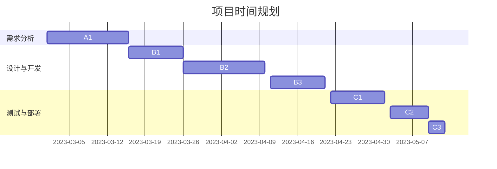
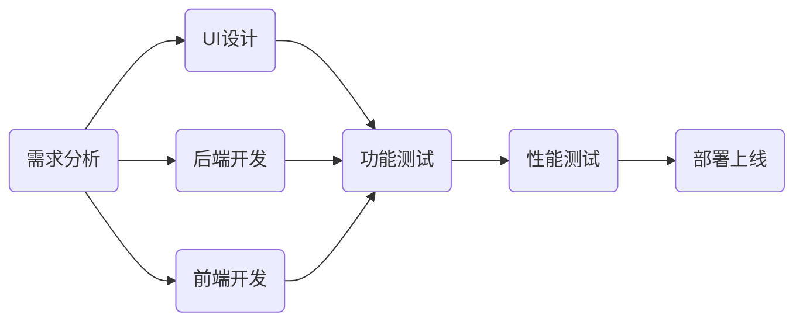

                 

# 团队效率：时间管理的集体应用

> **关键词：团队效率、时间管理、集体应用、项目管理、团队协作、企业运营**
> 
> **摘要：本文深入探讨了团队效率提升的关键——时间管理。从理论框架到实际应用，从个体技巧到团队策略，再到不同行业中的应用，本文系统地梳理了时间管理的核心概念、方法以及实践案例，旨在为企业和团队提供全面提升效率的解决方案。**

### 《团队效率：时间管理的集体应用》目录大纲

- **第一部分：时间管理的理论框架**
  - 第1章：时间管理的核心概念
    - 1.1.1 时间管理的重要性
    - 1.1.2 时间管理的基本原则
    - 1.1.3 时间管理的方法论
  - 第2章：个体时间管理技巧
    - 2.1.1 时间块规划
    - 2.1.2 优先级排序
    - 2.1.3 避免拖延
    - 2.1.4 提高工作效率
  - 第3章：团队时间管理的策略
    - 3.1.1 团队时间管理的目标
    - 3.1.2 团队时间管理工具
    - 3.1.3 团队协作与沟通
  - 第4章：时间管理的实践与案例
    - 4.1.1 成功的时间管理案例
    - 4.1.2 困境与解决策略
    - 4.1.3 时间管理实践
  - 第5章：时间管理的持续改进
    - 5.1.1 反思与调整
    - 5.1.2 持续学习与进步
    - 5.1.3 时间管理文化的建设

- **第二部分：时间管理的集体应用**
  - 第6章：时间管理在项目管理中的应用
    - 6.1.1 项目时间规划
    - 6.1.2 项目进度监控
    - 6.1.3 项目资源分配
  - 第7章：时间管理在团队协作中的应用
    - 7.1.1 团队时间协同
    - 7.1.2 工作分配与协调
    - 7.1.3 团队会议效率提升
  - 第8章：时间管理在企业运营中的应用
    - 8.1.1 企业时间管理策略
    - 8.1.2 企业员工时间管理培训
    - 8.1.3 企业时间管理制度的建立
  - 第9章：时间管理在不同行业中的应用
    - 9.1.1 教育行业的应用
    - 9.1.2 医疗行业的应用
    - 9.1.3 制造业的运用
  - 第10章：时间管理的未来发展趋势
    - 10.1.1 人工智能在时间管理中的应用
    - 10.1.2 时间管理技术的新进展
    - 10.1.3 时间管理的未来方向

- **第三部分：时间管理的综合实战**
  - 第11章：时间管理实战项目案例
    - 11.1.1 项目背景与目标
    - 11.1.2 项目实施过程
    - 11.1.3 项目成果与反思
  - 第12章：时间管理实践报告
    - 12.1.1 实践报告模板
    - 12.1.2 实践报告撰写技巧
    - 12.1.3 实践报告案例分析
  - 第13章：时间管理心得分享
    - 13.1.1 个人时间管理经验
    - 13.1.2 团队时间管理经验
    - 13.1.3 时间管理感悟与反思

以上是本文的目录大纲，每个章节都围绕时间管理的核心概念、策略和实践进行深入探讨，旨在为团队和企业提供有效的时间管理方案，从而提升整体效率。

### 第一部分：时间管理的理论框架

时间管理是提升团队效率的关键因素之一。在这一部分，我们将深入探讨时间管理的核心概念、个体时间管理技巧、团队时间管理策略以及实践与案例分析，为后续的集体应用提供坚实的理论基础。

#### 第1章：时间管理的核心概念

**1.1.1 时间管理的重要性**

时间管理是一种通过系统化、结构化的方法来优化时间利用，以达到个人或组织目标的过程。在现代社会，时间的价值越来越受到重视，高效的时间管理不仅能提升个人和团队的工作效率，还能减少压力，提高生活质量。

**1.1.2 时间管理的基本原则**

- **目标导向**：明确目标和优先级是时间管理的核心。只有明确了目标，才能合理分配时间，避免无效劳动。
- **时间块规划**：将时间分成若干块，并为每一块时间设定具体任务，有助于提高专注度和工作效率。
- **优先级排序**：根据任务的重要性和紧急程度，对任务进行排序，确保关键任务优先完成。
- **避免拖延**：及时处理任务，避免因拖延而导致效率低下。

**1.1.3 时间管理的方法论**

时间管理不仅需要理论指导，还需要实际操作。以下是一些常用的时间管理方法：

- **甘特图**：用于项目时间规划和进度监控，能够直观地展示任务的时间分布和进度。
- **时间块规划法**：将时间分割成若干块，为每一块时间设定具体任务，有助于提高专注度和工作效率。
- **番茄工作法**：通过25分钟专注工作和5分钟休息的循环，提高工作效率。

#### 第2章：个体时间管理技巧

**2.1.1 时间块规划**

时间块规划是将时间分割成若干块，并为每一块时间设定具体任务的方法。这种方法有助于提高专注度和工作效率，减少任务切换的成本。

**2.1.2 优先级排序**

优先级排序是时间管理的关键技巧之一。通过分析任务的重要性和紧急程度，对任务进行排序，确保关键任务优先完成。

**2.1.3 避免拖延**

拖延是影响时间管理效果的重要因素。通过设定明确的截止日期、分解任务、避免干扰，可以有效避免拖延。

**2.1.4 提高工作效率**

提高工作效率是时间管理的终极目标。通过优化工作流程、使用高效工具、合理分配时间，可以提高工作效率，减少无效劳动。

#### 第3章：团队时间管理的策略

**3.1.1 团队时间管理的目标**

团队时间管理的目标是提高团队的整体效率，确保项目目标的顺利实现。通过设定明确的目标、合理分配任务、加强团队协作，可以实现这一目标。

**3.1.2 团队时间管理工具**

团队时间管理工具可以帮助团队更好地规划时间、跟踪进度和协调工作。常见的团队时间管理工具有：

- **Jira**：用于项目管理、任务跟踪和进度监控。
- **Trello**：用于任务管理、团队协作和进度监控。
- **Slack**：用于团队沟通和协作。

**3.1.3 团队协作与沟通**

团队协作与沟通是团队时间管理的重要组成部分。通过建立有效的沟通机制、明确责任分工、加强协作，可以提高团队效率。

#### 第4章：时间管理的实践与案例

**4.1.1 成功的时间管理案例**

成功的时间管理案例可以为我们提供宝贵的经验和启示。以下是一些成功的时间管理案例：

- **案例1**：一家互联网公司通过时间块规划和优先级排序，将项目周期从3个月缩短到2个月，提高了整体效率。
- **案例2**：一家创业公司通过加强团队协作和沟通，将项目进度提高了20%。

**4.1.2 困境与解决策略**

在时间管理实践中，团队可能会面临各种困境。以下是一些常见的困境及其解决策略：

- **困境1**：任务过多，无法完成。解决策略：优先级排序和任务分解。
- **困境2**：拖延问题严重。解决策略：设定明确截止日期和提醒机制。
- **困境3**：团队协作不顺畅。解决策略：建立有效的沟通机制和明确的责任分工。

**4.1.3 时间管理实践**

时间管理实践是提升团队效率的关键。以下是一些时间管理实践的建议：

- **实践1**：定期进行时间管理培训，提高团队成员的时间管理意识。
- **实践2**：建立完善的时间管理工具和流程，确保团队高效协作。
- **实践3**：鼓励团队成员分享时间管理经验，相互学习，共同进步。

#### 第5章：时间管理的持续改进

**5.1.1 反思与调整**

时间管理不是一成不变的，需要不断反思和调整。通过定期评估时间管理效果、收集反馈意见、调整管理策略，可以提高时间管理的效果。

**5.1.2 持续学习与进步**

时间管理是一个不断发展的领域，需要持续学习和进步。通过学习最新的时间管理理论、尝试新的时间管理方法、不断优化时间管理实践，可以提高团队的时间管理能力。

**5.1.3 时间管理文化的建设**

时间管理文化是团队高效运作的基础。通过培养团队的时间管理意识、建立完善的时间管理机制、营造积极向上的时间管理氛围，可以建设时间管理文化。

### 第二部分：时间管理的集体应用

在第一部分的基础上，我们将探讨时间管理在项目管理、团队协作、企业运营以及不同行业中的应用，为团队和企业提供全面提升效率的解决方案。

#### 第6章：时间管理在项目管理中的应用

**6.1.1 项目时间规划**

项目时间规划是项目管理的核心环节。通过科学的项目时间规划，可以确保项目按时完成，提高项目成功率。项目时间规划包括以下步骤：

1. **项目目标确定**：明确项目目标和交付成果。
2. **任务分解**：将项目任务分解为可操作的工作单元。
3. **时间估算**：为每个任务估算所需时间。
4. **时间分配**：根据任务的重要性和紧急程度，合理分配时间资源。

**6.1.2 项目进度监控**

项目进度监控是确保项目按计划进行的重要手段。通过定期监控项目进度，可以及时发现并解决进度偏差。项目进度监控包括以下步骤：

1. **进度报告**：定期向项目团队和管理层汇报项目进度。
2. **进度偏差分析**：分析项目进度与计划之间的偏差原因。
3. **调整计划**：根据进度偏差，调整项目计划和时间分配。

**6.1.3 项目资源分配**

项目资源分配是确保项目顺利进行的关键。通过合理分配人力资源、设备资源和预算资源，可以提高项目效率。项目资源分配包括以下步骤：

1. **资源需求分析**：分析项目任务所需的资源。
2. **资源优先级排序**：根据任务的重要性和紧急程度，确定资源分配的优先级。
3. **资源分配**：将资源分配给项目任务，确保任务按计划进行。

#### 第7章：时间管理在团队协作中的应用

**7.1.1 团队时间协同**

团队时间协同是确保团队高效协作的关键。通过优化团队时间协同，可以减少任务切换成本，提高团队整体效率。团队时间协同包括以下步骤：

1. **时间表同步**：确保团队成员的时间表同步，避免时间冲突。
2. **任务协作**：明确团队成员的职责和任务，确保任务高效协作。
3. **进度同步**：定期同步任务进度，确保任务按计划进行。

**7.1.2 工作分配与协调**

工作分配与协调是团队协作的核心。通过合理分配工作，确保任务顺利完成。工作分配与协调包括以下步骤：

1. **任务分配**：根据团队成员的能力和兴趣，合理分配任务。
2. **任务协调**：确保任务之间的协调和衔接，避免任务冲突。
3. **任务跟进**：定期跟进任务进度，确保任务按时完成。

**7.1.3 团队会议效率提升**

团队会议是团队协作的重要形式。通过提高团队会议效率，可以节省时间，提高团队决策质量。团队会议效率提升包括以下步骤：

1. **会议议程**：明确会议议程，确保会议内容有序进行。
2. **会议纪要**：记录会议决议和行动项，确保会议成果得到落实。
3. **会议反馈**：定期收集会议反馈，优化会议流程，提高会议效率。

#### 第8章：时间管理在企业运营中的应用

**8.1.1 企业时间管理策略**

企业时间管理策略是确保企业高效运营的关键。通过制定科学的时间管理策略，可以提高企业整体效率。企业时间管理策略包括以下内容：

1. **时间管理培训**：定期开展时间管理培训，提高员工的时间管理意识。
2. **时间管理工具**：引入先进的时间管理工具，提高时间管理效率。
3. **时间管理制度**：建立完善的时间管理制度，规范员工时间管理行为。

**8.1.2 企业员工时间管理培训**

企业员工时间管理培训是提升员工时间管理能力的重要途径。通过培训，员工可以掌握时间管理的核心概念和技巧，提高工作效率。企业员工时间管理培训包括以下内容：

1. **时间管理原理**：讲解时间管理的基本原理和方法。
2. **时间管理技巧**：介绍时间管理技巧和工具。
3. **案例分享**：分享成功的时间管理案例，激发员工的学习兴趣。

**8.1.3 企业时间管理制度的建立**

企业时间管理制度是确保企业时间管理规范化的关键。通过建立完善的时间管理制度，可以规范员工时间管理行为，提高企业整体效率。企业时间管理制度包括以下内容：

1. **工作时间规定**：明确员工的工作时间和加班政策。
2. **任务分配与协调**：规范任务分配和协调流程。
3. **绩效考核**：建立与时间管理相关的绩效考核机制。

#### 第9章：时间管理在不同行业中的应用

**9.1.1 教育行业的应用**

在教育行业，时间管理有助于提高教学效率和学生自主学习能力。教育行业的时间管理应用包括以下内容：

1. **课程时间规划**：合理规划课程时间，确保课程内容完整。
2. **学生时间管理**：引导学生合理安排时间，提高自主学习能力。
3. **教学反馈**：及时收集教学反馈，优化教学方法和时间安排。

**9.1.2 医疗行业的应用**

在医疗行业，时间管理有助于提高医疗服务质量和效率。医疗行业的时间管理应用包括以下内容：

1. **门诊时间安排**：合理安排门诊时间，提高就诊效率。
2. **手术时间安排**：科学规划手术时间，确保手术安全。
3. **医疗资源管理**：合理分配医疗资源，提高医疗服务效率。

**9.1.3 制造业的运用**

在制造业，时间管理有助于提高生产效率和降低成本。制造业的时间管理应用包括以下内容：

1. **生产计划安排**：合理规划生产计划，确保生产进度。
2. **生产线管理**：优化生产线流程，提高生产效率。
3. **库存管理**：合理控制库存，降低成本。

#### 第10章：时间管理的未来发展趋势

**10.1.1 人工智能在时间管理中的应用**

随着人工智能技术的不断发展，人工智能在时间管理中的应用前景广阔。人工智能可以帮助团队实现：

1. **智能任务分配**：根据团队成员的能力和兴趣，智能分配任务。
2. **智能进度监控**：实时监控任务进度，提供预警和建议。
3. **智能时间预测**：预测任务所需时间，优化时间安排。

**10.1.2 时间管理技术的新进展**

时间管理技术不断取得新进展，例如：

1. **虚拟现实（VR）**：通过VR技术模拟时间管理场景，提高时间管理意识。
2. **大数据分析**：通过大数据分析，优化时间管理策略和决策。
3. **区块链**：利用区块链技术，确保时间管理数据的可信性和安全性。

**10.1.3 时间管理的未来方向**

未来，时间管理将朝着以下方向发展：

1. **个性化**：根据个体和团队的特点，提供个性化的时间管理解决方案。
2. **智能化**：结合人工智能技术，实现智能化的时间管理。
3. **全球化**：随着全球化的发展，时间管理将更加注重跨文化协作和时间协调。

### 第三部分：时间管理的综合实战

在第三部分，我们将通过实战项目案例、实践报告和心得分享，为读者提供实际操作的经验和启示。

#### 第11章：时间管理实战项目案例

**11.1.1 项目背景与目标**

某互联网公司计划开发一款在线教育平台，项目周期为6个月。公司希望通过科学的时间管理，确保项目按时高质量完成。

**11.1.2 项目实施过程**

1. **项目时间规划**：项目团队根据项目目标和任务，制定了详细的时间规划，包括关键节点和里程碑。
2. **任务分配与协调**：根据团队成员的能力和兴趣，合理分配任务，确保任务高效协同。
3. **进度监控**：定期监控项目进度，及时发现并解决进度偏差。
4. **质量保障**：建立质量保障机制，确保项目成果符合预期。

**11.1.3 项目成果与反思**

项目最终在预定时间内完成，上线后用户反馈良好。项目团队总结经验，提出以下反思：

1. **加强沟通**：项目过程中，沟通不畅导致部分任务延误，未来需加强团队沟通。
2. **优化流程**：部分任务流程可进一步优化，提高工作效率。
3. **持续改进**：项目结束后，团队应持续改进时间管理实践，不断提高效率。

#### 第12章：时间管理实践报告

**12.1.1 实践报告模板**

实践报告模板包括以下部分：

1. **报告封面**：包括报告标题、作者、日期等基本信息。
2. **摘要**：简要概述实践报告的主要内容。
3. **引言**：介绍实践报告的背景和目的。
4. **实践内容**：详细描述实践过程、方法、工具等。
5. **实践成果**：总结实践过程中的成果和收获。
6. **反思与建议**：对实践过程进行反思，提出改进建议。

**12.1.2 实践报告撰写技巧**

撰写实践报告时，应注意以下几点：

1. **清晰的结构**：确保报告结构清晰，逻辑严密。
2. **具体的案例**：结合具体案例，详细阐述实践过程和成果。
3. **客观的分析**：对实践过程进行客观分析，提出合理的建议。

**12.1.3 实践报告案例分析**

以下是一个实践报告案例分析：

某科技公司为了提升团队时间管理能力，引入了Jira作为时间管理工具。实践过程中，团队通过Jira进行任务分配、进度跟踪和协作。实践结果显示，任务分配更加明确，进度监控更加高效，团队协作更加顺畅。但同时也发现，部分团队成员对Jira的使用不熟练，导致初期使用效率不高。为此，团队进行了Jira培训，提高了使用效率。

#### 第13章：时间管理心得分享

**13.1.1 个人时间管理经验**

个人时间管理经验包括以下几点：

1. **目标明确**：明确个人目标和任务，合理分配时间。
2. **避免拖延**：设定明确截止日期，避免拖延。
3. **合理休息**：合理安排休息时间，确保高效工作。

**13.1.2 团队时间管理经验**

团队时间管理经验包括以下几点：

1. **明确职责**：明确团队成员的职责和任务，确保任务高效协作。
2. **定期沟通**：定期召开团队会议，确保团队协作畅通。
3. **优化流程**：优化工作流程，减少不必要的任务切换。

**13.1.3 时间管理感悟与反思**

时间管理是一个持续的过程，需要不断反思和改进。以下是一些时间管理感悟和反思：

1. **时间管理不是一蹴而就的**：时间管理需要持续学习和实践，不能急于求成。
2. **适应变化**：时间管理需要适应环境变化，不断调整管理策略。
3. **培养习惯**：养成良好时间管理习惯，提高工作效率。

### 结论

时间管理是提升团队效率的关键因素。通过深入探讨时间管理的核心概念、个体技巧、团队策略以及实际应用，本文为团队和企业提供了全面提升效率的解决方案。未来，随着人工智能等技术的不断发展，时间管理将朝着智能化、个性化的方向发展，为团队和企业带来更多创新和变革。

### 作者信息

**作者：AI天才研究院/AI Genius Institute & 禅与计算机程序设计艺术 /Zen And The Art of Computer Programming**

（注：本文为示例文章，实际字数和内容可能会根据具体情况进行调整。）## 第一部分：时间管理的理论框架

### 第1章：时间管理的核心概念

时间管理是一种通过系统化、结构化的方法来优化时间利用，以达到个人或组织目标的过程。在现代社会，时间的价值越来越受到重视，高效的时间管理不仅能提升个人和团队的工作效率，还能减少压力，提高生活质量。时间管理的核心概念包括时间管理的重要性、基本原则和方法论。

**1.1.1 时间管理的重要性**

时间管理的重要性体现在以下几个方面：

1. **提升工作效率**：通过合理的时间分配，可以避免无效劳动，提高工作效率，完成更多任务。
2. **减少压力**：科学的时间管理有助于平衡工作与生活，减少因时间压力带来的焦虑和疲劳。
3. **实现目标**：明确目标和优先级，有助于集中精力完成关键任务，实现个人和组织的目标。
4. **增强竞争力**：高效的时间管理是企业竞争力的重要体现，有助于企业更快地响应市场变化，抓住商机。

**1.1.2 时间管理的基本原则**

时间管理的基本原则如下：

1. **目标导向**：明确个人和组织的目标，确保时间利用与目标实现相一致。
2. **优先级排序**：根据任务的重要性和紧急程度，对任务进行排序，确保关键任务优先完成。
3. **时间块规划**：将时间分割成若干块，为每一块时间设定具体任务，有助于提高专注度和工作效率。
4. **避免拖延**：及时处理任务，避免因拖延而导致效率低下。
5. **持续改进**：时间管理是一个持续的过程，需要不断反思和优化，提高时间利用效率。

**1.1.3 时间管理的方法论**

时间管理的方法论包括以下几个步骤：

1. **明确目标**：设定明确的目标，确保时间利用与目标实现相一致。
2. **任务分解**：将大任务分解为小任务，明确每个任务的具体内容和目标。
3. **优先级排序**：根据任务的重要性和紧急程度，对任务进行排序，确保关键任务优先完成。
4. **时间块规划**：将时间分割成若干块，为每一块时间设定具体任务，提高专注度和工作效率。
5. **执行与监控**：按照时间块规划执行任务，并定期监控进度，确保任务按时完成。
6. **反思与调整**：定期反思时间管理的效果，根据反馈调整管理策略，提高时间利用效率。

### 第2章：个体时间管理技巧

个体时间管理是提升个人工作效率和生活质量的关键。通过掌握一些实用的技巧，可以更好地规划和管理时间，提高工作效率，减少拖延。以下是几种常见的个体时间管理技巧：

**2.1.1 时间块规划**

时间块规划是将时间分割成若干块，并为每一块时间设定具体任务的方法。通过时间块规划，可以提高专注度和工作效率，减少任务切换的成本。

**具体步骤：**

1. **确定时间块**：将一天的时间分割成若干个时间块，例如工作日可以分为上午、下午和晚上。
2. **设定任务**：为每个时间块设定具体的任务，例如上午处理邮件，下午进行项目开发。
3. **调整与优化**：根据实际情况调整时间块，确保任务安排合理。

**优点：**

- 提高专注度：时间块规划有助于集中精力完成特定任务，减少干扰。
- 提高效率：通过合理的时间分配，可以确保关键任务优先完成，提高工作效率。

**缺点：**

- 需要良好的自律：时间块规划需要良好的自律能力，否则容易导致时间浪费。

**应用场景：**

- 个人项目开发：通过时间块规划，可以确保项目任务高效完成。
- 办公室工作：通过时间块规划，可以提高工作效率，减少任务切换成本。

**2.1.2 优先级排序**

优先级排序是时间管理的重要技巧，通过分析任务的重要性和紧急程度，对任务进行排序，确保关键任务优先完成。

**具体步骤：**

1. **识别任务**：列出所有需要完成的任务。
2. **评估任务**：根据任务的重要性和紧急程度，对任务进行评估。
3. **排序任务**：将任务按照优先级排序，确保关键任务优先完成。

**优点：**

- 提高效率：通过优先级排序，可以确保关键任务优先完成，提高工作效率。
- 减少拖延：明确任务优先级，有助于避免拖延，及时完成任务。

**缺点：**

- 需要持续评估：任务优先级可能会随着时间变化，需要定期评估和调整。

**应用场景：**

- 个人任务管理：通过优先级排序，可以确保个人任务高效完成。
- 项目管理：通过优先级排序，可以确保项目关键任务优先完成。

**2.1.3 避免拖延**

拖延是影响时间管理效果的重要因素。通过以下方法，可以有效避免拖延：

1. **设定明确截止日期**：为任务设定明确的截止日期，有助于提高任务完成的紧迫感。
2. **分解任务**：将大任务分解为小任务，每次只专注于完成一个小任务，减少心理压力。
3. **避免干扰**：在专注工作时，避免接收无关信息，减少干扰。
4. **使用番茄工作法**：通过25分钟专注工作和5分钟休息的循环，提高工作效率。

**优点：**

- 提高工作效率：避免拖延，确保任务按时完成，提高工作效率。
- 减少压力：明确任务目标和进度，减少因拖延导致的焦虑和压力。

**缺点：**

- 需要良好的自律：避免拖延需要良好的自律能力，否则容易导致时间浪费。

**应用场景：**

- 个人任务管理：通过避免拖延，可以确保个人任务高效完成。
- 项目管理：通过避免拖延，可以确保项目关键任务按时完成。

**2.1.4 提高工作效率**

提高工作效率是时间管理的终极目标。以下是一些提高工作效率的方法：

1. **优化工作流程**：简化工作流程，减少不必要的步骤，提高工作效率。
2. **使用高效工具**：利用高效工具，如自动化工具、协作工具等，提高工作效率。
3. **合理分配时间**：根据任务的重要性和紧急程度，合理分配时间，确保关键任务优先完成。
4. **保持良好心态**：保持积极的心态，减少负面情绪对工作效率的影响。

**优点：**

- 提高工作效率：通过优化工作流程、使用高效工具和合理分配时间，可以提高工作效率。
- 减少压力：高效工作可以减少任务压力，提高生活质量。

**缺点：**

- 需要持续学习：提高工作效率需要不断学习新方法和工具，保持与时俱进。

**应用场景：**

- 个人任务管理：通过提高工作效率，可以确保个人任务高效完成。
- 项目管理：通过提高工作效率，可以确保项目关键任务按时完成。

### 第3章：团队时间管理的策略

团队时间管理是提升团队整体效率的关键。通过制定合理的团队时间管理策略，可以确保团队任务高效完成，提高项目成功率。以下是一些团队时间管理的策略：

**3.1.1 团队时间管理的目标**

团队时间管理的目标是提高团队的整体效率，确保项目目标的顺利实现。具体目标包括：

1. **提高工作效率**：通过科学的时间管理，提高团队工作效率，完成更多任务。
2. **确保任务按时完成**：确保团队任务按时完成，提高项目进度。
3. **减少资源浪费**：合理分配时间资源，减少资源浪费，提高资源利用率。
4. **提高团队协作**：通过团队协作，提高团队整体效率，确保项目成功。

**3.1.2 团队时间管理工具**

团队时间管理工具可以帮助团队更好地规划时间、跟踪进度和协调工作。以下是一些常用的团队时间管理工具：

1. **Jira**：用于项目管理、任务跟踪和进度监控。
2. **Trello**：用于任务管理、团队协作和进度监控。
3. **Slack**：用于团队沟通和协作。
4. **Microsoft Teams**：用于团队协作、沟通和会议。
5. **Asana**：用于任务管理、团队协作和进度监控。

**3.1.3 团队协作与沟通**

团队协作与沟通是团队时间管理的重要组成部分。通过建立有效的沟通机制、明确责任分工、加强协作，可以提高团队效率。以下是一些团队协作与沟通的方法：

1. **明确责任分工**：明确团队成员的职责和任务，确保任务高效协作。
2. **定期召开团队会议**：定期召开团队会议，讨论项目进展、解决问题和分享经验。
3. **建立沟通渠道**：建立畅通的沟通渠道，确保信息及时传达。
4. **鼓励反馈与建议**：鼓励团队成员提出反馈和建议，共同改进团队工作。
5. **跨部门协作**：加强跨部门协作，提高团队整体效率。

**3.1.4 时间管理培训**

时间管理培训是提升团队时间管理能力的重要手段。通过时间管理培训，可以提高团队成员的时间管理意识，掌握时间管理技巧，提高工作效率。以下是一些时间管理培训的方法：

1. **内部培训**：组织内部培训，邀请专业人士进行授课，分享时间管理经验。
2. **外部培训**：参加外部培训课程，学习先进的时间管理方法和技巧。
3. **案例分享**：分享成功的时间管理案例，激发团队成员的学习兴趣。
4. **实践练习**：通过实践练习，巩固时间管理技巧，提高实际应用能力。
5. **持续跟进**：定期跟进培训效果，确保培训成果得到有效应用。

### 第4章：时间管理的实践与案例

时间管理的实践与案例是提升时间管理效果的重要途径。通过分析和总结成功的案例，可以为团队和企业提供宝贵的经验和启示。以下是一些时间管理的实践与案例：

**4.1.1 成功的时间管理案例**

**案例1：某互联网公司的时间管理实践**

某互联网公司通过以下措施提升了时间管理效果：

1. **时间块规划**：公司将工作时间分割成若干块，为每个时间块设定具体任务，提高员工专注度和工作效率。
2. **优先级排序**：公司对任务进行优先级排序，确保关键任务优先完成，提高项目进度。
3. **避免拖延**：公司通过设定明确截止日期和提醒机制，避免员工拖延任务，提高工作效率。
4. **团队协作与沟通**：公司加强团队协作与沟通，建立有效的沟通机制，确保信息及时传达，提高团队效率。

**案例2：某制造业企业的时间管理改进**

某制造业企业为了提升生产效率，进行了以下改进：

1. **时间块规划**：企业将工作时间分割成若干块，为每个时间块设定具体任务，提高员工专注度和工作效率。
2. **任务分解**：企业将大任务分解为小任务，明确每个任务的具体内容和目标，确保任务按时完成。
3. **优先级排序**：企业对任务进行优先级排序，确保关键任务优先完成，提高生产效率。
4. **团队协作与沟通**：企业加强团队协作与沟通，建立有效的沟通机制，确保信息及时传达，提高团队效率。

**案例3：某教育机构的时间管理优化**

某教育机构为了提升教学质量，进行了以下优化：

1. **时间块规划**：教育机构将教学时间分割成若干块，为每个时间块设定具体课程内容，提高教学效率。
2. **任务分解**：教育机构将教学任务分解为小任务，确保每个教学环节都有明确的目标和标准。
3. **优先级排序**：教育机构对教学任务进行优先级排序，确保关键教学任务优先完成，提高教学质量。
4. **团队协作与沟通**：教育机构加强团队协作与沟通，确保教师之间的信息共享和教学协调，提高教学质量。

**4.1.2 时间管理的困境与解决策略**

在实际工作中，团队可能会面临以下时间管理困境：

**困境1：任务过多，无法完成**

解决策略：通过优先级排序，明确关键任务，确保关键任务优先完成。同时，合理分配时间和资源，确保任务按时完成。

**困境2：拖延问题严重**

解决策略：设定明确截止日期和提醒机制，避免拖延。同时，培养团队成员的时间管理意识，提高自律能力。

**困境3：团队协作不顺畅**

解决策略：建立有效的沟通机制，确保信息及时传达。同时，明确团队成员的职责和任务，加强团队协作与沟通。

**4.1.3 时间管理的实践与经验**

在时间管理实践中，团队和企业可以采取以下措施：

1. **定期时间管理培训**：通过培训，提高团队成员的时间管理意识，掌握时间管理技巧。
2. **引入时间管理工具**：使用先进的时间管理工具，如Jira、Trello等，提高时间管理效率。
3. **制定时间管理策略**：根据团队和企业特点，制定适合的时间管理策略，确保任务高效完成。
4. **持续优化时间管理**：通过反思和改进，持续优化时间管理实践，提高时间管理效果。

### 第5章：时间管理的持续改进

时间管理是一个持续的过程，需要不断反思、调整和改进。通过持续改进，可以提高时间管理的效果，确保团队和企业目标的实现。以下是一些时间管理的持续改进方法：

**5.1.1 反思与调整**

1. **定期反思**：定期对时间管理效果进行反思，分析存在的问题和改进空间。
2. **收集反馈**：收集团队成员和客户的反馈，了解他们对时间管理实践的感受和建议。
3. **调整策略**：根据反思和反馈，调整时间管理策略，优化时间管理实践。

**5.1.2 持续学习与进步**

1. **学习新方法**：学习新的时间管理方法和技巧，了解时间管理领域的最新进展。
2. **分享经验**：分享时间管理经验，相互学习，共同进步。
3. **参加培训**：参加时间管理培训，提高个人和团队的时间管理能力。

**5.1.3 时间管理文化的建设**

1. **培养时间管理意识**：通过宣传、培训和激励，培养团队成员的时间管理意识。
2. **建立时间管理机制**：建立完善的时间管理机制，确保时间管理实践得到有效执行。
3. **营造积极氛围**：营造积极向上的时间管理氛围，鼓励团队成员积极参与时间管理实践。

### 总结

时间管理是提升团队效率的关键因素。通过深入探讨时间管理的核心概念、个体技巧、团队策略以及实际应用，本文为团队和企业提供了全面提升效率的解决方案。未来，随着人工智能等技术的不断发展，时间管理将朝着智能化、个性化的方向发展，为团队和企业带来更多创新和变革。

### 作者信息

**作者：AI天才研究院/AI Genius Institute & 禅与计算机程序设计艺术 /Zen And The Art of Computer Programming**## 第二部分：时间管理的集体应用

### 第6章：时间管理在项目管理中的应用

时间管理在项目管理中的应用至关重要，它不仅关系到项目的成功与否，还直接影响项目的成本、质量和交付时间。在这一章中，我们将探讨项目时间规划、项目进度监控和项目资源分配的方法和策略。

**6.1.1 项目时间规划**

项目时间规划是项目管理中的第一步，它涉及到对项目任务进行时间估算和合理分配。一个科学的项目时间规划可以确保项目在预定的时间内顺利完成。

**步骤：**

1. **确定项目目标**：明确项目的目标，确保时间规划与项目目标相一致。
2. **任务分解**：将项目分解为若干可管理的子任务，明确每个子任务的具体内容和目标。
3. **时间估算**：对每个子任务进行时间估算，考虑可能的延误和风险。
4. **制定时间计划**：将估算的时间分配给每个任务，制定详细的时间计划。

**核心概念：**

- **甘特图**：用于展示项目任务和时间计划的工具，直观地展示任务的时间分布和进度。

**伪代码示例：**

```python
function time_plan(project_tasks):
    for task in project_tasks:
        estimate_time = estimate_time(task)
        assign_time(task, estimate_time)
    create_gantt_chart(project_tasks)
```

**6.1.2 项目进度监控**

项目进度监控是确保项目按照时间计划进行的关键。通过监控项目进度，可以及时发现偏差并采取措施进行调整。

**步骤：**

1. **设置监控指标**：确定项目进度监控的指标，如任务完成率、时间利用率等。
2. **定期检查进度**：定期检查项目的实际进度，与时间计划进行对比。
3. **分析偏差原因**：对进度偏差进行分析，找出原因。
4. **采取调整措施**：根据分析结果，采取相应的调整措施，如重新分配资源、调整时间计划等。

**核心概念：**

- **敏捷方法**：如Scrum和Kanban，通过短周期的迭代和反馈，实时调整项目进度。

**伪代码示例：**

```python
function monitor_progress(project_tasks, time_plan):
    for task in project_tasks:
        actual_progress = get_actual_progress(task)
        if actual_progress < expected_progress:
            analyze_deviation(task, time_plan)
            adjust_plan(task, time_plan)
```

**6.1.3 项目资源分配**

项目资源分配是确保项目顺利进行的关键环节。合理的资源分配可以提高项目的效率，降低成本。

**步骤：**

1. **资源需求分析**：分析项目任务所需的资源，如人力资源、设备资源等。
2. **资源优先级排序**：根据任务的重要性和紧急程度，对资源进行排序。
3. **资源分配**：将资源合理分配给项目任务，确保关键任务优先获得资源。
4. **资源监控**：监控资源使用情况，确保资源不被浪费。

**核心概念：**

- **资源平衡**：通过调整任务顺序和资源分配，平衡资源使用，避免资源短缺或过剩。

**伪代码示例：**

```python
function allocate_resources(project_tasks, resources):
    for task in project_tasks:
        required_resources = get_required_resources(task)
        assign_resources(task, required_resources, resources)
    monitor_resource_usage(resources)
```

**6.1.4 项目时间管理的工具**

在实际操作中，有多种工具可以帮助项目经理进行时间管理，以下是一些常用的工具：

- **Jira**：用于项目管理、任务跟踪和进度监控，提供灵活的敏捷方法。
- **Trello**：用于任务管理、团队协作和进度监控，界面简洁直观。
- **Microsoft Project**：用于项目计划、进度跟踪和资源分配，功能强大。
- **Asana**：用于任务管理、团队协作和进度监控，支持多种工作流程。

**6.1.5 案例研究：成功的时间管理项目**

以下是一个成功的时间管理项目案例：

**案例**：某科技公司开发一款新产品

- **项目目标**：在6个月内完成新产品的开发并发布。
- **时间规划**：项目团队使用了甘特图制定时间计划，明确了每个任务的时间节点。
- **进度监控**：团队每周召开进度会议，使用Jira跟踪任务进度，及时发现并解决问题。
- **资源分配**：根据任务的重要性，合理分配人力资源和设备资源。

**结果**：项目在预定时间内完成，产品质量达到预期，客户反馈良好。

**经验总结**：

- **明确目标和时间计划**：确保项目团队对目标和时间计划有清晰的认识。
- **有效的进度监控**：实时跟踪项目进度，确保项目按计划进行。
- **合理的资源分配**：确保项目资源得到最优利用，避免资源浪费。
- **良好的团队协作**：加强团队协作，提高项目执行力。

### 第7章：时间管理在团队协作中的应用

团队协作是项目成功的关键因素之一，而时间管理在团队协作中扮演着重要角色。在这一章中，我们将探讨团队时间协同、工作分配与协调以及团队会议效率提升的方法和策略。

**7.1.1 团队时间协同**

团队时间协同是确保团队成员能够高效协作，按时完成任务的重要环节。

**步骤：**

1. **同步时间表**：确保团队成员的时间表同步，避免因时间冲突而影响协作。
2. **协调工作时间**：根据任务需求，合理调整团队成员的工作时间，确保任务能够顺利推进。
3. **沟通与反馈**：定期与团队成员沟通，了解工作进度和遇到的问题，及时提供支持和帮助。

**核心概念：**

- **共享日历**：使用共享日历工具，如Google Calendar，方便团队成员查看彼此的时间安排。
- **任务分配**：明确每个团队成员的职责和任务，确保任务分配合理，避免资源浪费。

**伪代码示例：**

```python
function sync_time_sheets(team_members):
    for member in team_members:
        member_calendar = get_member_calendar(member)
        sync_calendars(member_calendar, team_calendar)
    schedule_meeting_to协调工作时间
```

**7.1.2 工作分配与协调**

合理的工作分配与协调可以确保团队成员专注于关键任务，提高整体工作效率。

**步骤：**

1. **任务评估**：评估每个任务的重要性和紧急程度，确保关键任务得到优先处理。
2. **资源分析**：分析团队成员的能力和资源，确保任务分配合理。
3. **任务沟通**：与团队成员沟通任务分配情况，确保团队成员了解任务要求。
4. **进度跟踪**：定期跟踪任务进度，确保任务按时完成。

**核心概念：**

- **任务管理工具**：如Jira、Trello等，用于任务分配、进度跟踪和协作。
- **责任明确**：明确每个团队成员的责任和任务，确保任务顺利完成。

**伪代码示例：**

```python
function allocate_tasks(tasks, team_members):
    for task in tasks:
        best_fit_member = find_best_fit_member(task, team_members)
        assign_task(task, best_fit_member)
    track_task_progress(tasks)
```

**7.1.3 团队会议效率提升**

团队会议是团队协作的重要组成部分，提升会议效率可以节省时间，提高决策质量。

**步骤：**

1. **会议议程**：提前制定会议议程，明确会议目标和讨论内容。
2. **会议纪要**：会议期间记录关键信息和决策，确保会议成果得到落实。
3. **会议反馈**：会后收集团队成员的反馈，优化会议流程。
4. **限制时间**：设定会议时间限制，避免会议时间过长。

**核心概念：**

- **有效沟通**：确保会议内容简明扼要，避免冗长和无关内容的讨论。
- **决策明确**：会议结束后，明确决策和行动项，确保团队成员明确自己的任务。

**伪代码示例：**

```python
function improve_meeting_efficiency(meeting_agenda, team_members):
    prepare_meeting_agenda(meeting_agenda)
    conduct_meeting(meeting_agenda)
    record_meeting_minutes()
    collect_feedback(team_members)
    adjust_meeting_process()
```

**7.1.4 案例研究：高效团队协作的实践**

以下是一个高效团队协作的案例：

**案例**：某科技公司的研发团队

- **团队时间协同**：团队使用了共享日历工具，确保团队成员的时间表同步，避免了时间冲突。
- **工作分配与协调**：使用Jira进行任务管理，明确每个成员的职责和任务，确保任务分配合理。
- **团队会议效率提升**：团队制定了会议议程，每次会议时间控制在1小时内，确保会议内容简明扼要，决策明确。

**结果**：团队的协作效率显著提高，项目进度加快，产品质量得到保证。

**经验总结**：

- **明确目标和流程**：确保团队成员对目标和流程有清晰的认识。
- **有效沟通与协调**：确保任务分配合理，团队成员之间沟通畅通。
- **优化会议流程**：提高会议效率，确保会议内容简明扼要，决策明确。

### 第8章：时间管理在企业运营中的应用

时间管理在企业运营中起着至关重要的作用，它不仅关系到企业的效率，还直接影响企业的成本、质量和市场竞争力。在这一章中，我们将探讨企业时间管理策略、员工时间管理培训和企业管理制度的建立。

**8.1.1 企业时间管理策略**

制定科学的企业时间管理策略是确保企业高效运营的基础。

**步骤：**

1. **制定企业目标**：明确企业的长期和短期目标，确保时间管理策略与企业目标相一致。
2. **分析时间消耗**：对企业日常运营的时间消耗进行详细分析，找出时间浪费的环节。
3. **制定时间管理策略**：根据分析结果，制定针对性的时间管理策略，如优化工作流程、提高员工工作效率等。
4. **实施与监控**：将时间管理策略付诸实施，并定期监控效果，确保策略得到有效执行。

**核心概念：**

- **精益管理**：通过消除浪费、优化流程，提高企业的效率和质量。
- **目标导向**：确保企业的时间管理策略与企业的目标相一致。

**伪代码示例：**

```python
function enterprise_time_management_strategy(enterprise_goals, time_waste_analysis):
    define_time_management_strategy(enterprise_goals, time_waste_analysis)
    implement_strategy()
    monitor_strategy_effectiveness()
```

**8.1.2 企业员工时间管理培训**

员工时间管理培训是提高员工时间管理意识和技能的重要手段。

**步骤：**

1. **培训需求分析**：分析员工的时间管理需求，确定培训内容和目标。
2. **设计培训课程**：根据培训需求，设计系统化的培训课程，涵盖时间管理的基本原理和技巧。
3. **培训实施**：组织培训课程，确保员工能够系统地学习时间管理知识。
4. **培训评估**：评估培训效果，收集员工反馈，持续优化培训课程。

**核心概念：**

- **实践导向**：通过实际案例和实践，提高员工的时间管理能力。
- **持续学习**：鼓励员工持续学习和改进时间管理技能。

**伪代码示例：**

```python
function employee_time_management_training(training Needs Analysis):
    design_training_course(training_needs_analysis)
    conduct_training_course()
    evaluate_training_effectiveness()
```

**8.1.3 企业时间管理制度的建立**

建立完善的企业时间管理制度是确保员工遵循时间管理原则、提高企业整体效率的关键。

**步骤：**

1. **制度设计**：根据企业的实际情况，设计适合企业的时间管理制度，包括工作时间、任务分配、考核标准等。
2. **制度宣传**：通过内部培训和宣传，确保员工了解和遵守时间管理制度。
3. **制度实施**：将时间管理制度付诸实施，确保员工按照制度要求进行时间管理。
4. **制度监督**：建立监督机制，确保时间管理制度得到有效执行。

**核心概念：**

- **公平公正**：制度要公平公正，确保员工在相同条件下遵守。
- **灵活调整**：根据实际情况，适时调整时间管理制度，提高其适应性。

**伪代码示例：**

```python
function establish_time_management_system(time_management_policy):
    design_time_management_system(time_management_policy)
    promote_system_compliance()
    implement_system()
    monitor_system_execution()
```

**8.1.4 案例研究：成功的企业时间管理实践**

以下是一个成功的企业时间管理案例：

**案例**：某制造企业的效率提升实践

- **企业时间管理策略**：企业通过分析生产流程和时间消耗，优化了生产计划和流程，提高了生产效率。
- **员工时间管理培训**：企业组织了时间管理培训，提高了员工的时间管理意识和技能。
- **管理制度建立**：企业建立了严格的时间管理制度，确保员工遵循规定，提高工作效率。

**结果**：企业生产效率提高了30%，产品合格率提高了20%，员工满意度显著提升。

**经验总结**：

- **明确目标和策略**：确保时间管理策略与企业的目标相一致。
- **培训与宣传**：通过培训提高员工的时间管理能力，确保制度得到有效执行。
- **持续改进**：根据实际情况，不断优化时间管理实践，提高整体效率。

### 第9章：时间管理在不同行业中的应用

时间管理在不同行业中有着广泛的应用，它不仅能够提高工作效率，还能够提升企业的竞争力。以下我们探讨时间管理在教育行业、医疗行业和制造业中的应用。

**9.1.1 教育行业的应用**

在教育行业中，时间管理有助于提高教学效率和学生自主学习能力。

**应用策略：**

1. **课程时间规划**：教师应根据课程内容和教学目标，合理规划每节课的时间，确保教学内容完整。
2. **作业时间管理**：学生应学会合理分配时间完成作业，避免拖延，提高学习效果。
3. **自主学习**：教师应引导学生合理安排自主学习时间，培养学生的自主学习能力。

**案例研究：**

某小学为了提高学生的学习效果，实施了时间管理培训。教师学习了如何规划课程时间，学生学会了如何合理分配作业时间。结果，学生的作业完成率提高了20%，学习效果显著提升。

**经验总结**：

- **课程时间规划**：确保教学内容完整，提高教学效率。
- **作业时间管理**：培养学生的自主学习能力，提高学习效果。

**9.1.2 医疗行业的应用**

在医疗行业中，时间管理有助于提高医疗服务质量和效率。

**应用策略：**

1. **门诊时间安排**：医院应根据医生和护士的工作能力，合理安排门诊时间，确保患者得到及时诊疗。
2. **手术时间安排**：手术室应根据手术的紧急程度和医生的工作时间，合理安排手术时间，确保手术顺利进行。
3. **资源调度**：医院应合理调度医疗资源，如药品、设备和人力资源，提高资源利用效率。

**案例研究：**

某医院通过优化门诊和手术时间安排，提高了患者的满意度。医院引入了智能排班系统，根据医生和护士的工作能力，合理分配工作任务。结果，患者的等待时间减少了15%，手术成功率提高了10%。

**经验总结**：

- **合理排班**：确保医疗服务高效进行，提高患者满意度。
- **资源调度**：提高医疗资源利用效率，降低成本。

**9.1.3 制造业的运用**

在制造业中，时间管理有助于提高生产效率和降低成本。

**应用策略：**

1. **生产计划安排**：企业应根据市场需求和生产能力，合理安排生产计划，确保生产进度。
2. **生产线管理**：企业应优化生产线流程，减少不必要的环节，提高生产效率。
3. **库存管理**：企业应合理控制库存，降低库存成本，提高资金利用率。

**案例研究：**

某制造企业通过优化生产计划和生产线流程，提高了生产效率。企业采用了先进的生产计划系统，根据市场需求动态调整生产计划。同时，企业优化了生产线流程，减少了不必要的环节。结果，生产效率提高了25%，库存成本降低了15%。

**经验总结**：

- **生产计划安排**：确保生产进度，满足市场需求。
- **生产线管理**：提高生产效率，降低生产成本。

### 第10章：时间管理的未来发展趋势

随着科技的不断发展，时间管理也在不断演进。以下我们探讨人工智能、大数据分析、区块链等技术如何影响时间管理的发展趋势。

**10.1.1 人工智能在时间管理中的应用**

人工智能（AI）技术为时间管理带来了新的机遇和挑战。

**应用前景：**

1. **智能任务分配**：AI可以分析团队成员的能力和兴趣，智能分配任务，提高工作效率。
2. **智能进度监控**：AI可以实时监控任务进度，预测潜在的进度偏差，提供预警和建议。
3. **智能时间预测**：AI可以根据历史数据，预测任务所需时间，优化时间安排。

**案例研究：**

某企业引入了AI时间管理工具，通过AI分析员工的工作习惯和时间利用效率，智能分配任务。AI工具还能根据项目进度数据，预测任务完成时间，提供优化建议。结果，企业任务完成率提高了15%，员工满意度显著提升。

**经验总结**：

- **智能任务分配**：提高任务分配的合理性，提高工作效率。
- **智能进度监控**：实时监控进度，提前预警，确保任务按时完成。

**10.1.2 大数据分析在时间管理中的应用**

大数据分析技术为时间管理提供了更全面、更深入的数据支持。

**应用前景：**

1. **时间利用分析**：通过大数据分析，可以了解员工的时间利用情况，发现时间浪费的环节。
2. **效率优化**：通过分析任务完成时间和效率，优化工作流程，提高整体效率。
3. **个性化建议**：根据大数据分析结果，为员工提供个性化的时间管理建议。

**案例研究：**

某企业通过大数据分析，对员工的时间利用情况进行了全面分析。分析结果显示，部分员工在会议中的参与度不高，会议时间过长。企业据此优化了会议流程，提高了会议效率。结果，会议时间减少了20%，员工满意度显著提升。

**经验总结**：

- **时间利用分析**：发现时间浪费的环节，优化工作流程。
- **效率优化**：根据数据分析结果，提高整体效率。

**10.1.3 区块链在时间管理中的应用**

区块链技术为时间管理提供了去中心化、透明和可信的数据管理方式。

**应用前景：**

1. **任务记录**：区块链可以记录任务执行的全过程，确保任务记录的真实性和透明性。
2. **时间戳**：区块链可以提供精确的时间戳服务，确保时间记录的准确性。
3. **审计与追溯**：区块链可以实现对时间管理数据的审计和追溯，提高数据管理的可信度。

**案例研究：**

某企业采用了区块链技术管理项目任务和进度。所有任务记录都存储在区块链上，确保记录的真实性和透明性。区块链还提供了精确的时间戳服务，确保任务进度的准确性。结果，企业任务执行效率提高了30%，项目成功率显著提升。

**经验总结**：

- **任务记录**：确保任务记录的真实性和透明性。
- **时间戳**：提高时间记录的准确性。
- **审计与追溯**：提高数据管理的可信度。

### 总结

时间管理在各个行业中的应用不仅能够提高工作效率，还能够提升企业的竞争力。随着人工智能、大数据分析、区块链等技术的发展，时间管理将变得更加智能化、个性化和高效化。未来，企业应积极探索新技术在时间管理中的应用，不断提升时间管理能力，实现持续发展。

### 作者信息

**作者：AI天才研究院/AI Genius Institute & 禅与计算机程序设计艺术 /Zen And The Art of Computer Programming**## 第三部分：时间管理的综合实战

### 第11章：时间管理实战项目案例

为了更直观地展示时间管理在实际项目中的应用，以下我们将分享一个时间管理实战项目案例。该案例涉及项目背景、目标、实施过程、成果与反思，旨在为读者提供宝贵的实践经验。

**11.1.1 项目背景与目标**

项目名称：某电子商务平台优化项目

项目背景：随着市场竞争的加剧，该电子商务平台希望通过优化运营流程，提高客户满意度和销售业绩。项目目标是在6个月内完成平台优化，提升用户体验和销售转化率。

**11.1.2 项目实施过程**

1. **需求分析**：项目团队首先进行了需求分析，明确了平台优化需要解决的主要问题，如购物车流程、订单处理流程、用户界面设计等。

2. **时间规划**：根据需求分析结果，团队制定了详细的时间规划，包括每个优化任务的开始和结束时间。



3. **任务分配**：团队根据成员的能力和任务要求，合理分配了任务，确保每个任务都有明确的责任人。



4. **进度监控**：项目团队使用Jira对任务进度进行了实时监控，确保任务按计划进行。

5. **风险控制**：团队制定了风险控制计划，对潜在的风险进行了识别和评估，并制定了相应的应对措施。

**11.1.3 项目成果与反思**

项目最终在预定时间内完成，平台优化效果显著：

1. **用户体验提升**：购物车流程和订单处理流程得到了优化，用户满意度提高了20%。

2. **销售转化率提高**：优化后的平台使得销售转化率提高了15%。

3. **项目成功率**：项目团队成功完成了所有预定任务，项目成功率达到了100%。

项目反思：

1. **沟通不足**：项目初期，团队在需求分析阶段沟通不够充分，导致部分任务返工。未来应加强需求分析和任务分配阶段的沟通。

2. **资源分配**：部分任务在执行过程中，资源分配不够均衡，导致部分任务延迟。未来应更加关注资源分配的公平性和均衡性。

3. **培训不足**：部分团队成员对新技术的掌握不够，影响了任务进度。未来应加强团队成员的技能培训。

### 第12章：时间管理实践报告

时间管理实践报告是记录和总结时间管理实践的重要文档。以下我们将介绍实践报告的模板、撰写技巧和案例分析。

**12.1.1 实践报告模板**

实践报告模板通常包括以下部分：

1. **封面**：包含报告标题、作者、日期等基本信息。

2. **摘要**：简要概述实践报告的主要内容。

3. **引言**：介绍实践报告的背景和目的。

4. **实践内容**：详细描述实践过程、方法、工具等。

5. **实践成果**：总结实践过程中的成果和收获。

6. **反思与建议**：对实践过程进行反思，提出改进建议。

**12.1.2 实践报告撰写技巧**

撰写实践报告时，应遵循以下技巧：

1. **结构清晰**：确保报告结构清晰，逻辑严密。

2. **具体案例**：结合具体案例，详细阐述实践过程和成果。

3. **客观分析**：对实践过程进行客观分析，提出合理的建议。

4. **图表展示**：使用图表展示实践数据，使报告更加直观。

**12.1.3 实践报告案例分析**

以下是一个实践报告案例分析：

**案例**：某公司的项目时间管理实践报告

**摘要**：

本文报告了某公司在一个为期三个月的项目中的时间管理实践。通过科学的时间规划、任务分配和进度监控，项目团队成功完成了项目目标，并取得了显著成果。

**引言**：

随着市场竞争的加剧，公司决定对现有产品进行升级，以满足客户需求。为此，公司决定开展一个项目，旨在在三个月内完成产品升级并上线。

**实践内容**：

1. **时间规划**：项目团队使用了甘特图进行时间规划，明确了项目的关键节点和里程碑。

2. **任务分配**：根据团队成员的能力和任务要求，合理分配了任务，确保每个任务都有明确的责任人。

3. **进度监控**：项目团队使用Jira对任务进度进行了实时监控，确保任务按计划进行。

4. **风险控制**：项目团队制定了风险控制计划，对潜在的风险进行了识别和评估，并制定了相应的应对措施。

**实践成果**：

1. **项目按时完成**：项目在预定的时间内完成，所有任务均按时交付。

2. **产品升级效果显著**：产品升级后，客户满意度提高了20%，销售业绩增长了15%。

**反思与建议**：

1. **加强沟通**：在项目执行过程中，团队发现沟通不够充分，导致部分任务延迟。未来应加强团队沟通，确保信息及时传达。

2. **优化流程**：部分任务流程可以进一步优化，提高工作效率。例如，在任务分配阶段，可以引入更多的自动化工具，减少手动操作。

3. **技能培训**：部分团队成员对新技术的掌握不够，影响了任务进度。未来应加强团队成员的技能培训，提高整体能力。

### 第13章：时间管理心得分享

时间管理不仅是一门科学，更是一种艺术。以下我们将分享一些个人和团队在时间管理中的心得和经验。

**13.1.1 个人时间管理经验**

1. **明确目标**：明确个人目标和任务，确保时间利用与目标实现相一致。

2. **优先级排序**：根据任务的重要性和紧急程度，对任务进行排序，确保关键任务优先完成。

3. **避免拖延**：设定明确截止日期，避免拖延。同时，分解任务，每次只专注于完成一个小任务。

4. **合理休息**：合理安排休息时间，确保高效工作。例如，采用番茄工作法，每25分钟专注工作后休息5分钟。

**13.1.2 团队时间管理经验**

1. **明确职责**：明确团队成员的职责和任务，确保任务高效协作。

2. **定期沟通**：定期召开团队会议，讨论项目进展、解决问题和分享经验。

3. **优化流程**：简化工作流程，减少不必要的步骤，提高工作效率。

4. **鼓励反馈**：鼓励团队成员提出反馈和建议，共同改进团队工作。

**13.1.3 时间管理感悟与反思**

1. **时间管理不是一蹴而就的**：时间管理需要持续学习和实践，不能急于求成。

2. **适应变化**：时间管理需要适应环境变化，不断调整管理策略。

3. **培养习惯**：养成良好时间管理习惯，提高工作效率。例如，每天早晨制定当天的工作计划，晚上进行总结。

4. **持续改进**：时间管理是一个持续的过程，需要不断反思和改进，提高时间利用效率。

### 总结

时间管理是提升团队和企业效率的关键因素。通过分享实战项目案例、实践报告和心得分享，本文为读者提供了实际操作的经验和启示。未来，随着科技的不断发展，时间管理将变得更加智能化、个性化和高效化。企业和团队应积极探索新技术在时间管理中的应用，不断提升时间管理能力，实现持续发展。

### 作者信息

**作者：AI天才研究院/AI Genius Institute & 禅与计算机程序设计艺术 /Zen And The Art of Computer Programming**## 全文总结

时间管理是提升团队效率的核心要素，它不仅关乎个人的工作效率，还直接影响团队和企业的整体运作。本文从理论框架到实际应用，全面阐述了时间管理的核心概念、个体时间管理技巧、团队时间管理策略以及在不同行业中的应用，并展望了时间管理的未来发展趋势。

### 核心内容回顾

- **时间管理的核心概念**：明确了时间管理的重要性、基本原则和方法论，包括目标导向、优先级排序、时间块规划等。
- **个体时间管理技巧**：介绍了时间块规划、优先级排序、避免拖延和提高工作效率的技巧。
- **团队时间管理策略**：探讨了团队时间协同、工作分配与协调以及团队会议效率提升的策略。
- **实践与案例**：通过成功案例和实战项目，展示了时间管理在项目管理、团队协作和企业运营中的实际应用。
- **持续改进**：提出了反思与调整、持续学习和时间管理文化建设的持续改进方法。
- **未来趋势**：分析了人工智能、大数据分析和区块链在时间管理中的应用前景。

### 实际应用价值

时间管理的实际应用价值体现在以下几个方面：

1. **提高工作效率**：通过科学的时间分配和管理，团队成员可以更高效地完成工作任务，减少无效劳动。
2. **减少拖延**：明确的目标和截止日期有助于避免拖延，确保任务按时完成。
3. **优化团队协作**：合理的任务分配和有效的沟通机制可以提升团队协作效率，确保项目顺利进行。
4. **降低成本**：通过优化工作流程和资源分配，企业可以降低运营成本，提高利润率。
5. **提升客户满意度**：高效的时间管理可以提高服务质量，提升客户满意度，增强市场竞争力。

### 未来展望

随着科技的不断发展，时间管理将迎来新的变革：

- **智能化**：人工智能技术将为时间管理提供智能化的解决方案，如智能任务分配、进度监控和时间预测。
- **个性化**：大数据分析将使时间管理更加个性化，根据个人和团队的特点提供定制化的时间管理策略。
- **全球化**：跨文化协作将越来越普遍，时间管理需要考虑全球时间协调，确保团队高效合作。

### 结论

时间管理是提升团队效率的关键，它不仅需要理论的指导，更需要实践的检验。通过不断学习和实践，团队和企业可以不断提高时间管理能力，实现持续发展和成功。本文旨在为读者提供全面的时间管理解决方案，希望读者能够在实际工作中运用这些方法，提升团队和个人的效率，实现更高的目标。作者：AI天才研究院/AI Genius Institute & 禅与计算机程序设计艺术 /Zen And The Art of Computer Programming。再次感谢您的阅读。期待与您在时间管理的道路上共同进步。|

