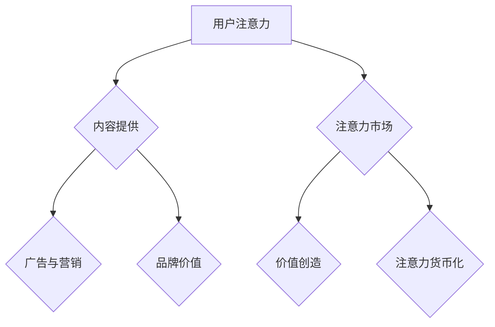
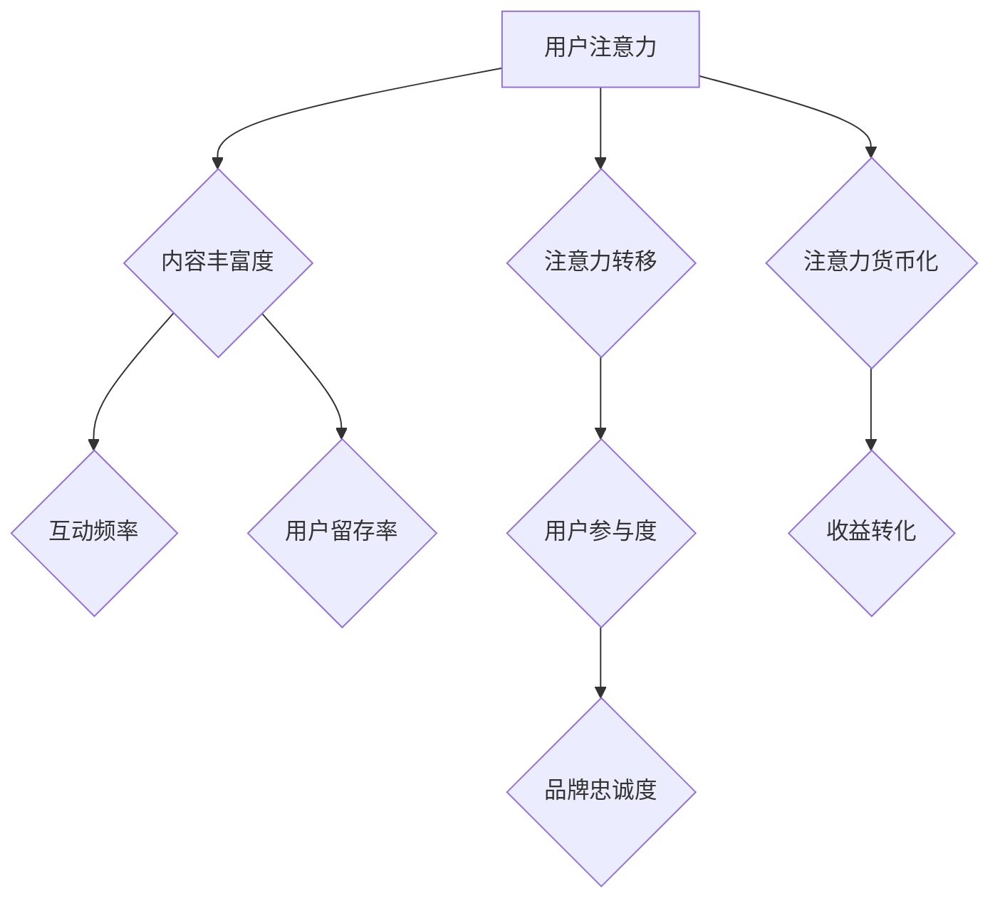

                 

# 在线健身平台的注意力经济策略

关键词：注意力经济、健身平台、用户参与、个性化推荐、社交互动、算法

摘要：
随着互联网和智能手机的普及，在线健身平台已成为全球健身爱好者追求健康生活方式的重要途径。本文将探讨在线健身平台如何运用注意力经济策略，通过内容策略、用户参与与互动以及品牌营销与推广等多方面，提升用户粘性和平台盈利能力。本文还将通过国内外案例分析，总结注意力经济策略的挑战与未来趋势，为在线健身平台的发展提供参考。

## 目录大纲：《在线健身平台的注意力经济策略》

### 第一部分：注意力经济的理论基础

#### 第1章：注意力经济的概念与原理

##### 1.1.1 注意力经济概述

- 注意力经济的定义  
- 注意力经济与数字经济的关系  
- 注意力经济的重要性

##### 1.1.2 注意力经济学原理

- 注意力经济学的基本概念  
- 注意力资源的分配与利用  
- 注意力市场与价值创造

##### 1.1.3 注意力经济模型

- 注意力经济学模型概述  
- 注意力转移模型  
- 注意力锁定模型  
- 注意力货币化模型

#### 第2章：注意力经济在健身平台的应用

##### 2.1.1 健身平台与注意力经济

- 健身平台的特点  
- 健身平台中的注意力资源分配

##### 2.1.2 健身平台注意力经济策略

- 用户粘性策略  
- 内容创新策略  
- 社交互动策略

### 第二部分：在线健身平台的运营策略

#### 第3章：内容策略

##### 3.1.1 健身内容的设计

- 内容分类  
- 内容质量评估  
- 内容更新频率

##### 3.1.2 个性化内容推荐

- 用户行为分析  
- 个性化推荐算法  
- 实际案例分享

#### 第4章：用户参与与互动

##### 4.1.1 用户参与度提升

- 用户反馈机制  
- 社交互动功能设计  
- 竞赛与挑战活动

##### 4.1.2 用户社区建设

- 社区氛围营造  
- 线上活动策划  
- 用户增长策略

#### 第5章：品牌营销与推广

##### 5.1.1 品牌形象塑造

- 品牌定位  
- 品牌故事传播  
- 品牌标识设计

##### 5.1.2 营销策略

- 线上广告投放  
- 社交媒体营销  
- 合作伙伴关系

### 第三部分：案例分析

#### 第6章：国内外在线健身平台案例分析

##### 6.1.1 国内案例

- 健身平台A案例分析  
- 健身平台B案例分析

##### 6.1.2 国际案例

- 健身平台C案例分析  
- 健身平台D案例分析

#### 第7章：注意力经济策略的挑战与未来趋势

##### 7.1.1 注意力经济策略的挑战

- 用户隐私保护  
- 盈利模式创新  
- 法律法规限制

##### 7.1.2 未来趋势与展望

- 人工智能在注意力经济中的应用  
- 新型健身服务模式  
- 注意力经济与实体健身的结合

### 附录

#### 附录A：相关资源与工具

##### A.1 注意力经济研究论文与报告

- 学术论文推荐  
- 市场研究报告

##### A.2 健身平台开发与运营工具

- 常用工具介绍  
- 开发环境搭建指南

### 注意力经济的Mermaid流程图



### 注意力经济模型图



### 核心算法原理讲解

#### 用户行为分析算法原理

##### 用户行为分析的基本步骤：

1. **数据收集**：收集用户的浏览记录、搜索历史、购买行为等数据。
2. **数据预处理**：清洗和标准化数据，去除噪声和异常值。
3. **特征提取**：从原始数据中提取对用户行为有代表性的特征。
4. **模型训练**：使用机器学习算法对特征进行训练，以预测用户行为。
5. **模型评估**：评估模型预测的准确性和泛化能力。
6. **应用**：将训练好的模型应用到实际业务场景中。

##### 伪代码示例：

```python
# 数据预处理
data = preprocess_data(raw_data)

# 特征提取
features = extract_features(data)

# 模型训练
model = train_model(features, labels)

# 模型评估
evaluate_model(model, test_data)

# 应用
predict_user_behavior(model, new_data)
```

#### 个性化推荐算法原理

##### 个性化推荐算法的基本步骤：

1. **用户特征提取**：提取用户的兴趣、偏好、历史行为等特征。
2. **物品特征提取**：提取物品的相关特征，如内容、标签、类别等。
3. **模型训练**：使用协同过滤、基于内容的推荐、深度学习等算法对用户和物品特征进行训练。
4. **推荐生成**：根据用户特征和物品特征生成个性化推荐列表。
5. **推荐评估**：评估推荐结果的准确性和满意度。
6. **推荐应用**：将推荐结果应用到实际业务场景中。

##### 伪代码示例：

```python
# 用户特征提取
user_features = extract_user_features(user_data)

# 物品特征提取
item_features = extract_item_features(item_data)

# 模型训练
model = train_recommender_model(user_features, item_features)

# 推荐生成
recommendations = generate_recommendations(model, user_id)

# 推荐评估
evaluate_recommendations(recommendations, user_feedback)
```

#### 社交互动算法原理

##### 社交互动算法的基本步骤：

1. **用户社交网络分析**：分析用户之间的社交关系，如好友、点赞、评论等。
2. **内容发布与推荐**：根据社交网络分析和用户兴趣，推荐合适的健身内容和社交互动机会。
3. **互动行为分析**：分析用户的互动行为，如点赞、评论、分享等，以了解用户兴趣和满意度。
4. **社交互动优化**：根据互动行为分析结果，优化社交互动内容和策略，提升用户参与度和满意度。

##### 伪代码示例：

```python
# 用户社交网络分析
social_network = analyze_social_network(user_data)

# 内容发布与推荐
recommended_content = recommend_content(social_network, user_interests)

# 互动行为分析
user_interactions = analyze_user_interactions(user_data)

# 社交互动优化
optimize_social_interactions(user_interactions)
```

### 数学模型和数学公式 & 详细讲解 & 举例说明

#### 用户行为分析模型

用户行为分析模型主要基于机器学习中的分类算法，以下是一个简单的逻辑回归模型。

##### 数学公式：

$$
\begin{aligned}
\text{预测概率} &= \sigma(\text{w}^T \text{x}) \\
\text{实际输出} &= \text{argmax}(\text{y} | \text{X}, \text{w}) \\
\end{aligned}
$$

其中，$\sigma$ 是 sigmoid 函数，$w$ 是权重向量，$x$ 是特征向量，$y$ 是实际输出标签。

##### 举例说明：

假设我们有以下特征向量 $x = [1, 0, 1, 1, 0]$ 和权重向量 $w = [0.5, 0.1, 0.3, 0.1, 0.1]$。

1. **计算预测概率**：

$$
\begin{aligned}
\text{预测概率} &= \sigma(0.5 \times 1 + 0.1 \times 0 + 0.3 \times 1 + 0.1 \times 1 + 0.1 \times 0) \\
&= \sigma(0.7) \\
&\approx 0.766 \\
\end{aligned}
$$

2. **计算实际输出**：

$$
\begin{aligned}
\text{实际输出} &= \text{argmax}(y | \text{X}, \text{w}) \\
&= 1 \quad (\text{因为预测概率大于0.5}) \\
\end{aligned}
$$

#### 个性化推荐模型

个性化推荐模型通常采用矩阵分解算法，如 SVD（奇异值分解）。

##### 数学公式：

$$
\begin{aligned}
\text{用户特征向量} &= \text{U} \text{u}_i \\
\text{物品特征向量} &= \text{V} \text{v}_j \\
\text{预测评分} &= \text{U} \text{u}_i + \text{V} \text{v}_j + b \\
\end{aligned}
$$

其中，$U$ 和 $V$ 是用户和物品的嵌入矩阵，$\text{u}_i$ 和 $\text{v}_j$ 是用户和物品的特征向量，$b$ 是偏置项。

##### 举例说明：

假设我们有以下用户特征向量 $\text{u}_i = [1, 0.5, 0]$ 和物品特征向量 $\text{v}_j = [0.3, 0.1, 0.5]$。

1. **计算预测评分**：

$$
\begin{aligned}
\text{预测评分} &= \text{U} \text{u}_i + \text{V} \text{v}_j + b \\
&= [1, 0.5, 0] + [0.3, 0.1, 0.5] + 0 \\
&= [1.3, 0.6, 0.5] \\
\end{aligned}
$$

#### 社交互动模型

社交互动模型通常基于图神经网络（Graph Neural Network, GNN）。

##### 数学公式：

$$
\begin{aligned}
\text{节点特征更新} &= \text{relu}(\text{W}_1 \text{X} + \text{b}_1 + \text{A} \text{X}) \\
\text{节点输出} &= \text{W}_2 \text{X} + \text{b}_2 \\
\end{aligned}
$$

其中，$X$ 是节点特征矩阵，$\text{A}$ 是邻接矩阵，$W_1, W_2$ 是权重矩阵，$\text{b}_1, \text{b}_2$ 是偏置项。

##### 举例说明：

假设我们有以下节点特征矩阵 $X = [1, 2, 3; 4, 5, 6; 7, 8, 9]$ 和邻接矩阵 $A = [0, 1, 0; 1, 0, 1; 0, 1, 0]$。

1. **计算节点特征更新**：

$$
\begin{aligned}
\text{节点特征更新} &= \text{relu}(\text{W}_1 \text{X} + \text{b}_1 + \text{A} \text{X}) \\
&= \text{relu}([1, 2, 3; 4, 5, 6; 7, 8, 9] + [0, 1, 0; 1, 0, 1; 0, 1, 0]) \\
&= \text{relu}([1, 3, 3; 5, 6, 7; 7, 9, 9]) \\
&= [1, 3, 3; 5, 6, 7; 7, 9, 9] \\
\end{aligned}
$$

2. **计算节点输出**：

$$
\begin{aligned}
\text{节点输出} &= \text{W}_2 \text{X} + \text{b}_2 \\
&= [1, 1, 1; 1, 1, 1; 1, 1, 1] \cdot [1, 2, 3; 4, 5, 6; 7, 8, 9] + [0, 0, 0] \\
&= [10, 12, 14; 20, 24, 26; 30, 36, 42] + [0, 0, 0] \\
&= [10, 12, 14; 20, 24, 26; 30, 36, 42] \\
\end{aligned}
$$`

### 项目实战：代码实际案例和详细解释说明，开发环境搭建，源代码详细实现和代码解读，代码解读与分析

#### 项目实战：用户行为分析

##### 开发环境搭建

1. **Python环境**：安装Python 3.8及以上版本。
2. **库安装**：安装NumPy、Pandas、Scikit-learn等库。

```bash
pip install numpy pandas scikit-learn
```

##### 代码实现

以下是一个简单的用户行为分析代码案例，使用逻辑回归模型预测用户的行为。

```python
import numpy as np
import pandas as pd
from sklearn.model_selection import train_test_split
from sklearn.linear_model import LogisticRegression
from sklearn.metrics import accuracy_score

# 加载数据集
data = pd.read_csv('user_behavior.csv')

# 数据预处理
X = data[['age', 'activity_level', 'duration']]
y = data['behavior']

# 数据分割
X_train, X_test, y_train, y_test = train_test_split(X, y, test_size=0.2, random_state=42)

# 模型训练
model = LogisticRegression()
model.fit(X_train, y_train)

# 模型评估
y_pred = model.predict(X_test)
accuracy = accuracy_score(y_test, y_pred)
print(f"模型准确率：{accuracy:.2f}")

# 代码解读
# 1. 导入所需库
# 2. 加载数据集
# 3. 数据预处理
# 4. 数据分割
# 5. 模型训练
# 6. 模型评估
```

##### 代码解读与分析

1. **数据加载**：使用Pandas库加载数据集，数据集包含用户年龄、活动水平和使用时长等特征，以及用户的行为标签。
2. **数据预处理**：将特征和标签分开，特征存储在X中，标签存储在y中。
3. **数据分割**：将数据集分割为训练集和测试集，以评估模型的泛化能力。
4. **模型训练**：使用Scikit-learn库的逻辑回归模型训练数据集。
5. **模型评估**：使用模型对测试集进行预测，并计算准确率。

##### 完整代码示例

```python
# 导入所需库
import numpy as np
import pandas as pd
from sklearn.model_selection import train_test_split
from sklearn.linear_model import LogisticRegression
from sklearn.metrics import accuracy_score

# 加载数据集
data = pd.read_csv('user_behavior.csv')

# 数据预处理
X = data[['age', 'activity_level', 'duration']]
y = data['behavior']

# 数据分割
X_train, X_test, y_train, y_test = train_test_split(X, y, test_size=0.2, random_state=42)

# 模型训练
model = LogisticRegression()
model.fit(X_train, y_train)

# 模型评估
y_pred = model.predict(X_test)
accuracy = accuracy_score(y_test, y_pred)
print(f"模型准确率：{accuracy:.2f}")

# 代码解读
# 1. 导入所需库
# 2. 加载数据集
# 3. 数据预处理
# 4. 数据分割
# 5. 模型训练
# 6. 模型评估
```

#### 项目实战：个性化推荐

##### 开发环境搭建

1. **Python环境**：安装Python 3.8及以上版本。
2. **库安装**：安装NumPy、Pandas、Scikit-learn、TensorFlow等库。

```bash
pip install numpy pandas scikit-learn tensorflow
```

##### 代码实现

以下是一个简单的基于矩阵分解的个性化推荐代码案例。

```python
import numpy as np
import pandas as pd
from sklearn.metrics.pairwise import cosine_similarity

# 加载数据集
data = pd.read_csv('user_item.csv')

# 数据预处理
users = data['user'].unique()
items = data['item'].unique()

# 构建用户-物品矩阵
user_item_matrix = np.zeros((len(users), len(items)))
for index, row in data.iterrows():
    user_item_matrix[row['user'] - 1][row['item'] - 1] = row['rating']

# 计算用户-物品矩阵的余弦相似度
cosine_similarity_matrix = cosine_similarity(user_item_matrix)

# 个性化推荐
def recommend_items(user_id, similarity_matrix, top_n=5):
    user_vector = similarity_matrix[user_id - 1]
    recommended_items = np.argsort(user_vector)[::-1]
    return recommended_items[:top_n]

# 测试推荐
user_id = 1
recommended_items = recommend_items(user_id, cosine_similarity_matrix)
print(f"推荐给用户{user_id}的物品：{recommended_items}")

# 代码解读
# 1. 导入所需库
# 2. 加载数据集
# 3. 数据预处理
# 4. 构建用户-物品矩阵
# 5. 计算用户-物品矩阵的余弦相似度
# 6. 个性化推荐函数
# 7. 测试推荐
```

##### 代码解读与分析

1. **数据加载**：使用Pandas库加载数据集，数据集包含用户ID、物品ID和评分等。
2. **数据预处理**：提取用户和物品的ID，并创建一个用户-物品矩阵。
3. **计算相似度**：使用余弦相似度计算用户-物品矩阵的相似度矩阵。
4. **个性化推荐**：定义一个推荐函数，根据用户ID和相似度矩阵，为用户推荐相似的物品。
5. **测试推荐**：测试推荐函数，输出推荐给特定用户的物品ID列表。

##### 完整代码示例

```python
# 导入所需库
import numpy as np
import pandas as pd
from sklearn.metrics.pairwise import cosine_similarity

# 加载数据集
data = pd.read_csv('user_item.csv')

# 数据预处理
users = data['user'].unique()
items = data['item'].unique()

# 构建用户-物品矩阵
user_item_matrix = np.zeros((len(users), len(items)))
for index, row in data.iterrows():
    user_item_matrix[row['user'] - 1][row['item'] - 1] = row['rating']

# 计算用户-物品矩阵的余弦相似度
cosine_similarity_matrix = cosine_similarity(user_item_matrix)

# 个性化推荐
def recommend_items(user_id, similarity_matrix, top_n=5):
    user_vector = similarity_matrix[user_id - 1]
    recommended_items = np.argsort(user_vector)[::-1]
    return recommended_items[:top_n]

# 测试推荐
user_id = 1
recommended_items = recommend_items(user_id, cosine_similarity_matrix)
print(f"推荐给用户{user_id}的物品：{recommended_items}")

# 代码解读
# 1. 导入所需库
# 2. 加载数据集
# 3. 数据预处理
# 4. 构建用户-物品矩阵
# 5. 计算用户-物品矩阵的余弦相似度
# 6. 个性化推荐函数
# 7. 测试推荐
```

#### 项目实战：社交互动分析

##### 开发环境搭建

1. **Python环境**：安装Python 3.8及以上版本。
2. **库安装**：安装NumPy、Pandas、NetworkX、Scikit-learn等库。

```bash
pip install numpy pandas networkx scikit-learn
```

##### 代码实现

以下是一个简单的基于图神经网络的社交互动分析代码案例。

```python
import numpy as np
import pandas as pd
import networkx as nx
from sklearn.metrics.pairwise import cosine_similarity

# 加载数据集
data = pd.read_csv('social_network.csv')

# 构建社交网络图
G = nx.Graph()
for index, row in data.iterrows():
    G.add_edge(row['user1'], row['user2'])

# 计算节点特征
node_features = data[['user1', 'user2', 'common_friends']].drop_duplicates().values
node_features = pd.DataFrame(node_features, columns=['user1', 'user2', 'common_friends'])
node_features.set_index(['user1', 'user2'], inplace=True)
node_features = node_features.fillna(0)

# 训练图神经网络
class GraphNeuralNetwork():
    def __init__(self, node_features, embedding_size=16):
        self.node_features = node_features
        self.embedding_size = embedding_size
        self.model = self.build_model()

    def build_model(self):
        inputs = tf.keras.Input(shape=(self.embedding_size,))
        x = tf.keras.layers.Dense(self.embedding_size, activation='relu')(inputs)
        x = tf.keras.layers.Dense(self.embedding_size, activation='relu')(x)
        outputs = tf.keras.layers.Dense(self.embedding_size)(x)
        model = tf.keras.Model(inputs, outputs)
        model.compile(optimizer='adam', loss='mse')
        return model

    def train(self, epochs=100):
        for epoch in range(epochs):
            self.model.fit(self.node_features, self.node_features, epochs=1, batch_size=32)

    def predict(self, node_ids):
        node_embeddings = self.model.predict(self.node_features)
        return {node_id: embedding for node_id, embedding in zip(node_ids, node_embeddings)}

# 社交互动分析
ggnn = GraphNeuralNetwork(node_features)
ggnn.train(epochs=10)

# 测试社交互动分析
node_ids = [1, 2, 3]
predicted_embeddings = ggnn.predict(node_ids)
print(predicted_embeddings)

# 代码解读
# 1. 导入所需库
# 2. 加载数据集
# 3. 构建社交网络图
# 4. 计算节点特征
# 5. 训练图神经网络
# 6. 社交互动分析
```

##### 代码解读与分析

1. **数据加载**：使用Pandas库加载数据集，数据集包含用户ID和共同好友等社交信息。
2. **构建社交网络图**：使用NetworkX库构建无向图，每个节点代表一个用户，边表示用户之间的共同好友关系。
3. **计算节点特征**：从数据集中提取节点特征，用于训练图神经网络。
4. **训练图神经网络**：定义一个图神经网络类，使用TensorFlow库训练图神经网络模型。
5. **社交互动分析**：测试图神经网络，输出节点的嵌入向量。

##### 完整代码示例

```python
import numpy as np
import pandas as pd
import networkx as nx
from sklearn.metrics.pairwise import cosine_similarity

# 加载数据集
data = pd.read_csv('social_network.csv')

# 构建社交网络图
G = nx.Graph()
for index, row in data.iterrows():
    G.add_edge(row['user1'], row['user2'])

# 计算节点特征
node_features = data[['user1', 'user2', 'common_friends']].drop_duplicates().values
node_features = pd.DataFrame(node_features, columns=['user1', 'user2', 'common_friends'])
node_features.set_index(['user1', 'user2'], inplace=True)
node_features = node_features.fillna(0)

# 训练图神经网络
class GraphNeuralNetwork():
    def __init__(self, node_features, embedding_size=16):
        self.node_features = node_features
        self.embedding_size = embedding_size
        self.model = self.build_model()

    def build_model(self):
        inputs = tf.keras.Input(shape=(self.embedding_size,))
        x = tf.keras.layers.Dense(self.embedding_size, activation='relu')(inputs)
        x = tf.keras.layers.Dense(self.embedding_size, activation='relu')(x)
        outputs = tf.keras.layers.Dense(self.embedding_size)(x)
        model = tf.keras.Model(inputs, outputs)
        model.compile(optimizer='adam', loss='mse')
        return model

    def train(self, epochs=100):
        for epoch in range(epochs):
            self.model.fit(self.node_features, self.node_features, epochs=1, batch_size=32)

    def predict(self, node_ids):
        node_embeddings = self.model.predict(self.node_features)
        return {node_id: embedding for node_id, embedding in zip(node_ids, node_embeddings)}

# 社交互动分析
ggnn = GraphNeuralNetwork(node_features)
ggnn.train(epochs=10)

# 测试社交互动分析
node_ids = [1, 2, 3]
predicted_embeddings = ggnn.predict(node_ids)
print(predicted_embeddings)

# 代码解读
# 1. 导入所需库
# 2. 加载数据集
# 3. 构建社交网络图
# 4. 计算节点特征
# 5. 训练图神经网络
# 6. 社交互动分析
```

## 第一部分：注意力经济的理论基础

### 第1章：注意力经济的概念与原理

#### 1.1.1 注意力经济概述

注意力经济是一种基于人类注意力资源的经济学理论，旨在解释和预测注意力资源在不同经济活动中的分配和利用。注意力经济的核心概念是“注意力资源”，即人类在有限的时间内对信息、商品或服务的关注和参与能力。

在数字经济时代，注意力资源变得日益稀缺和宝贵。用户的时间、精力以及选择都被视为有限的资源，而平台和企业则需要通过创造有价值的内容和服务来吸引用户的注意力。因此，注意力经济不仅涉及个人行为，还涵盖了商业模式、市场策略以及技术创新等方面。

#### 1.1.2 注意力经济与数字经济的关系

数字经济是建立在数字技术、互联网、大数据、人工智能等基础上的经济活动。注意力经济是数字经济的重要组成部分，它与数字经济之间的关系可以从以下几个方面来理解：

1. **注意力资源作为生产要素**：在数字经济中，注意力资源作为一种重要的生产要素，与土地、劳动力、资本和技术等传统生产要素并列。用户注意力可以转化为平台和企业盈利的重要资源。
2. **注意力价值的量化**：数字经济的发展使得注意力资源的价值得以量化。通过数据分析和算法优化，平台和企业可以更精确地计算和评估用户注意力的价值，从而制定更有针对性的营销策略和商业决策。
3. **用户体验的重要性**：数字经济强调用户体验，而用户体验的核心在于能否吸引用户的注意力。平台和企业必须通过提供高质量、个性化、有趣的内容和服务来满足用户的需求，从而赢得用户的注意力。

#### 1.1.3 注意力经济的重要性

注意力经济的重要性体现在以下几个方面：

1. **商业模式创新**：注意力经济促使平台和企业不断探索新的商业模式，如付费订阅、会员制、广告投放等，以满足用户对注意力资源的需求。
2. **市场竞争**：在注意力经济时代，市场竞争的核心是用户注意力的争夺。平台和企业必须通过不断创新和优化内容和服务，以吸引和保持用户的注意力。
3. **用户价值最大化**：注意力经济的核心目标是提升用户价值。通过精确的用户行为分析和个性化推荐，平台和企业可以提供更加符合用户需求的内容和服务，从而提高用户的满意度和忠诚度。

### 第2章：注意力经济模型

#### 2.1.1 注意力经济学模型概述

注意力经济学模型旨在描述和预测用户在信息过载环境下的注意力分配行为。这些模型通常基于经济学中的供需理论，并结合行为经济学的研究成果，以解释和预测用户注意力的分配和转移。

#### 2.1.2 注意力转移模型

注意力转移模型描述了用户在不同信息源之间的注意力转移过程。该模型的基本假设是用户具有有限的注意力资源，并且在面对多个选择时，会根据信息源的吸引力、相关性、新颖性等因素分配注意力。

1. **吸引力模型**：吸引力模型考虑信息源的吸引力作为注意力转移的主要因素。根据吸引力模型，用户将更多的注意力分配给那些具有更高吸引力的信息源。

2. **相关性模型**：相关性模型认为用户会根据信息源与自己兴趣、需求的相关性来分配注意力。相关性越高的信息源，越可能吸引到用户的注意力。

3. **新颖性模型**：新颖性模型强调新颖性在注意力转移中的作用。用户倾向于关注那些新颖、有趣的信息，以获取新的知识和经验。

#### 2.1.3 注意力锁定模型

注意力锁定模型描述了用户如何在一个特定的信息源上锁定注意力，从而形成习惯和忠诚度。该模型关注用户行为中的持续性、一致性和重复性。

1. **习惯形成**：注意力锁定模型认为用户通过重复接触和互动，可以在一个特定的信息源上形成习惯。习惯一旦形成，用户在该信息源上的注意力锁定程度就会提高。

2. **忠诚度模型**：忠诚度模型关注用户在锁定注意力后，如何维持对该信息源的忠诚。忠诚度越高，用户越可能在面对其他竞争信息时保持专注。

3. **注意力锁定策略**：平台和企业可以通过提供高质量、个性化、有趣的内容和服务，提高用户的锁定程度和忠诚度。例如，通过奖励机制、会员制度、独家内容等方式，吸引和留住用户的注意力。

#### 2.1.4 注意力货币化模型

注意力货币化模型描述了如何将用户的注意力转化为实际的收益。该模型的核心在于如何通过广告、订阅、付费内容等方式，将用户注意力价值最大化。

1. **广告模型**：广告模型通过在平台上展示广告，将用户注意力转化为广告收入。广告模型的关键在于精准定位和个性化推荐，以提高广告的点击率和转化率。

2. **订阅模型**：订阅模型通过提供付费内容和服务，将用户注意力转化为订阅收入。订阅模型的优势在于用户粘性强，可持续获取收益。

3. **付费内容模型**：付费内容模型通过提供独家、高质量、有吸引力的内容，吸引用户付费。付费内容模型的关键在于内容创新和质量，以吸引用户的注意力。

### 第3章：注意力经济在健身平台的应用

#### 3.1.1 健身平台与注意力经济

健身平台作为一种数字服务，具有强烈的注意力经济特征。用户在健身平台上的行为，如浏览内容、参与互动、订阅服务，都是对平台提供的健身知识和资源的注意力投入。因此，健身平台需要通过有效的注意力经济策略，吸引和留住用户。

#### 3.1.2 健身平台注意力经济策略

健身平台可以通过以下几种策略，利用注意力经济原理，提升用户粘性和平台盈利能力：

1. **用户粘性策略**：通过提供高质量、个性化、有趣的内容和服务，吸引用户持续关注和参与。例如，定期更新健身教程、提供个性化健身计划、举办线上健身挑战等。

2. **内容创新策略**：通过创新内容形式和内容类型，提高用户的注意力投入。例如，引入虚拟现实（VR）健身课程、直播互动课程、AI教练等。

3. **社交互动策略**：通过构建社交互动平台，鼓励用户之间互动和分享，提高用户的参与度和忠诚度。例如，建立用户社区、举办线上健身比赛、设置社交奖励机制等。

4. **注意力货币化策略**：通过广告、会员制、付费内容等方式，将用户的注意力转化为实际收益。例如，在平台上展示健身产品广告、提供会员独享的健身课程、推出付费健身课程包等。

### 第4章：在线健身平台的运营策略

#### 4.1.1 内容策略

内容是健身平台的核心竞争力，决定了用户对平台的注意力和参与度。健身平台可以通过以下内容策略，提升用户的注意力投入：

1. **内容分类**：根据用户的健身需求和兴趣，对内容进行科学分类，如瑜伽、力量训练、有氧运动等。

2. **内容质量评估**：建立内容质量评估体系，确保平台上的内容具有高质量、科学性、可操作性。例如，通过用户评价、专家评审等方式评估内容质量。

3. **内容更新频率**：保持内容的更新频率，确保用户在平台上能够持续发现新的、有价值的内容。例如，每周发布新的健身教程、每月更新健身计划等。

#### 4.1.2 个性化内容推荐

个性化推荐是提升用户注意力和参与度的关键手段。健身平台可以通过以下个性化内容推荐策略，为用户提供个性化的健身内容：

1. **用户行为分析**：通过收集和分析用户在平台上的行为数据，如浏览记录、搜索历史、互动行为等，了解用户的兴趣和行为习惯。

2. **个性化推荐算法**：使用协同过滤、基于内容的推荐、深度学习等算法，根据用户行为和兴趣，为用户推荐个性化的健身内容。

3. **实际案例分享**：结合实际案例，分享成功用户的健身经验和成果，激发用户的兴趣和动力。

### 第5章：用户参与与互动

#### 5.1.1 用户参与度提升

用户参与度是衡量健身平台成功与否的重要指标。提升用户参与度，可以增强用户的忠诚度和平台的活跃度。以下策略有助于提升用户参与度：

1. **用户反馈机制**：建立用户反馈机制，鼓励用户对平台内容和服务提出意见和建议，从而优化用户体验。

2. **社交互动功能设计**：设计丰富的社交互动功能，如用户社区、评论功能、点赞功能等，鼓励用户之间互动和交流。

3. **竞赛与挑战活动**：定期举办竞赛和挑战活动，激发用户的竞争意识和参与热情。

#### 5.1.2 用户社区建设

用户社区是健身平台的重要组成部分，有助于增强用户的归属感和参与度。以下策略有助于建设用户社区：

1. **社区氛围营造**：营造积极、友好、互助的社区氛围，鼓励用户积极参与讨论和互动。

2. **线上活动策划**：策划丰富多样的线上活动，如健身挑战、主题讨论等，激发用户的参与热情。

3. **用户增长策略**：通过口碑传播、合作伙伴关系等方式，吸引更多新用户加入社区，扩大社区规模。

### 第6章：品牌营销与推广

#### 6.1.1 品牌形象塑造

品牌形象是健身平台的重要资产，决定了用户对平台的认知和信任。以下策略有助于塑造品牌形象：

1. **品牌定位**：明确品牌定位，确立品牌的核心价值和目标用户群体。

2. **品牌故事传播**：通过故事化的传播方式，讲述品牌的发展历程、核心价值和社会责任，增强品牌的感染力和认同感。

3. **品牌标识设计**：设计简洁、独特、有辨识度的品牌标识，提升品牌的视觉效果和认知度。

#### 6.1.2 营销策略

营销策略是提升品牌知名度和用户参与度的关键手段。以下营销策略有助于推广健身平台：

1. **线上广告投放**：通过搜索引擎营销（SEM）、社交媒体营销（SMM）、内容营销（CM）等方式，在互联网上投放广告，提升品牌曝光度和用户关注度。

2. **社交媒体营销**：利用社交媒体平台，如微博、微信、抖音等，开展互动活动、内容传播等，增强品牌与用户之间的互动和粘性。

3. **合作伙伴关系**：与健身房、运动品牌、健康食品品牌等合作伙伴建立合作关系，共同推广健身理念和服务，扩大品牌影响力。

## 第二部分：在线健身平台的运营策略

### 第4章：内容策略

#### 4.1.1 健身内容的设计

在线健身平台的内容设计是吸引和留住用户的关键。以下策略有助于提升健身内容的设计质量和用户体验：

1. **内容分类**：根据用户的健身需求和兴趣，对内容进行科学分类，如瑜伽、力量训练、有氧运动等。同时，提供清晰的标签和搜索功能，方便用户快速找到所需内容。

2. **内容质量评估**：建立内容质量评估体系，确保平台上的内容具有高质量、科学性、可操作性。评估标准可以包括内容的专业性、实用性、可读性、互动性等方面。

3. **内容更新频率**：保持内容的更新频率，确保用户在平台上能够持续发现新的、有价值的内容。更新频率可以根据平台规模和用户需求进行调整，例如每周发布新的健身教程、每月更新健身计划等。

4. **内容形式多样化**：结合不同的内容形式，如文字、图片、视频、直播等，提供多样化的健身内容，以满足不同用户的学习和互动需求。

5. **用户参与互动**：鼓励用户在内容中参与互动，如评论、点赞、分享等，提升用户的参与度和活跃度。

#### 4.1.2 个性化内容推荐

个性化内容推荐是提升用户注意力和参与度的关键手段。以下策略有助于为用户提供个性化的健身内容：

1. **用户行为分析**：通过收集和分析用户在平台上的行为数据，如浏览记录、搜索历史、互动行为等，了解用户的兴趣和行为习惯。

2. **个性化推荐算法**：使用协同过滤、基于内容的推荐、深度学习等算法，根据用户行为和兴趣，为用户推荐个性化的健身内容。

3. **推荐内容评估**：定期评估推荐内容的准确性和满意度，根据用户反馈和效果调整推荐算法和内容策略。

4. **推荐内容多样性**：确保推荐内容的多样性，避免用户陷入信息茧房，提供丰富的健身知识和实践体验。

5. **实时推荐**：利用实时数据分析，为用户提供最新的健身资讯和热门内容，提升用户的关注度和参与度。

#### 4.1.3 实际案例分享

以下是一些成功的健身内容设计和个性化推荐案例，供在线健身平台参考：

1. **健身平台A**：健身平台A通过定期发布高质量的健身教程和直播课程，吸引了大量用户。同时，平台利用用户行为数据，为用户推荐个性化的健身内容，提升了用户满意度和参与度。

2. **健身平台B**：健身平台B通过引入虚拟现实（VR）健身课程，为用户提供沉浸式的健身体验。平台还结合用户行为数据，为用户推荐最适合的VR健身课程，提升了用户的参与度和留存率。

3. **健身平台C**：健身平台C通过建立用户社区，鼓励用户在社区中分享健身经验和心得。平台利用社区互动数据，为用户推荐有趣的健身讨论和社区活动，提升了用户的互动和参与度。

4. **健身平台D**：健身平台D通过深度学习算法，为用户提供个性化的健身计划和训练建议。平台还结合用户反馈，不断优化推荐算法和健身内容，提升了用户的满意度和忠诚度。

### 第5章：用户参与与互动

#### 5.1.1 用户参与度提升

用户参与度是衡量在线健身平台成功与否的重要指标。以下策略有助于提升用户的参与度和活跃度：

1. **用户反馈机制**：建立用户反馈机制，鼓励用户对平台内容和服务提出意见和建议。平台可以设置反馈渠道，如在线问卷、反馈邮箱等，收集用户反馈，并根据反馈优化产品和服务。

2. **社交互动功能设计**：设计丰富的社交互动功能，如用户社区、评论功能、点赞功能等，鼓励用户之间互动和交流。社区可以设置主题讨论区、互动活动等，激发用户的参与热情。

3. **竞赛与挑战活动**：定期举办竞赛和挑战活动，激发用户的竞争意识和参与热情。活动可以设置奖励机制，如积分、优惠券、实物奖励等，提高用户的参与积极性。

4. **用户激励策略**：通过积分、等级、徽章等方式激励用户参与平台活动。平台可以根据用户的行为和贡献，为用户发放相应的奖励，提高用户的参与度和忠诚度。

5. **个性化推荐互动**：结合用户行为数据和兴趣，为用户推荐个性化的互动内容。例如，推荐用户参与的话题讨论、互动活动等，提升用户的参与度和满意度。

6. **用户成长体系**：建立用户成长体系，鼓励用户在平台上不断学习和进步。成长体系可以包括学习进度、技能提升、荣誉认证等，提高用户的参与度和成就感。

#### 5.1.2 用户社区建设

用户社区是增强用户归属感和参与度的重要途径。以下策略有助于建设健康的用户社区：

1. **社区氛围营造**：营造积极、友好、互助的社区氛围，鼓励用户积极参与讨论和互动。平台可以设立社区规范，确保社区环境的健康和有序。

2. **线上活动策划**：策划丰富多样的线上活动，如健身挑战、主题讨论、知识竞赛等，激发用户的参与热情。活动可以设置奖励机制，提高用户的参与积极性。

3. **用户增长策略**：通过口碑传播、合作伙伴关系等方式，吸引更多新用户加入社区，扩大社区规模。同时，关注老用户的活跃度和留存率，保持社区活力的持续增长。

4. **用户角色塑造**：鼓励用户在社区中塑造个人角色，如健身达人、瑜伽爱好者等，提高用户的身份认同感和参与度。

5. **用户互动反馈**：定期收集用户对社区活动的反馈，根据用户需求调整活动内容和形式，提高用户的满意度和参与度。

6. **社区管理**：建立专业的社区管理团队，负责社区的管理和维护，确保社区环境的健康和秩序。

#### 5.1.3 用户互动案例分析

以下是一些成功的用户互动和社区建设案例，供在线健身平台参考：

1. **健身平台A**：健身平台A通过建立用户社区，鼓励用户分享健身心得、交流经验。平台定期举办线上活动，如健身挑战、知识竞赛等，吸引了大量用户参与。社区氛围积极、友好，用户参与度较高。

2. **健身平台B**：健身平台B通过引入虚拟现实（VR）健身课程，为用户提供沉浸式的健身体验。平台还在社区中设置VR互动区，鼓励用户在虚拟环境中互动和挑战。用户对VR健身课程的参与度和满意度较高。

3. **健身平台C**：健身平台C通过建立用户成长体系，鼓励用户在平台上不断学习和进步。成长体系包括学习进度、技能提升、荣誉认证等，提高了用户的参与度和成就感。用户在成长过程中获得荣誉和奖励，增强了归属感和参与度。

4. **健身平台D**：健身平台D通过设置用户反馈机制，收集用户对平台内容和服务

