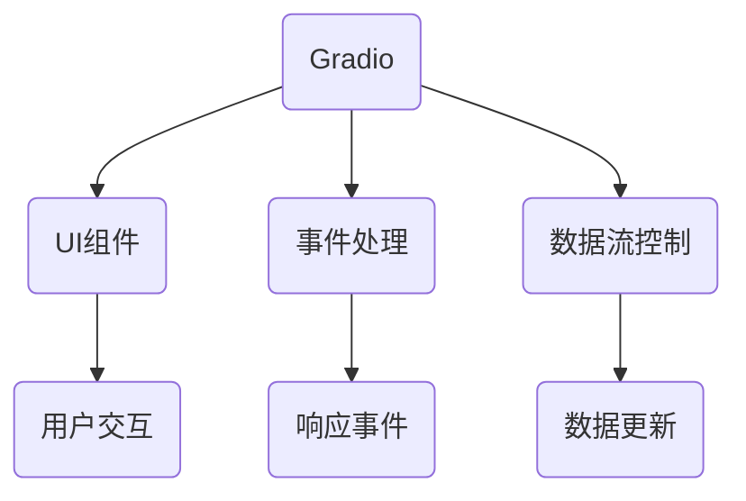
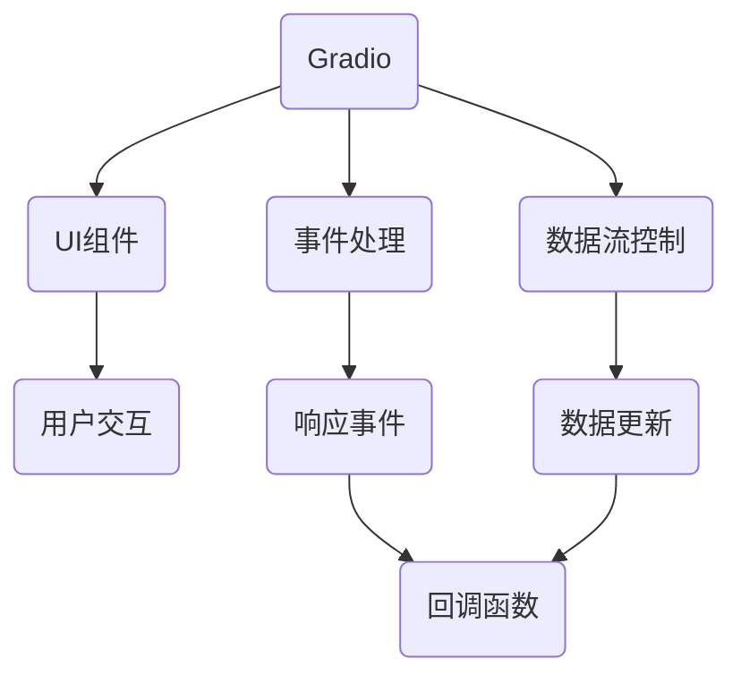

                 

# 《基于 Gradio 的图形化界面设计与实现》

## 摘要

本文将深入探讨基于 Gradio 的图形化界面设计与实现，旨在帮助开发者理解和掌握这一新兴技术。Gradio 是一种用于构建图形用户界面（GUI）的开源库，它以其简单易用、灵活性和强大的扩展性在机器学习、数据分析等领域迅速获得了广泛的应用。本文将首先介绍 Gradio 的基本概念、核心架构和核心概念，然后逐步讲解如何使用 Gradio 创建和设计图形化界面，最后将探讨 Gradio 在高级应用和未来趋势中的发展。通过本文的学习，读者将能够全面了解 Gradio 的优势和局限性，掌握使用 Gradio 进行图形化界面设计与实现的核心技能。

## 第一部分: 引言与核心概念

### 第1章: 引言与核心概念

#### 1.1 《基于 Gradio 的图形化界面设计与实现》概述

**引言**：随着计算机技术的发展，图形用户界面（GUI）已经成为人机交互的重要组成部分。一个好的图形化界面不仅能够提升用户体验，还能增强软件的功能性和可扩展性。Gradio 正是这样一种能够简化图形化界面设计的开源库，它为开发者提供了一个快速构建交互式界面的平台。

**核心概念**：Gradio 的核心概念主要包括事件处理、数据流控制、前端界面设计等。事件处理是指如何响应用户的交互动作，如点击、滑动等。数据流控制则是如何管理数据和信息的流动，确保界面在不同状态下能够实时更新。前端界面设计则涉及如何布局和设计界面，使其既美观又实用。

**架构概览**：为了更好地理解 Gradio，我们可以通过一个 Mermaid 流程图来展示其基本架构和组件。



在这个架构中，Gradio 通过 UI 组件来呈现用户界面，并通过事件处理和数据流控制来实现界面的交互和数据更新。

#### 1.2 Gradio 的核心概念与联系

**概念解释**：

- **事件处理**：事件处理是 Gradio 的重要组成部分，它能够响应用户的各种交互动作。例如，当用户点击一个按钮时，Gradio 会触发相应的事件处理函数，然后根据函数的逻辑来执行特定的操作。
- **数据流控制**：数据流控制是指如何管理数据和信息的流动。在 Gradio 中，数据流控制主要通过回调函数（callback）来实现。当界面中的某个组件发生变化时，Gradio 会自动更新数据流，并触发相应的回调函数。
- **前端界面设计**：前端界面设计是指如何设计用户界面，使其既美观又实用。Gradio 提供了一系列 UI 组件，如输入框、按钮、标签等，开发者可以使用这些组件来设计界面，并通过样式表（CSS）来调整界面的样式。

**架构关系**：为了更好地理解 Gradio 的架构关系，我们可以通过一个 Mermaid 流程图来展示 Gradio 的组件关系和工作流程。



在这个流程图中，Gradio 的核心组件（UI 组件、事件处理、数据流控制）通过回调函数相互联系，共同实现了图形化界面的设计和交互。

#### 1.3 Gradio 在图形化界面设计中的应用

**应用场景**：Gradio 在多个领域都有广泛的应用，如机器学习、数据分析、科学计算等。以下是一些典型的应用场景：

- **机器学习**：使用 Gradio 来构建交互式的机器学习应用，如模型训练、预测和可视化。
- **数据分析**：通过 Gradio 来创建交互式的数据分析工具，如数据探索、数据可视化等。
- **科学计算**：利用 Gradio 来构建交互式的科学计算应用，如数学模拟、物理实验等。

**优势分析**：Gradio 相对于其他图形化界面设计工具具有以下优势：

- **简单易用**：Gradio 的设计哲学是简单和易于使用，它通过简单的函数接口和组件库，使得开发者可以快速构建交互式界面。
- **灵活度高**：Gradio 提供了丰富的 UI 组件和事件处理机制，使得开发者可以根据需求自定义界面和交互逻辑。
- **可扩展性强**：Gradio 是一个开源库，它支持自定义组件和插件，使得开发者可以根据项目需求进行扩展。

### 第二部分: Gradio 技术基础

#### 第2章: Gradio 技术基础

##### 2.1 Gradio 的基础功能与使用

**基础功能**：Gradio 提供了一系列基础功能，包括创建输入框、按钮、标签等。以下是一个简单的示例：

```python
import gradio as gr

def greet(name):
    return f"Hello, {name}!"

ui = gr.Interface(
    fn=greet,
    inputs=["text", "int"],
    outputs=["text"],
    title="Hello World!"
)

ui.launch()
```

在这个示例中，我们创建了一个简单的 Gradio 界面，它包含一个输入框和一个按钮。当用户输入名称并点击按钮时，界面会显示问候语。

**使用示例**：以下是一个更复杂的示例，展示了如何使用 Gradio 创建一个包含多个输入和输出组件的界面。

```python
import gradio as gr

def calculate_expression(a, b, operator):
    if operator == '+':
        return a + b
    elif operator == '-':
        return a - b
    elif operator == '*':
        return a * b
    elif operator == '/':
        return a / b
    else:
        return "Invalid operator"

ui = gr.Interface(
    fn=calculate_expression,
    inputs=["text", "text", "text"],
    outputs=["text"],
    title="Calculator"
)

ui.launch()
```

在这个示例中，我们创建了一个计算器界面，它包含三个输入框（两个数字和一个操作符）和一个输出框。用户可以在输入框中输入数值和操作符，点击计算按钮后，输出框会显示计算结果。

##### 2.2 事件处理与数据流控制

**事件处理**：Gradio 提供了多种事件处理方式，包括简单的回调函数和事件监听器。以下是一个使用回调函数处理事件的示例：

```python
import gradio as gr

def on_click():
    print("Button clicked!")

ui = gr.Interface(
    fn=on_click,
    inputs=[],
    outputs=["text"],
    title="Button Example"
)

ui.launch()
```

在这个示例中，我们创建了一个简单的按钮，当用户点击按钮时，会触发 `on_click` 函数，并在控制台中打印出 "Button clicked!"。

**数据流控制**：Gradio 中的数据流控制主要通过回调函数和数据绑定实现。以下是一个使用数据绑定的示例：

```python
import gradio as gr

def update_output(input_text):
    return f"You entered: {input_text}"

ui = gr.Interface(
    fn=update_output,
    inputs=["text"],
    outputs=["text"],
    title="Data Binding Example"
)

ui.launch()
```

在这个示例中，当用户在输入框中输入文本时，`update_output` 函数会根据输入的文本更新输出框中的内容。

##### 2.3 Gradio 的进阶功能

**自定义组件**：Gradio 允许开发者自定义组件，以适应特定的需求。以下是一个自定义组件的示例：

```python
import gradio as gr

class MyComponent(gr.Component):
    def init(self):
        self.input = gr.Textbox(label="Input Text")

    def update(self, inputs):
        return f"You entered: {inputs['input']}"

ui = gr.Interface(
    components=[MyComponent()],
    title="Custom Component Example"
)

ui.launch()
```

在这个示例中，我们创建了一个自定义组件 `MyComponent`，它包含一个文本框。当用户在文本框中输入文本时，组件会更新并显示输入的文本。

**动态更新与异步处理**：Gradio 还支持动态更新和异步处理，以提高界面的响应速度。以下是一个使用异步处理的示例：

```python
import gradio as gr
import time

async def long_running_task(input_text):
    await time.sleep(2)
    return f"Processed: {input_text}"

ui = gr.Interface(
    fn=long_running_task,
    inputs=["text"],
    outputs=["text"],
    title="Async Processing Example"
)

ui.launch()
```

在这个示例中，我们创建了一个异步函数 `long_running_task`，它会在处理文本时模拟一个长时间的运行任务。使用异步处理可以避免界面在任务执行期间出现卡顿。

### 第三部分: 图形化界面设计与实现

#### 第3章: 图形化界面设计与实现

##### 3.1 界面设计原则与方法

**设计原则**：

- **简洁性**：界面设计应尽量简洁，避免过多的元素和复杂的设计，以免分散用户的注意力。
- **易用性**：界面设计应易于使用，用户可以轻松地找到和使用界面的功能。
- **一致性**：界面设计应保持一致性，包括颜色、字体、布局等方面，以提高用户的认知和操作效率。

**设计方法**：

- **布局设计**：布局设计是界面设计的重要部分。可以使用网格布局、流布局、弹性布局等方法来设计界面的布局。
- **组件选择**：选择合适的组件来构建界面，如输入框、按钮、标签等。不同的组件有不同的用途和特性，应根据需求选择合适的组件。
- **样式调整**：使用样式表（CSS）来调整界面的样式，包括颜色、字体、边框等。可以通过自定义样式来使界面更加美观和符合品牌形象。

##### 3.2 实际案例与项目实战

**案例展示**：

- **数据可视化**：使用 Gradio 创建一个数据可视化工具，如折线图、柱状图等，用于展示数据的趋势和分布。
- **机器学习应用**：使用 Gradio 创建一个机器学习应用，如分类器、回归模型等，用于预测和数据分析。

**项目实战**：

以下是一个完整的项目实战，用于创建一个简单的数据可视化工具。

**需求分析**：

- 需要一个界面，用于输入数据并生成可视化图表。
- 需要支持多种类型的图表，如折线图、柱状图、饼图等。
- 需要界面能够实时更新，以反映数据的最新变化。

**界面设计**：

- 使用 Gradio 创建一个包含输入框和按钮的界面。
- 使用 matplotlib 库生成图表。

**代码实现**：

```python
import gradio as gr
import matplotlib.pyplot as plt

def plot_data(data):
    plt.plot(data)
    plt.show()

ui = gr.Interface(
    fn=plot_data,
    inputs=["text"],
    outputs=["plot"],
    title="Data Visualization"
)

ui.launch()
```

**代码解读与分析**：

- `plot_data` 函数：该函数用于生成和显示折线图。它接受一个数据列表作为输入，使用 matplotlib 库生成图表。
- `gr.Interface`：该接口用于创建 Gradio 界面。它包含 `fn` 参数，指定函数 `plot_data` 作为界面函数，`inputs` 参数指定输入类型为文本，`outputs` 参数指定输出类型为图表，`title` 参数设置界面的标题。

##### 3.3 性能优化与调试技巧

**性能优化**：

- **代码优化**：对代码进行优化，减少不必要的计算和内存占用。
- **内存管理**：合理管理内存，避免内存泄漏和溢出。
- **渲染优化**：优化渲染过程，减少渲染时间。

**调试技巧**：

- **使用调试工具**：使用 Python 的调试工具，如 pdb、pycharm 等，来调试代码。
- **日志记录**：在代码中添加日志记录，以帮助分析问题和定位错误。
- **测试**：编写测试用例，对代码进行全面的测试，以确保其正常运行。

### 第四部分: 高级应用与未来趋势

#### 第4章: 高级应用与未来趋势

##### 4.1 Gradio 在机器学习中的应用

**应用场景**：

- **模型训练**：使用 Gradio 创建一个交互式的模型训练工具，用户可以实时调整训练参数并查看训练进度。
- **预测与可视化**：使用 Gradio 创建一个交互式的预测工具，用户可以输入数据并实时查看预测结果和可视化图表。

**实战案例**：

以下是一个使用 Gradio 创建的交互式机器学习应用的案例。

```python
import gradio as gr
from sklearn.linear_model import LinearRegression

def train_model(x, y):
    model = LinearRegression()
    model.fit(x, y)
    return model

def predict(model, x):
    return model.predict([x])

ui = gr.Interface(
    fn=lambda x, y: train_model(x, y),
    inputs=["text", "text"],
    outputs=["text"],
    title="Linear Regression"
)

ui.launch()
```

**代码解读与分析**：

- `train_model` 函数：该函数用于训练线性回归模型。它接受两个输入列表 `x` 和 `y`，并返回训练好的模型。
- `predict` 函数：该函数用于使用训练好的模型进行预测。它接受模型和输入数据 `x`，并返回预测结果。
- `gr.Interface`：该接口用于创建 Gradio 界面。它包含 `fn` 参数，指定 `train_model` 函数作为界面函数，`inputs` 参数指定输入类型为文本，`outputs` 参数指定输出类型为文本，`title` 参数设置界面的标题。

##### 4.2 Gradio 的发展趋势与未来展望

**发展趋势**：

- **社区活跃度提升**：随着 Gradio 的广泛应用，其社区活跃度不断提升，吸引了越来越多的开发者参与。
- **功能不断完善**：Gradio 的开发者持续优化和添加新功能，以适应更多应用场景。
- **开源生态完善**：Gradio 的开源生态逐渐完善，包括丰富的组件库、工具和文档等。

**未来展望**：

- **更多的应用场景**：随着技术的不断发展，Gradio 将在更多的领域得到应用，如自然语言处理、计算机视觉等。
- **更丰富的功能**：Gradio 将继续添加新的功能和组件，以满足开发者的需求。
- **更强大的扩展性**：Gradio 将提供更强大的扩展性，允许开发者自定义组件和功能，以构建更加复杂的界面。

### 附录

#### 附录 A: Gradio 开发资源与工具

**工具与资源**：

- **编程环境**：Python 3.6 或更高版本
- **依赖库**：Gradio、matplotlib、sklearn 等

**社区与支持**：

- **官方文档**：https://gradio.io/docs/
- **GitHub 仓库**：https://github.com/gradio-app/gradio
- **社区论坛**：https://discuss.gradio.io/

### 作者信息

**作者**：AI天才研究院/AI Genius Institute & 禅与计算机程序设计艺术/Zen And The Art of Computer Programming

---

这篇文章详细介绍了基于 Gradio 的图形化界面设计与实现。从引言到核心概念，再到技术基础和实战案例，本文逐步展示了如何使用 Gradio 构建交互式界面。通过本文的学习，读者可以全面了解 Gradio 的优势和应用场景，掌握图形化界面设计与实现的核心技能。希望本文能为开发者提供有价值的参考和启示。

