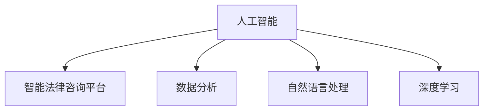
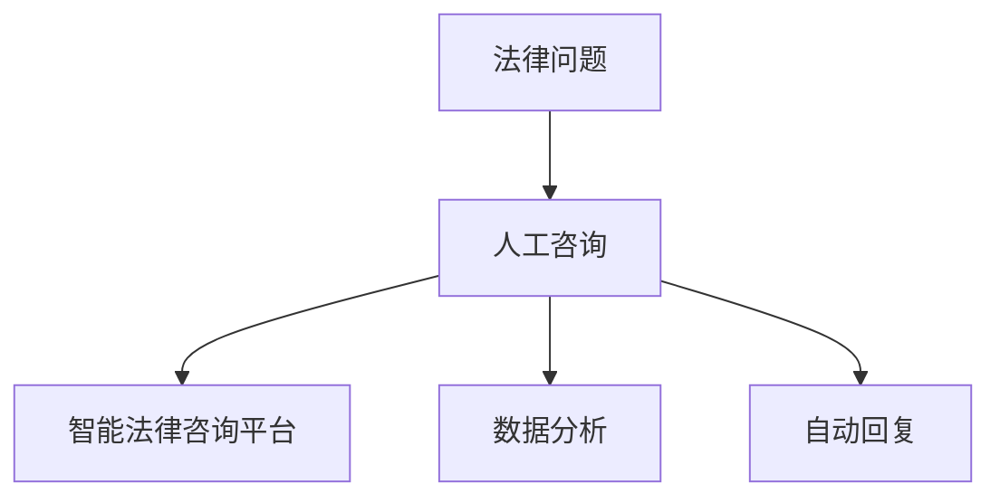
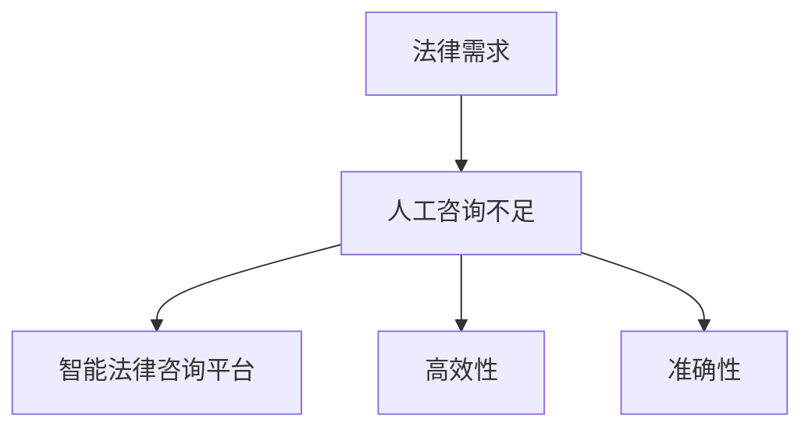
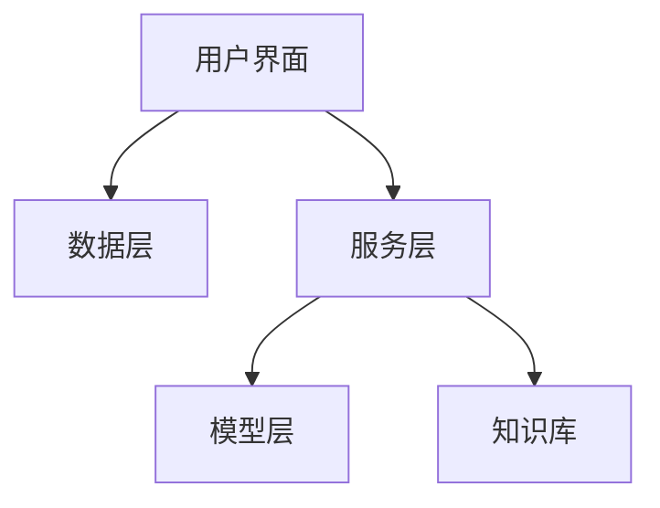
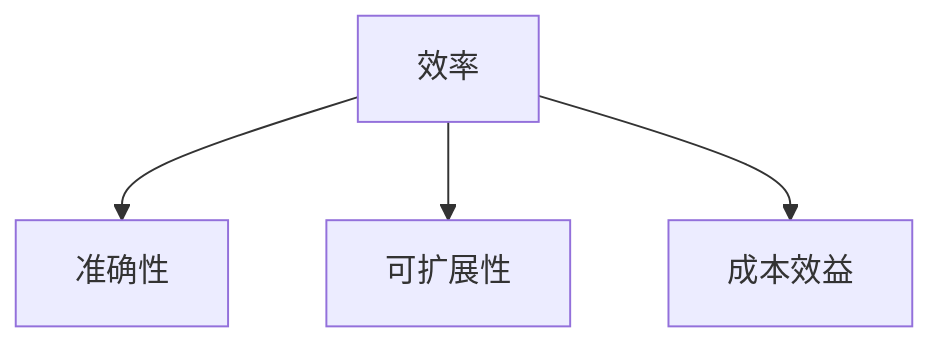
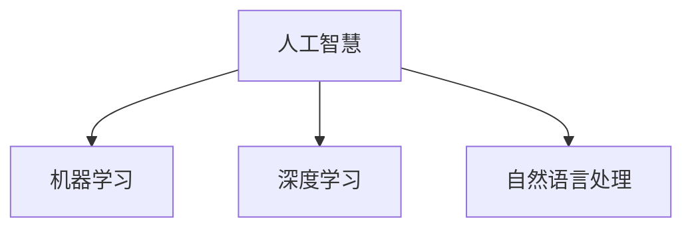
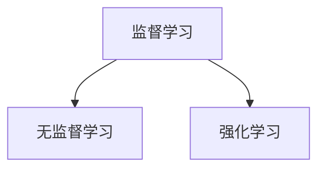
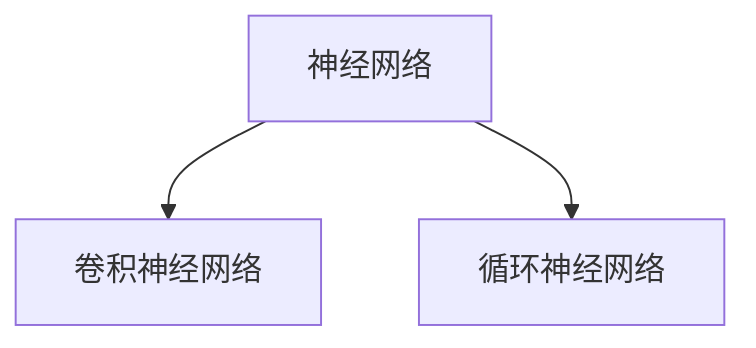
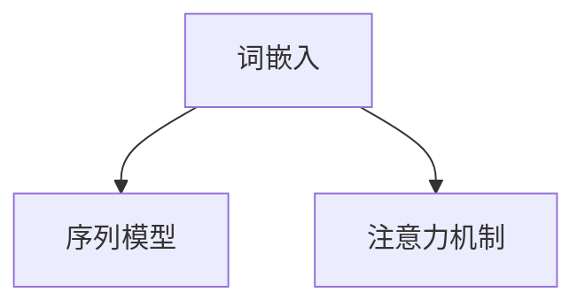
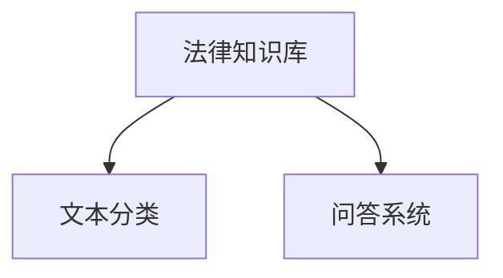

                 

# 《基于AI大模型的智能法律咨询平台》

> **关键词**：人工智能、法律咨询、AI大模型、自然语言处理、深度学习、智能平台、法律知识库

> **摘要**：
本文将深入探讨基于AI大模型的智能法律咨询平台的构建与实现。首先，我们将介绍智能法律咨询平台的基本概念、必要性及架构。接着，我们将详细解析人工智能核心概念与架构，包括机器学习、深度学习和自然语言处理技术。随后，我们将重点探讨智能法律咨询平台的核心技术，如自然语言处理技术、深度学习与神经网络技术以及法律知识库的构建与更新。接着，我们将通过实战案例展示智能法律咨询平台的开发流程、核心模块设计与实现，以及性能优化与安全性保障。最后，我们将分析智能法律咨询平台的应用与挑战，展望其未来发展趋势。

## 第一部分：智能法律咨询平台概述

### 第1章：AI与智能法律咨询平台

#### 1.1 AI的定义与作用

**核心概念与联系**：

- **Mermaid 流程图**：



**人工智能基础**：

- **伪代码**：

```python
def ai_base(data):
    # 数据预处理
    preprocessed_data = preprocess(data)
    
    # 模型训练
    model = train_model(preprocessed_data)
    
    # 模型预测
    predictions = model.predict(data)
    
    return predictions
```

**人工智能定义**：

人工智能（Artificial Intelligence，简称AI）是指通过计算机程序和算法模拟、扩展人类智能的理论、方法、技术及应用。它包括机器学习、深度学习、自然语言处理、计算机视觉等多个子领域。

**人工智能作用**：

- **数据分析**：人工智能能够对大量数据进行分析，发现数据中的模式和规律。
- **自然语言处理**：人工智能能够理解和生成自然语言，实现人机交互。
- **深度学习**：人工智能通过深度学习算法，可以从大量数据中自动学习特征，提高模型的预测准确性。

#### 1.2 智能法律咨询平台的背景

**核心概念与联系**：

- **Mermaid 流程图**：



**智能法律咨询发展**：

随着人工智能技术的快速发展，智能法律咨询平台应运而生。它通过自然语言处理、机器学习和深度学习等技术，实现了对法律问题的自动解答和智能分析。

**智能法律咨询必要性**：

- **提高效率**：智能法律咨询平台能够快速响应法律咨询，提高法律服务的效率。
- **降低成本**：智能法律咨询平台可以减少人力成本，降低法律服务的价格。
- **提升准确性**：智能法律咨询平台通过大数据分析和深度学习算法，能够提供更加准确的法律咨询。

**智能法律咨询平台架构**：

智能法律咨询平台主要包括用户界面、数据层、服务层、模型层和知识库等组件。

- **用户界面**：提供用户与智能法律咨询平台交互的界面。
- **数据层**：负责收集、存储和管理法律咨询相关的数据。
- **服务层**：提供各种法律咨询服务，如法律文本分析、自动回复等。
- **模型层**：包含各种机器学习模型和深度学习模型，用于处理法律咨询问题。
- **知识库**：存储大量的法律知识，为智能法律咨询平台提供知识支持。

#### 1.3 智能法律咨询平台的必要性

**核心概念与联系**：

- **Mermaid 流程图**：



**必要性分析**：

随着社会经济的发展，人们对法律服务的需求日益增长。然而，传统的人工法律咨询服务存在以下不足：

- **人力资源限制**：传统的人工法律咨询服务依赖于专业律师，但律师数量有限，难以满足大量用户的需求。
- **效率低下**：人工法律咨询服务往往需要较长的时间来处理案件，影响用户的满意度。
- **成本高昂**：人工法律咨询服务费用较高，使得部分用户无法承担。

智能法律咨询平台能够解决上述问题，具有以下必要性：

- **高效性**：智能法律咨询平台能够快速响应法律咨询，提高法律服务的效率。
- **准确性**：智能法律咨询平台通过大数据分析和深度学习算法，能够提供更加准确的法律咨询。
- **降低成本**：智能法律咨询平台可以减少人力成本，降低法律服务的价格，让更多用户能够享受优质的法律服务。

#### 1.4 智能法律咨询平台的架构

**核心概念与联系**：

- **Mermaid 流程图**：



**架构组件**：

智能法律咨询平台架构主要由以下组件组成：

- **用户界面**：提供用户与智能法律咨询平台交互的界面，包括网页、移动应用等。
- **数据层**：负责收集、存储和管理法律咨询相关的数据，如法律文本、案例数据等。
- **服务层**：提供各种法律咨询服务，如法律文本分析、自动回复、法律知识查询等。
- **模型层**：包含各种机器学习模型和深度学习模型，用于处理法律咨询问题。
- **知识库**：存储大量的法律知识，为智能法律咨询平台提供知识支持。

**架构工作原理**：

1. 用户通过用户界面提交法律咨询问题。
2. 服务层接收用户问题，调用模型层中的机器学习模型和深度学习模型进行文本分析和知识查询。
3. 模型层处理用户问题，生成相应的法律咨询答案。
4. 服务层将答案返回给用户界面，用户界面将答案展示给用户。

#### 1.5 智能法律咨询平台的优势

**核心概念与联系**：

- **Mermaid 流程图**：



**优势分析**：

智能法律咨询平台相比传统法律咨询服务，具有以下优势：

- **效率**：智能法律咨询平台能够快速响应法律咨询，提高法律服务的效率。
- **准确性**：智能法律咨询平台通过大数据分析和深度学习算法，能够提供更加准确的法律咨询。
- **可扩展性**：智能法律咨询平台可以根据用户需求，快速扩展法律咨询的范围和内容。
- **成本效益**：智能法律咨询平台可以降低人力成本，提高法律服务的性价比。

### 第二部分：人工智能核心概念与架构

#### 第2章：人工智能核心概念与架构

#### 2.1 人工智能的定义与分类

**核心概念与联系**：

- **Mermaid 流程图**：



人工智能（AI）是一种模拟、扩展甚至超越人类智能的技术。它包括多个子领域，其中机器学习、深度学习和自然语言处理是核心部分。

**人工智能分类**：

- **机器学习**：通过训练模型，使计算机能够自动从数据中学习规律，并进行预测和决策。
- **深度学习**：一种特殊的机器学习技术，通过模拟人脑神经网络结构，实现自动学习和特征提取。
- **自然语言处理**：研究计算机如何理解和生成自然语言，实现人机交互。

#### 2.2 机器学习基础

**核心概念与联系**：

- **Mermaid 流程图**：



机器学习是人工智能的重要分支，主要包括以下类型：

- **监督学习**：通过训练数据集，使模型能够对新的数据进行分类或回归。
- **无监督学习**：通过未标记的数据，使模型能够发现数据中的结构和模式。
- **强化学习**：通过奖励机制，使模型能够在不确定的环境中做出最优决策。

**机器学习算法**：

- **伪代码**：

```python
def machine_learning_algorithm(type, data):
    if type == "监督学习":
        model = SupervisedLearningModel()
        model.train(data)
        return model.predict(data)
    elif type == "无监督学习":
        model = UnsupervisedLearningModel()
        model.train(data)
        return model.analyze(data)
    elif type == "强化学习":
        model = ReinforcementLearningModel()
        model.train(data)
        return model.decide(data)
    else:
        return "未知算法"
```

#### 2.3 深度学习原理

**核心概念与联系**：

- **Mermaid 流程图**：



深度学习是一种基于神经网络的机器学习技术，主要通过模拟人脑神经网络结构，实现自动学习和特征提取。

- **神经网络**：一种由大量神经元组成的网络结构，能够通过学习输入数据，实现复杂的非线性变换。
- **卷积神经网络**：一种特殊的神经网络，通过卷积操作，能够有效地提取图像特征。
- **循环神经网络**：一种特殊的神经网络，通过循环结构，能够处理序列数据，实现时间序列预测。

**深度学习模型**：

- **伪代码**：

```python
def deep_learning_model(type, data):
    if type == "卷积神经网络":
        model = ConvolutionalNeuralNetwork()
        model.train(data)
        return model.predict(data)
    elif type == "循环神经网络":
        model = RecurrentNeuralNetwork()
        model.train(data)
        return model.predict(data)
    else:
        return "未知模型"
```

#### 2.4 自然语言处理基础

**核心概念与联系**：

- **Mermaid 流程图**：



自然语言处理（NLP）是人工智能的一个重要分支，主要研究计算机如何理解和生成自然语言。

- **词嵌入**：将自然语言中的单词映射到高维向量空间，实现语义表示。
- **序列模型**：一种能够处理序列数据的神经网络模型，如循环神经网络（RNN）。
- **注意力机制**：一种能够提高模型对序列数据中重要信息关注度的机制。

**自然语言处理算法**：

- **伪代码**：

```python
def natural_language_processing_algorithm(type, text):
    if type == "词嵌入":
        embeddings = WordEmbedding()
        return embeddings.generate_embeddings(text)
    elif type == "序列模型":
        model = SequentialModel()
        model.train(text)
        return model.predict(text)
    elif type == "注意力机制":
        model = AttentionMechanism()
        model.train(text)
        return model.predict(text)
    else:
        return "未知算法"
```

#### 2.5 智能法律咨询平台的核心算法

**核心概念与联系**：

- **Mermaid 流程图**：



智能法律咨询平台的核心算法主要包括文本分类和问答系统。

**法律知识库**：存储大量的法律知识，为智能法律咨询平台提供知识支持。

**文本分类**：将法律文本分类到不同的类别，如合同、侵权等。

**问答系统**：通过训练模型，实现法律问题的自动解答。

**核心算法实现**：

- **伪代码**：

```python
class IntelligentLegalAlgorithm:
    def __init__(self, knowledge_base):
        self.knowledge_base = knowledge_base
        
    def classify_query(self, query):
        # 使用文本分类算法对查询进行分类
        category = self.knowledge_base.classify_query(query)
        return category
        
    def answer_query(self, query):
        # 使用问答系统对查询进行回答
        answer = self.knowledge_base.answer_query(query)
        return answer
```

#### 2.6 智能法律咨询平台的技术架构

**核心概念与联系**：

- **Mermaid 流程图**：


智能法律咨询平台的技术架构主要包括用户界面、数据层、服务层、模型层和知识库等组件。

**技术架构组件**：

- **用户界面**：提供用户与智能法律咨询平台交互的界面。
- **数据层**：负责收集、存储和管理法律咨询相关的数据。
- **服务层**：提供各种法律咨询服务，如法律文本分析、自动回复等。
- **模型层**：包含各种机器学习模型和深度学习模型，用于处理法律咨询问题。
- **知识库**：存储大量的法律知识，为智能法律咨询平台提供知识支持。

**技术架构工作原理**：

1. 用户通过用户界面提交法律咨询问题。
2. 数据层接收用户问题，并将其转换为模型可处理的数据格式。
3. 服务层调用模型层中的机器学习模型和深度学习模型，对用户问题进行文本分析和知识查询。
4. 模型层处理用户问题，生成相应的法律咨询答案。
5. 服务层将答案返回给用户界面，用户界面将答案展示给用户。

### 第三部分：智能法律咨询平台核心技术

#### 第3章：自然语言处理技术

自然语言处理（NLP）是智能法律咨询平台的核心技术之一。它涉及到如何使计算机理解和生成自然语言，从而实现人机交互。本章将详细介绍自然语言处理技术，包括词嵌入、语义分析、文本分类、情感分析、命名实体识别、关系抽取、语言生成和问答系统等内容。

#### 3.1 词嵌入与语义分析

词嵌入（Word Embedding）是将自然语言中的单词映射到高维向量空间的技术。通过词嵌入，我们可以将单词的语义信息转化为数值向量，从而方便计算机处理。

- **核心概念与联系**：

  - **Mermaid 流程图**：

    ```mermaid
    graph TB
    A[词嵌入] --> B[语义分析]
    A --> C[文本分类]
    ```

- **词嵌入算法**：

  词嵌入算法有多种，如Word2Vec、GloVe、BERT等。其中，Word2Vec是一种基于神经网络的语言模型。

  - **伪代码**：

    ```python
    def word_embedding(text):
        embeddings = []
        for word in text:
            embedding = get_embedding(word)
            embeddings.append(embedding)
        return embeddings
    
    def semantic_analysis(text, embeddings):
        analyzed_text = []
        for word, embedding in zip(text, embeddings):
            analysis = analyze_semantics(word, embedding)
            analyzed_text.append(analysis)
        return analyzed_text
    ```

#### 3.2 文本分类与情感分析

文本分类（Text Classification）是将文本数据分类到预定义的类别。情感分析（Sentiment Analysis）是文本分类的一种，用于判断文本的情感倾向。

- **核心概念与联系**：

  - **Mermaid 流程图**：

    ```mermaid
    graph TB
    A[文本分类] --> B[情感分析]
    A --> C[命名实体识别]
    ```

- **文本分类算法**：

  文本分类算法有基于规则的方法和基于机器学习的方法。其中，朴素贝叶斯、逻辑回归、支持向量机等是常用的机器学习算法。

  - **伪代码**：

    ```python
    def text_classification(text, model):
        categories = model.classify(text)
        return categories
    
    def sentiment_analysis(text, model):
        sentiment = model.analyze_sentiment(text)
        return sentiment
    ```

#### 3.3 命名实体识别与关系抽取

命名实体识别（Named Entity Recognition，简称NER）是识别文本中的命名实体，如人名、地名、组织名等。关系抽取（Relation Extraction）是识别实体之间的关系。

- **核心概念与联系**：

  - **Mermaid 流程图**：

    ```mermaid
    graph TB
    A[命名实体识别] --> B[关系抽取]
    A --> C[文本分类]
    ```

- **命名实体识别算法**：

  命名实体识别算法有基于规则的方法和基于机器学习的方法。其中，条件随机场（CRF）、BiLSTM-CRF等是常用的机器学习算法。

  - **伪代码**：

    ```python
    def named_entity_recognition(text, model):
        entities = model.recognize_entities(text)
        return entities
    
    def relation_extraction(text, entities, model):
        relations = model.extract_relations(text, entities)
        return relations
    ```

#### 3.4 语言生成与问答系统

语言生成（Language Generation）是生成自然语言文本，如自动写作、机器翻译等。问答系统（Question Answering，简称QA）是回答用户提出的问题。

- **核心概念与联系**：

  - **Mermaid 流程图**：

    ```mermaid
    graph TB
    A[语言生成] --> B[问答系统]
    A --> C[文本分类]
    ```

- **语言生成算法**：

  语言生成算法有基于规则的方法和基于机器学习的方法。其中，生成对抗网络（GAN）、变换器（Transformer）等是常用的机器学习算法。

  - **伪代码**：

    ```python
    def language_generation(text, model):
        generated_text = model.generate_text(text)
        return generated_text
    
    def question_answering(question, model):
        answer = model.answer_question(question)
        return answer
    ```

#### 3.5 自然语言处理技术实现与优化

自然语言处理技术的实现和优化是构建智能法律咨询平台的关键。实现方面，我们需要选择合适的算法和工具，如TensorFlow、PyTorch等深度学习框架。优化方面，我们需要关注模型的性能、准确性和鲁棒性。

- **核心概念与联系**：

  - **Mermaid 流程图**：

    ```mermaid
    graph TB
    A[词嵌入] --> B[神经网络]
    A --> C[优化算法]
    ```

- **实现与优化**：

  - **伪代码**：

    ```python
    def implement_natural_language_processing(text):
        embeddings = word_embedding(text)
        neural_network = NeuralNetwork(embeddings)
        optimized_network = optimize_network(neural_network)
        return optimized_network
    
    def optimize_natural_language_processing(model):
        optimized_model = optimize_network(model)
        return optimized_model
    ```

通过以上内容，我们可以看到自然语言处理技术在智能法律咨询平台中起着至关重要的作用。接下来，我们将进一步探讨深度学习与神经网络技术在智能法律咨询平台中的应用。

### 第4章：深度学习与神经网络

深度学习与神经网络是人工智能领域的重要分支，它们在智能法律咨询平台的构建中发挥着核心作用。本章将详细介绍深度学习的基本原理、常见神经网络架构、深度学习框架以及深度学习算法，并探讨如何将这些技术应用于法律咨询领域。

#### 4.1 神经网络基础

神经网络（Neural Networks）是一种模仿人脑神经元结构和功能的计算模型。它由大量的神经元（节点）和连接（边）组成，通过学习和处理输入数据，能够自动提取特征并进行预测。

- **核心概念与联系**：

  - **Mermaid 流程图**：

    ```mermaid
    graph TB
    A[神经元] --> B[神经网络]
    A --> C[反向传播]
    ```

- **神经网络算法**：

  神经网络通过以下步骤进行学习：

  1. **前向传播**：输入数据通过神经网络的各个层，逐层计算输出。
  2. **激活函数**：用于引入非线性，使神经网络能够建模复杂函数。
  3. **反向传播**：计算损失函数对网络参数的梯度，用于更新网络权重。

  - **伪代码**：

    ```python
    def neural_network(input_data):
        layer_outputs = []
        for layer in layers:
            output = layer.forward_pass(input_data)
            layer_outputs.append(output)
        return layer_outputs
    
    def backward_propagation(error, model):
        gradients = []
        for layer in reversed(layers):
            gradient = layer.backward_pass(error)
            gradients.append(gradient)
        return gradients
    ```

#### 4.2 深度学习框架

深度学习框架是用于构建和训练深度学习模型的高级工具。常见的深度学习框架包括TensorFlow、PyTorch、MXNet等，它们提供了丰富的API和工具，使开发者能够方便地实现各种深度学习算法。

- **核心概念与联系**：

  - **Mermaid 流程图**：

    ```mermaid
    graph TB
    A[TensorFlow] --> B[PyTorch]
    A --> C[MXNet]
    ```

- **框架选择**：

  选择合适的深度学习框架取决于项目的需求和开发者的熟悉程度。例如，TensorFlow和PyTorch因其灵活性和丰富的API而被广泛使用。

  - **伪代码**：

    ```python
    def select_framework(type):
        if type == "TensorFlow":
            return TensorFlowFramework()
        elif type == "PyTorch":
            return PyTorchFramework()
        elif type == "MXNet":
            return MXNetFramework()
        else:
            return "未知框架"
    ```

#### 4.3 深度学习算法

深度学习算法是构建深度学习模型的核心，包括卷积神经网络（CNN）、循环神经网络（RNN）、长短时记忆网络（LSTM）、变换器（Transformer）等。

- **核心概念与联系**：

  - **Mermaid 流程图**：

    ```mermaid
    graph TB
    A[卷积神经网络] --> B[循环神经网络]
    A --> C[生成对抗网络]
    ```

- **深度学习模型**：

  这些深度学习模型在不同应用场景中具有独特的优势。例如，卷积神经网络在图像处理和计算机视觉中表现优异，循环神经网络在序列数据处理和时间序列预测中具有优势。

  - **伪代码**：

    ```python
    def convolutional_neural_network(input_data):
        model = ConvolutionalNeuralNetwork()
        model.train(input_data)
        return model.predict(input_data)
    
    def recurrent_neural_network(input_data):
        model = RecurrentNeuralNetwork()
        model.train(input_data)
        return model.predict(input_data)
    
    def generative_adversarial_network(input_data):
        model = GenerativeAdversarialNetwork()
        model.train(input_data)
        return model.predict(input_data)
    ```

#### 4.4 深度学习模型优化

深度学习模型的优化是提高模型性能和准确性的关键步骤。优化方法包括调整超参数、使用更高效的算法、增加数据增强等。

- **核心概念与联系**：

  - **Mermaid 流程图**：

    ```mermaid
    graph TB
    A[损失函数] --> B[优化算法]
    A --> C[超参数调整]
    ```

- **模型优化**：

  模型优化包括以下方面：

  1. **损失函数**：选择合适的损失函数，以衡量模型的预测误差。
  2. **优化算法**：如随机梯度下降（SGD）、Adam等，用于更新模型参数。
  3. **超参数调整**：调整学习率、批量大小等超参数，以优化模型性能。

  - **伪代码**：

    ```python
    def optimize_model(model, loss_function, optimizer, hyperparameters):
        model.compile(optimizer=optimizer, loss=loss_function, metrics=hyperparameters)
        model.fit(train_data, validation_data)
        return model
    ```

#### 4.5 深度学习在法律咨询中的应用

深度学习在法律咨询中的应用主要包括法律文本分类、法律文本分析、法律知识图谱构建等。通过深度学习技术，我们可以实现自动化的法律文本处理和分析，提高法律服务的效率和准确性。

- **核心概念与联系**：

  - **Mermaid 流程图**：

    ```mermaid
    graph TB
    A[深度学习] --> B[文本分类]
    A --> C[法律知识库]
    ```

- **应用场景**：

  深度学习在法律咨询中的应用场景包括：

  1. **法律文本分类**：将法律文本分类到预定义的类别，如合同、侵权等。
  2. **法律文本分析**：提取法律文本中的关键信息，如法条、司法解释等。
  3. **法律知识图谱构建**：构建法律知识图谱，实现法律知识的结构化和自动化查询。

  - **伪代码**：

    ```python
    def apply_deep_learning_to_legal_consultation(text_data):
        model = deep_learning_model("文本分类", text_data)
        classified_data = model.predict(text_data)
        return classified_data
    
    def build_legal_knowledge_base(text_data, model):
        knowledge_base = LegalKnowledgeBase()
        knowledge_base.update_data(model, text_data)
        return knowledge_base
    ```

通过以上内容，我们可以看到深度学习与神经网络技术在智能法律咨询平台中具有广泛的应用前景。接下来，我们将进一步探讨法律知识库的构建与更新，以实现更智能、更准确的法律咨询。

### 第5章：法律知识库构建与更新

法律知识库是智能法律咨询平台的核心组成部分，它包含了大量法律条文、案例、法理知识等信息，为平台提供了丰富的法律知识支持。本章将详细介绍法律知识库的概念、构建方法、更新策略、质量评估以及在实际应用中的案例分析。

#### 5.1 法律知识库的概念与作用

法律知识库是指以数字化的方式存储和管理法律条文、案例、法理知识等法律信息的系统。它通过结构化和半结构化的方式，对法律信息进行分类、索引和查询，为智能法律咨询平台提供数据支持。

- **核心概念与联系**：

  - **Mermaid 流程图**：

    ```mermaid
    graph TB
    A[法律知识库] --> B[法律文档]
    A --> C[法律知识]
    ```

- **法律知识库的定义**：

  法律知识库的定义可以概括为：

  - **法律文档**：指各种法律文件，包括法律条文、司法解释、案例分析、法律意见书等。
  - **法律知识**：指从法律文档中提取出的有用信息，如法律条文的内容、案例的判决理由、法律关系的分析等。

  - **伪代码**：

    ```python
    class LegalKnowledgeBase:
        def __init__(self):
            self.documents = []
            self.knowledge = {}
        
        def add_document(self, document):
            self.documents.append(document)
            self.update_knowledge(document)
        
        def update_knowledge(self, document):
            # 分析文档中的法律知识
            knowledge = analyze_document(document)
            self.knowledge.update(knowledge)
    ```

#### 5.2 法律知识库的构建方法

法律知识库的构建是一个复杂的过程，需要从大量的法律文档中提取有用的信息，并对其进行结构化和整合。

- **核心概念与联系**：

  - **Mermaid 流程图**：

    ```mermaid
    graph TB
    A[法律文档收集] --> B[法律知识提取]
    A --> C[法律知识整合]
    ```

- **构建流程**：

  法律知识库的构建流程包括以下步骤：

  1. **法律文档收集**：从各种来源收集法律文档，如法律条文库、案例库、法学期刊等。
  2. **法律知识提取**：使用自然语言处理技术和深度学习算法，从法律文档中提取法律知识。
  3. **法律知识整合**：将提取出的法律知识进行结构化整合，形成法律知识库。

  - **伪代码**：

    ```python
    def build_legal_knowledge_base():
        # 收集法律文档
        documents = collect_legal_documents()
        
        # 提取法律知识
        knowledge = extract_legal_knowledge(documents)
        
        # 整合法律知识
        integrated_knowledge = integrate_knowledge(knowledge)
        
        return integrated_knowledge
    ```

#### 5.3 法律知识库的更新策略

法律知识库的更新是确保其准确性和时效性的关键。法律知识库的更新策略包括法律变化的监测、用户反馈的收集以及知识库的定期更新。

- **核心概念与联系**：

  - **Mermaid 流程图**：

    ```mermaid
    graph TB
    A[法律变化监测] --> B[知识库更新]
    A --> C[用户反馈]
    ```

- **更新策略**：

  法律知识库的更新策略包括以下方面：

  1. **法律变化监测**：通过爬虫、法律数据库等方式，定期监测法律条文的变更和案例的更新。
  2. **用户反馈**：收集用户在使用法律知识库时提供的反馈，包括知识的准确性、实用性等。
  3. **知识库更新**：根据法律变化和用户反馈，对知识库进行定期更新和优化。

  - **伪代码**：

    ```python
    def update_legal_knowledge_base():
        # 监测法律变化
        changes = monitor_legal_changes()
        
        # 更新知识库
        knowledge_base = update_knowledge_base(changes)
        
        # 收集用户反馈
        feedback = collect_user_feedback()
        
        # 根据反馈调整知识库
        adjusted_knowledge_base = adjust_knowledge_base(feedback, knowledge_base)
        
        return adjusted_knowledge_base
    ```

#### 5.4 法律知识库的质量评估

法律知识库的质量直接影响智能法律咨询平台的性能和用户满意度。质量评估包括知识库的准确性、完整性、一致性等方面。

- **核心概念与联系**：

  - **Mermaid 流程图**：

    ```mermaid
    graph TB
    A[知识库质量] --> B[评估指标]
    A --> C[评估方法]
    ```

- **质量评估**：

  法律知识库的质量评估可以从以下几个方面进行：

  1. **准确性**：评估知识库中的法律信息的准确性，包括法律条文、案例等。
  2. **完整性**：评估知识库中法律信息的完整性，确保所有相关的法律信息都被收录。
  3. **一致性**：评估知识库中的法律信息是否一致，避免出现冲突或矛盾。

  - **伪代码**：

    ```python
    def evaluate_knowledge_base(knowledge_base):
        # 定义评估指标
        metrics = define_evaluation_metrics()
        
        # 评估知识库质量
        quality = evaluate_knowledge_base(knowledge_base, metrics)
        
        return quality
    ```

#### 5.5 法律知识库在实际应用中的案例分析

法律知识库在实际应用中的案例分析可以帮助我们了解其作用和效果。以下是一个具体的案例：

- **案例**：某公司需要咨询关于劳动合同的法律问题。智能法律咨询平台通过法律知识库，快速提取相关法律条文、案例和法理知识，为该公司提供全面的合同法律咨询。

- **核心概念与联系**：

  - **Mermaid 流程图**：

    ```mermaid
    graph TB
    A[法律知识库应用] --> B[案例]
    A --> C[效果评估]
    ```

- **案例研究**：

  在这个案例中，法律知识库的应用包括：

  1. **法律条文查询**：提取与劳动合同相关的法律条文。
  2. **案例查询**：查询相关劳动合同纠纷的案例，分析判决理由。
  3. **法理知识解析**：解析劳动合同的法律规定和法理。

  - **伪代码**：

    ```python
    def case_study(knowledge_base, case):
        # 应用知识库解决案例
        solution = apply_knowledge_base(knowledge_base, case)
        
        # 评估效果
        evaluation = evaluate_solution(solution)
        
        return evaluation
    ```

通过以上内容，我们可以看到法律知识库在智能法律咨询平台中的重要作用。接下来，我们将探讨智能法律咨询平台的具体实现过程，包括开发流程、核心模块设计、应用场景分析和性能优化与调试。

### 第6章：智能法律咨询平台实战

#### 6.1 智能法律咨询平台的开发流程

智能法律咨询平台的开发是一个复杂的过程，需要从需求分析、设计阶段、开发阶段到测试阶段逐步进行。以下是具体的开发流程和每个阶段的关键任务。

**开发流程**：

1. **需求分析**：与用户和利益相关者沟通，了解他们对智能法律咨询平台的需求，包括功能、性能和用户体验等方面的要求。

2. **设计阶段**：基于需求分析的结果，设计系统的架构和组件，包括用户界面、数据层、服务层、模型层和知识库等。

3. **开发阶段**：根据设计文档，使用编程语言和开发工具，实现系统的各个组件和功能。

4. **测试阶段**：对系统进行功能测试、性能测试和安全测试，确保系统能够正常运行，满足用户需求。

**关键任务**：

- **需求分析**：

  - **伪代码**：

    ```python
    def analyze_requirements():
        requirements = []
        for stakeholder in stakeholders:
            input = stakeholder.get_requirements()
            requirements.extend(input)
        return requirements
    ```

- **设计阶段**：

  - **伪代码**：

    ```python
    def design_platform(requirements):
        design = {
            "user_interface": UI_design,
            "data_layer": data_layer_design,
            "service_layer": service_layer_design,
            "model_layer": model_layer_design,
            "knowledge_base": knowledge_base_design
        }
        return design
    ```

- **开发阶段**：

  - **伪代码**：

    ```python
    def develop_platform(design):
        platform = IntelligentLegalPlatform(design)
        platform.build()
        return platform
    ```

- **测试阶段**：

  - **伪代码**：

    ```python
    def test_platform(platform):
        test_results = platform.test()
        return test_results
    ```

#### 6.2 智能法律咨询平台的核心模块设计与实现

智能法律咨询平台的核心模块包括用户界面、数据层、服务层、模型层和知识库。以下是每个模块的设计和实现细节。

**用户界面**：

用户界面是用户与智能法律咨询平台交互的入口。它需要设计简洁、直观，使用户能够方便地提交法律咨询问题并接收答案。

- **设计**：

  - **伪代码**：

    ```python
    def UI_design():
        UI_components = ["查询输入框", "答案展示区", "导航栏"]
        return UI_components
    ```

- **实现**：

  - **伪代码**：

    ```python
    def build_UI(UI_components):
        UI = UserInterface(UI_components)
        UI.display()
    ```

**数据层**：

数据层负责收集、存储和管理与法律咨询相关的数据，包括法律文档、案例、法理知识等。

- **设计**：

  - **伪代码**：

    ```python
    def data_layer_design():
        data_components = ["文档数据库", "案例数据库", "知识库"]
        return data_components
    ```

- **实现**：

  - **伪代码**：

    ```python
    def build_data_layer(data_components):
        data_layer = DataLayer(data_components)
        data_layer.initialize()
    ```

**服务层**：

服务层提供各种法律咨询服务，包括法律文本分析、自动回复、法律知识查询等。

- **设计**：

  - **伪代码**：

    ```python
    def service_layer_design():
        service_components = ["文本分析服务", "自动回复服务", "知识查询服务"]
        return service_components
    ```

- **实现**：

  - **伪代码**：

    ```python
    def build_service_layer(service_components):
        service_layer = ServiceLayer(service_components)
        service_layer.start()
    ```

**模型层**：

模型层包含各种机器学习模型和深度学习模型，用于处理法律咨询问题。

- **设计**：

  - **伪代码**：

    ```python
    def model_layer_design():
        model_components = ["文本分类模型", "问答模型", "情感分析模型"]
        return model_components
    ```

- **实现**：

  - **伪代码**：

    ```python
    def build_model_layer(model_components):
        model_layer = ModelLayer(model_components)
        model_layer.train()
    ```

**知识库**：

知识库存储大量的法律知识，为智能法律咨询平台提供数据支持。

- **设计**：

  - **伪代码**：

    ```python
    def knowledge_base_design():
        knowledge_components = ["法律条文库", "案例库", "法理知识库"]
        return knowledge_components
    ```

- **实现**：

  - **伪代码**：

    ```python
    def build_knowledge_base(knowledge_components):
        knowledge_base = KnowledgeBase(knowledge_components)
        knowledge_base.update()
    ```

#### 6.3 智能法律咨询平台的应用场景分析

智能法律咨询平台可以应用于多个场景，包括个人用户法律咨询、企业法律顾问、法律纠纷解决、法律研究和智能化法律服务。

**个人用户法律咨询**：

个人用户可以通过智能法律咨询平台获取关于家庭、婚姻、劳动等方面的法律咨询。

- **应用场景**：

  - **伪代码**：

    ```python
    def personal_legal_consultation(platform, user_query):
        response = platform.service_layer.process_query(user_query, platform.model_layer, platform.knowledge_base)
        platform.user_interface.display_response(response)
   

