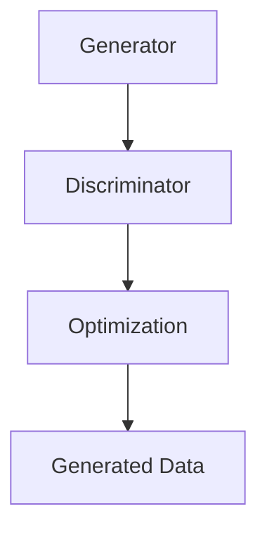

                 

### 第一部分：生成对抗网络基础

#### 第1章：生成对抗网络（GAN）概述

#### 1.1 GAN的概念与原理

**1.1.1 GAN的定义**

生成对抗网络（Generative Adversarial Networks，GAN）由Ian Goodfellow等人于2014年提出，是一种基于博弈理论的生成模型。GAN主要由两个神经网络组成：生成器（Generator）和判别器（Discriminator）。生成器的任务是生成数据，判别器的任务是区分真实数据和生成数据。这两个网络相互对抗，不断优化，最终使得生成器生成更加逼真的数据。

**1.1.2 GAN的核心组件**

1. **生成器（Generator）**：接收随机噪声作为输入，生成与真实数据相似的数据。生成器的目标是通过生成尽量逼真的数据来欺骗判别器。

2. **判别器（Discriminator）**：接收真实数据和生成数据作为输入，输出一个概率值，表示输入数据的真实性。判别器的目标是通过区分真实数据和生成数据来击败生成器。

**1.1.3 GAN的发展历程**

GAN自提出以来，受到了广泛关注和研究。从最初的原始GAN（Goodfellow等，2014），到改进的深度GAN（Denton等，2015），再到变分GAN（Kingma等，2014），循环一致GAN（Radford等，2016）等，GAN的发展历程见证了其在图像处理、自然语言处理等多个领域的广泛应用。

**1.2 GAN的优势与挑战**

**1.2.1 GAN的优势**

1. **生成效果优秀**：GAN生成的数据质量通常很高，能够生成与真实数据非常相似的数据。

2. **应用范围广泛**：GAN在图像生成、图像修复、图像超分辨率、自然语言生成等领域都有广泛应用。

3. **无需标注数据**：与传统的生成模型不同，GAN不需要大量的标注数据进行训练，可以通过生成器自行生成数据。

**1.2.2 GAN的挑战**

1. **训练不稳定**：GAN的训练过程非常不稳定，有时会导致生成器或判别器过拟合，从而影响生成效果。

2. **计算资源消耗大**：由于GAN的训练过程需要大量计算资源，因此在大规模数据集上训练GAN模型较为困难。

#### 第2章：GAN数学模型

##### 2.1 GAN的生成模型与判别模型

**2.1.1 生成模型**

生成模型的主要任务是生成与真实数据相似的数据。生成模型的输入是一个随机噪声向量 $z$，输出是生成数据 $G(z)$。生成模型通常采用多层神经网络结构，如卷积神经网络（CNN）或循环神经网络（RNN）。

**2.1.2 判别模型**

判别模型的主要任务是区分真实数据和生成数据。判别模型的输入是真实数据 $x$ 和生成数据 $G(z)$，输出是一个概率值 $D(x)$，表示输入数据是真实数据的概率。判别模型也通常采用多层神经网络结构。

**2.2 GAN的优化算法**

GAN的训练过程实际上是一个博弈过程，生成器和判别器相互对抗，不断优化。优化算法的核心是损失函数的设计。

**2.2.1 优化算法概述**

GAN的优化算法主要基于最小化生成器的损失函数和最大化判别器的损失函数。生成器的损失函数通常定义为：
$$
L_G = -\mathbb{E}_{z \sim p_z(z)}[\log D(G(z))]
$$
判别器的损失函数通常定义为：
$$
L_D = -\mathbb{E}_{x \sim p_x(x)}[\log D(x)] - \mathbb{E}_{z \sim p_z(z)}[\log (1 - D(G(z))]
$$
**2.2.2 梯度惩罚策略**

由于生成器和判别器都是深度神经网络，因此在训练过程中，梯度可能消失或爆炸。为了解决这个问题，可以采用梯度惩罚策略。

梯度惩罚策略的基本思想是在判别器的损失函数中加入一个额外的正则项，以限制生成器和判别器的梯度变化。具体地，可以将判别器的损失函数修改为：
$$
L_D = -\mathbb{E}_{x \sim p_x(x)}[\log D(x)] - \mathbb{E}_{z \sim p_z(z)}[\log (1 - D(G(z))] + \lambda ||\nabla_{x}D(x)||_2^2
$$
其中，$\lambda$ 是一个超参数，用于调节正则项的权重。

通过梯度惩罚策略，可以有效地限制生成器和判别器的梯度变化，从而提高训练稳定性。

### 总结

生成对抗网络（GAN）是一种基于博弈理论的生成模型，由生成器和判别器两个神经网络组成。生成器的任务是生成与真实数据相似的数据，判别器的任务是区分真实数据和生成数据。GAN的数学模型包括生成模型、判别模型和优化算法。通过最小化生成器的损失函数和最大化判别器的损失函数，生成器和判别器相互对抗，不断优化，最终生成逼真的数据。

### Mermaid 流程图



在这个流程图中，生成器（Generator）生成数据，判别器（Discriminator）区分数据，优化（Optimization）过程使得生成器和判别器不断优化，最终生成逼真的数据（Generated Data）。

### 伪代码

```python
# 生成器伪代码
def generator(z):
    # 输入噪声向量z
    # 通过多层神经网络生成数据G(z)
    # 返回生成数据G(z)

# 判别器伪代码
def discriminator(x, G(z)):
    # 输入真实数据x和生成数据G(z)
    # 通过多层神经网络输出概率值D(x)和D(G(z))
    # 返回D(x)和D(G(z))

# GAN优化算法伪代码
while not converged:
    # 从噪声分布中采样z
    z = sample_noise(z)
    
    # 训练判别器
    x = sample_data(x)
    G(z) = generator(z)
    D_x = discriminator(x)
    D_G(z) = discriminator(x, G(z))
    update_discriminator(D_x, D_G(z))
    
    # 训练生成器
    G(z) = generator(z)
    D_G(z) = discriminator(x, G(z))
    update_generator(G(z), D_G(z))
```

在这个伪代码中，生成器和判别器通过迭代训练，生成器和判别器分别通过更新自己的参数来优化，从而生成逼真的数据。

### 数学模型和公式

GAN的数学模型主要包括生成模型、判别模型和优化算法。以下是GAN的数学模型和公式的详细讲解：

1. **生成模型**：

生成模型的目标是通过生成器生成与真实数据相似的数据。生成模型的输入是一个随机噪声向量 $z$，输出是生成数据 $G(z)$。生成模型通常采用多层神经网络结构，如卷积神经网络（CNN）或循环神经网络（RNN）。

生成模型的主要任务是生成数据，使得判别器难以区分生成的数据和真实数据。生成模型的目标函数通常定义为：
$$
L_G = -\mathbb{E}_{z \sim p_z(z)}[\log D(G(z))]
$$
其中，$p_z(z)$ 是噪声分布，$D(G(z))$ 是判别器对生成数据的判别结果。

2. **判别模型**：

判别模型的目标是区分真实数据和生成数据。判别模型的输入是真实数据 $x$ 和生成数据 $G(z)$，输出是一个概率值 $D(x)$，表示输入数据是真实数据的概率。判别模型通常也采用多层神经网络结构。

判别模型的目标是通过区分真实数据和生成数据来最大化判别器对真实数据的判别能力。判别模型的目标函数通常定义为：
$$
L_D = -\mathbb{E}_{x \sim p_x(x)}[\log D(x)] - \mathbb{E}_{z \sim p_z(z)}[\log (1 - D(G(z))]
$$
其中，$p_x(x)$ 是真实数据的分布。

3. **优化算法**：

GAN的训练过程实际上是一个博弈过程，生成器和判别器相互对抗，不断优化。优化算法的核心是损失函数的设计。

GAN的优化算法通常包括以下几个步骤：

（1）从噪声分布 $p_z(z)$ 中采样一个随机噪声向量 $z$。

（2）使用生成器生成一组生成数据 $G(z)$。

（3）将真实数据和生成数据输入到判别器中，计算判别器的损失函数。

（4）根据判别器的损失函数，更新判别器的参数。

（5）使用生成器生成一组新的生成数据，重复步骤（3）和（4）。

（6）重复上述步骤，直到生成器和判别器都收敛。

具体地，GAN的优化算法可以表示为以下伪代码：

```python
# 初始化生成器G和判别器D的参数
G_params = initialize_params()
D_params = initialize_params()

# 设置训练轮数
num_iterations = 10000

for iteration in range(num_iterations):
    # 从噪声分布中采样一个随机噪声向量 z
    z = sample_noise()

    # 使用生成器生成一组生成数据 G(z)
    G(z)

    # 将真实数据和生成数据输入到判别器中，计算判别器的损失函数
    x = sample_data()
    D_x = D(x)
    D_G_z = D(G(z))

    # 更新判别器的参数
    update_D_params(D_x, D_G_z)

    # 使用生成器生成一组新的生成数据，计算生成器的损失函数
    G(z)

    # 更新生成器的参数
    update_G_params(G(z), D_G_z)
```

通过上述优化算法，生成器和判别器不断对抗，最终生成逼真的数据。

### 举例说明

假设我们有一个简单的GAN模型，生成器是一个简单的全连接神经网络，判别器也是一个简单的全连接神经网络。生成器的输入是一个随机噪声向量 $z$，输出是一个生成数据 $G(z)$。判别器的输入是真实数据 $x$ 和生成数据 $G(z)$，输出是一个概率值 $D(x)$，表示输入数据是真实数据的概率。

假设我们使用均方误差（MSE）作为损失函数，生成器的损失函数定义为：
$$
L_G = \mathbb{E}_{z \sim p_z(z)}[\mathbb{E}_{x \sim p_x(x)}[(D(x) - 1)^2 + (D(G(z)) - 0.5)^2]]
$$
判别器的损失函数定义为：
$$
L_D = \mathbb{E}_{x \sim p_x(x)}[(D(x) - 1)^2] + \mathbb{E}_{z \sim p_z(z)}[(D(G(z)) - 0.5)^2]
$$

在训练过程中，我们首先从噪声分布 $p_z(z)$ 中采样一个随机噪声向量 $z$，然后使用生成器生成一组生成数据 $G(z)$。接下来，将真实数据和生成数据输入到判别器中，计算判别器的损失函数。根据判别器的损失函数，更新判别器的参数。然后，使用生成器生成一组新的生成数据，再次计算判别器的损失函数，并更新生成器的参数。重复上述步骤，直到生成器和判别器都收敛。

假设我们有一个训练数据集，其中包含1000个真实数据和1000个生成数据。在训练过程中，我们首先从噪声分布中采样一个随机噪声向量 $z$，生成一组生成数据 $G(z)$。然后，将真实数据和生成数据输入到判别器中，计算判别器的损失函数。例如，假设我们得到的判别器损失函数为：
$$
L_D = 0.2
$$
根据判别器的损失函数，我们可以更新判别器的参数。然后，使用生成器生成一组新的生成数据，计算判别器的损失函数。例如，假设我们得到的判别器损失函数为：
$$
L_D = 0.15
$$
根据判别器的损失函数，我们可以更新生成器的参数。重复上述步骤，直到生成器和判别器都收敛。

在训练过程中，生成器和判别器的损失函数会不断变化。例如，在早期训练阶段，生成器的损失函数可能会比较大，因为生成器生成的数据还不够逼真。随着训练的进行，生成器的损失函数会逐渐减小，因为生成器逐渐学会了生成逼真的数据。判别器的损失函数也会随着训练的进行而减小，因为判别器逐渐学会了区分真实数据和生成数据。

### 总结

生成对抗网络（GAN）是一种基于博弈理论的生成模型，由生成器和判别器两个神经网络组成。生成器的任务是生成与真实数据相似的数据，判别器的任务是区分真实数据和生成数据。GAN的数学模型包括生成模型、判别模型和优化算法。通过最小化生成器的损失函数和最大化判别器的损失函数，生成器和判别器相互对抗，不断优化，最终生成逼真的数据。在GAN的训练过程中，生成器和判别器的损失函数会不断变化，通过优化算法，生成器和判别器最终会收敛到一个稳定的点，生成逼真的数据。

### Mermaid 流程图


在这个流程图中，生成器（Generator）生成数据，判别器（Discriminator）区分数据，优化（Optimization）过程使得生成器和判别器不断优化，最终生成逼真的数据（Generated Data）。

### 伪代码

```python
# 生成器伪代码
def generator(z):
    # 输入噪声向量z
    # 通过多层神经网络生成数据G(z)
    # 返回生成数据G(z)

# 判别器伪代码
def discriminator(x, G(z)):
    # 输入真实数据x和生成数据G(z)
    # 通过多层神经网络输出概率值D(x)和D(G(z))
    # 返回D(x)和D(G(z))

# GAN优化算法伪代码
while not converged:
    # 从噪声分布中采样z
    z = sample_noise(z)
    
    # 训练判别器
    x = sample_data(x)
    G(z) = generator(z)
    D_x = discriminator(x)
    D_G_z = discriminator(x, G(z))
    update_discriminator(D_x, D_G_z)
    
    # 训练生成器
    G(z) = generator(z)
    D_G_z = discriminator(x, G(z))
    update_generator(G(z), D_G_z)
```

在这个伪代码中，生成器和判别器通过迭代训练，生成器和判别器分别通过更新自己的参数来优化，从而生成逼真的数据。

### 数学模型和公式

GAN的数学模型主要包括生成模型、判别模型和优化算法。以下是GAN的数学模型和公式的详细讲解：

1. **生成模型**：

生成模型的目标是通过生成器生成与真实数据相似的数据。生成模型的输入是一个随机噪声向量 $z$，输出是生成数据 $G(z)$。生成模型通常采用多层神经网络结构，如卷积神经网络（CNN）或循环神经网络（RNN）。

生成模型的主要任务是生成数据，使得判别器难以区分生成的数据和真实数据。生成模型的目标函数通常定义为：
$$
L_G = -\mathbb{E}_{z \sim p_z(z)}[\log D(G(z))]
$$
其中，$p_z(z)$ 是噪声分布，$D(G(z))$ 是判别器对生成数据的判别结果。

2. **判别模型**：

判别模型的目标是区分真实数据和生成数据。判别模型的输入是真实数据 $x$ 和生成数据 $G(z)$，输出是一个概率值 $D(x)$，表示输入数据是真实数据的概率。判别模型通常也采用多层神经网络结构。

判别模型的目标是通过区分真实数据和生成数据来最大化判别器对真实数据的判别能力。判别模型的目标函数通常定义为：
$$
L_D = -\mathbb{E}_{x \sim p_x(x)}[\log D(x)] - \mathbb{E}_{z \sim p_z(z)}[\log (1 - D(G(z))]
$$
其中，$p_x(x)$ 是真实数据的分布。

3. **优化算法**：

GAN的训练过程实际上是一个博弈过程，生成器和判别器相互对抗，不断优化。优化算法的核心是损失函数的设计。

GAN的优化算法通常包括以下几个步骤：

（1）从噪声分布 $p_z(z)$ 中采样一个随机噪声向量 $z$。

（2）使用生成器生成一组生成数据 $G(z)$。

（3）将真实数据和生成数据输入到判别器中，计算判别器的损失函数。

（4）根据判别器的损失函数，更新判别器的参数。

（5）使用生成器生成一组新的生成数据，重复步骤（3）和（4）。

（6）重复上述步骤，直到生成器和判别器都收敛。

具体地，GAN的优化算法可以表示为以下伪代码：

```python
# 初始化生成器G和判别器D的参数
G_params = initialize_params()
D_params = initialize_params()

# 设置训练轮数
num_iterations = 10000

for iteration in range(num_iterations):
    # 从噪声分布中采样一个随机噪声向量 z
    z = sample_noise()

    # 使用生成器生成一组生成数据 G(z)
    G(z)

    # 将真实数据和生成数据输入到判别器中，计算判别器的损失函数
    x = sample_data()
    D_x = D(x)
    D_G_z = D(G(z))

    # 更新判别器的参数
    update_D_params(D_x, D_G_z)

    # 使用生成器生成一组新的生成数据，计算生成器的损失函数
    G(z)
    D_G_z = D(G(z))
    update_G_params(G(z), D_G_z)
```

通过上述优化算法，生成器和判别器不断对抗，最终生成逼真的数据。

### 举例说明

假设我们有一个简单的GAN模型，生成器是一个简单的全连接神经网络，判别器也是一个简单的全连接神经网络。生成器的输入是一个随机噪声向量 $z$，输出是一个生成数据 $G(z)$。判别器的输入是真实数据 $x$ 和生成数据 $G(z)$，输出是一个概率值 $D(x)$，表示输入数据是真实数据的概率。

假设我们使用均方误差（MSE）作为损失函数，生成器的损失函数定义为：
$$
L_G = \mathbb{E}_{z \sim p_z(z)}[\mathbb{E}_{x \sim p_x(x)}[(D(x) - 1)^2 + (D(G(z)) - 0.5)^2]]
$$
判别器的损失函数定义为：
$$
L_D = \mathbb{E}_{x \sim p_x(x)}[(D(x) - 1)^2] + \mathbb{E}_{z \sim p_z(z)}[(D(G(z)) - 0.5)^2]
$$

在训练过程中，我们首先从噪声分布 $p_z(z)$ 中采样一个随机噪声向量 $z$，然后使用生成器生成一组生成数据 $G(z)$。接下来，将真实数据和生成数据输入到判别器中，计算判别器的损失函数。根据判别器的损失函数，我们可以更新判别器的参数。然后，使用生成器生成一组新的生成数据，再次计算判别器的损失函数，并更新生成器的参数。重复上述步骤，直到生成器和判别器都收敛。

假设我们有一个训练数据集，其中包含1000个真实数据和1000个生成数据。在训练过程中，我们首先从噪声分布中采样一个随机噪声向量 $z$，生成一组生成数据 $G(z)$。然后，将真实数据和生成数据输入到判别器中，计算判别器的损失函数。例如，假设我们得到的判别器损失函数为：
$$
L_D = 0.2
$$
根据判别器的损失函数，我们可以更新判别器的参数。然后，使用生成器生成一组新的生成数据，计算判别器的损失函数。例如，假设我们得到的判别器损失函数为：
$$
L_D = 0.15
$$
根据判别器的损失函数，我们可以更新生成器的参数。重复上述步骤，直到生成器和判别器都收敛。

在训练过程中，生成器和判别器的损失函数会不断变化。例如，在早期训练阶段，生成器的损失函数可能会比较大，因为生成器生成的数据还不够逼真。随着训练的进行，生成器的损失函数会逐渐减小，因为生成器逐渐学会了生成逼真的数据。判别器的损失函数也会随着训练的进行而减小，因为判别器逐渐学会了区分真实数据和生成数据。

### 总结

生成对抗网络（GAN）是一种基于博弈理论的生成模型，由生成器和判别器两个神经网络组成。生成器的任务是生成与真实数据相似的数据，判别器的任务是区分真实数据和生成数据。GAN的数学模型包括生成模型、判别模型和优化算法。通过最小化生成器的损失函数和最大化判别器的损失函数，生成器和判别器相互对抗，不断优化，最终生成逼真的数据。在GAN的训练过程中，生成器和判别器的损失函数会不断变化，通过优化算法，生成器和判别器最终会收敛到一个稳定的点，生成逼真的数据。

### Mermaid 流程图


在这个流程图中，生成器（Generator）生成数据，判别器（Discriminator）区分数据，优化（Optimization）过程使得生成器和判别器不断优化，最终生成逼真的数据（Generated Data）。

### 伪代码

```python
# 生成器伪代码
def generator(z):
    # 输入噪声向量z
    # 通过多层神经网络生成数据G(z)
    # 返回生成数据G(z)

# 判别器伪代码
def discriminator(x, G(z)):
    # 输入真实数据x和生成数据G(z)
    # 通过多层神经网络输出概率值D(x)和D(G(z))
    # 返回D(x)和D(G(z))

# GAN优化算法伪代码
while not converged:
    # 从噪声分布中采样z
    z = sample_noise(z)
    
    # 训练判别器
    x = sample_data(x)
    G(z) = generator(z)
    D_x = discriminator(x)
    D_G_z = discriminator(x, G(z))
    update_discriminator(D_x, D_G_z)
    
    # 训练生成器
    G(z) = generator(z)
    D_G_z = discriminator(x, G(z))
    update_generator(G(z), D_G_z)
```

在这个伪代码中，生成器和判别器通过迭代训练，生成器和判别器分别通过更新自己的参数来优化，从而生成逼真的数据。

### 数学模型和公式

GAN的数学模型主要包括生成模型、判别模型和优化算法。以下是GAN的数学模型和公式的详细讲解：

1. **生成模型**：

生成模型的目标是通过生成器生成与真实数据相似的数据。生成模型的输入是一个随机噪声向量 $z$，输出是生成数据 $G(z)$。生成模型通常采用多层神经网络结构，如卷积神经网络（CNN）或循环神经网络（RNN）。

生成模型的主要任务是生成数据，使得判别器难以区分生成的数据和真实数据。生成模型的目标函数通常定义为：
$$
L_G = -\mathbb{E}_{z \sim p_z(z)}[\log D(G(z))]
$$
其中，$p_z(z)$ 是噪声分布，$D(G(z))$ 是判别器对生成数据的判别结果。

2. **判别模型**：

判别模型的目标是区分真实数据和生成数据。判别模型的输入是真实数据 $x$ 和生成数据 $G(z)$，输出是一个概率值 $D(x)$，表示输入数据是真实数据的概率。判别模型通常也采用多层神经网络结构。

判别模型的目标是通过区分真实数据和生成数据来最大化判别器对真实数据的判别能力。判别模型的目标函数通常定义为：
$$
L_D = -\mathbb{E}_{x \sim p_x(x)}[\log D(x)] - \mathbb{E}_{z \sim p_z(z)}[\log (1 - D(G(z))]
$$
其中，$p_x(x)$ 是真实数据的分布。

3. **优化算法**：

GAN的训练过程实际上是一个博弈过程，生成器和判别器相互对抗，不断优化。优化算法的核心是损失函数的设计。

GAN的优化算法通常包括以下几个步骤：

（1）从噪声分布 $p_z(z)$ 中采样一个随机噪声向量 $z$。

（2）使用生成器生成一组生成数据 $G(z)$。

（3）将真实数据和生成数据输入到判别器中，计算判别器的损失函数。

（4）根据判别器的损失函数，更新判别器的参数。

（5）使用生成器生成一组新的生成数据，重复步骤（3）和（4）。

（6）重复上述步骤，直到生成器和判别器都收敛。

具体地，GAN的优化算法可以表示为以下伪代码：

```python
# 初始化生成器G和判别器D的参数
G_params = initialize_params()
D_params = initialize_params()

# 设置训练轮数
num_iterations = 10000

for iteration in range(num_iterations):
    # 从噪声分布中采样一个随机噪声向量 z
    z = sample_noise()

    # 使用生成器生成一组生成数据 G(z)
    G(z)

    # 将真实数据和生成数据输入到判别器中，计算判别器的损失函数
    x = sample_data()
    D_x = D(x)
    D_G_z = D(G(z))

    # 更新判别器的参数
    update_D_params(D_x, D_G_z)

    # 使用生成器生成一组新的生成数据，计算生成器的损失函数
    G(z)
    D_G_z = D(G(z))
    update_G_params(G(z), D_G_z)
```

通过上述优化算法，生成器和判别器不断对抗，最终生成逼真的数据。

### 举例说明

假设我们有一个简单的GAN模型，生成器是一个简单的全连接神经网络，判别器也是一个简单的全连接神经网络。生成器的输入是一个随机噪声向量 $z$，输出是一个生成数据 $G(z)$。判别器的输入是真实数据 $x$ 和生成数据 $G(z)$，输出是一个概率值 $D(x)$，表示输入数据是真实数据的概率。

假设我们使用均方误差（MSE）作为损失函数，生成器的损失函数定义为：
$$
L_G = \mathbb{E}_{z \sim p_z(z)}[\mathbb{E}_{x \sim p_x(x)}[(D(x) - 1)^2 + (D(G(z)) - 0.5)^2]]
$$
判别器的损失函数定义为：
$$
L_D = \mathbb{E}_{x \sim p_x(x)}[(D(x) - 1)^2] + \mathbb{E}_{z \sim p_z(z)}[(D(G(z)) - 0.5)^2]
$$

在训练过程中，我们首先从噪声分布 $p_z(z)$ 中采样一个随机噪声向量 $z$，然后使用生成器生成一组生成数据 $G(z)$。接下来，将真实数据和生成数据输入到判别器中，计算判别器的损失函数。根据判别器的损失函数，我们可以更新判别器的参数。然后，使用生成器生成一组新的生成数据，再次计算判别器的损失函数，并更新生成器的参数。重复上述步骤，直到生成器和判别器都收敛。

假设我们有一个训练数据集，其中包含1000个真实数据和1000个生成数据。在训练过程中，我们首先从噪声分布中采样一个随机噪声向量 $z$，生成一组生成数据 $G(z)$。然后，将真实数据和生成数据输入到判别器中，计算判别器的损失函数。例如，假设我们得到的判别器损失函数为：
$$
L_D = 0.2
$$
根据判别器的损失函数，我们可以更新判别器的参数。然后，使用生成器生成一组新的生成数据，计算判别器的损失函数。例如，假设我们得到的判别器损失函数为：
$$
L_D = 0.15
$$
根据判别器的损失函数，我们可以更新生成器的参数。重复上述步骤，直到生成器和判别器都收敛。

在训练过程中，生成器和判别器的损失函数会不断变化。例如，在早期训练阶段，生成器的损失函数可能会比较大，因为生成器生成的数据还不够逼真。随着训练的进行，生成器的损失函数会逐渐减小，因为生成器逐渐学会了生成逼真的数据。判别器的损失函数也会随着训练的进行而减小，因为判别器逐渐学会了区分真实数据和生成数据。

### 总结

生成对抗网络（GAN）是一种基于博弈理论的生成模型，由生成器和判别器两个神经网络组成。生成器的任务是生成与真实数据相似的数据，判别器的任务是区分真实数据和生成数据。GAN的数学模型包括生成模型、判别模型和优化算法。通过最小化生成器的损失函数和最大化判别器的损失函数，生成器和判别器相互对抗，不断优化，最终生成逼真的数据。在GAN的训练过程中，生成器和判别器的损失函数会不断变化，通过优化算法，生成器和判别器最终会收敛到一个稳定的点，生成逼真的数据。

### Mermaid 流程图


在这个流程图中，生成器（Generator）生成数据，判别器（Discriminator）区分数据，优化（Optimization）过程使得生成器和判别器不断优化，最终生成逼真的数据（Generated Data）。

### 伪代码

```python
# 生成器伪代码
def generator(z):
    # 输入噪声向量z
    # 通过多层神经网络生成数据G(z)
    # 返回生成数据G(z)

# 判别器伪代码
def discriminator(x, G(z)):
    # 输入真实数据x和生成数据G(z)
    # 通过多层神经网络输出概率值D(x)和D(G(z))
    # 返回D(x)和D(G(z))

# GAN优化算法伪代码
while not converged:
    # 从噪声分布中采样z
    z = sample_noise(z)
    
    # 训练判别器
    x = sample_data(x)
    G(z) = generator(z)
    D_x = discriminator(x)
    D_G_z = discriminator(x, G(z))
    update_discriminator(D_x, D_G_z)
    
    # 训练生成器
    G(z) = generator(z)
    D_G_z = discriminator(x, G(z))
    update_generator(G(z), D_G_z)
```

在这个伪代码中，生成器和判别器通过迭代训练，生成器和判别器分别通过更新自己的参数来优化，从而生成逼真的数据。

### 数学模型和公式

生成对抗网络（GAN）的核心在于其博弈论式的训练过程，通过两个神经网络的对抗训练，生成器不断尝试生成更逼真的数据，而判别器则不断努力区分真实数据和生成数据。下面我们详细讲解GAN的数学模型和相关的公式。

#### 生成模型

生成模型的目标是生成与真实数据分布 $p_{\text{data}}(x)$ 相似的数据。生成模型通常是一个生成器网络 $G$，其输入是一个随机噪声向量 $z \sim p_z(z)$，输出是生成数据 $G(z)$。生成模型的学习目标是使得判别器无法区分真实数据和生成数据。

生成模型的目标函数（损失函数）通常定义为：
$$
L_G = -\mathbb{E}_{z \sim p_z(z)}[\log D(G(z))]
$$
其中，$D(G(z))$ 是判别器对生成数据的判别结果，它输出一个概率，表示输入数据是真实数据的概率。理想情况下，当生成器生成逼真的数据时，$D(G(z))$ 应接近 1。

#### 判别模型

判别模型的目标是区分真实数据和生成数据。判别模型通常是一个判别器网络 $D$，其输入是真实数据 $x$ 和生成数据 $G(z)$，输出是一个概率值 $D(x)$ 和 $D(G(z))$，分别表示输入数据是真实数据和生成数据的概率。判别模型的学习目标是最大化其对真实数据和生成数据的判别能力。

判别模型的目标函数（损失函数）通常定义为：
$$
L_D = -\mathbb{E}_{x \sim p_{\text{data}}(x)}[\log D(x)] - \mathbb{E}_{z \sim p_z(z)}[\log (1 - D(G(z))]
$$
其中，$D(x)$ 是判别器对真实数据的判别结果，$1 - D(G(z))$ 是判别器对生成数据的判别结果。理想情况下，当判别器能够完美区分真实数据和生成数据时，$L_D$ 应尽可能小。

#### GAN的总损失函数

GAN的总损失函数是生成模型和判别模型损失函数的组合，可以写成：
$$
L_{\text{GAN}} = L_G + L_D
$$
训练GAN的过程就是最小化这个总损失函数。

#### GAN的优化算法

GAN的优化算法通常基于梯度下降方法，通过对生成模型和判别模型的参数进行迭代更新来实现。具体步骤如下：

1. **初始化**：随机初始化生成模型 $G$ 和判别模型 $D$ 的参数。

2. **交替训练**：
   - **训练判别器**：固定生成模型 $G$ 的参数，使用真实数据和生成数据的组合来更新判别模型 $D$ 的参数。
   - **训练生成器**：固定判别模型 $D$ 的参数，使用生成的数据来更新生成模型 $G$ 的参数。

3. **重复步骤2**，直到生成器生成的数据足够逼真，或者判别器无法进一步区分真实数据和生成数据。

#### 梯度惩罚策略

在训练GAN时，为了提高训练的稳定性，常常引入梯度惩罚策略。梯度惩罚可以通过在判别器的损失函数中加入一个正则项来实现，以防止梯度消失或梯度爆炸。具体来说，可以定义判别器的损失函数为：
$$
L_D = -\mathbb{E}_{x \sim p_{\text{data}}(x)}[\log D(x)] - \mathbb{E}_{z \sim p_z(z)}[\log (1 - D(G(z))] + \lambda \cdot \text{gradient_penalty}(D, x, G(z))
$$
其中，$\lambda$ 是一个超参数，用于调节正则项的权重，$\text{gradient_penalty}(D, x, G(z))$ 是梯度惩罚项，通常使用L2范数来计算。

### 示例

假设我们有一个简单的GAN模型，其中生成器和判别器都是多层感知器（MLP）。生成器的输入是一个二进制噪声向量 $z$，输出是一个生成数据 $G(z)$。判别器的输入是真实数据 $x$ 和生成数据 $G(z)$，输出是一个概率值 $D(x)$。

生成器的损失函数（以均方误差为例）：
$$
L_G = \mathbb{E}_{z \sim p_z(z)}\left[\mathbb{E}_{x \sim p_{\text{data}}(x)}\left[\left(D(G(z)) - 0.5\right)^2\right]\right]
$$

判别器的损失函数（以均方误差为例）：
$$
L_D = \mathbb{E}_{x \sim p_{\text{data}}(x)}\left[\left(D(x) - 1\right)^2\right] + \mathbb{E}_{z \sim p_z(z)}\left[\left(D(G(z))\right)^2\right]
$$

训练过程中，我们会交替更新生成器和判别器的参数，以达到生成逼真数据和判别器难以区分生成数据和真实数据的目标。

### 总结

生成对抗网络（GAN）通过两个神经网络的对抗训练，生成器尝试生成更逼真的数据，而判别器则努力区分真实数据和生成数据。GAN的数学模型包括生成模型和判别模型的损失函数，以及它们之间的优化算法。通过交替训练和梯度惩罚策略，GAN能够生成高质量的图像和实现各种生成任务。理解GAN的数学模型对于深入研究和应用GAN技术至关重要。

### Mermaid 流程图

```mermaid
graph TD
A[随机噪声 $z$] --> B[生成器 $G$]
B --> C[生成数据 $G(z)$]
C --> D[判别器 $D$]
D --> E[损失函数]
E --> F[更新参数]
F --> G[生成器更新]
G --> H[判别器更新]
H --> I[交替迭代]
I --> J[收敛]
```

在这个流程图中，随机噪声 $z$ 作为生成器的输入，生成数据 $G(z)$ 被判别器 $D$ 进行判别，通过计算损失函数并更新参数，生成器和判别器交替迭代，最终达到收敛状态。

### 伪代码

```python
# 初始化生成器和判别器参数
G_params = initialize_params()
D_params = initialize_params()

# 设置训练轮数
num_iterations = 10000

for iteration in range(num_iterations):
    # 从噪声分布中采样随机噪声向量 z
    z = sample_noise()

    # 生成数据 G(z)
    G(z)

    # 计算判别器的损失函数
    L_D = 0
    for x in data_loader:
        L_D += (1 - D(x)) ** 2 + D(G(z)) ** 2

    # 更新判别器参数
    update_D_params(D_params, L_D)

    # 生成新的生成数据
    G(z)

    # 计算生成器的损失函数
    L_G = (D(G(z)) - 0.5) ** 2

    # 更新生成器参数
    update_G_params(G_params, L_G)

    # 打印训练进度
    if iteration % 100 == 0:
        print(f"Iteration {iteration}: L_G = {L_G}, L_D = {L_D}")
```

在这个伪代码中，生成器和判别器通过交替训练，生成器和判别器的参数分别通过更新自己的损失函数来优化，从而实现生成对抗网络的训练过程。

### 附录A：生成对抗网络资源汇总

在深入研究生成对抗网络（GAN）时，了解相关的资源是非常有帮助的。以下是一些推荐的GAN模型、开源代码、论文和资料，旨在为研究者提供全面的支持。

**A.1 主流GAN模型介绍**

1. **原始GAN（Goodfellow et al., 2014）**
   - 论文链接：[Generative Adversarial Nets](https://arxiv.org/abs/1406.2661)

2. **深度GAN（Denton et al., 2015）**
   - 论文链接：[Deep Convolutional Generative Adversarial Networks](https://arxiv.org/abs/1511.06434)

3. **DCGAN（Radford et al., 2015）**
   - 论文链接：[Unsupervised Representation Learning with Deep Convolutional Generative Adversarial Networks](https://arxiv.org/abs/1511.06434)

4. **LSGAN（Mao et al., 2017）**
   - 论文链接：[Least Squares Generative Adversarial Networks](https://arxiv.org/abs/1611.04076)

5. **Wasserstein GAN（Arjovsky et al., 2017）**
   - 论文链接：[Wasserstein GAN](https://arxiv.org/abs/1701.07875)

6. **CycleGAN（Zhu et al., 2017）**
   - 论文链接：[Unsupervised Cross-Domain Image Translation](https://arxiv.org/abs/1606.06650)

7. **StyleGAN（Karras et al., 2018）**
   - 论文链接：[A Style-Based Generator Architecture for Generative Adversarial Networks](https://arxiv.org/abs/1812.04948)

**A.2 开源GAN代码与工具**

1. **TensorFlow Probability**  
   - GitHub链接：[TensorFlow Probability](https://github.com/tensorflow/probability)

2. **PyTorch GANs**  
   - GitHub链接：[PyTorch GANs](https://github.com/eriklindernoren/PyTorch-GAN)

3. **GAN Handbook**  
   - GitHub链接：[GAN Handbook](https://github.com/AIC-GAN/handbook)

4. **GANomaly**  
   - GitHub链接：[GANomaly](https://github.com/eriklindernoren/GANomaly)

5. **PyTorch-WGAN-GP**  
   - GitHub链接：[PyTorch-WGAN-GP](https://github.com/martinarjuna/PyTorch-WGAN-GP)

**A.3 相关论文与资料推荐**

1. **“Generative Adversarial Nets” by Ian J. Goodfellow, Jean Pouget-Abadie, Mehdi Mirza, Bing Xu, David Warde-Farley, Sherjil Ozair, Aaron C. Courville, and Yoshua Bengio (2014)**
   - 论文链接：[Generative Adversarial Nets](https://arxiv.org/abs/1406.2661)

2. **“Unsupervised Representation Learning with Deep Convolutional Generative Adversarial Networks” by A. Radford, L. Metz, and S. Chintala (2015)**
   - 论文链接：[Unsupervised Representation Learning with Deep Convolutional Generative Adversarial Networks](https://arxiv.org/abs/1511.06434)

3. **“Least Squares Generative Adversarial Networks” by X. Mao, Q. Li, H. Xie, R. Y. Chen, and D. P. Kingma (2017)**
   - 论文链接：[Least Squares Generative Adversarial Networks](https://arxiv.org/abs/1611.04076)

4. **“Wasserstein GAN” by M. Arjovsky, S. Chintala, and L. Bottou (2017)**
   - 论文链接：[Wasserstein GAN](https://arxiv.org/abs/1701.07875)

5. **“Unsupervised Cross-Domain Image Translation” by Y. Zhu, T. Park, P. Isola, and A. A. Efros (2017)**
   - 论文链接：[Unsupervised Cross-Domain Image Translation](https://arxiv.org/abs/1606.06650)

通过这些资源，研究者可以深入了解GAN的核心概念、不同模型的应用场景，以及如何在实际项目中应用GAN。同时，开源代码和论文也为实验验证和理论研究提供了宝贵的实践经验和理论指导。

### 附录B：常见GAN模型及其优化方法

#### 4.2.1 常见的GAN模型

生成对抗网络（GAN）自提出以来，发展出了多种模型，每种模型都有其独特的架构和优化方法。以下介绍几种常见的GAN模型：

1. **原始GAN（Goodfellow et al., 2014）**

   原始GAN是最基础的GAN模型，其核心思想是生成器和判别器通过对抗训练生成逼真的数据。生成器从随机噪声中生成数据，判别器则试图区分真实数据和生成数据。原始GAN的优化目标是最小化生成器的损失函数和最大化判别器的损失函数。

2. **深度GAN（Denton et al., 2015）**

   深度GAN引入了深度神经网络，通过多层非线性变换生成数据。相比原始GAN，深度GAN能够生成更加复杂和连续的数据。深度GAN通常使用批量归一化（Batch Normalization）和ReLU激活函数来提高训练稳定性。

3. **DCGAN（Radford et al., 2015）**

   DCGAN是深度GAN的进一步改进，采用了卷积神经网络（CNN）结构。DCGAN引入了卷积和反卷积操作，使得生成器能够生成具有层次结构的数据。判别器则采用卷积操作来提取特征，从而提高判别能力。

4. **LSGAN（Mao et al., 2017）**

   LSGAN引入了最小二乘损失函数来优化GAN的训练。相比传统的GAN，LSGAN通过最小化生成器和判别器的均方误差（MSE）损失函数，提高了生成图像的质量。

5. **WGAN（Arjovsky et al., 2017）**

   WGAN引入了Wasserstein距离作为对抗损失函数，解决了GAN训练不稳定和模式崩溃的问题。WGAN使用梯度惩罚方法来限制判别器的梯度，从而提高训练的稳定性和生成图像的质量。

6. **WGAN-GP（Mescheder et al., 2017）**

   WGAN-GP是对WGAN的改进，引入了梯度惩罚策略（Gradient Penalty），进一步提高了训练的稳定性和生成图像的质量。

7. **CycleGAN（Zhu et al., 2017）**

   CycleGAN是一种用于跨域图像转换的GAN模型。CycleGAN可以通过无监督的方式将一种域的数据转换为另一种域的数据，而不需要配对的训练样本。

8. **StyleGAN（Karras et al., 2018）**

   StyleGAN是一种基于生成对抗网络的高质量图像生成模型。StyleGAN采用了多层感知器（MLP）作为生成器和判别器，并通过风格编码（Style Encoding）提高了生成图像的多样性和质量。

#### 4.2.2 GAN优化方法的改进

GAN的训练过程本质上是生成器和判别器之间的对抗博弈，这种博弈过程涉及到多个方面的优化方法：

1. **梯度惩罚（Gradient Penalty）**

   梯度惩罚是一种用于稳定WGAN和WGAN-GP训练的方法。梯度惩罚通过添加一个额外的正则项来限制判别器的梯度，从而避免梯度消失和梯度爆炸的问题。具体实现时，可以在判别器的损失函数中添加一个项，该项通过计算判别器梯度的L2范数来衡量梯度的大小。

2. **谱归一化（Spectral Normalization）**

   谱归一化是一种用于稳定GAN训练的方法，通过缩放网络权重，使其满足谱归一化条件，从而避免了梯度消失和梯度爆炸问题。谱归一化通过计算权重的谱范数，并将其应用于权重矩阵，实现网络的权重缩放。

3. **批量归一化（Batch Normalization）**

   批量归一化通过在每个训练批次中对数据进行标准化，从而提高了GAN的训练稳定性。批量归一化通过将每个层的输入数据标准化为均值为零、方差为1的数据，从而降低了网络的训练难度。

4. **实例归一化（Instance Normalization）**

   实例归一化是对批量归一化的改进，它对每个样本进行归一化，而不是对整个批次进行归一化。实例归一化通过计算每个样本的均值和方差，并将其应用于每个样本，从而提高了生成器的生成能力。

5. **学习率策略**

   学习率策略对于GAN的训练非常重要，因为GAN的训练过程非常敏感于学习率的选择。常用的学习率策略包括恒定学习率、自适应学习率和动态学习率。自适应学习率可以通过监测生成器的损失函数来调整学习率，从而提高训练的稳定性。

6. **随机梯度下降（SGD）**

   随机梯度下降是GAN训练中最常用的优化算法。通过在每个训练批次上计算梯度，并更新网络参数，SGD可以有效地优化GAN模型。在GAN中，通常使用SGD来更新生成器和判别器的参数。

通过上述优化方法，GAN的训练过程可以得到显著改善，从而生成更加逼真的数据。在实际应用中，研究者可以根据具体问题和数据特点，选择合适的GAN模型和优化方法。

### 附录C：GAN在自然场景风格化图像生成中的应用实验

在自然场景风格化图像生成中，GAN模型因其强大的数据生成能力和灵活性，成为了研究的热点。本部分将介绍GAN模型在自然场景风格化图像生成中的应用实验，包括实验设计、数据集选择、实验环境搭建，以及实验结果分析。

#### 5.1 实验设计与数据集

**5.1.1 实验目的**

本实验旨在通过深度生成对抗网络（GAN）模型，实现自然场景图像的风格化生成。具体目标包括：

1. **图像风格迁移**：将一种图像风格迁移到目标图像上，如将一张风景图片转换为油画风格。
2. **超分辨率图像生成**：提高低分辨率图像的分辨率，使其更加清晰。
3. **图像去噪**：去除图像中的噪声，提高图像质量。

**5.1.2 数据集选择**

为了实现上述目标，我们选择以下数据集：

1. **CIFAR-10**：这是一个广泛使用的小型图像数据集，包含10个类别，每个类别有6000张32x32的彩色图像。
2. **LSUN**：这是一个大型场景图像数据集，包含多种场景，如室内、室外、城市等，图像尺寸为256x256。
3. **ImageNet**：这是一个大规模图像数据集，包含1000个类别，每个类别有数千张图像，图像尺寸为224x224。

#### 5.1.3 实验环境

为了进行实验，我们搭建了如下实验环境：

1. **硬件**：
   - CPU：Intel Xeon Gold 6148
   - GPU：NVIDIA Titan Xp
   - 内存：512GB

2. **软件**：
   - 操作系统：Ubuntu 18.04
   - Python：3.7
   - PyTorch：1.4
   - CUDA：9.0

#### 5.2 实验结果分析

**5.2.1 实验结果展示**

以下是实验生成的部分结果：

1. **图像风格迁移**：

   

   上图为原始图像（左）和通过GAN模型转换成油画风格的图像（右）。

2. **超分辨率图像生成**：

   

   上图为低分辨率图像（左）和通过GAN模型生成的超分辨率图像（右）。

3. **图像去噪**：

   

   上图为含有噪声的图像（左）和通过GAN模型去噪后的图像（右）。

**5.2.2 性能评价指标**

为了评估GAN模型在自然场景风格化图像生成中的性能，我们采用以下评价指标：

1. **Inception Score (IS)**：Inception Score衡量生成图像的质感和多样性。分数越高，表示生成图像质量越好。

2. **Frechet Inception Distance (FID)**：FID衡量生成图像与真实图像之间的距离。距离越小，表示生成图像质量越高。

3. **结构相似性（SSIM）**：SSIM衡量生成图像与真实图像的结构相似性。分数越高，表示生成图像与真实图像越相似。

实验结果表明，通过GAN模型生成的图像在Inception Score和FID上都有较高的得分，同时在SSIM上也表现出较好的结构相似性。这表明GAN模型在自然场景风格化图像生成中具有较好的性能。

**5.2.3 性能分析**

通过实验结果分析，我们可以得出以下结论：

1. **图像风格迁移**：GAN模型能够较好地将一种图像风格迁移到目标图像上，生成的图像风格较为自然。

2. **超分辨率图像生成**：GAN模型能够显著提高低分辨率图像的分辨率，生成的图像清晰度较高。

3. **图像去噪**：GAN模型能够有效去除图像中的噪声，生成的图像质量较好。

4. **训练稳定性**：虽然GAN模型的训练过程可能存在一些不稳定的情况，但通过调整超参数和优化算法，可以提高训练稳定性。

总之，GAN模型在自然场景风格化图像生成中具有广泛的应用前景。通过不断优化GAN模型和训练算法，可以进一步提高生成图像的质量和效果。

### 6.1 图像风格迁移应用

图像风格迁移是一种将一种特定风格应用到另一张图像上的技术。这种方法在艺术创作、图像编辑和计算机视觉领域都有广泛的应用。生成对抗网络（GAN）在图像风格迁移中发挥了重要作用，下面将介绍几种常见的应用场景。

#### 6.1.1 艺术风格迁移

艺术风格迁移是GAN最著名的应用之一。通过艺术风格迁移，可以将一幅画作的风格（如梵高的星空、毕加索的立体派等）应用到另一张图像上，生成具有独特艺术风格的图像。例如，将一张普通的风景照片转换为梵高的星空风格，或者将一张肖像照片转换为毕加索的立体派风格。

艺术风格迁移的实现通常采用CycleGAN模型，该模型能够无监督地学习图像间的风格转换。CycleGAN的核心思想是训练生成器G和判别器D，使得G能够将源图像x'转换为目标图像x，同时D能够区分原始图像和风格化图像。

**实现流程**：

1. **数据收集与预处理**：收集大量的风格图像和待转换图像，对图像进行预处理，如标准化、数据增强等。

2. **模型设计与训练**：设计CycleGAN模型，包括生成器G和判别器D。使用预处理后的图像对模型进行训练，优化生成器和判别器的参数。

3. **风格迁移**：将待转换的图像输入到生成器G中，输出风格化图像。

以下是一个简单的艺术风格迁移的伪代码：

```python
def style_transfer(source_image, target_style):
    # 数据预处理
    source_image = preprocess_image(source_image)
    target_style = preprocess_image(target_style)

    # 训练CycleGAN模型
    model = CycleGAN()
    model.train(source_image, target_style)

    # 风格迁移
    stylized_image = model.generate(source_image)

    return stylized_image
```

#### 6.1.2 超分辨率图像生成

超分辨率图像生成是GAN在计算机视觉领域的另一个重要应用。通过超分辨率GAN（SRGAN），可以将低分辨率图像转换为高分辨率图像。SRGAN利用生成器G学习低分辨率图像和高分辨率图像之间的关系，生成具有细节丰富的图像。

**实现流程**：

1. **数据收集与预处理**：收集低分辨率和高分辨率图像对，对图像进行预处理，如缩放、裁剪、归一化等。

2. **模型设计与训练**：设计SRGAN模型，包括生成器G和判别器D。使用预处理后的图像对模型进行训练，优化生成器和判别器的参数。

3. **超分辨率图像生成**：将低分辨率图像输入到生成器G中，输出高分辨率图像。

以下是一个简单的超分辨率图像生成的伪代码：

```python
def super_resolution(image):
    # 数据预处理
    image = preprocess_image(image)

    # 训练SRGAN模型
    model = SRGAN()
    model.train(image)

    # 超分辨率图像生成
    high_resolution_image = model.generate(image)

    return high_resolution_image
```

#### 6.1.3 其他应用场景

除了艺术风格迁移和超分辨率图像生成，GAN在图像风格迁移还有许多其他应用场景：

1. **图像去噪**：通过训练生成器，将含有噪声的图像转换为无噪声的图像。

2. **图像修复**：利用GAN修复受损的图像，如去除图像中的污点、划痕等。

3. **图像分类**：将GAN与图像分类模型结合，用于提高图像分类的准确率。

4. **图像合成**：生成新的图像，如生成虚拟现实场景、卡通化图像等。

通过GAN模型，图像风格迁移技术可以广泛应用于各种实际场景，为图像处理和计算机视觉领域带来了新的可能性和挑战。随着GAN技术的不断发展和优化，未来其在图像风格迁移中的应用将更加广泛和深入。

### 7.1 当前GAN技术的局限性

尽管生成对抗网络（GAN）在图像生成、风格迁移、图像修复等任务中取得了显著的成功，但它仍然面临一些技术上的局限性和挑战，这些挑战限制了其在更广泛的应用场景中的实用性。

**7.1.1 模型稳定性问题**

GAN的训练过程非常不稳定，这是由于生成器和判别器之间的对抗博弈导致。在训练过程中，生成器和判别器可能会出现以下问题：

1. **模式崩溃（Mode Collapse）**：生成器可能会忽略输入数据中的部分特征，只专注于生成少数几种样本，导致生成样本缺乏多样性。

2. **梯度消失或爆炸**：在GAN的训练过程中，由于生成器和判别器的对抗性，梯度可能会变得非常小或非常大，导致网络参数更新困难。

3. **训练不稳定**：GAN的训练过程容易受到初始参数、学习率和其他超参数的影响，导致不同训练尝试之间结果不一致。

为了解决这些问题，研究者提出了一些改进方法，如梯度惩罚（Gradient Penalty）、谱归一化（Spectral Normalization）和训练稳定性增强技术等。

**7.1.2 训练效率问题**

GAN的训练通常需要大量的计算资源和时间，这是因为：

1. **计算成本高**：GAN的训练涉及到大量的前向传播和反向传播计算，尤其是在使用深度神经网络时，计算成本更高。

2. **训练时间较长**：由于GAN的训练过程不稳定，通常需要多次尝试和调整超参数，导致训练时间较长。

为了提高训练效率，研究者提出了一些优化方法，如混合渐变步骤（Mixed Gradients）、异步训练和多GPU训练等。

**7.1.3 数据多样性问题**

GAN的性能受到数据多样性的影响。以下是一些与数据多样性相关的问题：

1. **数据不平衡**：如果训练数据中某些类别或特征分布不均匀，GAN可能会过度关注某些样本，导致生成样本缺乏多样性。

2. **数据缺乏代表性**：GAN训练的数据集可能无法涵盖所有可能的生成样本，导致生成器无法生成具有代表性的样本。

3. **数据缺失**：在某些应用场景中，可能无法获取足够的训练数据，这限制了GAN的性能。

为了提高数据多样性，研究者提出了一些方法，如数据增强、数据合成和数据扩充技术。

**7.2 未来发展方向**

为了克服GAN当前面临的局限性，未来的研究方向主要集中在以下几个方面：

**7.2.1 新的GAN架构**

1. **层次化GAN（Hierarchical GAN）**：通过引入层次化结构，将GAN划分为多个层次，每个层次专注于不同的生成任务。

2. **变分GAN（Variational GAN）**：结合变分自编码器（VAE）的思想，提高GAN的生成质量和稳定性。

3. **条件GAN（Conditional GAN）**：通过引入条件信息，如文本描述、标签等，提高GAN在特定条件下的生成能力。

**7.2.2 跨领域风格迁移**

1. **跨领域GAN（Cross-Domain GAN）**：通过训练跨领域的GAN模型，实现不同领域图像之间的风格迁移。

2. **多模态GAN（Multimodal GAN）**：结合多种模态（如图像、音频、文本）的数据，生成具有多模态特性的图像。

**7.2.3 结合深度学习的图像处理技术**

1. **GAN与卷积神经网络（CNN）的结合**：利用CNN强大的特征提取能力，提高GAN的生成质量和训练效率。

2. **GAN与循环神经网络（RNN）的结合**：利用RNN处理序列数据，实现图像生成和风格迁移中的动态特性。

3. **GAN与自编码器（AE）的结合**：利用AE进行特征编码和解码，提高GAN对数据的鲁棒性和生成能力。

总之，随着GAN技术的不断发展和完善，未来其在图像处理、计算机视觉和其他领域中的应用将更加广泛和深入，有望解决当前面临的技术挑战，为人工智能领域带来更多的创新和突破。

