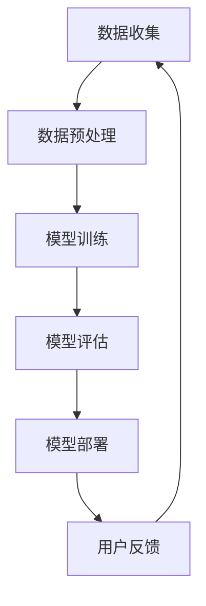

                 

# 《基础模型的社会责任与技术治理》

## 关键词
基础模型、社会责任、技术治理、数据隐私、偏见检测、透明性、可解释性

## 摘要

随着人工智能基础模型的飞速发展，其在各行各业的应用日益广泛。然而，这一技术进步也带来了诸多社会责任与技术治理方面的挑战。本文旨在探讨基础模型在社会责任与技术治理方面的核心问题，包括数据隐私保护、信息公平与偏见、技术伦理与法律等。通过分析现有的策略与方法，以及具体的案例分析，本文提出了对未来发展趋势的展望和相应的政策建议，以期为人工智能技术的健康发展提供有益的思考。

---

## 目录大纲

### 第一部分：引言与基础概念

#### 1.1 书籍引言
##### 1.1.1 背景与目的
##### 1.1.2 基础模型的社会责任与技术治理的重要性

#### 1.2 基础概念
##### 1.2.1 基础模型的定义
##### 1.2.2 社会责任的概念
##### 1.2.3 技术治理的内涵

##### 1.2.4 基础模型的发展现状

### 第二部分：社会责任与技术治理的挑战

#### 2.1 社会责任面临的挑战
##### 2.1.1 数据隐私保护
##### 2.1.2 信息公平与偏见
##### 2.1.3 社会公平与歧视

#### 2.2 技术治理的挑战
##### 2.2.1 技术伦理与法律
##### 2.2.2 技术决策的透明性与可解释性
##### 2.2.3 技术治理的组织架构

### 第三部分：社会责任与技术治理的策略与方法

#### 3.1 社会责任策略
##### 3.1.1 数据伦理指南与实践
##### 3.1.2 偏见检测与修正
##### 3.1.3 社会影响的评估与监测

#### 3.2 技术治理方法
##### 3.2.1 透明性与可解释性的实现
##### 3.2.2 技术决策的参与机制
##### 3.2.3 技术治理的制度设计

### 第四部分：案例分析

#### 4.1 案例研究一：数据隐私保护
##### 4.1.1 案例背景
##### 4.1.2 隐私保护措施
##### 4.1.3 案例分析与启示

#### 4.2 案例研究二：信息公平与偏见
##### 4.2.1 案例背景
##### 4.2.2 偏见检测与修正策略
##### 4.2.3 案例分析与启示

#### 4.3 案例研究三：技术治理与伦理
##### 4.3.1 案例背景
##### 4.3.2 技术治理实践
##### 4.3.3 案例分析与启示

### 第五部分：未来展望与建议

#### 5.1 未来发展展望
##### 5.1.1 技术进步对社会责任与技术治理的影响
##### 5.1.2 社会责任与技术治理的趋势

#### 5.2 政策建议
##### 5.2.1 政策框架的完善
##### 5.2.2 企业社会责任的引导
##### 5.2.3 公众参与与技术治理

### 第六部分：附录

#### 6.1 参考文献
##### 6.1.1 主要参考书籍与论文
##### 6.1.2 相关政策文件与报告

##### 6.2 Mermaid 流程图
##### 6.2.1 基础模型的架构
##### 6.2.2 社会责任与技术治理的流程

##### 6.3 伪代码示例
##### 6.3.1 偏见检测算法
##### 6.3.2 技术治理决策模型

---

### 第一部分：引言与基础概念

#### 1.1 书籍引言

在当今这个信息时代，人工智能（AI）正迅速渗透到社会生活的方方面面。作为AI技术的核心，基础模型（如深度学习模型、自然语言处理模型等）的进步极大地推动了各行各业的发展。然而，伴随着技术的飞速发展，基础模型也带来了诸多社会责任与技术治理方面的问题。这些问题不仅关乎个人的隐私与权利，也关系到社会的公平与正义。

本文旨在探讨基础模型在社会责任与技术治理方面的核心问题，为相关领域的学者、政策制定者以及行业从业者提供有价值的参考。具体来说，本文将围绕以下主题展开：

1. **基础模型的社会责任与技术治理的重要性**：介绍基础模型在社会责任和技术治理中的重要性，以及面临的挑战。
2. **社会责任与技术治理的挑战**：分析基础模型在数据隐私保护、信息公平与偏见、社会公平与歧视等方面面临的挑战。
3. **社会责任与技术治理的策略与方法**：探讨应对社会责任与技术治理挑战的策略与方法。
4. **案例分析**：通过具体案例分析，阐述社会责任与技术治理的实际应用与效果。
5. **未来展望与建议**：分析技术进步对社会责任与技术治理的影响，提出政策建议。

#### 1.2 基础概念

在讨论基础模型的社会责任与技术治理之前，我们需要明确一些核心概念。

##### 1.2.1 基础模型的定义

基础模型是指一类能够自动学习、推理和决策的算法。这些算法通常基于大量数据，通过数学模型进行训练，从而实现智能化的功能。例如，深度学习模型、神经网络模型、自然语言处理模型等。

##### 1.2.2 社会责任的概念

社会责任是指企业在经济活动中应承担的道德责任，包括环境保护、公平就业、消费者权益保护等方面。对于基础模型而言，社会责任主要涉及数据隐私保护、信息公平、社会影响等方面。

##### 1.2.3 技术治理的内涵

技术治理是指通过规范、监管、协调等方式，确保技术发展符合社会需求和伦理道德。对于基础模型而言，技术治理主要涉及技术伦理、透明性、可解释性、技术决策等方面。

##### 1.2.4 基础模型的发展现状

近年来，基础模型取得了显著的进展，主要体现在以下几个方面：

1. **技术进步**：深度学习、神经网络、自然语言处理等技术的不断成熟，使得基础模型的应用领域不断拓展。
2. **应用领域扩展**：从传统的金融、医疗、安防等领域，逐渐渗透到教育、娱乐、交通等新兴领域。
3. **产业规模扩大**：基础模型的应用带动了相关产业链的快速发展，形成了庞大的市场规模。

#### 1.3 基础模型的发展现状

近年来，基础模型在技术进步和应用领域扩展方面取得了显著成果。

##### 1.3.1 基础模型的技术进步

1. **深度学习模型**：随着计算能力的提升和算法的创新，深度学习模型在图像识别、语音识别、自然语言处理等领域取得了突破性进展。
2. **神经网络模型**：神经网络模型在生物信息学、医疗诊断、金融风控等领域的应用越来越广泛。
3. **自然语言处理模型**：自然语言处理模型在语言翻译、智能客服、文本分析等领域的应用日益普及。

##### 1.3.2 基础模型的应用领域扩展

1. **金融领域**：金融领域是基础模型应用最为广泛的领域之一，包括风险管理、投资决策、信用评估等方面。
2. **医疗领域**：医疗领域的基础模型应用主要集中在疾病诊断、治疗方案制定、健康风险评估等方面。
3. **交通领域**：自动驾驶、智能交通系统等基础模型应用正逐渐成为现实，有望改变人们的出行方式。
4. **教育领域**：教育领域的基础模型应用主要体现在智能教学、个性化学习、学生行为分析等方面。
5. **其他领域**：如安防、环保、农业等领域，基础模型的应用也正逐步深入。

#### 1.4 基础模型的发展现状

基础模型的发展不仅带来了技术进步，也带来了诸多社会责任与技术治理方面的挑战。以下将分别介绍社会责任与技术治理的挑战，并探讨应对策略与方法。

---

## 第二部分：社会责任与技术治理的挑战

随着基础模型的广泛应用，其在社会责任与技术治理方面也面临着诸多挑战。这些问题不仅关乎个人隐私与权利，也关系到社会的公平与正义。

### 2.1 社会责任面临的挑战

##### 2.1.1 数据隐私保护

数据隐私保护是基础模型社会责任中最重要的问题之一。由于基础模型通常需要大量数据来进行训练和优化，这些数据往往涉及个人隐私信息。如果这些数据泄露或被滥用，将严重侵犯个人隐私，甚至可能导致身份盗窃、诈骗等犯罪行为。

挑战主要体现在以下几个方面：

1. **数据泄露风险**：在基础模型训练和部署过程中，数据往往需要进行传输、存储和处理。这些过程中，数据可能面临泄露风险。
2. **数据滥用风险**：数据不仅可能被用于正当目的，也可能被滥用，如进行非法营销、歧视等。
3. **跨领域数据共享**：在多个领域（如医疗、金融、教育等）中，基础模型可能需要跨领域共享数据。这将带来数据隐私保护方面的挑战。

##### 2.1.2 信息公平与偏见

基础模型在应用过程中，可能会产生信息公平与偏见的问题。具体体现在以下几个方面：

1. **算法偏见**：基础模型的训练数据可能存在偏见，导致模型在预测结果上存在不公平现象。例如，在招聘、信用评估等领域，算法可能对不同性别、种族、年龄等群体产生歧视。
2. **数据失衡**：在训练数据中，某些群体（如少数族裔、弱势群体等）的数据可能较少，导致模型对这些群体产生偏见。
3. **算法透明性**：基础模型通常由复杂的数学模型和算法构成，用户很难理解其内部机制和决策过程。这使得算法偏见问题难以被察觉和纠正。

##### 2.1.3 社会公平与歧视

基础模型在社会公平与歧视方面也面临着挑战。具体表现在以下几个方面：

1. **自动化决策**：基础模型在金融、就业、教育等领域中广泛应用于自动化决策。这些决策可能基于历史数据和算法，可能导致社会不公平现象的加剧。
2. **算法歧视**：基础模型在决策过程中可能对某些群体产生歧视，如性别、种族、年龄等。例如，在信用评估中，算法可能对不同性别、种族的信用风险进行歧视。
3. **数据不平等**：在某些领域（如医疗、金融等），基础模型的数据来源可能存在不平等现象，导致模型对这些群体的决策存在偏见。

### 2.2 技术治理的挑战

技术治理是确保基础模型健康发展的重要手段。然而，在实际操作中，技术治理也面临着诸多挑战。

##### 2.2.1 技术伦理与法律

技术伦理与法律是技术治理的重要基础。在基础模型应用过程中，需要遵守相关伦理和法律规范。然而，现有法律和伦理规范可能难以应对基础模型带来的新问题。例如：

1. **数据隐私保护法律**：现有数据隐私保护法律可能难以满足基础模型对大量数据的需求，特别是在跨领域数据共享方面。
2. **算法歧视法律**：现有算法歧视法律可能无法有效遏制基础模型中的歧视现象。
3. **伦理规范**：在基础模型应用过程中，需要遵循伦理规范，如公正性、透明性等。然而，现有伦理规范可能难以具体操作和执行。

##### 2.2.2 技术决策的透明性与可解释性

基础模型通常具有复杂的内部结构和决策过程，用户很难理解和解释模型的决策结果。这导致技术决策的透明性和可解释性成为技术治理的重要挑战。具体体现在以下几个方面：

1. **透明性**：用户需要了解基础模型的决策过程和依据，以便对其进行监督和评估。
2. **可解释性**：用户需要能够解释基础模型的决策结果，以便理解模型的优缺点，以及可能存在的偏见和歧视。
3. **算法黑箱**：基础模型的决策过程可能存在黑箱现象，用户难以了解其内部机制。这可能导致用户对模型的信任度降低，影响模型的实际应用效果。

##### 2.2.3 技术治理的组织架构

技术治理需要一个有效的组织架构来确保其执行和落实。然而，在实际操作中，技术治理组织架构可能面临以下挑战：

1. **利益冲突**：技术治理组织可能存在内部利益冲突，影响其独立性和公正性。
2. **资源不足**：技术治理组织可能缺乏足够的资源和人力来执行其职责。
3. **跨领域协作**：基础模型涉及多个领域，技术治理组织需要跨领域协作，这可能导致协调困难。

---

## 第三部分：社会责任与技术治理的策略与方法

为了应对基础模型在社会责任和技术治理方面面临的挑战，我们需要采取一系列策略与方法。以下将分别介绍社会责任策略和技术治理方法。

### 3.1 社会责任策略

##### 3.1.1 数据伦理指南与实践

数据伦理指南是确保基础模型数据隐私保护的重要手段。以下是一些建议的数据伦理指南与实践：

1. **最小化数据收集**：仅收集实现特定目标所需的数据，避免过度收集。
2. **数据匿名化**：对敏感数据进行匿名化处理，减少数据泄露风险。
3. **数据安全保护**：加强数据存储、传输和处理的加密措施，确保数据安全。
4. **用户知情同意**：在收集和使用数据前，确保用户知晓并同意相关隐私政策。

##### 3.1.2 偏见检测与修正

偏见检测与修正是在基础模型应用过程中减少算法偏见的重要手段。以下是一些建议的偏见检测与修正策略：

1. **数据预处理**：对训练数据进行预处理，平衡不同群体的数据比例，减少数据偏见。
2. **算法优化**：通过算法优化，减少算法对特定群体的偏见。例如，使用公平性度量指标来评估和改进算法。
3. **透明性提升**：提高算法的透明性，使得用户能够了解算法的决策过程和依据，从而发现和纠正潜在偏见。

##### 3.1.3 社会影响的评估与监测

社会影响的评估与监测是确保基础模型应用符合社会责任的重要手段。以下是一些建议的评估与监测方法：

1. **定期评估**：定期对基础模型的应用进行社会影响评估，识别潜在问题并采取相应措施。
2. **用户反馈**：收集用户反馈，了解基础模型在实际应用中的表现，以及用户对模型公正性的感知。
3. **社会监测**：建立社会监测机制，及时发现和纠正基础模型应用中的不公平、歧视等问题。

### 3.2 技术治理方法

##### 3.2.1 透明性与可解释性的实现

透明性与可解释性是技术治理的重要目标。以下是一些建议的实现方法：

1. **算法可视化**：通过算法可视化，展示基础模型的决策过程和内部结构，提高用户对算法的理解和信任。
2. **可解释性模型**：开发可解释性模型，使得用户能够直观地了解模型如何进行决策，从而发现和纠正潜在偏见。
3. **透明性报告**：定期发布透明性报告，包括算法描述、数据来源、评估结果等，提高模型应用过程的透明度。

##### 3.2.2 技术决策的参与机制

技术决策的参与机制是确保技术决策符合社会责任的重要手段。以下是一些建议的参与机制：

1. **多方参与**：在技术决策过程中，邀请相关利益方（如用户、专家、监管机构等）参与讨论和决策，确保决策的公正性和透明性。
2. **公众参与**：通过公众参与机制，收集用户和社会对技术决策的反馈和意见，提高决策的民主性和科学性。
3. **监督机制**：建立监督机制，对技术决策过程进行监督和评估，确保决策符合社会责任和伦理要求。

##### 3.2.3 技术治理的制度设计

技术治理的制度设计是确保技术治理有效实施的基础。以下是一些建议的制度设计方法：

1. **法律法规**：制定相关法律法规，明确基础模型应用中的社会责任和技术治理要求，确保有法可依。
2. **标准规范**：制定技术治理的标准规范，为技术治理提供具体操作指南。
3. **组织架构**：建立专门的技术治理组织，负责制定和执行技术治理策略，确保技术治理的独立性和专业性。

---

## 第四部分：案例分析

在本部分，我们将通过三个具体案例，分析基础模型在社会责任与技术治理方面的实际应用和挑战。

### 4.1 案例研究一：数据隐私保护

#### 4.1.1 案例背景

某大型互联网公司在开发一款智能推荐系统，用于向用户推荐个性化的内容。然而，在系统开发过程中，公司发现用户隐私数据可能面临泄露风险。具体问题包括：

1. **用户数据收集**：系统需要收集大量用户行为数据，包括浏览记录、搜索历史等，这些数据可能涉及用户隐私。
2. **数据存储与传输**：用户数据需要在服务器上存储和传输，可能面临数据泄露风险。
3. **数据处理**：在数据处理过程中，可能存在数据泄露和滥用的风险。

#### 4.1.2 隐私保护措施

为了保护用户隐私，公司采取了以下措施：

1. **数据匿名化**：对收集的用户数据进行匿名化处理，去除可能识别用户身份的信息。
2. **加密传输**：采用加密技术，确保用户数据在传输过程中的安全性。
3. **访问控制**：对用户数据访问进行严格控制，仅允许必要的人员访问。
4. **数据安全审计**：定期进行数据安全审计，及时发现和纠正潜在的安全隐患。

#### 4.1.3 案例分析与启示

本案例表明，在基础模型应用过程中，数据隐私保护至关重要。通过数据匿名化、加密传输、访问控制和数据安全审计等措施，可以有效降低数据泄露风险，保护用户隐私。同时，本案例也提醒我们，在基础模型应用过程中，需要持续关注和改进数据隐私保护措施，以应对不断变化的威胁和挑战。

### 4.2 案例研究二：信息公平与偏见

#### 4.2.1 案例背景

某在线招聘平台使用机器学习算法，为求职者推荐合适的职位。然而，在算法训练和部署过程中，公司发现算法可能存在偏见现象。具体问题包括：

1. **性别偏见**：算法可能对女性求职者产生歧视，推荐较少的职位。
2. **种族偏见**：算法可能对某些种族的求职者产生歧视，推荐较少的职位。
3. **年龄偏见**：算法可能对年龄较大的求职者产生歧视，推荐较少的职位。

#### 4.2.2 偏见检测与修正策略

为了消除算法偏见，公司采取了以下策略：

1. **数据预处理**：对训练数据集进行预处理，平衡不同性别、种族和年龄的数据比例。
2. **算法优化**：使用公平性度量指标，评估和优化算法，减少对特定群体的偏见。
3. **透明性提升**：通过算法可视化，展示算法的决策过程和内部结构，提高用户对算法的理解和信任。
4. **用户反馈**：收集用户反馈，了解算法在实际应用中的表现，以及用户对算法公正性的感知。

#### 4.2.3 案例分析与启示

本案例表明，在基础模型应用过程中，信息公平与偏见是一个重要问题。通过数据预处理、算法优化、透明性提升和用户反馈等措施，可以有效消除算法偏见，提高算法的公正性。同时，本案例也提醒我们，在基础模型应用过程中，需要持续关注和改进信息公平与偏见问题，以实现更加公正和公平的应用。

### 4.3 案例研究三：技术治理与伦理

#### 4.3.1 案例背景

某大型金融机构使用人工智能技术，进行信用评估和贷款审批。然而，在技术治理方面，公司面临以下问题：

1. **技术伦理问题**：公司需要确保信用评估和贷款审批过程符合伦理要求，避免对特定群体产生歧视。
2. **决策透明性**：用户需要了解信用评估和贷款审批的决策过程，以便对其结果进行监督和评估。
3. **跨领域数据共享**：公司需要与其他金融机构共享数据，以实现更准确的信用评估和贷款审批。

#### 4.3.2 技术治理实践

为了解决上述问题，公司采取了以下技术治理实践：

1. **伦理审查**：建立伦理审查委员会，对信用评估和贷款审批过程进行伦理审查，确保符合伦理要求。
2. **透明性提升**：通过算法可视化，展示信用评估和贷款审批的决策过程，提高用户对决策过程的理解和信任。
3. **跨领域数据共享协议**：制定跨领域数据共享协议，明确数据共享的原则、范围和方式，确保数据隐私保护。

#### 4.3.3 案例分析与启示

本案例表明，在基础模型应用过程中，技术治理与伦理至关重要。通过伦理审查、透明性提升和跨领域数据共享协议等措施，可以有效解决技术治理与伦理问题。同时，本案例也提醒我们，在基础模型应用过程中，需要持续关注和改进技术治理与伦理问题，以实现更加公正和透明的社会应用。

---

## 第五部分：未来展望与建议

随着基础模型的不断发展和应用，其在社会责任与技术治理方面也面临着新的挑战。以下是对未来发展趋势的展望，以及相应的政策建议。

### 5.1 未来发展展望

1. **技术进步**：随着人工智能技术的不断发展，基础模型的性能将进一步提高，应用范围将不断拓展。这将带来更多社会责任与技术治理方面的挑战，如数据隐私保护、信息公平与偏见等。
2. **跨领域融合**：基础模型将与其他领域（如医疗、金融、教育等）深度融合，实现更广泛的应用。这将带来更多跨领域的社会责任与技术治理问题，如数据共享、跨领域伦理审查等。
3. **社会参与**：随着基础模型应用范围的扩大，社会对其社会责任与技术治理的关注度将提高。未来，公众将更加积极参与基础模型的社会责任与技术治理，推动相关政策的制定和实施。
4. **全球合作**：基础模型的应用将涉及全球范围，不同国家和地区将面临相似的社会责任与技术治理问题。未来，需要加强全球合作，共同应对这些挑战。

### 5.2 政策建议

1. **完善法律法规**：制定和完善相关法律法规，明确基础模型在社会责任和技术治理方面的要求和责任，确保有法可依。
2. **建立伦理审查机制**：建立独立的伦理审查机制，对基础模型的应用进行伦理审查，确保符合伦理要求，减少偏见和歧视。
3. **加强数据治理**：制定数据治理标准，明确数据收集、存储、传输和处理过程中的隐私保护要求，确保用户数据安全。
4. **提升透明性和可解释性**：通过算法可视化、透明性报告等手段，提高基础模型决策过程的透明性和可解释性，增强用户对模型的信任。
5. **促进公众参与**：建立公众参与机制，鼓励公众参与基础模型的社会责任与技术治理，提高决策的民主性和科学性。
6. **加强国际合作**：加强全球范围内的合作，共同应对基础模型的社会责任与技术治理挑战，推动全球人工智能健康、可持续发展。

---

## 第六部分：附录

### 6.1 参考文献

1. **人工智能领域**：
   - Goodfellow, I., Bengio, Y., & Courville, A. (2016). *Deep Learning*. MIT Press.
   - LeCun, Y., Bengio, Y., & Hinton, G. (2015). *Deep learning*. Nature, 521(7553), 436-444.

2. **社会责任与技术治理**：
   - Howard, M. (2018). *AI and society: A conversation with Timnit Gebru*. IEEE Spectrum.
   - Bostrom, N. (2014). *Superintelligence: Paths, dangers, strategies*. O'Reilly Media.

3. **数据隐私与安全**：
   - Machanavajjhala, A., Kifer, D., Gehrke, J., & Venkitasubramaniam, M. (2007). *lD-difference: Privacy beyond k-anonymity*. ACM Transactions on Knowledge Discovery from Data (TKDD), 1(1), 3.

4. **算法偏见与公平性**：
   - O'Neill, C. (2016). *Weapons of math destruction: How big data increases inequality and threatens democracy*. Crown Publishing Group.

### 6.2 Mermaid 流程图



### 6.3 伪代码示例

```python
# 偏见检测算法伪代码
def bias_detection(data, model):
    # 加载训练数据
    train_data = load_data(data)
    
    # 训练基础模型
    model = train_model(train_data)
    
    # 预测结果
    predictions = model.predict(test_data)
    
    # 计算偏见指标
    bias_metrics = compute_bias(predictions)
    
    # 输出偏见指标
    print(bias_metrics)
```

```python
# 技术治理决策模型伪代码
def decision_model(policy, data, model):
    # 加载政策文件
    policy = load_policy(policy)
    
    # 加载训练数据
    train_data = load_data(data)
    
    # 训练技术治理模型
    model = train_governance_model(train_data, policy)
    
    # 预测结果
    predictions = model.predict(test_data)
    
    # 输出预测结果
    print(predictions)
```

---

**作者：AI天才研究院/AI Genius Institute & 禅与计算机程序设计艺术 /Zen And The Art of Computer Programming**

