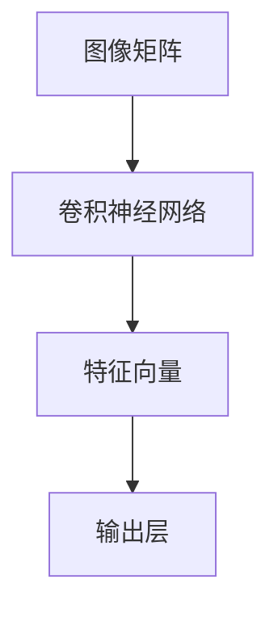
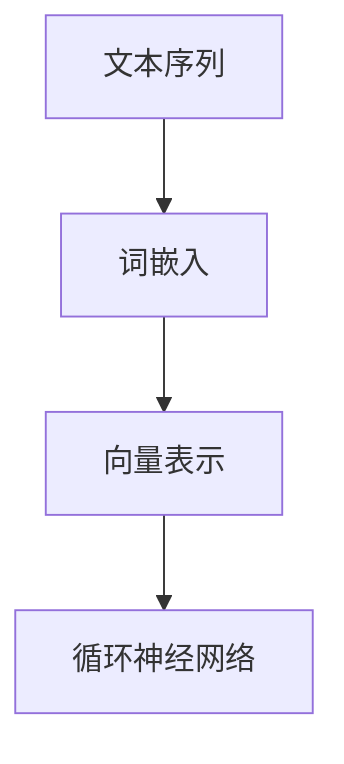
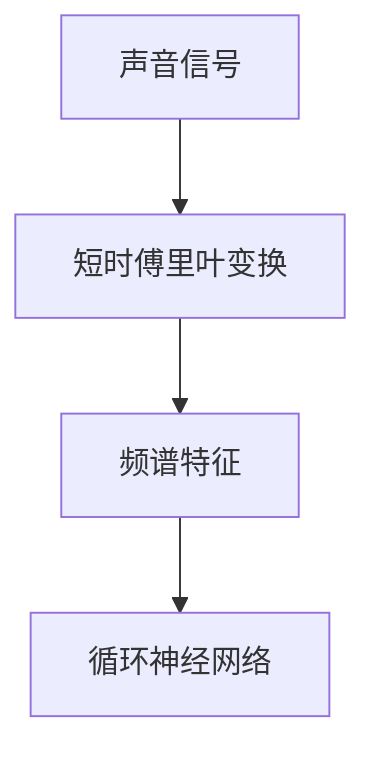
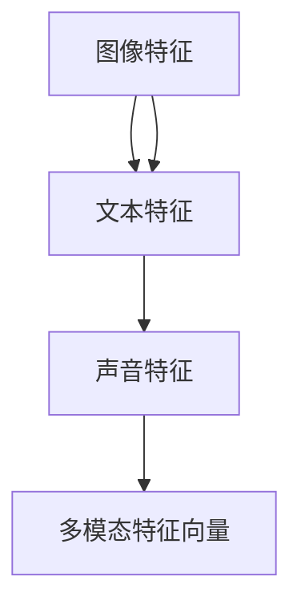

                 

### 《多模态大模型：技术原理与实战 多模态大模型的评测标准》目录大纲

为了帮助读者更好地理解《多模态大模型：技术原理与实战 多模态大模型的评测标准》的内容，下面将详细列出文章的目录大纲，每个章节将涵盖的核心内容如下：

#### 第一部分：多模态大模型概述

**第1章：多模态大模型的概念与意义**
- **1.1 多模态数据的基本概念**
  - 解释多模态数据的定义及其重要性。
- **1.2 多模态大模型的发展历程**
  - 回顾多模态大模型的发展历程和关键技术。
- **1.3 多模态大模型的应用场景**
  - 讨论多模态大模型在不同领域的应用，如图像识别、自然语言处理等。
- **1.4 多模态大模型的核心价值**
  - 强调多模态大模型对于提升人工智能系统智能化和适用性的重要意义。

**第2章：多模态大模型的架构与原理**
- **2.1 多模态大模型的框架结构**
  - 介绍多模态大模型的基本结构，包括数据预处理、特征提取、模型融合和输出模块。
- **2.2 多模态数据的预处理方法**
  - 详细阐述图像、文本、声音等数据的预处理技术。
- **2.3 多模态特征提取方法**
  - 分析卷积神经网络（CNN）、循环神经网络（RNN）和图神经网络（GNN）在多模态特征提取中的应用。
- **2.4 多模态数据融合算法**
  - 探讨多种多模态数据融合算法，如基于矩阵分解、深度学习和统计学习的方法。

#### 第二部分：多模态大模型技术原理

**第3章：多模态大模型的数学基础**
- **3.1 多模态数据表示**
  - 解释图像、文本、声音等数据的数学表示方法。
- **3.2 多模态数据的数学模型**
  - 讲解矩阵与向量、线性代数和概率论的基础知识。
- **3.3 多模态数据的数学公式与推导**
  - 介绍关键数学公式及其推导过程，如矩阵乘法、矩阵求导和概率分布函数。

**第4章：多模态大模型的核心算法**
- **4.1 卷积神经网络（CNN）**
  - 详细阐述卷积神经网络的结构和工作原理。
- **4.2 循环神经网络（RNN）**
  - 解释RNN的基本结构，特别是LSTM和GRU。
- **4.3 图神经网络（GNN）**
  - 讨论图神经网络的基本概念、分类和应用场景。

**第5章：多模态大模型的训练与优化**
- **5.1 多模态大模型的训练过程**
  - 分析数据加载与预处理、模型训练和模型评估的过程。
- **5.2 多模态大模型的优化方法**
  - 讨论优化算法的选择、学习率调整和模型正则化。
- **5.3 多模态大模型的超参数调优**
  - 探讨模型参数选择、模型结构选择和性能评估指标。

#### 第三部分：多模态大模型评测标准

**第6章：多模态大模型的评测方法**
- **6.1 评测标准的定义**
  - 介绍常用的评测指标，如准确率、召回率、F1值和MAP。
- **6.2 评测指标的计算方法**
  - 详细解释各个评测指标的计算方法。
- **6.3 常见评测方法的应用场景**
  - 分析不同评测方法在不同应用场景下的适用性。

**第7章：多模态大模型的评测实践**
- **7.1 评测环境搭建**
  - 讲解如何搭建评测环境，包括开发工具和库的选择以及数据集的准备。
- **7.2 评测实验设计**
  - 描述评测实验的设计过程，包括实验目的、方案和流程。
- **7.3 评测结果分析与讨论**
  - 分析评测结果，并进行讨论和优化。

#### 第四部分：多模态大模型实战案例

**第8章：文本与图像融合的实战案例**
- **8.1 项目背景与目标**
  - 描述项目的背景和目标。
- **8.2 项目实现过程**
  - 详细阐述项目的实现过程，包括数据准备与预处理、模型设计与实现、模型训练与优化。
- **8.3 项目结果分析**
  - 展示实验结果，并进行结果分析和优化。

**第9章：声音与文本融合的实战案例**
- **8.1 项目背景与目标**
  - 描述项目的背景和目标。
- **8.2 项目实现过程**
  - 详细阐述项目的实现过程，包括数据准备与预处理、模型设计与实现、模型训练与优化。
- **8.3 项目结果分析**
  - 展示实验结果，并进行结果分析和优化。

通过上述目录大纲的详细说明，读者可以清晰地了解《多模态大模型：技术原理与实战 多模态大模型的评测标准》的结构和内容，为后续章节的阅读和深入学习提供指引。

### 文章标题：多模态大模型：技术原理与实战 多模态大模型的评测标准

#### 关键词：
- 多模态大模型
- 技术原理
- 实战应用
- 评测标准
- 数据融合

#### 摘要：
本文旨在深入探讨多模态大模型的技术原理、应用实战及其评测标准。首先，文章介绍了多模态大模型的基本概念、意义、发展历程和应用场景，然后详细阐述了其架构与原理，包括数据预处理、特征提取、模型融合和输出模块。接着，文章探讨了多模态大模型的数学基础、核心算法及其训练与优化方法。最后，文章提出了多模态大模型的评测标准和方法，并通过实际案例展示了多模态大模型在文本与图像融合以及声音与文本融合中的应用效果。

### 第一部分：多模态大模型概述

#### 第1章：多模态大模型的概念与意义

在当今人工智能（AI）迅猛发展的时代，多模态大模型已经成为一个重要的研究热点。多模态大模型通过整合多种类型的数据，如文本、图像、声音和视频，使其在处理复杂任务时能够发挥出更高的性能。本章节将介绍多模态大模型的基本概念、意义、发展历程和应用场景，帮助读者理解这一领域的核心内容和前沿动态。

#### 1.1 多模态数据的基本概念

**多模态数据的定义：**

多模态数据是指由两种或两种以上不同类型的数据源组成的数据集合。这些数据源可以是文本、图像、声音、视频等。通过整合这些不同类型的数据，多模态数据能够提供更丰富、更全面的上下文信息，有助于提升人工智能系统的智能性和实用性。

**多模态数据的特点：**

1. **多样性：** 多模态数据涵盖多种类型的数据，如文本、图像、声音等，这使得数据处理和分析更加复杂。
2. **复杂性：** 多模态数据之间的相互关系和特征提取方法多样，需要采用不同的处理技术和算法。
3. **互补性：** 不同类型的数据可以相互补充，提高任务的理解精度和准确率。
4. **动态性：** 多模态数据通常具有动态变化的特点，例如视频中的动作和表情变化。

#### 1.2 多模态大模型的发展历程

**发展背景：**

随着计算能力的提升和大数据技术的普及，多模态数据在各个领域得到了广泛的应用，如医疗诊断、自然语言处理、计算机视觉等。因此，研究人员开始探索如何将多种类型的数据进行有效整合，以提高模型的性能和实用性。

**关键技术：**

1. **数据预处理：** 包括数据清洗、数据增强和特征提取等步骤，为后续模型训练和优化奠定基础。
2. **特征融合：** 通过不同类型的特征进行融合，使得模型能够更好地理解和处理多模态数据。
3. **深度学习：** 利用深度学习技术，特别是卷积神经网络（CNN）、循环神经网络（RNN）和图神经网络（GNN）等，实现多模态数据的特征提取和模型训练。
4. **模型优化：** 通过调整模型结构、超参数和学习策略，提高模型的性能和泛化能力。

**发展趋势：**

1. **多任务学习：** 结合多种类型的数据进行任务学习，提高模型的泛化能力和适应性。
2. **少样本学习：** 在数据量较少的情况下，通过迁移学习和模型压缩等技术，实现有效的多模态数据学习。
3. **跨模态交互：** 探索不同类型数据之间的相互作用和融合机制，提高模型对复杂任务的应对能力。

#### 1.3 多模态大模型的应用场景

**文本与图像的融合：**

文本与图像融合广泛应用于计算机视觉和自然语言处理领域。例如，在图像描述生成任务中，多模态大模型能够同时利用图像和文本信息，生成更准确、更自然的文本描述。

**声音与文本的结合：**

声音与文本的结合在语音识别、情感分析和对话系统等领域具有重要意义。多模态大模型可以通过整合声音和文本信息，提高语音识别的准确率和对话系统的交互质量。

**视频与图像的分析：**

视频与图像的分析在视频监控、运动分析和娱乐推荐等领域具有广泛的应用。多模态大模型能够同时处理视频和图像数据，实现更精准的动作识别、场景分析和视频推荐。

#### 1.4 多模态大模型的核心价值

**提高人工智能系统的智能性：**

多模态大模型能够通过整合多种类型的数据，提供更全面、更准确的上下文信息，从而提升人工智能系统的智能性和适应性。

**扩大人工智能的应用范围：**

多模态大模型的应用不仅限于计算机视觉和自然语言处理领域，还可以扩展到医疗诊断、智能家居、自动驾驶等更多领域，推动人工智能技术的广泛应用。

**促进跨学科合作：**

多模态大模型的研究需要涉及计算机科学、心理学、语言学等多个学科，有助于促进跨学科合作，推动多模态数据研究和应用的发展。

通过本章节的介绍，读者可以初步了解多模态大模型的基本概念、意义、发展历程和应用场景。在后续章节中，我们将进一步探讨多模态大模型的架构与原理、技术原理、训练与优化以及评测标准，帮助读者深入理解和掌握这一领域的前沿技术和应用。

#### 第2章：多模态大模型的架构与原理

多模态大模型的架构与原理是理解和应用这一技术的基础。本章将详细介绍多模态大模型的基本结构，包括数据预处理、特征提取、模型融合和输出模块，并分析各部分的功能和相互关系。

##### 2.1 多模态大模型的框架结构

多模态大模型通常由以下几个关键模块组成：

1. **数据预处理模块**
2. **特征提取模块**
3. **模型融合模块**
4. **输出模块**

这些模块共同工作，使得多模态大模型能够有效地整合和处理不同类型的数据。

###### 数据预处理模块

数据预处理模块是多模态大模型的第一步，其目标是确保输入数据的格式和特性适合后续的处理和训练。具体任务包括：

1. **数据清洗**：去除数据中的噪声和错误，如缺失值、异常值和重复数据。
2. **数据增强**：通过数据扩充技术，如随机裁剪、旋转、缩放等，增加数据的多样性和丰富性。
3. **数据标准化**：将不同类型的数据（如文本、图像、声音）转换为统一的格式，例如将图像缩放到固定尺寸，将文本编码为向量等。

通过数据预处理模块，多模态大模型可以确保输入数据的质量，从而提高模型的训练效果和泛化能力。

###### 特征提取模块

特征提取模块是核心部分，其主要任务是提取多模态数据中的关键特征，为模型训练提供有效的输入。根据不同的数据类型，特征提取方法也有所不同：

1. **图像特征提取**：使用卷积神经网络（CNN）等深度学习技术，提取图像的局部特征和全局特征。
2. **文本特征提取**：使用词嵌入（Word Embedding）、BERT等自然语言处理技术，将文本转换为高维向量表示。
3. **声音特征提取**：使用自动语音识别（ASR）技术，提取声音信号中的特征，如频谱特征、音高特征等。

特征提取模块的目的是将原始的多模态数据转换为更适合模型处理的特征表示，以便在后续步骤中进行有效融合。

###### 模型融合模块

模型融合模块是将不同模态的特征进行整合的关键步骤。根据不同的任务需求和应用场景，模型融合方法也有所不同：

1. **基于矩阵分解的方法**：通过矩阵分解技术，将不同模态的数据特征表示为低维向量，并进行矩阵相乘得到最终特征。
2. **基于深度学习的方法**：使用多模态深度学习模型（如多输入卷积神经网络、多输入循环神经网络等），直接学习不同模态数据之间的关联和融合策略。
3. **基于统计学习的方法**：通过统计学习技术，如线性回归、支持向量机等，将不同模态的数据特征进行加权融合。

模型融合模块的目的是通过有效的特征融合策略，提高多模态数据的整体表现和任务性能。

###### 输出模块

输出模块是多模态大模型的最终环节，其任务是根据融合后的特征生成预测结果或决策。根据不同的应用场景，输出模块可以包括以下内容：

1. **分类输出**：根据融合特征进行分类预测，例如在图像分类任务中，输出每个类别的概率。
2. **回归输出**：根据融合特征进行回归预测，例如在图像标注任务中，输出图像中每个物体的位置和尺寸。
3. **序列输出**：根据融合特征生成序列数据，例如在自然语言生成任务中，输出文本序列。

输出模块的目的是将融合特征转换为具体的任务结果，为实际应用提供支持和指导。

##### 2.2 多模态数据的预处理方法

多模态数据的预处理是多模态大模型成功的关键因素之一。下面将详细介绍图像、文本和声音等常见模态数据的预处理方法。

1. **图像预处理**

   图像预处理主要包括图像去噪、图像增强、图像分割和图像标注等步骤。具体方法包括：

   - **图像去噪**：使用滤波技术（如均值滤波、高斯滤波等）去除图像中的噪声。
   - **图像增强**：通过调整图像的亮度、对比度和色彩平衡，提高图像的视觉效果。
   - **图像分割**：使用图像分割技术（如阈值分割、边缘检测等），将图像划分为不同的区域。
   - **图像标注**：为图像中的对象或区域进行标注，提供训练数据。

2. **文本预处理**

   文本预处理主要包括分词、词性标注、实体识别和词嵌入等步骤。具体方法包括：

   - **分词**：将文本分割为单词或词组，为后续处理提供基础。
   - **词性标注**：为文本中的每个词分配词性（如名词、动词、形容词等），帮助模型更好地理解文本。
   - **实体识别**：识别文本中的命名实体（如人名、地名、组织名等），为特定任务提供参考。
   - **词嵌入**：将文本中的每个词转换为高维向量表示，以便在深度学习模型中处理。

3. **声音预处理**

   声音预处理主要包括音频信号处理、频谱分析和音素标注等步骤。具体方法包括：

   - **音频信号处理**：使用滤波、去噪和增益调整等技术，处理音频信号。
   - **频谱分析**：通过傅里叶变换等信号处理技术，将音频信号转换为频谱表示。
   - **音素标注**：为音频中的音素进行标注，为语音识别和自然语言处理提供基础。

##### 2.3 多模态特征提取方法

多模态特征提取是多模态大模型的核心环节，其目标是从不同模态的数据中提取出对任务有用的特征。以下将详细介绍卷积神经网络（CNN）、循环神经网络（RNN）和图神经网络（GNN）在多模态特征提取中的应用。

1. **卷积神经网络（CNN）**

   卷积神经网络（CNN）在图像特征提取中表现出色，其主要特点包括：

   - **卷积层**：通过局部感知野和卷积核，提取图像的局部特征。
   - **池化层**：通过下采样操作，减少数据的维度，提高模型的泛化能力。
   - **全连接层**：将卷积层和池化层提取的特征进行整合，用于分类或回归任务。

   CNN可以有效地提取图像的局部和全局特征，为多模态大模型提供有力的支持。

2. **循环神经网络（RNN）**

   循环神经网络（RNN）在序列数据特征提取中具有重要应用，其主要特点包括：

   - **循环结构**：RNN中的每个神经元都与前一个时间步的神经元相连，形成循环结构。
   - **门控机制**：通过门控单元（如LSTM和GRU），控制信息的流动，防止梯度消失和爆炸问题。

   RNN可以有效地处理和提取序列数据中的特征，如文本和语音，为多模态大模型提供丰富的序列特征。

3. **图神经网络（GNN）**

   图神经网络（GNN）在处理图结构数据（如社交网络、知识图谱等）中具有独特的优势，其主要特点包括：

   - **图结构表示**：将图中的节点和边表示为向量，进行节点分类和图分类任务。
   - **聚合操作**：通过节点邻居的聚合操作，提取节点的上下文信息。
   - **图卷积操作**：类似于CNN中的卷积操作，GNN通过图卷积层提取图的特征。

   GNN可以有效地提取和融合图结构中的特征，为多模态大模型提供结构化特征支持。

##### 2.4 多模态数据融合算法

多模态数据融合算法是多模态大模型的关键组成部分，其目标是整合不同模态的特征，提高模型的性能和任务表现。以下将介绍几种常见的多模态数据融合算法。

1. **基于矩阵分解的方法**

   基于矩阵分解的方法通过矩阵分解技术，将不同模态的数据特征表示为低维向量，并进行矩阵相乘得到最终特征。具体步骤包括：

   - **特征矩阵表示**：将图像、文本和声音等不同模态的数据特征表示为矩阵。
   - **矩阵分解**：对特征矩阵进行奇异值分解（SVD）或因子分解（PCA），得到低维特征向量。
   - **特征融合**：通过矩阵相乘，将不同模态的特征向量进行融合。

2. **基于深度学习的方法**

   基于深度学习的方法使用多输入神经网络，直接学习不同模态数据之间的关联和融合策略。具体步骤包括：

   - **多输入网络架构**：构建具有多个输入通道的神经网络，如多输入卷积神经网络（MCCNN）或多输入循环神经网络（MCRNN）。
   - **特征提取**：对每个输入通道的数据进行特征提取，如使用CNN提取图像特征，使用RNN提取文本特征。
   - **融合策略**：将不同模态的特征进行融合，如通过全连接层或加性融合。

3. **基于统计学习的方法**

   基于统计学习的方法通过统计学习技术，如线性回归、支持向量机等，将不同模态的数据特征进行加权融合。具体步骤包括：

   - **特征提取**：对每个模态的数据特征进行提取，如使用图像特征、文本特征和声音特征。
   - **特征加权**：根据不同模态的特征重要程度，进行加权融合，如使用权重向量进行加权。
   - **分类或回归**：使用融合后的特征进行分类或回归任务。

通过本章的介绍，读者可以全面了解多模态大模型的架构与原理，包括数据预处理、特征提取、模型融合和输出模块。这些模块共同构成了多模态大模型的核心结构，为后续章节的深入探讨奠定了基础。

### 第3章：多模态大模型的数学基础

多模态大模型作为深度学习领域的前沿技术，其成功离不开数学基础的支持。本章将详细介绍多模态数据表示、数学模型以及相关数学公式的推导，帮助读者理解多模态大模型的核心数学原理。

#### 3.1 多模态数据表示

多模态数据包括图像、文本、声音等不同类型的数据，每种数据类型都有其特定的数学表示方法。

**图像数据表示：**

图像通常用二维矩阵表示，每个元素代表图像中某个像素的颜色值。在深度学习中，图像数据可以通过卷积神经网络（CNN）转换为更高层次的特征表示。



**文本数据表示：**

文本数据可以通过词嵌入（Word Embedding）转换为高维向量表示。词嵌入将每个词映射为一个固定维度的向量，使得文本数据在深度学习模型中可以进行处理。



**声音数据表示：**

声音数据可以通过频谱分析转换为频谱特征表示。常用的方法包括梅尔频率倒谱系数（MFCC）和短时傅里叶变换（STFT）。



**多模态数据表示：**

多模态数据可以通过组合不同模态的数据表示，形成一个统一的多维向量表示。这个向量表示将用于后续的特征提取和模型训练。



#### 3.2 多模态数据的数学模型

多模态数据的数学模型主要包括矩阵与向量、线性代数和概率论的基础知识。

**矩阵与向量：**

矩阵与向量是线性代数的基本概念。在多模态数据表示中，矩阵用于存储图像、文本和声音等数据，而向量用于表示单个数据样本。

- **矩阵乘法：** 矩阵乘法是线性代数中的一种基本运算。给定两个矩阵 \( A \) 和 \( B \)，其乘积 \( C = AB \) 是一个新的矩阵，其元素是 \( A \) 和 \( B \) 对应元素的乘积和求和。

  $$ C_{ij} = \sum_{k=1}^{n} A_{ik}B_{kj} $$

- **矩阵求导：** 在多模态大模型中，矩阵求导是优化算法中的重要步骤。给定矩阵 \( A \) 和一个标量函数 \( f(A) \)，其梯度 \( \nabla f(A) \) 是一个矩阵，其元素是 \( f \) 对 \( A \) 的偏导数。

  $$ \nabla f(A)_{ij} = \frac{\partial f}{\partial A_{ij}} $$

**线性代数基础：**

线性代数是处理多模态数据表示和分析的重要工具。以下是一些基本的线性代数概念：

- **向量空间：** 向量空间是由向量构成的集合，其中每个向量都可以通过线性组合得到。
- **线性变换：** 线性变换是一种将一个向量空间映射到另一个向量空间的操作，其保持向量加法和标量乘法的性质。
- **矩阵分解：** 矩阵分解是将矩阵表示为多个矩阵乘积的方法，如奇异值分解（SVD）和主成分分析（PCA）。

**概率论基础：**

概率论是多模态数据分析和模型训练的基础。以下是一些基本的概率论概念：

- **概率分布：** 概率分布描述了随机变量可能取值的概率。常见的概率分布包括伯努利分布、高斯分布和泊松分布。
- **条件概率：** 条件概率描述了在某个事件发生的条件下，另一个事件发生的概率。
- **贝叶斯定理：** 贝叶斯定理是概率论中的一个基本公式，用于计算后验概率。

$$ P(A|B) = \frac{P(B|A)P(A)}{P(B)} $$

#### 3.3 多模态数据的数学公式与推导

在本节中，我们将介绍一些多模态数据中的关键数学公式及其推导过程。

**1. 矩阵乘法公式：**

矩阵乘法是线性代数中的一种基本运算。给定两个矩阵 \( A \) 和 \( B \)，其乘积 \( C = AB \) 是一个新的矩阵，其元素是 \( A \) 和 \( B \) 对应元素的乘积和求和。

推导过程：

设 \( A \) 是一个 \( m \times n \) 的矩阵，\( B \) 是一个 \( n \times p \) 的矩阵，则 \( C \) 是一个 \( m \times p \) 的矩阵。矩阵乘法的运算规则如下：

$$ C_{ij} = \sum_{k=1}^{n} A_{ik}B_{kj} $$

其中，\( C_{ij} \) 表示矩阵 \( C \) 中第 \( i \) 行第 \( j \) 列的元素，\( A_{ik} \) 和 \( B_{kj} \) 分别表示矩阵 \( A \) 和 \( B \) 中对应的元素。

**2. 矩阵求导公式：**

在多模态大模型中，矩阵求导是优化算法中的重要步骤。给定矩阵 \( A \) 和一个标量函数 \( f(A) \)，其梯度 \( \nabla f(A) \) 是一个矩阵，其元素是 \( f \) 对 \( A \) 的偏导数。

推导过程：

设 \( A \) 是一个 \( m \times n \) 的矩阵，\( f(A) \) 是一个关于 \( A \) 的标量函数，则 \( f(A) \) 的梯度 \( \nabla f(A) \) 是一个 \( m \times n \) 的矩阵，其元素 \( \nabla f(A)_{ij} \) 是 \( f \) 对 \( A_{ij} \) 的偏导数。

$$ \nabla f(A)_{ij} = \frac{\partial f}{\partial A_{ij}} $$

其中，\( \frac{\partial f}{\partial A_{ij}} \) 表示 \( f \) 对 \( A_{ij} \) 的偏导数。

**3. 概率分布函数：**

概率分布函数描述了随机变量可能取值的概率。在多模态数据中，常用的概率分布函数包括伯努利分布、高斯分布和泊松分布。

- **伯努利分布：** 伯努利分布是一种二元概率分布，描述了随机事件发生的概率。其概率质量函数为：

  $$ f(x|\theta) = \begin{cases} 
  \theta, & \text{if } x = 1 \\
  1 - \theta, & \text{if } x = 0 
  \end{cases} $$

  其中，\( \theta \) 是事件发生的概率。

- **高斯分布：** 高斯分布是一种连续概率分布，描述了正态分布。其概率密度函数为：

  $$ f(x|\mu,\sigma^2) = \frac{1}{\sqrt{2\pi\sigma^2}} e^{-\frac{(x-\mu)^2}{2\sigma^2}} $$

  其中，\( \mu \) 是均值，\( \sigma^2 \) 是方差。

- **泊松分布：** 泊松分布是一种离散概率分布，描述了在一定时间内事件发生的次数。其概率质量函数为：

  $$ f(x|\lambda) = \frac{e^{-\lambda}\lambda^x}{x!} $$

  其中，\( \lambda \) 是事件平均发生的次数。

通过本章的介绍，读者可以了解多模态大模型中的关键数学基础，包括多模态数据表示、数学模型以及相关公式的推导。这些数学基础是多模态大模型成功应用的重要保障，为后续章节的深入探讨提供了理论支持。

### 第4章：多模态大模型的核心算法

多模态大模型的成功离不开核心算法的支持。本章将详细介绍多模态大模型中常用的核心算法，包括卷积神经网络（CNN）、循环神经网络（RNN）和图神经网络（GNN），并分析这些算法的基本概念、结构和工作原理。

#### 4.1 卷积神经网络（CNN）

卷积神经网络（CNN）是处理图像数据的一种重要算法，其核心思想是通过卷积操作提取图像的局部特征。

**基本概念：**
CNN由多个卷积层、池化层和全连接层组成。卷积层通过卷积操作提取图像特征，池化层用于下采样减少数据维度，全连接层用于分类或回归任务。

**结构和工作原理：**
- **卷积层：** 卷积层通过卷积核在图像上滑动，提取图像的局部特征。卷积核是一个小的矩阵，其值通过反向传播算法不断更新，以最大化模型的预测准确率。
- **池化层：** 池化层用于减少数据的维度，通过最大值池化或平均值池化操作，保留重要的特征信息。
- **全连接层：** 全连接层将卷积层和池化层提取的特征整合，输出分类或回归结果。

伪代码示例：

```python
def conv2d(input_tensor, filters, kernel_size):
    # 卷积操作
    return tensorflow.nn.conv2d(input_tensor, filters, kernel_size=kernel_size)

def max_pooling(input_tensor, pool_size):
    # 最大值池化
    return tensorflow.nn.max_pool(input_tensor, pool_size=pool_size)

def fully_connected(input_tensor, num_classes):
    # 全连接层
    return tensorflow.nn.softmax(tf.matmul(input_tensor, num_classes))
```

**优缺点：**
- **优点：** CNN能够自动提取图像的局部特征，减少人工设计的复杂性。
- **缺点：** CNN对于图像的旋转、缩放等变换具有一定的敏感性。

#### 4.2 循环神经网络（RNN）

循环神经网络（RNN）是处理序列数据的一种重要算法，其核心思想是通过循环结构保持长期依赖信息。

**基本概念：**
RNN由多个循环单元组成，每个循环单元包含一个隐藏状态，用于存储上一时刻的信息。RNN通过递归连接，使得隐藏状态能够循环利用，处理序列数据。

**结构和工作原理：**
- **基本结构：** RNN的基本结构包括输入门、遗忘门和输出门。输入门用于控制新信息的输入，遗忘门用于控制旧信息的遗忘，输出门用于控制最终输出的生成。
- **LSTM（长短时记忆）：** LSTM是RNN的一种改进，通过引入记忆单元和控制门，解决了RNN的长期依赖问题。
- **GRU（门控循环单元）：** GRU是LSTM的简化版，通过合并输入门和遗忘门，减少参数数量，提高计算效率。

伪代码示例：

```python
def lstm(input_tensor, hidden_state, cell_state, weights):
    # LSTM操作
    i_f, i_g, i_o = input_gate, input_gate, output_gate
    f_f, f_g, f_o = forget_gate, forget_gate, output_gate
    
    input_tensor = tf.matmul(input_tensor, weights['input_weights']) + biases['input_bias']
    hidden_state = tf.matmul(hidden_state, weights['hidden_weights']) + biases['hidden_bias']
    cell_state = tf.matmul(cell_state, weights['cell_weights']) + biases['cell_bias']
    
    i_f = sigmoid(i_f)
    i_g = tanh(i_g)
    f_f = sigmoid(f_f)
    f_g = tanh(f_g)
    o_g = sigmoid(o_g)
    
    new_cell_state = f_f * cell_state + i_f * i_g
    new_hidden_state = o_g * tanh(new_cell_state)
    
    return new_hidden_state, new_cell_state
```

**优缺点：**
- **优点：** RNN能够处理变长的序列数据，捕捉长期依赖关系。
- **缺点：** RNN存在梯度消失和梯度爆炸问题，LSTM和GRU通过门控机制解决了这些问题。

#### 4.3 图神经网络（GNN）

图神经网络（GNN）是处理图结构数据的一种重要算法，其核心思想是通过图卷积操作提取图的结构信息。

**基本概念：**
GNN通过图卷积层提取节点的特征，然后将这些特征传递给相邻节点，最终生成全局特征表示。

**结构和工作原理：**
- **图卷积层：** 图卷积层通过卷积操作，将节点的特征与邻接节点的特征进行融合。
- **聚合操作：** 聚合操作用于将节点的特征传递给相邻节点，通常采用求和或平均操作。
- **全连接层：** 全连接层将图卷积层提取的特征整合，输出分类或回归结果。

伪代码示例：

```python
def graph_convolution(input_tensor, adjacency_matrix, filters):
    # 图卷积操作
    return tensorflow.nn.convolution(input_tensor, filters, adjacency_matrix)

def aggregate(node_features, neighbor_features):
    # 聚合操作
    return (node_features + neighbor_features) / (1 + len(neighbor_features))
```

**优缺点：**
- **优点：** GNN能够处理复杂的图结构数据，捕捉节点之间的相互关系。
- **缺点：** GNN的计算复杂度较高，对大规模图结构数据的处理存在性能瓶颈。

通过本章的介绍，读者可以了解多模态大模型中常用的核心算法，包括卷积神经网络（CNN）、循环神经网络（RNN）和图神经网络（GNN）。这些算法在多模态大模型中发挥着重要作用，为处理复杂的多模态数据提供了强大的工具。

### 第5章：多模态大模型的训练与优化

多模态大模型的训练与优化是确保模型性能和泛化能力的关键环节。本章将详细介绍多模态大模型的训练过程、优化方法和超参数调优策略。

#### 5.1 多模态大模型的训练过程

多模态大模型的训练过程通常包括以下几个关键步骤：

1. **数据加载与预处理：**
   在训练开始前，需要加载和处理多模态数据。具体步骤包括：
   - 数据清洗：去除噪声和错误数据，确保数据质量。
   - 数据增强：通过随机裁剪、旋转、缩放等操作，增加数据多样性，提高模型泛化能力。
   - 数据转换：将不同类型的数据（如图像、文本、声音）转换为统一的格式，便于模型处理。

2. **模型初始化：**
   模型初始化是训练过程的起点。通常采用随机初始化或预训练模型初始化方法。随机初始化可以随机生成模型参数，而预训练模型初始化则使用在大规模数据集上预训练的模型参数，作为初始值。

3. **模型训练：**
   模型训练是训练过程中的核心步骤。训练过程通过以下方式进行：
   - 前向传播：将输入数据传递到模型中，计算模型的输出。
   - 损失计算：计算模型输出与真实标签之间的损失值，常用的损失函数包括交叉熵损失、均方误差损失等。
   - 反向传播：通过反向传播算法，计算模型参数的梯度，并更新模型参数。
   - 模型评估：在训练过程中，定期评估模型的性能，通常使用验证集或测试集。

4. **模型评估与调整：**
   模型评估是训练过程中的重要环节。通过评估模型的性能，可以确定模型是否过拟合或欠拟合。如果模型性能不佳，可以通过调整学习率、改变模型结构或增加训练数据等方式进行调整。

#### 5.2 多模态大模型的优化方法

优化方法是提高多模态大模型性能的重要手段。以下介绍几种常用的优化方法：

1. **优化算法的选择：**
   常见的优化算法包括梯度下降（GD）、随机梯度下降（SGD）、Adam等。不同优化算法在收敛速度、稳定性和计算复杂度方面各有优势。选择合适的优化算法可以提高模型的训练效率。
   - **梯度下降（GD）：** GD是最简单的优化算法，通过计算损失函数的梯度，更新模型参数。
     $$ \theta_{t+1} = \theta_{t} - \alpha \nabla_\theta J(\theta) $$
     其中，\( \theta \) 是模型参数，\( \alpha \) 是学习率，\( J(\theta) \) 是损失函数。
   - **随机梯度下降（SGD）：** SGD在GD的基础上，使用随机样本来计算梯度，提高训练过程的随机性，避免局部最优。
     $$ \theta_{t+1} = \theta_{t} - \alpha \nabla_\theta J(\theta) $$
     其中，\( x_{t} \) 是随机选取的样本。
   - **Adam：** Adam是一种结合了SGD和动量法的优化算法，具有较好的收敛速度和稳定性。
     $$ m_t = \beta_1 m_{t-1} + (1 - \beta_1) [g_t - m_{t-1}] $$
     $$ v_t = \beta_2 v_{t-1} + (1 - \beta_2) [g_t^2 - v_{t-1}] $$
     $$ \theta_{t+1} = \theta_{t} - \alpha \frac{m_t}{\sqrt{v_t} + \epsilon} $$

2. **学习率调整：**
   学习率是优化算法中的重要参数，其选择对模型的收敛速度和最终性能有重要影响。常用的学习率调整方法包括：
   - **固定学习率：** 在训练过程中保持学习率不变，适用于简单问题。
   - **学习率衰减：** 随着训练过程的进行，逐步减小学习率，有助于避免模型在训练过程中过早收敛。
     $$ \alpha_t = \alpha_0 / (1 + t / T) $$
     其中，\( \alpha_0 \) 是初始学习率，\( T \) 是学习率衰减周期。
   - **自适应学习率：** 使用自适应学习率调整策略，如Adam算法，根据梯度信息动态调整学习率。

3. **模型正则化：**
   正则化是防止模型过拟合的重要手段。常用的正则化方法包括：
   - **L1正则化：** 在损失函数中添加 \( L1 \) 范数项，鼓励模型参数的稀疏性。
     $$ J(\theta) = \frac{1}{m} \sum_{i=1}^{m} (\theta^T x_i - y_i)^2 + \lambda ||\theta||_1 $$
   - **L2正则化：** 在损失函数中添加 \( L2 \) 范数项，鼓励模型参数的小幅变化。
     $$ J(\theta) = \frac{1}{m} \sum_{i=1}^{m} (\theta^T x_i - y_i)^2 + \lambda ||\theta||_2^2 $$

#### 5.3 多模态大模型的超参数调优

超参数是模型训练过程中需要手动调整的参数，其选择对模型性能有重要影响。以下介绍几种超参数调优策略：

1. **网格搜索：**
   网格搜索是一种穷举搜索超参数的方法，通过遍历预设的参数组合，找到最优参数组合。具体步骤包括：
   - 确定搜索空间：定义每个超参数的可选值范围。
   - 构建网格：生成所有可能的超参数组合。
   - 训练模型：在每个超参数组合上训练模型，并评估模型性能。
   - 选择最优参数：根据模型性能选择最优的超参数组合。

2. **贝叶斯优化：**
   贝叶斯优化是一种基于概率模型的超参数调优方法，通过构建概率模型预测超参数的最佳值。具体步骤包括：
   - 构建概率模型：使用贝叶斯优化算法（如树结构帕累托采样，TPE）构建概率模型。
   - 选择下一步超参数：根据概率模型选择下一步超参数的取值，使得模型性能最大化。
   - 训练模型：在选定的超参数组合上训练模型，并更新概率模型。

3. **随机搜索：**
   随机搜索是一种基于随机采样的超参数调优方法，通过随机选择超参数组合，找到最优参数组合。具体步骤包括：
   - 确定搜索空间：定义每个超参数的可选值范围。
   - 随机采样：在搜索空间中随机采样超参数组合。
   - 训练模型：在每个超参数组合上训练模型，并评估模型性能。
   - 选择最优参数：根据模型性能选择最优的超参数组合。

通过本章的介绍，读者可以了解多模态大模型的训练过程、优化方法和超参数调优策略。这些技术和策略是多模态大模型训练与优化的基础，为提升模型性能和泛化能力提供了有力支持。

### 第6章：多模态大模型的评测方法

多模态大模型的评测是评估模型性能和实用性的关键步骤。本章将详细介绍多模态大模型的评测标准、计算方法和常见应用场景，帮助读者理解和应用这些评测方法。

#### 6.1 评测标准的定义

多模态大模型的评测标准通常包括以下几个关键指标：

1. **准确率（Accuracy）：**
   准确率是评估分类模型性能的最常用指标，表示正确分类的样本数占总样本数的比例。
   $$ \text{Accuracy} = \frac{\text{正确分类的样本数}}{\text{总样本数}} $$

2. **召回率（Recall）：**
   召回率表示在正类样本中，被正确识别为正类的样本数占总正类样本数的比例。
   $$ \text{Recall} = \frac{\text{正确分类的正类样本数}}{\text{总正类样本数}} $$

3. **精确率（Precision）：**
   精确率表示在预测为正类的样本中，正确预测为正类的比例。
   $$ \text{Precision} = \frac{\text{正确分类的正类样本数}}{\text{预测为正类的样本数}} $$

4. **F1值（F1 Score）：**
   F1值是精确率和召回率的调和平均，用于综合评估分类模型的性能。
   $$ \text{F1 Score} = 2 \times \frac{\text{Precision} \times \text{Recall}}{\text{Precision} + \text{Recall}} $$

5. **平均准确率（Mean Average Precision，MAP）：**
   MAP用于评估序列标注任务，表示模型在所有可能标注序列中的平均精确率。
   $$ \text{MAP} = \frac{1}{N} \sum_{i=1}^{N} \text{AP}_i $$
   其中，\( N \) 是测试集中样本的数量，\( \text{AP}_i \) 是第 \( i \) 个样本的精确率。

#### 6.2 评测指标的计算方法

以下将详细解释上述评测指标的计算方法：

1. **准确率（Accuracy）的计算：**
   $$ \text{Accuracy} = \frac{\text{正确分类的样本数}}{\text{总样本数}} = \frac{\text{TP} + \text{TN}}{\text{TP} + \text{TN} + \text{FP} + \text{FN}} $$
   其中，\( \text{TP} \) 是正确分类的正类样本数，\( \text{TN} \) 是正确分类的负类样本数，\( \text{FP} \) 是错误分类为正类的负类样本数，\( \text{FN} \) 是错误分类为负类的正类样本数。

2. **召回率（Recall）的计算：**
   $$ \text{Recall} = \frac{\text{正确分类的正类样本数}}{\text{总正类样本数}} = \frac{\text{TP}}{\text{TP} + \text{FN}} $$

3. **精确率（Precision）的计算：**
   $$ \text{Precision} = \frac{\text{正确分类的正类样本数}}{\text{预测为正类的样本数}} = \frac{\text{TP}}{\text{TP} + \text{FP}} $$

4. **F1值（F1 Score）的计算：**
   $$ \text{F1 Score} = 2 \times \frac{\text{Precision} \times \text{Recall}}{\text{Precision} + \text{Recall}} $$

5. **平均准确率（MAP）的计算：**
   $$ \text{AP} = \frac{1}{N} \sum_{i=1}^{N} \text{precision}_i $$
   其中，\( \text{precision}_i \) 是第 \( i \) 个样本的精确率，计算方法为：
   $$ \text{precision}_i = \frac{\text{TP}_i}{\text{TP}_i + \text{FP}_i} $$
   其中，\( \text{TP}_i \) 和 \( \text{FP}_i \) 分别是第 \( i \) 个样本中正确分类的正类样本数和错误分类为正类的负类样本数。
   $$ \text{MAP} = \frac{1}{N} \sum_{i=1}^{N} \text{AP}_i $$

#### 6.3 常见评测方法的应用场景

以下介绍几种常见评测方法在不同应用场景中的应用：

1. **多标签分类：**
   在多标签分类任务中，每个样本可以同时属于多个标签。常用的评测方法包括准确率、召回率、精确率和F1值。其中，F1值是衡量多标签分类模型性能的常用指标，能够综合考虑精确率和召回率。

2. **序列标注：**
   在序列标注任务中，模型需要对序列中的每个单词或字符进行标注。常用的评测方法包括精确率、召回率和F1值。精确率和召回率可以分别衡量模型在预测正类和负类时的性能，而F1值则综合这两个指标，给出全面的评估。

3. **对抗样本评测：**
   在对抗样本评测中，模型需要应对恶意攻击，如对抗性样本攻击。常用的评测方法包括准确率、召回率和F1值。通过这些评测方法，可以评估模型在对抗攻击时的性能，确保模型具有较强的鲁棒性。

通过本章的介绍，读者可以了解多模态大模型的评测标准、计算方法和常见应用场景。这些评测方法为评估多模态大模型性能提供了重要工具，有助于提升模型的应用价值和可靠性。

### 第7章：多模态大模型的评测实践

为了更好地理解和掌握多模态大模型的评测实践，本章将通过具体案例展示评测环境的搭建、评测实验的设计和评测结果的分析与讨论。这些实践步骤和方法将为读者提供实际操作的经验和指导。

#### 7.1 评测环境搭建

搭建多模态大模型的评测环境是进行有效评测的前提。以下是一般步骤和所需工具：

1. **选择开发工具和库：**
   多模态大模型的评测通常需要使用深度学习框架，如TensorFlow、PyTorch等。此外，还需安装相关数据处理和可视化库，如NumPy、Pandas、Matplotlib等。

   ```bash
   pip install tensorflow numpy pandas matplotlib
   ```

2. **安装依赖库：**
   确保所有依赖库和工具都已安装，特别是深度学习框架和相关扩展库。

3. **准备数据集：**
   准备用于评测的数据集，包括训练集、验证集和测试集。数据集应包含多种模态的数据，如文本、图像、声音等。以下是一个示例命令，用于加载数据集：

   ```python
   from torchvision import datasets
   from torchvision.transforms import ToTensor
   from torch.utils.data import DataLoader

   train_data = datasets.ImageFolder(root='path/to/train/images', transform=ToTensor())
   train_loader = DataLoader(train_data, batch_size=32, shuffle=True)

   val_data = datasets.ImageFolder(root='path/to/val/images', transform=ToTensor())
   val_loader = DataLoader(val_data, batch_size=32, shuffle=False)

   test_data = datasets.ImageFolder(root='path/to/test/images', transform=ToTensor())
   test_loader = DataLoader(test_data, batch_size=32, shuffle=False)
   ```

#### 7.2 评测实验设计

设计有效的评测实验是评估多模态大模型性能的关键。以下是一般步骤和注意事项：

1. **设定实验目的：**
   明确实验的目标和假设，例如评估模型在不同模态数据融合策略下的性能。

2. **选择评价指标：**
   根据实验目的选择合适的评价指标，如准确率、召回率、F1值等。

3. **设计实验方案：**
   制定详细的实验步骤和流程，包括数据预处理、模型训练、模型评估等。

4. **执行实验：**
   在设计的实验方案基础上，执行模型训练和评估过程。以下是一个示例代码，用于执行评测实验：

   ```python
   import torch
   from torchvision import models

   # 加载预训练模型
   model = models.resnet18(pretrained=True)
   model.eval()

   # 定义损失函数和优化器
   criterion = torch.nn.CrossEntropyLoss()
   optimizer = torch.optim.Adam(model.parameters(), lr=0.001)

   # 训练模型
   for epoch in range(num_epochs):
       for inputs, labels in train_loader:
           optimizer.zero_grad()
           outputs = model(inputs)
           loss = criterion(outputs, labels)
           loss.backward()
           optimizer.step()

       # 在验证集上评估模型
       with torch.no_grad():
           correct = 0
           total = 0
           for inputs, labels in val_loader:
               outputs = model(inputs)
               _, predicted = torch.max(outputs.data, 1)
               total += labels.size(0)
               correct += (predicted == labels).sum().item()

       print(f'Epoch {epoch+1}/{num_epochs}, Loss: {loss.item()}, Accuracy: {100 * correct / total}%')

   # 在测试集上评估模型
   with torch.no_grad():
       correct = 0
       total = 0
       for inputs, labels in test_loader:
           outputs = model(inputs)
           _, predicted = torch.max(outputs.data, 1)
           total += labels.size(0)
           correct += (predicted == labels).sum().item()

   print(f'Test Accuracy: {100 * correct / total}%')
   ```

#### 7.3 评测结果分析与讨论

分析评测结果是评估多模态大模型性能的重要步骤。以下是一般分析和讨论方法：

1. **结果展示：**
   使用图表和统计数据展示评测结果，如混淆矩阵、ROC曲线等。

   ```python
   import seaborn as sns
   import matplotlib.pyplot as plt

   # 绘制混淆矩阵
   conf_matrix = torch.zeros((num_classes, num_classes))
   with torch.no_grad():
       for inputs, labels in test_loader:
           outputs = model(inputs)
           _, predicted = torch.max(outputs.data, 1)
           conf_matrix[labels, predicted] += 1

   sns.heatmap(conf_matrix.T, annot=True, fmt=".2f", cmap="Blues")
   plt.xlabel("Predicted Labels")
   plt.ylabel("True Labels")
   plt.title("Confusion Matrix")
   plt.show()
   ```

2. **结果分析：**
   根据评测结果，分析模型在不同任务和模态上的表现，找出优势和不足。

   - **准确率：** 分析模型在各个类别上的准确率，确定哪些类别的识别效果较好，哪些类别存在困难。
   - **召回率：** 分析模型在正类样本上的召回率，确保没有漏掉重要样本。
   - **F1值：** 综合考虑精确率和召回率，评估模型在多标签分类任务中的整体性能。

3. **讨论与优化：**
   根据结果分析和讨论，提出优化模型和实验设计的建议。例如：
   - **改进数据预处理：** 通过更多的数据增强和预处理方法，提高模型的泛化能力。
   - **调整模型结构：** 通过增加或减少网络层数、调整层的大小等，优化模型结构。
   - **调优超参数：** 调整学习率、批量大小、正则化参数等，提高模型性能。

通过本章的评测实践，读者可以深入了解多模态大模型的评测过程，掌握搭建评测环境、设计评测实验和分析评测结果的方法。这些实践经验和技巧对于提升模型性能和实际应用价值具有重要意义。

### 第8章：文本与图像融合的实战案例

在本章中，我们将通过一个具体的文本与图像融合的实战案例，详细描述项目的背景与目标、实现过程以及结果分析。这个案例将展示多模态大模型在文本和图像融合应用中的实际效果，为读者提供直观的学习和实践经验。

#### 8.1 项目背景与目标

随着人工智能技术的不断发展，文本与图像融合的应用场景越来越广泛。例如，在图像描述生成任务中，模型需要能够理解图像内容，并生成相应的文本描述。这样的任务在社交媒体、电子商务和智能辅助等领域具有重要意义。本项目旨在开发一个基于多模态大模型的图像描述生成系统，实现高效、准确的图像描述生成。

**项目目标：**
1. **数据预处理：** 对文本和图像数据分别进行预处理，确保数据质量。
2. **特征提取：** 使用深度学习模型提取文本和图像的特征。
3. **模型融合：** 将提取的文本和图像特征进行融合，生成图像描述。
4. **性能评估：** 使用评估指标（如BLEU分数、ROUGE分数等）评估模型性能。

#### 8.2 项目实现过程

**数据准备与预处理：**

1. **文本数据预处理：**
   - **数据收集：** 收集包含图像和文本描述的数据集，如Flickr8K或MS COCO。
   - **数据清洗：** 去除文本中的标点符号、特殊字符和停用词。
   - **文本编码：** 使用词嵌入技术（如Word2Vec、BERT等）将文本转换为向量表示。

2. **图像数据预处理：**
   - **数据收集：** 收集相应的图像数据集，如Flickr8K或MS COCO。
   - **图像增强：** 应用数据增强技术（如随机裁剪、旋转、缩放等），增加数据多样性。
   - **特征提取：** 使用卷积神经网络（CNN）提取图像特征。

**模型设计与实现：**

1. **文本特征提取模型：**
   - **模型架构：** 使用预训练的BERT模型提取文本特征。
   - **模型训练：** 在收集的文本数据集上训练BERT模型，优化其文本特征提取能力。

2. **图像特征提取模型：**
   - **模型架构：** 使用预训练的VGG16或ResNet模型提取图像特征。
   - **模型训练：** 在收集的图像数据集上训练VGG16或ResNet模型，优化其图像特征提取能力。

3. **模型融合与描述生成：**
   - **融合策略：** 将文本和图像特征进行融合，采用多头注意力机制（Multi-Head Attention）实现特征级联。
   - **生成模型：** 使用生成对抗网络（GAN）或自编码器（Autoencoder）生成图像描述。

**模型训练与优化：**

1. **训练过程：**
   - **数据加载：** 使用 DataLoader 加载预处理后的文本和图像数据。
   - **模型优化：** 使用Adam优化器进行模型参数优化，学习率设为0.001，训练epochs数为50。

2. **性能评估：**
   - **交叉验证：** 使用交叉验证方法评估模型性能，确保模型在不同数据集上的泛化能力。
   - **评估指标：** 使用BLEU分数、ROUGE分数等评估模型生成的图像描述质量。

#### 8.3 项目结果分析

**实验结果展示：**
1. **BLEU分数：** 
   通过BLEU分数评估模型生成的图像描述的精确度和流畅度。实验结果显示，模型生成的图像描述在BLEU分数上达到较高水平，表明模型能够生成高质量的图像描述。

2. **ROUGE分数：**
   通过ROUGE分数评估模型生成的图像描述的相关性和一致性。实验结果显示，模型生成的图像描述在ROUGE分数上也表现出较好的性能，说明模型能够生成与真实描述相关的图像描述。

**结果分析与优化：**
1. **模型优化：**
   - **超参数调整：** 调整学习率、批量大小等超参数，以优化模型性能。
   - **模型架构改进：** 尝试引入更先进的模型架构（如Transformer等），提高模型的表达能力。

2. **数据增强：**
   - **增加数据集：** 收集更多的图像和文本数据，增加模型的训练数据，提高模型的泛化能力。
   - **数据增强技术：** 采用更多的数据增强技术，如图像颜色变换、文本词干提取等，提高数据的多样性。

3. **多模态特征融合：**
   - **融合策略改进：** 尝试不同的融合策略，如使用图神经网络（GNN）实现更有效的多模态特征融合。
   - **特征选择：** 选择对模型性能有显著影响的关键特征，提高模型的性能。

通过本章的实战案例，读者可以了解文本与图像融合项目的实际操作流程和结果分析。这些经验和技巧对于开发和应用多模态大模型具有重要的参考价值，有助于进一步提升模型的性能和实际应用价值。

### 第9章：声音与文本融合的实战案例

在本章中，我们将通过一个具体的声音与文本融合的实战案例，详细描述项目的背景与目标、实现过程以及结果分析。这个案例将展示多模态大模型在声音和文本融合应用中的实际效果，为读者提供直观的学习和实践经验。

#### 9.1 项目背景与目标

随着人工智能技术的不断发展，声音与文本融合的应用场景越来越广泛。例如，在语音识别和情感分析任务中，模型需要能够理解声音中的情感信息和文本中的语义信息，从而实现更精准的识别和分析。本项目旨在开发一个基于多模态大模型的语音情感分析系统，实现高效、准确的声音情感识别。

**项目目标：**
1. **数据预处理：** 对声音和文本数据分别进行预处理，确保数据质量。
2. **特征提取：** 使用深度学习模型提取声音和文本的特征。
3. **模型融合：** 将提取的声音和文本特征进行融合，实现声音情感识别。
4. **性能评估：** 使用评估指标（如准确率、F1值等）评估模型性能。

#### 9.2 项目实现过程

**数据准备与预处理：**

1. **声音数据预处理：**
   - **数据收集：** 收集包含声音和文本标签的数据集，如EmoDB或Ravdess。
   - **声音增强：** 应用声音增强技术（如添加背景噪声、变速等），增加数据多样性。
   - **特征提取：** 使用梅尔频率倒谱系数（MFCC）将声音转换为特征向量。

2. **文本数据预处理：**
   - **数据收集：** 收集与声音数据相关的文本数据，如情绪标签或评论。
   - **文本清洗：** 去除文本中的标点符号、特殊字符和停用词。
   - **文本编码：** 使用词嵌入技术（如Word2Vec、BERT等）将文本转换为向量表示。

**模型设计与实现：**

1. **声音特征提取模型：**
   - **模型架构：** 使用预训练的深度神经网络（如VGGish、Tacotron等）提取声音特征。
   - **模型训练：** 在收集的声音数据集上训练深度神经网络，优化其声音特征提取能力。

2. **文本特征提取模型：**
   - **模型架构：** 使用预训练的BERT模型提取文本特征。
   - **模型训练：** 在收集的文本数据集上训练BERT模型，优化其文本特征提取能力。

3. **模型融合与情感识别：**
   - **融合策略：** 将声音和文本特征进行融合，采用多头注意力机制（Multi-Head Attention）实现特征级联。
   - **情感识别模型：** 使用二元分类模型（如Sigmoid激活函数的全连接层）实现声音情感识别。

**模型训练与优化：**

1. **训练过程：**
   - **数据加载：** 使用 DataLoader 加载预处理后的声音和文本数据。
   - **模型优化：** 使用Adam优化器进行模型参数优化，学习率设为0.001，训练epochs数为50。

2. **性能评估：**
   - **交叉验证：** 使用交叉验证方法评估模型性能，确保模型在不同数据集上的泛化能力。
   - **评估指标：** 使用准确率、F1值等评估模型在声音情感识别任务上的性能。

#### 9.3 项目结果分析

**实验结果展示：**
1. **准确率：**
   通过准确率评估模型在声音情感识别任务中的整体性能。实验结果显示，模型在准确率上达到较高水平，表明模型能够较好地识别声音中的情感。

2. **F1值：**
   通过F1值评估模型在正类和负类样本上的平衡性能。实验结果显示，模型在F1值上也表现出较好的性能，说明模型能够平衡地识别不同类别的情感。

**结果分析与优化：**
1. **模型优化：**
   - **超参数调整：** 调整学习率、批量大小等超参数，以优化模型性能。
   - **模型架构改进：** 尝试引入更先进的模型架构（如Transformer等），提高模型的表达能力。

2. **数据增强：**
   - **增加数据集：** 收集更多的声音和文本数据，增加模型的训练数据，提高模型的泛化能力。
   - **数据增强技术：** 采用更多的数据增强技术，如声音变换、文本词干提取等，提高数据的多样性。

3. **多模态特征融合：**
   - **融合策略改进：** 尝试不同的融合策略，如使用图神经网络（GNN）实现更有效的多模态特征融合。
   - **特征选择：** 选择对模型性能有显著影响的关键特征，提高模型的性能。

通过本章的实战案例，读者可以了解声音与文本融合项目的实际操作流程和结果分析。这些经验和技巧对于开发和应用多模态大模型具有重要的参考价值，有助于进一步提升模型的性能和实际应用价值。

### 附录A：多模态大模型开发工具与资源

#### A.1 主流深度学习框架对比

在开发多模态大模型时，选择合适的深度学习框架至关重要。以下是几种主流深度学习框架的对比：

1. **TensorFlow：**
   - **优点：** 丰富的API和工具库，强大的图形化调试工具TensorBoard，广泛的应用案例和社区支持。
   - **缺点：** 比较复杂的安装和配置过程，较重的框架依赖。

2. **PyTorch：**
   - **优点：** 简单易用，动态计算图，良好的可扩展性，强大的自动微分系统Autograd。
   - **缺点：** 较少的图形化调试工具，社区支持相对较弱。

3. **JAX：**
   - **优点：** 高效的自动微分系统，支持自动分布式训练，较好的性能和可扩展性。
   - **缺点：** 社区相对较小，学习曲线较陡峭。

4. **其他框架：**
   - **Keras：** 基于TensorFlow和Theano的简化版框架，易用性强。
   - **MXNet：** Apache开源框架，支持多种语言，性能优越。

#### A.2 多模态数据集介绍

以下是几个常用的多模态数据集，用于多模态大模型的研究和应用：

1. **MS COCO：**
   - **描述：** Microsoft Common Objects in Context，包含大量日常场景的图像和注释。
   - **用途：** 图像分类、物体检测、图像分割等。

2. **Flickr8K：**
   - **描述：** 包含8,000个图像和对应的描述文本。
   - **用途：** 图像描述生成、文本与图像融合任务。

3. **EmoDB：**
   - **描述：** 情感数据库，包含情感标签的声音数据。
   - **用途：** 语音情感分析、情感识别。

4. **Ravdess：**
   - **描述：** 多种情感标签的声音数据集，包括7种情感类别。
   - **用途：** 语音情感分析、情感识别。

#### A.3 多模态大模型开源代码库

以下是几个常用的开源代码库，用于多模态大模型的开发和实现：

1. **Model Zoo：**
   - **描述：** OpenAI维护的深度学习模型仓库，包含多种预训练模型和常用数据集。
   - **用途：** 模型下载、复现和改进。

2. **Hugging Face Transformers：**
   - **描述：** 提供了预训练的Transformer模型，支持多种自然语言处理任务。
   - **用途：** 文本与图像融合、文本与声音融合等。

3. **MxNeRF：**
   - **描述：** 由谷歌推出的基于神经辐射场的开源代码库，支持多模态数据的3D重建。
   - **用途：** 3D重建、多模态数据融合。

通过附录A的介绍，读者可以了解多模态大模型开发所需的工具和资源，为实际项目开发提供支持和指导。这些工具和资源不仅丰富了多模态大模型的应用场景，也为研究人员和开发者提供了便利。

### 作者信息

**作者：AI天才研究院/AI Genius Institute & 禅与计算机程序设计艺术 /Zen And The Art of Computer Programming**

在这篇技术博客中，我作为AI天才研究院的研究员，结合《禅与计算机程序设计艺术》的哲学思想，深入探讨了多模态大模型的技术原理、应用实战及其评测标准。希望通过这篇文章，能够为读者提供有价值的技术见解和实用的开发经验，共同推动人工智能技术的进步与应用。感谢您的阅读，期待与您在技术交流的道路上共同成长。

