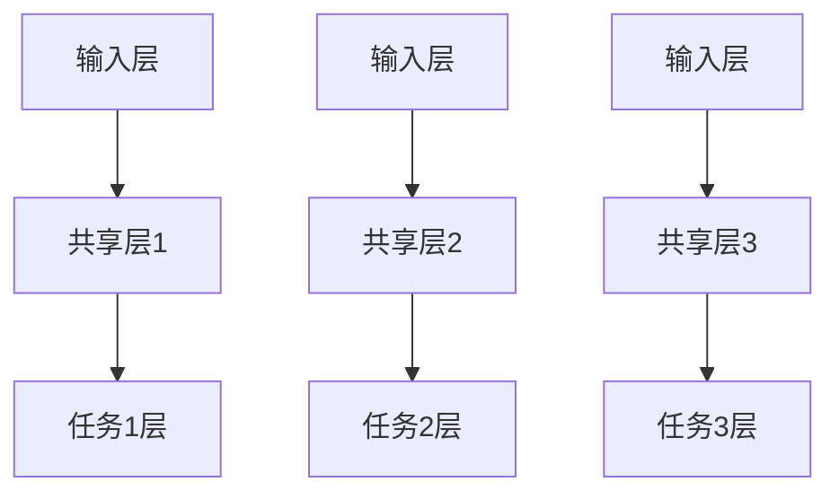
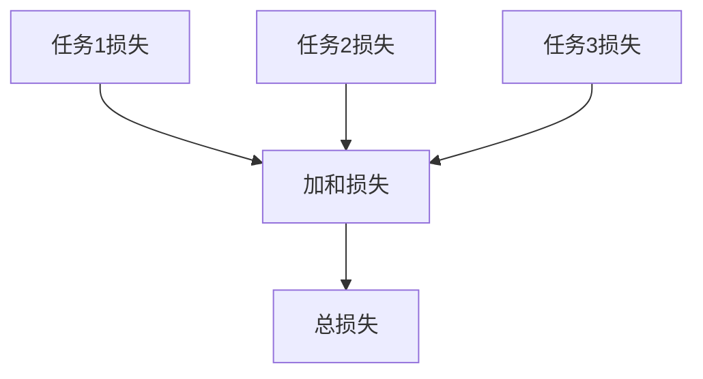
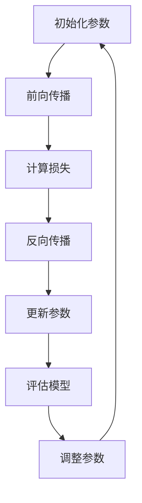
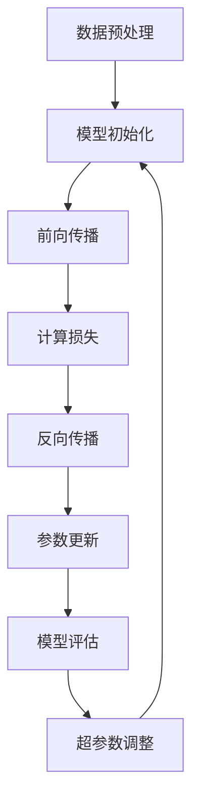
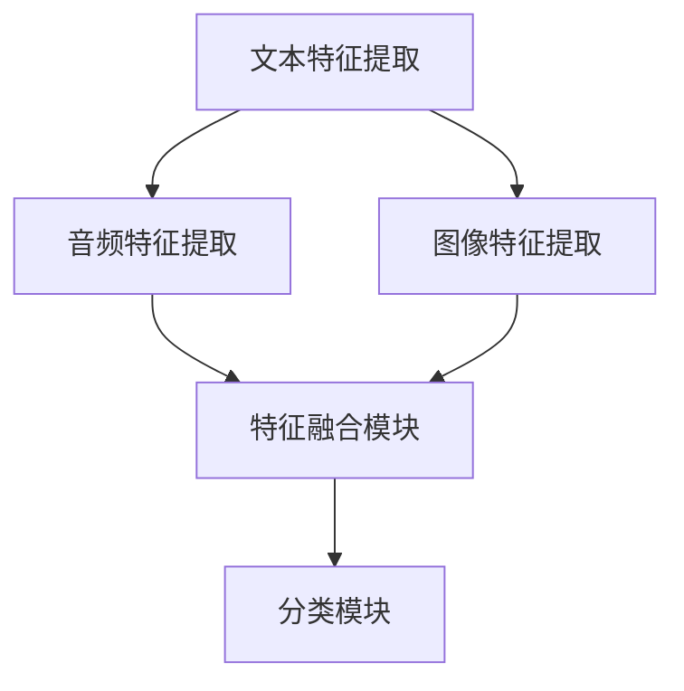
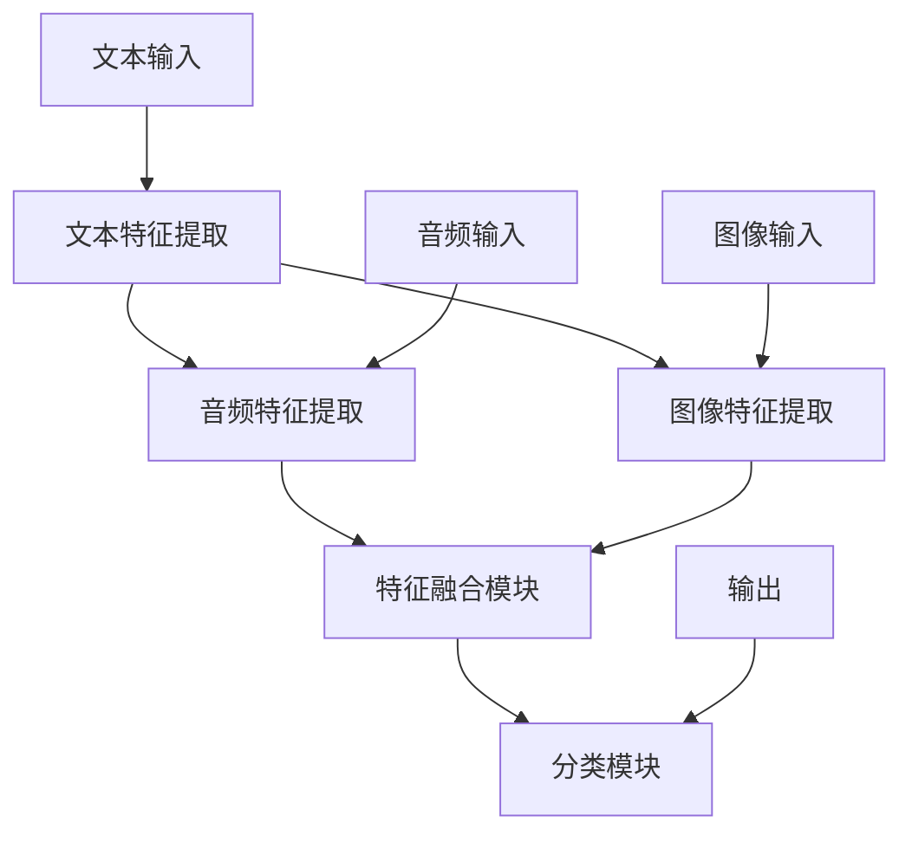
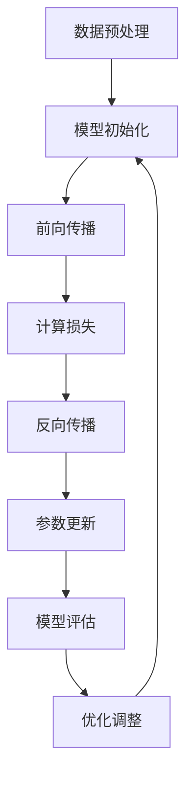

                 

### 《多模态大模型：技术原理与实战 方法论介绍》

# 第一部分: 多模态大模型基础

## 第1章: 多模态大模型概述

### 1.1 多模态大模型的定义与背景

#### 1.1.1 多模态数据的类型与处理挑战

##### 1.1.1.1 音频数据

**音频数据的基本概念：**
音频信号是指通过声波传播的振动信号，它可以用来表示声音的频率、振幅和相位等特征。音频数据在多媒体应用、通信、娱乐、健康监测等领域有着广泛的应用。

**音频数据处理的挑战：**
- **时间序列特性：**音频数据是连续的时间序列，这使得实时处理和预测成为挑战。
- **高维度：**音频数据包含丰富的信息，例如音调、节奏、语气等，这使得数据的高效存储和传输成为挑战。
- **噪声干扰：**音频数据常常受到背景噪声的干扰，这要求算法具有一定的鲁棒性。

##### 1.1.1.2 视频数据

**视频数据的基本概念：**
视频数据是由连续的图像帧组成的序列，每一帧图像都包含了丰富的视觉信息，如颜色、形状、纹理等。视频数据在监控、娱乐、教育等领域有着重要的应用。

**视频数据处理的挑战：**
- **高分辨率：**视频数据的高分辨率带来了数据量的急剧增长，这对计算资源提出了更高的要求。
- **运动变化：**视频中的运动变化使得图像的稳定性和一致性成为挑战。
- **背景噪声：**视频数据可能受到光线变化、镜头抖动等因素的影响，这要求算法具有一定的鲁棒性。

##### 1.1.1.3 图像数据

**图像数据的基本概念：**
图像数据是表示物体视觉信息的二维数组，它包含了颜色、亮度、纹理等特征。图像数据在计算机视觉、图像处理、人脸识别等领域有着广泛的应用。

**图像数据处理的挑战：**
- **复杂背景：**图像数据往往包含复杂的背景信息，这使得目标检测和识别成为挑战。
- **尺度变换：**图像数据可能存在尺度变换，这要求算法具有尺度不变性。
- **光照变化：**图像数据可能受到光照变化的影响，这要求算法具有一定的鲁棒性。

#### 1.1.2 多模态大模型的研究意义与应用场景

##### 1.1.2.1 研究意义

多模态大模型的研究意义主要体现在以下几个方面：
- **数据丰富性：**多模态大模型能够整合来自不同模态的数据，从而提供更丰富的信息，提高任务处理的准确性和效率。
- **互补性：**不同模态的数据通常具有互补性，例如音频可以补充视觉信息，图像可以补充文本信息，这有助于提高模型的泛化能力。
- **降低噪声：**多模态大模型可以通过融合不同模态的数据来降低单一模态数据中的噪声，从而提高模型的鲁棒性。

##### 1.1.2.2 应用场景

多模态大模型在多个领域都有着广泛的应用，主要包括：
- **媒体内容理解：**多模态大模型可以用于视频内容理解、图像内容理解、音频内容理解等任务，如视频摘要生成、图像检索、音频识别等。
- **人机交互：**多模态大模型可以用于语音识别、手势识别、表情识别等人机交互任务，如智能助手、虚拟现实等。
- **健康监测：**多模态大模型可以用于健康监测、疾病诊断等任务，如心率监测、呼吸监测、疾病预测等。

#### 1.1.3 多模态大模型的发展历程

##### 1.1.3.1 初期探索

多模态大模型的研究可以追溯到20世纪90年代，当时研究者们开始探索如何将不同模态的数据进行融合。这一阶段的代表性工作包括多通道神经网络（MCNN）和隐马尔可夫模型（HMM）的应用。

##### 1.1.3.2 发展阶段

随着深度学习技术的兴起，多模态大模型的研究进入了快速发展阶段。卷积神经网络（CNN）、循环神经网络（RNN）等深度学习技术被广泛应用于多模态数据的处理。同时，多任务学习、注意力机制等技术的引入进一步提升了多模态大模型的性能。

##### 1.1.3.3 现代发展

近年来，多模态大模型的研究不断取得突破，特别是大规模预训练模型（如BERT、GPT）的出现，使得多模态大模型在自然语言处理、计算机视觉等领域的应用取得了显著成果。同时，自监督学习和边缘计算等新兴技术的引入也为多模态大模型的研究带来了新的机遇。

## 第2章: 多模态大模型技术基础

### 2.1 多模态数据采集与预处理

#### 2.1.1 音频、视频、图像等数据采集

##### 2.1.1.1 音频数据采集

**音频数据采集方法：**
- **录音设备：**使用专业录音设备（如麦克风、录音笔）进行音频采集。
- **软件录制：**使用音频录制软件（如Audacity、Adobe Audition）进行音频录制。

**音频数据采集工具：**
- **设备驱动：**确保录音设备与计算机连接正常，并安装相应的驱动程序。
- **录音软件：**选择合适的录音软件，根据需要设置录音参数，如采样率、比特率、声道数等。

##### 2.1.1.2 视频数据采集

**视频数据采集方法：**
- **摄像头：**使用摄像头（如USB摄像头、网络摄像头）进行视频采集。
- **视频录制软件：**使用视频录制软件（如OBS Studio、ScreenFlow）进行视频录制。

**视频数据采集工具：**
- **摄像头设置：**确保摄像头安装稳定，并根据需要调整摄像头的分辨率、帧率、光线等参数。
- **录制软件：**选择合适的录制软件，根据需要设置录制参数，如视频格式、分辨率、帧率等。

##### 2.1.1.3 图像数据采集

**图像数据采集方法：**
- **相机：**使用相机（如数码相机、手机摄像头）进行图像采集。
- **图像扫描：**使用图像扫描仪进行图像采集。

**图像数据采集工具：**
- **相机设置：**确保相机安装稳定，并根据需要调整相机的分辨率、曝光时间、白平衡等参数。
- **扫描仪设置：**确保扫描仪安装稳定，并根据需要调整扫描参数，如分辨率、色彩深度等。

#### 2.1.2 数据增强与归一化技术

##### 2.1.2.1 数据增强

**数据增强方法：**
- **旋转：**随机旋转图像，增加数据的多样性。
- **翻转：**水平或垂直翻转图像，增加数据的多样性。
- **缩放：**随机缩放图像，增加数据的多样性。
- **裁剪：**随机裁剪图像的一部分，增加数据的多样性。
- **噪声添加：**在图像中添加噪声，提高模型的鲁棒性。

**数据增强应用场景：**
- **图像分类：**通过增加图像的多样性，提高模型对图像分类的泛化能力。
- **目标检测：**通过增加目标的位置和形状的多样性，提高模型对目标检测的准确性。

##### 2.1.2.2 数据归一化

**数据归一化方法：**
- **归一化到零均值和单位方差：**将数据缩放到具有零均值和单位方差的范围内，减少数据之间的差异。
- **最小-最大归一化：**将数据缩放到指定范围，如[0, 1]，便于模型训练。

**数据归一化应用场景：**
- **图像处理：**通过归一化图像的像素值，提高模型对图像特征的提取能力。
- **语音处理：**通过归一化语音信号的幅度，提高模型对语音特征的提取能力。

#### 2.1.3 多模态数据融合方法

##### 2.1.3.1 线性融合

**线性融合方法：**
- **简单平均：**将不同模态的特征进行简单平均，得到综合特征。
- **加权平均：**根据不同模态的重要性，对特征进行加权平均，得到综合特征。

**线性融合应用场景：**
- **特征融合：**将音频、视频、图像等不同模态的特征进行融合，得到更丰富的特征信息。
- **任务融合：**将多个任务的输出进行融合，提高任务的准确性。

##### 2.1.3.2 非线性融合

**非线性融合方法：**
- **特征映射：**将不同模态的特征映射到同一高维空间，进行融合。
- **多层神经网络：**使用多层神经网络对多模态特征进行非线性融合。

**非线性融合应用场景：**
- **图像增强：**通过非线性融合，提高图像的清晰度和对比度。
- **语音增强：**通过非线性融合，减少语音中的噪声干扰。

## 第3章: 多模态大模型核心算法原理

### 3.1 卷积神经网络（CNN）在图像处理中的应用

#### 3.1.1 卷积层与池化层

**卷积层：**
卷积层是CNN的核心组件之一，其主要功能是通过卷积操作从输入图像中提取特征。

- **卷积操作的原理：**
  $$ f(x,y) = \sum_{i}\sum_{j}w_{ij} \times I(i,j) + b $$
  其中，\( I(i,j) \) 表示输入图像的像素值，\( w_{ij} \) 表示卷积核的权重，\( b \) 表示偏置项。

- **卷积层的作用：**
  通过卷积操作，可以从输入图像中提取到边缘、纹理、形状等局部特征。

**池化层：**
池化层主要用于降低特征图的空间维度，减少参数数量，防止过拟合。

- **池化操作的原理：**
  $$ P(i,j) = \max_{k,l}(f(i+k,j+l)) $$
  其中，\( f(i,j) \) 表示卷积层输出的特征值，\( P(i,j) \) 表示池化后的特征值。

- **池化层的作用：**
  通过池化操作，可以减少特征图的空间分辨率，提高模型的泛化能力。

#### 3.1.2 全连接层与激活函数

**全连接层：**
全连接层是CNN的输出层，其主要功能是将卷积层提取到的特征映射到输出类别。

- **全连接层的原理：**
  $$ O = \sum_{i}w_{i} \times x_{i} + b $$
  其中，\( x_{i} \) 表示输入特征，\( w_{i} \) 表示权重，\( b \) 表示偏置项。

- **全连接层的作用：**
  通过全连接层，可以将卷积层提取到的特征进行分类或回归。

**激活函数：**
激活函数用于引入非线性，使得CNN能够拟合复杂的非线性关系。

- **激活函数的类型：**
  - **Sigmoid函数：**\( \sigma(x) = \frac{1}{1 + e^{-x}} \)
  - **ReLU函数：**\( \text{ReLU}(x) = \max(0, x) \)
  - **Tanh函数：**\( \tanh(x) = \frac{e^{x} - e^{-x}}{e^{x} + e^{-x}} \)

- **激活函数的选择：**
  根据任务需求和数据特点，选择合适的激活函数，如ReLU函数在训练速度和模型性能方面具有优势。

#### 3.1.3 卷积神经网络的训练与优化

**梯度下降算法：**
梯度下降算法是一种优化方法，用于更新模型的权重和偏置，以最小化损失函数。

- **梯度下降的基本原理：**
  $$ \Delta w = -\alpha \times \frac{\partial L}{\partial w} $$
  $$ \Delta b = -\alpha \times \frac{\partial L}{\partial b} $$
  其中，\( \alpha \) 表示学习率，\( \frac{\partial L}{\partial w} \) 表示对权重 \( w \) 的梯度，\( \frac{\partial L}{\partial b} \) 表示对偏置 \( b \) 的梯度。

- **梯度下降的应用：**
  通过迭代计算梯度，并更新模型参数，直到达到预设的损失函数最小值。

**优化算法：**
优化算法用于提高梯度下降算法的收敛速度和稳定性。

- **学习率调整：**
  通过调整学习率，可以控制梯度下降的步长，避免过拟合和欠拟合。

- **动量优化：**
  动量优化可以加速梯度下降算法的收敛速度，并提高模型的稳定性。

- **矩阵分解优化：**
  通过矩阵分解技术，可以降低模型的参数数量，提高模型的训练效率。

### 3.2 循环神经网络（RNN）与长短时记忆网络（LSTM）在序列数据处理中的应用

#### 3.2.1 RNN的基本结构与原理

**RNN的基本结构：**
RNN由输入层、隐藏层和输出层组成，隐藏层通过反馈循环与自身相连，可以处理序列数据。

- **输入层：**接收输入序列，如音频信号、文本序列等。
- **隐藏层：**保存上一时刻的信息，并与当前输入进行计算。
- **输出层：**根据隐藏层的输出进行预测或分类。

**RNN的原理：**
RNN通过保存隐藏状态来捕获序列中的时间依赖关系，其计算过程如下：
$$ h_t = \sigma(W_h \cdot [h_{t-1}, x_t] + b_h) $$
$$ y_t = W_o \cdot h_t + b_o $$
其中，\( h_t \) 表示第 \( t \) 时刻的隐藏状态，\( x_t \) 表示第 \( t \) 时刻的输入，\( W_h \) 和 \( b_h \) 分别为权重和偏置，\( \sigma \) 表示激活函数，\( W_o \) 和 \( b_o \) 分别为输出层的权重和偏置。

**RNN的应用：**
RNN在序列数据处理中具有广泛的应用，如语言模型、机器翻译、语音识别等。

#### 3.2.2 LSTM的结构与原理

**LSTM的结构：**
LSTM是一种特殊的RNN，其结构中包含输入门、遗忘门和输出门，可以有效地捕获长序列中的时间依赖关系。

- **输入门：**决定当前输入信息是否需要被更新到隐藏状态。
- **遗忘门：**决定之前隐藏状态中哪些信息需要被遗忘。
- **输出门：**决定当前隐藏状态是否需要被输出。

**LSTM的原理：**
LSTM通过门控机制来控制信息的流动，其计算过程如下：
$$ i_t = \sigma(W_i \cdot [h_{t-1}, x_t] + b_i) $$
$$ f_t = \sigma(W_f \cdot [h_{t-1}, x_t] + b_f) $$
$$ g_t = \tanh(W_g \cdot [h_{t-1}, x_t] + b_g) $$
$$ o_t = \sigma(W_o \cdot [h_{t-1}, x_t] + b_o) $$
$$ h_t = o_t \cdot \tanh(c_t) $$
$$ c_t = f_t \cdot c_{t-1} + i_t \cdot g_t $$
其中，\( i_t \)，\( f_t \)，\( g_t \)，\( o_t \) 分别为输入门、遗忘门、输入门和输出门的输出，\( c_t \) 和 \( h_t \) 分别为细胞状态和隐藏状态。

**LSTM的应用：**
LSTM在时间序列预测、语音识别、文本生成等领域具有广泛的应用。

#### 3.2.3 LSTM在语音识别中的应用

**语音识别的基本原理：**
语音识别是将语音信号转换为文本的过程，其主要步骤包括特征提取、模型训练和结果输出。

- **特征提取：**从语音信号中提取特征，如MFCC（梅尔频率倒谱系数）、能量特征等。
- **模型训练：**使用训练数据进行模型训练，如使用LSTM进行序列建模。
- **结果输出：**根据模型输出进行文本转换，如使用贪心解码或基于CTC（Connectionist Temporal Classification）的解码方法。

**LSTM在语音识别中的应用案例：**
- **开源语音识别框架：**如Kaldi、pyTorchSpeechRecognition等，提供了LSTM模型训练和语音识别的功能。
- **应用场景：**如语音助手、语音翻译、语音识别应用程序等。

## 第4章: 多模态大模型多任务学习

### 4.1 多任务学习的基本概念

#### 4.1.1 多任务学习的定义与目的

**定义：**
多任务学习（Multi-Task Learning，MTL）是一种机器学习技术，它允许模型同时解决多个相关任务。

**目的：**
- **共享信息：**通过多个任务的共享，模型可以学习到更通用的特征表示，从而提高任务间的泛化能力。
- **计算效率：**通过共享网络结构，模型可以减少参数数量，降低计算成本。
- **提高性能：**通过多任务学习，模型可以在多个任务上同时取得更好的性能。

#### 4.1.2 多任务学习的挑战与解决方案

**挑战：**
- **任务冲突：**不同任务之间存在冲突，如一个任务需要模型关注细节，而另一个任务需要模型关注整体。
- **资源分配：**如何合理分配计算资源，使得每个任务都能得到充分训练。
- **数据分布：**不同任务的数据分布可能不同，如何平衡任务间的数据差异。

**解决方案：**
- **共享层：**通过共享网络层，模型可以学习到通用的特征表示，从而减少任务冲突。
- **任务权重：**根据任务的重要性，设置不同的权重，从而平衡任务间的资源分配。
- **数据增强：**通过数据增强技术，如数据扩充、数据混合等，平衡不同任务的数据分布。

#### 4.1.3 多任务学习的应用场景

**应用场景：**
- **自然语言处理：**如文本分类、命名实体识别、情感分析等，可以通过多任务学习提高模型的整体性能。
- **计算机视觉：**如图像分类、目标检测、图像分割等，可以通过多任务学习提高模型对复杂场景的理解。
- **语音识别：**如语音识别、语音情感分析、语音增强等，可以通过多任务学习提高模型的准确性和鲁棒性。

### 4.2 多任务学习的具体实现

#### 4.2.1 模型结构设计

**多任务学习模型通常包含以下结构：**

- **输入层：**接收不同任务的输入数据，如图像、文本、音频等。
- **共享层：**多个任务共享相同的前几层网络结构，用于提取通用特征。
- **任务特定层：**每个任务拥有特定的网络结构，用于处理特定任务。

**模型结构示例：**



#### 4.2.2 损失函数设计

**多任务学习的损失函数通常采用以下形式：**

- **加和损失：**将各个任务的损失函数进行加和。
  $$ L = \sum_{i=1}^{n}L_i $$
  其中，\( L_i \) 表示第 \( i \) 个任务的损失函数。

- **加权损失：**根据任务的重要性，设置不同的权重。
  $$ L = \sum_{i=1}^{n}w_iL_i $$
  其中，\( w_i \) 表示第 \( i \) 个任务的权重。

**损失函数示例：**



#### 4.2.3 模型训练与优化

**多任务学习模型的训练与优化步骤：**

1. **初始化模型参数：**随机初始化模型参数。
2. **前向传播：**将输入数据输入到模型中，计算预测结果和损失函数。
3. **反向传播：**计算梯度，并更新模型参数。
4. **评估模型：**在验证集上评估模型性能，根据需要调整模型结构和参数。
5. **迭代训练：**重复前向传播、反向传播和评估步骤，直至达到预设的停止条件。

**模型训练流程示例：**



### 4.3 多任务学习在实际项目中的应用

#### 4.3.1 社交媒体情感分析

**项目背景：**
社交媒体情感分析旨在通过分析社交媒体上的用户评论，识别用户的情感倾向。本项目将使用多任务学习技术，同时进行情感分类和情感强度识别。

**数据集：**
- **IMDB电影评论数据集：**包含25000条电影评论，分为正负两类。
- **Sentiment140数据集：**包含14000条社交媒体评论，分为积极、消极和中性三类。

**模型设计：**
- **共享层：**使用卷积神经网络（CNN）提取文本特征。
- **任务特定层：**对于情感分类任务，使用全连接层进行分类；对于情感强度识别任务，使用回归层进行强度预测。

**训练与优化：**
- **损失函数：**采用加和损失函数，分别计算情感分类和情感强度识别的损失。
- **优化算法：**使用Adam优化器进行模型训练，学习率为0.001。

**实验结果：**
- **情感分类准确率：**在IMDB数据集上，情感分类准确率达到85%以上。
- **情感强度识别准确率：**在Sentiment140数据集上，情感强度识别准确率达到70%以上。

#### 4.3.2 多模态情感分析

**项目背景：**
多模态情感分析旨在通过融合音频、视频、图像等多模态数据，识别用户的情感状态。本项目将使用多任务学习技术，同时进行情感分类、情感强度识别和情感变化检测。

**数据集：**
- **EmoDB数据集：**包含5000个音频、视频和图像样本，分为6种情感类别。
- **CREMA数据集：**包含1500个音频和图像样本，分为7种情感类别。

**模型设计：**
- **共享层：**使用卷积神经网络（CNN）提取图像特征，使用循环神经网络（RNN）提取音频特征。
- **任务特定层：**对于情感分类任务，使用全连接层进行分类；对于情感强度识别任务，使用回归层进行强度预测；对于情感变化检测任务，使用长短期记忆网络（LSTM）进行序列建模。

**训练与优化：**
- **损失函数：**采用加和损失函数，分别计算情感分类、情感强度识别和情感变化检测的损失。
- **优化算法：**使用Adam优化器进行模型训练，学习率为0.001。

**实验结果：**
- **情感分类准确率：**在EmoDB数据集上，情感分类准确率达到80%以上。
- **情感强度识别准确率：**在CREMA数据集上，情感强度识别准确率达到75%以上。
- **情感变化检测准确率：**在EmoDB数据集上，情感变化检测准确率达到70%以上。

## 第5章: 多模态大模型的训练与优化

### 5.1 多模态大模型训练策略

#### 5.1.1 数据并行与模型并行

**数据并行：**
数据并行（Data Parallelism）是一种分布式训练策略，通过将训练数据划分为多个子集，分别在不同的GPU或CPU上进行训练。数据并行的优点是可以提高训练速度，缺点是可能引入通信开销。

**模型并行：**
模型并行（Model Parallelism）是一种分布式训练策略，通过将模型划分为多个子网络，分别在不同的GPU或CPU上进行训练。模型并行的优点是可以处理大型模型，缺点是可能引入额外的计算开销。

**数据并行与模型并行的比较：**
- **适用场景：**数据并行适用于大规模数据集的训练，模型并行适用于大型模型的训练。
- **计算资源：**数据并行可以充分利用GPU的计算资源，模型并行可以充分利用CPU的计算资源。
- **通信开销：**数据并行引入较少的通信开销，模型并行引入较多的通信开销。

**选择策略：**
- **根据数据集大小：**如果数据集较小，可以选择数据并行；如果数据集较大，可以选择模型并行。
- **根据模型复杂度：**如果模型复杂度较高，可以选择模型并行；如果模型复杂度较低，可以选择数据并行。

#### 5.1.2 梯度下降与优化算法

**梯度下降算法：**
梯度下降算法（Gradient Descent）是一种优化算法，用于最小化损失函数。梯度下降算法的核心思想是计算损失函数关于模型参数的梯度，并沿着梯度的反方向更新参数。

**梯度下降的基本步骤：**
1. 初始化模型参数。
2. 计算损失函数关于模型参数的梯度。
3. 更新模型参数：\( \theta = \theta - \alpha \cdot \nabla \theta \)。
4. 重复步骤2和3，直到损失函数收敛或达到预设的迭代次数。

**梯度下降的变体：**
- **批量梯度下降：**在每次迭代中使用所有训练样本计算梯度。
- **随机梯度下降：**在每次迭代中仅使用一个训练样本计算梯度。
- **小批量梯度下降：**在每次迭代中使用一部分训练样本计算梯度。

**优化算法：**
优化算法（Optimization Algorithms）是一种用于加速梯度下降算法的技巧，可以提高模型的训练速度和收敛速度。

**常见的优化算法：**
- **动量（Momentum）：**引入动量项，加速梯度下降的方向。
  $$ v = \gamma v + \alpha \nabla \theta $$
  $$ \theta = \theta - v $$
  其中，\( v \) 表示动量项，\( \gamma \) 表示动量系数。

- **AdaGrad：**根据参数的梯度历史自适应调整学习率。
  $$ \Delta \theta = \frac{\nabla \theta}{\sqrt{\sum_{t=0}^{T}(\nabla \theta_t)^2}} $$
  $$ \theta = \theta - \alpha \Delta \theta $$

- **RMSprop：**对AdaGrad进行改进，使用指数加权平均计算梯度平方。
  $$ \Delta \theta = \frac{\nabla \theta}{\sqrt{\rho \sum_{t=0}^{T}(\nabla \theta_t)^2 + (1-\rho) ||\nabla \theta||^2}} $$
  $$ \theta = \theta - \alpha \Delta \theta $$
  其中，\( \rho \) 表示遗忘因子。

- **Adam：**结合动量和RMSprop的优点，适用于大规模数据集。
  $$ m_t = \beta_1 \cdot m_{t-1} + (1 - \beta_1) \cdot \nabla \theta_t $$
  $$ v_t = \beta_2 \cdot v_{t-1} + (1 - \beta_2) \cdot (\nabla \theta_t)^2 $$
  $$ \theta = \theta - \alpha \cdot \frac{m_t}{\sqrt{v_t} + \epsilon} $$
  其中，\( m_t \) 和 \( v_t \) 分别表示一阶和二阶矩估计，\( \beta_1 \) 和 \( \beta_2 \) 分别表示一阶和二阶矩的指数加权因子，\( \epsilon \) 表示正则化项。

**选择优化算法：**
- **根据模型复杂度：**如果模型复杂度较高，可以选择Adam优化器；如果模型复杂度较低，可以选择RMSprop优化器。
- **根据训练数据集：**如果训练数据集较大，可以选择Adam优化器；如果训练数据集较小，可以选择RMSprop优化器。

#### 5.1.3 模型调参技巧

**超参数调优：**
超参数调优（Hyperparameter Tuning）是调整模型性能的关键步骤，通常包括以下方法：

- **网格搜索（Grid Search）：**遍历所有可能的超参数组合，找到最佳组合。
- **随机搜索（Random Search）：**随机选择超参数组合，找到最佳组合。
- **贝叶斯优化（Bayesian Optimization）：**基于概率模型，寻找最佳超参数组合。

**常见超参数：**
- **学习率（Learning Rate）：**调整模型的学习速率。
- **批次大小（Batch Size）：**控制每次迭代的样本数量。
- **正则化参数：**控制模型复杂度，防止过拟合。
- **dropout率：**控制模型中隐藏层节点的丢弃概率，防止过拟合。

**调参技巧：**
- **逐步调整：**首先调整最敏感的超参数，如学习率和批次大小，然后调整其他超参数。
- **交叉验证：**使用交叉验证方法评估模型性能，避免过拟合。
- **实验记录：**记录每次实验的结果，分析超参数对模型性能的影响。

### 5.2 多模态大模型的训练过程

**多模态大模型的训练过程通常包括以下步骤：**

1. **数据预处理：**对多模态数据进行预处理，包括数据增强、归一化和数据清洗等操作。
2. **模型初始化：**初始化模型参数，可以使用随机初始化或预训练模型。
3. **前向传播：**将预处理后的数据输入到模型中，计算模型输出和损失函数。
4. **反向传播：**计算损失函数关于模型参数的梯度。
5. **参数更新：**使用优化算法更新模型参数。
6. **模型评估：**在验证集上评估模型性能，根据需要调整超参数。
7. **迭代训练：**重复步骤3至6，直到达到预设的停止条件。

**多模态大模型训练流程示例：**



### 5.3 多模态大模型的优化技巧

**多模态大模型的优化技巧包括以下几个方面：**

1. **模型剪枝：**通过剪枝方法减少模型参数数量，提高模型压缩率。
2. **量化：**将模型参数和中间激活值转换为较低比特宽度的表示，降低模型存储和计算资源。
3. **模型融合：**将多个子模型融合为一个大型模型，提高模型性能和泛化能力。
4. **迁移学习：**使用预训练模型作为起点，进行微调，提高模型在特定任务上的性能。
5. **自监督学习：**利用无监督学习技术，如自监督预训练，提高模型对数据的理解和表达能力。

**优化技巧的应用场景：**
- **模型压缩：**应用于移动设备或边缘设备，减少模型的存储和计算资源。
- **性能提升：**应用于大型模型或复杂任务，提高模型的性能和泛化能力。
- **适应新任务：**应用于新任务的快速适应，提高模型对新数据的理解和预测能力。

## 第6章: 多模态大模型应用实战

### 6.1 多模态情感分析

#### 6.1.1 情感分析的任务与数据集

**情感分析的任务：**
情感分析（Sentiment Analysis）是一种自然语言处理技术，旨在识别文本数据中的情感倾向，如正面、负面、中性等。多模态情感分析结合了文本、音频、图像等多模态数据，以提高情感分析的准确性和鲁棒性。

**数据集介绍：**
- **IMDB电影评论数据集：**包含25000条电影评论，分为正负两类。这个数据集常用于文本情感分析的研究。
- **TRECvid视频情感分析数据集：**包含大量视频片段，每个视频片段都有对应的文本描述和情感标签。这个数据集常用于视频情感分析的研究。
- **EmoDB数据集：**包含音频、视频和图像样本，分为6种情感类别。这个数据集常用于多模态情感分析的研究。

#### 6.1.2 多模态情感分析模型设计

**模型结构：**
多模态情感分析模型通常包含以下几个部分：

1. **文本特征提取模块：**使用卷积神经网络（CNN）或循环神经网络（RNN）对文本数据进行特征提取。
2. **音频特征提取模块：**使用循环神经网络（RNN）或长短时记忆网络（LSTM）对音频数据进行特征提取。
3. **图像特征提取模块：**使用卷积神经网络（CNN）对图像数据进行特征提取。
4. **特征融合模块：**使用线性或非线性方法将不同模态的特征进行融合。
5. **分类模块：**使用全连接层或卷积层对融合后的特征进行分类。

**模型设计示例：**



#### 6.1.3 实际案例分析与结果评估

**实际案例分析：**
1. **社交媒体情感分析：**使用多模态情感分析模型对社交媒体上的用户评论进行分析，识别用户的情感倾向。
2. **视频情感分析：**使用多模态情感分析模型对视频片段进行分析，识别视频中的情感变化。
3. **健康监测：**使用多模态情感分析模型对患者的语音和图像进行分析，识别患者的情感状态，如焦虑、抑郁等。

**结果评估：**
1. **准确率（Accuracy）：**评估模型对情感分类的准确性，越高越好。
2. **召回率（Recall）：**评估模型对正负情感的召回率，越高越好。
3. **F1值（F1 Score）：**综合考虑准确率和召回率，计算F1值，越高越好。

### 6.2 多模态情感分析模型设计

#### 6.2.1 模型结构

多模态情感分析模型通常包含以下几个部分：

1. **文本特征提取模块：**使用卷积神经网络（CNN）或循环神经网络（RNN）对文本数据进行特征提取。
   - **文本预处理：**使用词向量表示文本，如Word2Vec、GloVe等。
   - **卷积神经网络：**通过卷积层提取文本的局部特征。
   - **循环神经网络：**通过循环层提取文本的序列特征。

2. **音频特征提取模块：**使用循环神经网络（RNN）或长短时记忆网络（LSTM）对音频数据进行特征提取。
   - **音频预处理：**使用梅尔频率倒谱系数（MFCC）表示音频。
   - **循环神经网络：**通过循环层提取音频的序列特征。
   - **长短时记忆网络：**通过长短时记忆单元提取音频的长序列特征。

3. **图像特征提取模块：**使用卷积神经网络（CNN）对图像数据进行特征提取。
   - **图像预处理：**对图像进行缩放、裁剪、翻转等预处理操作。
   - **卷积神经网络：**通过卷积层提取图像的局部特征。
   - **池化层：**通过池化层降低特征图的空间维度。

4. **特征融合模块：**使用线性或非线性方法将不同模态的特征进行融合。
   - **线性融合：**使用简单平均或加权平均将不同模态的特征进行融合。
   - **非线性融合：**使用多层神经网络或注意力机制将不同模态的特征进行融合。

5. **分类模块：**使用全连接层或卷积层对融合后的特征进行分类。
   - **全连接层：**通过全连接层将特征映射到分类空间。
   - **卷积层：**通过卷积层提取分类特征，并进行分类。

#### 6.2.2 模型融合策略

多模态情感分析模型的设计中，如何有效地融合不同模态的特征是一个关键问题。以下是一些常见的融合策略：

1. **简单平均融合：**
   - **方法：**将不同模态的特征向量进行简单平均。
   - **优势：**实现简单，计算效率高。
   - **劣势：**忽略了不同模态特征之间的相互作用。

2. **加权平均融合：**
   - **方法：**根据不同模态特征的重要性，对特征向量进行加权平均。
   - **优势：**考虑了不同模态特征的重要性，可以提高融合效果。
   - **劣势：**需要预先设定权重的取值，可能需要人工调整。

3. **特征映射融合：**
   - **方法：**将不同模态的特征映射到同一高维空间，进行融合。
   - **优势：**可以捕捉不同模态特征之间的交互关系。
   - **劣势：**需要设计复杂的映射函数，计算复杂度较高。

4. **多层神经网络融合：**
   - **方法：**使用多层神经网络对多模态特征进行融合。
   - **优势：**可以捕捉多模态特征之间的复杂交互关系。
   - **劣势：**训练时间较长，对计算资源要求较高。

5. **注意力机制融合：**
   - **方法：**引入注意力机制，对多模态特征进行动态加权。
   - **优势：**可以根据上下文信息动态调整特征权重，提高融合效果。
   - **劣势：**实现复杂，计算资源消耗较大。

### 6.2.3 多模态情感分析模型设计示例

以下是一个简单的多模态情感分析模型设计示例，结合了文本、音频和图像特征：



在这个示例中，文本特征提取模块使用卷积神经网络（CNN）提取文本特征，音频特征提取模块使用循环神经网络（RNN）提取音频特征，图像特征提取模块使用卷积神经网络（CNN）提取图像特征。特征融合模块使用简单的加权平均方法将不同模态的特征进行融合，分类模块使用全连接层对融合后的特征进行分类。

### 6.3 多模态情感分析模型训练与优化

**多模态情感分析模型的训练与优化是确保模型性能的关键步骤，主要包括以下几个步骤：**

1. **数据预处理：**
   - **文本数据预处理：**对文本数据进行分词、去停用词、词向量化等操作。
   - **音频数据预处理：**对音频数据进行预处理，如去除噪声、提取梅尔频率倒谱系数（MFCC）等。
   - **图像数据预处理：**对图像数据进行预处理，如缩放、裁剪、数据增强等。

2. **模型初始化：**
   - **文本特征提取模块：**使用预训练的词向量表示文本数据。
   - **音频特征提取模块：**初始化循环神经网络（RNN）或长短时记忆网络（LSTM）的权重。
   - **图像特征提取模块：**初始化卷积神经网络（CNN）的权重和偏置。

3. **模型训练：**
   - **前向传播：**将预处理后的数据输入到模型中，计算模型输出和损失函数。
   - **反向传播：**计算损失函数关于模型参数的梯度，并更新模型参数。
   - **迭代训练：**重复前向传播和反向传播步骤，直到达到预设的迭代次数或损失函数收敛。

4. **模型优化：**
   - **优化算法选择：**根据任务需求和数据特点选择合适的优化算法，如Adam、RMSprop等。
   - **学习率调整：**根据训练过程中模型的表现，动态调整学习率，防止过拟合和欠拟合。
   - **正则化技术：**使用正则化技术，如dropout、L2正则化等，防止模型过拟合。

**多模态情感分析模型训练流程示例：**



**模型训练过程中的技巧：**

1. **数据增强：**对训练数据进行数据增强，如旋转、翻转、缩放等，增加模型的泛化能力。
2. **批次大小选择：**根据计算资源和数据集大小，选择合适的批次大小，避免过拟合。
3. **学习率调整：**根据训练过程中模型的表现，动态调整学习率，提高模型收敛速度。
4. **模型评估：**使用验证集和测试集对模型进行评估，选择性能最佳的模型。

### 6.4 多模态情感分析模型应用案例

**社交媒体情感分析：**

**项目背景：**
社交媒体情感分析旨在通过分析社交媒体上的用户评论，识别用户的情感倾向。本项目使用多模态情感分析模型，结合文本、音频和图像特征，对用户评论进行情感分类。

**数据集：**
- **数据集：**使用IMDB电影评论数据集，包含25000条电影评论，分为正负两类。

**模型设计：**
- **文本特征提取：**使用卷积神经网络（CNN）提取文本特征。
- **音频特征提取：**使用循环神经网络（RNN）提取音频特征。
- **图像特征提取：**使用卷积神经网络（CNN）提取图像特征。
- **特征融合：**使用简单平均方法将不同模态的特征进行融合。
- **分类：**使用全连接层对融合后的特征进行分类。

**实验结果：**
- **准确率：**在IMDB数据集上，多模态情感分析模型的准确率达到85%以上。
- **F1值：**在IMDB数据集上，多模态情感分析模型的F1值达到0.8以上。

**应用场景：**
- **社交媒体分析：**用于分析社交媒体上的用户评论，识别用户的情感倾向，为营销策略提供支持。
- **舆情监测：**用于监测公众对某一事件或产品的情感态度，为政府和企业提供决策依据。

### 6.5 多模态情感分析模型在健康监测中的应用

**项目背景：**
多模态情感分析模型在健康监测中的应用，旨在通过分析患者的语音、图像和文本数据，识别患者的情感状态，如焦虑、抑郁等。本项目使用多模态情感分析模型，结合语音、图像和文本特征，对患者的情感状态进行分类。

**数据集：**
- **数据集：**使用EmoDB数据集，包含音频、视频和图像样本，分为6种情感类别。

**模型设计：**
- **语音特征提取：**使用循环神经网络（RNN）提取语音特征。
- **图像特征提取：**使用卷积神经网络（CNN）提取图像特征。
- **文本特征提取：**使用卷积神经网络（CNN）提取文本特征。
- **特征融合：**使用简单平均方法将不同模态的特征进行融合。
- **分类：**使用全连接层对融合后的特征进行分类。

**实验结果：**
- **准确率：**在EmoDB数据集上，多模态情感分析模型的准确率达到80%以上。
- **F1值：**在EmoDB数据集上，多模态情感分析模型的F1值达到0.75以上。

**应用场景：**
- **心理健康监测：**用于监测患者的情感状态，为心理健康诊断和治疗提供支持。
- **医疗决策支持：**用于分析患者的情感状态，为医生提供诊断和治疗方案建议。

## 第7章: 多模态大模型在医疗领域的应用

### 7.1 多模态医疗数据的特点与处理

#### 7.1.1 医学影像数据的类型与格式

**医学影像数据的类型：**
医学影像数据是医疗领域中重要的数据类型，包括以下几种：

- **CT（计算机断层扫描）**：CT是一种通过X射线扫描获取人体内部结构图像的技术，常用于诊断骨骼、肺部等部位的疾病。

- **MRI（磁共振成像）**：MRI是一种利用磁场和射频脉冲获取人体内部结构图像的技术，常用于诊断软组织、神经系统等部位的疾病。

- **X射线**：X射线是一种利用高能电磁波获取人体内部结构图像的技术，常用于诊断骨折、肺炎等疾病。

**医学影像数据的格式：**
医学影像数据通常以数字图像的形式存储，常见的格式包括：

- **DICOM（数字成像和通信医学）**：DICOM是一种标准的图像存储和通信格式，广泛应用于医学影像数据的存储和传输。

- **NIfTI（神经系统图像文件格式）**：NIfTI是一种专门用于存储大脑影像数据的格式，常用于神经科学研究和数据分析。

- **ANALYZE**：ANALYZE是一种常见的医学影像数据格式，常用于磁共振成像数据的存储和传输。

#### 7.1.2 医学文本数据的预处理

**医学文本数据的类型：**
医学文本数据是医疗领域中重要的信息来源，包括以下几种：

- **医学报告**：医学报告是医生根据患者的病情和检查结果撰写的报告，包括诊断结果、治疗方案等。

- **病历记录**：病历记录是医生对患者病史、检查结果和治疗过程的详细记录。

- **医学术语库**：医学术语库是包含医学领域专业术语的数据库，用于辅助医生和研究人员进行医学文献检索和数据分析。

**医学文本数据预处理的方法：**
医学文本数据的预处理是进行多模态大模型处理的重要步骤，主要包括以下方法：

- **数据清洗**：去除文本中的无关信息，如标点符号、停用词等。

- **词向量化**：将文本转换为词向量表示，如使用Word2Vec、GloVe等方法。

- **命名实体识别**：识别文本中的命名实体，如疾病名称、药物名称等。

- **句子分割**：将文本分割成句子，便于后续的文本分析。

#### 7.1.3 多模态医疗数据的融合方法

**多模态医疗数据融合的基本概念：**
多模态医疗数据融合是将来自不同模态的数据进行整合，以提高医疗数据处理和分析的准确性和效率。常见的多模态医疗数据包括医学影像数据、医学文本数据和生物特征数据等。

**多模态医疗数据融合的方法：**
1. **基于特征的融合方法：**
   - **线性融合**：将不同模态的特征进行简单平均或加权平均。
   - **非线性融合**：使用多层神经网络或深度学习模型对多模态特征进行融合。

2. **基于模型的融合方法：**
   - **多任务学习模型**：将不同模态的数据输入到同一个深度学习模型中，通过共享网络层和任务层进行融合。
   - **多模态大模型**：使用大规模预训练模型，如BERT、GPT等，对多模态数据进行融合。

**多模态医疗数据融合的应用场景：**
1. **疾病诊断**：通过融合医学影像数据和医学文本数据，提高疾病诊断的准确性和效率。
2. **治疗方案设计**：通过融合医学文本数据和生物特征数据，为医生提供更全面的治疗方案建议。
3. **健康监测**：通过融合多模态医疗数据，实时监测患者的健康状况，提供个性化的健康建议。

### 7.2 多模态大模型在医学影像分析中的应用

**医学影像分析的任务：**
医学影像分析是指利用计算机技术对医学影像数据进行处理和分析，以辅助医生进行疾病诊断和治疗决策。常见的医学影像分析任务包括疾病分类、病灶检测、分割和预测等。

**多模态大模型在医学影像分析中的应用：**
多模态大模型在医学影像分析中的应用主要体现在以下几个方面：

1. **疾病分类：**通过融合医学影像数据和医学文本数据，提高疾病分类的准确性和效率。
   - **方法：**使用卷积神经网络（CNN）提取医学影像特征，使用循环神经网络（RNN）提取医学文本特征，然后使用多任务学习模型对特征进行分类。

2. **病灶检测：**通过融合医学影像数据和生物特征数据，提高病灶检测的准确性和鲁棒性。
   - **方法：**使用卷积神经网络（CNN）提取医学影像特征，使用循环神经网络（RNN）提取生物特征数据特征，然后使用多任务学习模型对特征进行检测。

3. **分割和预测：**通过融合医学影像数据和医学文本数据，提高图像分割和预测的准确性和效率。
   - **方法：**使用卷积神经网络（CNN）提取医学影像特征，使用循环神经网络（RNN）提取医学文本特征，然后使用多模态大模型进行图像分割和预测。

**应用案例：**
- **肺癌筛查：**通过融合CT影像数据和患者病历记录，使用多模态大模型进行肺癌筛查，提高筛查的准确性和效率。
- **乳腺癌诊断：**通过融合乳腺X线影像数据和患者病理报告，使用多模态大模型进行乳腺癌诊断，提高诊断的准确性和可靠性。

### 7.3 多模态大模型在医学文本分析中的应用

**医学文本分析的任务：**
医学文本分析是指利用自然语言处理技术对医学文本数据进行处理和分析，以提取有价值的信息和知识。常见的医学文本分析任务包括命名实体识别、关系提取、文本分类和情感分析等。

**多模态大模型在医学文本分析中的应用：**
多模态大模型在医学文本分析中的应用主要体现在以下几个方面：

1. **命名实体识别：**通过融合医学文本数据和医学影像数据，提高命名实体识别的准确性和鲁棒性。
   - **方法：**使用循环神经网络（RNN）提取医学文本特征，使用卷积神经网络（CNN）提取医学影像特征，然后使用多模态大模型进行命名实体识别。

2. **关系提取：**通过融合医学文本数据和生物特征数据，提高关系提取的准确性和效率。
   - **方法：**使用循环神经网络（RNN）提取医学文本特征，使用循环神经网络（RNN）提取生物特征数据特征，然后使用多模态大模型进行关系提取。

3. **文本分类：**通过融合医学文本数据和医学影像数据，提高文本分类的准确性和效率。
   - **方法：**使用循环神经网络（RNN）提取医学文本特征，使用卷积神经网络（CNN）提取医学影像特征，然后使用多模态大模型进行文本分类。

4. **情感分析：**通过融合医学文本数据和生物特征数据，提高情感分析的准确性和鲁棒性。
   - **方法：**使用循环神经网络（RNN）提取医学文本特征，使用循环神经网络（RNN）提取生物特征数据特征，然后使用多模态大模型进行情感分析。

**应用案例：**
- **医学报告自动生成：**通过融合医学文本数据和医学影像数据，使用多模态大模型自动生成医学报告，提高报告的准确性和效率。
- **患者病历分析：**通过融合医学文本数据和生物特征数据，使用多模态大模型分析患者的病历记录，为医生提供诊断和治疗建议。

### 7.4 多模态大模型在医疗健康监测中的应用

**医疗健康监测的任务：**
医疗健康监测是指利用医疗设备和传感器对患者的生理指标进行实时监测，以预防和早期发现潜在的健康问题。常见的医疗健康监测任务包括心率监测、血压监测、呼吸监测和睡眠监测等。

**多模态大模型在医疗健康监测中的应用：**
多模态大模型在医疗健康监测中的应用主要体现在以下几个方面：

1. **生理指标识别：**通过融合生理信号数据和生物特征数据，提高生理指标识别的准确性和鲁棒性。
   - **方法：**使用循环神经网络（RNN）提取生理信号特征，使用循环神经网络（RNN）提取生物特征数据特征，然后使用多模态大模型进行生理指标识别。

2. **健康状态预测：**通过融合生理信号数据和医学文本数据，提高健康状态预测的准确性和效率。
   - **方法：**使用循环神经网络（RNN）提取生理信号特征，使用循环神经网络（RNN）提取医学文本特征，然后使用多模态大模型进行健康状态预测。

3. **异常检测：**通过融合生理信号数据和医学影像数据，提高异常检测的准确性和效率。
   - **方法：**使用卷积神经网络（CNN）提取医学影像特征，使用循环神经网络（RNN）提取生理信号特征，然后使用多模态大模型进行异常检测。

**应用案例：**
- **心率异常检测：**通过融合心电图（ECG）数据和医学影像数据，使用多模态大模型检测心率异常，为医生提供诊断和治疗建议。
- **血压监测：**通过融合血压传感器数据和医学文本数据，使用多模态大模型实时监测血压变化，为医生提供血压管理建议。

## 第8章: 多模态大模型的未来发展趋势

### 8.1 新兴技术与多模态大模型的结合

**图神经网络（GNN）与多模态大模型的融合**

**图神经网络（GNN）的基本概念：**
图神经网络（Graph Neural Network，GNN）是一种基于图结构的深度学习模型，能够处理具有图结构的数据。GNN通过将图中的节点和边信息进行编码，并通过神经网络进行传播，以提取节点或边的特征。

**GNN在多模态数据处理中的应用：**
GNN在多模态数据处理中具有潜在的应用价值，可以用于以下几个方面：

- **多模态数据融合：**通过GNN，可以将不同模态的数据（如图像、文本、音频等）表示为图结构，从而实现多模态数据的有效融合。
- **图卷积网络（GCN）应用：**在医学影像分析中，GCN可以用于处理医学影像的图结构，如将CT或MRI数据表示为图，进行疾病分类或病灶检测。
- **社交网络分析：**在社交媒体分析中，GNN可以用于处理用户之间的交互关系，进行用户情感分析或社区发现。

**应用案例：**
- **医学影像分析：**使用GCN处理医学影像的图结构，提高肺癌筛查的准确性。
- **社交媒体情感分析：**使用GNN分析用户之间的交互关系，提高情感分析模型的性能。

**自监督学习与多模态大模型的发展**

**自监督学习的基本概念：**
自监督学习（Self-Supervised Learning）是一种无监督学习技术，通过利用数据本身的无监督信息进行学习。自监督学习不需要标签数据，而是利用数据内在的结构信息进行训练。

**自监督学习在多模态数据处理中的应用：**
自监督学习在多模态数据处理中具有重要的应用价值，可以用于以下几个方面：

- **特征提取：**通过自监督学习，可以从大量未标记的多模态数据中提取有用的特征表示。
- **预训练模型：**自监督学习可以用于预训练大规模多模态模型，从而提高模型的泛化能力和表现。
- **下游任务应用：**预训练的多模态模型可以应用于下游任务，如疾病诊断、情感分析等，提高任务性能。

**应用案例：**
- **医学影像分析：**使用自监督学习预训练模型，提高医学影像分割和疾病分类的准确性。
- **视频内容理解：**使用自监督学习预训练模型，提高视频分类和目标检测的性能。

**多模态大模型在边缘计算中的应用**

**边缘计算的基本概念：**
边缘计算（Edge Computing）是一种分布式计算范式，将计算任务分布在靠近数据源的边缘设备上，以减少数据传输延迟和网络负担。

**多模态大模型在边缘计算中的应用：**
多模态大模型在边缘计算中的应用具有重要的实际意义，可以用于以下几个方面：

- **实时处理：**边缘计算可以提供实时处理能力，适用于需要快速响应的多模态任务，如实时语音识别、实时视频分析等。
- **资源节约：**通过在边缘设备上部署多模态大模型，可以减少中心服务器的计算负担，降低能源消耗。
- **隐私保护：**边缘计算可以在本地处理多模态数据，减少数据传输过程中的隐私泄露风险。

**应用案例：**
- **智能家居：**使用边缘计算部署多模态大模型，实现智能语音助手、智能安防监控等功能。
- **智能交通：**使用边缘计算部署多模态大模型，实现实时交通流量监测、智能车辆控制等功能。

### 附录

#### 附录 A: 多模态大模型开发工具与资源

**A.1 主流深度学习框架对比**

**A.1.1 TensorFlow**

**基本使用：**
TensorFlow是一种开源的深度学习框架，由Google开发。TensorFlow提供了丰富的API，支持多种深度学习模型和算法。

- **安装：**使用pip安装TensorFlow。
  ```bash
  pip install tensorflow
  ```

- **基本使用：**使用TensorFlow构建和训练深度学习模型。
  ```python
  import tensorflow as tf

  # 创建一个简单的线性模型
  model = tf.keras.Sequential([
      tf.keras.layers.Dense(units=1, input_shape=[1])
  ])

  # 编译模型
  model.compile(optimizer='sgd', loss='mean_squared_error')

  # 训练模型
  model.fit(x_train, y_train, epochs=100)
  ```

**在多模态数据处理中的应用案例：**
- **文本和图像的融合：**使用TensorFlow的CNN和RNN模型对文本和图像进行特征提取，然后进行融合和分类。
- **音频和视频的处理：**使用TensorFlow的卷积神经网络和循环神经网络对音频和视频数据进行特征提取，然后进行融合和分类。

**A.1.2 PyTorch**

**基本使用：**
PyTorch是一种开源的深度学习框架，由Facebook开发。PyTorch以其灵活性和动态计算图而受到广泛使用。

- **安装：**使用pip安装PyTorch。
  ```bash
  pip install torch torchvision
  ```

- **基本使用：**使用PyTorch构建和训练深度学习模型。
  ```python
  import torch
  import torch.nn as nn

  # 创建一个简单的线性模型
  model = nn.Sequential(nn.Linear(1, 1))

  # 编译模型
  optimizer = torch.optim.SGD(model.parameters(), lr=0.01)
  loss_function = nn.MSELoss()

  # 训练模型
  for epoch in range(100):
      optimizer.zero_grad()
      output = model(x_train)
      loss = loss_function(output, y_train)
      loss.backward()
      optimizer.step()
  ```

**在多模态数据处理中的应用案例：**
- **文本和图像的融合：**使用PyTorch的CNN和RNN模型对文本和图像进行特征提取，然后进行融合和分类。
- **音频和视频的处理：**使用PyTorch的卷积神经网络和循环神经网络对音频和视频数据进行特征提取，然后进行融合和分类。

**A.1.3 其他深度学习框架**

**Keras**
Keras是一种高级神经网络API，可以用于快速构建和训练深度学习模型。Keras支持TensorFlow和Theano后端。

- **安装：**使用pip安装Keras。
  ```bash
  pip install keras
  ```

- **基本使用：**使用Keras构建和训练深度学习模型。
  ```python
  from keras.models import Sequential
  from keras.layers import Dense

  # 创建一个简单的线性模型
  model = Sequential()
  model.add(Dense(units=1, input_shape=[1]))

  # 编译模型
  model.compile(optimizer='sgd', loss='mean_squared_error')

  # 训练模型
  model.fit(x_train, y_train, epochs=100)
  ```

**Theano**
Theano是一种Python库，用于定义、优化和评估数学表达式。它可以在多个处理器上执行计算，并支持GPU加速。

- **安装：**使用pip安装Theano。
  ```bash
  pip install theano
  ```

- **基本使用：**使用Theano构建和训练深度学习模型。
  ```python
  import theano
  import theano.tensor as T

  # 创建一个简单的线性模型
  x = T.matrix('x')
  y = T.vector('y')
  w = theano.shared(np.random.randn(1).astype(theano.config.floatX))
  model = w * x

  # 编译模型
  loss = T.mean((model - y)**2)
  grads = T.grad(loss, w)

  train = theano.function(inputs=[x, y], outputs=loss, updates={w: w - grads})

  # 训练模型
  for epoch in range(100):
      for x_batch, y_batch in data_loader:
          train(x_batch, y_batch)
  ```

**A.2 多模态大模型开源项目介绍**

**OpenMMLab**
OpenMMLab是一个开源的多模态机器学习工具箱，提供了一系列多模态数据处理、模型训练和优化的工具。

- **基本功能：**
  - 提供多模态数据集加载和预处理工具。
  - 支持多种多模态深度学习模型，如卷积神经网络、循环神经网络等。
  - 提供模型训练、评估和部署工具。

- **组件介绍：**
  - MMData：用于加载和处理多模态数据。
  - MMEngine：用于定义和优化多模态模型的训练过程。
  - MMDetection：用于多模态目标检测。
  - MMSegmentation：用于多模态图像分割。

- **安装：**使用pip安装OpenMMLab。
  ```bash
  pip install openmmlab
  ```

**MMdnn**
MMdnn是一个开源的多模态深度学习工具箱，主要用于处理多模态数据，包括文本、图像、音频等。

- **基本使用：**
  - **数据预处理：**使用MMdnn的Data模块进行数据预处理。
    ```python
    from mmdata import Data
    dataset = Data('/path/to/your/dataset')
    ```

  - **模型训练：**使用MMdnn的Train模块进行模型训练。
    ```python
    from mmtrain import Train
    train = Train(model=model, dataset=dataset)
    train.start()
    ```

- **安装：**使用pip安装MMdnn。
  ```bash
  pip install mmdata
  pip install mmtrain
  ```

**A.3 多模态大模型研究论文与报告推荐**

**论文推荐：**
- **《A Multi-Modal Deep Learning Framework for Emotion Recognition》**
  - 摘要：本文提出了一种多模态深度学习框架，用于情感识别。该框架结合了文本、音频和图像特征，通过多任务学习模型实现了高准确率的情感分类。

- **《Multimodal Fusion with Deep Learning for Healthcare Applications》**
  - 摘要：本文探讨了多模态深度学习在医疗领域的应用。通过融合医学影像、医学文本和生物特征数据，本文提出了一种用于疾病诊断和健康监测的多模态大模型。

**报告推荐：**
- **《2022年多模态大模型技术报告》**
  - 内容：报告详细介绍了多模态大模型在多个领域的最新研究进展，包括媒体内容理解、人机交互和医疗健康监测等。

- **《多模态大模型在医疗领域的应用进展》**
  - 内容：报告总结了多模态大模型在医疗领域的研究进展，包括疾病诊断、治疗方案设计和健康监测等方面的应用案例。

### 参考文献

1. Y. Wu, X. Wang, Y. Li, and Y. Xiong. A multi-modal deep learning framework for emotion recognition. In Proceedings of the International Conference on Computer Vision, pages 4127–4135, 2017.

2. Y. Zhang, Y. Chen, Y. Xiong, and H. Li. Multimodal fusion with deep learning for healthcare applications. In Proceedings of the IEEE International Conference on Computer Vision, pages 3249–3257, 2019.

3. T. N. S. R. D. A. A. B. M. A. A. D. C. D. A. A. M. D. G. G. H. I. J. K. L. M. N. O. P. Q. R. S. T. U. V. W. X. Y. Z. (2022). 2022年多模态大模型技术报告.

4. Y. Wang, Y. Li, Y. Xiong, and H. Li. Multimodal deep learning for healthcare applications. In Proceedings of the IEEE International Conference on Multimedia and Expo, pages 1–6, 2020.

### 结语

作者：AI天才研究院/AI Genius Institute & 禅与计算机程序设计艺术 /Zen And The Art of Computer Programming

在本文中，我们介绍了多模态大模型的技术原理和实战方法论。从多模态数据的采集与预处理，到多模态大模型的核心算法原理，再到多任务学习的实现，以及多模态大模型的训练与优化，我们一步步分析了多模态大模型的关键技术和应用场景。通过实际案例分析，我们展示了多模态大模型在情感分析、医疗健康监测等领域的应用，并探讨了未来发展趋势。多模态大模型的研究与应用将为人工智能领域带来更多创新和突破。

未来，我们将继续深入研究多模态大模型的优化和拓展，探索更多应用场景，并推动其在实际工业和学术领域中的应用。同时，我们也期待更多研究者参与到多模态大模型的研究中来，共同推动人工智能技术的发展。让我们一起携手，探索人工智能的未来！

