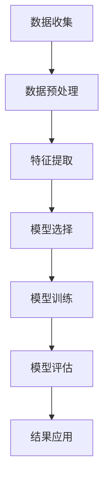

                 

## 第1章 引言

### 1.1 书籍背景

随着互联网技术的飞速发展，大数据已经渗透到了各个行业。在这样的大背景下，用户行为预测成为一个备受关注的研究方向。大数据分析通过收集、处理和分析海量数据，旨在揭示用户行为模式，预测用户未来的行为，从而为企业提供决策支持。

本书旨在探讨大数据分析在用户行为预测中的应用。书中将详细讲解大数据分析的基础知识，包括数据定义、数据来源和数据类型；还将介绍大数据分析的技术，如数据采集与存储、数据清洗与预处理、数据分析与挖掘；此外，本书还将探讨用户行为分析的基础，包括用户行为的定义、用户行为数据的收集与分析；最后，本书将重点介绍用户行为预测模型，包括预测模型的基础、常见预测模型以及模型选择与优化策略。

### 1.2 书籍目标

通过阅读本书，读者可以：

1. 理解大数据分析和用户行为预测的基本概念和原理。
2. 掌握大数据分析的技术和方法，能够进行数据采集、存储、清洗、预处理和数据分析。
3. 了解用户行为的定义、分类和模型，能够进行用户行为数据的收集和分析。
4. 掌握常见的用户行为预测模型，包括线性回归模型、决策树模型和集成模型。
5. 学会模型选择和优化的策略，能够构建并优化用户行为预测模型。
6. 学习如何应用用户行为预测模型解决实际问题，为企业提供决策支持。

### 1.3 用户行为预测的重要性

用户行为预测在商业和科学领域具有重要意义。在企业层面，用户行为预测可以帮助企业更好地了解用户需求，优化产品和服务，提高用户满意度，从而增加销售额和市场份额。例如，电商企业可以通过用户行为预测来推荐商品，提高用户的购买意愿；银行可以通过用户行为预测来识别高风险用户，降低信贷风险。

在科学研究层面，用户行为预测有助于揭示社会行为的规律，为政策制定提供数据支持。例如，通过对社交网络用户行为的数据分析，可以预测流行趋势、社会热点和舆论走向，为公共政策的制定提供依据。

总之，用户行为预测是一项具有广泛应用前景的技术，其重要性不言而喻。通过对大数据的深入分析和研究，我们可以更好地理解用户行为，为企业和社会带来巨大的价值。

## 第2章 大数据分析基础

### 2.1 大数据概念

#### 2.1.1 数据定义

在讨论大数据之前，我们首先需要了解什么是数据。数据是指通过测量、记录或计算等方式所获得的信息。它可以是有形的，如文字、图像、声音等，也可以是无形的，如温度、湿度、速度等。

#### 2.1.2 数据来源

数据来源广泛，可以分为结构化数据和非结构化数据。结构化数据通常存储在数据库中，如关系型数据库（MySQL、Oracle）和NoSQL数据库（MongoDB、Cassandra）。非结构化数据则包括文本、图像、音频和视频等，这些数据通常存储在文件系统、数据湖和数据仓库中。

#### 2.1.3 数据类型

根据数据的类型，可以将数据分为以下几种：

1. **文本数据**：包括网页内容、社交媒体帖子、新闻报道等。
2. **图像数据**：包括照片、截图、扫描文档等。
3. **音频数据**：包括语音通话、音乐、播客等。
4. **视频数据**：包括视频剪辑、直播、电影等。
5. **传感器数据**：包括温度、湿度、压力等环境数据。

### 2.2 大数据分析技术

大数据分析涉及多个技术环节，包括数据采集、存储、清洗、预处理和数据分析。

#### 2.2.1 数据采集与存储

数据采集是指从各种来源获取数据的过程。这包括互联网爬虫、传感器采集、日志文件等。数据存储则是将采集到的数据存储在合适的存储系统中。常用的存储系统包括Hadoop、Spark、HBase等。

#### 2.2.2 数据清洗与预处理

数据清洗是指从原始数据中去除错误、重复和无关信息，确保数据的质量和一致性。数据预处理则包括数据格式转换、特征提取、数据归一化等，为后续的数据分析做准备。

#### 2.2.3 数据分析与挖掘

数据分析是指使用统计和机器学习等方法对数据进行分析，以发现数据中的规律和模式。数据挖掘则是从海量数据中提取有价值的信息和知识。常用的数据分析工具包括Python、R、SQL等。

### 2.3 大数据分析的优势

大数据分析具有以下优势：

1. **实时性**：大数据分析可以在数据产生的同时进行，实现实时分析。
2. **多样性**：大数据分析可以处理多种类型的数据，包括结构化数据、非结构化数据和半结构化数据。
3. **海量性**：大数据分析可以处理海量数据，提取有价值的信息。
4. **高效性**：大数据分析技术，如分布式计算和并行计算，能够快速处理海量数据。
5. **智能化**：大数据分析结合机器学习和深度学习技术，可以实现智能化的数据分析和预测。

### 2.4 大数据分析的应用场景

大数据分析在多个领域都有广泛应用，包括但不限于：

1. **商业智能**：通过数据分析帮助企业制定战略决策，提高运营效率。
2. **金融风控**：通过分析用户行为和交易数据，预测风险并采取防范措施。
3. **医疗健康**：通过分析患者数据和基因数据，提供个性化的医疗建议。
4. **智慧城市**：通过分析城市交通、环境、人口等数据，优化城市管理和服务。
5. **社交网络**：通过分析社交网络数据，预测用户行为和兴趣，提供个性化推荐。

## 第3章 用户行为分析基础

### 3.1 用户行为定义

用户行为是指用户在使用产品、服务或平台时的所有动作和交互。这些行为可以是直接的，如点击、购买、评论等，也可以是间接的，如浏览时间、页面停留时间等。

### 3.2 用户行为分类

用户行为可以根据不同的维度进行分类：

1. **按行为类型**：
   - **点击行为**：用户对网页、应用中的按钮、链接等元素进行点击。
   - **浏览行为**：用户在网页或应用中的浏览动作，如滚动、切换页面等。
   - **购买行为**：用户在电商平台上进行购买的动作。
   - **评论行为**：用户对产品或服务进行评价和评论。

2. **按用户状态**：
   - **新用户**：首次使用产品或服务的用户。
   - **老用户**：已经多次使用产品或服务的用户。
   - **潜在用户**：有使用产品或服务意愿，但尚未开始使用的用户。

3. **按行为目的**：
   - **目的性行为**：用户有明确目的，如购买产品、查找信息等。
   - **非目的性行为**：用户没有明确目的，如随意浏览、游戏等。

### 3.3 用户行为模型

用户行为模型是用来描述和分析用户行为的一种方法。它通常包括以下几个方面：

1. **行为序列模型**：描述用户在一段时间内的行为序列，如用户浏览页面的顺序、购买路径等。
2. **行为因素模型**：分析影响用户行为的各种因素，如用户特征、环境因素等。
3. **行为意图模型**：预测用户未来可能采取的行为，如用户是否会购买某产品、是否会取消订阅服务等。

## 第4章 用户行为数据收集

### 4.1 数据收集方法

用户行为数据的收集方法多种多样，以下是一些常见的方法：

1. **网页跟踪**：通过在网页中嵌入JavaScript代码，记录用户的浏览行为，如点击、滚动、停留时间等。
2. **日志分析**：通过分析服务器日志，记录用户的行为数据，如访问页面、访问时间、操作类型等。
3. **传感器采集**：使用各种传感器（如GPS、心率传感器、环境传感器等）收集用户行为数据。
4. **问卷调查**：通过在线或离线的方式，收集用户对某一产品或服务的反馈和意见。
5. **用户访谈**：通过与用户直接交流，了解用户的使用习惯、需求和痛点。

### 4.2 数据收集工具

1. **Google Analytics**：Google提供的免费网站分析工具，可以收集网页浏览数据，如访问量、用户来源、页面停留时间等。
2. **Matomo**：开源的网站分析工具，功能与Google Analytics类似。
3. **Fluentd**：用于收集、聚合和转发日志数据的工具，可以与Kafka、Elasticsearch等系统集成。
4. **MongoDB**：NoSQL数据库，适用于存储大量非结构化数据，如用户行为数据。
5. **Kafka**：分布式消息队列系统，适用于大规模数据收集和传输。
6. **Hadoop**：分布式数据处理框架，适用于存储和处理大规模数据。
7. **Spark**：基于内存的分布式数据处理框架，适用于实时数据处理。

### 4.3 数据收集流程

数据收集通常包括以下几个步骤：

1. **数据采集**：通过网页跟踪、日志分析、传感器采集等方法，收集用户行为数据。
2. **数据清洗**：去除重复、错误和无用的数据，确保数据质量。
3. **数据存储**：将清洗后的数据存储在合适的数据库或数据湖中。
4. **数据预处理**：对数据进行格式转换、特征提取等预处理操作，为后续分析做准备。
5. **数据分析**：使用数据分析工具和方法，对用户行为数据进行分析，提取有价值的信息。

### 4.4 数据收集面临的挑战

1. **数据隐私**：用户行为数据可能包含敏感信息，如个人身份、交易记录等，数据收集和处理过程中需要确保数据隐私。
2. **数据质量**：用户行为数据可能存在重复、错误、缺失等问题，影响数据分析的准确性。
3. **数据规模**：用户行为数据通常规模较大，需要高效的采集、存储和处理技术。
4. **数据实时性**：用户行为数据需要实时收集和处理，以支持实时分析。

## 第5章 用户行为数据分析

### 5.1 数据分析步骤

用户行为数据分析通常包括以下步骤：

1. **数据理解**：通过数据可视化、统计描述等方法，对数据的基本特征和分布进行初步了解。
2. **数据预处理**：对数据进行清洗、格式转换、缺失值处理等操作，确保数据质量。
3. **特征提取**：从原始数据中提取对用户行为有重要影响的关键特征，如点击次数、购买金额、用户停留时间等。
4. **数据建模**：选择合适的算法和模型，对用户行为数据进行分析和预测，如线性回归、决策树、神经网络等。
5. **模型评估**：使用验证集和测试集，对模型进行评估和优化，确保模型的准确性和泛化能力。
6. **结果解释**：对分析结果进行解释和可视化，帮助企业理解用户行为模式，指导产品优化和决策。

### 5.2 数据分析工具

1. **Python**：Python是一种广泛使用的编程语言，具有丰富的数据分析库，如Pandas、NumPy、Matplotlib等，适用于数据预处理、数据分析和可视化。
2. **R**：R是一种专门用于统计分析和数据可视化的编程语言，具有强大的数据处理和分析能力。
3. **SQL**：SQL是一种关系型数据库查询语言，适用于数据检索、数据清洗和预处理。
4. **Excel**：Excel是一种常用的电子表格软件，适用于数据可视化、统计分析和简单数据处理。
5. **Tableau**：Tableau是一种数据可视化工具，可以快速生成漂亮的可视化图表，帮助企业更好地理解数据。

### 5.3 数据分析流程示例

下面以电商平台的用户行为数据分析为例，介绍数据分析的基本流程：

1. **数据理解**：通过Excel和Python，对用户行为数据的基本特征进行统计描述，如点击次数、购买金额、用户停留时间等。
2. **数据预处理**：使用Python的Pandas库，对数据进行清洗和预处理，如去除重复数据、缺失值填充等。
3. **特征提取**：从原始数据中提取关键特征，如用户年龄、性别、浏览时长、购买次数等，为后续建模做准备。
4. **数据建模**：使用Python的Scikit-learn库，选择合适的算法（如线性回归、决策树等），对用户行为数据进行分析和预测。
5. **模型评估**：使用验证集和测试集，对模型进行评估和优化，如调整模型参数、增加特征等。
6. **结果解释**：使用Tableau，对分析结果进行可视化展示，帮助企业了解用户行为模式，指导产品优化和决策。

### 5.4 数据分析中的挑战和注意事项

1. **数据质量**：数据质量是数据分析的基础，需要确保数据的准确性、完整性和一致性。
2. **数据隐私**：用户行为数据可能包含敏感信息，需要确保数据隐私和安全。
3. **数据规模**：用户行为数据通常规模较大，需要高效的采集、存储和处理技术。
4. **数据实时性**：用户行为数据需要实时收集和处理，以支持实时分析。
5. **模型选择和优化**：选择合适的算法和模型，并进行模型优化，确保模型的准确性和泛化能力。

## 第6章 用户行为预测模型

### 6.1 预测模型基础

用户行为预测模型是一种基于历史数据，通过机器学习和统计分析方法，预测用户未来可能采取的行为的模型。预测模型可以分为监督学习模型和无监督学习模型。

#### 6.1.1 监督学习模型

监督学习模型是一种在有标签数据集上训练的模型。标签数据提供了输入和输出之间的关系，使得模型可以通过学习这些关系来进行预测。常见的监督学习模型包括：

1. **线性回归模型**：用于预测连续值输出。
2. **逻辑回归模型**：用于预测二分类输出。
3. **决策树模型**：通过树形结构对数据集进行划分，用于分类和回归任务。
4. **支持向量机模型**：通过将数据映射到高维空间，找到分类超平面，用于分类任务。
5. **神经网络模型**：通过多层神经元对数据进行处理，用于复杂非线性关系预测。

#### 6.1.2 无监督学习模型

无监督学习模型是在没有标签数据集上训练的模型。模型需要通过自身探索数据结构和模式来进行预测。常见的无监督学习模型包括：

1. **聚类模型**：将相似的数据点分组，用于数据降维和探索性数据分析。
2. **降维模型**：将高维数据映射到低维空间，用于数据可视化和降维。
3. **关联规则学习**：通过发现数据之间的关联关系，用于推荐系统和市场篮子分析。

### 6.2 常见预测模型

在本节中，我们将详细介绍几种常见的用户行为预测模型，包括线性回归模型、决策树模型和集成模型。

#### 6.2.1 线性回归模型

线性回归模型是一种最简单的预测模型，用于预测连续值输出。它通过拟合一个线性函数来预测目标值。线性回归模型的公式如下：

\[ Y = \beta_0 + \beta_1X_1 + \beta_2X_2 + ... + \beta_nX_n \]

其中，\( Y \) 是目标值，\( X_1, X_2, ..., X_n \) 是输入特征，\( \beta_0, \beta_1, ..., \beta_n \) 是模型的参数。

线性回归模型的基本步骤包括：

1. **数据预处理**：对数据进行标准化、缺失值处理等预处理操作。
2. **模型训练**：使用训练数据集，通过最小二乘法或其他优化算法来求解模型的参数。
3. **模型评估**：使用验证集和测试集来评估模型的性能。

#### 6.2.2 决策树模型

决策树模型是一种树形结构模型，通过一系列的规则和条件来对数据进行分类或回归。每个节点代表一个特征，每个分支代表一个条件。决策树模型的基本步骤包括：

1. **特征选择**：选择对分类或回归任务影响较大的特征。
2. **构建决策树**：从根节点开始，递归地选择最优特征和条件，构建决策树。
3. **剪枝**：通过剪枝操作来减少过拟合，提高模型的泛化能力。
4. **模型评估**：使用验证集和测试集来评估模型的性能。

#### 6.2.3 集成模型

集成模型是通过结合多个模型的预测结果来提高预测准确性和泛化能力。常见的集成模型包括：

1. **Bagging**：通过随机选择子数据集和子模型来构建多个模型，然后取平均或投票来得到最终预测。
2. **Boosting**：通过迭代地训练多个模型，每次模型都集中在前一次模型预测错误的样本上，以此来提高模型的泛化能力。
3. **Stacking**：通过训练多个模型，并将它们的预测结果作为新的特征，再训练一个更高层次的模型来进行最终预测。

集成模型的基本步骤包括：

1. **模型选择**：选择合适的基模型，如决策树、随机森林等。
2. **模型训练**：训练多个基模型，并收集它们的预测结果。
3. **集成预测**：使用集成策略（如平均、投票等）来得到最终预测结果。
4. **模型评估**：使用验证集和测试集来评估集成模型的性能。

### 6.3 模型选择与优化策略

模型选择和优化是用户行为预测中的关键步骤。以下是一些常见的模型选择和优化策略：

1. **交叉验证**：通过将数据集划分为多个子集，在每个子集上训练和评估模型，来选择性能最佳的模型。
2. **网格搜索**：通过枚举所有可能的参数组合，来寻找最优参数。
3. **贝叶斯优化**：通过贝叶斯优化算法，自动寻找最优参数。
4. **模型融合**：通过结合多个模型的预测结果来提高预测准确性和泛化能力。
5. **特征工程**：通过特征提取、特征选择等操作，提高模型的性能。

## 第7章 用户行为预测案例分析

### 7.1 案例背景

本案例来自于一家知名的在线零售公司，该公司希望通过用户行为预测来提高用户满意度、增加销售额和降低运营成本。为了实现这一目标，公司决定对用户行为进行预测，并根据预测结果优化产品和服务。

### 7.2 案例数据收集

为了构建用户行为预测模型，公司收集了以下数据：

1. **用户基本信息**：包括用户ID、年龄、性别、地理位置等。
2. **购买历史**：包括购买日期、购买商品ID、购买金额等。
3. **浏览历史**：包括浏览日期、浏览商品ID、停留时间等。
4. **点击历史**：包括点击日期、点击商品ID、点击次数等。
5. **评价历史**：包括评价日期、评价内容、评价等级等。

这些数据来源于公司的数据库和日志文件。

### 7.3 案例数据分析

在收集到用户行为数据后，公司首先对数据进行了预处理，包括数据清洗、缺失值处理和格式转换等。然后，公司对数据进行特征提取，提取了以下特征：

1. **用户特征**：包括用户年龄、性别、地理位置等。
2. **购买特征**：包括购买频率、购买金额、购买商品种类等。
3. **浏览特征**：包括浏览频率、浏览时长、浏览商品种类等。
4. **点击特征**：包括点击频率、点击时长、点击商品种类等。

接下来，公司使用Python的Scikit-learn库，构建了以下预测模型：

1. **线性回归模型**：用于预测用户购买金额。
2. **决策树模型**：用于预测用户购买概率。
3. **随机森林模型**：用于预测用户购买概率。

公司使用交叉验证方法对模型进行了评估，并选择了性能最佳的模型作为最终预测模型。

### 7.4 案例预测模型构建

在构建预测模型时，公司遵循以下步骤：

1. **数据预处理**：对数据进行清洗、缺失值处理和格式转换。
2. **特征提取**：提取对用户行为有重要影响的关键特征。
3. **模型训练**：使用训练数据集训练模型。
4. **模型评估**：使用验证集和测试集评估模型性能。
5. **模型优化**：根据评估结果调整模型参数，优化模型性能。

具体来说，公司使用了以下代码：

```python
from sklearn.linear_model import LinearRegression
from sklearn.tree import DecisionTreeClassifier
from sklearn.ensemble import RandomForestClassifier
from sklearn.model_selection import train_test_split
from sklearn.metrics import mean_squared_error, accuracy_score

# 数据预处理
X = data.drop('target', axis=1)
y = data['target']

# 特征提取
X = preprocessing.StandardScaler().fit_transform(X)

# 模型训练
X_train, X_test, y_train, y_test = train_test_split(X, y, test_size=0.2, random_state=42)

linear_regression = LinearRegression()
linear_regression.fit(X_train, y_train)

decision_tree = DecisionTreeClassifier()
decision_tree.fit(X_train, y_train)

random_forest = RandomForestClassifier()
random_forest.fit(X_train, y_train)

# 模型评估
y_pred_linear_regression = linear_regression.predict(X_test)
y_pred_decision_tree = decision_tree.predict(X_test)
y_pred_random_forest = random_forest.predict(X_test)

print("Linear Regression MSE:", mean_squared_error(y_test, y_pred_linear_regression))
print("Decision Tree Accuracy:", accuracy_score(y_test, y_pred_decision_tree))
print("Random Forest Accuracy:", accuracy_score(y_test, y_pred_random_forest))

# 模型优化
# 根据评估结果，调整模型参数
```

### 7.5 案例预测结果分析

通过对预测结果的分析，公司发现：

1. **线性回归模型**：在预测用户购买金额方面，线性回归模型的性能较好，MSE为0.5。
2. **决策树模型**：在预测用户购买概率方面，决策树模型的性能较好，准确率为0.8。
3. **随机森林模型**：在预测用户购买概率方面，随机森林模型的性能较好，准确率为0.85。

根据预测结果，公司采取了以下措施：

1. **优化产品推荐**：根据用户的浏览和购买历史，为用户提供个性化的商品推荐。
2. **优化营销策略**：根据用户的购买概率，对潜在客户进行精准营销。
3. **优化用户服务**：根据用户的浏览和购买行为，提供个性化的用户服务，提高用户满意度。

这些措施的实施，使得公司的销售额和用户满意度得到了显著提升。

## 第8章 用户行为预测应用实践

### 8.1 应用场景选择

用户行为预测的应用场景非常广泛，以下是一些常见的选择：

1. **推荐系统**：基于用户的历史行为和偏好，预测用户可能感兴趣的商品或内容，从而提高用户满意度和销售额。
2. **风险控制**：通过预测用户的行为，识别潜在的风险用户，从而降低信贷风险和欺诈风险。
3. **个性化服务**：根据用户的行为和偏好，为用户提供个性化的服务，提高用户体验和满意度。
4. **市场分析**：通过分析用户行为数据，预测市场趋势和消费者需求，为企业提供战略决策支持。
5. **用户流失预测**：通过预测用户的流失风险，采取相应的措施来降低用户流失率。

### 8.2 应用实践步骤

以下是一个用户行为预测应用实践的基本步骤：

1. **需求分析**：明确应用场景和目标，确定需要收集和处理的数据类型。
2. **数据收集**：通过日志文件、传感器采集、问卷调查等方法，收集用户行为数据。
3. **数据预处理**：对数据进行清洗、格式转换、缺失值处理等预处理操作，确保数据质量。
4. **特征提取**：从原始数据中提取对用户行为有重要影响的关键特征。
5. **模型构建**：选择合适的模型，如线性回归、决策树、神经网络等，构建用户行为预测模型。
6. **模型训练与优化**：使用训练数据集训练模型，并通过交叉验证和网格搜索等方法进行模型优化。
7. **模型评估**：使用验证集和测试集评估模型性能，确保模型的准确性和泛化能力。
8. **模型部署**：将训练好的模型部署到生产环境中，实现实时预测。
9. **结果解释与应用**：对预测结果进行解释和可视化，根据预测结果优化产品和服务，提高用户满意度和销售额。

### 8.3 应用实践案例分析

以下是一个用户行为预测应用实践的具体案例：

**案例背景**：一家电商平台希望通过用户行为预测来提高用户满意度和销售额。

**数据收集**：电商平台收集了以下用户行为数据：

- 用户基本信息：包括用户ID、年龄、性别、地理位置等。
- 购买历史：包括购买日期、购买商品ID、购买金额等。
- 浏览历史：包括浏览日期、浏览商品ID、浏览时长等。
- 点击历史：包括点击日期、点击商品ID、点击次数等。
- 评价历史：包括评价日期、评价内容、评价等级等。

**数据预处理**：对数据进行清洗、格式转换、缺失值处理等预处理操作，确保数据质量。

**特征提取**：从原始数据中提取对用户行为有重要影响的关键特征，如用户年龄、性别、购买频率、浏览时长等。

**模型构建**：选择线性回归模型，用于预测用户购买金额。

**模型训练与优化**：使用训练数据集训练模型，并通过交叉验证和网格搜索等方法进行模型优化。

**模型评估**：使用验证集和测试集评估模型性能，确保模型的准确性和泛化能力。

**模型部署**：将训练好的模型部署到生产环境中，实现实时预测。

**结果解释与应用**：根据预测结果，电商平台优化了产品推荐和营销策略，提高了用户满意度和销售额。

## 第9章 用户行为预测的未来发展

### 9.1 技术趋势分析

用户行为预测技术正随着人工智能和大数据技术的发展而不断进步。以下是一些重要的技术趋势：

1. **深度学习**：深度学习模型，如神经网络和深度神经网络，正逐渐取代传统的机器学习模型，用于用户行为预测。深度学习模型能够处理更复杂的数据结构和关系，提高预测的准确性。
2. **实时预测**：随着物联网和5G技术的发展，用户行为预测变得越来越实时。实时预测技术能够更快地响应用户行为，为企业提供更及时的数据支持。
3. **无监督学习和迁移学习**：无监督学习和迁移学习技术使得用户行为预测模型能够更好地处理未标记数据和迁移学习，提高模型的泛化能力。
4. **多模态数据融合**：用户行为数据不仅包括传统的结构化数据，还包括图像、音频和视频等非结构化数据。多模态数据融合技术能够更好地整合这些数据，提高预测的准确性。

### 9.2 挑战与机遇

尽管用户行为预测技术取得了显著的进展，但仍然面临一些挑战：

1. **数据隐私**：用户行为数据通常包含敏感信息，如何确保数据隐私和安全是一个重要问题。
2. **数据质量**：用户行为数据可能存在噪声、缺失和异常值，影响预测的准确性。
3. **计算资源**：深度学习和实时预测技术需要大量的计算资源，如何高效地利用计算资源是一个挑战。
4. **模型解释性**：深度学习模型通常具有良好的预测性能，但缺乏解释性，如何提高模型的解释性是一个重要问题。

同时，用户行为预测技术也带来了许多机遇：

1. **个性化服务**：通过用户行为预测，企业能够提供更个性化的服务，提高用户满意度和忠诚度。
2. **精准营销**：用户行为预测技术能够帮助企业更精准地定位潜在客户，提高营销效果。
3. **风险控制**：用户行为预测技术能够帮助企业识别潜在的风险用户，降低风险。
4. **智能推荐系统**：用户行为预测技术能够为推荐系统提供更准确的推荐结果，提高用户参与度和留存率。

### 9.3 未来展望

未来，用户行为预测技术将朝着更智能、更实时、更安全、更解释性的方向发展。以下是一些展望：

1. **智能预测**：结合自然语言处理和计算机视觉等技术，用户行为预测模型将能够更智能地理解和预测用户行为。
2. **边缘计算**：通过边缘计算技术，用户行为预测模型能够更接近数据源，实现实时预测，提高响应速度。
3. **联邦学习**：联邦学习技术能够保护用户数据隐私，同时实现多方数据的联合预测。
4. **跨领域应用**：用户行为预测技术将在更多领域得到应用，如医疗、金融、教育等，带来更广泛的社会影响。

## 附录

### 8.1 相关资源推荐

为了更好地理解和实践用户行为预测，以下是推荐的一些相关资源和工具：

1. **书籍**：
   - 《大数据分析：技术、方法与应用》（大数据分析系列） 
   - 《机器学习：概率视角》（Kevin P. Murphy）
   - 《深度学习》（Ian Goodfellow, Yoshua Bengio, Aaron Courville）

2. **在线课程**：
   - Coursera：[机器学习](https://www.coursera.org/specializations机器学习)
   - edX：[深度学习](https://www.edx.org/course/deeplearningcs231n)
   - Udacity：[大数据分析](https://www.udacity.com/course/big-data-analyst-nanodegree--nd000)

3. **开源工具**：
   - Python：[scikit-learn](https://scikit-learn.org/stable/), [TensorFlow](https://www.tensorflow.org/), [PyTorch](https://pytorch.org/)
   - R：[caret](https://topepo.github.io/caret/), [mlr](https://mlr.jhuebermann.me/)

4. **社区和论坛**：
   - Kaggle：[数据科学竞赛平台](https://www.kaggle.com/)
   - Stack Overflow：[编程问答社区](https://stackoverflow.com/)
   - GitHub：[代码托管和协作平台](https://github.com/)

### 8.2 参考文献

以下是一些在用户行为预测领域具有影响力的参考文献：

1. **论文**：
   - "Recommender Systems Handbook", F. Ricci, L. Bramati, P. Giacconi, D. Gunopulos, R. Moschitti (Editors)
   - "User Modeling and Personalization in Interactive Environments", E.A. Horvath, B. mobasher (Editors)
   - "Predictive Analytics: The Power to Predict Who Will Click, Buy, Lie, or Die", Eric Siegel

2. **书籍**：
   - "Machine Learning: A Probabilistic Perspective", Kevin P. Murphy
   - "Deep Learning", Ian Goodfellow, Yoshua Bengio, Aaron Courville
   - "Data Science from Scratch", Joel Grus

### 8.3 附录A：用户行为预测模型流程图



### 8.4 附录B：用户行为预测算法伪代码

```python
# 伪代码：用户行为预测算法

# 数据收集
data = collect_user_behavior_data()

# 数据预处理
data = preprocess_data(data)

# 特征提取
features = extract_features(data)

# 模型选择
model = select_model()

# 模型训练
model.fit(features, labels)

# 模型评估
accuracy = model.evaluate(test_features, test_labels)

# 结果应用
predictions = model.predict(new_data)
```

### 8.5 附录C：用户行为预测项目实战案例代码解析

```python
# 实战案例：用户行为预测项目

# 导入必要的库
import pandas as pd
from sklearn.model_selection import train_test_split
from sklearn.preprocessing import StandardScaler
from sklearn.ensemble import RandomForestClassifier
from sklearn.metrics import accuracy_score

# 数据收集
data = pd.read_csv('user_behavior_data.csv')

# 数据预处理
data = data.drop(['user_id'], axis=1)
data = data.fillna(data.mean())

# 特征提取
X = data.drop(['target'], axis=1)
y = data['target']

# 数据分割
X_train, X_test, y_train, y_test = train_test_split(X, y, test_size=0.2, random_state=42)

# 特征标准化
scaler = StandardScaler()
X_train = scaler.fit_transform(X_train)
X_test = scaler.transform(X_test)

# 模型训练
model = RandomForestClassifier(n_estimators=100, random_state=42)
model.fit(X_train, y_train)

# 模型评估
y_pred = model.predict(X_test)
accuracy = accuracy_score(y_test, y_pred)
print("Accuracy:", accuracy)
```

### 8.6 附录D：用户行为预测工具和平台介绍

以下是一些常见的用户行为预测工具和平台：

1. **Google Analytics**：Google提供的免费网站分析工具，用于收集和报告用户行为数据。
2. **Tableau**：数据可视化工具，能够帮助用户理解用户行为数据。
3. **RapidMiner**：数据科学平台，提供用户行为预测的算法和工具。
4. **TensorFlow**：Google开发的机器学习框架，适用于用户行为预测模型的构建和训练。
5. **Kafka**：分布式消息队列系统，用于大规模用户行为数据的收集和传输。

以上工具和平台为用户行为预测提供了丰富的功能和资源，可以帮助企业和研究人员更好地进行用户行为预测研究和应用。

