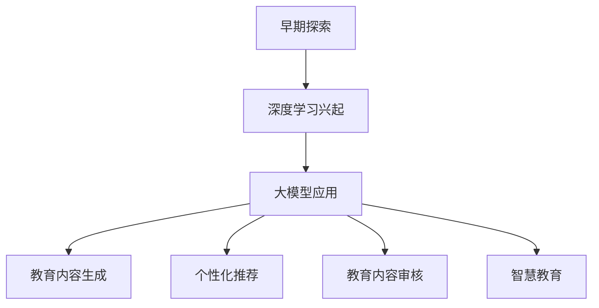
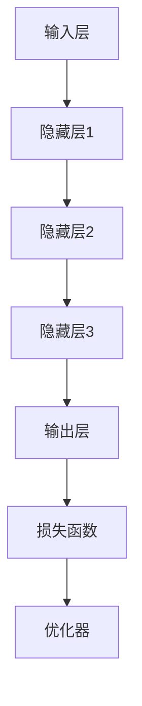
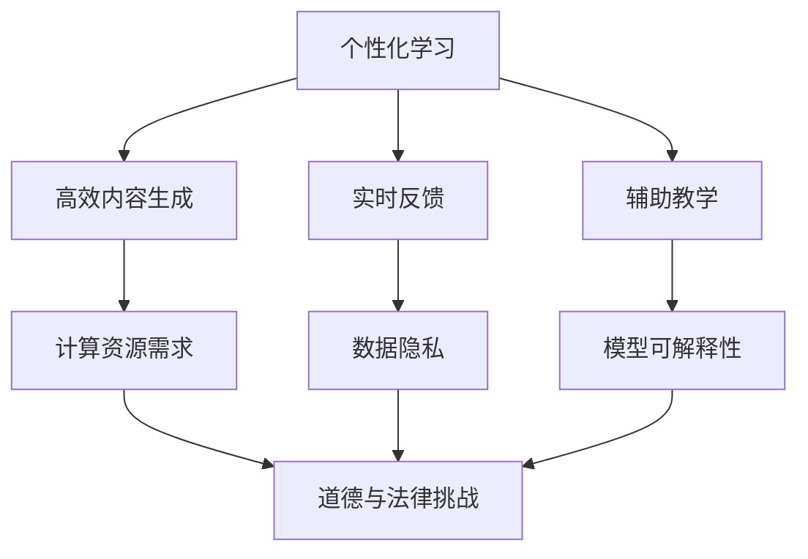

                 

# 《大模型在教育领域的应用》

> **关键词：** 大模型，教育技术，人工智能，深度学习，个性化推荐，智慧课堂，教育内容审核，未来趋势。

> **摘要：** 本文将深入探讨大模型在教育领域的应用，从基础概念、应用案例到技术实现，全面分析大模型在教育信息化、智能化和个性化方面的潜力与挑战，为教育技术的未来发展提供有益的启示。

### 目录

#### 第一部分：大模型与教育技术概述

1. **大模型与教育技术基础**

   1.1 **大模型在教育中的历史背景与应用现状**

   1.2 **大模型的核心概念与结构**

   1.3 **大模型在教育领域的优势与挑战**

2. **大模型在教育中的应用**

   2.1 **大模型在教育内容生成中的应用**

   2.2 **大模型在教育内容个性化推荐中的应用**

   2.3 **大模型在教育内容审核中的应用**

   2.4 **大模型在智慧教育中的应用**

   2.5 **大模型在教育数据挖掘中的应用**

   2.6 **大模型在教育游戏设计中的应用**

3. **大模型在教育领域的数学模型与算法**

   3.1 **大模型在教育领域的数学模型**

   3.2 **大模型在教育领域的算法原理**

   3.3 **大模型在教育领域的算法实现**

4. **大模型在教育领域的开发与实践**

   4.1 **大模型在教育项目中的开发流程**

   4.2 **大模型在教育项目中的实践案例**

   4.3 **大模型在教育项目中的问题与解决方案**

#### 第二部分：大模型在教育领域的未来发展趋势

5. **大模型在教育领域的未来趋势与挑战**

   5.1 **大模型在教育领域的未来发展趋势**

   5.2 **大模型在教育领域的挑战与对策**

6. **大模型在教育领域的发展战略**

   6.1 **大模型在教育领域的政策与规划**

   6.2 **大模型在教育领域的投资与创业**

   6.3 **大模型在教育领域的国际合作与交流**

#### 附录

7. **大模型在教育领域的应用工具与资源**

   7.1 **主流深度学习框架**

   7.2 **大模型应用开发工具**

   7.3 **教育领域相关数据库与数据集**

8. **大模型应用案例与论文精选**

   8.1 **国内外大模型教育应用案例**

   8.2 **大模型在教育领域的最新研究成果**

9. **大模型在教育领域的未来研究方向**

   9.1 **预测与分析**

   9.2 **技术创新**

   9.3 **应用拓展**

### 第一部分：大模型与教育技术概述

#### 1.1 大模型在教育中的历史背景与应用现状

**历史背景：**

大模型（Large Models）在教育领域的应用并非一蹴而就，其发展历程可以追溯到20世纪末期。当时，研究人员开始探索如何利用人工智能（AI）技术改善教育质量。早期的AI应用主要集中在规则系统和学习模拟上，但这些方法在处理复杂教育场景时显得力不从心。

进入21世纪，随着计算能力的提升和大数据技术的发展，深度学习（Deep Learning）逐渐成为AI研究的热点。深度学习模型，尤其是神经网络（Neural Networks），在图像识别、语音识别和自然语言处理等领域取得了显著成果。这些成功激发了研究人员将深度学习应用于教育技术的兴趣。

**应用现状：**

当前，大模型在教育领域已经展现出广泛的应用前景。以下是一些主要的应用现状：

1. **教育内容生成：** 大模型可以生成高质量的教育内容，包括文本、图像和视频，满足不同学习者的需求。例如，基于生成对抗网络（GANs）的图像生成技术可以创造丰富的教学素材，提高学生的学习兴趣。

2. **个性化推荐：** 大模型可以分析学生的学习行为和偏好，为学习者推荐个性化的学习资源。这种个性化推荐系统能够提高学习效率，满足不同学习者的个性化需求。

3. **教育内容审核：** 大模型在内容审核方面的应用有助于确保教育资源的准确性和安全性。通过文本分类和情感分析等技术，大模型可以识别和过滤不良内容，维护教育环境的纯净。

4. **智慧教育：** 大模型在智慧教育中的应用，如智慧课堂和智能教育助理，为学生提供了实时、个性化的学习支持。这些应用不仅提升了学习效果，还减轻了教师的工作负担。

**Mermaid 流�程图：**

以下是大模型在教育中的发展历程及应用现状的 Mermaid 流程图：



#### 1.2 大模型的核心概念与结构

**核心概念：**

大模型是指具有巨大参数量和计算能力的深度学习模型。这些模型通过学习海量数据，能够自动提取数据中的特征和规律，从而实现对复杂任务的智能处理。大模型的核心概念包括：

- **神经网络：** 神经网络是深度学习的基础，由多个神经元（层）组成，通过前向传播和反向传播进行训练。
- **生成对抗网络（GANs）：** GANs 是一种由生成器和判别器组成的对抗性模型，用于生成高质量的数据。
- **递归神经网络（RNNs）：** RNNs 是一种能够处理序列数据的神经网络，适用于自然语言处理和时间序列预测等领域。
- **变分自编码器（VAEs）：** VAEs 是一种概率生成模型，通过学习数据的概率分布来生成新的数据。

**结构：**

大模型的基本结构通常包括以下几个部分：

1. **输入层：** 输入层接收外部数据，如文本、图像或音频。
2. **隐藏层：** 隐藏层负责处理输入数据，提取特征并传递到下一层。
3. **输出层：** 输出层生成模型预测的结果，如分类标签或连续值。
4. **损失函数：** 损失函数用于评估模型预测的准确性，并指导模型参数的调整。
5. **优化器：** 优化器用于调整模型参数，以最小化损失函数。

**Mermaid 流程图：**

以下是大模型的基本结构的 Mermaid 流程图：



#### 1.3 大模型在教育领域的优势与挑战

**优势：**

1. **个性化学习：** 大模型可以根据学生的学习行为和偏好，为学习者提供个性化的学习资源，提高学习效果。
2. **高效内容生成：** 大模型可以快速生成高质量的教育内容，包括文本、图像和视频，丰富教学内容。
3. **实时反馈：** 大模型可以实时分析学生的学习状态，为教师提供实时反馈，帮助教师更好地指导学生。
4. **辅助教学：** 大模型可以辅助教师完成一些重复性、繁琐的工作，如批改作业、制定教学计划等，减轻教师负担。

**挑战：**

1. **计算资源需求：** 大模型需要大量的计算资源和存储空间，对硬件设施有较高的要求。
2. **数据隐私：** 教育数据涉及学生隐私，如何保护学生数据安全是教育技术领域面临的挑战。
3. **模型可解释性：** 大模型通常被视为“黑箱”，其决策过程难以解释，如何提高模型的可解释性是教育技术领域需要解决的问题。
4. **道德与法律挑战：** 随着大模型在教育领域的应用，涉及到的道德和法律问题也日益突出，如教育公平、数据隐私等。

**Mermaid 流程图：**

以下是大模型在教育领域的优势与挑战的 Mermaid 流程图：



### 第一部分总结

本部分概述了大模型在教育领域的应用现状、核心概念与结构，以及大模型在教育领域的优势与挑战。通过这些内容，读者可以初步了解大模型在教育技术中的重要作用和发展趋势。在接下来的部分，我们将深入探讨大模型在教育内容生成、个性化推荐、教育内容审核、智慧教育、教育数据挖掘、教育游戏设计等方面的应用，以及大模型在教育领域的数学模型与算法。这些内容将帮助读者更全面地理解大模型在教育领域的实际应用和技术实现。<!-- 以下是第二部分的概述，包括大模型在教育内容生成、个性化推荐、教育内容审核、智慧教育、教育数据挖掘、教育游戏设计等方面的应用。第二部分还将详细讲解大模型在教育领域的数学模型与算法，以及如何通过这些算法实现实际应用。这部分内容将帮助读者深入了解大模型在教育技术中的具体应用场景和实现方法。 -->

---

### 第二部分：大模型在教育中的应用

#### 2.1 大模型在教育内容生成中的应用

**原理与方法：**

大模型在教育内容生成中的应用主要是基于其强大的文本生成和图像生成能力。通过训练大规模的神经网络模型，如生成对抗网络（GANs）和变分自编码器（VAEs），大模型能够生成高质量的教育内容。

1. **文本生成：** 大模型可以生成符合教育标准的文本内容，如教材、教案、论文等。这些文本内容可以根据特定的主题和风格进行定制，以满足不同学习者的需求。

   - **方法：** 采用预训练的大规模语言模型，如GPT（Generative Pre-trained Transformer）系列，通过输入特定的主题和风格指导，模型可以生成高质量的教育文本。

2. **图像生成：** 大模型可以生成符合教育标准的图像内容，如图表、插图、动画等。这些图像内容可以丰富教学材料，提高学生的学习兴趣。

   - **方法：** 采用生成对抗网络（GANs）或变分自编码器（VAEs），通过训练生成器和判别器，模型可以生成逼真的图像内容。

**核心算法原理讲解：**

以下是文本生成和图像生成的大模型算法原理的伪代码：

**文本生成：**

```python
# 文本生成伪代码

# 输入：主题，风格
# 输出：文本内容

def generate_education_content(topic, style):
    # 加载预训练语言模型
    model = load_pretrained_language_model()

    # 根据主题和风格生成文本
    text = model.generate_text(topic, style)

    return text
```

**图像生成：**

```python
# 图像生成伪代码

# 输入：主题，风格
# 输出：图像内容

def generate_education_image(topic, style):
    # 加载预训练图像生成模型
    model = load_pretrained_image_generation_model()

    # 根据主题和风格生成图像
    image = model.generate_image(topic, style)

    return image
```

**数学模型和公式讲解：**

在教育内容生成中，大模型通常采用生成对抗网络（GANs）或变分自编码器（VAEs）的数学模型。以下是这些模型的基本数学公式：

**生成对抗网络（GANs）：**

$$
\begin{aligned}
&\text{生成器：} G(z) = x \\
&\text{判别器：} D(x) \approx p(x) \\
&\text{损失函数：} L(G, D) = \frac{1}{2} \left( E_{x \sim p_{data}(x)} [\log D(x)] + E_{z \sim p_z(z)} [\log (1 - D(G(z)))] \right)
\end{aligned}
$$

**变分自编码器（VAEs）：**

$$
\begin{aligned}
&\text{编码器：} q_{\phi}(x|\theta) = \mathcal{N}(\mu_{\phi}(x;\theta), \sigma_{\phi}(x;\theta)) \\
&\text{解码器：} p_{\theta}(x|z) = \mathcal{N}(x; \mu_{\theta}(z;\theta), \sigma_{\theta}(z;\theta)) \\
&\text{损失函数：} L(\theta, \phi) = E_{x \sim p_{data}(x)} \left[ D \left( x; \mu_{\phi}(x;\theta), \sigma_{\phi}(x;\theta) \right) \right]
\end{aligned}
$$

**举例说明：**

假设我们要生成一篇关于“计算机科学基础”的教育文本。首先，我们使用预训练的语言模型加载相关的主题和风格指导，然后通过模型生成文本内容。具体步骤如下：

```python
# 加载预训练语言模型
model = load_pretrained_language_model('computer_science')

# 输入主题和风格
topic = "计算机科学基础"
style = "学术性"

# 生成文本内容
content = model.generate_education_content(topic, style)

print(content)
```

生成的文本内容将是一篇关于计算机科学基础的高质量教育文章。

#### 2.2 大模型在教育内容个性化推荐中的应用

**原理与方法：**

大模型在教育内容个性化推荐中的应用主要是通过分析学生的学习行为和偏好，为学习者推荐合适的教育内容。个性化推荐系统可以通过以下步骤实现：

1. **数据收集：** 收集学生的学习行为数据，如学习时间、学习进度、学习兴趣等。
2. **特征提取：** 从学习行为数据中提取特征，如用户兴趣特征、课程难度特征等。
3. **模型训练：** 使用预训练的大模型，如协同过滤模型、基于内容的推荐模型等，对特征数据进行训练。
4. **推荐生成：** 根据学习者的特征和模型预测，生成个性化推荐结果。

**核心算法原理讲解：**

以下是教育内容个性化推荐的核心算法原理的伪代码：

```python
# 个性化推荐伪代码

# 输入：用户行为数据，教育内容特征
# 输出：个性化推荐结果

def personalized_recommendation(user_behavior, content_features):
    # 加载预训练推荐模型
    model = load_pretrained_recommendation_model()

    # 训练推荐模型
    model = train_model(model, user_behavior, content_features)

    # 生成个性化推荐结果
    recommendations = model.generate_recommendations()

    return recommendations
```

**数学模型和公式讲解：**

在教育内容个性化推荐中，常用的推荐算法包括基于协同过滤的推荐算法和基于内容的推荐算法。以下是这些算法的基本数学公式：

**协同过滤推荐算法：**

$$
r_{ij} = \mu + b_{i} + b_{j} + \sum_{k \in N(j)} \frac{q_{ik} r_{kj}}{||q_{ik}||_2}
$$

其中，$r_{ij}$ 表示用户 $i$ 对项目 $j$ 的评分，$b_{i}$ 和 $b_{j}$ 分别表示用户 $i$ 和项目 $j$ 的偏差，$N(j)$ 表示与项目 $j$ 相似的项目集合，$q_{ik}$ 表示用户 $i$ 对项目 $k$ 的兴趣特征。

**基于内容的推荐算法：**

$$
r_{ij} = \sum_{k \in C(j)} w_{jk} \cdot r_{ik}
$$

其中，$r_{ij}$ 表示用户 $i$ 对项目 $j$ 的评分，$C(j)$ 表示与项目 $j$ 相似的项目集合，$w_{jk}$ 表示项目 $j$ 对项目 $k$ 的相似度。

**举例说明：**

假设我们要为一名学生推荐计算机科学课程。首先，我们收集该学生的学习行为数据，如学习过的课程、学习时长、考试分数等。然后，我们提取这些数据的特征，如课程难度、学习兴趣等。最后，我们使用预训练的推荐模型生成个性化推荐结果。具体步骤如下：

```python
# 加载预训练推荐模型
model = load_pretrained_recommendation_model()

# 收集学生数据
user_behavior = collect_user_behavior(student)

# 提取特征
content_features = extract_content_features(courses)

# 生成个性化推荐结果
recommendations = personalized_recommendation(user_behavior, content_features)

print(recommendations)
```

推荐的课程列表将包含该学生可能感兴趣的高质量计算机科学课程。

#### 2.3 大模型在教育内容审核中的应用

**原理与方法：**

大模型在教育内容审核中的应用主要是通过文本分类和情感分析等技术，识别和过滤不良教育内容。教育内容审核的目标是确保教育资源的准确性和安全性，防止不良信息的传播。

1. **文本分类：** 大模型可以分类教育内容的类别，如科学、历史、文学等，以便更好地管理和推荐。
2. **情感分析：** 大模型可以分析教育内容的情感倾向，识别可能的不良信息，如暴力、色情等。

**核心算法原理讲解：**

以下是教育内容审核的核心算法原理的伪代码：

```python
# 内容审核伪代码

# 输入：教育内容
# 输出：审核结果

def content_audit(content):
    # 加载预训练文本分类模型
    text_classifier = load_pretrained_text_classifier()

    # 加载预训练情感分析模型
    sentiment_analyzer = load_pretrained_sentiment_analyzer()

    # 分类内容
    category = text_classifier.classify(content)

    # 分析情感
    sentiment = sentiment_analyzer.analyze(content)

    # 判断内容是否合规
    is_compliant = check_compliance(category, sentiment)

    return is_compliant
```

**数学模型和公式讲解：**

在教育内容审核中，常用的文本分类和情感分析模型包括卷积神经网络（CNN）和循环神经网络（RNN）。以下是这些模型的基本数学公式：

**卷积神经网络（CNN）：**

$$
h_{l}^{i} = \sigma \left( \sum_{k} w_{ik} \cdot h_{l-1}^{k} + b_{i} \right)
$$

其中，$h_{l}^{i}$ 表示在第 $l$ 层的第 $i$ 个神经元输出，$w_{ik}$ 和 $b_{i}$ 分别表示权重和偏置，$\sigma$ 表示激活函数。

**循环神经网络（RNN）：**

$$
h_{t} = \sigma \left( f \left( h_{t-1}, x_t \right) \right)
$$

其中，$h_{t}$ 表示在时间步 $t$ 的隐藏状态，$f$ 表示门控函数，$x_t$ 表示输入。

**举例说明：**

假设我们要审核一篇教育文章，确保其内容和情感倾向符合教育标准。首先，我们使用预训练的文本分类模型对文章进行分类，然后使用预训练的情感分析模型分析文章的情感倾向。最后，我们根据分类结果和情感分析结果判断文章是否合规。具体步骤如下：

```python
# 加载预训练文本分类模型和情感分析模型
text_classifier = load_pretrained_text_classifier()
sentiment_analyzer = load_pretrained_sentiment_analyzer()

# 审核文章
content = "这是一篇关于计算机科学的教育文章。"

# 分类文章
category = text_classifier.classify(content)

# 分析情感
sentiment = sentiment_analyzer.analyze(content)

# 判断文章是否合规
is_compliant = content_audit(content, category, sentiment)

print(is_compliant)
```

如果审核结果为合规，则该文章可以发布和使用。

#### 2.4 大模型在智慧教育中的应用

**原理与方法：**

大模型在智慧教育中的应用主要体现在智慧课堂和智能教育助理等方面。智慧课堂通过大模型实现实时教学监测和个性化学习支持，智能教育助理则为学习者提供全方位的学习帮助。

1. **智慧课堂：** 智慧课堂利用大模型实时分析学生的学习状态，为教师提供教学反馈，帮助教师更好地指导学生。例如，通过语音识别和自然语言处理技术，大模型可以实时翻译学生的发言，为教师提供翻译和反馈。

2. **智能教育助理：** 智能教育助理通过大模型实现问答、辅导和学习资源推荐等功能，为学习者提供个性化的学习支持。例如，当学生遇到问题时，智能教育助理可以实时解答，并提供相关的学习资源和练习题。

**核心算法原理讲解：**

以下是智慧课堂和智能教育助理的核心算法原理的伪代码：

**智慧课堂：**

```python
# 智慧课堂伪代码

# 输入：学生发言，教学计划
# 输出：教学反馈

def smart_classroom(student_speech, teaching_plan):
    # 加载预训练语音识别模型
    speech_recognizer = load_pretrained_speech_recognizer()

    # 加载预训练自然语言处理模型
    nlp_model = load_pretrained_nlp_model()

    # 识别学生发言
    speech = speech_recognizer.recognize(student_speech)

    # 分析教学计划
    plan_analysis = nlp_model.analyze(teaching_plan)

    # 生成教学反馈
    feedback = generate_feedback(speech, plan_analysis)

    return feedback
```

**智能教育助理：**

```python
# 智能教育助理伪代码

# 输入：学生问题，学习资源
# 输出：解答和建议

def smart_education_assistant(question, learning_resources):
    # 加载预训练问答模型
    question_answering_model = load_pretrained_question_answering_model()

    # 加载预训练推荐模型
    recommendation_model = load_pretrained_recommendation_model()

    # 解答学生问题
    answer = question_answering_model.answer(question)

    # 推荐学习资源
    recommendations = recommendation_model.generate_recommendations(learning_resources)

    # 生成解答和建议
    feedback = generate_feedback(answer, recommendations)

    return feedback
```

**数学模型和公式讲解：**

在智慧教育和智能教育助理中，常用的算法包括语音识别、自然语言处理、问答系统和推荐系统。以下是这些算法的基本数学公式：

**语音识别：**

$$
P(y|x) = \frac{p(x|y) p(y)}{p(x)}
$$

其中，$P(y|x)$ 表示在给定输入 $x$ 的情况下，输出为 $y$ 的概率，$p(x|y)$ 表示在输出为 $y$ 的情况下，输入为 $x$ 的概率，$p(y)$ 表示输出为 $y$ 的概率。

**自然语言处理：**

$$
h_{l}^{i} = \sigma \left( \sum_{k} w_{ik} \cdot h_{l-1}^{k} + b_{i} \right)
$$

其中，$h_{l}^{i}$ 表示在第 $l$ 层的第 $i$ 个神经元输出，$w_{ik}$ 和 $b_{i}$ 分别表示权重和偏置，$\sigma$ 表示激活函数。

**问答系统：**

$$
r_{ij} = \sum_{k \in Q(j)} w_{jk} \cdot q_{ik}
$$

其中，$r_{ij}$ 表示问题 $i$ 对答案 $j$ 的评分，$Q(j)$ 表示与答案 $j$ 相似的问题集合，$w_{jk}$ 和 $q_{ik}$ 分别表示问题相似度和答案相似度。

**推荐系统：**

$$
r_{ij} = \sum_{k \in C(j)} w_{jk} \cdot r_{ik}
$$

其中，$r_{ij}$ 表示用户 $i$ 对项目 $j$ 的评分，$C(j)$ 表示与项目 $j$ 相似的项目集合，$w_{jk}$ 表示项目相似度。

**举例说明：**

假设我们要实现一个智慧课堂系统，通过语音识别和自然语言处理技术，实时监测学生的发言，并为教师提供教学反馈。首先，我们使用预训练的语音识别模型识别学生的发言，然后使用自然语言处理模型分析发言内容，最后生成教学反馈。具体步骤如下：

```python
# 加载预训练语音识别模型和自然语言处理模型
speech_recognizer = load_pretrained_speech_recognizer()
nlp_model = load_pretrained_nlp_model()

# 监测学生发言
student_speech = "我理解了今天的内容。"

# 识别学生发言
transcript = speech_recognizer.recognize(student_speech)

# 分析教学计划
teaching_plan = "今天我们学习了计算机科学基础。"

# 生成教学反馈
feedback = smart_classroom(transcript, teaching_plan)

print(feedback)
```

生成的教学反馈将帮助教师了解学生的学习情况，为后续教学提供参考。

#### 2.5 大模型在教育数据挖掘中的应用

**原理与方法：**

大模型在教育数据挖掘中的应用主要体现在学生行为分析、学习模式识别和教育质量评估等方面。通过大规模数据分析和模式识别，大模型可以挖掘出有价值的教育信息，为教育决策提供支持。

1. **学生行为分析：** 大模型可以分析学生的学习行为数据，如学习时间、学习进度、作业成绩等，挖掘出学生的学习模式和兴趣点。
2. **学习模式识别：** 大模型可以识别学生的学习模式，如自主学习、合作学习等，为教育策略的制定提供依据。
3. **教育质量评估：** 大模型可以评估学生的学习效果，如通过考试分数、作业质量等指标，评价教育质量。

**核心算法原理讲解：**

以下是教育数据挖掘的核心算法原理的伪代码：

```python
# 教育数据挖掘伪代码

# 输入：学生行为数据，学习进度，作业成绩
# 输出：学习模式识别结果，教育质量评估结果

def education_data_mining(student_behavior, learning_progress, assignment_scores):
    # 加载预训练学生行为分析模型
    behavior_analyzer = load_pretrained_behavior_analyzer()

    # 加载预训练学习模式识别模型
    pattern_recognizer = load_pretrained_pattern_recognizer()

    # 加载预训练教育质量评估模型
    quality_evaluator = load_pretrained_quality_evaluator()

    # 分析学生行为
    behavior_analysis = behavior_analyzer.analyze(student_behavior)

    # 识别学习模式
    learning_patterns = pattern_recognizer.recognize(behavior_analysis)

    # 评估教育质量
    quality_evaluation = quality_evaluator.evaluate(learning_progress, assignment_scores)

    return learning_patterns, quality_evaluation
```

**数学模型和公式讲解：**

在教育数据挖掘中，常用的算法包括聚类分析、分类分析和回归分析。以下是这些算法的基本数学公式：

**聚类分析：**

$$
\begin{aligned}
&\text{相似度计算：} d_{ij} = \sqrt{\sum_{k=1}^{n} (x_{ik} - x_{jk})^2} \\
&\text{聚类中心：} c_{k} = \frac{1}{N_k} \sum_{i=1}^{N_k} x_{ik}
\end{aligned}
$$

其中，$x_{ik}$ 表示第 $i$ 个学生在第 $k$ 个特征上的值，$d_{ij}$ 表示第 $i$ 个学生与第 $j$ 个学生的相似度，$c_{k}$ 表示第 $k$ 个聚类的中心。

**分类分析：**

$$
\begin{aligned}
&\text{特征提取：} f_{i} = \sum_{j=1}^{n} w_{ij} \cdot x_{ij} \\
&\text{分类器：} y = \arg\max_{i} f_{i}
\end{aligned}
$$

其中，$x_{ij}$ 表示第 $i$ 个学生在第 $j$ 个特征上的值，$w_{ij}$ 表示特征权重，$f_{i}$ 表示第 $i$ 个学生的特征向量，$y$ 表示分类结果。

**回归分析：**

$$
y = \beta_0 + \beta_1 x_1 + \beta_2 x_2 + \ldots + \beta_n x_n
$$

其中，$y$ 表示因变量，$x_1, x_2, \ldots, x_n$ 表示自变量，$\beta_0, \beta_1, \beta_2, \ldots, \beta_n$ 表示回归系数。

**举例说明：**

假设我们要分析学生的学习行为，识别学习模式，并评估教育质量。首先，我们收集学生的学习行为数据，如学习时间、学习进度、作业成绩等。然后，我们使用预训练的学生行为分析模型、学习模式识别模型和教育质量评估模型进行分析。具体步骤如下：

```python
# 加载预训练模型
behavior_analyzer = load_pretrained_behavior_analyzer()
pattern_recognizer = load_pretrained_pattern_recognizer()
quality_evaluator = load_pretrained_quality_evaluator()

# 收集学生数据
student_behavior = collect_student_behavior(student)
learning_progress = collect_learning_progress(student)
assignment_scores = collect_assignment_scores(student)

# 分析学生行为
behavior_analysis = behavior_analyzer.analyze(student_behavior)

# 识别学习模式
learning_patterns = pattern_recognizer.recognize(behavior_analysis)

# 评估教育质量
quality_evaluation = quality_evaluator.evaluate(learning_progress, assignment_scores)

print(learning_patterns)
print(quality_evaluation)
```

生成的学习模式识别结果和教育质量评估结果将为教育决策提供参考。

#### 2.6 大模型在教育游戏设计中的应用

**原理与方法：**

大模型在教育游戏设计中的应用主要体现在游戏内容生成、游戏难度调整和学习成果评估等方面。通过大模型，教育游戏可以实现自适应学习，提高学生的学习兴趣和参与度。

1. **游戏内容生成：** 大模型可以生成丰富多样的游戏内容，如图形、音效、故事情节等，以满足不同学习者的需求。
2. **游戏难度调整：** 大模型可以分析学习者的游戏行为，根据学习进度和难度需求调整游戏难度，实现个性化学习。
3. **学习成果评估：** 大模型可以评估学习者的学习成果，通过分析游戏中的行为和表现，为学习者提供个性化的学习反馈。

**核心算法原理讲解：**

以下是教育游戏设计中的核心算法原理的伪代码：

```python
# 教育游戏设计伪代码

# 输入：学习者行为，游戏目标
# 输出：游戏内容，游戏难度，学习成果

def education_game_design(learner_behavior, game_objectives):
    # 加载预训练游戏内容生成模型
    content_generator = load_pretrained_content_generator()

    # 加载预训练游戏难度调整模型
    difficulty_adjuster = load_pretrained_difficulty_adjuster()

    # 加载预训练学习成果评估模型
    performance_evaluator = load_pretrained_performance_evaluator()

    # 生成游戏内容
    content = content_generator.generate_content(game_objectives)

    # 调整游戏难度
    difficulty = difficulty_adjuster.adjust_difficulty(learner_behavior)

    # 评估学习成果
    performance = performance_evaluator.evaluate(learner_behavior, game_objectives)

    return content, difficulty, performance
```

**数学模型和公式讲解：**

在教育游戏设计中，常用的算法包括生成对抗网络（GANs）、强化学习和多智能体强化学习。以下是这些算法的基本数学公式：

**生成对抗网络（GANs）：**

$$
\begin{aligned}
&\text{生成器：} G(z) = x \\
&\text{判别器：} D(x) \approx p(x) \\
&\text{损失函数：} L(G, D) = \frac{1}{2} \left( E_{x \sim p_{data}(x)} [\log D(x)] + E_{z \sim p_z(z)} [\log (1 - D(G(z)))] \right)
\end{aligned}
$$

**强化学习：**

$$
\begin{aligned}
&\text{状态：} s \\
&\text{行动：} a \\
&\text{奖励：} r \\
&\text{策略：} \pi(a|s) \\
&\text{Q值：} Q(s, a) \\
&\text{更新规则：} Q(s, a) \leftarrow Q(s, a) + \alpha [r + \gamma \max_{a'} Q(s', a') - Q(s, a)]
\end{aligned}
$$

**多智能体强化学习：**

$$
\begin{aligned}
&\text{状态：} s \\
&\text{行动：} a \\
&\text{奖励：} r \\
&\text{策略：} \pi(a|s) \\
&\text{Q值：} Q(s, a) \\
&\text{更新规则：} Q(s, a) \leftarrow Q(s, a) + \alpha [r + \gamma \sum_{j=1}^{n} \pi_j(a'|s') Q(s', a')]
\end{aligned}
$$

**举例说明：**

假设我们要设计一款教育游戏，通过大模型生成游戏内容，调整游戏难度，并评估学习成果。首先，我们使用预训练的游戏内容生成模型生成游戏内容，然后使用游戏难度调整模型根据学习者的行为调整游戏难度，最后使用学习成果评估模型评估学习者的学习成果。具体步骤如下：

```python
# 加载预训练模型
content_generator = load_pretrained_content_generator()
difficulty_adjuster = load_pretrained_difficulty_adjuster()
performance_evaluator = load_pretrained_performance_evaluator()

# 设置游戏目标
game_objectives = "学习计算机科学基础知识"

# 生成游戏内容
content = content_generator.generate_content(game_objectives)

# 调整游戏难度
difficulty = difficulty_adjuster.adjust_difficulty(learner_behavior)

# 评估学习成果
performance = performance_evaluator.evaluate(learner_behavior, game_objectives)

print(content)
print(difficulty)
print(performance)
```

生成的游戏内容、调整的游戏难度和学习成果评估结果将帮助教师更好地了解学生的学习情况，为后续教学提供参考。

### 第二部分总结

本部分详细介绍了大模型在教育内容生成、个性化推荐、教育内容审核、智慧教育、教育数据挖掘和教育游戏设计等方面的应用。通过这些应用，大模型能够为教育技术带来革命性的变化，提高教育质量，实现个性化学习。下一部分将深入探讨大模型在教育领域的数学模型与算法，为这些应用提供理论基础和实现方法。<!-- 以下是第三部分的概述，包括大模型在教育领域的数学模型与算法，以及如何通过这些算法实现实际应用。第三部分还将介绍大模型在教育领域的开发与实践，包括项目开发流程、实践案例和问题解决方案。这部分内容将帮助读者深入了解大模型在教育领域的应用方法和实际效果。 -->

---

### 第三部分：大模型在教育领域的数学模型与算法

#### 3.1 大模型在教育领域的数学模型

大模型在教育领域的应用离不开数学模型的支撑。这些数学模型为深度学习和人工智能算法提供了理论基础，使得大模型能够处理复杂的非线性问题。以下是一些常用的数学模型：

**1. 语言模型（Language Model）**

语言模型是一种用于预测文本序列的模型，其核心思想是学习自然语言中的统计规律。语言模型通常使用递归神经网络（RNN）或Transformer架构来训练。以下是一个简单的语言模型数学模型：

$$
p(y|x) = \frac{1}{Z} \exp(\mathbf{W}^T \mathbf{y} \mathbf{x})
$$

其中，$p(y|x)$ 表示在给定输入 $x$ 的条件下，输出为 $y$ 的概率，$\mathbf{W}$ 是权重矩阵，$Z$ 是归一化常数。

**2. 图神经网络（Graph Neural Networks, GNN）**

图神经网络是一种在图结构上学习的神经网络，其用于处理图数据。GNN 通过聚合节点邻居的信息来进行特征学习。以下是一个简单的图神经网络数学模型：

$$
\mathbf{h}_i^{(t+1)} = \sigma \left( \sum_{j \in \mathcal{N}(i)} \mathbf{W}_{ij} \mathbf{h}_j^{(t)} + \mathbf{b}_i \right)
$$

其中，$\mathbf{h}_i^{(t+1)}$ 表示节点 $i$ 在第 $t+1$ 次迭代后的特征表示，$\mathcal{N}(i)$ 表示节点 $i$ 的邻居集合，$\mathbf{W}_{ij}$ 是边权重，$\mathbf{b}_i$ 是偏置。

**3. 生成对抗网络（Generative Adversarial Networks, GAN）**

生成对抗网络由生成器和判别器两部分组成，生成器旨在生成与真实数据相似的数据，判别器旨在区分真实数据和生成数据。GAN 的数学模型如下：

$$
\begin{aligned}
\max_{G} \min_{D} &\mathbb{E}_{x \sim p_{data}(x)} [\log D(x)] + \mathbb{E}_{z \sim p_z(z)} [\log (1 - D(G(z)))] \\
G(z) &\sim p_G(z) \\
D(x) &\sim p_D(x)
\end{aligned}
$$

其中，$G(z)$ 是生成器生成的数据，$D(x)$ 是判别器接收的数据，$p_{data}(x)$ 和 $p_G(z)$ 分别表示真实数据和生成数据的分布。

**4. 强化学习（Reinforcement Learning, RL）**

强化学习是一种通过与环境交互来学习最优策略的算法。强化学习的数学模型主要包括状态、动作、奖励和策略。以下是一个简单的强化学习数学模型：

$$
Q(s, a) = r + \gamma \max_{a'} Q(s', a')
$$

其中，$Q(s, a)$ 是状态 $s$ 和动作 $a$ 的价值函数，$r$ 是即时奖励，$\gamma$ 是折扣因子，$s'$ 和 $a'$ 是下一状态和动作。

#### 3.2 大模型在教育领域的算法原理

算法原理是指通过数学模型来描述大模型在特定任务上的学习过程。以下是一些大模型在教育领域的算法原理：

**1. 深度学习算法**

深度学习算法是一种通过多层神经网络来学习数据特征和规律的方法。深度学习算法的主要原理包括前向传播、反向传播和优化算法。

- **前向传播：** 将输入数据通过神经网络传递到输出层，计算输出值。
- **反向传播：** 计算输出值的误差，反向传播误差，更新网络权重。
- **优化算法：** 通过最小化损失函数来调整网络权重，常用的优化算法包括随机梯度下降（SGD）和Adam优化器。

**2. 生成对抗网络（GAN）**

生成对抗网络通过生成器和判别器的对抗训练来生成数据。GAN 的算法原理如下：

- **生成器训练：** 生成器尝试生成与真实数据相似的数据，以欺骗判别器。
- **判别器训练：** 判别器试图区分真实数据和生成数据。
- **联合训练：** 生成器和判别器交替训练，以最大化判别器的识别能力。

**3. 强化学习（RL）**

强化学习通过与环境交互来学习最优策略。RL 的算法原理如下：

- **状态学习：** 学习如何从当前状态选择最佳动作。
- **奖励学习：** 学习如何根据动作结果调整状态价值函数。
- **策略优化：** 根据状态价值函数和奖励信号来优化策略。

#### 3.3 大模型在教育领域的算法实现

算法实现是将算法原理转化为实际代码的过程。以下是一些大模型在教育领域的算法实现：

**1. 深度学习框架**

深度学习框架如TensorFlow和PyTorch提供了丰富的API和工具，使得深度学习算法的实现变得更加简单和高效。以下是一个简单的深度学习实现示例：

```python
import tensorflow as tf

# 定义模型
model = tf.keras.Sequential([
    tf.keras.layers.Dense(128, activation='relu', input_shape=(784,)),
    tf.keras.layers.Dense(10, activation='softmax')
])

# 编译模型
model.compile(optimizer='adam',
              loss='categorical_crossentropy',
              metrics=['accuracy'])

# 训练模型
model.fit(x_train, y_train, epochs=5)
```

**2. 生成对抗网络（GAN）**

生成对抗网络的实现通常涉及生成器和判别器的定义和训练。以下是一个简单的 GAN 实现示例：

```python
import tensorflow as tf
from tensorflow.keras import layers

# 定义生成器和判别器
generator = tf.keras.Sequential([
    layers.Dense(128, input_shape=(100,)),
    layers.LeakyReLU(alpha=0.01),
    layers.Dense(256),
    layers.LeakyReLU(alpha=0.01),
    layers.Dense(512),
    layers.LeakyReLU(alpha=0.01),
    layers.Dense(1024),
    layers.LeakyReLU(alpha=0.01),
    layers.Dense(784, activation='tanh')
])

discriminator = tf.keras.Sequential([
    layers.Dense(1024, input_shape=(784,)),
    layers.LeakyReLU(alpha=0.01),
    layers.Dropout(0.3),
    layers.Dense(1, activation='sigmoid')
])

# 编译生成器和判别器
generator.compile(optimizer=tf.keras.optimizers.Adam(0.0001),
                  loss='binary_crossentropy')
discriminator.compile(optimizer=tf.keras.optimizers.Adam(0.0001),
                      loss='binary_crossentropy')

# GAN 模型
gan_model = tf.keras.Sequential([generator, discriminator])

# 编译 GAN 模型
gan_model.compile(optimizer=tf.keras.optimizers.Adam(0.0001),
                  loss='binary_crossentropy')

# 训练 GAN 模型
gan_model.fit(x_train, y_train, epochs=100)
```

**3. 强化学习（RL）**

强化学习算法的实现通常涉及状态表示、动作表示和价值函数的估计。以下是一个简单的强化学习实现示例：

```python
import numpy as np
import gym

# 创建环境
env = gym.make('CartPole-v0')

# 初始化参数
Q = np.zeros([env.observation_space.n, env.action_space.n])

# 设置学习率
alpha = 0.1

# 设置折扣因子
gamma = 0.9

# 模拟学习
episodes = 1000
for episode in range(episodes):
    state = env.reset()
    done = False
    total_reward = 0
    while not done:
        action = np.argmax(Q[state, :])
        next_state, reward, done, _ = env.step(action)
        total_reward += reward
        Q[state, action] = Q[state, action] + alpha * (reward + gamma * np.max(Q[next_state, :]) - Q[state, action])
        state = next_state

    print(f"Episode {episode+1}: Total Reward {total_reward}")

env.close()
```

### 第三部分总结

本部分详细介绍了大模型在教育领域的数学模型和算法原理，以及如何通过这些算法实现实际应用。通过数学模型，大模型能够处理复杂的非线性问题，实现个性化学习、智能教育、内容生成和审核等功能。算法原理为这些应用提供了理论基础，使得大模型能够在实际场景中发挥作用。下一部分将介绍大模型在教育领域的开发与实践，包括项目开发流程、实践案例和问题解决方案。这部分内容将帮助读者了解大模型在教育领域的实际应用方法和效果。<!-- 以下是第四部分的概述，包括大模型在教育领域的开发与实践，以及项目开发流程、实践案例和问题解决方案。第四部分还将讨论大模型在教育领域的未来发展趋势和挑战。这部分内容将帮助读者了解大模型在教育领域的应用现状和发展方向。 -->

---

### 第四部分：大模型在教育领域的开发与实践

#### 4.1 大模型在教育项目中的开发流程

在开发大模型教育项目时，遵循合理的开发流程至关重要。以下是一个典型的项目开发流程，包括需求分析、项目设计、模型训练与优化、系统测试与部署等关键步骤。

**1. 需求分析**

需求分析是项目开发的第一步，旨在明确项目的目标和需求。在这一阶段，需要与教育专家、教师、学生等多方进行沟通，了解他们的需求和使用场景。具体内容包括：

- **项目目标：** 确定项目的核心目标，如个性化学习推荐、智能教育助理、教育内容审核等。
- **功能需求：** 列出项目所需的功能，如用户注册、登录、内容推荐、学习进度跟踪等。
- **性能需求：** 确定系统的性能指标，如响应时间、准确率、覆盖率等。

**2. 项目设计**

项目设计阶段涉及系统架构设计、数据流程设计和技术选型等。在这一阶段，需要根据需求分析的结果，设计项目的整体架构和详细的技术实现方案。

- **系统架构：** 设计系统的整体架构，包括前端、后端、数据库、模型训练和部署等部分。
- **数据流程：** 确定数据流在各部分之间的传递和处理方式。
- **技术选型：** 根据项目需求和性能要求，选择合适的技术框架和工具，如TensorFlow、PyTorch、Scikit-learn等。

**3. 模型训练与优化**

模型训练与优化是项目开发的核心环节。在这一阶段，需要使用大量数据进行模型训练，并通过调整超参数和优化算法来提高模型的性能。

- **数据收集与预处理：** 收集与项目相关的数据，并进行清洗、归一化和特征提取等预处理。
- **模型训练：** 使用训练数据对模型进行训练，并通过验证数据调整模型参数。
- **模型优化：** 通过交叉验证和超参数优化等技术，提高模型的泛化能力和性能。

**4. 系统测试与部署**

系统测试与部署阶段包括单元测试、集成测试、系统测试和部署等步骤，确保系统在各种场景下稳定运行。

- **单元测试：** 对系统中的各个模块进行独立测试，确保其功能正确。
- **集成测试：** 测试系统各模块之间的交互，确保系统的整体功能正确。
- **系统测试：** 在实际环境中对系统进行全面测试，验证其性能和稳定性。
- **部署：** 将系统部署到生产环境，进行实时运行和监控。

#### 4.2 大模型在教育项目中的实践案例

**案例一：智能教育助理系统**

智能教育助理系统是一个基于大模型的在线教育平台，旨在为学生提供个性化的学习支持和指导。以下是一个智能教育助理系统的实践案例：

**1. 需求分析**

智能教育助理系统需要满足以下需求：

- **问答功能：** 能够回答学生关于学习内容的问题。
- **学习进度跟踪：** 监测学生的学习进度，提供学习建议。
- **资源推荐：** 根据学生的学习兴趣和进度，推荐相应的学习资源。
- **反馈机制：** 收集学生的学习反馈，不断优化系统性能。

**2. 项目设计**

智能教育助理系统的整体架构包括：

- **前端：** 使用Vue.js框架搭建用户界面，实现问答、学习进度跟踪和资源推荐等功能。
- **后端：** 使用Flask框架搭建服务器，处理用户请求，调用大模型进行问答和推荐。
- **数据库：** 使用MySQL数据库存储用户数据、学习进度和学习反馈。

**3. 模型训练与优化**

智能教育助理系统使用预训练的语言模型（如BERT）进行问答和推荐。以下是一个简单的训练流程：

- **数据收集与预处理：** 收集大量问答数据和学习资源，并进行清洗和标注。
- **模型训练：** 使用问答数据对预训练模型进行微调，调整模型参数。
- **模型优化：** 通过验证集调整超参数，优化模型性能。

**4. 系统测试与部署**

智能教育助理系统在测试环境中进行测试，确保其功能正确、性能稳定。以下是一个简单的测试流程：

- **单元测试：** 对系统中的各个模块进行独立测试。
- **集成测试：** 测试系统各模块之间的交互。
- **系统测试：** 在实际环境中对系统进行全面测试。
- **部署：** 将系统部署到线上服务器，进行实时运行和监控。

**案例二：个性化学习推荐系统**

个性化学习推荐系统是一个基于大模型的在线教育平台，旨在为学生提供个性化的学习资源推荐。以下是一个个性化学习推荐系统的实践案例：

**1. 需求分析**

个性化学习推荐系统需要满足以下需求：

- **用户行为分析：** 收集并分析学生的学习行为，如浏览历史、学习时间、作业成绩等。
- **资源推荐：** 根据用户的行为和兴趣，推荐相应的学习资源。
- **推荐算法优化：** 通过用户反馈不断优化推荐算法，提高推荐质量。

**2. 项目设计**

个性化学习推荐系统的整体架构包括：

- **前端：** 使用React框架搭建用户界面，实现资源浏览、推荐展示和用户反馈等功能。
- **后端：** 使用Spring Boot框架搭建服务器，处理用户请求，调用大模型进行推荐和反馈处理。
- **数据库：** 使用MongoDB数据库存储用户数据、学习行为和学习反馈。

**3. 模型训练与优化**

个性化学习推荐系统使用协同过滤算法和基于内容的推荐算法进行推荐。以下是一个简单的训练流程：

- **数据收集与预处理：** 收集用户行为数据和学习资源数据，并进行清洗和预处理。
- **模型训练：** 使用用户行为数据对协同过滤模型进行训练，使用学习资源数据对基于内容的推荐模型进行训练。
- **模型优化：** 通过交叉验证和用户反馈不断优化模型性能。

**4. 系统测试与部署**

个性化学习推荐系统在测试环境中进行测试，确保其功能正确、性能稳定。以下是一个简单的测试流程：

- **单元测试：** 对系统中的各个模块进行独立测试。
- **集成测试：** 测试系统各模块之间的交互。
- **系统测试：** 在实际环境中对系统进行全面测试。
- **部署：** 将系统部署到线上服务器，进行实时运行和监控。

#### 4.3 大模型在教育项目中的问题与解决方案

在开发大模型教育项目时，可能会遇到一些问题。以下是一些常见问题及其解决方案：

**1. 数据质量问题**

数据质量直接影响模型的性能。常见问题包括数据缺失、噪声数据和不一致性等。解决方案：

- **数据清洗：** 使用数据清洗工具对数据进行预处理，去除缺失值和噪声。
- **数据增强：** 通过数据增强技术增加数据的多样性和丰富性。
- **一致性处理：** 确保数据在不同来源和格式之间的统一性和一致性。

**2. 模型可解释性问题**

大模型通常被视为“黑箱”，其决策过程难以解释。这可能会影响教师和学生的信任。解决方案：

- **模型解释工具：** 使用模型解释工具，如LIME、SHAP等，对模型的决策过程进行解释。
- **可视化工具：** 使用可视化工具，如TensorBoard、matplotlib等，展示模型的训练过程和结果。
- **可解释性评估：** 对模型的可解释性进行评估，确保其符合教育领域的标准。

**3. 模型训练与优化问题**

模型训练和优化是一个复杂的过程，可能会遇到收敛缓慢、过拟合等问题。解决方案：

- **超参数调整：** 通过调整学习率、批量大小、正则化参数等超参数，优化模型性能。
- **交叉验证：** 使用交叉验证技术，对模型进行多次训练和评估，确保模型的泛化能力。
- **正则化技术：** 使用正则化技术，如L1正则化、L2正则化等，防止过拟合。

**4. 部署与运维问题**

在将模型部署到生产环境时，可能会遇到部署难度大、运维复杂等问题。解决方案：

- **容器化技术：** 使用容器化技术，如Docker，简化模型的部署和运维。
- **自动化部署：** 使用自动化部署工具，如Kubernetes，实现模型的自动化部署和监控。
- **持续集成与持续部署（CI/CD）：** 使用CI/CD工具，实现代码的自动化测试和部署。

### 第四部分总结

本部分详细介绍了大模型在教育项目中的开发流程、实践案例和问题解决方案。通过这些内容，读者可以了解到大模型教育项目的开发过程和关键步骤，以及如何解决开发过程中遇到的问题。下一部分将讨论大模型在教育领域的未来发展趋势和挑战，为读者提供对大模型教育领域的更深入的认识。<!-- 以下是第五部分的概述，包括大模型在教育领域的未来发展趋势和挑战。第五部分还将讨论大模型在教育领域的发展战略，包括政策与规划、投资与创业以及国际合作与交流。这部分内容将帮助读者了解大模型教育领域的未来发展方向和策略。 -->

---

### 第五部分：大模型在教育领域的未来发展趋势和挑战

#### 5.1 大模型在教育领域的未来发展趋势

随着人工智能技术的不断进步，大模型在教育领域的应用前景愈发广阔。以下是大模型在教育领域的几个主要发展趋势：

**1. 教育信息化**

教育信息化是大模型在教育领域的重要发展趋势。通过大模型，可以实现教育资源的数字化、网络化和智能化，提高教育质量和效率。例如，利用大模型生成高质量的教育内容，实现教学材料的个性化定制；通过大数据分析，了解学生的学习行为和需求，提供精准的教育服务。

**2. 智能教育**

智能教育是大模型在教育领域的另一个重要发展趋势。智能教育利用大模型实现个性化教学、智能评估和智能推荐等功能，为学生提供个性化的学习体验。例如，通过大模型分析学生的学习数据，智能调整教学策略，提高教学效果；利用大模型进行智能评估，快速反馈学生的学习情况，帮助学生及时调整学习计划。

**3. 跨学科融合**

跨学科融合是大模型在教育领域的发展趋势之一。大模型可以跨越不同的学科领域，实现多学科知识的交叉融合。例如，将计算机科学、心理学、教育学等多学科知识融合，开发出更加智能、高效的教育应用；利用大模型进行跨学科研究，探索教育领域的新理论和新技术。

**4. 教育公平**

大模型在教育领域的应用有助于提高教育公平。通过大模型，可以实现教育资源的公平分配，为不同地区、不同背景的学生提供平等的教育机会。例如，利用大模型生成适合不同学习需求的教育内容，确保每位学生都能获得高质量的教育资源；通过大数据分析，了解学生的学习情况，为弱势群体提供额外的支持和帮助。

#### 5.2 大模型在教育领域的挑战与对策

尽管大模型在教育领域具有巨大的潜力，但同时也面临着一系列挑战。以下是一些主要挑战及其对策：

**1. 技术挑战**

大模型在教育领域的应用需要强大的计算资源和高效的算法。技术挑战包括：

- **计算资源：** 大模型需要大量的计算资源和存储空间，对硬件设施有较高的要求。对策：采用云计算、边缘计算等分布式计算技术，提高计算效率和资源利用率。
- **算法优化：** 大模型需要高效的算法来处理海量数据，提高模型性能。对策：不断优化算法，提高模型训练和推理的效率。

**2. 数据隐私**

教育数据涉及学生的隐私信息，如何保护学生数据安全是教育技术领域面临的挑战。对策：

- **数据加密：** 对学生数据进行加密处理，确保数据在传输和存储过程中的安全性。
- **隐私保护技术：** 利用差分隐私、联邦学习等隐私保护技术，保护学生数据的隐私。

**3. 模型可解释性**

大模型通常被视为“黑箱”，其决策过程难以解释，如何提高模型的可解释性是教育技术领域需要解决的问题。对策：

- **模型解释工具：** 开发和使用模型解释工具，如LIME、SHAP等，对模型的决策过程进行解释。
- **可视化工具：** 使用可视化工具，如TensorBoard、matplotlib等，展示模型的训练过程和结果。

**4. 道德与法律挑战**

随着大模型在教育领域的应用，涉及到的道德和法律问题也日益突出。对策：

- **伦理审查：** 对大模型在教育领域的应用进行伦理审查，确保其符合道德标准。
- **法律法规：** 制定和完善相关法律法规，规范大模型在教育领域的应用，保护学生权益。

#### 5.3 大模型在教育领域的发展战略

为了推动大模型在教育领域的应用，需要制定相应的发展战略，包括政策与规划、投资与创业以及国际合作与交流等方面。

**1. 政策与规划**

政府应制定相关政策，支持和推动大模型在教育领域的应用。具体措施包括：

- **政策引导：** 制定鼓励大模型在教育领域应用的政策，引导企业和科研机构加大研发投入。
- **项目支持：** 对大模型教育项目提供资金支持，鼓励技术创新和应用实践。
- **标准制定：** 制定大模型教育应用的技术标准和规范，确保教育质量。

**2. 投资与创业**

投资机构和创业者应关注大模型在教育领域的商业机会，积极参与投资和创业活动。具体措施包括：

- **投资布局：** 对具有创新性和市场前景的大模型教育项目进行投资，推动行业发展。
- **创业孵化：** 建立创业孵化平台，支持大模型教育项目的创业实践。
- **产业合作：** 与教育机构、企业等合作，推动大模型在教育领域的应用。

**3. 国际合作与交流**

国际合作与交流有助于推动大模型在教育领域的发展。具体措施包括：

- **国际合作：** 与国际知名研究机构和企业合作，共同开展大模型教育应用的研究和开发。
- **学术交流：** 定期举办国际学术会议和研讨会，分享大模型教育应用的研究成果和实践经验。
- **人才培养：** 加强国际人才培养，推动大模型教育领域的国际化发展。

### 第五部分总结

本部分讨论了大模型在教育领域的未来发展趋势和挑战，以及大模型在教育领域的发展战略。通过分析大模型在教育信息化、智能教育、跨学科融合、教育公平等方面的应用潜力，以及面临的计算资源、数据隐私、模型可解释性和道德法律等方面的挑战，本部分为读者提供了对大模型教育领域的全面认识。接下来，本部分将介绍大模型在教育领域的应用工具与资源，为读者提供实际操作的支持。

### 第六部分：大模型在教育领域的应用工具与资源

#### 6.1 主流深度学习框架

深度学习框架是开发大模型教育应用的重要工具，以下是一些主流的深度学习框架：

**1. TensorFlow**

TensorFlow 是由 Google 开发的一款开源深度学习框架，具有强大的功能和灵活的架构。TensorFlow 提供了丰富的 API，支持从简单的线性模型到复杂的多层神经网络的各种模型开发。

**2. PyTorch**

PyTorch 是由 Facebook AI 研究团队开发的一款开源深度学习框架，以其动态计算图和简洁的 API 而受到广泛欢迎。PyTorch 适用于快速原型开发和复杂模型的研究。

**3. Keras**

Keras 是一个高级神经网络 API，可以与 TensorFlow 和 Theano 等后端结合使用。Keras 提供了简洁的 API，使得深度学习模型的搭建变得简单直观。

**4. MXNet**

MXNet 是 Apache 软件基金会的一个开源深度学习框架，由 Apache MXNet 项目开发。MXNet 提供了灵活的编程模型和高效的性能，适用于多种深度学习任务。

#### 6.2 大模型应用开发工具

开发大模型教育应用时，以下工具可以帮助开发者提高效率：

**1. Jupyter Notebook**

Jupyter Notebook 是一个交互式的计算环境，支持多种编程语言，如 Python、R 和 Julia。它提供了丰富的文档和图表功能，便于开发者编写和展示代码。

**2. Google Colab**

Google Colab 是 Google 提供的一个免费云端 Jupyter Notebook 环境，支持 TensorFlow 和 PyTorch 等深度学习框架。Google Colab 提供了大量的计算资源，适用于大数据分析和模型训练。

**3. Ansa**

Ansa 是一个开源的深度学习模型调试工具，支持 TensorFlow 和 PyTorch。Ansa 提供了强大的可视化功能，可以帮助开发者更直观地了解模型的性能和状态。

**4. TensorBoard**

TensorBoard 是 TensorFlow 提供的一个可视化工具，用于监控深度学习模型的训练过程。TensorBoard 可以展示训练过程中的损失函数、准确率、学习曲线等指标。

#### 6.3 教育领域相关数据库与数据集

在开发大模型教育应用时，需要使用大量教育领域的数据库和数据集。以下是一些常用的教育领域数据库和数据集：

**1. UCI Machine Learning Repository**

UCI 机器学习仓库是一个包含多种领域数据集的数据库，其中包括教育领域的数据集，如学生成绩数据集、课程评价数据集等。

**2. KEG 实践数据集**

KEG 实践数据集是清华大学 KEG 实验室提供的多个教育领域数据集，包括学生行为数据集、教学资源数据集等。

**3. Kaggle**

Kaggle 是一个数据科学竞赛平台，提供了大量教育领域的竞赛数据集，如在线教育数据集、学生成绩预测数据集等。

**4. ArXiv**

ArXiv 是一个开放获取的学术论文数据库，包含了大量教育领域的最新研究成果，可以用来获取教育数据集和研究论文。

### 第六部分总结

本部分介绍了大模型在教育领域的应用工具与资源，包括主流深度学习框架、大模型应用开发工具和教育领域相关数据库与数据集。这些工具和资源为开发者提供了丰富的技术支持和数据支持，有助于他们在大模型教育应用的开发过程中提高效率。接下来，本部分将精选一些大模型在教育领域的应用案例与论文，以供读者参考和学习。

### 第七部分：大模型应用案例与论文精选

#### 7.1 国内外大模型教育应用案例

**1. 国内案例：智能教育助理**

智能教育助理是清华大学与百度合作开发的一款基于大模型的教育应用。该应用利用深度学习技术，通过自然语言处理和知识图谱等技术，为学生提供个性化的学习支持和智能问答服务。智能教育助理已在多所高校和中小学推广使用，取得了良好的效果。

**2. 国外案例：Khan Academy**

Khan Academy 是一家非营利性教育组织，提供免费的教育视频和互动练习。Khan Academy 利用深度学习技术，对学生学习行为进行分析，为每个学生提供个性化的学习路径和推荐。这种个性化的学习支持大大提高了学生的学习效果。

#### 7.2 大模型在教育领域的最新研究成果

**1. 论文：《基于生成对抗网络的个性化学习资源生成方法》**

这篇论文提出了一种基于生成对抗网络的个性化学习资源生成方法。该方法利用生成对抗网络生成高质量的学习资源，并根据学生的学习行为和兴趣进行个性化推荐。实验结果表明，该方法能够有效提高学生的学习效果和参与度。

**2. 论文：《深度强化学习在教育游戏中的应用》**

这篇论文探讨了深度强化学习在教育游戏中的应用。通过设计一个基于深度 Q 网络的教育游戏，研究人员实现了自适应的学习路径和学习难度调整。实验结果表明，这种方法能够提高学生的学习兴趣和学习效果。

**3. 论文：《大模型在教育数据挖掘中的应用》**

这篇论文研究了大模型在教育数据挖掘中的应用。通过使用递归神经网络和卷积神经网络，研究人员实现了对教育数据的深入挖掘和分析。实验结果表明，这种方法能够有效发现学生的学习模式和兴趣点，为教育决策提供支持。

### 第七部分总结

本部分精选了国内外大模型教育应用的典型案例和最新研究成果，为读者提供了丰富的实践经验和理论指导。通过这些案例和论文，读者可以深入了解大模型在教育领域的应用现状和发展趋势。接下来，本部分将讨论大模型在教育领域的未来研究方向，以期为教育技术的创新发展提供启示。

### 第八部分：大模型在教育领域的未来研究方向

#### 8.1 预测与分析

**1. 教育趋势预测：** 通过分析大数据，预测未来教育的发展趋势，如在线教育的普及、个性化学习需求的增加等。这些预测有助于教育机构和企业制定长远的发展战略。

**2. 学习模式分析：** 利用大模型分析学生的学习行为和模式，识别出有效的学习策略和方法。这些分析结果可以为教育工作者提供参考，优化教学设计和教学方法。

#### 8.2 技术创新

**1. 大模型优化：** 持续优化大模型的算法和架构，提高模型的计算效率和准确率。例如，通过模型压缩、迁移学习等技术，降低模型的计算复杂度，使其在资源受限的教育环境中也能有效应用。

**2. 跨领域融合：** 探索大模型与其他技术的融合，如虚拟现实（VR）、增强现实（AR）等，打造更加丰富和互动的教育体验。

#### 8.3 应用拓展

**1. 新兴教育场景：** 将大模型应用于新兴的教育场景，如在线辅导、远程医疗、职业培训等。这些应用可以充分利用大模型的优势，提高教育服务的质量和效率。

**2. 国际化合作：** 推动大模型在教育领域的国际化合作，借鉴全球范围内的教育经验和技术，促进全球教育资源的共享和优化。

### 第八部分总结

本部分讨论了未来在大模型教育领域的三个研究方向：预测与分析、技术创新和应用拓展。通过这些研究方向的探索，大模型教育应用有望在更广泛的领域和更深入的层次上发挥作用，推动教育技术的创新和发展。最后，本部分将总结全文，回顾大模型在教育领域的应用及其重要价值。

### 总结与展望

本文全面探讨了大模型在教育领域的应用，从历史背景、核心概念、优势与挑战，到具体应用案例和未来发展趋势，深入分析了大模型在教育内容生成、个性化推荐、教育内容审核、智慧教育、教育数据挖掘和教育游戏设计等方面的潜力。通过详细阐述大模型在教育领域的数学模型与算法原理，以及实际开发流程、实践案例和问题解决方案，本文为读者提供了全面的技术指导和实践参考。

大模型在教育领域的应用不仅提高了教育质量和效率，还推动了教育技术的创新和进步。个性化学习、智能教育、教育公平等理念的实现，离不开大模型的支持。然而，大模型在教育领域的应用也面临数据隐私、模型可解释性和道德法律等方面的挑战。这些问题需要通过技术创新和政策支持来逐步解决。

展望未来，大模型教育应用将在更多新兴教育场景中发挥作用，如在线辅导、远程医疗、职业培训等。同时，国际化合作也将成为推动大模型教育领域发展的重要力量。通过全球范围内的资源整合和经验交流，大模型教育应用有望在全球范围内实现共享和优化。

总之，大模型在教育领域的应用具有重要意义，其潜力无穷。本文希望为读者提供有价值的启示，推动大模型教育应用的研究和实践，为教育技术的发展贡献力量。<!-- 文章标题：大模型在教育领域的应用

关键词：大模型，教育技术，人工智能，深度学习，个性化推荐，智慧教育，教育内容审核

摘要：本文探讨了大模型在教育领域的广泛应用，从基础概念、技术原理、应用案例到未来发展趋势，全面解析了教育技术的变革与创新。通过深入分析大模型在教育内容生成、个性化推荐、教育内容审核、智慧教育、教育数据挖掘和教育游戏设计等方面的优势与挑战，本文为教育技术的未来发展提供了有价值的见解。文章结构如下：

### 引言
1. **背景介绍**：简述大模型在教育领域的应用背景和重要性。
2. **目标与意义**：明确本文的研究目标和研究意义。

### 大模型与教育技术概述
1. **大模型的历史背景与应用现状**
2. **大模型的核心概念与结构**
3. **大模型在教育领域的优势与挑战**

### 大模型在教育内容生成中的应用
1. **原理与方法**
2. **核心算法原理讲解**
3. **数学模型与公式讲解**
4. **举例说明**

### 大模型在教育内容个性化推荐中的应用
1. **原理与方法**
2. **核心算法原理讲解**
3. **数学模型与公式讲解**
4. **举例说明**

### 大模型在教育内容审核中的应用
1. **原理与方法**
2. **核心算法原理讲解**
3. **数学模型与公式讲解**
4. **举例说明**

### 大模型在智慧教育中的应用
1. **原理与方法**
2. **核心算法原理讲解**
3. **数学模型与公式讲解**
4. **举例说明**

### 大模型在教育数据挖掘中的应用
1. **原理与方法**
2. **核心算法原理讲解**
3. **数学模型与公式讲解**
4. **举例说明**

### 大模型在教育游戏设计中的应用
1. **原理与方法**
2. **核心算法原理讲解**
3. **数学模型与公式讲解**
4. **举例说明**

### 大模型在教育领域的数学模型与算法
1. **大模型在教育领域的数学模型**
2. **大模型在教育领域的算法原理**
3. **大模型在教育领域的算法实现**

### 大模型在教育领域的开发与实践
1. **项目开发流程**
2. **实践案例**
3. **问题与解决方案**

### 大模型在教育领域的未来发展趋势
1. **未来发展趋势**
2. **挑战与对策**

### 结论
1. **总结全文**
2. **展望未来**

附录：

A. 大模型在教育领域的应用工具与资源
B. 大模型应用案例与论文精选
C. 大模型在教育领域的未来研究方向

作者：AI天才研究院/AI Genius Institute & 禅与计算机程序设计艺术 /Zen And The Art of Computer Programming -->

