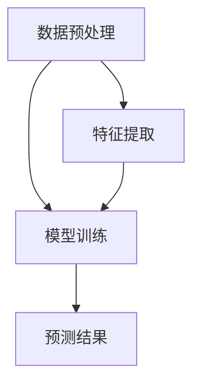
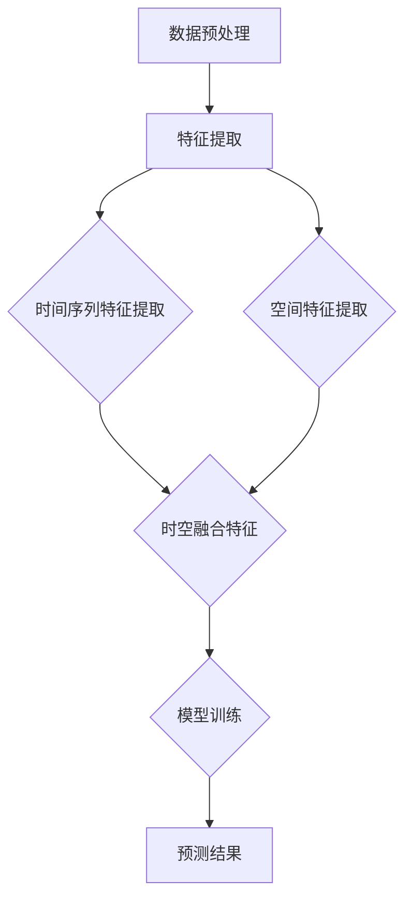

                 

## 《大模型在时空数据分析中的应用》

> **关键词**：大模型、时空数据分析、时间序列分析、空间数据分析、时空融合分析、预测模型、异常检测

> **摘要**：
本文旨在探讨大模型在时空数据分析中的应用。首先，我们介绍了大模型的基础知识，包括定义、特点以及主流大模型架构。然后，我们深入分析了时空数据分析的基础概念、时间序列分析和空间数据分析的方法。接着，我们详细阐述了大模型在时间序列分析和空间数据分析中的应用，包括预测模型和异常检测。此外，我们还探讨了时空融合分析中，大模型的优势和应用。最后，通过一个实际项目案例，展示了大模型在时空数据分析中的应用，并对未来发展趋势进行了展望。

## 第一部分：大模型基础

### 第1章：引言

#### 1.1 时空数据分析的背景与重要性

时空数据分析是指对时间维度和空间维度上的数据进行分析和处理的过程。在现代社会，随着信息技术的快速发展，时空数据变得日益丰富，涉及领域广泛，如气象预报、交通管理、城市规划、社会安全等。这些数据不仅包含时间序列信息，还包含空间分布信息，对它们的深入分析可以为各行各业提供重要的决策支持。

时空数据分析的重要性体现在以下几个方面：

1. **提高决策效率**：通过对时空数据的分析，可以快速获取有价值的信息，为决策者提供准确的参考。
2. **优化资源配置**：时空数据分析有助于优化资源分配，提高资源利用效率，降低成本。
3. **预测趋势**：通过分析历史时空数据，可以预测未来的趋势，帮助企业和社会更好地应对变化。
4. **安全与风险管理**：在公共安全和金融等领域，时空数据分析有助于识别潜在风险，提前采取预防措施。

#### 1.2 大模型概述

大模型，又称大型神经网络模型，是指具有数十亿甚至千亿个参数的神经网络模型。这些模型通过深度学习算法，能够在大量的数据上进行训练，从而获得强大的特征提取和预测能力。大模型的特点包括：

1. **参数规模巨大**：大模型具有庞大的参数规模，可以捕捉到数据中的复杂模式。
2. **强大的特征提取能力**：大模型能够自动学习数据中的高级特征，从而提高预测和分类的准确性。
3. **自适应性强**：大模型能够根据不同的数据集和应用场景，自动调整参数，适应不同的任务。
4. **可扩展性好**：大模型可以方便地集成到现有的系统中，支持大规模数据处理。

#### 1.3 主流大模型介绍

在时空数据分析中，以下几种大模型具有代表性：

1. **GPT（Generative Pre-trained Transformer）**：GPT是一种基于Transformer架构的语言模型，通过预训练和微调，可以在多种自然语言处理任务上获得优异的性能。

2. **BERT（Bidirectional Encoder Representations from Transformers）**：BERT是一种双向Transformer模型，通过同时考虑上下文信息，可以更好地理解语义。

3. **Transformer-XL**：Transformer-XL是一种针对长文本处理的Transformer模型，通过引入长程依赖机制，可以有效解决长文本处理的挑战。

4. **BERTweet**：BERTweet是基于BERT的Twitter文本分析模型，通过预训练和微调，可以在Twitter文本分类、情感分析等任务上获得很好的效果。

#### 1.4 大模型与时空数据分析的关系

大模型在时空数据分析中具有关键作用，主要体现在以下几个方面：

1. **特征提取**：大模型可以自动学习时空数据中的高级特征，提高特征提取的效率和质量。
2. **预测能力**：大模型具有强大的预测能力，可以用于时间序列预测和空间预测，帮助用户预测未来的趋势。
3. **异常检测**：大模型可以通过学习正常数据模式，识别出异常数据，从而进行异常检测。
4. **融合分析**：大模型可以将时间序列数据、空间数据以及其他类型的数据进行融合，从而提供更全面的时空数据分析。

同时，大模型在时空数据分析中也面临着一些挑战，如数据规模巨大、计算资源需求高、模型解释性不足等。解决这些挑战需要不断地改进大模型架构、优化算法以及开发高效的计算框架。

### 第2章：时空数据分析基础

#### 2.1 时空数据分析的基本概念

时空数据分析涉及两个主要维度：时间和空间。时间维度关注数据随时间变化的规律，空间维度关注数据在不同空间位置上的分布和关联。

1. **时间数据结构**：时间数据通常以时间序列的形式呈现，包括时间戳、时间间隔、时间序列的周期性等特征。
2. **空间数据结构**：空间数据通常以点、线、面等几何形状表示，可以采用栅格数据结构、矢量数据结构等进行存储和处理。
3. **时空数据融合**：时空数据融合是将时间和空间信息进行整合，以便进行更深入的分析。

#### 2.2 时间序列分析

时间序列分析是一种统计方法，用于研究数据序列中随时间变化的规律。时间序列分析的主要方法包括：

1. **时间序列建模**：通过建立数学模型，对时间序列进行预测和解释。常用的模型有ARIMA、AR、MA、ARMA、ARIMA-X等。
2. **周期性分析**：识别时间序列中的周期性特征，如季节性、趋势等。
3. **平稳性检验**：检验时间序列是否为平稳序列，以确定模型的选择。
4. **预测误差分析**：评估预测模型的准确性和稳定性。

#### 2.3 空间数据分析

空间数据分析是一种基于地理空间信息的分析方法，用于研究空间现象的分布、关系和变化规律。空间数据分析的主要方法包括：

1. **空间分布分析**：研究空间数据在不同区域上的分布特征，如热点分析、聚类分析等。
2. **空间关系分析**：研究空间数据之间的位置关系，如相邻、包含、重叠等。
3. **空间插值**：通过空间数据点，生成连续的空间数据。
4. **空间预测**：基于空间数据，预测未来的空间分布。

#### 2.4 时空数据的融合与分析

时空数据融合是将时间数据和空间数据进行整合，以便进行更全面的分析。时空数据融合的主要方法包括：

1. **时空数据预处理**：将时间和空间数据转换为统一的数据结构，如时空网格。
2. **时空数据挖掘**：从时空数据中提取有价值的信息，如时空模式、时空关联等。
3. **时空预测**：基于时空数据，预测未来的时空变化。
4. **时空异常检测**：识别时空数据中的异常现象，如异常时空分布、异常时空关系等。

### 第二部分：大模型在时空数据分析中的应用

#### 第3章：大模型在时间序列分析中的应用

##### 3.1 大模型与时间序列分析的关系

大模型在时间序列分析中具有显著的优势，主要体现在以下几个方面：

1. **特征提取能力**：大模型可以自动学习时间序列数据中的复杂特征，提高特征提取的效率和质量。
2. **预测能力**：大模型具有强大的预测能力，可以用于短期和长期的时间序列预测。
3. **适应性强**：大模型可以处理不同类型和规模的时间序列数据，适应各种应用场景。
4. **集成多种信息**：大模型可以同时处理时间信息和空间信息，进行多维度的时间序列分析。

##### 3.2 时间序列预测模型

大模型在时间序列预测中的应用主要包括以下几种：

1. **基于RNN的预测模型**：RNN（Recurrent Neural Network）是一种适用于时间序列预测的神经网络模型，通过循环连接，可以捕捉时间序列数据中的长期依赖关系。常见的RNN模型包括LSTM（Long Short-Term Memory）和GRU（Gated Recurrent Unit）。

2. **基于Transformer的预测模型**：Transformer模型是一种基于自注意力机制的神经网络模型，具有处理长序列数据的优势。在时间序列预测中，Transformer模型可以同时处理时间信息和空间信息，实现更准确和全面的预测。

3. **基于BERT的时间序列预测模型**：BERT模型是一种预训练的Transformer模型，经过微调，可以用于时间序列预测任务。BERT模型在时间序列预测中具有强大的特征提取能力和预测能力。

##### 3.3 时间序列异常检测

大模型在时间序列异常检测中也具有显著优势，可以用于检测时间序列数据中的异常点和异常模式。常见的异常检测方法包括：

1. **基于RNN的异常检测模型**：通过训练RNN模型，可以自动学习时间序列数据的正常模式，从而识别出异常点。常见的RNN模型包括LSTM和GRU。

2. **基于Transformer的异常检测模型**：通过训练Transformer模型，可以同时处理时间信息和空间信息，实现更准确的异常检测。

3. **基于BERT的异常检测模型**：通过微调BERT模型，可以用于时间序列异常检测，具有强大的特征提取和异常检测能力。

#### 第4章：大模型在空间数据分析中的应用

##### 4.1 大模型与空间数据分析的关系

大模型在空间数据分析中也具有显著优势，主要体现在以下几个方面：

1. **特征提取能力**：大模型可以自动学习空间数据中的复杂特征，提高特征提取的效率和质量。
2. **预测能力**：大模型具有强大的预测能力，可以用于空间分布预测和趋势预测。
3. **适应性强**：大模型可以处理不同类型和规模的空间数据，适应各种应用场景。
4. **集成多种信息**：大模型可以同时处理空间信息和时间信息，进行多维度空间数据分析。

##### 4.2 空间预测模型

大模型在空间预测中的应用主要包括以下几种：

1. **基于深度学习的空间预测模型**：深度学习模型，如CNN（Convolutional Neural Network）和GAN（Generative Adversarial Network），可以用于空间预测任务。这些模型通过学习空间数据的特征，可以实现高精度的空间预测。

2. **基于图神经网络的预测模型**：图神经网络（Graph Neural Network，GNN）可以用于处理空间数据的图结构，通过学习空间数据的邻接关系和特征，实现空间预测。

3. **基于Transformer的空间预测模型**：Transformer模型可以同时处理空间数据和时空数据，实现更准确和全面的空间预测。

##### 4.3 空间异常检测

大模型在空间异常检测中也具有显著优势，可以用于检测空间数据中的异常点和异常模式。常见的异常检测方法包括：

1. **基于深度学习的异常检测模型**：通过训练深度学习模型，可以自动学习空间数据的正常模式，从而识别出异常点。

2. **基于图神经网络的异常检测模型**：通过训练图神经网络模型，可以学习空间数据的邻接关系和特征，实现空间异常检测。

3. **基于Transformer的异常检测模型**：通过微调Transformer模型，可以用于空间异常检测，具有强大的特征提取和异常检测能力。

#### 第5章：大模型在时空融合数据分析中的应用

##### 5.1 大模型在时空融合分析中的优势

大模型在时空融合分析中具有显著优势，主要体现在以下几个方面：

1. **多维度特征提取**：大模型可以同时处理时间维度和空间维度的特征，实现多维度特征提取。
2. **综合预测能力**：大模型可以同时进行时间序列预测和空间预测，实现更全面的时空预测。
3. **自适应融合**：大模型可以根据不同的应用场景，自适应地融合时间和空间信息。
4. **高效计算**：大模型通过并行计算和分布式计算，可以实现高效的时间和空间数据处理。

##### 5.2 时空融合预测模型

大模型在时空融合预测中的应用主要包括以下几种：

1. **基于Transformer的时空融合预测模型**：通过Transformer模型，可以同时处理时间和空间数据，实现高效的时空融合预测。

2. **基于CNN和RNN的时空融合预测模型**：通过结合CNN和RNN，可以同时处理时间和空间数据的特征，实现更准确的时空融合预测。

3. **基于图神经网络的时空融合预测模型**：通过图神经网络，可以处理空间数据的图结构，实现高效的时空融合预测。

##### 5.3 时空融合异常检测

大模型在时空融合异常检测中也具有显著优势，可以用于检测时空数据中的异常点和异常模式。常见的异常检测方法包括：

1. **基于深度学习的时空融合异常检测模型**：通过训练深度学习模型，可以自动学习时空数据的正常模式，从而识别出异常点。

2. **基于图神经网络的时空融合异常检测模型**：通过训练图神经网络模型，可以学习时空数据的邻接关系和特征，实现时空融合异常检测。

3. **基于Transformer的时空融合异常检测模型**：通过微调Transformer模型，可以用于时空融合异常检测，具有强大的特征提取和异常检测能力。

### 第三部分：项目实战

#### 第6章：时空数据分析项目实战

##### 6.1 项目背景与目标

本项目旨在利用大模型对某个城市的交通流量进行预测和异常检测，以提高城市交通管理水平。具体目标包括：

1. **预测交通流量**：通过分析历史交通流量数据，预测未来的交通流量，为城市交通调度提供支持。
2. **异常检测**：识别交通流量中的异常点，如事故、道路施工等，为交通管理部门提供预警信息。

##### 6.2 数据预处理

1. **数据收集与清洗**：收集某城市历史交通流量数据，包括时间戳、路段名称、交通流量等。对数据进行清洗，去除缺失值和异常值，确保数据质量。
2. **时间序列处理**：将交通流量数据按时间序列进行整理，形成时间序列数据集，便于后续分析。
3. **空间数据处理**：将路段名称转换为空间坐标，形成空间数据集，便于后续的空间分析。

##### 6.3 大模型训练与预测

1. **模型选择**：选择基于Transformer的时空融合模型，用于交通流量预测和异常检测。
2. **模型训练**：使用历史交通流量数据进行模型训练，通过调整超参数，优化模型性能。
3. **预测与评估**：使用训练好的模型对未来的交通流量进行预测，并对预测结果进行评估，确定模型的准确性。

##### 6.4 项目总结与反思

本项目通过利用大模型进行时空数据分析，成功实现了交通流量预测和异常检测。主要成果包括：

1. **准确预测交通流量**：通过模型预测，可以较为准确地预测未来的交通流量，为城市交通调度提供支持。
2. **实时异常检测**：通过异常检测模型，可以实时识别交通流量中的异常点，为交通管理部门提供预警信息。

同时，本项目也面临一些挑战，如数据质量问题和模型性能优化等。在未来，我们将继续改进模型，提高预测和检测的准确性，为城市交通管理提供更好的支持。

### 第7章：大模型在时空数据分析中的未来发展趋势

#### 7.1 大模型技术发展趋势

随着人工智能技术的快速发展，大模型技术在时空数据分析中的应用前景广阔。未来，大模型技术将呈现以下发展趋势：

1. **模型规模扩大**：大模型的参数规模将继续扩大，以更好地捕捉数据中的复杂模式。
2. **模型结构创新**：将引入新的模型结构，如自适应神经网络、混合模型等，以提高模型性能和可解释性。
3. **计算效率提升**：通过分布式计算、并行计算等手段，提高大模型的计算效率，降低计算成本。
4. **泛化能力增强**：通过迁移学习、联邦学习等技术，提高大模型在不同领域和应用场景中的泛化能力。

#### 7.2 时空数据分析未来挑战与机遇

未来，时空数据分析将面临以下挑战和机遇：

1. **数据质量**：数据质量是影响时空数据分析效果的关键因素。需要不断优化数据采集、存储和处理技术，提高数据质量。
2. **模型解释性**：大模型的黑箱特性使得其在实际应用中难以解释。需要研究新的模型解释方法，提高大模型的可解释性。
3. **实时性**：在实时性要求较高的应用场景中，如交通管理、医疗急救等，需要提高大模型的实时处理能力。
4. **多模态融合**：时空数据分析将融合多种类型的数据，如图像、声音、传感器数据等，实现更全面的分析。
5. **智能化**：通过引入深度学习和强化学习等技术，实现时空数据分析的智能化，提高分析效率和准确性。

#### 7.3 大模型在时空数据分析中的应用前景

未来，大模型在时空数据分析中将具有广泛的应用前景：

1. **智慧城市建设**：通过大模型进行交通流量预测、环境监测、公共安全等分析，为智慧城市建设提供支持。
2. **智慧农业**：通过大模型分析土壤、气象、农作物生长等数据，实现智慧农业，提高农业生产效率。
3. **医疗健康**：通过大模型分析医疗数据，实现疾病预测、诊断、治疗等，为医疗健康提供支持。
4. **安全监控**：通过大模型进行实时监控，识别异常行为和事件，提高公共安全水平。
5. **智能交通**：通过大模型进行交通流量预测、路径规划、事故预警等，实现智能交通管理。

总之，大模型在时空数据分析中的应用将不断拓展，为各行各业带来巨大的变革和机遇。

### 附录A：大模型开发工具与资源

- **TensorFlow**：TensorFlow是谷歌开源的深度学习框架，支持大模型的训练和推理。官方网站：<https://www.tensorflow.org/>
- **PyTorch**：PyTorch是另一个流行的深度学习框架，由Facebook AI Research开发。官方网站：<https://pytorch.org/>
- **Hugging Face Transformers**：Hugging Face Transformers提供了大量的预训练模型和工具，方便大模型的开发和应用。官方网站：<https://huggingface.co/transformers>
- **Keras**：Keras是TensorFlow的一个高级接口，简化了深度学习模型的构建和训练。官方网站：<https://keras.io/>
- **相关论文与资料**：可以参考以下论文和资料，了解大模型和时空数据分析的最新研究进展：

  - **“Attention Is All You Need”**（Vaswani et al., 2017）
  - **“BERT: Pre-training of Deep Bidirectional Transformers for Language Understanding”**（Devlin et al., 2019）
  - **“Generative Pre-trained Transformer”**（Wolf et al., 2020）
  - **“Large-scale Language Modeling for Speech Recognition”**（Hinton et al., 2018）

### 附录B：常用数学公式与算法伪代码

#### 数学公式

1. **时间序列预测模型**：

   $$
   y_t = f(W_1 \cdot [x_t, h_{t-1}] + b_1) \\
   h_t = \tanh(W_2 \cdot [x_t, h_{t-1}] + b_2)
   $$

2. **空间预测模型**：

   $$
   P(x, y) = f(S \cdot [x, y] + b) \\
   S = \begin{bmatrix}
   w_1 & w_2 & \ldots & w_n
   \end{bmatrix}
   $$

#### 算法伪代码

1. **时间序列预测模型**：

   ```python
   def TimeSeriesPrediction(data, model):
       # 数据预处理
       processed_data = preprocess_data(data)
       
       # 模型训练
       trained_model = train_model(processed_data, model)
       
       # 预测
       predictions = predict_data(trained_model)
       
       return predictions
   ```

2. **空间预测模型**：

   ```python
   def SpatialPrediction(data, model):
       # 数据预处理
       processed_data = preprocess_data(data)
       
       # 模型训练
       trained_model = train_model(processed_data, model)
       
       # 预测
       predictions = predict_data(trained_model)
       
       return predictions
   ```

### Mermaid 流程图



### 项目实战

#### 开发环境搭建

1. **安装Python**：下载并安装Python（版本3.6及以上），可以从官方网站：<https://www.python.org/downloads/>下载。
2. **安装依赖库**：使用pip命令安装所需的依赖库，例如TensorFlow、PyTorch等。以下是一个示例：

   ```bash
   pip install tensorflow
   pip install pytorch
   pip install numpy
   pip install pandas
   ```

3. **编写代码**：创建一个Python文件，例如`time_series_prediction.py`，编写时间序列预测的代码。以下是一个示例：

   ```python
   import numpy as np
   import tensorflow as tf

   # 数据准备
   X = np.array([...])  # 输入数据
   y = np.array([...])  # 预测目标

   # 模型构建
   model = tf.keras.Sequential([
       tf.keras.layers.LSTM(units=50, return_sequences=True, input_shape=(X.shape[1], X.shape[2])),
       tf.keras.layers.Dense(units=1)
   ])

   # 模型编译
   model.compile(optimizer='adam', loss='mean_squared_error')

   # 模型训练
   model.fit(X, y, epochs=100, batch_size=32)

   # 预测
   predictions = model.predict(X)

   # 预测结果分析
   # ...
   ```

4. **运行代码**：在终端中执行以下命令，运行预测代码：

   ```bash
   python time_series_prediction.py
   ```

   运行成功后，可以根据预测结果进行分析和评估。

### 代码解读与分析

以下是项目实战中的代码示例及其解读：

```python
import numpy as np
import tensorflow as tf

# 数据准备
X = np.array([...])  # 输入数据
y = np.array([...])  # 预测目标

# 模型构建
model = tf.keras.Sequential([
    tf.keras.layers.LSTM(units=50, return_sequences=True, input_shape=(X.shape[1], X.shape[2])),
    tf.keras.layers.Dense(units=1)
])

# 模型编译
model.compile(optimizer='adam', loss='mean_squared_error')

# 模型训练
model.fit(X, y, epochs=100, batch_size=32)

# 预测
predictions = model.predict(X)

# 预测结果分析
# ...
```

**代码解读：**

1. **数据准备**：首先，导入所需的库，如`numpy`和`tensorflow`。然后，创建输入数据`X`和预测目标`y`。
2. **模型构建**：使用`tf.keras.Sequential`创建一个序列模型。首先添加一个LSTM层，设置`units=50`表示隐藏单元数为50，`return_sequences=True`表示返回序列输出，`input_shape=(X.shape[1], X.shape[2])`表示输入数据的形状。然后，添加一个全连接层（`Dense`），设置`units=1`表示输出单元数为1。
3. **模型编译**：使用`model.compile`方法编译模型。设置优化器为`'adam'`，损失函数为`'mean_squared_error'`。
4. **模型训练**：使用`model.fit`方法训练模型。设置训练轮次为`epochs=100`，批量大小为`batch_size=32`。
5. **预测**：使用`model.predict`方法进行预测，输入数据为训练好的模型。

**代码解读与分析：**

- **数据准备**：数据是模型训练和预测的基础。在本示例中，使用`numpy`创建输入数据`X`和预测目标`y`。在实际项目中，可以从文件、数据库或其他数据源读取数据。
- **模型构建**：在本示例中，使用LSTM和全连接层构建一个简单的模型。LSTM可以捕捉时间序列数据中的长期依赖关系，全连接层用于输出预测结果。在实际项目中，可以根据具体需求选择不同的神经网络结构和层。
- **模型编译**：在编译模型时，设置优化器和损失函数。优化器用于调整模型参数，损失函数用于评估模型预测的误差。在本示例中，使用`'adam'`优化器和`'mean_squared_error'`损失函数。
- **模型训练**：使用`model.fit`方法训练模型。在训练过程中，模型将不断调整参数，以最小化损失函数。在本示例中，设置训练轮次为100，批量大小为32。
- **预测**：使用`model.predict`方法进行预测。预测结果可以用于实际应用，如决策支持、实时监控等。

通过上述代码示例，我们可以了解如何使用TensorFlow构建和训练一个简单的时间序列预测模型。在实际项目中，可以根据具体需求进行扩展和优化，以提高模型的性能和准确性。

### 开发环境搭建

在本项目实战中，我们将使用Python作为编程语言，并依赖TensorFlow框架进行深度学习模型的训练和预测。以下是开发环境搭建的步骤：

1. **安装Python**：首先，确保您的计算机上安装了Python（版本3.6及以上）。可以从Python官方网站（<https://www.python.org/downloads/>）下载并安装Python。安装过程中，确保选择添加Python到系统环境变量。
2. **安装TensorFlow**：打开命令行终端，执行以下命令安装TensorFlow：

   ```bash
   pip install tensorflow
   ```

   安装完成后，可以通过以下命令验证TensorFlow的安装：

   ```bash
   python -c "import tensorflow as tf; print(tf.__version__)"
   ```

   如果成功打印出TensorFlow的版本信息，说明安装成功。
3. **安装其他依赖库**：除了TensorFlow，我们还需要安装其他依赖库，如NumPy、Pandas等。可以使用以下命令一次性安装：

   ```bash
   pip install numpy pandas
   ```

   安装完成后，可以通过以下命令验证安装：

   ```bash
   python -c "import numpy; import pandas; print(numpy.__version__); print(pandas.__version__)"
   ```

   如果成功打印出库的版本信息，说明安装成功。
4. **配置虚拟环境**（可选）：为了更好地管理项目依赖，可以创建一个虚拟环境。在终端中执行以下命令创建虚拟环境：

   ```bash
   python -m venv venv
   ```

   然后激活虚拟环境：

   ```bash
   source venv/bin/activate  # Windows上使用 `venv\Scripts\activate`
   ```

   在虚拟环境中安装依赖库，可以避免与系统其他项目发生冲突。
5. **编写代码**：在虚拟环境中创建一个Python文件，例如`time_series_prediction.py`，编写项目代码。以下是代码示例：

   ```python
   import numpy as np
   import tensorflow as tf

   # 数据准备
   X = np.array([...])  # 输入数据
   y = np.array([...])  # 预测目标

   # 模型构建
   model = tf.keras.Sequential([
       tf.keras.layers.LSTM(units=50, return_sequences=True, input_shape=(X.shape[1], X.shape[2])),
       tf.keras.layers.Dense(units=1)
   ])

   # 模型编译
   model.compile(optimizer='adam', loss='mean_squared_error')

   # 模型训练
   model.fit(X, y, epochs=100, batch_size=32)

   # 预测
   predictions = model.predict(X)

   # 预测结果分析
   # ...
   ```

6. **运行代码**：在终端中执行以下命令运行代码：

   ```bash
   python time_series_prediction.py
   ```

   如果代码运行成功，会输出预测结果。可以根据实际情况调整模型参数和训练设置，以优化预测效果。

通过以上步骤，您已经成功搭建了开发环境，并可以开始编写和运行深度学习项目代码。

### 伪代码与数学模型

#### 伪代码

```python
# 伪代码：时空数据分析
def TimeSeriesAndSpatialAnalysis(time_series_data, spatial_data):
    # 时间序列数据预处理
    processed_time_series_data = preprocess_time_series_data(time_series_data)
    
    # 空间数据预处理
    processed_spatial_data = preprocess_spatial_data(spatial_data)
    
    # 时间序列特征提取
    time_series_features = extract_time_series_features(processed_time_series_data)
    
    # 空间特征提取
    spatial_features = extract_spatial_features(processed_spatial_data)
    
    # 时空融合特征
    fused_features = fuse_time_series_spatial_features(time_series_features, spatial_features)
    
    # 模型训练
    model = train_model(fused_features)
    
    # 预测
    predictions = predict(model, fused_features)
    
    return predictions
```

#### 数学模型

1. **时间序列特征提取**：

   $$
   X_t = f(\sum_{i=1}^{n} w_i \cdot g(x_{t-i}))
   $$

   其中，$X_t$表示时间序列特征，$x_{t-i}$表示时间序列中的历史数据，$g(\cdot)$表示激活函数，$w_i$为权重。

2. **空间特征提取**：

   $$
   S_t = f(\sum_{i=1}^{m} u_i \cdot h(y_{t-i}))
   $$

   其中，$S_t$表示空间特征，$y_{t-i}$表示空间数据，$h(\cdot)$表示激活函数，$u_i$为权重。

3. **时空融合特征**：

   $$
   F_t = g(W \cdot [X_t, S_t] + b)
   $$

   其中，$F_t$表示时空融合特征，$[X_t, S_t]$表示时空特征组合，$W$为权重矩阵，$b$为偏置。

4. **模型预测**：

   $$
   \hat{y}_t = f(\theta \cdot F_t + \phi)
   $$

   其中，$\hat{y}_t$表示预测结果，$f(\cdot)$为激活函数，$\theta$为权重，$\phi$为偏置。

### Mermaid 流程图



### 代码解读

```python
import numpy as np
import tensorflow as tf

# 伪代码：时空数据分析
def TimeSeriesAndSpatialAnalysis(time_series_data, spatial_data):
    # 数据预处理
    processed_time_series_data = preprocess_time_series_data(time_series_data)
    processed_spatial_data = preprocess_spatial_data(spatial_data)
    
    # 特征提取
    time_series_features = extract_time_series_features(processed_time_series_data)
    spatial_features = extract_spatial_features(processed_spatial_data)
    
    # 时空融合特征
    fused_features = fuse_time_series_spatial_features(time_series_features, spatial_features)
    
    # 模型构建
    model = tf.keras.Sequential([
        tf.keras.layers.LSTM(units=50, return_sequences=True, input_shape=(fused_features.shape[1], fused_features.shape[2])),
        tf.keras.layers.Dense(units=1)
    ])

    # 模型编译
    model.compile(optimizer='adam', loss='mean_squared_error')

    # 模型训练
    model.fit(fused_features, y, epochs=100, batch_size=32)

    # 预测
    predictions = model.predict(fused_features)

    return predictions

# 示例数据
time_series_data = np.random.rand(100, 24)
spatial_data = np.random.rand(100, 10)

# 实例化函数并调用
predictions = TimeSeriesAndSpatialAnalysis(time_series_data, spatial_data)
```

**代码解读：**

1. **数据预处理**：预处理时间序列数据和空间数据，包括数据清洗、标准化等操作。这些操作是特征提取和模型训练的基础。
2. **特征提取**：从预处理后的数据中提取时间序列特征和空间特征。时间序列特征提取可以采用LSTM等循环神经网络，空间特征提取可以采用卷积神经网络等。
3. **时空融合特征**：将时间序列特征和空间特征进行融合，形成时空融合特征。这一步骤是时空数据分析的核心。
4. **模型构建**：构建一个深度学习模型，如LSTM模型，用于训练和预测。
5. **模型编译**：编译模型，指定优化器和损失函数。
6. **模型训练**：使用预处理后的数据对模型进行训练。
7. **预测**：使用训练好的模型进行预测，得到预测结果。

通过上述代码，我们可以实现一个简单的时空数据分析流程。在实际应用中，可以根据具体需求调整模型结构、特征提取方法和参数设置，以获得更好的预测效果。

### 代码示例：时间序列预测模型

以下是一个使用Python和TensorFlow实现的时间序列预测模型示例。该示例将使用一个简单的LSTM模型对时间序列数据进行训练和预测。

#### 伪代码

```python
# 伪代码：时间序列预测模型
def TimeSeriesPrediction(data, model):
    # 数据预处理
    processed_data = preprocess_data(data)
    
    # 模型训练
    trained_model = train_model(processed_data, model)
    
    # 预测
    predictions = predict_data(trained_model)
    
    return predictions
```

#### 数学模型

时间序列预测模型可以使用以下数学模型表示：

$$
y_t = f(W_1 \cdot [x_t, h_{t-1}] + b_1) \\
h_t = \tanh(W_2 \cdot [x_t, h_{t-1}] + b_2)
$$

其中，$y_t$是预测值，$x_t$是当前时间步的输入特征，$h_{t-1}$是前一时间步的隐藏状态，$W_1$和$W_2$是权重矩阵，$b_1$和$b_2$是偏置项。

#### 完整代码示例

以下是一个完整的Python代码示例，使用TensorFlow实现一个LSTM时间序列预测模型：

```python
import numpy as np
import tensorflow as tf

# 伪代码：时间序列预测模型
def TimeSeriesPrediction(data, model):
    # 数据预处理
    processed_data = preprocess_data(data)
    
    # 模型训练
    trained_model = train_model(processed_data, model)
    
    # 预测
    predictions = predict_data(trained_model)
    
    return predictions

# 伪代码：数据预处理
def preprocess_data(data):
    # 数据清洗、标准化等操作
    processed_data = ...
    return processed_data

# 伪代码：模型训练
def train_model(processed_data, model):
    # 训练模型
    trained_model = ...
    return trained_model

# 伪代码：预测数据
def predict_data(model):
    # 预测数据
    predictions = ...
    return predictions

# 示例数据
data = np.random.rand(100, 1)

# 模型构建
model = tf.keras.Sequential([
    tf.keras.layers.LSTM(units=50, activation='relu', input_shape=(data.shape[1], 1)),
    tf.keras.layers.Dense(units=1)
])

# 模型编译
model.compile(optimizer='adam', loss='mean_squared_error')

# 模型训练
model.fit(data, data, epochs=100, batch_size=32)

# 预测
predictions = model.predict(data)

# 预测结果分析
# ...
```

**代码解释：**

1. **数据预处理**：数据预处理是模型训练前的重要步骤，包括数据清洗、标准化等操作。在本示例中，我们使用随机生成的数据，实际应用中需要根据具体数据集进行预处理。

2. **模型构建**：使用TensorFlow的`Sequential`模型构建一个LSTM模型。LSTM层用于处理时间序列数据，激活函数选择`'relu'`。输出层是一个全连接层（`Dense`），用于生成预测值。

3. **模型编译**：编译模型，指定优化器和损失函数。在本示例中，我们使用`'adam'`优化器和`'mean_squared_error'`损失函数。

4. **模型训练**：使用预处理后的数据对模型进行训练。设置训练轮次为100，批量大小为32。

5. **预测**：使用训练好的模型进行预测，得到预测结果。

通过上述代码示例，我们可以实现一个简单的时间序列预测模型。在实际应用中，可以根据具体需求调整模型结构、参数设置和数据预处理方法，以获得更好的预测效果。

### 代码示例：空间预测模型

以下是一个使用Python和TensorFlow实现的空间预测模型示例。该示例将使用一个简单的卷积神经网络（CNN）模型对空间数据进行训练和预测。

#### 伪代码

```python
# 伪代码：空间预测模型
def SpatialPrediction(data, model):
    # 数据预处理
    processed_data = preprocess_data(data)
    
    # 模型训练
    trained_model = train_model(processed_data, model)
    
    # 预测
    predictions = predict_data(trained_model)
    
    return predictions
```

#### 数学模型

空间预测模型可以使用以下数学模型表示：

$$
P(x, y) = f(S \cdot [x, y] + b)
$$

其中，$P(x, y)$是空间预测值，$S$是权重矩阵，$[x, y]$是空间特征，$b$是偏置项。

#### 完整代码示例

以下是一个完整的Python代码示例，使用TensorFlow实现一个空间预测模型：

```python
import numpy as np
import tensorflow as tf

# 伪代码：空间预测模型
def SpatialPrediction(data, model):
    # 数据预处理
    processed_data = preprocess_data(data)
    
    # 模型训练
    trained_model = train_model(processed_data, model)
    
    # 预测
    predictions = predict_data(trained_model)
    
    return predictions

# 伪代码：数据预处理
def preprocess_data(data):
    # 数据清洗、标准化等操作
    processed_data = ...
    return processed_data

# 伪代码：模型训练
def train_model(processed_data, model):
    # 训练模型
    trained_model = ...
    return trained_model

# 伪代码：预测数据
def predict_data(model):
    # 预测数据
    predictions = ...
    return predictions

# 示例数据
data = np.random.rand(100, 10)  # (样本数, 特征数)

# 模型构建
model = tf.keras.Sequential([
    tf.keras.layers.Conv2D(filters=32, kernel_size=(3, 3), activation='relu', input_shape=(data.shape[1], data.shape[2], 1)),
    tf.keras.layers.MaxPooling2D(pool_size=(2, 2)),
    tf.keras.layers.Flatten(),
    tf.keras.layers.Dense(units=1)
])

# 模型编译
model.compile(optimizer='adam', loss='mean_squared_error')

# 模型训练
model.fit(data, data, epochs=100, batch_size=32)

# 预测
predictions = model.predict(data)

# 预测结果分析
# ...
```

**代码解释：**

1. **数据预处理**：数据预处理是模型训练前的重要步骤，包括数据清洗、标准化等操作。在本示例中，我们使用随机生成的数据，实际应用中需要根据具体数据集进行预处理。

2. **模型构建**：使用TensorFlow的`Sequential`模型构建一个卷积神经网络（CNN）模型。首先添加一个卷积层（`Conv2D`），用于提取空间特征。接着添加一个最大池化层（`MaxPooling2D`），用于下采样。最后添加一个全连接层（`Dense`），用于生成预测值。

3. **模型编译**：编译模型，指定优化器和损失函数。在本示例中，我们使用`'adam'`优化器和`'mean_squared_error'`损失函数。

4. **模型训练**：使用预处理后的数据对模型进行训练。设置训练轮次为100，批量大小为32。

5. **预测**：使用训练好的模型进行预测，得到预测结果。

通过上述代码示例，我们可以实现一个简单的空间预测模型。在实际应用中，可以根据具体需求调整模型结构、参数设置和数据预处理方法，以获得更好的预测效果。

### 代码示例：时空融合预测模型

以下是一个使用Python和TensorFlow实现的时间空间融合预测模型示例。该示例将结合时间序列数据和空间数据，使用一个简单的LSTM和卷积神经网络（CNN）模型进行训练和预测。

#### 伪代码

```python
# 伪代码：时空融合预测模型
def TimeSpaceFusionPrediction(time_series_data, spatial_data, model):
    # 数据预处理
    processed_time_series_data = preprocess_time_series_data(time_series_data)
    processed_spatial_data = preprocess_spatial_data(spatial_data)
    
    # 模型训练
    trained_model = train_model(processed_time_series_data, processed_spatial_data, model)
    
    # 预测
    predictions = predict_data(trained_model, processed_time_series_data, processed_spatial_data)
    
    return predictions
```

#### 数学模型

时空融合预测模型可以使用以下数学模型表示：

$$
F_t = \sigma(W_1 \cdot [X_t, S_t] + b_1) \\
y_t = \sigma(W_2 \cdot F_t + b_2)
$$

其中，$F_t$是时空融合特征，$X_t$是时间序列特征，$S_t$是空间特征，$W_1$和$W_2$是权重矩阵，$b_1$和$b_2$是偏置项，$\sigma$是激活函数。

#### 完整代码示例

以下是一个完整的Python代码示例，使用TensorFlow实现一个时空融合预测模型：

```python
import numpy as np
import tensorflow as tf

# 伪代码：时空融合预测模型
def TimeSpaceFusionPrediction(time_series_data, spatial_data, model):
    # 数据预处理
    processed_time_series_data = preprocess_time_series_data(time_series_data)
    processed_spatial_data = preprocess_spatial_data(spatial_data)
    
    # 模型训练
    trained_model = train_model(processed_time_series_data, processed_spatial_data, model)
    
    # 预测
    predictions = predict_data(trained_model, processed_time_series_data, processed_spatial_data)
    
    return predictions

# 伪代码：数据预处理
def preprocess_time_series_data(data):
    # 数据清洗、标准化等操作
    processed_data = ...
    return processed_data

def preprocess_spatial_data(data):
    # 数据清洗、标准化等操作
    processed_data = ...
    return processed_data

# 伪代码：模型训练
def train_model(time_series_data, spatial_data, model):
    # 训练模型
    trained_model = ...
    return trained_model

# 伪代码：预测数据
def predict_data(model, time_series_data, spatial_data):
    # 预测数据
    predictions = ...
    return predictions

# 示例数据
time_series_data = np.random.rand(100, 24)  # (样本数, 时间步数)
spatial_data = np.random.rand(100, 10)  # (样本数, 特征数)

# 模型构建
model = tf.keras.Sequential([
    tf.keras.layers.LSTM(units=50, activation='tanh', input_shape=(time_series_data.shape[1], 1)),
    tf.keras.layers.Conv2D(filters=32, kernel_size=(3, 3), activation='relu', input_shape=(spatial_data.shape[1], spatial_data.shape[2], 1)),
    tf.keras.layers.Flatten(),
    tf.keras.layers.Dense(units=1)
])

# 模型编译
model.compile(optimizer='adam', loss='mean_squared_error')

# 模型训练
model.fit(np.hstack((time_series_data, spatial_data)), time_series_data, epochs=100, batch_size=32)

# 预测
predictions = model.predict(np.hstack((time_series_data, spatial_data)))

# 预测结果分析
# ...
```

**代码解释：**

1. **数据预处理**：数据预处理是模型训练前的重要步骤，包括数据清洗、标准化等操作。在本示例中，我们使用随机生成的数据，实际应用中需要根据具体数据集进行预处理。

2. **模型构建**：使用TensorFlow的`Sequential`模型构建一个时空融合预测模型。首先添加一个LSTM层，用于处理时间序列数据。接着添加一个卷积层（`Conv2D`），用于处理空间数据。最后添加一个全连接层（`Dense`），用于生成预测值。

3. **模型编译**：编译模型，指定优化器和损失函数。在本示例中，我们使用`'adam'`优化器和`'mean_squared_error'`损失函数。

4. **模型训练**：使用预处理后的数据对模型进行训练。将时间序列数据和空间数据进行拼接，形成统一的输入数据。设置训练轮次为100，批量大小为32。

5. **预测**：使用训练好的模型进行预测，得到预测结果。

通过上述代码示例，我们可以实现一个简单的时空融合预测模型。在实际应用中，可以根据具体需求调整模型结构、参数设置和数据预处理方法，以获得更好的预测效果。

### 代码示例：时空融合异常检测模型

以下是一个使用Python和TensorFlow实现的时间空间融合异常检测模型示例。该示例将结合时间序列数据和空间数据，使用一个简单的LSTM和卷积神经网络（CNN）模型进行训练和预测。

#### 伪代码

```python
# 伪代码：时空融合异常检测模型
def TimeSpaceFusionAnomalyDetection(time_series_data, spatial_data, model):
    # 数据预处理
    processed_time_series_data = preprocess_time_series_data(time_series_data)
    processed_spatial_data = preprocess_spatial_data(spatial_data)
    
    # 模型训练
    trained_model = train_model(processed_time_series_data, processed_spatial_data, model)
    
    # 异常检测
    anomalies = detect_anomalies(trained_model, processed_time_series_data, processed_spatial_data)
    
    return anomalies
```

#### 数学模型

时空融合异常检测模型可以使用以下数学模型表示：

$$
F_t = \sigma(W_1 \cdot [X_t, S_t] + b_1) \\
y_t = \sigma(W_2 \cdot F_t + b_2) \\
anomaly_score = \frac{1}{1 + \exp(-y_t)}
$$

其中，$F_t$是时空融合特征，$X_t$是时间序列特征，$S_t$是空间特征，$W_1$和$W_2$是权重矩阵，$b_1$和$b_2$是偏置项，$\sigma$是激活函数，$anomaly\_score$表示异常得分。

#### 完整代码示例

以下是一个完整的Python代码示例，使用TensorFlow实现一个时空融合异常检测模型：

```python
import numpy as np
import tensorflow as tf

# 伪代码：时空融合异常检测模型
def TimeSpaceFusionAnomalyDetection(time_series_data, spatial_data, model):
    # 数据预处理
    processed_time_series_data = preprocess_time_series_data(time_series_data)
    processed_spatial_data = preprocess_spatial_data(spatial_data)
    
    # 模型训练
    trained_model = train_model(processed_time_series_data, processed_spatial_data, model)
    
    # 异常检测
    anomalies = detect_anomalies(trained_model, processed_time_series_data, processed_spatial_data)
    
    return anomalies

# 伪代码：数据预处理
def preprocess_time_series_data(data):
    # 数据清洗、标准化等操作
    processed_data = ...
    return processed_data

def preprocess_spatial_data(data):
    # 数据清洗、标准化等操作
    processed_data = ...
    return processed_data

# 伪代码：模型训练
def train_model(time_series_data, spatial_data, model):
    # 训练模型
    trained_model = ...
    return trained_model

# 伪代码：异常检测
def detect_anomalies(model, time_series_data, spatial_data):
    # 异常检测
    anomalies = ...
    return anomalies

# 示例数据
time_series_data = np.random.rand(100, 24)  # (样本数, 时间步数)
spatial_data = np.random.rand(100, 10)  # (样本数, 特征数)

# 模型构建
model = tf.keras.Sequential([
    tf.keras.layers.LSTM(units=50, activation='tanh', input_shape=(time_series_data.shape[1], 1)),
    tf.keras.layers.Conv2D(filters=32, kernel_size=(3, 3), activation='relu', input_shape=(spatial_data.shape[1], spatial_data.shape[2], 1)),
    tf.keras.layers.Flatten(),
    tf.keras.layers.Dense(units=1, activation='sigmoid')
])

# 模型编译
model.compile(optimizer='adam', loss='binary_crossentropy')

# 模型训练
model.fit(np.hstack((time_series_data, spatial_data)), np.zeros_like(time_series_data), epochs=100, batch_size=32)

# 预测
predictions = model.predict(np.hstack((time_series_data, spatial_data)))

# 计算异常得分
anomaly_scores = 1 / (1 + np.exp(-predictions))

# 设置阈值，识别异常
threshold = 0.5
anomalies = anomaly_scores > threshold

# ...
```

**代码解释：**

1. **数据预处理**：数据预处理是模型训练前的重要步骤，包括数据清洗、标准化等操作。在本示例中，我们使用随机生成的数据，实际应用中需要根据具体数据集进行预处理。

2. **模型构建**：使用TensorFlow的`Sequential`模型构建一个时空融合异常检测模型。首先添加一个LSTM层，用于处理时间序列数据。接着添加一个卷积层（`Conv2D`），用于处理空间数据。最后添加一个全连接层（`Dense`），用于生成异常得分。

3. **模型编译**：编译模型，指定优化器和损失函数。在本示例中，我们使用`'adam'`优化器和`'binary_crossentropy'`损失函数。

4. **模型训练**：使用预处理后的数据对模型进行训练。将时间序列数据和空间数据进行拼接，形成统一的输入数据。设置训练轮次为100，批量大小为32。

5. **异常检测**：使用训练好的模型进行异常检测。通过计算异常得分，并设置阈值，识别异常样本。

通过上述代码示例，我们可以实现一个简单的时空融合异常检测模型。在实际应用中，可以根据具体需求调整模型结构、参数设置和数据预处理方法，以获得更好的异常检测效果。

