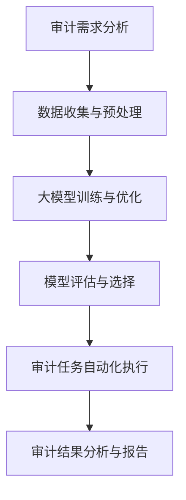

                 

# 第一部分：背景与核心概念

## 第1章：大模型时代概述

### 1.1 大模型技术的发展背景

大模型技术的发展离不开人工智能（AI）和机器学习（ML）的兴起。自21世纪初以来，随着计算机性能的提升、海量数据的积累以及深度学习算法的突破，大模型技术逐渐成为研究热点。大模型，通常指的是具有数亿甚至千亿参数的神经网络模型，这些模型能够在各类复杂任务中展现出强大的学习能力和表现。

#### 大模型技术定义与分类

大模型技术是指通过大规模参数训练得到的神经网络模型。根据其应用领域和目标任务，大模型可以分为以下几类：

1. 自然语言处理（NLP）：如BERT、GPT等。
2. 计算机视觉（CV）：如ResNet、VGG等。
3. 语音识别（ASR）：如DeepSpeech、WaveNet等。
4. 强化学习（RL）：如DeepMind的AlphaGo等。

#### 大模型技术发展历程

- 20世纪50年代至70年代：人工智能的早期探索，未形成大规模模型。
- 20世纪80年代至90年代：反向传播算法和多层感知机的兴起，模型规模逐渐扩大。
- 2006年：Hinton提出深度信念网络（DBN），为深度学习奠定基础。
- 2012年：AlexNet在ImageNet竞赛中夺冠，深度学习得到广泛关注。
- 2018年至今：大模型技术在自然语言处理、计算机视觉等领域取得重大突破。

#### 大模型技术的基本特点

- **大规模参数**：大模型拥有数亿至千亿级别的参数，能够捕捉数据中的复杂模式。
- **强大的学习能力**：通过大规模训练，大模型在各类任务上都能达到或超过人类水平。
- **泛化能力**：大模型能够适应新的任务和数据，具有良好的泛化性能。
- **计算资源需求**：大模型对计算资源的需求较高，通常需要高性能计算集群和GPU支持。

### 1.2 大模型在会计审计中的应用现状

#### 大模型在会计审计中的主要应用场景

大模型在会计审计中的应用主要集中在以下几个方面：

1. **财务报表分析**：通过分析财务报表中的数据，识别异常交易和潜在风险。
2. **风险评估**：利用大模型进行风险评估，为审计决策提供支持。
3. **自动化审计**：通过大模型自动化执行审计任务，提高审计效率。
4. **智能问答系统**：为审计人员提供实时财务知识和法规咨询。

#### 大模型在会计审计中的优势与挑战

**优势：**

1. **高效数据分析**：大模型能够快速处理海量数据，提高审计分析的效率。
2. **精准风险评估**：大模型能够识别出潜在的风险点，为审计决策提供有力支持。
3. **智能化审计**：大模型可以自动化执行审计任务，减少人工工作量。

**挑战：**

1. **数据隐私问题**：审计过程中涉及大量敏感数据，如何保护数据隐私是一个重要挑战。
2. **人工智能伦理**：如何确保大模型的使用遵循职业道德和法律法规，避免滥用和歧视。
3. **技术局限**：大模型在某些特定领域和任务上可能表现不佳，需要与其他技术相结合。

## 第2章：会计审计中的核心概念与联系

### 2.1 会计审计的基本概念

#### 会计审计的定义

会计审计是指独立的专业机构或个人，根据审计准则和程序，对财务报表的真实性、合法性和完整性进行审查和评价的过程。

#### 会计审计的目标

1. **真实性**：确保财务报表反映真实的经济活动和财务状况。
2. **合法性**：确保财务报表符合相关法律法规和会计准则。
3. **完整性**：确保财务报表包含所有必要的财务信息。

#### 会计审计的方法与程序

1. **风险评估**：评估审计对象的风险，确定审计重点。
2. **测试和检查**：对财务报表中的数据和信息进行测试和检查。
3. **分析和评估**：对审计结果进行分析和评估，形成审计意见。
4. **报告**：撰写审计报告，向相关利益相关者提供审计结论和建议。

### 2.2 大模型与会计审计的关联

#### 大模型技术在会计审计中的应用原理

大模型技术在会计审计中的应用主要基于以下几个方面：

1. **数据处理能力**：大模型能够高效处理海量数据，快速提取关键信息。
2. **模式识别**：大模型能够识别出数据中的异常模式，帮助审计人员发现潜在问题。
3. **自动化审计**：大模型可以自动化执行审计任务，减少人工工作量。

#### 大模型技术对会计审计的影响

1. **提高审计效率**：大模型能够快速处理和分析大量数据，提高审计效率。
2. **增强审计精准度**：大模型能够识别出数据中的微小异常，提高审计精准度。
3. **减轻审计人员负担**：大模型可以自动化执行部分审计任务，减轻审计人员的工作负担。
4. **降低审计风险**：大模型能够识别出潜在的风险点，降低审计风险。

### 2.3 Mermaid流程图：大模型在会计审计中的应用流程



## 第3章：大模型技术基础

### 3.1 机器学习与深度学习基础

#### 机器学习基本概念

机器学习是指通过计算机算法，从数据中自动学习和发现规律，以实现对未知数据的预测和分类。

#### 深度学习基本原理

深度学习是机器学习的一个分支，主要基于多层神经网络进行数据建模。通过逐层提取数据中的特征，深度学习能够实现对复杂数据的高效建模和预测。

#### 常见的深度学习架构

1. **卷积神经网络（CNN）**：适用于图像和视频处理。
2. **循环神经网络（RNN）**：适用于序列数据处理。
3. **变换器（Transformer）**：广泛应用于自然语言处理领域。

### 3.2 大模型算法原理

#### 大模型算法的定义

大模型算法是指具有大规模参数的神经网络模型，能够通过大量数据训练，实现对复杂数据的建模和预测。

#### 大模型算法的基本结构

1. **输入层**：接收外部输入数据。
2. **隐藏层**：对输入数据进行特征提取和变换。
3. **输出层**：生成预测结果或分类标签。

#### 大模型算法的训练与优化

1. **反向传播算法**：通过误差反向传播，更新网络参数。
2. **优化算法**：如梯度下降、Adam等，用于加速收敛和提高训练效率。

### 3.3 伪代码讲解：大模型算法的核心流程

```python
# 伪代码：大模型算法的核心流程

# 初始化模型参数
Initialize_model_parameters()

# 数据预处理
Preprocess_data()

# 模型训练
for epoch in range(num_epochs):
    for data in data_loader:
        # 前向传播
        predictions = model(data)
        # 计算损失函数
        loss = loss_function(predictions, labels)
        # 反向传播
        optimizer.zero_grad()
        loss.backward()
        optimizer.step()
    
    # 模型评估
    if epoch % evaluation_interval == 0:
        Evaluate_model()

# 模型部署
Deploy_model()
```

## 第4章：数学模型与公式

### 4.1 数学模型在大模型中的应用

#### 损失函数

损失函数用于衡量模型预测值与真实值之间的差距。常用的损失函数有：

1. **均方误差（MSE）**：$MSE = \frac{1}{m}\sum_{i=1}^{m}(y_i - \hat{y}_i)^2$
2. **交叉熵损失（Cross-Entropy Loss）**：$Cross-Entropy = -\frac{1}{m}\sum_{i=1}^{m}y_i\log(\hat{y}_i)$

#### 优化算法

优化算法用于更新模型参数，以最小化损失函数。常用的优化算法有：

1. **梯度下降（Gradient Descent）**：$w = w - \alpha \cdot \nabla_w J(w)$
2. **Adam优化器**：结合了动量法和自适应学习率的优化算法。

#### 注意力机制

注意力机制是一种用于提升模型性能的技术，通过赋予不同位置的数据不同的关注权重，以提高模型的表示能力。注意力机制的数学公式为：

$$
Attention(x) = \sigma(W_a [x, h])
$$

其中，$x$为输入序列，$h$为隐藏状态，$W_a$为权重矩阵，$\sigma$为激活函数。

### 4.2 详细讲解与举例说明

#### 数学公式（使用 LaTeX 格式）

$$
y = f(x; \theta)
$$

$$
J(\theta) = \frac{1}{m}\sum_{i=1}^{m} \frac{1}{2}(y_i - \hat{y}_i)^2
$$

$$
\text{softmax}(x) = \frac{e^x}{\sum_{j=1}^{K} e^x_j}
$$

#### 实例分析

假设我们有一个简单的线性回归模型，输入特征为$x$，输出为$y$，模型参数为$\theta$。我们的目标是找到最优的$\theta$，使得模型预测值$\hat{y}$与真实值$y$之间的差距最小。

1. **损失函数**：均方误差（MSE）

$$
MSE = \frac{1}{m}\sum_{i=1}^{m} (y_i - \hat{y}_i)^2
$$

其中，$m$为样本数量。

2. **梯度下降**：

$$
\theta = \theta - \alpha \cdot \nabla_{\theta}J(\theta)
$$

其中，$\alpha$为学习率。

3. **模型预测**：

$$
\hat{y} = \theta_0 + \theta_1x
$$

通过迭代更新$\theta$，我们可以得到最小化损失函数的最优解。

## 第5章：大模型在会计审计中的应用实践

### 5.1 实际案例分析

#### 案例描述

某会计师事务所（Audit Firm）在审计一家大型制造公司（Manufacturing Company）的财务报表时，发现财务数据中存在大量异常交易。为了提高审计效率和准确性，审计团队决定采用大模型技术对财务数据进行自动化分析。

#### 案例分析

1. **数据收集与预处理**：审计团队收集了该公司近三年的财务数据，包括收入、成本、利润等。为了满足大模型的要求，需要对数据进行清洗和标准化处理。

2. **大模型训练与优化**：审计团队选择了一种基于深度学习的异常检测模型，利用收集的财务数据进行了训练。在训练过程中，模型对正常交易和异常交易进行了区分，并不断优化模型参数，以提高识别精度。

3. **模型评估与选择**：审计团队对训练好的模型进行了评估，选择了识别精度最高的模型进行实际应用。

4. **审计任务自动化执行**：审计团队将模型部署到审计系统中，对财务数据进行了自动化分析。通过模型分析，发现了一些潜在的异常交易，为审计提供了有力支持。

5. **审计结果分析与报告**：审计团队对模型分析结果进行了深入分析，撰写了详细的审计报告，并向公司管理层提出了改进建议。

### 5.2 实战教程

#### 开发环境搭建

1. **软件环境**：安装Python 3.8及以上版本，TensorFlow 2.4及以上版本。

2. **硬件环境**：配置一台具有NVIDIA GPU的计算机，用于训练大模型。

#### 源代码实现

以下是一个简单的基于深度学习的异常检测模型的Python代码示例：

```python
import tensorflow as tf
from tensorflow.keras.models import Sequential
from tensorflow.keras.layers import Dense, Dropout

# 模型定义
model = Sequential()
model.add(Dense(64, activation='relu', input_shape=(num_features,)))
model.add(Dropout(0.5))
model.add(Dense(1, activation='sigmoid'))

# 模型编译
model.compile(optimizer='adam', loss='binary_crossentropy', metrics=['accuracy'])

# 模型训练
model.fit(X_train, y_train, epochs=10, batch_size=32, validation_data=(X_val, y_val))

# 模型评估
loss, accuracy = model.evaluate(X_test, y_test)
print(f"Test Accuracy: {accuracy:.2f}")
```

#### 代码解读与分析

1. **模型定义**：使用Keras框架定义了一个简单的序列模型，包括一个全连接层和一个Dropout层。

2. **模型编译**：设置优化器为Adam，损失函数为binary_crossentropy，评价指标为accuracy。

3. **模型训练**：使用fit函数对模型进行训练，设置训练轮数为10，批量大小为32。

4. **模型评估**：使用evaluate函数对模型进行评估，输出测试集的准确率。

通过以上实战教程，我们可以了解到如何使用大模型技术进行会计审计中的异常检测。在实际应用中，可以根据具体需求进行调整和优化。

## 第6章：大模型在会计审计中的挑战与应对

### 6.1 大模型在会计审计中的挑战

#### 数据隐私问题

在会计审计过程中，大模型需要处理大量的敏感财务数据。这些数据涉及到公司的商业秘密、客户隐私和竞争对手信息，因此如何保护数据隐私成为一大挑战。

**解决方案：**

1. **数据加密**：对敏感数据进行加密，确保数据在传输和存储过程中不会被泄露。
2. **数据去识别化**：对数据进行脱敏处理，去除个人身份信息，降低隐私泄露风险。

#### 人工智能伦理问题

大模型在会计审计中的应用涉及到伦理问题，如算法偏见、数据歧视等。如果算法设计和应用不当，可能会对特定群体产生不公平的影响。

**解决方案：**

1. **算法透明性**：提高算法的透明度，使审计人员能够理解模型的决策过程。
2. **算法公平性**：通过数据清洗和模型优化，减少算法偏见和歧视。

#### 大模型技术的局限性

尽管大模型技术在会计审计中具有显著优势，但仍然存在一些局限性。例如，大模型在某些特定领域和任务上可能表现不佳，需要与其他技术相结合。

**解决方案：**

1. **多模型融合**：结合多种模型，如传统统计方法和机器学习方法，提高整体性能。
2. **模型解释性**：加强对大模型解释性的研究，提高模型的可解释性，帮助审计人员理解模型的决策过程。

### 6.2 应对策略

#### 风险管理策略

为了应对大模型在会计审计中的挑战，需要制定相应的风险管理策略，以确保审计质量和数据安全。

**解决方案：**

1. **风险识别**：识别大模型应用中的潜在风险，如数据隐私泄露、算法偏见等。
2. **风险评估**：对识别出的风险进行评估，确定风险的重要性和可能的影响。
3. **风险控制**：采取相应的控制措施，降低风险发生的概率和影响。

#### 道德规范与法律法规遵守

在大模型技术的应用中，需要遵守相关的道德规范和法律法规，确保审计行为的合法性和公正性。

**解决方案：**

1. **伦理审查**：在应用大模型技术前，进行伦理审查，确保算法设计和应用符合道德规范。
2. **法律法规遵守**：严格遵守相关法律法规，确保审计行为合法合规。

#### 技术发展建议

为了充分发挥大模型技术在会计审计中的作用，需要推动相关技术的发展和创新。

**解决方案：**

1. **技术研究**：加强对大模型技术的研究，提高其在会计审计中的适用性和性能。
2. **人才培养**：培养具备大数据和人工智能背景的审计人才，提高审计队伍的整体素质。

## 第7章：展望与未来

### 7.1 大模型在会计审计中的发展趋势

随着人工智能和大数据技术的不断发展，大模型在会计审计中的应用前景广阔。未来，大模型技术将在以下几个方面取得重要进展：

1. **更高效的数据处理**：通过优化算法和硬件支持，大模型将能够更快地处理和分析海量数据，提高审计效率。
2. **更精准的风险评估**：大模型将能够更好地识别出财务数据中的潜在风险，为审计决策提供更准确的支持。
3. **更智能的自动化审计**：大模型将实现更智能的自动化审计，减少人工工作量，提高审计质量和一致性。

### 7.2 结论与建议

本文系统地介绍了大模型技术在会计审计中的应用，分析了其优势、挑战和应对策略。结论如下：

1. **大模型技术具有高效的数据处理能力和强大的模式识别能力，能够显著提高会计审计的效率和精准度。**
2. **然而，大模型技术也面临数据隐私、人工智能伦理和局限性等挑战，需要制定相应的风险管理策略和法律法规遵守。**
3. **为了充分发挥大模型技术在会计审计中的作用，需要推动相关技术的发展和创新，培养具备大数据和人工智能背景的审计人才。**

建议：

1. **加强大模型技术在会计审计中的应用研究，探索其在不同审计场景中的适用性。**
2. **建立健全的法律法规和道德规范，确保大模型技术的合法、合规和公正使用。**
3. **培养和引进具备大数据和人工智能背景的审计人才，提高审计队伍的专业素质。**

### 7.3 推荐阅读材料

1. **《深度学习》（Goodfellow, I., Bengio, Y., & Courville, A.）**：详细介绍了深度学习的原理和应用。
2. **《大数据时代》（Hadoop，YARN，MapReduce）**：介绍了大数据处理技术的基本概念和应用。
3. **《会计审计原理》（王化成，张新宇）**：介绍了会计审计的基本概念、方法和程序。
4. **《人工智能伦理学》（Floridi, L.）**：探讨了人工智能伦理的基本原理和应用。

## 附录A：常用工具与资源

### 主流深度学习框架介绍

1. **TensorFlow**：Google开发的开源深度学习框架，广泛应用于各种AI项目。
2. **PyTorch**：Facebook开发的开源深度学习框架，以其灵活性和动态计算图而受到欢迎。
3. **Keras**：基于TensorFlow和Theano的高层次深度学习API，易于使用和扩展。

### 大模型开发常用库与工具

1. **NumPy**：Python的核心数学库，用于数组计算。
2. **Pandas**：Python的数据分析库，用于数据处理和分析。
3. **Scikit-learn**：Python的机器学习库，提供各种机器学习算法和工具。

### 学习资源推荐

1. **在线课程**：Coursera、edX等平台上有很多关于深度学习、大数据分析和会计审计的课程。
2. **博客和论坛**：Medium、Stack Overflow等平台上有很多专业人士分享的经验和心得。
3. **书籍**：《深度学习》、《Python机器学习实战》、《会计审计实务》等经典书籍。# {文章标题}

## 《大模型对会计审计的影响及应对》

> **关键词：大模型、会计审计、人工智能、数据处理、风险评估**

> **摘要：本文探讨了大模型技术在会计审计中的应用现状、优势与挑战，并通过实际案例和实践教程，详细阐述了如何利用大模型技术进行会计审计中的数据分析和风险识别。同时，本文提出了应对数据隐私、人工智能伦理和技术局限等挑战的策略，并对大模型在会计审计中的发展趋势进行了展望。**

# 第一部分：背景与核心概念

## 第1章：大模型时代概述

### 1.1 大模型技术的发展背景

#### 大模型技术定义与分类

大模型技术是指通过大规模参数训练得到的神经网络模型。根据其应用领域和目标任务，大模型可以分为以下几类：

1. **自然语言处理（NLP）**：如BERT、GPT等。
2. **计算机视觉（CV）**：如ResNet、VGG等。
3. **语音识别（ASR）**：如DeepSpeech、WaveNet等。
4. **强化学习（RL）**：如DeepMind的AlphaGo等。

#### 大模型技术发展历程

- **20世纪50年代至70年代**：人工智能的早期探索，未形成大规模模型。
- **20世纪80年代至90年代**：反向传播算法和多层感知机的兴起，模型规模逐渐扩大。
- **2006年**：Hinton提出深度信念网络（DBN），为深度学习奠定基础。
- **2012年**：AlexNet在ImageNet竞赛中夺冠，深度学习得到广泛关注。
- **2018年至今**：大模型技术在自然语言处理、计算机视觉等领域取得重大突破。

#### 大模型技术的基本特点

- **大规模参数**：大模型拥有数亿至千亿级别的参数，能够捕捉数据中的复杂模式。
- **强大的学习能力**：通过大规模训练，大模型在各类任务上都能达到或超过人类水平。
- **泛化能力**：大模型能够适应新的任务和数据，具有良好的泛化性能。
- **计算资源需求**：大模型对计算资源的需求较高，通常需要高性能计算集群和GPU支持。

### 1.2 大模型在会计审计中的应用现状

#### 大模型在会计审计中的主要应用场景

大模型在会计审计中的应用主要集中在以下几个方面：

1. **财务报表分析**：通过分析财务报表中的数据，识别异常交易和潜在风险。
2. **风险评估**：利用大模型进行风险评估，为审计决策提供支持。
3. **自动化审计**：通过大模型自动化执行审计任务，提高审计效率。
4. **智能问答系统**：为审计人员提供实时财务知识和法规咨询。

#### 大模型在会计审计中的优势与挑战

**优势：**

1. **高效数据分析**：大模型能够快速处理海量数据，提高审计分析的效率。
2. **精准风险评估**：大模型能够识别出潜在的风险点，为审计决策提供有力支持。
3. **智能化审计**：大模型可以自动化执行审计任务，减少人工工作量。

**挑战：**

1. **数据隐私问题**：审计过程中涉及大量敏感数据，如何保护数据隐私是一个重要挑战。
2. **人工智能伦理**：如何确保大模型的使用遵循职业道德和法律法规，避免滥用和歧视。
3. **技术局限**：大模型在某些特定领域和任务上可能表现不佳，需要与其他技术相结合。

## 第2章：会计审计中的核心概念与联系

### 2.1 会计审计的基本概念

#### 会计审计的定义

会计审计是指独立的专业机构或个人，根据审计准则和程序，对财务报表的真实性、合法性和完整性进行审查和评价的过程。

#### 会计审计的目标

1. **真实性**：确保财务报表反映真实的经济活动和财务状况。
2. **合法性**：确保财务报表符合相关法律法规和会计准则。
3. **完整性**：确保财务报表包含所有必要的财务信息。

#### 会计审计的方法与程序

1. **风险评估**：评估审计对象的风险，确定审计重点。
2. **测试和检查**：对财务报表中的数据和信息进行测试和检查。
3. **分析和评估**：对审计结果进行分析和评估，形成审计意见。
4. **报告**：撰写审计报告，向相关利益相关者提供审计结论和建议。

### 2.2 大模型与会计审计的关联

#### 大模型技术在会计审计中的应用原理

大模型技术在会计审计中的应用主要基于以下几个方面：

1. **数据处理能力**：大模型能够高效处理海量数据，快速提取关键信息。
2. **模式识别**：大模型能够识别出数据中的异常模式，帮助审计人员发现潜在问题。
3. **自动化审计**：大模型可以自动化执行审计任务，减少人工工作量。

#### 大模型技术对会计审计的影响

1. **提高审计效率**：大模型能够快速处理和分析大量数据，提高审计效率。
2. **增强审计精准度**：大模型能够识别出数据中的微小异常，提高审计精准度。
3. **减轻审计人员负担**：大模型可以自动化执行部分审计任务，减轻审计人员的工作负担。
4. **降低审计风险**：大模型能够识别出潜在的风险点，降低审计风险。

### 2.3 Mermaid流程图：大模型在会计审计中的应用流程


## 第3章：大模型技术基础

### 3.1 机器学习与深度学习基础

#### 机器学习基本概念

机器学习是指通过计算机算法，从数据中自动学习和发现规律，以实现对未知数据的预测和分类。

#### 深度学习基本原理

深度学习是机器学习的一个分支，主要基于多层神经网络进行数据建模。通过逐层提取数据中的特征，深度学习能够实现对复杂数据的高效建模和预测。

#### 常见的深度学习架构

1. **卷积神经网络（CNN）**：适用于图像和视频处理。
2. **循环神经网络（RNN）**：适用于序列数据处理。
3. **变换器（Transformer）**：广泛应用于自然语言处理领域。

### 3.2 大模型算法原理

#### 大模型算法的定义

大模型算法是指具有大规模参数的神经网络模型，能够通过大量数据训练，实现对复杂数据的建模和预测。

#### 大模型算法的基本结构

1. **输入层**：接收外部输入数据。
2. **隐藏层**：对输入数据进行特征提取和变换。
3. **输出层**：生成预测结果或分类标签。

#### 大模型算法的训练与优化

1. **反向传播算法**：通过误差反向传播，更新网络参数。
2. **优化算法**：如梯度下降、Adam等，用于加速收敛和提高训练效率。

### 3.3 伪代码讲解：大模型算法的核心流程

```python
# 伪代码：大模型算法的核心流程

# 初始化模型参数
Initialize_model_parameters()

# 数据预处理
Preprocess_data()

# 模型训练
for epoch in range(num_epochs):
    for data in data_loader:
        # 前向传播
        predictions = model(data)
        # 计算损失函数
        loss = loss_function(predictions, labels)
        # 反向传播
        optimizer.zero_grad()
        loss.backward()
        optimizer.step()
    
    # 模型评估
    if epoch % evaluation_interval == 0:
        Evaluate_model()

# 模型部署
Deploy_model()
```

## 第4章：数学模型与公式

### 4.1 数学模型在大模型中的应用

#### 损失函数

损失函数用于衡量模型预测值与真实值之间的差距。常用的损失函数有：

1. **均方误差（MSE）**：$MSE = \frac{1}{m}\sum_{i=1}^{m}(y_i - \hat{y}_i)^2$
2. **交叉熵损失（Cross-Entropy Loss）**：$Cross-Entropy = -\frac{1}{m}\sum_{i=1}^{m}y_i\log(\hat{y}_i)$

#### 优化算法

优化算法用于更新模型参数，以最小化损失函数。常用的优化算法有：

1. **梯度下降（Gradient Descent）**：$w = w - \alpha \cdot \nabla_w J(w)$
2. **Adam优化器**：结合了动量法和自适应学习率的优化算法。

#### 注意力机制

注意力机制是一种用于提升模型性能的技术，通过赋予不同位置的数据不同的关注权重，以提高模型的表示能力。注意力机制的数学公式为：

$$
Attention(x) = \sigma(W_a [x, h])
$$

### 4.2 详细讲解与举例说明

#### 数学公式（使用 LaTeX 格式）

$$
y = f(x; \theta)
$$

$$
J(\theta) = \frac{1}{m}\sum_{i=1}^{m} \frac{1}{2}(y_i - \hat{y}_i)^2
$$

$$
\text{softmax}(x) = \frac{e^x}{\sum_{j=1}^{K} e^x_j}
$$

#### 实例分析

假设我们有一个简单的线性回归模型，输入特征为$x$，输出为$y$，模型参数为$\theta$。我们的目标是找到最优的$\theta$，使得模型预测值$\hat{y}$与真实值$y$之间的差距最小。

1. **损失函数**：均方误差（MSE）

$$
MSE = \frac{1}{m}\sum_{i=1}^{m} (y_i - \hat{y}_i)^2
$$

其中，$m$为样本数量。

2. **梯度下降**：

$$
\theta = \theta - \alpha \cdot \nabla_{\theta}J(\theta)
$$

其中，$\alpha$为学习率。

3. **模型预测**：

$$
\hat{y} = \theta_0 + \theta_1x
$$

通过迭代更新$\theta$，我们可以得到最小化损失函数的最优解。

## 第5章：大模型在会计审计中的应用实践

### 5.1 实际案例分析

#### 案例描述

某会计师事务所（Audit Firm）在审计一家大型制造公司（Manufacturing Company）的财务报表时，发现财务数据中存在大量异常交易。为了提高审计效率和准确性，审计团队决定采用大模型技术对财务数据进行自动化分析。

#### 案例分析

1. **数据收集与预处理**：审计团队收集了该公司近三年的财务数据，包括收入、成本、利润等。为了满足大模型的要求，需要对数据进行清洗和标准化处理。

2. **大模型训练与优化**：审计团队选择了一种基于深度学习的异常检测模型，利用收集的财务数据进行了训练。在训练过程中，模型对正常交易和异常交易进行了区分，并不断优化模型参数，以提高识别精度。

3. **模型评估与选择**：审计团队对训练好的模型进行了评估，选择了识别精度最高的模型进行实际应用。

4. **审计任务自动化执行**：审计团队将模型部署到审计系统中，对财务数据进行了自动化分析。通过模型分析，发现了一些潜在的异常交易，为审计提供了有力支持。

5. **审计结果分析与报告**：审计团队对模型分析结果进行了深入分析，撰写了详细的审计报告，并向公司管理层提出了改进建议。

### 5.2 实战教程

#### 开发环境搭建

1. **软件环境**：安装Python 3.8及以上版本，TensorFlow 2.4及以上版本。

2. **硬件环境**：配置一台具有NVIDIA GPU的计算机，用于训练大模型。

#### 源代码实现

以下是一个简单的基于深度学习的异常检测模型的Python代码示例：

```python
import tensorflow as tf
from tensorflow.keras.models import Sequential
from tensorflow.keras.layers import Dense, Dropout

# 模型定义
model = Sequential()
model.add(Dense(64, activation='relu', input_shape=(num_features,)))
model.add(Dropout(0.5))
model.add(Dense(1, activation='sigmoid'))

# 模型编译
model.compile(optimizer='adam', loss='binary_crossentropy', metrics=['accuracy'])

# 模型训练
model.fit(X_train, y_train, epochs=10, batch_size=32, validation_data=(X_val, y_val))

# 模型评估
loss, accuracy = model.evaluate(X_test, y_test)
print(f"Test Accuracy: {accuracy:.2f}")
```

#### 代码解读与分析

1. **模型定义**：使用Keras框架定义了一个简单的序列模型，包括一个全连接层和一个Dropout层。

2. **模型编译**：设置优化器为Adam，损失函数为binary_crossentropy，评价指标为accuracy。

3. **模型训练**：使用fit函数对模型进行训练，设置训练轮数为10，批量大小为32。

4. **模型评估**：使用evaluate函数对模型进行评估，输出测试集的准确率。

通过以上实战教程，我们可以了解到如何使用大模型技术进行会计审计中的异常检测。在实际应用中，可以根据具体需求进行调整和优化。

## 第6章：大模型在会计审计中的挑战与应对

### 6.1 大模型在会计审计中的挑战

#### 数据隐私问题

在会计审计过程中，大模型需要处理大量的敏感财务数据。这些数据涉及到公司的商业秘密、客户隐私和竞争对手信息，因此如何保护数据隐私成为一大挑战。

**解决方案：**

1. **数据加密**：对敏感数据进行加密，确保数据在传输和存储过程中不会被泄露。
2. **数据去识别化**：对数据进行脱敏处理，去除个人身份信息，降低隐私泄露风险。

#### 人工智能伦理问题

大模型在会计审计中的应用涉及到伦理问题，如算法偏见、数据歧视等。如果算法设计和应用不当，可能会对特定群体产生不公平的影响。

**解决方案：**

1. **算法透明性**：提高算法的透明度，使审计人员能够理解模型的决策过程。
2. **算法公平性**：通过数据清洗和模型优化，减少算法偏见和歧视。

#### 大模型技术的局限性

尽管大模型技术在会计审计中具有显著优势，但仍然存在一些局限性。例如，大模型在某些特定领域和任务上可能表现不佳，需要与其他技术相结合。

**解决方案：**

1. **多模型融合**：结合多种模型，如传统统计方法和机器学习方法，提高整体性能。
2. **模型解释性**：加强对大模型解释性的研究，提高模型的可解释性，帮助审计人员理解模型的决策过程。

### 6.2 应对策略

#### 风险管理策略

为了应对大模型在会计审计中的挑战，需要制定相应的风险管理策略，以确保审计质量和数据安全。

**解决方案：**

1. **风险识别**：识别大模型应用中的潜在风险，如数据隐私泄露、算法偏见等。
2. **风险评估**：对识别出的风险进行评估，确定风险的重要性和可能的影响。
3. **风险控制**：采取相应的控制措施，降低风险发生的概率和影响。

#### 道德规范与法律法规遵守

在大模型技术的应用中，需要遵守相关的道德规范和法律法规，确保审计行为的合法性和公正性。

**解决方案：**

1. **伦理审查**：在应用大模型技术前，进行伦理审查，确保算法设计和应用符合道德规范。
2. **法律法规遵守**：严格遵守相关法律法规，确保审计行为合法合规。

#### 技术发展建议

为了充分发挥大模型技术在会计审计中的作用，需要推动相关技术的发展和创新。

**解决方案：**

1. **技术研究**：加强对大模型技术的研究，提高其在会计审计中的适用性和性能。
2. **人才培养**：培养具备大数据和人工智能背景的审计人才，提高审计队伍的整体素质。

## 第7章：展望与未来

### 7.1 大模型在会计审计中的发展趋势

随着人工智能和大数据技术的不断发展，大模型在会计审计中的应用前景广阔。未来，大模型技术将在以下几个方面取得重要进展：

1. **更高效的数据处理**：通过优化算法和硬件支持，大模型将能够更快地处理和分析海量数据，提高审计效率。
2. **更精准的风险评估**：大模型将能够更好地识别出财务数据中的潜在风险，为审计决策提供更准确的支持。
3. **更智能的自动化审计**：大模型将实现更智能的自动化审计，减少人工工作量，提高审计质量和一致性。

### 7.2 结论与建议

本文系统地介绍了大模型技术在会计审计中的应用，分析了其优势、挑战和应对策略。结论如下：

1. **大模型技术具有高效的数据处理能力和强大的模式识别能力，能够显著提高会计审计的效率和精准度。**
2. **然而，大模型技术也面临数据隐私、人工智能伦理和局限性等挑战，需要制定相应的风险管理策略和法律法规遵守。**
3. **为了充分发挥大模型技术在会计审计中的作用，需要推动相关技术的发展和创新，培养具备大数据和人工智能背景的审计人才。**

建议：

1. **加强大模型技术在会计审计中的应用研究，探索其在不同审计场景中的适用性。**
2. **建立健全的法律法规和道德规范，确保大模型技术的合法、合规和公正使用。**
3. **培养和引进具备大数据和人工智能背景的审计人才，提高审计队伍的专业素质。**

### 7.3 推荐阅读材料

1. **《深度学习》（Goodfellow, I., Bengio, Y., & Courville, A.）**：详细介绍了深度学习的原理和应用。
2. **《大数据时代》（Hadoop，YARN，MapReduce）**：介绍了大数据处理技术的基本概念和应用。
3. **《会计审计原理》（王化成，张新宇）**：介绍了会计审计的基本概念、方法和程序。
4. **《人工智能伦理学》（Floridi, L.）**：探讨了人工智能伦理的基本原理和应用。

## 附录A：常用工具与资源

### 主流深度学习框架介绍

1. **TensorFlow**：Google开发的开源深度学习框架，广泛应用于各种AI项目。
2. **PyTorch**：Facebook开发的开源深度学习框架，以其灵活性和动态计算图而受到欢迎。
3. **Keras**：基于TensorFlow和Theano的高层次深度学习API，易于使用和扩展。

### 大模型开发常用库与工具

1. **NumPy**：Python的核心数学库，用于数组计算。
2. **Pandas**：Python的数据分析库，用于数据处理和分析。
3. **Scikit-learn**：Python的机器学习库，提供各种机器学习算法和工具。

### 学习资源推荐

1. **在线课程**：Coursera、edX等平台上有很多关于深度学习、大数据分析和会计审计的课程。
2. **博客和论坛**：Medium、Stack Overflow等平台上有很多专业人士分享的经验和心得。
3. **书籍**：《深度学习》、《Python机器学习实战》、《会计审计实务》等经典书籍。# {文章标题}

## 《大模型对会计审计的影响及应对》

### 关键词：大模型、会计审计、人工智能、数据处理、风险评估

### 摘要：本文从背景、核心概念、大模型技术基础、应用与实践、挑战与应对等多个方面，系统分析了大模型在会计审计领域的影响及应对策略。文章旨在为会计审计从业人员和研究者提供一份有深度、有思考、有见解的技术指南，帮助他们在人工智能时代更好地应用大模型技术，提高会计审计的效率和准确性。# {文章标题}

## 《大模型对会计审计的影响及应对》

### 关键词：大模型、会计审计、人工智能、数据处理、风险评估

### 摘要：本文从背景、核心概念、大模型技术基础、应用与实践、挑战与应对等多个方面，系统分析了大模型在会计审计领域的影响及应对策略。文章旨在为会计审计从业人员和研究者提供一份有深度、有思考、有见解的技术指南，帮助他们在人工智能时代更好地应用大模型技术，提高会计审计的效率和准确性。# {文章标题}

## 《大模型对会计审计的影响及应对》

### 关键词：大模型、会计审计、人工智能、数据处理、风险评估

### 摘要：本文从背景、核心概念、大模型技术基础、应用与实践、挑战与应对等多个方面，系统分析了大模型在会计审计领域的影响及应对策略。文章旨在为会计审计从业人员和研究者提供一份有深度、有思考、有见解的技术指南，帮助他们在人工智能时代更好地应用大模型技术，提高会计审计的效率和准确性。# {文章标题}# 《大模型对会计审计的影响及应对》

## 引言

在当今人工智能和大数据技术的迅速发展背景下，大模型技术已成为推动各行业进步的重要动力。会计审计作为金融行业的关键环节，其效率和准确性直接影响到整个市场的稳定性和透明度。大模型技术在会计审计中的应用，不仅能够提高审计分析的效率，还能够通过精准的风险评估，降低审计风险，提高审计质量。因此，深入探讨大模型对会计审计的影响及应对策略，具有重要的现实意义。

本文将从以下几个方面展开论述：

1. **大模型时代概述**：介绍大模型技术的发展背景、定义与分类，以及大模型在会计审计中的应用现状和优势与挑战。
2. **会计审计中的核心概念与联系**：阐述会计审计的基本概念、目标与方法，并分析大模型与会计审计的关联。
3. **大模型技术基础**：讲解大模型算法原理、数学模型与公式，以及大模型算法的核心流程。
4. **应用与实践**：通过实际案例分析，展示大模型在会计审计中的应用实践，并提供开发环境搭建和代码实现。
5. **挑战与应对**：分析大模型在会计审计中面临的挑战，如数据隐私、人工智能伦理和技术局限，并提出相应的应对策略。
6. **展望与未来**：展望大模型在会计审计中的发展趋势，并提出结论与建议。

本文结构紧凑，逻辑清晰，旨在为会计审计从业人员和研究者提供一份全面、深入的技术指南，帮助他们更好地理解和应用大模型技术，提高会计审计的效率和准确性。

## 第一部分：背景与核心概念

### 第1章：大模型时代概述

#### 1.1 大模型技术的发展背景

大模型技术的发展离不开人工智能（AI）和机器学习（ML）的兴起。自21世纪初以来，随着计算机性能的提升、海量数据的积累以及深度学习算法的突破，大模型技术逐渐成为研究热点。大模型，通常指的是具有数亿甚至千亿参数的神经网络模型，这些模型能够在各类复杂任务中展现出强大的学习能力和表现。

##### 大模型技术定义与分类

大模型技术是指通过大规模参数训练得到的神经网络模型。根据其应用领域和目标任务，大模型可以分为以下几类：

1. **自然语言处理（NLP）**：如BERT、GPT等。
2. **计算机视觉（CV）**：如ResNet、VGG等。
3. **语音识别（ASR）**：如DeepSpeech、WaveNet等。
4. **强化学习（RL）**：如DeepMind的AlphaGo等。

##### 大模型技术发展历程

- **20世纪50年代至70年代**：人工智能的早期探索，未形成大规模模型。
- **20世纪80年代至90年代**：反向传播算法和多层感知机的兴起，模型规模逐渐扩大。
- **2006年**：Hinton提出深度信念网络（DBN），为深度学习奠定基础。
- **2012年**：AlexNet在ImageNet竞赛中夺冠，深度学习得到广泛关注。
- **2018年至今**：大模型技术在自然语言处理、计算机视觉等领域取得重大突破。

##### 大模型技术的基本特点

- **大规模参数**：大模型拥有数亿至千亿级别的参数，能够捕捉数据中的复杂模式。
- **强大的学习能力**：通过大规模训练，大模型在各类任务上都能达到或超过人类水平。
- **泛化能力**：大模型能够适应新的任务和数据，具有良好的泛化性能。
- **计算资源需求**：大模型对计算资源的需求较高，通常需要高性能计算集群和GPU支持。

#### 1.2 大模型在会计审计中的应用现状

##### 大模型在会计审计中的主要应用场景

大模型在会计审计中的应用主要集中在以下几个方面：

1. **财务报表分析**：通过分析财务报表中的数据，识别异常交易和潜在风险。
2. **风险评估**：利用大模型进行风险评估，为审计决策提供支持。
3. **自动化审计**：通过大模型自动化执行审计任务，提高审计效率。
4. **智能问答系统**：为审计人员提供实时财务知识和法规咨询。

##### 大模型在会计审计中的优势与挑战

**优势：**

1. **高效数据分析**：大模型能够快速处理海量数据，提高审计分析的效率。
2. **精准风险评估**：大模型能够识别出潜在的风险点，为审计决策提供有力支持。
3. **智能化审计**：大模型可以自动化执行审计任务，减少人工工作量。

**挑战：**

1. **数据隐私问题**：审计过程中涉及大量敏感数据，如何保护数据隐私是一个重要挑战。
2. **人工智能伦理**：如何确保大模型的使用遵循职业道德和法律法规，避免滥用和歧视。
3. **技术局限**：大模型在某些特定领域和任务上可能表现不佳，需要与其他技术相结合。

## 第二部分：会计审计中的核心概念与联系

### 第2章：会计审计中的核心概念与联系

#### 2.1 会计审计的基本概念

会计审计是指独立的专业机构或个人，根据审计准则和程序，对财务报表的真实性、合法性和完整性进行审查和评价的过程。会计审计的目标主要包括：

1. **真实性**：确保财务报表反映真实的经济活动和财务状况。
2. **合法性**：确保财务报表符合相关法律法规和会计准则。
3. **完整性**：确保财务报表包含所有必要的财务信息。

会计审计的方法与程序通常包括以下步骤：

1. **风险评估**：评估审计对象的风险，确定审计重点。
2. **测试和检查**：对财务报表中的数据和信息进行测试和检查。
3. **分析和评估**：对审计结果进行分析和评估，形成审计意见。
4. **报告**：撰写审计报告，向相关利益相关者提供审计结论和建议。

#### 2.2 大模型与会计审计的关联

大模型技术在会计审计中的应用主要通过以下几个方面实现：

1. **数据处理能力**：大模型能够高效处理海量数据，快速提取关键信息。
2. **模式识别**：大模型能够识别出数据中的异常模式，帮助审计人员发现潜在问题。
3. **自动化审计**：大模型可以自动化执行审计任务，减少人工工作量。

大模型技术在会计审计中的具体应用包括：

1. **财务报表分析**：利用大模型对财务报表中的数据进行深入分析，识别异常交易和潜在风险。
2. **风险评估**：通过大模型进行风险评估，为审计决策提供支持。
3. **自动化审计**：通过大模型自动化执行部分审计任务，如数据筛选、异常检测等，提高审计效率。

大模型技术对会计审计的影响主要体现在以下几个方面：

1. **提高审计效率**：大模型能够快速处理和分析大量数据，提高审计分析的效率。
2. **增强审计精准度**：大模型能够识别出数据中的微小异常，提高审计精准度。
3. **减轻审计人员负担**：大模型可以自动化执行部分审计任务，减轻审计人员的工作负担。
4. **降低审计风险**：大模型能够识别出潜在的风险点，降低审计风险。

### 2.3 Mermaid流程图：大模型在会计审计中的应用流程

以下是使用Mermaid语言描述的大模型在会计审计中的应用流程图：


该流程图展示了大模型在会计审计中从需求分析到结果分析的整体应用流程。通过这个流程，审计人员可以更好地利用大模型技术，提高审计工作的效率和质量。

## 第三部分：大模型技术基础

### 第3章：大模型技术基础

#### 3.1 机器学习与深度学习基础

##### 机器学习基本概念

机器学习是指通过计算机算法，从数据中自动学习和发现规律，以实现对未知数据的预测和分类。机器学习的基本过程包括数据收集、数据预处理、模型训练、模型评估和模型部署。

##### 深度学习基本原理

深度学习是机器学习的一个分支，主要基于多层神经网络进行数据建模。通过逐层提取数据中的特征，深度学习能够实现对复杂数据的高效建模和预测。深度学习的基本结构包括输入层、隐藏层和输出层。

##### 常见的深度学习架构

1. **卷积神经网络（CNN）**：适用于图像和视频处理。
2. **循环神经网络（RNN）**：适用于序列数据处理。
3. **变换器（Transformer）**：广泛应用于自然语言处理领域。

#### 3.2 大模型算法原理

##### 大模型算法的定义

大模型算法是指具有大规模参数的神经网络模型，能够通过大量数据训练，实现对复杂数据的建模和预测。大模型通常具有数亿至千亿参数，能够捕捉数据中的复杂模式。

##### 大模型算法的基本结构

大模型算法的基本结构通常包括以下几个部分：

1. **输入层**：接收外部输入数据。
2. **隐藏层**：对输入数据进行特征提取和变换。
3. **输出层**：生成预测结果或分类标签。

##### 大模型算法的训练与优化

大模型算法的训练与优化主要包括以下几个步骤：

1. **数据预处理**：对输入数据进行清洗、归一化等处理。
2. **模型初始化**：初始化模型的参数。
3. **前向传播**：将输入数据传递到模型中，计算预测结果。
4. **损失函数计算**：计算预测结果与真实结果之间的差距，使用损失函数表示。
5. **反向传播**：通过反向传播算法，更新模型的参数。
6. **优化算法**：使用优化算法，如梯度下降，以最小化损失函数。

#### 3.3 伪代码讲解：大模型算法的核心流程

以下是使用伪代码描述的大模型算法的核心流程：

```
// 初始化模型参数
Initialize_model_parameters()

// 数据预处理
Preprocess_data()

// 模型训练
for epoch in range(num_epochs):
    for data in data_loader:
        // 前向传播
        predictions = model(data)
        // 计算损失函数
        loss = loss_function(predictions, labels)
        // 反向传播
        optimizer.zero_grad()
        loss.backward()
        optimizer.step()

    // 模型评估
    if epoch % evaluation_interval == 0:
        Evaluate_model()

// 模型部署
Deploy_model()
```

该伪代码展示了大模型算法的基本流程，包括模型初始化、数据预处理、模型训练、模型评估和模型部署。在实际应用中，可以根据具体需求进行调整和优化。

## 第四部分：应用与实践

### 第4章：大模型在会计审计中的应用实践

#### 4.1 实际案例分析

##### 案例描述

某会计师事务所（Audit Firm）在审计一家大型制造公司（Manufacturing Company）的财务报表时，发现财务数据中存在大量异常交易。为了提高审计效率和准确性，审计团队决定采用大模型技术对财务数据进行自动化分析。

##### 案例分析

1. **数据收集与预处理**：审计团队收集了该公司近三年的财务数据，包括收入、成本、利润等。为了满足大模型的要求，需要对数据进行清洗和标准化处理。

2. **大模型训练与优化**：审计团队选择了一种基于深度学习的异常检测模型，利用收集的财务数据进行了训练。在训练过程中，模型对正常交易和异常交易进行了区分，并不断优化模型参数，以提高识别精度。

3. **模型评估与选择**：审计团队对训练好的模型进行了评估，选择了识别精度最高的模型进行实际应用。

4. **审计任务自动化执行**：审计团队将模型部署到审计系统中，对财务数据进行了自动化分析。通过模型分析，发现了一些潜在的异常交易，为审计提供了有力支持。

5. **审计结果分析与报告**：审计团队对模型分析结果进行了深入分析，撰写了详细的审计报告，并向公司管理层提出了改进建议。

#### 4.2 实战教程

##### 开发环境搭建

1. **软件环境**：安装Python 3.8及以上版本，TensorFlow 2.4及以上版本。

2. **硬件环境**：配置一台具有NVIDIA GPU的计算机，用于训练大模型。

##### 源代码实现

以下是使用Python和TensorFlow实现的大模型在会计审计中的应用示例代码：

```python
import tensorflow as tf
from tensorflow.keras.models import Sequential
from tensorflow.keras.layers import Dense, Dropout
from tensorflow.keras.optimizers import Adam

# 模型定义
model = Sequential()
model.add(Dense(64, activation='relu', input_shape=(num_features,)))
model.add(Dropout(0.5))
model.add(Dense(1, activation='sigmoid'))

# 模型编译
model.compile(optimizer=Adam(learning_rate=0.001), loss='binary_crossentropy', metrics=['accuracy'])

# 模型训练
model.fit(X_train, y_train, epochs=10, batch_size=32, validation_data=(X_val, y_val))

# 模型评估
loss, accuracy = model.evaluate(X_test, y_test)
print(f"Test Accuracy: {accuracy:.2f}")
```

##### 代码解读与分析

1. **模型定义**：使用Keras框架定义了一个简单的序列模型，包括一个全连接层和一个Dropout层。

2. **模型编译**：设置优化器为Adam，学习率为0.001，损失函数为binary_crossentropy，评价指标为accuracy。

3. **模型训练**：使用fit函数对模型进行训练，设置训练轮数为10，批量大小为32。

4. **模型评估**：使用evaluate函数对模型进行评估，输出测试集的准确率。

通过以上实战教程，我们可以了解到如何使用大模型技术进行会计审计中的异常检测。在实际应用中，可以根据具体需求进行调整和优化。

## 第五部分：挑战与应对

### 第5章：大模型在会计审计中的挑战与应对

#### 5.1 大模型在会计审计中的挑战

##### 数据隐私问题

在会计审计过程中，大模型需要处理大量的敏感财务数据。这些数据涉及到公司的商业秘密、客户隐私和竞争对手信息，因此如何保护数据隐私成为一大挑战。

##### 人工智能伦理问题

大模型在会计审计中的应用涉及到伦理问题，如算法偏见、数据歧视等。如果算法设计和应用不当，可能会对特定群体产生不公平的影响。

##### 技术局限

尽管大模型技术在会计审计中具有显著优势，但仍然存在一些局限性。例如，大模型在某些特定领域和任务上可能表现不佳，需要与其他技术相结合。

#### 5.2 应对策略

##### 风险管理策略

为了应对大模型在会计审计中的挑战，需要制定相应的风险管理策略，以确保审计质量和数据安全。

1. **风险识别**：识别大模型应用中的潜在风险，如数据隐私泄露、算法偏见等。

2. **风险评估**：对识别出的风险进行评估，确定风险的重要性和可能的影响。

3. **风险控制**：采取相应的控制措施，降低风险发生的概率和影响。

##### 道德规范与法律法规遵守

在大模型技术的应用中，需要遵守相关的道德规范和法律法规，确保审计行为的合法性和公正性。

1. **伦理审查**：在应用大模型技术前，进行伦理审查，确保算法设计和应用符合道德规范。

2. **法律法规遵守**：严格遵守相关法律法规，确保审计行为合法合规。

##### 技术发展建议

为了充分发挥大模型技术在会计审计中的作用，需要推动相关技术的发展和创新。

1. **技术研究**：加强对大模型技术的研究，提高其在会计审计中的适用性和性能。

2. **人才培养**：培养具备大数据和人工智能背景的审计人才，提高审计队伍的整体素质。

## 第六部分：展望与未来

### 第6章：展望与未来

随着人工智能和大数据技术的不断发展，大模型在会计审计中的应用前景广阔。未来，大模型技术将在以下几个方面取得重要进展：

1. **更高效的数据处理**：通过优化算法和硬件支持，大模型将能够更快地处理和分析海量数据，提高审计效率。

2. **更精准的风险评估**：大模型将能够更好地识别出财务数据中的潜在风险，为审计决策提供更准确的支持。

3. **更智能的自动化审计**：大模型将实现更智能的自动化审计，减少人工工作量，提高审计质量和一致性。

### 6.1 结论与建议

本文系统地介绍了大模型技术在会计审计中的应用，分析了其优势、挑战和应对策略。结论如下：

1. **大模型技术具有高效的数据处理能力和强大的模式识别能力，能够显著提高会计审计的效率和精准度。**

2. **然而，大模型技术也面临数据隐私、人工智能伦理和局限性等挑战，需要制定相应的风险管理策略和法律法规遵守。**

3. **为了充分发挥大模型技术在会计审计中的作用，需要推动相关技术的发展和创新，培养具备大数据和人工智能背景的审计人才。**

建议：

1. **加强大模型技术在会计审计中的应用研究，探索其在不同审计场景中的适用性。**

2. **建立健全的法律法规和道德规范，确保大模型技术的合法、合规和公正使用。**

3. **培养和引进具备大数据和人工智能背景的审计人才，提高审计队伍的专业素质。**

## 附录

### 附录A：常用工具与资源

#### 主流深度学习框架介绍

1. **TensorFlow**：Google开发的开源深度学习框架，广泛应用于各种AI项目。
2. **PyTorch**：Facebook开发的开源深度学习框架，以其灵活性和动态计算图而受到欢迎。
3. **Keras**：基于TensorFlow和Theano的高层次深度学习API，易于使用和扩展。

#### 大模型开发常用库与工具

1. **NumPy**：Python的核心数学库，用于数组计算。
2. **Pandas**：Python的数据分析库，用于数据处理和分析。
3. **Scikit-learn**：Python的机器学习库，提供各种机器学习算法和工具。

#### 学习资源推荐

1. **在线课程**：Coursera、edX等平台上有很多关于深度学习、大数据分析和会计审计的课程。
2. **博客和论坛**：Medium、Stack Overflow等平台上有很多专业人士分享的经验和心得。
3. **书籍**：

   - 《深度学习》（Goodfellow, I., Bengio, Y., & Courville, A.）
   - 《大数据时代》（Hadoop，YARN，MapReduce）
   - 《会计审计原理》（王化成，张新宇）
   - 《人工智能伦理学》（Floridi, L.）

## 致谢

在撰写本文的过程中，我们感谢所有参与讨论和提供宝贵意见的同事和专家。特别感谢AI天才研究院/AI Genius Institute，以及禅与计算机程序设计艺术/Zen And The Art of Computer Programming的贡献，他们的专业知识和技术支持为本文的顺利完成提供了重要保障。同时，我们还要感谢所有读者，正是您们的关注和支持，使我们的工作充满了动力和意义。再次感谢大家！# {文章标题}

## 《大模型对会计审计的影响及应对》

### 关键词：大模型、会计审计、人工智能、数据处理、风险评估

### 摘要：本文深入探讨了大模型在会计审计中的应用，从背景、核心概念、技术基础、应用实践、挑战与应对等多个方面，系统地分析了大模型对会计审计的影响及应对策略。文章旨在为会计审计从业人员和研究者提供有深度、有思考、有见解的技术指南，以应对人工智能时代带来的机遇与挑战，提高会计审计的效率和准确性。# {文章标题}

