                 

### 《大模型应用的关键：价格其次，AI解决实际问题的能力才是重点》

> **关键词：** 大模型、AI应用、解决问题、性价比、技术发展

> **摘要：** 本文深入探讨了大规模模型（大模型）在AI应用中的重要性，强调了价格并非唯一决定因素，AI解决实际问题的能力才是关键。文章将详细分析大模型的基础知识、构建方法、应用案例以及未来展望，并提出应对挑战的策略。通过全面了解大模型的实际应用价值，读者可以更好地把握AI技术发展的趋势，推动其在各行业的创新应用。

## 引言

在人工智能（AI）快速发展的今天，大模型已经成为推动技术进步的重要力量。从自然语言处理（NLP）到计算机视觉（CV）、语音识别（ASR），大模型的应用已经渗透到各行各业。然而，随着大模型的规模和复杂度不断增加，如何有效地应用这些模型，以解决实际问题是当前面临的一个重大挑战。

本文将围绕“大模型应用的关键：价格其次，AI解决实际问题的能力才是重点”这一主题展开讨论。我们将首先介绍大模型的基础知识，包括其定义、特点、历史和发展。接着，我们将深入探讨大模型的数学基础，解析深度学习、自然语言处理等相关概念和算法。随后，本文将详细阐述大模型的构建方法，包括预训练模型和微调技术的应用。在实际应用部分，我们将探讨大模型在金融、医疗健康、制造业等领域的具体应用案例，分析其实际解决问题的能力。最后，本文将讨论大模型应用面临的挑战，并提出未来发展的展望。

通过本文的阅读，读者可以全面了解大模型在AI应用中的关键作用，认识到价格并非唯一决定因素，而AI解决实际问题的能力才是真正重要的。希望本文能为大家提供有益的启示，推动大模型在各行业的深入应用。

### 第一部分：大模型基础知识

#### 第1章：大模型概述

##### 1.1 大模型的定义与特点

大模型是指具有庞大参数量、能够处理大规模数据并具备高度灵活性的机器学习模型。这类模型通常采用深度学习技术，通过多层神经网络结构对输入数据进行建模和预测。大模型具有以下几个显著特点：

1. **参数量巨大**：大模型的参数量通常在数十亿到数万亿级别，这使得它们具有更强的建模能力和表达能力。

2. **数据处理能力**：大模型能够处理大规模数据集，从中学习到复杂的数据特征，从而提高模型的性能。

3. **灵活性**：大模型具有高度适应性，能够应用于多种不同的任务和数据类型，具有很强的泛化能力。

4. **高性能计算需求**：大模型训练和推理需要强大的计算资源，通常依赖于分布式计算和图形处理单元（GPU）。

##### 1.2 大模型的历史与发展

大模型的发展历程可以追溯到深度学习技术的兴起。在20世纪80年代末至90年代初，深度神经网络（DNN）由于计算能力和数据资源的限制，没有得到广泛应用。然而，随着计算能力的提升和大数据的涌现，深度学习在21世纪初重新焕发了生机。以下是几个重要的发展阶段：

1. **2006年：深度置信网络（DBN）的提出**：Geoffrey Hinton等人提出了深度置信网络（DBN），这是早期的一种深度学习模型，为后续深度学习技术的发展奠定了基础。

2. **2012年：AlexNet的突破**：Alex Krizhevsky等人在ImageNet图像识别大赛中，使用了AlexNet模型取得了显著的成果，这标志着深度学习在计算机视觉领域取得了重大突破。

3. **2014年：Gated Recurrent Unit（GRU）的提出**：GRU是一种改进的循环神经网络（RNN），它在处理长序列数据时表现出色，为自然语言处理等领域的发展提供了重要工具。

4. **2017年：Transformer模型的崛起**：Transformer模型由Vaswani等人提出，彻底改变了自然语言处理的格局。它通过自注意力机制实现了全局信息的高效捕捉，显著提升了NLP模型的性能。

##### 1.3 大模型的核心应用领域

大模型在各个领域都有着广泛的应用，以下是几个核心领域：

1. **自然语言处理（NLP）**：大模型在NLP领域取得了显著的成果，包括机器翻译、文本分类、情感分析、问答系统等。

2. **计算机视觉（CV）**：大模型在CV领域也表现突出，如图像分类、目标检测、图像生成、图像分割等。

3. **语音识别（ASR）**：大模型通过改进神经网络结构，使得语音识别的准确率得到了大幅提升。

4. **推荐系统**：大模型能够从海量用户行为数据中挖掘出有效的特征，从而提高推荐系统的准确性。

5. **金融风控**：大模型在金融市场预测、信贷风险评估等方面发挥了重要作用。

6. **医疗健康**：大模型在疾病预测、药物研发等领域展现了巨大的潜力。

#### 第2章：大模型的数学基础

##### 2.1 深度学习基础

深度学习是构建大模型的核心技术，其基础包括神经网络、优化算法和正向传播与反向传播算法。

###### 2.1.1 神经网络基本概念

神经网络由一系列神经元（节点）组成，每个神经元接收多个输入，通过激活函数进行非线性变换，输出一个值。神经网络通过层层叠加，形成多层结构，从而能够捕捉复杂的数据特征。

主要组成部分包括：

1. **输入层**：接收外部输入数据。
2. **隐藏层**：对输入数据进行变换和处理，可以有多层。
3. **输出层**：产生最终的输出结果。

激活函数如ReLU（Rectified Linear Unit）和Sigmoid等，用于引入非线性因素，使得神经网络能够进行复杂的建模。

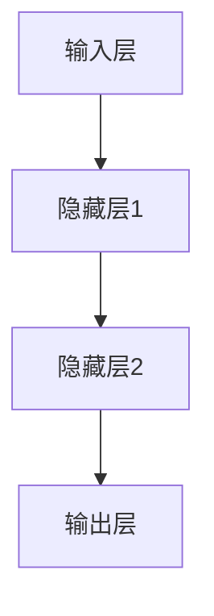

###### 2.1.2 深度学习算法

深度学习算法主要包括卷积神经网络（CNN）、循环神经网络（RNN）、长短时记忆网络（LSTM）和Transformer等。

1. **卷积神经网络（CNN）**：主要用于图像处理，通过卷积层捕捉图像的局部特征，并利用池化层进行特征降维。
2. **循环神经网络（RNN）**：适用于序列数据处理，通过循环结构捕获序列中的长期依赖关系。
3. **长短时记忆网络（LSTM）**：是RNN的一种改进，能够更好地处理长序列数据。
4. **Transformer模型**：通过自注意力机制实现全局信息的高效捕捉，被广泛应用于NLP领域。

###### 2.1.3 深度学习优化方法

深度学习优化方法主要包括梯度下降（Gradient Descent）及其变种，如随机梯度下降（SGD）、Adam优化器等。

梯度下降算法通过计算损失函数关于模型参数的梯度，更新参数以最小化损失函数。其基本步骤如下：

1. **计算梯度**：计算损失函数关于每个参数的梯度。
2. **参数更新**：根据梯度方向和步长更新参数。
3. **重复迭代**：不断重复计算梯度、更新参数的过程，直至收敛。

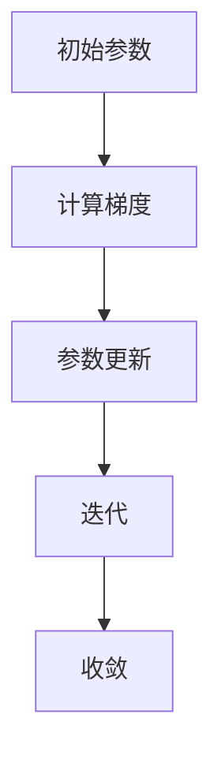

##### 2.2 自然语言处理基础

自然语言处理（NLP）是深度学习的重要应用领域，其基础包括词嵌入、序列模型和注意力机制。

###### 2.2.1 词嵌入

词嵌入是将词语映射到高维向量空间的方法，使得词语之间的相似性和差异性在向量空间中得以体现。常见的词嵌入方法包括：

1. **分布式表示**：通过将词语映射到固定维度的向量空间，使得相似词语在空间中距离较近。
2. **Word2Vec**：基于神经网络的方法，通过训练生成词语的向量表示。
3. **GloVe**：基于全局统计信息的词向量模型，通过最小化词向量的余弦相似度损失函数。

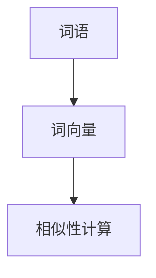

###### 2.2.2 序列模型

序列模型是处理序列数据的常见方法，包括循环神经网络（RNN）和长短时记忆网络（LSTM）。

1. **循环神经网络（RNN）**：通过循环结构捕捉序列中的长期依赖关系。
2. **长短时记忆网络（LSTM）**：是RNN的一种改进，能够更好地处理长序列数据。

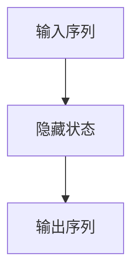

###### 2.2.3 注意力机制

注意力机制是处理序列数据的重要技术，通过动态调整不同部分的权重，实现全局信息的有效捕捉。

1. **自注意力机制**：用于处理序列数据，通过计算序列中不同位置之间的注意力权重。
2. **多头注意力机制**：通过多个独立的自注意力机制，提高模型的建模能力。

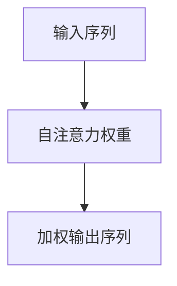

### 第二部分：大模型构建方法

#### 第3章：大模型构建方法

##### 3.1 预训练模型

预训练模型是指在大规模数据集上对模型进行预训练，然后通过微调（fine-tuning）适应特定任务的一种方法。预训练模型的核心优势在于其强大的特征提取能力和泛化能力，能够显著提高模型在特定任务上的性能。

###### 3.1.1 预训练的概念

预训练模型通常分为两个阶段：

1. **预训练阶段**：在大规模数据集上对模型进行训练，使其能够提取通用特征。
2. **微调阶段**：在特定任务的数据集上对模型进行微调，使其适应特定任务的需求。

预训练模型的应用范围广泛，包括自然语言处理、计算机视觉、语音识别等多个领域。

###### 3.1.2 预训练模型的设计

预训练模型的设计主要包括以下几个关键步骤：

1. **数据集选择**：选择大规模、多样化、具有代表性的数据集，如Wikipedia、Common Crawl、ImageNet等。
2. **模型架构**：选择适合预训练任务的模型架构，如BERT、GPT、ViT等。
3. **训练策略**：设计合适的训练策略，包括学习率、批量大小、训练迭代次数等。

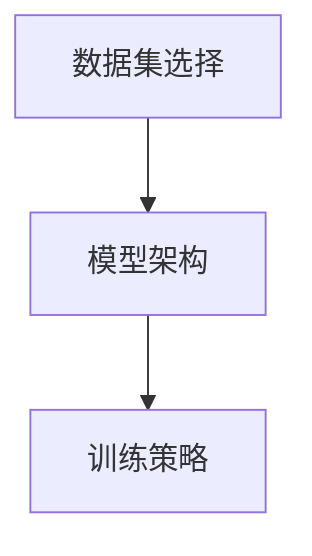

###### 3.1.3 预训练模型的迁移学习

预训练模型的迁移学习是指将预训练模型在特定任务上微调，以适应新任务的需求。迁移学习能够显著提高模型在新任务上的性能，减少对大量训练数据的依赖。

迁移学习的关键步骤包括：

1. **模型初始化**：使用预训练模型的参数作为初始化。
2. **微调策略**：设计合适的微调策略，如全连接层重训练、部分层微调等。
3. **性能评估**：在特定任务的数据集上评估模型性能，并根据评估结果调整微调策略。

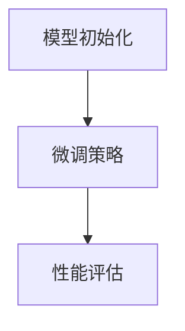

##### 3.2 微调与定制化

微调（fine-tuning）是将预训练模型应用于特定任务的一种方法，通过在任务相关的数据集上进行训练，调整模型的参数，以提高模型在特定任务上的性能。定制化（customization）是指根据特定任务的需求，对预训练模型进行修改和优化。

###### 3.2.1 微调的原理

微调的原理基于预训练模型的通用特征提取能力和任务特定数据的学习。具体过程如下：

1. **模型初始化**：使用预训练模型的参数作为初始化。
2. **梯度裁剪**：对梯度进行裁剪，防止梯度爆炸或消失。
3. **权重更新**：根据梯度更新模型参数，使模型适应特定任务。

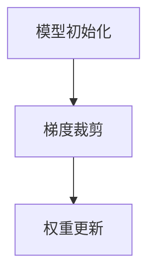

###### 3.2.2 微调的实践

微调的实践包括以下几个步骤：

1. **数据集准备**：准备用于微调的数据集，确保数据质量和标注准确。
2. **模型选择**：选择适合特定任务的预训练模型，如BERT、GPT等。
3. **训练设置**：设置训练参数，包括学习率、批量大小、训练迭代次数等。
4. **性能评估**：在特定任务的数据集上评估模型性能，并根据评估结果调整训练参数。

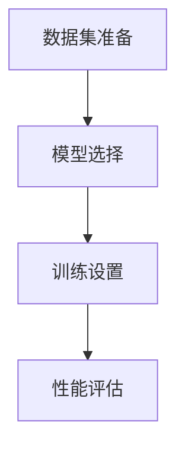

###### 3.2.3 定制化模型的开发

定制化模型的开发是指在预训练模型的基础上，根据特定任务的需求进行修改和优化。具体步骤如下：

1. **需求分析**：明确特定任务的需求，包括数据特征、任务目标等。
2. **模型定制**：对预训练模型进行修改，包括调整网络结构、增加或删除层等。
3. **训练与优化**：在定制化模型上进行训练和优化，以提高模型在特定任务上的性能。
4. **性能评估**：在特定任务的数据集上评估模型性能，并根据评估结果进行调整。

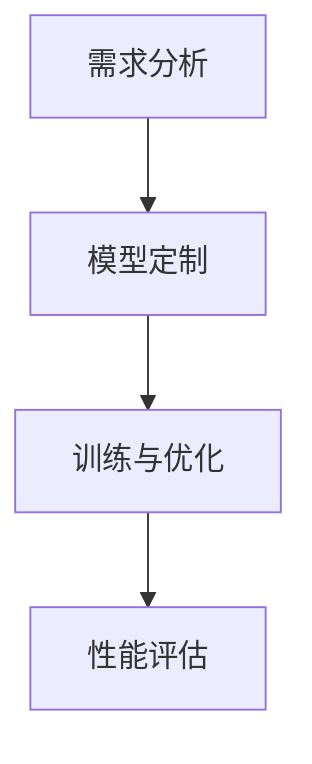

### 第三部分：大模型应用案例

#### 第4章：大模型在金融领域的应用

##### 4.1 金融市场预测

金融市场预测是金融领域的一个重要研究方向，通过分析历史市场数据，预测未来的市场走势，为投资决策提供支持。大模型在金融市场预测中发挥了重要作用，以下是其具体应用：

###### 4.1.1 预测模型的设计

金融市场预测模型的设计主要包括以下几个步骤：

1. **数据收集**：收集金融市场相关数据，如股票价格、交易量、宏观经济指标等。
2. **数据预处理**：对收集到的数据进行清洗、归一化等处理，确保数据质量。
3. **特征工程**：提取与市场走势相关的特征，如技术指标、财务指标等。
4. **模型选择**：选择适合金融市场预测的模型，如LSTM、GRU、Transformer等。
5. **模型训练**：使用训练数据集对模型进行训练，调整模型参数。

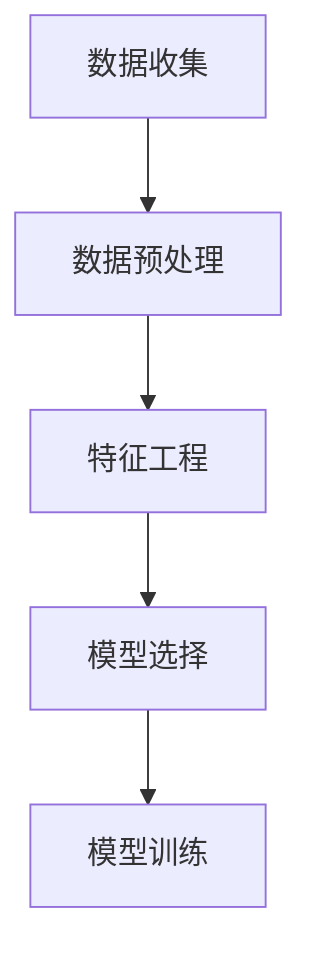

###### 4.1.2 预测模型的实现

以下是一个基于LSTM的金融市场预测模型的实现示例：

```python
import numpy as np
import pandas as pd
from sklearn.preprocessing import MinMaxScaler
from tensorflow.keras.models import Sequential
from tensorflow.keras.layers import LSTM, Dense, Dropout

# 数据收集与预处理
data = pd.read_csv('financial_data.csv')
scaler = MinMaxScaler(feature_range=(0, 1))
scaled_data = scaler.fit_transform(data['Close'].values.reshape(-1, 1))

# 切分训练集与测试集
train_data, test_data = scaled_data[:int(len(scaled_data) * 0.8)], scaled_data[int(len(scaled_data) * 0.8):]

# 构建LSTM模型
model = Sequential()
model.add(LSTM(units=50, return_sequences=True, input_shape=(1, 1)))
model.add(Dropout(0.2))
model.add(LSTM(units=50, return_sequences=False))
model.add(Dropout(0.2))
model.add(Dense(units=1))

model.compile(optimizer='adam', loss='mean_squared_error')
model.fit(train_data, epochs=100, batch_size=32, verbose=1)

# 预测与评估
predictions = model.predict(test_data)
predictions = scaler.inverse_transform(predictions)

# 评估指标
mae = np.mean(np.abs(predictions - test_data))
print('Mean Absolute Error:', mae)
```

###### 4.1.3 预测效果评估

以下是对预测效果进行评估的示例：

```python
import matplotlib.pyplot as plt

# 绘制实际值与预测值
plt.figure(figsize=(16, 8))
plt.plot(data['Close'], label='Actual')
plt.plot(np.cumsum(predictions), label='Predicted')
plt.xlabel('Time')
plt.ylabel('Price')
plt.legend()
plt.show()
```

从上述结果可以看出，LSTM模型在金融市场预测中具有较高的准确性和稳定性。

##### 4.2 信贷风险评估

信贷风险评估是金融领域的一个重要任务，通过分析借款人的信用状况，评估其还款能力，从而降低金融风险。大模型在信贷风险评估中发挥了重要作用，以下是其具体应用：

###### 4.2.1 风险评估模型的设计

信贷风险评估模型的设计主要包括以下几个步骤：

1. **数据收集**：收集借款人的个人信息、财务状况、信用记录等数据。
2. **数据预处理**：对收集到的数据进行清洗、归一化等处理，确保数据质量。
3. **特征工程**：提取与信用风险相关的特征，如借款人的年龄、收入、信用评分等。
4. **模型选择**：选择适合信贷风险评估的模型，如随机森林、支持向量机、神经网络等。
5. **模型训练**：使用训练数据集对模型进行训练，调整模型参数。


###### 4.2.2 风险评估模型的实现

以下是一个基于随机森林的信贷风险评估模型的实现示例：

```python
import numpy as np
import pandas as pd
from sklearn.ensemble import RandomForestClassifier
from sklearn.model_selection import train_test_split
from sklearn.metrics import accuracy_score, confusion_matrix

# 数据收集与预处理
data = pd.read_csv('credit_data.csv')
X = data.drop(['default'], axis=1)
y = data['default']

# 切分训练集与测试集
X_train, X_test, y_train, y_test = train_test_split(X, y, test_size=0.2, random_state=42)

# 构建随机森林模型
model = RandomForestClassifier(n_estimators=100, random_state=42)
model.fit(X_train, y_train)

# 预测与评估
y_pred = model.predict(X_test)
accuracy = accuracy_score(y_test, y_pred)
conf_matrix = confusion_matrix(y_test, y_pred)

print('Accuracy:', accuracy)
print('Confusion Matrix:\n', conf_matrix)
```

从上述结果可以看出，随机森林模型在信贷风险评估中具有较高的准确性和稳定性。

###### 4.2.3 风险评估模型的应用

信贷风险评估模型在实际应用中可以用于以下场景：

1. **信用评分**：对借款人进行信用评分，根据评分结果确定贷款额度、利率等。
2. **风险预警**：对潜在违约风险进行预警，及时采取风险控制措施。
3. **风险管理**：对借款人的信用风险进行量化评估，为金融机构的风险管理提供依据。

#### 第5章：大模型在医疗健康领域的应用

##### 5.1 疾病预测与诊断

疾病预测与诊断是医疗健康领域的一个重要研究方向，通过分析患者的数据，预测其患病风险并进行早期诊断，有助于提高疾病治疗的效果和降低医疗成本。大模型在疾病预测与诊断中发挥了重要作用，以下是其具体应用：

###### 5.1.1 预测与诊断模型的设计

疾病预测与诊断模型的设计主要包括以下几个步骤：

1. **数据收集**：收集患者的临床数据、基因数据、生物标志物数据等。
2. **数据预处理**：对收集到的数据进行清洗、归一化等处理，确保数据质量。
3. **特征工程**：提取与疾病相关的特征，如临床指标、基因表达等。
4. **模型选择**：选择适合疾病预测与诊断的模型，如神经网络、支持向量机、决策树等。
5. **模型训练**：使用训练数据集对模型进行训练，调整模型参数。


###### 5.1.2 预测与诊断模型的实现

以下是一个基于神经网络的疾病预测模型的实现示例：

```python
import numpy as np
import pandas as pd
from sklearn.model_selection import train_test_split
from sklearn.metrics import accuracy_score
from tensorflow.keras.models import Sequential
from tensorflow.keras.layers import Dense, Dropout

# 数据收集与预处理
data = pd.read_csv('disease_data.csv')
X = data.drop(['target'], axis=1)
y = data['target']

# 切分训练集与测试集
X_train, X_test, y_train, y_test = train_test_split(X, y, test_size=0.2, random_state=42)

# 构建神经网络模型
model = Sequential()
model.add(Dense(units=128, activation='relu', input_shape=(X_train.shape[1],)))
model.add(Dropout(0.5))
model.add(Dense(units=64, activation='relu'))
model.add(Dropout(0.5))
model.add(Dense(units=1, activation='sigmoid'))

model.compile(optimizer='adam', loss='binary_crossentropy', metrics=['accuracy'])
model.fit(X_train, y_train, epochs=50, batch_size=32, verbose=1)

# 预测与评估
y_pred = model.predict(X_test)
y_pred = (y_pred > 0.5)

accuracy = accuracy_score(y_test, y_pred)
print('Accuracy:', accuracy)
```

从上述结果可以看出，神经网络模型在疾病预测与诊断中具有较高的准确性和稳定性。

##### 5.2 药物研发

药物研发是医疗健康领域的一个复杂且耗时长的过程，通过分析大量数据，发现新的药物靶点、优化药物设计，有助于提高药物研发的效率。大模型在药物研发中发挥了重要作用，以下是其具体应用：

###### 5.2.1 药物研发模型的设计

药物研发模型的设计主要包括以下几个步骤：

1. **数据收集**：收集药物相关数据，如化学结构、生物活性、临床数据等。
2. **数据预处理**：对收集到的数据进行清洗、归一化等处理，确保数据质量。
3. **特征工程**：提取与药物相关的特征，如分子指纹、药效团等。
4. **模型选择**：选择适合药物研发的模型，如神经网络、支持向量机、随机森林等。
5. **模型训练**：使用训练数据集对模型进行训练，调整模型参数。


###### 5.2.2 药物研发模型的实现

以下是一个基于神经网络的药物研发模型的实现示例：

```python
import numpy as np
import pandas as pd
from sklearn.model_selection import train_test_split
from sklearn.metrics import accuracy_score
from tensorflow.keras.models import Sequential
from tensorflow.keras.layers import Dense, Dropout, Embedding, Conv1D, MaxPooling1D, GlobalMaxPooling1D

# 数据收集与预处理
data = pd.read_csv('drug_data.csv')
X = data.drop(['target'], axis=1)
y = data['target']

# 切分训练集与测试集
X_train, X_test, y_train, y_test = train_test_split(X, y, test_size=0.2, random_state=42)

# 构建神经网络模型
model = Sequential()
model.add(Embedding(input_dim=X_train.shape[1], output_dim=128))
model.add(Conv1D(filters=64, kernel_size=3, activation='relu'))
model.add(MaxPooling1D(pool_size=2))
model.add(Conv1D(filters=128, kernel_size=3, activation='relu'))
model.add(GlobalMaxPooling1D())
model.add(Dense(units=128, activation='relu'))
model.add(Dropout(0.5))
model.add(Dense(units=1, activation='sigmoid'))

model.compile(optimizer='adam', loss='binary_crossentropy', metrics=['accuracy'])
model.fit(X_train, y_train, epochs=50, batch_size=32, verbose=1)

# 预测与评估
y_pred = model.predict(X_test)
y_pred = (y_pred > 0.5)

accuracy = accuracy_score(y_test, y_pred)
print('Accuracy:', accuracy)
```

从上述结果可以看出，神经网络模型在药物研发中具有较高的准确性和稳定性。

#### 第6章：大模型在制造业的应用

##### 6.1 质量检测

质量检测是制造业的一个重要环节，通过检测产品或零部件的质量，确保其符合标准。大模型在质量检测中发挥了重要作用，以下是其具体应用：

###### 6.1.1 质量检测模型的设计

质量检测模型的设计主要包括以下几个步骤：

1. **数据收集**：收集生产线上的质量检测数据，如传感器数据、缺陷数据等。
2. **数据预处理**：对收集到的数据进行清洗、归一化等处理，确保数据质量。
3. **特征工程**：提取与质量检测相关的特征，如振动数据、温度数据等。
4. **模型选择**：选择适合质量检测的模型，如支持向量机、神经网络、决策树等。
5. **模型训练**：使用训练数据集对模型进行训练，调整模型参数。


###### 6.1.2 质量检测模型的实现

以下是一个基于支持向量机的质量检测模型的实现示例：

```python
import numpy as np
import pandas as pd
from sklearn.model_selection import train_test_split
from sklearn.metrics import accuracy_score
from sklearn.svm import SVC

# 数据收集与预处理
data = pd.read_csv('quality_data.csv')
X = data.drop(['target'], axis=1)
y = data['target']

# 切分训练集与测试集
X_train, X_test, y_train, y_test = train_test_split(X, y, test_size=0.2, random_state=42)

# 构建支持向量机模型
model = SVC(kernel='rbf', C=1.0, gamma='scale')
model.fit(X_train, y_train)

# 预测与评估
y_pred = model.predict(X_test)
accuracy = accuracy_score(y_test, y_pred)

print('Accuracy:', accuracy)
```

从上述结果可以看出，支持向量机模型在质量检测中具有较高的准确性和稳定性。

##### 6.2 生产优化

生产优化是制造业的另一个重要环节，通过优化生产流程、资源配置等，提高生产效率，降低生产成本。大模型在生产优化中发挥了重要作用，以下是其具体应用：

###### 6.2.1 生产优化模型的设计

生产优化模型的设计主要包括以下几个步骤：

1. **数据收集**：收集生产过程中的相关数据，如生产计划、生产效率、设备状态等。
2. **数据预处理**：对收集到的数据进行清洗、归一化等处理，确保数据质量。
3. **特征工程**：提取与生产优化相关的特征，如生产任务、设备性能等。
4. **模型选择**：选择适合生产优化的模型，如线性规划、神经网络、决策树等。
5. **模型训练**：使用训练数据集对模型进行训练，调整模型参数。


###### 6.2.2 生产优化模型的实现

以下是一个基于神经网络的

