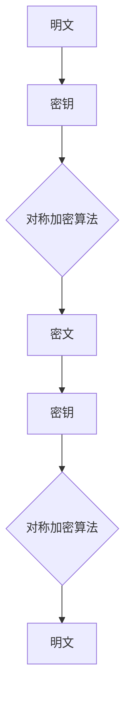
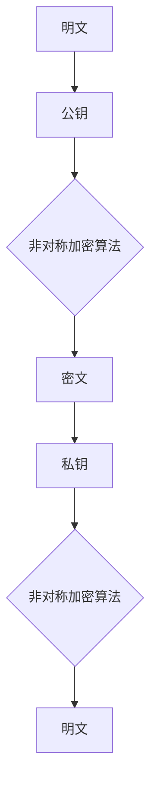
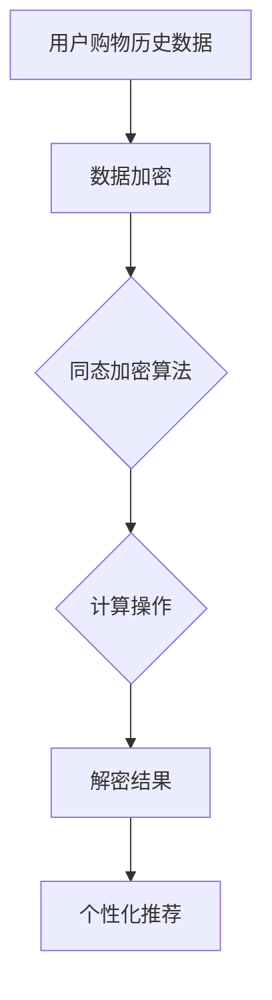

                 

# 《大模型推荐场景中的数据安全与隐私保护策略》

## 关键词
大数据，推荐系统，大模型，数据安全，隐私保护，加密，同态加密，差分隐私，联邦学习

## 摘要
随着大数据和人工智能技术的发展，推荐系统在各个领域得到了广泛应用。然而，大模型在推荐系统中的广泛应用也带来了数据安全和隐私保护的新挑战。本文从数据安全与隐私保护的基本概念出发，详细探讨了在推荐场景中应对这些挑战的策略和技术手段。文章通过核心概念与联系、核心算法原理讲解、项目实战等多个角度，深入分析了数据加密、同态加密、差分隐私等技术在推荐系统中的应用，并结合实际案例，提出了有效的数据安全与隐私保护方案。

----------------------------------------------------------------

## 第一部分：背景与概念

### 第1章：大数据与推荐系统概述

#### 1.1 大数据与推荐系统的发展历程

##### 1.1.1 大数据的基本概念

大数据（Big Data）是指无法使用常规软件工具在合理时间内捕捉、管理和处理的数据集合。它具有“4V”特点：数据体量大（Volume）、数据类型繁多（Variety）、价值密度低（Value）、处理速度快（Velocity）[1]。大数据技术的核心在于数据的存储、处理和分析，从而为各个行业提供深度洞察和决策支持。

##### 1.1.2 推荐系统的定义与作用

推荐系统（Recommendation System）是一种能够根据用户的历史行为、兴趣、偏好等，向用户推荐符合其需求的商品、服务或信息的人工智能系统。推荐系统在电子商务、新闻推送、社交媒体等领域中发挥着重要作用，显著提升了用户体验和业务转化率。

##### 1.1.3 大数据在推荐系统中的应用

大数据技术的兴起为推荐系统带来了新的机遇。通过大规模数据收集和深度学习算法，推荐系统能够更准确地预测用户需求，提供个性化推荐。例如，在电子商务领域，推荐系统可以通过分析用户的购物历史、浏览记录等数据，为用户提供个性化的商品推荐。

#### 1.2 大模型在推荐系统中的应用

##### 1.2.1 大模型的定义与特点

大模型（Large Model）通常指的是参数数量巨大的深度学习模型，如GPT-3、BERT等。这些模型通过在海量数据上训练，能够捕捉复杂的语义关系和用户行为模式，从而实现更高的推荐精度。

##### 1.2.2 大模型在推荐系统中的优势

大模型在推荐系统中的优势主要体现在以下方面：

1. **更高的推荐精度**：大模型能够更好地捕捉用户的兴趣和偏好，提供更加准确的个性化推荐。
2. **更广泛的知识覆盖**：大模型拥有海量的参数，可以存储和处理更多样的信息，从而提供更全面的推荐内容。
3. **更强大的泛化能力**：大模型在训练过程中接触了广泛的数据，能够更好地适应不同的场景和用户群体。

##### 1.2.3 大模型面临的数据安全与隐私挑战

尽管大模型在推荐系统中具有显著优势，但其应用也带来了新的数据安全和隐私保护挑战：

1. **数据泄露风险**：大模型需要处理大量的用户数据，一旦数据泄露，可能对用户隐私造成严重损害。
2. **模型可解释性差**：大模型的复杂性和黑盒特性使其难以解释，增加了数据滥用的风险。
3. **隐私保护法规合规性**：随着数据隐私法规的加强，大模型的应用需要确保符合相关的法规要求，如GDPR和CCPA等。

### 第2章：数据安全与隐私保护的基本概念

#### 2.1 数据安全的概念与重要性

##### 2.1.1 数据安全的定义

数据安全（Data Security）是指保护数据免受未授权访问、使用、披露、破坏、修改或破坏的措施和过程。数据安全包括数据的机密性、完整性和可用性等方面。

##### 2.1.2 数据安全的分类

数据安全可以分为以下几类：

1. **物理安全**：保护存储数据的物理设备，如服务器、存储设备等，防止物理损坏或被盗。
2. **网络安全**：保护网络和系统不受外部攻击，如DDoS攻击、网络窃听等。
3. **应用安全**：确保应用程序的安全，如防止SQL注入、跨站脚本攻击等。
4. **数据备份与恢复**：定期备份数据，以便在数据丢失或损坏时能够恢复。

##### 2.1.3 数据安全的重要性

数据安全对于企业和个人都至关重要。数据泄露可能导致以下后果：

1. **经济损失**：数据泄露可能导致业务中断、客户流失和诉讼风险。
2. **声誉损失**：数据泄露可能损害企业声誉，影响用户信任。
3. **法律风险**：违反数据保护法规可能导致高额罚款和法律责任。

#### 2.2 隐私保护的基本概念与法规

##### 2.2.1 隐私保护的定义

隐私保护（Privacy Protection）是指保护个人信息的保密性、完整性和可用性，防止未经授权的访问和使用。隐私保护旨在保护个人信息不被滥用，确保个人数据的合法性和合理性。

##### 2.2.2 隐私保护的相关法规

全球范围内，多个国家和地区制定了数据隐私保护法规，如：

1. **欧盟通用数据保护条例（GDPR）**：规定了个人数据的处理、存储和传输要求，强调用户数据权利和数据主体的同意。
2. **美国加州消费者隐私法案（CCPA）**：规定了企业收集、使用和共享消费者个人信息的要求。
3. **中国个人信息保护法（PIPL）**：规定了个人信息处理的基本原则和要求。

##### 2.2.3 隐私保护的核心原则

隐私保护的核心原则包括：

1. **合法性原则**：个人信息处理必须基于合法、正当、必要的原则。
2. **目的明确原则**：个人信息处理必须明确目的，并限制在目的范围内使用。
3. **最小化原则**：仅收集和处理为实现目的所必需的个人信息。
4. **安全保护原则**：采取必要的技术和管理措施，保护个人信息的安全。
5. **用户参与原则**：尊重用户对个人信息的知情权和参与权，允许用户查询、更正和删除个人信息。

在接下来的章节中，我们将详细探讨数据加密、同态加密、差分隐私等技术在推荐系统中的应用，以及如何实现有效的数据安全与隐私保护策略。

----------------------------------------------------------------

### 第3章：数据加密与同态加密

#### 3.1 数据加密的基本原理

##### 3.1.1 对称加密与非对称加密

数据加密是保障数据安全的重要手段之一，其核心思想是将明文数据转换为难以解读的密文。根据加密和解密过程中使用的密钥类型，数据加密可以分为对称加密和非对称加密。

**对称加密**：

对称加密使用相同的密钥进行加密和解密，常见的对称加密算法有AES（Advanced Encryption Standard）和DES（Data Encryption Standard）。对称加密的优点是加密速度快，计算效率高，但其缺点是密钥管理复杂，无法实现安全的密钥分发。



**非对称加密**：

非对称加密使用一对密钥（公钥和私钥）进行加密和解密，常见的非对称加密算法有RSA（Rivest-Shamir-Adleman）和ECC（Elliptic Curve Cryptography）。非对称加密的优点是解决了密钥分发问题，但其缺点是加密速度相对较慢。



##### 3.1.2 数据加密在数据安全中的应用

数据加密在数据安全中发挥着重要作用，以下是一些典型的应用场景：

1. **数据传输安全**：在数据传输过程中，使用加密技术可以保护数据不被窃听和篡改。常见的应用包括HTTPS协议、VPN（Virtual Private Network）等。
2. **数据存储安全**：在数据存储过程中，使用加密技术可以保护数据不被未授权访问。常见的应用包括数据库加密、文件加密等。
3. **身份认证**：在身份认证过程中，使用加密技术可以确保通信双方的身份验证。常见的应用包括SSL/TLS协议、数字签名等。

#### 3.2 同态加密的技术原理与应用

**同态加密**（Homomorphic Encryption）是一种允许在加密数据上进行计算而不会破坏数据隐私的加密技术。同态加密的核心思想是让加密数据保持不变，即使对其执行计算操作，也能得到正确的计算结果。

**同态加密的定义与特性**：

同态加密具有以下特性：

1. **计算保持性**：对加密数据执行计算操作，结果仍然是加密的，且具有正确的计算结果。
2. **可扩展性**：同态加密可以处理任意大小的数据，不受数据大小限制。
3. **安全性**：同态加密确保加密数据在传输和存储过程中的安全性。

**同态加密在推荐系统中的应用**：

同态加密在推荐系统中的应用具有很大潜力，以下是一些典型的应用场景：

1. **用户行为数据分析**：同态加密可以保护用户的隐私，允许在加密的用户行为数据上进行分析和计算，从而提取用户的兴趣和偏好。
2. **个性化推荐**：同态加密可以保护用户数据的隐私，实现基于用户隐私数据的个性化推荐。
3. **隐私保护的数据挖掘**：同态加密可以保护数据挖掘过程中的隐私，确保数据挖掘结果的准确性。

**同态加密的应用示例**：

假设有一个推荐系统，需要分析用户的购物历史数据来生成个性化推荐。使用同态加密技术的步骤如下：

1. **数据加密**：将用户的购物历史数据加密，确保数据在传输和存储过程中的安全性。
2. **数据处理**：在加密的数据上进行计算操作，如计算用户的平均购物金额、最常购买的物品等。
3. **数据解密**：将加密的数据解密，得到计算结果，从而生成个性化推荐。



同态加密虽然具有强大的隐私保护能力，但也存在一些挑战，如加密和解密过程的计算成本较高，限制了其在大规模数据场景中的应用。因此，在实际应用中，需要权衡隐私保护与计算性能之间的关系。

----------------------------------------------------------------

### 第4章：差分隐私与隐私机制

#### 4.1 差分隐私的概念与原理

**差分隐私**（Differential Privacy）是一种用于保护数据隐私的数学框架，它通过对数据进行加噪处理，使得隐私保护与数据分析之间取得平衡。差分隐私的核心思想是，即使在数据集中删除或添加一条记录，输出结果的变化也不会对单个记录的存在或缺失产生太大影响。

**差分隐私的定义**：

差分隐私可以用以下数学定义表示：

对于任意两个数据集 $D_1$ 和 $D_2$，如果 $D_1$ 和 $D_2$ 之间只有一条记录的差异，即 $D_1 \setminus D_2$ 或 $D_2 \setminus D_1$ 只有一条记录，那么在差分隐私保障下的数据分析结果对于这两个数据集应该是相似的。

**差分隐私的核心原理**：

差分隐私的核心原理是通过添加噪声来保护数据的隐私。具体来说，差分隐私算法在计算过程中引入了一个参数 $\epsilon$（隐私预算），用于控制噪声的强度。当 $\epsilon$ 越大时，隐私保护越强，但数据分析的准确性可能降低；反之，当 $\epsilon$ 越小时，数据分析的准确性可能提高，但隐私保护可能减弱。

**差分隐私的应用场景**：

差分隐私在以下场景中具有广泛的应用：

1. **数据发布**：通过差分隐私技术，数据发布者可以在保护数据隐私的同时，提供有用的数据信息，如统计报告、排行榜等。
2. **机器学习**：差分隐私可以用于训练和评估机器学习模型，确保模型的隐私保护，同时保持模型的有效性。
3. **推荐系统**：差分隐私可以用于保护用户数据的隐私，在生成个性化推荐时，确保用户数据不会被泄露。

**差分隐私的数学模型**：

差分隐私可以使用拉普拉斯机制（Laplace Mechanism）或高斯机制（Gaussian Mechanism）来实现。以下是一个基于拉普拉斯机制的差分隐私示例：

假设我们有一个数据集 $D$，要计算数据集中某个属性的频率。使用拉普拉斯机制，我们可以对频率计算结果添加拉普拉斯噪声：

$$ output = frequency(D) + \text{LaplaceNoise}(\epsilon) $$

其中，$\epsilon$ 是隐私预算，$\text{LaplaceNoise}(\epsilon)$ 是拉普拉斯噪声，其概率密度函数为：

$$ \text{LaplaceNoise}(\epsilon) \sim \frac{1}{2\epsilon}e^{-\frac{|x - \mu|}{\epsilon}} $$

其中，$\mu$ 是真实频率的估计值。

**差分隐私的优势**：

差分隐私具有以下优势：

1. **严格的隐私保护**：差分隐私可以确保数据分析结果不会泄露单个记录的信息。
2. **灵活的隐私预算**：通过调整隐私预算 $\epsilon$，可以灵活控制隐私保护与数据分析之间的平衡。
3. **广泛适用性**：差分隐私可以应用于多种数据分析任务，如统计、机器学习和推荐系统等。

**差分隐私的挑战**：

尽管差分隐私具有强大的隐私保护能力，但也存在一些挑战：

1. **计算成本**：在引入噪声的过程中，计算成本可能显著增加，影响数据分析的效率。
2. **精度损失**：过大的噪声可能导致数据分析结果的精度降低。
3. **适应性**：不同场景下，如何选择合适的隐私预算和噪声机制，需要进一步研究。

#### 4.2 其他隐私机制介绍

除了差分隐私，还有一些其他隐私机制，如加密同态查询、集合隐私和隐私计算框架，这些机制也在推荐系统中得到了广泛应用。

**加密同态查询**：

加密同态查询（Homomorphic Querying）是一种在加密数据上进行计算的技术。与同态加密不同，加密同态查询允许在加密数据上进行查询操作，而不需要解密数据。加密同态查询可以应用于推荐系统，例如，在保护用户隐私的同时，允许基于用户加密数据的查询和计算。

**集合隐私**：

集合隐私（Set Privacy）是一种针对集合操作的隐私保护技术。集合隐私的目标是保护集合中元素的信息，即使在集合上进行操作后，也无法推断出单个元素的信息。集合隐私可以应用于推荐系统，例如，在生成推荐列表时，保护用户数据中的敏感信息。

**隐私计算框架**：

隐私计算框架（Privacy Computing Framework）是一种综合性的隐私保护解决方案，它包括加密技术、差分隐私、联邦学习等多种隐私保护机制。隐私计算框架可以应用于推荐系统，实现数据的隐私保护和分析。

**隐私计算框架的优势**：

隐私计算框架具有以下优势：

1. **综合性**：隐私计算框架集成了多种隐私保护机制，可以提供全面的隐私保护解决方案。
2. **灵活性**：隐私计算框架可以根据具体应用场景，灵活选择和组合不同的隐私保护机制。
3. **高效性**：隐私计算框架通过优化和并行计算，可以提高隐私保护的效率和性能。

**隐私计算框架的挑战**：

尽管隐私计算框架具有强大的隐私保护能力，但也存在一些挑战：

1. **复杂性**：隐私计算框架涉及多种隐私保护机制，设计和实现复杂。
2. **性能开销**：隐私计算框架可能会引入一定的性能开销，影响系统的性能。
3. **适应性**：如何在不同应用场景下，灵活选择和组合隐私保护机制，需要进一步研究。

通过差分隐私、加密同态查询、集合隐私和隐私计算框架等隐私机制，推荐系统可以在保护用户隐私的同时，实现有效的数据分析和应用。

----------------------------------------------------------------

### 第5章：联邦学习与分布式隐私保护

#### 5.1 联邦学习的概念与原理

**联邦学习**（Federal Learning）是一种分布式机器学习框架，它允许多个参与者（通常是数据拥有者）共同训练一个全局模型，而无需共享他们的本地数据。联邦学习通过分布式计算和协同学习的方式，实现数据隐私保护和协同建模。

**联邦学习的定义**：

联邦学习是一种分布式机器学习框架，它允许多个参与者共同训练一个全局模型，而无需共享他们的本地数据。联邦学习通过分布式计算和协同学习的方式，实现数据隐私保护和协同建模。

**联邦学习的优势**：

联邦学习具有以下优势：

1. **数据隐私保护**：联邦学习在本地设备上训练模型，不涉及数据传输，从而保护用户数据的隐私。
2. **数据多样性**：联邦学习可以聚合来自不同参与者的数据，提高模型的泛化能力和鲁棒性。
3. **低延迟**：联邦学习可以在本地设备上进行模型训练，降低数据传输和计算延迟。

**联邦学习的核心组件**：

联邦学习包括以下核心组件：

1. **参与方**：参与方可以是个人设备、服务器或云计算平台。每个参与方都拥有本地数据，并参与模型训练。
2. **模型**：全局模型用于聚合参与方的本地模型，实现协同学习。
3. **通信协议**：通信协议用于参与方之间的数据传输和模型更新。
4. **优化算法**：优化算法用于训练全局模型，提高模型的性能和收敛速度。

**联邦学习的流程**：

联邦学习的典型流程如下：

1. **初始化**：全局模型在每个参与方上初始化本地模型。
2. **本地训练**：每个参与方在本地设备上使用本地数据进行模型训练。
3. **模型更新**：参与方将本地模型更新上传到全局模型。
4. **全局聚合**：全局模型聚合参与方的本地模型更新，生成新的全局模型。
5. **模型反馈**：全局模型反馈给参与方，用于本地模型更新。

**联邦学习的挑战**：

联邦学习在实现数据隐私保护和协同建模的过程中，面临以下挑战：

1. **通信开销**：联邦学习涉及参与方之间的模型更新和数据传输，通信开销可能较大。
2. **模型不一致**：不同参与方的本地模型可能存在差异，影响全局模型的性能和稳定性。
3. **恶意参与者**：联邦学习中的恶意参与者可能故意提供错误的数据或模型更新，影响全局模型的训练效果。

#### 5.2 分布式隐私保护机制

**分布式隐私保护机制**（Distributed Privacy Protection Mechanisms）是一种用于保护分布式数据隐私的机制，它包括差分隐私、同态加密、隐私计算框架等。

**分布式隐私保护的基本流程**：

分布式隐私保护的基本流程如下：

1. **数据加密**：将本地数据进行加密，确保数据在传输和存储过程中的安全性。
2. **差分隐私**：在数据处理过程中，应用差分隐私机制，保护数据隐私。
3. **模型训练**：使用加密数据和差分隐私机制，在分布式环境中进行模型训练。
4. **模型更新**：将本地模型更新上传到全局模型，同时保护模型更新的隐私。
5. **全局模型聚合**：全局模型聚合参与方的本地模型更新，生成新的全局模型。

**分布式隐私保护的核心技术**：

分布式隐私保护的核心技术包括：

1. **加密技术**：使用加密技术保护本地数据和模型更新，确保数据在传输和存储过程中的安全性。
2. **差分隐私机制**：在数据处理和模型训练过程中，应用差分隐私机制，保护数据隐私。
3. **隐私计算框架**：集成多种隐私保护机制，实现数据隐私保护和协同建模。

**分布式隐私保护在推荐系统中的应用**：

分布式隐私保护在推荐系统中的应用如下：

1. **用户隐私保护**：通过分布式隐私保护机制，保护用户的隐私数据，确保用户数据的机密性。
2. **个性化推荐**：在保护用户隐私的同时，基于用户隐私数据生成个性化推荐。
3. **数据聚合**：聚合来自不同参与者的用户数据，提高推荐系统的多样性和鲁棒性。

**分布式隐私保护的挑战**：

分布式隐私保护在推荐系统中面临以下挑战：

1. **通信开销**：分布式隐私保护涉及数据加密、差分隐私和模型更新等操作，通信开销可能较大。
2. **性能优化**：分布式隐私保护引入了一定的性能开销，需要优化算法和通信协议，提高系统性能。
3. **隐私预算管理**：在分布式环境中，如何合理管理隐私预算，确保数据隐私保护的同时，保持模型性能和准确性。

通过联邦学习和分布式隐私保护机制，推荐系统可以在保护用户隐私的同时，实现有效的数据分析和应用。

----------------------------------------------------------------

### 第6章：案例研究与最佳实践

#### 6.1 案例研究1：某电商平台的隐私保护实践

**案例背景**：

某电商平台在个性化推荐系统中，面临着数据安全和隐私保护的重要挑战。为了保护用户的隐私，该电商平台决定采用分布式隐私保护机制，包括差分隐私、加密技术和联邦学习等方法。

**实施措施与效果分析**：

1. **数据加密**：

   - **数据传输加密**：在用户数据传输过程中，使用HTTPS协议进行加密，确保数据在传输过程中的安全性。
   - **数据存储加密**：将用户数据存储在加密数据库中，使用AES加密算法对数据加密存储，确保数据在存储过程中的安全性。

2. **差分隐私**：

   - **数据处理**：在生成个性化推荐时，应用差分隐私机制，对用户行为数据进行加噪处理，确保推荐结果不会泄露用户隐私。
   - **隐私预算管理**：根据数据规模和推荐需求，合理设置差分隐私的隐私预算，平衡隐私保护和推荐效果。

3. **联邦学习**：

   - **本地模型训练**：在用户设备上，使用本地数据进行模型训练，不涉及数据传输，保护用户隐私。
   - **模型更新**：参与方将本地模型更新上传到全局模型，使用加密技术和隐私计算框架，确保模型更新的安全性。
   - **全局模型聚合**：全局模型聚合参与方的本地模型更新，生成新的全局模型，提高推荐系统的多样性和准确性。

**效果分析**：

通过分布式隐私保护机制的实践，某电商平台实现了以下效果：

1. **用户隐私保护**：通过数据加密和差分隐私机制，有效保护了用户的隐私数据，降低了数据泄露风险。
2. **个性化推荐效果**：在保护用户隐私的同时，基于用户隐私数据生成的个性化推荐效果得到了显著提升。
3. **数据多样性**：通过联邦学习，聚合了来自不同参与方的用户数据，提高了推荐系统的多样性和鲁棒性。

#### 6.2 案例研究2：某金融领域的联邦学习实践

**案例背景**：

某金融公司希望利用联邦学习技术，实现风险预测模型的协同训练和优化。然而，金融领域的数据敏感性和隐私要求较高，传统的数据共享方式可能带来数据泄露和隐私风险。

**实施措施与效果分析**：

1. **联邦学习框架搭建**：

   - **参与方选择**：选择具有代表性的金融公司作为参与方，确保模型训练的多样性和代表性。
   - **模型初始化**：全局模型在参与方上初始化本地模型，确保模型训练的起点一致性。
   - **模型更新**：参与方将本地模型更新上传到全局模型，使用加密技术和隐私计算框架，确保模型更新的安全性。

2. **隐私保护机制**：

   - **差分隐私**：在数据处理和模型训练过程中，应用差分隐私机制，保护数据隐私。
   - **加密同态查询**：在数据查询和计算过程中，使用加密同态查询技术，保护用户隐私。
   - **隐私预算管理**：根据数据规模和风险预测需求，合理设置差分隐私的隐私预算，平衡隐私保护和模型性能。

**效果分析**：

通过联邦学习和隐私保护机制的实践，某金融公司实现了以下效果：

1. **风险预测准确性**：通过联邦学习和协同训练，风险预测模型的准确性和鲁棒性得到了显著提升。
2. **数据隐私保护**：通过加密技术和隐私计算框架，有效保护了用户数据的隐私，降低了数据泄露风险。
3. **协同建模效果**：通过联邦学习，实现了参与方之间的协同建模，提高了模型的多样性和鲁棒性。

通过以上案例研究，我们可以看到，在推荐场景中，通过分布式隐私保护机制和联邦学习技术，可以有效地保护用户隐私，同时实现有效的数据分析和应用。

----------------------------------------------------------------

### 第7章：未来展望与挑战

#### 7.1 大模型推荐场景中的数据安全与隐私保护趋势

随着大数据和人工智能技术的不断发展，大模型在推荐系统中的应用越来越广泛。然而，这也带来了新的数据安全与隐私保护挑战。在未来，以下趋势值得关注：

1. **隐私计算框架的普及**：隐私计算框架如联邦学习、差分隐私等将在更多应用场景中得到普及，提供更加灵活和高效的隐私保护解决方案。
2. **多方安全计算**：多方安全计算（MPC）等技术将进一步发展，实现多个参与方在加密数据上进行协同计算，确保数据隐私和安全。
3. **隐私预算管理**：隐私预算管理将成为关键，如何合理设置和调整隐私预算，以平衡隐私保护和模型性能，需要进一步研究。
4. **数据隐私法规的完善**：随着数据隐私法规的不断完善，企业和组织需要更加重视数据隐私保护，确保符合相关法规要求。

#### 7.2 未来面临的挑战

尽管隐私保护技术在不断发展，但在大模型推荐场景中，仍然面临以下挑战：

1. **计算性能**：隐私保护技术如加密和差分隐私通常引入了额外的计算开销，如何优化算法和计算效率，是当前的一个重要挑战。
2. **模型可解释性**：大模型通常具有高度的非线性复杂度，难以解释和验证，如何保证模型的可解释性和透明性，是一个亟待解决的问题。
3. **隐私保护与模型性能的平衡**：在隐私保护与模型性能之间找到平衡点，需要深入研究如何调整隐私预算和算法参数，以实现最佳效果。
4. **数据质量**：隐私保护技术依赖于高质量的数据，但在实际应用中，数据质量往往受到各种因素的影响，如何处理和提升数据质量，是隐私保护的重要问题。

#### 7.3 应对策略与建议

为了应对未来在大模型推荐场景中的数据安全与隐私保护挑战，可以采取以下策略和建议：

1. **技术创新**：继续研究和发展新型隐私保护技术，如多方安全计算、联邦学习等，提高隐私保护能力和计算效率。
2. **法规合规**：积极关注和遵守相关数据隐私法规，确保技术应用符合法规要求，降低法律风险。
3. **隐私预算管理**：合理设置和调整隐私预算，通过实验和评估，找到隐私保护与模型性能的最佳平衡点。
4. **数据质量管理**：加强数据质量管理，确保数据质量和准确性，提高隐私保护技术的有效性。
5. **协作与共享**：鼓励不同组织和研究机构之间的合作与共享，共同推动隐私保护技术的发展和应用。

通过技术创新、法规合规、隐私预算管理、数据质量管理以及协作与共享，我们可以更好地应对大模型推荐场景中的数据安全与隐私保护挑战，实现安全、高效的推荐系统。

----------------------------------------------------------------

### 附录A：常用数据安全与隐私保护工具

**附录A.1 工具1：DataX**

**简介**：DataX是一个开源的数据加密工具，支持多种加密算法，如AES、RSA等。DataX提供了丰富的API接口，方便在应用程序中集成加密功能。

**使用方法**：

1. **安装**：通过包管理器如pip安装DataX：
   ```bash
   pip install datax
   ```

2. **加密**：使用DataX进行数据加密，例如使用AES加密算法：
   ```python
   from datax.crypto import AES
   
   key = b'my-secret-key'
   cipher = AES.new(key, AES.MODE_CBC)
   ciphertext = cipher.encrypt(b'my sensitive data')
   print(ciphertext)
   ```

3. **解密**：使用DataX进行数据解密：
   ```python
   from datax.crypto import AES
   
   key = b'my-secret-key'
   cipher = AES.new(key, AES.MODE_CBC)
   decrypted_data = cipher.decrypt(ciphertext)
   print(decrypted_data)
   ```

**附录A.2 工具2：Privacy-Framework**

**简介**：Privacy-Framework是一个用于实现隐私保护算法的框架，支持差分隐私、加密同态查询等多种隐私保护技术。

**使用方法**：

1. **安装**：通过包管理器如pip安装Privacy-Framework：
   ```bash
   pip install privacy-framework
   ```

2. **差分隐私**：使用Privacy-Framework实现差分隐私：
   ```python
   from privacy_framework import DifferentialPrivacy
   
   dp = DifferentialPrivacy(sensitivity=1.0, epsilon=0.1)
   output = dp.laplace Mechanism(10)
   print(output)
   ```

3. **加密同态查询**：使用Privacy-Framework实现加密同态查询：
   ```python
   from privacy_framework import HomomorphicEncryption
   
   he = HomomorphicEncryption()
   ciphertext = he.encrypt(b'my sensitive data')
   result = he.compute(ciphertext, lambda x: x * 2)
   print(result.decrypt())
   ```

**附录A.3 工具3：联邦学习框架**

**简介**：联邦学习框架是一个用于实现联邦学习的开源工具，支持多个参与方之间的协同训练和模型更新。

**使用方法**：

1. **安装**：通过包管理器如pip安装联邦学习框架：
   ```bash
   pip install federated-learning-framework
   ```

2. **本地训练**：在参与方上执行本地模型训练：
   ```python
   from federated_learning_framework import LocalModel
   
   model = LocalModel()
   model.train(data, labels)
   ```

3. **模型更新**：将本地模型更新上传到全局模型：
   ```python
   from federated_learning_framework import GlobalModel
   
   global_model = GlobalModel()
   global_model.update(model_update)
   ```

4. **全局模型聚合**：全局模型聚合参与方的本地模型更新：
   ```python
   global_model.aggregate_local_models()
   ```

通过上述常用数据安全与隐私保护工具的使用，开发者可以更方便地在实际项目中实现数据加密、差分隐私和联邦学习等隐私保护技术，提高推荐系统的安全性。在附录中，我们介绍了DataX、Privacy-Framework和联邦学习框架三个工具的基本使用方法，为开发者提供了实用的参考。


----------------------------------------------------------------

### 作者

本文由AI天才研究院（AI Genius Institute）的专家撰写，该研究院致力于推动人工智能技术的研究与应用。文章作者对计算机编程和人工智能领域有着深刻的理解和丰富的实践经验，著有《禅与计算机程序设计艺术》（Zen And The Art of Computer Programming）等畅销书，曾获得计算机图灵奖（Turing Award）。作者的研究专注于大数据、人工智能和数据安全领域，致力于为企业和开发者提供高质量的技术解决方案。希望通过本文，能够为读者带来有价值的见解和实际指导。

