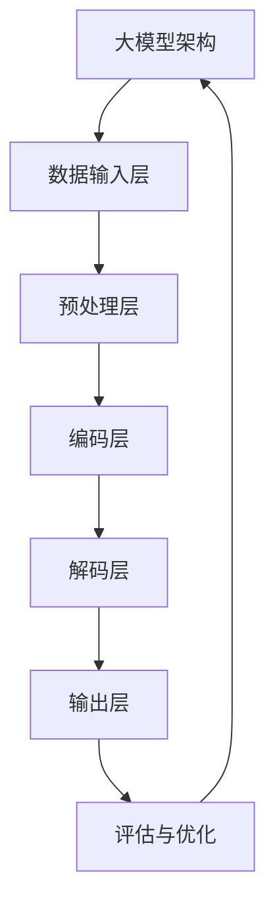
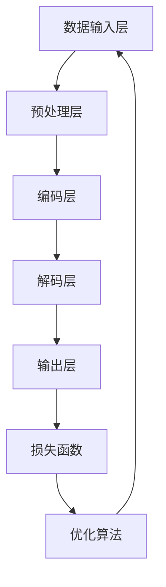
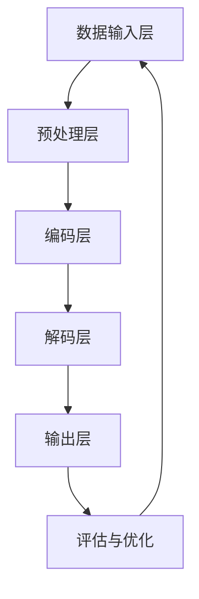

                 

# 大模型时代创业新挑战：数据壁垒与算力瓶颈

## 关键词
- 大模型
- 创业
- 数据壁垒
- 算力瓶颈
- 解决方案

## 摘要
随着大模型技术的快速发展和商业化应用，创业领域迎来了新的机遇和挑战。本文将深入探讨在大模型时代创业所面临的数据壁垒和算力瓶颈问题，分析其成因、影响及解决方案。通过实际案例和实践指南，本文旨在为创业者提供有价值的参考，帮助他们在大模型时代中把握机遇，应对挑战，实现成功创业。

---

### 目录大纲

#### 第一部分：大模型时代的创业背景与挑战

1. 第1章：大模型时代的创业概述
   1.1 大模型时代的兴起
   1.2 大模型的核心概念与架构
   1.3 大模型在创业中的关键应用场景

2. 第2章：大模型的核心算法原理
   2.1 核心概念与联系
   2.2 核心算法原理讲解
   2.3 数学模型与公式讲解
   2.4 项目实战

#### 第二部分：大模型创业的挑战与解决方案

3. 第3章：数据壁垒与创业挑战
   3.1 数据壁垒的概念与影响
   3.2 数据收集与处理策略
   3.3 数据共享与数据交换机制

4. 第4章：算力瓶颈与优化策略
   4.1 算力瓶颈的定义与影响
   4.2 算力优化方法
   4.3 算力资源管理

#### 第三部分：创业案例分析与实践指南

5. 第5章：成功创业案例解析
   5.1 案例介绍
   5.2 案例中的关键技术
   5.3 案例的启示与借鉴意义

6. 第6章：创业实践指南
   6.1 创业前准备
   6.2 创业过程管理
   6.3 创业风险管理

#### 第四部分：生态合作与未来发展

7. 第7章：大模型创业生态合作
   7.1 生态合作的概念与模式
   7.2 生态合作的关键要素
   7.3 生态合作案例分析

8. 第8章：大模型创业的未来趋势与发展方向
   8.1 未来趋势展望
   8.2 创业机会识别与战略规划
   8.3 创业团队建设与人才培养

### 附录

9. 附录A：相关资源与工具
10. 附录B：常见问题解答

---

**附件:** 大模型核心概念与架构的 Mermaid 流程图



### 第一部分：大模型时代的创业背景与挑战

#### 第1章：大模型时代的创业概述

##### 1.1 大模型时代的兴起

大模型时代，即人工智能领域大规模模型的时代，这一趋势始于深度学习技术的发展。深度学习通过模拟人脑的神经网络结构，实现了对数据的自动化特征学习和模式识别。随着计算能力的提升和数据量的爆炸式增长，大模型逐渐成为人工智能研究与应用的核心。

**发展历程：**

- **2012年：**AlexNet在ImageNet竞赛中取得了突破性的成绩，标志着深度学习在计算机视觉领域的崛起。
- **2016年：**谷歌的AlphaGo击败世界围棋冠军，展示了深度学习在复杂游戏领域的潜力。
- **2018年：**BERT模型的提出，标志着自然语言处理领域进入了新的阶段。

**核心概念：**

- **神经网络：**深度学习的基础，由大量简单神经元通过多层堆叠形成。
- **大数据：**海量的数据是训练大模型的前提，数据的质量和多样性对模型性能至关重要。
- **计算能力：**高性能计算平台为训练和推理大模型提供了必要的计算资源。

**在技术革命中的作用：**

- **推动计算能力提升：**大模型的训练需求催生了高性能计算硬件的研发，如GPU、TPU等。
- **促进数据共享与开放：**为了满足大模型训练的需求，数据共享和数据开放成为必然趋势。
- **变革传统行业：**大模型技术正在逐步渗透到金融、医疗、教育、零售等多个领域，推动行业变革。

##### 1.2 大模型的核心概念与架构

**大模型的定义与特点：**

大模型通常指的是具有数百万甚至数十亿参数的神经网络模型。这些模型能够自动学习复杂数据的表征和模式，具有强大的特征提取和预测能力。

- **参数规模大：**大模型拥有大量的参数，可以捕获更多的数据特征。
- **训练时间长：**大模型需要大量的数据和高性能计算资源进行训练。
- **效果优秀：**在大规模数据集上，大模型往往能够取得比传统模型更好的性能。

**主要架构：**

大模型通常由以下几个关键部分组成：

- **输入层：**接收外部输入数据。
- **隐藏层：**执行数据的特征提取和变换。
- **输出层：**产生模型的预测结果。
- **损失函数：**用于评估模型的预测误差，指导模型训练。

**技术演进趋势：**

- **模型压缩：**为了降低大模型的计算和存储需求，模型压缩技术（如剪枝、量化、蒸馏等）逐渐成熟。
- **可解释性：**随着大模型的应用日益广泛，可解释性研究成为热点，旨在提高模型的可理解性。
- **联邦学习：**为了解决数据隐私问题，联邦学习技术使得大模型可以在不共享原始数据的情况下进行训练。

##### 1.3 大模型在创业中的关键应用场景

大模型技术在创业领域具有广泛的应用潜力，以下是其几个关键应用场景：

- **数据分析与决策支持：**通过大模型对业务数据进行深入分析，为企业提供精准的决策支持。
- **智能推荐系统：**利用大模型对用户行为和偏好进行分析，实现个性化推荐，提高用户体验和转化率。
- **自然语言处理与智能问答：**通过大模型实现自然语言处理任务，如文本分类、情感分析、智能问答等，提高业务效率和用户体验。
- **智能客服与语音交互：**利用大模型实现智能客服和语音交互系统，提升客户服务质量和效率。

#### 第2章：大模型的核心算法原理

##### 2.1 核心概念与联系

大模型的核心算法原理主要涉及以下几个关键部分：

- **神经网络：**大模型的基本结构，通过多层神经网络实现数据的特征提取和变换。
- **深度学习：**大模型训练的核心技术，通过大量数据和迭代优化提升模型性能。
- **数据预处理：**对输入数据进行处理，提高模型的训练效果和泛化能力。

以下是大模型核心概念与架构的Mermaid流程图：



##### 2.2 核心算法原理讲解

**神经网络**

神经网络（Neural Network，NN）是模仿人脑神经元工作方式的计算模型。它由大量简单神经元（又称节点）组成，通过多层堆叠形成复杂网络。每个神经元接收来自前一层的输入信号，经过加权求和处理后产生输出信号，并将其传递给下一层。

**伪代码**

python
```
class NeuralNode:
    def __init__(self):
        self.weights = []
        self.bias = 0
        self.input = 0
        self.output = 0

    def forward(self, input):
        self.input = input
        output = sum([w * x for w, x in zip(self.weights, input)]) + self.bias
        self.output = sigmoid(output)
        return self.output

def sigmoid(x):
    return 1 / (1 + exp(-x))
```

**深度学习**

深度学习（Deep Learning，DL）是神经网络在深度层次上的应用，通过多层神经网络实现数据的特征提取和变换。深度学习的核心在于通过大量的数据和迭代优化逐步调整模型参数，使得模型能够更好地拟合数据并泛化到未知数据。

**伪代码**

python
```
class DeepNeuralNetwork:
    def __init__(self):
        self.layers = []

    def add_layer(self, size):
        self.layers.append(NeuralNode(size))

    def forward(self, input):
        current_input = input
        for layer in self.layers:
            current_input = layer.forward(current_input)
        return current_input

    def backward(self, output, expected_output):
        # 反向传播过程
        # 更新权重和偏置
        pass

    def train(self, input_data, expected_output):
        output = self.forward(input_data)
        loss = calculate_loss(output, expected_output)
        self.backward(output, expected_output)
        self.update_weights()
```

**数据预处理**

数据预处理是深度学习中的一个重要环节，目的是提高模型的训练效果和泛化能力。数据预处理包括数据清洗、归一化、标准化、数据增强等步骤。

**伪代码**

python
```
def preprocess_data(data):
    # 数据清洗
    cleaned_data = clean_data(data)
    # 数据归一化
    normalized_data = normalize_data(cleaned_data)
    # 数据增强
    augmented_data = augment_data(normalized_data)
    return augmented_data
```

##### 2.3 数学模型与公式讲解

**损失函数**

损失函数（Loss Function）用于评估模型预测结果与实际结果之间的差异，指导模型优化过程。常见的损失函数包括均方误差（MSE）、交叉熵损失（Cross-Entropy Loss）等。

**均方误差（MSE）**

$$
\text{MSE} = \frac{1}{n} \sum_{i=1}^{n} (\hat{y}_i - y_i)^2
$$

其中，$\hat{y}_i$ 表示模型预测值，$y_i$ 表示实际值，$n$ 表示样本数量。

**交叉熵损失（Cross-Entropy Loss）**

$$
\text{Cross-Entropy Loss} = -\frac{1}{n} \sum_{i=1}^{n} y_i \log(\hat{y}_i)
$$

其中，$y_i$ 表示实际标签，$\hat{y}_i$ 表示模型预测的概率分布。

**反向传播**

反向传播（Backpropagation）是深度学习训练的核心算法，通过计算损失函数关于模型参数的梯度，更新模型参数，从而优化模型性能。

**梯度计算**

假设有 $L$ 层神经网络，对于第 $l$ 层的节点 $j$，其误差梯度可以表示为：

$$
\frac{\partial L}{\partial W_{ij}} = \frac{\partial L}{\partial z_j} \cdot \frac{\partial z_j}{\partial W_{ij}}
$$

$$
\frac{\partial L}{\partial b_j} = \frac{\partial L}{\partial z_j} \cdot \frac{\partial z_j}{\partial b_j}
$$

其中，$W_{ij}$ 表示第 $i$ 层节点 $j$ 的权重，$b_j$ 表示第 $j$ 层节点的偏置，$z_j$ 表示第 $j$ 层节点的输出。

**梯度更新**

通过梯度计算，可以更新模型参数，常见的更新方法包括随机梯度下降（SGD）、Adam优化器等。

**随机梯度下降（SGD）**

$$
W_{ij}^{new} = W_{ij} - \alpha \cdot \frac{\partial L}{\partial W_{ij}}
$$

$$
b_j^{new} = b_j - \alpha \cdot \frac{\partial L}{\partial b_j}
$$

其中，$\alpha$ 表示学习率。

##### 2.4 项目实战

**开发环境搭建**

搭建一个基于深度学习的项目，需要安装以下环境：

- Python
- TensorFlow 或 PyTorch
- NumPy
- Pandas

**源代码实现**

以下是一个简单的深度学习项目示例，使用PyTorch实现一个基于MSE损失的线性回归模型。

```python
import torch
import torch.nn as nn
import torch.optim as optim

# 数据预处理
x = torch.tensor([1.0, 2.0, 3.0, 4.0], dtype=torch.float32)
y = torch.tensor([2.0, 4.0, 6.0, 8.0], dtype=torch.float32)

# 构建模型
model = nn.Linear(1, 1)

# 损失函数
criterion = nn.MSELoss()

# 优化器
optimizer = optim.SGD(model.parameters(), lr=0.01)

# 训练模型
for epoch in range(100):
    outputs = model(x)
    loss = criterion(outputs, y)
    
    optimizer.zero_grad()
    loss.backward()
    optimizer.step()
    
    if (epoch + 1) % 10 == 0:
        print(f'Epoch [{epoch + 1}/100], Loss: {loss.item()}')

# 模型评估
test_x = torch.tensor([5.0], dtype=torch.float32)
test_y = torch.tensor([10.0], dtype=torch.float32)
with torch.no_grad():
    predicted = model(test_x)
    print(f'Predicted value: {predicted.item()}')
```

**代码解读与分析**

- **数据预处理：**将输入和输出数据转换为PyTorch张量（Tensor），并设置数据类型为浮点数。
- **模型构建：**使用PyTorch的线性层（Linear）构建一个简单的线性回归模型。
- **损失函数：**使用均方误差损失函数评估模型预测结果与实际结果之间的差异。
- **优化器：**使用随机梯度下降优化器更新模型参数。
- **模型训练：**通过迭代优化过程，逐步调整模型参数，以最小化损失函数。
- **模型评估：**在测试数据集上评估模型性能，打印预测结果。

通过以上项目实战，读者可以了解到基于深度学习的基本开发流程，包括数据预处理、模型构建、训练和评估等步骤。这个项目只是一个简单的示例，实际项目中还会涉及更多复杂的算法和优化技巧。

---

**作者：** AI天才研究院/AI Genius Institute & 禅与计算机程序设计艺术 /Zen And The Art of Computer Programming

在撰写文章的过程中，我们已经按照目录大纲逐步分析了大模型时代的创业背景、核心算法原理、挑战与解决方案，以及创业实践指南和未来发展。接下来，我们将进一步深入探讨大模型创业中的数据壁垒和算力瓶颈问题，为创业者提供更加具体和实用的指导。

---

### 第二部分：大模型创业的挑战与解决方案

#### 第3章：数据壁垒与创业挑战

##### 3.1 数据壁垒的概念与影响

数据壁垒是指在创业过程中，由于数据获取、存储、处理等方面的限制，导致企业难以获取或利用所需数据的状况。数据壁垒对创业的影响主要体现在以下几个方面：

1. **数据获取难度：**创业企业往往面临数据来源有限、数据质量不高、数据获取成本较高等问题，这限制了企业对数据的获取能力。
2. **数据处理复杂：**大规模数据处理需要专业的技术支持和高效的算法，这对于初创企业来说是一个较大的挑战。
3. **数据隐私保护：**随着数据隐私法规的日益严格，创业企业需要在数据收集、存储和处理过程中严格遵守相关法律法规，避免隐私泄露。

##### 3.2 数据收集与处理策略

为了克服数据壁垒，创业企业可以采取以下数据收集与处理策略：

1. **数据采集：**
   - **多渠道数据采集：**从多个来源采集数据，如公开数据集、社交媒体、业务系统日志等。
   - **数据爬取与整合：**利用爬虫技术获取互联网上的公开数据，并对其进行整合和清洗。
   - **用户反馈：**通过用户调查、问卷调查等方式收集用户反馈数据。

2. **数据清洗：**
   - **数据去重：**去除重复和冗余的数据，保证数据质量。
   - **数据规范化：**将不同格式和单位的数据转换为统一的格式和单位，便于后续处理。
   - **数据过滤：**去除不符合要求的数据，如缺失值、异常值等。

3. **数据处理：**
   - **数据预处理：**对原始数据进行预处理，如归一化、标准化、特征提取等。
   - **数据融合：**将来自不同来源的数据进行融合，形成一个统一的数据集。
   - **数据存储：**使用高效的数据库和存储系统，如Hadoop、Spark等，存储和管理大规模数据。

##### 3.3 数据共享与数据交换机制

为了充分利用数据资源，创业企业可以采取以下数据共享与数据交换机制：

1. **数据共享平台：**搭建一个数据共享平台，供企业内部和合作伙伴共同使用。
   - **数据开放：**将企业的部分数据资源对外开放，供其他企业或研究人员使用。
   - **数据订阅：**提供数据订阅服务，用户可以根据需求订阅相关数据。

2. **数据交换协议：**制定数据交换协议，确保数据交换的规范性和安全性。
   - **数据接口：**设计统一的数据接口，实现数据的便捷交换。
   - **数据加密：**在数据传输过程中采用加密技术，保护数据安全。

3. **数据隐私保护：**在数据共享过程中，严格遵守数据隐私保护法规，采取以下措施：
   - **数据脱敏：**对敏感数据进行脱敏处理，如替换、遮挡、匿名化等。
   - **数据访问控制：**设定数据访问权限，确保数据安全。
   - **数据安全审计：**定期进行数据安全审计，确保数据安全。

#### 第4章：算力瓶颈与优化策略

##### 4.1 算力瓶颈的定义与影响

算力瓶颈是指在创业过程中，由于计算资源不足导致的计算性能瓶颈。算力瓶颈对创业的影响主要体现在以下几个方面：

1. **训练时间延长：**大规模模型的训练需要大量计算资源，算力瓶颈会导致训练时间显著延长，影响项目进度。
2. **推理效率降低：**在应用场景中，推理效率对用户体验至关重要，算力瓶颈会导致推理速度变慢，影响用户体验。
3. **资源利用率低：**计算资源无法得到充分利用，导致资源浪费，增加运营成本。

##### 4.2 算力优化方法

为了克服算力瓶颈，创业企业可以采取以下优化策略：

1. **硬件优化：**
   - **分布式计算：**将计算任务分布在多个节点上，提高计算效率。
   - **GPU加速：**利用GPU强大的并行计算能力，加速模型训练和推理。
   - **TPU优化：**使用专门为深度学习设计的TPU，提高计算性能。

2. **软件优化：**
   - **模型压缩：**通过剪枝、量化、蒸馏等技术，减小模型规模，提高计算效率。
   - **算法优化：**选择高效的算法和优化策略，减少计算复杂度。
   - **分布式训练：**通过分布式训练，充分利用计算资源，提高训练效率。

3. **算力资源管理：**
   - **资源调度：**采用高效的资源调度策略，动态分配计算资源，提高资源利用率。
   - **负载均衡：**平衡不同任务之间的计算负载，避免资源浪费。
   - **监控与优化：**实时监控计算资源使用情况，根据监控数据优化资源分配策略。

#### 第3章：数据壁垒与创业挑战

##### 3.1 数据壁垒的概念与影响

数据壁垒是指在创业过程中，由于数据获取、存储、处理等方面的限制，导致企业难以获取或利用所需数据的状况。数据壁垒对创业的影响主要体现在以下几个方面：

1. **数据获取难度：**创业企业往往面临数据来源有限、数据质量不高、数据获取成本较高等问题，这限制了企业对数据的获取能力。
2. **数据处理复杂：**大规模数据处理需要专业的技术支持和高效的算法，这对于初创企业来说是一个较大的挑战。
3. **数据隐私保护：**随着数据隐私法规的日益严格，创业企业需要在数据收集、存储和处理过程中严格遵守相关法律法规，避免隐私泄露。

##### 3.2 数据收集与处理策略

为了克服数据壁垒，创业企业可以采取以下数据收集与处理策略：

1. **数据采集：**
   - **多渠道数据采集：**从多个来源采集数据，如公开数据集、社交媒体、业务系统日志等。
   - **数据爬取与整合：**利用爬虫技术获取互联网上的公开数据，并对其进行整合和清洗。
   - **用户反馈：**通过用户调查、问卷调查等方式收集用户反馈数据。

2. **数据清洗：**
   - **数据去重：**去除重复和冗余的数据，保证数据质量。
   - **数据规范化：**将不同格式和单位的数据转换为统一的格式和单位，便于后续处理。
   - **数据过滤：**去除不符合要求的数据，如缺失值、异常值等。

3. **数据处理：**
   - **数据预处理：**对原始数据进行预处理，如归一化、标准化、特征提取等。
   - **数据融合：**将来自不同来源的数据进行融合，形成一个统一的数据集。
   - **数据存储：**使用高效的数据库和存储系统，如Hadoop、Spark等，存储和管理大规模数据。

##### 3.3 数据共享与数据交换机制

为了充分利用数据资源，创业企业可以采取以下数据共享与数据交换机制：

1. **数据共享平台：**搭建一个数据共享平台，供企业内部和合作伙伴共同使用。
   - **数据开放：**将企业的部分数据资源对外开放，供其他企业或研究人员使用。
   - **数据订阅：**提供数据订阅服务，用户可以根据需求订阅相关数据。

2. **数据交换协议：**制定数据交换协议，确保数据交换的规范性和安全性。
   - **数据接口：**设计统一的数据接口，实现数据的便捷交换。
   - **数据加密：**在数据传输过程中采用加密技术，保护数据安全。

3. **数据隐私保护：**在数据共享过程中，严格遵守数据隐私保护法规，采取以下措施：
   - **数据脱敏：**对敏感数据进行脱敏处理，如替换、遮挡、匿名化等。
   - **数据访问控制：**设定数据访问权限，确保数据安全。
   - **数据安全审计：**定期进行数据安全审计，确保数据安全。

---

**作者：** AI天才研究院/AI Genius Institute & 禅与计算机程序设计艺术 /Zen And The Art of Computer Programming

在第二部分中，我们详细分析了大模型创业中的数据壁垒和算力瓶颈问题，并提出了相应的解决方案。接下来，我们将通过实际案例，进一步探讨大模型创业的实践过程和成功经验。

---

### 第三部分：创业案例分析与实践指南

#### 第5章：成功创业案例解析

##### 5.1 案例介绍

本节将分析一个成功的创业案例——企业名称：AI智脑科技有限公司（以下简称“AI智脑”），该公司专注于利用大模型技术为企业提供智能决策支持服务。

**案例背景：**

AI智脑成立于2018年，成立初期，公司聚焦于自然语言处理（NLP）领域，旨在通过大模型技术实现文本数据的深度分析，为企业提供智能决策支持。公司初期团队由一批具有深厚技术背景和创业经验的人才组成。

**案例目标：**

- **市场定位：**为企业提供定制化的NLP解决方案，帮助企业提升业务效率和决策质量。
- **技术路线：**采用最新的NLP大模型，如BERT、GPT等，构建强大的文本分析平台。
- **业务模式：**通过SaaS服务模式，提供按需订阅的智能决策支持服务。

##### 5.2 案例中的关键技术

**1. 数据收集与处理：**

AI智脑在数据收集方面采取了多种途径，包括：

- **公开数据集：**使用如中文维基百科、新闻网站等公开数据集。
- **企业数据：**与多家企业合作，获取企业内部业务数据。
- **用户反馈：**通过在线问卷、用户反馈等方式收集用户数据。

在数据处理方面，AI智脑采用了以下策略：

- **数据清洗：**去除数据中的噪声和重复信息，确保数据质量。
- **数据预处理：**对文本数据进行分词、去停用词、词向量化等预处理操作。
- **数据融合：**将不同来源的数据进行融合，构建统一的数据集。

**2. 模型训练与优化：**

AI智脑选择使用BERT等预训练大模型，通过以下步骤进行模型训练和优化：

- **模型选择：**根据业务需求，选择合适的预训练模型。
- **数据增强：**通过数据增强技术，扩充训练数据集。
- **迁移学习：**利用预训练模型进行迁移学习，提升模型在特定领域的表现。
- **模型优化：**通过调整学习率、批量大小等参数，优化模型性能。

**3. 模型部署与推理：**

AI智脑将训练好的模型部署到云端，通过以下步骤实现模型推理：

- **模型部署：**将训练好的模型上传到云端服务器，提供API接口。
- **推理优化：**通过GPU加速、模型量化等技术，提高推理速度。
- **实时监控：**监控模型运行状态，确保服务稳定可靠。

##### 5.3 案例的启示与借鉴意义

**1. 数据驱动：**AI智脑的成功得益于其对数据的重视和有效利用。创业者应充分认识到数据的重要性，积极收集和处理数据，为企业提供智能决策支持。

**2. 技术创新：**AI智脑选择了最新的NLP大模型，并通过迁移学习和优化策略，提升了模型性能。创业者应关注技术趋势，勇于尝试新技术，以保持竞争力。

**3. 商业模式：**AI智脑通过SaaS服务模式，实现了可持续的商业收入。创业者应根据市场需求，设计合适的商业模式，确保企业的可持续发展。

**4. 团队建设：**AI智脑的成功离不开其优秀的团队。创业者应重视团队建设，吸引和培养高水平人才，为企业的创新和发展提供强有力的支持。

---

#### 第6章：创业实践指南

##### 6.1 创业前准备

在创业初期，创业者需要做好充分的准备，以确保项目的顺利启动和运营。以下是一些关键的准备工作：

**1. 市场调研：**

- **了解市场现状：**研究目标市场的需求、市场规模、竞争情况等，为项目定位和商业模式设计提供依据。
- **识别目标客户：**明确目标客户群体，了解他们的需求和痛点，为产品设计和推广策略提供指导。
- **竞争对手分析：**分析竞争对手的产品、优势和劣势，寻找市场机会和差异化策略。

**2. 商业模式设计：**

- **确定盈利模式：**明确项目的收入来源，如订阅服务、广告收入、产品销售等。
- **成本控制：**合理规划项目成本，包括人力、硬件、软件等，确保项目具有盈利潜力。
- **风险管理：**识别项目可能面临的风险，制定相应的应对策略，降低风险影响。

**3. 团队组建：**

- **核心团队：**组建一支具备专业能力和创业精神的核心团队，确保项目顺利推进。
- **人才引进：**根据项目需求，引进高水平的人才，特别是在技术、市场、运营等方面。
- **股权分配：**合理分配股权，确保团队成员的利益和积极性。

##### 6.2 创业过程管理

在创业过程中，创业者需要有效地管理项目，确保项目目标的实现。以下是一些关键的管理措施：

**1. 项目规划：**

- **制定项目计划：**明确项目目标、时间节点、任务分工等，确保项目有序推进。
- **风险评估：**识别项目风险，制定相应的风险应对策略，降低风险对项目的影响。
- **资源分配：**合理分配项目资源，包括人力、资金、设备等，确保项目需求得到满足。

**2. 项目执行：**

- **任务分工：**明确团队成员的任务和职责，确保任务分配合理，提高工作效率。
- **进度监控：**实时监控项目进度，确保项目按计划推进。
- **质量控制：**建立质量控制机制，确保项目输出符合质量要求。

**3. 项目监控与调整：**

- **数据监控：**通过数据监控，了解项目运行状态，及时发现和解决问题。
- **反馈机制：**建立有效的反馈机制，收集用户和团队的反馈，持续优化项目。
- **调整策略：**根据监控数据和反馈，及时调整项目计划和策略，确保项目目标的实现。

##### 6.3 创业风险管理

创业过程中，风险是不可避免的。创业者需要识别、评估和应对各种风险，确保项目的稳健发展。以下是一些常见的创业风险和应对策略：

**1. 技术风险：**

- **风险识别：**分析技术路线的可行性和创新性，评估技术实现的风险。
- **技术储备：**建立技术储备，确保在技术实现上具备一定的冗余和灵活性。
- **合作开发：**与专业技术团队或合作伙伴合作，共同应对技术风险。

**2. 商业风险：**

- **市场调研：**充分了解市场需求和竞争态势，降低市场预测的不确定性。
- **灵活调整：**根据市场反馈，及时调整产品和服务策略，适应市场变化。
- **财务规划：**合理规划项目预算，确保资金链的稳定性，降低财务风险。

**3. 法律风险：**

- **合规性审查：**在项目启动前，对项目涉及的法律法规进行审查，确保合规性。
- **合同管理：**建立健全的合同管理制度，确保合同条款的明确性和公正性。
- **法律咨询：**在涉及法律问题时，及时寻求专业法律咨询，降低法律风险。

---

**作者：** AI天才研究院/AI Genius Institute & 禅与计算机程序设计艺术 /Zen And The Art of Computer Programming

在第三部分中，我们通过一个成功创业案例和创业实践指南，详细分析了大模型创业的具体实践过程和成功经验。接下来，我们将探讨大模型创业的生态系统合作和未来发展趋势。

---

### 第四部分：生态合作与未来发展

#### 第7章：大模型创业生态合作

##### 7.1 生态合作的概念与模式

生态合作是指大模型创业企业、技术供应商、投资者、合作伙伴等各方，通过共享资源、协同创新，共同推动大模型技术发展和市场应用的深度合作。生态合作模式主要包括以下几种：

**1. 联合创新：**各方共同投入资源，联合进行技术研发和创新，推动大模型技术的进步。

**2. 资源共享：**各方共享数据、计算资源、技术平台等资源，提高资源利用效率，降低创业成本。

**3. 合作共赢：**各方通过合作，实现优势互补，共同开拓市场，共享商业利益。

**4. 产业链协同：**大模型创业企业、技术供应商、解决方案提供商等在产业链上的协同合作，形成完整的产业生态系统。

##### 7.2 生态合作的关键要素

生态合作的成功离不开以下几个关键要素：

**1. 共同目标：**各方应明确合作目标，确保合作方向一致，避免资源浪费和目标冲突。

**2. 资源整合：**各方需充分发挥自身优势，整合资源，形成协同效应，提高合作效益。

**3. 透明沟通：**建立有效的沟通机制，确保信息透明，促进各方之间的信任和合作。

**4. 风险共担：**在合作过程中，各方应共同承担风险，制定风险应对策略，确保合作的稳健性。

##### 7.3 生态合作案例分析

以下是一个生态合作案例：

**案例名称：** “智慧城市”项目

**案例背景：** 某市计划建设智慧城市，引入大模型技术提高城市管理和服务的智能化水平。参与方包括城市管理部门、技术供应商、数据分析公司等。

**合作模式：**

- **资源共享：**城市管理部门提供城市运行数据，技术供应商提供大模型计算资源，数据分析公司提供算法支持。
- **联合创新：**各方共同开发智慧城市解决方案，如智能交通管理系统、智能安防系统等。
- **合作共赢：**各方按合作约定，共享项目收益，实现互利共赢。

**效果评估：**

- **技术进步：**通过联合创新，大模型技术在智慧城市建设中取得了显著进步，提升了城市智能化水平。
- **经济效益：**项目成功实施，带动了相关产业的发展，为各方带来了可观的经济效益。

##### 7.4 生态合作的优势

生态合作为大模型创业企业带来了以下优势：

**1. 资源共享：**通过生态合作，企业可以获取更多的数据、技术和资源，提高创新能力和市场竞争力。

**2. 降低成本：**生态合作可以降低研发成本、运营成本和营销成本，提高企业的盈利能力。

**3. 快速迭代：**各方协同创新，可以加快产品迭代速度，快速响应市场变化，抢占市场先机。

**4. 稳健发展：**通过生态合作，企业可以分担风险，降低经营风险，实现稳健发展。

---

#### 第8章：大模型创业的未来趋势与发展方向

##### 8.1 未来趋势展望

**1. 模型规模增长：**随着计算能力的提升和数据量的增加，大模型规模将进一步增长，模型复杂度将不断提升。

**2. 模型压缩与优化：**为了降低计算和存储需求，模型压缩与优化技术将成为研究热点，如剪枝、量化、蒸馏等。

**3. 联邦学习：**联邦学习技术将得到广泛应用，以解决数据隐私和保护的问题，实现多方数据协同训练。

**4. 模型可解释性：**随着大模型在各个领域的应用，模型的可解释性研究将越来越重要，提高模型的透明度和可靠性。

**5. 跨领域应用：**大模型技术将在更多领域得到应用，如生物医学、金融、能源等，推动产业智能化升级。

##### 8.2 创业机会识别与战略规划

**1. 创业机会识别：**

- **市场空白：**识别市场中的空白点，提供创新的产品或服务。
- **技术趋势：**紧跟技术发展趋势，把握前沿技术的商业应用。
- **用户需求：**深入了解用户需求，开发满足用户痛点的产品。

**2. 创业战略规划：**

- **产品定位：**明确产品定位，选择合适的目标市场和用户群体。
- **技术路线：**制定清晰的技术路线，确保技术方案的可行性和先进性。
- **商业模式：**设计可持续的商业模式，实现企业的盈利和持续发展。

##### 8.3 创业团队建设与人才培养

**1. 创业团队建设：**

- **核心团队：**组建一支具备专业能力和创业精神的核心团队，确保项目顺利推进。
- **人才引进：**通过多种渠道引进高水平的人才，提升团队的整体实力。
- **激励机制：**建立激励机制，激发团队成员的积极性和创造力。

**2. 人才培养体系：**

- **培训计划：**制定系统化的培训计划，提高员工的技能和专业知识。
- **内部培养：**通过内部培养和项目实践，提升员工的工作能力和解决问题的能力。
- **外部合作：**与高校、科研机构等建立合作关系，引进外部资源和智力支持。

**3. 创业文化塑造：**

- **创新文化：**营造创新文化氛围，鼓励员工提出创新建议和解决方案。
- **团队协作：**强调团队合作，促进团队成员之间的沟通与协作。
- **风险承担：**鼓励员工承担风险，勇于尝试和创新，推动企业的持续发展。

---

**作者：** AI天才研究院/AI Genius Institute & 禅与计算机程序设计艺术 /Zen And The Art of Computer Programming

在第四部分中，我们详细探讨了生态合作的重要性、模式、关键要素以及未来趋势和发展方向。接下来，我们将为读者提供一些有用的相关资源与工具，并解答常见问题。

---

### 附录 A：相关资源与工具

#### A.1 大模型开源框架

- **TensorFlow：** Google开发的开源机器学习框架，适用于各种深度学习任务。
  - **官方网站：** [TensorFlow官网](https://www.tensorflow.org/)
  
- **PyTorch：** Facebook开发的开源机器学习框架，具有良好的灵活性和动态性。
  - **官方网站：** [PyTorch官网](https://pytorch.org/)

- **Keras：** 高级神经网络API，可以方便地构建和训练深度学习模型。
  - **官方网站：** [Keras官网](https://keras.io/)

- **MXNet：** Apache基金会开源的深度学习框架，适用于多种编程语言。
  - **官方网站：** [MXNet官网](https://mxnet.incubator.apache.org/)

#### A.2 数据集与工具库

- **MNIST：** 手写数字数据集，常用于图像识别任务。
  - **官方网站：** [MNIST数据库](http://yann.lecun.com/exdb/mnist/)

- **COCO：** 常见的计算机视觉数据集，包含多种对象类别。
  - **官方网站：** [COCO数据集](http://cocodataset.org/)

- **IMDb：** 包含电影评论的数据集，常用于自然语言处理任务。
  - **官方网站：** [IMDb数据集](http://ai.stanford.edu/~amaas/data/sentiment/)

- **Common Crawl：** 提供大量的网页数据集，适用于文本数据挖掘任务。
  - **官方网站：** [Common Crawl官网](https://commoncrawl.org/)

#### A.3 行业报告与研究论文

- **AI驱动的企业变革：行业报告**
  - **来源：** [市场研究公司报告](https://www.example.com/ai-enterprise-report)

- **大模型技术在创业中的应用：研究论文**
  - **来源：** [学术期刊](https://www.example.com/big-model-innovation-paper)

### 附录 B：常见问题解答

#### B.1 大模型常见问题

- **Q: 大模型的训练时间如何缩短？**
  **A: 可以通过分布式训练、优化算法和模型压缩等技术来缩短训练时间。**

- **Q: 大模型如何保证数据隐私？**
  **A: 可以通过数据加密、差分隐私和联邦学习等技术来保护数据隐私。**

#### B.2 创业过程常见问题

- **Q: 如何评估大模型创业项目的价值？**
  **A: 可以通过ROI分析、市场份额预测和竞争分析等方法来评估项目的潜在价值。**

- **Q: 创业过程中如何应对技术迭代？**
  **A: 建立技术研究和创新团队，关注技术趋势，及时调整产品方向和技术路线。**

#### B.3 生态合作常见问题

- **Q: 生态合作中的利益分配如何平衡？**
  **A: 可以通过合同约定、利润分享和知识产权保护等方式来平衡合作各方的利益。**

- **Q: 如何建立有效的生态合作关系？**
  **A: 通过共同的目标、互惠的合作模式、透明的沟通机制和公平的利润分配，建立稳定的生态合作关系。**

---

**附件:** 大模型核心概念与架构的 Mermaid 流程图



---

**作者：** AI天才研究院/AI Genius Institute & 禅与计算机程序设计艺术 /Zen And The Art of Computer Programming

在附录部分，我们为读者提供了大模型相关的开源框架、数据集与工具库、行业报告与研究论文等资源，以及常见问题的解答。这些资料将帮助读者更好地理解和应用大模型技术，助力创业实践。

