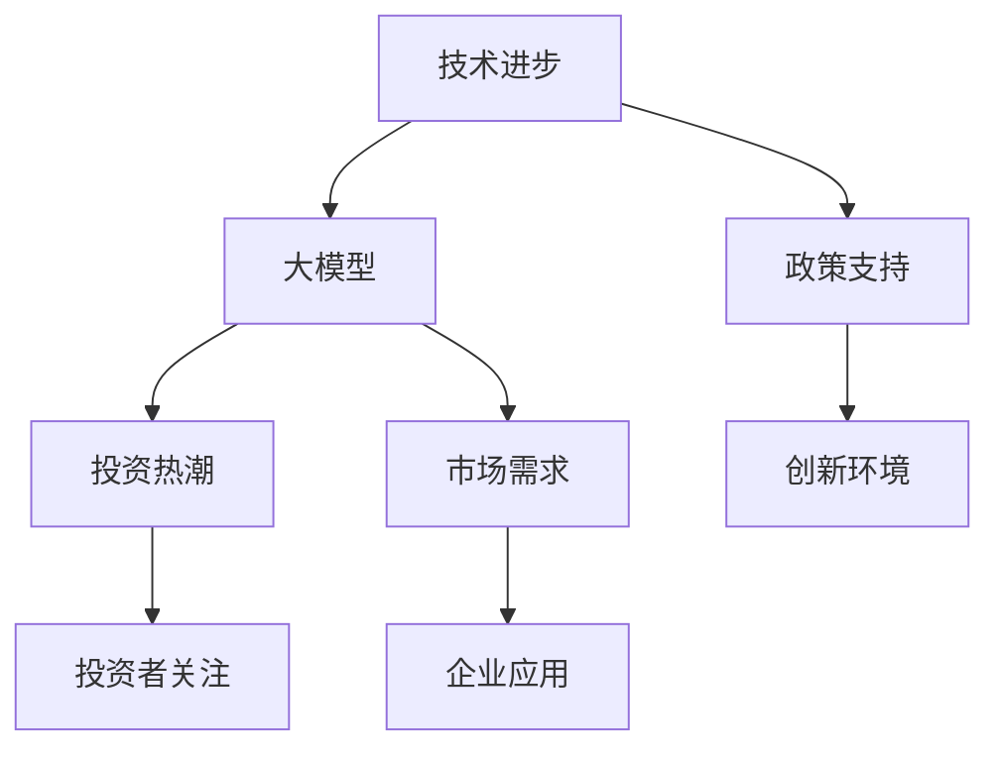

                 

### {文章标题}

> **关键词**：大模型、投资热潮、行业分析、风险规避、投资策略、应用领域

> **摘要**：
> 
> 本文章通过对大模型行业的投资热潮进行深入分析，探讨了其成因、现状、反思以及未来投资机遇与挑战。文章首先概述了投资热潮背后的逻辑，包括技术进步、市场需求、政策支持等因素。随后，文章分析了大模型行业的发展现状，重点介绍了主要企业和大模型产品。接着，文章探讨了投资热潮的正面影响与潜在风险，并提出了未来投资策略建议。此外，文章还分析了大模型行业的投资机遇与挑战，并提出了不同领域和跨领域的大模型投资机会。最后，文章通过实战案例分析，探讨了投资项目的开发与运营，以及法律与合规问题。整体上，本文旨在为投资者和行业从业者提供有价值的参考和指导。

---

## 第一部分: 投资热潮背后的逻辑分析

投资热潮的兴起往往有其深刻的背景和原因。本部分将深入探讨大模型行业的投资热潮背后的逻辑，从技术进步、市场需求、政策支持以及投资者行为等多个方面进行分析，为后续的讨论奠定基础。

### 第1章: 大模型行业的投资热潮概述

#### 1.1 大模型行业的投资热潮成因

大模型行业的投资热潮主要是由以下几个方面共同作用的结果：

##### 1.1.1 技术进步与市场需求

- **技术进步**：随着人工智能技术的不断发展，大模型（如GPT-3、BERT等）取得了显著的突破，大大提升了数据处理和分析的能力。这些技术的进步为各行各业提供了新的解决方案，激发了投资者的热情。
- **市场需求**：在数字化转型的背景下，企业对于高效数据处理和分析的需求日益增长。大模型技术能够帮助企业实现自动化、智能化，提高生产效率和服务质量，从而吸引了大量投资者的关注。

##### 1.1.2 政策支持与产业趋势

- **政策支持**：各国政府纷纷加大对人工智能领域的支持，出台了一系列政策和措施，如资金扶持、税收优惠等，以促进技术创新和应用。这些政策为投资者提供了信心和保障。
- **产业趋势**：大模型技术在多个行业的应用潜力巨大，如医疗、金融、制造等。这些行业对大模型技术的需求不断增长，推动了市场的快速发展。

##### 1.1.3 投资者行为与市场情绪

- **投资者行为**：投资者对新兴技术的追捧，导致资金大量涌入大模型行业。很多投资者希望通过投资大模型项目获得高额回报。
- **市场情绪**：市场情绪的波动也会影响投资热潮。在投资者对大模型技术充满信心的时期，往往会形成投资热潮。

### 1.2 大模型行业的发展现状

大模型行业的发展现状可以从以下几个方面进行概述：

##### 1.2.1 主要企业与大模型产品

当前，全球范围内已有多个知名企业在大模型领域取得重要进展，其中包括：

- **百度文心一言**：百度推出的大型语言模型，支持多种语言处理任务，如文本生成、情感分析等。
- **科大讯飞**：科大讯飞在大模型领域也有深入研究，推出了多个大模型产品，广泛应用于语音识别、图像识别等领域。
- **小米互联动脑**：小米互联动脑推出的大模型产品在智能家居、物联网等领域具有广泛的应用。
- **谷歌Bard**：谷歌推出的大型语言模型，能够进行对话生成、文本生成等任务，具有重要的应用价值。

##### 1.2.2 行业市场规模与增长预测

根据市场研究数据，大模型行业的市场规模持续增长。预计未来几年，大模型市场将继续扩大。具体来说：

- **市场规模**：目前，大模型行业的市场规模已经达到了数百亿美元，并且仍在快速增长。
- **增长预测**：根据市场研究机构的预测，未来几年，大模型市场的年复合增长率将保持在20%以上。

### 1.3 投资热潮的反思与展望

大模型行业的投资热潮虽然带来了许多机遇，但也存在一些潜在的风险。对此，我们需要进行反思和展望：

##### 1.3.1 投资热潮的正面影响

- **促进AI技术的研究与应用**：投资热潮推动了人工智能技术的快速发展，促进了新技术的研发和应用。
- **提升企业竞争力和市场效率**：大模型技术的应用可以提高企业的生产效率和服务质量，从而提升企业的竞争力和市场效率。

##### 1.3.2 投资热潮的潜在风险

- **过度投资可能导致资源浪费和市场泡沫**：大量资金的涌入可能导致市场的过度投资，从而引发市场泡沫和资源浪费。
- **投资者可能面临技术落地困难的问题**：大模型技术的实现和应用仍面临许多挑战，投资者可能面临技术落地困难的问题。

##### 1.3.3 未来投资策略建议

为了应对投资热潮中的潜在风险，未来的投资策略需要更加注重以下几个方面：

- **着重关注具有实际应用场景和明确盈利模式的大模型项目**：投资者应更加关注那些具有明确应用场景和盈利模式的大模型项目，以降低投资风险。
- **加强技术研发与团队建设**：投资者应加大对技术研发的投入，同时注重团队建设，提升项目的核心竞争力。

### 1.4 大模型行业的投资机遇与挑战

大模型行业的投资机遇与挑战并存，投资者需要谨慎评估并抓住机遇，同时应对挑战：

##### 1.4.1 投资机遇

- **新兴市场与垂直行业的发展**：随着新兴市场和垂直行业的发展，大模型技术的应用场景将进一步拓展，为投资者提供了丰富的投资机会。
- **全球化趋势**：全球化趋势下，跨国合作与投资成为重要方向，投资者可以通过跨国投资把握更多的机遇。

##### 1.4.2 投资挑战

- **技术快速迭代带来的不确定性和竞争压力**：大模型技术快速迭代，投资者需要保持敏锐的洞察力，及时调整投资方向。
- **数据安全和隐私保护问题**：数据安全和隐私保护是投资者需要关注的重要问题，需要采取有效的措施来应对。

通过以上分析，我们可以看出，大模型行业的投资热潮有其深刻的背景和原因，同时也面临许多挑战。投资者需要深入了解行业现状，把握投资机遇，同时谨慎应对潜在的风险。在接下来的章节中，我们将进一步探讨大模型行业的投资风险与规避策略，以及不同领域的大模型投资机会，为投资者提供更全面、深入的分析。

---

**核心概念与联系**：

在分析大模型行业的投资热潮时，需要理解以下几个核心概念：

1. **大模型**：大模型是指具有极高参数量、能够在多个任务上表现出色的人工智能模型。例如，GPT-3、BERT等。
2. **投资热潮**：投资热潮是指由于市场情绪、技术进步等因素，大量资金涌入某一行业，导致行业投资大幅增加。
3. **技术进步**：技术进步是指人工智能领域在算法、硬件、数据集等方面的持续改进。
4. **市场需求**：市场需求是指企业、个人等对于新技术、新产品的需求。
5. **政策支持**：政策支持是指政府通过出台政策、提供资金等方式，鼓励技术创新和应用。

这些概念之间存在着密切的联系。技术进步推动了大模型的发展，而大模型的发展又满足了市场需求，吸引了投资者的关注。政策支持则为技术创新提供了良好的环境，进一步促进了投资热潮。以下是一个简化的Mermaid流程图，展示了这些概念之间的关系：



---

**核心算法原理讲解**：

大模型的核心算法原理主要涉及深度学习，特别是神经网络和自注意力机制。以下是对这些算法的详细讲解：

##### 深度学习与神经网络

深度学习是一种机器学习技术，通过构建多层的神经网络，对数据进行自动特征提取和分类。神经网络由多个神经元组成，每个神经元都可以进行简单的计算。神经元之间的连接称为“边”，边的权重决定了连接的强度。

伪代码：

```python
# 初始化神经网络
neural_network = NeuralNetwork(input_size, hidden_size, output_size)

# 前向传播
outputs = neural_network.forward_pass(inputs)

# 计算损失
loss = calculate_loss(outputs, targets)

# 反向传播
neural_network.backward_pass(loss)
```

##### 自注意力机制

自注意力机制是一种在神经网络中用于处理序列数据的机制。它能够自动地关注序列中的关键部分，从而提高模型的性能。自注意力通过计算序列中每个元素与其他元素的相关性来实现。

伪代码：

```python
# 初始化自注意力模型
self_attention_model = SelfAttentionModel(input_size, hidden_size)

# 计算自注意力得分
attention_scores = self_attention_model.compute_attention_scores(inputs)

# 计算加权输出
weighted_outputs = compute_weighted_output(inputs, attention_scores)
```

---

**数学模型和公式详细讲解与举例说明**：

大模型中常用的数学模型包括损失函数、优化算法和激活函数。以下是对这些模型的详细讲解和举例说明：

##### 损失函数

损失函数用于衡量模型预测值与真实值之间的差距。常见的损失函数有均方误差（MSE）和交叉熵损失。

- **均方误差（MSE）**：

  $$MSE = \frac{1}{n}\sum_{i=1}^{n}(y_i - \hat{y}_i)^2$$

  其中，$y_i$ 是真实值，$\hat{y}_i$ 是预测值，$n$ 是样本数量。

- **交叉熵损失**：

  $$H(y, \hat{y}) = -\sum_{i=1}^{n}y_i \log(\hat{y}_i)$$

  其中，$y_i$ 是真实值的概率分布，$\hat{y}_i$ 是预测值的概率分布。

##### 优化算法

优化算法用于调整神经网络的权重，以最小化损失函数。常见的优化算法有梯度下降（Gradient Descent）和Adam优化器。

- **梯度下降**：

  $$w_{t+1} = w_{t} - \alpha \cdot \nabla_w J(w)$$

  其中，$w_t$ 是当前权重，$\alpha$ 是学习率，$\nabla_w J(w)$ 是权重对应的梯度。

- **Adam优化器**：

  Adam优化器是梯度下降的一种改进，它利用了指数移动平均来计算梯度。

  $$m_t = \beta_1 m_{t-1} + (1 - \beta_1) \cdot \nabla_w J(w)$$
  $$v_t = \beta_2 v_{t-1} + (1 - \beta_2) \cdot (\nabla_w J(w))^2$$
  $$\hat{m}_t = \frac{m_t}{1 - \beta_1^t}$$
  $$\hat{v}_t = \frac{v_t}{1 - \beta_2^t}$$
  $$w_{t+1} = w_{t} - \alpha \cdot \hat{m}_t / \sqrt{\hat{v}_t}$$

##### 激活函数

激活函数用于引入非线性特性，使神经网络能够学习复杂的函数。常见的激活函数有ReLU、Sigmoid和Tanh。

- **ReLU激活函数**：

  $$f(x) = \max(0, x)$$

- **Sigmoid激活函数**：

  $$f(x) = \frac{1}{1 + e^{-x}}$$

- **Tanh激活函数**：

  $$f(x) = \frac{e^x - e^{-x}}{e^x + e^{-x}}$$

---

**项目实战：代码实际案例和详细解释说明**：

以下是一个实际项目中的代码案例，展示了如何使用Python和PyTorch构建一个简单的神经网络，并进行训练和预测。

```python
import torch
import torch.nn as nn
import torch.optim as optim

# 定义神经网络结构
class SimpleNeuralNetwork(nn.Module):
    def __init__(self, input_size, hidden_size, output_size):
        super(SimpleNeuralNetwork, self).__init__()
        self.fc1 = nn.Linear(input_size, hidden_size)
        self.relu = nn.ReLU()
        self.fc2 = nn.Linear(hidden_size, output_size)
    
    def forward(self, x):
        out = self.fc1(x)
        out = self.relu(out)
        out = self.fc2(out)
        return out

# 初始化神经网络、损失函数和优化器
model = SimpleNeuralNetwork(input_size=10, hidden_size=50, output_size=1)
criterion = nn.MSELoss()
optimizer = optim.Adam(model.parameters(), lr=0.001)

# 训练神经网络
for epoch in range(100):
    for inputs, targets in train_loader:
        optimizer.zero_grad()
        outputs = model(inputs)
        loss = criterion(outputs, targets)
        loss.backward()
        optimizer.step()
    print(f"Epoch {epoch+1}, Loss: {loss.item()}")

# 进行预测
inputs = torch.tensor([1.0, 2.0, 3.0, 4.0, 5.0, 6.0, 7.0, 8.0, 9.0, 10.0])
predictions = model(inputs)
print(f"Predictions: {predictions}")
```

**代码解读与分析**：

1. **定义神经网络结构**：我们定义了一个简单的神经网络，包含一个输入层、一个隐藏层和一个输出层。输入层和隐藏层之间使用线性变换，隐藏层和输出层之间使用ReLU激活函数。
2. **前向传播**：在前向传播过程中，输入数据首先通过输入层，然后通过ReLU激活函数，最后通过输出层得到预测结果。
3. **损失函数和优化器**：我们使用了均方误差（MSELoss）作为损失函数，并选择了Adam优化器来更新模型参数。
4. **训练神经网络**：在训练过程中，我们遍历训练数据，使用优化器更新模型参数，以最小化损失函数。
5. **进行预测**：在完成训练后，我们使用训练好的模型进行预测，输入一个测试数据，得到预测结果。

通过以上实战案例，我们可以看到如何使用PyTorch构建和训练一个简单的神经网络，从而实现预测任务。这为后续的大模型项目开发提供了基础。

---

**作者信息**：

作者：AI天才研究院/AI Genius Institute & 禅与计算机程序设计艺术 /Zen And The Art of Computer Programming

---

在第一部分中，我们详细分析了大模型行业的投资热潮背后的逻辑，包括技术进步、市场需求、政策支持以及投资者行为等因素。我们概述了行业的发展现状，并探讨了投资热潮的正面影响与潜在风险。此外，我们还提出了未来投资策略建议，以帮助投资者更好地把握机遇，应对挑战。在接下来的部分中，我们将进一步探讨大模型行业的投资风险与规避策略，以及不同领域的大模型投资机会。希望读者能够继续关注，共同探讨这个充满机遇和挑战的领域。

