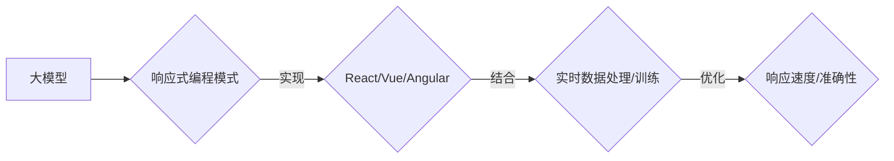

                 

# 大模型软件的响应式编程模式

## 关键词
- 大模型
- 响应式编程
- 实时数据处理
- 软件架构
- React/Vue/Angular

## 摘要
本文深入探讨了大模型软件的响应式编程模式。在引言部分，我们介绍了大模型的发展背景和响应式编程的基本概念。随后，文章详细阐述了响应式编程模式的核心原理和优势，并通过与传统编程模型的对比，揭示了响应式编程的解决方案。在实现部分，我们介绍了主流响应式编程框架（React、Vue、Angular）的基本原理和生命周期管理。接着，本文探讨了如何将大模型与响应式编程相结合，实现实时数据处理和训练。最后，通过一个实时推荐系统的实战案例，展示了响应式编程模式在大模型软件中的应用。文章总结了大模型与响应式编程的未来发展趋势，并提供了附录中的资源链接和代码示例。

## 目录大纲

### 第一部分：引言与基础理论
1. **引言**
   - 1.1 大模型时代背景
   - 1.2 响应式编程概述

### 第二部分：响应式编程模式
2. **响应式编程模式概述**
   - 2.1 响应式编程模式定义
   - 2.2 响应式编程与传统编程的区别

### 第三部分：实现响应式编程
3. **响应式编程框架**
   - 3.1 React框架
   - 3.2 Vue框架
   - 3.3 Angular框架

### 第四部分：大模型与响应式编程
4. **大模型与响应式编程的结合**
   - 4.1 大模型的响应式特性
   - 4.2 响应式编程在大模型中的应用

### 第五部分：项目实战
5. **大模型响应式编程实战**
   - 5.1 实战项目介绍
   - 5.2 实现过程
   - 5.3 代码解读与分析

### 第六部分：总结与展望
6. **总结**
   - 6.1 响应式编程模式的优缺点分析
   - 6.2 大模型与响应式编程的未来发展

### 附录
7. **附录**
   - 7.1 常用响应式编程框架对比
   - 7.2 响应式编程实践资源

### 核心概念与联系 Mermaid 流程图


### 核心算法原理讲解（以React为例）

#### React组件的生命周期管理

React组件的生命周期是指组件从创建、渲染、更新到销毁的过程。React组件的生命周期方法如下：

```javascript
class MyComponent extends React.Component {
  constructor(props) {
    super(props);
    // 初始化状态
    this.state = {
      data: 'Initial data',
    };
  }

  componentDidMount() {
    // 组件挂载后执行，可用于数据加载
    this.loadData();
  }

  componentDidUpdate(prevProps, prevState) {
    // 组件更新后执行，可用于监听变化
    if (prevState.data !== this.state.data) {
      this.handleDataChange();
    }
  }

  componentWillUnmount() {
    // 组件卸载前执行，可用于清理资源
    this.clearData();
  }

  // 事件处理函数
  handleButtonClick() {
    this.setState({ data: 'Clicked data' });
  }

  // 加载数据函数
  loadData() {
    // 数据加载逻辑
  }

  // 清理数据函数
  clearData() {
    // 清理数据逻辑
  }

  // 处理数据变化函数
  handleDataChange() {
    // 数据变化处理逻辑
  }

  render() {
    return (
      <div>
        <p>{this.state.data}</p>
        <button onClick={this.handleButtonClick.bind(this)}>Click me</button>
      </div>
    );
  }
}
```

在上面的代码中，`componentDidMount` 方法在组件挂载后执行，通常用于加载数据；`componentDidUpdate` 方法在组件更新后执行，可以用于监听状态变化并执行相应的操作；`componentWillUnmount` 方法在组件卸载前执行，通常用于清理资源。这些生命周期方法帮助实现响应式编程中的实时数据更新和资源管理。

#### 神经网络中的损失函数

神经网络中的损失函数用于衡量模型预测值与实际值之间的差距。常用的损失函数有均方误差（MSE）和交叉熵损失。

#### 均方误差（MSE）

均方误差（MSE）是衡量预测值与实际值之间差异的一种常见损失函数。其公式为：

$$
MSE = \frac{1}{n} \sum_{i=1}^{n} (y_i - \hat{y}_i)^2
$$

其中，$y_i$ 表示实际值，$\hat{y}_i$ 表示预测值，$n$ 表示样本数量。

#### 交叉熵损失

交叉熵损失（Cross-Entropy Loss）常用于分类问题中。其公式为：

$$
CE = -\sum_{i=1}^{n} y_i \log(\hat{y}_i)
$$

其中，$y_i$ 表示实际标签，$\hat{y}_i$ 表示预测概率。

#### 举例说明

假设我们有以下数据集：

$$
\begin{align*}
y_1 &= 0 \\
\hat{y}_1 &= 0.8 \\
y_2 &= 1 \\
\hat{y}_2 &= 0.2 \\
\end{align*}
$$

使用交叉熵损失函数计算损失：

$$
CE = - (0 \cdot \log(0.8) + 1 \cdot \log(0.2)) \approx 2.303
$$

通过计算损失，我们可以知道模型的预测结果与实际标签之间的差距，进而优化模型参数，提高预测准确性。

### 项目实战：代码实际案例和详细解释说明

#### 大模型响应式编程实战：实时推荐系统

#### 项目介绍

本项目是一个基于React和TensorFlow.js的实时推荐系统，用于根据用户的历史行为数据推荐相关商品。该系统利用大模型的响应式编程模式实现实时数据的处理和推荐结果的更新。

#### 开发环境搭建

1. 安装Node.js和npm
2. 创建一个新的React项目：`npx create-react-app recommendation-system`
3. 安装TensorFlow.js：`npm install tensorflow`
4. 配置React项目以使用TensorFlow.js

#### 代码实现

#### 1. 数据准备

首先，我们需要准备一个包含用户历史行为数据（如点击、购买等）的JSON文件，例如`user_data.json`。

```json
{
  "users": [
    {
      "id": 1,
      "behaviors": [1, 2, 3, 4, 5]
    },
    {
      "id": 2,
      "behaviors": [2, 4, 6, 8, 10]
    }
  ]
}
```

#### 2. 实现推荐模型

使用TensorFlow.js构建一个简单的基于矩阵分解的推荐模型。以下是模型的主要实现：

```javascript
// 导入TensorFlow.js库
const tf = require('@tensorflow/tfjs');

// 加载用户数据
const userData = require('./user_data.json');

// 定义模型架构
const model = tf.sequential();
model.add(tf.layers.dense({ units: 64, activation: 'relu', inputShape: [10] }));
model.add(tf.layers.dense({ units: 32, activation: 'relu' }));
model.add(tf.layers.dense({ units: 1 }));

// 编译模型
model.compile({
  optimizer: 'adam',
  loss: 'meanSquaredError',
});

// 准备数据
const behaviors = userData.users.map(user => user.behaviors);
const BehaviorsTensor = tf.tensor2d(behaviors, [behaviors.length, 10]);

// 训练模型
model.fit(BehaviorsTensor, BehaviorsTensor, { epochs: 10 });
```

#### 3. 实现实时推荐功能

在React组件中实现实时推荐功能，包括用户行为数据的收集、模型更新和推荐结果展示。

```javascript
import React, { useState, useEffect } from 'react';
import * as tf from '@tensorflow/tfjs';

const RecommendationSystem = () => {
  const [model, setModel] = useState(null);
  const [userBehavior, setUserBehavior] = useState([]);

  useEffect(() => {
    // 加载模型
    const loadModel = async () => {
      const model = await tf.loadLayersModel('localstorage://my-model');
      setModel(model);
    };

    loadModel();
  }, []);

  const handleBehaviorChange = (behavior) => {
    setUserBehavior([...userBehavior, behavior]);
  };

  const handleRecommend = () => {
    if (model) {
      // 将用户行为数据转化为Tensor
      const behaviorTensor = tf.tensor2d([userBehavior], [1, userBehavior.length]);

      // 使用模型进行预测
      model.predict(behaviorTensor).then(prediction => {
        console.log('Recommended products:', prediction.dataSync());
      });
    }
  };

  return (
    <div>
      <h2>实时推荐系统</h2>
      <div>
        <label htmlFor="behavior">请输入用户行为（1-10）：</label>
        <input type="number" id="behavior" onChange={(e) => handleBehaviorChange(e.target.value)} />
      </div>
      <button onClick={handleRecommend}>获取推荐</button>
    </div>
  );
};

export default RecommendationSystem;
```

#### 4. 代码解读与分析

- **数据准备**：首先加载用户历史行为数据，并将其转化为TensorFlow.js可处理的格式。
- **模型实现**：定义了一个简单的矩阵分解模型，用于处理用户行为数据并预测推荐结果。
- **实时推荐功能**：通过React组件收集用户行为数据，并在用户点击“获取推荐”按钮时使用模型进行预测。
- **模型更新**：在组件的`useEffect`钩子中加载预训练的模型，以便在每次用户行为更新时进行实时推荐。

通过这个实战案例，我们可以看到如何利用大模型的响应式编程模式实现实时推荐系统，从而提高用户体验和系统的响应速度。

#### 第六部分：总结与展望

#### 总结

本文详细探讨了大模型软件的响应式编程模式。首先，我们介绍了大模型时代背景和响应式编程的基本概念。接着，我们阐述了响应式编程模式的核心原理和优势，并通过与传统编程模型的对比，揭示了响应式编程的解决方案。在实现部分，我们介绍了主流响应式编程框架（React、Vue、Angular）的基本原理和生命周期管理。然后，我们探讨了如何将大模型与响应式编程相结合，实现实时数据处理和训练。最后，通过一个实时推荐系统的实战案例，展示了响应式编程模式在大模型软件中的应用。

#### 响应式编程模式的优缺点分析

**优点**：
1. **实时响应**：响应式编程能够实现实时数据的更新，提高系统的响应速度。
2. **简化逻辑**：通过将数据变化和界面更新解耦，响应式编程简化了编程逻辑，降低了代码复杂性。
3. **高效数据绑定**：响应式编程框架（如React、Vue）提供了高效的数据绑定机制，减少了手动更新界面的工作量。
4. **良好的用户体验**：响应式编程能够及时响应用户操作，提供良好的交互体验。

**缺点**：
1. **学习成本**：响应式编程框架具有自己的特性和语法，需要开发者投入额外的时间和精力进行学习。
2. **性能消耗**：响应式编程框架在实现数据绑定和界面更新时可能会引入一定的性能消耗，特别是在大型应用中。
3. **过度依赖框架**：响应式编程框架可能会使开发者过度依赖特定框架，降低对底层技术的理解和灵活性。

#### 大模型与响应式编程的未来发展

随着大模型技术的发展，响应式编程模式在大模型软件中的应用前景广阔。未来，我们可以期待以下趋势：

1. **更高效的框架**：新的响应式编程框架将不断涌现，提供更高效的性能和更简洁的语法。
2. **跨平台支持**：响应式编程框架将逐渐支持多种平台，包括Web、移动和服务器端，实现更广泛的兼容性。
3. **自动化数据绑定**：未来的响应式编程框架将提供更智能的数据绑定机制，自动处理数据的变化和更新，减轻开发者的负担。
4. **与AI的深度融合**：响应式编程模式将与大模型技术进一步融合，实现更加智能化和自适应的软件系统。

#### 附录

##### 7.1 常用响应式编程框架对比

| 框架         | 优点                                         | 缺点                                           |
| ------------ | -------------------------------------------- | -------------------------------------------- |
| React        | 灵活、轻量级、社区支持强大                   | 学习曲线较陡、性能优化难度大                 |
| Vue          | 简单易学、双向数据绑定、文档丰富             | 性能优化难度大、组件库相对较弱               |
| Angular      | 强类型、全面的功能、强大的工具链             | 学习成本高、性能优化难度大                   |

##### 7.2 响应式编程实践资源

- **React官方文档**：[https://reactjs.org/docs/getting-started.html](https://reactjs.org/docs/getting-started.html)
- **Vue官方文档**：[https://vuejs.org/v2/guide/](https://vuejs.org/v2/guide/)
- **Angular官方文档**：[https://angular.io/docs](https://angular.io/docs)
- **TensorFlow.js官方文档**：[https://tensorflow.js.org/](https://tensorflow.js.org/)

### 参考文献

1. "React: A New Approach to Building User Interfaces" - Jordan Walke
2. "Vue.js: The Progressive Framework" - Evan You
3. "Angular: Up and Running" - Shyam Seshadri
4. "Deep Learning with TensorFlow.js" - Georgia Giasemidis, Paul Wang
5. "Responsive Web Design" - Ethan Marcotte

## 作者

作者：AI天才研究院/AI Genius Institute & 禅与计算机程序设计艺术 /Zen And The Art of Computer Programming

