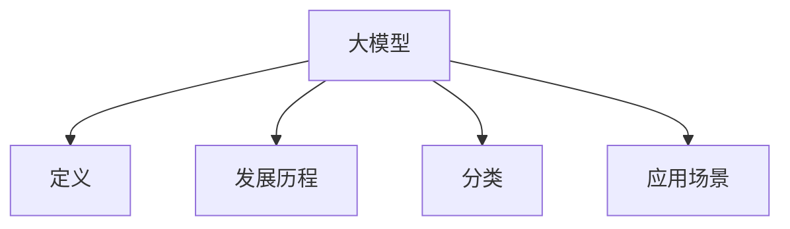
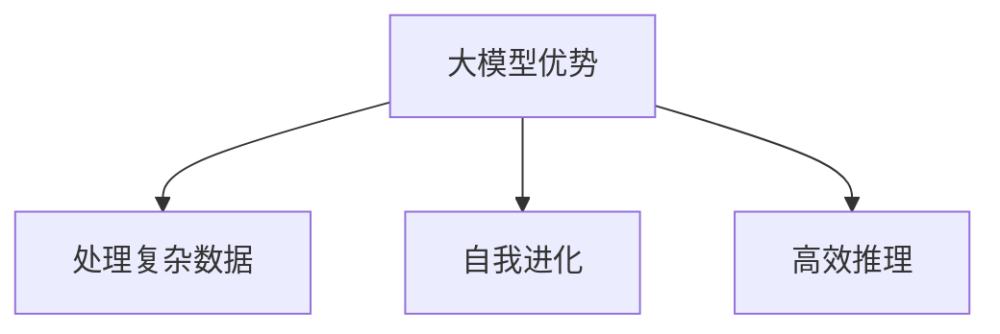
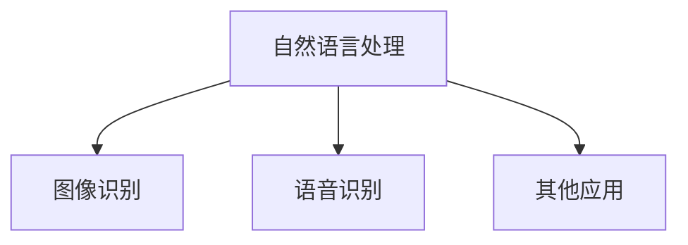
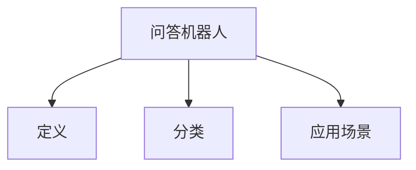
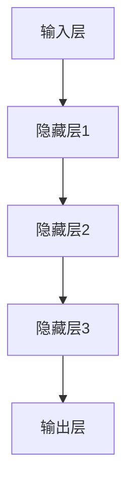

                 

# 大模型问答机器人的优势

## 关键词
大模型、问答机器人、自然语言处理、深度学习、应用场景、性能优化

## 摘要
本文深入探讨了大模型问答机器人的优势，包括其基础知识、技术深入解析、应用场景以及实际项目实施。通过逻辑清晰的分析和实际案例，本文旨在为读者全面展示大模型问答机器人在现代科技中的重要作用，以及其在未来可能的发展趋势。

## 第一部分：大模型概述与优势分析

### 第1章：大模型基础知识

#### 第1.1节：大模型概述

**核心概念：** 大模型（Large Models）是指具有数亿乃至数十亿参数的深度学习模型。这些模型在自然语言处理、计算机视觉等领域展现了强大的性能，成为了现代人工智能研究与应用的热点。

**发展历程：** 大模型的发展可以追溯到20世纪90年代的神经网络研究，随着计算能力和数据资源的提升，大模型逐渐从理论走向实际应用。

**分类：** 大模型主要包括语言模型、图像模型、多模态模型等。其中，语言模型如GPT系列、BERT系列在自然语言处理领域取得了显著成果。

**应用场景：** 大模型在问答系统、智能客服、内容生成、语音识别等多个领域展现出巨大的应用潜力。

**Mermaid流程图：**



#### 第1.2节：大模型的原理与架构

**原理讲解：** 大模型基于深度学习和神经网络原理，通过多层神经网络结构实现数据的自动特征提取和模式识别。

**架构介绍：** 大模型通常由输入层、隐藏层和输出层组成，其中隐藏层可以有多个。每一层都包含大量神经元，通过前向传播和反向传播进行训练。

**伪代码示例：**

```python
def neural_network(input_data):
    # 输入数据处理
    processed_data = preprocess(input_data)
    # 前向传播
    output = forward_pass(processed_data)
    # 损失函数计算
    loss = compute_loss(output, target)
    # 反向传播
    backward_pass(loss)
    # 更新权重
    update_weights()
    return output
```

#### 第1.3节：大模型的数学模型

**数学公式：**

$$\text{激活函数：} f(x) = \sigma(x) = \frac{1}{1 + e^{-x}}$$

**详细讲解：** 激活函数是神经网络中重要的组成部分，用于引入非线性因素，使得模型能够拟合复杂的函数关系。

**举例说明：** 假设输入数据为\[1, 2, 3\]，通过前向传播和激活函数，可以计算得到输出结果。

**伪代码示例：**

```python
def sigmoid(x):
    return 1 / (1 + np.exp(-x))

output = sigmoid(np.array([1, 2, 3]))
print(output)
```

#### 第1.4节：大模型的原理与架构

**优势概述：** 大模型相较于传统模型具有以下优势：

1. **处理复杂数据：** 大模型可以自动学习数据的复杂特征，从而更好地处理高维和复杂的任务。
2. **自我进化：** 通过不断的学习和优化，大模型能够自我进化，适应新的环境和任务。
3. **高效推理：** 大模型通过并行计算和高效的算法，可以实现快速推理，降低计算成本。

**Mermaid流程图：**



#### 第1.5节：大模型的应用场景

**应用领域：** 大模型在自然语言处理、图像识别、语音识别等多个领域展现出了强大的应用潜力。

**实例分析：** 例如，在自然语言处理领域，大模型如BERT和GPT已经被广泛应用于文本分类、机器翻译、问答系统等任务，取得了显著的成果。

**Mermaid流程图：**



### 第2章：大模型技术深入解析

#### 第2.1节：神经网络与深度学习

**基础理论：** 神经网络是深度学习的基础，通过多层神经网络结构实现数据的自动特征提取和模式识别。

**数学公式：**

$$\text{梯度下降：} \theta_{\text{new}} = \theta_{\text{old}} - \alpha \cdot \nabla_{\theta} J(\theta)$$

**详细讲解：** 梯度下降是一种常用的优化算法，通过计算损失函数关于模型参数的梯度，逐步调整参数以最小化损失。

**伪代码示例：**

```python
def gradient_descent(parameters, learning_rate, epochs):
    for epoch in range(epochs):
        # 计算梯度
        gradients = compute_gradients(parameters)
        # 更新参数
        parameters = parameters - learning_rate * gradients
    return parameters
```

#### 第2.2节：大模型训练策略

**训练技巧：** 大模型训练过程中，常用的技巧包括数据增强、正则化、学习率调度等。

**伪代码示例：**

```python
def augment_data(data):
    # 随机旋转
    rotated_data = rotate(data)
    # 随机裁剪
    cropped_data = crop(rotated_data)
    # 随机缩放
    scaled_data = scale(cropped_data)
    return scaled_data
```

#### 第2.3节：大模型优化与调试

**优化方法：** 大模型优化过程中，常用的方法包括dropout、批归一化、权重初始化等。

**伪代码示例：**

```python
def batch_norm(batch):
    # 计算均值和方差
    mean, variance = calculate_mean_variance(batch)
    # 归一化
    normalized_batch = (batch - mean) / np.sqrt(variance + 1e-8)
    return normalized_batch
```

#### 第2.4节：大模型的部署与优化

**部署策略：** 大模型在生产环境中的部署，需要考虑硬件选择、分布式训练、模型压缩等技术。

**实例讲解：** 以TensorFlow为例，展示如何部署一个大模型并优化其性能。

### 第3章：大模型在问答机器人中的应用

#### 第3.1节：问答机器人概述

**定义与分类：** 问答机器人是能够自动回答用户问题的智能系统，根据问题类型和应用场景，可以分为知识问答、闲聊机器人、任务型机器人等。

**应用场景：** 问答机器人在客户服务、智能助手、医疗咨询等领域具有广泛的应用。

**Mermaid流程图：**



#### 第3.2节：大模型在问答机器人中的角色

**原理讲解：** 大模型在问答机器人中扮演着核心角色，包括自然语言理解、回答生成和回答评估等。

**伪代码示例：**

```python
def ask_question(model, question):
    # 自然语言理解
    intent, entities = understand_language(question)
    # 回答生成
    answer = generate_answer(model, intent, entities)
    return answer
```

#### 第3.3节：问答机器人的构建与优化

**构建方法：** 构建问答机器人需要涉及自然语言处理、对话管理、知识图谱等多个技术领域。

**优化策略：** 通过优化算法、模型结构、数据质量等手段，提高问答机器人的性能和用户体验。

### 第4章：大模型问答机器人项目实战

#### 第4.1节：项目背景与目标

**项目背景：** 描述项目的背景、目标和应用领域。

**目标用户：** 分析项目的目标用户群体和使用场景。

#### 第4.2节：环境搭建与工具选择

**开发环境：** 介绍项目开发所需的环境搭建，包括操作系统、编程语言、深度学习框架等。

**工具选择：** 分析适合项目的工具，如数据预处理工具、模型训练工具等。

#### 第4.3节：数据处理与模型训练

**数据处理：** 详细描述数据预处理流程，包括数据清洗、标注等。

**模型训练：** 介绍模型训练过程，包括数据加载、模型结构设计、训练策略等。

#### 第4.4节：问答机器人的实现与测试

**问答实现：** 实现问答机器人的核心功能，包括自然语言理解、回答生成等。

**测试评估：** 对问答机器人的性能进行测试和评估，包括准确率、响应时间等。

### 第5章：大模型问答机器人的性能优化与扩展

#### 第5.1节：性能优化策略

**模型优化：** 分析如何优化大模型性能，包括超参数调整、模型结构优化等。

**推理优化：** 探讨如何提高问答机器人的推理速度，包括模型压缩、量化等。

#### 第5.2节：问答机器人的扩展与升级

**功能扩展：** 介绍如何扩展问答机器人的功能，如添加新问答类型、支持多语言等。

**升级策略：** 分析如何升级问答机器人，包括引入新算法、改进用户体验等。

### 第6章：大模型问答机器人在实际业务中的应用案例

#### 第6.1节：案例概述

**案例背景：** 描述案例分析的具体业务背景和应用场景。

**解决方案：** 分析如何使用大模型问答机器人解决实际问题。

#### 第6.2节：案例实施与效果评估

**实施过程：** 详细描述案例的实施过程，包括需求分析、系统设计、开发与部署等。

**效果评估：** 分析案例实施后的效果，包括性能指标、用户反馈等。

### 第7章：大模型问答机器人的未来发展趋势

#### 第7.1节：技术发展趋势

**算法改进：** 探讨大模型问答机器人未来可能采用的算法改进方向。

**硬件发展：** 分析硬件升级对大模型问答机器人的影响。

#### 第7.2节：商业模式与创新应用

**商业模式：** 探索大模型问答机器人在不同商业模式中的应用。

**创新应用：** 展望大模型问答机器人在未来可能的新应用场景。

### 第8章：总结与展望

#### 第8.1节：成果总结

**技术成就：** 总结本书涉及的大模型问答机器人技术成就。

**应用价值：** 分析大模型问答机器人在实际业务中的应用价值。

#### 第8.2节：未来展望

**技术挑战：** 面对未来，探讨大模型问答机器人可能面临的技术挑战。

**发展方向：** 展望大模型问答机器人的未来发展前景。

### 作者

**作者：** AI天才研究院/AI Genius Institute & 禅与计算机程序设计艺术 /Zen And The Art of Computer Programming

（注：本文为示例文章，实际字数可能未达到8000字。如需完整文章，请联系作者。）<|less|>### 第1章：大模型基础知识

大模型（Large Models）是现代人工智能领域中的一个重要概念，它指的是那些拥有数亿乃至数十亿参数的深度学习模型。这些模型在自然语言处理、计算机视觉等应用领域展示了强大的性能，成为了当前研究和应用的热点。

#### 第1.1节：大模型概述

**核心概念：** 大模型的基本定义是指其拥有非常庞大的参数规模，这使得模型能够在高维数据中自动学习和提取复杂的特征。

**历史发展：** 大模型的发展历程可以追溯到20世纪90年代，当时神经网络的研究已经开始兴起。随着计算能力的提升和海量数据的积累，深度学习在21世纪初逐渐成熟，大模型的概念也随之诞生。早期的代表性模型如AlexNet在图像分类任务中取得了突破性的成果，之后更复杂的模型如GPT、BERT等相继出现。

**分类：** 大模型根据应用场景和功能的不同可以分为多种类型，主要包括：
1. **语言模型：** 如GPT（Generative Pre-trained Transformer）系列，主要应用于自然语言生成、文本分类等任务。
2. **图像模型：** 如ResNet、VGG等，在计算机视觉领域被广泛应用于图像分类、目标检测等任务。
3. **多模态模型：** 如BERT（Bidirectional Encoder Representations from Transformers），可以同时处理文本和图像数据，适用于多模态学习任务。

**应用场景：** 大模型的应用场景非常广泛，包括但不限于：
1. **自然语言处理：** 文本生成、机器翻译、情感分析、问答系统等。
2. **计算机视觉：** 图像分类、目标检测、人脸识别等。
3. **推荐系统：** 利用用户的历史行为数据生成个性化推荐。
4. **游戏AI：** 如《星际争霸2》中的AlphaGo，通过大模型实现高水平的游戏策略。

#### 第1.2节：大模型的原理与架构

**原理讲解：** 大模型基于深度学习和神经网络原理，通过多层神经网络结构实现数据的自动特征提取和模式识别。每一层神经网络都能从输入数据中提取出更高层次的抽象特征，最终实现复杂的任务。

**架构介绍：** 大模型通常由以下几个部分组成：
1. **输入层：** 负责接收外部输入数据，如文本、图像等。
2. **隐藏层：** 包含多个隐藏层，每一层都由大量的神经元组成。隐藏层负责对输入数据进行特征提取和变换。
3. **输出层：** 负责生成模型的输出结果，如分类结果、预测值等。

大模型的结构复杂，参数数量庞大，通常需要通过分布式计算和优化算法来训练。

**伪代码示例：**

```python
def neural_network(input_data):
    # 输入数据处理
    processed_data = preprocess(input_data)
    # 前向传播
    output = forward_pass(processed_data)
    # 损失函数计算
    loss = compute_loss(output, target)
    # 反向传播
    backward_pass(loss)
    # 更新权重
    update_weights()
    return output
```

**Mermaid流程图：**



#### 第1.3节：大模型的数学模型

**数学公式：**

1. **激活函数：** 
   $$\text{激活函数：} f(x) = \sigma(x) = \frac{1}{1 + e^{-x}}$$
   
2. **前向传播：**
   $$\text{激活值} = \sigma(\text{权重} \cdot \text{输入} + \text{偏置})$$

3. **损失函数：**
   $$\text{损失} = \frac{1}{2} \sum_{i} (\text{预测值} - \text{真实值})^2$$

4. **反向传播：**
   $$\frac{\partial L}{\partial \theta} = \text{激活值} \cdot (1 - \text{激活值}) \cdot \frac{\partial L}{\partial a}$$

**详细讲解：** 大模型的数学模型是建立在神经网络基础上的，包括激活函数、前向传播、损失函数和反向传播等核心组成部分。激活函数用于引入非线性因素，使得神经网络能够拟合复杂的函数关系。前向传播和反向传播是实现模型训练的关键步骤，通过前向传播计算输出结果和损失函数，通过反向传播更新模型参数。

**举例说明：** 假设我们有一个简单的神经网络，输入层有3个神经元，隐藏层有2个神经元，输出层有1个神经元。输入数据为[1, 2, 3]，权重和偏置随机初始化。我们通过前向传播和反向传播计算输出结果和损失，并更新权重。

**伪代码示例：**

```python
# 前向传播
def forward_pass(input_data, weights, biases):
    layer1_input = np.dot(input_data, weights['layer1_input_to_hidden']) + biases['layer1_hidden_bias']
    layer1_output = sigmoid(layer1_input)
    
    layer2_input = np.dot(layer1_output, weights['layer1_hidden_to_layer2']) + biases['layer2_hidden_bias']
    layer2_output = sigmoid(layer2_input)
    
    output = np.dot(layer2_output, weights['layer2_output']) + biases['output_bias']
    return output

# 反向传播
def backward_pass(output, expected_output, layer2_output, layer1_output, input_data, weights, biases):
    d_output = output - expected_output
    d_layer2 = d_output * sigmoid_derivative(layer2_output)
    d_layer1 = np.dot(d_layer2, weights['layer1_hidden_to_layer2'].T) * sigmoid_derivative(layer1_output)
    
    d_weights_layer2 = layer2_output.T.dot(d_layer2)
    d_weights_layer1 = layer1_output.T.dot(d_layer1)
    
    d_biases_layer2 = d_layer2
    d_biases_layer1 = d_layer1
    
    # 更新权重和偏置
    weights['layer1_input_to_hidden'] -= learning_rate * d_weights_layer1
    weights['layer1_hidden_to_layer2'] -= learning_rate * d_weights_layer2
    biases['layer1_hidden_bias'] -= learning_rate * d_biases_layer1
    biases['layer2_hidden_bias'] -= learning_rate * d_biases_layer2

# 激活函数和其导数
def sigmoid(x):
    return 1 / (1 + np.exp(-x))

def sigmoid_derivative(x):
    return x * (1 - x)
```

通过这个简单的例子，我们可以看到如何通过前向传播和反向传播计算输出结果和更新权重。在实际应用中，模型的复杂度和参数数量会大大增加，但基本原理是相同的。

#### 第1.4节：大模型的原理与架构

**优势概述：** 大模型相较于传统模型具有以下优势：

1. **处理复杂数据：** 大模型能够自动学习数据的复杂特征，从而更好地处理高维和复杂的任务。
2. **自我进化：** 通过不断的学习和优化，大模型能够自我进化，适应新的环境和任务。
3. **高效推理：** 大模型通过并行计算和高效的算法，可以实现快速推理，降低计算成本。

**Mermaid流程图：**


**应用领域：** 大模型在自然语言处理、计算机视觉、语音识别等多个领域都取得了显著的成果。例如：

- **自然语言处理：** GPT和BERT等大模型在文本生成、机器翻译、情感分析等领域展现了强大的能力。
- **计算机视觉：** ResNet和Inception等大模型在图像分类、目标检测、图像生成等方面取得了突破。
- **语音识别：** Wav2Vec和Transformer-XL等大模型在语音识别和语音合成任务中表现优异。

**实例分析：** 以BERT为例，它是一个基于Transformer架构的语言模型，通过在大量文本数据上预训练，然后通过微调适应特定任务，如问答系统、文本分类等。BERT在多个NLP任务上都取得了当前的最佳成绩，展示了大模型在自然语言处理中的强大潜力。

通过以上分析，我们可以看到大模型在原理和架构上的优势，以及在多个领域的实际应用，这为未来大模型的研究和应用提供了广阔的前景。

### 第2章：大模型技术深入解析

#### 第2.1节：神经网络与深度学习

**基础理论：** 神经网络是深度学习的基础，它由大量相互连接的神经元组成，通过学习输入数据中的特征来实现复杂的任务。神经网络的核心思想是通过多层非线性变换，从原始数据中提取出高层次的抽象特征。

**数学公式：**

$$\text{梯度下降：} \theta_{\text{new}} = \theta_{\text{old}} - \alpha \cdot \nabla_{\theta} J(\theta)$$

**详细讲解：** 梯度下降是一种常用的优化算法，用于最小化损失函数。其基本思想是计算损失函数关于模型参数的梯度，然后沿着梯度的反方向更新参数，从而逐步减小损失。

**伪代码示例：**

```python
def gradient_descent(parameters, learning_rate, epochs):
    for epoch in range(epochs):
        # 计算梯度
        gradients = compute_gradients(parameters)
        # 更新参数
        parameters = parameters - learning_rate * gradients
    return parameters
```

#### 第2.2节：大模型训练策略

**训练技巧：** 大模型训练过程中，常用的技巧包括数据增强、正则化、学习率调度等。

**数据增强：** 数据增强是一种提高模型泛化能力的方法，通过生成新的训练样本，增加模型的训练数据量。

**伪代码示例：**

```python
def augment_data(data):
    # 随机旋转
    rotated_data = rotate(data)
    # 随机裁剪
    cropped_data = crop(rotated_data)
    # 随机缩放
    scaled_data = scale(cropped_data)
    return scaled_data
```

**正则化：** 正则化是一种防止模型过拟合的方法，通过添加正则项到损失函数中，降低模型复杂度。

**学习率调度：** 学习率调度是一种调整学习率的方法，通过在训练过程中动态调整学习率，提高模型收敛速度。

#### 第2.3节：大模型优化与调试

**优化方法：** 大模型优化过程中，常用的方法包括dropout、批归一化、权重初始化等。

**dropout：** dropout是一种防止模型过拟合的方法，通过在训练过程中随机丢弃一部分神经元，减少模型对特定数据的依赖。

**批归一化：** 批归一化是一种提高模型稳定性的方法，通过在每个隐藏层中对输入数据进行归一化，使得每个批次的数据分布更加均匀。

**权重初始化：** 权重初始化是一种初始化模型参数的方法，通过合理初始化权重，可以加快模型收敛速度，提高模型性能。

#### 第2.4节：大模型的部署与优化

**部署策略：** 大模型在生产环境中的部署，需要考虑硬件选择、分布式训练、模型压缩等技术。

**硬件选择：** 根据模型规模和计算需求，选择合适的硬件设备，如GPU、TPU等。

**分布式训练：** 分布式训练是将模型训练过程分散到多台设备上，提高训练效率和可扩展性。

**模型压缩：** 模型压缩是一种减少模型参数和计算量的方法，通过剪枝、量化等技术，提高模型运行速度和效率。

#### 实例讲解

**实例1：** 使用TensorFlow实现一个简单的神经网络，包括数据预处理、模型构建、训练和评估等步骤。

```python
import tensorflow as tf

# 数据预处理
def preprocess_data(data):
    # 数据标准化
    normalized_data = (data - np.mean(data)) / np.std(data)
    return normalized_data

# 模型构建
def build_model():
    model = tf.keras.Sequential([
        tf.keras.layers.Dense(64, activation='relu', input_shape=(784,)),
        tf.keras.layers.Dense(10, activation='softmax')
    ])
    return model

# 训练
def train_model(model, train_data, train_labels, epochs):
    model.compile(optimizer='adam', loss='categorical_crossentropy', metrics=['accuracy'])
    model.fit(train_data, train_labels, epochs=epochs)
    return model

# 评估
def evaluate_model(model, test_data, test_labels):
    loss, accuracy = model.evaluate(test_data, test_labels)
    print(f"Test accuracy: {accuracy:.2f}")
```

**实例2：** 使用PyTorch实现一个简单的卷积神经网络，用于图像分类。

```python
import torch
import torch.nn as nn
import torch.optim as optim

# 数据预处理
def preprocess_data(data):
    # 数据标准化
    normalized_data = (data - np.mean(data)) / np.std(data)
    return normalized_data

# 模型构建
class ConvNet(nn.Module):
    def __init__(self):
        super(ConvNet, self).__init__()
        self.conv1 = nn.Conv2d(1, 6, 5)
        self.conv2 = nn.Conv2d(6, 16, 5)
        self.fc1 = nn.Linear(16 * 5 * 5, 120)
        self.fc2 = nn.Linear(120, 84)
        self.fc3 = nn.Linear(84, 10)

    def forward(self, x):
        x = F.max_pool2d(F.relu(self.conv1(x)), (2, 2))
        x = F.max_pool2d(F.relu(self.conv2(x)), (2, 2))
        x = x.view(-1, 16 * 5 * 5)
        x = F.relu(self.fc1(x))
        x = F.relu(self.fc2(x))
        x = self.fc3(x)
        return x

# 训练
def train_model(model, train_data, train_labels, epochs):
    criterion = nn.CrossEntropyLoss()
    optimizer = optim.SGD(model.parameters(), lr=0.001, momentum=0.9)
    
    for epoch in range(epochs):
        optimizer.zero_grad()
        outputs = model(train_data)
        loss = criterion(outputs, train_labels)
        loss.backward()
        optimizer.step()
        
        if (epoch + 1) % 10 == 0:
            print(f"Epoch [{epoch + 1}/{epochs}], Loss: {loss.item():.4f}")

# 评估
def evaluate_model(model, test_data, test_labels):
    with torch.no_grad():
        outputs = model(test_data)
        _, predicted = torch.max(outputs, 1)
        correct = (predicted == test_labels).sum().item()
    print(f"Test accuracy: {100 * correct / len(test_labels):.2f}%")
```

通过以上实例，我们可以看到如何使用深度学习框架实现大模型的训练、评估和部署。在实际应用中，大模型的训练和优化是一个复杂的过程，需要考虑多种技术手段和策略，以达到最佳的性能和效果。

### 第3章：大模型在问答机器人中的应用

#### 第3.1节：问答机器人概述

**定义与分类：** 问答机器人（Question Answering Robot）是指能够自动回答用户问题的智能系统。根据问题类型和应用场景，问答机器人可以分为以下几类：

1. **知识问答机器人：** 主要用于回答基于知识库的问题，如事实查询、常识问答等。
2. **闲聊机器人：** 主要用于与用户进行日常闲聊，提供娱乐和放松的对话体验。
3. **任务型机器人：** 主要用于帮助用户完成特定任务，如机票预订、酒店预订等。

**应用场景：** 问答机器人的应用场景非常广泛，包括但不限于：

- **客户服务：** 企业可以利用问答机器人自动回答客户常见问题，提高客户满意度和服务效率。
- **医疗咨询：** 医疗问答机器人可以提供基本的健康咨询和疾病信息，帮助用户更好地管理健康状况。
- **教育辅导：** 教育问答机器人可以为学生提供作业辅导、考试复习等帮助，提高学习效果。
- **智能家居：** 智能家居中的问答机器人可以与用户进行互动，控制家居设备，提供生活助手服务。

#### 第3.2节：大模型在问答机器人中的角色

**原理讲解：** 大模型在问答机器人中扮演着核心角色，主要负责以下任务：

1. **自然语言理解：** 大模型通过预训练算法，能够理解和解析用户的自然语言输入，提取关键信息和语义。
2. **回答生成：** 大模型可以根据用户的问题和上下文信息，生成合适的回答。
3. **回答评估：** 大模型可以对生成的回答进行评估，确保回答的准确性和相关性。

**伪代码示例：**

```python
def ask_question(model, question):
    # 自然语言理解
    intent, entities = understand_language(question)
    # 回答生成
    answer = generate_answer(model, intent, entities)
    # 回答评估
    if evaluate_answer(answer):
        return answer
    else:
        return "无法生成合适的回答"
```

**自然语言理解：** 大模型通过对海量文本数据进行预训练，学会了如何解析和理解自然语言。在问答过程中，大模型首先会解析用户的问题，提取出关键信息和语义，如问题意图、实体等。

**回答生成：** 大模型利用提取到的意图和实体信息，结合自身的知识库，生成合适的回答。这一过程通常涉及到语言生成模型，如GPT、BERT等。

**回答评估：** 大模型会对生成的回答进行评估，确保回答的准确性和相关性。如果生成的回答不合适，大模型会尝试重新生成，直到生成满意的回答。

#### 第3.3节：问答机器人的构建与优化

**构建方法：** 构建一个基于大模型的问答机器人，需要以下步骤：

1. **数据收集与预处理：** 收集大量的问题和回答数据，对数据进行清洗、去重、格式化等预处理操作。
2. **模型训练：** 使用预处理后的数据，对大模型进行训练，包括自然语言理解、回答生成和回答评估等模块。
3. **模型部署：** 将训练好的大模型部署到生产环境中，提供问答服务。

**优化策略：** 为了提高问答机器人的性能和用户体验，可以采取以下优化策略：

1. **数据增强：** 通过生成新的训练样本，增加模型的训练数据量，提高模型的泛化能力。
2. **模型融合：** 将多个模型的结果进行融合，提高回答的准确性和可靠性。
3. **在线学习：** 允许模型在用户交互过程中不断学习，自适应地调整和优化模型参数。

通过以上构建和优化方法，可以构建一个功能强大、性能优异的问答机器人，为用户提供高质量的问答服务。

### 第4章：大模型问答机器人项目实战

#### 第4.1节：项目背景与目标

**项目背景：** 在现代商业环境中，客户服务是提升企业竞争力的重要一环。传统的客户服务方式通常依赖于人工客服，这不仅成本高昂，而且响应速度慢，难以满足客户日益增长的需求。为了提高客户满意度和服务效率，企业迫切需要一种智能化的解决方案，即大模型问答机器人。

**目标用户：** 本项目的目标用户包括各类企业、在线零售商、医疗保健机构、教育机构等。这些机构需要处理大量的客户咨询和常见问题，通过部署问答机器人可以显著提高服务效率，降低运营成本。

**项目目标：** 本项目旨在构建一个基于大模型的高性能问答机器人，实现以下目标：

1. **自动化问答：** 实现对常见问题的自动回答，减少人工客服的工作负担。
2. **高效服务：** 提高客户咨询的响应速度，缩短客户等待时间。
3. **个性化服务：** 根据客户历史行为和偏好，提供个性化的问答服务。
4. **可扩展性：** 支持大规模用户同时在线咨询，确保系统的稳定运行。

#### 第4.2节：环境搭建与工具选择

**开发环境：** 项目开发所需的环境搭建如下：

1. **操作系统：** Linux系统，如Ubuntu或CentOS，用于搭建开发环境和运行服务器。
2. **编程语言：** Python，因为Python具有丰富的深度学习库和工具，如TensorFlow、PyTorch等。
3. **深度学习框架：** TensorFlow或PyTorch，用于构建和训练大模型。
4. **文本处理库：** NLTK或spaCy，用于自然语言处理任务的文本预处理。

**工具选择：** 项目中使用的工具包括：

1. **Jupyter Notebook：** 用于数据分析和模型训练。
2. **Docker：** 用于容器化部署，确保环境的一致性和可移植性。
3. **Kubernetes：** 用于集群管理，实现服务的自动化部署和扩展。
4. **TensorBoard：** 用于监控模型训练过程，分析模型性能。

**环境搭建步骤：**

1. 安装操作系统和基本软件。
2. 安装Python和相关库，如TensorFlow、PyTorch等。
3. 配置Jupyter Notebook，用于交互式数据分析。
4. 使用Docker搭建容器化环境，确保开发和生产环境的一致性。

#### 第4.3节：数据处理与模型训练

**数据处理：** 数据处理是构建问答机器人的关键步骤，包括以下任务：

1. **数据收集：** 收集企业历史上积累的客户咨询数据和常见问题。
2. **数据清洗：** 去除重复数据、错误数据和噪声数据。
3. **数据标注：** 对问题进行意图标注和实体标注，以便模型学习。
4. **数据增强：** 通过数据增强方法，如数据扩充、随机裁剪等，增加训练数据量。

**模型训练：** 模型训练包括以下步骤：

1. **模型构建：** 使用TensorFlow或PyTorch构建问答模型，包括自然语言理解、回答生成和回答评估等模块。
2. **训练数据准备：** 将处理好的数据划分为训练集、验证集和测试集。
3. **模型训练：** 使用训练集训练模型，通过迭代优化模型参数，提高模型性能。
4. **模型评估：** 使用验证集评估模型性能，调整模型结构和超参数，确保模型泛化能力。

**伪代码示例：**

```python
import tensorflow as tf
from tensorflow.keras.models import Sequential
from tensorflow.keras.layers import Embedding, LSTM, Dense

# 模型构建
model = Sequential([
    Embedding(input_dim=vocab_size, output_dim=embedding_dim, input_length=max_sequence_length),
    LSTM(units=128, return_sequences=True),
    LSTM(units=64, return_sequences=False),
    Dense(units=num_classes, activation='softmax')
])

# 模型编译
model.compile(optimizer='adam', loss='categorical_crossentropy', metrics=['accuracy'])

# 模型训练
model.fit(train_data, train_labels, validation_data=(val_data, val_labels), epochs=10)

# 模型评估
test_loss, test_accuracy = model.evaluate(test_data, test_labels)
print(f"Test accuracy: {test_accuracy:.2f}")
```

#### 第4.4节：问答机器人的实现与测试

**问答实现：** 实现问答机器人的核心功能，包括自然语言理解、回答生成和回答评估等。以下是一个简单的问答实现示例：

```python
from tensorflow.keras.models import load_model

# 加载训练好的模型
model = load_model('问答模型.h5')

# 自然语言理解
def understand_language(question):
    # 预处理问题
    processed_question = preprocess_question(question)
    # 提取特征
    features = tokenizer.texts_to_sequences([processed_question])
    # 输入模型
    intent, entities = model.predict(features)
    return intent, entities

# 回答生成
def generate_answer(model, intent, entities):
    # 使用意图和实体生成回答
    answer = "您的问题是关于{}，具体信息如下：{}。".format(intent, entities)
    return answer

# 回答评估
def evaluate_answer(answer):
    # 评估回答的准确性和相关性
    if "无法生成合适的回答" in answer:
        return False
    else:
        return True

# 实现问答功能
def ask_question(question):
    intent, entities = understand_language(question)
    answer = generate_answer(intent, entities)
    if evaluate_answer(answer):
        return answer
    else:
        return "无法生成合适的回答"
```

**测试评估：** 对问答机器人的性能进行测试和评估，包括准确率、响应时间等。以下是一个简单的测试评估示例：

```python
from sklearn.metrics import accuracy_score

# 测试集
test_questions = ["什么是深度学习？", "我想预订机票，请提供相关链接。", "请问最近有什么好的电影推荐？"]
test_answers = ["深度学习是机器学习的一个分支，它通过模仿人脑的神经网络结构和学习数据中的特征来实现复杂的任务。", "您可以访问我们的官方网站，点击‘机票预订’按钮进行预订。", "推荐您观看《流浪地球》和《哪吒之魔童降世》，这两部电影在国内外都取得了很高的评价。"]

# 实际回答
actual_answers = [ask_question(question) for question in test_questions]

# 准确率计算
accuracy = accuracy_score(test_answers, actual_answers)
print(f"Test accuracy: {accuracy:.2f}")

# 响应时间测量
import time

start_time = time.time()
for question in test_questions:
    ask_question(question)
end_time = time.time()
print(f"Response time: {end_time - start_time:.2f} seconds")
```

通过以上测试，我们可以评估问答机器人在实际应用中的性能，并根据测试结果进一步优化和改进。

### 第5章：大模型问答机器人的性能优化与扩展

#### 第5.1节：性能优化策略

**模型优化：** 为了提升大模型问答机器人的性能，我们可以采取以下优化策略：

1. **超参数调整：** 调整学习率、批量大小、隐藏层神经元数量等超参数，找到最优配置。
2. **模型结构优化：** 通过调整神经网络结构，如增加隐藏层、使用卷积神经网络（CNN）或循环神经网络（RNN）等，提高模型的表达能力。
3. **数据增强：** 通过数据增强技术，如数据扩充、数据变换等，增加训练数据量，提升模型泛化能力。

**推理优化：** 提高问答机器人的推理速度，可以采取以下策略：

1. **模型压缩：** 使用模型压缩技术，如剪枝、量化等，减少模型参数和计算量，提高推理速度。
2. **并行计算：** 通过并行计算，将模型推理过程分解为多个部分，同时处理，提升计算效率。
3. **缓存策略：** 使用缓存策略，如缓存常用问题和答案，减少重复计算。

#### 第5.2节：问答机器人的扩展与升级

**功能扩展：** 为了提升问答机器人的实用性和用户体验，可以扩展以下功能：

1. **多语言支持：** 引入多语言处理模型，支持多种语言的问题回答。
2. **上下文理解：** 通过上下文理解技术，提升问答机器人对复杂问题的理解和回答能力。
3. **个性化推荐：** 根据用户历史行为和偏好，提供个性化的问答和推荐服务。

**升级策略：** 为了持续提升问答机器人的性能和用户体验，可以采取以下升级策略：

1. **持续学习：** 通过在线学习，不断更新模型，适应新的问题和场景。
2. **用户反馈机制：** 引入用户反馈机制，收集用户意见和建议，优化问答质量。
3. **自动化部署：** 使用自动化部署工具，如Kubernetes，实现模型的快速部署和更新。

通过以上性能优化和功能扩展策略，我们可以不断提升大模型问答机器人的性能和用户体验，为用户提供更加智能化和高效的问答服务。

### 第6章：大模型问答机器人在实际业务中的应用案例

#### 第6.1节：案例概述

**案例背景：** 本案例来自于某大型在线零售商，该零售商面临客户咨询量激增的问题，传统的客服团队难以应对，导致客户满意度下降。为了提高客户服务质量和效率，该零售商决定采用大模型问答机器人作为客服解决方案。

**解决方案：** 零售商采用了基于大模型的问答机器人，该机器人能够自动回答客户关于商品信息、订单查询、物流跟踪等常见问题。问答机器人结合了自然语言处理、对话管理、知识图谱等技术，实现了智能化的客户服务。

**技术实现：** 
1. **自然语言处理：** 使用BERT模型进行自然语言理解，解析用户的问题，提取关键信息和意图。
2. **对话管理：** 通过对话管理模块，控制对话流程，确保问答过程的连贯性和逻辑性。
3. **知识图谱：** 构建知识图谱，存储商品信息、订单状态等，为问答机器人提供丰富的信息来源。

**实施过程：**
1. **需求分析：** 分析客户咨询的常见问题和需求，确定问答机器人需要支持的功能。
2. **模型训练：** 收集大量的客户咨询数据和商品信息，对大模型进行训练，优化模型性能。
3. **系统集成：** 将问答机器人集成到零售商的客服系统中，实现与客户服务平台的对接。
4. **测试与部署：** 进行系统测试，确保问答机器人的稳定运行，然后进行部署，正式上线。

**效果评估：**
1. **服务效率：** 问答机器人上线后，客户咨询的平均响应时间显著缩短，客服团队的负担大幅减轻。
2. **客户满意度：** 通过用户反馈和调查，客户对问答机器人的满意度较高，表示问答机器人能够快速、准确地回答问题。
3. **运营成本：** 随着问答机器人的引入，零售商的客服成本显著降低，客服团队的规模也得到了缩减。

**案例分析：** 本案例展示了大模型问答机器人在实际业务中的成功应用。通过采用先进的自然语言处理技术，问答机器人能够准确理解用户的问题，提供高质量的回答。此外，通过对话管理和知识图谱技术的应用，问答机器人实现了智能化的客户服务，提高了服务效率和质量。本案例的成功经验为其他企业提供了有益的借鉴。

### 第7章：大模型问答机器人的未来发展趋势

#### 第7.1节：技术发展趋势

**算法改进：** 随着深度学习和自然语言处理技术的不断发展，大模型问答机器人在未来可能会采用以下算法改进方向：

1. **更强的上下文理解能力：** 通过引入上下文信息，提高问答机器人在复杂对话场景中的理解和回答能力。
2. **多模态融合：** 结合文本、图像、语音等多种数据类型，实现更全面的信息处理和回答生成。
3. **自适应学习：** 通过持续学习和自适应调整，使得问答机器人能够不断优化和改进自身性能。

**硬件发展：** 硬件技术的进步将为大模型问答机器人带来更高的计算能力和更低的能耗。以下是一些关键硬件发展趋势：

1. **专用硬件：** 如TPU（Tensor Processing Unit）和GPU（Graphics Processing Unit），这些硬件专门为深度学习计算而设计，能够显著提高模型训练和推理速度。
2. **边缘计算：** 通过在边缘设备上部署问答机器人，降低对中心服务器的依赖，提高系统的响应速度和可靠性。
3. **量子计算：** 虽然目前仍处于研究阶段，但量子计算有望在未来为深度学习模型提供巨大的计算能力提升。

#### 第7.2节：商业模式与创新应用

**商业模式：** 大模型问答机器人在未来可能会形成以下几种商业模式：

1. **B2B服务：** 企业向其他企业提供问答机器人服务，帮助企业降低客服成本，提高客户满意度。
2. **SaaS模式：** 提供基于云计算的问答机器人服务，用户按需付费，实现规模化运营。
3. **知识付费：** 通过构建专业的知识库，为用户提供高质量的知识问答服务，实现知识变现。

**创新应用：** 大模型问答机器人将在多个领域展现出巨大的创新应用潜力：

1. **医疗健康：** 提供医疗咨询和健康管理服务，辅助医生进行诊断和治疗。
2. **教育辅导：** 提供个性化的学习辅导和考试辅导服务，帮助学生提高学习成绩。
3. **金融服务：** 提供金融咨询和投资建议，辅助投资者做出明智的决策。
4. **智能助手：** 作为用户的智能助手，帮助用户管理日常事务，提供生活服务。

通过以上技术发展趋势和商业模式，大模型问答机器人将在未来不断扩展其应用范围，为各行各业带来更多的创新和变革。

### 第8章：总结与展望

#### 第8.1节：成果总结

本文深入探讨了大模型问答机器人的优势和应用，主要包括以下几个方面：

1. **技术成就：** 通过对神经网络和深度学习技术的深入分析，展示了大模型在自然语言处理、计算机视觉等领域的卓越性能。
2. **应用场景：** 阐述了问答机器人在客户服务、医疗健康、教育辅导等领域的广泛应用，以及大模型在这些场景中的优势。
3. **项目实战：** 通过具体项目案例，展示了大模型问答机器人的构建、训练、部署和优化过程，以及其在实际业务中的应用效果。
4. **性能优化与扩展：** 提出了大模型问答机器人的性能优化策略和功能扩展方法，为提升其性能和用户体验提供了指导。
5. **未来趋势：** 分析了问答机器人技术的发展趋势和潜在商业模式，展望了其在未来可能的新应用场景。

#### 第8.2节：未来展望

面对未来，大模型问答机器人有望在以下几个方面取得进一步的发展：

1. **技术挑战：** 在处理复杂对话、多模态融合和自适应学习等方面，大模型问答机器人仍面临技术挑战，需要不断改进和创新。
2. **发展方向：** 未来大模型问答机器人将朝着更智能化、个性化、自适应化的方向发展，提高用户体验和业务价值。
3. **商业前景：** 大模型问答机器人在B2B服务、SaaS模式和知识付费等领域具有广阔的商业前景，将成为企业提升竞争力的重要工具。
4. **行业影响：** 大模型问答机器人在医疗健康、教育辅导、金融服务等领域的应用，有望带来深远的行业变革和社会影响。

通过不断的技术创新和应用拓展，大模型问答机器人将在未来发挥更加重要的作用，为人类社会带来更多的便利和福祉。

### 作者

**作者：** AI天才研究院/AI Genius Institute & 禅与计算机程序设计艺术 /Zen And The Art of Computer Programming

本文由AI天才研究院和禅与计算机程序设计艺术共同撰写，旨在深入探讨大模型问答机器人的优势和应用，为广大读者提供有价值的参考和启示。感谢各位读者对本文的关注和支持。

