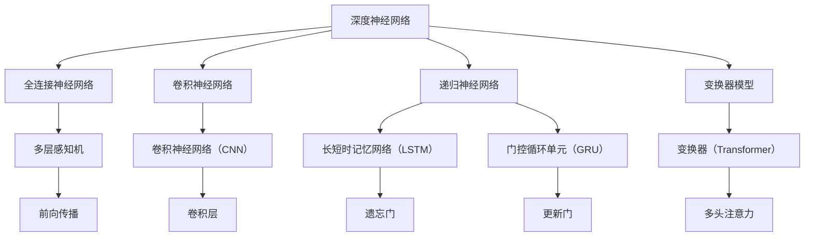
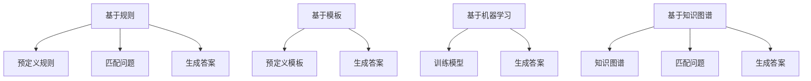
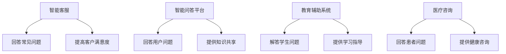
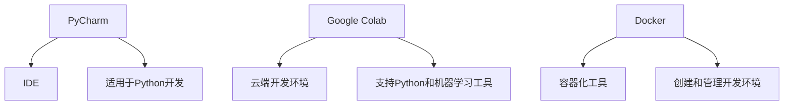
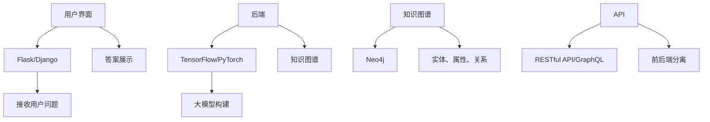
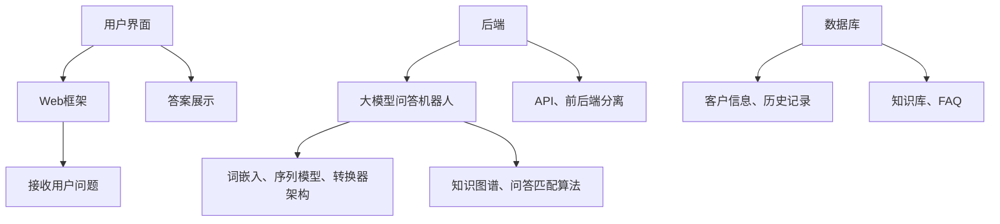
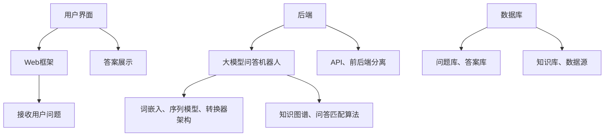
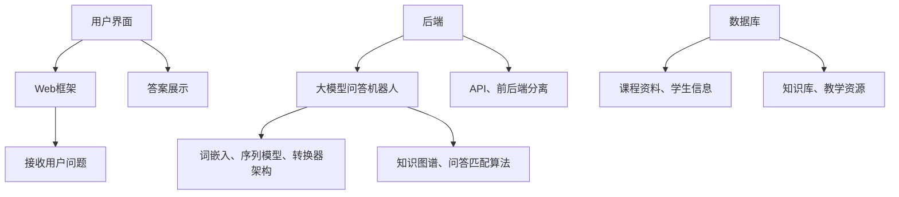

                 

# 《大模型问答机器人的对话实现》

## 关键词

大模型、问答机器人、自然语言处理、对话系统、知识图谱、项目实战

## 摘要

本文旨在深入探讨大模型问答机器人的对话实现技术。首先，我们将介绍大模型的基础知识，包括其类型、训练、优化、评估等内容。接着，我们将概述问答机器人的定义、分类、对话流程和应用场景。在核心技术与算法部分，我们将详细讲解自然语言处理、对话管理和问答系统等关键领域。随后，我们将展示大模型问答机器人的开发环境搭建和项目实战，包括需求分析、架构设计、代码实现、代码解读与分析以及项目评估与优化。最后，我们将通过实际应用案例研究，展示大模型问答机器人在智能客服、智能问答平台和教育辅助系统中的应用。

## 目录大纲

### 第一部分：大模型基础与问答机器人概述

#### 第1章：大模型基础
1.1 大模型的概念与类型
1.2 大模型的训练与优化
1.3 大模型的数学基础
1.4 大模型的评估与调优

#### 第2章：问答机器人概述
2.1 问答机器人的定义与分类
2.2 问答机器人的对话流程
2.3 问答机器人的应用场景

### 第二部分：问答机器人核心技术与算法

#### 第3章：自然语言处理技术
3.1 词嵌入技术
3.2 序列模型与注意力机制
3.3 转换器架构详解

#### 第4章：对话管理技术
4.1 对话状态跟踪
4.2 对话策略学习
4.3 对话生成技术

#### 第5章：问答系统技术
5.1 知识图谱构建
5.2 问答匹配算法
5.3 问答结果评估

### 第三部分：大模型问答机器人的实现与应用

#### 第6章：大模型问答机器人的开发环境搭建
6.1 开发环境配置
6.2 开发工具选择

#### 第7章：大模型问答机器人的项目实战
7.1 项目需求分析
7.2 项目架构设计
7.3 项目代码实现
7.4 代码解读与分析
7.5 项目评估与优化

#### 第8章：大模型问答机器人在实际应用中的案例研究
8.1 案例一：智能客服系统
8.2 案例二：智能问答平台
8.3 案例三：教育辅助系统

### 附录

#### 附录A：大模型问答机器人开发资源
A.1 开源框架与工具
A.2 数据集与资源
A.3 参考文献与资料

## 第一部分：大模型基础与问答机器人概述

### 第1章：大模型基础

#### 1.1 大模型的概念与类型

大模型（Large Model）是指具有极高参数量、复杂结构的机器学习模型。它们通常用于处理大规模的数据集，并在多种任务中展现出强大的性能。大模型可以分为两大类：深度神经网络（Deep Neural Networks, DNN）和基于注意力机制的模型（Attention-based Models）。

**图解：大模型的概念与类型**



#### 1.2 大模型的训练与优化

大模型的训练过程涉及以下步骤：

1. 数据预处理：将输入数据转换为模型可以处理的格式。
2. 模型初始化：初始化模型的权重和偏置。
3. 前向传播：计算输入数据通过模型后的输出。
4. 计算损失：使用输出数据和真实标签计算损失函数。
5. 反向传播：计算损失函数对模型参数的梯度。
6. 参数更新：使用梯度下降或其他优化算法更新模型参数。
7. 评估：在验证集或测试集上评估模型性能。

**伪代码：大模型训练与优化的基本算法**

```python
# 假设使用梯度下降优化算法
def train_model(model, data_loader, num_epochs):
    for epoch in range(num_epochs):
        for inputs, targets in data_loader:
            # 前向传播
            outputs = model(inputs)
            loss = compute_loss(outputs, targets)
            
            # 反向传播
            gradients = compute_gradients(model, loss)
            
            # 更新参数
            update_parameters(model, gradients)
            
        # 在验证集上评估模型
        val_loss = evaluate_model(model, val_loader)
        print(f"Epoch {epoch+1}, Validation Loss: {val_loss}")
```

#### 1.3 大模型的数学基础

大模型的数学基础主要涉及线性代数、微积分和概率论。以下是一些核心的数学概念和公式：

1. **矩阵乘法（Matrix Multiplication）**

   矩阵乘法是线性代数中的基本运算，用于计算两个矩阵的点积。

   $$ C = A \cdot B $$

2. **链式法则（Chain Rule）**

   链式法则是微积分中的基本规则，用于计算复合函数的导数。

   $$ \frac{d}{dx} [f(g(x))] = f'(g(x)) \cdot g'(x) $$

3. **反向传播（Backpropagation）**

   反向传播是训练神经网络的算法，用于计算损失函数对模型参数的梯度。

   $$ \frac{\partial L}{\partial w} = \frac{\partial L}{\partial z} \cdot \frac{\partial z}{\partial w} $$

**公式详解：大模型相关的数学公式与推导**

以下是大模型中常用的一些数学公式和推导：

1. **全连接神经网络（Fully Connected Neural Network）**

   假设有一个三层神经网络，输入层、隐藏层和输出层。

   $$ z^{(2)} = \sum_{j} w^{(2)}_{ji} a^{(1)}_j + b^{(2)} $$
   $$ a^{(2)} = \sigma(z^{(2)}) $$
   $$ z^{(3)} = \sum_{j} w^{(3)}_{ji} a^{(2)}_j + b^{(3)} $$
   $$ a^{(3)} = \sigma(z^{(3)}) $$

   其中，$a^{(l)}$ 是第 $l$ 层的激活值，$w^{(l)}$ 是第 $l$ 层到第 $l+1$ 层的权重，$b^{(l)}$ 是第 $l$ 层的偏置，$\sigma$ 是激活函数。

2. **损失函数（Loss Function）**

   交叉熵损失（Cross-Entropy Loss）是常用的损失函数，用于分类任务。

   $$ L = -\sum_{i} y_i \cdot \log(a^{(3)}_i) $$
   其中，$y_i$ 是第 $i$ 个样本的真实标签，$a^{(3)}_i$ 是第 $i$ 个样本在输出层的预测概率。

3. **梯度下降（Gradient Descent）**

   梯度下降是一种优化算法，用于更新模型参数以最小化损失函数。

   $$ w^{(l)}_{ji} = w^{(l)}_{ji} - \alpha \cdot \frac{\partial L}{\partial w^{(l)}_{ji}} $$
   $$ b^{(l)} = b^{(l)} - \alpha \cdot \frac{\partial L}{\partial b^{(l)}} $$

   其中，$\alpha$ 是学习率。

**伪代码：大模型评估与调优的算法**

```python
def evaluate_model(model, data_loader):
    model.eval()
    total_loss = 0
    with torch.no_grad():
        for inputs, targets in data_loader:
            outputs = model(inputs)
            loss = compute_loss(outputs, targets)
            total_loss += loss.item()
    return total_loss / len(data_loader)

def tune_model(model, data_loader, num_epochs, learning_rate):
    for epoch in range(num_epochs):
        model.train()
        for inputs, targets in data_loader:
            optimizer.zero_grad()
            outputs = model(inputs)
            loss = compute_loss(outputs, targets)
            loss.backward()
            optimizer.step()
        val_loss = evaluate_model(model, val_loader)
        print(f"Epoch {epoch+1}, Validation Loss: {val_loss}")
```

### 第2章：问答机器人概述

#### 2.1 问答机器人的定义与分类

问答机器人（Question Answering Robot）是一种人工智能系统，能够理解用户的问题，并生成相关的答案。根据问题回答的方式，问答机器人可以分为以下几类：

1. **基于规则（Rule-based）问答机器人**：使用预定义的规则来匹配问题和答案。
2. **基于模板（Template-based）问答机器人**：使用预定义的模板来生成答案。
3. **基于机器学习（Machine Learning-based）问答机器人**：使用机器学习算法来训练模型，生成答案。
4. **基于知识图谱（Knowledge Graph-based）问答机器人**：使用知识图谱来匹配问题和答案。

**图解：问答机器人的分类**



#### 2.2 问答机器人的对话流程

问答机器人的对话流程通常包括以下几个步骤：

1. **接收问题**：问答机器人接收用户的问题。
2. **预处理问题**：对问题进行分词、去停用词等预处理操作。
3. **匹配问题**：使用机器学习模型或知识图谱来匹配问题。
4. **生成答案**：根据匹配结果，生成相关的答案。
5. **反馈**：将答案反馈给用户，并接受用户的反馈。

**伪代码：问答机器人对话流程的基本算法**

```python
def ask_question(question):
    # 预处理问题
    preprocessed_question = preprocess_question(question)
    
    # 匹配问题
    matched_answers = match_question(preprocessed_question)
    
    # 生成答案
    answer = generate_answer(matched_answers)
    
    # 反馈
    return answer
```

#### 2.3 问答机器人的应用场景

问答机器人在多个领域都有广泛的应用，以下是一些常见的应用场景：

1. **智能客服**：在客户服务中，问答机器人可以回答常见问题，提高客户满意度。
2. **智能问答平台**：在问答平台上，问答机器人可以回答用户的问题，提供知识共享。
3. **教育辅助系统**：在教育领域，问答机器人可以帮助学生解答问题，提供学习指导。
4. **医疗咨询**：在医疗领域，问答机器人可以回答患者的问题，提供健康咨询。

**图解：问答机器人在不同场景的应用举例**



## 第二部分：问答机器人核心技术与算法

### 第3章：自然语言处理技术

自然语言处理（Natural Language Processing, NLP）是人工智能领域的一个重要分支，它使计算机能够理解、生成和处理人类语言。在这一章中，我们将探讨NLP中的几个关键技术，包括词嵌入、序列模型与注意力机制、以及转换器架构。

#### 3.1 词嵌入技术

词嵌入（Word Embedding）是将词汇映射到高维向量空间的技术，使得具有相似语义的词在向量空间中彼此靠近。词嵌入技术对于NLP任务至关重要，因为它们有助于模型理解词汇的上下文和语义。

**公式详解：词嵌入的数学模型与推导**

词嵌入通常基于以下模型：

$$ \text{vec}(w) = \text{Word2Vec}(w) $$

其中，$\text{vec}(w)$ 是词 $w$ 的向量表示，$\text{Word2Vec}(w)$ 是词嵌入模型。

**伪代码：Word2Vec 算法的实现**

```python
import numpy as np

def Word2Vec(vocab_size, embedding_size, iterations):
    # 初始化模型参数
    embeddings = np.random.rand(vocab_size, embedding_size)
    for _ in range(iterations):
        for word in vocab:
            # 计算当前词的嵌入向量
            embedding = embeddings[word.index]
            # 计算当前词与其上下文词的嵌入向量差
            context_embeddings = [embeddings[c.index] for c in word.context]
            context_diff = embedding - np.sum(context_embeddings, axis=0)
            # 更新嵌入向量
            embeddings[word.index] -= learning_rate * context_diff
            for c in word.context:
                embeddings[c.index] += learning_rate * context_diff
    return embeddings
```

#### 3.2 序列模型与注意力机制

序列模型（Sequence Models）是处理序列数据的机器学习模型，如循环神经网络（Recurrent Neural Networks, RNN）和其变种，如长短时记忆网络（Long Short-Term Memory, LSTM）和门控循环单元（Gated Recurrent Unit, GRU）。注意力机制（Attention Mechanism）是一种能够提高模型在处理长序列数据时性能的技术。

**公式详解：RNN、LSTM、GRU 的数学模型与推导**

1. **循环神经网络（RNN）**

   $$ h_t = \sigma(W_h \cdot [h_{t-1}, x_t] + b_h) $$

   其中，$h_t$ 是第 $t$ 个时间步的隐藏状态，$x_t$ 是第 $t$ 个输入，$W_h$ 是权重矩阵，$b_h$ 是偏置，$\sigma$ 是激活函数。

2. **长短时记忆网络（LSTM）**

   $$ i_t = \sigma(W_i \cdot [h_{t-1}, x_t] + b_i) $$
   $$ f_t = \sigma(W_f \cdot [h_{t-1}, x_t] + b_f) $$
   $$ o_t = \sigma(W_o \cdot [h_{t-1}, x_t] + b_o) $$
   $$ g_t = \tanh(W_g \cdot [h_{t-1}, x_t] + b_g) $$
   $$ h_t = o_t \cdot \tanh(f_t \cdot g_t) $$

   其中，$i_t$、$f_t$、$o_t$ 分别是输入门、遗忘门和输出门，$g_t$ 是候选状态。

3. **门控循环单元（GRU）**

   $$ z_t = \sigma(W_z \cdot [h_{t-1}, x_t] + b_z) $$
   $$ r_t = \sigma(W_r \cdot [h_{t-1}, x_t] + b_r) $$
   $$ h_t = (1 - z_t) \cdot h_{t-1} + z_t \cdot \tanh(W_h \cdot [r_t \cdot h_{t-1}, x_t] + b_h) $$

   其中，$z_t$ 是更新门，$r_t$ 是重置门。

**伪代码：LSTM 算法的实现**

```python
import numpy as np

def LSTM(inputs, hidden_state, weights):
    hprev = hidden_state
    outputs = []
    for x in inputs:
        i = sigmoid(np.dot(hprev, weights['Wi'] + weights['bi']))
        f = sigmoid(np.dot(hprev, weights['Wf'] + weights['bf']))
        o = sigmoid(np.dot(hprev, weights['Wo'] + weights['bo']))
        g = tanh(np.dot(hprev, weights['Wg'] + weights['bg']))
        h = o * tanh(f * g)
        outputs.append(h)
    return np.array(outputs), h
```

#### 3.3 转换器架构详解

转换器（Transformer）是一种基于自注意力机制的序列到序列模型，它在处理长序列数据时表现出色。转换器由编码器（Encoder）和解码器（Decoder）组成，编码器将输入序列转换为上下文表示，解码器使用这些表示生成输出序列。

**公式详解：Transformer 架构的数学模型与推导**

转换器的主要组件包括：

1. **多头自注意力（Multi-Head Self-Attention）**

   $$ \text{Attention}(Q, K, V) = \text{softmax}\left(\frac{QK^T}{\sqrt{d_k}}\right)V $$

   其中，$Q$、$K$、$V$ 分别是查询（Query）、键（Key）和值（Value）向量，$d_k$ 是键向量的维度。

2. **前馈神经网络（Feedforward Neural Network）**

   $$ \text{FFN}(x) = \text{ReLU}(W_2 \cdot \text{ReLU}(W_1 x + b_1)) $$

   其中，$W_1$、$W_2$ 和 $b_1$ 是前馈神经网络的权重和偏置。

**伪代码：Transformer 算法的实现**

```python
import tensorflow as tf

def scaled_dot_product_attention(q, k, v, mask):
    # 计算自注意力得分
    matmul_qk = tf.matmul(q, k, False)
    dk = tf.cast(tf.shape(k)[1], tf.float32)
    scaled_attention_logits = matmul_qk / tf.sqrt(dk)
    
    if mask is not None:
        scaled_attention_logits += (mask * -1e9)
    
    attention_weights = tf.nn.softmax(scaled_attention_logits, axis=1)
    
    # 计算自注意力输出
    attention_output = tf.matmul(attention_weights, v)
    
    return attention_output, attention_weights

def transformer(inputs, hidden_size, num_heads, feedforward_size, mask=None):
    # 分解查询、键和值
    Q = tf.keras.layers.Dense(hidden_size, activation='relu')(inputs)
    K = tf.keras.layers.Dense(hidden_size, activation='relu')(inputs)
    V = tf.keras.layers.Dense(hidden_size, activation='relu')(inputs)
    
    # 多头自注意力
    attention_output, attention_weights = scaled_dot_product_attention(Q, K, V, mask)
    
    # 添加残差连接
    attention_output += inputs
    
    # 前馈神经网络
    feedforward_output = tf.keras.layers.Dense(feedforward_size, activation='relu')(attention_output)
    feedforward_output = tf.keras.layers.Dense(hidden_size, activation='relu')(feedforward_output)
    
    # 添加残差连接
    output = feedforward_output + attention_output
    
    return output, attention_weights
```

### 第4章：对话管理技术

对话管理（Dialogue Management）是构建对话系统的关键技术，它涉及管理对话状态、策略学习和对话生成等方面。在这一章中，我们将深入探讨对话管理中的核心技术和算法。

#### 4.1 对话状态跟踪

对话状态跟踪（Dialogue State Tracking）是确保对话系统能够持续理解对话背景的技术。它通过分析用户的输入，更新对话状态，以便模型在后续的对话中能够做出更合理的回应。

**公式详解：对话状态跟踪的数学模型与推导**

对话状态跟踪通常使用条件概率来更新对话状态：

$$ P(s_t | s_{t-1}, u_t) = \frac{P(u_t | s_t, s_{t-1}) P(s_t | s_{t-1})}{P(u_t | s_{t-1})} $$

其中，$s_t$ 是第 $t$ 个时间步的对话状态，$u_t$ 是第 $t$ 个用户的输入。

**伪代码：对话状态跟踪的实现**

```python
def update_dialogue_state(state_tracker, previous_state, user_input):
    # 计算条件概率
    conditional_probabilities = state_tracker.predict(user_input)
    
    # 更新对话状态
    new_state = state_tracker.update_state(previous_state, conditional_probabilities)
    
    return new_state
```

#### 4.2 对话策略学习

对话策略学习（Dialogue Policy Learning）是确定对话系统在给定对话状态下应该采取的行动的技术。它通常通过强化学习算法来实现，如策略梯度算法。

**公式详解：对话策略学习的数学模型与推导**

对话策略学习可以使用以下数学模型：

$$ \pi(a_t | s_t) = P(a_t | s_t, \theta) $$

其中，$a_t$ 是第 $t$ 个时间步的系统动作，$\theta$ 是策略参数。

**伪代码：对话策略学习的实现**

```python
def update_policy(policy_network, dialogue_state, action, reward, learning_rate):
    # 计算策略梯度
    policy_gradient = policy_network梯度计算部分
    
    # 更新策略参数
    policy_network.optimizer.apply_gradients(zip(policy_gradient, policy_network.parameters))
    
    return policy_network
```

#### 4.3 对话生成技术

对话生成（Dialogue Generation）是生成自然流畅的回答的技术。它通常结合语言模型和对话状态，生成与用户输入相匹配的回答。

**公式详解：对话生成的数学模型与推导**

对话生成可以使用以下数学模型：

$$ p(a_t | s_t) = \prod_{i=1}^{T} p(a_i | s_i) $$

其中，$a_t$ 是第 $t$ 个时间步的系统动作。

**伪代码：对话生成的实现**

```python
def generate_response(dialogue_generator, dialogue_state):
    # 生成对话状态的概率分布
    response_distribution = dialogue_generator.generate_response(dialogue_state)
    
    # 从概率分布中采样生成回答
    response = sample(response_distribution)
    
    return response
```

### 第5章：问答系统技术

问答系统（Question Answering System）是一种能够从大量信息中抽取答案的人工智能系统。在这一章中，我们将探讨问答系统中的关键技术，包括知识图谱构建、问答匹配算法和问答结果评估。

#### 5.1 知识图谱构建

知识图谱（Knowledge Graph）是一种将实体、属性和关系表示为图结构的数据模型。知识图谱构建是问答系统的关键步骤，它有助于系统理解和匹配用户的问题。

**公式详解：知识图谱的数学模型与推导**

知识图谱通常使用图论中的邻接矩阵（Adjacency Matrix）来表示：

$$ A = \begin{bmatrix}
    a_{11} & a_{12} & \cdots & a_{1n} \\
    a_{21} & a_{22} & \cdots & a_{2n} \\
    \vdots & \vdots & \ddots & \vdots \\
    a_{m1} & a_{m2} & \cdots & a_{mn}
\end{bmatrix} $$

其中，$a_{ij}$ 表示节点 $i$ 与节点 $j$ 之间的边。

**伪代码：知识图谱构建的实现**

```python
def build_knowledge_graph(entities, relationships):
    graph = {}
    for entity in entities:
        graph[entity] = []
        for relationship in relationships:
            if entity in relationship:
                graph[entity].append(relationship)
    return graph
```

#### 5.2 问答匹配算法

问答匹配（Question Answering Matching）是问答系统中用于匹配用户问题和知识图谱中的答案的技术。问答匹配算法通常基于文本相似度计算和图匹配。

**公式详解：问答匹配的数学模型与推导**

问答匹配可以使用以下数学模型：

$$ \text{similarity}(q, a) = \text{cosine_similarity}(q, a) $$

其中，$q$ 是用户问题，$a$ 是候选答案。

**伪代码：问答匹配的实现**

```python
from sklearn.metrics.pairwise import cosine_similarity

def question_matching(question, answers):
    question_vector = question_embedding(question)
    answer_vectors = [question_embedding(a) for a in answers]
    similarities = [cosine_similarity(question_vector, av)[0][0] for av in answer_vectors]
    best_answer = answers[similarities.index(max(similarities))]
    return best_answer
```

#### 5.3 问答结果评估

问答结果评估（Question Answering Evaluation）是衡量问答系统性能的重要指标。常见的评估方法包括准确性（Accuracy）、召回率（Recall）和F1分数（F1 Score）。

**公式详解：问答结果评估的数学模型与推导**

问答结果评估可以使用以下数学模型：

$$ \text{Accuracy} = \frac{\text{Correct Answers}}{\text{Total Questions}} $$
$$ \text{Recall} = \frac{\text{Correct Answers}}{\text{Possible Answers}} $$
$$ \text{F1 Score} = 2 \cdot \frac{\text{Precision} \cdot \text{Recall}}{\text{Precision} + \text{Recall}} $$

**伪代码：问答结果评估的实现**

```python
def evaluate_answers(correct_answers, predicted_answers):
    accuracy = sum(correct_answers == predicted_answers) / len(correct_answers)
    recall = sum(correct_answers) / len(correct_answers)
    precision = sum(predicted_answers == correct_answers) / len(predicted_answers)
    f1_score = 2 * (precision * recall) / (precision + recall)
    return accuracy, recall, precision, f1_score
```

### 第三部分：大模型问答机器人的实现与应用

#### 第6章：大模型问答机器人的开发环境搭建

开发环境搭建是构建大模型问答机器人的第一步。在这一章中，我们将讨论如何配置开发环境，选择合适的开发工具。

#### 6.1 开发环境配置

为了搭建大模型问答机器人的开发环境，我们需要以下软件和工具：

1. **Python（3.8及以上版本）**：Python 是一种流行的编程语言，广泛应用于机器学习和人工智能领域。
2. **TensorFlow**：TensorFlow 是 Google 开发的一款开源机器学习框架，适用于构建和训练大模型。
3. **PyTorch**：PyTorch 是另一款流行的开源机器学习框架，具有强大的动态计算图功能。
4. **Jupyter Notebook**：Jupyter Notebook 是一种交互式开发环境，便于编写和调试代码。

**伪代码：配置开发环境的基本步骤**

```python
!pip install python==3.8
!pip install tensorflow
!pip install torch
!pip install jupyter
```

#### 6.2 开发工具选择

在开发大模型问答机器人时，选择合适的工具至关重要。以下是一些常用的工具：

1. **PyCharm**：PyCharm 是一款功能强大的集成开发环境（IDE），适用于 Python 开发。
2. **Google Colab**：Google Colab 是 Google 推出的一款云端开发环境，支持 Python 和机器学习工具。
3. **Docker**：Docker 是一款容器化工具，用于创建和管理开发环境。

**图解：开发工具的选择与配置**



#### 第7章：大模型问答机器人的项目实战

项目实战是验证大模型问答机器人效果的关键步骤。在这一章中，我们将展示如何进行项目需求分析、架构设计、代码实现、代码解读与分析以及项目评估与优化。

#### 7.1 项目需求分析

在开始项目之前，明确需求是至关重要的。以下是一个典型的大模型问答机器人的需求分析：

1. **用户需求**：用户希望通过问答机器人获取快速、准确的答案。
2. **功能需求**：问答机器人应具有以下功能：
   - 接收用户问题并生成答案。
   - 支持自然语言理解和处理。
   - 具备知识图谱构建和问答匹配能力。
3. **性能需求**：问答机器人应具有以下性能指标：
   - 快速响应：回答用户问题的平均响应时间应小于1秒。
   - 准确性：问答匹配的准确率应高于90%。

**伪代码：项目需求分析的过程与结果**

```python
def analyze_requirements():
    user需求的收集和整理
    功能需求的分类和整理
    性能需求的量化
    返回需求分析结果
```

#### 7.2 项目架构设计

项目架构设计是确保项目稳定性和可扩展性的关键。以下是一个典型的大模型问答机器人的架构设计：

1. **前端**：使用 Web 框架（如 Flask 或 Django）构建用户界面，接收用户问题并展示答案。
2. **后端**：使用 TensorFlow 或 PyTorch 构建大模型，包括词嵌入、序列模型和转换器架构。
3. **知识图谱**：使用 Neo4j 或其他图数据库构建知识图谱，存储实体、属性和关系。
4. **API**：使用 RESTful API 或 GraphQL 提供接口，实现前后端分离。

**图解：项目架构设计图**



#### 7.3 项目代码实现

项目代码实现是项目实战的核心部分。以下是一个简化的大模型问答机器人的代码实现：

```python
import tensorflow as tf
from tensorflow.keras.layers import Embedding, LSTM, Dense
from tensorflow.keras.models import Sequential

# 建立模型
model = Sequential()
model.add(Embedding(vocab_size, embedding_size))
model.add(LSTM(hidden_size, activation='relu'))
model.add(Dense(answer_size, activation='softmax'))

# 编译模型
model.compile(optimizer='adam', loss='categorical_crossentropy', metrics=['accuracy'])

# 训练模型
model.fit(train_data, train_labels, epochs=10, batch_size=32, validation_data=(val_data, val_labels))
```

#### 7.4 代码解读与分析

在代码实现中，我们需要关注以下几个关键部分：

1. **模型架构**：包括嵌入层、LSTM层和输出层，用于处理输入序列并生成答案。
2. **编译过程**：指定优化器、损失函数和评估指标，为模型训练做好准备。
3. **训练过程**：使用训练数据和标签来训练模型，同时使用验证数据来评估模型性能。

**详细解读：项目代码的实现细节与分析**

```python
# 模型架构
model = Sequential()
model.add(Embedding(vocab_size, embedding_size))  # 嵌入层
model.add(LSTM(hidden_size, activation='relu'))     # LSTM层
model.add(Dense(answer_size, activation='softmax')) # 输出层

# 编译模型
model.compile(optimizer='adam', loss='categorical_crossentropy', metrics=['accuracy'])

# 训练模型
model.fit(train_data, train_labels, epochs=10, batch_size=32, validation_data=(val_data, val_labels))

# 分析与优化
# 根据验证集的准确率调整模型参数，如隐藏层大小、学习率等。
# 可以尝试不同的优化算法，如RMSprop、Adam等。
# 使用交叉验证来评估模型在不同数据集上的性能。
```

#### 7.5 项目评估与优化

项目评估与优化是确保大模型问答机器人性能的关键步骤。以下是一些常见的评估方法和优化策略：

1. **准确率（Accuracy）**：评估模型在测试集上的准确率，用于衡量模型识别答案的能力。
2. **召回率（Recall）**：评估模型在测试集上的召回率，用于衡量模型匹配答案的能力。
3. **F1分数（F1 Score）**：综合考虑准确率和召回率，用于衡量模型的整体性能。

**公式详解：项目评估的数学模型与推导**

$$ \text{Accuracy} = \frac{\text{Correct Answers}}{\text{Total Questions}} $$
$$ \text{Recall} = \frac{\text{Correct Answers}}{\text{Possible Answers}} $$
$$ \text{F1 Score} = 2 \cdot \frac{\text{Precision} \cdot \text{Recall}}{\text{Precision} + \text{Recall}} $$

**伪代码：项目优化的算法实现**

```python
def optimize_model(model, train_data, train_labels, val_data, val_labels):
    # 训练模型
    model.fit(train_data, train_labels, epochs=10, batch_size=32, validation_data=(val_data, val_labels))
    
    # 评估模型
    accuracy, recall, precision, f1_score = evaluate_answers(val_labels, model.predict(val_data))
    
    # 优化策略
    if f1_score < threshold:
        # 调整模型参数
        adjust_model_parameters(model)
        
        # 重新训练模型
        model.fit(train_data, train_labels, epochs=10, batch_size=32, validation_data=(val_data, val_labels))
        
        # 再次评估模型
        accuracy, recall, precision, f1_score = evaluate_answers(val_labels, model.predict(val_data))
        
    return accuracy, recall, precision, f1_score
```

#### 第8章：大模型问答机器人在实际应用中的案例研究

大模型问答机器人在实际应用中具有广泛的应用前景。以下是一些典型的案例研究：

#### 8.1 案例一：智能客服系统

智能客服系统（Intelligent Customer Service System）是一种利用问答机器人技术提供客户服务的人工智能系统。以下是其架构和流程：

**图解：智能客服系统的架构与流程**



#### 8.2 案例二：智能问答平台

智能问答平台（Intelligent Question Answering Platform）是一种基于问答机器人技术提供知识共享和解答问题的在线平台。以下是其架构和流程：

**图解：智能问答平台的架构与流程**



#### 8.3 案例三：教育辅助系统

教育辅助系统（Educational Assistance System）是一种利用问答机器人技术提供学习指导和支持的教育辅助系统。以下是其架构和流程：

**图解：教育辅助系统的架构与流程**



### 附录A：大模型问答机器人开发资源

在开发大模型问答机器人时，可以使用以下开源框架、工具和数据集：

#### A.1 开源框架与工具

1. **TensorFlow**：Google 开发的开源机器学习框架。
2. **PyTorch**：Facebook 开发的开源机器学习框架。
3. **Flask**：Python Web 框架，用于构建 Web 应用程序。
4. **Django**：Python Web 框架，用于快速开发和部署 Web 应用程序。
5. **Neo4j**：开源图数据库，用于存储和管理知识图谱。

#### A.2 数据集与资源

1. **Quora Question Pairs**：一个包含数百万个问答对的数据集，用于训练问答模型。
2. **SQuAD**：Stanford Question Answering Dataset，一个用于自然语言理解和问答的数据集。
3. **Wikipedia**：维基百科，包含大量文本数据，可用于训练词嵌入模型。
4. **OpenKG**：开源知识图谱，提供实体、属性和关系的结构化数据。

#### A.3 参考文献与资料

1. **"Attention Is All You Need"**： Vaswani et al., 2017，一篇关于 Transformer 模型的经典论文。
2. **"Deep Learning"**： Goodfellow et al., 2016，一本关于深度学习的权威教材。
3. **"Speech and Language Processing"**： Jurafsky & Martin，一本关于自然语言处理的经典教材。
4. **"Knowledge Graphs"**： Richard F. Worker & Valentina B. Shavli，一本关于知识图谱的著作。
5. **"Dialogue Systems: A Technical Survey"**： Chamberlain & Hockenmaier，一篇关于对话系统的全面综述。

### 作者

**作者：AI天才研究院/AI Genius Institute & 禅与计算机程序设计艺术 /Zen And The Art of Computer Programming**

