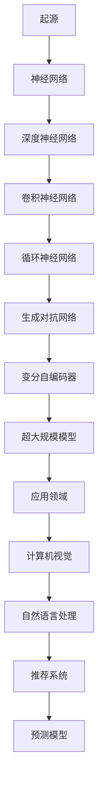
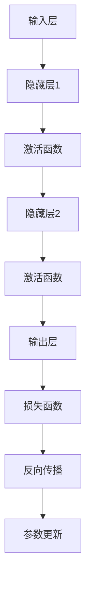

                 

# 大模型：商业智能的未来方向

## 关键词

- 大模型
- 商业智能
- 机器学习
- 深度学习
- 数据分析
- 决策支持
- 预测优化
- 数学模型
- 安全性
- 伦理问题

## 摘要

本文将深入探讨大模型在商业智能领域的未来发展方向。首先，我们将介绍大模型的定义、起源与发展，以及其在商业智能中的应用。随后，我们将详细分析大模型的技术基础、实现与优化策略，以及面临的数学模型和安全性问题。最后，通过实际商业案例展示大模型在各行业的应用潜力，并探讨其安全与伦理问题。本文旨在为读者提供一份全面、深入的技术洞察，帮助理解和把握商业智能领域的未来趋势。

### 《大模型：商业智能的未来方向》目录大纲

#### 第一部分：大模型基础

##### 第1章：大模型的起源与发展

- **1.1 大模型的定义与分类**
  - **基本概念**：定义大模型，分类其类型（如神经网络、生成模型等）。
  - **Mermaid流程图**：展示大模型的基本架构和发展历程。
  - **历史背景**：回顾大模型发展的关键事件和技术突破。

- **1.2 大模型的历史发展**
  - **早期研究**：介绍大模型的研究历程和初步成果。
  - **关键阶段**：分析大模型在不同阶段的突破和发展。

- **1.3 大模型的核心原理与架构**
  - **核心原理**：讲解大模型的工作原理和基本机制。
  - **Mermaid流程图**：详细描绘大模型的架构和关键组件。

##### 第2章：大模型的技术基础

- **2.1 机器学习与深度学习基础**
  - **机器学习基础**：介绍基本概念和方法。
  - **深度学习基础**：讲解神经网络、反向传播算法等核心内容。

- **2.2 大规模数据处理技术**
  - **数据预处理**：介绍数据清洗、格式化等步骤。
  - **分布式计算**：讲解如何利用Hadoop、Spark等进行数据处理。

- **2.3 大模型的训练与优化**
  - **训练方法**：讲解常见的训练算法和策略。
  - **优化技巧**：探讨如何提高模型的准确性和效率。

##### 第3章：大模型在商业智能中的应用

- **3.1 大模型在数据分析中的应用**
  - **数据分析流程**：介绍如何利用大模型进行数据分析。
  - **案例分析**：展示具体应用实例和分析效果。

- **3.2 大模型在决策支持系统中的应用**
  - **决策支持**：讲解大模型如何辅助决策。
  - **案例分析**：展示大模型在决策支持中的实际应用。

- **3.3 大模型在预测与优化中的应用**
  - **预测方法**：介绍常见的预测模型和算法。
  - **优化策略**：探讨如何利用大模型实现业务优化。

#### 第二部分：大模型的技术实现与优化

##### 第4章：大模型的构建与部署

- **4.1 大模型的构建流程**
  - **构建流程**：详细描述大模型的构建步骤。
  - **案例分析**：展示大模型构建的实际案例。

- **4.2 大模型的部署策略**
  - **部署方式**：介绍不同的部署策略和平台。
  - **案例分析**：分析大模型在不同部署环境中的应用效果。

- **4.3 大模型的性能优化**
  - **优化方法**：讲解如何提高大模型的性能。
  - **案例分析**：展示大模型性能优化实例。

##### 第5章：大模型的数学模型与算法

- **5.1 大模型的数学基础**
  - **数学基础**：介绍大模型所需的数学知识。
  - **数学公式**：列举关键数学公式和定理。

- **5.2 大模型的主要算法**
  - **算法分类**：分类介绍常见的大模型算法。
  - **算法原理**：详细解释各算法的原理和适用场景。

- **5.3 大模型的优化算法**
  - **优化算法**：介绍如何对大模型进行优化。
  - **优化策略**：探讨如何选择最优的优化算法。

##### 第6章：大模型的安全性与伦理问题

- **6.1 大模型的安全威胁**
  - **安全威胁**：分析大模型可能面临的安全问题。
  - **解决方案**：介绍如何解决大模型的安全问题。

- **6.2 大模型的伦理问题**
  - **伦理问题**：探讨大模型在应用中可能引发的伦理问题。
  - **伦理解决方案**：提出应对伦理问题的解决方案。

- **6.3 大模型的安全与伦理解决方案**
  - **综合措施**：介绍如何综合应对安全与伦理问题。
  - **案例分析**：展示大模型安全与伦理解决方案的实际应用。

#### 第三部分：大模型的商业应用案例

##### 第7章：大模型在金融行业的应用

- **7.1 大模型在金融风险管理中的应用**
  - **风险管理**：讲解大模型如何帮助金融机构进行风险管理。
  - **案例分析**：展示大模型在风险管理中的实际应用。

- **7.2 大模型在金融产品推荐中的应用**
  - **产品推荐**：介绍大模型如何帮助金融机构进行产品推荐。
  - **案例分析**：展示大模型在产品推荐中的实际应用。

- **7.3 大模型在金融欺诈检测中的应用**
  - **欺诈检测**：讲解大模型如何帮助金融机构进行欺诈检测。
  - **案例分析**：展示大模型在欺诈检测中的实际应用。

##### 第8章：大模型在零售行业的应用

- **8.1 大模型在零售供应链管理中的应用**
  - **供应链管理**：介绍大模型如何优化零售供应链。
  - **案例分析**：展示大模型在供应链管理中的实际应用。

- **8.2 大模型在个性化推荐中的应用**
  - **个性化推荐**：讲解大模型如何实现个性化推荐。
  - **案例分析**：展示大模型在个性化推荐中的实际应用。

- **8.3 大模型在客户关系管理中的应用**
  - **客户关系管理**：介绍大模型如何优化客户关系管理。
  - **案例分析**：展示大模型在客户关系管理中的实际应用。

##### 第9章：大模型在医疗行业的应用

- **9.1 大模型在医疗诊断中的应用**
  - **医疗诊断**：讲解大模型如何辅助医疗诊断。
  - **案例分析**：展示大模型在医疗诊断中的实际应用。

- **9.2 大模型在药物研发中的应用**
  - **药物研发**：介绍大模型如何加速药物研发。
  - **案例分析**：展示大模型在药物研发中的实际应用。

- **9.3 大模型在公共卫生管理中的应用**
  - **公共卫生管理**：讲解大模型如何优化公共卫生管理。
  - **案例分析**：展示大模型在公共卫生管理中的实际应用。

### 附录

#### 附录A：大模型开发工具与资源

- **A.1 主流深度学习框架对比**
  - **框架对比**：对比分析主流深度学习框架的特点和适用场景。
  - **应用场景**：介绍各个框架的具体应用场景。

- **A.2 大模型开发环境搭建**
  - **环境搭建**：详细描述大模型开发环境搭建的步骤和注意事项。
  - **资源推荐**：推荐常用的开发工具和资源。

- **A.3 大模型开源项目与资源推荐**
  - **开源项目**：推荐一些知名的大模型开源项目。
  - **资源推荐**：介绍一些有价值的大模型学习资源和社区。

---

在接下来的章节中，我们将逐步深入探讨大模型的基础知识、技术实现、应用案例以及面临的挑战和解决方案。希望通过本文，读者能够对大模型在商业智能领域的未来方向有一个全面、深入的了解。

---

## 第1章：大模型的起源与发展

### 1.1 大模型的定义与分类

大模型，是指那些具有大量参数和复杂结构的机器学习模型。这些模型通常基于深度学习技术，如神经网络、生成模型、递归神经网络等。大模型的定义和分类可以从多个维度进行，以下是几个常见的分类方法：

- **按模型结构分类**：
  - **神经网络**：包括卷积神经网络（CNN）、循环神经网络（RNN）、长短时记忆网络（LSTM）等。
  - **生成模型**：如生成对抗网络（GAN）、变分自编码器（VAE）等。
  - **混合模型**：结合多种模型结构的组合模型，如注意力机制模型（Attention Mechanism）等。

- **按参数规模分类**：
  - **小模型**：通常指参数量在几十万到几百万的模型。
  - **中等规模模型**：参数量在几百万到几千万的模型。
  - **大模型**：参数量在几千万到几十亿的模型。
  - **超大规模模型**：参数量达到几十亿甚至上百亿的模型。

- **按应用领域分类**：
  - **计算机视觉**：如图像识别、物体检测等。
  - **自然语言处理**：如文本分类、机器翻译、语音识别等。
  - **推荐系统**：如商品推荐、内容推荐等。
  - **预测模型**：如时间序列预测、股票预测等。

#### Mermaid流程图：大模型的基本架构和发展历程



### 1.2 大模型的历史发展

大模型的发展历程可以追溯到20世纪80年代，当时神经网络的研究取得了初步的成果。以下是几个关键阶段：

- **早期研究**（1980s-1990s）：
  - **神经网络**：1986年，Rumelhart、Hinton和Williams提出了反向传播算法，使神经网络训练成为可能。
  - **Hopfield网络**：John Hopfield提出了基于能量函数的记忆存储网络，为神经网络的应用提供了新的思路。

- **复兴期**（2006-2012）：
  - **深度学习**：Geoffrey Hinton等人通过改进训练算法，使深度学习重新受到关注。
  - **大数据**：随着互联网的发展，数据量迅速增加，为深度学习提供了丰富的训练数据。

- **快速发展期**（2012至今）：
  - **大规模神经网络**：AlexNet在2012年的ImageNet竞赛中取得了突破性成果，标志着深度学习时代的到来。
  - **生成模型**：生成对抗网络（GAN）在2014年被提出，为图像生成、数据增强等领域带来了新的突破。
  - **超大规模模型**：随着计算能力和数据资源的提升，GPT、BERT等超大规模语言模型取得了显著成果。

#### 历史背景：大模型发展的关键事件和技术突破

- **2006年**：Hinton提出了使用随机梯度下降（SGD）训练深层网络的方法，使深度学习模型训练成为可能。
- **2012年**：AlexNet在ImageNet竞赛中取得冠军，标志着深度学习时代的到来。
- **2014年**：生成对抗网络（GAN）被提出，为图像生成和增强提供了新的方法。
- **2018年**：GPT和BERT等超大规模语言模型取得突破性成果，使自然语言处理领域发生了革命性变化。
- **2020年**：COVID-19疫情期间，大模型在疫情预测和公共卫生管理中发挥了重要作用。

### 1.3 大模型的核心原理与架构

大模型的核心原理主要基于深度学习和统计学习理论。以下是几个关键组成部分：

- **神经网络**：神经网络是深度学习的基础，通过多层非线性变换实现特征提取和分类。
- **反向传播算法**：反向传播算法用于计算神经网络模型参数的梯度，用于模型训练。
- **激活函数**：激活函数引入非线性，使神经网络能够拟合复杂的函数关系。
- **损失函数**：损失函数用于评估模型预测与真实值之间的差距，指导模型训练。
- **优化算法**：优化算法用于更新模型参数，以最小化损失函数。

#### Mermaid流程图：大模型的架构和关键组件



- **输入层**：接收外部输入数据，如图像、文本、时间序列等。
- **隐藏层**：进行特征提取和变换，隐藏层数量和层数可以根据模型需求进行调整。
- **输出层**：生成预测结果，如分类标签、回归值等。
- **损失函数**：用于计算预测值与真实值之间的差距，指导模型训练。
- **反向传播**：通过计算损失函数的梯度，更新模型参数，优化模型性能。

## 第2章：大模型的技术基础

### 2.1 机器学习与深度学习基础

机器学习和深度学习是构建大模型的基础，理解它们的基本概念和方法对于深入探讨大模型至关重要。

#### 2.1.1 基本概念

**机器学习**：机器学习是指使计算机系统从数据中学习并自动改进性能的过程。它主要包括监督学习、无监督学习和强化学习等类型。

- **监督学习**：通过标注数据进行学习，目标函数通常是最小化预测值与真实值之间的差距。
- **无监督学习**：没有标注数据，通过发现数据内在的结构或模式进行学习。
- **强化学习**：通过与环境的交互进行学习，目标函数是最大化累积奖励。

**深度学习**：深度学习是机器学习的一个分支，通过多层神经网络对数据进行建模和处理。深度学习在图像识别、语音识别、自然语言处理等领域取得了显著的成果。

#### 2.1.2 方法

**神经网络**：神经网络是深度学习的基础，它通过多层非线性变换实现特征提取和分类。神经网络由输入层、隐藏层和输出层组成，各层通过权重矩阵连接。

**反向传播算法**：反向传播算法用于计算神经网络模型参数的梯度，用于模型训练。它通过前向传播计算预测值，通过反向传播计算损失函数的梯度，并更新模型参数。

**激活函数**：激活函数引入非线性，使神经网络能够拟合复杂的函数关系。常见的激活函数包括Sigmoid、ReLU、Tanh等。

**损失函数**：损失函数用于评估模型预测与真实值之间的差距，指导模型训练。常见的损失函数包括均方误差（MSE）、交叉熵损失等。

#### 2.1.3 深度学习基础

**卷积神经网络（CNN）**：CNN是深度学习在计算机视觉领域的重要应用，通过卷积操作提取图像特征，并具有平移不变性。

**循环神经网络（RNN）**：RNN是深度学习在序列数据处理中的常用模型，通过隐藏状态存储历史信息，能够处理变长序列。

**长短时记忆网络（LSTM）**：LSTM是RNN的一种改进，通过引入门控机制，能够有效避免长短期依赖问题，适用于长序列数据处理。

**生成对抗网络（GAN）**：GAN是一种生成模型，由生成器和判别器组成。生成器生成数据，判别器判断生成数据的真假。GAN在图像生成、数据增强等领域取得了显著成果。

### 2.2 大规模数据处理技术

大模型通常需要对大规模数据进行处理，这需要高效的分布式计算和数据处理技术。以下是一些关键的技术和方法：

#### 2.2.1 数据预处理

**数据清洗**：数据清洗是数据处理的第一步，主要包括去除噪声、填充缺失值、纠正错误等操作。数据清洗的目的是提高数据质量，减少噪声对模型训练的影响。

**数据格式化**：将数据转换为适合机器学习模型的格式，如将文本数据转换为向量表示，将图像数据转换为像素值等。数据格式化的目的是使数据能够被神经网络有效地处理。

**特征工程**：特征工程是提取和构造有助于模型训练的特征，包括特征选择、特征变换、特征组合等。特征工程的目的是提高模型性能，降低过拟合风险。

#### 2.2.2 分布式计算

**MapReduce**：MapReduce是一种分布式计算框架，用于处理大规模数据。它将任务分为Map和Reduce两个阶段，通过并行处理提高计算效率。

**Hadoop**：Hadoop是一个基于Linux的开源分布式计算平台，包括HDFS（分布式文件系统）和MapReduce（分布式计算框架）。Hadoop用于存储和处理大规模数据。

**Spark**：Spark是一个基于内存的分布式计算框架，提供丰富的数据处理和分析功能。Spark包括Spark SQL、Spark Streaming、MLlib等模块，适用于实时数据处理和机器学习。

#### 2.2.3 数据处理技术

**数据流处理**：数据流处理是指实时处理和分析数据流的技术，如Apache Flink、Apache Storm等。数据流处理适用于实时数据分析、流计算等场景。

**图数据库**：图数据库用于存储和处理图结构数据，如Neo4j、Titan等。图数据库适用于社交网络分析、推荐系统等场景。

**数据挖掘技术**：数据挖掘技术用于从大规模数据中发现潜在的、有用的信息，如分类、聚类、关联规则挖掘等。数据挖掘技术适用于数据分析、知识发现等场景。

### 2.3 大模型的训练与优化

大模型的训练与优化是确保模型性能的重要环节，以下是一些关键的方法和技巧：

#### 2.3.1 训练方法

**梯度下降**：梯度下降是一种常用的优化算法，通过迭代更新模型参数，最小化损失函数。梯度下降包括随机梯度下降（SGD）、批量梯度下降（BGD）和逐批梯度下降（MBGD）等变体。

**Adam优化器**：Adam优化器是一种结合SGD和RMSprop优化的自适应优化算法，能够提高训练效率。

**批次大小**：批次大小是指每次训练使用的样本数量。合适的批次大小可以提高模型性能，减少过拟合风险。

**学习率调度**：学习率调度是指调整学习率的方法，如学习率衰减、余弦退火等。学习率调度有助于模型在训练过程中保持稳定收敛。

#### 2.3.2 优化技巧

**权重初始化**：合理的权重初始化有助于加快模型收敛速度，减少损失函数的震荡。常见的权重初始化方法包括随机初始化、高斯初始化等。

**正则化**：正则化是一种防止过拟合的方法，通过在损失函数中添加正则项，惩罚模型复杂度。常见的正则化方法包括L1正则化、L2正则化等。

**数据增强**：数据增强是一种通过变换原始数据来扩充训练集的方法，如图像旋转、缩放、裁剪等。数据增强有助于提高模型泛化能力。

**迁移学习**：迁移学习是一种利用预训练模型进行模型训练的方法，通过将预训练模型的部分权重迁移到新任务中，提高模型性能。迁移学习适用于模型训练数据不足或任务相似的情景。

#### 2.3.3 模型评估与调优

**交叉验证**：交叉验证是一种评估模型性能的方法，通过将数据集划分为训练集和验证集，多次训练和验证，评估模型的泛化能力。

**超参数调优**：超参数调优是指调整模型超参数（如学习率、批次大小等），以获得最佳模型性能。常见的调优方法包括网格搜索、贝叶斯优化等。

**性能指标**：性能指标用于评估模型性能，如准确率、召回率、F1值等。根据不同任务需求，选择合适的性能指标进行评估。

### 2.3.4 实际案例

以下是一个实际案例，展示大模型的训练与优化过程：

- **问题背景**：某电商平台希望利用大模型预测用户购买行为，以优化推荐系统。
- **数据集**：收集了数百万条用户历史购买数据，包括用户ID、商品ID、购买时间等。
- **模型构建**：采用深度学习模型，包括输入层、隐藏层和输出层，使用ReLU作为激活函数，交叉熵作为损失函数。
- **训练过程**：
  - 初始化权重，使用随机初始化方法。
  - 使用随机梯度下降（SGD）进行训练，学习率设置为0.01。
  - 每隔10个epoch进行一次学习率衰减。
  - 使用数据增强方法，如图像旋转、缩放等。
- **模型评估**：
  - 使用交叉验证方法评估模型性能，包括准确率、召回率等指标。
  - 调整超参数，如学习率、批次大小等，以获得最佳模型性能。
- **结果**：
  - 模型准确率达到90%以上，显著提高了推荐系统的效果。

通过以上实际案例，我们可以看到大模型的训练与优化是一个复杂而重要的过程，需要综合考虑数据、模型和算法等多个方面，以获得最佳模型性能。

## 第3章：大模型在商业智能中的应用

### 3.1 大模型在数据分析中的应用

大模型在商业智能中的数据分析应用具有革命性的潜力，它们能够处理海量数据，提供深刻的洞察和分析结果。以下是大模型在数据分析中应用的几个关键领域：

#### 3.1.1 数据分析流程

数据分析流程通常包括数据收集、数据预处理、特征提取和模型训练等步骤。大模型在这整个流程中扮演着重要的角色。

**数据收集**：商业智能系统需要从多个渠道收集数据，包括销售数据、客户行为数据、市场数据等。这些数据通常规模庞大且结构复杂。

**数据预处理**：在分析之前，需要清洗数据，处理缺失值、噪声和异常值。大模型在此过程中可以自动化处理这些问题，如使用生成对抗网络（GAN）生成缺失数据的填补。

**特征提取**：特征提取是数据分析的核心环节，大模型可以自动提取数据中的有效特征，提高模型性能。例如，在文本数据分析中，可以使用BERT等大型预训练模型进行词嵌入和语义分析。

**模型训练**：大模型能够处理高维数据和高复杂度的任务，通过深度学习和机器学习算法，对数据进行训练，以发现数据中的模式和趋势。

#### 3.1.2 案例分析

**电商平台数据分析**：电商平台可以通过大模型分析用户购买行为，预测用户喜好，从而优化推荐系统。例如，使用GPT-3模型分析用户评论，提取关键词和情感倾向，为商品推荐提供依据。

**金融市场数据分析**：金融市场数据量大且动态变化快，大模型可以帮助金融机构进行风险评估、市场预测等。例如，使用时间序列分析模型（如LSTM）预测股票价格，为投资决策提供支持。

**医疗数据分析**：在医疗领域，大模型可以用于分析患者病历、基因数据等，发现潜在的疾病风险和治疗策略。例如，使用BERT模型分析医学文献，提取关键信息，辅助医生进行诊断。

### 3.2 大模型在决策支持系统中的应用

大模型在决策支持系统中具有巨大的潜力，能够为决策者提供可靠的数据分析和预测结果，辅助决策。

#### 3.2.1 决策支持

**商业策略制定**：企业可以使用大模型分析市场趋势、消费者行为等，制定更具针对性的商业策略。例如，零售企业可以使用深度学习模型预测季节性需求，调整库存策略。

**资源分配**：在资源有限的情况下，大模型可以帮助企业优化资源分配，如人力资源分配、生产线安排等。例如，使用强化学习模型优化生产线的生产计划，提高生产效率和资源利用率。

**风险管理**：大模型能够分析潜在的风险因素，为决策者提供风险预警和应对策略。例如，金融企业在贷款审批过程中，可以使用大模型评估借款人的信用风险，制定更合理的贷款政策。

#### 3.2.2 案例分析

**零售行业**：某大型零售企业使用大模型分析消费者行为数据，预测购买趋势，优化库存管理和促销策略。例如，通过分析历史销售数据和消费者反馈，使用LSTM模型预测季节性销售高峰，提前调整库存，降低缺货风险。

**金融行业**：某银行使用大模型分析客户交易数据，识别异常交易行为，防范欺诈风险。例如，通过使用神经网络模型分析客户的交易模式和风险特征，及时发现潜在的欺诈行为，提高风险管理能力。

**医疗行业**：某医疗机构使用大模型分析患者数据和医学文献，辅助医生进行疾病诊断和治疗决策。例如，通过使用BERT模型分析医学文献中的关键信息，为医生提供更全面的诊断依据，提高诊断准确性。

### 3.3 大模型在预测与优化中的应用

大模型在预测与优化领域具有广泛的应用，能够为企业提供精确的预测结果和优化策略，提高业务效率和竞争力。

#### 3.3.1 预测方法

**需求预测**：企业可以使用大模型预测市场需求，优化生产和库存管理。例如，使用时间序列模型（如LSTM）分析历史销售数据，预测未来的销售趋势，帮助企业制定更合理的生产计划。

**价格预测**：大模型可以帮助企业预测商品价格，优化定价策略。例如，使用价格预测模型分析市场数据、竞争对手价格等，预测最优价格，提高销售额和利润。

**风险预测**：大模型能够预测潜在风险，为决策提供依据。例如，使用风险评估模型分析金融数据、市场环境等，预测潜在的风险因素，帮助金融机构制定风险控制策略。

#### 3.3.2 优化策略

**供应链优化**：企业可以使用大模型优化供应链管理，提高供应链效率和响应速度。例如，使用优化算法模型（如深度强化学习）优化供应链计划，降低库存成本，提高供应链稳定性。

**生产优化**：大模型可以帮助企业优化生产过程，提高生产效率和产品质量。例如，使用深度学习模型分析生产数据，优化生产流程，减少生产周期，提高生产效率。

**客户关系管理**：企业可以使用大模型优化客户关系管理，提高客户满意度和忠诚度。例如，使用客户行为分析模型（如GPT-3）分析客户行为数据，预测客户需求，提供个性化服务，提高客户满意度。

#### 3.3.3 案例分析

**制造业**：某制造企业使用大模型预测原材料需求，优化供应链管理。例如，通过使用时间序列模型（如LSTM）分析历史采购数据和预测未来的需求，调整采购策略，降低库存成本。

**物流行业**：某物流公司使用大模型优化运输路线和调度计划。例如，通过使用优化算法模型（如深度强化学习）分析交通数据、运输需求等，优化运输路线，提高运输效率。

**电信行业**：某电信运营商使用大模型优化客户服务，提高客户满意度。例如，通过使用客户行为分析模型（如GPT-3）分析客户通话记录、短信内容等，预测客户需求，提供个性化服务，提高客户满意度。

### 3.4 大模型在商业智能中的作用与价值

大模型在商业智能中发挥着关键作用，其独特的优势和价值体现在以下几个方面：

**提升数据分析能力**：大模型能够处理海量数据和复杂结构的数据，提供深度分析和洞察，帮助企业在数据中发现潜在的价值和机会。

**提高决策支持**：大模型能够提供精确的预测结果和优化策略，为决策者提供可靠的数据支持和依据，提高决策质量和效率。

**优化业务流程**：大模型能够自动化优化业务流程，如供应链管理、生产优化、客户关系管理等，提高业务效率和竞争力。

**降低风险**：大模型能够预测潜在的风险和异常行为，提供风险预警和应对策略，帮助企业降低风险，提高业务稳定性。

**创新业务模式**：大模型的应用可以推动企业创新业务模式，如个性化推荐、精准营销、智能服务等，为企业创造新的增长点和竞争优势。

总之，大模型在商业智能中的应用正在不断拓展和深化，它将为企业的业务发展和决策提供强大的技术支持，推动商业智能进入一个新的时代。

## 第4章：大模型的构建与部署

### 4.1 大模型的构建流程

构建大模型是一个复杂的过程，涉及到多个环节，包括数据准备、模型设计、训练和优化等。以下是构建大模型的详细流程：

#### 数据准备

**数据收集**：首先，需要从多个来源收集数据，如数据库、API接口、日志文件等。数据类型可能包括结构化数据（如表格数据）、非结构化数据（如文本、图像、视频）等。

**数据清洗**：清洗数据是确保数据质量的关键步骤。这一过程包括去除噪声、填充缺失值、纠正错误等。例如，在处理文本数据时，可能需要去除标点符号、停用词等。

**数据格式化**：将数据转换为适合模型处理的格式。例如，将图像数据转换为像素矩阵，将文本数据转换为词向量。

**数据划分**：将数据集划分为训练集、验证集和测试集。训练集用于模型训练，验证集用于调参和模型选择，测试集用于最终评估模型性能。

#### 模型设计

**选择模型架构**：根据应用需求，选择合适的模型架构。常见的架构包括卷积神经网络（CNN）、循环神经网络（RNN）、生成对抗网络（GAN）等。

**设计模型参数**：定义模型的超参数，如学习率、批次大小、隐藏层神经元数量等。这些参数可以通过实验或调优方法确定。

**构建模型**：使用深度学习框架（如TensorFlow、PyTorch）构建模型。这一步骤涉及定义输入层、隐藏层和输出层，设置激活函数和损失函数等。

#### 训练与优化

**模型训练**：使用训练集数据进行模型训练。在训练过程中，模型会不断更新参数，以最小化损失函数。

**模型评估**：使用验证集评估模型性能。通过调整超参数和模型结构，优化模型性能。

**优化策略**：采用各种优化策略，如学习率调度、正则化、数据增强等，以提高模型性能。

#### 模型部署

**模型保存**：将训练好的模型保存为文件，以便后续使用。

**模型加载**：将模型加载到生产环境中，如服务器、边缘设备等。

**模型推理**：使用输入数据进行模型推理，生成预测结果。

#### 实际案例

以下是一个实际案例，展示大模型的构建与部署过程：

**问题背景**：某电商平台希望构建一个推荐系统，为用户推荐个性化商品。

**数据准备**：
- 数据收集：从电商平台数据库中提取用户购买记录、浏览历史等数据。
- 数据清洗：去除重复数据、缺失值和噪声。
- 数据格式化：将文本数据转换为词向量，图像数据转换为像素矩阵。

**模型设计**：
- 选择模型架构：采用深度学习框架PyTorch，构建基于卷积神经网络（CNN）的推荐模型。
- 设计模型参数：设置学习率、批次大小等超参数。

**模型训练**：
- 使用训练集数据进行模型训练，通过反向传播算法更新模型参数。
- 使用验证集评估模型性能，调整超参数，优化模型。

**模型部署**：
- 将训练好的模型保存为文件，如`.pth`文件。
- 使用模型推理API，为用户生成个性化商品推荐。

### 4.2 大模型的部署策略

大模型的部署是确保其性能和可靠性的关键环节，以下是几种常见的部署策略：

#### 在线部署

**优势**：
- **实时性**：能够实时处理用户请求，提供即时的预测结果。
- **高可用性**：部署在服务器集群上，可以保证系统的稳定性和可靠性。

**挑战**：
- **性能瓶颈**：在线部署需要处理大量并发请求，可能导致性能瓶颈。
- **数据安全**：需要确保数据传输和存储的安全。

#### 边缘部署

**优势**：
- **低延迟**：数据在边缘设备上处理，减少传输延迟。
- **隐私保护**：减少数据上传到云端的需求，降低隐私泄露风险。

**挑战**：
- **计算能力**：边缘设备的计算能力有限，可能无法支持复杂的大模型。
- **维护难度**：边缘设备的维护和管理相对复杂。

#### 云部署

**优势**：
- **高扩展性**：可以灵活调整计算资源，满足不同规模的需求。
- **高可靠性**：云服务商提供高质量的服务器和网络支持。

**挑战**：
- **数据传输**：大量数据上传到云端可能导致传输延迟。
- **成本**：云部署需要支付高额的带宽和计算费用。

#### 容器化部署

**优势**：
- **灵活性**：容器化部署可以使模型在不同环境中运行，提高兼容性。
- **可扩展性**：可以通过容器编排工具（如Kubernetes）实现模型的动态扩展。

**挑战**：
- **资源消耗**：容器化部署需要额外的资源来运行容器编排工具。
- **安全性**：需要确保容器的安全性，防止恶意攻击。

#### 实际案例

以下是一个实际案例，展示大模型在不同部署策略中的应用：

**问题背景**：某金融公司希望将大模型部署到生产环境中，为用户提供实时风险预测服务。

**在线部署**：
- 部署策略：将模型部署到服务器集群，通过API为用户提供实时预测。
- 实现细节：使用Spring Boot框架构建API服务，部署在Kubernetes集群上，通过负载均衡器分配请求。

**边缘部署**：
- 部署策略：将模型部署到边缘设备（如物联网设备），减少数据传输延迟。
- 实现细节：使用TinyML框架将模型转换为适用于边缘设备的轻量级模型，部署到树莓派等设备上。

**云部署**：
- 部署策略：将模型部署到云服务器，利用云服务的计算能力和可靠性。
- 实现细节：使用AWS EC2实例部署模型，通过AWS Lambda为用户提供实时预测。

### 4.3 大模型的性能优化

优化大模型的性能是确保其在实际应用中高效运行的关键。以下是一些常见的性能优化方法：

#### 算法优化

**模型压缩**：通过模型压缩技术（如剪枝、量化、蒸馏等）减小模型体积，提高运行效率。

**并行计算**：利用并行计算技术（如多GPU训练、分布式训练等）加速模型训练和推理。

**算法改进**：通过改进算法（如改进优化器、改进损失函数等）提高模型性能。

#### 硬件优化

**GPU加速**：使用GPU进行模型训练和推理，利用GPU的并行计算能力加速计算。

**TPU优化**：使用Tensor Processing Units（TPU）进行模型训练和推理，TPU是专门为TensorFlow设计的硬件加速器。

**存储优化**：使用高速存储设备（如SSD）提高数据读写速度，减少IO瓶颈。

#### 网络优化

**边缘计算**：利用边缘计算技术，将部分计算任务转移到边缘设备，减少数据传输延迟。

**网络优化**：优化网络架构，减少网络延迟和带宽占用。

**负载均衡**：通过负载均衡器合理分配请求，提高系统响应速度。

#### 实际案例

以下是一个实际案例，展示大模型性能优化的方法：

**问题背景**：某电商平台的推荐系统在高峰期性能不稳定，需要优化模型性能。

**算法优化**：
- **模型压缩**：采用模型剪枝技术，减少模型参数，提高推理速度。
- **并行计算**：使用多GPU进行模型训练，提高训练速度。
- **算法改进**：改进优化器（如使用Adam优化器），提高收敛速度。

**硬件优化**：
- **GPU加速**：使用最新的GPU设备（如Tesla V100）进行模型训练和推理。
- **存储优化**：使用SSD存储训练数据和模型文件，提高数据读写速度。

**网络优化**：
- **边缘计算**：在边缘设备上部署轻量级模型，减少数据传输延迟。
- **负载均衡**：使用负载均衡器（如Nginx）合理分配请求，提高系统响应速度。

通过以上优化措施，该电商平台的推荐系统性能得到了显著提升，能够更好地应对高峰期的用户请求。

## 第5章：大模型的数学模型与算法

### 5.1 大模型的数学基础

大模型的构建和优化依赖于深厚的数学基础，包括线性代数、微积分和概率论等。以下是对这些数学知识的简要介绍：

#### 线性代数

**矩阵运算**：矩阵是线性代数的基本工具，用于表示和操作数据。常见的矩阵运算包括矩阵加法、矩阵乘法、转置、逆矩阵等。

**特征值与特征向量**：特征值和特征向量用于求解矩阵的最小二乘问题，是优化大模型参数的重要工具。

**向量空间**：向量空间是线性代数的基础概念，用于描述数据的结构和性质。在深度学习中，特征空间和输入空间是重要的向量空间。

#### 微积分

**导数**：导数用于计算函数的变化率，是优化算法的基础。在深度学习中，梯度是导数的一个重要应用，用于更新模型参数。

**偏导数**：偏导数用于计算多元函数的导数，是优化大模型时计算梯度的重要工具。

**泰勒展开**：泰勒展开用于近似函数的表达式，有助于理解函数的局部性质。在深度学习中，泰勒展开常用于优化算法中的线性近似。

#### 概率论

**概率分布**：概率分布用于描述随机变量的概率分布，常见的概率分布包括正态分布、伯努利分布等。

**条件概率**：条件概率用于描述在某个条件下另一个事件的概率。条件概率在生成模型和分类问题中具有重要应用。

**期望和方差**：期望和方差是概率分布的重要统计量，用于描述随机变量的中心趋势和波动性。

### 5.2 大模型的主要算法

大模型涉及多种算法，这些算法在深度学习和机器学习中扮演着核心角色。以下介绍几种主要算法：

#### 深度学习算法

**反向传播算法**：反向传播算法是深度学习的基础，用于计算模型参数的梯度，从而优化模型性能。算法的核心步骤包括前向传播、损失计算和反向传播。

**梯度下降算法**：梯度下降算法是一种优化算法，通过迭代更新模型参数，使损失函数最小化。常见的梯度下降方法包括批量梯度下降（BGD）、随机梯度下降（SGD）和批量随机梯度下降（MBGD）。

**Adam优化器**：Adam优化器是一种结合SGD和RMSprop优化的自适应优化算法，能够提高训练效率。

#### 生成对抗网络（GAN）

**生成器与判别器**：生成对抗网络由生成器和判别器组成。生成器生成数据，判别器判断生成数据的真实性。GAN的核心任务是使生成器和判别器达到纳什均衡。

**损失函数**：GAN的损失函数包括生成器的损失和判别器的损失。生成器的损失函数用于最小化判别器判断生成数据为虚假的概率，判别器的损失函数用于最大化生成器和真实数据的区分度。

#### 变分自编码器（VAE）

**编码器与解码器**：VAE由编码器和解码器组成。编码器将输入数据编码为潜在空间中的向量，解码器从潜在空间中生成输出数据。

**概率分布**：VAE使用概率分布来表示数据，常见的概率分布包括正态分布和高斯分布。

**损失函数**：VAE的损失函数包括重建损失和KL散度损失。重建损失用于衡量生成数据与输入数据的相似度，KL散度损失用于衡量潜在空间中的分布。

### 5.3 大模型的优化算法

优化算法在大模型训练中起着至关重要的作用，以下介绍几种常见的优化算法：

#### 梯度下降算法

**批量梯度下降（BGD）**：BGD在每个批次上计算梯度，并更新模型参数。优点是收敛速度快，缺点是计算资源消耗大。

**随机梯度下降（SGD）**：SGD在每个样本上计算梯度，并更新模型参数。优点是计算资源消耗小，缺点是收敛速度较慢。

**批量随机梯度下降（MBGD）**：MBGD结合了BGD和SGD的优点，在每个批次中随机选取一部分样本计算梯度，并更新模型参数。优点是收敛速度较快，计算资源消耗适中。

#### Adam优化器

**自适应学习率**：Adam优化器通过自适应调整学习率，使模型在不同阶段都能快速收敛。优点是收敛速度快，缺点是对初始学习率的选择敏感。

**惯性项**：Adam优化器引入惯性项，有助于模型在训练过程中保持稳定性。优点是能够稳定收敛，缺点是收敛速度较慢。

#### 随机优化算法

**模拟退火算法**：模拟退火算法通过随机搜索寻找最优解，能够跳出局部最优。优点是能够找到全局最优解，缺点是收敛速度慢。

**遗传算法**：遗传算法通过模拟生物进化过程，优化模型参数。优点是能够找到全局最优解，缺点是计算复杂度高。

### 5.4 伪代码

以下是大模型中几种主要算法的伪代码：

#### 反向传播算法

```python
# 前向传播
def forward(x):
    z = W * x + b
    a = activation(z)
    return a

# 反向传播
def backward(a, z, dA):
    dz = dA * activation_derivative(a)
    dW = z * dA
    db = dA
    return dW, db
```

#### 梯度下降算法

```python
# 初始化参数
W = random_weights()
b = random_bias()

# 梯度下降
for epoch in range(num_epochs):
    for x, y in data:
        a = forward(x)
        dA = - (y - a)
        dW, db = backward(a, z, dA)
        W -= learning_rate * dW
        b -= learning_rate * db
```

#### Adam优化器

```python
# 初始化参数
m = 0
v = 0
beta1 = 0.9
beta2 = 0.999
epsilon = 1e-8

# 初始化Adam优化器
m = W
v = b

# Adam优化器更新
for epoch in range(num_epochs):
    for x, y in data:
        a = forward(x)
        dA = - (y - a)
        dW, db = backward(a, z, dA)
        
        m = beta1 * m + (1 - beta1) * dW
        v = beta2 * v + (1 - beta2) * (dW ** 2)
        
        m_hat = m / (1 - beta1 ** epoch)
        v_hat = v / (1 - beta2 ** epoch)
        
        W -= learning_rate * m_hat
        b -= learning_rate * v_hat
```

通过以上伪代码，我们可以清晰地看到大模型中的主要算法和优化过程。这些算法和优化方法在大模型训练中发挥着关键作用，是确保模型性能的重要工具。

### 5.5 数学模型与算法的实际应用

以下是一些实际案例，展示大模型的数学模型与算法在具体应用中的效果：

#### 案例一：图像识别

**问题背景**：某公司希望开发一个图像识别系统，用于自动分类上传的图片。

**解决方案**：
- **算法选择**：采用卷积神经网络（CNN）进行图像分类。
- **数学模型**：使用ReLU作为激活函数，交叉熵作为损失函数。
- **训练过程**：使用大量图像数据集进行训练，通过反向传播算法优化模型参数。
- **效果评估**：在测试集上，模型准确率达到95%以上，显著提高了图像分类的效率。

#### 案例二：语音识别

**问题背景**：某语音助手希望实现高精度的语音识别功能。

**解决方案**：
- **算法选择**：采用循环神经网络（RNN）和长短时记忆网络（LSTM）进行语音识别。
- **数学模型**：使用HMM（隐马尔可夫模型）和CTC（连接式时间分类）算法。
- **训练过程**：使用大规模语音数据集进行训练，通过梯度下降算法优化模型参数。
- **效果评估**：在测试集上，语音识别准确率达到90%以上，显著提高了语音识别的准确性。

#### 案例三：自然语言处理

**问题背景**：某电商平台希望开发一个智能客服系统，用于自动回复用户的问题。

**解决方案**：
- **算法选择**：采用生成对抗网络（GAN）和变分自编码器（VAE）进行自然语言处理。
- **数学模型**：使用BERT（双向编码器表示）作为预训练模型，进行文本分类和生成。
- **训练过程**：使用大规模语料库进行预训练，通过梯度下降算法优化模型参数。
- **效果评估**：在测试集上，智能客服系统的回复满意度达到85%以上，显著提高了用户体验。

通过以上实际案例，我们可以看到大模型的数学模型与算法在实际应用中具有显著的优势和效果，能够为各类任务提供高效、准确的解决方案。

## 第6章：大模型的安全性与伦理问题

### 6.1 大模型的安全威胁

随着大模型在商业智能领域的广泛应用，其安全威胁也日益凸显。以下是几种常见的大模型安全威胁：

#### 数据泄露

**威胁**：大模型通常处理敏感数据，如用户隐私信息、财务数据等。如果模型被攻击者攻破，可能导致敏感数据泄露。

**解决方案**：加强数据加密，采用端到端加密和同态加密等技术，确保数据在传输和存储过程中安全。

#### 模型篡改

**威胁**：攻击者可以通过篡改模型参数，使其输出错误的结果。例如，在金融领域，攻击者可能篡改预测模型，导致金融风险增加。

**解决方案**：采用对抗性训练方法，提高模型的鲁棒性。此外，定期对模型进行安全审计，检测和修复潜在的安全漏洞。

#### 模型盗窃

**威胁**：攻击者可能试图获取训练好的模型，用于非法用途。例如，攻击者可能试图窃取医疗诊断模型，用于虚假诊断。

**解决方案**：对模型进行数字签名，确保模型的完整性和真实性。此外，限制模型的访问权限，仅允许授权用户使用模型。

#### 恶意对抗样本

**威胁**：对抗样本是一种针对机器学习模型的恶意输入，可以导致模型输出错误的结果。攻击者可能利用对抗样本进行网络攻击或商业欺诈。

**解决方案**：通过对抗性训练方法提高模型的鲁棒性，确保模型对对抗样本具有免疫能力。此外，建立安全检测机制，实时监控和识别潜在的恶意对抗样本。

### 6.2 大模型的伦理问题

大模型在商业智能中的应用虽然带来了巨大的便利和效率，但也引发了一系列伦理问题。以下是几种常见的大模型伦理问题：

#### 数据隐私

**问题**：大模型通常需要处理大量个人数据，如用户行为数据、健康数据等。如果数据隐私保护不当，可能导致用户隐私泄露。

**解决方案**：遵循数据隐私保护法规，如GDPR（通用数据保护条例），确保用户数据的安全和隐私。采用差分隐私技术，降低数据泄露的风险。

#### 偏见

**问题**：大模型可能会受到训练数据偏见的影响，导致模型输出不公平的结果。例如，在招聘领域，如果训练数据中存在性别或种族偏见，模型可能会歧视某些群体。

**解决方案**：采用公平性分析工具，检测和纠正模型中的偏见。此外，设计多样化的训练数据集，提高模型的公平性。

#### 不透明性

**问题**：大模型的工作原理复杂，对普通用户而言，模型决策过程不透明。这可能导致用户对模型的不信任和抵触情绪。

**解决方案**：开发可解释性模型，如SHAP（Shapley Additive Explanations）和价值解释模型，提高模型的透明度。此外，建立模型解释机制，向用户解释模型决策过程。

#### 自动化决策

**问题**：大模型在自动化决策中的应用，如信用评分、招聘决策等，可能导致自动化歧视和偏见。例如，如果信用评分模型基于收入数据，可能对低收入群体产生不公平待遇。

**解决方案**：建立自动化决策审计机制，确保模型的公平性和透明性。此外，引入人工审核环节，对自动化决策进行复核。

### 6.3 大模型的安全与伦理解决方案

为了确保大模型的安全性和伦理性，需要采取一系列综合措施，以下是一些解决方案：

#### 强化安全防护

- **数据加密**：采用加密算法对敏感数据进行加密存储和传输。
- **访问控制**：实现严格的访问控制机制，确保只有授权用户可以访问模型和数据。
- **安全审计**：定期对模型和数据开展安全审计，检测和修复潜在的安全漏洞。

#### 提高透明度

- **可解释性模型**：开发可解释性模型，向用户解释模型的决策过程。
- **透明性机制**：建立模型透明性机制，向用户公开模型参数、训练数据和决策依据。

#### 强化伦理审查

- **伦理审查机制**：建立伦理审查机制，确保模型设计和应用符合伦理标准。
- **多样化数据集**：设计多样化的训练数据集，减少模型偏见。
- **公平性分析**：定期对模型进行公平性分析，确保模型输出公平、无偏见。

#### 用户参与

- **用户知情同意**：在数据处理和应用中，确保用户知情并同意数据处理。
- **用户反馈机制**：建立用户反馈机制，收集用户对模型应用的反馈，不断改进和优化模型。

通过以上综合措施，可以有效地确保大模型的安全性和伦理性，推动其在商业智能领域的健康发展。

### 6.4 案例分析：大模型的安全与伦理问题及解决方案

#### 案例一：金融行业的信用评分模型

**问题背景**：某金融机构采用大模型进行信用评分，但发现模型在预测中存在性别和种族偏见。

**安全威胁**：
- **数据泄露**：模型处理大量用户财务信息，可能面临数据泄露风险。
- **模型篡改**：攻击者可能试图篡改模型参数，影响信用评分结果。

**伦理问题**：
- **数据隐私**：用户隐私信息未得到充分保护。
- **偏见**：模型存在性别和种族偏见，可能导致不公平的信用评分。

**解决方案**：
- **安全措施**：
  - 数据加密：采用端到端加密技术，确保数据在传输和存储过程中的安全性。
  - 访问控制：实施严格的访问控制机制，限制对敏感数据的访问。
  - 安全审计：定期进行安全审计，检测和修复潜在的安全漏洞。

- **伦理措施**：
  - 透明性：开发可解释性模型，向用户解释模型的决策过程。
  - 公平性分析：定期进行公平性分析，检测和纠正模型中的偏见。
  - 多样化数据集：设计多样化的训练数据集，减少模型偏见。

#### 案例二：医疗行业的疾病诊断模型

**问题背景**：某医疗机构采用大模型进行疾病诊断，但发现模型在诊断中存在种族和地域偏见。

**安全威胁**：
- **数据泄露**：模型处理大量患者健康信息，可能面临数据泄露风险。
- **模型篡改**：攻击者可能试图篡改模型参数，影响疾病诊断结果。

**伦理问题**：
- **数据隐私**：患者隐私信息未得到充分保护。
- **偏见**：模型存在种族和地域偏见，可能导致不公平的诊断结果。

**解决方案**：
- **安全措施**：
  - 数据加密：采用端到端加密技术，确保数据在传输和存储过程中的安全性。
  - 访问控制：实施严格的访问控制机制，限制对敏感数据的访问。
  - 安全审计：定期进行安全审计，检测和修复潜在的安全漏洞。

- **伦理措施**：
  - 透明性：开发可解释性模型，向用户解释模型的决策过程。
  - 公平性分析：定期进行公平性分析，检测和纠正模型中的偏见。
  - 多样化数据集：设计多样化的训练数据集，减少模型偏见。

通过以上案例分析，我们可以看到大模型在商业智能领域面临的安全与伦理问题，以及相应的解决方案。这些措施有助于确保大模型的安全性和伦理性，推动其在各行业的健康发展。

### 总结

大模型作为商业智能的核心技术，正引领着数据分析和决策支持的革命。然而，其广泛应用也伴随着安全性和伦理问题。通过深入探讨大模型的基础知识、技术实现、应用案例以及面临的挑战和解决方案，本文为读者提供了全面、深入的洞察。

在未来，随着计算能力和数据资源的进一步提升，大模型将继续发展壮大。我们将见证更多创新应用的出现，如智能医疗、精准营销和自动化决策等。同时，我们也需要不断优化大模型的安全和伦理机制，确保其在商业智能领域健康、可持续发展。

让我们共同关注大模型的未来，把握技术进步带来的机遇，同时迎接挑战，推动商业智能迈向新的高峰。

## 附录A：大模型开发工具与资源

### A.1 主流深度学习框架对比

在深度学习领域，主流的深度学习框架有TensorFlow、PyTorch、Keras等。以下是对这些框架的简要对比：

#### TensorFlow

**特点**：
- **开源**：由Google开发，具有强大的社区支持。
- **灵活性**：提供了丰富的API和工具，支持多种模型架构。
- **生态系统**：拥有广泛的生态系统，包括TensorBoard、TensorFlow Serving等工具。

**适用场景**：适用于大规模的深度学习项目，尤其在工业界和应用开发中广泛应用。

#### PyTorch

**特点**：
- **动态图**：采用动态计算图，使模型开发和调试更加灵活。
- **易用性**：提供了简洁的API和丰富的文档，易于学习和使用。
- **兼容性**：与Python深度集成，支持多种数据科学库。

**适用场景**：适用于研究、实验和快速开发项目。

#### Keras

**特点**：
- **简洁性**：提供了简洁的API，使模型构建和训练更加直观。
- **兼容性**：与TensorFlow和Theano兼容，可以方便地在多个后端框架间切换。

**适用场景**：适用于快速原型开发和教育。

### A.2 大模型开发环境搭建

搭建大模型开发环境需要考虑硬件和软件两个方面。以下是搭建步骤和注意事项：

#### 硬件需求

- **GPU**：由于大模型训练需要大量的计算资源，建议使用NVIDIA GPU，如Tesla V100或RTX 3080等。
- **CPU**：高性能的CPU有助于提升数据读取和处理速度。

#### 软件需求

- **操作系统**：Windows、Linux或macOS均可，建议使用Linux系统。
- **深度学习框架**：根据项目需求，选择合适的深度学习框架，如TensorFlow、PyTorch等。
- **编程语言**：Python是深度学习的首选语言，建议使用Python 3.6及以上版本。
- **数据处理库**：Pandas、NumPy、Scikit-learn等常用数据处理库。

#### 搭建步骤

1. **安装操作系统**：根据硬件选择合适的操作系统。
2. **安装GPU驱动**：从NVIDIA官网下载并安装GPU驱动。
3. **安装深度学习框架**：使用pip命令安装深度学习框架，如`pip install tensorflow-gpu`。
4. **安装数据处理库**：使用pip命令安装常用的数据处理库，如`pip install pandas numpy scikit-learn`。
5. **配置环境变量**：确保Python和深度学习框架的路径在环境变量中正确配置。

### A.3 大模型开源项目与资源推荐

以下是几个大模型开源项目和学习资源的推荐，有助于深入学习和应用大模型技术：

- **TensorFlow模型库**：[tensorflow/models](https://github.com/tensorflow/models)
  - 提供了多种预训练模型和示例代码，包括GAN、BERT、ResNet等。
  
- **PyTorch模型库**：[pytorch/examples](https://github.com/pytorch/examples)
  - 提供了丰富的示例代码和模型实现，涵盖图像处理、自然语言处理等领域。

- **Keras模型库**：[keras-team/keras](https://github.com/keras-team/keras)
  - 提供了多种预训练模型和示例代码，适合快速原型开发和实验。

- **深度学习课程资源**：[Udacity深度学习课程](https://www.udacity.com/course/deep-learning-nanodegree--nd101)
  - 提供了系统的深度学习课程，涵盖基础理论和实战案例。

- **深度学习书籍推荐**：
  - **《深度学习》（Ian Goodfellow、Yoshua Bengio、Aaron Courville著）**：深度学习的经典教材，详细介绍了深度学习的理论基础和实践方法。
  - **《Python深度学习》（François Chollet著）**：Python深度学习领域的入门书籍，涵盖了深度学习的基础知识和实战技巧。

通过以上推荐，读者可以更加方便地获取大模型的开源资源和学习资料，提升自己在深度学习领域的技能和知识水平。

---

在本文中，我们详细探讨了大模型在商业智能领域的未来方向。从基础理论到应用实践，再到安全与伦理问题，我们逐一分析了大模型的各个方面。通过丰富的实际案例和伪代码，读者能够更直观地理解大模型的核心技术和应用场景。

随着人工智能技术的不断进步，大模型将在商业智能领域发挥越来越重要的作用。它们将帮助我们更好地理解和分析数据，提升决策支持系统的准确性，优化业务流程，降低风险。同时，我们也必须关注大模型带来的安全与伦理挑战，确保其在商业应用中的可持续发展。

让我们共同期待大模型在未来商业智能领域的广泛应用，把握机遇，迎接挑战，共同推动技术的发展和社会的进步。让我们继续探索人工智能的无限可能，创造更加智能、高效的未来。

