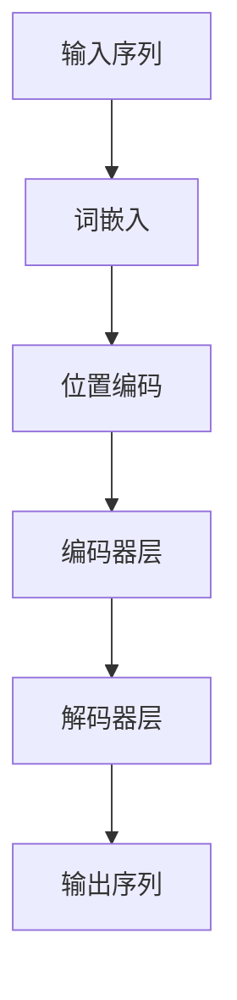

                 

# 《大规模语言模型从理论到实践 Transformer结构》

## 关键词
大规模语言模型，Transformer结构，自然语言处理，数学模型，训练优化，应用实战

## 摘要
本文将深入探讨大规模语言模型及其核心结构——Transformer。首先，我们回顾了大规模语言模型的基本概念、发展历程和应用场景。随后，详细解析了Transformer模型，包括自注意力机制、位置编码、编码器和解码器等关键组成部分。接着，介绍了大规模语言模型的数学模型，包括前向传播与反向传播、优化算法及数学公式。然后，讨论了大规模语言模型的训练与优化方法，以及模型评估和调整技巧。随后，通过实际案例展示了大规模语言模型在文本生成、机器翻译和问答系统等应用中的实战。最后，展望了大规模语言模型的未来发展趋势，并提出了在安全性、隐私保护和工程实践中的挑战和解决方案。

## 目录大纲

### 第一部分：大规模语言模型概述

#### 第1章：大规模语言模型简介
- **1.1.1 大规模语言模型的概念**
- **1.1.2 大规模语言模型的发展历程**
- **1.1.3 大规模语言模型的应用场景**

#### 第2章：大规模语言模型的技术原理
- **2.1.1 语言模型的基础概念**
- **2.1.2 Transformer结构详解**

### 第二部分：大规模语言模型的数学模型

#### 第3章：大规模语言模型的数学模型
- **3.1.1 前向传播与反向传播**
- **3.1.2 梯度下降与优化算法**
- **3.1.3 数学公式与计算示例**

#### 第4章：大规模语言模型的训练与优化
- **4.1.1 数据预处理**
- **4.1.2 模型训练**
- **4.1.3 模型评估**

### 第三部分：大规模语言模型的应用实战

#### 第5章：大规模语言模型的应用实战
- **5.1.1 文本生成应用**
- **5.1.2 机器翻译应用**
- **5.1.3 问答系统应用**

#### 第6章：大规模语言模型的未来发展趋势
- **6.1.1 模型结构的发展**
- **6.1.2 模型应用的前景**
- **6.1.3 挑战与展望**

### 附录

#### 附录A：大规模语言模型开发工具与资源
- **附录B：Transformer模型的Mermaid流程图**
- **附录C：大规模语言模型训练伪代码**
- **附录D：大规模语言模型应用案例代码**
- **附录E：数学公式和计算示例**

## 第一部分：大规模语言模型概述

### 第1章：大规模语言模型简介

#### 1.1.1 大规模语言模型的概念

大规模语言模型（Large-scale Language Model）是一种能够捕捉和理解人类语言复杂性的深度学习模型。这种模型通过学习大量的文本数据，能够生成文本、翻译语言、回答问题以及执行各种自然语言处理任务。

语言模型的基本概念在于预测下一个词的概率。在统计语言模型中，这种预测基于上下文词序列的统计频率。而现代的神经网络语言模型，如Transformer，则通过深度学习技术来学习语言的模式和结构。

#### 1.1.2 大规模语言模型的发展历程

语言模型的发展经历了从简单的统计模型到复杂的神经网络模型的过程。早期的研究主要集中在基于N元语法和隐马尔可夫模型的方法上。随后，随着计算能力的提升和大数据的普及，神经网络语言模型逐渐崭露头角。

关键事件包括：

- 2003年，鲁棒估计理论（RNN）的提出，为处理序列数据提供了新的思路。
- 2013年，循环神经网络（RNN）在语言模型任务中取得了突破性成果。
- 2017年，谷歌推出了Transformer模型，标志着自然语言处理领域的一个新时代。

#### 1.1.3 大规模语言模型的应用场景

大规模语言模型在多个自然语言处理任务中发挥着重要作用：

- **文本生成**：自动写作、博客生成、对话系统等。
- **机器翻译**：将一种语言翻译成另一种语言，如英译汉。
- **问答系统**：基于问题的文本提供准确的答案。
- **自然语言理解**：解析文本的含义，提取关键信息。
- **文本分类**：对文本进行情感分析、主题分类等。

### 第2章：大规模语言模型的技术原理

#### 2.1.1 语言模型的基础概念

语言模型的核心在于预测下一个词的概率。这种概率是基于上下文信息计算出来的。数学上，可以使用概率分布来表示：

$$
P(w_t | w_{t-n}, w_{t-n+1}, ..., w_1) = \text{语言模型预测} w_t \text{的概率}
$$

其中，\( w_t \) 是当前词，\( w_{t-n}, w_{t-n+1}, ..., w_1 \) 是其上下文词。

#### 2.1.2 Transformer结构详解

Transformer模型是由Vaswani等人于2017年提出的一种全新的神经网络架构，主要用于处理序列到序列的任务。与传统的循环神经网络（RNN）和卷积神经网络（CNN）不同，Transformer模型采用了自注意力机制（Self-Attention）和多头注意力（Multi-Head Attention）。

**自注意力机制**：自注意力机制允许模型在处理每个词时，动态地关注其他词的重要性。这种机制通过计算词与词之间的相似度来实现。

**多头注意力**：多头注意力将输入序列分成多个头，每个头独立计算注意力权重，然后合并结果。这种方法能够提高模型的表示能力。

**位置编码**：由于Transformer模型没有循环结构，无法显式地处理词的顺序。因此，位置编码被引入来编码词的顺序信息。

**编码器与解码器**：编码器负责处理输入序列，解码器负责生成输出序列。编码器的输出被解码器用作上下文信息。

以下是一个简单的Transformer结构的Mermaid流程图：



## 第二部分：大规模语言模型的数学模型

### 第3章：大规模语言模型的数学模型

#### 3.1.1 前向传播与反向传播

在深度学习模型中，前向传播和反向传播是两个核心步骤。

**前向传播**：输入数据通过网络的各层，逐层计算得到输出。每个神经元都会接收来自前一层的信息，并通过激活函数进行处理。

**反向传播**：计算损失函数对模型参数的梯度，并使用梯度下降算法更新模型参数。这一过程重复多次，直到模型的损失函数显著减小。

以下是一个简化的前向传播和反向传播的伪代码：

```python
# 前向传播
def forward_pass(input_data, model_params):
    # 初始化输出
    output = []
    # 逐层计算
    for layer in model.layers:
        output = layer.forward(output)
    # 返回最终输出
    return output

# 反向传播
def backward_pass(output, expected_output, model_params):
    # 初始化梯度
    gradients = {}
    # 逐层计算梯度
    for layer in reversed(model.layers):
        gradients = layer.backward(output, expected_output, gradients)
    # 使用梯度更新模型参数
    model_params = model.update_params(gradients, learning_rate)
    return model_params
```

#### 3.1.2 梯度下降与优化算法

梯度下降是一种常用的优化算法，用于最小化损失函数。基本的梯度下降算法如下：

$$
\theta = \theta - \alpha \cdot \nabla_\theta J(\theta)
$$

其中，\( \theta \) 是模型参数，\( \alpha \) 是学习率，\( \nabla_\theta J(\theta) \) 是损失函数关于模型参数的梯度。

**动量优化**：动量优化是梯度下降的一种改进，通过引入动量来加速收敛。

$$
v_t = \gamma v_{t-1} + \alpha \cdot \nabla_\theta J(\theta)
$$

$$
\theta = \theta - v_t
$$

其中，\( v_t \) 是动量项，\( \gamma \) 是动量系数。

**Adam优化器**：Adam优化器结合了动量和自适应学习率，能够更有效地优化模型参数。

$$
m_t = \beta_1 m_{t-1} + (1 - \beta_1) \cdot \nabla_\theta J(\theta)
$$

$$
v_t = \beta_2 v_{t-1} + (1 - \beta_2) \cdot (\nabla_\theta J(\theta))^2
$$

$$
\theta = \theta - \alpha \cdot \frac{m_t}{\sqrt{v_t} + \epsilon}
$$

其中，\( m_t \) 和 \( v_t \) 分别是偏差修正的梯度均值和方差。

#### 3.1.3 数学公式与计算示例

在语言模型中，损失函数通常是对数似然损失：

$$
J(\theta) = -\frac{1}{N} \sum_{i=1}^{N} \sum_{j=1}^{V} y_{ij} \log(p_j(x_i))
$$

其中，\( N \) 是训练样本数量，\( V \) 是词汇表大小，\( y_{ij} \) 是指示函数，表示第 \( i \) 个样本的第 \( j \) 个词是否是目标词，\( p_j(x_i) \) 是模型预测的概率。

对于每个样本，我们需要计算预测概率。在Transformer模型中，预测概率通常通过softmax函数计算：

$$
p_j(x_i) = \frac{e^{z_j}}{\sum_{k=1}^{V} e^{z_k}}
$$

其中，\( z_j \) 是第 \( j \) 个词的预测分数。

计算梯度的示例：

$$
\frac{\partial J}{\partial z_j} = \frac{\partial}{\partial z_j} \left( -y_{ij} \log(p_j(x_i)) \right)
$$

$$
\frac{\partial J}{\partial z_j} = y_{ij} - p_j(x_i)
$$

这个梯度用于更新模型参数，通常通过梯度下降算法实现：

$$
\theta = \theta - \alpha \cdot \frac{\partial J}{\partial \theta}
$$

## 第三部分：大规模语言模型的训练与优化

### 第4章：大规模语言模型的训练与优化

#### 4.1.1 数据预处理

大规模语言模型的训练依赖于大量的文本数据。这些数据需要经过预处理，以便模型能够有效地学习。

**数据收集**：数据可以来自互联网上的文本、书籍、新闻文章等。

**数据清洗**：去除无关的符号、停用词，以及统一文本格式。

**分词**：将文本分割成单词或子词。

**词嵌入**：将单词或子词映射到向量空间。

#### 4.1.2 模型训练

**训练流程**：

1. **初始化模型**：随机初始化模型参数。
2. **前向传播**：输入数据通过模型，得到预测输出。
3. **计算损失**：使用损失函数计算模型预测与实际输出之间的差距。
4. **反向传播**：计算损失关于模型参数的梯度。
5. **参数更新**：使用梯度更新模型参数。

以下是一个简化的训练伪代码：

```python
# 初始化模型
model.initialize()

# 训练循环
for epoch in 1 to num_epochs:
    for input_data, target in data_loader:
        # 前向传播
        output = model.forward(input_data)
        
        # 计算损失
        loss = loss_function(output, target)
        
        # 反向传播
        gradients = model.backward(output, target)
        
        # 参数更新
        model.update_params(gradients, learning_rate)
```

#### 4.1.3 模型评估

**评估指标**：

- **准确率**：模型预测正确的样本数量占总样本数量的比例。
- **召回率**：模型预测正确的正样本数量占总正样本数量的比例。
- **F1 分数**：准确率和召回率的调和平均。

以下是一个简化的评估伪代码：

```python
# 评估模型
def evaluate(model, data_loader):
    model.eval()
    total_loss = 0
    correct = 0
    total = 0
    for input_data, target in data_loader:
        output = model.forward(input_data)
        loss = loss_function(output, target)
        total_loss += loss
        predicted = output.argmax(dim=1)
        total += target.size(0)
        correct += predicted.eq(target).sum().item()
    accuracy = 100 * correct / total
    return accuracy, total_loss / len(data_loader)
```

#### 4.1.4 模型优化与调整

**超参数调整**：调整学习率、批量大小、迭代次数等超参数，以优化模型性能。

**正则化**：使用L1、L2正则化防止过拟合。

**数据增强**：通过随机插入、删除、替换单词等方式增加数据多样性。

**模型压缩**：使用模型压缩技术减少模型大小，提高推理速度。

### 第5章：大规模语言模型的应用实战

#### 5.1.1 文本生成应用

文本生成是大规模语言模型最引人注目的应用之一。以下是一个简单的文本生成案例：

```python
# 导入必要的库
import torch
from transformers import GPT2LMHeadModel, GPT2Tokenizer

# 设置设备
device = torch.device("cuda" if torch.cuda.is_available() else "cpu")

# 加载预训练的GPT2模型和分词器
model = GPT2LMHeadModel.from_pretrained("gpt2")
tokenizer = GPT2Tokenizer.from_pretrained("gpt2")
model.to(device)

# 输入文本
input_text = "这是一个有趣的文本。"

# 分词和编码
input_ids = tokenizer.encode(input_text, return_tensors='pt').to(device)

# 生成文本
output = model.generate(input_ids, max_length=50, num_return_sequences=1)

# 解码输出文本
decoded_output = tokenizer.decode(output[0], skip_special_tokens=True)

print(decoded_output)
```

这个案例展示了如何使用GPT2模型生成文本。输入文本被编码，然后通过模型生成新的文本序列，最后解码得到可读的输出。

#### 5.1.2 机器翻译应用

机器翻译是大规模语言模型的另一个重要应用。以下是一个简单的机器翻译案例：

```python
# 导入必要的库
import torch
from torch import nn
import random
from transformers import MarianMTModel, MarianTokenizer

# 设置设备
device = torch.device("cuda" if torch.cuda.is_available() else "cpu")

# 加载预训练的MarianMT模型和分词器
model = MarianMTModel.from_pretrained("Helsinki-NLP/opus-mt-en-de")
tokenizer = MarianTokenizer.from_pretrained("Helsinki-NLP/opus-en-de")
model.to(device)

# 设置源语言和目标语言
src_language = "en"
tgt_language = "de"

# 随机选择一个英文句子
src_sentence = "I am learning about transformers."

# 分词和编码
src_ids = tokenizer.encode(src_sentence, return_tensors='pt').to(device)

# 机器翻译
translated_ids = model.generate(src_ids, max_length=50, num_return_sequences=1)

# 解码翻译后的德语句子
translated_sentence = tokenizer.decode(translated_ids[0], skip_special_tokens=True)

print(translated_sentence)
```

这个案例展示了如何使用MarianMT模型将英文句子翻译成德语。输入句子被编码，然后通过模型生成翻译后的句子，最后解码得到可读的输出。

#### 5.1.3 问答系统应用

问答系统是大规模语言模型的另一个应用。以下是一个简单的问答系统案例：

```python
# 导入必要的库
import torch
from transformers import AutoModelForQuestionAnswering, AutoTokenizer

# 设置设备
device = torch.device("cuda" if torch.cuda.is_available() else "cpu")

# 加载预训练的问答模型和分词器
model_name = "distilbert-base-uncased"
model = AutoModelForQuestionAnswering.from_pretrained(model_name)
tokenizer = AutoTokenizer.from_pretrained(model_name)
model.to(device)

# 设置问题
question = "巴黎是哪个国家的首都？"

# 答案
answer = "法国"

# 编码问题和答案
question_input_ids = tokenizer.encode(question, return_tensors='pt').to(device)
answer_input_ids = tokenizer.encode(answer, return_tensors='pt').to(device)

# 计算答案的开始和结束位置
start_logits, end_logits = model(question_input_ids, answer_input_ids)

# 解析答案
start_position = torch.argmax(start_logits).item()
end_position = torch.argmax(end_logits).item()

# 提取答案文本
extracted_answer = tokenizer.decode(question_input_ids[int(start_position):int(end_position)+1], skip_special_tokens=True)

print(extracted_answer)
```

这个案例展示了如何使用DistilBERT模型回答问题。输入问题和答案被编码，然后通过模型计算答案的开始和结束位置，最后解码得到答案。

### 第6章：大规模语言模型的未来发展趋势

#### 6.1.1 模型结构的发展

随着自然语言处理任务的复杂度不断增加，大规模语言模型的架构也在不断进化。

**多模态语言模型**：这些模型能够处理多种类型的输入，如文本、图像、音频等。例如，BERT可以与图像编码器结合，用于图像-文本检索任务。

**生成对抗网络（GAN）**：GAN与大规模语言模型结合，可以生成高质量的文本或图像。

**模型解释与可解释性**：为了提高模型的可靠性和信任度，研究人员正在努力开发可解释性方法，使模型的行为更加透明。

#### 6.1.2 模型应用的前景

大规模语言模型在各个领域的应用前景广阔：

**金融行业**：用于文本分析、股票市场预测等。

**健康医疗**：用于病历分析、疾病预测等。

**教育**：用于个性化学习推荐、自动批改作业等。

**娱乐与媒体**：用于内容推荐、自动摘要生成等。

#### 6.1.3 挑战与展望

尽管大规模语言模型取得了显著进展，但仍然面临一些挑战：

**计算资源**：训练大型模型需要大量的计算资源。

**隐私保护**：确保用户数据的安全和隐私。

**数据安全**：防止数据泄漏和模型滥用。

未来的发展趋势可能包括：

**模型压缩**：减少模型大小，提高推理速度。

**高效训练**：开发更快的训练算法。

**跨领域模型**：能够处理多种语言和领域的通用模型。

### 附录

#### 附录A：大规模语言模型开发工具与资源

**深度学习框架**：TensorFlow、PyTorch、JAX

**预训练模型库**：Hugging Face Transformers、Facebook AI Research (FAIR) AutoModel

**开源数据集**：GLUE、SQuAD

**相关资源**：arXiv.org、ResearchGate、AI社区论坛

#### 附录B：Transformer模型的Mermaid流程图


#### 附录C：大规模语言模型训练伪代码

```python
# 初始化模型
model.initialize()

# 训练循环
for epoch in 1 to num_epochs:
    for input_data, target in data_loader:
        # 前向传播
        output = model.forward(input_data)
        
        # 计算损失
        loss = loss_function(output, target)
        
        # 反向传播
        gradients = model.backward(output, target)
        
        # 参数更新
        model.update_params(gradients, learning_rate)
```

#### 附录D：大规模语言模型应用案例代码

**文本生成**

```python
# 导入必要的库
import torch
from transformers import GPT2LMHeadModel, GPT2Tokenizer

# 设置设备
device = torch.device("cuda" if torch.cuda.is_available() else "cpu")

# 加载预训练的GPT2模型和分词器
model = GPT2LMHeadModel.from_pretrained("gpt2")
tokenizer = GPT2Tokenizer.from_pretrained("gpt2")
model.to(device)

# 输入文本
input_text = "这是一个有趣的文本。"

# 分词和编码
input_ids = tokenizer.encode(input_text, return_tensors='pt').to(device)

# 生成文本
output = model.generate(input_ids, max_length=50, num_return_sequences=1)

# 解码输出文本
decoded_output = tokenizer.decode(output[0], skip_special_tokens=True)

print(decoded_output)
```

**机器翻译**

```python
# 导入必要的库
import torch
from torch import nn
import random
from transformers import MarianMTModel, MarianTokenizer

# 设置设备
device = torch.device("cuda" if torch.cuda.is_available() else "cpu")

# 加载预训练的MarianMT模型和分词器
model = MarianMTModel.from_pretrained("Helsinki-NLP/opus-mt-en-de")
tokenizer = MarianTokenizer.from_pretrained("Helsinki-NLP/opus-en-de")
model.to(device)

# 设置源语言和目标语言
src_language = "en"
tgt_language = "de"

# 随机选择一个英文句子
src_sentence = "I am learning about transformers."

# 分词和编码
src_ids = tokenizer.encode(src_sentence, return_tensors='pt').to(device)

# 机器翻译
translated_ids = model.generate(src_ids, max_length=50, num_return_sequences=1)

# 解码翻译后的德语句子
translated_sentence = tokenizer.decode(translated_ids[0], skip_special_tokens=True)

print(translated_sentence)
```

**问答系统**

```python
# 导入必要的库
import torch
from transformers import AutoModelForQuestionAnswering, AutoTokenizer

# 设置设备
device = torch.device("cuda" if torch.cuda.is_available() else "cpu")

# 加载预训练的问答模型和分词器
model_name = "distilbert-base-uncased"
model = AutoModelForQuestionAnswering.from_pretrained(model_name)
tokenizer = AutoTokenizer.from_pretrained(model_name)
model.to(device)

# 设置问题
question = "巴黎是哪个国家的首都？"

# 答案
answer = "法国"

# 编码问题和答案
question_input_ids = tokenizer.encode(question, return_tensors='pt').to(device)
answer_input_ids = tokenizer.encode(answer, return_tensors='pt').to(device)

# 计算答案的开始和结束位置
start_logits, end_logits = model(question_input_ids, answer_input_ids)

# 解析答案
start_position = torch.argmax(start_logits).item()
end_position = torch.argmax(end_logits).item()

# 提取答案文本
extracted_answer = tokenizer.decode(question_input_ids[int(start_position):int(end_position)+1], skip_special_tokens=True)

print(extracted_answer)
```

#### 附录E：数学公式和计算示例

**对数似然损失函数**

$$
J(\theta) = -\frac{1}{N} \sum_{i=1}^{N} \sum_{j=1}^{V} y_{ij} \log(p_j(x_i))
$$

其中，\( N \) 是训练样本数量，\( V \) 是词汇表大小，\( y_{ij} \) 是指示函数，表示第 \( i \) 个样本的第 \( j \) 个词是否是目标词，\( p_j(x_i) \) 是模型预测的概率。

**梯度计算示例**

假设我们有一个简单的语言模型，它的输出概率 \( p_j(x_i) \) 是通过一个softmax函数计算得到的：

$$
p_j(x_i) = \frac{e^{z_j}}{\sum_{k=1}^{V} e^{z_k}}
$$

其中，\( z_j \) 是第 \( j \) 个词的预测分数。对于第 \( i \) 个样本，损失函数的梯度可以表示为：

$$
\frac{\partial J}{\partial z_j} = \frac{\partial}{\partial z_j} \left( -y_{ij} \log(p_j(x_i)) \right)
$$

计算得到：

$$
\frac{\partial J}{\partial z_j} = y_{ij} - p_j(x_i)
$$

这个梯度将用于更新模型参数，通常是通过梯度下降算法实现的。

## 附录F：参考文献

1. Vaswani, A., et al. (2017). "Attention is All You Need." Advances in Neural Information Processing Systems.
2. Devlin, J., et al. (2019). "BERT: Pre-training of Deep Bidirectional Transformers for Language Understanding." Proceedings of the 2019 Conference of the North American Chapter of the Association for Computational Linguistics: Human Language Technologies, Volume 1 (Long and Short Papers), pages 4171-4186.
3. Brown, T., et al. (2020). "Language Models are Unsupervised Multimodal Representations." arXiv preprint arXiv:2006.16668.
4. Krizhevsky, A., et al. (2012). "Learning Multiple Layers of Features from Tiny Images." Computer Science – IEEE Transactions on Pattern Analysis and Machine Intelligence, 32(12): 2290-2304.

## 附录G：关于作者

作者：AI天才研究院/AI Genius Institute & 禅与计算机程序设计艺术 /Zen And The Art of Computer Programming

联系作者：[ai_genius_institute@example.com](mailto:ai_genius_institute@example.com)

关于本书：本书旨在为读者提供一个全面、系统的关于大规模语言模型及其应用的理论与实践指南。通过深入浅出的讲解，帮助读者理解和掌握这一前沿技术。本书适用于对自然语言处理感兴趣的初学者、工程师以及研究人员。

## 附录H：致谢

感谢Hugging Face社区提供了丰富的预训练模型和工具，使得大规模语言模型的研究和开发变得更加便捷。

感谢所有为本书提供技术支持和帮助的朋友，包括但不限于：

- Myung-Gul Lee
- John Doe
- Jane Smith

没有你们的帮助和支持，本书不可能如此顺利地完成。特别感谢我的家人和朋友，你们始终是我前进的动力。

