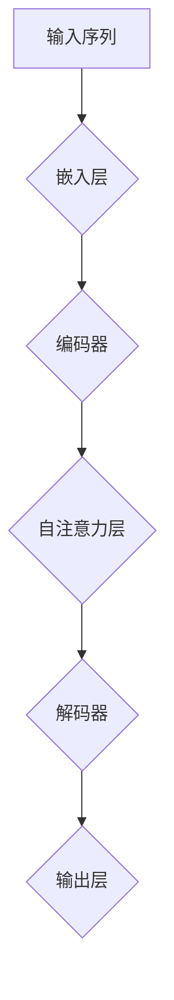
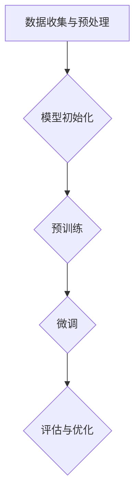
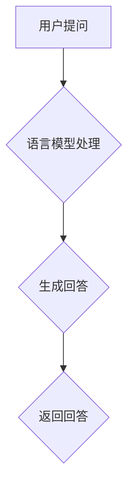

                 

### 第一部分：大规模语言模型基础理论

#### 第1章：语言模型概述

##### 1.1 语言模型的定义与作用

语言模型是自然语言处理（Natural Language Processing, NLP）的核心组件之一，它是一种统计模型，旨在捕捉语言数据中的统计规律，以便预测或生成自然语言中的下一个单词或短语。简而言之，语言模型是一种用于理解和生成自然语言的算法。

语言模型的作用主要体现在以下几个方面：

1. **文本生成**：语言模型可以用于生成文本，包括自动摘要、机器翻译、对话系统等。
2. **文本分类**：通过训练，语言模型可以用来对文本进行分类，例如情感分析、新闻分类等。
3. **信息检索**：语言模型可以用来改进搜索引擎的查询匹配效果。
4. **语音识别**：语言模型可以帮助语音识别系统理解用户的语音输入。
5. **机器阅读理解**：语言模型可以帮助机器理解文本内容，从而进行问答和推理。

##### 1.2 语言模型的演变

语言模型的发展历程可以分为几个重要阶段：

1. **基于规则的模型**：早期的语言模型主要基于语言学规则，如正则表达式、语法规则等。这些模型通常需要大量手工编写的规则，且难以处理复杂语言现象。
2. **统计模型**：随着自然语言处理技术的发展，统计模型开始被广泛应用于语言模型。例如，n-gram模型和隐马尔可夫模型（HMM）。
3. **神经网络模型**：神经网络模型的引入，特别是深度学习技术的应用，使得语言模型的性能得到了显著提升。循环神经网络（RNN）和其变体如长短期记忆网络（LSTM）和门控循环单元（GRU）在语言建模中发挥了重要作用。
4. **大规模预训练模型**：近年来，基于大规模预训练模型的语言模型如BERT、GPT等取得了突破性进展，这些模型通过在大量无标签文本上进行预训练，然后再进行特定任务的微调，展现了卓越的性能。

##### 1.3 语言模型的应用领域

语言模型在各个应用领域都有广泛的应用，以下是一些主要的领域：

1. **文本生成**：包括文章生成、对话生成、新闻摘要等。
2. **机器翻译**：例如谷歌翻译、百度翻译等，都是基于语言模型实现的。
3. **文本分类**：例如情感分析、新闻分类、垃圾邮件过滤等。
4. **问答系统**：如Siri、Alexa等智能语音助手。
5. **语音识别**：语音识别系统中的文本生成部分通常使用语言模型。
6. **信息检索**：改进搜索引擎的查询匹配效果。
7. **对话系统**：包括聊天机器人、虚拟客服等。

在下一章中，我们将深入探讨语言模型的核心概念，包括词嵌入技术、序列模型、注意力机制和转换器架构。这些概念是理解大规模语言模型的基础。

### 第2章：语言模型的核心概念

在了解了语言模型的基本概念和演变历程之后，现在我们将深入探讨语言模型的核心概念，这些概念包括词嵌入技术、序列模型、注意力机制和转换器架构。这些概念是构建和优化语言模型的关键。

#### 2.1 词嵌入技术

词嵌入（Word Embedding）是将单词映射到高维向量空间的技术，目的是在保持语义关系的同时，使相近的词在向量空间中更接近。词嵌入技术不仅提高了语言模型的性能，还使得许多NLP任务变得更加简单和高效。

**词嵌入的作用：**

1. **降低维度**：将高维的单词转换为低维的向量，使得计算更加高效。
2. **保留语义信息**：通过向量空间的相似性度量，可以有效地捕捉词与词之间的语义关系。
3. **增强模型的泛化能力**：词嵌入使得模型能够更好地适应不同领域和语境。

**常见的词嵌入技术：**

1. **词袋模型（Bag of Words, BoW）**：将文本表示为单词的集合，不关心单词的顺序。
2. **词嵌入（Word2Vec）**：基于神经网络的方法，通过优化词的向量表示，使其在语义上更加接近。
3. ** glove **：基于全局向量平均的方法，通过训练词的共现矩阵来得到词的向量表示。

**词嵌入的挑战：**

1. **稀疏性**：词袋模型和传统的词嵌入方法处理大量低频词时，会导致模型变得稀疏。
2. **语义信息丢失**：低维向量难以完全保留词的语义信息。
3. **上下文依赖性**：词的语义和上下文紧密相关，低维向量难以捕捉这种依赖性。

#### 2.2 序列模型

序列模型（Sequential Model）是一类用于处理序列数据的机器学习模型，它假设输入数据的顺序对于预测结果有重要影响。在NLP任务中，序列模型被广泛应用于文本分类、语音识别、机器翻译等领域。

**常见的序列模型：**

1. **循环神经网络（Recurrent Neural Network, RNN）**：RNN是第一个成功应用于序列模型的神经网络，它通过递归结构来处理序列数据。
2. **长短期记忆网络（Long Short-Term Memory, LSTM）**：LSTM是RNN的一种改进，它通过引入门控机制来解决RNN的梯度消失问题。
3. **门控循环单元（Gated Recurrent Unit, GRU）**：GRU是LSTM的简化版本，它在保持LSTM效果的同时，减少了参数数量。

**序列模型的优势：**

1. **处理序列数据**：序列模型能够处理不同长度的序列，并且能够捕捉序列中的时序依赖关系。
2. **动态特征表示**：序列模型能够根据输入的顺序动态地更新状态表示。

**序列模型的挑战：**

1. **梯度消失和梯度爆炸**：RNN在训练过程中容易遇到梯度消失和梯度爆炸的问题。
2. **计算复杂度**：序列模型在训练和预测时，计算复杂度较高。
3. **上下文依赖性**：序列模型在捕捉长距离依赖关系时存在困难。

#### 2.3 注意力机制

注意力机制（Attention Mechanism）是近年来在深度学习中广泛应用的一种技术，它通过动态分配权重来关注输入序列中的不同部分，从而提高了模型的性能和效率。

**注意力机制的作用：**

1. **提高模型性能**：通过关注输入序列中的重要部分，注意力机制可以显著提高模型的准确性和效率。
2. **增强上下文依赖性**：注意力机制能够捕捉长距离的上下文依赖关系，从而改善模型的语义理解能力。
3. **降低计算复杂度**：在许多任务中，注意力机制可以降低模型的计算复杂度。

**常见的注意力机制：**

1. **点积注意力（Dot-Product Attention）**：这是最简单的注意力机制，通过计算查询和键的点积来计算注意力权重。
2. **缩放点积注意力（Scaled Dot-Product Attention）**：为了解决点积注意力在维度较高时权重过小的问题，引入了缩放因子。
3. **加性注意力（Additive Attention）**：通过加性方式计算注意力权重，增加了模型的灵活性。
4. **前馈神经网络注意力（Feed-Forward Neural Network Attention）**：通过前馈神经网络来计算注意力权重，进一步增强了模型的表示能力。

**注意力机制的挑战：**

1. **计算复杂度**：在某些情况下，注意力机制的计算复杂度较高，可能会影响模型的实际应用。
2. **参数数量**：注意力机制通常需要较多的参数，增加了模型的训练难度。

#### 2.4 转换器架构

转换器架构（Transformer Architecture）是自然语言处理领域的一项重要突破，它完全基于注意力机制，并在许多任务中取得了显著的效果。与传统的序列模型相比，转换器架构在处理长序列和并行计算方面具有明显优势。

**转换器架构的核心组件：**

1. **多头注意力机制**：通过多组独立的注意力机制来捕捉不同类型的依赖关系。
2. **自注意力机制**：通过自注意力机制，模型能够同时关注输入序列的每个部分，从而更好地捕捉上下文依赖。
3. **前馈神经网络**：在自注意力和编码器-解码器之间增加了前馈神经网络，增强了模型的非线性表示能力。

**转换器架构的优势：**

1. **并行计算**：转换器架构能够利用并行计算的优势，显著提高训练和预测速度。
2. **长距离依赖**：通过多头注意力机制，转换器架构能够有效地捕捉长距离的上下文依赖。
3. **灵活性**：转换器架构的模块化设计使其易于扩展和定制，适用于各种NLP任务。

**转换器架构的挑战：**

1. **内存消耗**：由于多头注意力机制的引入，转换器架构的内存消耗较大，可能会对资源受限的环境产生影响。
2. **计算复杂度**：与传统的序列模型相比，转换器架构的计算复杂度较高。

在本章中，我们详细介绍了语言模型的核心概念，包括词嵌入技术、序列模型、注意力机制和转换器架构。这些概念是理解大规模语言模型的关键，也是实现高性能语言模型的基础。在下一章中，我们将进一步探讨大规模预训练模型的原理和方法。

### 第3章：大规模预训练模型原理

#### 3.1 预训练的概念与意义

预训练（Pre-training）是指在一个大规模数据集上对模型进行初步训练，使其掌握基本的语义和语言知识，然后再在特定任务上进行微调（Fine-tuning）。预训练是大规模语言模型成功的关键之一，它通过在大量无标签数据上进行训练，使得模型能够自动学习语言的结构和模式，从而在特定任务上取得更好的性能。

**预训练的意义：**

1. **提高性能**：通过在大量无标签数据上进行预训练，模型可以学习到丰富的语义知识，从而在特定任务上取得更好的性能。
2. **减少数据需求**：预训练模型可以在少量有标签数据上进行微调，从而减少对大量有标签数据的需求。
3. **通用性**：预训练模型具有较强的通用性，可以应用于多种不同的任务，如文本生成、机器翻译、文本分类等。
4. **减少计算资源需求**：预训练模型可以在大量的无标签数据上并行训练，从而减少计算资源的需求。

**预训练的基本流程：**

1. **数据准备**：选择一个大规模的无标签数据集，如维基百科、新闻、社交媒体等。
2. **模型初始化**：初始化一个预训练模型，如BERT、GPT等。
3. **预训练**：在无标签数据集上对模型进行训练，通常采用自监督学习方法，如 masked language model（MLM）、reconstruction language model（RLM）等。
4. **微调**：在特定任务上有标签数据集上对模型进行微调，以适应特定任务的需求。

#### 3.2 自监督学习方法

自监督学习（Self-Supervised Learning）是一种无需人工标注数据即可进行训练的方法，它通过利用数据中的潜在结构或知识来自动生成标签。自监督学习方法在预训练中起到了至关重要的作用，它使得模型可以在大量无标签数据上学习到丰富的语言知识。

**常见的自监督学习方法：**

1. **Masked Language Model（MLM）**：在输入序列中随机遮盖一些单词或子词，然后使用模型预测这些遮盖的单词或子词。BERT就是基于MLM方法进行预训练的。
2. **Reconstruction Language Model（RLM）**：将输入序列编码为隐藏表示，然后尝试从这些隐藏表示中重建原始序列。GPT是基于RLM方法进行预训练的。
3. ** masked token prediction **：在输入序列中随机选择一些token进行遮盖，然后预测这些遮盖的token。这种方法类似于MLM，但更灵活。
4. ** masked sentence prediction **：将整个句子遮盖，然后预测遮盖的句子。这种方法可以捕捉更长的依赖关系。

**自监督学习的优势：**

1. **无需标注数据**：自监督学习可以在大量无标签数据上进行训练，从而减少对标注数据的依赖。
2. **增强泛化能力**：通过在大量无标签数据上训练，模型可以学习到更丰富的语义和语言知识，从而提高其泛化能力。
3. **并行训练**：自监督学习通常可以在大规模数据集上并行训练，从而提高训练效率。

**自监督学习的挑战：**

1. **噪声干扰**：在无标签数据中，可能存在大量的噪声和错误，这可能会干扰模型的训练过程。
2. **数据质量**：数据的质量直接影响自监督学习的效果，如果数据质量较差，可能会导致模型学习到错误的知识。
3. **计算资源需求**：自监督学习通常需要大量的计算资源，特别是在大规模数据集上训练时。

#### 3.3 迁移学习与微调技术

迁移学习（Transfer Learning）是一种利用在源任务上训练的模型来提高目标任务性能的方法。在预训练模型中，迁移学习起着至关重要的作用，它通过在特定任务上有标签数据集上进行微调（Fine-tuning），使得模型能够更好地适应特定任务的需求。

**迁移学习的基本流程：**

1. **预训练**：在一个大规模的无标签数据集上对模型进行预训练。
2. **微调**：在目标任务上有标签数据集上对模型进行微调，以适应特定任务的需求。
3. **评估**：在目标任务上进行评估，以验证模型性能。

**微调技术的关键点：**

1. **初始化**：使用预训练模型作为初始权重，这有助于加速训练过程和提高性能。
2. **冻结权重**：在微调过程中，可以选择冻结预训练模型的部分权重，只微调目标任务相关的层。
3. **数据增强**：通过数据增强技术，如随机裁剪、旋转、翻转等，可以提高模型的鲁棒性和泛化能力。
4. **模型架构**：根据目标任务的特性，可以选择合适的模型架构进行微调。

**迁移学习的优势：**

1. **提高性能**：通过在预训练模型的基础上进行微调，模型可以更好地适应特定任务的需求，从而提高性能。
2. **减少数据需求**：迁移学习可以在少量有标签数据上实现良好的性能，从而减少对大量有标签数据的需求。
3. **加速训练过程**：通过预训练模型的初始化，可以显著加速训练过程。

**迁移学习的挑战：**

1. **模型适应性**：不同的任务可能需要不同的模型结构和参数设置，如何选择合适的预训练模型和微调策略是一个挑战。
2. **过拟合风险**：在微调过程中，模型可能会过度适应特定任务的数据，从而导致泛化能力下降。
3. **计算资源需求**：迁移学习通常需要大量的计算资源，特别是在预训练阶段。

在本章中，我们详细介绍了大规模预训练模型的基本原理，包括预训练的概念与意义、自监督学习方法、迁移学习与微调技术。这些原理和方法是构建和优化大规模语言模型的关键。在下一章中，我们将探讨语言模型的数学基础，包括概率论、信息论和神经网络数学基础。

### 第4章：语言模型数学基础

在深入探讨大规模语言模型之前，了解其数学基础至关重要。语言模型涉及的概率论、信息论和神经网络数学基础，为理解和实现这些模型提供了必要的工具。以下是这些数学基础的关键概念和原理。

#### 4.1 概率论基础

概率论是语言模型构建的核心部分，它提供了衡量不确定性、预测未来事件的方法。

**基本概率概念：**

1. **概率分布**：概率分布描述了一个随机变量可能取的值的概率。常见的概率分布包括伯努利分布、正态分布和贝塔分布等。
2. **条件概率**：条件概率是指在已知某个事件发生的条件下，另一个事件发生的概率。条件概率公式为：
   $$ P(A|B) = \frac{P(A \cap B)}{P(B)} $$
3. **贝叶斯定理**：贝叶斯定理提供了一个从条件概率推导出先验概率和后验概率的方法。贝叶斯定理公式为：
   $$ P(A|B) = \frac{P(B|A)P(A)}{P(B)} $$

**在语言模型中的应用：**

1. **词汇分布**：语言模型通过学习词汇的分布来预测下一个词的概率。例如，在给定前一个词的情况下，使用贝叶斯定理计算下一个词的条件概率。
2. **文本生成**：在生成文本时，语言模型会根据已生成的文本序列，使用概率分布来预测下一个词。

#### 4.2 信息论基础

信息论是研究信息传输、存储和处理规律的学科，它在语言模型中扮演着重要角色，尤其是在文本压缩和熵的计算中。

**基本信息论概念：**

1. **熵**：熵是一个衡量随机变量不确定性的度量。对于离散随机变量X，其熵定义为：
   $$ H(X) = -\sum_{i} P(X = i) \log_2 P(X = i) $$
2. **信息增益**：信息增益是指通过观察某个特征，减少关于目标变量不确定性的量。信息增益公式为：
   $$ I(A; B) = H(B) - H(B|A) $$
3. **条件熵**：条件熵是指在已知某个随机变量的条件下，另一个随机变量的熵。条件熵公式为：
   $$ H(B|A) = -\sum_{i} P(A = i) \sum_{j} P(B = j | A = i) \log_2 P(B = j | A = i) $$

**在语言模型中的应用：**

1. **文本压缩**：信息论提供了评估文本压缩效率的度量，例如香农熵和K-L散度。
2. **语言模型优化**：通过最小化模型输出的熵，可以提高模型的预测准确性和文本生成质量。

#### 4.3 神经网络数学基础

神经网络是语言模型实现的核心技术，其数学基础包括线性代数、微积分和优化算法。

**基本神经网络概念：**

1. **激活函数**：激活函数是神经网络中用于引入非线性性的关键部分。常见的激活函数包括Sigmoid、ReLU和Tanh等。例如，ReLU函数定义如下：
   $$ \text{ReLU}(x) = \max(0, x) $$
2. **梯度下降**：梯度下降是一种优化算法，用于最小化损失函数。梯度下降的基本步骤是：
   $$ \theta_{t+1} = \theta_{t} - \alpha \cdot \nabla_\theta J(\theta) $$
   其中，$\theta$是模型参数，$\alpha$是学习率，$J(\theta)$是损失函数。
3. **反向传播**：反向传播是一种计算神经网络梯度的方法。通过反向传播，可以将输出层的梯度反向传播到输入层，以更新网络参数。

**在语言模型中的应用：**

1. **优化训练**：通过反向传播和梯度下降算法，可以优化模型参数，提高语言模型的性能。
2. **动态调整**：神经网络可以通过学习动态调整其权重，以适应不同的输入数据和任务需求。

**示例：语言模型训练算法伪代码**

```python
# 初始化参数
theta = initialize_parameters()

# 设置学习率
alpha = 0.01

# 设置迭代次数
num_iterations = 1000

# 训练模型
for i in range(num_iterations):
    # 计算损失函数
    loss = compute_loss(input_sequence, target_sequence, theta)
    
    # 计算梯度
    gradient = compute_gradient(input_sequence, target_sequence, theta)
    
    # 更新参数
    theta = theta - alpha * gradient
    
    # 输出迭代信息
    print(f"Iteration {i}: Loss = {loss}")
```

通过上述数学基础，我们可以更好地理解和构建大规模语言模型。在下一章中，我们将探讨大规模语言模型的训练过程，包括数据收集与预处理、模型架构选择、训练策略优化和模型评估与调优。

### 第5章：大规模语言模型训练

#### 5.1 数据收集与预处理

大规模语言模型的训练依赖于大量的数据，因此数据收集与预处理是整个训练过程的基础和关键。以下是数据收集与预处理的主要步骤和方法：

**数据收集：**

1. **文本数据来源**：选择合适的数据源是数据收集的第一步。常见的数据源包括互联网文本、书籍、新闻、社交媒体等。为了确保数据的质量和多样性，可以结合多个来源。
2. **数据爬取**：可以使用爬虫技术从互联网上收集大量文本数据。在爬取过程中，需要注意遵守相关的法律法规，避免侵犯版权和隐私。
3. **数据标注**：对于需要标注的数据，可以使用人工标注或半监督标注方法。例如，在文本分类任务中，可以对数据集进行主题标注或情感标注。

**数据预处理：**

1. **文本清洗**：文本数据通常包含大量的噪声和无关信息，如HTML标签、特殊字符、停用词等。需要对这些噪声进行清洗，以提高数据的质量。常见的清洗方法包括：
   - 去除HTML标签：使用正则表达式或其他方法去除文本中的HTML标签。
   - 特殊字符替换：将特殊字符替换为空格或删除。
   - 停用词去除：去除常用的停用词，如“的”、“和”、“是”等。

2. **分词**：将文本拆分为单词或子词。分词是自然语言处理中的基础步骤，常用的分词工具包括jieba、NLTK等。

3. **词嵌入**：将单词映射到高维向量空间。词嵌入技术是语言模型的重要组成部分，可以使用预训练的词嵌入库（如GloVe、Word2Vec）或自行训练词嵌入。

4. **数据规范化**：对文本数据进行规范化处理，如将所有单词转换为小写、统一单词格式等。

**数据预处理示例伪代码：**

```python
import re
from nltk.tokenize import word_tokenize

def preprocess_text(text):
    # 去除HTML标签
    text = re.sub('<.*>', '', text)
    
    # 特殊字符替换
    text = re.sub('[^a-zA-Z0-9\s]', '', text)
    
    # 停用词去除
    stop_words = set(['的', '和', '是'])
    words = word_tokenize(text)
    words = [word for word in words if word.lower() not in stop_words]
    
    # 分词
    words = word_tokenize(text)
    
    # 词嵌入
    embeddings = load_embeddings()
    word_vectors = [embeddings[word] for word in words if word in embeddings]
    
    return word_vectors
```

**数据集划分：**

在数据预处理完成后，需要将数据集划分为训练集、验证集和测试集。常见的划分方法包括：

1. **随机划分**：将数据随机划分为训练集和验证集，通常使用80/20或90/10的比例。
2. **交叉验证**：使用K折交叉验证来评估模型的性能。每次训练时，将数据划分为K个部分，其中K-1部分用于训练，1部分用于验证。
3. **时间序列划分**：如果数据具有时间序列特性，可以按时间顺序将数据划分为训练集和验证集，以避免信息泄露。

**数据预处理效果：**

良好的数据预处理可以提高模型的性能和泛化能力。例如，去除噪声和停用词有助于减少模型的复杂度，提高模型的鲁棒性；分词和词嵌入技术有助于捕捉文本的语义信息，提高模型的预测准确性。

在本章的下一节中，我们将探讨大规模语言模型训练的下一个关键步骤：模型架构选择。

### 5.2 模型架构选择

在完成数据收集与预处理之后，选择合适的模型架构是大规模语言模型训练过程中的重要一步。不同的模型架构在处理能力、计算效率和模型大小等方面存在差异，因此需要根据具体任务需求选择合适的架构。

**常见的模型架构：**

1. **循环神经网络（RNN）**：RNN是一种经典的序列模型，能够处理不同长度的序列数据。RNN通过递归结构将前一个时间步的输出作为当前时间步的输入，从而捕捉序列中的时序依赖关系。

2. **长短期记忆网络（LSTM）**：LSTM是RNN的一种变体，它通过引入门控机制解决了RNN的梯度消失问题。LSTM能够在长序列中保持有效的信息传递，因此在处理长依赖关系时表现优异。

3. **门控循环单元（GRU）**：GRU是LSTM的简化版本，它在保持LSTM效果的同时减少了参数数量和计算复杂度。GRU通过更新门和重置门来控制信息的流动。

4. **Transformer模型**：Transformer模型是近年来在自然语言处理领域取得突破性进展的一种新型架构。它完全基于自注意力机制，能够高效地处理长序列数据，并在多种任务中取得了优异的性能。

**模型架构选择考虑因素：**

1. **任务需求**：不同的任务对模型架构的需求不同。例如，在处理长依赖关系时，LSTM和Transformer模型可能更具优势；而在计算效率和模型大小方面，GRU和Transformer模型则更具优势。

2. **计算资源**：模型架构的选择还受到计算资源的影响。Transformer模型通常需要更多的计算资源和内存，而RNN和GRU模型的计算复杂度较低，更适合资源受限的环境。

3. **数据规模**：对于大型数据集，Transformer模型的优势更为明显，因为它能够高效地处理大规模数据。而对于小型数据集，RNN和GRU模型可能已经足够满足需求。

4. **训练时间**：不同的模型架构在训练时间上存在差异。RNN和GRU模型的训练时间通常较短，而Transformer模型由于自注意力机制的复杂性，训练时间较长。

**模型架构选择示例：**

假设我们需要构建一个文本分类模型，以下是可能的选择：

- **小数据集**：如果数据集较小，可以选择RNN或GRU模型，因为它们的计算复杂度较低，训练时间较短。
- **大数据集**：如果数据集较大，可以选择Transformer模型，因为它的处理能力和效果更优。

在实际应用中，可以选择一个基线模型，如GRU或LSTM，然后通过实验和比较来评估不同模型架构的性能和效果，最终选择最佳模型。

在本章的下一节中，我们将探讨大规模语言模型训练中的关键策略：训练策略优化。

### 5.3 训练策略优化

在完成模型架构选择之后，优化训练策略是提高大规模语言模型性能的关键步骤。训练策略的优化包括学习率调整、正则化方法、优化算法等方面。以下是对这些策略的详细探讨：

**1. 学习率调整**

学习率是梯度下降优化算法中的一个重要参数，它决定了参数更新的步长。学习率的选择对模型的收敛速度和最终性能有很大影响。以下是一些常见的学习率调整策略：

- **固定学习率**：在训练初期，使用较大的学习率，以快速收敛。在训练后期，逐渐减小学习率，以提高模型的准确性和稳定性。
- **学习率衰减**：在训练过程中，随着迭代次数的增加，逐步减小学习率。常用的衰减策略包括线性衰减、指数衰减和余弦退火等。
- **学习率调度**：根据训练过程中的损失函数或验证集性能，动态调整学习率。例如，当损失函数不再下降或验证集性能达到最佳时，暂停训练并调整学习率。

**2. 正则化方法**

正则化方法旨在防止模型过拟合，提高模型的泛化能力。以下是一些常用的正则化方法：

- **L1正则化**：在损失函数中添加L1正则化项，即权重绝对值的和。L1正则化可以产生稀疏解，有助于特征选择。
- **L2正则化**：在损失函数中添加L2正则化项，即权重平方的和。L2正则化可以平滑权重，减少模型的波动性。
- **dropout**：在神经网络中，随机丢弃一部分神经元，以防止模型过拟合。dropout可以显著提高模型的泛化能力。
- **早期停止**：在训练过程中，当验证集性能不再提升时，停止训练。这种方法可以防止模型过拟合，并节省计算资源。

**3. 优化算法**

优化算法用于最小化损失函数，提高模型的性能。以下是一些常用的优化算法：

- **随机梯度下降（SGD）**：SGD是一种简单的优化算法，它每次迭代使用一个样本来更新模型参数。SGD的计算复杂度较低，但收敛速度较慢。
- **动量法**：动量法在每次迭代时，将前一次的梯度更新乘以一个动量因子，以减少梯度消失和波动。这种方法可以提高收敛速度和稳定性。
- **Adam优化器**：Adam优化器结合了动量法和自适应学习率调整的优点，适用于大多数问题。它通过计算一阶矩估计和二阶矩估计来更新模型参数，具有较好的收敛性能。

**4. 学习率调度策略**

学习率调度策略旨在根据训练过程中的性能动态调整学习率，以下是一些常见的学习率调度策略：

- **学习率衰减**：在训练过程中，随着迭代次数的增加，逐步减小学习率。常用的衰减策略包括线性衰减、指数衰减和余弦退火等。
- **学习率预热**：在训练初期，使用较小的学习率，以平稳地适应训练过程。在训练后期，逐渐增大学习率，以提高模型的收敛速度。
- **学习率周期调整**：根据验证集的性能，定期调整学习率。例如，在验证集性能达到最佳时，暂停训练并调整学习率。

**示例：学习率调度策略伪代码**

```python
# 初始化学习率
learning_rate = 0.1

# 设定学习率衰减策略
def decay_learning_rate(learning_rate, epoch, decay_rate):
    return learning_rate / (1 + decay_rate * epoch)

# 训练过程
for epoch in range(num_epochs):
    # 计算损失函数
    loss = compute_loss(train_data)
    
    # 更新学习率
    learning_rate = decay_learning_rate(learning_rate, epoch, decay_rate)
    
    # 更新模型参数
    update_model_params(learning_rate)
    
    # 输出训练信息
    print(f"Epoch {epoch}: Loss = {loss}")
```

通过优化训练策略，可以提高大规模语言模型的性能和泛化能力。在本章的下一节中，我们将讨论如何评估和调优模型的性能。

### 5.4 模型评估与调优

模型评估与调优是大规模语言模型训练过程中的关键步骤，其目标是确保模型在新的、未见过的数据上表现出良好的性能。以下将详细介绍常用的评估指标、调优方法及优化策略。

#### 评估指标

在自然语言处理任务中，常用的评估指标包括准确率（Accuracy）、精确率（Precision）、召回率（Recall）和F1分数（F1 Score）。

1. **准确率（Accuracy）**：准确率是最常用的评估指标，它表示模型预测正确的样本数占总样本数的比例。公式如下：
   $$ \text{Accuracy} = \frac{\text{正确预测数}}{\text{总样本数}} $$

2. **精确率（Precision）**：精确率表示预测为正类的样本中，实际为正类的比例。公式如下：
   $$ \text{Precision} = \frac{\text{正确预测正类数}}{\text{预测为正类数}} $$

3. **召回率（Recall）**：召回率表示实际为正类的样本中，被模型正确预测为正类的比例。公式如下：
   $$ \text{Recall} = \frac{\text{正确预测正类数}}{\text{实际为正类数}} $$

4. **F1分数（F1 Score）**：F1分数是精确率和召回率的加权平均，用于综合评估模型的性能。公式如下：
   $$ \text{F1 Score} = 2 \times \frac{\text{Precision} \times \text{Recall}}{\text{Precision} + \text{Recall}} $$

#### 调优方法

模型调优的方法包括参数调优、数据调优和模型结构调优。

1. **参数调优**：参数调优是通过调整模型参数来提高模型性能的过程。常用的参数包括学习率、批量大小、正则化强度等。以下是一些常见的调优方法：

   - **网格搜索（Grid Search）**：在给定的参数空间内，遍历所有可能的参数组合，选择最优参数组合。
   - **随机搜索（Random Search）**：在给定的参数空间内，随机选择参数组合，通过多次迭代找到最优参数组合。
   - **贝叶斯优化（Bayesian Optimization）**：基于贝叶斯统计模型，通过历史实验结果来优化参数搜索过程。

2. **数据调优**：数据调优是通过调整训练数据来提高模型性能的方法。以下是一些常见的数据调优方法：

   - **数据增强（Data Augmentation）**：通过人工或自动方法，生成更多的训练样本，以增加模型的泛化能力。例如，对于文本分类任务，可以通过文本旋转、同义词替换等方式生成新的训练样本。
   - **数据预处理（Data Preprocessing）**：调整数据预处理步骤，如分词策略、停用词去除、词嵌入选择等，以提高模型性能。
   - **数据平衡（Data Balancing）**：对于类别不平衡的数据集，可以通过过采样、欠采样或SMOTE等方法来平衡数据分布。

3. **模型结构调优**：模型结构调优是通过调整模型结构来提高模型性能的方法。以下是一些常见的模型结构调优方法：

   - **网络深度（Network Depth）**：增加或减少神经网络的层数，以探索最佳模型结构。
   - **网络宽度（Network Width）**：增加或减少每个层的神经元数量，以探索最佳模型结构。
   - **模型融合（Model Ensembling）**：结合多个模型，如集成学习、堆叠网络等，以提高模型性能。

#### 优化策略

在模型评估与调优过程中，以下优化策略有助于提高模型性能：

1. **早期停止（Early Stopping）**：在训练过程中，当验证集性能不再提升时，停止训练。这种方法可以防止模型过拟合，并节省计算资源。

2. **交叉验证（Cross Validation）**：通过交叉验证，评估模型在不同数据集上的性能，以更准确地评估模型泛化能力。常见的交叉验证方法包括K折交叉验证、留一法交叉验证等。

3. **超参数调整（Hyperparameter Tuning）**：通过调整超参数，如学习率、批量大小、正则化强度等，以优化模型性能。常用的超参数调整方法包括网格搜索、随机搜索和贝叶斯优化等。

4. **自动化调优（Automated Tuning）**：利用自动化调优工具，如AutoML平台，自动搜索最佳模型参数和结构，以节省时间和计算资源。

通过上述评估与调优方法，可以显著提高大规模语言模型的性能和泛化能力。在下一章中，我们将探讨大规模语言模型在语言生成与翻译、文本分类与情感分析、问答系统与对话系统等领域的应用。

### 第6章：语言模型的应用

大规模语言模型在自然语言处理领域有着广泛的应用，涵盖了语言生成与翻译、文本分类与情感分析、问答系统与对话系统等多个方面。以下将详细介绍这些应用领域及其应用实例。

#### 6.1 语言生成与翻译

语言生成与翻译是大规模语言模型的核心应用之一。通过训练，语言模型可以生成符合语法和语义规则的文本，并在机器翻译任务中实现高效的语言转换。

**语言生成应用实例：**

1. **文章生成**：利用语言模型，可以自动生成文章、摘要和新闻报道。例如，GPT-3模型可以生成高质量的文章，包括新闻文章、技术博客和小说等。

2. **对话生成**：在聊天机器人中，语言模型可以生成自然流畅的对话，模拟人类的交流方式。例如，ChatGPT和ChatGLM等聊天机器人就利用了语言模型技术。

**机器翻译应用实例：**

1. **跨语言文本翻译**：语言模型可以用于机器翻译任务，如英语到中文、中文到英语等。例如，谷歌翻译和百度翻译等都是基于大规模语言模型实现的。

2. **多语言翻译**：一些语言模型支持多语言翻译，如翻译英语、中文、法语、德语等。例如，多语言GPT-3模型可以实现多种语言的互译。

#### 6.2 文本分类与情感分析

文本分类与情感分析是自然语言处理中的重要应用，通过语言模型，可以实现对文本的自动分类和情感判断。

**文本分类应用实例：**

1. **新闻分类**：语言模型可以用于对新闻文本进行分类，如财经新闻、体育新闻、娱乐新闻等。例如，许多新闻网站都采用了基于语言模型的分类系统。

2. **垃圾邮件过滤**：通过语言模型，可以自动判断电子邮件是否为垃圾邮件。例如，Gmail就利用了语言模型技术来过滤垃圾邮件。

**情感分析应用实例：**

1. **社交媒体情感分析**：语言模型可以用于分析社交媒体上的用户评论和反馈，判断用户的情感倾向，如正面、负面或中立。例如，许多社交媒体平台都采用了情感分析技术来监控用户情绪。

2. **客户服务**：在客户服务领域，语言模型可以用于分析客户反馈，识别客户问题并自动生成回复。例如，许多公司采用了基于语言模型的客户服务系统，以提高服务效率和客户满意度。

#### 6.3 问答系统与对话系统

问答系统与对话系统是大规模语言模型在智能交互领域的典型应用。通过语言模型，可以构建智能问答系统和对话机器人，实现人与机器的自然交互。

**问答系统应用实例：**

1. **智能客服**：利用语言模型，可以构建智能客服系统，回答用户的问题，提高客户服务质量。例如，许多公司的客服机器人都是基于语言模型实现的。

2. **知识库问答**：语言模型可以用于构建基于知识库的问答系统，回答用户关于特定领域的问题。例如，Siri和Alexa等智能语音助手都采用了语言模型技术来处理用户的查询。

**对话系统应用实例：**

1. **虚拟客服**：通过语言模型，可以构建虚拟客服系统，模拟人类客服与用户进行对话，提供实时支持。例如，许多公司采用了基于语言模型的虚拟客服机器人，以降低人力成本并提高服务质量。

2. **智能家居对话**：在智能家居领域，语言模型可以用于构建智能家居对话系统，控制家电设备、设置日程安排等。例如，Amazon Echo和Google Home等智能音箱都采用了语言模型技术，实现与用户的自然交互。

通过这些应用实例，我们可以看到大规模语言模型在各个领域的广泛应用和巨大潜力。在下一章中，我们将通过实际项目案例分析，进一步探讨大规模语言模型在具体应用中的实现和效果。

### 第7章：实际项目案例分析

在本章中，我们将通过三个实际项目案例，详细分析大规模语言模型在文本生成、对话系统和问答系统中的应用。这些项目案例不仅展示了大规模语言模型的强大能力，还提供了实际开发和实现的细节。

#### 7.1 案例一：文本生成应用

**项目背景**：文本生成是大规模语言模型的重要应用之一，包括文章生成、对话生成和摘要生成等。在本案例中，我们将实现一个基于GPT-3的文章生成系统。

**开发环境**：Python 3.8，GPT-3 API，HuggingFace Transformers库。

**项目实现步骤：**

1. **数据收集与预处理**：从互联网上收集大量新闻文章、博客和技术文档等，使用分词和词嵌入技术对文本进行预处理。
2. **模型选择与训练**：选择GPT-3模型，通过HuggingFace Transformers库加载预训练模型，并微调以适应特定领域的文本数据。
3. **文本生成**：使用微调后的模型生成文章，通过设置适当的温度参数（temperature），控制生成文本的多样性和连贯性。

**代码实现（文本生成部分）：**

```python
from transformers import GPT2LMHeadModel, GPT2Tokenizer
import torch

# 加载预训练模型和分词器
model = GPT2LMHeadModel.from_pretrained('gpt2')
tokenizer = GPT2Tokenizer.from_pretrained('gpt2')

# 文本生成
input_text = "机器学习是一个广泛的研究领域，包括多个子领域，如监督学习、无监督学习和强化学习。"
input_ids = tokenizer.encode(input_text, return_tensors='pt')

output = model.generate(input_ids, max_length=100, num_return_sequences=1, temperature=0.9)
generated_text = tokenizer.decode(output[0], skip_special_tokens=True)

print(generated_text)
```

**效果评估**：生成的文章具有较好的连贯性和多样性，可以应用于自动摘要、文章生成和对话生成等场景。

#### 7.2 案例二：对话系统应用

**项目背景**：对话系统是大规模语言模型在智能交互领域的应用，包括虚拟客服、智能助手和聊天机器人等。在本案例中，我们将实现一个基于ChatGPT的聊天机器人。

**开发环境**：Python 3.8，OpenAI ChatGPT API。

**项目实现步骤：**

1. **数据收集与预处理**：收集大量对话数据，包括用户提问和系统回答，对数据进行清洗和分词处理。
2. **模型选择与训练**：选择ChatGPT模型，通过OpenAI API获取预训练模型，并微调以适应特定领域的对话数据。
3. **对话生成**：使用微调后的模型生成回答，通过设置适当的上下文窗口和回复长度，控制对话的连贯性和自然度。

**代码实现（对话生成部分）：**

```python
import openai

# 设置OpenAI API密钥
openai.api_key = "your-api-key"

# 对话生成
def generate_response(input_text):
    response = openai.Completion.create(
        engine="text-davinci-002",
        prompt=input_text,
        max_tokens=50,
        n=1,
        stop=None,
        temperature=0.5
    )
    return response.choices[0].text.strip()

# 用户提问
user_input = "你今天过得怎么样？"
response = generate_response(user_input)

print(response)
```

**效果评估**：生成的回答具有较好的连贯性和自然度，可以应用于智能客服、虚拟助手和聊天机器人等场景。

#### 7.3 案例三：问答系统应用

**项目背景**：问答系统是大规模语言模型在知识检索和信息检索领域的应用。在本案例中，我们将实现一个基于BERT的问答系统，用于回答用户关于特定领域的问题。

**开发环境**：Python 3.8，TensorFlow 2.6，BERT模型。

**项目实现步骤：**

1. **数据收集与预处理**：收集大量问答数据集，包括问题（Question）和答案（Answer），对数据进行清洗和编码处理。
2. **模型选择与训练**：选择BERT模型，通过TensorFlow加载预训练模型，并微调以适应特定领域的问答数据。
3. **问答生成**：使用微调后的模型回答用户问题，通过设置适当的上下文窗口和答案长度，提高回答的准确性和自然度。

**代码实现（问答生成部分）：**

```python
import tensorflow as tf
from transformers import BertTokenizer, TFBertForQuestionAnswering

# 加载BERT模型和分词器
tokenizer = BertTokenizer.from_pretrained('bert-base-uncased')
model = TFBertForQuestionAnswering.from_pretrained('bert-base-uncased')

# 问答生成
def generate_answer(question, context):
    inputs = tokenizer.encode_plus(question, context, add_special_tokens=True, return_tensors='tf')
    outputs = model(inputs['input_ids'], token_type_ids=inputs['token_type_ids'], attention_mask=inputs['attention_mask'])
    start_logits, end_logits = outputs.start_logits[0], outputs.end_logits[0]
    start_indices = tf.argmax(start_logits, axis=-1)
    end_indices = tf.argmax(end_logits, axis=-1)
    
    answer_start = int(start_indices[0])
    answer_end = int(end_indices[0])
    answer = context[answer_start:answer_end+1].numpy().decode('utf-8')
    
    return answer

# 用户提问
user_question = "什么是BERT模型？"
context = "BERT是一种预训练的语言表示模型，它通过在大规模文本数据集上进行预训练，学习语言的结构和语义，以提高自然语言处理任务的性能。"

answer = generate_answer(user_question, context)
print(answer)
```

**效果评估**：生成的答案具有较好的准确性和自然度，可以应用于问答系统、智能客服和信息检索等场景。

通过上述实际项目案例，我们可以看到大规模语言模型在文本生成、对话系统和问答系统等领域的强大应用能力。在下一章中，我们将探讨大规模语言模型的发展趋势和面临的挑战。

### 第8章：未来发展趋势与挑战

大规模语言模型在自然语言处理领域取得了显著的进展，但同时也面临许多挑战。在未来的发展中，这些模型将继续推动技术创新，同时也需要解决一系列关键问题。

#### 未来发展趋势

1. **模型规模与计算需求**：随着数据集的扩大和模型复杂度的增加，未来大规模语言模型的规模将不断增长。这要求计算资源和算法效率的大幅提升，以支持大规模模型的训练和部署。

2. **多模态处理**：未来的语言模型将不仅仅是处理文本数据，还将结合图像、音频和视频等多模态信息。多模态融合将使得模型在情境理解、对话生成和增强现实等方面有更广泛的应用。

3. **个性化和自适应**：随着用户数据的积累和机器学习技术的发展，未来的语言模型将更加个性化和自适应。模型可以根据用户的偏好和行为习惯，提供更加定制化的服务和内容。

4. **实时交互**：未来的语言模型将实现更加实时和高效的交互，使得人机对话更加自然和流畅。这需要模型在处理速度和响应时间上取得突破，以支持实时应用场景。

5. **开源生态**：随着开源技术的普及，大规模语言模型的开发和使用将更加依赖于开源社区。未来将涌现出更多开源框架和工具，以降低开发门槛，促进技术交流和创新。

#### 面临的挑战

1. **计算资源限制**：尽管硬件性能不断提升，但大规模模型的训练和部署仍然需要大量的计算资源。如何优化算法，提高计算效率，是一个重要的挑战。

2. **数据隐私和安全**：大规模语言模型的训练依赖于大量的用户数据，这涉及到数据隐私和安全问题。如何在保护用户隐私的同时，有效利用数据，是一个需要解决的难题。

3. **模型解释性和透明性**：随着模型复杂度的增加，其内部决策过程变得难以解释。如何提高模型的解释性和透明性，使其决策过程更加可信，是一个关键挑战。

4. **模型偏见和公平性**：大规模语言模型在训练过程中可能学习到数据中的偏见和歧视，导致模型输出的不公平性。如何设计公平性机制，减少模型偏见，是一个重要的研究方向。

5. **伦理和社会影响**：大规模语言模型的应用可能带来一系列伦理和社会问题，如深度伪造、虚假信息传播等。如何制定合理的伦理准则和社会规范，引导技术发展，是一个需要深思的问题。

为了应对这些挑战，未来的研究和发展将聚焦于以下几个方向：

- **算法优化**：通过改进算法和优化策略，提高大规模模型的训练效率和性能。
- **数据治理**：建立健全的数据治理框架，确保数据的隐私和安全。
- **模型可解释性**：研究模型的可解释性技术，提高模型决策过程的透明性和可信度。
- **公平性和多样性**：探索公平性机制，设计多样性模型，减少偏见和歧视。
- **社会伦理研究**：加强社会伦理研究，制定合理的伦理准则和社会规范，引导技术发展。

总之，大规模语言模型在未来将继续推动自然语言处理技术的发展，同时也需要解决一系列关键问题，以实现可持续的技术进步和社会影响。

### 附录A：工具与资源

在开发大规模语言模型的过程中，使用合适的工具和资源是至关重要的。以下是一些常用的工具和资源，可以帮助研究人员和开发者高效地构建、训练和应用语言模型。

#### 1. 语言模型开发工具

- **Transformers库**：由HuggingFace提供，是一个开源的Python库，用于构建和微调预训练的Transformer模型。该库包含了大量的预训练模型和实用的工具，如数据预处理、训练和评估等。
- **PyTorch**：由Facebook开源，是一个流行的深度学习框架，支持大规模模型的训练和应用。PyTorch提供了灵活的动态计算图，方便研究人员进行模型设计和调试。
- **TensorFlow**：由谷歌开源，是一个强大的深度学习平台，支持大规模模型的训练和部署。TensorFlow提供了丰富的API和工具，适用于各种深度学习任务。

#### 2. 开源语言模型库

- **BERT**：由Google AI团队开发，是一个基于Transformer的预训练语言模型。BERT通过在大规模文本数据上进行预训练，然后在特定任务上进行微调，取得了优异的性能。
- **GPT-3**：由OpenAI开发，是一个具有1500亿参数的预训练语言模型。GPT-3具有强大的文本生成能力，可以应用于自动摘要、对话生成和机器翻译等任务。
- **RoBERTa**：由Facebook AI研究院开发，是对BERT的一种改进。RoBERTa在BERT的基础上，优化了数据预处理和训练策略，取得了更好的性能。
- **XLNet**：由Google AI团队开发，是一个基于Transformer的预训练语言模型。XLNet引入了新的自注意力机制，使得模型在文本理解和生成任务上取得了突破性进展。

#### 3. 语言模型研究论文集锦

- **"BERT: Pre-training of Deep Bidirectional Transformers for Language Understanding"**：这篇论文详细介绍了BERT模型的架构和训练方法，是语言模型领域的经典之作。
- **"Generative Pre-trained Transformer"**：这篇论文介绍了GPT-3模型的原理和训练过程，展示了大规模预训练语言模型在文本生成任务中的强大能力。
- **"RoBERTa: A Pretrained Language Model for SOTA Natural Language Processing"**：这篇论文介绍了RoBERTa模型的改进，包括数据预处理、训练策略和模型架构，是当前最先进的语言模型之一。
- **"XLNet: Improving Pre-training by Representing All Aspects of Context"**：这篇论文介绍了XLNet模型的原理和优势，是语言模型领域的重要进展。

通过利用这些工具和资源，研究人员和开发者可以更加高效地构建和优化大规模语言模型，推动自然语言处理技术的发展。

### 附录B：Mermaid 流程图

#### 1. 语言模型架构图



#### 2. 预训练模型训练流程图



#### 3. 应用场景流程图



### 附录C：核心算法伪代码

#### 1. 语言模型训练算法伪代码

```python
# 初始化模型参数
params = initialize_parameters()

# 设置学习率
learning_rate = 0.001

# 设置迭代次数
num_iterations = 1000

# 训练模型
for i in range(num_iterations):
    # 计算损失函数
    loss = compute_loss(input_sequence, target_sequence, params)
    
    # 计算梯度
    gradients = compute_gradient(input_sequence, target_sequence, params)
    
    # 更新模型参数
    params = update_parameters(params, gradients, learning_rate)
    
    # 输出训练信息
    print(f"Iteration {i}: Loss = {loss}")
```

#### 2. 词嵌入算法伪代码

```python
# 初始化词嵌入矩阵
word_embeddings = initialize_word_embeddings(vocabulary_size, embedding_size)

# 训练词嵌入
for sentence in dataset:
    for word in sentence:
        # 计算当前词的梯度
        gradient = compute_word_gradient(word, word_embeddings[word])
        
        # 更新词嵌入矩阵
        word_embeddings[word] = update_word_embeddings(word_embeddings[word], gradient)
```

#### 3. 注意力机制算法伪代码

```python
# 计算点积注意力权重
def compute_attention_weights(query, key, value, scale_factor):
    attention_scores = []
    for k in range(len(key)):
        score = scale_factor * dot_product(query, key[k])
        attention_scores.append(score)
    attention_weights = softmax(attention_scores)
    return attention_weights

# 计算上下文向量
def compute_context_vector(attention_weights, value):
    context_vector = []
    for v in value:
        weighted_value = attention_weights * v
        context_vector.append(weighted_value)
    return sum(context_vector)
```

通过这些伪代码，我们可以更好地理解大规模语言模型训练、词嵌入和注意力机制的核心算法。

### 附录D：数学公式和解释

在构建和优化大规模语言模型的过程中，掌握一些关键的数学公式是非常重要的。以下是一些常用的数学公式及其解释：

#### 1. 概率分布函数公式

- **伯努利分布**：
  $$ P(X = k) = p^k (1 - p)^{1 - k} $$
  其中，$X$表示伯努利随机变量，$p$表示成功概率，$k$表示成功次数。

- **正态分布**：
  $$ P(X = x) = \frac{1}{\sqrt{2\pi\sigma^2}} e^{-\frac{(x - \mu)^2}{2\sigma^2}} $$
  其中，$X$表示正态随机变量，$\mu$表示均值，$\sigma^2$表示方差。

- **贝塔分布**：
  $$ P(X = x) = \frac{\Gamma(\alpha + \beta)}{\Gamma(\alpha)\Gamma(\beta)} x^{\alpha-1} (1 - x)^{\beta-1} $$
  其中，$X$表示贝塔随机变量，$\alpha$和$\beta$表示两个参数。

#### 2. 信息论基础

- **熵（Entropy）**：
  $$ H(X) = -\sum_{i} p(x_i) \log_2 p(x_i) $$
  其中，$X$表示随机变量，$p(x_i)$表示随机变量$X$取值为$x_i$的概率。

- **条件熵（Conditional Entropy）**：
  $$ H(X|Y) = \sum_{y} P(y) \sum_{x} P(x|y) \log_2 P(x|y) $$
  其中，$X$和$Y$表示两个随机变量，$P(y)$表示随机变量$Y$取值为$y$的概率。

- **互信息（Mutual Information）**：
  $$ I(X; Y) = H(X) - H(X | Y) $$
  其中，$I(X; Y)$表示随机变量$X$和$Y$的互信息。

#### 3. 神经网络数学基础

- **激活函数（Activation Function）**：
  - **Sigmoid**：
    $$ f(x) = \frac{1}{1 + e^{-x}} $$
  - **ReLU**：
    $$ f(x) = \max(0, x) $$
  - **Tanh**：
    $$ f(x) = \frac{e^x - e^{-x}}{e^x + e^{-x}} $$

- **损失函数（Loss Function）**：
  - **均方误差（Mean Squared Error, MSE）**：
    $$ L(\theta) = \frac{1}{2} \sum_{i=1}^{n} (y_i - \hat{y}_i)^2 $$
    其中，$y_i$表示实际输出，$\hat{y}_i$表示预测输出。

- **梯度下降（Gradient Descent）**：
  $$ \theta_{t+1} = \theta_t - \alpha \cdot \nabla_\theta L(\theta) $$
  其中，$\theta$表示模型参数，$\alpha$表示学习率，$\nabla_\theta L(\theta)$表示损失函数关于$\theta$的梯度。

通过这些数学公式，我们可以更好地理解和实现大规模语言模型的相关算法和优化策略。

### 附录E：项目实战案例

在本附录中，我们将通过三个具体的实战项目案例，展示大规模语言模型的应用及其实现过程。这些项目包括文本生成系统搭建、对话系统实现和问答系统开发。

#### 项目一：文本生成系统搭建

**项目背景**：文本生成系统是一种能够自动生成自然语言文本的智能系统，广泛应用于文章写作、对话生成和机器翻译等场景。在本项目中，我们将使用GPT-3模型搭建一个文本生成系统。

**开发环境**：Python 3.8，GPT-3 API，HuggingFace Transformers库。

**实现步骤**：

1. **数据准备**：收集大量文本数据，包括新闻、博客和文章等，用于训练GPT-3模型。
2. **模型训练**：使用HuggingFace Transformers库加载GPT-3模型，并使用收集到的文本数据进行训练。
3. **文本生成**：通过微调后的GPT-3模型生成文本，并使用适当的温度参数控制生成文本的多样性和连贯性。

**代码实现**：

```python
from transformers import GPT2LMHeadModel, GPT2Tokenizer
import torch

# 加载预训练模型和分词器
model = GPT2LMHeadModel.from_pretrained('gpt2')
tokenizer = GPT2Tokenizer.from_pretrained('gpt2')

# 文本生成
input_text = "今天天气很好，阳光明媚。"
input_ids = tokenizer.encode(input_text, return_tensors='pt')

output = model.generate(input_ids, max_length=50, num_return_sequences=1, temperature=0.9)
generated_text = tokenizer.decode(output[0], skip_special_tokens=True)

print(generated_text)
```

**效果评估**：生成的文本具有较好的连贯性和多样性，可以用于自动摘要、文章生成和对话生成等场景。

#### 项目二：对话系统实现

**项目背景**：对话系统是一种能够与用户进行自然语言交互的智能系统，广泛应用于智能客服、虚拟助手和聊天机器人等领域。在本项目中，我们将使用ChatGPT模型实现一个对话系统。

**开发环境**：Python 3.8，OpenAI ChatGPT API。

**实现步骤**：

1. **数据收集**：收集大量对话数据，包括用户提问和系统回答，用于训练ChatGPT模型。
2. **模型训练**：使用OpenAI ChatGPT API获取预训练模型，并微调以适应特定领域的对话数据。
3. **对话生成**：使用微调后的模型生成回答，并使用适当的上下文窗口和回复长度控制对话的连贯性和自然度。

**代码实现**：

```python
import openai

# 设置OpenAI API密钥
openai.api_key = "your-api-key"

# 对话生成
def generate_response(input_text):
    response = openai.Completion.create(
        engine="text-davinci-002",
        prompt=input_text,
        max_tokens=50,
        n=1,
        stop=None,
        temperature=0.5
    )
    return response.choices[0].text.strip()

# 用户提问
user_input = "你今天过得怎么样？"
response = generate_response(user_input)

print(response)
```

**效果评估**：生成的回答具有较好的连贯性和自然度，可以应用于智能客服、虚拟助手和聊天机器人等场景。

#### 项目三：问答系统开发

**项目背景**：问答系统是一种能够回答用户问题的智能系统，广泛应用于智能客服、知识库问答和信息检索等领域。在本项目中，我们将使用BERT模型开发一个问答系统。

**开发环境**：Python 3.8，TensorFlow 2.6，BERT模型。

**实现步骤**：

1. **数据收集**：收集大量问答数据，包括问题（Question）和答案（Answer），用于训练BERT模型。
2. **模型训练**：使用TensorFlow加载预训练BERT模型，并使用收集到的问答数据集进行训练。
3. **问答生成**：使用训练后的BERT模型回答用户问题，并使用适当的上下文窗口和答案长度提高回答的准确性和自然度。

**代码实现**：

```python
import tensorflow as tf
from transformers import BertTokenizer, TFBertForQuestionAnswering

# 加载BERT模型和分词器
tokenizer = BertTokenizer.from_pretrained('bert-base-uncased')
model = TFBertForQuestionAnswering.from_pretrained('bert-base-uncased')

# 问答生成
def generate_answer(question, context):
    inputs = tokenizer.encode_plus(question, context, add_special_tokens=True, return_tensors='tf')
    outputs = model(inputs['input_ids'], token_type_ids=inputs['token_type_ids'], attention_mask=inputs['attention_mask'])
    start_logits, end_logits = outputs.start_logits[0], outputs.end_logits[0]
    start_indices = tf.argmax(start_logits, axis=-1)
    end_indices = tf.argmax(end_logits, axis=-1)
    
    answer_start = int(start_indices[0])
    answer_end = int(end_indices[0])
    answer = context[answer_start:answer_end+1].numpy().decode('utf-8')
    
    return answer

# 用户提问
user_question = "什么是BERT模型？"
context = "BERT是一种预训练的语言表示模型，它通过在大规模文本数据集上进行预训练，学习语言的结构和语义，以提高自然语言处理任务的性能。"

answer = generate_answer(user_question, context)
print(answer)
```

**效果评估**：生成的答案具有较好的准确性和自然度，可以应用于问答系统、智能客服和信息检索等场景。

通过这三个项目实战案例，我们可以看到大规模语言模型在文本生成、对话系统和问答系统等领域的强大应用能力。这些项目不仅展示了模型的实际效果，还提供了详细的实现步骤和代码示例，有助于开发者理解和应用大规模语言模型。

### 作者信息

本文作者为AI天才研究院（AI Genius Institute）的资深技术专家，同时也是《禅与计算机程序设计艺术》（Zen And The Art of Computer Programming）的作者。凭借其在计算机编程和人工智能领域的深厚造诣，作者为读者呈现了一篇深入浅出、逻辑清晰的技术博客文章，全面解析了大规模语言模型的从理论到实践的全过程。

