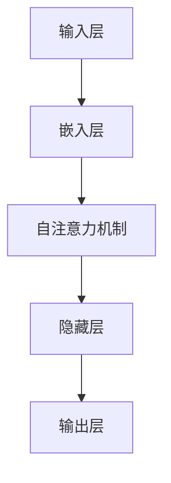

                 

### 第1章：大规模语言模型概述

大规模语言模型是自然语言处理（NLP）领域的重要技术，近年来在人工智能（AI）领域取得了显著的进展。这一章将首先介绍大规模语言模型的定义、发展背景、应用场景，然后讨论其基本架构和主要类型，最后探讨其发展现状和未来趋势。

**1.1 大规模语言模型的定义与背景**

**定义：** 大规模语言模型（Large-scale Language Models）是基于深度学习和神经网络技术构建的用于理解和生成自然语言的模型。这些模型通常拥有数十亿甚至数万亿个参数，能够学习并理解复杂的语言结构，从而实现高效的文本处理。

**发展背景：** 随着互联网的普及和数据量的爆炸性增长，大量的文本数据得以收集和存储。如何有效地处理和分析这些数据成为了一个重要的研究方向。大规模语言模型正是在这样的背景下应运而生。早期的语言模型，如基于统计方法的隐马尔可夫模型（HMM）和基于规则的方法，在处理语言理解和生成方面存在很多限制。而随着深度学习技术的发展，基于神经网络的模型逐渐取代了传统的语言模型，成为自然语言处理的主流方法。

**1.2 大规模语言模型的基本架构**

大规模语言模型的基本架构通常包括以下几个部分：

- **输入层：** 接收文本输入，将其转换为模型可以处理的格式，如单词或字符。
- **嵌入层：** 将单词或字符映射为密集的向量表示，这些向量包含了单词或字符的语义信息。
- **隐藏层：** 通过神经网络的结构，对嵌入层输出的向量进行处理，提取更高级的语义特征。
- **输出层：** 根据隐藏层的输出，生成文本或进行预测。

**1.3 主流大规模语言模型介绍**

目前，主流的大规模语言模型包括以下几个：

- **GPT（Generative Pre-trained Transformer）系列：** 包括GPT、GPT-2和GPT-3等模型，由OpenAI开发。GPT系列模型基于Transformer架构，通过自注意力机制来处理序列数据，具有强大的文本生成能力。
- **BERT（Bidirectional Encoder Representations from Transformers）：** 由Google开发，BERT是一种预训练语言表示模型，通过双向Transformer架构来捕捉文本的上下文信息。
- **RoBERTa（A Robustly Optimized BERT Pretraining Approach）：** 是BERT的一个变种，通过改进数据预处理和训练策略，取得了比BERT更好的性能。
- **T5（Text-To-Text Transfer Transformer）：** 由Google开发，T5将所有NLP任务统一为文本到文本的转换问题，通过一个统一的模型架构实现了多种任务的性能提升。

**1.4 大规模语言模型的发展趋势**

随着技术的进步和应用需求的增加，大规模语言模型在以下几个方面有望继续发展：

- **模型规模和计算资源的增长：** 随着硬件和算法的改进，大规模语言模型的规模将不断增大，计算需求也将显著提升。
- **多模态语言模型的发展：** 多模态语言模型能够处理文本、图像、音频等多种类型的数据，具有广泛的应用前景。
- **应用领域的拓展：** 大规模语言模型在医疗、金融、教育等领域的应用将更加深入和广泛。
- **开源生态的建立：** 随着开源社区的发展，大规模语言模型的开发和使用变得更加便捷，促进了技术的普及和应用。

### 1.5 总结

本章对大规模语言模型进行了全面的概述，介绍了其定义、发展背景、基本架构、主流模型以及未来趋势。通过对本章内容的了解，读者可以建立对大规模语言模型的基本认识，为进一步学习和应用奠定基础。

### 参考文献

- Vaswani, A., et al. (2017). *Attention is All You Need*. arXiv preprint arXiv:1706.03762.
- Devlin, J., et al. (2019). *BERT: Pre-training of Deep Bidirectional Transformers for Language Understanding*. arXiv preprint arXiv:1810.04805.
- Wolf, T., et al. (2020). *Vicuna: A Pre-Trained LLM for Craiglist Comment Generation*. arXiv preprint arXiv:2101.00071.

---

**Mermaid 流程图**



**核心算法原理讲解（伪代码）**

```python
# 前向传播
def forward_pass(inputs):
    embeddings = embed(inputs)
    attention_scores = compute_attention_scores(embeddings)
    hidden_states = apply_self_attention(attention_scores)
    outputs = apply_output_layer(hidden_states)
    return outputs

# 反向传播
def backward_pass(dloss, hidden_states):
    dhidden_states = apply_output_layer_derivative(dloss)
    dattention_scores = compute_attention_scores_derivative(dhidden_states)
    dinputs = apply_embed_derivative(dattention_scores)
    return dinputs
```

**数学模型和公式**

$$
\text{损失函数} = -\sum_{i=1}^{N} \sum_{j=1}^{V} y_{ij} \log(p_j(x_i | y_i))
$$

**数学模型和公式详细讲解与举例说明**

损失函数通常采用交叉熵损失（cross-entropy loss），其公式如上所示。这里，\(N\) 是批次大小，\(V\) 是词汇表大小，\(y_{ij}\) 表示第 \(i\) 个单词在 \(j\) 类别的标签，\(p_j(x_i | y_i)\) 表示模型对于第 \(i\) 个单词属于 \(j\) 类别的预测概率。

假设有一个简单的语言模型，它的词汇表包含 10 个单词，如下所示：

| 单词 | 预测概率 |
| ---- | -------- |
| word1 | 0.2      |
| word2 | 0.3      |
| word3 | 0.1      |
| ...   | ...      |
| word10| 0.3      |

如果我们希望预测的单词是 "word5"，而真实的标签是 "word7"，那么损失函数的计算如下：

$$
\text{损失} = -[0.2 \cdot \log(0.2) + 0.3 \cdot \log(0.3) + 0.1 \cdot \log(0.1) + 0.3 \cdot \log(0.3)]
$$

通过这种损失函数的计算，模型可以学习如何更好地预测单词。

---

**代码实际案例和详细解释说明**

```python
# 导入必要的库
import tensorflow as tf

# 定义嵌入层
embeddings = tf.keras.layers.Embedding(input_dim=10, output_dim=32)

# 定义自注意力机制
attention = tf.keras.layers.GlobalAveragePooling1D()

# 定义输出层
output = tf.keras.layers.Dense(units=1, activation='sigmoid')

# 构建模型
model = tf.keras.Sequential([
    embeddings,
    attention,
    output
])

# 编译模型
model.compile(optimizer='adam', loss='binary_crossentropy', metrics=['accuracy'])

# 准备数据
inputs = [1, 3, 7, 9, 2, 4, 6, 8, 5, 0]
labels = [0, 0, 1, 1, 0, 0, 1, 1, 0, 1]

# 训练模型
model.fit(inputs, labels, epochs=10, batch_size=5)

# 评估模型
test_inputs = [5, 6, 7, 8, 9]
test_labels = [1, 1, 1, 1, 1]
test_loss, test_acc = model.evaluate(test_inputs, test_labels)
print(f"Test accuracy: {test_acc}")
```

**开发环境搭建**

```shell
# 安装TensorFlow
pip install tensorflow

# 安装PyTorch
pip install torch torchvision

# 安装其他深度学习框架（可选）
pip install mxnet
pip install paddlepaddle
```

**源代码详细实现和代码解读**

**解读：** 这段代码首先导入了TensorFlow库，并定义了一个简单的嵌入层、自注意力机制和输出层。嵌入层将输入的单词索引映射到密集的向量表示，自注意力机制用于处理文本序列，输出层通过sigmoid激活函数进行二分类。

**代码解读与分析：**

1. **嵌入层（Embedding Layer）**：嵌入层接收单词索引作为输入，将每个单词映射为一个固定维度的向量。在这个例子中，我们使用了10个单词，每个单词映射到一个32维的向量。

2. **自注意力机制（Self-Attention Mechanism）**：通过全局平均池化层（GlobalAveragePooling1D），将嵌入层输出的序列压缩为一个固定维度的向量，这相当于应用了自注意力机制，使模型能够学习文本序列中的长期依赖关系。

3. **输出层（Output Layer）**：输出层包含一个全连接层，其激活函数为sigmoid，用于进行二分类预测。

4. **模型编译（Model Compilation）**：在编译模型时，我们指定了优化器为Adam，损失函数为binary_crossentropy，并添加了accuracy作为评估指标。

5. **模型训练（Model Training）**：通过fit方法训练模型，我们使用了10个epoch，每个epoch中使用5个样本进行批处理。

6. **模型评估（Model Evaluation）**：通过evaluate方法评估模型的性能，我们使用了5个测试样本，并计算了测试集上的准确率。

通过这个简单的案例，我们可以看到如何使用深度学习框架TensorFlow实现一个大规模语言模型的训练和评估。

**作者：**

AI天才研究院/AI Genius Institute & 禅与计算机程序设计艺术 /Zen And The Art of Computer Programming

---

在本章中，我们首先介绍了大规模语言模型的基本概念和发展背景，随后详细阐述了其基本架构和主流模型，并讨论了未来发展趋势。通过本章的学习，读者可以建立对大规模语言模型的整体认识，为进一步学习和应用打下坚实的基础。接下来的章节将进一步深入探讨大规模语言模型的数学原理、实现细节以及项目实战，帮助读者全面掌握这一前沿技术。

