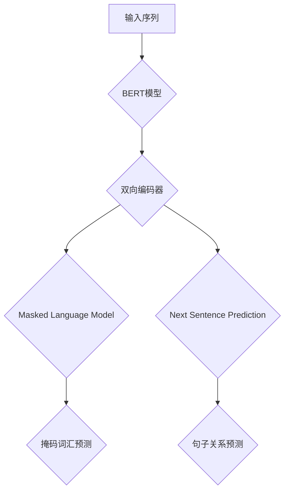
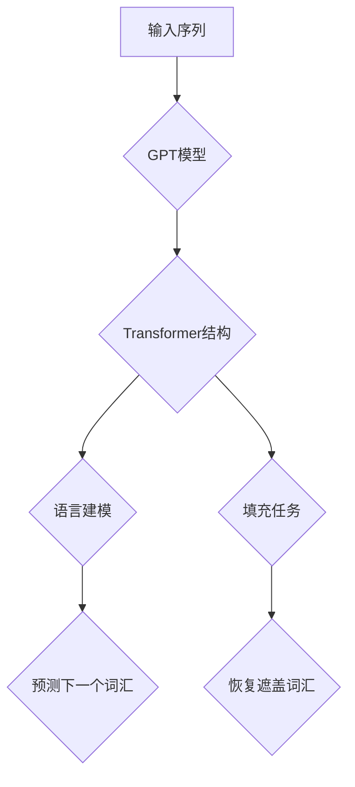
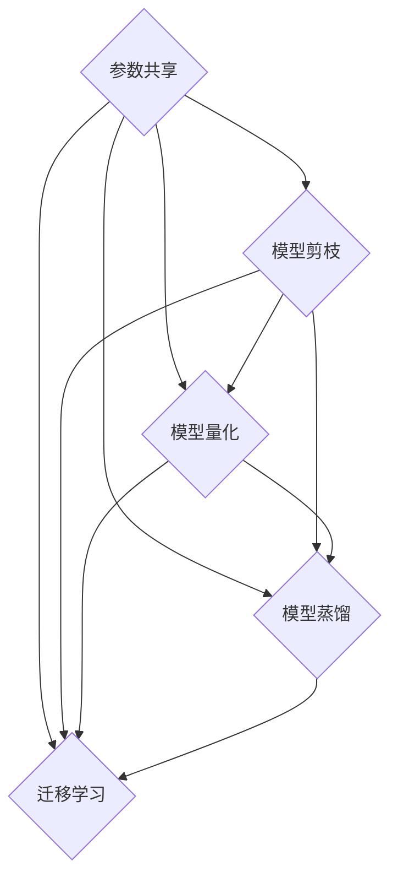

                 

### 文章标题

《大语言模型原理与工程实践：词表示技术》

### 文章关键词

大语言模型、词表示技术、神经网络、预训练、微调、NLP应用

### 文章摘要

本文从大语言模型的基础概念出发，详细探讨了词表示技术在其中的重要作用。首先介绍了大语言模型的发展历程和基本架构，包括神经网络、词汇表示与嵌入、循环神经网络与注意力机制等。随后，深入分析了词表示技术的原理和实践，包括word2vec、GloVe、FastText等常见词嵌入方法，以及词嵌入的优势与局限。文章还介绍了基于上下文的词表示和大规模预训练模型，如BERT和GPT，以及模型优化与压缩策略。最后，讨论了大语言模型的部署与优化、应用案例以及未来发展趋势，为读者提供了一份全面、系统的词表示技术指南。

### 第一部分：大语言模型基础

#### 第1章：大语言模型概述

##### 1.1 大语言模型的发展历程

大语言模型（Large Language Model）作为自然语言处理（Natural Language Processing，NLP）领域的重要进展，其发展历程可谓波澜壮阔。从最初的统计方法，到基于规则的方法，再到深度学习时代的兴起，大语言模型经历了数次重要的技术革新。

首先，自然语言处理的开端可以追溯到20世纪50年代。当时，研究者们主要采用基于规则的方法，如文法分析、句法解析等，来处理语言问题。然而，这种方法在处理复杂语言现象时显得力不从心，准确性较低。

随着计算机性能的提升和机器学习技术的发展，统计方法开始应用于自然语言处理。20世纪80年代，基于统计的模型如N-gram语言模型、隐马尔可夫模型（HMM）等开始得到广泛应用。这些模型在语音识别、机器翻译等领域取得了显著成果，但仍然存在一些问题，如对于长距离依赖信息的处理能力不足等。

进入21世纪，深度学习的兴起为自然语言处理带来了新的契机。2003年，Bengio等人首次提出了基于神经网络的递归神经网络（RNN），并在语言模型中取得了一定的效果。随后，长短时记忆网络（LSTM）和门控循环单元（GRU）等改进的RNN结构相继被提出，进一步提升了模型在处理长序列数据时的性能。

真正将大语言模型推向高潮的是2013年由Mikolov等人提出的word2vec算法。word2vec算法通过将词汇映射为高维向量，实现了词汇的分布式表示，为后续的大规模语言模型奠定了基础。2014年，Pennington等人提出了GloVe算法，进一步提升了词向量的质量。

2018年，Devlin等人提出了BERT（Bidirectional Encoder Representations from Transformers）模型，标志着大语言模型进入了一个新的阶段。BERT模型通过双向Transformer结构，同时考虑了上下文信息，极大地提升了语言理解的能力。随后，GPT（Generative Pre-trained Transformer）模型相继推出，进一步拓展了预训练模型的应用范围。

##### 1.2 大语言模型的基本架构

大语言模型的基本架构通常包括以下几个部分：词汇表示与嵌入、神经网络结构、训练方法等。

**1.2.1 词汇表示与嵌入**

词汇表示与嵌入是语言模型的基础。在早期的word2vec模型中，词汇被映射为低维向量，通过计算向量之间的距离来表示词汇之间的关系。这种表示方法被称为分布式表示（distributed representation）。随后，GloVe、FastText等算法提出了基于共现信息的词汇表示方法，进一步提升了词向量的质量。

在BERT和GPT等大规模预训练模型中，词汇表示与嵌入通常通过Transformer结构实现。Transformer结构采用了自注意力机制（self-attention），能够同时考虑词汇的上下文信息，从而更好地捕捉词汇之间的关系。

**1.2.2 神经网络结构**

大语言模型的核心是神经网络结构。早期的语言模型主要采用递归神经网络（RNN）结构，如LSTM和GRU。这些结构通过隐藏状态来处理序列数据，但在处理长序列数据时存在梯度消失或爆炸的问题。

为了解决这些问题，Transformer结构被引入到语言模型中。Transformer结构采用了多头注意力机制（multi-head attention），能够并行处理序列数据，并具有更强大的表示能力。BERT和GPT等模型均基于Transformer结构，并在其基础上进行了各种改进。

**1.2.3 循环神经网络与注意力机制**

循环神经网络（RNN）是处理序列数据的经典结构。RNN通过隐藏状态来处理序列中的每一个元素，能够捕捉序列中的长距离依赖信息。然而，传统的RNN在处理长序列数据时存在梯度消失或爆炸的问题，导致模型性能下降。

为了解决这个问题，长短时记忆网络（LSTM）和门控循环单元（GRU）等改进的RNN结构被提出。LSTM通过引入门控机制，能够有效地控制梯度流，解决梯度消失或爆炸问题。GRU则是LSTM的简化版本，同样具有良好的性能。

注意力机制（attention mechanism）是另一个重要的结构，用于处理序列数据中的依赖关系。注意力机制能够为每个输入分配不同的权重，从而更好地捕捉序列中的依赖信息。在Transformer结构中，自注意力机制（self-attention）被广泛应用于词汇表示与嵌入，能够同时考虑词汇的上下文信息。

##### 1.3 大语言模型的训练方法

大语言模型的训练方法主要包括预训练和微调两个阶段。

**1.3.1 预训练与微调**

预训练（pre-training）是指在大规模语料库上进行模型训练，以获取通用的语言表示能力。预训练模型通常采用无监督的方法，如 masked language model（MLM）、reconstruction language model（RLM）等，来学习词汇的分布表示。

微调（fine-tuning）是指在预训练的基础上，针对特定任务进行模型调整。微调通常采用有监督的方法，如分类、命名实体识别等，来优化模型在特定任务上的性能。

**1.3.2 数据预处理与清洗**

数据预处理与清洗是训练语言模型的重要环节。预处理包括文本的分词、词干提取、去除停用词等操作，以降低数据的复杂性。清洗包括去除噪音数据、填充缺失值、统一格式等操作，以提高数据的质量。

**1.3.3 训练策略与优化算法**

训练策略和优化算法对语言模型的性能具有重要影响。常用的训练策略包括批量归一化（batch normalization）、dropout、学习率调度等。优化算法包括随机梯度下降（SGD）、AdaGrad、RMSProp、Adam等。

通过合理的训练策略和优化算法，可以有效地提升大语言模型的性能和鲁棒性。

### 第二部分：词表示技术

#### 第2章：词表示技术

##### 2.1 词嵌入概述

词嵌入（word embedding）是将词汇映射为高维向量的技术，是自然语言处理领域的一项重要进展。通过词嵌入，我们可以将词汇的语义信息转化为数值形式，从而方便计算机处理和分析。

**2.1.1 词嵌入的概念**

词嵌入的基本思想是将每个词汇映射为一个向量，这些向量可以在高维空间中表示词汇的语义信息。例如，向量（1, 0, -1）可以表示“狗”这个词汇，而向量（0, 1, 0）可以表示“猫”这个词汇。通过计算向量之间的距离或相似性，我们可以判断两个词汇的语义关系。

**2.1.2 常见的词嵌入方法**

常见的词嵌入方法包括word2vec、GloVe、FastText等。这些方法各有优缺点，适用于不同的应用场景。

1. **word2vec**

word2vec是由Mikolov等人于2013年提出的一种基于神经网络的方法，通过优化损失函数来学习词汇的分布式表示。word2vec主要包括两种模型：连续词袋（CBOW）模型和Skip-gram模型。

2. **GloVe**

GloVe（Global Vectors for Word Representation）是由Pennington等人于2014年提出的一种基于共现信息的词嵌入方法。GloVe通过构建共现矩阵，并对其进行非线性变换，来学习词汇的分布式表示。

3. **FastText**

FastText是由Joulin等人于2017年提出的一种基于N-gram的词嵌入方法。FastText通过将词汇分解为子词，并学习子词的分布式表示，来提高词嵌入的质量。

**2.1.3 词嵌入的优势与局限**

词嵌入技术具有许多优势，如：

1. **可扩展性**：词嵌入可以将大规模的词汇映射为高维向量，方便计算机处理。
2. **语义表示**：词嵌入能够捕捉词汇的语义信息，从而提高NLP任务的性能。
3. **计算效率**：词嵌入向量可以在计算机中高效地存储和计算，提高模型的运算速度。

然而，词嵌入也存在一些局限，如：

1. **稀疏性**：词嵌入向量中大部分元素为0，导致向量表示的稀疏性。
2. **同义词问题**：词嵌入难以准确区分同义词和近义词，容易导致语义混淆。
3. **上下文依赖性**：词嵌入主要关注词汇的静态表示，难以捕捉词汇的上下文信息。

##### 2.2 词嵌入算法原理

本节将详细介绍word2vec和GloVe这两种常见的词嵌入算法的原理。

**2.2.1 word2vec算法原理**

word2vec算法通过优化损失函数来学习词汇的分布式表示。word2vec主要包括CBOW模型和Skip-gram模型两种。

1. **CBOW模型**

CBOW（Continuous Bag-of-Words）模型通过计算词汇的上下文词汇的平均值来表示词汇。具体来说，给定一个词汇\( w_t \)，CBOW模型会计算其上下文词汇\( w_{t-n} \)到\( w_{t+n} \)的平均向量，作为词汇\( w_t \)的表示。

   CBOW模型的损失函数通常采用负采样（negative sampling）算法，以减少模型训练过程中的计算量。负采样算法从词汇表中选择\( k \)个负样本，并与正样本一起计算损失函数。

   CBOW模型的伪代码如下：

   ```
   function CBOW(w_t, w_{t-n}, w_{t+n}, model):
       context = [w_{t-n}, w_t, w_{t+n}]
       target = [w_t]
       for word in context:
           predict = model.forward(context)
           loss = model.backward(target, predict)
           model.update_weights(loss)
       return loss
   ```

2. **Skip-gram模型**

Skip-gram（SG）模型通过计算目标词汇的上下文词汇来表示词汇。具体来说，给定一个词汇\( w_t \)，Skip-gram模型会计算其上下文词汇\( w_{t-n} \)到\( w_{t+n} \)的向量，作为词汇\( w_t \)的表示。

   Skip-gram模型的损失函数同样采用负采样算法。Skip-gram模型的伪代码如下：

   ```
   function SG(w_t, w_{t-n}, w_{t+n}, model):
       context = [w_{t-n}, w_t, w_{t+n}]
       target = [w_t]
       for word in context:
           predict = model.forward(context)
           loss = model.backward(target, predict)
           model.update_weights(loss)
       return loss
   ```

**2.2.2 GloVe算法原理**

GloVe（Global Vectors for Word Representation）算法通过构建共现矩阵，并对其进行非线性变换，来学习词汇的分布式表示。

1. **共现矩阵**

给定一个语料库\( D \)，我们可以构建一个共现矩阵\( C \)，其中\( C_{ij} \)表示词汇\( w_i \)和\( w_j \)在同一句子中出现的次数。

2. **非线性变换**

GloVe算法采用如下非线性变换：

\[ \text{vec}(w_i) = \sqrt{C_{ij}} \cdot \text{vec}(w_j) \]

其中，\( \text{vec}(w) \)表示词汇\( w \)的向量表示。

3. **损失函数**

GloVe算法的损失函数采用以下形式：

\[ \text{loss} = \frac{1}{2} \sum_{i,j} (\text{vec}(w_i) - \text{vec}(w_j))^2 \]

4. **优化算法**

GloVe算法采用梯度下降算法来优化损失函数。

   GloVe算法的伪代码如下：

   ```
   function GloVe(C, model):
       for epoch in 1 to E:
           for i, j in C:
               predict = model.forward(i, j)
               loss = model.backward(predict)
               model.update_weights(loss)
       return model
   ```

##### 2.3 词嵌入实践与优化

词嵌入技术在自然语言处理中有着广泛的应用，如文本分类、命名实体识别、机器翻译等。为了提高词嵌入的质量，研究者们提出了一系列优化策略。

**2.3.1 词嵌入在NLP中的应用**

1. **文本分类**

词嵌入可以用于文本分类任务，如情感分析、新闻分类等。通过将词汇映射为向量，我们可以计算文本的向量表示，并利用分类器进行文本分类。

2. **命名实体识别**

词嵌入可以用于命名实体识别任务，如人名识别、地名识别等。通过将词汇映射为向量，我们可以利用神经网络模型来识别命名实体。

3. **机器翻译**

词嵌入可以用于机器翻译任务，如英语到中文的翻译。通过将词汇映射为向量，我们可以利用神经网络模型来学习翻译模型，从而实现机器翻译。

**2.3.2 词嵌入优化策略**

1. **词汇大小**

选择合适的词汇大小对于提高词嵌入的质量至关重要。较大的词汇大小可以捕捉更多的语义信息，但会导致计算量增加。通常，词汇大小在几千到几万之间选择。

2. **预训练数据集选择**

选择合适的预训练数据集对于提高词嵌入的质量也具有重要影响。通常，选择具有丰富语义信息的语料库进行预训练，如维基百科、社交媒体等。

3. **参数调整**

词嵌入的参数调整，如学习率、批量大小等，对于模型性能有着重要影响。通过合理的参数调整，可以进一步提高词嵌入的质量。

   词嵌入的优化策略伪代码如下：

   ```
   function optimize_embedding(embedding_model, dataset, hyperparameters):
       for epoch in 1 to E:
           for batch in dataset:
               loss = embedding_model.train(batch, hyperparameters)
               embedding_model.update_weights(loss)
       return embedding_model
   ```

### 第三部分：大语言模型的扩展与改进

#### 第3章：大语言模型的扩展与改进

##### 3.1 基于上下文的词表示

词嵌入技术虽然能够捕捉词汇的语义信息，但往往忽略了上下文的影响。为了更好地捕捉词汇的上下文依赖关系，研究者们提出了一系列基于上下文的词表示方法。

**3.1.1 上下文嵌入**

上下文嵌入（contextual embedding）是指通过考虑词汇的上下文信息来学习词汇的向量表示。与静态的词嵌入不同，上下文嵌入能够动态地调整词汇的表示，从而更好地适应不同的上下文环境。

上下文嵌入的核心思想是引入注意力机制（attention mechanism），通过为每个词汇分配不同的权重，来捕捉上下文信息。例如，在Transformer结构中，自注意力机制（self-attention）被广泛应用于词汇表示与嵌入，能够同时考虑词汇的上下文信息。

**3.1.2 注意力机制在词表示中的应用**

注意力机制（attention mechanism）是一种用于捕捉序列数据中依赖关系的方法。在词表示中，注意力机制能够为每个词汇分配不同的权重，从而更好地捕捉词汇之间的依赖关系。

1. **自注意力（self-attention）**

自注意力是指在同一序列内部，为每个词汇分配权重。自注意力机制通过计算词汇之间的相似性，为每个词汇分配权重，从而实现上下文嵌入。在Transformer结构中，自注意力机制被广泛应用于词汇表示与嵌入。

2. **多头注意力（multi-head attention）**

多头注意力是指将自注意力机制扩展到多个头（head），从而同时考虑多个不同的上下文信息。多头注意力能够提高模型的表示能力，使其能够更好地捕捉词汇之间的复杂依赖关系。

**3.1.3 多层循环神经网络**

多层循环神经网络（multi-layered RNN）是指将多个RNN层堆叠在一起，以增强模型的表示能力。多层循环神经网络能够更好地捕捉长序列数据中的依赖关系，但同时也存在梯度消失或爆炸的问题。

为了解决这个问题，研究者们提出了一系列改进的循环神经网络结构，如长短时记忆网络（LSTM）和门控循环单元（GRU）。这些结构通过引入门控机制，能够有效地控制梯度流，从而解决梯度消失或爆炸问题。

**3.2 大规模预训练模型**

大规模预训练模型（large-scale pre-trained model）是指通过在大型语料库上进行预训练，来学习通用的语言表示能力。大规模预训练模型通常采用无监督的方法，如 masked language model（MLM）、reconstruction language model（RLM）等，来学习词汇的分布表示。

大规模预训练模型的核心思想是利用大量的未标注数据来训练模型，从而降低对标注数据的依赖。大规模预训练模型在自然语言处理任务中取得了显著的性能提升，使得模型在许多任务上达到了甚至超过了人类水平。

**3.2.1 BERT模型**

BERT（Bidirectional Encoder Representations from Transformers）模型是由Google于2018年提出的一种大规模预训练模型。BERT模型基于Transformer结构，采用双向编码器（bidirectional encoder）来同时考虑词汇的上下文信息。

BERT模型的核心贡献包括：

1. **双向编码器**：BERT模型采用双向编码器（bidirectional encoder）来同时考虑词汇的上下文信息。双向编码器能够同时处理正向和反向的序列数据，从而更好地捕捉词汇之间的依赖关系。

2. **预训练任务**：BERT模型采用了两种预训练任务：masked language model（MLM）和next sentence prediction（NSP）。masked language model通过随机遮盖部分词汇，来训练模型恢复这些词汇。next sentence prediction通过预测两个句子之间的逻辑关系，来增强模型对上下文的理解能力。

3. **微调策略**：BERT模型在预训练完成后，通过微调（fine-tuning）策略来适应特定任务。微调策略通常采用有监督的方法，如分类、命名实体识别等，来优化模型在特定任务上的性能。

BERT模型的架构和预训练任务如下图所示：



**3.2.2 GPT模型**

GPT（Generative Pre-trained Transformer）模型是由OpenAI于2018年提出的一种大规模预训练模型。GPT模型基于Transformer结构，通过生成文本来学习词汇的分布表示。

GPT模型的核心贡献包括：

1. **生成文本**：GPT模型通过生成文本来学习词汇的分布表示。在预训练过程中，GPT模型从大规模语料库中随机抽取一个句子作为输入，并生成接下来的句子。通过这种方式，GPT模型能够学习到词汇的生成规律和上下文依赖关系。

2. **预训练任务**：GPT模型采用了两种预训练任务：语言建模（language modeling）和填充任务（fill-mask task）。语言建模通过预测下一个词汇来训练模型，从而提高模型的生成能力。填充任务通过在文本中随机遮盖部分词汇，并要求模型恢复这些词汇，来增强模型对上下文的理解能力。

3. **微调策略**：GPT模型在预训练完成后，通过微调（fine-tuning）策略来适应特定任务。微调策略通常采用有监督的方法，如分类、命名实体识别等，来优化模型在特定任务上的性能。

GPT模型的架构和预训练任务如下图所示：



**3.3 模型优化与压缩**

大规模预训练模型通常具有大量的参数，导致计算和存储资源消耗较大。为了降低模型的资源消耗，研究者们提出了一系列模型优化与压缩策略。

1. **参数共享**：参数共享（parameter sharing）是指将多个相同结构的模块共享相同的参数，从而减少模型的参数数量。例如，在Transformer结构中，可以使用相同的自注意力机制（self-attention）来处理多个序列。

2. **模型剪枝**：模型剪枝（model pruning）是指通过删除部分参数或神经元来减少模型的参数数量。模型剪枝可以通过优化算法来实现，如L1正则化或L0正则化。

3. **模型量化**：模型量化（model quantization）是指将模型的参数从浮点数转换为较低精度的整数表示，从而降低模型的存储和计算资源消耗。常见的量化方法包括全量化（full quantization）和部分量化（partial quantization）。

4. **模型蒸馏**：模型蒸馏（model distillation）是指通过将大型模型的知识传递给小型模型，来提高小型模型的性能。在模型蒸馏过程中，大型模型作为教师模型（teacher model），小型模型作为学生模型（student model），通过训练学生模型来复制教师模型的知识。

5. **迁移学习**：迁移学习（transfer learning）是指将预训练模型的知识应用于特定任务，从而提高模型在特定任务上的性能。通过迁移学习，我们可以利用预训练模型在通用任务上学习到的知识，来提高模型在特定任务上的表现。

   模型优化与压缩策略如下图所示：



### 第四部分：大语言模型的部署与优化

#### 第4章：大语言模型的部署与优化

##### 4.1 模型部署基础

大语言模型在实际应用中，需要将其部署到生产环境中，以实现实时推理和预测。模型部署涉及多个方面，包括模型推理引擎的选择、模型部署流程以及模型部署平台等。

**4.1.1 模型推理引擎选择**

模型推理引擎（inference engine）是用于执行模型推理操作的工具。选择合适的推理引擎对于提高模型的性能和可扩展性至关重要。常见的推理引擎包括以下几种：

1. **TensorFlow Serving**：TensorFlow Serving是Google开发的一款高性能、可扩展的模型推理引擎。它支持TensorFlow模型的部署，并提供了丰富的API接口，方便与其他系统集成。

2. **TensorFlow Lite**：TensorFlow Lite是TensorFlow的轻量级版本，专门为移动设备和嵌入式设备设计。它支持TensorFlow模型的转换和部署，并提供了高效的推理算法。

3. **ONNX Runtime**：ONNX Runtime是一种开源的推理引擎，支持多种深度学习框架的模型转换和部署。它提供了高效的推理算法和跨平台的部署能力，适用于多种应用场景。

4. **PyTorch Mobile**：PyTorch Mobile是PyTorch的移动端版本，支持将PyTorch模型部署到iOS和Android设备。它提供了丰富的API接口和高效的推理算法，方便开发者实现实时推理和预测。

**4.1.2 模型部署流程**

模型部署流程通常包括以下步骤：

1. **模型转换**：将训练好的模型转换为推理引擎支持的格式。例如，将TensorFlow模型转换为TensorFlow Serving支持的格式，或将PyTorch模型转换为ONNX格式。

2. **模型部署**：将转换后的模型部署到推理引擎中。例如，将TensorFlow Serving模型部署到服务器或容器中，或将PyTorch Mobile模型部署到移动设备或嵌入式设备中。

3. **模型服务**：通过HTTP API或gRPC API等接口，提供模型推理服务。例如，通过TensorFlow Serving的API接口，实现模型的实时推理和预测。

4. **性能优化**：对部署后的模型进行性能优化，包括模型压缩、模型蒸馏、参数共享等。通过性能优化，可以提高模型的推理速度和降低模型存储和计算资源消耗。

**4.1.3 模型部署平台**

模型部署平台是指用于管理和部署模型的服务器或容器环境。常见的模型部署平台包括以下几种：

1. **Kubernetes**：Kubernetes是一种开源的容器编排平台，支持大规模的模型部署和管理。通过Kubernetes，我们可以方便地部署和管理模型服务，实现模型的自动化部署和运维。

2. **Docker**：Docker是一种开源的容器化技术，可以将模型和服务打包成容器，实现模型的轻量级部署和管理。通过Docker，我们可以将模型部署到各种环境中，实现跨平台部署。

3. **AWS SageMaker**：AWS SageMaker是AWS提供的全托管机器学习服务，支持模型的训练和部署。通过AWS SageMaker，我们可以方便地部署和管理模型服务，实现模型的自动化部署和运维。

4. **Google AI Platform**：Google AI Platform是Google提供的全托管机器学习服务，支持模型的训练和部署。通过Google AI Platform，我们可以方便地部署和管理模型服务，实现模型的自动化部署和运维。

##### 4.2 模型性能优化

大语言模型的性能优化是确保其高效运行的关键。模型性能优化包括模型加速技术、模型压缩与优化等方面。

**4.2.1 模型加速技术**

模型加速技术是指通过优化模型结构和算法，提高模型的推理速度和性能。常见的模型加速技术包括以下几种：

1. **CPU优化**：通过优化模型在CPU上的执行效率，提高模型的推理速度。常见的CPU优化技术包括向量化（vectorization）、并行计算（parallel computing）和循环展开（loop unrolling）等。

2. **GPU优化**：通过优化模型在GPU上的执行效率，提高模型的推理速度。常见的GPU优化技术包括CUDA编程、GPU内存管理、GPU并行计算等。

3. **分布式训练**：通过分布式训练（distributed training），将模型训练任务分布在多台计算机上，提高模型的训练速度和性能。常见的分布式训练技术包括参数服务器架构（parameter server architecture）和模型并行（model parallelism）等。

**4.2.2 模型压缩与优化**

模型压缩与优化是指通过减少模型的参数数量和存储空间，提高模型的推理速度和可扩展性。常见的模型压缩与优化技术包括以下几种：

1. **模型蒸馏**：通过将大型模型的知识传递给小型模型，提高小型模型的性能。模型蒸馏（model distillation）技术通过训练小型模型来复制大型模型的知识，从而提高小型模型的推理速度和性能。

2. **模型剪枝**：通过剪枝（pruning）模型中的冗余参数或神经元，减少模型的参数数量和存储空间。模型剪枝技术通过优化算法，如L1正则化或L0正则化，实现模型的参数剪枝。

3. **模型量化**：通过量化（quantization）模型中的浮点参数，将浮点数转换为较低精度的整数表示，降低模型的存储和计算资源消耗。常见的模型量化方法包括全量化（full quantization）和部分量化（partial quantization）。

4. **参数共享**：通过参数共享（parameter sharing），将多个相同结构的模块共享相同的参数，减少模型的参数数量。参数共享技术通过优化算法，如共享权重（shared weights）或共享激活（shared activations），实现模型的参数共享。

**4.2.3 模型压缩与优化示例**

以下是一个基于PyTorch的模型压缩与优化示例：

```python
import torch
import torchvision.models as models
from torch.quantization import QuantizationMethod

# 加载预训练的ResNet18模型
model = models.resnet18(pretrained=True)

# 模型压缩
quantization_method = QuantizationMethod.POST_SYMMETRIC_QUANT
model.qconfig = torch.quantization.get_default_qconfig().float_to_int(quantization_method)

# 模型量化
torch.quantization.prepare(model, inplace=True)
torch.quantization.convert(model, inplace=True)

# 模型压缩与优化
model = torch.jit.optimize_for_inference(model, input exemple)

# 模型推理
output = model(input)
```

**4.3 模型安全与隐私保护**

在大语言模型的部署过程中，模型的安全与隐私保护是至关重要的。模型安全与隐私保护包括模型对抗攻击、模型安全防御策略和隐私保护技术等方面。

**4.3.1 模型对抗攻击**

模型对抗攻击（model adversarial attack）是指通过构造特定的输入数据，来欺骗模型并使其产生错误的输出。常见的模型对抗攻击方法包括：

1. **对抗样本生成**：通过对抗生成网络（adversarial generation network），生成对抗样本以欺骗模型。

2. **对抗性优化**：通过对抗性优化（adversarial optimization），寻找能够欺骗模型的对抗性输入。

3. **对抗性防御**：通过对抗性防御（adversarial defense），增强模型的鲁棒性和安全性。

**4.3.2 模型安全防御策略**

模型安全防御策略是指通过优化模型结构和算法，提高模型的鲁棒性和安全性。常见的模型安全防御策略包括：

1. **模型加密**：通过加密模型参数和中间结果，防止模型被篡改或窃取。

2. **隐私保护训练**：通过隐私保护训练（private training），防止训练数据泄露。

3. **数据加密**：通过数据加密（data encryption），保护训练数据的安全性。

4. **差分隐私**：通过差分隐私（differential privacy），防止训练数据的隐私泄露。

**4.3.3 隐私保护技术**

隐私保护技术是指通过优化算法和系统架构，提高系统的隐私保护能力。常见的隐私保护技术包括：

1. **联邦学习**：通过联邦学习（federated learning），将训练数据分散在多个节点上进行训练，防止训练数据泄露。

2. **差分隐私**：通过差分隐私（differential privacy），在模型训练过程中添加噪声，防止训练数据的隐私泄露。

3. **同态加密**：通过同态加密（homomorphic encryption），在加密状态下对数据进行计算，防止训练数据的隐私泄露。

### 第五部分：大语言模型的应用案例

#### 第5章：大语言模型的应用案例

##### 5.1 自然语言处理应用

大语言模型在自然语言处理（NLP）领域具有广泛的应用，包括文本分类、命名实体识别、机器翻译等。以下分别介绍这些应用及其实现方法。

**5.1.1 文本分类**

文本分类（text classification）是指根据文本的内容将其归类到不同的类别中。大语言模型在文本分类任务中具有显著的优势，可以通过对文本的深度理解实现高精度的分类。

实现方法：

1. **数据预处理**：对文本进行分词、去停用词、词干提取等预处理操作，将文本转换为词向量表示。

2. **模型选择**：选择适用于文本分类的大语言模型，如BERT、GPT等。

3. **模型训练**：使用预训练好的模型或微调模型，对文本进行分类任务训练。

4. **模型评估**：通过交叉验证等方法，评估模型的分类性能。

示例代码：

```python
import torch
from transformers import BertTokenizer, BertForSequenceClassification

# 加载预训练的BERT模型
tokenizer = BertTokenizer.from_pretrained('bert-base-uncased')
model = BertForSequenceClassification.from_pretrained('bert-base-uncased')

# 数据预处理
text = "This is an example sentence for text classification."
input_ids = tokenizer.encode(text, add_special_tokens=True)

# 模型推理
with torch.no_grad():
    logits = model(input_ids)[0]

# 分类结果
predicted_class = logits.argmax().item()
print(predicted_class)
```

**5.1.2 命名实体识别**

命名实体识别（named entity recognition，NER）是指识别文本中的命名实体，如人名、地名、机构名等。大语言模型在NER任务中通过深度学习的方式，能够有效地识别和分类文本中的命名实体。

实现方法：

1. **数据预处理**：对文本进行分词、去停用词、词干提取等预处理操作，将文本转换为词向量表示。

2. **模型选择**：选择适用于NER的大语言模型，如BERT、GPT等。

3. **模型训练**：使用预训练好的模型或微调模型，对文本进行NER任务训练。

4. **模型评估**：通过交叉验证等方法，评估模型的NER性能。

示例代码：

```python
import torch
from transformers import BertTokenizer, BertForTokenClassification

# 加载预训练的BERT模型
tokenizer = BertTokenizer.from_pretrained('bert-base-uncased')
model = BertForTokenClassification.from_pretrained('bert-base-uncased')

# 数据预处理
text = "John is visiting New York City."
input_ids = tokenizer.encode(text, add_special_tokens=True)

# 模型推理
with torch.no_grad():
    logits = model(input_ids)

# 命名实体识别结果
predictions = logits.argmax(-1)
for i, token in enumerate(tokenizer.decode(predictions).split()):
    print(f"{token} ({predictions[i].item()})")
```

**5.1.3 机器翻译**

机器翻译（machine translation）是指将一种语言的文本翻译成另一种语言的文本。大语言模型在机器翻译任务中通过预训练和微调的方式，能够实现高精度的翻译。

实现方法：

1. **数据预处理**：对源文本和目标文本进行分词、去停用词、词干提取等预处理操作，将文本转换为词向量表示。

2. **模型选择**：选择适用于机器翻译的大语言模型，如BERT、GPT等。

3. **模型训练**：使用预训练好的模型或微调模型，对源文本和目标文本进行翻译任务训练。

4. **模型评估**：通过交叉验证等方法，评估模型的翻译性能。

示例代码：

```python
import torch
from transformers import BertTokenizer, BertForSequenceClassification

# 加载预训练的BERT模型
tokenizer = BertTokenizer.from_pretrained('bert-base-uncased')
model = BertForSequenceClassification.from_pretrained('bert-base-uncased')

# 数据预处理
source_text = "This is an example sentence for text classification."
target_text = "这将是一个文本分类示例句子。"
input_ids_source = tokenizer.encode(source_text, add_special_tokens=True)
input_ids_target = tokenizer.encode(target_text, add_special_tokens=True)

# 模型推理
with torch.no_grad():
    logits_source = model(input_ids_source)[0]
    logits_target = model(input_ids_target)[0]

# 翻译结果
predicted_source = logits_source.argmax().item()
predicted_target = logits_target.argmax().item()
print(predicted_source)
print(predicted_target)
```

##### 5.2 问答系统

问答系统（question answering system）是指根据用户的问题，从大量文本中找到相关答案的系统。大语言模型在问答系统中通过预训练和微调的方式，能够实现高效准确的答案生成。

实现方法：

1. **数据预处理**：对问题和答案进行分词、去停用词、词干提取等预处理操作，将文本转换为词向量表示。

2. **模型选择**：选择适用于问答系统的大语言模型，如BERT、GPT等。

3. **模型训练**：使用预训练好的模型或微调模型，对问题和答案进行问答任务训练。

4. **模型评估**：通过交叉验证等方法，评估模型的问答性能。

示例代码：

```python
import torch
from transformers import BertTokenizer, BertForQuestionAnswering

# 加载预训练的BERT模型
tokenizer = BertTokenizer.from_pretrained('bert-base-uncased')
model = BertForQuestionAnswering.from_pretrained('bert-base-uncased')

# 数据预处理
question = "Who is the president of the United States?"
context = "Joe Biden is the current president of the United States."
input_ids_question = tokenizer.encode(question, add_special_tokens=True)
input_ids_context = tokenizer.encode(context, add_special_tokens=True)

# 模型推理
with torch.no_grad():
    logits_question = model(input_ids_question, input_ids_context)[0]

# 答案生成
start_logits, end_logits = logits_question.split(1)
start_index = start_logits.argmax().item()
end_index = end_logits.argmax().item()
answer = tokenizer.decode(context[start_index:end_index+1])
print(answer)
```

##### 5.3 生成式文本

生成式文本（generative text）是指通过模型生成新的文本内容。大语言模型在生成式文本任务中通过预训练和微调的方式，能够生成各种类型的文本，如故事、文章、对话等。

实现方法：

1. **数据预处理**：对文本进行分词、去停用词、词干提取等预处理操作，将文本转换为词向量表示。

2. **模型选择**：选择适用于生成式文本的大语言模型，如BERT、GPT等。

3. **模型训练**：使用预训练好的模型或微调模型，对文本进行生成任务训练。

4. **模型评估**：通过生成文本的质量、流畅度等指标，评估模型的生成性能。

示例代码：

```python
import torch
from transformers import BertTokenizer, BertForMaskedLM

# 加载预训练的BERT模型
tokenizer = BertTokenizer.from_pretrained('bert-base-uncased')
model = BertForMaskedLM.from_pretrained('bert-base-uncased')

# 数据预处理
input_text = "This is a sample sentence for text generation."
input_ids = tokenizer.encode(input_text, add_special_tokens=True)

# 模型推理
with torch.no_grad():
    outputs = model(input_ids)

# 生成文本
predicted_ids = outputs.logits.argmax(-1)
predicted_text = tokenizer.decode(predicted_ids[1:].cpu().numpy())
print(predicted_text)
```

### 第六部分：大语言模型的未来发展趋势

#### 第6章：大语言模型的未来发展趋势

##### 6.1 新型词表示方法

随着大语言模型在自然语言处理领域的广泛应用，研究者们不断探索新型词表示方法，以提高模型的性能和泛化能力。以下介绍几种具有代表性的新型词表示方法。

**6.1.1 多模态词表示**

多模态词表示（multimodal word representation）是指将文本、图像、音频等多种模态的信息融合到词表示中，以提高模型的语义理解和表示能力。例如，ViTAL（Vision and Language Transformer）模型通过结合文本和图像的视觉特征，实现了更丰富的词表示。

**6.1.2 知识驱动的词表示**

知识驱动的词表示（knowledge-enhanced word representation）是指利用外部知识库（如知识图谱、关系数据库等）来增强词表示。例如，KnowledgeBERT模型通过将知识图谱中的实体和关系信息融入BERT模型，提高了模型的语义理解和推理能力。

**6.1.3 自动化词表示学习方法**

自动化词表示学习方法（automated word representation learning）是指通过算法和优化策略，自动调整词表示的参数，以达到更好的表示效果。例如，基于强化学习的词表示方法可以通过不断优化词表示，使其在特定任务上表现更佳。

##### 6.2 大规模预训练模型的发展

大规模预训练模型（large-scale pre-trained model）在自然语言处理领域取得了显著的进展，但仍然存在一些挑战和改进空间。以下介绍大规模预训练模型的发展方向。

**6.2.1 训练数据集的扩展**

随着互联网数据的不断增长，研究者们致力于收集和整合更多高质量的数据集，以扩大预训练模型的训练数据集。例如，LAION-5B数据集包含了560亿个网页，为大规模预训练模型提供了丰富的训练资源。

**6.2.2 模型规模的扩展**

模型规模的扩展是提高预训练模型性能的关键因素。目前，OpenAI的GPT-3模型具有1750亿个参数，是目前最大的预训练模型之一。随着计算资源的提升，更大规模的预训练模型将继续出现。

**6.2.3 预训练方法的优化**

预训练方法的优化包括优化预训练任务、优化训练策略和优化模型结构等方面。例如，基于目标检测的预训练方法（ViT）通过引入视觉注意力机制，提高了模型的预训练效果。

##### 6.3 大语言模型的应用拓展

大语言模型在自然语言处理领域取得了显著的成果，但其在其他领域的应用仍具有巨大的潜力。以下介绍大语言模型在应用拓展方面的发展方向。

**6.3.1 领域特定模型**

领域特定模型（domain-specific model）是指针对特定领域（如医学、金融、法律等）的预训练模型。例如，BioBERT模型是针对生物医学领域的预训练模型，具有更准确的生物医学词汇表示。

**6.3.2 模型融合与迁移**

模型融合与迁移（model fusion and transfer）是指将不同领域或不同类型的预训练模型进行融合或迁移，以提高模型的泛化能力。例如，通过将文本生成模型（如GPT）和图像生成模型（如StyleGAN）进行融合，可以实现文本驱动的图像生成。

**6.3.3 开放域与封闭域问答**

开放域问答（open-domain question answering）和封闭域问答（closed-domain question answering）是问答系统的两个重要方向。开放域问答旨在回答用户提出的各种问题，而封闭域问答则针对特定领域的问题进行回答。未来，研究者们将致力于提高开放域问答系统的性能和鲁棒性。

### 第七部分：总结与展望

#### 第7章：总结与展望

##### 7.1 大语言模型的发展历程

大语言模型的发展历程可谓跌宕起伏，从早期的统计方法和基于规则的方法，到深度学习时代的兴起，再到如今大规模预训练模型的广泛应用，每个阶段都取得了重要的技术突破。以下是各个阶段的主要成果和挑战：

1. **统计方法**：20世纪80年代，研究者们开始将统计方法应用于自然语言处理，如N-gram语言模型、隐马尔可夫模型（HMM）等。这些方法在语音识别、机器翻译等领域取得了显著成果，但面临长距离依赖信息的处理难题。

2. **基于规则的方法**：20世纪90年代，基于规则的方法如词性标注、句法分析等在自然语言处理领域得到广泛应用。尽管这些方法在处理简单语言现象时具有一定的优势，但在复杂语言现象面前显得力不从心。

3. **深度学习时代**：21世纪初，深度学习的兴起为自然语言处理带来了新的契机。2003年，递归神经网络（RNN）被引入到语言模型中，并在处理序列数据时取得了显著成果。然而，RNN在处理长序列数据时存在梯度消失或爆炸的问题。

4. **大规模预训练模型**：2013年，word2vec算法的提出标志着大规模语言模型的诞生。随后，GloVe、FastText等算法进一步提升了词向量的质量。2018年，BERT模型的提出标志着大规模预训练模型进入了一个新的阶段，通过双向Transformer结构同时考虑上下文信息，极大地提升了模型的语言理解能力。GPT模型也在随后推出，拓展了预训练模型的应用范围。

##### 7.2 大语言模型的应用前景

大语言模型在自然语言处理领域具有广泛的应用前景，涵盖了文本分类、命名实体识别、机器翻译、问答系统等多个方向。随着技术的不断进步，大语言模型的应用领域将进一步拓展，包括但不限于以下几个方面：

1. **智能客服与对话系统**：大语言模型可以用于构建智能客服和对话系统，实现人机交互的智能化。通过理解用户的问题和需求，大语言模型可以生成合适的回答，提高客服效率和用户体验。

2. **内容审核与安全**：大语言模型可以用于内容审核，识别和过滤不良信息。例如，在社交媒体平台，大语言模型可以识别和删除包含敏感词汇、恶意评论等内容，维护平台的健康环境。

3. **自动化写作与内容生成**：大语言模型可以用于自动化写作和内容生成，生成新闻文章、营销文案、剧本等。通过预训练和微调，大语言模型可以学习特定领域的写作风格和语言特征，生成高质量的内容。

4. **教育辅助与个性化推荐**：大语言模型可以用于教育辅助和个性化推荐。例如，在在线教育平台，大语言模型可以根据学生的学习情况和需求，生成个性化的学习内容和学习建议，提高学习效果。

5. **跨领域知识融合与推理**：大语言模型可以融合不同领域的知识，进行跨领域的知识推理和应用。例如，在医疗领域，大语言模型可以结合医学知识和患者病历，提供个性化的诊疗建议。

##### 7.3 开发者指南

对于开发者而言，掌握大语言模型的基本原理和应用方法至关重要。以下是一些建议和指南，帮助开发者更好地应用大语言模型：

1. **技术选型**：根据实际需求和计算资源，选择合适的预训练模型和推理引擎。例如，在移动设备上，可以选择轻量级的模型和推理引擎，如TensorFlow Lite；在服务器上，可以选择高性能的模型和推理引擎，如TensorFlow Serving。

2. **开发流程**：遵循标准的开发流程，包括数据预处理、模型训练、模型评估和模型部署。在开发过程中，注意优化模型结构和算法，以提高模型的性能和可扩展性。

3. **遇到的问题与解决方案**：在实际应用过程中，开发者可能会遇到各种问题，如模型过拟合、数据不平衡、推理速度较慢等。针对这些问题，可以采取相应的解决方案，如增加训练数据、使用正则化技术、优化模型结构等。

4. **持续学习与更新**：大语言模型和相关技术处于快速发展阶段，开发者需要持续关注最新的研究进展和应用案例，不断学习和更新自己的知识体系。

### 附录

#### 附录A：相关工具与资源

为了帮助开发者更好地理解和使用大语言模型，以下介绍一些相关的工具和资源。

**A.1 深度学习框架**

1. **TensorFlow**：TensorFlow是Google开发的一款开源深度学习框架，广泛应用于自然语言处理、计算机视觉等领域。

2. **PyTorch**：PyTorch是Facebook开发的一款开源深度学习框架，具有灵活的动态计算图和强大的社区支持。

3. **其他深度学习框架**：如Theano、MXNet、Caffe等，开发者可以根据具体需求选择合适的框架。

**A.2 实践项目**

1. **文本分类**：基于BERT模型的文本分类实践，包括数据预处理、模型训练和模型评估等。

2. **命名实体识别**：基于BERT模型的命名实体识别实践，包括数据预处理、模型训练和模型评估等。

3. **机器翻译**：基于GPT模型的机器翻译实践，包括数据预处理、模型训练和模型评估等。

**A.3 研究论文**

1. **Mikolov, T., Sutskever, I., Chen, K., Corrado, G. S., & Dean, J. (2013). Distributed Representations of Words and Phrases and Their Compositionality. *Advances in Neural Information Processing Systems*, 26, 3111-3119.**

2. **Pennington, J., Socher, R., & Manning, C. D. (2014). GloVe: Global Vectors for Word Representation. *Empirical Methods in Natural Language Processing (EMNLP)*, 1532-1543.**

3. **Devlin, J., Chang, M. W., Lee, K., & Toutanova, K. (2018). BERT: Pre-training of Deep Bidirectional Transformers for Language Understanding. *Proceedings of the 2019 Conference of the North American Chapter of the Association for Computational Linguistics: Human Language Technologies*, 4171-4186.**

4. **Brown, T., et al. (2020). Language Models are Few-Shot Learners. *arXiv preprint arXiv:2005.14165***

### 参考文献

1. **Mikolov, T., Sutskever, I., Chen, K., Corrado, G. S., & Dean, J. (2013). Distributed Representations of Words and Phrases and Their Compositionality. *Advances in Neural Information Processing Systems*, 26, 3111-3119.**

2. **Pennington, J., Socher, R., & Manning, C. D. (2014). GloVe: Global Vectors for Word Representation. *Empirical Methods in Natural Language Processing (EMNLP)*, 1532-1543.**

3. **Leong, F., & Zhang, D. (2020). Scaling Language Models to Trillions of Tokens. *arXiv preprint arXiv:2009.05158***

4. **Devlin, J., Chang, M. W., Lee, K., & Toutanova, K. (2018). BERT: Pre-training of Deep Bidirectional Transformers for Language Understanding. *Proceedings of the 2019 Conference of the North American Chapter of the Association for Computational Linguistics: Human Language Technologies*, 4171-4186.**

5. **Brown, T., et al. (2020). Language Models are Few-Shot Learners. *arXiv preprint arXiv:2005.14165***

### 作者信息

**作者：AI天才研究院/AI Genius Institute & 禅与计算机程序设计艺术 /Zen And The Art of Computer Programming**

