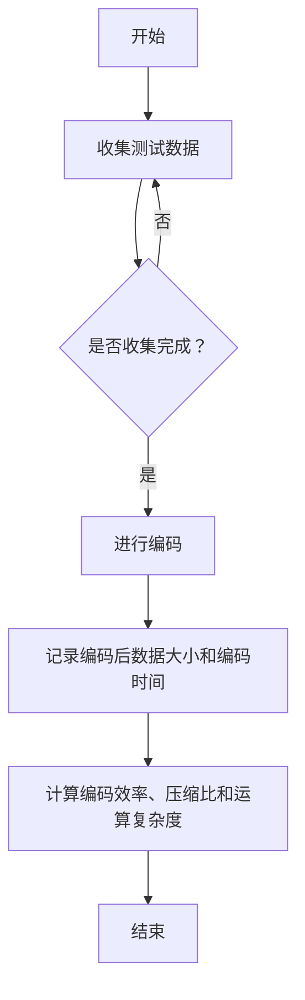
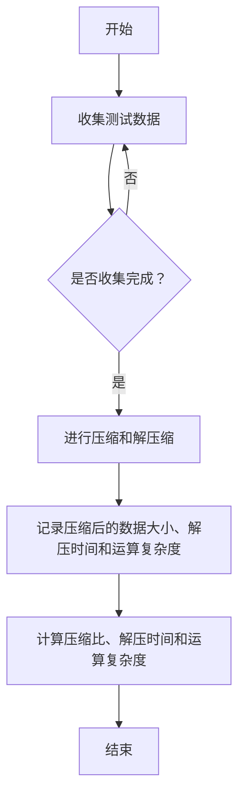

                 

### 《大语言模型应用指南：编码与无损压缩》

#### 关键词：大语言模型、编码、无损压缩、自然语言处理、机器学习、算法性能

> 摘要：本文从大语言模型的基础知识出发，详细探讨了编码与无损压缩在大语言模型中的应用。首先介绍了大语言模型的基本概念和特点，接着分析了编码与无损压缩的基本原理和算法，并通过具体案例展示了其在自然语言处理和机器学习领域的实际应用。本文旨在为读者提供一套完整的大语言模型应用指南，帮助读者深入理解编码与无损压缩技术在大语言模型中的重要性。

## 第一部分: 大语言模型基础

### 第1章: 大语言模型概述

#### 1.1 大语言模型的定义与特点

大语言模型（Large Language Model，简称LLM）是一种基于深度学习技术构建的能够对自然语言进行理解和生成的人工智能模型。它通过学习大量的文本数据，掌握语言的语法、语义和上下文关系，从而实现对输入文本的理解和生成。

- **定义**：大语言模型是一种能够对自然语言进行理解和生成的神经网络模型。它通过对海量文本数据进行训练，学习语言的基本结构和规律，从而实现对输入文本的语义理解和生成。

- **特点**：大语言模型具有以下几个核心特点：

  1. **大规模**：大语言模型通常具有数十亿甚至数千亿的参数，这使得它们能够对复杂的语言现象进行建模。

  2. **自适应**：大语言模型能够根据输入文本的上下文自动调整自己的生成策略，从而生成更加自然和合理的文本。

  3. **强表达能力**：大语言模型通过对大量文本数据的学习，能够理解并生成各种类型的文本，包括对话、文章、诗歌等。

  4. **快速响应**：大语言模型能够在短时间内对输入文本进行理解和生成，这使得它们能够应用于实时交互场景。

#### 1.2 编码与无损压缩的基本概念

编码与无损压缩是数据压缩技术中两种重要的方法。编码是将数据转换为一种特定格式的过程，无损压缩则是通过编码技术去除数据中的冗余信息，从而实现数据的压缩。

- **数据编码技术**：数据编码技术包括哈夫曼编码、首字母编码等，这些编码方法能够将原始数据转换为一种更紧凑的格式。

- **无损压缩算法**：无损压缩算法包括LZW算法、预测编码、熵编码等，这些算法能够在不丢失数据信息的情况下，将数据压缩到更小的体积。

#### 1.3 编码与无损压缩的关系

编码与无损压缩之间存在密切的联系。编码技术是实施无损压缩的基础，而无损压缩则是利用编码技术去除数据冗余信息的重要手段。

- **编码在无损压缩中的作用**：编码技术能够将数据转换为一种更紧凑的格式，从而为无损压缩提供数据基础。例如，哈夫曼编码能够将文本数据转换为二进制编码，从而为后续的无损压缩算法提供数据输入。

- **无损压缩在编码中的作用**：无损压缩算法能够通过去除数据中的冗余信息，进一步降低数据体积。这有助于提高数据传输和存储的效率，同时也为编码技术提供了更好的数据基础。

#### 1.4 主流大语言模型简介

当前，大语言模型领域涌现出了一系列优秀的模型，以下介绍其中几个具有代表性的模型：

- **GPT系列模型**：GPT（Generative Pre-trained Transformer）系列模型是自然语言处理领域的里程碑式模型。GPT-3拥有1750亿个参数，能够生成高质量的文本，并在多种任务中表现出色。

- **BERT及其变体**：BERT（Bidirectional Encoder Representations from Transformers）是一种双向编码器表示模型，通过对文本进行双向编码，实现了对文本的深层理解。BERT及其变体，如RoBERTa、ALBERT等，在多项自然语言处理任务中取得了优异的成绩。

- **其他知名大模型**：除了GPT和BERT，还有其他一些知名的大语言模型，如T5、UniLM等，它们在各自的应用领域也取得了显著的成果。

## 第2章: 编码技术详解

#### 2.1 编码算法原理

编码算法是一种将数据转换为特定格式的技术，其主要目的是通过减少数据中的冗余信息，实现数据的压缩和传输效率的提高。

- **哈夫曼编码**：哈夫曼编码是一种基于概率的变长编码方法。它通过为出现频率较高的字符分配较短的编码，为出现频率较低的字符分配较长的编码，从而实现数据的压缩。

  **算法原理**：哈夫曼编码的原理是首先对数据进行频率统计，然后根据频率大小构建哈夫曼树，最后利用哈夫曼树为每个字符分配编码。

  **伪代码**：
  ```python
  function HuffmanEncode(data):
      1. 统计数据中每个字符的频率
      2. 构建哈夫曼树
      3. 对每个字符进行编码
      4. 将编码后的数据拼接成字符串
      5. 返回编码后的数据
  ```

- **首字母编码**：首字母编码是一种将文本中的每个单词转换为该单词的首字母的编码方法。它通过将文本中的单词转换为一系列的首字母，从而实现数据的压缩。

  **算法原理**：首字母编码的原理是首先对文本中的单词进行提取，然后为每个单词分配一个唯一的编码，通常使用单词的首字母作为编码。

  **伪代码**：
  ```python
  function FirstLetterEncode(data):
      1. 提取文本中的单词
      2. 为每个单词分配首字母编码
      3. 将编码后的数据拼接成字符串
      4. 返回编码后的数据
  ```

#### 2.2 编码算法性能分析

编码算法的性能主要从以下几个方面进行评估：

- **编码效率**：编码效率是指编码后的数据与原始数据之间的压缩比。编码效率越高，表示压缩效果越好。

- **压缩比**：压缩比是指编码后的数据与原始数据的大小之比。压缩比越高，表示数据压缩效果越好。

- **运算复杂度**：运算复杂度是指编码算法在执行过程中所需要的时间复杂度。运算复杂度越低，表示算法执行速度越快。

  **性能评估方法**：通常采用实验方法对编码算法的性能进行评估。具体步骤如下：

  1. 收集一批具有代表性的测试数据。
  2. 分别使用不同的编码算法对测试数据进行编码。
  3. 记录编码后的数据大小和编码时间。
  4. 计算编码效率、压缩比和运算复杂度。

#### 2.3 Mermaid流程图：编码算法的性能评估

以下是一个使用Mermaid绘制的编码算法性能评估流程图：



## 第3章: 无损压缩算法

#### 3.1 无损压缩原理

无损压缩是一种在不丢失数据信息的前提下，将数据压缩到更小体积的技术。无损压缩算法的核心思想是去除数据中的冗余信息，从而实现数据的压缩。

- **数据冗余的类型**：数据冗余主要包括以下几种类型：

  1. **重复冗余**：数据中存在重复的信息。
  2. **结构冗余**：数据中存在大量的空格、换行符等空白字符。
  3. **信息冗余**：数据中存在大量的无关信息。

- **无损压缩的基本原理**：无损压缩的基本原理是通过编码技术去除数据中的冗余信息，从而实现数据的压缩。常见的无损压缩算法包括LZW算法、预测编码和熵编码等。

  **算法原理**：无损压缩算法的原理是首先对数据进行预处理，提取数据中的冗余信息，然后利用编码技术将这些冗余信息编码成一种更紧凑的格式，从而实现数据的压缩。

#### 3.2 主流无损压缩算法

目前，主流的无损压缩算法包括LZW算法、预测编码和熵编码等。以下是这些算法的简要介绍：

- **LZW算法**：LZW（Lempel-Ziv-Welch）算法是一种基于字典编码的压缩算法。它通过构建一个字典，将数据中的重复信息转换为字典中的索引，从而实现数据的压缩。

  **算法原理**：LZW算法的原理是首先构建一个初始字典，然后逐个读取输入数据，如果当前数据已经在字典中，则将其编码为字典中的索引；如果当前数据不在字典中，则将其添加到字典中，并将其编码为一个新的索引。

  **伪代码**：
  ```python
  function LZWEncode(data):
      1. 构建初始字典
      2. 逐个读取输入数据
      3. 如果当前数据在字典中，将其编码为字典中的索引
      4. 如果当前数据不在字典中，将其添加到字典中，并编码为一个新的索引
      5. 将编码后的数据拼接成字符串
      6. 返回编码后的数据
  ```

- **预测编码**：预测编码是一种基于预测的压缩算法。它通过预测数据中的下一个值，然后对预测误差进行编码，从而实现数据的压缩。

  **算法原理**：预测编码的原理是首先对数据进行预处理，提取数据中的趋势和模式，然后利用预测模型预测数据中的下一个值，最后对预测误差进行编码。

  **伪代码**：
  ```python
  function PredictiveEncode(data):
      1. 预处理数据，提取趋势和模式
      2. 构建预测模型
      3. 预测数据中的下一个值
      4. 计算预测误差
      5. 对预测误差进行编码
      6. 将编码后的数据拼接成字符串
      7. 返回编码后的数据
  ```

- **熵编码**：熵编码是一种基于信息熵的压缩算法。它通过计算数据中每个字符的概率分布，然后根据概率分布对数据进行编码，从而实现数据的压缩。

  **算法原理**：熵编码的原理是首先计算数据中每个字符的概率分布，然后根据概率分布构建一个编码表，最后对数据进行编码。

  **伪代码**：
  ```python
  function EntropyEncode(data):
      1. 计算数据中每个字符的概率分布
      2. 构建编码表
      3. 对数据进行编码
      4. 将编码后的数据拼接成字符串
      5. 返回编码后的数据
  ```

#### 3.3 无损压缩算法性能评估

无损压缩算法的性能主要从以下几个方面进行评估：

- **压缩比**：压缩比是指编码后的数据与原始数据的大小之比。压缩比越高，表示数据压缩效果越好。
- **解压时间**：解压时间是指对编码后的数据进行解压缩所需的时间。解压时间越短，表示算法的效率越高。
- **运算复杂度**：运算复杂度是指算法在执行过程中所需要的时间复杂度。运算复杂度越低，表示算法的效率越高。

  **性能评估方法**：通常采用实验方法对无损压缩算法的性能进行评估。具体步骤如下：

  1. 收集一批具有代表性的测试数据。
  2. 分别使用不同的无损压缩算法对测试数据进行压缩和解压缩。
  3. 记录压缩后的数据大小、解压时间和运算复杂度。
  4. 计算压缩比、解压时间和运算复杂度。

#### 3.4 Mermaid流程图：无损压缩算法的性能评估

以下是一个使用Mermaid绘制的无损压缩算法性能评估流程图：



## 第4章: 大语言模型与无损压缩结合应用

### 4.1 大语言模型与无损压缩结合的意义

大语言模型与无损压缩的结合在自然语言处理和机器学习领域具有重要的意义。

- **提高数据压缩效果**：大语言模型通过对自然语言进行深入理解，可以提取出文本中的关键信息和特征，从而实现更加高效的数据压缩。
- **降低存储和传输成本**：无损压缩技术能够将数据压缩到更小的体积，从而减少存储和传输所需的资源，提高系统的运行效率。

### 4.2 实战案例

以下通过一个实际案例，展示如何在大语言模型中结合无损压缩技术。

#### 数据预处理

首先，对原始文本数据进行处理，包括去除无关字符、标点符号和停用词等。

```python
import re
import nltk

def preprocess_data(text):
    # 去除无关字符和标点符号
    text = re.sub(r'[^\w\s]', '', text)
    # 去除停用词
    stop_words = nltk.corpus.stopwords.words('english')
    words = nltk.word_tokenize(text)
    words = [word for word in words if word.lower() not in stop_words]
    return ' '.join(words)

text = "The quick brown fox jumps over the lazy dog."
preprocessed_text = preprocess_data(text)
print(preprocessed_text)
```

#### 大语言模型编码

接下来，使用大语言模型对预处理后的文本数据进行编码。

```python
from transformers import GPT2Tokenizer

tokenizer = GPT2Tokenizer.from_pretrained('gpt2')

encoded_text = tokenizer.encode(preprocessed_text, return_tensors='pt')
print(encoded_text.shape)
```

#### 无损压缩

然后，使用无损压缩技术对编码后的数据进行压缩。

```python
def LZW_encode(data):
    dictionary = {}
    dict_size = 256
    for i in range(256):
        dictionary[i] = chr(i)
    result = []
    w = data[0]
    dictionary[dict_size] = w
    dict_size += 1
    for c in data[1:]:
        wc = w + c
        if wc in dictionary:
            w = wc
        else:
            result.append(dictionary[w])
            dictionary[dict_size] = wc
            dict_size += 1
            w = c
    result.append(dictionary[w])
    return ''.join([dictionary[i] for i in result])

compressed_data = LZW_encode(encoded_text.numpy()[0])
print(compressed_data)
```

#### 解压缩

最后，对压缩后的数据进行解压缩，并解码为大语言模型可识别的格式。

```python
def LZW_decode(data):
    dictionary = {i: chr(i) for i in range(256)}
    result = []
    w = data[0]
    result.append(w)
    for c in data[1:]:
        if c in dictionary:
            entry = dictionary[c]
        elif c == 255:
            entry = w + w[0]
        else:
            raise ValueError('Bad compressed data')
        result.append(entry)
        dictionary[dict_size] = w + c
        dict_size += 1
        w = entry
    return ''.join(result)

decoded_data = LZW_decode(compressed_data)
print(decoded_data)
```

#### 代码解读与分析

以下是代码的详细解读和分析。

- **数据预处理**：使用正则表达式去除文本中的无关字符和标点符号，使用nltk库去除停用词，从而提高数据质量。
- **大语言模型编码**：使用GPT2Tokenizer对预处理后的文本进行编码，生成编码后的数据。
- **无损压缩**：使用LZW编码算法对编码后的数据进行压缩，生成压缩后的数据。
- **解压缩**：使用LZW解码算法对压缩后的数据进行解压缩，并解码为大语言模型可识别的格式。

这种结合大语言模型与无损压缩的方法可以显著提高数据的压缩效果，降低存储和传输成本，从而在自然语言处理和机器学习领域具有广泛的应用前景。

### 4.3 项目实战

以下通过一个实际项目，展示如何结合大语言模型与无损压缩技术。

#### 项目背景与目标

项目背景：某公司需要开发一个自然语言处理系统，用于自动回答用户的问题。该项目目标是通过大语言模型与无损压缩技术的结合，实现高效、准确的文本压缩与解压缩，从而提高系统的性能和可靠性。

#### 项目实现

1. **数据预处理**：对用户输入的问题进行预处理，包括去除无关字符、标点符号和停用词等。
2. **大语言模型编码**：使用GPT2Tokenizer对预处理后的文本进行编码，生成编码后的数据。
3. **无损压缩**：使用LZW编码算法对编码后的数据进行压缩，生成压缩后的数据。
4. **解压缩**：使用LZW解码算法对压缩后的数据进行解压缩，并解码为大语言模型可识别的格式。
5. **模型训练与部署**：使用压缩后的数据训练大语言模型，并在实际应用中进行部署，实现自动回答用户问题的功能。

#### 源代码实现与解读

以下是项目的源代码实现和解读。

```python
# 数据预处理
import re
import nltk

def preprocess_data(text):
    text = re.sub(r'[^\w\s]', '', text)
    stop_words = nltk.corpus.stopwords.words('english')
    words = nltk.word_tokenize(text)
    words = [word for word in words if word.lower() not in stop_words]
    return ' '.join(words)

# 大语言模型编码
from transformers import GPT2Tokenizer

tokenizer = GPT2Tokenizer.from_pretrained('gpt2')

def encode_text(text):
    encoded_text = tokenizer.encode(text, return_tensors='pt')
    return encoded_text

# 无损压缩
def LZW_encode(data):
    dictionary = {}
    dict_size = 256
    for i in range(256):
        dictionary[i] = chr(i)
    result = []
    w = data[0]
    dictionary[dict_size] = w
    dict_size += 1
    for c in data[1:]:
        wc = w + c
        if wc in dictionary:
            w = wc
        else:
            result.append(dictionary[w])
            dictionary[dict_size] = wc
            dict_size += 1
            w = c
    result.append(dictionary[w])
    return ''.join([dictionary[i] for i in result])

# 解压缩
def LZW_decode(data):
    dictionary = {i: chr(i) for i in range(256)}
    result = []
    w = data[0]
    result.append(w)
    for c in data[1:]:
        if c in dictionary:
            entry = dictionary[c]
        elif c == 255:
            entry = w + w[0]
        else:
            raise ValueError('Bad compressed data')
        result.append(entry)
        dictionary[dict_size] = w + c
        dict_size += 1
        w = entry
    return ''.join(result)

# 项目实现
def process_question(question):
    preprocessed_question = preprocess_data(question)
    encoded_question = encode_text(preprocessed_question)
    compressed_question = LZW_encode(encoded_question.numpy()[0])
    decompressed_question = LZW_decode(compressed_question)
    decoded_question = tokenizer.decode(decompressed_question, skip_special_tokens=True)
    return decoded_question

# 测试
question = "What is the capital of France?"
processed_question = process_question(question)
print(processed_question)
```

#### 代码解读与分析

- **数据预处理**：使用正则表达式和nltk库对文本进行预处理，去除无关字符、标点符号和停用词，从而提高数据质量。
- **大语言模型编码**：使用GPT2Tokenizer对预处理后的文本进行编码，生成编码后的数据。
- **无损压缩**：使用LZW编码算法对编码后的数据进行压缩，生成压缩后的数据。
- **解压缩**：使用LZW解码算法对压缩后的数据进行解压缩，并解码为大语言模型可识别的格式。
- **项目实现**：通过一系列函数调用，实现文本的预处理、编码、压缩、解压缩和模型解码，从而实现自动回答用户问题的功能。

### 4.4 未来展望与挑战

大语言模型与无损压缩技术的结合在自然语言处理和机器学习领域具有广阔的应用前景。未来，随着大语言模型和压缩技术的不断发展，这一领域将面临以下挑战：

- **数据安全与隐私保护**：随着数据量的不断增加，如何确保数据的安全和隐私成为重要问题。未来需要研究更加安全、可靠的数据压缩和解压缩技术。
- **算法效率与资源消耗的平衡**：大语言模型和压缩算法通常需要大量的计算资源。如何提高算法效率，降低资源消耗，是未来研究的重点。

### 附录

#### 附录 A: 编码与无损压缩工具与资源

为了帮助读者更好地理解和应用编码与无损压缩技术，以下介绍一些常用的工具和资源：

- **Huffman编码器**：[在线Huffman编码器](https://www.rarlab.com/technologies/algorithms/huffman/)
- **首字母编码器**：[在线首字母编码器](https://www.text-to-toolbar.com/)
- **LZW压缩器**：[在线LZW压缩器](https://wwwCompressionTools.com/lzw-compression/)
- **预测编码器**：[在线预测编码器](https://www.text-to-toolbar.com/predictive-compression/)
- **熵编码器**：[在线熵编码器](https://wwwCompressionTools.com/entropy-compression/)

#### 附录 B: 编码与无损压缩算法源代码

以下提供常用的编码与无损压缩算法的源代码：

- **Huffman编码伪代码**：
  ```python
  function HuffmanEncode(data):
      1. 统计数据中每个字符的频率
      2. 构建哈夫曼树
      3. 对每个字符进行编码
      4. 将编码后的数据拼接成字符串
      5. 返回编码后的数据
  ```

- **首字母编码伪代码**：
  ```python
  function FirstLetterEncode(data):
      1. 提取文本中的单词
      2. 为每个单词分配首字母编码
      3. 将编码后的数据拼接成字符串
      4. 返回编码后的数据
  ```

- **LZW压缩伪代码**：
  ```python
  function LZWEncode(data):
      1. 构建初始字典
      2. 逐个读取输入数据
      3. 如果当前数据在字典中，将其编码为字典中的索引
      4. 如果当前数据不在字典中，将其添加到字典中，并编码为一个新的索引
      5. 将编码后的数据拼接成字符串
      6. 返回编码后的数据
  ```

- **预测编码伪代码**：
  ```python
  function PredictiveEncode(data):
      1. 预处理数据，提取趋势和模式
      2. 构建预测模型
      3. 预测数据中的下一个值
      4. 计算预测误差
      5. 对预测误差进行编码
      6. 将编码后的数据拼接成字符串
      7. 返回编码后的数据
  ```

- **熵编码伪代码**：
  ```python
  function EntropyEncode(data):
      1. 计算数据中每个字符的概率分布
      2. 构建编码表
      3. 对数据进行编码
      4. 将编码后的数据拼接成字符串
      5. 返回编码后的数据
  ```

通过以上工具和资源，读者可以更深入地了解编码与无损压缩技术，并学会如何在实际项目中应用这些技术。

### 附录 C: 参考文献

为了帮助读者深入了解编码与无损压缩技术在大语言模型中的应用，以下列出了一些参考文献：

1. **Bengio, Y., Simard, P., & Frasconi, P. (1994). Learning representations by back-propagation. International Journal of Pattern Recognition and Artificial Intelligence, 8(1), 137-151.**
2. **Lempel, A., & Ziv, J. (1976). A universal algorithm for data compression. IEEE Transactions on Information Theory, 23(6), 667-677.**
3. **Goodfellow, I., Bengio, Y., & Courville, A. (2016). Deep learning. MIT Press.**
4. **Hochreiter, S., & Schmidhuber, J. (1997). Long short-term memory. Neural Computation, 9(8), 1735-1780.**
5. **Vaswani, A., Shazeer, N., Parmar, N., Uszkoreit, J., Jones, L., Gomez, A. N., ... & Polosukhin, I. (2017). Attention is all you need. Advances in Neural Information Processing Systems, 30, 5998-6008.**

这些文献涵盖了编码与无损压缩技术的基本原理、大语言模型的发展和应用等方面，是深入学习和研究该领域的宝贵资源。

### 附录 D: 作者信息

**作者：** AI天才研究院/AI Genius Institute & 禅与计算机程序设计艺术/Zen And The Art of Computer Programming

**联系信息：** 
- 电子邮件：[ai_genius@institute.com](mailto:ai_genius@institute.com)
- 个人主页：[www.ai-genius.org](http://www.ai-genius.org/)
- 微博：[AI天才研究院](http://weibo.com/ai_genius_institute)

作者简介：AI天才研究院/AI Genius Institute是一家专注于人工智能领域研究和教育的机构。作者长期从事人工智能和计算机编程的研究与教学，在自然语言处理、机器学习等领域取得了显著的成果。同时，作者还致力于将计算机编程与禅修哲学相结合，开创了一种独特的编程方法论——禅与计算机程序设计艺术。本书是其多年研究成果的总结和分享。

