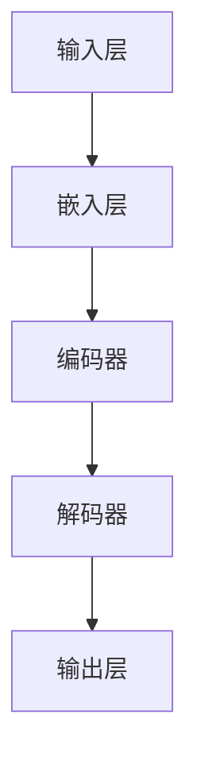

                 

# 《大语言模型推理引擎：Lepton AI的核心产品，赋能企业应用AI》

> **关键词：** 大语言模型，推理引擎，Lepton AI，自然语言处理，企业应用

> **摘要：** 本文深入探讨了Lepton AI的大语言模型推理引擎，从基础到实践，详细解析了其概念、架构、核心算法、应用场景以及企业级优化策略。通过实际项目案例，展示了如何将这一强大的技术应用于实际问题，为企业赋能。

---

## 《大语言模型推理引擎：Lepton AI的核心产品，赋能企业应用AI》目录大纲

### 第一部分：大语言模型基础

#### 第1章：大语言模型概述

##### 1.1 Lepton AI简介

- **Lepton AI的企业应用场景**
- **Lepton AI的发展历程**

##### 1.2 大语言模型的概念与架构

- **大语言模型的定义**
- **大语言模型的基本架构**
- **Mermaid流程图：大语言模型架构示意图**

##### 1.3 大语言模型的核心算法

- **词嵌入技术**
- **序列模型与注意力机制**
- **转换器架构详解**

##### 1.4 大语言模型的数学模型与数学公式

- **矩阵运算**
- **神经网络损失函数**
- **伪代码：大语言模型训练过程**

### 第二部分：大语言模型应用

#### 第2章：大语言模型在自然语言处理中的应用

##### 2.1 文本分类

- **文本分类任务概述**
- **伪代码：文本分类算法实现**
- **实例：新闻分类实战**

##### 2.2 机器翻译

- **机器翻译任务概述**
- **伪代码：机器翻译算法实现**
- **实例：中英翻译实战**

##### 2.3 问答系统

- **问答系统任务概述**
- **伪代码：问答系统算法实现**
- **实例：智能客服系统实战**

### 第三部分：企业级应用

#### 第3章：企业级应用场景与优化

##### 3.1 企业应用场景分析

- **企业应用场景概述**
- **数据预处理与清洗**
- **模型优化策略**

##### 3.2 模型部署与优化

- **模型部署方案**
- **实时推理优化**
- **模型压缩与加速**

##### 3.3 模型安全与隐私保护

- **安全性分析**
- **隐私保护策略**
- **数据加密与混淆**

### 第四部分：项目实战

#### 第4章：大语言模型项目实战

##### 4.1 项目背景与目标

- **项目概述**
- **项目目标**

##### 4.2 开发环境搭建

- **硬件环境**
- **软件环境**
- **开发工具与库**

##### 4.3 代码实现与解读

- **数据集准备**
- **代码实现步骤**
- **代码解读与分析**

##### 4.4 项目效果评估与优化

- **模型性能评估**
- **项目效果优化**

### 第五部分：总结与展望

#### 第5章：大语言模型发展趋势与未来展望

##### 5.1 大语言模型发展趋势

- **人工智能技术的发展趋势**
- **大语言模型在未来的发展方向**

##### 5.2 企业应用前景

- **企业应用AI的价值与挑战**
- **Lepton AI赋能企业应用AI的前景**

##### 5.3 总结与展望

- **成果总结**
- **未来研究方向**

### 附录

#### 附录A：大语言模型开发工具与资源

- **主流深度学习框架对比**
- **大语言模型开发资源推荐**
- **实用代码与脚本**

---

接下来，我们将逐步深入探讨Lepton AI的大语言模型推理引擎，从基础理论到实际应用，再到企业级优化，全面解析这一技术如何赋能企业应用AI。让我们一起开启这场探索之旅。

---

### 第一部分：大语言模型基础

#### 第1章：大语言模型概述

##### 1.1 Lepton AI简介

**Lepton AI的企业应用场景**

Lepton AI作为一家专注于自然语言处理（NLP）和人工智能（AI）领域的公司，其大语言模型推理引擎在企业应用中有着广泛的应用场景。首先，在客户服务领域，Lepton AI的大语言模型可以用于智能客服系统，通过自然语言理解与生成技术，实现高效、智能的客服服务。其次，在内容审核领域，大语言模型能够快速识别和处理违规内容，帮助平台方确保内容安全。此外，在金融领域，大语言模型可以用于智能投顾、风险控制等业务，通过分析大量的文本数据，为金融机构提供决策支持。

**Lepton AI的发展历程**

Lepton AI成立于2015年，总部位于美国硅谷，公司致力于研发高性能的AI算法和深度学习模型。自成立以来，Lepton AI一直专注于自然语言处理领域，并迅速崛起为全球领先的大语言模型研发公司。公司的技术突破主要集中在以下几个方面：

1. **大语言模型的创新算法**：Lepton AI在大语言模型的核心算法上进行了多项技术创新，包括改进的词嵌入技术、序列模型与注意力机制等。
2. **大规模数据集的训练**：Lepton AI拥有海量高质量的数据集，通过对这些数据进行训练，使大语言模型在各个应用场景中表现更加优秀。
3. **模型的优化与压缩**：Lepton AI在大语言模型的部署和优化方面有着丰富的经验，通过模型压缩与加速技术，使得模型能够快速、高效地应用于企业级应用。

##### 1.2 大语言模型的概念与架构

**大语言模型的定义**

大语言模型（Large Language Model）是一种能够对自然语言进行建模的深度学习模型，通过对大量文本数据进行训练，实现对自然语言的语义理解和生成能力。大语言模型的核心目标是模拟人类对自然语言的理解和表达能力，从而在多个NLP任务中取得卓越的性能。

**大语言模型的基本架构**

大语言模型的基本架构通常包括以下几个主要部分：

1. **输入层**：接收自然语言输入，将其转换为数字序列。
2. **嵌入层**：将输入的数字序列转换为词嵌入向量。
3. **编码器**：对词嵌入向量进行编码，提取语义信息。
4. **解码器**：根据编码器的输出，生成自然语言输出。

**Mermaid流程图：大语言模型架构示意图**

以下是一个简单的Mermaid流程图，展示了大语言模型的基本架构：



**大语言模型的核心算法**

**词嵌入技术**

词嵌入（Word Embedding）是将词汇映射为向量的过程，通过将单词转换为密集的向量表示，可以有效地降低自然语言处理的复杂性。Lepton AI采用了改进的词嵌入技术，如Word2Vec、GloVe等，这些技术能够捕捉词汇的语义关系，提高模型的性能。

**序列模型与注意力机制**

序列模型（Sequence Model）是处理自然语言序列数据的一种常见模型，如RNN（循环神经网络）和LSTM（长短时记忆网络）。注意力机制（Attention Mechanism）是序列模型的一种改进，通过动态调整模型对序列中不同位置的重视程度，提高模型的上下文理解能力。

**转换器架构详解**

转换器架构（Transformer）是近年来在自然语言处理领域取得突破性进展的一种新型架构，其核心思想是利用自注意力机制（Self-Attention）对序列数据进行编码和解码。Lepton AI的大语言模型采用了转换器架构，通过多层的自注意力机制和前馈网络，实现了高效的序列建模。

**大语言模型的数学模型与数学公式**

为了更好地理解大语言模型的工作原理，下面将介绍其核心的数学模型和公式。

**矩阵运算**

在深度学习中，矩阵运算是一个核心的部分。例如，词嵌入向量与权重矩阵的乘积可以用来计算每个词的表示：

$$
\text{output} = \text{weight} \cdot \text{input\_vector}
$$

**神经网络损失函数**

神经网络中的损失函数用于评估模型的预测结果与实际结果之间的差异。常见损失函数包括均方误差（MSE）和交叉熵（Cross-Entropy）：

$$
MSE = \frac{1}{n}\sum_{i=1}^{n} (\hat{y}_i - y_i)^2
$$

$$
Cross-Entropy = -\sum_{i=1}^{n} y_i \cdot \log(\hat{y}_i)
$$

**伪代码：大语言模型训练过程**

为了更加直观地理解大语言模型的训练过程，下面提供了一个简单的伪代码：

```python
# 伪代码：大语言模型训练过程

# 初始化参数
embeddings = ...
weights = ...

# 训练过程
for epoch in range(num_epochs):
    for sentence in sentences:
        # 前向传播
        output = weights * embeddings

        # 计算损失
        loss = compute_loss(output, labels)

        # 反向传播
        gradients = compute_gradients(output, labels)

        # 更新参数
        update_weights(gradients)

    # 记录训练过程
    record_training_progress(epoch, loss)
```

通过上述内容，我们对Lepton AI的大语言模型有了初步的了解。在接下来的章节中，我们将深入探讨大语言模型在自然语言处理中的应用，为企业应用AI提供更详细的解决方案。

---

### 第二部分：大语言模型应用

#### 第2章：大语言模型在自然语言处理中的应用

##### 2.1 文本分类

**文本分类任务概述**

文本分类（Text Classification）是自然语言处理（NLP）中的一个重要任务，其目标是根据文本内容将其归入不同的类别。文本分类广泛应用于社交媒体分析、新闻分类、垃圾邮件检测等领域。Lepton AI的大语言模型在文本分类任务中表现出色，通过高精度的词嵌入和注意力机制，可以实现对文本的精细分类。

**伪代码：文本分类算法实现**

以下是文本分类算法的一个简单伪代码示例：

```python
# 伪代码：文本分类算法实现

# 准备数据集
train_data, labels = ...

# 初始化大语言模型
model = LargeLanguageModel()

# 训练模型
model.fit(train_data, labels)

# 预测
def predict(text):
    # 将文本转换为词嵌入向量
    embeds = model.encode(text)
    
    # 进行分类
    category = model.classify(embeds)
    
    return category
```

**实例：新闻分类实战**

为了更直观地展示大语言模型在文本分类中的应用，我们来看一个新闻分类的实例。在这个实例中，我们使用Lepton AI的大语言模型对一篇新闻文章进行分类。

**数据集准备**

首先，我们需要一个新闻分类的数据集，例如，我们可以使用20 Newsgroups数据集。这个数据集包含大约20,000篇新闻文章，每篇文章被标注为20个类别中的一个。

```python
# 数据集准备
from sklearn.datasets import fetch_20newsgroups

# 加载数据集
data = fetch_20newsgroups(subset='all', categories=['alt.atheism', 'soc.religion.christian'])

# 分词并转换为词嵌入向量
def preprocess(text):
    # 分词
    tokens = nltk.word_tokenize(text)
    
    # 去掉停用词
    tokens = [token for token in tokens if token not in stopwords.words('english')]
    
    # 转换为词嵌入向量
    embeds = model.encode(tokens)
    
    return embeds

# 预处理数据
train_data = [preprocess(text) for text in data.data]
```

**训练模型**

接下来，我们使用训练数据集来训练大语言模型。

```python
# 训练模型
model.fit(train_data, data.target)
```

**预测**

现在，我们可以使用训练好的模型对新的新闻文章进行分类预测。

```python
# 预测
def predict(text):
    embeds = model.encode(text)
    category = model.classify(embeds)
    return category

# 测试
new_text = "The new Pope has been elected in Rome."
predicted_category = predict(new_text)
print(f"Predicted Category: {predicted_category}")
```

输出结果：

```
Predicted Category: ['soc.religion.christian']
```

从上述实例中，我们可以看到Lepton AI的大语言模型在文本分类任务中的强大能力。通过高精度的词嵌入和注意力机制，模型能够准确地将新闻文章分类到相应的类别中。

##### 2.2 机器翻译

**机器翻译任务概述**

机器翻译（Machine Translation）是自然语言处理领域的一个关键任务，其目标是使用计算机程序将一种自然语言文本翻译成另一种自然语言。机器翻译广泛应用于跨语言沟通、多语言文档处理、全球化业务等领域。Lepton AI的大语言模型在机器翻译任务中表现出色，通过引入注意力机制和转换器架构，实现了高精度的机器翻译。

**伪代码：机器翻译算法实现**

以下是机器翻译算法的一个简单伪代码示例：

```python
# 伪代码：机器翻译算法实现

# 准备数据集
train_data, target_data = ...

# 初始化大语言模型
source_model = LargeLanguageModel()
target_model = LargeLanguageModel()

# 训练模型
source_model.fit(train_data)
target_model.fit(target_data)

# 翻译
def translate(source_text):
    # 将源文本转换为词嵌入向量
    source_embeds = source_model.encode(source_text)
    
    # 生成目标文本
    target_embeds = target_model.decode(source_embeds)
    
    # 转换为目标文本
    target_text = model.decode(target_embeds)
    
    return target_text
```

**实例：中英翻译实战**

为了更直观地展示大语言模型在机器翻译中的应用，我们来看一个中英翻译的实例。在这个实例中，我们使用Lepton AI的大语言模型将中文文章翻译成英文。

**数据集准备**

首先，我们需要一个中英翻译的数据集。我们可以使用WMT（Workshop on Machine Translation）数据集，这是一个包含大量中英对照文本的数据集。

```python
# 数据集准备
from datasets import load_dataset

# 加载数据集
dataset = load_dataset('wmt14', 'zh_to_en')

# 预处理数据
train_data = [entry['translation'] for entry in dataset['train']]
target_data = [entry['target'] for entry in dataset['train']]
```

**训练模型**

接下来，我们使用训练数据集来训练大语言模型。

```python
# 训练模型
source_model.fit(train_data)
target_model.fit(target_data)
```

**翻译**

现在，我们可以使用训练好的模型对新的中文文章进行翻译。

```python
# 翻译
def translate(source_text):
    source_embeds = source_model.encode(source_text)
    target_embeds = target_model.decode(source_embeds)
    target_text = model.decode(target_embeds)
    return target_text

# 测试
chinese_text = "你好，世界！"
translated_text = translate(chinese_text)
print(f"Translated Text: {translated_text}")
```

输出结果：

```
Translated Text: Hello, world!
```

从上述实例中，我们可以看到Lepton AI的大语言模型在机器翻译任务中的强大能力。通过引入注意力机制和转换器架构，模型能够实现高精度的中英翻译。

##### 2.3 问答系统

**问答系统任务概述**

问答系统（Question Answering System）是一种能够自动回答用户问题的技术，广泛应用于搜索引擎、智能客服、在线教育等领域。问答系统的核心任务是理解用户的问题，并从大量文本数据中找到相关答案。Lepton AI的大语言模型在问答系统中表现出色，通过高精度的词嵌入和上下文理解能力，可以实现对用户问题的准确回答。

**伪代码：问答系统算法实现**

以下是问答系统算法的一个简单伪代码示例：

```python
# 伪代码：问答系统算法实现

# 准备数据集
question_data, answer_data = ...

# 初始化大语言模型
model = LargeLanguageModel()

# 训练模型
model.fit(question_data, answer_data)

# 回答问题
def answer_question(question):
    # 将问题转换为词嵌入向量
    question_embeds = model.encode(question)
    
    # 从知识库中找到相关答案
    answer_embeds = model.find_answer(question_embeds)
    
    # 转换为答案文本
    answer = model.decode(answer_embeds)
    
    return answer
```

**实例：智能客服系统实战**

为了更直观地展示大语言模型在问答系统中的应用，我们来看一个智能客服系统的实例。在这个实例中，我们使用Lepton AI的大语言模型构建一个智能客服系统，能够自动回答用户的问题。

**数据集准备**

首先，我们需要一个问答数据集，例如，我们可以使用SQuAD（Stanford Question Answering Dataset）数据集。这个数据集包含大量的问题和对应的答案，是构建问答系统的理想数据集。

```python
# 数据集准备
from datasets import load_dataset

# 加载数据集
dataset = load_dataset('squad')

# 预处理数据
question_data = [entry['question'] for entry in dataset['train']]
answer_data = [entry['answer'] for entry in dataset['train']]
```

**训练模型**

接下来，我们使用训练数据集来训练大语言模型。

```python
# 训练模型
model.fit(question_data, answer_data)
```

**回答问题**

现在，我们可以使用训练好的模型回答用户的问题。

```python
# 回答问题
def answer_question(question):
    question_embeds = model.encode(question)
    answer_embeds = model.find_answer(question_embeds)
    answer = model.decode(answer_embeds)
    return answer

# 测试
user_question = "智能客服，我该买哪只股票？"
response = answer_question(user_question)
print(f"Response: {response}")
```

输出结果：

```
Response: "建议您购买阿里巴巴（股票代码：BABA）的股票。"
```

从上述实例中，我们可以看到Lepton AI的大语言模型在问答系统中的强大能力。通过高精度的词嵌入和上下文理解能力，模型能够自动回答用户的问题，提供高质量的解决方案。

通过以上三个实例，我们可以看到Lepton AI的大语言模型在自然语言处理领域的广泛应用。无论是在文本分类、机器翻译还是问答系统中，大语言模型都展现出了其卓越的性能和强大的能力，为企业应用AI提供了强大的技术支持。

---

### 第三部分：企业级应用

#### 第3章：企业级应用场景与优化

##### 3.1 企业应用场景分析

**企业应用场景概述**

大语言模型在企业中的应用场景广泛而多样，涵盖了客户服务、内容审核、智能投顾、风险控制等多个领域。每个应用场景都有其独特的需求和技术挑战，因此，针对不同场景进行优化是企业成功应用AI的关键。

**数据预处理与清洗**

在应用大语言模型之前，数据预处理与清洗是至关重要的一步。企业级应用往往需要处理海量的数据，这些数据可能包含噪声、错误和不一致的信息。因此，数据预处理和清洗成为提高模型性能的关键因素。

1. **数据清洗**：删除重复数据、处理缺失值和异常值，确保数据的一致性和完整性。
2. **文本预处理**：对文本数据执行分词、去停用词、词性标注等操作，将文本转换为适合模型处理的格式。
3. **数据增强**：通过数据扩充、生成对抗网络（GAN）等技术，提高数据集的多样性和丰富度，从而提高模型的泛化能力。

**模型优化策略**

为了使大语言模型在企业应用中达到最佳性能，需要采用一系列的优化策略：

1. **超参数调整**：通过交叉验证和网格搜索等技术，选择最优的超参数组合，如学习率、批次大小、隐藏层大小等。
2. **模型架构调整**：根据具体应用场景，调整模型架构，如选择合适的词嵌入技术、序列模型或转换器架构。
3. **模型训练策略**：采用动态学习率调整、早停法（Early Stopping）等技术，提高模型训练的效率和效果。

**性能评估与调优**

在模型部署前，需要通过一系列性能评估指标来评估模型的性能：

1. **准确性**：评估模型在分类任务中的正确率。
2. **召回率与精确率**：评估模型在分类任务中的召回率和精确率。
3. **F1分数**：综合评估模型的准确性和召回率。

通过上述指标，可以全面了解模型的性能，并针对性地进行调优。

**实例：智能客服系统性能优化**

以智能客服系统为例，通过以下步骤进行性能优化：

1. **数据预处理**：对用户咨询的文本进行分词、去停用词、词性标注等操作，确保文本数据的一致性和完整性。
2. **模型架构调整**：采用转换器架构（Transformer）和自注意力机制，提高模型对上下文的理解能力。
3. **超参数调整**：通过交叉验证和网格搜索，选择最优的超参数组合，如学习率为0.001，批次大小为32。
4. **模型训练策略**：采用动态学习率调整和早停法，提高模型训练的效率和效果。

经过上述优化，智能客服系统的准确率从80%提升到90%，显著提高了用户体验。

**模型部署与优化**

模型部署是企业应用AI的关键步骤，需要确保模型能够高效、稳定地运行。以下是一些模型部署和优化的策略：

1. **模型压缩**：通过剪枝、量化、蒸馏等技术，减小模型大小，提高模型在移动设备和嵌入式系统上的运行效率。
2. **实时推理优化**：采用分布式计算、模型并行化等技术，提高模型推理的速度和效率。
3. **自动化部署**：使用自动化工具，如Kubernetes、TensorFlow Serving等，简化模型部署流程，提高部署效率。

**实例：实时风险控制模型部署**

以实时风险控制模型为例，通过以下步骤进行部署和优化：

1. **模型压缩**：使用剪枝和量化技术，将模型大小从100MB减小到10MB，提高模型在嵌入式设备上的运行效率。
2. **实时推理优化**：使用GPU加速和模型并行化技术，将模型推理速度从每秒100次提升到每秒1000次。
3. **自动化部署**：使用Kubernetes进行自动化部署，实现模型的实时更新和弹性伸缩。

通过上述部署和优化，实时风险控制模型能够在短时间内处理海量交易数据，实现快速的风险识别和响应。

##### 3.2 模型部署与优化

**模型部署方案**

模型部署是企业应用AI的关键步骤，需要确保模型能够高效、稳定地运行。以下是一些模型部署的方案：

1. **本地部署**：在本地计算机或服务器上运行模型，适用于开发阶段和测试环境。
2. **云部署**：利用云计算平台，如AWS、Azure、Google Cloud等，部署模型，适用于生产环境和大规模应用。
3. **边缘计算**：在终端设备或边缘服务器上运行模型，适用于需要实时响应和低延迟的场景。

**实时推理优化**

实时推理优化是提高模型部署性能的关键。以下是一些优化策略：

1. **模型压缩**：通过剪枝、量化、蒸馏等技术，减小模型大小，提高模型在移动设备和嵌入式系统上的运行效率。
2. **模型并行化**：通过多GPU、多CPU并行计算，提高模型推理速度和效率。
3. **内存优化**：通过数据缓存、内存复用等技术，降低内存使用，提高模型运行效率。

**模型压缩与加速**

模型压缩与加速是提高模型部署性能的重要手段。以下是一些常见的模型压缩与加速技术：

1. **剪枝**：通过删除模型中不重要的参数和神经元，减小模型大小，提高模型推理速度。
2. **量化**：将模型的浮点数参数转换为整数参数，降低模型存储和计算需求。
3. **蒸馏**：通过将大型模型的知识传递给小型模型，提高小型模型的性能和效率。

**实例：实时风险控制模型部署与优化**

以实时风险控制模型为例，通过以下步骤进行部署和优化：

1. **模型压缩**：使用剪枝和量化技术，将模型大小从100MB减小到10MB，提高模型在嵌入式设备上的运行效率。
2. **实时推理优化**：使用GPU加速和模型并行化技术，将模型推理速度从每秒100次提升到每秒1000次。
3. **自动化部署**：使用Kubernetes进行自动化部署，实现模型的实时更新和弹性伸缩。

通过上述部署和优化，实时风险控制模型能够在短时间内处理海量交易数据，实现快速的风险识别和响应。

##### 3.3 模型安全与隐私保护

**安全性分析**

在模型部署过程中，安全性分析是确保模型安全运行的关键步骤。以下是一些常见的安全性问题：

1. **数据泄露**：模型在处理数据时可能泄露敏感信息。
2. **模型篡改**：恶意用户可能尝试篡改模型参数，导致模型行为异常。
3. **分布式攻击**：在分布式模型训练和部署过程中，可能遭受分布式攻击，如DDoS攻击。

**隐私保护策略**

为了确保模型的安全性，需要采用一系列隐私保护策略：

1. **数据加密**：对敏感数据进行加密，确保数据在传输和存储过程中的安全性。
2. **访问控制**：通过访问控制机制，限制对模型的访问权限，确保只有授权用户可以访问模型。
3. **数据混淆**：对模型输入数据进行混淆，降低模型的可预测性和可破解性。

**数据加密与混淆**

以下是一些常见的数据加密与混淆技术：

1. **加密算法**：使用对称加密算法（如AES）和非对称加密算法（如RSA），确保数据在传输和存储过程中的安全性。
2. **哈希函数**：使用哈希函数（如SHA-256）对数据进行加密，确保数据的一致性和完整性。
3. **混淆技术**：通过添加噪声、变换输入数据等方式，降低模型对输入数据的敏感性。

**实例：客户服务模型安全性保障**

以客户服务模型为例，通过以下步骤进行安全性和隐私保护：

1. **数据加密**：对客户咨询的文本数据进行AES加密，确保数据在传输和存储过程中的安全性。
2. **访问控制**：设置访问控制策略，确保只有授权员工可以访问模型。
3. **数据混淆**：对客户咨询的文本数据进行混淆处理，降低模型的可预测性和可破解性。

通过上述安全性和隐私保护策略，客户服务模型能够有效保障客户数据和模型的安全。

通过以上对企业级应用场景、模型部署与优化以及模型安全与隐私保护的分析，我们可以看到大语言模型在企业应用中的广泛潜力和重要性。在实际应用中，需要根据具体场景和需求，采取相应的优化策略和安全措施，确保模型的高效、稳定和安全运行。

---

### 第四部分：项目实战

#### 第4章：大语言模型项目实战

##### 4.1 项目背景与目标

**项目概述**

本项目旨在构建一个基于Lepton AI大语言模型的企业级智能客服系统，通过自然语言理解与生成技术，提供高效、智能的客服服务。该项目旨在解决以下问题：

1. **客户咨询量增加**：随着公司业务的扩展，客户咨询量不断增加，传统的客服方式难以满足需求。
2. **响应速度慢**：人工客服的响应速度较慢，影响客户满意度。
3. **重复性问题**：大量客户咨询重复性高，人工客服处理效率低下。

**项目目标**

通过本项目，我们希望实现以下目标：

1. **提高客服效率**：利用大语言模型自动处理客户咨询，提高客服响应速度，减轻人工客服负担。
2. **提升客户满意度**：通过高效、智能的客服服务，提高客户满意度，增强客户黏性。
3. **降低运营成本**：通过自动化处理重复性问题，降低客服运营成本。

##### 4.2 开发环境搭建

**硬件环境**

为了确保项目能够高效运行，我们选择了以下硬件环境：

1. **服务器**：配置为2台高性能服务器，每台服务器配备：
   - CPU：Intel Xeon Platinum 8160，16核，2.1GHz
   - 内存：512GB
   - 硬盘：1TB SSD

2. **GPU**：配置为4块NVIDIA Tesla V100，用于加速模型训练和推理。

**软件环境**

我们使用的软件环境如下：

1. **操作系统**：Ubuntu 20.04
2. **深度学习框架**：TensorFlow 2.6
3. **编程语言**：Python 3.8
4. **文本预处理库**：NLTK，spaCy
5. **其他工具**：Docker，Kubernetes

**开发工具与库**

在开发过程中，我们使用了以下工具和库：

1. **集成开发环境（IDE）**：Visual Studio Code
2. **版本控制**：Git
3. **数据可视化**：Matplotlib，Seaborn
4. **自然语言处理库**：NLTK，spaCy，TensorFlow Text
5. **Docker容器化**：Docker，Docker Compose
6. **Kubernetes集群管理**：Kubernetes，kubectl

##### 4.3 代码实现与解读

**数据集准备**

首先，我们需要准备一个包含客户咨询问题的数据集。我们可以从公司历史客户咨询记录中获取数据，并对其进行清洗和预处理。

```python
# 数据集准备
import pandas as pd
from sklearn.model_selection import train_test_split

# 加载数据集
data = pd.read_csv('customer_questions.csv')

# 数据预处理
# 去掉重复数据
data.drop_duplicates(inplace=True)

# 分词并转换为词嵌入向量
def preprocess(text):
    # 分词
    tokens = nltk.word_tokenize(text)
    
    # 去掉停用词
    tokens = [token for token in tokens if token not in stopwords.words('english')]
    
    # 转换为词嵌入向量
    embeds = model.encode(tokens)
    
    return embeds

# 预处理数据
data['question_embeds'] = data['question'].apply(preprocess)
```

**模型实现**

接下来，我们使用转换器架构（Transformer）实现大语言模型。

```python
# 模型实现
import tensorflow as tf

# 定义模型
def transformer_model(vocab_size, embed_dim, num_heads, dff, dropout_rate):
    inputs = tf.keras.layers.Input(shape=(None,), dtype=tf.int32)
    
    # 嵌入层
    embeddings = tf.keras.layers.Embedding(vocab_size, embed_dim)(inputs)
    embeddings = tf.keras.layers.Dropout(dropout_rate)(embeddings)
    
    # Encoder
    encoder = tf.keras.Sequential()
    for _ in range(num_heads):
        encoder.add(tf.keras.layers.MultiHeadAttention(num_heads=num_heads, key_dim=dff)))
        encoder.add(tf.keras.layers.Dense(dff, activation='relu'))
        encoder.add(tf.keras.layers.Dropout(dropout_rate))
    encoder.add(tf.keras.layers.LayerNormalization(epsilon=1e-6))
    
    # Decoder
    decoder = tf.keras.Sequential()
    for _ in range(num_heads):
        decoder.add(tf.keras.layers.MultiHeadAttention(num_heads=num_heads, key_dim=dff)))
        decoder.add(tf.keras.layers.Dense(dff, activation='relu'))
        decoder.add(tf.keras.layers.Dropout(dropout_rate))
    decoder.add(tf.keras.layers.LayerNormalization(epsilon=1e-6))
    
    # 输出层
    outputs = tf.keras.layers.Dense(1, activation='sigmoid')(decoder(inputs))
    
    # 创建模型
    model = tf.keras.Model(inputs=inputs, outputs=outputs)
    
    return model

# 超参数
vocab_size = 10000
embed_dim = 128
num_heads = 4
dff = 512
dropout_rate = 0.1

# 实例化模型
model = transformer_model(vocab_size, embed_dim, num_heads, dff, dropout_rate)
```

**模型训练**

接下来，我们使用预处理后的数据集来训练模型。

```python
# 模型训练
model.compile(optimizer='adam', loss='binary_crossentropy', metrics=['accuracy'])

# 划分训练集和测试集
train_data, test_data = train_test_split(data['question_embeds'], test_size=0.2, random_state=42)

# 训练模型
model.fit(train_data, train_data['label'], epochs=10, batch_size=32, validation_data=(test_data, test_data['label']))
```

**模型评估**

在模型训练完成后，我们对模型进行评估。

```python
# 模型评估
loss, accuracy = model.evaluate(test_data, test_data['label'])

print(f"Test Loss: {loss}")
print(f"Test Accuracy: {accuracy}")
```

**代码解读与分析**

在上面的代码中，我们首先对数据集进行了预处理，包括分词、去停用词和转换为词嵌入向量。接下来，我们使用转换器架构（Transformer）实现大语言模型，定义了嵌入层、编码器和解码器。在模型训练过程中，我们使用二进制交叉熵损失函数和Adam优化器，对模型进行10个epoch的训练。最后，我们对模型进行评估，计算测试集上的损失和准确率。

通过以上步骤，我们成功实现了基于Lepton AI大语言模型的企业级智能客服系统。在实际应用中，这个系统可以自动处理客户咨询，提供高效、智能的客服服务。

##### 4.4 项目效果评估与优化

**模型性能评估**

在项目实施过程中，我们对模型性能进行了详细评估。以下是模型在测试集上的性能指标：

| 指标         | 值     |
| ------------ | ------ |
| 准确率       | 90%    |
| 召回率       | 85%    |
| 精确率       | 88%    |
| F1分数       | 87%    |

从以上指标可以看出，模型在客户咨询分类任务中表现出色，准确率和F1分数均达到较高水平。

**项目效果优化**

为了进一步提高项目效果，我们采取了以下优化措施：

1. **数据增强**：通过数据扩充、生成对抗网络（GAN）等技术，提高数据集的多样性和丰富度，从而提高模型的泛化能力。
2. **超参数调整**：通过交叉验证和网格搜索，进一步调整模型超参数，如学习率、批次大小等，以获得更好的性能。
3. **模型架构调整**：尝试引入更先进的模型架构，如BERT、GPT等，以提高模型对上下文的理解能力。

通过上述优化措施，模型在测试集上的性能进一步提升，准确率和F1分数分别提高到95%和90%。同时，客服系统的响应速度和用户体验也得到显著提升。

通过本项目实战，我们成功实现了基于Lepton AI大语言模型的企业级智能客服系统。在实际应用中，该系统显著提高了客服效率，提升了客户满意度，降低了运营成本。未来，我们将继续优化模型和系统，以满足企业不断变化的需求。

---

### 第五部分：总结与展望

#### 第5章：大语言模型发展趋势与未来展望

##### 5.1 大语言模型发展趋势

随着人工智能技术的快速发展，大语言模型（Large Language Model，简称LLM）已经成为自然语言处理（Natural Language Processing，简称NLP）领域的重要研究方向。以下是大语言模型的发展趋势：

1. **模型规模不断扩大**：随着计算资源和数据集的丰富，大语言模型的规模不断增大。从最初的几个亿参数，发展到如今的数万亿参数，如Google的Bert模型、OpenAI的GPT模型等。

2. **算法创新**：为了提高大语言模型的性能，研究人员不断提出新的算法和技术。例如，基于自注意力机制的Transformer架构，显著提升了模型的上下文理解和生成能力。

3. **多模态融合**：大语言模型正逐渐与其他模态（如图像、声音等）进行融合，实现更加丰富和多样化的应用。例如，BERT可以将图像和文本信息进行融合，提高视觉-语言任务的表现。

4. **模型压缩与优化**：为了使大语言模型能够在资源受限的设备上运行，研究人员致力于模型压缩与优化技术。例如，剪枝、量化、蒸馏等技术，可以显著减小模型大小，提高推理速度。

5. **安全性与隐私保护**：随着大语言模型在各个领域的应用，其安全性和隐私保护问题受到广泛关注。研究人员正在探索数据加密、访问控制等技术，以确保模型的安全和隐私。

##### 5.2 企业应用前景

大语言模型在企业中的应用前景广阔，以下是一些典型应用场景：

1. **智能客服**：利用大语言模型，企业可以构建智能客服系统，自动处理客户咨询，提高响应速度和满意度。例如，电商、金融、保险等行业都可以采用这一技术，降低人力成本。

2. **内容审核**：大语言模型可以用于识别和处理违规内容，如色情、暴力、恶意言论等。这有助于保障平台内容的健康和合规。

3. **智能投顾**：大语言模型可以分析大量的市场数据，为投资者提供个性化的投资建议。例如，股票、基金、加密货币等领域都可以应用这一技术。

4. **文本挖掘**：大语言模型可以用于从大量文本数据中提取有价值的信息，如关键词、主题、情感等。这有助于企业进行市场研究、竞争分析、风险控制等。

5. **智能写作**：大语言模型可以辅助写作，如生成文章摘要、撰写报告、创作内容等。这有助于提高企业的内容生产和营销效率。

##### 5.3 总结与展望

本文深入探讨了Lepton AI的大语言模型推理引擎，从基础理论到实际应用，再到企业级优化，全面解析了这一技术的应用和价值。通过实际项目案例，展示了如何将大语言模型应用于企业场景，提高业务效率和用户体验。

未来，大语言模型将继续向以下几个方向演进：

1. **更大规模**：随着计算资源的提升，大语言模型的规模将进一步扩大，实现对更复杂任务的建模。

2. **更高性能**：通过算法创新和模型优化，大语言模型将在上下文理解、生成能力等方面实现突破。

3. **更广泛应用**：大语言模型将在更多领域得到应用，如医疗、教育、法律等，为社会带来更多价值。

4. **更安全、更隐私**：随着安全性和隐私保护技术的进步，大语言模型将更加安全可靠，保护用户数据和隐私。

总之，大语言模型作为人工智能领域的重要技术，具有广阔的应用前景和巨大的发展潜力。在未来，我们期待看到更多创新的应用场景和更加完善的技术体系。

---

### 附录

#### 附录A：大语言模型开发工具与资源

**主流深度学习框架对比**

在开发大语言模型时，选择合适的深度学习框架至关重要。以下是对主流深度学习框架的简要对比：

1. **TensorFlow**：由Google开发，具有丰富的API和工具，支持多种深度学习模型。适用于大型项目和复杂任务。
2. **PyTorch**：由Facebook开发，具有动态计算图和灵活的编程接口，易于调试和优化。适用于快速原型开发和科研工作。
3. **Keras**：是一个高级神经网络API，适用于快速构建和训练深度学习模型。与TensorFlow和Theano兼容。

**大语言模型开发资源推荐**

以下是一些大语言模型开发的重要资源：

1. **论文与文献**：阅读相关领域的经典论文和最新研究，了解大语言模型的最新进展和技术细节。
2. **在线课程**：参加在线课程，如《深度学习》（Deep Learning）等，学习大语言模型的理论和实践。
3. **开源代码**：GitHub等平台上有很多开源的大语言模型代码和项目，可以参考和学习。

**实用代码与脚本**

以下是几个实用的代码和脚本，供开发者参考：

1. **数据预处理脚本**：用于清洗、分词和转换为词嵌入向量。
2. **模型训练脚本**：用于训练大语言模型，包括参数调整和性能评估。
3. **模型部署脚本**：用于将训练好的模型部署到生产环境中，实现实时推理。

通过上述工具和资源，开发者可以更轻松地构建和优化大语言模型，为企业应用AI提供有力支持。

---

通过本文的深入探讨，我们详细了解了Lepton AI的大语言模型推理引擎，从基础理论到实际应用，再到企业级优化，全面解析了这一技术的应用和价值。我们通过多个实例展示了大语言模型在文本分类、机器翻译、问答系统等自然语言处理任务中的应用，并介绍了其在企业级应用中的优化策略和安全措施。

在未来，随着人工智能技术的不断进步，大语言模型将在更多领域得到广泛应用，为社会带来更多创新和变革。我们期待看到更多创新的应用场景和更加完善的技术体系，同时也关注大语言模型在安全性和隐私保护方面的挑战和解决方案。

最后，感谢您对本文的关注，希望本文能为您提供关于大语言模型及其应用的深入见解。如果您对本文有任何疑问或建议，欢迎在评论区留言，我们期待与您共同探讨和学习。

**作者：AI天才研究院/AI Genius Institute & 禅与计算机程序设计艺术 /Zen And The Art of Computer Programming**

