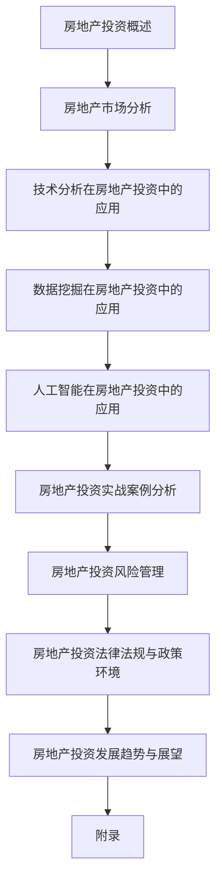

                 

# 如何利用技术能力进行房地产投资

## 概述

随着科技的发展，人工智能、大数据和区块链等技术在各个领域得到了广泛应用。房地产投资作为一个古老的行业，也在逐步融入这些新技术。利用技术能力进行房地产投资，不仅能够提高决策的准确性，还能优化投资策略，降低投资风险。本文将围绕如何利用技术能力进行房地产投资进行深入探讨。

### 关键词

- 房地产投资
- 人工智能
- 大数据
- 技术分析
- 数据挖掘
- 风险管理

### 摘要

本文首先介绍了房地产投资的基本概念、发展历程、类型与策略，以及其在技术进步背景下的优势与挑战。接着，分析了房地产市场的基本概念、供需关系、市场周期、政策环境与地段分析。随后，详细探讨了技术分析、数据挖掘和人工智能在房地产投资中的应用，包括技术指标、图表分析、数据挖掘方法与应用案例等。最后，通过实际案例展示了如何利用技术能力进行房地产投资，并讨论了房地产投资的风险管理、法律法规与政策环境以及未来发展趋势。

## 第1章：房地产投资概述

### 1.1 房地产投资的定义与意义

房地产投资是指投资者通过购买房产或其他房地产相关资产，以获取长期资本增值和稳定租金收益的行为。房地产投资不仅包括住宅、商业和工业地产，还包括土地、房地产开发项目等。

房地产投资的意义主要体现在以下几个方面：

1. **资本增值**：房地产投资能够实现资产的长期增值，对抗通货膨胀。
2. **稳定收益**：通过租赁或出售房产，投资者可以获得稳定的租金收入或资本收益。
3. **资产多样化**：房地产投资可以作为一种资产配置，降低整体投资组合的风险。
4. **政策优势**：在一些国家或地区，房地产投资还可能享受到税收优惠等政策支持。

### 1.2 房地产投资的发展历程

房地产投资的发展历程可以追溯到人类社会的早期。在古代，土地和房产就是最普遍的财富形式。随着经济的发展，房地产投资逐渐成为一种专业化的投资方式。

1. **20世纪初期**：房地产投资开始规模化，投资机构和专业投资者进入市场。
2. **20世纪中期**：金融工具的创新，如房地产信托基金（REITs）的出现，使得房地产投资更加便捷。
3. **21世纪初**：随着互联网和大数据技术的发展，房地产投资进入智能化、数据驱动的新时代。

### 1.3 房地产投资的类型与策略

房地产投资可以根据投资目标、投资对象、投资方式等不同维度进行分类。

1. **按投资目标分类**：
   - **长期投资**：追求资产的长期增值和稳定的租金收益。
   - **短期投资**：追求短期资本增值和租金收益，通常通过买卖差价获利。

2. **按投资对象分类**：
   - **住宅投资**：包括租赁住房、度假房产等。
   - **商业投资**：包括购物中心、办公楼、酒店等。
   - **工业投资**：包括仓储、工业用地等。
   - **综合体投资**：包括多功能混合使用项目，如商业、住宅、办公的综合体。

3. **按投资方式分类**：
   - **直接投资**：投资者直接购买房产或地产项目。
   - **间接投资**：通过房地产投资信托基金（REITs）、房地产抵押贷款等金融工具进行投资。

### 1.4 房地产投资的优势与挑战

房地产投资具有多重优势，但同时也面临着一定的挑战。

**优势**：

1. **资本增值**：房地产通常具有良好的增值潜力，尤其在经济发展稳定时期。
2. **稳定收益**：通过租金收益实现稳定的现金流。
3. **政策支持**：政府在税收、贷款等方面给予房地产投资一定的优惠政策。
4. **资产安全性**：房产作为实物资产，具有较高的安全性。

**挑战**：

1. **政策风险**：政府政策的变化可能对房地产市场产生重大影响。
2. **市场波动**：房地产市场的周期性波动可能带来投资风险。
3. **资金压力**：房地产投资通常需要较大的资金投入，资金压力较大。
4. **流动性差**：房产变现能力较弱，需要较长时间。

### 总结

房地产投资作为一种重要的资产配置方式，具有长期增值和稳定收益的优势。通过技术手段，可以更精准地进行市场分析、投资决策和风险管理，提高投资效益。在接下来的章节中，我们将深入探讨房地产市场分析、技术分析、数据挖掘和人工智能在房地产投资中的应用。

## 第2章：房地产市场分析

房地产市场分析是房地产投资决策的基础。通过市场分析，投资者可以了解市场供需状况、周期性变化、政策环境等因素，从而做出更为合理的投资决策。以下是房地产市场分析的主要内容：

### 2.1 房地产市场基本概念

房地产市场是指房产及其相关服务的交易市场。房地产市场主要包括住宅市场、商业市场、工业市场和投资市场等。

1. **住宅市场**：住宅市场是房地产市场的重要组成部分，包括新房和二手房交易。
2. **商业市场**：商业市场包括购物中心、办公楼、商业地产等，是投资者关注的重点。
3. **工业市场**：工业市场主要包括仓储、工业用地等，对于某些行业具有重要价值。
4. **投资市场**：投资市场包括房地产投资信托基金（REITs）、房地产抵押贷款等，为投资者提供多样化的投资选择。

### 2.2 房地产市场的供需关系

房地产市场的供需关系是决定房价的重要因素。供需关系的变化会导致房价的波动。

1. **需求**：房地产需求主要由人口增长、收入水平、政策刺激等因素影响。在需求增长的情况下，房价往往会上涨。
2. **供给**：房地产供给主要受土地供应、建设速度、政策调控等因素影响。在供给增加的情况下，房价往往会下跌。

### 2.3 房地产市场周期分析

房地产市场具有周期性变化的特点。了解市场周期对于投资者来说至关重要。

1. **上升周期**：在上升周期，房价上涨，市场交易活跃，投资机会较多。
2. **下降周期**：在下降周期，房价下跌，市场交易冷淡，投资者需要谨慎对待。
3. **平衡周期**：在平衡周期，房价相对稳定，市场交易平稳，投资机会适中。

### 2.4 房地产市场指标解读

房地产市场的指标是分析市场状况的重要工具。以下是常见的房地产市场指标及其解读：

1. **房价指数**：房价指数是衡量房价变动情况的重要指标。通常以100为基期，反映当前房价相对于基期的变化。
2. **租金收益率**：租金收益率是指租金收入与投资成本的比率，用于衡量房地产投资的收益水平。
3. **空置率**：空置率是指房屋空置率的比例，反映市场供求状况。空置率高通常意味着市场供过于求。
4. **贷款成数**：贷款成数是指购房贷款金额与房屋价值的比率，用于衡量市场信贷状况。

### 2.5 政策环境分析

政策环境是影响房地产市场的重要因素。政府通过税收、贷款、土地供应等政策手段调控房地产市场。

1. **税收政策**：税收政策对房地产投资具有重要影响。减税政策可能刺激市场需求，增加房价。
2. **贷款政策**：贷款政策影响购房者的购买力和市场交易活跃度。低利率政策可能刺激市场需求，增加房价。
3. **土地供应政策**：土地供应政策影响房地产市场的供给状况。增加土地供应可能抑制房价上涨。

### 2.6 房地产政策解读与应对

房地产政策的变化对市场影响深远。投资者需要关注政策动向，合理调整投资策略。

1. **政策解读**：投资者需要深入理解政策内容，预测政策对市场的影响。
2. **应对策略**：根据政策变化，投资者可以调整投资策略，如改变投资方向、调整投资规模等。

### 2.7 地段分析

地段是房地产投资的关键因素。不同地段的房地产价格、租赁收益和市场前景可能存在显著差异。

1. **核心地段**：核心地段通常指城市中心、商业中心等地理位置优越的区域。这些地段通常房价高、租赁收益稳定。
2. **发展地段**：发展地段指正在开发或规划中的区域。这些地段具有较大的增值潜力，但风险也相对较高。
3. **边缘地段**：边缘地段通常指城市外围或偏远地区。这些地段房价较低，但租赁收益相对稳定。

### 2.8 地段分析的方法与技巧

地段分析需要综合考虑多种因素，包括地理位置、交通状况、配套设施、人口密度等。

1. **地理位置**：地理位置是地段分析的核心因素。投资者需要选择交通便利、配套设施齐全的地段。
2. **交通状况**：交通状况直接影响地段的吸引力和租赁需求。投资者需要关注地铁、公交、高速公路等交通设施。
3. **配套设施**：配套设施包括学校、医院、商场等。这些设施能够提高地段的居住和商业价值。
4. **人口密度**：人口密度影响地段的租赁需求和房价。人口密度高通常意味着市场需求大。

### 总结

房地产市场分析是房地产投资决策的重要基础。通过市场分析，投资者可以了解市场供需、政策环境、地段分析等关键信息，从而做出更为合理的投资决策。在接下来的章节中，我们将进一步探讨技术分析、数据挖掘和人工智能在房地产投资中的应用。

## 第3章：技术分析在房地产投资中的应用

技术分析是通过对历史价格和交易量的分析，来预测未来市场走势的方法。在房地产投资中，技术分析可以帮助投资者识别市场趋势，制定投资策略，降低投资风险。以下是技术分析在房地产投资中的应用：

### 3.1 技术分析的基本原理

技术分析基于以下几个基本假设：

1. **历史会重演**：市场走势受到历史数据的影响，过去的市场行为可能会在未来重复。
2. **市场价格包含所有信息**：市场价格包含了所有已知和未知的信息，通过分析价格走势可以预测未来走势。
3. **趋势持续**：市场趋势一旦形成，会持续一段时间，投资者应顺应市场趋势进行投资。

### 3.2 常见的技术分析工具

技术分析中常用的工具包括趋势线、移动平均线、支撑和阻力位、指标等。

1. **趋势线**：趋势线是连接一系列价格点的直线，用于表示市场趋势。上升趋势线表示市场上涨，下降趋势线表示市场下跌。

2. **移动平均线**：移动平均线（Moving Average，MA）是计算一段时间内价格的平均值，用于平滑价格波动。常见的移动平均线包括简单移动平均线（SMA）和指数移动平均线（EMA）。

3. **支撑和阻力位**：支撑位是价格下跌时可能获得支撑的水平，阻力位是价格上涨时可能遇到阻力的水平。价格在支撑位附近可能止跌反弹，在阻力位附近可能止涨回落。

4. **指标**：指标是通过数学公式计算得出的价格和成交量数据，用于分析市场趋势和动力。常见的指标包括相对强弱指数（Relative Strength Index，RSI）、移动平均收敛散度（Moving Average Convergence Divergence，MACD）、随机指标（Stochastic Oscillator，Stochastic）等。

### 3.3 技术指标的应用

以下是几种常见的技术指标在房地产投资中的应用：

1. **相对强弱指数（RSI）**：RSI是衡量市场超买或超卖状态的一种指标。当RSI值超过70时，市场可能进入超买状态，有回调风险；当RSI值低于30时，市场可能进入超卖状态，有反弹机会。

2. **移动平均收敛散度（MACD）**：MACD是衡量市场趋势和动力的一种指标。当MACD线从下向上穿过信号线时，表示市场趋势向上；当MACD线从上向下穿过信号线时，表示市场趋势向下。

3. **随机指标（Stochastic）**：Stochastic是衡量市场超买或超卖状态的一种指标。当Stochastic值超过80时，市场可能进入超买状态，有回调风险；当Stochastic值低于20时，市场可能进入超卖状态，有反弹机会。

### 3.4 图表分析

图表分析是技术分析的重要工具。通过图表，投资者可以直观地了解市场走势和趋势。

1. **线形图**：线形图（Line Chart）是最常用的图表之一，用于显示价格随时间的变化。线形图可以显示价格的趋势和波动。

2. **柱状图**：柱状图（Bar Chart）用于显示不同时间点的价格和成交量。柱状图可以显示价格和成交量的变化趋势。

3. **K线图**：K线图（Candlestick Chart）是一种显示价格走势的图表，包含了开盘价、收盘价、最高价和最低价。K线图可以更清晰地显示价格波动和趋势。

### 3.5 技术分析在房地产投资中的应用案例

以下是一个技术分析在房地产投资中的应用案例：

**案例背景**：投资者张先生想要投资某城市的一个住宅项目，通过技术分析来判断投资时机。

**步骤**：

1. **收集数据**：收集该城市过去一年内的房价数据、成交量数据等。

2. **绘制K线图**：绘制该城市过去一年内的K线图，观察价格波动和趋势。

3. **应用RSI指标**：计算过去一年内RSI指标，判断市场是否超买或超卖。

4. **应用MACD指标**：计算过去一年内MACD指标，判断市场趋势和动力。

5. **综合分析**：综合K线图和指标分析，确定投资时机。

**结论**：通过技术分析，投资者张先生发现该城市的房价在近期处于上升趋势，同时RSI指标显示市场未超买，MACD指标显示市场趋势向上。因此，张先生决定在该城市进行住宅投资。

### 总结

技术分析在房地产投资中具有重要作用。通过技术分析，投资者可以更准确地判断市场走势，制定投资策略，降低投资风险。在接下来的章节中，我们将进一步探讨数据挖掘和人工智能在房地产投资中的应用。

## 第4章：数据挖掘在房地产投资决策中的应用

数据挖掘是利用计算机技术从大量数据中提取有价值的信息和知识的过程。在房地产投资决策中，数据挖掘可以帮助投资者从海量数据中提取有用信息，进行市场分析、投资风险评估和项目选址等。以下是数据挖掘在房地产投资决策中的应用：

### 4.1 数据挖掘的基本概念

数据挖掘（Data Mining）是指从大量数据中提取有价值信息的过程。数据挖掘的主要目标是发现数据中的规律、趋势和模式，为决策提供支持。数据挖掘通常包括以下步骤：

1. **数据预处理**：清洗数据、处理缺失值、标准化数据等。
2. **特征工程**：选择和构造有助于模型训练的特征。
3. **模型选择**：选择适合数据特点的模型。
4. **模型训练**：使用训练数据对模型进行训练。
5. **模型评估**：评估模型的效果。
6. **结果解释**：解释模型输出的结果，为决策提供支持。

### 4.2 数据挖掘的目标与方法

数据挖掘在房地产投资决策中的应用目标主要包括：

1. **市场分析**：通过分析历史数据，了解市场供需状况、价格趋势等，为投资决策提供支持。
2. **投资风险评估**：通过分析历史数据和当前数据，评估投资项目的风险，为投资决策提供支持。
3. **项目选址分析**：通过分析地理位置、人口密度、交通状况等数据，选择最优的房地产项目选址。

数据挖掘的主要方法包括：

1. **关联规则挖掘**：通过发现数据之间的关联关系，帮助投资者了解市场的变化规律。
2. **聚类分析**：将数据划分为不同的类别，帮助投资者发现市场中的不同群体。
3. **分类分析**：根据已有数据，预测新数据所属的类别，帮助投资者进行投资风险评估。
4. **回归分析**：通过分析历史数据，建立价格预测模型，帮助投资者预测未来的市场走势。

### 4.3 数据挖掘的关键技术

数据挖掘的关键技术主要包括：

1. **数据预处理技术**：包括数据清洗、数据集成、数据转换等。
2. **特征选择技术**：包括基于统计的方法、基于信息论的方法、基于嵌入式方法等。
3. **模型选择技术**：包括线性回归、决策树、随机森林、支持向量机等。
4. **模型评估技术**：包括交叉验证、ROC曲线、AUC等。

### 4.4 房地产投资数据来源

房地产投资数据来源主要包括以下几种：

1. **政府统计数据**：政府发布的房地产统计数据是房地产投资决策的重要依据。这些数据包括房价、成交量、空置率等。
2. **行业协会数据**：行业协会通常会发布行业报告，包括市场分析、价格走势、投资前景等。
3. **企业内部数据**：房地产企业自身的销售数据、租赁数据等也是重要的数据来源。
4. **互联网数据**：互联网上的房地产信息、论坛讨论、新闻报告等也是重要的数据来源。

### 4.5 数据挖掘在房地产投资中的应用案例

以下是一个数据挖掘在房地产投资中的应用案例：

**案例背景**：投资者李先生想要投资某个城市的住宅项目，通过数据挖掘来评估该项目的投资价值。

**步骤**：

1. **数据收集**：收集该城市过去几年的房价数据、成交量数据、人口数据、经济数据等。

2. **数据预处理**：清洗数据、处理缺失值、标准化数据等。

3. **特征工程**：选择和构造有助于模型训练的特征，如房价、成交量、人口密度、GDP等。

4. **模型选择**：选择线性回归模型，用于预测未来房价。

5. **模型训练**：使用过去几年的数据对模型进行训练。

6. **模型评估**：使用交叉验证方法评估模型的效果。

7. **结果解释**：根据模型预测的未来房价，评估该项目的投资价值。

**结论**：通过数据挖掘，投资者李先生发现该城市的房价在未来几年内有望上涨，因此决定投资该项目。

### 总结

数据挖掘在房地产投资决策中具有重要作用。通过数据挖掘，投资者可以从海量数据中提取有价值的信息，进行市场分析、投资风险评估和项目选址等。在接下来的章节中，我们将进一步探讨人工智能在房地产投资中的应用。

## 第5章：人工智能在房地产投资中的应用

人工智能（Artificial Intelligence，AI）作为计算机科学的一个分支，致力于通过模拟、延伸和扩展人类的智能，实现智能自动化。在房地产投资领域，人工智能的应用正在逐步深入，通过提高数据分析的效率、优化投资策略、预测市场走势等方面，为投资者带来了前所未有的机遇。以下是人工智能在房地产投资中的具体应用：

### 5.1 人工智能概述

人工智能是一种模拟、延伸和扩展人类智能的技术，它包括多个子领域，如机器学习、深度学习、自然语言处理等。人工智能的核心目标是使计算机能够执行通常需要人类智能的任务，如理解语言、识别图像、进行决策等。

**发展历程**：

1. **早期探索**：20世纪50年代，人工智能概念首次提出。
2. **黄金时期**：20世纪80年代，专家系统和神经网络技术取得重要突破。
3. **智能化时代**：21世纪初，随着大数据和计算能力的提升，机器学习和深度学习技术迅速发展。

**基本原理**：

1. **数据驱动**：人工智能依赖于大量数据进行训练，通过学习数据中的模式和规律来完成任务。
2. **算法**：人工智能算法是核心，如决策树、支持向量机、神经网络等。
3. **计算能力**：高性能计算设备是人工智能发展的基础，如GPU、TPU等。

### 5.2 人工智能在房地产投资中的应用

#### 5.2.1 房价预测与评估

房价预测是人工智能在房地产投资中最直接的应用之一。通过机器学习算法，可以建立房价预测模型，分析影响房价的各种因素，如地理位置、面积、建造年份、市场供需等。

**应用场景**：

1. **投资决策**：投资者可以使用房价预测模型来预测未来房价，制定投资策略。
2. **市场分析**：房地产开发商和分析师可以使用模型分析市场趋势，制定营销策略。

**案例**：某房地产公司利用人工智能技术，建立了房价预测模型，通过对大量历史数据的分析，预测了未来房价的走势，从而制定了精准的投资策略，取得了显著的投资回报。

#### 5.2.2 投资策略优化

人工智能可以通过优化算法，为投资者提供最佳的房地产投资策略。例如，基于收益最大化和风险最小化的原则，人工智能可以计算不同的投资组合，并提供最优的投资方案。

**应用场景**：

1. **资产配置**：投资者可以使用人工智能优化资产配置，实现投资收益的最大化。
2. **风险控制**：人工智能可以帮助投资者识别和管理投资风险，提高投资的安全性。

**案例**：某投资者使用人工智能优化投资策略，通过对市场数据的实时分析和预测，调整投资组合，实现了资产的稳健增长。

#### 5.2.3 客户需求分析

人工智能在了解客户需求方面也有显著优势。通过自然语言处理和机器学习技术，可以分析客户的需求和行为，提供个性化的房地产投资建议。

**应用场景**：

1. **客户服务**：房地产公司可以使用人工智能技术，提供24/7的在线客户服务，提高客户满意度。
2. **营销策略**：人工智能可以帮助房地产公司分析客户数据，制定更有效的营销策略。

**案例**：某房地产公司利用人工智能分析客户数据，准确预测客户需求，为不同的客户提供个性化的购房建议，显著提高了客户转化率。

#### 5.2.4 风险管理

人工智能在风险管理中的应用主要体现在以下几个方面：

1. **风险识别**：通过分析历史数据和实时数据，人工智能可以识别潜在的风险因素。
2. **风险评估**：人工智能可以计算不同风险的概率和影响，提供风险评估报告。
3. **风险预警**：人工智能可以实时监控市场变化，提供风险预警，帮助投资者及时调整策略。

**应用场景**：

1. **投资风险管理**：投资者可以使用人工智能技术，监控市场风险，及时调整投资策略。
2. **信用评估**：金融机构可以使用人工智能技术，评估客户的信用风险，降低贷款风险。

**案例**：某金融机构利用人工智能技术，对贷款客户进行信用评估，通过分析客户的财务状况和行为数据，提高了贷款审批的准确性和效率。

### 总结

人工智能在房地产投资中的应用正在不断扩展，通过提高数据分析的效率、优化投资策略、预测市场走势等方面，为投资者带来了新的机遇。随着人工智能技术的进一步发展，其在房地产投资中的应用将会更加广泛和深入。

## 第6章：房地产投资实战案例分析

### 6.1 案例一：某城市住宅项目的投资分析

**背景**：投资者王先生计划在某城市投资一个住宅项目。为了确保投资的成功，他决定利用技术手段进行全面的投资分析。

**步骤**：

1. **数据收集**：收集该城市过去5年的房价数据、成交量数据、人口数据、经济数据等。

2. **数据分析**：
   - **市场分析**：利用数据分析工具，分析过去5年房价走势、供需状况等。
   - **地段分析**：利用GIS技术，分析项目所在地的地理位置、交通状况、配套设施等。

3. **技术分析**：
   - **K线图分析**：绘制K线图，观察房价波动趋势。
   - **指标分析**：计算RSI、MACD等指标，分析市场超买或超卖状态。

4. **数据挖掘**：
   - **市场预测**：利用机器学习算法，建立房价预测模型，预测未来房价走势。
   - **风险评估**：通过聚类分析和风险评估模型，评估投资项目的风险。

5. **投资决策**：根据以上分析结果，制定投资策略，确定投资规模和时机。

**结果**：

通过全面的分析，投资者王先生发现：
- 该城市的房价在过去5年内呈现出稳步上涨的趋势。
- 项目所在地的交通便捷，配套设施完善，人口密度较高。
- 利用K线图和指标分析，发现市场处于上升趋势，未超买。
- 通过数据挖掘，预测未来房价有望继续上涨。
- 综合分析结果，王先生决定在该城市投资住宅项目，并制定了详细的投资计划。

**效益**：

通过技术分析，投资者王先生成功地预测了市场走势，降低了投资风险，提高了投资决策的准确性。该项目最终取得了预期的投资回报。

### 6.2 案例二：某商业地产项目的投资分析

**背景**：投资者李女士计划在某城市投资一个商业地产项目。为了确保投资的成功，她决定利用技术手段进行全面的投资分析。

**步骤**：

1. **数据收集**：收集该城市过去5年的商业地产数据、租金收益数据、人口数据、经济数据等。

2. **数据分析**：
   - **市场分析**：利用数据分析工具，分析过去5年商业地产市场的价格走势、供需状况等。
   - **地段分析**：利用GIS技术，分析项目所在地的地理位置、商业氛围、人口密度等。

3. **技术分析**：
   - **K线图分析**：绘制K线图，观察商业地产价格波动趋势。
   - **指标分析**：计算RSI、MACD等指标，分析市场超买或超卖状态。

4. **数据挖掘**：
   - **收益预测**：利用机器学习算法，建立租金收益预测模型，预测未来租金收益。
   - **风险评估**：通过聚类分析和风险评估模型，评估投资项目的风险。

5. **投资决策**：根据以上分析结果，制定投资策略，确定投资规模和时机。

**结果**：

通过全面的分析，投资者李女士发现：
- 该城市的商业地产市场在过去5年内呈现出波动性上涨的趋势。
- 项目所在地的地理位置优越，商业氛围浓厚，人口密度较高。
- 利用K线图和指标分析，发现市场处于上升趋势，未超买。
- 通过数据挖掘，预测未来租金收益有望继续上涨。
- 综合分析结果，李女士决定在该城市投资商业地产项目，并制定了详细的投资计划。

**效益**：

通过技术分析，投资者李女士成功地预测了市场走势，降低了投资风险，提高了投资决策的准确性。该项目最终取得了预期的投资回报。

### 总结

通过以上两个实战案例，我们可以看到，利用技术手段进行房地产投资分析，不仅能够提高投资决策的准确性，还能降低投资风险。在未来的房地产投资中，技术手段的应用将会越来越普遍，为投资者带来更多的机遇和挑战。

## 第7章：房地产投资风险管理

房地产投资风险管理是确保投资成功的重要环节。通过科学的风险管理，投资者可以识别、评估和应对投资过程中可能遇到的各种风险，从而降低损失，确保投资收益的最大化。以下是房地产投资风险管理的详细探讨：

### 7.1 风险识别与评估

风险识别是风险管理的第一步，旨在识别可能影响房地产投资的各种风险。房地产投资风险主要包括以下几个方面：

1. **市场风险**：市场供需变化、政策调整、经济波动等因素可能导致房价波动，影响投资收益。
2. **信用风险**：借款人违约可能导致贷款损失，增加投资风险。
3. **流动性风险**：房地产投资通常需要较大的资金投入，资金流动性差可能导致投资者无法及时调整投资策略。
4. **操作风险**：投资决策失误、管理不善等因素可能导致投资损失。
5. **法律风险**：法律法规的变化可能导致投资环境发生变化，增加投资风险。

风险评估是对识别出的风险进行量化分析，评估其可能性和影响。常见的风险评估方法包括定量评估和定性评估：

1. **定量评估**：通过统计方法计算风险发生的概率和潜在损失，如蒙特卡洛模拟、贝叶斯网络等。
2. **定性评估**：通过专家判断、经验分析等方法评估风险的可能性和影响，如风险矩阵、专家评估法等。

### 7.2 风险应对策略

根据风险评估的结果，投资者可以采取以下策略来应对风险：

1. **风险规避**：通过避免高风险的投资项目，降低投资风险。例如，避免投资于政策变动频繁的区域，避免投资于高风险的企业项目。
2. **风险转移**：通过保险、期货、期权等金融工具将风险转移给第三方。例如，购买房地产保险以降低意外损失的风险。
3. **风险接受**：在风险较低的情况下，投资者可以选择接受风险，并制定相应的应对措施。例如，通过市场分析和预测，降低市场风险的影响。

### 7.3 风险管理工具与技术

为了有效地进行风险管理，投资者可以利用以下工具和技术：

1. **数据挖掘**：通过分析历史数据和实时数据，识别潜在的风险因素，预测风险事件的发生概率。
2. **机器学习**：利用机器学习算法，建立风险预测模型，提高风险识别和评估的准确性。
3. **预警系统**：建立实时监控和预警系统，及时识别和应对潜在的风险。
4. **决策支持系统**：通过数据分析和模拟，为投资者提供科学的投资决策支持。

### 7.4 案例分析

以下是一个风险管理在房地产投资中的案例分析：

**案例背景**：投资者张先生计划投资一个住宅项目。为了降低投资风险，他决定进行详细的风险管理。

**步骤**：

1. **风险识别**：识别可能影响项目的市场风险、信用风险、流动性风险等。
2. **风险评估**：利用数据挖掘和机器学习技术，对识别出的风险进行定量和定性评估。
3. **风险应对**：根据风险评估结果，制定相应的风险应对策略，如规避高风险项目、购买保险等。
4. **风险监控**：建立实时监控和预警系统，监控市场变化，及时调整投资策略。

**结果**：

通过详细的风险管理，投资者张先生成功地降低了投资风险，确保了项目的成功实施。项目最终取得了预期的投资回报。

### 总结

房地产投资风险管理是确保投资成功的关键环节。通过识别、评估和应对风险，投资者可以降低损失，确保投资收益的最大化。随着技术的不断发展，风险管理工具和技术的应用将越来越广泛，为投资者提供更加有效的风险管理手段。

## 第8章：房地产投资法律法规与政策环境

房地产投资作为一项重要的经济活动，其发展离不开法律法规的规范和政策环境的支持。了解房地产投资法律法规与政策环境对于投资者来说至关重要。以下将详细讨论我国房地产投资法律法规体系、政策环境以及房地产政策对投资的影响。

### 8.1 房地产投资法律法规概述

我国房地产投资法律法规体系主要包括以下几个方面：

1. **《中华人民共和国宪法》**：宪法是我国房地产投资法律法规的基础，明确了国家土地所有权和土地使用权制度。
2. **《城市房地产管理法》**：这是我国房地产投资的基本法律，规定了房地产市场的管理、房地产开发、房地产交易等基本制度。
3. **《合同法》**：合同法是我国房地产交易的基本法律依据，规定了房地产交易合同的签订、履行、变更和解除等方面的内容。
4. **《物权法》**：物权法明确了房地产的所有权、使用权、收益权和处分权等物权制度，对房地产投资具有重要的法律意义。
5. **《房地产税法》**：房地产税法规定了房地产税收制度，包括房产税、土地使用税等，对房地产投资产生重要影响。
6. **《物业管理条例》**：物业管理条例规定了物业管理的基本制度，包括物业管理的范围、职责、费用等方面的内容。

### 8.2 房地产投资的主要法律法规

以下是几部对房地产投资具有重要影响的法律法规：

1. **《城市房地产管理法》**：该法明确了房地产市场的管理、房地产开发、房地产交易等基本制度，是房地产投资的核心法律。
2. **《城市房地产转让管理规定》**：该规定对房地产转让进行了详细规定，包括转让条件、程序、限制等。
3. **《城市房地产抵押管理办法》**：该办法规定了房地产抵押的基本制度，包括抵押条件、抵押物的评估、抵押登记等。
4. **《城市房屋拆迁管理条例》**：该条例规定了房屋拆迁的程序、补偿和安置等方面的内容，对房地产投资拆迁环节具有重要影响。
5. **《物业管理条例》**：该条例规定了物业管理的基本制度，包括物业管理的范围、职责、费用等方面的内容，对房地产投资物业管理环节具有重要影响。

### 8.3 政策环境分析

政策环境是影响房地产投资的重要因素。以下从几个方面分析我国房地产政策环境：

1. **房地产市场调控政策**：我国政府通过土地供应、信贷政策、税收政策等手段对房地产市场进行调控。如通过收紧信贷政策抑制过热的市场，通过增加土地供应平抑房价上涨等。
2. **住房保障政策**：我国政府出台了一系列住房保障政策，如廉租房、经济适用房、公共租赁住房等，旨在解决中低收入群体的住房问题。
3. **住房制度改革**：我国政府推进住房制度改革，逐步实现了房地产市场化、市场化，为房地产投资提供了更加宽松的环境。
4. **城乡规划政策**：我国政府通过城乡规划政策，对土地利用、城市规划等方面进行规范，为房地产投资提供了明确的指导。

### 8.4 房地产政策对投资的影响

房地产政策对投资的影响主要体现在以下几个方面：

1. **市场供需关系**：房地产政策通过调控土地供应、信贷政策等手段，影响房地产市场的供需关系，从而影响房价和市场走势。
2. **投资成本**：房地产政策通过税收政策、贷款政策等手段，影响投资者的投资成本，从而影响投资决策。
3. **投资风险**：房地产政策的变化可能导致市场波动，增加投资风险。投资者需要密切关注政策变化，合理调整投资策略。

### 总结

房地产投资法律法规与政策环境对房地产投资具有重要影响。了解法律法规和政策环境，有助于投资者更好地进行投资决策，降低投资风险。在未来的房地产投资中，投资者需要密切关注政策变化，合理运用法律法规和政策环境，实现投资目标。

## 第9章：房地产投资发展趋势与展望

随着科技的不断进步和全球经济的发展，房地产投资领域也在经历着深刻的变革。未来，房地产投资将更加依赖于技术创新，大数据、人工智能、区块链等新兴技术将在房地产投资中发挥重要作用。以下是对房地产投资发展趋势的展望：

### 9.1 全球房地产投资趋势

全球房地产市场正面临多方面的变化。以下是一些全球房地产投资的趋势：

1. **城市化与人口增长**：随着全球城市化进程的加速，人口增长将继续推动房地产需求。
2. **可持续性发展**：环境保护和可持续发展成为全球房地产投资的重要考量因素。绿色建筑、可再生能源等成为投资热点。
3. **技术驱动**：大数据和人工智能技术的应用将提高房地产市场的透明度和效率，推动投资决策的科学化。
4. **市场分化**：全球经济格局的变化导致房地产市场分化明显，不同地区的房地产投资机会和风险各不相同。
5. **金融创新**：金融工具的创新，如房地产投资信托基金（REITs）、众筹平台等，为投资者提供了更多选择。

### 9.2 我国房地产投资趋势

我国房地产市场的特殊国情决定了其投资趋势具有独特性。以下是我国房地产投资的发展趋势：

1. **政策调控**：政府将继续通过政策手段调控房地产市场，以实现房价稳定和市场健康发展。
2. **城市化进程**：随着城市化进程的推进，一线城市和部分二线城市的房地产市场将保持稳定增长。
3. **数字化转型**：大数据、人工智能等技术在房地产投资中的应用将越来越广泛，提高投资效率和准确性。
4. **住房制度改革**：住房制度改革将继续推进，租赁市场和共有产权房等新型住房形式将逐渐成为投资热点。
5. **区域发展**：区域经济的不平衡将导致房地产投资向经济发达地区集中，同时，三四线城市的房地产市场也将逐渐成熟。

### 9.3 技术创新在房地产投资中的应用前景

技术创新在房地产投资中的应用前景广阔，以下是一些关键领域：

1. **人工智能**：人工智能将提高房地产投资决策的准确性，如房价预测、客户需求分析等。
2. **大数据**：大数据技术的应用将帮助投资者更好地了解市场动态，优化投资策略。
3. **区块链**：区块链技术将提高房地产交易的透明度和安全性，减少中介环节，降低交易成本。
4. **虚拟现实与增强现实**：虚拟现实（VR）和增强现实（AR）技术将提升房地产展示和体验，吸引更多投资者。
5. **物联网**：物联网技术将提升房地产的管理水平，如智能家居、智能楼宇等。

### 9.4 未来展望

未来，房地产投资将更加智能化、数字化和全球化。投资者需要紧跟技术发展趋势，积极拥抱新技术，以提高投资效率和收益。同时，投资者还需要关注政策变化，合理规避风险，抓住市场机遇。随着全球经济的发展和科技进步，房地产投资将迎来新的发展机遇。

### 总结

房地产投资的发展趋势表明，技术创新将成为推动房地产投资的重要力量。投资者应密切关注技术发展动态，灵活运用新技术，以应对市场变化，实现投资目标。在未来的房地产投资中，技术创新将带来更多机遇和挑战，投资者需要不断学习和适应，以实现投资收益的最大化。

## 附录

### 附录A：房地产投资相关网站与资源

**A.1 房地产投资网站**

1. 中国房地产网（http://www.cnre.cn/）
2. 房天下（https://www.fang.com/）
3. 搜房网（https://www.sofang.com/）
4. 克而瑞（https://www.cric.com/）

**A.2 数据挖掘与人工智能相关网站**

1. KDNuggets（https://www.kdnuggets.com/）
2. Analytics Vidhya（https://www.analyticsvidhya.com/）
3. AI Time Journal（https://www.aitimejournal.com/）
4. Machine Learning Mastery（https://machinelearningmastery.com/）

### 附录B：房地产投资相关书籍推荐

**B.1 房地产投资经典书籍**

1. 《房地产投资分析》（作者：马洪琪）
2. 《房地产投资策略与实务》（作者：陈国强）
3. 《房地产投资学》（作者：刘洪玉）

**B.2 技术分析相关书籍**

1. 《技术分析精要》（作者：亚当·Grimes）
2. 《股票大作手回忆录》（作者：杰西·利弗莫尔）
3. 《交易心理分析》（作者：马克·道杰斯）

**B.3 数据挖掘与人工智能相关书籍**

1. 《Python数据挖掘实战》（作者：Michael Bowles）
2. 《深度学习》（作者：Ian Goodfellow、Yoshua Bengio、Aaron Courville）
3. 《机器学习实战》（作者：Peter Harrington）

通过以上附录，读者可以进一步了解房地产投资的相关资源和知识，为实际操作提供参考。

## Mermaid 流程图



## 核心算法原理讲解（伪代码）

### 房价预测算法伪代码

```plaintext
function PredictHousePrice(data):
    # 数据预处理
    preprocess_data(data)
    
    # 特征工程
    features, labels = extract_features(data)
    
    # 模型选择
    model = ChooseModel()
    
    # 模型训练
    train_model(model, features, labels)
    
    # 预测房价
    predicted_price = model.predict(features)
    
    return predicted_price

function AssessInvestmentRisk(data):
    # 数据预处理
    preprocess_data(data)
    
    # 特征工程
    features, labels = extract_features(data)
    
    # 模型选择
    model = ChooseModel()
    
    # 模型训练
    train_model(model, features, labels)
    
    # 风险评估
    risk_score = model.predict(features)
    
    return risk_score
```

### 数学模型和数学公式 & 详细讲解 & 举例说明

#### 线性回归公式

房价预测模型通常采用线性回归模型。线性回归模型的数学公式如下：

\[ y = \beta_0 + \beta_1 \cdot x \]

其中，\( y \) 是房价，\( x \) 是影响房价的各个特征（如地段、面积、建造年份等），\( \beta_0 \) 和 \( \beta_1 \) 分别是模型参数。

**举例说明**：

假设我们有以下数据：

| 特征 | 房价 |
|------|------|
| 地段 | 100  |
| 面积 | 120  |
| 建造年份 | 2010 |

使用线性回归模型预测房价的步骤如下：

1. 将数据输入到线性回归模型中进行训练。
2. 模型输出参数 \( \beta_0 \) 和 \( \beta_1 \)。
3. 使用训练好的模型预测新数据的房价。

假设训练后的模型参数为：

\[ \beta_0 = 1000, \beta_1 = 100 \]

则预测新数据（地段=100，面积=120，建造年份=2010）的房价为：

\[ y = 1000 + 100 \cdot 100 = 2000 \]

即预测的房价为2000。

#### 风险评估模型的公式

风险评估模型通常采用逻辑回归模型。逻辑回归模型的数学公式如下：

\[ P(y=1) = \frac{1}{1 + e^{-(\beta_0 + \beta_1 \cdot x)}} \]

其中，\( y \) 是风险等级，\( x \) 是影响风险的各个特征，\( \beta_0 \) 和 \( \beta_1 \) 分别是模型参数。

**举例说明**：

假设我们有以下数据：

| 特征 | 风险等级 |
|------|------|
| 贷款金额 | 100,000 |
| 月收入 | 5000 |
| 借款年限 | 5年 |

使用逻辑回归模型预测风险等级的步骤如下：

1. 将数据输入到逻辑回归模型中进行训练。
2. 模型输出参数 \( \beta_0 \) 和 \( \beta_1 \)。
3. 使用训练好的模型预测新数据的

