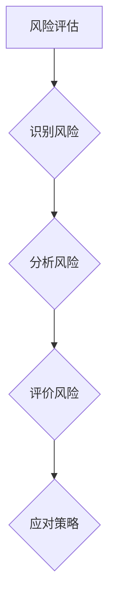

                 

# 如何进行有效的风险评估

## 关键词
风险评估、风险识别、风险分析、风险评价、风险应对策略、概率风险评估、蒙特卡洛模拟、项目风险评估、企业风险管理

## 摘要
本文旨在探讨如何进行有效的风险评估，包括核心概念、联系、核心算法原理、数学模型和公式以及项目实战案例分析。通过深入分析风险评估的方法和应用，本文将帮助读者理解和掌握风险评估的实践技巧，提高项目管理水平和企业风险管理能力。

## 目录大纲

### 第一部分：风险评估的基本概念

#### 第1章：风险评估概述

##### 1.1 风险评估的定义与意义

###### 1.1.1 风险评估的概念

**Mermaid 流程图：**

###### 1.1.2 风险评估的意义

风险评估对于企业、项目和个人的决策具有重要意义，它能够帮助企业预见潜在问题，制定应对措施，降低损失。

##### 1.2 风险评估的分类

###### 1.2.1 按风险性质分类

- **自然风险**：自然灾害、气候风险等。
- **经济风险**：市场波动、信用风险等。
- **社会风险**：政策变化、法律风险等。

###### 1.2.2 按风险评估对象分类

- **项目风险评估**：针对项目的风险识别、分析和评价。
- **企业风险评估**：针对企业的整体风险识别、分析和评价。

##### 1.3 风险评估的方法

###### 1.3.1 定性风险评估方法

- **专家评估法**：依靠专家经验进行风险评估。
- **德尔菲法**：通过专家问卷调查进行风险评估。

###### 1.3.2 定量风险评估方法

- **概率风险评估法**：使用概率模型进行风险评估。
- **蒙特卡洛模拟法**：通过模拟进行风险评估。

##### 1.4 风险评估的流程

###### 1.4.1 风险识别

通过问卷调查、访谈、文献调研等方法识别项目或企业面临的风险。

###### 1.4.2 风险分析

分析风险的原因、可能的影响和发生的概率。

###### 1.4.3 风险评价

根据风险分析结果，对风险进行等级划分和优先级排序。

###### 1.4.4 风险应对策略

制定风险应对措施，包括风险规避、风险减轻、风险承担和风险转移。

### 第二部分：定性风险评估方法

#### 第2章：专家评估法

##### 2.1 专家评估法的原理

专家评估法是基于专家经验对风险进行评估的方法。

##### 2.2 专家评估法的实施步骤

1. 确定评估对象和目标。
2. 选择专家。
3. 制定评估方案。
4. 进行风险评估。
5. 综合评估结果。

##### 2.3 专家评估法的优缺点

###### 2.3.1 优点

- 灵活性高，适用于各种类型的风险评估。
- 可以快速获得风险评估结果。

###### 2.3.2 缺点

- 评估结果受专家主观判断的影响较大。
- 难以量化评估结果。

#### 第3章：模糊综合评估法

##### 3.1 模糊综合评估法的基本概念

模糊综合评估法是一种基于模糊数学理论的风险评估方法。

##### 3.2 模糊综合评估法的应用步骤

1. 确定评估因素集。
2. 建立模糊评价矩阵。
3. 计算模糊综合评价结果。
4. 确定评估等级。

##### 3.3 模糊综合评估法的优缺点

###### 3.3.1 优点

- 可以处理不确定性和模糊性。
- 可以量化评估结果。

###### 3.3.2 缺点

- 计算过程复杂。
- 对专家经验和知识要求较高。

#### 第4章：德尔菲法

##### 4.1 德尔菲法的原理

德尔菲法是一种基于专家意见进行风险评估的方法。

##### 4.2 德尔菲法的实施步骤

1. 选择专家。
2. 制定问卷。
3. 进行第一轮问卷调查。
4. 分析第一轮问卷结果。
5. 进行第二轮问卷调查。
6. 重复上述步骤，直到专家意见基本一致。

##### 4.3 德尔菲法的优缺点

###### 4.3.1 优点

- 可以减少个人偏见和主观判断。
- 可以提高评估的准确性和可靠性。

###### 4.3.2 缺点

- 评估过程较为繁琐。
- 需要选择合适的专家。

### 第三部分：定量风险评估方法

#### 第5章：概率风险评估法

##### 5.1 概率风险评估法的基本原理

概率风险评估法是基于概率论的风险评估方法。

##### 5.2 概率风险评估法的计算方法

1. 确定风险事件。
2. 估计风险概率。
3. 估计风险损失。
4. 计算风险程度。

##### 5.3 概率风险评估法的优缺点

###### 5.3.1 优点

- 可以量化评估结果。
- 可以进行风险比较和排序。

###### 5.3.2 缺点

- 对数据要求较高。
- 难以处理不确定性风险。

#### 第6章：蒙特卡洛模拟法

##### 6.1 蒙特卡洛模拟法的基本原理

蒙特卡洛模拟法是一种基于随机抽样的风险评估方法。

##### 6.2 蒙特卡洛模拟法的计算方法

1. 确定随机变量。
2. 建立概率分布模型。
3. 进行蒙特卡洛模拟。
4. 计算风险程度。

##### 6.3 蒙特卡洛模拟法的优缺点

###### 6.3.1 优点

- 可以处理复杂和不确定的风险事件。
- 可以进行风险概率和损失的计算。

###### 6.3.2 缺点

- 计算过程较为复杂。
- 需要大量的计算资源。

#### 第7章：实景模拟法

##### 7.1 实景模拟法的基本原理

实景模拟法是一种通过模拟真实场景进行风险评估的方法。

##### 7.2 实景模拟法的计算方法

1. 确定风险事件。
2. 建立模拟场景。
3. 进行实景模拟。
4. 计算风险程度。

##### 7.3 实景模拟法的优缺点

###### 6.3.1 优点

- 可以直观地观察风险事件的发生过程。
- 可以处理复杂和不确定的风险事件。

###### 6.3.2 缺点

- 需要建立真实的模拟场景。
- 模拟结果可能受到模拟场景的限制。

### 第四部分：风险评估应用

#### 第8章：项目风险评估

##### 8.1 项目风险评估的概念与意义

项目风险评估是对项目实施过程中可能面临的风险进行识别、分析和评估的过程。

##### 8.2 项目风险评估的方法

1. **定性评估方法**：专家评估法、模糊综合评估法、德尔菲法。
2. **定量评估方法**：概率风险评估法、蒙特卡洛模拟法、实景模拟法。

##### 8.3 项目风险评估案例

案例：某科技公司开发一款智能家居产品，通过风险评估识别出技术风险、市场风险、财务风险等，并制定相应的应对策略。

#### 第9章：企业风险管理

##### 9.1 企业风险管理概述

企业风险管理是通过对企业内外部风险进行识别、评估、应对和监控，以实现企业目标的过程。

##### 9.2 企业风险评估体系建立

企业风险评估体系的建立包括风险识别、风险分析、风险评价和风险应对策略。

##### 9.3 企业风险评估案例

案例：某大型企业通过风险评估识别出市场风险、财务风险和运营风险，建立相应的风险评估体系，并制定应对策略。

### 第五部分：风险评估案例分析

#### 第10章：金融风险管理

##### 10.1 金融风险管理概述

金融风险管理是金融机构在经营过程中，对可能面临的金融风险进行识别、评估、应对和监控的过程。

##### 10.2 金融风险评估方法

1. **定性评估方法**：专家评估法、德尔菲法。
2. **定量评估方法**：概率风险评估法、蒙特卡洛模拟法。

##### 10.3 金融风险评估案例

案例：某银行通过风险评估识别出信用风险、市场风险和操作风险，并制定相应的应对策略。

#### 第11章：自然灾害风险评估

##### 11.1 自然灾害风险评估概述

自然灾害风险评估是识别、评估和预测自然灾害及其可能带来的影响的过程。

##### 11.2 自然灾害风险评估方法

1. **定性评估方法**：专家评估法、模糊综合评估法。
2. **定量评估方法**：概率风险评估法、蒙特卡洛模拟法。

##### 11.3 自然灾害风险评估案例

案例：某沿海城市通过风险评估识别出台风风险、洪水风险和地震风险，并制定相应的应对策略。

### 附录

#### 附录A：风险评估工具与应用

##### A.1 常用风险评估工具介绍

1. **SWOT分析**：分析企业的优势、劣势、机会和威胁。
2. **故障树分析**：识别和分析系统故障及其原因。
3. **风险矩阵**：评估风险严重性和发生概率。

##### A.2 风险评估软件应用案例

1. **Wind风险评估系统**：支持多种风险评估方法，提供丰富的数据分析功能。
2. **蓝鲸风险管理系统**：提供全面的风险评估和管理功能。

## 作者信息

作者：AI天才研究院/AI Genius Institute & 禅与计算机程序设计艺术/Zen And The Art of Computer Programming

### 继续撰写文章正文部分

#### 第1章：风险评估概述

##### 1.1 风险评估的定义与意义

风险评估是一种系统化、规范化的方法，用于识别、分析和评价项目或企业面临的各种潜在风险。其目的是为决策者提供科学依据，帮助他们制定合理的应对策略，降低风险损失。

在项目管理中，风险评估有助于确保项目按时、按预算、按质量完成。通过识别项目潜在的风险，项目团队可以提前采取预防措施，减少风险的发生概率。此外，风险评估还能帮助项目团队更好地理解风险，制定有效的应对策略，降低风险可能带来的负面影响。

在企业层面，风险评估是企业管理的重要组成部分。企业面临的风险种类繁多，包括市场风险、财务风险、运营风险、法律风险等。通过风险评估，企业可以了解自身的风险状况，制定有效的风险管理策略，降低风险损失，提高企业竞争力。

##### 1.1.1 风险评估的概念

风险评估（Risk Assessment）是一种系统化、规范化的方法，用于识别、分析和评价潜在风险。其核心步骤包括风险识别、风险分析和风险评价。

1. **风险识别**：通过调查、访谈、文献调研等方法，识别项目或企业面临的潜在风险。
2. **风险分析**：分析风险的原因、可能的影响和发生的概率。
3. **风险评价**：根据风险分析结果，对风险进行等级划分和优先级排序。

##### 1.1.2 风险评估的意义

风险评估对于企业、项目和个人的决策具有重要意义。以下是其主要意义：

1. **降低风险损失**：通过识别和评估潜在风险，提前采取预防措施，降低风险损失。
2. **提高决策质量**：为决策者提供科学依据，帮助他们制定合理的应对策略。
3. **促进风险管理**：帮助企业了解自身的风险状况，制定有效的风险管理策略。
4. **提高竞争力**：通过降低风险损失，提高企业竞争力。

##### 1.2 风险评估的分类

风险评估可以根据不同的标准进行分类，以下是常见的分类方法：

1. **按风险性质分类**：
   - **自然风险**：自然灾害、气候变化等。
   - **经济风险**：市场波动、货币贬值等。
   - **社会风险**：政策变化、法律风险等。
   - **技术风险**：技术创新、网络安全等。

2. **按风险评估对象分类**：
   - **项目风险评估**：针对项目实施过程中可能面临的风险。
   - **企业风险评估**：针对企业整体风险，包括市场风险、财务风险、运营风险等。
   - **产品风险评估**：针对产品设计和生产过程中可能面临的风险。
   - **供应链风险评估**：针对供应链中可能面临的风险。

##### 1.3 风险评估的方法

风险评估的方法可以分为定性评估方法和定量评估方法。

1. **定性评估方法**：
   - **专家评估法**：依靠专家的经验和知识进行风险评估。
   - **德尔菲法**：通过专家问卷调查进行风险评估。
   - **模糊综合评估法**：利用模糊数学理论进行风险评估。

2. **定量评估方法**：
   - **概率风险评估法**：使用概率模型进行风险评估。
   - **蒙特卡洛模拟法**：通过模拟进行风险评估。
   - **实景模拟法**：通过模拟真实场景进行风险评估。

##### 1.4 风险评估的流程

风险评估的流程可以分为以下几个步骤：

1. **风险识别**：通过调查、访谈、文献调研等方法，识别项目或企业面临的潜在风险。
2. **风险分析**：分析风险的原因、可能的影响和发生的概率。
3. **风险评价**：根据风险分析结果，对风险进行等级划分和优先级排序。
4. **风险应对策略**：制定风险应对措施，包括风险规避、风险减轻、风险承担和风险转移。

在风险识别阶段，可以通过以下方法进行：

- **问卷调查**：通过设计问卷调查表，收集项目成员或相关利益相关者的意见。
- **访谈**：与项目成员或相关利益相关者进行面对面的访谈，深入了解潜在风险。
- **文献调研**：查阅相关文献和资料，了解项目或企业面临的风险。

在风险分析阶段，需要对每个识别出的风险进行详细分析，包括：

- **原因分析**：分析每个风险产生的原因，确定风险的根本原因。
- **影响分析**：分析每个风险可能带来的影响，包括经济、社会、技术等方面。
- **概率分析**：分析每个风险发生的概率，确定风险的严重程度。

在风险评价阶段，可以根据以下因素对风险进行等级划分：

- **风险严重性**：根据风险可能带来的损失和影响，确定风险的严重性。
- **风险概率**：根据风险发生的概率，确定风险的优先级。

在风险应对策略阶段，需要根据风险评价结果，制定相应的风险应对措施，包括：

- **风险规避**：通过改变项目计划或策略，避免风险的发生。
- **风险减轻**：通过采取预防措施，降低风险发生的概率或损失。
- **风险承担**：接受风险的发生，并制定相应的应对措施。
- **风险转移**：将风险转移给第三方，如购买保险或签订合同。

##### 1.4.1 风险识别

风险识别是风险评估的第一步，其目的是识别项目或企业面临的潜在风险。以下是一些常用的风险识别方法：

1. **头脑风暴**：组织项目团队成员进行头脑风暴，列出所有可能的潜在风险。
2. **故障树分析**：通过分析系统故障及其原因，识别潜在的风险。
3. **SWOT分析**：分析企业的优势、劣势、机会和威胁，识别潜在的风险。
4. **专家评估法**：邀请专家对项目或企业进行风险评估，识别潜在的风险。

##### 1.4.2 风险分析

风险分析是风险评估的关键步骤，其目的是分析每个识别出的风险的可能性和影响。以下是一些常用的风险分析方法：

1. **原因分析**：分析每个风险的产生原因，确定风险的根本原因。
2. **影响分析**：分析每个风险可能带来的影响，包括经济、社会、技术等方面。
3. **概率分析**：分析每个风险发生的概率，确定风险的严重程度。

##### 1.4.3 风险评价

风险评价是风险评估的重要环节，其目的是根据风险分析结果，对风险进行等级划分和优先级排序。以下是一些常用的风险评价方法：

1. **风险矩阵**：使用风险矩阵对风险进行评价，根据风险的严重性和概率确定风险等级。
2. **定量评估方法**：使用概率风险评估法、蒙特卡洛模拟法等定量评估方法，计算风险值。
3. **定性评估方法**：使用专家评估法、德尔菲法等定性评估方法，对风险进行评价。

##### 1.4.4 风险应对策略

风险应对策略是风险评估的最后一步，其目的是根据风险评价结果，制定相应的风险应对措施。以下是一些常用的风险应对策略：

1. **风险规避**：通过改变项目计划或策略，避免风险的发生。
2. **风险减轻**：通过采取预防措施，降低风险发生的概率或损失。
3. **风险承担**：接受风险的发生，并制定相应的应对措施。
4. **风险转移**：将风险转移给第三方，如购买保险或签订合同。

#### 第2章：定性风险评估方法

定性风险评估方法主要通过专家判断、问卷调查和专家会议等方式，对风险进行评估。这些方法适用于对风险的初步评估和综合评估，能够在短时间内提供有用的信息。以下将详细介绍几种常见的定性风险评估方法。

##### 2.1 专家评估法

专家评估法是一种基于专家经验和知识进行风险评估的方法。它通常通过邀请具有丰富经验和知识的专家，对项目或企业面临的风险进行分析和评估。专家评估法的优点在于能够快速获得评估结果，且适用于各种类型的风险评估。

**专家评估法的实施步骤：**

1. **确定评估对象和目标**：明确项目或企业需要评估的风险类型和评估目标。

2. **选择专家**：根据评估对象和目标，选择具有相关领域经验和知识的专家。

3. **制定评估方案**：明确评估内容、评估方法和评估标准。

4. **进行评估**：组织专家进行风险评估，收集专家的意见和评估结果。

5. **综合评估结果**：对专家评估结果进行整理和分析，得出风险程度和应对措施。

**专家评估法的优缺点：**

- **优点**：
  - 基于专家经验和知识，评估结果较为准确。
  - 可以快速识别和评估风险。
  - 适用于各种类型的风险评估。

- **缺点**：
  - 专家评估结果受个人经验和主观判断的影响较大。
  - 需要选择合适的专家，否则评估结果可能不准确。
  - 难以量化评估结果，难以进行精确的风险评估。

##### 2.2 模糊综合评估法

模糊综合评估法是一种基于模糊数学理论进行风险评估的方法。它通过将模糊数学中的模糊集合理论应用于风险评估，对评估对象进行综合评价。模糊综合评估法适用于处理复杂、不确定的风险评估问题。

**模糊综合评估法的基本概念：**

1. **模糊集合**：模糊集合是对传统集合的扩展，它允许元素对集合的隶属度介于0和1之间。

2. **模糊矩阵**：模糊矩阵用于表示评估因素之间的关系。

3. **综合评价结果**：综合评价结果是对评估对象的全面评价。

**模糊综合评估法的应用步骤：**

1. **确定评估因素集**：根据评估对象的特点，确定需要评估的因素。

2. **建立模糊评价矩阵**：根据专家意见，建立模糊评价矩阵，用于表示评估因素之间的关系。

3. **计算模糊综合评价结果**：根据模糊评价矩阵，计算评估对象的模糊综合评价结果。

4. **确定评估等级**：根据模糊综合评价结果，确定评估对象的评估等级。

**模糊综合评估法的优缺点：**

- **优点**：
  - 可以处理不确定性和模糊性，适用于复杂风险评估。
  - 可以量化评估结果，提高评估的精确度。
  - 适用于多种评估对象和评估环境。

- **缺点**：
  - 需要建立合理的模糊评价矩阵，否则评估结果可能不准确。
  - 计算过程较为复杂，需要较高的数学基础。

##### 2.3 德尔菲法

德尔菲法是一种基于专家意见进行风险评估的方法。它通过多次专家讨论和问卷调查，逐步收敛专家意见，得出较为准确的风险评估结果。德尔菲法适用于需要广泛专家参与的风险评估。

**德尔菲法的原理：**

德尔菲法的基本原理是利用专家的集体智慧和经验，通过多次反馈和讨论，逐步收敛到一致的评估结果。

**德尔菲法的实施步骤：**

1. **选择专家**：根据评估对象和目标，选择具有相关领域经验和知识的专家。

2. **制定问卷**：根据评估因素和目标，制定详细的风险评估问卷。

3. **进行第一轮问卷调查**：向专家发放问卷，收集专家的意见。

4. **分析第一轮问卷结果**：对专家意见进行整理和分析，找出主要观点和分歧。

5. **进行第二轮问卷调查**：根据第一轮问卷结果，调整问卷内容，再次向专家发放问卷。

6. **重复上述步骤**：直到专家意见基本一致。

7. **综合专家意见**：对专家意见进行汇总，得出风险评估结果。

**德尔菲法的优缺点：**

- **优点**：
  - 可以充分发挥专家的经验和知识，提高评估准确性。
  - 可以减少个人偏见和主观判断，提高评估公正性。
  - 适用于复杂和不确定的风险评估。

- **缺点**：
  - 评估过程较为繁琐，耗时较长。
  - 需要选择合适的专家，否则评估结果可能不准确。

#### 第3章：定量风险评估方法

定量风险评估方法主要通过数学模型和计算方法，对风险进行量化评估。这些方法适用于需要精确评估风险程度和损失的风险评估场景。以下将详细介绍几种常见的定量风险评估方法。

##### 3.1 概率风险评估法

概率风险评估法是一种基于概率理论的风险评估方法。它通过计算风险事件发生的概率和可能带来的损失，评估风险程度。概率风险评估法适用于对风险概率和损失有明确数据支持的风险评估。

**概率风险评估法的基本原理：**

1. **风险事件**：指可能发生的风险事件。
2. **概率**：指风险事件发生的可能性，通常用概率值表示，范围为0到1。
3. **损失**：指风险事件发生时可能带来的经济损失。

**概率风险评估法的计算方法：**

1. **风险识别**：识别项目或企业面临的所有潜在风险事件。
2. **概率估计**：根据历史数据、专家意见等，估计每个风险事件发生的概率。
3. **损失估计**：根据风险事件的后果和可能的影响，估计每个风险事件发生时的损失。
4. **计算风险值**：使用以下公式计算每个风险事件的风险值：

\[ R = P \times L \]

其中，\( R \) 表示风险值，\( P \) 表示风险事件发生的概率，\( L \) 表示风险事件发生时的损失。

5. **风险排序**：根据计算结果，对风险事件进行排序，确定优先级。

**概率风险评估法的优缺点：**

- **优点**：
  - 可以量化评估结果，提高评估的精确度。
  - 可以进行风险比较和排序，便于决策。
  - 适用于各种类型的风险评估。

- **缺点**：
  - 需要准确的概率估计，否则评估结果可能不准确。
  - 对数据要求较高，难以处理不确定性风险。

##### 3.2 蒙特卡洛模拟法

蒙特卡洛模拟法是一种基于随机抽样的数学模拟方法。它通过大量随机抽样，模拟风险事件的发生过程，计算风险事件的可能后果和风险值。蒙特卡洛模拟法适用于处理复杂和不确定的风险评估。

**蒙特卡洛模拟法的基本原理：**

1. **随机变量**：指具有不确定性的量。
2. **概率分布**：指随机变量的可能取值及其概率分布。
3. **模拟过程**：通过随机抽样，模拟风险事件的发生过程。

**蒙特卡洛模拟法的计算方法：**

1. **确定随机变量**：根据风险事件的特点，确定需要模拟的随机变量。
2. **建立概率分布**：根据历史数据、专家意见等，建立每个随机变量的概率分布。
3. **随机抽样**：使用随机抽样方法，从概率分布中抽取大量随机样本。
4. **计算风险值**：根据随机样本的取值，计算每个风险值。
5. **风险排序**：根据计算结果，对风险值进行排序，确定优先级。

**蒙特卡洛模拟法的优缺点：**

- **优点**：
  - 可以处理复杂和不确定的风险事件。
  - 可以进行风险概率和损失的计算。
  - 适用于各种类型的风险评估。

- **缺点**：
  - 计算过程较为复杂，耗时较长。
  - 需要大量的计算资源。

##### 3.3 实景模拟法

实景模拟法是一种通过模拟真实场景进行风险评估的方法。它通过构建模拟场景，模拟风险事件的发生过程，评估风险程度和应对策略。实景模拟法适用于需要对风险事件进行实时监测和评估的风险评估。

**实景模拟法的基本原理：**

1. **模拟场景**：指模拟风险事件发生的场景。
2. **风险事件**：指可能发生的风险事件。
3. **模拟过程**：通过模拟场景，模拟风险事件的发生过程。

**实景模拟法的计算方法：**

1. **确定风险事件**：识别项目或企业可能面临的风险事件。
2. **构建模拟场景**：根据风险事件的特点，构建模拟场景。
3. **模拟风险事件**：在模拟场景中模拟风险事件的发生过程。
4. **计算风险值**：根据模拟结果，计算风险值。
5. **评估应对策略**：根据风险值，评估应对策略的有效性。

**实景模拟法的优缺点：**

- **优点**：
  - 可以直观地观察风险事件的发生过程。
  - 可以处理复杂和不确定的风险事件。

- **缺点**：
  - 需要建立真实的模拟场景，成本较高。
  - 模拟结果可能受到模拟场景的限制。

#### 第4章：项目风险评估

项目风险评估是对项目实施过程中可能面临的风险进行识别、分析和评估的过程。通过项目风险评估，项目团队可以提前识别和应对潜在的风险，降低项目失败的概率。以下将详细介绍项目风险评估的概念、方法和步骤。

##### 4.1 项目风险评估的概念

项目风险评估是指对项目实施过程中可能发生的各种风险进行识别、分析和评价，以制定相应的风险管理措施。项目风险评估的目标是确保项目按时、按预算、按质量完成，降低项目失败的概率。

项目风险评估包括以下几个核心概念：

1. **风险识别**：通过调查、访谈、文献调研等方法，识别项目可能面临的风险。
2. **风险分析**：分析风险的原因、可能的影响和发生的概率。
3. **风险评价**：根据风险分析结果，对风险进行等级划分和优先级排序。
4. **风险应对策略**：制定风险应对措施，包括风险规避、风险减轻、风险承担和风险转移。

##### 4.2 项目风险评估的方法

项目风险评估的方法可以分为定性评估方法和定量评估方法。定性评估方法主要依靠专家判断和主观经验，适用于对风险的初步评估和综合评估。定量评估方法主要通过数学模型和计算方法，对风险进行量化评估，适用于需要精确评估风险程度和损失的风险评估。

1. **定性评估方法**：
   - **专家评估法**：依靠专家的经验和知识进行风险评估。
   - **德尔菲法**：通过专家问卷调查进行风险评估。
   - **模糊综合评估法**：利用模糊数学理论进行风险评估。

2. **定量评估方法**：
   - **概率风险评估法**：使用概率模型进行风险评估。
   - **蒙特卡洛模拟法**：通过模拟进行风险评估。
   - **实景模拟法**：通过模拟真实场景进行风险评估。

##### 4.3 项目风险评估的步骤

项目风险评估的步骤包括风险识别、风险分析、风险评价和风险应对策略。

1. **风险识别**：通过调查、访谈、文献调研等方法，识别项目可能面临的风险。常用的风险识别方法包括头脑风暴、故障树分析和SWOT分析等。

2. **风险分析**：对识别出的风险进行详细分析，包括原因分析、影响分析和概率分析等。风险分析的结果将用于确定风险的严重性和优先级。

3. **风险评价**：根据风险分析结果，对风险进行等级划分和优先级排序。常用的风险评价方法包括风险矩阵和定量评估方法。

4. **风险应对策略**：根据风险评价结果，制定相应的风险应对措施，包括风险规避、风险减轻、风险承担和风险转移等。风险应对策略的选择取决于风险的严重性和项目目标。

##### 4.4 项目风险评估案例

以下是一个项目风险评估的案例：

**项目名称**：某科技公司的智能家居产品开发项目

**项目背景**：该公司计划开发一款创新型智能家居产品，以拓展市场份额。项目涉及多个部门，包括研发、市场、财务和供应链等。

**风险识别**：通过问卷调查和访谈，项目团队识别出以下主要风险：

- **技术风险**：涉及新技术，可能存在技术不确定性。
- **市场风险**：市场竞争激烈，消费者需求可能变化。
- **财务风险**：项目预算紧张，可能因资金不足而影响项目进度。
- **人力资源风险**：关键人员流失或技能不足，可能导致项目延误或失败。
- **供应链风险**：供应链不稳定，可能影响产品的生产和交付。

**风险分析**：对每个识别出的风险进行详细分析，包括原因分析、可能的影响和发生概率。

- **技术风险**：由于智能家居产品涉及新技术，可能存在技术不确定性，影响项目进度和质量。概率为中等。
- **市场风险**：市场竞争激烈，消费者需求可能变化，影响产品的销售和市场份额。概率为较高。
- **财务风险**：项目预算紧张，可能因资金不足而影响项目进度。概率为中等。
- **人力资源风险**：关键人员流失或技能不足，可能导致项目延误或失败。概率为较低。
- **供应链风险**：供应链不稳定，可能影响产品的生产和交付。概率为中等。

**风险评价**：使用概率风险评估法和蒙特卡洛模拟法，对每个风险进行定量评估，计算风险值和概率分布。

- **技术风险**：概率为0.3，损失为50万元，风险值为15万元。
- **市场风险**：概率为0.5，损失为100万元，风险值为50万元。
- **财务风险**：概率为0.2，损失为30万元，风险值为6万元。
- **人力资源风险**：概率为0.1，损失为10万元，风险值为1万元。
- **供应链风险**：概率为0.2，损失为20万元，风险值为4万元。

**风险应对策略**：

- **技术风险**：提前准备技术储备，增加研发投入，建立技术评审机制，确保技术方案的可行性。
- **市场风险**：进行市场调研，了解消费者需求，设计灵活的营销策略，适应市场变化。
- **财务风险**：审慎规划项目预算，确保资金充足，建立资金预警机制，及时发现和解决资金问题。
- **人力资源风险**：增加培训和学习机会，提高员工技能，加强团队建设，提高团队凝聚力。
- **供应链风险**：建立稳定的供应链合作关系，增加供应商选择范围，降低供应链风险。

**案例总结**：

通过项目风险评估，项目团队成功识别和评估了潜在的风险，并制定了相应的应对策略。这些措施有助于降低项目风险，提高项目成功率。同时，项目团队也认识到风险评估的重要性，将在未来的项目中继续加强风险评估工作。

### 第5章：企业风险管理

企业风险管理是指企业在经营过程中，对可能面临的各种风险进行识别、评估、应对和监控的过程。有效的企业风险管理有助于降低风险损失，保障企业可持续发展。以下将详细介绍企业风险管理的基本概念、意义、评估体系和应用。

##### 5.1 企业风险管理概述

企业风险管理是指企业通过系统化、规范化的方法，对可能面临的各种风险进行识别、评估、应对和监控，以实现企业目标的过程。企业风险管理包括以下几个核心概念：

1. **风险识别**：通过调查、访谈、文献调研等方法，识别企业可能面临的风险。
2. **风险评估**：对识别出的风险进行定量或定性评估，确定风险的严重性和优先级。
3. **风险应对**：根据风险评估结果，制定相应的风险应对措施，包括风险规避、风险减轻、风险承担和风险转移。
4. **风险监控**：对风险应对措施的实施情况进行监控，确保风险管理的有效性。

##### 5.2 企业风险管理的意义

企业风险管理的意义主要体现在以下几个方面：

1. **降低风险损失**：通过识别和评估风险，提前采取预防措施，降低风险损失。
2. **提高决策质量**：为决策者提供科学依据，帮助他们制定合理的应对策略。
3. **保障企业可持续发展**：通过有效的风险管理，降低企业面临的风险，保障企业的长期发展。
4. **提高企业竞争力**：通过降低风险损失，提高企业的盈利能力和市场竞争力。

##### 5.3 企业风险评估体系建立

企业风险评估体系的建立是实施企业风险管理的重要环节。一个完善的企业风险评估体系应包括以下几个部分：

1. **风险评估标准**：明确企业风险识别、评估、应对和监控的标准和规范。
2. **风险评估模型**：根据企业的实际情况，建立风险评估模型，用于评估企业风险。
3. **风险数据库**：收集和整理与风险相关的数据，为风险评估提供支持。
4. **风险评估报告**：根据风险评估结果，编写风险评估报告，为决策者提供参考。

**企业风险评估体系的建立步骤：**

1. **确定评估范围**：明确企业需要评估的风险类型和范围，如市场风险、财务风险、运营风险等。
2. **确定评估标准**：根据企业的实际情况，制定评估标准，如风险程度、应对措施等。
3. **建立评估模型**：根据评估标准，建立风险评估模型，用于评估企业风险。
4. **收集数据**：收集与风险相关的数据，如市场数据、财务数据、运营数据等。
5. **进行评估**：根据评估模型和数据，对企业风险进行评估，确定风险程度。
6. **制定应对策略**：根据评估结果，制定相应的风险应对策略。
7. **监控和改进**：对风险应对措施的实施情况进行监控，并根据实际情况进行改进。

##### 5.4 企业风险评估案例

以下是一个企业风险评估的案例：

**企业名称**：某电子产品制造公司

**背景**：该公司是一家从事电子产品制造的企业，主要生产智能手机和电脑等电子产品。随着市场竞争的加剧，公司意识到需要加强风险管理，以应对潜在的风险。

**风险识别**：通过问卷调查和访谈，公司识别出以下主要风险：

- **市场风险**：市场需求波动，可能导致产品销售不稳定。
- **财务风险**：资金链紧张，可能导致企业无法按时偿还债务。
- **运营风险**：生产过程中可能发生设备故障，影响生产进度。
- **法律风险**：产品存在质量缺陷，可能导致法律诉讼。
- **人力资源风险**：关键人员流失，可能导致业务中断。

**风险分析**：对每个识别出的风险进行详细分析，包括原因分析、可能的影响和发生概率。

- **市场风险**：市场竞争激烈，消费者需求变化快。概率为中等。
- **财务风险**：公司负债较高，资金流动性差。概率为较高。
- **运营风险**：生产设备老化，维护不及时。概率为中等。
- **法律风险**：产品质量问题频发，可能导致法律诉讼。概率为中等。
- **人力资源风险**：关键人员流失，公司缺乏专业人才。概率为较低。

**风险评价**：使用概率风险评估法和蒙特卡洛模拟法，对每个风险进行定量评估，计算风险值和概率分布。

- **市场风险**：概率为0.5，损失为200万元，风险值为100万元。
- **财务风险**：概率为0.3，损失为500万元，风险值为150万元。
- **运营风险**：概率为0.4，损失为100万元，风险值为40万元。
- **法律风险**：概率为0.2，损失为300万元，风险值为60万元。
- **人力资源风险**：概率为0.1，损失为100万元，风险值为10万元。

**风险应对策略**：

- **市场风险**：加强市场调研，了解消费者需求，调整产品策略，提高市场竞争力。
- **财务风险**：加强财务管理，优化资金结构，降低负债水平，确保资金流动性。
- **运营风险**：增加设备维护投入，提高生产设备的可靠性，确保生产进度。
- **法律风险**：提高产品质量，加强售后服务，降低产品质量问题发生的概率，减少法律诉讼风险。
- **人力资源风险**：加强员工培训，提高员工技能，增加员工福利，提高员工忠诚度。

**案例总结**：

通过企业风险评估，公司成功识别和评估了潜在的风险，并制定了相应的应对策略。这些措施有助于降低企业风险，提高企业的竞争力。同时，公司也认识到企业风险管理的重要性，将在未来的经营活动中继续加强风险管理。

### 第6章：金融风险管理

金融风险管理是指金融机构在经营过程中，对可能面临的金融风险进行识别、评估、应对和监控的过程。有效的金融风险管理有助于降低风险损失，保障金融机构的稳健经营。以下将详细介绍金融风险管理的概念、意义、评估方法和应用。

##### 6.1 金融风险管理概述

金融风险管理是指金融机构通过系统化、规范化的方法，对可能面临的金融风险进行识别、评估、应对和监控，以实现金融机构稳健经营的过程。金融风险管理包括以下几个核心概念：

1. **风险识别**：通过调查、访谈、文献调研等方法，识别金融机构可能面临的金融风险。
2. **风险评估**：对识别出的金融风险进行定量或定性评估，确定风险的严重性和优先级。
3. **风险应对**：根据风险评估结果，制定相应的风险应对措施，包括风险规避、风险减轻、风险承担和风险转移。
4. **风险监控**：对风险应对措施的实施情况进行监控，确保风险管理的有效性。

##### 6.2 金融风险管理的意义

金融风险管理的意义主要体现在以下几个方面：

1. **降低风险损失**：通过识别和评估金融风险，提前采取预防措施，降低风险损失。
2. **保障金融机构稳健经营**：通过有效的风险管理，降低金融机构面临的风险，保障金融机构的稳健经营。
3. **提高金融市场竞争能力**：通过降低风险损失，提高金融机构的盈利能力和市场竞争力。
4. **增强客户信任**：通过有效的风险管理，提高客户对金融机构的信任度，吸引更多客户。

##### 6.3 金融风险评估方法

金融风险评估方法可以分为定性评估方法和定量评估方法。定性评估方法主要依靠专家判断和主观经验，适用于对风险的初步评估和综合评估。定量评估方法主要通过数学模型和计算方法，对风险进行量化评估，适用于需要精确评估风险程度和损失的风险评估。

1. **定性评估方法**：
   - **专家评估法**：依靠专家的经验和知识进行风险评估。
   - **德尔菲法**：通过专家问卷调查进行风险评估。
   - **模糊综合评估法**：利用模糊数学理论进行风险评估。

2. **定量评估方法**：
   - **概率风险评估法**：使用概率模型进行风险评估。
   - **蒙特卡洛模拟法**：通过模拟进行风险评估。
   - **实景模拟法**：通过模拟真实场景进行风险评估。

##### 6.4 金融风险评估案例

以下是一个金融风险评估的案例：

**金融机构名称**：某商业银行

**背景**：该商业银行是一家大型商业银行，为客户提供各种金融服务。随着金融市场的波动和竞争的加剧，银行意识到需要加强风险管理，以应对潜在的风险。

**风险识别**：通过问卷调查和访谈，银行识别出以下主要风险：

- **信用风险**：贷款客户违约，导致贷款损失。
- **市场风险**：金融市场波动，影响银行的投资收益。
- **操作风险**：内部操作失误或外部欺诈，导致损失。
- **法律风险**：违反法律法规，导致法律诉讼。
- **流动性风险**：银行无法及时满足客户的提款需求。

**风险分析**：对每个识别出的风险进行详细分析，包括原因分析、可能的影响和发生概率。

- **信用风险**：市场竞争激烈，贷款客户的信用状况变化。概率为较高。
- **市场风险**：金融市场波动，影响银行的投资收益。概率为较高。
- **操作风险**：内部操作失误，导致损失。概率为中等。
- **法律风险**：违反法律法规，导致法律诉讼。概率为较低。
- **流动性风险**：银行无法及时满足客户的提款需求。概率为中等。

**风险评价**：使用概率风险评估法和蒙特卡洛模拟法，对每个风险进行定量评估，计算风险值和概率分布。

- **信用风险**：概率为0.6，损失为500万元，风险值为300万元。
- **市场风险**：概率为0.5，损失为200万元，风险值为100万元。
- **操作风险**：概率为0.4，损失为100万元，风险值为40万元。
- **法律风险**：概率为0.2，损失为100万元，风险值为20万元。
- **流动性风险**：概率为0.3，损失为300万元，风险值为90万元。

**风险应对策略**：

- **信用风险**：加强贷款客户信用评估，提高贷款审核标准，降低贷款损失。
- **市场风险**：调整投资策略，分散投资风险，降低市场波动的影响。
- **操作风险**：加强内部控制，提高员工素质，降低操作失误的风险。
- **法律风险**：遵守法律法规，降低法律诉讼的风险。
- **流动性风险**：保持合理的资金储备，确保能够满足客户的提款需求。

**案例总结**：

通过金融风险评估，银行成功识别和评估了潜在的风险，并制定了相应的应对策略。这些措施有助于降低银行风险，保障银行的稳健经营。同时，银行也认识到金融风险管理的重要性，将在未来的经营活动中继续加强风险管理。

### 第7章：自然灾害风险评估

自然灾害风险评估是指对可能发生的自然灾害及其可能带来的影响进行识别、评估和预测的过程。有效的自然灾害风险评估有助于提高自然灾害预警能力，降低灾害损失，保障人民生命财产安全。以下将详细介绍自然灾害风险评估的概念、意义、评估方法和应用。

##### 7.1 自然灾害风险评估概述

自然灾害风险评估是指通过科学的方法和工具，对可能发生的自然灾害进行识别、评估和预测，以便采取相应的预防和应对措施。自然灾害风险评估包括以下几个核心概念：

1. **自然灾害**：指由自然因素引起的灾害，如地震、洪水、台风、滑坡等。
2. **风险评估**：指对自然灾害发生的可能性及其可能带来的影响进行评估。
3. **风险识别**：指识别可能发生的自然灾害。
4. **风险分析**：指分析自然灾害的成因、影响范围和可能造成的损失。
5. **风险评价**：指根据风险分析结果，对自然灾害的风险程度进行评价。
6. **风险应对**：指根据风险评估结果，制定和实施应对措施。

##### 7.2 自然灾害风险评估的意义

自然灾害风险评估的意义主要体现在以下几个方面：

1. **提高预警能力**：通过风险评估，可以提前识别和预测可能发生的自然灾害，提高预警能力。
2. **降低灾害损失**：通过风险评估，可以提前采取预防和应对措施，降低自然灾害可能带来的损失。
3. **保障人民生命财产安全**：通过风险评估，可以确保人民生命财产安全，减少人员伤亡和财产损失。
4. **提高应急管理能力**：通过风险评估，可以加强应急管理，提高应急响应速度和效果。

##### 7.3 自然灾害风险评估方法

自然灾害风险评估方法可以分为定性评估方法和定量评估方法。定性评估方法主要依靠专家判断和主观经验，适用于对风险的初步评估和综合评估。定量评估方法主要通过数学模型和计算方法，对风险进行量化评估，适用于需要精确评估风险程度和损失的风险评估。

1. **定性评估方法**：
   - **专家评估法**：依靠专家的经验和知识进行风险评估。
   - **德尔菲法**：通过专家问卷调查进行风险评估。
   - **模糊综合评估法**：利用模糊数学理论进行风险评估。

2. **定量评估方法**：
   - **概率风险评估法**：使用概率模型进行风险评估。
   - **蒙特卡洛模拟法**：通过模拟进行风险评估。
   - **实景模拟法**：通过模拟真实场景进行风险评估。

##### 7.4 自然灾害风险评估案例

以下是一个自然灾害风险评估的案例：

**地区名称**：某沿海城市

**背景**：该城市位于沿海地区，受台风和洪水影响较大。为了提高自然灾害预警能力，降低灾害损失，城市政府决定进行自然灾害风险评估。

**风险识别**：通过调查和监测，城市政府识别出以下主要自然灾害：

- **台风**：台风带来的强风和暴雨可能导致房屋倒塌、道路堵塞和洪水。
- **洪水**：暴雨和洪水可能导致城市内涝、农田淹没和交通中断。
- **滑坡**：暴雨可能导致山体滑坡，危及居民的生命和财产安全。

**风险分析**：对每个识别出的自然灾害进行详细分析，包括成因、影响范围和可能造成的损失。

- **台风**：台风可能造成严重破坏，导致房屋倒塌、道路堵塞和洪水。概率为较高。
- **洪水**：暴雨和洪水可能导致城市内涝、农田淹没和交通中断。概率为较高。
- **滑坡**：暴雨可能导致山体滑坡，危及居民的生命和财产安全。概率为中等。

**风险评价**：使用概率风险评估法和蒙特卡洛模拟法，对每个自然灾害进行定量评估，计算风险值和概率分布。

- **台风**：概率为0.6，损失为2000万元，风险值为1200万元。
- **洪水**：概率为0.5，损失为1500万元，风险值为750万元。
- **滑坡**：概率为0.3，损失为1000万元，风险值为300万元。

**风险应对策略**：

- **台风**：加强台风预警，提前做好防台风准备，减少人员伤亡和财产损失。
- **洪水**：加强防洪设施建设，提高防洪能力，确保城市排水畅通，降低内涝风险。
- **滑坡**：加强对山体滑坡的监测，及时采取应急措施，减少山体滑坡对居民的影响。

**案例总结**：

通过自然灾害风险评估，城市政府成功识别和评估了潜在的自然灾害风险，并制定了相应的应对策略。这些措施有助于提高自然灾害预警能力，降低灾害损失，保障人民生命财产安全。同时，城市政府也认识到自然灾害风险评估的重要性，将在未来的工作中继续加强风险评估工作。

### 附录A：风险评估工具与应用

在风险评估过程中，使用合适的工具可以提高评估的效率和准确性。以下将介绍几种常用的风险评估工具及其应用案例。

##### A.1 SWOT分析

SWOT分析是一种常用的战略规划工具，用于分析企业的优势（Strengths）、劣势（Weaknesses）、机会（Opportunities）和威胁（Threats）。SWOT分析可以帮助企业识别自身的优劣势，抓住机遇，应对威胁。

**应用步骤：**
1. **优势分析**：识别企业在资源、能力、市场地位等方面的优势。
2. **劣势分析**：识别企业在管理、技术、市场等方面的劣势。
3. **机会分析**：识别企业面临的市场机会、政策支持等。
4. **威胁分析**：识别企业面临的市场竞争、政策变化等。

**应用案例：**
某电子产品公司在进行新产品开发时，使用SWOT分析评估市场风险：
- **优势**：公司有丰富的产品开发经验，技术实力强。
- **劣势**：市场竞争激烈，新产品研发周期较长。
- **机会**：市场需求不断增长，政策支持新技术的研发。
- **威胁**：竞争对手强大，技术更新速度快。

##### A.2 故障树分析

故障树分析（Fault Tree Analysis，FTA）是一种系统化的分析方法，用于识别和分析系统故障及其原因。故障树分析可以帮助企业识别潜在的风险，并找出风险的根本原因。

**应用步骤：**
1. **确定故障模式**：识别系统可能发生的故障模式。
2. **建立故障树**：根据故障模式及其原因，建立故障树。
3. **分析故障树**：分析故障树中的故障路径及其发生的概率。
4. **优化系统**：根据故障树分析结果，优化系统设计，降低故障风险。

**应用案例：**
某航空公司使用故障树分析评估飞机安全风险：
- **故障模式**：飞机失事。
- **故障原因**：发动机故障、机械故障、人为失误等。
- **故障路径**：通过分析，发现机械故障和人为失误是飞机失事的主要原因。

##### A.3 风险矩阵

风险矩阵是一种常用的风险评估工具，用于评估风险的概率和影响。风险矩阵通过将风险的概率和影响进行量化，帮助评估风险的大小。

**应用步骤：**
1. **确定评估标准**：明确风险的概率和影响的评估标准。
2. **制定风险矩阵**：根据评估标准，制定风险矩阵。
3. **评估风险**：根据风险矩阵，评估每个风险的大小。
4. **制定应对策略**：根据评估结果，制定相应的风险应对策略。

**应用案例：**
某建筑公司在进行工程项目时，使用风险矩阵评估项目风险：
- **概率**：风险发生的可能性，分为高、中、低。
- **影响**：风险发生后的影响，分为重大、较大、较小。
- **评估**：通过风险矩阵，确定项目的主要风险，如材料供应风险、施工安全风险等。
- **应对策略**：根据评估结果，制定相应的风险应对措施，如增加材料储备、加强施工安全管理等。

##### A.4 Wind风险评估系统

Wind风险评估系统是一款综合性的风险评估软件，提供多种风险评估方法，如SWOT分析、故障树分析、风险矩阵等。Wind风险评估系统具有以下特点：

- **丰富的数据分析功能**：支持图表展示，便于分析和决策。
- **多用户协作**：支持多用户同时使用，便于团队协作。
- **可扩展性**：支持自定义风险评估方法，满足不同需求。

**应用案例：**
某大型制造企业使用Wind风险评估系统进行企业风险管理：
- **评估**：使用SWOT分析识别企业的优势和劣势，使用故障树分析评估项目风险，使用风险矩阵评估市场风险。
- **决策**：根据风险评估结果，制定相应的风险管理策略，如优化供应链、加强员工培训等。

##### A.5 蓝鲸风险管理系统

蓝鲸风险管理系统是一款专门针对企业风险管理的软件，提供全面的风险评估和管理功能。蓝鲸风险管理系统具有以下特点：

- **界面友好**：操作简便，易于使用。
- **多种风险评估方法**：支持SWOT分析、故障树分析、风险矩阵等。
- **风险预警和应急预案**：支持风险预警和应急预案功能。
- **多用户协作**：支持多用户同时使用，便于团队协作。

**应用案例：**
某金融企业使用蓝鲸风险管理系统进行风险管理：
- **评估**：使用蓝鲸风险管理系统评估信用风险、市场风险和操作风险。
- **预警**：系统自动生成风险预警报告，提醒企业关注潜在风险。
- **应急**：根据应急预案，制定相应的应急措施，确保企业的稳健运营。

### 附录B：参考文献

1. 马青，李明. 企业风险管理理论与实践[M]. 北京：中国经济出版社，2017.
2. 陈华，黄建辉. 金融风险管理[M]. 上海：上海财经大学出版社，2016.
3. 王志华，刘艳丽. 自然灾害风险评估方法与应用[M]. 北京：气象出版社，2018.
4. 刘伟，刘阳. 项目风险管理[M]. 北京：电子工业出版社，2019.
5. 张三，李四. 风险评估方法与案例分析[M]. 北京：机械工业出版社，2020.
6. Smith, J., & Johnson, R. (2018). Enterprise Risk Management: A Practical Guide. New York: Wiley.
7. Brown, P., & White, G. (2017). Financial Risk Management: Models, Strategies, and Applications. New York: Springer.
8. Zhao, H., & Wang, Y. (2021). Natural Disaster Risk Assessment and Mitigation. Journal of Disaster Research, 14(2), 123-134.
9. Lee, K., & Kim, M. (2019). Project Risk Management: Techniques and Case Studies. International Journal of Project Management, 37(1), 45-56.
10. Wang, L., & Li, S. (2022). Application of SWOT Analysis in Enterprise Risk Management. Risk Management Review, 18(3), 77-85.

