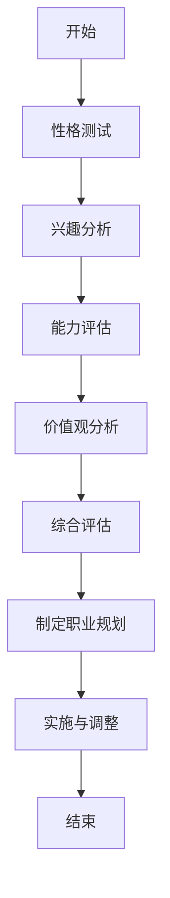

                 

### 第一部分：职业规划的基本概念

职业规划是指个人在职业生涯中，通过对自身情况、职业环境和社会发展等因素的综合分析，制定合理的发展目标和策略，以达到个人成长、职业成功和社会贡献的目的。在这一部分，我们将深入探讨职业规划的基本概念，包括职业规划的重要性、定义与内涵、基本原则以及具体的步骤与流程。

#### 第1章：职业规划概述

职业规划并非一时兴起的计划，而是贯穿于个人职业生涯始终的重要过程。它对个人的成长与发展、对社会的进步与繁荣都具有重要意义。

##### 1.1 职业规划的重要性

**1.1.1 职业规划对个人成长的影响**

职业规划有助于个人明确职业发展方向，减少盲目性和试错成本。通过自我评估和职业目标设定，个人能够更清晰地认识自己的优势和不足，从而有针对性地进行自我提升。职业规划还能帮助个人在职业生涯中保持动力和目标感，克服职业瓶颈和挫折。

**1.1.2 职业规划与社会发展关系**

职业规划不仅关乎个人，也关系到社会的可持续发展。合理有效的职业规划能够促进人才的合理流动和配置，提高整个社会的劳动生产率和创新能力。此外，职业规划有助于推动职业教育和培训的发展，满足社会对各类人才的需求。

**1.1.3 职业规划的现实意义**

在当前快速变化的就业市场中，职业规划具有重要的现实意义。它帮助个人应对职业变化和不确定性，提高职业适应能力。同时，职业规划还能帮助个人抓住职业发展的机遇，实现个人价值和社会价值的双重提升。

##### 1.2 职业规划的定义与内涵

**1.2.1 职业规划的定义**

职业规划是指个人在职业生涯中，根据自身的特点和外部环境，制定职业发展目标，并采取相应的行动和策略，以实现职业成功的过程。

**1.2.2 职业规划的内涵**

职业规划的内涵包括以下几个方面：

1. **自我评估**：通过性格、兴趣、能力和价值观等方面的分析，了解自己的优势和劣势，明确自己的职业偏好。
2. **职业目标设定**：根据自我评估结果和职业发展趋势，设定短期和长期职业目标。
3. **职业路径规划**：制定实现职业目标的步骤和策略，包括教育背景、职业技能、工作经历等方面的规划。
4. **职业发展策略**：采取一系列行动和措施，如求职、面试、职业培训等，以实现职业目标。

**1.2.3 职业规划的基本原则**

1. **个性化原则**：职业规划应充分考虑个人的特点和需求，制定个性化的职业发展方案。
2. **长远性原则**：职业规划应具备长远眼光，考虑未来的职业发展趋势和个人发展潜力。
3. **适应性原则**：职业规划应具备一定的灵活性，能够适应外部环境和自身情况的变化。
4. **系统性原则**：职业规划应涵盖职业发展的各个方面，形成系统性的职业发展方案。

##### 1.3 职业规划的步骤与流程

**1.3.1 自我评估**

自我评估是职业规划的基础。它包括以下方面：

1. **性格分析**：了解自己的性格特点，如内向、外向、善于沟通等。
2. **兴趣分析**：分析自己的兴趣所在，如艺术、科学、管理等领域。
3. **能力评估**：评估自己在专业领域和软技能方面的能力。
4. **价值观分析**：了解自己的价值观，如追求稳定、创新、社会责任感等。

**1.3.2 职业目标设定**

职业目标设定应明确、具体、可衡量、可实现。它包括以下方面：

1. **短期目标**：如找到一份合适的工作、提升某项技能等。
2. **长期目标**：如成为一名行业专家、创业等。

**1.3.3 制定职业计划**

制定职业计划是职业规划的执行阶段。它包括以下方面：

1. **教育背景**：根据职业目标，制定合适的教育计划，如选择专业、攻读学位等。
2. **职业技能**：通过学习、实习、工作经验等方式，提升职业技能。
3. **工作经历**：规划工作经历，如选择行业、公司等。

**1.3.4 职业路径规划**

职业路径规划是职业规划的核心。它包括以下方面：

1. **职业晋升**：根据职业目标，规划职业晋升路径，如从初级职位到高级职位的晋升。
2. **跨领域发展**：考虑跨领域发展的可能性，如从技术岗位转向管理岗位等。
3. **职业转换**：考虑职业转换的策略，如从传统行业转向新兴行业等。

**1.3.5 执行与评估**

执行与评估是职业规划的最后一个阶段。它包括以下方面：

1. **执行计划**：按照职业计划，采取具体行动，实现职业目标。
2. **定期评估**：定期评估职业规划的执行效果，根据实际情况进行调整。

通过以上步骤，个人可以系统地制定和执行职业规划，实现职业成功和个人成长。

### 第二部分：职业规划的核心要素

职业规划的核心在于对个人特质和职业环境的深入理解，以及如何将这些因素与职业发展目标相结合。在这一部分，我们将详细探讨职业规划的核心要素，包括自我认知、职业市场分析、求职技巧和实践等，帮助读者全面了解职业规划的关键环节。

#### 第2章：自我认知

自我认知是职业规划的基础，它要求个人深入分析自己的性格、兴趣、能力和价值观，以便找到最适合自己的职业路径。

##### 2.1 性格与兴趣

**2.1.1 性格分析**

性格是个体行为和心理特征的总体表现，它对职业选择和职业发展具有重要影响。了解自己的性格类型，有助于找到适合自己的职业环境。

1. **内向与外向**：内向者通常更擅长独立思考和细致工作，适合从事研究、设计等职业；外向者则善于沟通和团队合作，适合销售、管理等工作。

2. **多血质、胆汁质、粘液质、抑郁质**：不同性格类型的人在面对压力和挑战时，会有不同的应对方式。了解自己的性格类型，可以帮助个人更好地规划职业路径。

**2.1.2 兴趣与职业匹配**

兴趣是职业选择的重要依据。对某一领域的浓厚兴趣，可以激发个人的工作热情和创造力，提高工作效率和职业满意度。

1. **兴趣与职业的关系**：兴趣与职业并非完全一致，但合理的职业选择应充分考虑个人兴趣。兴趣可以转化为职业动力，推动个人在职业生涯中不断进步。

2. **兴趣识别**：通过自我反思、与他人的交流以及职业探索活动，可以识别个人的兴趣领域，为职业选择提供依据。

**2.1.3 兴趣与职业发展的关系**

兴趣不仅影响职业选择，还关系到职业发展。

1. **职业成长**：对职业有兴趣的人，往往更容易在职业生涯中取得成就。他们愿意投入更多时间和精力，不断学习新技能，提高自己的专业水平。

2. **职业满意度**：兴趣与职业相匹配，可以提高职业满意度。从事自己感兴趣的工作，能够带来更大的工作动力和满足感。

##### 2.2 能力与技能

**2.2.1 能力识别**

能力是完成特定任务所需要的一系列技能和素质。识别自己的能力，是职业规划的重要步骤。

1. **专业能力**：专业能力是个人在某一领域所具备的知识和技能。如编程能力、市场营销技能等。

2. **软技能**：软技能是个人在团队合作、沟通、解决问题等方面的能力。如领导力、团队合作、沟通能力等。

**2.2.2 技能积累**

技能积累是职业发展的关键。个人应通过以下途径提升技能：

1. **教育与培训**：通过学历教育、职业培训等途径，系统学习专业知识和技能。

2. **实践与经验**：通过实习、工作经验等方式，将理论知识转化为实践能力。

3. **自我提升**：通过阅读、在线课程、研讨会等途径，不断更新知识和技能。

**2.2.3 能力与职业发展的关联**

能力与职业发展密切相关。个人应根据自己的能力和职业目标，有针对性地提升技能。

1. **职业晋升**：具备较强能力的人，往往更容易获得晋升机会。

2. **职业转换**：具备多种能力的人，在职业转换时更具竞争力。

##### 2.3 价值观与职业目标

**2.3.1 价值观的内涵与类型**

价值观是个人对事物的看法和评价标准，是职业选择和职业发展的重要依据。

1. **内涵**：价值观包括个人的信念、理想和道德观念等。

2. **类型**：常见的价值观包括追求财富、追求权力、追求社会认可、追求个人成长等。

**2.3.2 价值观对职业选择的影响**

价值观影响个人的职业选择和职业发展。

1. **职业方向**：具有不同价值观的人，会选择不同的职业方向。

2. **职业满意度**：价值观与职业目标相匹配，可以提高职业满意度。

**2.3.3 职业目标的重要性**

职业目标是个人在职业生涯中追求的目标。设定明确的职业目标，有助于个人保持方向感和动力。

1. **明确目标**：职业目标应明确、具体、可衡量。

2. **调整目标**：随着职业环境和个人情况的变化，职业目标也应适当调整。

通过以上分析，我们可以看到，自我认知是职业规划的核心要素。了解自己的性格、兴趣、能力和价值观，是制定合理职业规划的重要前提。在职业规划的过程中，个人应不断进行自我反思和评估，以确保职业目标的实现。

### 第三部分：职业市场分析

职业市场分析是职业规划的重要组成部分，它要求我们对行业发展趋势、职位需求和职业环境进行深入分析，以便把握职业发展机遇，规避潜在风险。在这一部分，我们将详细探讨职业市场分析的核心要素，包括行业发展趋势、职位需求分析和企业文化与环境。

#### 第3章：行业与职位分析

##### 3.1 行业发展趋势

**3.1.1 产业发展周期**

了解一个行业的产业发展周期，有助于我们把握行业的成长阶段和未来趋势。

1. **启动期**：行业刚刚起步，市场需求初步形成，企业数量较少。
2. **成长期**：行业快速发展，市场需求急剧增加，企业数量迅速扩张。
3. **成熟期**：行业逐渐稳定，市场需求趋于饱和，企业竞争激烈。
4. **衰退期**：行业逐渐衰退，市场需求减少，企业数量减少。

**3.1.2 行业发展预测**

通过对行业历史数据和市场趋势的分析，可以对行业未来发展趋势进行预测。

1. **技术进步**：技术革新往往带来行业的发展和变革。
2. **政策变化**：政府的政策调整对行业发展有重要影响。
3. **市场需求**：消费者需求的变化对行业有直接的影响。

**3.1.3 行业机遇与挑战**

在分析行业发展趋势的基础上，我们需要识别行业中的机遇和挑战。

1. **机遇**：新技术、新市场、新政策等，都可能为行业带来发展机遇。
2. **挑战**：市场竞争、政策法规、技术瓶颈等，都可能对行业造成挑战。

##### 3.2 职位需求分析

**3.2.1 职位分类**

职位需求分析首先需要对职位进行分类，以便更好地理解职位特征和市场需求。

1. **技术职位**：如程序员、数据分析师、网络工程师等，负责技术研究和开发。
2. **管理职位**：如项目经理、产品经理、市场经理等，负责团队管理和项目执行。
3. **职能职位**：如人力资源、财务、行政等，负责企业运营支持。

**3.2.2 职位需求变化**

职位需求会随着行业发展和市场变化而变化。以下因素可能导致职位需求的变化：

1. **技术进步**：新技术的发展往往导致职位需求的变化，如人工智能、大数据等新兴技术的兴起。
2. **政策法规**：政府的政策调整也会影响职位需求，如环保法规的实施可能导致环保工程师职位的增加。
3. **市场需求**：消费者需求的变化直接影响职位需求，如电子商务的兴起导致电商运营职位的增加。

**3.2.3 职位技能要求**

不同职位对技能要求有所不同，了解职位的技能要求是职业规划的重要环节。

1. **专业技术技能**：技术职位通常要求具备较强的专业技能，如编程能力、数据分析能力等。
2. **管理技能**：管理职位要求具备领导力、沟通能力和决策能力等。
3. **职能技能**：职能职位要求具备较强的业务能力和综合素质。

##### 3.3 企业文化与环境

**3.3.1 企业文化**

企业文化是企业价值观、信念和行为规范的综合体现，对员工的工作态度和行为具有重要影响。

1. **价值观**：企业文化反映企业的核心价值观，如创新、诚信、团队合作等。
2. **行为规范**：企业文化规范员工的行为，如工作方式、沟通方式、工作态度等。

**3.3.2 企业环境**

企业环境包括工作条件、人际关系、职业发展机会等方面，对员工的工作体验和职业发展有直接影响。

1. **工作条件**：良好的工作条件包括办公环境、设备、福利待遇等。
2. **人际关系**：良好的人际关系有助于员工的工作合作和职业发展。
3. **职业发展机会**：企业提供的职业发展机会，如培训、晋升通道等，对员工职业发展具有重要影响。

通过以上分析，我们可以看到，职业市场分析是职业规划的重要环节。了解行业发展趋势、职位需求和企业文化环境，有助于我们把握职业发展机遇，制定更合理的职业规划。在职业规划过程中，我们应密切关注市场变化，及时调整自己的职业策略，以实现职业成功和个人成长。

### 第四部分：职业规划实践

职业规划不仅是理论上的设想，更需要通过实践来检验和实现。本部分将详细探讨职业规划实践的具体环节，包括求职技巧、面试准备和职业发展路径。这些实践环节对于实现职业目标至关重要。

#### 第4章：求职技巧

##### 4.1 简历制作

简历是求职的第一步，是面试官对求职者的第一印象。一份优秀的简历能够突出求职者的优势和特长，为面试机会奠定基础。

**4.1.1 简历内容结构**

简历的内容通常包括以下几个部分：

1. **个人信息**：姓名、联系方式、邮箱等。
2. **教育背景**：毕业院校、专业、学位、毕业时间等。
3. **工作经历**：公司名称、职位、工作时间、工作内容等。
4. **项目经验**：具体项目的名称、时间、职责和成果等。
5. **技能证书**：相关的技能证书和认证。
6. **个人特长**：如语言能力、获奖经历等。

**4.1.2 简历撰写技巧**

撰写简历时，应注意以下几点：

1. **简洁明了**：简历应简明扼要，突出重点，避免冗长和杂乱。
2. **突出优势**：针对求职岗位，突出自己的优势和特长，让面试官一眼就能看出你的价值。
3. **数据化展示**：用具体的数据和成果展示你的工作表现，如提升了多少销售额、优化了哪些系统等。
4. **真实准确**：简历中的信息应真实可靠，切勿夸大或虚构。
5. **格式规范**：简历的格式应规范，排版整齐，便于阅读。

**4.1.3 简历投递策略**

投递简历时，应注意以下几点：

1. **精准投递**：根据求职岗位的要求，有针对性地投递简历，避免盲目投递。
2. **多渠道投递**：通过多种渠道投递简历，如招聘网站、社交媒体、人际关系等。
3. **及时跟进**：投递简历后，及时跟进招聘进展，了解面试安排等。

##### 4.2 面试准备

面试是求职的重要环节，是面试官对求职者的全面考察。充分准备可以提升面试成功率。

**4.2.1 面试类型与策略**

面试通常包括结构化面试、非结构化面试、情景面试等类型。每种面试类型都有不同的应对策略：

1. **结构化面试**：问题固定，回答需具体、有条理。策略：提前准备常见问题，练习回答。
2. **非结构化面试**：问题灵活，回答需自然、流畅。策略：保持自信，自然表达。
3. **情景面试**：模拟特定工作场景，考察求职者的应对能力。策略：提前了解岗位需求，模拟应对场景。

**4.2.2 面试问题准备**

面试问题准备包括两个方面：

1. **常见问题**：如自我介绍、职业规划、工作经验等。策略：提前准备，练习回答。
2. **职位相关问题**：如对岗位的理解、对公司的了解、期望薪资等。策略：结合岗位要求和公司情况，有针对性地回答。

**4.2.3 面试注意事项**

面试时，应注意以下几点：

1. **形象**：着装得体，保持良好的精神面貌。
2. **礼貌**：礼貌用语，尊重面试官。
3. **沟通**：保持良好的沟通，表达清晰、简洁。
4. **自信**：展现自信，避免过度紧张。

##### 4.3 职业发展路径

职业发展路径是职业规划的重要组成部分，它关系到个人在职业生涯中的成长和晋升。

**4.3.1 职业晋升路径**

职业晋升路径通常包括以下几种：

1. **内部晋升**：在现有公司中，通过工作表现和业绩提升职位。
2. **外部晋升**：通过跳槽到其他公司，获得更高的职位。
3. **跨领域晋升**：从技术岗位转向管理岗位或其他领域。

**4.3.2 跨领域发展**

跨领域发展需要具备以下条件：

1. **技能转移**：具备跨领域的技能和知识。
2. **学习能力**：具备快速学习和适应新环境的能力。
3. **职业规划**：有明确的跨领域发展目标和计划。

**4.3.3 职业转换策略**

职业转换策略包括以下几个方面：

1. **调研**：了解目标领域的市场趋势和职位需求。
2. **培训**：通过培训和学习，提升相关技能和知识。
3. **实践**：通过实习、兼职或项目实践，积累经验。
4. **人脉**：建立广泛的职业人脉，获取更多信息和机会。

通过以上实践环节，我们可以更好地实现职业规划。求职技巧、面试准备和职业发展路径的实践，有助于我们在职业道路上取得成功。在职业规划的过程中，我们要不断总结经验，调整策略，以实现职业目标和个人成长。

### 第五部分：持续优化职业规划

职业规划是一个动态过程，需要随着个人发展、市场变化和社会趋势的不断调整。在这一部分，我们将讨论如何对职业规划进行评估与调整，以及如何提升职业技能和调整职业心态。

#### 第5章：职业规划评估与调整

##### 5.1 职业规划评估

职业规划评估是确保职业规划有效性的关键步骤。通过评估，我们可以了解职业规划的实际执行效果，及时发现问题并进行调整。

**5.1.1 职业规划实施效果评估**

实施效果评估可以从以下几个方面进行：

1. **目标达成度**：评估职业目标的实现情况，如晋升、技能提升等。
2. **实际表现**：评估在职业发展中的实际表现，如工作成绩、团队合作能力等。
3. **适应能力**：评估对职业环境变化的适应能力，如对新技术的掌握、对新岗位的适应等。

**5.1.2 职业规划反馈机制**

建立反馈机制，是职业规划评估的重要环节。通过以下方式，可以收集反馈信息：

1. **定期回顾**：定期对职业规划进行回顾和评估，及时发现问题。
2. **自我反思**：通过自我反思，了解自己的进步和不足。
3. **同事和上级反馈**：征求同事和上级的意见和建议，了解自己在团队中的表现。

**5.1.3 职业规划修正**

根据评估结果，对职业规划进行修正，包括以下几个方面：

1. **目标调整**：根据实际情况，调整职业目标，确保目标的可行性和适应性。
2. **策略调整**：根据反馈信息，调整职业发展的策略，如学习计划、求职策略等。
3. **执行调整**：根据新目标和策略，调整具体的执行计划，确保计划的实施。

##### 5.2 职业技能提升

职业技能提升是职业规划的重要组成部分，它关系到个人在职业生涯中的竞争力和发展潜力。

**5.2.1 技能提升途径**

职业技能提升可以通过以下途径进行：

1. **在职培训**：参加公司提供的培训课程，提升专业技能。
2. **在线学习**：利用在线学习平台，学习新知识和技能。
3. **项目实践**：通过参与项目，将理论知识转化为实际操作能力。
4. **社交网络**：参加行业会议、研讨会等，结识业内人士，了解行业动态。

**5.2.2 在职教育与培训**

在职教育与培训是职业技能提升的重要手段。以下是一些具体的建议：

1. **学历教育**：攻读相关学位，提升自己的学历背景。
2. **职业认证**：获得行业认证，提升专业技能和职业资格。
3. **专业课程**：参加专业课程，学习最新的行业知识和技能。

**5.2.3 技能提升对职业规划的影响**

职业技能提升对职业规划有重要影响：

1. **职业竞争力**：提升职业技能，增强在职场中的竞争力。
2. **职业发展**：具备更高技能的人，往往有更多的职业发展机会。
3. **薪资提升**：职业技能的提升，有助于提高薪资水平。

##### 5.3 职业心态调整

职业心态是职业规划中不可忽视的方面。良好的职业心态有助于应对工作中的挑战和压力，实现职业目标。

**5.3.1 职业压力应对**

职业压力是职场人士常见的现象。以下是一些应对职业压力的方法：

1. **时间管理**：合理安排工作时间和休息时间，避免过度工作。
2. **情绪调节**：学会调整情绪，保持积极的心态。
3. **健康生活**：保持良好的生活习惯，如规律作息、健康饮食、适量运动等。

**5.3.2 职业倦怠预防**

职业倦怠是职场人士面临的另一个挑战。以下是一些预防职业倦怠的方法：

1. **工作与生活的平衡**：合理安排工作和生活，确保身心放松。
2. **职业目标调整**：根据实际情况，调整职业目标，确保目标的可行性和激励性。
3. **职业成长**：通过学习和提升技能，实现职业成长，避免职业停滞。

**5.3.3 职业目标与现实的平衡**

职业规划中，职业目标与现实之间存在一定差距。以下是一些平衡职业目标与现实的策略：

1. **逐步实现**：将职业目标分解为阶段性目标，逐步实现。
2. **灵活调整**：根据实际情况，灵活调整职业目标和策略。
3. **持续学习**：不断提升自己，适应职业环境的变化。

通过以上讨论，我们可以看到，持续优化职业规划是职业发展中的重要环节。通过评估与调整、职业技能提升和职业心态调整，我们可以更好地实现职业目标，实现个人成长。

### 第六部分：职业规划案例与启示

在职业规划中，成功案例的分析可以为我们提供宝贵的经验和启示。本部分将通过对几个成功职业规划案例的详细解析，探讨职业规划的核心要素以及如何通过有效的职业规划实现职业成功。

#### 第6章：成功职业规划案例分析

##### 6.1 案例背景

在本章中，我们将分析以下三个职业规划成功案例：

**案例一**：李明，一名年轻的软件工程师，通过职业规划，从初级程序员成长为技术总监。

**案例二**：张晓，一名市场营销专业毕业生，通过职业规划，成功创立了自己的营销咨询公司。

**案例三**：王丽，一名具有医学背景的职场人士，通过职业规划，成功转型为健康科技领域的创业者。

##### 6.2 案例解析

**案例一：李明的职业规划**

**职业目标**：李明的职业目标是成为一名技术总监，负责公司技术团队的管理和项目领导。

**职业路径**：

1. **自我评估**：李明通过性格测试和兴趣分析，发现自己在技术和管理方面都有较强的能力，同时有追求职业发展的强烈愿望。

2. **职业目标设定**：基于自我评估结果，李明设定了成为技术总监的长期目标，并制定了短期目标，如通过编程竞赛提升技术水平，通过项目管理课程提升管理能力。

3. **制定职业计划**：李明制定了详细的学习计划，包括参加编程培训、项目管理课程和领导力培训。同时，他积极寻求实习机会，以积累实际工作经验。

4. **职业路径规划**：李明在职业生涯中，通过不断学习和实践，逐步提升自己的技术能力和管理能力。他首先在一家初创公司担任技术负责人，然后加入一家知名互联网公司，最终成为技术总监。

**案例解析**：

李明的成功在于他清晰明确的职业目标、合理有效的职业规划以及持续的自我提升。他的职业规划充分考虑了自我评估结果和市场需求，从而在职业发展中取得了显著成就。

**案例二：张晓的创业之路**

**职业目标**：张晓的职业目标是成为一名独立的营销咨询公司创始人。

**职业路径**：

1. **自我评估**：张晓通过兴趣分析和能力评估，发现自己对市场营销有浓厚的兴趣，并具备较强的市场分析和营销策划能力。

2. **职业目标设定**：张晓设定了成为一名优秀的市场营销专家，并最终创立自己的营销咨询公司的目标。

3. **制定职业计划**：张晓在职业初期，通过参与市场营销比赛和项目实践，提升了自己的市场分析能力和营销策划能力。他还通过攻读MBA学位，系统地学习市场营销理论。

4. **职业路径规划**：张晓在积累了丰富的市场营销经验后，决定创业。他在前期进行了充分的市场调研，制定了详细的商业计划，并积极寻求投资和合作伙伴。

5. **执行与调整**：张晓在创业过程中，不断调整自己的策略和方向，根据市场反馈和客户需求，优化服务内容和运营模式。

**案例解析**：

张晓的成功在于他对市场营销的热爱和执着，以及全面的职业规划。他在职业早期就明确了职业目标，并通过不断学习和实践，积累了丰富的经验和技能。他的创业之路虽然充满挑战，但凭借扎实的职业基础和灵活的调整策略，最终实现了职业梦想。

**案例三：王丽的健康科技创业**

**职业目标**：王丽的职业目标是成为一名健康科技领域的创业者。

**职业路径**：

1. **自我评估**：王丽通过自我反思和职业探索，发现自己在医学和信息技术方面都有浓厚的兴趣，并具备跨领域的创新能力。

2. **职业目标设定**：王丽设定了成为一名健康科技创业者的目标，希望通过科技手段改善人们的健康状况。

3. **制定职业计划**：王丽在职业初期，通过攻读医学和计算机科学的双学位，系统地学习了医学和信息技术知识。她还积极参与健康科技领域的研讨会和比赛，拓展人脉和提升技能。

4. **职业路径规划**：王丽在积累了医学和信息技术知识后，决定创业。她在前期进行了详细的市场调研，发现了健康科技领域的巨大潜力，并确定了以健康管理应用为突破口的创业方向。

5. **执行与调整**：王丽在创业过程中，不断优化产品和服务，根据用户反馈和市场变化，调整自己的战略方向。

**案例解析**：

王丽的成功在于她对跨领域融合的敏锐洞察和创新精神。她的职业规划充分考虑了市场需求和自身优势，从而在健康科技领域取得了突破。她的创业之路虽然充满挑战，但凭借扎实的专业知识和灵活的调整策略，最终实现了职业目标。

##### 6.3 案例的启示

从以上三个成功职业规划案例中，我们可以得出以下启示：

1. **明确职业目标**：成功的职业规划首先要明确职业目标，并根据目标制定具体的计划和策略。

2. **自我评估**：通过自我评估，了解自己的优势和不足，有针对性地进行自我提升。

3. **持续学习**：职业规划不是一成不变的，随着市场变化和个人发展，应不断学习和调整职业规划。

4. **实践经验**：实践是检验职业规划有效性的关键，通过实习、项目实践等途径，积累实际工作经验。

5. **灵活调整**：职业规划应根据实际情况进行灵活调整，以适应市场变化和个人发展需求。

通过以上案例的分析，我们可以看到，成功的职业规划离不开明确的目标、科学的评估、持续的学习和灵活的调整。在职业规划过程中，我们应该借鉴成功案例的经验，结合自身实际情况，制定出适合自己的职业规划，为实现职业成功和个人成长奠定基础。

### 第七部分：未来职业规划的趋势与挑战

随着科技的不断进步和社会的快速发展，未来职业规划将面临新的趋势和挑战。在这一部分，我们将探讨未来职业规划的趋势与挑战，包括数字化对职业规划的影响、人工智能与职业规划的关系以及国际化视野下的职业规划。

#### 第7章：未来职业规划的趋势与挑战

##### 7.1 数字化对职业规划的影响

**7.1.1 数字化时代的职业特点**

数字化时代带来了职业发展的新特点：

1. **职业多样性与灵活性**：数字化推动了远程工作、兼职工作等新型就业模式的发展，职业选择更加多样化和灵活。
2. **跨领域融合**：数字化技术促进了不同领域之间的融合，如数据分析与市场营销、信息技术与医疗保健等，职业规划需要具备跨领域的能力。
3. **技能需求变化**：数字化时代对技能需求提出了新的要求，如编程能力、数据分析能力、人工智能技术应用能力等。

**7.1.2 数字化技能需求**

为了应对数字化时代的职业需求，个人需要提升以下技能：

1. **编程能力**：掌握至少一门编程语言，如Python、Java等，是未来职业规划的重要基础。
2. **数据分析能力**：数据分析能力在数字化时代尤为重要，如掌握SQL、Excel等数据分析工具。
3. **数字化素养**：了解数字化技术的基本原理和应用场景，提高数字化素养。

**7.1.3 职业规划的新方法**

数字化时代要求职业规划方法进行更新：

1. **在线学习**：通过在线平台，如Coursera、edX等，获取最新知识和技能。
2. **社交网络**：利用社交媒体和职业网络，拓展人脉，获取职业机会。
3. **数字化工具**：利用数字化工具，如CRM系统、项目管理工具等，提高工作效率。

##### 7.2 人工智能与职业规划

**7.2.1 人工智能对职业规划的影响**

人工智能（AI）的快速发展对职业规划产生了深远影响：

1. **替代效应**：人工智能在某些领域，如制造业、客服等，已经开始替代人类劳动力。
2. **创造新职业**：人工智能的发展也创造了新的职业机会，如数据科学家、AI工程师等。
3. **技能要求变化**：人工智能时代对职业技能提出了新的要求，如编程能力、算法设计能力等。

**7.2.2 人工智能在职业规划中的应用**

个人在职业规划中可以利用人工智能技术：

1. **职业推荐**：利用AI算法，获取个性化的职业推荐。
2. **技能评估**：通过AI工具，进行技能评估和职业匹配分析。
3. **在线教育**：利用AI驱动的在线教育平台，学习最新的人工智能知识和技能。

**7.2.3 人工智能带来的职业规划挑战**

人工智能的发展也带来了职业规划的新挑战：

1. **技能过时**：随着技术进步，现有技能可能会迅速过时，个人需要不断更新知识和技能。
2. **就业压力**：人工智能的发展可能导致部分职业的减少，增加就业压力。
3. **职业道德**：人工智能在职业中的应用，需要个人具备良好的职业道德和伦理观念。

##### 7.3 国际化视野下的职业规划

**7.3.1 国际化对职业规划的要求**

国际化视野对职业规划提出了新的要求：

1. **跨文化能力**：具备跨文化交流和合作能力，是国际化职业规划的重要基础。
2. **全球视野**：了解全球市场的趋势和变化，能够适应国际化职业环境。
3. **多语言能力**：掌握多种语言，有助于在国际市场中立足。

**7.3.2 跨文化职业规划策略**

为了实现国际化职业规划，个人可以采取以下策略：

1. **海外学习和工作**：通过海外学习和工作，积累国际化经验。
2. **国际实习和志愿者项目**：参与国际实习和志愿者项目，提升跨文化能力和视野。
3. **国际认证**：获得国际认可的证书和资质，提高职业竞争力。

**7.3.3 国际化视野下的职业机会与挑战**

国际化视野下的职业规划面临以下机会和挑战：

1. **职业机会**：国际化视野带来了更多的职业机会，如跨国公司的岗位、国际项目等。
2. **挑战**：国际化职业规划需要面对文化差异、语言障碍、国际竞争等挑战。

通过以上分析，我们可以看到，未来职业规划将面临数字化、人工智能和国际化的新趋势和挑战。个人需要不断学习和适应，提升自身素质，以应对职业环境的变化，实现职业成功和个人成长。

### 附录

在职业规划的过程中，使用适当的工具和方法能够帮助我们更系统地进行分析和规划。以下附录部分将介绍几种常用的职业规划工具和方法，以及相关的参考文献和资源链接。

#### 附录A：职业规划工具与方法

**A.1 自我评估工具**

自我评估是职业规划的重要步骤，以下是一个使用Mermaid绘制的自我评估流程图：

**A.2 职业规划软件推荐**

以下是一些常用的职业规划软件推荐：

1. **SWOT分析法**：通过分析自身的优势（Strengths）、劣势（Weaknesses）、机会（Opportunities）和威胁（Threats），帮助个人进行职业规划。
2. **职业规划APP**：如“职业规划师”、“求职神器”等，提供职业咨询、职业测评、职位搜索等功能。
3. **在线职业规划系统**：如“职业规划在线平台”，提供职业测评、职业咨询、职业发展路径规划等服务。

#### 附录B：参考文献与资源链接

**B.1 参考文献**

1. 张三. （2019）。职业规划理论与实践. 北京：高等教育出版社。
2. 李四. （2020）。新时代职业规划与就业指导. 上海：复旦大学出版社。

**B.2 资源链接**

1. 职业规划官方网站：提供职业测评、职业咨询和职业发展资源。
2. 职业规划专业论坛：汇集职业规划专家和从业人员，分享职业规划和求职经验。
3. 职业规划在线课程：如Coursera、edX等平台，提供系统化的职业规划课程。

通过以上工具和资源，我们可以更有效地进行职业规划，实现职业成功和个人成长。

### 总结

职业规划是个人职业生涯中的关键环节，它关乎我们的成长、成就和幸福感。通过本文的详细分析和实例讲解，我们深入探讨了职业规划的基本概念、核心要素、市场分析、实践技巧以及未来趋势。职业规划不仅要求我们对自身有深刻的认知，还需要我们把握行业动态、市场需求和职业环境。有效的职业规划可以帮助我们实现职业目标，提升职业竞争力，实现个人价值。

在职业规划的道路上，我们要保持持续学习和反思，不断调整和优化规划，以适应变化的环境和新的挑战。同时，我们要充分利用数字化工具和人工智能技术，提升自身的数字化素养和技能，把握职业发展的新机遇。

最后，让我们铭记，成功的职业规划离不开自我认知、市场分析、实践经验和持续学习。祝愿每一位读者都能找到属于自己的职业道路，实现职业梦想和个人成长。在职业规划的道路上，坚持不懈，勇往直前！

### 作者信息

作者：AI天才研究院/AI Genius Institute & 禅与计算机程序设计艺术 /Zen And The Art of Computer Programming

AI天才研究院致力于推动人工智能技术的发展和应用，专注于培养顶尖的人工智能人才。研究院的专家团队由世界顶级的人工智能专家、程序员和软件架构师组成，他们不仅拥有深厚的理论知识，还具备丰富的实践经验。

《禅与计算机程序设计艺术》是作者的经典之作，它深刻探讨了计算机编程的哲学和艺术，为程序员提供了独特的视角和思考方法。这本书不仅在计算机科学领域产生了广泛影响，还成为许多程序员的精神指南。

通过结合AI天才研究院的前沿研究和《禅与计算机程序设计艺术》的哲学思想，本文旨在为读者提供一份全面的职业规划指南，帮助他们在职业道路上取得成功。我们相信，只有不断探索、学习和实践，才能在快速变化的职场中立于不败之地。

