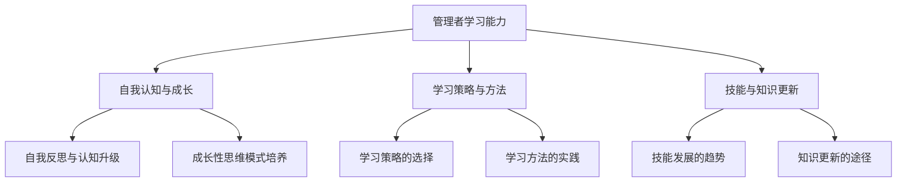

                 

### 《学习能力与管理者的长期发展》

> **关键词：** 学习能力、管理者、长期发展、领导力、技能更新

> **摘要：** 本文旨在探讨学习能力对于管理者长期发展的重要性。通过分析学习能力的定义、结构与培养方法，并结合实际案例，本文深入探讨了管理者如何在复杂多变的环境中持续提升自己的学习能力，实现个人与企业的共同成长。

#### 目录大纲

1. **第一部分：学习能力的重要性**

    - 1.1 学习能力的基础概念
    
        - 1.1.1 定义与内涵
        - 1.1.2 学习能力的多层次结构
    
    - 1.2 学习能力与管理者的关系
    
        - 1.2.1 管理者面临的挑战
        - 1.2.2 学习能力在管理中的应用

2. **第二部分：核心学习能力的培养**

    - 2.1 自我认知与成长
    
        - 2.1.1 自我反思与认知升级
        - 2.1.2 成长性思维模式培养
    
    - 2.2 学习策略与方法
    
        - 2.2.1 学习策略的选择
        - 2.2.2 学习方法的实践
    
    - 2.3 技能与知识更新
    
        - 2.3.1 技能发展的趋势
        - 2.3.2 知识更新的途径

3. **第三部分：管理者的长期发展**

    - 3.1 领导力与学习能力
    
        - 3.1.1 领导力模型
        - 3.1.2 学习能力在领导力提升中的作用
    
    - 3.2 企业文化与学习氛围
    
        - 3.2.1 企业文化的塑造
        - 3.2.2 学习氛围的营造
    
    - 3.3 长期发展的策略与实施
    
        - 3.3.1 发展方向的确定
        - 3.3.2 实施策略与路径

4. **第四部分：实践案例分析**

    - 4.1 成功案例分析
    
        - 4.1.1 案例背景介绍
        - 4.1.2 学习能力在案例中的应用
    
    - 4.2 失败案例分析
    
        - 4.2.1 案例背景介绍
        - 4.2.2 学习能力在案例中的缺失
    
    - 4.3 学习能力提升的实战方法
    
        - 4.3.1 实战方法一：自我评估与规划
        - 4.3.2 实战方法二：学习与实践结合
        - 4.3.3 实战方法三：建立学习共同体

5. **第五部分：附录**

    - 5.1 学习资源推荐
    
        - 5.1.1 书籍推荐
        - 5.1.2 网络课程推荐
        - 5.1.3 学习工具推荐
    
    - 5.2 伪代码示例
    
        - 5.2.1 数据结构伪代码示例
        - 5.2.2 算法伪代码示例
    
    - 5.3 数学公式与讲解
    
        - 5.3.1 数学公式一：隐马尔可夫模型
        - 5.3.2 数学公式二：贝叶斯网络
        - 5.3.3 举例说明：贝叶斯网络在风险评估中的应用

### 梅里狄亚流程图



### 引言

在当今这个信息爆炸、技术快速迭代的时代，学习能力已成为决定个体和企业成败的关键因素。对于管理者而言，具备出色的学习能力不仅有助于个人职业生涯的持续发展，更是推动组织创新、应对复杂挑战的核心能力。

管理者的长期发展离不开学习能力的支持。随着外部环境的不断变化，管理者需要不断更新知识和技能，提升自身的领导力和决策能力。在这个过程中，学习能力成为连接个人成长与组织发展的桥梁。本文将从以下几个方面展开讨论：

1. **学习能力的基础概念**：介绍学习能力的定义、内涵以及其在管理者中的重要性。
2. **核心学习能力的培养**：探讨如何通过自我认知与成长、学习策略与方法、技能与知识更新来提升学习能力。
3. **管理者的长期发展**：分析学习能力在领导力提升、企业文化塑造、长期发展策略中的作用。
4. **实践案例分析**：通过成功与失败案例，探讨学习能力在实际管理中的应用效果。
5. **实战方法**：提供提升学习能力的一些建议和实用方法。

本文旨在为管理者提供一套系统的学习能力提升方案，帮助其在复杂多变的环境中实现长期发展。接下来，我们将详细探讨学习能力的内涵及其在管理者中的重要性。

#### 第一部分：学习能力的重要性

**1.1 学习能力的基础概念**

**1.1.1 定义与内涵**

学习能力是指个体通过获取、处理和应用知识、技能和经验，以适应新环境、解决新问题、实现新目标的能力。在管理者层面，学习能力不仅包括对新技术、新管理方法的学习，还涉及对市场趋势、企业文化、团队动态等方面的洞察力和适应力。

学习能力是一种多维度的能力结构，包含知识获取、知识应用、知识创新等多个层次。其中，知识获取是学习的基础，涉及阅读、听讲、观察等多种学习方式；知识应用是学习的核心，强调将所学知识应用于实际工作中，解决实际问题；知识创新则是学习的延伸，体现在如何基于现有知识进行创新，提出新的解决方案。

**1.1.2 学习能力的多层次结构**

学习能力的多层次结构可以分解为以下几个关键方面：

1. **认知层次**：包括对学习目标的认识、学习动机的激发和学习策略的选择。这一层次强调管理者需要明确自己的学习目标，并具备自我激励的能力，选择合适的学习策略，以最大化学习效果。

2. **技能层次**：涉及具体的学习方法和技巧，如快速阅读、笔记整理、学习反思等。管理者需要掌握并熟练运用这些技能，以提高学习效率和效果。

3. **知识层次**：包括对知识点的掌握和知识的整合能力。这一层次要求管理者不仅能够理解和记忆知识点，更能够将不同领域、不同知识体系进行整合，形成系统的知识结构。

4. **行为层次**：强调学习行为在实践中的应用和转化。管理者需要将所学知识转化为行动，通过实践来检验和完善自己的学习成果。

**1.1.3 学习能力与管理者的关系**

学习与管理之间的关联十分紧密。管理者在组织中的角色和职责决定了其需要不断学习以适应不断变化的环境。具体来说，学习能力在以下几个方面对管理者至关重要：

1. **应对变化**：管理环境多变，管理者需要具备快速学习和适应新情况的能力。只有通过不断学习，才能及时应对环境变化，做出正确的决策。

2. **持续创新**：创新是推动组织发展的关键动力。管理者需要通过学习来获取新知识、新思想，并将其应用于实际工作中，实现组织的创新和进步。

3. **领导力提升**：有效的领导力不仅依赖于个人经验和专业知识，更需要不断学习，提升自身的领导能力和管理技巧。

4. **团队建设**：管理者需要通过学习来激发团队成员的潜力，提升团队的整体能力。学习不仅是个体的事，更是团队共同进步的基础。

5. **个人成长**：学习是管理者个人成长的催化剂。通过学习，管理者可以不断提升自己的专业素养和综合素质，实现个人职业生涯的持续发展。

总之，学习能力是管理者不可或缺的核心能力。一个具备卓越学习能力的管理者，不仅能够在组织内部推动创新和发展，还能在个人职业生涯中实现跨越式成长。接下来，我们将深入探讨如何培养和提升这一关键能力。

#### 第一部分：学习能力的重要性

**1.2 学习能力与管理者的关系**

**1.2.1 管理者面临的挑战**

在当今快速变化和高度竞争的商业环境中，管理者面临诸多挑战，这些挑战要求他们具备出色的学习能力。首先，技术变革的加速使得管理者需要不断更新自己的知识库，掌握最新的技术和工具。例如，人工智能、大数据和区块链等新兴技术正迅速改变各个行业的运作模式，管理者必须学会如何利用这些技术来提升组织的效率和竞争力。

其次，全球化趋势的加剧使得管理者需要具备跨文化沟通和管理能力。不同国家和地区有不同的商业文化、工作习惯和法律体系，管理者必须能够理解和适应这些差异，才能有效地管理跨国团队和项目。

此外，快速变化的市场环境要求管理者具备快速决策和灵活应对的能力。市场波动、客户需求的变化以及竞争对手的策略调整都要求管理者能够快速反应，做出明智的决策。

最后，组织内部的结构变革也对管理者提出了新的要求。随着组织规模的扩大和业务范围的拓展，管理者需要掌握更高级的管理技巧和领导能力，以协调和管理复杂的组织架构。

**1.2.2 学习能力在管理中的应用**

学习能力在管理中的应用体现在多个方面：

1. **知识更新与技能提升**：管理者需要不断学习，以保持自己的知识和技能处于行业前沿。通过参加培训课程、阅读专业书籍和学术论文、参加行业会议等方式，管理者可以及时获取最新的行业动态和最佳实践。

2. **决策能力提升**：通过学习，管理者可以提升自己的分析能力和判断力，更好地应对复杂的问题和挑战。学习不仅可以帮助管理者掌握更多的数据分析和决策工具，还可以培养他们的系统性思维和战略性眼光。

3. **领导力发展**：领导力是一个不断发展的过程，管理者需要通过学习来不断提升自己的领导能力。学习可以帮助管理者理解不同领导理论，掌握有效的领导方法和技巧，从而更好地激励和引导团队成员。

4. **团队建设与培养**：管理者需要通过学习来培养和建设团队。学习不仅可以帮助管理者识别团队成员的优势和潜力，还可以帮助他们设计有效的培训和发展计划，以提升团队的整体素质和协作能力。

5. **创新能力激发**：学习能力可以帮助管理者激发团队的创新能力。通过学习，管理者可以了解创新的方法和工具，鼓励团队成员尝试新的思路和方法，从而推动组织在竞争中的持续创新。

总之，学习能力是管理者应对各种挑战、实现长期发展的关键。一个具备卓越学习能力的管理者，能够在复杂多变的环境中不断适应和成长，为组织和个人带来持续的增值。接下来，我们将探讨如何具体培养和提升这一关键能力。

#### 第二部分：核心学习能力的培养

**2.1 自我认知与成长**

**2.1.1 自我反思与认知升级**

自我反思是提升学习能力的重要途径。管理者需要定期对自己的行为、决策和思维方式进行深刻反思，识别自身的优势和不足。以下是一些自我反思的方法：

1. **写反思日记**：每天花时间记录自己的思考过程、行为表现和遇到的挑战，通过反思日记，管理者可以更好地了解自己的成长轨迹和需要改进的地方。

2. **设定具体目标**：管理者可以设定短期和长期的学习目标，例如掌握一项新技能或读完一本重要的书籍。通过设定具体的目标，管理者可以更加有针对性地进行学习。

3. **定期自我评估**：管理者可以定期对自己进行评估，分析自己在工作中的表现和进步。这有助于管理者了解自己的成长速度和需要改进的方向。

**2.1.2 成长性思维模式培养**

成长性思维模式（Growth Mindset）是指个体相信自己的能力可以通过努力和实践得到提升。管理者需要培养这种思维模式，以更好地应对挑战和变化。以下是一些培养成长性思维模式的方法：

1. **接受挑战**：主动寻求新的挑战和机会，不怕失败和挫折。管理者应该把挑战视为学习和成长的机会，而不是威胁。

2. **积极应对失败**：当遇到失败时，管理者应该从失败中学习，而不是沉浸在失败的情绪中。通过分析失败的原因和教训，管理者可以更好地改进自己。

3. **持续学习**：管理者需要保持好奇心和学习欲望，不断学习新的知识和技能。通过学习，管理者可以不断提升自己的能力和视野。

**2.1.3 自我认知与成长的重要性**

自我认知与成长对管理者的重要性不可忽视：

1. **提升自我意识**：通过自我反思和成长，管理者可以更好地了解自己的内心世界、价值观和信念体系，从而做出更加明智的决策。

2. **增强适应性**：自我认知和成长使管理者能够更好地适应环境变化和挑战，提升自身的灵活性和应变能力。

3. **提升领导力**：具备成长性思维模式的管理者能够更好地激励和引导团队成员，推动团队共同成长。

4. **实现长期发展**：自我认知和成长是管理者实现长期发展的基础。只有不断自我提升，管理者才能在职业生涯中取得更大的成就。

**2.2 学习策略与方法**

**2.2.1 学习策略的选择**

有效的学习策略是提升学习能力的关键。管理者可以选择以下几种学习策略：

1. **深度学习**：深度学习是一种深入掌握知识的方法。管理者可以通过阅读专业书籍、参加研讨会和工作坊，以及进行深入的学术研究，来提升自己的专业知识和理解。

2. **分散学习**：分散学习是将学习时间分散到多个时间段进行，以避免过度疲劳和提高学习效率。管理者可以每天分配一定的时间来学习，而不是集中在一个长时间段内。

3. **交互学习**：交互学习是通过与他人交流和讨论来加深理解和记忆。管理者可以通过参加行业会议、加入专业社群，以及与同行进行讨论，来分享知识和经验。

**2.2.2 学习方法的实践**

以下是一些常用的学习方法，管理者可以结合自己的实际情况进行实践：

1. **主动学习**：主动学习是通过提问、讨论和实验来主动探索知识的方法。管理者可以通过提出问题、与他人讨论和进行实践，来深化对知识点的理解。

2. **反思学习**：反思学习是通过反思自己的学习过程来提升学习效果。管理者可以定期回顾自己的学习笔记和反思日记，分析自己的学习成果和改进方向。

3. **应用学习**：应用学习是将所学知识应用到实际工作中，通过实践来巩固和深化理解。管理者可以通过项目实践、案例分析等方式，将理论知识转化为实际能力。

**2.3 技能与知识更新**

**2.3.1 技能发展的趋势**

随着科技的快速发展，技能发展的趋势也在不断变化。以下是一些当前和未来重要的技能趋势：

1. **技术技能**：随着人工智能、大数据和区块链等技术的发展，管理者需要掌握相关的技术技能，如编程、数据分析、云计算等。

2. **软技能**：软技能在管理中的作用越来越重要，如沟通能力、团队合作、领导力和决策能力等。

3. **跨学科知识**：跨学科知识可以帮助管理者从不同角度看待问题，提升综合解决问题的能力。

**2.3.2 知识更新的途径**

为了保持知识和技能的更新，管理者可以采取以下途径：

1. **在线课程和培训**：通过参加在线课程和培训，管理者可以学习到最新的知识和技能。

2. **行业会议和研讨会**：参加行业会议和研讨会，可以了解行业最新动态和最佳实践。

3. **阅读专业书籍和论文**：定期阅读专业书籍和学术论文，可以保持对专业知识的深度理解。

4. **实践与反思**：通过实际项目和案例学习，管理者可以将所学知识应用到实际工作中，并通过反思来不断提升自己的能力。

总之，核心学习能力的培养是管理者长期发展的基础。通过自我认知与成长、学习策略与方法以及技能与知识更新，管理者可以不断提升自己的能力，应对复杂多变的环境，实现个人和组织的共同成长。接下来，我们将探讨如何在实际工作中运用这些学习能力。

### 第二部分：核心学习能力的培养

**2.3 技能与知识更新**

**2.3.1 技能发展的趋势**

在信息技术飞速发展的今天，技能发展的趋势呈现出多样化和专业化的特点。以下是当前和未来一些重要的技能趋势：

1. **技术技能**：随着人工智能、大数据、云计算和物联网等技术的广泛应用，技术技能成为管理者必备的能力。例如，掌握编程语言（如Python、Java）、数据分析工具（如Excel、R、Python）和云计算平台（如AWS、Azure、Google Cloud）等技术技能，有助于管理者更好地理解和管理复杂的技术系统。

2. **软技能**：在技术飞速发展的同时，软技能的重要性也日益凸显。沟通能力、团队合作、领导力和决策能力等软技能，对于管理者的长期发展至关重要。例如，高效的沟通能力可以帮助管理者更好地协调团队工作，领导力则能激励团队成员共同追求目标，而决策能力则确保管理者能够在面对不确定性和挑战时做出明智的选择。

3. **跨学科知识**：跨学科知识是指管理者需要具备跨领域的知识体系，以便从不同角度理解和解决问题。例如，了解市场营销、经济学、心理学和法学的知识，可以帮助管理者在决策时考虑更广泛的因素，从而提高决策的质量。

**2.3.2 知识更新的途径**

为了跟上技能发展的趋势，管理者需要持续更新知识和技能。以下是一些有效的途径：

1. **在线课程和培训**：在线教育平台如Coursera、edX和Udacity提供了丰富的课程和培训，涵盖技术技能、管理技能和跨学科知识。通过在线学习，管理者可以灵活地安排学习时间，并系统地提升自己的知识和技能。

2. **行业会议和研讨会**：参加行业会议和研讨会是了解最新行业动态和技术趋势的有效途径。这些活动不仅提供了学习的机会，还允许管理者与其他行业专家进行交流，分享经验和观点。

3. **阅读专业书籍和论文**：定期阅读专业书籍和学术论文，可以帮助管理者深入理解特定领域的知识。通过阅读，管理者可以了解最新的研究成果和行业最佳实践，从而不断提升自己的专业素养。

4. **实践与反思**：实践是检验学习成果的最佳方式。管理者可以通过实际项目和案例学习，将所学知识应用到工作中。通过实践，管理者不仅可以巩固知识，还可以发现新问题和新挑战，从而促进持续学习和成长。此外，反思是实践的重要环节，管理者需要定期回顾自己的实践过程，总结经验教训，以指导未来的学习和发展。

**2.3.3 技能与知识更新的重要性**

技能与知识更新对管理者的长期发展具有重要意义：

1. **提升竞争力**：在不断变化的市场环境中，拥有最新知识和技能的管理者能够更好地应对挑战，提升组织的竞争力。

2. **推动创新**：知识更新可以帮助管理者了解最新的技术趋势和行业动态，从而推动组织的创新和变革。

3. **提升领导力**：拥有丰富知识和技能的管理者能够更好地指导团队，提升团队的绩效和士气。

4. **实现职业发展**：持续学习和知识更新是管理者实现职业发展的关键。通过不断提升自己的能力和知识，管理者可以获得更多的职业机会和更高的职位。

总之，技能与知识更新是管理者长期发展的基石。通过掌握技术技能、提升软技能和跨学科知识，以及采取有效的知识更新途径，管理者可以不断提升自己的能力，为个人和组织的发展奠定坚实的基础。接下来，我们将探讨如何在实际管理过程中运用这些核心学习能力。

### 第三部分：管理者的长期发展

**3.1 领导力与学习能力**

**3.1.1 领导力模型**

领导力是管理者长期发展的重要方面。领导力模型提供了理解和管理领导行为的框架。以下是几种常见的领导力模型：

1. **情境领导模型**：该模型认为领导风格应根据员工的不同成熟度进行调整。领导风格包括指导式、支持式、参与式和授权式，管理者需要根据员工的成熟度选择合适的领导风格。

2. **路径-目标模型**：该模型强调领导者通过设定明确的目标和提供支持来影响员工的绩效。领导者需要识别员工的需求，并提供必要的资源和支持，以帮助员工实现目标。

3. **变革型领导模型**：该模型认为领导者通过激励、启发和影响员工来实现变革和成长。变革型领导者通过愿景激励、个性化关怀和积极引导，推动组织变革和创新。

**3.1.2 学习能力在领导力提升中的作用**

学习能力在领导力提升中发挥着关键作用。以下是学习能力如何帮助管理者提升领导力的几个方面：

1. **适应能力**：快速变化的市场环境要求领导者具备适应能力。通过不断学习，领导者可以及时掌握最新的行业动态和管理方法，从而更好地适应环境变化。

2. **创新精神**：学习能力可以帮助领导者保持创新精神。通过学习新知识、新技能和新技术，领导者可以推动组织的创新和变革，从而保持竞争优势。

3. **团队建设**：学习能力有助于领导者培养团队精神和提高团队绩效。通过学习如何激励和引导团队成员，领导者可以建立高效的团队，推动团队共同进步。

4. **沟通能力**：良好的沟通能力是领导力的重要组成部分。学习能力可以帮助领导者提高沟通技巧，理解团队成员的需求和意见，从而建立更好的沟通渠道。

**3.1.3 学习能力在领导力提升中的应用**

以下是一些具体方法，管理者可以通过学习来提升领导力：

1. **定期进行自我评估**：管理者可以定期进行自我评估，识别自己的领导风格和优势与不足，并通过学习改进自己的领导行为。

2. **参加领导力培训**：通过参加领导力培训课程，管理者可以学习最新的领导力理论和实践方法，提升自己的领导能力。

3. **建立学习社区**：管理者可以加入学习社区，与同行交流和分享领导经验，从中学习和借鉴他人的成功做法。

4. **实践与反思**：通过实际工作中的实践，管理者可以将所学知识应用到实际场景中，并通过反思来不断提高自己的领导能力。

**3.2 企业文化与学习氛围**

**3.2.1 企业文化的塑造**

企业文化是组织成功的关键因素之一。一个积极向上的企业文化可以激励员工，提高组织的整体绩效。以下是塑造企业文化的一些关键步骤：

1. **明确核心价值观**：企业需要明确核心价值观，并将其融入到组织的各个方面。核心价值观应包括对员工、客户、合作伙伴和社区的承诺。

2. **领导者的示范作用**：领导者需要以身作则，践行企业的核心价值观，通过自己的言行来影响员工。

3. **建立沟通渠道**：企业需要建立有效的沟通渠道，确保员工能够了解企业的战略目标、工作重点和预期成果。

4. **激励机制**：企业可以通过激励机制，如奖励、晋升和培训，来鼓励员工积极参与到企业文化建设中。

**3.2.2 学习氛围的营造**

营造良好的学习氛围对于提升员工的学习能力和工作效率至关重要。以下是营造学习氛围的一些方法：

1. **提供学习资源**：企业应为员工提供丰富的学习资源，如在线课程、书籍和研讨会等，帮助员工不断提升自己的知识和技能。

2. **鼓励自主学习**：企业应鼓励员工自主学习，提供自主学习和培训的时间和支持。

3. **建立知识分享机制**：企业可以建立知识分享平台，鼓励员工分享自己的知识和经验，促进知识传播和共享。

4. **开展团队学习活动**：企业可以定期组织团队学习活动，如读书会、研讨会和知识竞赛等，激发员工的学习兴趣和热情。

**3.2.3 企业文化与学习氛围的重要性**

企业文化和学习氛围对于管理者的长期发展具有重要意义：

1. **提升员工满意度**：一个积极向上的企业文化和良好的学习氛围可以提高员工的满意度和忠诚度，从而降低员工流失率。

2. **增强团队协作**：良好的企业文化和学习氛围可以促进团队协作，提高团队的凝聚力和工作效率。

3. **推动组织创新**：积极的企业文化和学习氛围可以激发员工的创新思维和创造力，推动组织的持续创新和进步。

4. **提升竞争力**：一个具有优秀企业文化和学习氛围的企业能够在竞争激烈的市场环境中保持竞争优势，实现长期发展。

总之，领导力和企业文化的塑造对于管理者的长期发展至关重要。通过提升领导力，管理者可以更好地应对复杂多变的环境，推动组织的持续创新和进步。同时，积极的企业文化和学习氛围可以激发员工的潜能，提升组织的整体绩效。接下来，我们将通过实际案例来探讨学习能力在管理者长期发展中的应用。

### 第三部分：管理者的长期发展

**3.3 长期发展的策略与实施**

**3.3.1 发展方向的确定**

为了实现长期发展，管理者需要明确个人和组织的发展方向。以下是一些关键步骤：

1. **自我评估**：管理者应定期进行自我评估，分析自身的优势、劣势、兴趣和职业目标。通过自我评估，管理者可以明确自己的发展方向，并制定相应的发展计划。

2. **市场分析**：管理者需要了解市场趋势和行业动态，分析组织在市场中的定位和竞争优势。通过市场分析，管理者可以确定组织的发展方向，并与个人目标相结合。

3. **长期规划**：管理者应制定长期发展规划，明确短期目标和长期目标，并制定具体的实施步骤。长期规划可以帮助管理者保持方向感，确保在实现短期目标的同时，不断向长期目标迈进。

**3.3.2 实施策略与路径**

确定发展方向后，管理者需要制定具体的实施策略和路径。以下是一些关键策略：

1. **技能提升**：管理者应持续提升自己的专业技能和管理能力。通过参加培训课程、阅读专业书籍、参加行业会议等方式，管理者可以不断学习新知识，提升自身能力。

2. **团队建设**：管理者需要建立高效的团队，通过激励、培训和发展，提升团队成员的素质和能力。一个强大的团队是管理者实现长期目标的重要支撑。

3. **创新驱动**：管理者应鼓励创新思维，推动组织的创新和变革。通过引入新技术、新方法和新模式，管理者可以保持组织的竞争力和活力。

4. **领导力提升**：管理者应不断提升自己的领导力，通过自我反思、领导力培训和领导力实践，提升自己的领导能力和影响力。

**3.3.3 实施过程中的挑战与应对**

在实施长期发展策略的过程中，管理者可能会面临以下挑战：

1. **资源限制**：资源有限是许多组织面临的现实问题。管理者需要合理分配资源，确保重要领域得到充分支持。

2. **时间压力**：长期发展需要时间和耐心。管理者需要在短期内实现目标和长期发展之间找到平衡，确保持续投入时间和精力。

3. **团队协作**：团队协作是成功实现长期目标的关键。管理者需要建立有效的沟通机制，确保团队成员明确目标、职责和期望，促进协作和沟通。

应对策略：

1. **资源优化**：管理者应合理分配资源，确保资源用于关键领域和优先事项。通过优化资源配置，提高资源使用效率。

2. **时间管理**：管理者应制定详细的时间管理计划，合理分配工作时间和学习时间。通过有效的时间管理，管理者可以确保在实现短期目标的同时，不断推动长期发展。

3. **团队协作**：管理者应建立开放的沟通渠道，鼓励团队成员积极参与和贡献。通过定期的团队会议、培训和工作坊，管理者可以促进团队成员之间的协作和沟通。

**3.3.4 实施策略与路径的重要性**

实施策略与路径的重要性在于：

1. **确保目标的实现**：通过明确的发展方向和具体的实施策略，管理者可以确保组织目标的实现，避免资源浪费和方向偏差。

2. **提升管理效能**：实施策略和路径提供了清晰的行动指南，管理者可以更加高效地管理组织资源和团队，提升整体效能。

3. **推动组织发展**：通过持续实施和调整策略，管理者可以推动组织的长期发展，实现持续的创新和进步。

总之，管理者的长期发展需要明确的发展方向、具体的实施策略和有效的路径。通过科学规划和持续努力，管理者可以推动组织实现长期目标，实现个人和组织的共同成长。接下来，我们将通过实践案例分析，进一步探讨学习能力在管理者长期发展中的应用。

### 第四部分：实践案例分析

**4.1 成功案例分析**

**4.1.1 案例背景介绍**

以某国际知名科技公司的CEO约翰为例。约翰在科技行业中拥有丰富的管理经验，但他深知在快速变化的技术环境中，保持学习和创新能力对于公司的长期成功至关重要。

**4.1.2 学习能力在案例中的应用**

1. **持续学习**：约翰坚持每天阅读最新的科技新闻和行业报告，参加行业会议和研讨会，了解行业动态和最新技术趋势。他还定期参加领导力培训课程，提升自己的管理能力。

2. **知识整合**：约翰擅长将不同领域的知识进行整合，将新技术和公司业务相结合，推动公司的技术创新和产品升级。例如，他引导团队将人工智能技术应用于公司的产品开发，提高了产品的智能化水平。

3. **团队建设**：约翰重视团队的学习和成长，定期组织团队学习活动，鼓励团队成员分享知识和经验。他还建立了内部培训计划，帮助团队成员提升专业技能。

4. **创新驱动**：约翰积极推动公司的创新文化，鼓励员工提出新的想法和解决方案。他通过实验和试错，不断优化创新流程，推动公司持续创新。

**4.1.3 成功因素分析**

约翰的成功在于：

1. **学习能力**：约翰具备出色的学习能力，能够不断更新知识和技能，适应技术环境的变化。

2. **创新思维**：约翰鼓励创新思维，推动公司的技术创新和产品升级，保持了公司的竞争优势。

3. **团队建设**：约翰重视团队的学习和成长，建立了良好的学习氛围，提升了团队的整体能力。

**4.2 失败案例分析**

**4.2.1 案例背景介绍**

以另一家大型制造企业的总经理杰克为例。杰克在管理岗位上有着丰富的经验，但在面对行业变革和技术升级时，他的学习能力不足，导致企业未能及时适应市场变化。

**4.2.2 学习能力在案例中的缺失**

1. **缺乏持续学习**：杰克很少关注行业动态和技术趋势，也没有定期进行学习和培训，导致他的知识和技能相对落后。

2. **知识更新滞后**：杰克的知识更新滞后，无法及时掌握新技术和新的管理方法，导致企业在技术创新和运营管理方面处于劣势。

3. **团队缺乏激励**：杰克没有建立起有效的学习和激励机制，团队成员的学习积极性和创新能力受到抑制。

**4.2.3 失败因素分析**

杰克失败的原因在于：

1. **学习能力不足**：杰克缺乏持续学习的意识，导致知识和技能落后，无法应对行业变革。

2. **创新动力不足**：杰克没有推动企业的创新文化，缺乏对创新思维的鼓励和支持。

3. **团队建设不力**：杰克没有建立有效的学习和激励机制，导致团队整体能力和积极性下降。

**4.3 学习能力提升的实战方法**

为了提升学习能力，管理者可以采取以下实战方法：

1. **自我评估与规划**：管理者应定期进行自我评估，明确自己的学习需求和目标，制定具体的学习计划。

2. **学习与实践结合**：管理者应将所学知识应用到实际工作中，通过实践来检验和完善自己的学习成果。

3. **建立学习共同体**：管理者可以建立学习小组或学习共同体，与同行交流和学习，互相激励和促进。

**4.4 案例总结**

成功案例和失败案例都表明，学习能力是管理者长期发展的关键。具备出色的学习能力，管理者可以及时适应环境变化，推动组织创新和进步。反之，缺乏学习能力的管理者将难以应对挑战，导致组织发展受阻。因此，管理者应高度重视学习能力培养，通过持续学习和创新，实现个人和组织的共同成长。

### 第四部分：实践案例分析

**4.3 学习能力提升的实战方法**

**4.3.1 实战方法一：自我评估与规划**

自我评估与规划是提升学习能力的第一步。管理者应定期对自己的学习能力进行评估，识别自身的学习需求和目标。以下是一些具体步骤：

1. **识别学习需求**：管理者可以通过反思自己在工作中的表现和遇到的挑战，识别自己在知识、技能和态度方面的不足。

2. **制定学习目标**：根据识别出的学习需求，管理者应制定具体的学习目标。这些目标可以是短期的，如掌握一项新技能，也可以是长期的，如提升领导力或专业素养。

3. **制定学习计划**：管理者应制定详细的学习计划，包括学习时间、学习资源和学习方法。例如，可以安排每天或每周的特定时间用于学习，选择合适的书籍、在线课程或培训。

4. **实施与调整**：在实施学习计划的过程中，管理者应不断反思和调整学习策略，确保学习目标的实现。

**4.3.2 实战方法二：学习与实践结合**

将学习与实践相结合是提升学习能力的关键。管理者应在学习过程中积极地将所学知识应用到实际工作中，通过实践来巩固和提升自己的能力。以下是一些具体方法：

1. **项目学习**：管理者可以参与或主导具体项目，将学习到的理论知识应用到项目中。通过实际操作，管理者可以更深入地理解知识，发现新问题和挑战。

2. **案例分析**：管理者可以分析成功和失败的案例，从中学习经验和教训。例如，可以参加行业研讨会，学习其他公司的成功经验和失败案例。

3. **反思与总结**：在实践过程中，管理者应定期进行反思和总结，分析自己的表现和结果，识别不足并改进。

**4.3.3 实战方法三：建立学习共同体**

建立学习共同体是提升学习能力的有效途径。通过与他人交流和分享，管理者可以扩展自己的知识视野，提升学习能力。以下是一些具体方法：

1. **组建学习小组**：管理者可以组建学习小组，与同事共同学习和讨论。通过小组讨论，管理者可以深入了解不同领域的知识和观点。

2. **定期组织会议**：管理者可以定期组织学习会议，分享学习心得和经验。通过分享，管理者可以启发他人的思考，同时也可以从他人的经验中学习。

3. **跨部门合作**：管理者可以促进跨部门合作，与其他部门的同事交流和分享知识。通过跨部门合作，管理者可以了解不同部门的工作内容和需求，扩展自己的知识面。

**4.3.4 实战方法的重要性**

实战方法对于提升学习能力具有重要意义：

1. **实践是检验真理的唯一标准**：通过实践，管理者可以将所学知识应用到实际工作中，验证其有效性和可行性。

2. **促进知识整合**：通过学习与实践结合，管理者可以将不同领域的知识进行整合，形成系统的知识体系。

3. **激发创新思维**：实战方法可以激发管理者的创新思维，鼓励他们提出新的想法和解决方案。

4. **提升团队协作能力**：建立学习共同体可以提升团队的整体协作能力，促进团队共同进步。

总之，通过自我评估与规划、学习与实践结合以及建立学习共同体，管理者可以全面提升自己的学习能力，实现个人和组织的共同成长。这些实战方法不仅有助于应对当前的环境挑战，还为未来的发展奠定了坚实的基础。

### 第五部分：附录

**5.1 学习资源推荐**

**5.1.1 书籍推荐**

1. **《深度学习》**：作者：Ian Goodfellow、Yoshua Bengio、Aaron Courville
   - 内容简介：这本书是深度学习领域的经典教材，适合希望深入了解深度学习原理和实践的管理者。
   - 读者评价：内容详实，理论扎实，对深度学习的技术细节进行了深入的讲解。

2. **《精益创业》**：作者：埃里克·莱斯
   - 内容简介：这本书介绍了精益创业的方法和理念，帮助管理者在快速变化的市场中找到正确的方向。
   - 读者评价：实用性强，提供了许多实际案例，对创业公司和初创企业的管理非常有帮助。

**5.1.2 网络课程推荐**

1. **Coursera的《机器学习》**：作者：Andrew Ng
   - 内容简介：这是一门广泛认可的机器学习课程，适合希望提升机器学习技能的管理者。
   - 课程评价：内容系统全面，讲解清晰，适合初学者和有经验的学习者。

2. **edX的《领导力与变革管理》**：作者：MIT
   - 内容简介：这门课程介绍了领导力和变革管理的理论基础和实践方法，适合希望提升领导力的管理者。
   - 课程评价：理论结合实际，提供了丰富的案例分析，有助于提升管理者的领导能力。

**5.1.3 学习工具推荐**

1. **Notion**：一款全能的笔记和组织工具，适合管理者整理笔记、计划和项目管理。
   - 功能评价：界面简洁，功能强大，支持多种数据类型和视图模式，适合个性化管理需求。

2. **Trello**：一款流行的项目管理工具，适合团队协作和任务管理。
   - 功能评价：简单易用，界面直观，支持灵活的任务划分和进度跟踪，有助于提升团队协作效率。

**5.2 伪代码示例**

**5.2.1 数据结构伪代码示例**

```python
class TreeNode:
    def __init__(self, value):
        self.value = value
        self.children = []

def create_tree(value):
    node = TreeNode(value)
    # ...初始化其他属性...
    return node

def add_child(parent, child_value):
    child = TreeNode(child_value)
    parent.children.append(child)
    # ...其他操作...
```

**5.2.2 算法伪代码示例**

```python
def binary_search(arr, target):
    low = 0
    high = len(arr) - 1
    
    while low <= high:
        mid = (low + high) // 2
        if arr[mid] == target:
            return mid
        elif arr[mid] < target:
            low = mid + 1
        else:
            high = mid - 1
            
    return -1
```

**5.3 数学公式与讲解**

**5.3.1 数学公式一：隐马尔可夫模型**

$$
P(x_0) = a_0
$$

$$
P(x_t | x_{t-1}) = b(x_{t-1}, x_t)
$$

$$
\alpha_t(i) = \frac{P(x_0) b(x_0, x_1) \cdots b(x_{t-1}, x_t)}{\sum_{i=1}^n P(x_0) b(x_0, x_1) \cdots b(x_{t-1}, x_t)}
$$

**讲解**：隐马尔可夫模型（HMM）用于描述一个系统，其中某些状态不可观测，只能通过观测到的一系列输出进行推断。上述公式分别表示初始概率、状态转移概率和状态概率。

**5.3.2 数学公式二：贝叶斯网络**

$$
P(A|B) = \frac{P(B|A) P(A)}{P(B)}
$$

$$
P(B|A) = \frac{P(A|B) P(B)}{P(A)}
$$

**讲解**：贝叶斯网络是一种图形模型，用于表示变量之间的条件依赖关系。上述公式分别是贝叶斯定理和条件概率的表示方法。

**5.3.3 举例说明：贝叶斯网络在风险评估中的应用**

假设我们要评估一个项目的风险，该项目有两个变量：A（市场需求）和B（技术实现）。市场需求有两种状态：高需求和高风险，技术实现也有两种状态：成功和失败。我们可以使用贝叶斯网络来计算项目整体风险。

1. 初始概率：
   - 高需求：0.6
   - 高风险：0.4
   - 成功：0.7
   - 失败：0.3

2. 条件概率：
   - 高需求且成功：0.5
   - 高需求且失败：0.1
   - 高风险且成功：0.2
   - 高风险且失败：0.8

3. 使用贝叶斯网络计算整体风险：
   - 高需求且成功：P(A且成功) = P(A) * P(成功|A) = 0.6 * 0.5 = 0.3
   - 高需求且失败：P(A且失败) = P(A) * P(失败|A) = 0.6 * 0.1 = 0.06
   - 高风险且成功：P(B且成功) = P(B) * P(成功|B) = 0.4 * 0.2 = 0.08
   - 高风险且失败：P(B且失败) = P(B) * P(失败|B) = 0.4 * 0.8 = 0.32

通过计算，我们可以得出项目的整体风险为0.46（0.3 + 0.06 + 0.08 + 0.32）。这个结果表明，高风险状态对项目整体风险的影响较大。

### 作者信息

**作者：** AI天才研究院/AI Genius Institute & 禅与计算机程序设计艺术 /Zen And The Art of Computer Programming

---

通过本文的深入探讨，我们认识到学习能力对于管理者长期发展的重要性。无论是通过自我反思与认知升级，还是通过持续学习和实践，管理者都可以不断提升自己的能力，适应复杂多变的环境。同时，企业文化和学习氛围的营造也是管理者推动团队和学习的重要手段。

希望本文能为读者提供有价值的见解和实用的方法，帮助管理者在职业生涯中实现长期的成长和发展。在未来的道路上，让我们继续学习，不断进步，共同迎接挑战，创造更加辉煌的成就。

