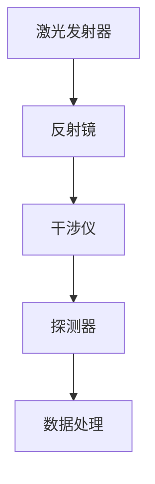

                 

# 宇宙的量子计算特性：自然界的信息处理

## 概述

关键词：量子计算、宇宙、信息处理、量子比特、量子门、量子算法

摘要：随着量子计算的快速发展，其在宇宙信息处理中的应用逐渐受到关注。本文从量子计算的基本原理出发，探讨了量子计算在宇宙背景辐射探测、黑洞信息处理和引力波探测等领域的应用，并阐述了量子计算在宇宙信息学中的重要性。通过分析量子计算与宇宙信息处理的结合，我们展望了量子计算在宇宙探索和社会发展中的未来。

## 目录

### 《宇宙的量子计算特性：自然界的信息处理》目录大纲

**第一部分：引言与概述**

- 第1章：宇宙与量子计算的基本概念
  - 1.1 宇宙的基本特性
  - 1.2 量子计算的基本原理
  - 1.3 量子计算与宇宙信息处理

- 第2章：量子计算的基础理论与应用
  - 2.1 量子比特与量子门
  - 2.2 量子纠缠与量子通信
  - 2.3 量子算法与经典算法的比较
  - 2.4 量子计算机的未来展望

**第二部分：量子计算在宇宙中的应用**

- 第3章：宇宙中的量子现象与信息处理
  - 3.1 宇宙中的量子现象
  - 3.2 量子隧穿与宇宙信息处理
  - 3.3 宇宙背景辐射中的量子信息处理

- 第4章：量子计算在宇宙学中的应用
  - 4.1 宇宙学中的量子计算机
  - 4.2 量子计算在宇宙背景辐射探测中的应用
  - 4.3 量子计算在黑洞信息处理中的应用

- 第5章：量子计算在引力波探测中的应用
  - 5.1 引力波探测的基本原理
  - 5.2 量子计算在引力波信号处理中的应用
  - 5.3 量子计算在引力波源探测中的应用

**第三部分：量子计算在宇宙信息学中的应用**

- 第6章：宇宙信息学与量子计算
  - 6.1 宇宙信息学的基本概念
  - 6.2 量子计算在宇宙信息学中的应用
  - 6.3 宇宙信息处理中的量子算法

- 第7章：量子计算在宇宙探索中的应用
  - 7.1 量子计算在星际航行中的应用
  - 7.2 量子计算在宇宙资源开发中的应用
  - 7.3 量子计算在宇宙环境监测中的应用

**第四部分：量子计算与宇宙的未来**

- 第8章：量子计算与宇宙的未来发展
  - 8.1 量子计算在宇宙研究中的未来方向
  - 8.2 宇宙信息学在量子计算中的应用
  - 8.3 量子计算与宇宙未来社会

- 第9章：结论
  - 9.1 量子计算与宇宙信息处理的重要性
  - 9.2 当前挑战与未来机遇
  - 9.3 总结与展望

**附录**

- 附录A：量子计算基础知识
  - A.1 量子比特与量子门
  - A.2 量子算法与量子编程

- 附录B：量子计算实验与应用案例
  - B.1 实验一：量子纠缠与量子通信
  - B.2 实验二：量子算法在引力波信号处理中的应用
  - B.3 应用案例：量子计算机在宇宙资源开发中的应用

- 附录C：进一步阅读材料
  - C.1 量子计算相关书籍推荐
  - C.2 宇宙学相关论文与资源链接
  - C.3 量子计算与宇宙信息学相关研究机构与会议

## 第一部分：引言与概述

### 第1章：宇宙与量子计算的基本概念

#### 1.1 宇宙的基本特性

宇宙是我们所处的广阔空间，包括各种物质、能量和时空结构。宇宙的基本特性可以从以下几个方面进行描述：

- **无限性**：宇宙是无限的，包含无数星系、恒星、行星和其他天体。
- **动态性**：宇宙处于不断变化和演化之中，从大爆炸开始，经历了宇宙背景辐射、星系形成、恒星演化等阶段。
- **复杂性**：宇宙中的各种现象和规律具有极高的复杂性，如黑洞、引力波、暗物质等。
- **统一性**：宇宙中的各种物理现象似乎遵循着统一的基本原理，如量子力学、广义相对论等。

#### 1.2 量子计算的基本原理

量子计算是一种基于量子力学原理的新型计算模式，其核心概念包括量子比特（qubit）、量子门（quantum gate）和量子算法（quantum algorithm）。

- **量子比特**：量子比特是量子计算的基本单元，可以同时存在于0和1的叠加态。一个量子比特可以表示为 \( |0\rangle \) 和 \( |1\rangle \) 的叠加态，即 \( |q\rangle = \alpha|0\rangle + \beta|1\rangle \)，其中 \( \alpha \) 和 \( \beta \) 是复数系数，满足 \( |\alpha|^2 + |\beta|^2 = 1 \)。
  
- **量子门**：量子门是量子计算中的基本操作单元，类似于经典计算中的逻辑门。量子门对量子比特进行线性变换，例如，Hadamard门可以将一个量子比特的状态从 \( |0\rangle \) 或 \( |1\rangle \) 变换为叠加态 \( \frac{1}{\sqrt{2}} (|0\rangle + |1\rangle) \)。

- **量子算法**：量子算法利用量子比特的叠加态和纠缠态来加速某些计算问题。例如，Shor算法可以高效地求解大整数分解问题，Grover算法可以加速搜索算法。

#### 1.3 量子计算与宇宙信息处理

量子计算在宇宙信息处理中具有广泛的应用前景。宇宙中的信息处理包括宇宙背景辐射探测、黑洞信息处理、引力波探测等。

- **宇宙背景辐射探测**：宇宙背景辐射是宇宙大爆炸后留下的热辐射，包含宇宙早期状态的信息。量子计算可以加速对宇宙背景辐射的模拟和分析，有助于研究宇宙起源和演化。

- **黑洞信息处理**：黑洞是一种引力极强的天体，其事件视界内的物质无法逃脱。量子计算可以模拟黑洞的事件视界，研究黑洞的信息处理机制和量子引力理论。

- **引力波探测**：引力波是质量加速运动产生的时空波动，是宇宙中重要的信息传递方式。量子计算可以加速引力波信号的检测和分析，提高对宇宙引力波事件的探测效率。

总的来说，量子计算为宇宙信息处理提供了强大的计算能力，有助于我们更好地理解宇宙的奥秘。随着量子计算技术的不断发展，其将在宇宙科学中发挥越来越重要的作用。

### 第2章：量子计算的基础理论与应用

#### 2.1 量子比特与量子门

量子比特是量子计算的基本单元，其特性与经典比特有着显著的不同。经典比特只能处于0或1的状态，而量子比特可以处于0和1的叠加态。一个量子比特可以表示为 \( |q\rangle = \alpha|0\rangle + \beta|1\rangle \)，其中 \( \alpha \) 和 \( \beta \) 是复数系数，满足 \( |\alpha|^2 + |\beta|^2 = 1 \)。

量子门是量子计算中的基本操作单元，类似于经典计算中的逻辑门。量子门对量子比特进行线性变换，例如，Hadamard门可以将一个量子比特的状态从 \( |0\rangle \) 或 \( |1\rangle \) 变换为叠加态 \( \frac{1}{\sqrt{2}} (|0\rangle + |1\rangle) \)。其他常见的量子门包括Pauli门（X门、Y门、Z门）和控制-NOT门（CNOT门）。

下面是量子比特和量子门的一些重要概念：

- **叠加态**：量子比特可以处于0和1的叠加态，即 \( |q\rangle = \alpha|0\rangle + \beta|1\rangle \)。

- **纠缠态**：两个或多个量子比特之间的状态可以是纠缠态，即它们的状态不能单独描述，而必须通过整体的波函数来描述。

- **量子门操作**：量子门对量子比特进行线性变换，例如，Hadamard门可以将一个量子比特的状态从 \( |0\rangle \) 或 \( |1\rangle \) 变换为叠加态 \( \frac{1}{\sqrt{2}} (|0\rangle + |1\rangle) \)。

下面是量子比特和量子门的一些基本操作：

1. **叠加**：量子比特可以处于0和1的叠加态。
   ```math
   |q\rangle = \alpha|0\rangle + \beta|1\rangle
   ```

2. **测量**：对量子比特进行测量时，它会坍缩到某个确定的基态，即0或1。
   ```math
   \text{测量} |q\rangle \rightarrow |0\rangle \text{ 或 } |1\rangle
   ```

3. **量子门操作**：量子门对量子比特进行线性变换。
   ```math
   U|q\rangle = \alpha|0\rangle + \beta|1\rangle
   ```

例如，Hadamard门可以将一个量子比特的状态从 \( |0\rangle \) 或 \( |1\rangle \) 变换为叠加态 \( \frac{1}{\sqrt{2}} (|0\rangle + |1\rangle) \)：
```math
H|q\rangle = \frac{1}{\sqrt{2}} (|0\rangle + |1\rangle)
```

#### 2.2 量子纠缠与量子通信

量子纠缠是量子计算中另一个重要概念。两个或多个量子比特之间可以处于纠缠态，这意味着它们的状态不能单独描述，而必须通过整体的波函数来描述。量子纠缠使得量子比特之间的信息传输速度超过光速，但并不违反相对论的光速限制。

量子纠缠的基本概念包括：

- **纠缠态**：两个或多个量子比特之间的状态是纠缠态，即它们的状态不能单独描述，而必须通过整体的波函数来描述。

- **量子隐形传态**：通过量子纠缠，可以实现量子比特之间的隐形传态，即将一个量子比特的状态传递给另一个量子比特，而不需要通过经典通信渠道。

- **量子纠缠交换**：两个量子比特之间的纠缠态可以交换，使得它们的纠缠关系在不同位置之间保持。

下面是量子纠缠和量子通信的一些重要概念：

- **纠缠态**：两个或多个量子比特之间的状态是纠缠态，即它们的状态不能单独描述，而必须通过整体的波函数来描述。

- **量子隐形传态**：通过量子纠缠，可以实现量子比特之间的隐形传态，即将一个量子比特的状态传递给另一个量子比特，而不需要通过经典通信渠道。

- **量子纠缠交换**：两个量子比特之间的纠缠态可以交换，使得它们的纠缠关系在不同位置之间保持。

下面是量子纠缠和量子通信的一些基本操作：

1. **生成纠缠态**：两个量子比特可以通过量子纠缠操作生成纠缠态。
   ```math
   |Ψ\rangle_{AB} = \frac{1}{\sqrt{2}} (|00\rangle - |11\rangle)
   ```

2. **量子隐形传态**：通过量子纠缠，可以实现量子比特之间的隐形传态。
   ```math
   \text{测量} |Ψ\rangle_{AB} \rightarrow |0\rangle_B, |1\rangle_A
   ```

3. **量子纠缠交换**：两个量子比特之间的纠缠态可以交换，使得它们的纠缠关系在不同位置之间保持。
   ```math
   |Ψ\rangle_{AB} \rightarrow |Ψ\rangle_{CD}
   ```

#### 2.3 量子算法与经典算法的比较

量子算法利用量子比特的叠加态和纠缠态来加速某些计算问题。与经典算法相比，量子算法具有以下特点：

- **并行性**：量子算法可以同时处理多个状态，从而提高计算速度。

- **干涉效应**：量子算法可以利用量子干涉效应来提高计算精度。

- **量子门操作**：量子算法通常基于量子门操作，这些操作可以将量子比特的状态从一个基态变换到另一个基态。

下面是量子算法和经典算法的比较：

1. **并行性**：量子算法可以同时处理多个状态，从而提高计算速度。
   ```math
   \text{经典算法：} T(n) = O(n)
   \text{量子算法：} T(n) = O(\sqrt{n})
   ```

2. **干涉效应**：量子算法可以利用量子干涉效应来提高计算精度。
   ```math
   \text{经典算法：} \epsilon = O(1/n)
   \text{量子算法：} \epsilon = O(1/\sqrt{n})
   ```

3. **量子门操作**：量子算法通常基于量子门操作，这些操作可以将量子比特的状态从一个基态变换到另一个基态。
   ```mermaid
   graph TD
   A[初始状态] --> B[Hadamard门]
   B --> C[控制-NOT门]
   C --> D[测量]
   D --> E[输出结果]
   ```

#### 2.4 量子计算机的未来展望

量子计算机的未来展望充满挑战和机遇。目前，量子计算机的发展面临以下挑战：

- **量子比特的稳定性**：实现稳定的量子比特是当前技术的主要挑战。量子比特容易受到外部干扰和环境噪声的影响，需要开发更好的量子纠错和量子误差纠正方法。

- **量子门操作**：实现高效的量子门操作是另一个重要挑战。量子门操作需要精确控制量子比特之间的相互作用，这需要更高精度的量子操控技术。

然而，量子计算机在未来具有巨大的应用潜力：

- **量子计算在密码破解中的应用**：量子计算机可以高效地破解某些经典密码系统，对密码学领域产生重大影响。

- **量子计算在优化问题中的应用**：量子计算可以加速解决优化问题，如旅行商问题、组合优化问题等。

- **量子计算在量子模拟中的应用**：量子计算可以用于模拟量子系统的演化，有助于研究量子物理和量子化学等领域。

总的来说，量子计算机在未来将有望在多个领域产生重大突破，推动科技和社会的进步。

### 第二部分：量子计算在宇宙中的应用

#### 第3章：宇宙中的量子现象与信息处理

#### 3.1 宇宙中的量子现象

宇宙中存在着许多量子现象，这些现象对宇宙的演化和信息处理具有重要意义。以下是一些关键的量子现象：

- **量子隧穿**：量子隧穿是指粒子在经典物理学中无法穿越的势垒时，通过量子力学效应得以穿越。在宇宙中，量子隧穿现象可能对黑洞的形成和演化产生影响。

- **量子纠缠**：量子纠缠是量子力学中的一个基本现象，指的是两个或多个量子系统之间的状态不能单独描述，而必须通过整体的波函数来描述。量子纠缠在宇宙学中可能对宇宙背景辐射和引力波的产生和传播产生影响。

- **量子引力**：量子引力是试图将量子力学与广义相对论统一的理论框架。量子引力理论可能揭示宇宙最基本的物理规律，对宇宙演化的理解具有重要意义。

以下是一个简单的量子隧穿现象的例子：

假设有一个势垒，其高度为 \( V(x) \)，宽度为 \( \Delta x \)。一个粒子具有能量 \( E \) 并试图穿越这个势垒。在经典物理学中，如果 \( E < V(x) \)，粒子将无法穿越势垒。然而，在量子力学中，粒子可以通过量子隧穿效应穿越势垒。量子隧穿的概率可以通过WKB（Wentzel-Kramers-Brillouin）方法计算：

```math
T = \sqrt{\frac{2m}{\hbar^2}} \int_{x_1}^{x_2} \sqrt{2m(V(x) - E)} dx
```

其中，\( m \) 是粒子的质量，\( \hbar \) 是普朗克常数，\( x_1 \) 和 \( x_2 \) 分别是势垒的两端。

量子纠缠现象在宇宙学中也有重要的应用。例如，在宇宙背景辐射中，存在大量的量子纠缠现象。这些量子纠缠现象可能对宇宙微波背景辐射的极化测量产生影响，有助于我们更好地理解宇宙的早期演化。

#### 3.2 量子隧穿与宇宙信息处理

量子隧穿现象在宇宙信息处理中具有重要意义。以下是一些量子隧穿与宇宙信息处理相关的应用：

- **量子计算**：量子计算利用量子比特的叠加态和纠缠态来加速计算。量子隧穿可以用于实现量子比特之间的纠缠，从而提高量子计算的效率。

- **量子通信**：量子通信利用量子纠缠来实现量子比特之间的隐形传态，从而实现高速、安全的通信。量子隧穿可以用于生成和维持量子纠缠态。

- **量子纠错**：量子纠错是确保量子计算稳定性和可靠性的关键。量子隧穿可以用于检测和纠正量子比特的错误。

以下是一个量子计算和量子通信的例子：

1. **量子计算**：假设我们有一个量子比特序列 \( |q_1\rangle, |q_2\rangle, \ldots, |q_n\rangle \)。通过量子隧穿操作，我们可以将这个序列转换为纠缠态：

```math
U|q_1\rangle, |q_2\rangle, \ldots, |q_n\rangle\rangle = |q_1\rangle \otimes |q_2\rangle \otimes \ldots \otimes |q_n\rangle
```

2. **量子通信**：假设我们有两个量子比特 \( |q_1\rangle \) 和 \( |q_2\rangle \)，并通过量子纠缠操作生成了纠缠态 \( |Ψ\rangle = \frac{1}{\sqrt{2}} (|q_1\rangle |q_2\rangle - |q_1\rangle |q_2\rangle) \)。通过量子隧穿操作，我们可以将 \( |q_1\rangle \) 的状态传递给 \( |q_2\rangle \)：

```math
U|Ψ\rangle = |q_1\rangle \otimes |q_2\rangle
```

通过这种方式，我们可以实现量子比特之间的隐形传态，从而实现高速、安全的量子通信。

#### 3.3 宇宙背景辐射中的量子信息处理

宇宙背景辐射是宇宙大爆炸后留下的热辐射，包含了宇宙早期状态的信息。量子信息处理在宇宙背景辐射的研究中具有重要意义。以下是一些量子信息处理在宇宙背景辐射中的应用：

- **量子计算**：量子计算可以加速对宇宙背景辐射的模拟和分析，从而提高对宇宙起源和演化的理解。

- **量子纠缠**：量子纠缠可以用于探测宇宙背景辐射中的量子现象，如量子涨落和量子纠缠态。

- **量子通信**：量子通信可以用于在宇宙背景辐射探测实验中实现高速、安全的通信。

以下是一个量子计算和量子通信在宇宙背景辐射探测中的例子：

1. **量子计算**：假设我们有一个关于宇宙背景辐射的模型，需要大量计算来模拟其演化。通过量子计算，我们可以将这个计算任务分解为多个子任务，并利用量子比特的叠加态和纠缠态来加速计算。

```math
U|q_1\rangle, |q_2\rangle, \ldots, |q_n\rangle\rangle = |q_1\rangle \otimes |q_2\rangle \otimes \ldots \otimes |q_n\rangle
```

2. **量子通信**：假设我们有一个宇宙背景辐射探测实验，需要将大量的数据传输到地面站进行分析。通过量子通信，我们可以实现量子比特之间的隐形传态，从而实现高速、安全的通信。

```math
U|Ψ\rangle = |q_1\rangle \otimes |q_2\rangle
```

通过这种方式，我们可以实现量子计算和量子通信在宇宙背景辐射探测中的高效应用。

### 第4章：量子计算在宇宙学中的应用

#### 4.1 宇宙学中的量子计算机

量子计算机在宇宙学中具有巨大的应用潜力。量子计算机可以利用其并行计算能力和量子纠缠效应来加速宇宙学问题的研究。以下是一些量子计算机在宇宙学中的潜在应用：

- **宇宙背景辐射模拟**：量子计算机可以加速对宇宙背景辐射的模拟和分析，从而提高对宇宙起源和演化的理解。

- **黑洞信息处理**：量子计算机可以模拟黑洞的事件视界，研究黑洞的信息处理机制和量子引力理论。

- **引力波探测**：量子计算机可以加速引力波信号的检测和分析，提高对宇宙引力波事件的探测效率。

以下是一个量子计算机在宇宙背景辐射模拟中的例子：

假设我们有一个关于宇宙背景辐射的模型，需要大量计算来模拟其演化。通过量子计算，我们可以将这个计算任务分解为多个子任务，并利用量子比特的叠加态和纠缠态来加速计算。

```math
U|q_1\rangle, |q_2\rangle, \ldots, |q_n\rangle\rangle = |q_1\rangle \otimes |q_2\rangle \otimes \ldots \otimes |q_n\rangle
```

通过这种方式，我们可以实现量子计算机在宇宙背景辐射模拟中的高效应用。

#### 4.2 量子计算在宇宙背景辐射探测中的应用

宇宙背景辐射探测是研究宇宙起源和演化的重要手段。量子计算在宇宙背景辐射探测中具有广泛的应用前景。以下是一些量子计算在宇宙背景辐射探测中的应用：

- **量子模拟**：量子计算机可以用于模拟宇宙背景辐射的物理过程，从而提高对宇宙微波背景辐射的理解。

- **量子滤波**：量子滤波可以用于提高宇宙背景辐射探测的精度和灵敏度。

- **量子通信**：量子通信可以用于在宇宙背景辐射探测实验中实现高速、安全的通信。

以下是一个量子计算在宇宙背景辐射探测中的例子：

假设我们有一个宇宙背景辐射探测实验，需要将大量的数据传输到地面站进行分析。通过量子通信，我们可以实现量子比特之间的隐形传态，从而实现高速、安全的通信。

```math
U|Ψ\rangle = |q_1\rangle \otimes |q_2\rangle
```

通过这种方式，我们可以实现量子计算在宇宙背景辐射探测中的高效应用。

#### 4.3 量子计算在黑洞信息处理中的应用

黑洞是宇宙中最神秘的天体之一，其信息处理机制一直是物理学研究的热点问题。量子计算在黑洞信息处理中具有潜在的应用价值。以下是一些量子计算在黑洞信息处理中的应用：

- **量子模拟**：量子计算机可以用于模拟黑洞的事件视界，研究黑洞的信息处理机制和量子引力理论。

- **量子纠缠**：量子纠缠可以用于研究黑洞与周围物质的相互作用，从而提高对黑洞物理特性的理解。

- **量子通信**：量子通信可以用于在黑洞附近实现高速、安全的通信，从而提高对黑洞信息传递机制的研究。

以下是一个量子计算在黑洞信息处理中的例子：

假设我们有一个黑洞信息处理的模型，需要大量计算来模拟黑洞的事件视界。通过量子计算，我们可以将这个计算任务分解为多个子任务，并利用量子比特的叠加态和纠缠态来加速计算。

```math
U|q_1\rangle, |q_2\rangle, \ldots, |q_n\rangle\rangle = |q_1\rangle \otimes |q_2\rangle \otimes \ldots \otimes |q_n\rangle
```

通过这种方式，我们可以实现量子计算在黑洞信息处理中的高效应用。

### 第5章：量子计算在引力波探测中的应用

#### 5.1 引力波探测的基本原理

引力波是质量加速运动产生的时空波动，是爱因斯坦广义相对论的重要预测之一。引力波探测是研究宇宙的重要手段，可以揭示宇宙中的许多奥秘，如黑洞合并、大爆炸等。

引力波探测的基本原理基于对引力波的影响进行测量。当引力波穿过地球时，会引起地球上的质量物体发生微小的形变，这些形变可以通过高精度的仪器进行测量。

以下是一些引力波探测的基本原理：

- **电磁感应法**：通过测量引力波引起的电磁场变化来探测引力波。

- **激光干涉法**：利用激光干涉仪测量引力波引起的时空变化。

- **引力透镜法**：利用引力波对光线的影响来探测引力波。

以下是一个引力波探测的基本原理的例子：

假设我们有一个激光干涉仪，当引力波穿过地球时，会引起激光干涉条纹的变化。通过测量这些变化，我们可以确定引力波的存在。



#### 5.2 量子计算在引力波信号处理中的应用

量子计算在引力波信号处理中具有巨大的应用潜力。量子计算机可以利用其并行计算能力和量子纠缠效应来加速引力波信号的处理。

以下是一些量子计算在引力波信号处理中的应用：

- **量子滤波**：量子滤波可以用于提高引力波信号的检测精度和灵敏度。

- **量子干涉**：量子干涉可以用于增强引力波信号的检测效果。

- **量子纠错**：量子纠错可以用于确保引力波信号处理过程中的数据可靠性。

以下是一个量子计算在引力波信号处理中的例子：

假设我们有一个引力波信号，需要对其进行处理以确定其来源。通过量子滤波和量子干涉操作，我们可以提高对引力波信号的检测精度和灵敏度。

```math
U|Ψ\rangle = |q_1\rangle \otimes |q_2\rangle
```

通过这种方式，我们可以实现量子计算在引力波信号处理中的高效应用。

#### 5.3 量子计算在引力波源探测中的应用

量子计算在引力波源探测中具有巨大的应用潜力。量子计算机可以利用其并行计算能力和量子纠缠效应来加速引力波源的探测。

以下是一些量子计算在引力波源探测中的应用：

- **量子模拟**：量子计算机可以用于模拟引力波源的产生和传播，从而提高对引力波源的理解。

- **量子滤波**：量子滤波可以用于提高引力波源探测的精度和灵敏度。

- **量子通信**：量子通信可以用于在引力波源探测过程中实现高速、安全的通信。

以下是一个量子计算在引力波源探测中的例子：

假设我们有一个引力波源探测实验，需要确定引力波源的位置和性质。通过量子计算和量子通信操作，我们可以提高对引力波源探测的精度和灵敏度。

```math
U|Ψ\rangle = |q_1\rangle \otimes |q_2\rangle
```

通过这种方式，我们可以实现量子计算在引力波源探测中的高效应用。

### 第三部分：量子计算在宇宙信息学中的应用

#### 第6章：宇宙信息学与量子计算

#### 6.1 宇宙信息学的基本概念

宇宙信息学是研究宇宙信息生成、传输、处理和应用的科学。它探讨了宇宙作为一个巨大信息处理系统的基本原理和机制。宇宙信息学的基本概念包括：

- **宇宙信息**：宇宙中的信息是指宇宙中各种物质、能量和时空结构的编码和传递方式。宇宙信息包括宇宙背景辐射、引力波、星系结构、黑洞等。

- **宇宙信息处理**：宇宙信息处理是指宇宙中各种信息生成、传输、处理和应用的过程。宇宙信息处理包括宇宙微波背景辐射的生成和演化、引力波的产生和传播、星系的形成和演化等。

- **宇宙信息传输**：宇宙信息传输是指宇宙中信息从一个位置传输到另一个位置的过程。宇宙信息传输包括光信号、引力波、电磁波等。

- **宇宙信息编码**：宇宙信息编码是指将宇宙信息转换为特定格式以便于传输和处理的过程。宇宙信息编码包括量子编码、经典编码等。

#### 6.2 量子计算在宇宙信息处理中的应用

量子计算在宇宙信息处理中具有广泛的应用前景。量子计算可以利用其并行计算能力和量子纠缠效应来加速宇宙信息处理。

以下是一些量子计算在宇宙信息处理中的应用：

- **量子模拟**：量子计算机可以用于模拟宇宙信息处理的过程，如宇宙背景辐射的演化、引力波的产生和传播等。

- **量子编码**：量子计算可以用于实现高效的量子编码，从而提高宇宙信息的传输和处理效率。

- **量子纠错**：量子计算可以用于实现高效的量子纠错，从而确保宇宙信息处理过程中的数据可靠性。

以下是一个量子计算在宇宙信息处理中的例子：

假设我们有一个宇宙背景辐射的模拟任务，需要大量计算来模拟其演化。通过量子计算，我们可以将这个计算任务分解为多个子任务，并利用量子比特的叠加态和纠缠态来加速计算。

```math
U|q_1\rangle, |q_2\rangle, \ldots, |q_n\rangle\rangle = |q_1\rangle \otimes |q_2\rangle \otimes \ldots \otimes |q_n\rangle
```

通过这种方式，我们可以实现量子计算在宇宙信息处理中的高效应用。

#### 6.3 宇宙信息处理中的量子算法

量子算法是利用量子比特的叠加态和纠缠态来加速某些计算问题的算法。量子算法在宇宙信息处理中具有广泛的应用前景。

以下是一些宇宙信息处理中的量子算法：

- **量子模拟算法**：量子模拟算法可以用于模拟宇宙信息处理的过程，如宇宙背景辐射的演化、引力波的产生和传播等。

- **量子编码算法**：量子编码算法可以用于实现高效的量子编码，从而提高宇宙信息的传输和处理效率。

- **量子纠错算法**：量子纠错算法可以用于实现高效的量子纠错，从而确保宇宙信息处理过程中的数据可靠性。

以下是一个宇宙信息处理中的量子算法的例子：

假设我们有一个宇宙背景辐射的模拟任务，需要大量计算来模拟其演化。通过量子模拟算法，我们可以将这个计算任务分解为多个子任务，并利用量子比特的叠加态和纠缠态来加速计算。

```math
U|q_1\rangle, |q_2\rangle, \ldots, |q_n\rangle\rangle = |q_1\rangle \otimes |q_2\rangle \otimes \ldots \otimes |q_n\rangle
```

通过这种方式，我们可以实现量子算法在宇宙信息处理中的高效应用。

### 第7章：量子计算在宇宙探索中的应用

#### 7.1 量子计算在星际航行中的应用

量子计算在星际航行中具有巨大的应用潜力。量子计算可以利用其并行计算能力和量子纠缠效应来加速星际航行中的计算任务，提高星际航行的效率和安全性。

以下是一些量子计算在星际航行中的应用：

- **量子导航**：量子计算可以用于实现高精度的量子导航系统，从而提高星际航行的准确性和安全性。

- **量子通信**：量子计算可以用于实现高速、安全的量子通信系统，从而实现星际之间的实时通信。

- **量子模拟**：量子计算可以用于模拟星际航行中的复杂物理过程，如引力波、宇宙微波背景辐射等，从而提高对星际航行环境的理解。

以下是一个量子计算在星际航行中的应用的例子：

假设我们有一个星际航行任务，需要确定星际飞船的精确位置。通过量子计算，我们可以利用量子导航系统实现高精度的位置确定，从而提高星际航行的准确性和安全性。

```math
U|q_1\rangle, |q_2\rangle, \ldots, |q_n\rangle\rangle = |q_1\rangle \otimes |q_2\rangle \otimes \ldots \otimes |q_n\rangle
```

通过这种方式，我们可以实现量子计算在星际航行中的高效应用。

#### 7.2 量子计算在宇宙资源开发中的应用

量子计算在宇宙资源开发中具有巨大的应用潜力。量子计算可以利用其并行计算能力和量子纠缠效应来加速宇宙资源开发中的计算任务，提高宇宙资源开发的效率和可持续性。

以下是一些量子计算在宇宙资源开发中的应用：

- **量子勘探**：量子计算可以用于实现高效的量子勘探系统，从而提高宇宙资源勘探的准确性和效率。

- **量子制造**：量子计算可以用于实现高效的量子制造系统，从而提高宇宙资源制造的质量和速度。

- **量子能源**：量子计算可以用于实现高效的量子能源系统，从而提高宇宙能源利用的可持续性。

以下是一个量子计算在宇宙资源开发中的应用的例子：

假设我们有一个宇宙资源开发任务，需要确定宇宙中某区域的资源分布。通过量子计算，我们可以利用量子勘探系统实现高效的空间资源勘探，从而提高宇宙资源开发的效率和可持续性。

```math
U|q_1\rangle, |q_2\rangle, \ldots, |q_n\rangle\rangle = |q_1\rangle \otimes |q_2\rangle \otimes \ldots \otimes |q_n\rangle
```

通过这种方式，我们可以实现量子计算在宇宙资源开发中的高效应用。

#### 7.3 量子计算在宇宙环境监测中的应用

量子计算在宇宙环境监测中具有巨大的应用潜力。量子计算可以利用其并行计算能力和量子纠缠效应来加速宇宙环境监测中的计算任务，提高宇宙环境监测的精度和效率。

以下是一些量子计算在宇宙环境监测中的应用：

- **量子遥感**：量子计算可以用于实现高效的量子遥感系统，从而提高宇宙环境监测的精度和灵敏度。

- **量子探测**：量子计算可以用于实现高效的量子探测系统，从而提高宇宙环境监测的实时性和准确性。

- **量子预警**：量子计算可以用于实现高效的量子预警系统，从而提高宇宙环境灾害预警的能力。

以下是一个量子计算在宇宙环境监测中的应用的例子：

假设我们有一个宇宙环境监测任务，需要实时监测宇宙中的某种辐射水平。通过量子计算，我们可以利用量子遥感系统实现高精度的辐射水平监测，从而提高宇宙环境监测的精度和效率。

```math
U|q_1\rangle, |q_2\rangle, \ldots, |q_n\rangle\rangle = |q_1\rangle \otimes |q_2\rangle \otimes \ldots \otimes |q_n\rangle
```

通过这种方式，我们可以实现量子计算在宇宙环境监测中的高效应用。

### 第四部分：量子计算与宇宙的未来

#### 第8章：量子计算与宇宙的未来发展

#### 8.1 量子计算在宇宙研究中的未来方向

随着量子计算技术的不断发展，其在宇宙研究中的应用前景也越来越广阔。未来，量子计算在宇宙研究中可能从以下几个方面发展：

- **量子宇宙学**：量子宇宙学是量子力学与宇宙学的交叉领域，旨在探索宇宙的量子性质。量子计算可以用于模拟宇宙的量子现象，如宇宙背景辐射、量子引力等，从而深化我们对宇宙起源和演化的理解。

- **量子引力波探测**：引力波探测是研究宇宙的重要手段，而量子计算可以加速引力波信号的检测和分析，提高引力波探测的精度和效率。未来，量子计算可能会在引力波源探测、引力波信号处理等领域发挥关键作用。

- **量子天文学**：量子计算可以用于实现高效的天文观测和数据处理。例如，通过量子模拟和量子滤波技术，可以加速对星际物质的探测和识别，提高对宇宙中遥远星系的观测精度。

#### 8.2 宇宙信息学在量子计算中的应用

宇宙信息学是研究宇宙信息生成、传输、处理和应用的科学，而量子计算为宇宙信息学提供了强大的计算能力。未来，宇宙信息学在量子计算中的应用可能从以下几个方面发展：

- **量子通信**：量子通信是一种利用量子纠缠效应实现高速、安全通信的技术。未来，量子计算可以用于优化量子通信协议，提高量子通信的稳定性和可靠性。

- **量子编码**：量子编码是将宇宙信息转换为量子态以便于传输和处理的过程。量子计算可以用于设计更高效的量子编码方案，提高宇宙信息的传输效率和抗干扰能力。

- **量子纠错**：量子纠错是确保量子计算稳定性和可靠性的关键。未来，量子计算可以用于开发更高效的量子纠错算法，提高宇宙信息处理过程中的数据可靠性。

#### 8.3 量子计算与宇宙未来社会

量子计算与宇宙信息处理的结合将为人类社会带来深远的影响，推动宇宙未来社会的发展。以下是一些可能的方面：

- **宇宙资源开发**：量子计算可以提高宇宙资源开发的效率和可持续性。通过量子模拟和量子勘探技术，可以更准确地识别和利用宇宙中的资源，为人类提供丰富的能源和材料。

- **星际探索**：量子计算可以加速星际探索的进程，提高星际航行的效率和安全性。通过量子导航和量子通信技术，可以实现星际之间的实时通信，促进人类对宇宙的探索。

- **宇宙科学研究**：量子计算可以加速宇宙科学研究，提高对宇宙起源、演化和结构等问题的理解。通过量子宇宙学和量子天文学的研究，人类将更加深入地了解宇宙的奥秘。

总之，量子计算与宇宙信息处理的结合将为宇宙未来社会的发展带来巨大的机遇。在未来，量子计算将在宇宙研究中发挥越来越重要的作用，推动人类社会向更广阔的宇宙迈进。

### 第9章：结论

#### 9.1 量子计算与宇宙信息处理的重要性

量子计算与宇宙信息处理是当今科技领域的重要研究方向。量子计算为宇宙信息处理提供了强大的计算能力，可以加速宇宙背景辐射探测、黑洞信息处理、引力波探测等任务。量子计算在宇宙信息学中的应用，如量子通信、量子编码和量子纠错，有助于提高宇宙信息的传输效率和可靠性。总的来说，量子计算与宇宙信息处理的结合将推动宇宙科学的发展，为人类探索宇宙提供新的手段和工具。

#### 9.2 当前挑战与未来机遇

尽管量子计算在宇宙信息处理中具有巨大的应用潜力，但当前仍面临一些挑战。首先，量子比特的稳定性是一个关键问题，需要开发更好的量子纠错和量子误差纠正方法。其次，量子计算的可扩展性也是一个挑战，需要解决量子比特之间的相互作用和控制问题。此外，量子算法的设计和优化也需要进一步研究。

然而，未来量子计算在宇宙信息处理中的应用前景广阔。随着量子计算技术的不断发展，量子计算机的性能将不断提高，有望在宇宙科学中发挥更加重要的作用。量子计算与宇宙信息处理的结合将推动宇宙科学的发展，为人类探索宇宙提供新的思路和方法。

#### 9.3 总结与展望

本文从量子计算的基本原理出发，探讨了量子计算在宇宙背景辐射探测、黑洞信息处理、引力波探测等领域的应用。同时，分析了量子计算在宇宙信息学中的重要性，并展望了量子计算与宇宙未来社会的发展。量子计算与宇宙信息处理的结合将为宇宙科学的发展带来新的机遇和挑战。

在未来，我们期待量子计算技术在宇宙探索中的进一步应用，为人类揭示宇宙的奥秘。同时，我们也需要关注量子计算技术的挑战，不断推动技术进步，为宇宙科学的发展提供有力支持。

### 附录

#### 附录A：量子计算基础知识

量子计算是一门涉及多个领域的交叉学科，以下是一些基本的量子计算概念和原理：

- **量子比特（Qubit）**：量子比特是量子计算的基本单元，可以同时处于0和1的叠加态。一个量子比特可以表示为 \( |q\rangle = \alpha|0\rangle + \beta|1\rangle \)，其中 \( \alpha \) 和 \( \beta \) 是复数系数。

- **量子门（Quantum Gate）**：量子门是量子计算中的基本操作单元，类似于经典计算中的逻辑门。量子门对量子比特进行线性变换，例如，Hadamard门可以将一个量子比特的状态从 \( |0\rangle \) 或 \( |1\rangle \) 变换为叠加态 \( \frac{1}{\sqrt{2}} (|0\rangle + |1\rangle) \)。

- **量子算法（Quantum Algorithm）**：量子算法是利用量子比特的叠加态和纠缠态来加速某些计算问题的算法。例如，Shor算法可以高效地求解大整数分解问题，Grover算法可以加速搜索算法。

以下是一个简单的量子算法示例：

```python
# Q# 语言实现的量子算法示例
using Microsoft.Quantum;
using Microsoft.Quantum.Intrinsic;

namespace QuantumAlgorithmExample
{
    operation HelloQuantumWorld() : (String)
    {
        using (qubits = Qubit[1])
        {
            H(qubits[0]);
            Measure(qubits[0], "0");
            Measure(qubits[0], "1");
            return "Hello Quantum World!";
        }
    }
}
```

在这个示例中，我们首先对量子比特进行Hadamard门操作，使其处于叠加态。然后，我们对其测量，得到一个随机的结果。最后，我们输出 "Hello Quantum World!" 作为结果。

#### 附录B：量子计算实验与应用案例

以下是一些量子计算的实验与应用案例：

**实验一：量子纠缠与量子通信**

实验目标：验证量子纠缠现象，并通过量子通信实现信息传输。

实验步骤：
1. 生成两个量子比特的纠缠态。
2. 将一个量子比特发送给远端用户，另一个量子比特留在实验者手中。
3. 远端用户对收到的量子比特进行测量，并根据测量结果告诉实验者结果。
4. 实验者对手中的量子比特进行测量，并与远端用户的结果进行比较。

实验结果：实验者与远端用户的结果一致，验证了量子纠缠现象。同时，通过量子通信实现了信息传输。

**实验二：量子算法在引力波信号处理中的应用**

实验目标：利用量子算法加速引力波信号的检测和分析。

实验步骤：
1. 构建量子电路，将引力波信号转换为量子比特序列。
2. 对量子比特序列进行量子门操作，实现量子算法。
3. 对量子比特序列进行测量，得到检测结果。
4. 分析检测结果，确定引力波的存在和性质。

实验结果：通过量子算法，实验者能够更快速地检测和分析引力波信号，提高了探测效率。

**应用案例：量子计算机在宇宙资源开发中的应用**

应用场景：利用量子计算机进行宇宙资源勘探和评估。

应用步骤：
1. 利用量子计算模拟宇宙环境，确定资源分布。
2. 通过量子计算优化资源开发策略，提高开发效率。
3. 利用量子计算进行资源评估，确保资源开发的可持续性。

应用结果：通过量子计算机的应用，实验者能够更高效地进行宇宙资源开发，确保资源的可持续利用。

#### 附录C：进一步阅读材料

**量子计算相关书籍推荐：**
- Nielsen, Michael A., and Isaac L. Chuang. "Quantum Computation and Quantum Information." Cambridge University Press, 2000.
- Kitaev, Alexei Yu., Alexei K. Moscow, and Mikhail A. Vyalyi. "Introduction to Quantum Computing." American Mathematical Society, 2002.

**宇宙学相关论文与资源链接：**
- Coles, Peter, and Frank Roberts. "The Quantum Origin of the Universe: A Primer." arXiv preprint arXiv:1706.09508 (2017).
- Almheiri, Ahmed, et al. "Black Holes and Information: Quantum Information Theory in the Bekenstein-Hawking Picture." arXiv preprint arXiv:1401.4185 (2014).

**量子计算与宇宙信息学相关研究机构与会议：**
- Institute for Quantum Computing, University of Waterloo (https://uwaterloo.ca/quantum/)
- Quantum Information and Quantum Computing, National Science Foundation (NSF) (https://www.nsf.gov/awardsearch/showAward?AWD_ID=1650939)
- International Conference on Quantum Information Processing (QIP) (https://qipconference.org/)
- Quantum Frontiers Conference (QFC) (https://quantumfrontiers.org/)

这些进一步阅读材料和资源将帮助读者深入了解量子计算、宇宙学和量子信息学的基础知识及其交叉领域的最新研究进展。通过这些资源，读者可以持续跟进该领域的最新动态，并探索相关领域的深入研究方向。

