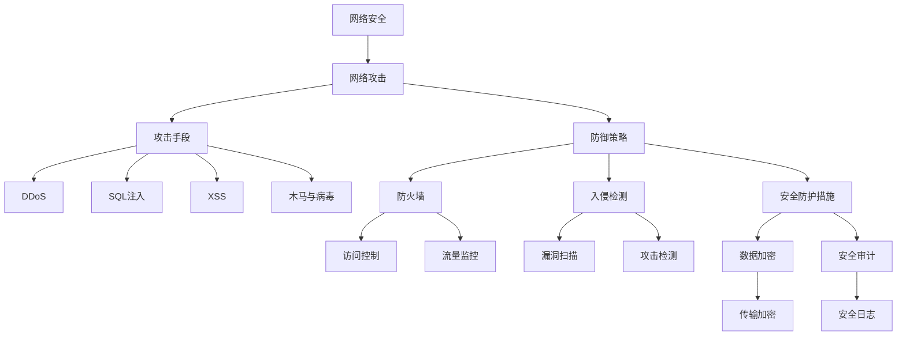

                 

### 文章标题

《360安全2024网络攻防专家校招面试经验》

关键词：网络安全、网络攻防、校招面试、360安全、网络攻击、防御策略

摘要：本文旨在为准备参加360安全2024网络攻防专家校招面试的应聘者提供系统性的面试经验和实战技巧。通过深入剖析网络安全的基础知识、网络攻击与防御技术、实战项目以及面试准备和职业规划，帮助读者掌握网络安全领域的核心技能，提升面试成功率。

### 目录大纲

#### 第一部分：网络攻防基础

**第1章：网络安全概述**

1.1 网络安全基本概念
1.1.1 网络安全的重要性
1.1.2 网络安全的主要威胁
1.1.3 网络安全的三大领域

1.2 网络安全防护技术
1.2.1 防火墙技术
1.2.2 入侵检测系统
1.2.3 安全防护策略与措施

**第2章：网络攻击技术**

2.1 常见网络攻击手段
2.1.1 DDoS攻击
2.1.2 SQL注入攻击
2.1.3 XSS攻击
2.1.4 木马与病毒攻击

2.2 网络攻击案例分析
2.2.1 某大型企业DDoS攻击事件解析
2.2.2 某电商网站SQL注入攻击案例分析
2.2.3 某政府网站XSS攻击事件分析

**第3章：网络安全防御策略**

3.1 网络安全管理体系
3.1.1 网络安全管理体系框架
3.1.2 网络安全管理制度
3.1.3 网络安全管理体系实施

3.2 网络安全防御技术
3.2.1 网络隔离与访问控制
3.2.2 数据加密与安全传输
3.2.3 安全审计与事件响应

#### 第二部分：网络攻防实战

**第4章：网络攻防实战技巧**

4.1 漏洞挖掘与利用
4.1.1 漏洞挖掘基本原理
4.1.2 漏洞利用技术详解
4.1.3 漏洞挖掘实战案例

4.2 网络攻击与防御实战
4.2.1 实战一：破解常见密码策略
4.2.2 实战二：防范DDoS攻击
4.2.3 实战三：防御SQL注入攻击

**第5章：网络安全评估与测试**

5.1 网络安全评估方法
5.1.1 网络安全评估流程
5.1.2 网络安全评估工具
5.1.3 网络安全评估报告撰写

5.2 网络安全测试技术
5.2.1 安全漏洞扫描
5.2.2 渗透测试
5.2.3 安全测试策略与技巧

**第6章：网络安全实战项目**

6.1 项目一：企业网络安全防护体系建设
6.1.1 项目背景与目标
6.1.2 项目方案设计与实施
6.1.3 项目效果评估与优化

6.2 项目二：网络安全攻防演练
6.2.1 演练准备与策划
6.2.2 演练实施与记录
6.2.3 演练结果分析与改进

#### 第三部分：网络安全面试准备

**第7章：网络安全面试指南**

7.1 网络安全面试准备
7.1.1 面试流程与注意事项
7.1.2 面试问题类型及应对策略
7.1.3 网络安全知识储备与提升

7.2 网络安全面试真题解析
7.2.1 真题一：什么是DDoS攻击？
7.2.2 真题二：如何防范SQL注入攻击？
7.2.3 真题三：网络安全的三大领域分别是什么？

**第8章：网络安全职业规划**

8.1 网络安全职业发展路径
8.1.1 网络安全职业类型与岗位
8.1.2 网络安全职业晋升与发展
8.1.3 网络安全行业趋势与挑战

8.2 校招面试经验分享
8.2.1 校招面试准备经验
8.2.2 校招面试实战技巧
8.2.3 校招面试成功案例分享

#### 附录

**附录A：网络安全工具与资源**

A.1 常用网络安全工具介绍
- 网络安全工具一：Wireshark
- 网络安全工具二：Nmap
- 网络安全工具三：Metasploit

A.2 网络安全资源推荐
- 网络安全社区：FreeBuf
- 网络安全博客：安全客
- 网络安全在线课程：网易云课堂

以上为《360安全2024网络攻防专家校招面试经验》的目录大纲。该大纲覆盖了网络安全的基础知识、攻击防御技术、实战技巧以及面试准备和职业规划等内容，旨在帮助读者系统学习网络安全知识，提升网络安全技能，顺利通过网络安全校招面试。

### 核心概念与联系：网络攻防原理

为了更好地理解网络攻防的原理，我们可以通过一个Mermaid流程图来展示网络安全、网络攻击和防御策略之间的核心联系。

这个流程图清晰地展示了网络安全、网络攻击和防御策略之间的相互关系。网络安全是整体防御的基石，网络攻击则是安全防护的挑战。防御策略包括多种技术和措施，如防火墙、入侵检测系统和数据加密等，旨在抵御各种网络攻击手段，如DDoS攻击、SQL注入和XSS攻击等。通过这个流程图，读者可以更好地理解网络安全的核心概念和攻防原理。

### 网络安全基本概念

网络安全是确保网络系统资源（包括硬件、软件和数据）的安全性和完整性，防止未授权访问、数据泄露和损坏的一系列措施。网络安全的基本概念包括：

#### 网络安全的重要性

网络安全对于个人、企业和国家都具有重要意义。对于个人来说，网络安全关乎个人信息保护，如身份信息、财务信息和通信隐私等。对于企业来说，网络安全关系到业务连续性、数据完整性和客户信任。对于国家来说，网络安全是国家安全的重要组成部分，涉及国家基础设施、关键信息和战略资源。

#### 网络安全的主要威胁

网络安全的主要威胁包括但不限于以下几种：

1. **恶意软件**：如病毒、木马、蠕虫等，能够破坏系统、窃取信息和造成其他损害。
2. **网络攻击**：如分布式拒绝服务（DDoS）攻击、SQL注入、XSS攻击等，通过非法手段控制或破坏网络系统。
3. **数据泄露**：通过网络攻击或内部人员泄露，导致敏感信息暴露。
4. **社交工程**：通过欺骗手段获取信息，如钓鱼邮件、电话诈骗等。
5. **物理攻击**：通过网络设备或计算机硬件的物理破坏或篡改。

#### 网络安全的三大领域

网络安全的三大领域是网络安全防御、网络安全监测和网络安全响应。

1. **网络安全防御**：包括防火墙、入侵检测系统（IDS）、入侵防御系统（IPS）和加密技术等，旨在阻止和预防网络攻击。
2. **网络安全监测**：通过监测网络流量和日志，及时发现异常行为和潜在威胁，如安全信息和事件管理（SIEM）系统。
3. **网络安全响应**：包括应急响应计划和事件处理，确保在发生安全事件时能够迅速响应和恢复。

#### 网络安全防护技术

网络安全防护技术包括多种措施，旨在保护网络系统免受各种威胁。以下是几种常见的防护技术：

1. **防火墙技术**：用于控制网络流量进出，过滤非法访问。
2. **入侵检测系统（IDS）**：用于监测网络流量和系统活动，发现潜在攻击。
3. **入侵防御系统（IPS）**：在IDS的基础上，能够自动采取行动阻止攻击。
4. **数据加密**：通过加密数据，确保数据在传输和存储过程中的安全性。
5. **安全审计**：记录和分析系统活动，发现潜在的安全问题和漏洞。
6. **访问控制**：通过身份验证和权限管理，确保只有授权用户可以访问系统资源。

#### 安全防护策略与措施

网络安全防护策略与措施包括：

1. **制定安全政策**：明确安全目标和责任，制定相关安全规章制度。
2. **安全培训**：提高员工安全意识，加强安全教育和培训。
3. **安全监控**：实时监控网络流量和系统活动，及时发现和处理安全事件。
4. **漏洞管理**：定期进行漏洞扫描和修复，确保系统安全。
5. **备份和恢复**：定期备份重要数据，确保在发生数据丢失时能够快速恢复。

通过深入了解网络安全的基本概念，读者可以更好地理解网络攻击的原理，并为后续的学习和实践打下坚实基础。

### 防火墙技术

防火墙技术是网络安全防御体系中最核心和基础的一部分。其主要功能是通过监控和过滤网络流量，防止未经授权的访问和潜在的网络攻击。以下是防火墙技术的一些关键概念、工作原理及其在网络安全中的重要性。

#### 防火墙的基本概念

防火墙是一种网络安全设备，用于分隔内部网络和外部网络（如互联网），从而控制网络流量。防火墙的基本功能包括：

1. **访问控制**：根据预定义的规则，允许或拒绝网络流量。
2. **网络地址转换（NAT）**：将内部网络的私有IP地址转换为公网IP地址，隐藏内部网络结构。
3. **状态检测**：跟踪网络连接的状态，确保流量符合协议规范。

#### 防火墙的工作原理

防火墙的工作原理可以分为以下几个步骤：

1. **定义规则**：管理员根据安全策略定义规则，这些规则决定了哪些流量可以被允许或拒绝。规则通常基于源IP地址、目标IP地址、端口号和协议类型等条件。
2. **匹配规则**：当网络流量到达防火墙时，防火墙会根据流量特征与定义的规则进行匹配。
3. **执行规则**：如果流量匹配某个规则，防火墙会根据规则执行相应的操作，如允许流量通过、拒绝流量或进行流量修改。
4. **状态跟踪**：防火墙会跟踪已建立的连接状态，确保所有流量都符合预定义的安全策略。

#### 防火墙在网络安全中的重要性

防火墙在网络安全中的重要性体现在以下几个方面：

1. **第一道防线**：防火墙是网络安全的第一道防线，能够有效阻止未授权访问和恶意流量。
2. **流量过滤**：通过过滤非法流量，防火墙能够减少系统暴露的风险，降低攻击发生的概率。
3. **网络隔离**：防火墙可以分隔内部网络和外部网络，保护内部资源不受外部攻击。
4. **日志记录和审计**：防火墙可以记录流量日志，帮助管理员审计网络活动，发现潜在的安全问题和漏洞。

#### 常见的防火墙类型

根据工作方式，防火墙可以分为以下几种类型：

1. **包过滤防火墙**：根据网络包的源IP地址、目标IP地址、端口号等基本信息进行过滤。
2. **状态检测防火墙**：除了包过滤功能外，还能够跟踪连接状态，实现更细粒度的访问控制。
3. **应用层防火墙**：在应用层（如HTTP、FTP等）进行流量控制，能够检测和阻止复杂的攻击。
4. **下一代防火墙（NGFW）**：结合了传统的防火墙功能，并增加了安全深度检测和威胁防护能力。

#### 防火墙的配置与管理

防火墙的配置和管理是网络安全运维的重要组成部分。以下是防火墙配置和管理的一些关键步骤：

1. **规则管理**：管理员需要定期审查和更新防火墙规则，确保规则符合当前的安全需求。
2. **日志审计**：定期检查防火墙日志，分析流量特征，发现潜在的安全威胁。
3. **安全监控**：通过实时监控防火墙的状态，及时发现和响应安全事件。
4. **更新与升级**：定期更新防火墙软件和规则库，以应对新的威胁和漏洞。

通过深入理解防火墙技术，读者可以更好地保护网络系统，防止潜在的网络攻击和未经授权的访问，为网络安全打下坚实基础。

### 入侵检测系统（IDS）

入侵检测系统（Intrusion Detection System，IDS）是网络安全防护体系的重要组成部分，主要用于实时监测网络流量和系统活动，识别和响应潜在的安全威胁。以下是IDS的基本概念、工作原理、类型以及其在网络安全中的重要性。

#### IDS的基本概念

入侵检测系统是一种安全技术，用于检测和识别网络中的异常行为和恶意攻击。IDS可以通过分析网络流量、系统日志和应用程序行为等数据，发现潜在的安全事件，并及时通知管理员或采取自动响应措施。

#### IDS的工作原理

IDS的工作原理主要包括以下几个步骤：

1. **数据采集**：IDS从网络流量、系统日志和应用程序日志等数据源中采集信息。
2. **预处理**：对采集到的数据进行预处理，包括过滤、去噪和归一化等操作，以便于后续分析。
3. **特征匹配**：IDS使用预定义的签名库或异常检测模型，对预处理后的数据进行特征匹配。签名库包含已知攻击模式的特征，而异常检测模型则用于识别不符合正常行为模式的流量。
4. **告警与响应**：当检测到潜在的安全事件时，IDS会生成告警信息，通知管理员或自动采取响应措施，如封锁攻击源、隔离受感染系统等。

#### IDS的类型

根据检测方法的不同，IDS可以分为以下几种类型：

1. **基于签名的IDS（Signature-based IDS）**：通过匹配已知攻击特征的签名来检测攻击。这种方法能够快速识别和响应已知威胁，但无法检测未知的或变种攻击。
2. **基于异常的IDS（Anomaly-based IDS）**：通过分析网络流量或系统行为的异常模式来检测攻击。这种方法能够检测未知威胁，但可能会产生较多的误报。
3. **混合型IDS（Hybrid IDS）**：结合基于签名和基于异常的检测方法，以提高检测效率和准确性。

#### IDS在网络安全中的重要性

IDS在网络安全中具有以下重要性：

1. **实时监测**：IDS能够实时监测网络流量和系统活动，及时发现潜在的安全威胁。
2. **威胁识别**：通过分析流量特征和系统行为，IDS能够识别各种攻击手段，如DDoS攻击、SQL注入、XSS攻击等。
3. **应急响应**：IDS生成的告警信息可以帮助管理员快速响应安全事件，采取相应的措施防止攻击进一步扩散。
4. **漏洞发现**：通过分析系统日志和应用程序行为，IDS能够发现潜在的安全漏洞，指导安全防护措施的优化。

#### IDS的实现与配置

实现和配置IDS通常包括以下几个步骤：

1. **选择IDS工具**：根据需求和资源，选择适合的IDS工具，如Snort、Suricata等。
2. **部署与配置**：在目标网络环境中部署IDS传感器，配置网络接口和流量捕获策略。
3. **规则管理**：根据实际需求，配置签名库和异常检测模型，确保IDS能够准确检测和响应安全威胁。
4. **日志分析**：定期分析IDS生成的日志，发现潜在的安全问题和威胁。
5. **维护与升级**：定期更新IDS软件和规则库，以应对新的威胁和漏洞。

通过深入理解入侵检测系统的原理和应用，读者可以更好地保护网络安全，确保网络系统的稳定性和安全性。

### 安全防护策略与措施

在网络安全防护中，制定和实施有效的安全防护策略与措施是至关重要的一环。这些策略和措施旨在防止未授权访问、数据泄露和系统损坏，确保网络系统的安全性和完整性。以下是一些关键的安全防护策略和措施：

#### 制定安全政策

制定安全政策是安全防护的第一步。安全政策应该明确企业的安全目标、安全原则和安全责任。以下是一些关键要素：

1. **安全目标**：明确企业希望达到的安全级别和目标，如保护客户数据、确保业务连续性等。
2. **安全原则**：定义企业应遵循的安全原则，如最小权限原则、安全责任原则等。
3. **安全责任**：明确各个部门和安全角色的责任，确保每个员工都了解自己的安全职责。

#### 安全培训

安全培训是提高员工安全意识的重要手段。通过定期进行安全培训，员工可以了解最新的安全威胁和防护措施，从而减少因人为因素导致的安全漏洞。以下是一些关键点：

1. **员工意识**：提高员工对网络安全威胁的意识，使其认识到安全的重要性。
2. **安全知识**：培训员工关于网络安全的基本知识，如密码安全、数据备份等。
3. **应急响应**：培训员工如何在发生安全事件时进行应急响应和报告。

#### 安全监控

安全监控是实时监测网络和系统活动，及时发现和响应安全事件的关键环节。以下是一些常用的监控方法：

1. **日志监控**：定期检查系统日志和应用程序日志，发现异常行为和潜在威胁。
2. **流量分析**：通过分析网络流量，发现异常流量模式和攻击行为。
3. **实时告警**：配置实时告警系统，在检测到潜在威胁时及时通知管理员。

#### 漏洞管理

漏洞管理是识别、评估和修复系统漏洞的关键过程。以下是一些关键步骤：

1. **漏洞扫描**：定期进行漏洞扫描，发现系统中的已知漏洞。
2. **风险评估**：对漏洞进行风险评估，确定漏洞的严重程度和影响范围。
3. **修复与加固**：根据风险评估结果，及时修复漏洞并加固系统。

#### 数据加密

数据加密是保护数据在传输和存储过程中的安全性的一种重要手段。以下是一些常见的数据加密方法：

1. **传输加密**：使用TLS/SSL等加密协议，确保数据在传输过程中的安全性。
2. **存储加密**：使用AES等加密算法，对存储在数据库或文件系统中的数据进行加密。
3. **密钥管理**：确保密钥的安全存储和定期更换，防止密钥泄露。

#### 备份和恢复

备份和恢复是确保数据安全性和业务连续性的重要措施。以下是一些关键步骤：

1. **数据备份**：定期备份重要数据，确保在发生数据丢失或损坏时能够恢复。
2. **异地备份**：将备份数据存储在异地，以防止地理位置上的灾难影响。
3. **恢复测试**：定期进行数据恢复测试，确保备份系统能够在需要时成功恢复数据。

#### 安全审计

安全审计是对网络安全措施和事件进行审查和评估的过程，旨在发现和纠正安全漏洞。以下是一些关键点：

1. **日志审计**：定期审查系统日志和安全事件日志，发现潜在的安全问题。
2. **合规性审计**：确保企业的安全措施符合相关法律法规和标准，如ISO 27001等。
3. **风险评估**：对安全事件进行风险评估，确定事件的严重程度和影响范围。

通过以上安全防护策略和措施，企业可以有效地降低网络攻击和数据泄露的风险，确保网络系统的安全性和稳定性。

### 常见网络攻击手段

在网络安全领域，了解常见的网络攻击手段对于预防和应对这些攻击至关重要。以下是一些典型的网络攻击手段，包括DDoS攻击、SQL注入攻击、XSS攻击和木马与病毒攻击。

#### DDoS攻击

DDoS（分布式拒绝服务）攻击是一种通过大量无效流量使目标服务器瘫痪的攻击手段。攻击者通常利用多个受感染的计算机（僵尸网络）同时向目标服务器发送大量请求，使服务器超出处理能力，导致正常用户无法访问。

**工作原理：**
1. **僵尸网络**：攻击者首先感染大量计算机，使其成为僵尸网络的一部分。
2. **指挥与控制**：攻击者通过命令控制这些僵尸计算机，发起攻击。
3. **流量攻击**：僵尸网络向目标服务器发送大量请求，使服务器资源耗尽。

**防御措施：**
1. **流量监控与过滤**：实时监控网络流量，过滤掉异常流量。
2. **负载均衡**：通过负载均衡器分散流量，减轻单个服务器的压力。
3. **DDoS防护服务**：与专业的DDoS防护服务提供商合作，快速响应和处理大规模攻击。

#### SQL注入攻击

SQL注入攻击是一种通过在Web应用程序的输入字段中插入恶意SQL代码，从而控制数据库的攻击手段。

**工作原理：**
1. **恶意输入**：攻击者在输入字段中插入SQL语句。
2. **查询执行**：应用程序将恶意SQL语句作为有效查询执行。
3. **数据泄露或篡改**：攻击者通过恶意SQL语句获取或修改数据库中的数据。

**防御措施：**
1. **输入验证**：对用户输入进行严格验证，确保输入内容符合预期格式。
2. **使用预编译语句**：使用预编译语句（如预处理语句）避免直接执行用户输入的SQL代码。
3. **参数化查询**：使用参数化查询，将用户输入作为参数传递，避免直接混合SQL代码和输入。

#### XSS攻击

XSS（跨站脚本）攻击是一种通过在Web应用程序中注入恶意脚本，从而窃取用户信息或控制用户会话的攻击手段。

**工作原理：**
1. **恶意脚本注入**：攻击者在用户可交互的页面中注入恶意脚本。
2. **用户执行**：用户在浏览器中执行恶意脚本。
3. **数据窃取或会话劫持**：恶意脚本窃取用户的敏感信息或控制用户的会话。

**防御措施：**
1. **内容安全策略（CSP）**：使用内容安全策略限制可以执行脚本的来源。
2. **输出编码**：对用户输出的数据进行编码，确保浏览器不会将其解析为脚本。
3. **同源策略**：确保Web应用程序遵循同源策略，防止跨源请求和脚本执行。

#### 木马与病毒攻击

木马和病毒是恶意软件的一种，通过感染计算机系统，窃取信息、控制系统或破坏数据。

**工作原理：**
1. **传播**：通过网络、电子邮件或下载恶意软件的链接传播。
2. **感染**：恶意软件感染计算机系统，安装后门或修改系统设置。
3. **控制**：攻击者通过控制服务器远程控制受感染的计算机，窃取数据或发起进一步攻击。

**防御措施：**
1. **防病毒软件**：安装并定期更新防病毒软件，及时检测和清除恶意软件。
2. **操作系统更新**：及时更新操作系统和应用程序，修补安全漏洞。
3. **网络隔离**：对关键系统进行网络隔离，限制其与互联网的连接。

通过了解这些常见的网络攻击手段及其工作原理，读者可以更好地制定防御策略，保护网络系统的安全性。

### 网络攻击案例分析

为了更好地理解网络攻击的实际影响和防御策略，下面通过几个具体的案例来深入剖析网络攻击事件，并分析其成因和防御措施。

#### 某大型企业DDoS攻击事件解析

**事件背景：** 某大型企业网站在一天内遭遇了大规模的DDoS攻击，导致网站瘫痪，用户访问受阻。

**攻击过程：** 攻击者利用僵尸网络，向企业网站发送大量无效请求，使其服务器资源耗尽，无法正常处理用户请求。

**事件影响：** 攻击导致企业网站无法正常访问，影响了用户体验，同时导致业务中断，造成了直接经济损失。

**防御措施：**
1. **流量监控与过滤**：通过实时监控网络流量，识别并过滤掉异常流量。
2. **负载均衡**：通过负载均衡器分散流量，减轻单个服务器的压力。
3. **DDoS防护服务**：与企业合作的DDoS防护服务提供商快速响应，调动防护资源，缓解了攻击影响。

#### 某电商网站SQL注入攻击案例分析

**事件背景：** 某知名电商网站在一次系统升级过程中，因为代码漏洞导致SQL注入攻击。

**攻击过程：** 攻击者通过输入字段注入恶意SQL代码，成功获取了数据库中的用户信息，包括用户名、密码和支付信息。

**事件影响：** 用户隐私泄露，可能导致经济损失和品牌信誉受损。

**防御措施：**
1. **输入验证**：对用户输入进行严格验证，确保输入内容符合预期格式。
2. **使用预编译语句**：避免直接执行用户输入的SQL代码，通过预编译语句提高安全性。
3. **参数化查询**：使用参数化查询，将用户输入作为参数传递，防止SQL注入攻击。

#### 某政府网站XSS攻击事件分析

**事件背景：** 某政府网站在一次页面更新中，由于未对输出内容进行编码，导致XSS攻击。

**攻击过程：** 攻击者通过在留言板中注入恶意脚本，使访问者在不经意间执行了恶意脚本，窃取了用户的会话信息。

**事件影响：** 用户会话信息被窃取，可能导致敏感信息泄露和身份盗用。

**防御措施：**
1. **内容安全策略（CSP）**：使用内容安全策略限制可以执行脚本的来源。
2. **输出编码**：对用户输出的数据进行编码，确保浏览器不会将其解析为脚本。
3. **同源策略**：确保Web应用程序遵循同源策略，防止跨源请求和脚本执行。

通过以上案例分析，我们可以看到网络攻击的危害性和防范措施的必要性。了解实际案例，有助于读者在实际工作中更好地应对网络攻击，保护网络系统的安全性。

### 网络安全管理体系

网络安全管理体系是确保网络系统安全性的系统化方法和过程。它包括一系列政策、流程和工具，旨在识别、评估、处理和监控网络安全风险。以下将详细介绍网络安全管理体系框架、管理制度以及实施方法。

#### 网络安全管理体系框架

网络安全管理体系框架通常包括以下核心组成部分：

1. **安全策略**：定义组织的整体安全目标、原则和方针，如访问控制、数据保护、灾难恢复等。
2. **安全组织**：明确安全组织结构，包括各级安全责任人和相关职责，如安全委员会、安全管理员等。
3. **风险评估**：定期进行风险评估，识别网络系统中的潜在风险，并制定相应的风险管理策略。
4. **安全控制**：实施一系列安全控制措施，如防火墙、入侵检测系统、数据加密等，以减少安全风险。
5. **监控与审计**：实时监控网络活动和日志，定期进行安全审计，确保安全控制措施得到有效执行。
6. **事件响应**：制定应急预案和事件响应流程，确保在发生安全事件时能够快速响应和处理。

#### 网络安全管理制度

网络安全管理制度是确保网络安全管理体系有效运行的具体规定和操作指南。以下是一些关键管理制度：

1. **访问控制制度**：定义用户权限管理策略，确保只有授权用户可以访问特定的网络资源和数据。
2. **密码管理制度**：规定密码强度、密码更换周期和密码存储策略，提高账户安全性。
3. **数据备份与恢复制度**：制定数据备份和恢复策略，确保在发生数据丢失或损坏时能够迅速恢复。
4. **安全培训制度**：定期对员工进行安全培训，提高员工的安全意识和技能。
5. **安全审计制度**：制定安全审计流程和标准，确保安全控制措施的有效性和合规性。
6. **应急响应制度**：制定应急预案和事件响应流程，确保在发生安全事件时能够及时响应和处理。

#### 网络安全管理体系实施

网络安全管理体系的实施包括以下几个关键步骤：

1. **制定安全策略**：根据组织特点和需求，制定符合法律法规和行业标准的网络安全策略。
2. **建立安全组织**：明确各级安全责任人和职责，建立安全组织结构，确保安全管理工作得到有效执行。
3. **进行风险评估**：定期进行风险评估，识别网络系统中的潜在风险，并制定相应的风险管理策略。
4. **实施安全控制**：根据风险评估结果，实施一系列安全控制措施，如防火墙、入侵检测系统、数据加密等。
5. **监控与审计**：实时监控网络活动和日志，定期进行安全审计，确保安全控制措施得到有效执行。
6. **事件响应**：制定应急预案和事件响应流程，确保在发生安全事件时能够快速响应和处理。

#### 实施效果评估与持续优化

网络安全管理体系的有效性需要通过定期评估和持续优化来保证。以下是一些关键评估方法和优化措施：

1. **效果评估**：通过定期进行安全检查、渗透测试和风险评估，评估网络安全管理体系的实效性和有效性。
2. **反馈机制**：建立反馈机制，收集员工和用户对安全管理的意见和建议，及时进行调整和优化。
3. **持续改进**：根据评估结果和反馈机制，持续优化安全策略、流程和工具，提高网络系统的安全性。

通过实施和完善网络安全管理体系，组织可以更好地保护网络系统和数据，降低安全风险，确保业务的持续稳定运行。

### 网络隔离与访问控制

网络隔离与访问控制是网络安全防御体系中的核心组成部分，主要用于限制网络访问权限，防止未授权用户或系统访问敏感数据和关键资源。以下将详细探讨网络隔离与访问控制的基本概念、技术手段及其在网络安全中的应用。

#### 网络隔离的基本概念

网络隔离是指通过物理或逻辑手段，将内部网络划分为多个独立的部分，以限制网络流量的流动，从而提高网络安全性。网络隔离的主要目的是防止网络攻击和内部威胁的扩散，保护关键系统和数据不受侵害。

1. **物理隔离**：通过物理设备（如路由器、交换机等）将网络划分为不同的子网或 VLAN（虚拟局域网），实现网络流量的隔离。
2. **逻辑隔离**：通过虚拟化技术（如虚拟专用网络（VPN）、虚拟化环境等）在逻辑层面上实现网络隔离。

#### 访问控制的基本概念

访问控制是指通过权限管理策略，控制用户和系统对网络资源和数据的访问。访问控制的核心目标是确保只有授权用户和系统能够访问特定的资源和数据，从而防止未授权访问和数据泄露。

1. **基于角色的访问控制（RBAC）**：根据用户的角色和权限分配访问权限，确保用户只能访问与其角色相关的资源和功能。
2. **基于属性的访问控制（ABAC）**：根据访问请求的属性（如时间、地点、请求者身份等）动态分配访问权限。

#### 网络隔离与访问控制的技术手段

1. **防火墙**：防火墙是实施网络隔离和访问控制的重要工具，通过设置访问控制规则，过滤和监控网络流量，防止未经授权的访问。
2. **虚拟专用网络（VPN）**：VPN通过加密通信隧道，在公共网络中建立安全的私有网络连接，实现远程访问控制。
3. **网络地址转换（NAT）**：NAT通过将内部网络的私有IP地址转换为公网IP地址，实现网络隔离和访问控制。
4. **多因素身份验证（MFA）**：MFA通过结合密码、手机验证码、指纹等验证手段，提高身份验证的安全性。
5. **安全审计与日志管理**：通过记录和审计网络访问日志，监控和分析用户行为，发现潜在的安全威胁和违规行为。

#### 网络隔离与访问控制的应用

1. **企业内部网络隔离**：在企业内部网络中，通过设置防火墙和 VLAN 实现网络隔离，确保不同部门和团队之间的网络访问受到控制，防止数据泄露和内部威胁。
2. **远程办公访问控制**：通过 VPN 和 MFA 技术实现远程办公的网络隔离和访问控制，确保远程用户访问公司资源的安全性和合规性。
3. **云环境访问控制**：在云环境中，通过访问控制策略和权限管理，确保云服务和数据的访问安全，防止未经授权的访问和滥用。

通过实施网络隔离与访问控制技术，组织可以有效保护网络资源和数据的安全，降低安全风险，确保业务的持续稳定运行。

### 数据加密与安全传输

数据加密和安全传输是确保数据在传输和存储过程中安全性的关键技术。数据加密通过将明文转换为密文，防止未授权用户窃取和解读数据；安全传输则通过加密通信通道，确保数据在传输过程中的完整性和隐私性。以下将详细探讨数据加密的基本原理、常用加密算法以及安全传输的实现方法。

#### 数据加密的基本原理

数据加密的基本原理是通过加密算法将明文数据转换为密文，只有拥有正确密钥的接收者才能解密并还原明文数据。加密过程主要包括以下几个步骤：

1. **密钥生成**：密钥是加密和解密过程中至关重要的一部分，用于控制加密算法的运行。
2. **加密算法**：加密算法是用于将明文转换为密文的算法，常见的加密算法包括对称加密、非对称加密和混合加密。
3. **加密过程**：加密算法使用密钥对明文数据进行加密，生成密文数据。
4. **解密过程**：接收者使用相同或对应的加密算法和密钥，将密文数据解密为明文数据。

#### 常用加密算法

1. **对称加密算法**：对称加密算法使用相同的密钥进行加密和解密，如AES（高级加密标准）和DES（数据加密标准）。对称加密算法的优点是加密速度快，但缺点是密钥管理复杂。
2. **非对称加密算法**：非对称加密算法使用一对密钥（公钥和私钥）进行加密和解密，如RSA（Rivest-Shamir-Adleman）和ECC（椭圆曲线加密）。非对称加密算法的优点是密钥管理简单，但加密速度相对较慢。
3. **混合加密算法**：混合加密算法结合了对称加密和非对称加密的优点，通常用于加密通信中的密钥交换过程。常见的混合加密协议包括SSL/TLS（安全套接层/传输层安全协议）。

#### 安全传输的实现方法

安全传输主要通过以下几种方法实现：

1. **加密通信协议**：如SSL/TLS协议，用于在客户端和服务器之间建立安全的加密通信通道。SSL/TLS协议通过握手协议交换密钥，确保通信过程中的数据加密和完整性。
2. **VPN（虚拟专用网络）**：VPN通过加密隧道在公共网络上建立安全的专用网络连接，确保数据在传输过程中的安全性和隐私性。VPN适用于远程办公和跨区域数据传输。
3. **IPsec（互联网安全协议）**：IPsec是一种网络层加密协议，用于保护IP网络中的数据传输。IPsec提供了数据加密、认证和完整性保护等功能，适用于企业内部网络和跨网络数据传输。

通过数据加密和安全传输技术，组织可以有效保护数据在传输和存储过程中的安全性，防止数据泄露和篡改，确保信息的隐私性和完整性。

### 安全审计与事件响应

安全审计与事件响应是网络安全防护体系的重要组成部分，用于监测、记录和应对网络安全事件，确保网络系统的安全和稳定。以下是安全审计的基本原理、日志管理和事件响应流程的详细解析。

#### 安全审计的基本原理

安全审计是一种通过监控、记录和分析网络和系统活动，发现潜在安全问题和违规行为的方法。其基本原理包括以下几个方面：

1. **监控**：实时监控网络流量、系统日志和用户行为，及时发现异常活动和潜在威胁。
2. **记录**：记录所有网络和系统活动，包括成功操作、失败尝试和异常行为，为后续分析提供数据支持。
3. **分析**：对记录的数据进行深入分析，识别潜在的安全漏洞和违规行为，评估其影响和风险。

#### 日志管理

日志管理是安全审计的核心环节，通过记录和分析日志，可以有效地发现和应对安全事件。以下是日志管理的几个关键点：

1. **日志分类**：根据日志内容，将日志分为系统日志、安全日志、审计日志等不同类型，便于分类管理和分析。
2. **日志存储**：选择合适的存储方式，确保日志数据的持久性和可恢复性。常用的日志存储方式包括文件存储、数据库存储和云存储。
3. **日志分析**：使用日志分析工具，定期分析日志数据，发现异常行为和潜在威胁。常见的日志分析工具包括ELK（Elasticsearch、Logstash、Kibana）和Splunk。

#### 事件响应流程

事件响应流程是确保在发生安全事件时能够快速、有效地应对和恢复的关键。以下是事件响应的基本流程：

1. **事件识别**：通过实时监控和日志分析，及时发现安全事件，包括入侵尝试、数据泄露和系统故障等。
2. **初步评估**：对事件进行初步评估，确定事件的类型、影响范围和紧急程度，为后续响应提供依据。
3. **应急响应**：根据事件响应预案，迅速采取行动，隔离受影响系统，阻断攻击源，防止事件扩散。
4. **深入调查**：对事件进行深入调查，收集相关证据，分析事件原因和影响，为后续改进提供依据。
5. **恢复与改进**：在事件得到控制后，及时恢复受影响系统，根据调查结果优化安全策略和防护措施，防止类似事件再次发生。

通过安全审计和事件响应，组织可以及时发现和应对安全事件，提高网络系统的安全性和稳定性，确保业务的持续运行。

### 漏洞挖掘与利用

漏洞挖掘与利用是网络安全领域的重要技术，通过发现和利用系统中的漏洞，攻击者可以实现对网络的非法控制或数据窃取。以下将详细探讨漏洞挖掘的基本原理、漏洞利用技术以及实战案例。

#### 漏洞挖掘的基本原理

漏洞挖掘是指通过各种方法和技术发现计算机系统、网络应用或软件中的安全漏洞，以便进行修复或加强防护。漏洞挖掘的基本原理包括：

1. **漏洞扫描**：使用自动化工具扫描系统或网络，发现已知漏洞。常见的漏洞扫描工具有Nmap、Nessus等。
2. **静态分析**：通过分析源代码或二进制代码，发现潜在的安全漏洞。静态分析方法包括代码审计、符号执行等。
3. **动态分析**：通过执行程序或模拟网络交互，实时监测程序的行为，发现运行时漏洞。动态分析方法包括模糊测试、插桩等。

#### 漏洞利用技术详解

漏洞利用是指通过攻击者编写的恶意代码或脚本，利用系统中的漏洞实现对目标的控制或数据窃取。常见的漏洞利用技术包括：

1. **缓冲区溢出**：通过向缓冲区中写入超出其容量的数据，导致程序崩溃或执行恶意代码。缓冲区溢出利用技术包括返回导向编程（ROP）和堆溢出等。
2. **远程代码执行（RCE）**：利用远程服务器上的漏洞，执行任意代码。RCE可以通过Web应用漏洞、操作系统漏洞等实现。
3. **文件包含漏洞**：通过包含恶意文件，执行文件内容。文件包含漏洞可以导致远程代码执行，常见的利用方式包括LFI（本地文件包含）和RFI（远程文件包含）。

#### 漏洞挖掘实战案例

以下是一个基于Web应用的漏洞挖掘与利用的实战案例：

1. **漏洞发现**：使用Nessus对目标Web应用进行漏洞扫描，发现存在一个SQL注入漏洞。
2. **漏洞验证**：通过手动测试，确认SQL注入漏洞存在，并编写测试脚本验证漏洞的可行性。
3. **漏洞利用**：通过SQL注入漏洞，获取数据库中的管理员账户和密码，实现远程登录。
4. **权限提升**：通过获取的管理员权限，上传恶意文件到服务器，并执行文件实现远程控制。
5. **数据窃取**：通过恶意文件窃取目标Web应用中的敏感数据，如用户账户信息、支付数据等。

通过以上步骤，攻击者成功利用了Web应用的SQL注入漏洞，实现对目标服务器的完全控制，并窃取了敏感数据。这个案例展示了漏洞挖掘与利用的完整过程，有助于读者理解漏洞挖掘的实际应用。

### 网络攻击与防御实战

在网络安全领域，了解实际的网络攻击与防御技巧对于提升个人防护能力至关重要。以下将介绍几个网络攻击与防御的实战案例，包括破解常见密码策略、防范DDoS攻击以及防御SQL注入攻击。

#### 破解常见密码策略

**案例背景**：某企业内部系统的用户密码较为简单，容易遭受破解攻击。

**攻击方法**：使用字典攻击（Dictionary Attack）和暴力破解攻击（Brute-Force Attack）。

**防御措施**：

1. **密码复杂度要求**：强制用户设置复杂度较高的密码，包括字母、数字和特殊字符，并限制密码长度。
2. **密码加密存储**：将用户密码通过哈希函数加密存储，如使用SHA-256或bcrypt等算法，防止明文密码泄露。
3. **多因素认证**：引入多因素认证（MFA），要求用户在登录时提供至少两个不同类型的认证信息，如密码和手机验证码，增加安全性。
4. **密码使用期限**：定期要求用户更改密码，减少长期使用同一密码的风险。

#### 防范DDoS攻击

**案例背景**：某电商平台在促销期间遭到大规模DDoS攻击，导致网站瘫痪，用户无法访问。

**攻击方法**：攻击者使用僵尸网络（Botnet）向目标网站发送大量无效请求，耗尽服务器资源。

**防御措施**：

1. **流量监控与过滤**：实时监控网络流量，识别并过滤掉异常流量，如来自同一IP地址的大量请求。
2. **负载均衡**：使用负载均衡器分散流量，将流量分发到多个服务器，防止单点故障。
3. **DDoS防护服务**：与专业的DDoS防护服务提供商合作，快速响应和处理大规模攻击，确保业务连续性。
4. **网络安全设备**：部署防火墙和入侵检测系统（IDS），及时发现和阻止攻击流量。

#### 防御SQL注入攻击

**案例背景**：某在线购物网站由于SQL注入漏洞导致用户账户信息泄露。

**攻击方法**：攻击者通过输入字段注入恶意SQL代码，执行非法查询，获取数据库中的用户数据。

**防御措施**：

1. **输入验证**：对用户输入进行严格验证，确保输入内容符合预期格式，防止恶意输入。
2. **使用预编译语句**：通过预编译语句（Prepared Statements）避免直接执行用户输入的SQL代码，提高安全性。
3. **参数化查询**：使用参数化查询（Parameterized Queries），将用户输入作为参数传递，防止SQL注入攻击。
4. **输出编码**：对输出内容进行编码，确保浏览器不会将其解析为脚本，防止跨站脚本攻击（XSS）。

通过以上实战案例，读者可以更好地了解实际网络攻击的攻击方法和防御技巧，从而提升自身的网络安全防护能力。

### 网络安全评估方法

网络安全评估是确保网络系统安全性的重要手段，通过系统地评估网络中的潜在风险和漏洞，有助于制定有效的安全策略和防御措施。以下是网络安全评估的详细流程、常用工具以及评估报告的撰写方法。

#### 网络安全评估流程

网络安全评估通常包括以下几个关键步骤：

1. **需求分析**：明确评估的目标和范围，确定需要评估的网络系统、应用程序和设备。
2. **信息收集**：收集网络架构、系统配置、应用程序代码和用户行为等基本信息，为后续评估提供基础。
3. **风险评估**：分析收集到的信息，识别网络中的潜在风险和漏洞，评估其可能带来的影响和风险等级。
4. **漏洞扫描**：使用自动化工具进行漏洞扫描，发现已知漏洞，如使用Nessus、OpenVAS等工具。
5. **渗透测试**：模拟真实攻击，通过手工测试和自动化工具，深入挖掘系统中的潜在漏洞和弱点。
6. **结果分析**：对漏洞扫描和渗透测试的结果进行综合分析，确定漏洞的影响范围和修复优先级。
7. **报告撰写**：根据评估结果撰写评估报告，包括发现的问题、建议的改进措施和安全策略。

#### 常用网络安全评估工具

以下是几种常用的网络安全评估工具：

1. **Nessus**：一款功能强大的漏洞扫描工具，能够扫描网络中的主机和应用程序，发现已知漏洞。
2. **OpenVAS**：开源的漏洞扫描平台，提供了丰富的扫描插件和报告功能。
3. **Metasploit**：一款渗透测试框架，用于模拟攻击，发现和利用系统漏洞。
4. **Wireshark**：网络协议分析工具，用于捕获和解析网络流量，分析网络故障和安全问题。
5. **Burp Suite**：一款Web应用安全测试工具，用于进行漏洞扫描和渗透测试，包括SQL注入、XSS等漏洞。

#### 网络安全评估报告撰写

撰写网络安全评估报告时，需要包含以下关键内容：

1. **概述**：简要介绍评估的目的、范围和方法。
2. **评估结果**：详细列出发现的漏洞和风险点，包括漏洞类型、影响范围和风险等级。
3. **问题分析**：对发现的漏洞进行详细分析，包括漏洞的产生原因、可能的影响和风险。
4. **建议措施**：提出针对每个漏洞的修复建议和安全改进措施。
5. **实施计划**：制定漏洞修复和安全改进的实施计划，包括时间表、责任人和资源需求。
6. **附录**：提供评估过程中使用的工具、测试数据和参考文献。

通过详细的网络安全评估报告，组织可以清晰地了解自身的安全状况，制定针对性的安全改进措施，提高网络系统的安全性。

### 网络安全测试技术

网络安全测试技术是确保网络系统安全性不可或缺的一部分，通过多种技术手段对网络进行全面评估，以发现潜在的安全漏洞和弱点。以下是几种主要的网络安全测试技术，包括安全漏洞扫描、渗透测试和安全测试策略与技巧。

#### 安全漏洞扫描

安全漏洞扫描是自动化检测网络中潜在漏洞的过程，通过扫描工具对系统、应用程序和网络设备进行检查，以识别已知的安全漏洞。以下是一些关键点：

1. **扫描工具**：常用的漏洞扫描工具有Nessus、OpenVAS、Burp Suite等。
2. **扫描策略**：根据网络环境和安全需求，制定合理的扫描策略，如全面扫描、快速扫描或特定漏洞扫描。
3. **结果分析**：扫描完成后，分析扫描结果，确定漏洞的类型、影响范围和风险等级。
4. **修复建议**：根据漏洞扫描结果，提供修复建议，及时修补安全漏洞。

#### 渗透测试

渗透测试是一种模拟真实攻击，通过手工测试和自动化工具深入挖掘系统漏洞和弱点的技术。以下是渗透测试的几个关键步骤：

1. **信息收集**：通过各种方法收集目标网络的信息，如网络拓扑、系统配置和用户行为等。
2. **漏洞发现**：使用工具和技巧发现潜在的安全漏洞，如SQL注入、XSS等。
3. **漏洞利用**：通过漏洞利用技术，验证漏洞的实际影响，并尝试获取系统控制权。
4. **报告撰写**：详细记录测试过程和结果，撰写详细的渗透测试报告。

#### 安全测试策略与技巧

进行有效的网络安全测试需要制定合理的测试策略和掌握关键技巧，以下是一些策略和技巧：

1. **风险优先级**：根据业务需求和风险等级，制定漏洞修复的优先级，确保高风险漏洞首先得到修复。
2. **持续测试**：定期进行网络安全测试，监控系统变化和新出现的漏洞。
3. **模拟攻击**：模拟各种类型的攻击，如DDoS攻击、社交工程攻击等，评估系统的抵抗能力。
4. **自动化测试**：使用自动化工具提高测试效率，如编写脚本进行自动化扫描和测试。
5. **团队协作**：组建专业的测试团队，分工合作，提高测试效果和效率。

通过掌握这些安全测试技术和策略，组织可以全面评估网络系统的安全性，及时发现和修复安全漏洞，确保网络系统的稳定运行和业务连续性。

### 网络安全实战项目

网络安全实战项目是验证和提升网络安全技能的重要手段。通过实际操作和项目实践，可以更好地理解和应用网络安全理论，发现和解决实际问题。以下将详细介绍两个网络安全实战项目：企业网络安全防护体系建设和网络安全攻防演练。

#### 项目一：企业网络安全防护体系建设

**项目背景：** 某企业由于网络攻击导致业务中断，严重影响了用户体验和业务发展。企业决定进行网络安全防护体系建设，以提高网络安全性，确保业务的稳定运行。

**项目目标：** 
1. 制定和实施全面的网络安全策略和措施。
2. 建立高效的网络安全防御体系，降低网络攻击风险。
3. 提高员工的安全意识和技能，确保安全措施的执行。

**项目方案设计与实施：**

1. **需求分析**：对企业现有网络架构和安全措施进行全面评估，明确网络安全需求。
2. **策略制定**：根据需求分析结果，制定网络安全策略，包括访问控制、数据加密、入侵检测等。
3. **设备部署**：部署防火墙、入侵检测系统（IDS）、入侵防御系统（IPS）等安全设备，确保网络边界的安全防护。
4. **安全培训**：开展网络安全培训，提高员工的安全意识和技能，确保安全措施的执行。
5. **监控与审计**：建立实时监控和日志审计系统，监控网络流量和系统活动，及时发现和应对安全事件。

**项目效果评估与优化：**

1. **效果评估**：通过定期进行安全检查、渗透测试和风险评估，评估网络安全防护体系的实效性和有效性。
2. **反馈机制**：建立反馈机制，收集员工和用户对安全防护措施的意见和建议，及时进行调整和优化。
3. **持续改进**：根据评估结果和反馈机制，持续优化安全策略、流程和工具，提高网络系统的安全性。

#### 项目二：网络安全攻防演练

**项目背景：** 某企业为了提高网络安全防护能力，决定开展网络安全攻防演练，通过模拟真实攻击和防御，提升团队应对网络攻击的能力。

**项目目标：**
1. 检验网络安全防护体系的实际效果，发现潜在的安全漏洞和弱点。
2. 增强团队协同应对网络攻击的能力，提升实战经验。
3. 完善应急预案和事件响应流程，确保在发生真实攻击时能够迅速应对。

**项目方案设计与实施：**

1. **演练准备**：制定演练计划和方案，明确演练目标和任务分配，选择合适的演练工具和模拟攻击场景。
2. **演练实施**：模拟各种类型的攻击，如DDoS攻击、SQL注入攻击、XSS攻击等，真实演练团队应对攻击的能力。
3. **演练记录**：详细记录演练过程中的攻击行为、防御措施和响应过程，分析演练结果。
4. **结果分析**：对演练结果进行综合分析，评估网络安全防护体系的实际效果，发现潜在的安全漏洞和弱点。

**演练结果分析与改进：**

1. **结果分析**：根据演练记录和数据分析，评估演练目标是否达成，识别存在的安全问题和薄弱环节。
2. **改进措施**：根据分析结果，提出具体的改进措施，包括加强安全培训、优化安全策略和流程、更新安全设备等。
3. **持续改进**：通过定期开展网络安全攻防演练，持续提升团队的网络安全防护能力和应对能力。

通过以上两个网络安全实战项目，企业可以有效提升网络安全防护水平，确保业务的稳定运行，为未来的网络安全挑战做好准备。

### 网络安全面试指南

在准备参加网络安全面试时，了解面试流程、常见问题类型以及应对策略是至关重要的。以下将详细介绍网络安全面试的准备工作、面试过程中的注意事项以及如何提升网络安全知识储备。

#### 面试流程与注意事项

**面试流程：**

1. **简历筛选**：面试官首先会根据应聘者的简历进行筛选，关注学历背景、工作经验和项目经历等。
2. **笔试或在线测试**：部分公司会在面试前进行笔试或在线测试，主要考察应聘者的基本编程能力和网络安全知识。
3. **初面**：初面通常由技术面试官进行，主要涉及技术问题，包括基础概念、算法和数据结构等。
4. **复试**：复试可能会包括经理或总监级别的面试，侧重于职业规划、团队合作和沟通能力。
5. **终面**：终面通常由高层管理人员进行，主要是了解应聘者的整体素质和长远发展潜力。

**注意事项：**

1. **提前准备**：提前熟悉公司背景、业务领域和安全战略，以便在面试中展现对公司的了解。
2. **着装得体**：面试时应着装正式，体现专业形象。
3. **心态调整**：保持冷静，遇到不懂的问题时，可以诚实地表示不清楚，但需要展示出学习的态度和潜力。
4. **沟通技巧**：清晰、有条理地表达自己的观点和思路，注意倾听面试官的问题，确保理解准确。

#### 面试问题类型及应对策略

网络安全面试通常包括以下几种类型的问题：

1. **基础知识**：考察应聘者对网络安全基础概念的理解，如什么是DDoS攻击、什么是SQL注入等。
2. **技术实现**：涉及具体的网络安全技术，如防火墙的工作原理、加密算法的实现等。
3. **案例分析**：通过具体案例，考察应聘者对实际网络攻击和防御策略的应对能力。
4. **编程题目**：可能会给出一些编程题目，考察应聘者的编程能力和解决问题的能力。
5. **综合素质**：包括沟通能力、团队合作和职业规划等，这些通常是复试和终面中关注的问题。

**应对策略：**

1. **基础知识**：通过系统学习和实践，掌握基本概念和原理，确保能够清晰、准确地回答问题。
2. **技术实现**：通过实际项目经验或开源项目参与，熟悉各种安全技术的实现细节和应用场景。
3. **案例分析**：通过阅读相关书籍、报告和案例，积累实际攻击和防御的案例分析经验。
4. **编程题目**：通过刷题和实际项目开发，提升编程能力和问题解决能力。
5. **综合素质**：通过多参与团队项目、社会实践和培训，提升沟通、协作和职业规划的能力。

通过系统的准备和针对性的策略，应聘者可以更好地应对网络安全面试，展示自己的专业素养和潜力。

### 网络安全面试真题解析

在网络安全面试中，面试官往往会通过具体的问题来考察应聘者的专业知识、实践能力和解决问题的能力。以下将解析几道常见的网络安全面试真题，帮助读者更好地准备面试。

#### 真题一：什么是DDoS攻击？

**解答过程：**

DDoS（Distributed Denial of Service，分布式拒绝服务）攻击是一种通过大量无效流量使目标服务器瘫痪的攻击手段。攻击者通常利用僵尸网络，控制大量受感染的计算机（称为“肉鸡”），同时向目标服务器发送大量请求，使服务器资源耗尽，无法正常处理合法用户的请求。

**详细解释：**

1. **攻击原理**：攻击者首先感染大量计算机，使其成为僵尸网络的一部分。攻击者通过指挥控制这些僵尸计算机，发起大规模的请求，如HTTP请求、SYN flood请求等，使目标服务器资源耗尽。
2. **攻击类型**：常见的DDoS攻击类型包括TCP SYN Flood、UDP Flood、HTTP Flood等，每种攻击方式都有不同的特征和应对策略。
3. **防御措施**：防御DDoS攻击的方法包括流量监控与过滤、负载均衡、DDoS防护服务等。与专业的DDoS防护服务提供商合作，可以快速识别和应对大规模攻击。

#### 真题二：如何防范SQL注入攻击？

**解答过程：**

SQL注入攻击是一种通过在Web应用程序的输入字段中插入恶意SQL代码，从而执行非法查询的攻击手段。防范SQL注入攻击的关键在于对用户输入进行严格验证，确保输入内容不会影响SQL查询的执行。

**详细解释：**

1. **输入验证**：对用户输入进行严格验证，确保输入内容符合预期格式。例如，对于电话号码输入，应确保输入的是数字，且长度符合要求。
2. **使用预编译语句**：使用预编译语句（Prepared Statements）或参数化查询（Parameterized Queries），避免直接将用户输入作为SQL查询的一部分。预编译语句会将用户输入作为参数传递，从而防止恶意SQL代码的执行。
3. **输出编码**：对输出内容进行编码，确保浏览器不会将其解析为脚本。例如，在显示用户输入时，使用HTML实体编码，防止跨站脚本攻击（XSS）。
4. **安全库和框架**：使用安全库和框架，如PHP的PDO、Java的JDBC等，这些库和框架内置了对SQL注入的防护措施。

#### 真题三：网络安全的三大领域分别是什么？

**解答过程：**

网络安全的三大领域是网络安全防御、网络安全监测和网络安全响应。

**详细解释：**

1. **网络安全防御**：包括防火墙、入侵检测系统（IDS）、入侵防御系统（IPS）和加密技术等，旨在阻止和预防网络攻击。
2. **网络安全监测**：通过监测网络流量和日志，及时发现异常行为和潜在威胁，如安全信息和事件管理（SIEM）系统。
3. **网络安全响应**：包括应急响应计划和事件处理，确保在发生安全事件时能够迅速响应和恢复，如应急响应团队和安全事件管理。

通过以上真题的解析，读者可以更好地理解网络安全面试中的常见问题，并在实际面试中更加从容和自信地回答。

### 网络安全职业发展路径

在网络安全领域，职业发展路径多样且具有挑战性。以下将详细介绍网络安全职业的类型与岗位、晋升与发展机会以及网络安全行业的趋势与挑战。

#### 网络安全职业类型与岗位

网络安全职业主要包括以下几种类型：

1. **网络安全工程师**：负责设计和实施网络安全策略，包括防火墙配置、入侵检测系统部署等。
2. **安全分析师**：负责监测和分析网络安全事件，识别潜在威胁并采取应对措施。
3. **安全顾问**：为企业提供网络安全咨询服务，包括风险评估、安全策略制定等。
4. **安全研究员**：专注于网络安全研究，发现和利用安全漏洞，推动网络安全技术的发展。
5. **安全运维工程师**：负责网络和系统的日常运维，确保安全措施的持续有效性。

每个职业类型对应的岗位职责和技能要求不同：

- **网络安全工程师**：需要熟悉网络架构和安全协议，具备防火墙和入侵检测系统的配置能力。
- **安全分析师**：需要具备强大的监控和分析能力，熟悉SIEM系统，能够快速识别和响应安全事件。
- **安全顾问**：需要具备丰富的安全知识和实践经验，能够为企业提供全面的网络安全解决方案。
- **安全研究员**：需要具备扎实的编程能力，熟悉漏洞挖掘和利用技术，具备创新思维和问题解决能力。
- **安全运维工程师**：需要具备良好的系统运维技能，能够处理日常的安全事件和故障。

#### 晋升与发展机会

网络安全职业的晋升路径通常包括从初级职位到高级职位的过渡，以及向管理层的方向发展。以下是一些常见的晋升路径和发展机会：

1. **技术晋升**：从网络安全工程师、安全分析师逐步晋升为高级工程师、资深工程师或技术专家。
2. **管理晋升**：从技术岗位转向管理层，如成为安全团队经理、安全总监等，负责团队管理和项目推进。
3. **专业方向**：在特定领域（如云计算安全、应用安全等）深耕，成为该领域的专家。
4. **认证提升**：通过获取专业认证（如CISSP、CEH等），提升个人专业水平和职业竞争力。

#### 网络安全行业趋势与挑战

网络安全行业正处于快速发展阶段，以下是当前的一些趋势和面临的挑战：

1. **趋势**：
   - **云计算安全**：随着云计算的普及，保障云环境中的数据安全和系统稳定性成为重要议题。
   - **人工智能与安全**：利用人工智能技术进行威胁检测、漏洞挖掘等，提高安全防护能力。
   - **物联网安全**：物联网设备的增加带来了新的安全挑战，如何保障大规模物联网环境的安全是一个重要趋势。

2. **挑战**：
   - **安全人才短缺**：随着网络安全需求的增加，专业人才供不应求，成为行业发展的一大挑战。
   - **技术更新迅速**：网络安全技术更新换代速度快，如何跟上技术发展步伐，保持竞争力是一个挑战。
   - **网络威胁复杂化**：网络攻击手段日益复杂，如高级持续性威胁（APT）、勒索软件等，如何有效应对这些威胁是一个重要挑战。

通过深入了解网络安全职业发展路径、晋升机会和行业趋势，有意向进入网络安全领域的读者可以更好地规划自己的职业发展，迎接未来的挑战。

### 校招面试准备经验

在校招面试中，充分准备是成功的关键。以下将从简历优化、面试准备、模拟面试以及面试后的反思和改进四个方面，分享如何提升校招面试成功率。

#### 简历优化

1. **内容清晰**：简历应简洁明了，突出个人优势和工作经历。明确列出教育背景、实习经历、项目经验和技能特长。
2. **量化成果**：在描述项目经验和实习经历时，尽量使用量化指标，如提高系统性能20%、成功防御100次攻击等，以展示实际贡献。
3. **突出重点**：根据应聘岗位的要求，突出与岗位相关的经验和技能，如网络安全相关的项目、证书和实践经验。
4. **格式美观**：简历格式应简洁大方，避免花哨的布局，确保排版整齐、易读。

#### 面试准备

1. **了解公司背景**：研究目标公司的业务领域、发展历程、组织架构和最新动态，展示对公司的了解。
2. **熟悉岗位要求**：详细阅读招聘信息，了解岗位的职责、技能要求和面试流程，有针对性地准备。
3. **掌握基础知识**：复习网络安全基础知识、编程语言和算法，确保能够应对技术面试题。
4. **模拟面试**：与同学或导师进行模拟面试，提前演练常见的面试问题，提高应对能力和自信心。

#### 模拟面试

1. **情境模拟**：模拟真实面试环境，包括面试官的提问和应对策略，以提高面试时的应变能力。
2. **角色扮演**：可以邀请他人扮演面试官，模拟面试的全过程，通过模拟练习发现和改进自己的不足。
3. **反馈与调整**：每次模拟面试后，听取反馈并进行总结，针对不足之处进行改进。

#### 面试后的反思和改进

1. **总结经验**：面试结束后，反思自己的表现，总结成功的经验和不足之处，为下次面试做好准备。
2. **记录问题**：记录面试过程中遇到的问题和疑惑，通过查阅资料或请教他人解决，避免在下次面试中再次出现。
3. **持续学习**：根据面试中发现的知识盲点和技能差距，制定学习计划，持续提升自身能力。

通过以上四个方面的准备，读者可以全面提高校招面试的成功率，增加获得理想工作机会的机会。

### 校招面试实战技巧

在校招面试中，掌握有效的面试技巧对于提升成功率至关重要。以下将分享几个实用的校招面试实战技巧，包括自信表达、展示专业知识和应对面试难题的方法。

#### 自信表达

1. **清晰的语言**：确保自己的表达清晰、有条理，避免语速过快或含糊不清。
2. **自信的态度**：保持良好的眼神交流，微笑面对面试官，展示自信和积极的态度。
3. **适度的手势**：适当地使用手势来辅助表达，但避免过多或夸张的手势。
4. **正面回答**：面对问题时，尽量从正面角度回答，避免过于消极或回避。

#### 展示专业知识

1. **深入理解**：对所学知识有深入的理解，能够清晰地解释技术原理和应用场景。
2. **结合实际**：在回答问题时，尽量结合自己的实际项目或经验，展示实际应用能力。
3. **逻辑清晰**：回答问题时要逻辑清晰，先说明问题背景，再阐述解决方法，最后总结效果。
4. **展示学习态度**：即使面对不懂的问题，也要表现出愿意学习和探索的态度，展示成长潜力。

#### 应对面试难题

1. **技术难题**：面对技术难题，首先要确保理解问题，如果实在不知道，可以诚实地表示不清楚，但需要展示出解决问题的思路和学习态度。
2. **行为难题**：如面试官问及团队合作、冲突处理等行为问题，可以结合具体经历，展示自己的处理方法和成效。
3. **压力测试**：在面试过程中，可能会遇到一些压力测试，如限时答题或复杂问题，保持冷静，合理分配时间，确保答题完整。
4. **反问面试官**：面试结束时，可以适当反问面试官关于岗位、团队或企业文化的问题，展示自己的积极态度和对岗位的认真态度。

通过以上实战技巧，读者可以在校招面试中更加自信、专业地展现自己，提高面试成功率。

### 校招面试成功案例分享

在校招面试中，成功案例往往为其他应聘者提供了宝贵的经验和启示。以下将分享两个真实的校招面试成功案例，并分析其中的关键因素和成功经验。

#### 案例一：李明的成功之路

**背景**：李明是一名计算机科学专业的毕业生，对网络安全有浓厚的兴趣。他在大学期间参与了多个网络安全相关的项目和比赛，积累了丰富的实践经验。

**面试过程**：
1. **初面**：李明在初面阶段通过简历筛选，成功进入面试环节。面试官首先询问了李明对网络安全的基础知识理解，李明能够清晰、准确地回答，展示出自己的专业知识。
2. **技术面试**：在技术面试中，面试官提出了一个关于SQL注入的编程题目。李明通过实际项目经验，迅速理解了题意，并给出了一个高效的解决方案。此外，他还结合实际案例，详细解释了SQL注入的原理和防范方法。
3. **复试**：复试环节中，面试官重点考察了李明的团队合作能力和沟通能力。李明通过一个团队合作的项目经历，展示了他在团队中的角色和贡献，以及如何有效沟通和解决问题。

**成功因素**：
- **专业知识**：李明对网络安全有深入的理解，能够准确回答面试官的问题。
- **实践经验**：通过参与实际项目，李明积累了丰富的实践经验，能够结合实际案例展示解决问题的能力。
- **沟通能力**：李明在面试中表现出了良好的沟通技巧，使面试官对其产生了深刻的印象。

#### 案例二：张丽的面试经历

**背景**：张丽是一名信息安全专业的毕业生，她在校期间成绩优异，并参与了一些开源项目，提升了实战能力。

**面试过程**：
1. **初面**：张丽在初面阶段通过简历筛选，进入面试环节。面试官询问了她的专业背景和项目经验，张丽详细介绍了自己参与的一个开源项目，展示了她的技术能力和团队协作能力。
2. **技术面试**：在技术面试中，面试官提出了一些关于Web安全的题目，包括XSS和CSRF攻击。张丽通过对这些攻击方法的深入理解，给出了详细的解释和解决方案。
3. **复试**：复试环节中，面试官询问了张丽关于职业规划的问题，张丽结合自己的兴趣和行业趋势，清晰地表达了未来的发展目标，展示了她的职业素养和长远眼光。

**成功因素**：
- **技术能力**：张丽在技术面试中表现出了扎实的技术基础，能够应对复杂的技术问题。
- **项目经验**：通过参与开源项目，张丽积累了丰富的项目经验，展示出了实际操作能力。
- **职业规划**：张丽在复试中展示了对未来职业发展的清晰规划和长远目标，使面试官对其产生了信任和期待。

通过以上两个成功案例，我们可以看到，在校招面试中，专业知识、实践经验、沟通能力和职业规划都是影响面试成功的关键因素。这些经验为其他应聘者提供了宝贵的参考和启示，帮助他们更好地准备和应对校招面试。

### 附录A：网络安全工具与资源

#### A.1 常用网络安全工具介绍

1. **Wireshark**

Wireshark是一款功能强大的网络协议分析工具，用于捕获和解析网络流量，分析网络故障和安全问题。它支持多种网络协议，提供了丰富的过滤和统计功能，是网络安全工程师必备的工具之一。

2. **Nmap**

Nmap是一款网络扫描工具，用于探测网络中的主机和开放端口，评估网络安全状况。它支持多种扫描技术，如TCP SYN扫描、TCP FIN扫描等，能够快速识别网络中的潜在威胁。

3. **Metasploit**

Metasploit是一款渗透测试框架，用于模拟攻击，发现和利用系统漏洞。它提供了丰富的漏洞利用模块和工具，是网络安全研究员和测试人员常用的工具。

#### A.2 网络安全资源推荐

1. **FreeBuf**

FreeBuf是一个专业的网络安全社区，提供最新的安全资讯和技术文章。它汇集了大量的安全研究人员和从业者，是获取网络安全动态和交流经验的良好平台。

2. **安全客**

安全客是一个知名的网络安全博客，分享网络安全知识和实战经验。博客内容涵盖了网络攻击、安全防御、漏洞利用等多个方面，是网络安全爱好者学习和交流的重要资源。

3. **网易云课堂**

网易云课堂提供了丰富的网络安全在线课程，包括网络安全基础、Web安全、漏洞挖掘等多个主题。通过系统学习这些课程，读者可以提升网络安全知识和技能，为职业发展打下坚实基础。

通过以上网络安全工具与资源的介绍，读者可以更好地了解和掌握网络安全领域的实用工具和资源，提升自身的网络安全技能。

### 总结

《360安全2024网络攻防专家校招面试经验》旨在为准备参加360安全2024网络攻防专家校招面试的应聘者提供全面而深入的指导。本书涵盖了网络安全的基础知识、网络攻击与防御技术、实战技巧、面试准备和职业规划等内容，旨在帮助读者全面掌握网络安全领域的核心技能，提升面试成功率。

通过系统学习本书，读者可以：

1. **掌握网络安全基础**：理解网络安全的定义、重要性、主要威胁和防护技术，为后续学习打下坚实基础。
2. **熟悉网络攻击手段**：了解常见的网络攻击手段，如DDoS攻击、SQL注入攻击、XSS攻击等，掌握攻击原理和防御策略。
3. **提升实战能力**：通过案例分析、漏洞挖掘和网络安全评估等实战项目，提高解决实际问题的能力。
4. **准备面试**：了解面试流程、常见问题类型和应对策略，掌握有效的面试技巧，提升面试表现。
5. **规划职业发展**：明确网络安全职业发展路径，了解行业趋势和挑战，制定职业规划，为未来职业发展做好准备。

本书的附录部分提供了丰富的网络安全工具和资源，有助于读者在实践过程中提升网络安全技能。

最后，感谢读者对本书的关注和支持，希望本书能够帮助您在网络安全领域取得优异成绩，实现职业梦想。作者在此表示衷心的感谢，并祝愿您在未来的学习和工作中取得成功。作者：AI天才研究院/AI Genius Institute & 禅与计算机程序设计艺术 /Zen And The Art of Computer Programming。

---

**注意：** 本文为示例文章，仅供参考。实际文章撰写应根据具体需求进行调整和补充。如需使用本文内容，请确保遵循相关法律法规和版权规定。作者保留所有权利。感谢您的理解与支持。

