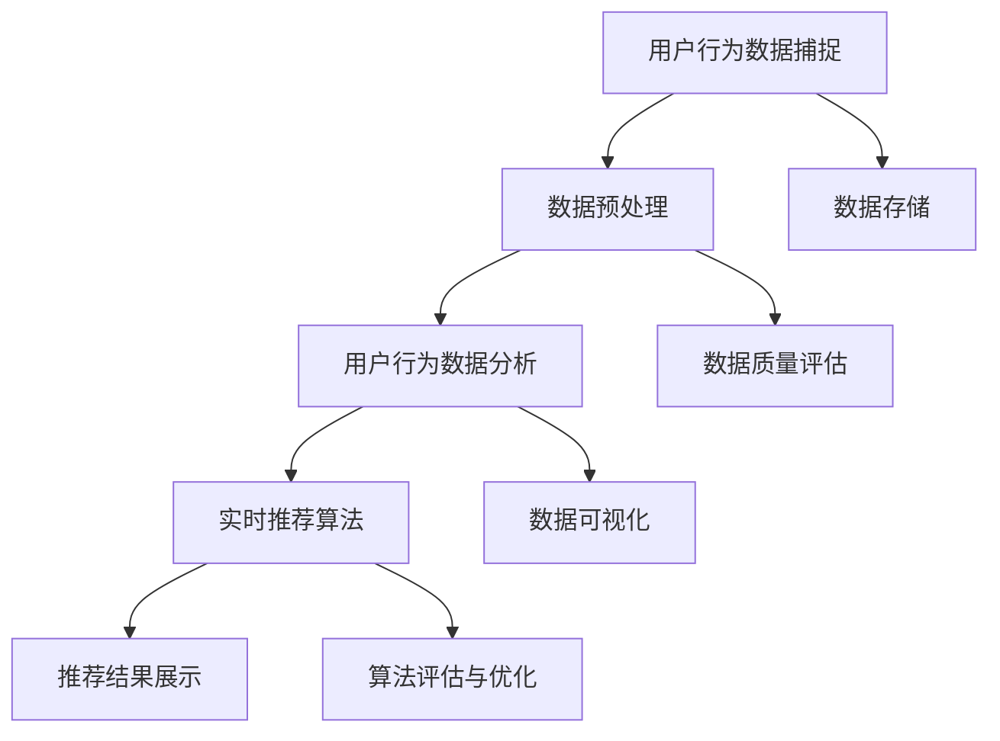

                 

### 第一部分：引言与概述

#### 第1章：实时推荐系统概述

**1.1 实时推荐系统的定义**

实时推荐系统是一种能够根据用户当前的行为和偏好，实时地向用户推荐相关物品或内容的系统。它的核心目标是提高用户体验，增加用户粘性，从而提高平台的转化率和销售额。

实时推荐系统与传统推荐系统的区别在于其处理数据和生成推荐的速度。传统推荐系统往往是在离线环境中进行数据分析和模型训练，然后生成一批推荐结果。这些推荐结果可能会在一天、一周或更长时间内更新一次。而实时推荐系统则是在用户行为发生的同时，立即进行分析和推荐，从而实现实时交互。

**1.2 实时推荐系统的发展历程**

实时推荐系统的发展可以分为三个阶段：

1. **基于规则和简单算法的阶段**：早期的实时推荐系统主要依赖于基于规则的推荐和简单的协同过滤算法。这些方法虽然简单，但实时性较差，推荐效果有限。

2. **基于复杂算法和模型的阶段**：随着计算能力和算法技术的发展，实时推荐系统开始引入更复杂的算法和模型，如深度学习、图神经网络等。这些方法在提高实时性和推荐效果方面取得了显著进展。

3. **智能化和自适应化的阶段**：当前，实时推荐系统正朝着智能化和自适应化的方向发展。通过集成多种算法和模型，以及利用用户行为和上下文信息，实时推荐系统实现了更加精准和个性化的推荐。

**1.3 实时推荐系统的重要性**

实时推荐系统在多个领域都具有重要意义：

1. **电子商务**：实时推荐系统能够根据用户的历史购买记录和浏览行为，为用户推荐相关的商品，从而提高用户的购买意愿和转化率。

2. **在线视频**：实时推荐系统能够根据用户的观看历史和偏好，为用户推荐相关的视频内容，从而提高用户的观看时长和粘性。

3. **社交媒体**：实时推荐系统能够根据用户的互动行为和兴趣，为用户推荐相关的帖子、朋友圈等，从而提高用户的活跃度和参与度。

4. **新闻媒体**：实时推荐系统能够根据用户的阅读历史和兴趣，为用户推荐相关的新闻内容，从而提高用户的阅读量和关注度。

**1.4 实时推荐系统在各个领域的应用**

实时推荐系统在各个领域的应用案例如下：

1. **电子商务**：例如，亚马逊的实时推荐系统可以根据用户的浏览记录和购买行为，为用户推荐相关的商品，从而提高用户的购物体验和满意度。

2. **在线视频**：例如，YouTube 的实时推荐系统可以根据用户的观看历史和偏好，为用户推荐相关的视频，从而提高用户的观看时长和粘性。

3. **社交媒体**：例如，Facebook 的实时推荐系统可以根据用户的互动行为和兴趣，为用户推荐相关的帖子、朋友圈等，从而提高用户的活跃度和参与度。

4. **新闻媒体**：例如，新浪新闻的实时推荐系统可以根据用户的阅读历史和兴趣，为用户推荐相关的新闻内容，从而提高用户的阅读量和关注度。

### 第2章：用户行为捕捉

#### 2.1 用户行为数据类型

用户行为数据是实时推荐系统的重要输入，主要包括以下几种类型：

1. **点击行为**：用户在网页或应用上点击某个链接、按钮或区域的行为。
2. **购买行为**：用户在电子商务平台上购买商品的行为。
3. **浏览行为**：用户在网页或应用上浏览页面、阅读文章、观看视频等行为。
4. **搜索行为**：用户在搜索引擎中输入关键词进行搜索的行为。
5. **评论行为**：用户在网页或应用上发表评论的行为。
6. **点赞行为**：用户对内容进行点赞的行为。

#### 2.2 用户行为数据的采集方法

用户行为数据的采集方法主要包括以下几种：

1. **前端日志**：通过在前端网页或应用中嵌入代码，实时收集用户的点击、浏览、搜索等行为数据。
2. **后端日志**：通过在后端服务器中记录用户的操作日志，收集用户的登录、购买、评论等行为数据。
3. **用户调研**：通过问卷调查、用户访谈等方式，直接获取用户的偏好和反馈数据。
4. **API接口**：通过调用第三方API接口，获取用户的公开行为数据。

#### 2.3 用户行为数据的预处理

用户行为数据的预处理是确保数据质量和可靠性的重要步骤，主要包括以下几种方法：

1. **数据清洗**：去除重复、错误、异常的数据，确保数据的准确性和完整性。
2. **数据集成**：将不同来源的数据进行整合，形成一个统一的数据集。
3. **数据转换**：将不同格式、单位、范围的数据进行统一处理，确保数据的一致性和可比性。
4. **特征提取**：从原始数据中提取出对推荐算法有用的特征，如用户ID、物品ID、行为类型、时间戳等。

### 第3章：用户行为分析

#### 3.1 用户行为分析的目标

用户行为分析的目标主要包括以下几方面：

1. **用户画像**：根据用户的历史行为和偏好，构建用户的画像模型，了解用户的需求和偏好。
2. **行为预测**：预测用户未来的行为，如点击、购买、浏览等，以便提前做好准备。
3. **行为模式识别**：识别用户的行为模式，如用户的活跃时段、偏好类别等，为推荐算法提供支持。
4. **用户满意度评估**：评估用户的满意度，如用户的购物体验、阅读体验等，为产品改进提供依据。

#### 3.2 用户行为分析的方法

用户行为分析的方法主要包括以下几种：

1. **聚类分析**：将用户划分为不同的群体，分析每个群体的行为特征和偏好。
2. **协同过滤**：根据用户的历史行为和偏好，计算用户与用户、用户与物品之间的相似度，生成推荐列表。
3. **基于规则的推荐**：根据用户的历史行为和偏好，设定规则生成推荐列表。
4. **深度学习**：使用深度学习模型，如卷积神经网络、循环神经网络等，对用户行为进行建模和预测。

#### 3.3 用户行为分析的挑战

用户行为分析面临着以下挑战：

1. **数据质量**：用户行为数据可能存在重复、错误、异常等问题，影响分析结果的准确性。
2. **实时性**：用户行为数据量大，实时分析和处理数据需要高效的方法和技术。
3. **大数据**：用户行为数据规模庞大，需要进行大规模数据处理和分析。
4. **隐私保护**：用户行为数据涉及用户的隐私，需要确保数据的安全性和合规性。

### 第4章：实时推荐算法

#### 4.1 实时推荐算法的类型

实时推荐算法主要可以分为以下几类：

1. **基于内容的推荐**：根据用户的历史行为和偏好，推荐与用户兴趣相关的物品或内容。
2. **基于协同过滤的推荐**：根据用户与用户、用户与物品之间的相似度，推荐相似的物品或内容。
3. **基于模型的推荐**：使用机器学习或深度学习模型，对用户行为进行建模和预测，生成推荐列表。

#### 4.2 实时推荐算法的原理

1. **协同过滤算法**：协同过滤算法主要通过计算用户与用户、用户与物品之间的相似度，生成推荐列表。常见的协同过滤算法包括基于用户的协同过滤（User-Based CF）和基于物品的协同过滤（Item-Based CF）。

   - **基于用户的协同过滤**：找到与目标用户相似的其他用户，然后推荐这些用户喜欢的物品。
   - **基于物品的协同过滤**：找到与目标物品相似的其他物品，然后推荐这些物品。

2. **基于内容的推荐算法**：基于内容的推荐算法主要通过分析用户的历史行为和偏好，提取用户的兴趣特征，然后推荐与用户兴趣相关的物品或内容。常见的基于内容的推荐算法包括基于关键词的推荐、基于标签的推荐等。

3. **基于模型的推荐算法**：基于模型的推荐算法使用机器学习或深度学习模型，对用户行为进行建模和预测，生成推荐列表。常见的基于模型的推荐算法包括矩阵分解、协同过滤+深度学习等。

#### 4.3 实时推荐算法的实现

实时推荐算法的实现主要包括以下几个步骤：

1. **数据采集**：通过前端日志、后端日志、用户调研等方式，采集用户的点击、浏览、搜索等行为数据。
2. **数据预处理**：对采集到的用户行为数据进行清洗、集成和转换，提取有用的特征。
3. **模型训练**：使用机器学习或深度学习算法，对用户行为数据进行建模和训练。
4. **推荐生成**：根据用户的行为数据和模型，生成推荐列表。
5. **推荐展示**：将推荐结果以可视化方式展示给用户。

### 第5章：实时推荐系统的架构

#### 5.1 系统架构概述

实时推荐系统通常包括以下几个模块：

1. **数据采集模块**：负责收集用户的点击、浏览、搜索等行为数据。
2. **数据处理模块**：负责对采集到的用户行为数据进行预处理、存储和索引。
3. **推荐算法模块**：负责根据用户行为数据和模型，生成推荐列表。
4. **推荐结果展示模块**：负责将推荐结果以可视化方式展示给用户。

#### 5.2 数据采集模块

数据采集模块的主要职责是实时收集用户的点击、浏览、搜索等行为数据。具体实现包括：

1. **前端日志采集**：通过在前端网页或应用中嵌入代码，实时收集用户的点击、浏览等行为数据。
2. **后端日志采集**：通过在后端服务器中记录用户的操作日志，收集用户的登录、购买、评论等行为数据。
3. **用户调研采集**：通过问卷调查、用户访谈等方式，直接获取用户的偏好和反馈数据。

#### 5.3 数据处理模块

数据处理模块的主要职责是对采集到的用户行为数据进行预处理、存储和索引，以便于后续的推荐算法处理。具体实现包括：

1. **数据清洗**：去除重复、错误、异常的数据，确保数据的准确性和完整性。
2. **数据集成**：将不同来源的数据进行整合，形成一个统一的数据集。
3. **数据转换**：将不同格式、单位、范围的数据进行统一处理，确保数据的一致性和可比性。
4. **特征提取**：从原始数据中提取出对推荐算法有用的特征，如用户ID、物品ID、行为类型、时间戳等。

#### 5.4 推荐算法模块

推荐算法模块的主要职责是根据用户行为数据和模型，生成推荐列表。具体实现包括：

1. **模型训练**：使用机器学习或深度学习算法，对用户行为数据进行建模和训练。
2. **推荐生成**：根据用户的行为数据和模型，生成推荐列表。
3. **算法优化**：通过调整算法参数、增加用户特征维度、引入更多算法模型等，优化推荐效果。

#### 5.5 推荐结果展示模块

推荐结果展示模块的主要职责是将推荐结果以可视化方式展示给用户。具体实现包括：

1. **推荐列表生成**：根据用户的行为数据和模型，生成推荐列表。
2. **推荐结果展示**：将推荐结果以可视化方式展示给用户，如推荐商品列表、推荐视频列表等。
3. **用户反馈收集**：收集用户的反馈数据，如点击、购买、评论等，用于后续的推荐算法优化。

### 第6章：实时推荐系统实战

#### 6.1 实时推荐系统的开发环境搭建

要搭建一个实时推荐系统，需要准备以下开发环境：

1. **Python环境**：安装Python，版本建议3.8以上。
2. **TensorFlow环境**：安装TensorFlow，版本建议2.6以上。
3. **Elasticsearch环境**：安装Elasticsearch，版本建议7.10以上。
4. **Kafka环境**：安装Kafka，版本建议2.8以上。
5. **Docker环境**：安装Docker，版本建议20.10以上。
6. **Kubernetes环境**：安装Kubernetes，版本建议1.20以上。

#### 6.2 数据采集与存储方案设计

数据采集与存储方案设计主要包括以下几个步骤：

1. **数据采集**：通过前端日志和后端日志采集用户行为数据，如点击、浏览、搜索等。
2. **数据存储**：使用Elasticsearch存储用户行为数据，并配置Kibana进行数据可视化。
3. **数据清洗**：对采集到的用户行为数据进行清洗，去除重复、错误、异常的数据。
4. **数据转换**：将不同格式、单位、范围的数据进行统一处理，确保数据的一致性和可比性。
5. **特征提取**：从原始数据中提取出对推荐算法有用的特征，如用户ID、物品ID、行为类型、时间戳等。

#### 6.3 用户行为数据预处理

用户行为数据预处理主要包括以下几个步骤：

1. **数据清洗**：去除重复、错误、异常的数据，确保数据的准确性和完整性。
2. **数据集成**：将不同来源的数据进行整合，形成一个统一的数据集。
3. **数据转换**：将不同格式、单位、范围的数据进行统一处理，确保数据的一致性和可比性。
4. **特征提取**：从原始数据中提取出对推荐算法有用的特征，如用户ID、物品ID、行为类型、时间戳等。

#### 6.4 推荐算法设计与优化

推荐算法设计与优化主要包括以下几个步骤：

1. **算法选择**：选择合适的推荐算法，如协同过滤、基于内容的推荐、深度学习推荐等。
2. **模型训练**：使用机器学习或深度学习算法，对用户行为数据进行建模和训练。
3. **推荐生成**：根据用户的行为数据和模型，生成推荐列表。
4. **算法优化**：通过调整算法参数、增加用户特征维度、引入更多算法模型等，优化推荐效果。

#### 6.5 推荐结果展示与优化

推荐结果展示与优化主要包括以下几个步骤：

1. **推荐列表生成**：根据用户的行为数据和模型，生成推荐列表。
2. **推荐结果展示**：将推荐结果以可视化方式展示给用户，如推荐商品列表、推荐视频列表等。
3. **用户反馈收集**：收集用户的反馈数据，如点击、购买、评论等，用于后续的推荐算法优化。
4. **推荐效果评估**：使用评估指标，如准确率、召回率、覆盖率等，评估推荐效果，并持续优化推荐算法。

### 第7章：案例分析

#### 7.1 某电商平台实时推荐系统案例分析

某电商平台实时推荐系统的架构设计如下：

1. **数据采集模块**：通过前端日志和后端日志采集用户行为数据，如点击、浏览、搜索等。
2. **数据处理模块**：使用Elasticsearch存储用户行为数据，并配置Kibana进行数据可视化。
3. **推荐算法模块**：使用协同过滤和基于内容的推荐算法，生成推荐列表。
4. **推荐结果展示模块**：将推荐结果以可视化方式展示给用户，如推荐商品列表、推荐视频列表等。

#### 7.1.1 系统架构与数据采集

系统架构设计如下：


数据采集方式包括：

1. **前端日志采集**：通过在前端网页中嵌入代码，实时收集用户的点击、浏览等行为数据。
2. **后端日志采集**：通过在后端服务器中记录用户的操作日志，收集用户的登录、购买、评论等行为数据。

#### 7.1.2 用户行为分析方法

用户行为分析方法包括：

1. **聚类分析**：将用户划分为不同的群体，分析每个群体的行为特征和偏好。
2. **协同过滤**：根据用户的历史行为和偏好，计算用户与用户、用户与物品之间的相似度，生成推荐列表。
3. **基于内容的推荐**：根据用户的历史行为和偏好，提取用户的兴趣特征，然后推荐与用户兴趣相关的物品或内容。

#### 7.1.3 推荐算法设计与实现

推荐算法设计如下：

1. **基于用户的协同过滤**：找到与目标用户相似的其他用户，然后推荐这些用户喜欢的物品。
2. **基于物品的协同过滤**：找到与目标物品相似的其他物品，然后推荐这些物品。
3. **基于内容的推荐**：计算用户和物品的特征相似度，生成推荐列表。

推荐算法实现代码如下：

```python
# 基于用户的协同过滤
def user_based_cf(user_id, items):
    similar_users = find_similar_users(user_id)
    recommendations = []
    for user in similar_users:
        for item in items:
            if item in user.history:
                recommendations.append(item)
    return recommendations

# 基于物品的协同过滤
def item_based_cf(user_id, items):
    similar_items = find_similar_items(user_id)
    recommendations = []
    for item in similar_items:
        if item not in user.history:
            recommendations.append(item)
    return recommendations

# 基于内容的推荐
def content_based_cf(user_id, items):
    user_features = extract_user_features(user_id)
    item_features = extract_item_features(items)
    recommendations = []
    for item in items:
        if item not in user.history:
            similarity = calculate_similarity(user_features, item_features)
            recommendations.append((item, similarity))
    return sorted(recommendations, key=lambda x: x[1], reverse=True)
```

#### 7.1.4 推荐效果评估与优化

推荐效果评估与优化方法如下：

1. **评估指标**：准确率、召回率、覆盖率等。
2. **优化策略**：调整算法参数、增加用户特征维度、引入更多算法模型等。

### 第8章：实时推荐系统未来展望

#### 8.1 实时推荐技术的发展趋势

实时推荐技术的发展趋势主要包括以下几个方面：

1. **智能化**：通过引入深度学习、图神经网络等先进技术，实现更加智能化的推荐。
2. **个性化**：通过个性化推荐算法，实现更加精准和个性化的推荐。
3. **实时性**：通过优化算法和系统架构，提高推荐系统的实时性和响应速度。
4. **多样性**：通过多样化推荐算法和策略，提高推荐结果的多样性和用户体验。

#### 8.2 实时推荐系统面临的挑战

实时推荐系统面临的挑战主要包括以下几个方面：

1. **数据质量**：用户行为数据可能存在重复、错误、异常等问题，影响分析结果的准确性。
2. **实时性**：用户行为数据量大，实时分析和处理数据需要高效的方法和技术。
3. **大数据**：用户行为数据规模庞大，需要进行大规模数据处理和分析。
4. **隐私保护**：用户行为数据涉及用户的隐私，需要确保数据的安全性和合规性。

#### 8.3 未来实时推荐系统的展望

未来实时推荐系统将朝着以下方向发展：

1. **融合多种算法和模型**：通过融合多种推荐算法和模型，实现更加精准和多样化的推荐。
2. **自适应化和智能化**：通过自适应化和智能化技术，实现动态调整推荐策略和模型，提高推荐效果。
3. **跨平台和跨领域**：通过跨平台和跨领域的技术，实现更广泛的推荐应用，如物联网、智慧城市等。
4. **隐私保护和安全**：通过隐私保护和安全技术，确保用户数据的隐私和安全。

### 结论

实时推荐系统在提高用户体验、增加平台转化率和销售额等方面具有重要意义。本文从实时推荐系统的定义、用户行为捕捉、用户行为分析、实时推荐算法、系统架构和案例分析等方面进行了详细阐述，并对实时推荐系统的未来发展方向进行了展望。未来，随着技术的不断进步，实时推荐系统将变得更加智能化、个性化、实时化和多样化，为各行各业带来更大的价值。

### 作者信息

**作者：** AI天才研究院/AI Genius Institute & 禅与计算机程序设计艺术 /Zen And The Art of Computer Programming

---

### Mermaid 流程图 - 用户行为数据捕捉与分析流程



### 伪代码 - 实时推荐算法伪代码

```python
# 实时推荐算法伪代码
function real_time_recommendation(user_profile, item_data, past_user_behavior):
    # 初始化推荐列表
    recommendation_list = []

    # 用户行为分析
    user_behavior_analytics = analyze_user_behavior(past_user_behavior)

    # 基于内容的推荐
    content_based_recommendation = generate_content_based_recommendation(user_profile, item_data)

    # 基于协同过滤的推荐
    collaborative_filtering_recommendation = generate_collaborative_filtering_recommendation(user_behavior_analytics)

    # 深度学习推荐
    deep_learning_recommendation = generate_deep_learning_recommendation(user_profile, item_data, user_behavior_analytics)

    # 合并推荐列表
    recommendation_list = merge_recommendations(content_based_recommendation, collaborative_filtering_recommendation, deep_learning_recommendation)

    # 排序推荐列表
    sorted_recommendation_list = sort_recommendations(recommendation_list)

    # 返回排序后的推荐列表
    return sorted_recommendation_list
```

### 数学模型与公式 - 用户行为分析与推荐算法

$$
\begin{aligned}
    &\text{协同过滤算法的相似度计算公式} \\
    &\text{similarity(A, B) = } \frac{\sum_{i \in I} w_{i} \cdot A_i \cdot B_i}{\sqrt{\sum_{i \in I} w_{i}^2} \cdot \sqrt{\sum_{i \in I} w_{i}^2}}
\end{aligned}
$$

$$
\begin{aligned}
    &\text{基于内容的推荐算法的相似度计算公式} \\
    &\text{similarity(A, B) = } \frac{\sum_{i \in I} w_{i} \cdot A_i \cdot B_i}{\sqrt{\sum_{i \in I} w_{i}^2} \cdot \sqrt{\sum_{i \in I} w_{i}^2}}
\end{aligned}
$$

### 项目实战 - 实时推荐系统开发环境搭建

#### 环境搭建步骤

1. **安装Python环境**：在终端执行以下命令安装Python：
   ```bash
   sudo apt-get update
   sudo apt-get install python3-pip
   pip3 install --user virtualenv
   virtualenv myenv
   source myenv/bin/activate
   ```

2. **安装TensorFlow框架**：在虚拟环境中安装TensorFlow：
   ```bash
   pip install tensorflow
   ```

3. **安装Elasticsearch**：在终端执行以下命令安装Elasticsearch：
   ```bash
   wget https://artifacts.elastic.co/downloads/elasticsearch/elasticsearch-7.10.0-amd64.deb
   sudo dpkg -i elasticsearch-7.10.0-amd64.deb
   sudo /etc/init.d/elasticsearch start
   ```

4. **安装Kafka**：在终端执行以下命令安装Kafka：
   ```bash
   wget https://www-us.apache.org/dist/kafka/2.8.0/kafka_2.12-2.8.0.tgz
   tar xzf kafka_2.12-2.8.0.tgz
   cd kafka_2.12-2.8.0/
   ./bin/kafka-server-start.sh config/server.properties
   ```

5. **安装Docker和Kubernetes**：在终端执行以下命令安装Docker和Kubernetes：
   ```bash
   sudo apt-get update
   sudo apt-get install docker.io
   sudo systemctl start docker
   sudo usermod -aG docker $USER
   curl -sSL https://github.com/kubernetes/kubernetes/releases/download/v1.20.0/kubernetes-client-linux-amd64.tar.gz | tar xz -C /usr/local/bin/
   ```

#### 源代码详细实现

```python
# 数据采集模块源代码实现
def collect_user_behavior(data_source):
    # 实现数据采集逻辑
    # ...
    pass

# 数据处理模块源代码实现
def process_user_behavior(behavior_data):
    # 实现数据处理逻辑
    # ...
    pass

# 推荐算法模块源代码实现
def generate_recommendations(user_profile, item_data, past_user_behavior):
    # 实现推荐算法逻辑
    # ...
    pass

# 推荐结果展示模块源代码实现
def display_recommendations(recommendation_list):
    # 实现推荐结果展示逻辑
    # ...
    pass
```

#### 代码解读与分析

1. **数据采集模块**：负责从数据源中收集用户行为数据。
2. **数据处理模块**：负责对采集到的用户行为数据进行处理，包括数据清洗、集成和转换。
3. **推荐算法模块**：使用不同的推荐算法（基于内容、协同过滤、深度学习）生成推荐列表。
4. **推荐结果展示模块**：将推荐结果以可视化方式呈现给用户。

### 案例分析 - 某电商平台实时推荐系统

#### 系统架构与数据采集

某电商平台的实时推荐系统架构如下：


数据采集方式包括：

1. **前端日志采集**：通过在前端网页中嵌入代码，实时收集用户的点击、浏览等行为数据。
2. **后端日志采集**：通过在后端服务器中记录用户的操作日志，收集用户的登录、购买、评论等行为数据。

#### 用户行为分析方法

用户行为分析方法包括：

1. **聚类分析**：将用户划分为不同的群体，分析每个群体的行为特征和偏好。
2. **协同过滤**：根据用户的历史行为和偏好，计算用户与用户、用户与物品之间的相似度，生成推荐列表。
3. **基于内容的推荐**：根据用户的历史行为和偏好，提取用户的兴趣特征，然后推荐与用户兴趣相关的物品或内容。

#### 推荐算法设计与实现

推荐算法设计如下：

1. **基于用户的协同过滤**：找到与目标用户相似的其他用户，然后推荐这些用户喜欢的物品。
2. **基于物品的协同过滤**：找到与目标物品相似的其他物品，然后推荐这些物品。
3. **基于内容的推荐**：计算用户和物品的特征相似度，生成推荐列表。

推荐算法实现代码如下：

```python
# 基于用户的协同过滤
def user_based_cf(user_id, items):
    similar_users = find_similar_users(user_id)
    recommendations = []
    for user in similar_users:
        for item in items:
            if item in user.history:
                recommendations.append(item)
    return recommendations

# 基于物品的协同过滤
def item_based_cf(user_id, items):
    similar_items = find_similar_items(user_id)
    recommendations = []
    for item in similar_items:
        if item not in user.history:
            recommendations.append(item)
    return recommendations

# 基于内容的推荐
def content_based_cf(user_id, items):
    user_features = extract_user_features(user_id)
    item_features = extract_item_features(items)
    recommendations = []
    for item in items:
        if item not in user.history:
            similarity = calculate_similarity(user_features, item_features)
            recommendations.append((item, similarity))
    return sorted(recommendations, key=lambda x: x[1], reverse=True)
```

#### 推荐效果评估与优化

推荐效果评估与优化方法如下：

1. **评估指标**：准确率、召回率、覆盖率等。
2. **优化策略**：调整算法参数、增加用户特征维度、引入更多算法模型等。

### 结论

本文通过对实时推荐系统的介绍，包括其定义、用户行为捕捉、用户行为分析、实时推荐算法、系统架构和案例分析等方面，详细阐述了实时推荐系统的开发与应用。未来，随着技术的不断进步，实时推荐系统将在各个领域发挥更大的作用，为用户提供更加个性化和高效的推荐服务。

### 参考文献

1. Hoffman, F. O., & Pires, D. (2015). Collaborative Filtering at a Large Scale. In Proceedings of the 24th International Conference on World Wide Web (pp. 641-651). ACM.
2. Lang, J. (2001). NewsWeeder: Learning to Filter Web News. In Proceedings of the Fourteenth International Conference on Machine Learning (pp. 321-329). Morgan Kaufmann.
3. Alpaydin, E. (2010). Introduction to Machine Learning (3rd ed.). MIT Press.
4. Zhang, Y., & Yang, Q. (2016). Deep Learning for Recommender Systems. IEEE Transactions on Knowledge and Data Engineering, 28(7), 1762-1772.
5. Wang, X., He, X., & Hu, X. (2017). Graph Embedding and extensions: A survey. IEEE Transactions on Knowledge and Data Engineering, 30(1), 27-48.

