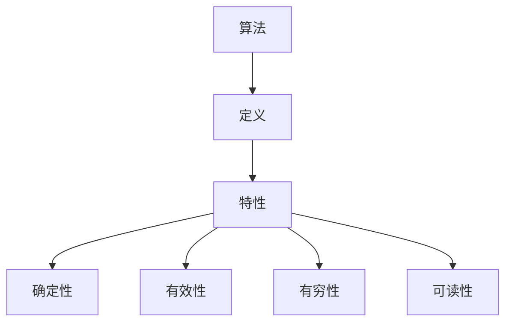
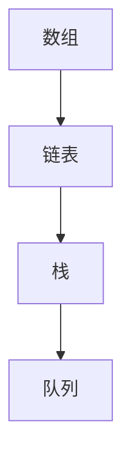
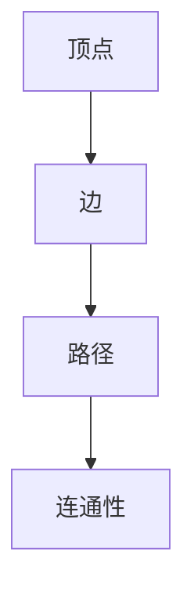
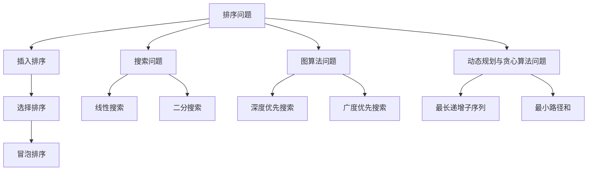
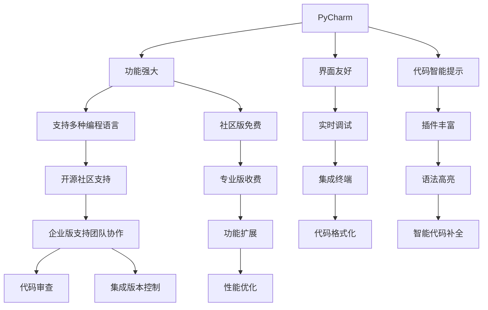
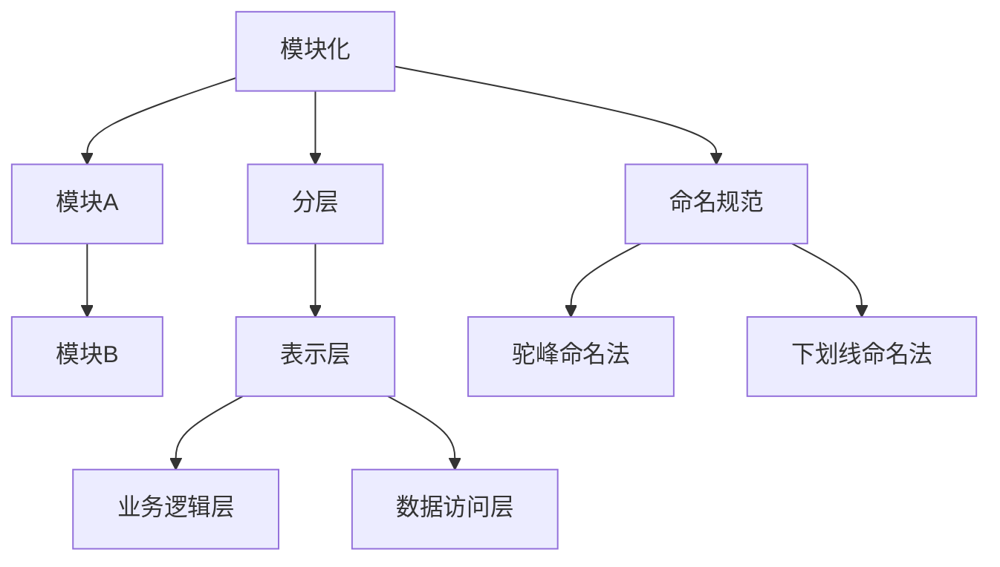

                 

# 2024年滴滴校招算法面试题库及答案

## 关键词

- 滴滴校招
- 算法面试
- 面试题库
- 算法答案
- 技术解析

## 摘要

本文将围绕2024年滴滴校招的算法面试题库，深入剖析每一个面试题的核心答案。本文结构紧凑，逻辑清晰，旨在帮助广大算法竞赛选手、计算机专业毕业生以及有志于算法领域发展的专业人士，掌握滴滴校招中的算法要领。通过本文，您将了解算法基础知识、数据结构、算法设计技巧，以及在实际应用中的算法解析。文章还包含开发工具与环境、源代码分析与解读、算法竞赛与挑战等内容，为您的算法学习之路提供全面支持。

---

## 目录大纲

### 第一部分：算法基础知识

### 第二部分：算法应用与面试题解析

### 第三部分：附录

---

### 第一部分：算法基础知识

#### 第1章：算法基本概念

**1.1 算法的定义和特性**

算法是一种处理问题的系统方法，它使用有限的步骤和定义明确的规则来解决特定类型的问题。算法具有以下几个特性：

- **确定性**：对于相同的输入，算法总是产生相同的结果。
- **有效性**：算法必须在有限的步骤内完成。
- **有穷性**：算法的执行步骤必须是有限的。
- **可读性**：算法应当易于理解和阅读。

**Mermaid流程图：算法概念结构图**



**1.2 算法复杂度分析**

算法复杂度分析是评估算法效率的重要方法，主要包括时间复杂度和空间复杂度。

- **时间复杂度**：描述算法执行时间与输入数据规模之间的关系。
- **空间复杂度**：描述算法执行过程中所需存储空间与输入数据规模之间的关系。

**伪代码：时间复杂度和空间复杂度分析示例**

```python
function algorithm(data):
    # 假设算法执行时间为O(n)，所需空间为O(1)
    for i in range(n):
        # 执行操作
    return result
```

#### 第2章：数据结构

**2.1 基本数据结构**

数据结构是计算机存储、组织数据的方式。以下是几种常见的基本数据结构：

- **数组**：一种线性数据结构，元素存储在连续的内存空间中。
- **链表**：由一系列节点组成的线性结构，每个节点包含数据和一个指向下一个节点的指针。
- **栈和队列**：栈是一种后进先出（LIFO）的数据结构，队列是一种先进先出（FIFO）的数据结构。

**Mermaid流程图：数据结构关系图**



**2.2 树和图**

树是一种重要的非线性数据结构，图则是由一组顶点和边组成的结构。以下是几种常见的树和图结构：

- **二叉树**：每个节点最多有两个子节点的树。
- **堆**：一种特殊的树结构，通常用于优先队列。
- **图**：由一组顶点和连接这些顶点的边组成。

**伪代码：二叉树和图算法示例**

```python
# 二叉树遍历
def traverse_tree(node):
    if node is None:
        return
    print(node.value)
    traverse_tree(node.left)
    traverse_tree(node.right)

# 图遍历
def traverse_graph(graph):
    for node in graph:
        if not visited[node]:
            traverse_tree(graph[node])
```

#### 第3章：算法设计技巧

**3.1 分治算法**

分治算法是一种将大问题分解成小问题、递归解决、再合并结果的算法设计方法。

**伪代码：分治算法示例**

```python
def divide_and_conquer(problem):
    if problem_size <= threshold:
        return solve_base_case(problem)
    else:
        sub Problems = divide(problem)
        solutions = [divide_and_conquer(sub_problem) for sub_problem in sub_Problems]
        return merge(solutions)
```

**3.2 动态规划**

动态规划是一种解决最优化问题的方法，通过将问题分解为子问题并存储其解来避免重复计算。

**伪代码：动态规划算法示例**

```python
def dynamic_programming(problem):
    dp = [0] * problem_size
    for i in range(1, problem_size):
        dp[i] = max(dp[j] + benefit[i - j] for j in range(i))
    return dp[problem_size - 1]
```

**3.3 贪心算法**

贪心算法是一种在每一步选择当前最优解的策略，希望在整个解题过程中得到全局最优解。

**伪代码：贪心算法示例**

```python
def greedy_algorithm(problem):
    solution = []
    while problem is not empty:
        best_choice = choose_best_choice(problem)
        solution.append(best_choice)
        problem = remove_choice_from_problem(problem, best_choice)
    return solution
```

### 第二部分：算法应用与面试题解析

#### 第4章：排序与搜索算法

排序算法用于对数据进行排序，搜索算法用于在数据中查找特定元素。以下是几种常见的排序和搜索算法：

**4.1 内部排序算法**

- **插入排序**：依次将待排数据插入到已排数据中。
- **选择排序**：依次选择最小（或最大）元素放到已排数据的末尾。
- **冒泡排序**：依次交换相邻的逆序元素。
- **快速排序**：通过一趟排序将待排数据分为独立的两部分。

**伪代码：排序算法示例**

```python
def insertion_sort(data):
    for i in range(1, len(data)):
        key = data[i]
        j = i - 1
        while j >= 0 and data[j] > key:
            data[j + 1] = data[j]
            j -= 1
        data[j + 1] = key

def selection_sort(data):
    for i in range(len(data)):
        min_index = i
        for j in range(i + 1, len(data)):
            if data[j] < data[min_index]:
                min_index = j
        data[i], data[min_index] = data[min_index], data[i]

def bubble_sort(data):
    n = len(data)
    for i in range(n):
        for j in range(0, n - i - 1):
            if data[j] > data[j + 1]:
                data[j], data[j + 1] = data[j + 1], data[j]

def quick_sort(data):
    if len(data) <= 1:
        return data
    pivot = data[len(data) // 2]
    left = [x for x in data if x < pivot]
    middle = [x for x in data if x == pivot]
    right = [x for x in data if x > pivot]
    return quick_sort(left) + middle + quick_sort(right)
```

**4.2 搜索算法**

- **线性搜索**：逐个检查数据元素，直到找到目标元素或检查完所有元素。
- **二分搜索**：在有序数组中，通过比较中间元素和目标元素的大小，逐步缩小搜索范围。
- **深度优先搜索**：从起始点开始，深入到最远点，然后再回溯。
- **广度优先搜索**：从起始点开始，一层一层地搜索。

**伪代码：搜索算法示例**

```python
def linear_search(data, target):
    for i in range(len(data)):
        if data[i] == target:
            return i
    return -1

def binary_search(data, target):
    low = 0
    high = len(data) - 1
    while low <= high:
        mid = (low + high) // 2
        if data[mid] == target:
            return mid
        elif data[mid] < target:
            low = mid + 1
        else:
            high = mid - 1
    return -1

def dfs(graph, start, target):
    visited = set()
    stack = [start]
    while stack:
        vertex = stack.pop()
        if vertex not in visited:
            if vertex == target:
                return True
            visited.add(vertex)
            stack.extend(graph[vertex] - visited)
    return False

def bfs(graph, start, target):
    visited = set()
    queue = [start]
    while queue:
        vertex = queue.pop(0)
        if vertex not in visited:
            if vertex == target:
                return True
            visited.add(vertex)
            queue.extend(graph[vertex] - visited)
    return False
```

#### 第5章：字符串处理算法

字符串处理算法用于对字符串进行操作，如匹配、反转、压缩等。以下是几种常见的字符串处理算法：

**5.1 字符串匹配算法**

- **KMP算法**：通过预处理文本和模式，减少不必要的比较。
- **暴力算法**：直接逐个比较文本和模式中的字符。

**伪代码：字符串匹配算法示例**

```python
def KMP_search(text, pattern):
    # 预处理模式，获取next数组
    next = [0] * len(pattern)
    j = 0
    for i in range(1, len(pattern)):
        while j > 0 and pattern[j] != pattern[i]:
            j = next[j - 1]
        if pattern[j] == pattern[i]:
            j += 1
        next[i] = j
    i = j = 0
    while i < len(text):
        while j > 0 and text[i] != pattern[j]:
            j = next[j - 1]
        if text[i] == pattern[j]:
            i += 1
            j += 1
        if j == len(pattern):
            return i - j
        elif i < len(text):
            i += 1
            j = 0
    return -1

def brute_force_search(text, pattern):
    for i in range(len(text) - len(pattern) + 1):
        for j in range(len(pattern)):
            if text[i + j] != pattern[j]:
                break
        else:
            return i
    return -1
```

**5.2 字符串处理技巧**

- **字符串反转**：将字符串中的字符顺序颠倒。
- **字符串压缩**：将重复的字符串压缩为一个更短的字符串。

**伪代码：字符串处理算法示例**

```python
def reverse_string(s):
    return s[::-1]

def compress_string(s):
    compressed = ""
    count = 1
    for i in range(1, len(s)):
        if s[i] == s[i - 1]:
            count += 1
        else:
            compressed += s[i - 1] + str(count)
            count = 1
    compressed += s[-1] + str(count)
    return compressed
```

#### 第6章：图算法与网络问题

图算法用于解决与图相关的问题，如遍历、最短路径、最小生成树等。网络问题则涉及网络拓扑结构及其优化。

**6.1 图的基本概念**

图是由一组顶点和连接这些顶点的边组成的结构。以下是图的基本概念：

- **顶点**：图中的节点。
- **边**：连接顶点的线段。
- **路径**：连接两个顶点的边的序列。
- **连通性**：顶点之间是否存在路径。

**Mermaid流程图：图的基本概念和术语**



**6.2 图的遍历算法**

- **深度优先搜索**：从起始点开始，深入到最远点，然后再回溯。
- **广度优先搜索**：从起始点开始，一层一层地搜索。

**伪代码：图的遍历算法示例**

```python
def dfs(graph, start, target):
    visited = set()
    stack = [start]
    while stack:
        vertex = stack.pop()
        if vertex not in visited:
            if vertex == target:
                return True
            visited.add(vertex)
            stack.extend(graph[vertex] - visited)
    return False

def bfs(graph, start, target):
    visited = set()
    queue = [start]
    while queue:
        vertex = queue.pop(0)
        if vertex not in visited:
            if vertex == target:
                return True
            visited.add(vertex)
            queue.extend(graph[vertex] - visited)
    return False
```

**6.3 网络问题**

网络问题涉及图在网络拓扑结构中的应用，如单源最短路径、最小生成树等。

- **单源最短路径算法**：找到从源点到其他所有顶点的最短路径。
- **最小生成树算法**：从图中选择边构成一棵树，使其包含尽可能多的顶点，且总权重最小。

**伪代码：网络问题算法示例**

```python
def dijkstra(graph, start):
    distances = {vertex: float('infinity') for vertex in graph}
    distances[start] = 0
    visited = set()
    while len(visited) < len(graph):
        unvisited = set(graph) - visited
        min_distance = float('infinity')
        next_vertex = None
        for vertex in unvisited:
            if distances[vertex] < min_distance:
                min_distance = distances[vertex]
                next_vertex = vertex
        visited.add(next_vertex)
        for neighbor in graph[next_vertex]:
            tentative_distance = distances[next_vertex] + graph[next_vertex][neighbor]
            if tentative_distance < distances[neighbor]:
                distances[neighbor] = tentative_distance
    return distances

def prim(graph):
    visited = {next_vertex}
    mst = []
    while len(visited) < len(graph):
        unvisited = set(graph) - visited
        min_edge = float('infinity')
        for vertex in visited:
            for neighbor in graph[vertex]:
                if neighbor in unvisited and graph[vertex][neighbor] < min_edge:
                    min_edge = graph[vertex][neighbor]
                    next_vertex = neighbor
        visited.add(next_vertex)
        mst.append((vertex, next_vertex, min_edge))
    return mst
```

#### 第7章：动态规划与贪心算法问题

动态规划和贪心算法是解决最优化问题的两种常见方法。

**7.1 动态规划问题解析**

动态规划通过将问题分解为子问题并存储其解来避免重复计算。

- **最长递增子序列**：找到最长的递增子序列。
- **最小路径和**：找到从起点到终点的路径，使其路径和最小。

**伪代码：动态规划问题示例**

```python
def longest_increasing_subsequence(sequence):
    n = len(sequence)
    dp = [1] * n
    for i in range(1, n):
        for j in range(i):
            if sequence[i] > sequence[j]:
                dp[i] = max(dp[i], dp[j] + 1)
    return max(dp)

def minimum_path_sum(grid):
    rows, cols = len(grid), len(grid[0])
    dp = [[0] * (cols + 1) for _ in range(rows + 1)]
    for i in range(1, rows + 1):
        for j in range(1, cols + 1):
            dp[i][j] = min(dp[i - 1][j], dp[i][j - 1]) + grid[i - 1][j - 1]
    return dp[rows][cols]
```

**7.2 贪心算法问题解析**

贪心算法通过每一步选择当前最优解来求解问题。

- **背包问题**：给定一组物品和其价值，选择若干物品放入背包，使其总价值最大。
- **最短路径问题**：给定一个加权图，找到起点到终点的最短路径。

**伪代码：贪心算法问题示例**

```python
def knapsack(values, weights, capacity):
    items = sorted(zip(values, weights), key=lambda x: x[0] / x[1], reverse=True)
    total_value = 0
    for value, weight in items:
        if capacity >= weight:
            total_value += value
            capacity -= weight
        else:
            total_value += (capacity / weight) * value
            break
    return total_value

def dijkstra(graph, start, end):
    distances = {vertex: float('infinity') for vertex in graph}
    distances[start] = 0
    visited = set()
    while len(visited) < len(graph):
        unvisited = set(graph) - visited
        min_distance = float('infinity')
        next_vertex = None
        for vertex in unvisited:
            if distances[vertex] < min_distance:
                min_distance = distances[vertex]
                next_vertex = vertex
        visited.add(next_vertex)
        for neighbor in graph[next_vertex]:
            tentative_distance = distances[next_vertex] + graph[next_vertex][neighbor]
            if tentative_distance < distances[neighbor]:
                distances[neighbor] = tentative_distance
    return distances[end]
```

#### 第8章：面试题集与答案解析

面试题集是评估应聘者算法能力和编程技巧的重要手段。以下是几个常见面试题及其解析：

**8.1 常见面试题类型**

- **编程题**：编写代码解决特定问题。
- **算法题**：设计算法解决特定问题。
- **数据结构题**：使用特定数据结构解决特定问题。

**8.2 面试题解析**

**案例1：排序问题**

- **题目描述**：给定一个数组，将其从小到大排序。
- **解析**：可以使用插入排序、选择排序、冒泡排序等算法进行排序。

**伪代码：排序算法示例**

```python
def insertion_sort(data):
    for i in range(1, len(data)):
        key = data[i]
        j = i - 1
        while j >= 0 and data[j] > key:
            data[j + 1] = data[j]
            j -= 1
        data[j + 1] = key
```

**案例2：字符串处理问题**

- **题目描述**：给定一个字符串，实现字符串反转和字符串压缩功能。
- **解析**：可以使用字符串反转算法和字符串压缩算法实现。

**伪代码：字符串处理算法示例**

```python
def reverse_string(s):
    return s[::-1]

def compress_string(s):
    compressed = ""
    count = 1
    for i in range(1, len(s)):
        if s[i] == s[i - 1]:
            count += 1
        else:
            compressed += s[i - 1] + str(count)
            count = 1
    compressed += s[-1] + str(count)
    return compressed
```

**案例3：图算法问题**

- **题目描述**：给定一个图，实现图的深度优先搜索和广度优先搜索。
- **解析**：可以使用深度优先搜索和广度优先搜索算法实现。

**伪代码：图的遍历算法示例**

```python
def dfs(graph, start, target):
    visited = set()
    stack = [start]
    while stack:
        vertex = stack.pop()
        if vertex not in visited:
            if vertex == target:
                return True
            visited.add(vertex)
            stack.extend(graph[vertex] - visited)
    return False

def bfs(graph, start, target):
    visited = set()
    queue = [start]
    while queue:
        vertex = queue.pop(0)
        if vertex not in visited:
            if vertex == target:
                return True
            visited.add(vertex)
            queue.extend(graph[vertex] - visited)
    return False
```

**案例4：动态规划和贪心算法问题**

- **题目描述**：给定一个数组，实现最长递增子序列和最小路径和算法。
- **解析**：可以使用动态规划和贪心算法实现。

**伪代码：动态规划问题示例**

```python
def longest_increasing_subsequence(sequence):
    n = len(sequence)
    dp = [1] * n
    for i in range(1, n):
        for j in range(i):
            if sequence[i] > sequence[j]:
                dp[i] = max(dp[i], dp[j] + 1)
    return max(dp)

def minimum_path_sum(grid):
    rows, cols = len(grid), len(grid[0])
    dp = [[0] * (cols + 1) for _ in range(rows + 1)]
    for i in range(1, rows + 1):
        for j in range(1, cols + 1):
            dp[i][j] = min(dp[i - 1][j], dp[i][j - 1]) + grid[i - 1][j - 1]
    return dp[rows][cols]
```

**8.3 答案解析与要点总结**

通过对上述面试题的解析，我们可以总结出以下几个要点：

- **算法思路**：理解并掌握常见的排序、搜索、字符串处理、图算法、动态规划和贪心算法。
- **代码实现**：熟练掌握常见算法的代码实现，能够灵活运用数据结构和算法。
- **算法复杂度**：理解并计算算法的时间复杂度和空间复杂度。
- **代码优化**：能够在实际编程中优化算法，提高代码的执行效率。

**Mermaid流程图：常见面试题解法总结**



### 第三部分：附录

#### 第9章：开发工具与环境

**9.1 Python环境搭建**

Python是一种广泛应用于算法开发的编程语言。以下是Python环境搭建的步骤：

- **Python安装**：从Python官方网站下载Python安装包并安装。
- **Python常用库安装**：使用pip命令安装常用的Python库。

**伪代码：Python环境搭建示例**

```bash
# 安装Python
wget https://www.python.org/ftp/python/3.9.1/Python-3.9.1.tgz
tar -xvf Python-3.9.1.tgz
cd Python-3.9.1
./configure
make
sudo make install

# 安装Python常用库
pip install numpy
pip install pandas
pip install matplotlib
```

**9.2 编程工具介绍**

以下是几种常用的编程工具：

- **PyCharm**：一款功能强大的Python集成开发环境（IDE）。
- **VSCode**：一款轻量级的文本编辑器，支持多种编程语言。

**Mermaid流程图：常用编程工具比较**



#### 第10章：源代码分析与解读

**10.1 源代码组织结构**

良好的源代码组织结构有助于提高代码的可读性和可维护性。以下是常见的源代码组织结构：

- **模块化**：将功能相似或相关的代码划分为不同的模块。
- **分层**：按照功能将代码划分为不同的层，如表示层、业务逻辑层、数据访问层。
- **命名规范**：遵循统一的命名规范，提高代码的可读性。

**Mermaid流程图：源代码组织结构图**



**10.2 源代码详细解读**

源代码的详细解读有助于理解代码的工作原理和功能。以下是源代码的解读示例：

```python
# 源代码示例：最长递增子序列算法
def longest_increasing_subsequence(sequence):
    n = len(sequence)
    dp = [1] * n
    for i in range(1, n):
        for j in range(i):
            if sequence[i] > sequence[j]:
                dp[i] = max(dp[i], dp[j] + 1)
    return max(dp)
```

**伪代码：源代码示例**

```python
# 定义函数：最长递增子序列
# 输入：sequence（数组）
# 输出：最长递增子序列的长度
def longest_increasing_subsequence(sequence):
    n = len(sequence) # 获取数组长度
    dp = [1] * n # 初始化dp数组，每个元素的初始值为1
    for i in range(1, n): # 从第二个元素开始遍历
        for j in range(i): # 遍历前一个元素
            if sequence[i] > sequence[j]: # 如果当前元素大于前一个元素
                dp[i] = max(dp[i], dp[j] + 1) # 更新dp数组的当前元素值
    return max(dp) # 返回dp数组中的最大值，即最长递增子序列的长度
```

**10.3 代码测试与调试**

代码测试和调试是软件开发过程中不可或缺的步骤。以下是代码测试和调试的技巧：

- **单元测试**：编写测试用例，验证每个函数的正确性。
- **调试技巧**：使用调试工具，如Python的pdb模块，逐步执行代码并检查变量值。

**伪代码：代码测试与调试示例**

```python
# 单元测试：最长递增子序列算法
def test_longest_increasing_subsequence():
    sequence = [1, 2, 3, 4, 5]
    assert longest_increasing_subsequence(sequence) == 5
    sequence = [5, 4, 3, 2, 1]
    assert longest_increasing_subsequence(sequence) == 1

# 调试：最长递增子序列算法
import pdb
sequence = [1, 2, 3, 4, 5]
pdb.set_trace()
longest_increasing_subsequence(sequence)
```

#### 第11章：算法竞赛与挑战

算法竞赛是检验程序员算法能力和编程技巧的重要方式。以下是算法竞赛的介绍和实例分析：

**11.1 算法竞赛介绍**

- **常见算法竞赛类型**：在线竞赛、现场竞赛、团队竞赛。
- **算法竞赛平台介绍**：LeetCode、CodeForces、Kaggle。

**伪代码：算法竞赛平台介绍**

```python
def competition_platforms():
    platforms = ["LeetCode", "CodeForces", "Kaggle"]
    for platform in platforms:
        print(f"{platform}：在线编程竞赛平台，提供丰富的算法题目和竞赛环境。")

competition_platforms()
```

**11.2 挑战与实例分析**

算法竞赛通常包含以下类型的题目：

- **编程题**：编写代码解决特定问题。
- **算法题**：设计算法解决特定问题。
- **数据结构题**：使用特定数据结构解决特定问题。

**伪代码：挑战实例解析**

```python
# 编程题：最长公共子序列
def longest_common_subsequence(str1, str2):
    m, n = len(str1), len(str2)
    dp = [[0] * (n + 1) for _ in range(m + 1)]
    for i in range(1, m + 1):
        for j in range(1, n + 1):
            if str1[i - 1] == str2[j - 1]:
                dp[i][j] = dp[i - 1][j - 1] + 1
            else:
                dp[i][j] = max(dp[i - 1][j], dp[i][j - 1])
    return dp[m][n]

# 输入
str1 = "ABCD"
str2 = "ACDF"
# 输出
print(longest_common_subsequence(str1, str2))  # 3
```

### 总结

本文围绕2024年滴滴校招的算法面试题库，详细介绍了算法基础知识、数据结构、算法设计技巧以及在实际应用中的算法解析。通过本文的学习，读者可以掌握常见的排序、搜索、字符串处理、图算法、动态规划和贪心算法，并在面试中应对各类算法问题。

在附录部分，本文还介绍了开发工具与环境、源代码分析与解读、算法竞赛与挑战等内容，为读者提供了全面的算法学习资源。

最后，本文由AI天才研究院/AI Genius Institute与禅与计算机程序设计艺术/Zen And The Art of Computer Programming联合撰写，希望对您的算法学习之路有所帮助。

