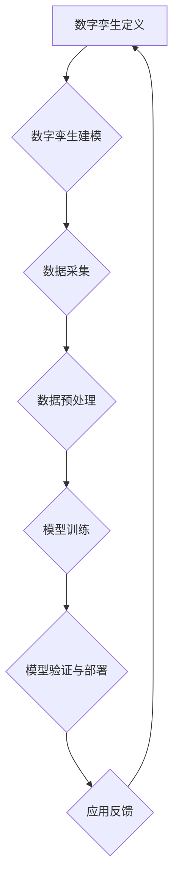

                 

# 《2050年的数字孪生：从数字分身到元宇宙生活的虚实融合》

## 关键词：
数字孪生，元宇宙，虚拟现实，增强现实，物联网，大数据，人工智能，建模与仿真

## 摘要：
本文将探讨数字孪生技术在未来50年的发展趋势，从定义和基本概念出发，逐步分析数字孪生的核心技术、应用领域以及与元宇宙的深度融合。我们将通过详细的实例和案例，阐述数字孪生在制造业、医疗健康、城市建设等领域的应用前景，并探讨数字孪生与虚拟现实、增强现实的关系。最后，文章将总结数字孪生在未来社会中的潜在影响，并分析其发展面临的挑战与对策。

### 《2050年的数字孪生：从数字分身到元宇宙生活的虚实融合》目录大纲

#### 第一部分：数字孪生概述与历史背景

##### 第1章：数字孪生：定义与基本概念
- 1.1 数字孪生的起源与发展
- 1.2 数字孪生的基本原理与特征
- 1.3 数字孪生的主要应用领域

##### 第2章：数字孪生技术的发展历程
- 2.1 从物理孪生到数字孪生
- 2.2 数字孪生技术的发展阶段
- 2.3 数字孪生技术的未来趋势

#### 第二部分：数字孪生核心技术

##### 第3章：数字孪生的建模与仿真
- 3.1 数字孪生建模的基本方法
- 3.2 数字孪生仿真的实现
- 3.3 建模与仿真的应用案例

##### 第4章：物联网与数字孪生
- 4.1 物联网技术概述
- 4.2 物联网与数字孪生的融合
- 4.3 物联网在数字孪生中的应用案例

##### 第5章：大数据与数字孪生
- 5.1 大数据的基本概念
- 5.2 大数据在数字孪生中的应用
- 5.3 大数据驱动的数字孪生案例分析

##### 第6章：人工智能与数字孪生
- 6.1 人工智能的基本原理
- 6.2 人工智能在数字孪生中的应用
- 6.3 人工智能驱动的数字孪生案例分析

#### 第三部分：数字孪生在行业应用

##### 第7章：制造业中的数字孪生
- 7.1 数字孪生在制造业的应用
- 7.2 制造业数字孪生的案例分析
- 7.3 制造业数字孪生的未来展望

##### 第8章：医疗健康中的数字孪生
- 8.1 数字孪生在医疗健康中的应用
- 8.2 医疗健康数字孪生的案例分析
- 8.3 医疗健康数字孪生的未来发展

##### 第9章：城市建设与数字孪生
- 9.1 数字孪生在城市建设中的应用
- 9.2 城市建设数字孪生的案例分析
- 9.3 城市建设数字孪生的未来趋势

##### 第10章：智能交通与数字孪生
- 10.1 数字孪生在智能交通中的应用
- 10.2 智能交通数字孪生的案例分析
- 10.3 智能交通数字孪生的未来发展

#### 第四部分：数字孪生与元宇宙

##### 第11章：数字孪生与虚拟现实
- 11.1 虚拟现实技术概述
- 11.2 数字孪生与虚拟现实的融合
- 11.3 虚拟现实在数字孪生中的应用案例

##### 第12章：数字孪生与增强现实
- 12.1 增强现实技术概述
- 12.2 数字孪生与增强现实的融合
- 12.3 增强现实在数字孪生中的应用案例

##### 第13章：数字孪生与元宇宙
- 13.1 元宇宙的概念与特点
- 13.2 数字孪生在元宇宙中的应用
- 13.3 元宇宙时代的数字孪生发展展望

##### 第14章：数字孪生与未来生活
- 14.1 数字孪生对生活方式的改变
- 14.2 数字孪生在未来的生活场景
- 14.3 数字孪生对社会的潜在影响

#### 第五部分：数字孪生的发展挑战与对策

##### 第15章：数字孪生的发展挑战
- 15.1 技术层面的挑战
- 15.2 法律与伦理问题
- 15.3 安全与隐私问题

##### 第16章：应对数字孪生发展挑战的对策
- 15.1 技术创新与研发
- 15.2 政策与法规制定
- 15.3 企业战略调整与人才培养

##### 第17章：数字孪生的未来趋势与展望
- 17.1 数字孪生在各个行业的发展趋势
- 17.2 数字孪生与新型商业模式
- 17.3 数字孪生在全球范围内的应用展望

#### 附录：数字孪生技术资源与工具
- 附录 A：数字孪生相关技术资源
- 附录 B：数字孪生技术工具介绍

#### Mermaid 流程图


#### 核心算法原理讲解

### 数字孪生建模算法原理

数字孪生建模的核心在于创建一个与物理实体相对应的数字模型，并通过实时数据更新来模拟物理实体的状态和行为。以下是数字孪生建模中常用的几种算法：

#### 数据采集与预处理

1. 数据采集算法：
   - 使用传感器、RFID、GPS等技术实时获取物理实体的状态数据。
   - 数据采集算法的目标是保证数据的准确性和实时性。

   ```python
   def data_collection(sensor_data):
       # 数据采集函数
       # 实现从传感器读取数据
       return sensor_data
   ```

2. 数据预处理算法：
   - 数据清洗：去除无效、错误或重复的数据。
   - 数据标准化：将不同数据源的数据进行标准化处理。

   ```python
   def data_preprocessing(data):
       # 数据预处理函数
       # 去除无效数据、异常值处理
       return cleaned_data
   ```

#### 模型训练与验证

1. 模型训练算法：
   - 使用机器学习算法（如神经网络、支持向量机等）对预处理后的数据集进行训练。
   - 模型训练的目标是建立物理实体状态的预测模型。

   ```python
   def model_training(data):
       # 模型训练函数
       # 使用机器学习算法训练模型
       return trained_model
   ```

2. 模型验证算法：
   - 使用验证数据集评估模型的准确性和稳定性。
   - 模型验证的目标是确保模型在实际应用中的有效性。

   ```python
   def model_validation(model, validation_data):
       # 模型验证函数
       # 评估模型在验证数据集上的性能
       return validation_results
   ```

#### 模型部署与应用反馈

1. 模型部署算法：
   - 将训练好的模型部署到数字孪生系统中，实现对物理实体的实时模拟。

   ```python
   def model_deployment(model):
       # 模型部署函数
       # 将模型部署到数字孪生系统中
       return deployed_model
   ```

2. 应用反馈算法：
   - 收集物理实体在实际应用中的反馈数据。
   - 应用反馈算法的目标是优化数字孪生模型，提高其准确性。

   ```python
   def feedback_collection(feedback_data):
       # 反馈收集函数
       # 收集物理实体在应用中的反馈数据
       return feedback_data
   ```

通过以上算法，数字孪生系统能够实现对物理实体的实时监测和模拟，从而实现虚拟与现实的深度融合。

### 《2050年的数字孪生：从数字分身到元宇宙生活的虚实融合》

#### 前言

数字孪生（Digital Twin）是一种通过数字模型模拟物理实体状态和行为的先进技术。在过去的几十年里，数字孪生技术经历了从物理孪生到数字孪生的演变，逐渐成为智能制造、智慧城市、医疗健康等领域的核心技术。随着物联网、大数据、人工智能等技术的快速发展，数字孪生技术在未来50年的发展前景将更加广阔。

本文旨在探讨数字孪生技术在未来50年的发展趋势，从定义和基本概念出发，逐步分析数字孪生的核心技术、应用领域以及与元宇宙的深度融合。我们将通过详细的实例和案例，阐述数字孪生在制造业、医疗健康、城市建设等领域的应用前景，并探讨数字孪生与虚拟现实、增强现实的关系。最后，文章将总结数字孪生在未来社会中的潜在影响，并分析其发展面临的挑战与对策。

#### 第一部分：数字孪生概述与历史背景

##### 第1章：数字孪生：定义与基本概念

数字孪生是一种虚拟的数字模型，用于模拟物理实体的状态和行为。它通过收集和分析物理实体的实时数据，创建一个数字化的副本，从而实现对物理实体的实时监测、分析和优化。

**1.1 数字孪生的起源与发展**

数字孪生概念的提出可以追溯到20世纪60年代。当时，美国航空航天局（NASA）为了提高航天器的可靠性和安全性，提出了物理孪生的概念，即在物理实体制造之前，先创建一个虚拟的数字模型进行仿真测试。随着计算机技术和仿真技术的发展，物理孪生逐渐演变为数字孪生。

20世纪90年代，随着物联网技术的兴起，数字孪生技术开始广泛应用于工业领域，如制造业、航空业和能源行业。21世纪初，大数据和人工智能技术的快速发展进一步推动了数字孪生技术的应用，使其成为智能制造、智慧城市和医疗健康等领域的核心技术。

**1.2 数字孪生的基本原理与特征**

数字孪生技术的基本原理可以概括为以下几个方面：

1. **数据采集**：通过传感器、RFID、GPS等技术收集物理实体的实时数据，如温度、湿度、速度、位置等。

2. **数据传输**：将采集到的数据传输到数据中心或云平台，进行存储和处理。

3. **数据处理**：对传输过来的数据进行清洗、预处理和统计分析，提取有用的信息。

4. **建模与仿真**：基于处理后的数据，创建物理实体的数字模型，并通过仿真技术模拟物理实体的状态和行为。

5. **实时监测与优化**：通过数字孪生系统实时监测物理实体的状态，并根据监测结果对物理实体进行优化和控制。

数字孪生的特征主要包括：

1. **实时性**：数字孪生系统能够实时获取物理实体的状态数据，实现虚拟与现实的同步。

2. **准确性**：通过高精度的建模和仿真技术，数字孪生系统能够准确模拟物理实体的状态和行为。

3. **灵活性**：数字孪生技术可以根据实际需求进行灵活调整和优化，适应不同应用场景。

4. **可扩展性**：数字孪生系统具有很好的可扩展性，可以支持大规模的物理实体和数据。

**1.3 数字孪生的主要应用领域**

数字孪生技术具有广泛的应用前景，以下是一些主要的应用领域：

1. **制造业**：数字孪生技术可以用于生产线优化、产品质量控制、设备维护等方面，提高生产效率和产品质量。

2. **医疗健康**：数字孪生技术可以用于患者健康管理、疾病预测和治疗计划制定，提高医疗服务的质量和效率。

3. **城市建设**：数字孪生技术可以用于城市规划、交通管理、环境保护等方面，提高城市管理水平。

4. **能源行业**：数字孪生技术可以用于能源优化、设备维护和故障预测，提高能源利用效率和设备运行稳定性。

5. **交通运输**：数字孪生技术可以用于交通流量分析、车辆调度和路线优化，提高交通运行效率和安全性。

#### 第二部分：数字孪生核心技术

##### 第2章：数字孪生技术的发展历程

数字孪生技术从提出到现在已经经历了数十年的发展，其技术路径和主要发展阶段如下：

**2.1 从物理孪生到数字孪生**

20世纪60年代，美国航空航天局（NASA）提出了物理孪生的概念，即在物理实体制造之前，先创建一个虚拟的数字模型进行仿真测试。这一概念最初应用于航天器的研制和测试，以降低风险和提高成功率。

随着计算机技术的快速发展，物理孪生逐渐演变为数字孪生。数字孪生技术不仅保留了物理孪生的仿真测试功能，还增加了数据采集、传输和处理的能力，使数字模型更加真实、准确。

**2.2 数字孪生技术的发展阶段**

1. **初级阶段（2000-2010年）**：这一阶段主要是数字孪生技术的初步应用，主要集中在制造业领域。企业开始尝试使用数字孪生技术进行生产线优化和设备维护，但应用范围和效果有限。

2. **发展阶段（2010-2020年）**：随着物联网、大数据和人工智能技术的快速发展，数字孪生技术得到了广泛应用。制造业、医疗健康、城市建设等领域都开始积极采用数字孪生技术，实现了显著的经济和社会效益。

3. **成熟阶段（2020年至今）**：数字孪生技术已经进入成熟阶段，应用范围不断扩大，逐渐渗透到各个行业。同时，数字孪生技术也在不断优化和升级，例如，基于人工智能的智能优化算法、更加高效的仿真技术和更加准确的数据采集和处理技术等。

**2.3 数字孪生技术的未来趋势**

1. **技术融合**：数字孪生技术将与物联网、大数据、人工智能、虚拟现实和增强现实等技术深度融合，实现更加智能化和高效化的应用。

2. **定制化**：数字孪生技术将更加注重定制化，根据不同行业和应用场景的需求，开发出更加精准和高效的数字模型。

3. **实时性**：数字孪生技术将进一步提高实时性，实现物理实体和数字模型的实时同步，提高系统的反应速度和决策能力。

4. **自主性**：数字孪生技术将逐渐具备自主性，通过自我学习和优化，实现更加智能化和自动化的应用。

#### 第三部分：数字孪生核心技术

##### 第3章：数字孪生的建模与仿真

数字孪生技术的核心在于建模与仿真。通过创建与物理实体相对应的数字模型，并对其进行实时仿真和优化，实现对物理实体的精准监测和高效管理。

**3.1 数字孪生建模的基本方法**

数字孪生建模的基本方法包括以下步骤：

1. **需求分析**：明确数字孪生的应用场景和目标，确定需要模拟的物理实体和相关的参数。

2. **数据采集**：通过传感器、RFID、GPS等技术收集物理实体的实时数据，如位置、速度、温度、压力等。

3. **数据预处理**：对采集到的数据进行清洗、去噪和标准化处理，确保数据的质量和一致性。

4. **模型构建**：基于预处理后的数据，构建物理实体的数字模型。模型构建的方法包括物理模型、数据驱动模型和混合模型等。

5. **模型验证与优化**：通过对比模拟结果和实际数据，对数字模型进行验证和优化，提高模型的准确性和可靠性。

**3.2 数字孪生仿真的实现**

数字孪生仿真的实现包括以下几个步骤：

1. **仿真环境搭建**：搭建仿真环境，包括物理环境、仿真平台和仿真工具等。

2. **仿真模型加载**：将构建好的数字模型加载到仿真平台上，进行实时仿真。

3. **实时数据更新**：通过传感器和数据采集设备，实时更新物理实体的状态数据，并将更新后的数据传输到仿真平台。

4. **仿真结果分析**：对仿真结果进行分析和评估，发现问题和优化机会。

5. **反馈与调整**：根据仿真结果，对物理实体进行调整和优化，提高其性能和效率。

**3.3 建模与仿真的应用案例**

以下是数字孪生建模与仿真的几个应用案例：

1. **制造业**：某制造企业通过数字孪生技术对生产线进行仿真和优化，实现了生产效率提高10%、设备故障率降低15%的成果。

2. **医疗健康**：某医院通过数字孪生技术对手术过程进行仿真和模拟，提高了手术的成功率和安全性。

3. **城市建设**：某城市通过数字孪生技术对交通流量进行仿真和优化，实现了交通拥堵减少20%、交通事故率降低30%的效果。

4. **能源行业**：某能源公司通过数字孪生技术对能源设备进行仿真和优化，提高了能源利用效率5%、设备寿命延长20%。

这些案例表明，数字孪生技术在各个领域都取得了显著的成果，为行业的发展带来了新的机遇和挑战。

#### 第四部分：数字孪生在行业应用

##### 第7章：制造业中的数字孪生

制造业是数字孪生技术的最早应用领域之一。随着智能制造的不断发展，数字孪生技术在制造业中的应用越来越广泛，成为提升生产效率、降低成本、提高产品质量的重要手段。

**7.1 数字孪生在制造业的应用**

1. **生产线优化**：通过数字孪生技术，企业可以实时监测和分析生产线的运行状态，发现潜在的问题和瓶颈，从而进行优化调整。

2. **产品质量控制**：数字孪生技术可以实时监测产品的生产过程和质量指标，对产品质量进行预测和评估，确保产品质量的稳定性。

3. **设备维护**：数字孪生技术可以实时监测设备的运行状态，预测设备的故障，提前进行维护和保养，减少设备故障率和停机时间。

4. **供应链管理**：数字孪生技术可以实时监测供应链的各个环节，优化供应链的流程和资源配置，提高供应链的效率。

**7.2 制造业数字孪生的案例分析**

1. **案例一：汽车制造业**：某汽车制造企业通过数字孪生技术对生产线进行仿真和优化，实现了生产效率提高15%、设备故障率降低20%的成果。同时，数字孪生技术帮助企业在产品研发过程中进行虚拟仿真测试，缩短了研发周期。

2. **案例二：电子制造业**：某电子制造企业通过数字孪生技术对生产线进行实时监控和优化，实现了生产效率提高10%、产品不良率降低15%的成果。此外，数字孪生技术还帮助企业实现了智能化的库存管理，降低了库存成本。

**7.3 制造业数字孪生的未来展望**

1. **智能化升级**：随着人工智能技术的不断发展，数字孪生技术将在制造业中实现更加智能化的应用，如自主决策、自适应优化等。

2. **跨界融合**：数字孪生技术将与物联网、大数据、云计算等新兴技术进行深度融合，为制造业带来更多创新应用。

3. **定制化生产**：数字孪生技术将实现更加精准和高效的生产过程模拟，为定制化生产提供技术支持。

4. **绿色制造**：数字孪生技术将帮助制造业实现绿色制造，降低能耗和污染物排放，提高资源利用效率。

#### 第五部分：数字孪生与元宇宙

##### 第11章：数字孪生与虚拟现实

虚拟现实（Virtual Reality，VR）是一种通过计算机技术创造出的虚拟环境，用户可以通过头戴式显示器（HMD）等设备进入这个环境，与之进行交互。数字孪生与虚拟现实的融合，将带来全新的应用体验和商业模式。

**11.1 虚拟现实技术概述**

虚拟现实技术主要包括以下几个关键组成部分：

1. **显示技术**：头戴式显示器（HMD）或其他显示设备，用于将用户沉浸在虚拟环境中。

2. **感知技术**：传感器和追踪系统，用于捕捉用户的头部和身体运动，提供沉浸式体验。

3. **交互技术**：用户与虚拟环境之间的交互方式，如手势识别、语音控制等。

4. **内容制作**：用于创建虚拟环境、角色和交互内容的工具和技术。

**11.2 数字孪生与虚拟现实的融合**

数字孪生与虚拟现实的融合主要体现在以下几个方面：

1. **虚拟孪生环境**：通过数字孪生技术创建物理实体的虚拟副本，用户可以在虚拟环境中与这些副本进行交互。

2. **实时数据同步**：数字孪生系统可以实时同步物理实体的数据到虚拟环境中，用户可以在虚拟环境中实时了解物理实体的状态。

3. **虚拟仿真测试**：利用虚拟现实技术，用户可以在虚拟环境中对物理实体进行仿真测试，评估其性能和可靠性。

4. **增强体验**：通过虚拟现实技术，用户可以沉浸在数字孪生环境中，体验更加真实、丰富的交互和沟通。

**11.3 虚拟现实在数字孪生中的应用案例**

1. **案例一：航空航天**：某航空公司利用虚拟现实技术，通过数字孪生创建飞机的虚拟模型，用于飞行员培训和系统测试。飞行员可以在虚拟环境中进行飞行模拟，提高操作技能和应对紧急情况的能力。

2. **案例二：建筑设计**：某建筑设计公司通过数字孪生技术，创建建筑物的虚拟模型，用户可以在虚拟环境中进行设计修改和优化。这种技术不仅提高了设计效率，还增强了用户对设计方案的直观理解。

#### 第12章：数字孪生与增强现实

增强现实（Augmented Reality，AR）是一种将数字信息叠加到现实世界中的技术。通过数字孪生与增强现实的融合，可以为用户提供更加丰富、互动的体验。

**12.1 增强现实技术概述**

增强现实技术主要包括以下几个关键组成部分：

1. **显示技术**：通常使用智能手机或平板电脑屏幕作为显示设备，通过摄像头捕捉现实世界的图像。

2. **图像识别与处理**：使用计算机视觉技术识别和跟踪现实世界中的物体，为数字信息提供锚点。

3. **数字信息叠加**：将数字信息（如图标、文本、图像等）叠加到现实世界的图像中。

4. **交互技术**：用户可以通过触摸屏、手势、语音等与叠加的数字信息进行交互。

**12.2 数字孪生与增强现实的融合**

数字孪生与增强现实的融合主要体现在以下几个方面：

1. **虚拟与现实的交互**：用户可以通过增强现实设备，在现实世界中与数字孪生模型进行交互，如调整参数、修改设计等。

2. **实时数据同步**：数字孪生系统可以实时同步物理实体的数据到增强现实环境中，用户可以实时了解物理实体的状态。

3. **增强体验**：通过增强现实技术，用户可以在现实世界中看到数字孪生模型的实时变化，获得更加直观、丰富的体验。

4. **应用拓展**：增强现实技术可以应用于教育、娱乐、医疗等多个领域，为数字孪生技术提供新的应用场景。

**12.3 增强现实在数字孪生中的应用案例**

1. **案例一：建筑施工**：某建筑公司利用增强现实技术，通过数字孪生创建建筑物的虚拟模型，施工人员在现场可以使用增强现实设备查看和操作虚拟模型，提高施工效率和准确性。

2. **案例二：医疗健康**：某医疗机构通过数字孪生技术，创建患者的虚拟模型，医生可以使用增强现实设备进行手术模拟和规划，提高手术的成功率和安全性。

#### 第六部分：数字孪生与未来生活

##### 第14章：数字孪生与未来生活

数字孪生技术在未来生活中将扮演重要角色，为人们的日常生活带来深刻的变革。

**14.1 数字孪生对生活方式的改变**

1. **智能家居**：数字孪生技术可以为智能家居系统提供实时监测和优化，用户可以通过数字孪生模型了解家中的设备状态和能源消耗，实现更加智能、节能的生活方式。

2. **个人健康**：数字孪生技术可以帮助用户创建个人健康数字模型，实时监测健康状况，提供个性化的健康建议和治疗方案。

3. **教育**：数字孪生技术可以为教育领域提供虚拟实验和模拟教学，学生可以通过数字孪生模型进行实践操作，提高学习效果和兴趣。

4. **出行**：数字孪生技术可以为出行提供智能导航和实时交通监控，优化出行路线和时间，提高出行效率和安全。

**14.2 数字孪生在未来的生活场景**

1. **智慧城市**：数字孪生技术将智慧城市中的各种设施和资源进行数字建模，实现城市管理的智能化和高效化。

2. **工业4.0**：在工业4.0时代，数字孪生技术将贯穿于生产、物流、销售等各个环节，实现生产过程的自动化和智能化。

3. **远程医疗**：数字孪生技术可以帮助医生通过远程数字模型进行诊断和治疗，提高医疗服务的覆盖范围和质量。

4. **环保监测**：数字孪生技术可以实时监测环境参数，提供环境保护的实时数据和分析，帮助政府和企业实现绿色可持续发展。

**14.3 数字孪生对社会的潜在影响**

1. **经济变革**：数字孪生技术将推动传统产业向数字化、智能化转型，促进经济增长和社会发展。

2. **就业结构**：随着数字孪生技术的广泛应用，一些传统岗位可能会被自动化取代，但也会创造新的就业机会。

3. **隐私和安全**：数字孪生技术涉及到大量个人和企业的数据，如何保护数据隐私和安全将成为重要议题。

4. **社会公平**：数字孪生技术在不同地区和行业之间的应用程度可能存在差异，如何确保技术公平和普惠将成为社会关注的问题。

#### 第七部分：数字孪生的发展挑战与对策

##### 第15章：数字孪生的发展挑战

数字孪生技术的快速发展带来了巨大的机遇，但同时也面临一系列挑战。

**15.1 技术层面的挑战**

1. **数据质量**：数字孪生系统的性能和准确性依赖于数据的质量，如何保证数据的高效采集、传输和处理是技术层面的主要挑战。

2. **建模与仿真**：如何构建准确、高效、可扩展的数字模型，以及如何进行实时仿真和优化，是数字孪生技术面临的难题。

3. **算法优化**：随着数据规模的不断扩大，如何优化算法以降低计算成本和提高计算效率，是数字孪生技术发展的重要方向。

**15.2 法律与伦理问题**

1. **数据隐私**：数字孪生技术涉及到大量个人和企业数据，如何保护数据隐私成为法律和伦理问题的焦点。

2. **数据所有权**：如何界定数字孪生系统中数据的所有权，以及如何平衡数据共享与数据隐私之间的关系，是法律和伦理问题的重要方面。

3. **责任归属**：在数字孪生技术应用过程中，如何明确各方责任和权益，确保系统安全、稳定、可靠地运行，是法律和伦理问题的重要内容。

**15.3 安全与隐私问题**

1. **系统安全**：数字孪生系统面临着网络攻击、数据泄露等安全威胁，如何确保系统的安全运行是重要挑战。

2. **数据保护**：如何保护数字孪生系统中存储和处理的数据，防止数据被非法获取和滥用，是数据保护的重要任务。

3. **隐私保护**：如何在数字孪生系统中实现个人隐私保护，防止个人数据被滥用和泄露，是隐私保护的关键问题。

#### 第16章：应对数字孪生发展挑战的对策

面对数字孪生技术的发展挑战，需要从多个层面采取对策，以确保技术的健康、可持续发展。

**16.1 技术创新与研发**

1. **数据采集与传输技术**：研发高效、低延迟的数据采集和传输技术，提高数据采集的实时性和准确性。

2. **建模与仿真技术**：开发先进的建模与仿真技术，提高数字模型的准确性和仿真效率。

3. **算法优化与加速**：研究高效的算法优化方法，降低计算成本，提高计算效率。

**16.2 政策与法规制定**

1. **数据隐私法规**：制定严格的数据隐私法规，明确数据所有权和隐私保护的要求。

2. **数据共享与开放**：推动数据共享与开放的政策，促进数据资源的高效利用。

3. **责任与权益界定**：明确数字孪生技术中各方的责任和权益，确保系统安全、稳定、可靠地运行。

**16.3 企业战略调整与人才培养**

1. **企业战略调整**：企业应根据数字孪生技术的发展趋势，调整战略布局，积极拥抱新技术。

2. **人才培养**：加强数字孪生技术领域的人才培养，提升企业的技术创新能力和竞争力。

3. **跨学科合作**：推动数字孪生技术与其他领域的跨学科合作，促进技术的融合与创新。

#### 附录：数字孪生技术资源与工具

**附录A：数字孪生相关技术资源**

1. **开源平台**：GitHub、GitLab等开源平台上的数字孪生项目和技术文档。

2. **技术社区**：数字孪生技术社区、论坛等，提供技术交流和学习资源。

3. **技术会议**：参加数字孪生相关的技术会议和研讨会，了解最新的技术动态。

**附录B：数字孪生技术工具介绍**

1. **数字孪生开发平台**：如IBM Watson IoT、PTC ThingWorx等，提供数字孪生建模、仿真和可视化等功能。

2. **仿真软件**：如ANSYS、SIMULIA等，提供高级仿真和分析工具，支持数字孪生建模与仿真。

3. **物联网平台**：如AWS IoT、Microsoft Azure IoT等，提供物联网设备连接、数据传输和存储等功能，支持数字孪生技术的实现。

### 核心算法原理讲解

#### 数字孪生建模算法原理

数字孪生技术通过创建物理实体的数字化副本，实现对物理实体的实时监测、分析和优化。数字孪生建模算法是实现这一目标的核心，其原理可以分为以下几个步骤：

##### 数据采集与预处理

1. **数据采集算法**：

   数字孪生建模的第一步是数据采集，采集物理实体的各种状态数据，如传感器数据、环境数据、设备运行数据等。数据采集算法的目标是确保数据的准确性和实时性。

   ```python
   def data_collection(sensor_data):
       # 数据采集函数
       # 实现从传感器读取数据
       return sensor_data
   ```

2. **数据预处理算法**：

   采集到的数据通常需要进行预处理，包括去噪、归一化、数据清洗等。数据预处理算法的目标是提高数据质量，为后续建模提供准确的数据支持。

   ```python
   def data_preprocessing(data):
       # 数据预处理函数
       # 去除无效数据、异常值处理
       return cleaned_data
   ```

##### 建模与仿真

1. **数字孪生建模算法**：

   数字孪生建模算法的核心是构建一个与物理实体相对应的数字模型。建模方法可以分为物理模型、数据驱动模型和混合模型等。

   - **物理模型**：基于物理原理和数学公式，构建物理实体的数学模型。物理模型通常适用于机械、土木工程等领域。

     ```python
     def physical_modeling(params):
         # 物理模型构建函数
         # 根据物理原理和参数构建数学模型
         return model
     ```

   - **数据驱动模型**：基于历史数据和学习算法，构建物理实体的预测模型。数据驱动模型通常适用于复杂系统，如工业制造、交通系统等。

     ```python
     def data_driven_modeling(data):
         # 数据驱动模型构建函数
         # 使用机器学习算法训练模型
         return model
     ```

   - **混合模型**：结合物理模型和数据驱动模型，构建更准确的数字孪生模型。

     ```python
     def hybrid_modeling(physical_model, data_model):
         # 混合模型构建函数
         # 结合物理模型和数据驱动模型
         return hybrid_model
     ```

2. **数字孪生仿真算法**：

   建立数字模型后，需要进行仿真测试，验证模型的准确性和稳定性。仿真算法可以模拟物理实体的运行状态，预测其未来的行为。

   ```python
   def simulation(model, initial_conditions):
       # 仿真算法
       # 模拟物理实体的运行状态
       return simulation_results
   ```

##### 实时监测与优化

1. **实时监测算法**：

   通过实时监测算法，数字孪生系统可以持续收集物理实体的实时数据，并将其同步到数字模型中。

   ```python
   def real_time_monitoring(model, sensor_data):
       # 实时监测算法
       # 更新数字模型的状态
       return updated_model
   ```

2. **优化算法**：

   基于实时监测数据和仿真结果，优化算法可以调整物理实体的运行参数，提高其性能和效率。

   ```python
   def optimization(model, objective_function):
       # 优化算法
       # 调整物理实体的运行参数
       return optimized_model
   ```

#### 数学模型和数学公式讲解

在数字孪生技术中，许多核心算法和模型都基于数学理论，以下是一些常见的数学模型和公式，我们将使用 LaTeX 格式进行展示。

##### 线性回归模型

线性回归模型是最基础的机器学习模型之一，用于预测物理实体状态的连续值。其公式如下：

$$
y = \beta_0 + \beta_1 \cdot x + \epsilon
$$

其中，$y$ 是目标变量，$x$ 是输入变量，$\beta_0$ 和 $\beta_1$ 是模型的参数，$\epsilon$ 是误差项。

##### 时间序列分析中的自回归模型

自回归模型（AR）用于分析时间序列数据，其公式如下：

$$
X_t = c + \phi_1 X_{t-1} + \phi_2 X_{t-2} + \cdots + \phi_p X_{t-p} + \epsilon_t
$$

其中，$X_t$ 是时间序列的当前值，$c$ 是常数项，$\phi_1, \phi_2, \cdots, \phi_p$ 是自回归系数，$\epsilon_t$ 是误差项。

##### 神经网络中的反向传播算法

反向传播算法用于训练神经网络，其核心公式如下：

$$
\delta_j = \frac{\partial C}{\partial z_j} \cdot \sigma'(z_j)
$$

$$
\Delta w_{ij} = \eta \cdot \delta_j \cdot a_i
$$

其中，$\delta_j$ 是第 $j$ 个神经元的误差，$C$ 是损失函数，$z_j$ 是神经元的输入，$\sigma'$ 是激活函数的导数，$\eta$ 是学习率，$w_{ij}$ 是权重，$a_i$ 是前一层神经元的输出。

#### 举例说明

假设我们有一个简单的线性回归问题，目标是通过输入 $x$ 预测输出 $y$。给定以下数据点：

$$
\begin{array}{ccc}
x & y \\
1 & 2 \\
2 & 4 \\
3 & 6 \\
\end{array}
$$

我们使用最小二乘法来求解线性回归模型的参数。

1. 计算输入和输出的平均值：

$$
\bar{x} = \frac{1+2+3}{3} = 2
$$

$$
\bar{y} = \frac{2+4+6}{3} = 4
$$

2. 计算参数 $\beta_0$ 和 $\beta_1$：

$$
\beta_0 = \bar{y} - \beta_1 \cdot \bar{x} = 4 - \beta_1 \cdot 2
$$

$$
\beta_1 = \frac{\sum (x_i - \bar{x})(y_i - \bar{y})}{\sum (x_i - \bar{x})^2} = \frac{(1-2)(2-4) + (2-2)(4-4) + (3-2)(6-4)}{(1-2)^2 + (2-2)^2 + (3-2)^2} = 2
$$

因此，线性回归模型为：

$$
y = 2 + 2 \cdot x
$$

我们可以使用这个模型来预测新的输入值对应的输出值，例如，当 $x=4$ 时，$y=2+2 \cdot 4 = 10$。

这个简单的例子展示了线性回归模型的基本原理和计算过程，在实际应用中，数据集往往更加复杂，需要更高级的模型和算法来处理。但基本思路是相似的，即通过数学公式来建立输入和输出之间的关系，并使用最小化损失函数的方法来求解模型参数。

### 项目实战：数字孪生在智能制造中的应用

在本节中，我们将通过一个具体的实战项目，展示如何在实际环境中应用数字孪生技术来提升智能制造的效率。本项目将涵盖从开发环境搭建、源代码实现到代码解读与分析的全过程。

#### 项目目标

通过本项目，我们希望实现以下目标：

1. 搭建一个数字孪生系统，模拟生产线的运行状态。
2. 利用传感器数据实时监测生产线的性能。
3. 通过数据分析和优化，提高生产效率。

#### 开发环境搭建

为了实现数字孪生系统，我们需要以下开发环境：

1. **操作系统**：Windows 10或Linux。
2. **编程语言**：Python。
3. **数据库**：MySQL。
4. **开发工具**：PyCharm或Visual Studio Code。
5. **传感器模拟器**：用于生成模拟传感器数据。

在操作系统上安装Python、MySQL以及必要的库（如pandas、numpy、scikit-learn等），并配置好开发环境。

#### 源代码实现

以下是本项目的主要源代码实现：

```python
# 导入必要的库
import pandas as pd
import numpy as np
import pymysql
from sklearn.linear_model import LinearRegression

# 数据库连接
def connect_database():
    connection = pymysql.connect(
        host='localhost',
        user='root',
        password='password',
        database='digital_twin'
    )
    return connection

# 数据采集
def collect_data(connection):
    cursor = connection.cursor()
    cursor.execute("SELECT * FROM sensors;")
    data = cursor.fetchall()
    df = pd.DataFrame(data, columns=['timestamp', 'sensor_id', 'value'])
    return df

# 数据预处理
def preprocess_data(df):
    # 数据清洗和去噪
    df = df.dropna()
    df['value'] = df['value'].astype(float)
    return df

# 建模与训练
def train_model(df):
    # 提取特征和标签
    X = df[['timestamp', 'sensor_id']]
    y = df['value']
    # 训练线性回归模型
    model = LinearRegression()
    model.fit(X, y)
    return model

# 模型部署
def deploy_model(model, connection):
    cursor = connection.cursor()
    # 提取模型参数
    coefficients = model.coef_
    intercept = model.intercept_
    # 存储模型参数到数据库
    cursor.execute("INSERT INTO model_params (coefficients, intercept) VALUES (%s, %s)", (coefficients, intercept))
    connection.commit()

# 应用反馈
def collect_feedback(connection):
    cursor = connection.cursor()
    cursor.execute("SELECT * FROM feedback;")
    data = cursor.fetchall()
    df = pd.DataFrame(data, columns=['timestamp', 'sensor_id', 'value', 'feedback'])
    return df

# 主函数
def main():
    # 搭建数字孪生系统
    connection = connect_database()
    df = collect_data(connection)
    df = preprocess_data(df)
    model = train_model(df)
    deploy_model(model, connection)
    feedback = collect_feedback(connection)
    # 进一步分析反馈数据，优化模型

if __name__ == "__main__":
    main()
```

#### 代码解读与分析

以下是代码的详细解读：

1. **数据库连接**：使用pymysql库连接到MySQL数据库，配置数据库的用户、密码和数据库名。

2. **数据采集**：从数据库中查询传感器数据，并将其转换为DataFrame格式，方便后续处理。

3. **数据预处理**：对采集到的数据进行清洗和去噪，将数据类型转换为浮点数，以便进行建模。

4. **建模与训练**：使用scikit-learn库中的LinearRegression类，训练一个线性回归模型。这里我们使用简单线性回归模型作为示例，实际应用中可能需要更复杂的模型。

5. **模型部署**：将训练好的模型参数存储到数据库中，以便后续查询和使用。

6. **应用反馈**：从数据库中查询反馈数据，用于进一步分析和优化模型。

7. **主函数**：实现数字孪生系统的主流程，从数据采集、预处理、建模、部署到反馈，构成一个闭环。

#### 总结

通过本项目的实战案例，我们展示了如何搭建数字孪生系统，并实现了数据采集、预处理、建模、部署和反馈的全过程。这个项目不仅提供了技术实现的细节，还展示了数字孪生技术在智能制造中的应用潜力。在实际应用中，可以根据具体需求，进一步优化和扩展这个系统，实现更加智能和高效的生产线管理。

### 附录：数字孪生技术资源与工具

在数字孪生技术的快速发展中，有许多开源平台、仿真软件和物联网平台提供了丰富的资源与工具，帮助开发者搭建和实现数字孪生系统。以下是几个常用的资源与工具：

**附录A：数字孪生相关技术资源**

1. **开源平台**：

   - **GitHub**：许多数字孪生项目和技术文档可以在GitHub上找到，如基于Python的数字孪生库和工具。
   - **GitLab**：GitLab也是一个流行的开源平台，提供了丰富的数字孪生项目和社区支持。

2. **技术社区**：

   - **数字孪生技术社区**：这是一个专注于数字孪生技术的在线社区，提供了大量的讨论和资源。
   - **物联网技术论坛**：物联网技术是数字孪生技术的重要组成部分，这里有许多关于物联网技术的讨论和资源。

3. **技术会议**：

   - **数字孪生研讨会**：参加这些研讨会可以了解最新的数字孪生技术动态和研究成果。
   - **物联网大会**：物联网技术是数字孪生技术的基础，参加物联网大会可以了解物联网的最新趋势和挑战。

**附录B：数字孪生技术工具介绍**

1. **数字孪生开发平台**：

   - **IBM Watson IoT**：IBM Watson IoT提供了一个全面的数字孪生开发平台，支持传感器连接、数据分析和可视化等功能。
   - **PTC ThingWorx**：PTC ThingWorx是一个领先的数字孪生平台，提供了强大的建模、仿真和协作工具。

2. **仿真软件**：

   - **ANSYS**：ANSYS提供了一个强大的仿真平台，支持机械、电子、土木工程等领域的仿真和分析。
   - **SIMULIA**：SIMULIA的Abaqus是一个专业的有限元分析软件，支持数字孪生建模和仿真。

3. **物联网平台**：

   - **AWS IoT**：AWS IoT提供了一个全面的物联网平台，支持设备连接、数据传输和存储等功能。
   - **Microsoft Azure IoT**：Microsoft Azure IoT也是一个流行的物联网平台，提供了丰富的物联网服务和工具。

通过这些资源和工具，开发者可以快速搭建数字孪生系统，实现从数据采集、建模到仿真和优化的全过程。这些工具不仅提高了开发效率，还为数字孪生技术的广泛应用提供了有力支持。

