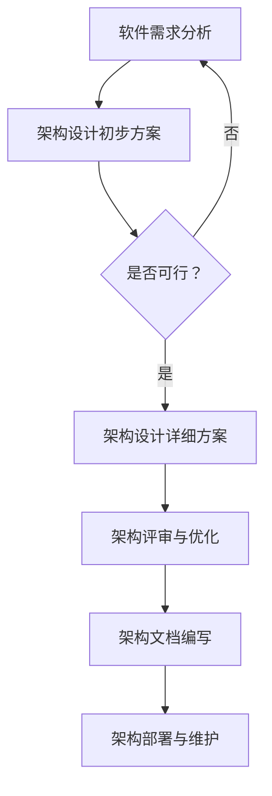
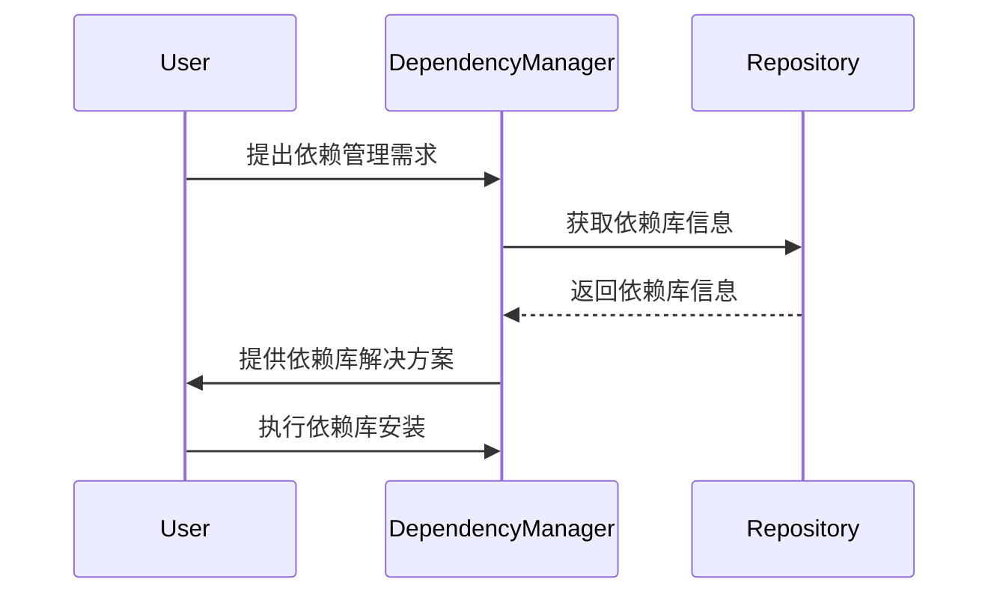
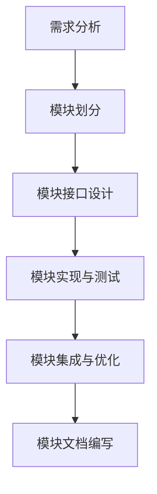
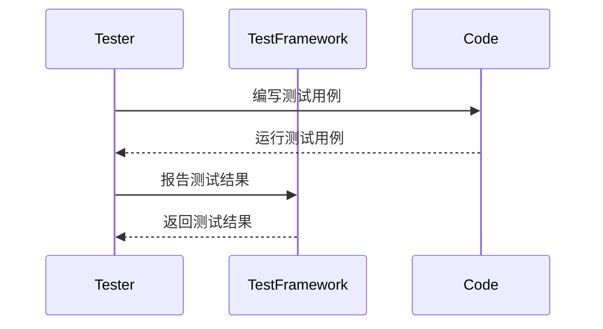
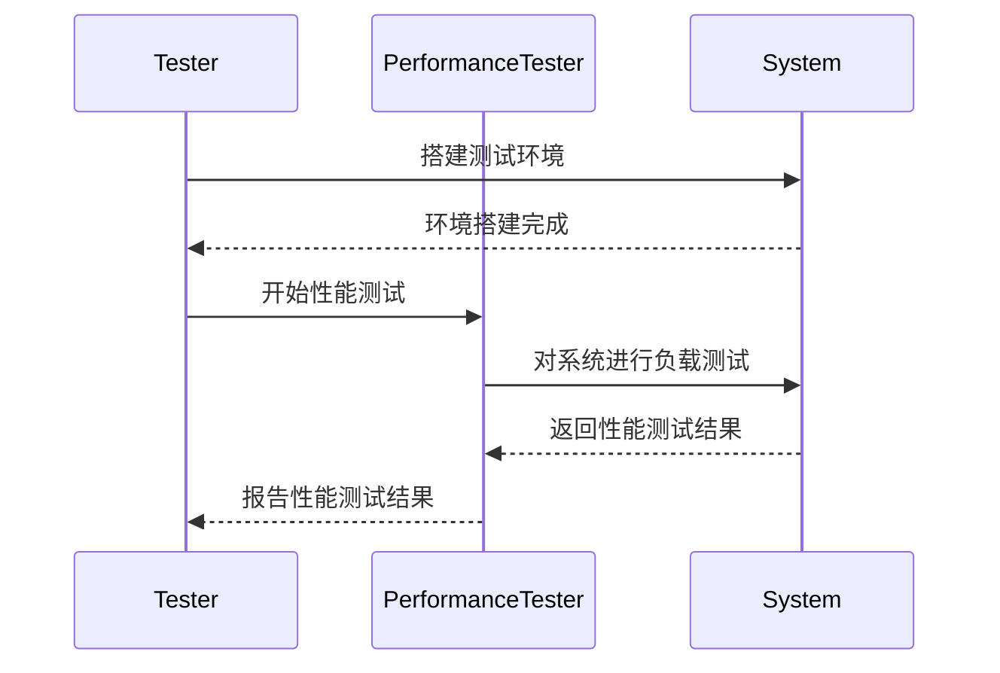
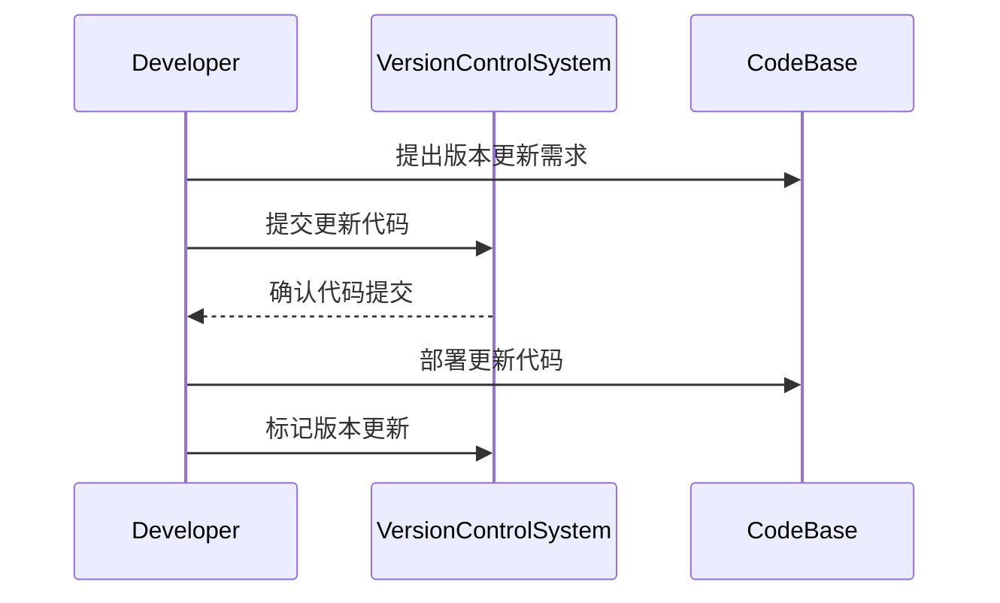
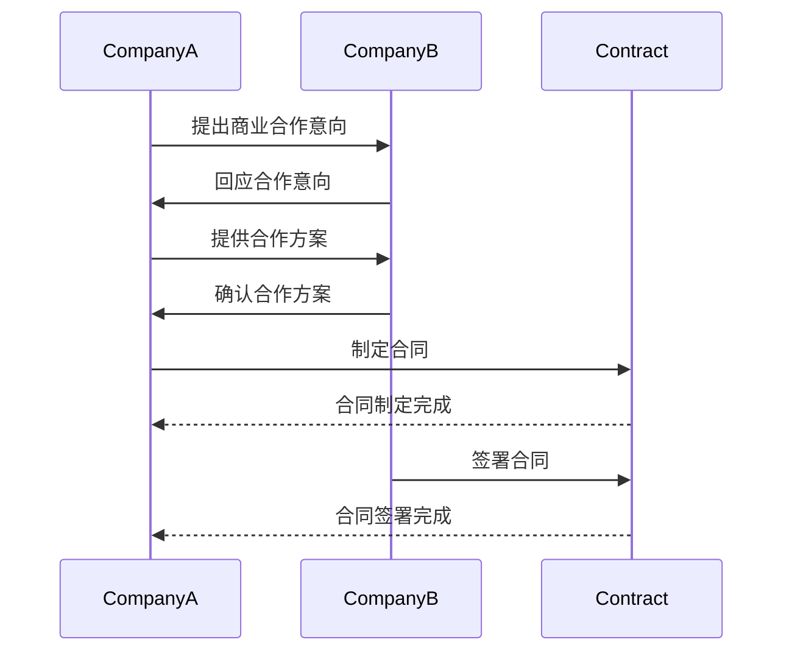
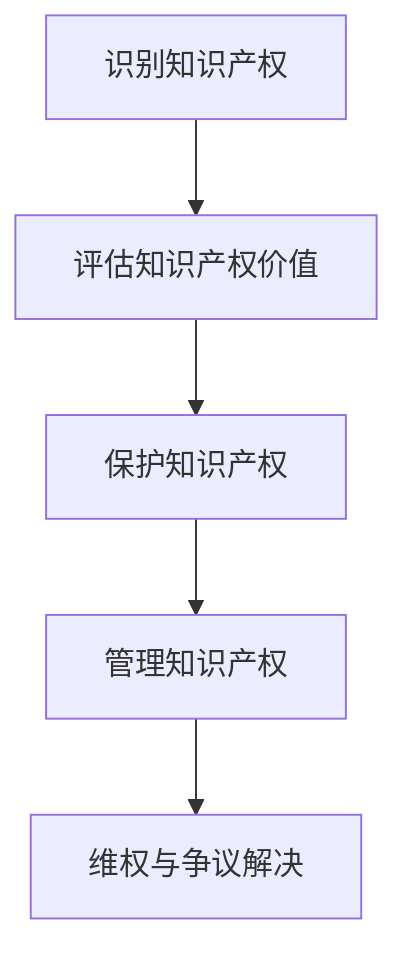

                 

# 开源项目的定制化服务：满足企业需求

## 关键词
- 开源项目
- 定制化服务
- 企业需求
- 技术栈
- 微服务架构
- 云计算
- 物联网
- 人工智能
- 持续集成与部署

## 摘要
随着开源项目的广泛应用，企业对定制化服务的需求日益增长。本文将详细探讨如何通过定制化服务满足企业的独特需求。从开源项目的概述，到技术架构的设计，再到定制化服务的实际应用，本文旨在为开发者和管理者提供一套完整的服务规划和实践指南。

## 引言
在当今快速发展的信息技术时代，开源项目已经成为软件开发的主流模式。它们不仅促进了技术的快速传播和创新，还为企业提供了一个灵活、高效的解决方案平台。然而，随着企业对个性化需求和服务质量的不断追求，单纯的“开箱即用”已经无法满足所有需求。定制化服务成为了企业选择开源项目时的重要考量因素。

本文将围绕开源项目的定制化服务展开讨论，首先介绍开源项目的基本概念和生态系统，然后深入探讨开源项目的技术架构，接着分析企业需求并介绍定制化服务的设计和实施方法。此外，本文还将通过具体案例展示定制化服务在云计算、物联网和人工智能等领域的应用，最后展望开源项目定制化服务的未来发展趋势。

通过本文的阅读，读者将能够了解开源项目的定制化服务从概念到实践的全过程，并为实际项目提供有价值的参考。

### 第一部分: 开源项目的定制化服务基础

在深入探讨开源项目的定制化服务之前，我们需要先了解开源项目的基本概念、技术架构以及企业需求分析。这一部分将为我们后续的讨论打下坚实的基础。

#### 第1章: 开源项目概述

#### 1.1 开源运动的起源与影响
开源运动的起源可以追溯到20世纪70年代，当时的计算机科学家理查德·斯托曼（Richard Stallman）发起了自由软件基金会（Free Software Foundation），倡导自由软件的理念，主张用户有权自由运行、研究、修改和分发软件。这一理念逐渐演变成了今天的开源运动。

开源运动对技术发展的影响是深远的。首先，它促进了技术的快速传播和创新，开发者可以通过共享代码和知识来加速项目的发展。其次，它降低了软件开发的门槛，使更多人能够参与其中，从而推动了软件产业的繁荣。最后，开源运动还推动了协作文化的形成，使开发者之间的交流和合作变得更加频繁和高效。

#### 1.2 开源项目的关键概念
开源项目通常指那些遵循特定开源协议（如GPL、MIT、Apache等）发布的软件项目。这些协议确保了软件的源代码可以被自由地查看、修改和分发，从而促进了社区的参与和协作。

开源项目的核心要素包括：
- **源代码**：软件的核心部分，是开源项目的核心资源。
- **文档**：包括用户手册、开发指南、API文档等，帮助用户和开发者理解和使用项目。
- **社区**：开源项目通常有一个活跃的社区，由贡献者、用户和支持者组成，他们共同维护和推动项目的发展。
- **协议**：开源协议规定了软件的使用、修改和分发方式，保障了项目的自由性和可持续性。

#### 1.3 开源项目的生态系统
开源项目的生态系统是一个复杂而多样化的环境，包括多个参与者和角色：

- **贡献者**：他们为项目提供代码、文档、测试和反馈。
- **维护者**：负责项目的日常维护，确保项目的稳定性。
- **用户**：他们使用开源项目来构建自己的应用，并为项目提供反馈。
- **赞助者**：为项目提供资金支持，帮助项目持续发展。
- **厂商**：基于开源项目开发商业产品或服务，并为开源项目提供技术支持和资金。
- **社区**：由上述所有参与者组成，是开源项目成功的关键。

开源项目的生态系统不仅促进了技术交流和创新，还为企业和开发者提供了丰富的资源和技术支持，使得开源项目的定制化服务成为可能。

### 第一部分总结
通过了解开源项目的起源与影响、关键概念和生态系统，我们为后续讨论开源项目的定制化服务奠定了基础。接下来，我们将进一步探讨开源项目的技术架构，分析企业需求，并介绍定制化服务的设计和实施方法。

### 第一部分: 开源项目的定制化服务基础

在深入探讨开源项目的定制化服务之前，我们需要先了解开源项目的基本概念、技术架构以及企业需求分析。这一部分将为我们后续的讨论打下坚实的基础。

#### 第2章: 开源项目技术架构

#### 2.1 常见开源项目架构模式
开源项目的架构模式多种多样，其中一些常见的模式包括：

1. **单体架构（Monolithic Architecture）**
   单体架构是将所有的功能集中在一个应用程序中。这种架构模式简单，但缺点是当应用程序变得复杂时，维护和扩展变得困难。

   ```mermaid
   graph TD
       A[单体应用] --> B[模块A]
       A --> C[模块B]
       A --> D[模块C]
   ```

2. **微服务架构（Microservices Architecture）**
   微服务架构是将应用程序分解为多个独立的、可扩展的小服务。每个服务负责实现特定的功能，并通过轻量级的通信机制（如RESTful API）进行交互。

   ```mermaid
   graph TD
       A[服务A] --> B[服务B]
       A --> C[服务C]
       D[数据库] --> A
   ```

3. **容器化与微服务架构**
   容器化技术，如Docker，为微服务架构提供了更好的部署和管理方式。容器封装了应用程序及其运行环境，使得服务可以在不同的环境中一致运行。

   ```mermaid
   graph TD
       A[容器A] --> B[容器B]
       A --> C[容器C]
       D[容器管理平台] --> A
   ```

#### 2.2 技术栈选择与优化
技术栈选择是开源项目成功的关键因素之一。以下是一些选择技术栈时的原则和策略：

1. **需求匹配**：技术栈应与项目的需求相匹配，确保能够满足项目的功能性和性能要求。
2. **社区支持**：选择有活跃社区支持的技术栈，这样可以更容易地获取帮助和资源。
3. **生态系统**：选择具有丰富生态系统和工具链的技术栈，以便于开发和维护。
4. **兼容性**：确保技术栈的兼容性，避免因技术栈不兼容而导致的问题。
5. **性能与可扩展性**：选择能够支持高性能和可扩展性的技术栈，以满足未来需求。

在技术栈优化方面，以下是一些策略：

1. **性能调优**：定期对应用程序进行性能测试和调优，确保其能够高效运行。
2. **代码优化**：通过代码优化，减少冗余和低效代码，提高应用程序的性能。
3. **资源管理**：合理分配和管理资源，如CPU、内存和网络带宽，以提高系统性能。

#### 2.3 开源项目的技术贡献和集成
开源项目的贡献和集成是确保项目持续发展的关键环节。以下是一些关键点：

1. **贡献流程**：开源项目通常有一个明确的贡献流程，包括代码审查、合并请求（Pull Request）等。贡献者应遵循这些流程，以确保代码质量和项目的稳定性。
2. **版本控制**：版本控制工具，如Git，是管理代码变更和协同工作的核心。贡献者应熟练使用版本控制工具，确保代码的整洁和可追踪性。
3. **集成测试**：在集成代码前进行充分的集成测试，确保新代码不会破坏现有功能。自动化测试工具可以显著提高集成测试的效率和可靠性。
4. **文档更新**：随着代码的变更，应同步更新项目的文档，以便用户和开发者能够了解新功能和使用方法。
5. **社区协作**：积极参与开源社区，与其他贡献者交流经验，共同推动项目的进步。

#### 第二部分总结
通过了解开源项目的技术架构、技术栈选择与优化策略，以及技术贡献和集成的最佳实践，我们为定制化服务的设计和实施提供了坚实的基础。在下一部分中，我们将深入分析企业的需求，并探讨如何通过定制化服务满足这些需求。

### 第一部分总结
通过了解开源项目的起源与影响、关键概念和生态系统，我们为后续讨论开源项目的定制化服务奠定了基础。接下来，我们将进一步探讨开源项目的技术架构，分析企业需求，并介绍定制化服务的设计和实施方法。

### 第3章: 开源项目的定制化需求分析

在开源项目定制化服务中，理解并分析企业需求是至关重要的一步。企业需求通常具有多样性和复杂性，需要我们进行全面、深入的分析。以下内容将介绍企业需求的分类、分析方法和业务流程与系统集成的定制。

#### 3.1 企业需求分析

**企业需求概述**

企业需求是指企业在特定业务场景中需要实现的功能、性能和用户体验等方面的要求。这些需求可以分为以下几类：

1. **功能性需求**：指软件必须实现的功能，如用户管理、数据存储、报告生成等。
2. **性能需求**：指软件在处理特定任务时必须达到的性能指标，如响应时间、并发处理能力等。
3. **用户体验需求**：指用户在使用软件时的感受和体验，如界面设计、易用性、交互设计等。
4. **安全性需求**：指软件必须具备的安全特性，如数据加密、访问控制、安全审计等。

**企业需求分类**

企业需求可以按照以下方式进行分类：

1. **业务需求**：指与企业的核心业务直接相关的需求，如订单管理、客户关系管理、供应链管理等。
2. **功能需求**：指软件具体功能的需求，如报表生成、数据导入导出、数据可视化等。
3. **性能需求**：指软件在特定负载下的性能要求，如高并发处理、快速检索等。
4. **用户体验需求**：指用户界面、用户体验方面的需求，如简洁直观的界面设计、快速响应等。
5. **安全性需求**：指软件必须实现的安全保护措施，如数据安全、用户隐私保护等。

**企业需求分析的方法与工具**

企业需求分析通常采用以下方法和工具：

1. **问卷调查**：通过问卷调查获取用户的需求和反馈，了解用户的需求和期望。
2. **用户访谈**：与用户进行面对面的访谈，深入了解用户的业务场景和需求。
3. **业务流程图**：通过绘制业务流程图，分析业务流程中的关键环节和需求。
4. **用户故事地图**：通过用户故事地图，将用户需求转化为具体的故事，明确需求优先级。
5. **原型设计**：通过原型设计工具，创建用户界面原型，收集用户反馈并进行迭代。

#### 3.2 业务流程与系统集成的定制

**业务流程定制**

业务流程定制是指根据企业的特定需求，对现有业务流程进行修改和优化。以下是一些关键步骤：

1. **需求分析**：通过问卷调查、用户访谈等方式，了解企业的业务需求和流程。
2. **流程建模**：使用流程建模工具，如BPMN（业务流程模型和符号），对现有业务流程进行建模。
3. **流程优化**：根据需求分析的结果，对业务流程进行优化，提高效率和效果。
4. **流程实施**：根据优化后的业务流程，调整系统配置和操作流程，确保业务流程能够顺利实施。

**系统集成定制**

系统集成定制是指将多个独立的系统整合为一个统一的整体，以满足企业的需求。以下是一些关键步骤：

1. **需求分析**：分析企业现有的系统，了解各个系统的功能和数据接口。
2. **系统选型**：根据需求分析的结果，选择合适的系统进行集成。
3. **接口设计**：设计系统之间的接口，确保数据能够顺畅传输。
4. **数据映射**：将不同系统的数据格式进行映射，确保数据的一致性和准确性。
5. **系统集成测试**：对集成后的系统进行全面的测试，确保系统能够稳定运行。

#### 3.3 技术适配与扩展性考虑

**技术适配原则**

技术适配是指将开源项目与企业的技术环境进行匹配和整合。以下是一些技术适配原则：

1. **兼容性**：确保开源项目与企业的技术栈兼容，避免因不兼容导致的问题。
2. **可扩展性**：选择具有良好扩展性的技术，以便未来进行功能扩展和技术升级。
3. **可靠性**：选择经过验证和社区支持的技术，确保系统的稳定性和可靠性。
4. **维护性**：选择易于维护和升级的技术，降低维护成本。

**技术适配的方法**

技术适配的方法包括以下几个方面：

1. **评估现有技术**：评估企业现有技术栈的优缺点，确定需要适配的技术。
2. **技术选型**：根据需求分析的结果，选择合适的技术方案。
3. **技术验证**：对选定的技术进行验证，确保其满足企业的需求。
4. **集成测试**：对集成后的系统进行测试，确保系统稳定运行。

**系统扩展性设计**

系统扩展性设计是指在系统设计时考虑到未来的扩展需求，确保系统可以随着业务发展进行扩展。以下是一些系统扩展性设计原则：

1. **模块化设计**：将系统划分为多个模块，每个模块负责特定的功能，便于未来的扩展和升级。
2. **松耦合**：通过松耦合的设计，降低模块之间的依赖关系，提高系统的灵活性和可扩展性。
3. **分布式架构**：采用分布式架构，将系统分解为多个节点，实现水平和垂直扩展。
4. **弹性伸缩**：通过自动化伸缩策略，根据系统负载自动调整资源，提高系统的弹性和性能。

### 第三部分总结
通过对企业需求的分类和分析方法，以及业务流程与系统集成的定制、技术适配与扩展性考虑的介绍，我们为开源项目的定制化服务提供了详细的需求分析框架。在下一部分中，我们将探讨开源项目定制化服务的规划与实施方法。

### 第4章: 开源项目定制化服务规划

开源项目的定制化服务需要系统化的规划与实施，以确保项目的顺利进行和最终的成功交付。本节将详细介绍服务规划的方法论、案例解析和项目风险管理。

#### 4.1 服务规划方法论

**服务规划的基本流程**

服务规划通常包括以下基本流程：

1. **需求收集**：通过与客户沟通和需求分析，明确客户的需求和期望。
2. **需求分析**：对收集到的需求进行详细分析，明确需求的具体内容和优先级。
3. **方案设计**：根据需求分析的结果，设计满足客户需求的解决方案。
4. **风险评估**：对项目可能面临的风险进行识别和评估，制定相应的应对策略。
5. **规划制定**：根据需求分析和风险评估的结果，制定详细的项目规划。
6. **计划实施**：按照项目规划，实施具体的开发、测试和部署工作。
7. **监控与调整**：对项目进展进行持续监控，根据实际情况进行调整和优化。

**服务规划的关键因素**

服务规划的成功取决于多个关键因素：

1. **需求清晰**：明确客户的需求和期望，确保项目目标的一致性。
2. **资源调配**：合理分配人力、物力和财力等资源，确保项目的顺利进行。
3. **时间管理**：制定合理的时间表，确保项目按时交付。
4. **质量保证**：建立质量保证机制，确保项目的质量符合预期。
5. **风险管理**：对项目风险进行识别、评估和应对，降低项目风险。
6. **沟通协作**：建立有效的沟通机制，确保团队成员之间的协作和沟通。

**服务规划的评估方法**

服务规划的评估方法包括以下几个方面：

1. **KPI（关键绩效指标）**：根据项目目标，设定相应的KPI，用于评估项目的进展和质量。
2. **成本效益分析**：评估项目的成本和收益，确保项目的经济可行性。
3. **客户满意度调查**：通过客户满意度调查，了解客户对项目的评价和反馈。
4. **项目回顾**：在项目结束后，进行项目回顾，总结项目经验教训，为未来的项目提供参考。

#### 4.2 服务规划案例解析

**案例一：云计算服务定制化规划**

场景：某企业需要为其电商平台构建一个高性能、高可靠性的云计算平台，以满足大量用户访问和数据处理的需求。

**解决方案**：

1. **需求分析**：通过与客户沟通，了解企业对云计算平台的具体需求，包括计算资源、存储资源、网络带宽、安全性能等。

2. **方案设计**：设计基于Kubernetes和Docker的容器化架构，实现自动化部署和管理，确保平台的高性能和高可靠性。

3. **风险评估**：识别项目风险，包括技术风险、资源风险、时间风险等，并制定相应的应对策略。

4. **规划制定**：制定详细的项目规划，包括项目时间表、资源分配、风险管理等。

5. **计划实施**：按照项目规划，进行开发、测试和部署工作。

6. **监控与调整**：对项目进展进行持续监控，根据实际情况进行调整和优化。

**案例二：物联网服务定制化规划**

场景：某智能工厂需要为其生产线设备构建一个物联网平台，实现设备监控、数据采集和远程控制。

**解决方案**：

1. **需求分析**：通过与客户沟通，了解企业对物联网平台的具体需求，包括设备连接、数据采集、远程控制、安全保护等。

2. **方案设计**：设计基于MQTT协议的物联网架构，实现设备的实时连接和数据传输，并通过云计算平台进行数据处理和分析。

3. **风险评估**：识别项目风险，包括技术风险、设备兼容性风险、数据安全风险等，并制定相应的应对策略。

4. **规划制定**：制定详细的项目规划，包括项目时间表、资源分配、风险管理等。

5. **计划实施**：按照项目规划，进行开发、测试和部署工作。

6. **监控与调整**：对项目进展进行持续监控，根据实际情况进行调整和优化。

#### 4.3 项目风险管理

**项目风险管理的重要性**

项目风险管理是确保项目成功的关键环节。通过有效的风险管理，可以降低项目风险，提高项目成功率。以下是项目风险管理的重要性：

1. **降低风险**：通过识别和评估项目风险，提前制定应对策略，降低项目风险的发生概率和影响。
2. **提高成功率**：有效的风险管理可以提高项目的成功率，确保项目按时、按质、按预算完成。
3. **优化资源分配**：通过风险管理，可以优化资源分配，确保资源得到合理利用，降低项目成本。
4. **增强团队协作**：有效的风险管理需要团队之间的紧密协作，可以提高团队协作效率和项目执行力。

**项目风险识别**

项目风险识别是项目风险管理的第一步，以下是一些常见的项目风险：

1. **技术风险**：包括技术实现难度、技术选型错误、技术更新等。
2. **资源风险**：包括人力资源不足、设备资源不足、资金不足等。
3. **时间风险**：包括项目延期、进度延误等。
4. **质量风险**：包括软件缺陷、性能问题、安全性问题等。
5. **市场风险**：包括市场需求变化、竞争压力等。

**项目风险评估与应对策略**

项目风险评估是确定项目风险的可能性和影响程度，为制定应对策略提供依据。以下是一些常见项目风险的评估方法和应对策略：

1. **可能性评估**：根据风险事件的发生概率进行评估，分为低、中、高三个等级。
2. **影响程度评估**：根据风险事件对项目目标的影响程度进行评估，分为轻微、中等、严重三个等级。
3. **应对策略**：根据风险评估结果，制定相应的应对策略，包括风险规避、风险转移、风险缓解等。

### 第四部分总结
通过详细讨论服务规划方法论、案例解析和项目风险管理，我们为开源项目定制化服务的规划与实施提供了全面的指导。在下一部分中，我们将探讨技术选型与定制化开发的具体实践。

### 第5章: 技术选型与定制化开发

技术选型与定制化开发是开源项目定制化服务的关键环节。正确的技术选型可以确保项目的稳定性、可扩展性和高效性，而定制化开发则能够满足企业独特的业务需求。本章节将详细介绍技术选型策略、定制化开发流程和常见定制化开发技巧。

#### 5.1 技术选型策略

**技术选型原则**

1. **需求匹配**：技术栈应与项目的具体需求相匹配，确保所选技术能够满足项目的功能性和性能要求。
2. **社区支持**：选择具有活跃社区支持的技术，以便于获取帮助和资源，提高项目开发效率。
3. **生态系统**：选择具有丰富生态系统和工具链的技术，以便于开发和维护。
4. **兼容性**：确保所选技术栈的兼容性，避免因技术不兼容导致的问题。
5. **可扩展性**：选择具有良好扩展性的技术，以满足未来业务需求的变化。
6. **安全性**：选择安全可靠的技术，确保项目的数据安全和用户隐私。

**技术选型流程**

1. **需求分析**：明确项目的具体需求和目标，包括功能性需求、性能需求和用户体验需求等。
2. **技术调研**：根据需求分析结果，调研和评估潜在的技术方案，包括技术特点、社区支持、生态系统等。
3. **技术评估**：对选定的技术方案进行评估，包括性能测试、稳定性测试和安全测试等。
4. **决策与选择**：根据评估结果，选择最适合项目需求的技术方案。
5. **技术文档**：编写技术文档，包括技术选型理由、技术架构、使用指南等，以便后续开发和维护。

**技术选型的案例分析**

**案例一：电商平台技术选型**

某电商平台在技术选型时，面临着高并发、大数据处理和用户个性化推荐的需求。经过调研和评估，该平台选择了以下技术栈：

1. **前端**：Vue.js，用于构建用户界面，具有丰富的组件库和良好的性能。
2. **后端**：Spring Boot，用于构建微服务架构，具有高性能和可扩展性。
3. **数据库**：MySQL和MongoDB，用于存储用户数据、订单数据和商品数据，MongoDB提供灵活的数据存储模式。
4. **消息队列**：Kafka，用于处理高并发消息传输，确保系统的高可用性。
5. **缓存**：Redis，用于缓存用户数据和商品数据，提高系统的响应速度。

**案例二：智能工厂物联网技术选型**

某智能工厂在构建物联网平台时，面临着设备连接、数据采集和远程控制的需求。经过调研和评估，该工厂选择了以下技术栈：

1. **设备连接**：MQTT协议，用于设备与物联网平台的连接，具有低功耗和高效数据传输的特点。
2. **数据采集**：Node-RED，用于数据采集和处理，具有可视化编程界面和丰富的节点库。
3. **数据处理**：Kafka，用于处理和存储海量数据，确保系统的数据处理能力和可靠性。
4. **云平台**：AWS IoT，用于连接和管理设备，提供设备安全和管理功能。
5. **数据分析**：Apache Spark，用于大数据分析和处理，提供高效的数据处理能力和强大的数据处理功能。

#### 5.2 定制化开发流程

**定制化开发的基本流程**

1. **需求分析**：与客户沟通，明确定制化需求，包括功能需求、性能需求和用户体验需求等。
2. **方案设计**：根据需求分析结果，设计定制化解决方案，包括技术架构、数据库设计、接口设计等。
3. **开发实施**：按照设计方案，进行开发工作，包括前端开发、后端开发、数据库开发等。
4. **测试与调试**：对开发完成的模块进行测试和调试，确保功能正确、性能良好和用户体验优秀。
5. **部署与上线**：将开发完成的模块部署到生产环境，进行上线和发布。
6. **监控与维护**：对上线后的系统进行监控和维护，确保系统的稳定运行和持续优化。

**定制化开发的关键步骤**

1. **需求分析**：与客户进行多次沟通，详细记录需求，确保需求明确、具体和可实施。
2. **设计方案**：根据需求分析结果，设计定制化解决方案，确保方案具有可行性和可扩展性。
3. **开发与协作**：组织开发团队，明确分工和协作机制，确保开发工作有序进行。
4. **代码审查**：对开发完成的代码进行审查，确保代码质量符合标准，避免潜在问题。
5. **测试与反馈**：对开发完成的模块进行测试，收集用户反馈，及时调整和优化。
6. **部署与上线**：按照部署流程，确保模块顺利上线，并进行性能和稳定性测试。

**定制化开发的最佳实践**

1. **模块化开发**：将定制化开发分解为多个模块，每个模块负责特定的功能，便于开发和维护。
2. **代码规范化**：制定代码规范，确保代码风格统一，提高代码可读性和可维护性。
3. **自动化测试**：建立自动化测试体系，对开发完成的模块进行自动化测试，确保功能正确和性能良好。
4. **文档编写**：编写详细的开发文档和用户手册，便于后续开发和维护。
5. **持续集成**：采用持续集成和持续部署（CI/CD）流程，确保代码质量和交付效率。

#### 5.3 常见定制化开发技巧

1. **接口设计与优化**：根据业务需求，设计合理的接口，确保接口的易用性和可扩展性。同时，对接口进行性能优化，提高系统响应速度。
2. **数据存储与优化**：根据业务需求，选择合适的数据存储方案，如关系型数据库、NoSQL数据库等。同时，对数据存储进行优化，如索引优化、缓存优化等，提高系统性能。
3. **安全性设计**：在定制化开发中，充分考虑安全性需求，如用户认证、授权、数据加密等。同时，采用安全编码实践，防止常见的安全漏洞。
4. **性能优化**：通过对系统进行性能分析和优化，如数据库查询优化、缓存策略优化等，提高系统性能和响应速度。
5. **用户体验优化**：从用户的角度出发，优化用户界面和交互设计，提高用户体验。同时，进行用户体验测试和反馈，持续优化界面和交互。

### 第五部分总结
通过详细讨论技术选型策略、定制化开发流程和常见定制化开发技巧，我们为开源项目定制化服务的实施提供了全面的指导。在下一部分中，我们将探讨定制化服务的测试与部署。

### 第6章: 定制化服务的测试与部署

在开源项目定制化服务的生命周期中，测试与部署是确保项目质量和顺利上线的关键环节。本章节将详细介绍定制化服务的测试策略、部署方法以及监控与维护。

#### 6.1 定制化服务的测试策略

**测试策略设计**

定制化服务的测试策略应围绕以下方面进行设计：

1. **需求匹配**：确保测试用例覆盖所有功能需求和性能需求，验证定制化服务是否满足预期。
2. **覆盖率**：确保测试用例的覆盖率足够高，涵盖所有关键功能和场景。
3. **可靠性**：通过重复测试，验证系统的稳定性和可靠性。
4. **性能**：评估定制化服务在不同负载下的性能，确保其能够应对高并发和大数据量。
5. **安全性**：测试系统的安全性能，包括身份验证、数据保护、防止注入攻击等。

**测试方法选择**

根据定制化服务的特点，可以选择以下测试方法：

1. **单元测试**：对定制化服务中的单个模块进行测试，确保模块功能的正确性。
2. **集成测试**：对定制化服务中的多个模块进行集成测试，确保模块之间的交互和协作正常。
3. **性能测试**：模拟实际使用场景，评估系统的响应时间、并发处理能力和资源消耗。
4. **安全测试**：通过漏洞扫描和攻击测试，发现和修复潜在的安全问题。
5. **用户体验测试**：模拟用户使用定制化服务的场景，评估用户体验和交互设计。

**测试过程管理**

测试过程管理包括以下关键步骤：

1. **测试计划**：制定详细的测试计划，明确测试目标、测试方法、测试环境、测试工具等。
2. **测试执行**：按照测试计划，执行测试用例，记录测试结果。
3. **缺陷管理**：对发现的缺陷进行跟踪和管理，确保所有缺陷得到及时修复。
4. **测试报告**：编写详细的测试报告，包括测试覆盖率、测试结果、缺陷报告等。

#### 6.2 定制化服务的部署方法

**部署流程设计**

定制化服务的部署流程应包括以下步骤：

1. **环境准备**：搭建测试和生产的部署环境，包括服务器、网络、数据库等。
2. **构建**：根据项目需求，构建定制化服务的可执行文件和依赖库。
3. **部署**：将构建完成的定制化服务部署到目标环境，包括安装、配置、初始化等。
4. **测试**：在部署后进行功能测试和性能测试，确保服务正常运行。
5. **上线**：将测试通过的定制化服务上线，供用户使用。

**部署策略选择**

根据不同场景和需求，可以选择以下部署策略：

1. **手动部署**：通过人工操作，逐步部署定制化服务，适用于小型项目和简单环境。
2. **脚本部署**：使用脚本自动化部署过程，提高部署效率，减少人为错误。
3. **持续集成/持续部署（CI/CD）**：集成自动化构建和部署流程，实现快速交付和持续优化。
4. **容器化部署**：使用容器技术（如Docker）部署定制化服务，提高部署的灵活性和可移植性。

**部署过程中的注意事项**

1. **备份**：在部署前进行数据备份，防止部署过程中数据丢失。
2. **监控**：部署过程中监控系统资源使用情况，确保部署过程中资源充足。
3. **回滚**：部署失败时，能够快速回滚到之前版本，避免影响服务正常运行。
4. **文档**：详细记录部署过程和配置信息，便于后续维护和问题排查。

#### 6.3 定制化服务的监控与维护

**监控体系设计**

定制化服务的监控体系应包括以下方面：

1. **性能监控**：监控服务器的CPU、内存、磁盘使用情况，确保系统资源得到充分利用。
2. **应用监控**：监控服务的响应时间、吞吐量、错误率等，确保服务正常运行。
3. **日志监控**：收集和分析系统日志，及时发现和解决问题。
4. **安全监控**：监控潜在的安全威胁，如DDoS攻击、SQL注入等。

**故障处理与故障排查**

故障处理和故障排查包括以下步骤：

1. **发现问题**：通过监控工具和日志分析，发现系统故障或异常。
2. **定位问题**：通过分析日志和系统配置，定位故障原因。
3. **解决问题**：根据故障原因，采取相应措施进行修复。
4. **验证修复**：在修复后，进行测试和验证，确保故障不再出现。

**维护策略制定**

维护策略制定包括以下方面：

1. **定期维护**：定期对系统进行性能优化、安全加固和更新升级。
2. **备份策略**：制定数据备份和恢复策略，确保数据安全。
3. **监控和报警**：建立监控和报警机制，及时发现和响应系统异常。
4. **知识库**：建立和维护知识库，记录常见问题和解决方案，提高维护效率。

### 第六部分总结

通过详细讨论定制化服务的测试策略、部署方法和监控与维护，我们为开源项目定制化服务的实施提供了全面的保障。在下一部分中，我们将探讨定制化服务在云计算、物联网和人工智能等领域的具体应用。

### 第7章: 定制化服务在云计算中的应用

随着云计算技术的不断成熟，越来越多的企业选择将业务迁移到云端。定制化服务在云计算中的应用不仅能够满足企业特定的业务需求，还能够提高云服务的灵活性和可扩展性。本章节将详细介绍云计算服务定制化需求分析、技术实现和案例分析。

#### 7.1 云计算服务定制化需求分析

**云计算服务概述**

云计算服务包括基础设施即服务（IaaS）、平台即服务（PaaS）和软件即服务（SaaS）等多种形式。企业可以根据自身需求选择合适的云计算服务模式。

**云计算服务定制化需求分析**

1. **计算资源需求**：根据业务负载，选择合适的计算资源，包括CPU、内存、存储等。
2. **网络需求**：设计合理的网络架构，确保数据的传输速度和安全。
3. **存储需求**：根据数据类型和访问模式，选择合适的存储方案，包括对象存储、块存储、文件存储等。
4. **数据安全需求**：确保数据的安全和隐私，包括数据加密、访问控制、数据备份等。
5. **扩展性需求**：设计具有良好扩展性的架构，以应对业务增长和负载变化。
6. **性能需求**：确保系统在高并发、大数据量场景下的性能和稳定性。

**定制化方案设计**

根据需求分析的结果，设计定制化的云计算解决方案。具体方案包括：

1. **计算资源分配**：根据业务负载，合理分配计算资源，确保系统高效运行。
2. **网络架构设计**：设计合理的网络拓扑结构，提高数据传输速度和网络可靠性。
3. **存储方案选择**：根据数据类型和访问模式，选择合适的存储方案，提高数据存取效率。
4. **安全措施**：实施数据加密、访问控制和安全审计等措施，确保数据安全。
5. **扩展性设计**：采用分布式架构和容器化技术，提高系统的可扩展性。
6. **性能优化**：通过性能测试和优化，确保系统在高并发、大数据量场景下的性能和稳定性。

#### 7.2 云服务定制化技术实现

**技术选型与实现策略**

1. **计算资源**：根据业务需求，选择合适的虚拟机实例或容器实例，如Amazon EC2、Google Compute Engine、Kubernetes等。
2. **网络**：选择合适的网络解决方案，如VPC（虚拟私有云）、VPN（虚拟专用网络）、负载均衡等。
3. **存储**：选择合适的存储解决方案，如Amazon S3、Azure Blob Storage、Google Cloud Storage等。
4. **数据库**：根据业务需求，选择合适的数据库解决方案，如关系型数据库（MySQL、PostgreSQL）或NoSQL数据库（MongoDB、Cassandra）。
5. **容器化与编排**：采用Docker和Kubernetes等容器化技术，实现服务的自动化部署和管理。
6. **安全**：实施加密、访问控制、安全审计等措施，确保数据安全和系统安全。

**定制化开发流程**

1. **需求分析**：与客户沟通，明确云计算服务定制化需求。
2. **方案设计**：根据需求分析结果，设计定制化的云计算解决方案。
3. **开发与测试**：按照设计方案，进行开发、测试和调试工作。
4. **部署与上线**：将开发完成的云计算服务部署到生产环境，进行上线和发布。
5. **监控与维护**：对上线后的云计算服务进行监控和维护，确保其稳定运行。

#### 7.3 云计算服务定制化案例解析

**案例一：企业级云服务定制化**

某大型企业在数字化转型过程中，需要将内部业务系统迁移到云端，并实现业务流程的自动化和智能化。通过需求分析，该企业选择了以下定制化方案：

1. **计算资源**：使用Amazon EC2实例，根据业务负载动态调整计算资源。
2. **网络**：搭建VPC网络，确保内部网络的安全性和可靠性。
3. **存储**：使用Amazon S3存储大量数据，并采用EBS（弹性块存储）为关键业务提供持久化存储。
4. **数据库**：使用Amazon RDS（关系数据库服务），简化数据库管理并提高性能。
5. **容器化与编排**：采用Kubernetes进行容器化部署和管理，提高系统可扩展性和可靠性。
6. **安全**：实施数据加密、防火墙、访问控制等措施，确保数据安全和系统安全。

**案例二：物联网云服务定制化**

某物联网企业需要为其智能设备提供云服务支持，实现设备监控、数据存储和远程控制。通过需求分析，该企业选择了以下定制化方案：

1. **计算资源**：使用Google Compute Engine实例，提供高性能计算资源。
2. **网络**：搭建VPN网络，确保设备连接的安全性和稳定性。
3. **存储**：使用Google Cloud Storage存储设备数据，并采用大数据分析技术进行数据处理和分析。
4. **数据库**：使用Google Cloud Spanner，提供分布式数据库服务，支持高并发和实时数据访问。
5. **容器化与编排**：采用Kubernetes进行容器化部署和管理，提高系统可扩展性和可靠性。
6. **安全**：实施数据加密、访问控制、安全审计等措施，确保数据安全和系统安全。

**案例三：人工智能云服务定制化**

某人工智能企业需要为其机器学习项目提供云服务支持，实现大规模数据存储、处理和模型训练。通过需求分析，该企业选择了以下定制化方案：

1. **计算资源**：使用Google Cloud AI Platform，提供高性能计算资源。
2. **网络**：搭建VPN网络，确保数据传输的安全性和稳定性。
3. **存储**：使用Google Cloud Storage存储大规模数据，并采用分布式存储技术提高存储性能。
4. **数据库**：使用Google Cloud Spanner，提供分布式数据库服务，支持高并发和实时数据访问。
5. **容器化与编排**：采用Kubernetes进行容器化部署和管理，提高系统可扩展性和可靠性。
6. **安全**：实施数据加密、访问控制、安全审计等措施，确保数据安全和系统安全。

### 第7章总结

通过探讨云计算服务定制化需求分析、技术实现和案例分析，我们了解了如何通过定制化服务满足企业在云计算环境中的需求。在下一章中，我们将继续探讨定制化服务在物联网中的应用。

### 第8章: 定制化服务在物联网中的应用

物联网（IoT）作为现代科技的重要组成部分，正在逐步改变我们的生活和工作方式。定制化服务在物联网中的应用，不仅能够满足企业在设备连接、数据采集、远程控制等方面的需求，还能够提高物联网系统的性能和可靠性。本章节将详细介绍物联网定制化服务需求分析、技术实现和案例分析。

#### 8.1 物联网定制化服务需求分析

**物联网服务概述**

物联网服务涉及多个方面，包括设备连接、数据采集、数据存储、数据处理、远程控制等。企业可以根据自身需求，选择合适的物联网服务模式。

**物联网定制化服务需求分析**

1. **设备连接需求**：分析物联网设备种类、数量和连接方式，选择合适的通信协议，如Wi-Fi、蓝牙、LoRa等。
2. **数据采集需求**：分析数据类型、数据量和采集频率，选择合适的数据采集方案，如传感器数据采集、边缘计算等。
3. **数据存储需求**：根据数据类型和访问模式，选择合适的存储方案，如本地存储、云存储等。
4. **数据处理需求**：分析数据处理的需求，包括数据清洗、数据分析、数据可视化等。
5. **远程控制需求**：分析远程控制的需求，包括设备状态监控、设备控制、故障排查等。
6. **安全性需求**：确保物联网系统的数据安全和设备安全，包括数据加密、访问控制、安全审计等。

**定制化方案设计**

根据需求分析的结果，设计定制化的物联网解决方案。具体方案包括：

1. **设备连接方案**：选择合适的通信协议和设备管理平台，实现设备连接和管理。
2. **数据采集方案**：设计数据采集系统，包括传感器数据采集、边缘计算等。
3. **数据存储方案**：根据数据类型和访问模式，选择合适的存储方案，确保数据的安全和可靠性。
4. **数据处理方案**：设计数据处理系统，包括数据清洗、数据分析、数据可视化等。
5. **远程控制方案**：设计远程控制系统，实现设备状态监控、设备控制、故障排查等。
6. **安全方案**：实施数据加密、访问控制、安全审计等措施，确保系统的数据安全和设备安全。

#### 8.2 物联网定制化技术实现

**技术选型与实现策略**

1. **设备连接**：根据设备类型和连接需求，选择合适的通信协议和设备管理平台，如Wi-Fi、蓝牙、LoRa、Zigbee等。
2. **数据采集**：根据数据类型和采集频率，选择合适的数据采集方案，如传感器数据采集、边缘计算等。
3. **数据存储**：根据数据类型和访问模式，选择合适的存储方案，如本地存储、云存储等。
4. **数据处理**：根据数据处理需求，选择合适的数据处理方案，如数据清洗、数据分析、数据可视化等。
5. **远程控制**：设计远程控制系统，实现设备状态监控、设备控制、故障排查等。
6. **安全**：实施数据加密、访问控制、安全审计等措施，确保系统的数据安全和设备安全。

**定制化开发流程**

1. **需求分析**：与客户沟通，明确物联网定制化服务需求。
2. **方案设计**：根据需求分析结果，设计定制化的物联网解决方案。
3. **开发与测试**：按照设计方案，进行开发、测试和调试工作。
4. **部署与上线**：将开发完成的物联网服务部署到生产环境，进行上线和发布。
5. **监控与维护**：对上线后的物联网服务进行监控和维护，确保其稳定运行。

#### 8.3 物联网定制化服务案例解析

**案例一：智能家居物联网定制化**

某智能家居企业需要为其用户提供智能家居设备连接、数据采集和远程控制服务。通过需求分析，该企业选择了以下定制化方案：

1. **设备连接方案**：使用Wi-Fi和蓝牙协议，实现设备与用户终端的连接。
2. **数据采集方案**：使用传感器采集温度、湿度、光照等数据，上传到云平台进行存储和处理。
3. **数据存储方案**：使用云存储服务，如AWS S3，存储采集的数据。
4. **数据处理方案**：使用数据处理服务，如AWS Lambda，对采集的数据进行清洗和计算。
5. **远程控制方案**：使用移动应用和Web界面，实现用户对智能家居设备的远程控制和监控。
6. **安全方案**：使用数据加密和访问控制，确保用户数据和设备安全。

**案例二：工业物联网定制化**

某工业物联网企业需要为其工业设备提供数据采集、监控和远程控制服务。通过需求分析，该企业选择了以下定制化方案：

1. **设备连接方案**：使用LoRa协议，实现设备与工业网关的连接。
2. **数据采集方案**：使用边缘计算设备，对设备数据实时处理和转发。
3. **数据存储方案**：使用云存储服务，如Google Cloud Storage，存储采集的数据。
4. **数据处理方案**：使用大数据处理平台，如Apache Spark，对采集的数据进行实时分析和处理。
5. **远程控制方案**：使用工业网关和云平台，实现设备的远程监控和控制。
6. **安全方案**：使用VPN和加密技术，确保数据传输安全和设备安全。

**案例三：健康物联网定制化**

某健康物联网企业需要为其用户提供健康数据采集、分析和远程医疗咨询服务。通过需求分析，该企业选择了以下定制化方案：

1. **设备连接方案**：使用蓝牙和Wi-Fi协议，实现健康设备与用户终端的连接。
2. **数据采集方案**：使用传感器采集心率、血压、睡眠质量等健康数据，上传到云平台进行存储和处理。
3. **数据存储方案**：使用云存储服务，如Azure Blob Storage，存储采集的数据。
4. **数据处理方案**：使用数据处理平台，如Azure Stream Analytics，对采集的数据进行实时分析和处理。
5. **远程控制方案**：使用云平台和移动应用，实现用户的健康数据监控和远程医疗咨询。
6. **安全方案**：使用数据加密和访问控制，确保用户健康数据和设备安全。

### 第8章总结

通过探讨物联网定制化服务需求分析、技术实现和案例分析，我们了解了如何通过定制化服务满足企业在物联网环境中的需求。在下一章中，我们将继续探讨定制化服务在人工智能中的应用。

### 第9章: 定制化服务在人工智能中的应用

人工智能（AI）作为当前科技发展的热点，正在深刻改变着各行各业。定制化服务在人工智能中的应用，不仅能够满足企业在算法、数据、模型等方面的需求，还能够提高AI系统的灵活性和可扩展性。本章节将详细介绍人工智能定制化服务需求分析、技术实现和案例分析。

#### 9.1 人工智能定制化服务需求分析

**人工智能服务概述**

人工智能服务包括算法开发、数据标注、模型训练、模型部署等环节。企业可以根据自身需求，选择合适的人工智能服务模式。

**人工智能定制化服务需求分析**

1. **算法需求**：分析企业所需的算法类型，如机器学习、深度学习、自然语言处理等，并确定算法的性能指标。
2. **数据需求**：分析企业所需的数据类型、数据质量和数据量，确定数据来源和数据采集方案。
3. **模型需求**：分析企业所需的模型类型和模型规模，确定模型的结构和参数。
4. **训练需求**：分析模型训练所需的时间和计算资源，确定训练策略和优化方法。
5. **部署需求**：分析模型部署的环境和设备，确定部署方案和运维策略。
6. **安全性需求**：确保AI系统的数据安全和模型安全，包括数据加密、访问控制、安全审计等。

**定制化方案设计**

根据需求分析的结果，设计定制化的人工智能解决方案。具体方案包括：

1. **算法设计**：根据需求，选择合适的算法，并设计算法的实现细节。
2. **数据管理**：设计数据采集、存储、标注和管理方案，确保数据的质量和可用性。
3. **模型训练**：设计模型训练的流程和策略，确保模型训练的效率和效果。
4. **模型部署**：设计模型部署的方案和运维策略，确保模型的高效运行和持续优化。
5. **安全性设计**：实施数据加密、访问控制、安全审计等措施，确保系统的数据安全和模型安全。

#### 9.2 人工智能定制化技术实现

**技术选型与实现策略**

1. **算法选型**：根据需求，选择合适的算法，如TensorFlow、PyTorch、Scikit-learn等。
2. **框架选择**：选择合适的人工智能框架，如TensorFlow、PyTorch、Keras等，确保算法的实现效率和性能。
3. **数据管理**：选择合适的数据存储和处理工具，如Hadoop、Spark、Redis等，确保数据的高效管理和处理。
4. **计算资源**：选择合适的计算资源，如CPU、GPU、FPGA等，确保模型训练和推理的高效执行。
5. **部署方案**：选择合适的部署方案，如容器化部署、云部署、边缘部署等，确保模型的高效运行和灵活扩展。
6. **安全性设计**：实施数据加密、访问控制、安全审计等措施，确保系统的数据安全和模型安全。

**定制化开发流程**

1. **需求分析**：与客户沟通，明确人工智能定制化服务需求。
2. **方案设计**：根据需求分析结果，设计定制化的人工智能解决方案。
3. **开发与测试**：按照设计方案，进行开发、测试和调试工作。
4. **部署与上线**：将开发完成的人工智能服务部署到生产环境，进行上线和发布。
5. **监控与维护**：对上线后的人工智能服务进行监控和维护，确保其稳定运行。

#### 9.3 人工智能定制化服务案例解析

**案例一：智能客服定制化服务**

某企业需要为其客服系统提供智能客服功能，通过自然语言处理和机器学习技术，实现自动回答用户问题和提供个性化服务。通过需求分析，该企业选择了以下定制化方案：

1. **算法设计**：选择基于深度学习的自然语言处理算法，实现文本分类、情感分析和问答系统。
2. **数据管理**：使用大数据平台，收集和存储用户问答数据，并进行数据标注和清洗。
3. **模型训练**：使用GPU加速模型训练，提高训练效率，确保模型性能。
4. **模型部署**：使用容器化技术，将模型部署到云服务器，实现模型的快速部署和灵活扩展。
5. **安全性设计**：实施数据加密和访问控制，确保用户数据和模型安全。

**案例二：自动驾驶定制化服务**

某汽车制造商需要为其自动驾驶系统提供定制化服务，实现自动驾驶车辆的安全、高效运行。通过需求分析，该企业选择了以下定制化方案：

1. **算法设计**：选择基于深度学习的计算机视觉算法，实现物体检测、路径规划和驾驶控制。
2. **数据管理**：使用大数据平台，收集和存储车辆运行数据，并进行数据标注和清洗。
3. **模型训练**：使用GPU加速模型训练，提高训练效率，确保模型性能。
4. **模型部署**：使用边缘计算和云计算相结合的部署方案，确保自动驾驶系统的高效运行和实时性。
5. **安全性设计**：实施数据加密和访问控制，确保车辆数据和模型安全。

**案例三：智能医疗定制化服务**

某医疗机构需要为其提供智能医疗服务，通过人工智能技术，实现疾病预测、诊断和治疗建议。通过需求分析，该机构选择了以下定制化方案：

1. **算法设计**：选择基于深度学习的自然语言处理和图像识别算法，实现病历分析、医学影像诊断等。
2. **数据管理**：使用大数据平台，收集和存储医疗数据，并进行数据标注和清洗。
3. **模型训练**：使用GPU加速模型训练，提高训练效率，确保模型性能。
4. **模型部署**：使用容器化技术，将模型部署到云服务器，实现模型的快速部署和灵活扩展。
5. **安全性设计**：实施数据加密和访问控制，确保患者数据和模型安全。

### 第9章总结

通过探讨人工智能定制化服务需求分析、技术实现和案例分析，我们了解了如何通过定制化服务满足企业在人工智能环境中的需求。在下一章中，我们将总结开源项目定制化服务的发展趋势，并探讨开源项目的可持续定制化发展。

### 第10章: 开源项目定制化服务的发展趋势

开源项目定制化服务的发展趋势受到多个因素的影响，包括技术进步、市场变化和社区参与。本章节将详细分析开源项目定制化服务的发展趋势，探讨技术演进与挑战，并展望定制化服务在行业中的应用前景。

#### 10.1 开源项目定制化服务的发展趋势

**技术发展趋势**

1. **云计算和容器化**：云计算和容器化技术的普及，使得开源项目的部署和运维变得更加灵活和高效。企业可以通过容器化技术，如Docker和Kubernetes，快速部署和扩展开源项目，实现持续集成和持续部署（CI/CD）。
2. **人工智能和大数据**：人工智能和大数据技术的发展，为开源项目定制化服务提供了新的机会。通过机器学习和数据分析技术，企业可以对开源项目进行定制化优化，提高性能和智能水平。
3. **微服务和Serverless架构**：微服务和Serverless架构的兴起，使得开源项目的模块化和弹性扩展变得更加容易。企业可以通过微服务架构，将复杂的应用程序分解为多个独立的服务，实现更高效的开发和运维。
4. **区块链技术**：区块链技术的应用，为开源项目的安全性和透明性提供了新的解决方案。通过区块链技术，企业可以实现去中心化的协作和数据存储，提高开源项目的可靠性和安全性。

**市场发展趋势**

1. **企业需求多样化**：随着企业业务的发展，对开源项目定制化服务的需求越来越多样化。企业不仅需要开源项目的基本功能，还希望获得定制化的技术支持和个性化服务。
2. **市场竞争加剧**：开源项目的定制化服务市场日益竞争激烈，企业需要不断创新和优化服务，以保持竞争优势。定制化服务提供商需要深入了解客户需求，提供高质量的服务和解决方案。
3. **开源社区的影响力增强**：开源社区的影响力和作用日益增强，企业越来越依赖开源社区提供的资源和技术支持。开源社区可以为企业提供技术指导、代码贡献和社区支持，促进开源项目的可持续发展。

**社区发展趋势**

1. **开源社区的全球化**：开源社区越来越全球化，吸引了来自世界各地的开发者参与。这种全球化促进了技术的传播和创新，也为企业提供了更多的技术选择和合作机会。
2. **开源社区的协作模式**：开源社区的协作模式不断创新，如GitLab、GitHub等平台提供的协作工具，使得开发者可以更方便地贡献代码、提交问题和分享知识。这种协作模式提高了开发效率，促进了项目的进步。
3. **开源社区的商业化**：随着开源项目的商业化进程加快，开源社区开始探索新的商业模式，如赞助、订阅和商业服务。这种商业化有助于开源项目的可持续发展，也为企业提供了更多的价值。

#### 10.2 技术演进与挑战

**技术演进方向**

1. **智能化和自动化**：开源项目的定制化服务将越来越智能化和自动化。通过人工智能和机器学习技术，企业可以实现自动化的需求分析、服务规划和技术选型，提高定制化服务的效率和质量。
2. **高效开发和运维**：开源项目的定制化服务将更加注重高效开发和运维。企业可以通过微服务架构、容器化和DevOps等实践，实现快速迭代和持续交付，提高开发效率和系统稳定性。
3. **安全性和可靠性**：开源项目的定制化服务将更加注重安全性和可靠性。企业需要确保定制化服务的数据安全和系统安全，防止数据泄露和系统攻击。
4. **云计算和边缘计算**：开源项目的定制化服务将更加融合云计算和边缘计算技术。企业可以通过云计算提供强大的计算资源和存储能力，通过边缘计算实现实时数据处理和智能决策。

**挑战与应对策略**

1. **技术兼容性**：开源项目的定制化服务面临技术兼容性的挑战。企业需要确保所选技术栈的兼容性，避免因技术不兼容导致的问题。应对策略包括：选择成熟稳定的技术、进行充分的技术调研和测试。
2. **资源管理**：开源项目的定制化服务需要合理管理资源，包括计算资源、存储资源和网络资源。企业需要根据需求进行资源分配和优化，确保系统的性能和稳定性。应对策略包括：采用自动化资源管理工具、进行性能测试和优化。
3. **风险管理**：开源项目的定制化服务面临多种风险，包括技术风险、市场风险和项目管理风险。企业需要建立完善的风险管理机制，识别、评估和应对风险。应对策略包括：进行风险评估、制定风险管理计划、建立应急预案。
4. **社区参与**：开源项目的定制化服务需要积极与开源社区合作，获取技术支持和资源。企业需要建立良好的社区合作关系，积极参与社区活动和贡献代码。应对策略包括：建立社区互动机制、提供技术支持和资源。

#### 10.3 定制化服务在行业中的应用前景

开源项目定制化服务在各个行业中的应用前景广阔，以下是一些典型行业：

1. **金融行业**：开源项目定制化服务在金融行业具有广泛的应用前景，包括金融交易系统、风险控制系统、客户服务系统等。通过定制化服务，企业可以实现更高效、更安全的金融交易和管理。
2. **医疗行业**：开源项目定制化服务在医疗行业具有重要应用价值，包括电子病历系统、医学影像处理系统、远程医疗系统等。通过定制化服务，医疗机构可以实现更智能、更便捷的医疗服务和管理。
3. **制造行业**：开源项目定制化服务在制造行业具有广泛的应用前景，包括智能制造系统、设备监控系统、供应链管理系统等。通过定制化服务，企业可以实现更智能、更高效的制造流程和管理。
4. **物联网行业**：开源项目定制化服务在物联网行业具有重要应用价值，包括智能家居系统、智能工厂系统、智能交通系统等。通过定制化服务，企业可以实现更智能、更便捷的物联网应用和管理。

### 第10章总结

通过分析开源项目定制化服务的发展趋势、技术演进与挑战以及应用前景，我们了解了开源项目定制化服务在当前和未来行业中的重要作用。在下一章中，我们将探讨开源项目的可持续定制化发展，并分析开源项目的可持续性。

### 第11章: 开源项目的可持续定制化发展

开源项目作为软件开发的重要模式，不仅促进了技术的传播和创新，还为企业和开发者提供了丰富的资源和技术支持。然而，开源项目的可持续定制化发展是一个复杂且具有挑战性的过程。本章节将探讨开源项目的可持续性、定制化服务的可持续发展策略以及开源社区与定制化服务的合作模式。

#### 11.1 开源项目的可持续性

**可持续性的定义**

开源项目的可持续性是指在长期内保持项目的健康发展，确保项目的持续更新、维护和成长。开源项目的可持续性不仅关系到项目的质量，还关系到社区的参与和企业的支持。

**可持续性的重要性**

1. **项目质量**：可持续的开源项目能够确保代码质量和文档的持续更新，提高项目的可靠性和稳定性。
2. **社区参与**：可持续的开源项目能够吸引更多的开发者参与，促进社区的合作和交流，提高项目的创新性和多样性。
3. **企业支持**：可持续的开源项目能够获得企业的赞助和支持，为项目提供资金、资源和人才，促进项目的长期发展。

**可持续性的挑战**

1. **资源不足**：开源项目的可持续性面临资源不足的挑战，包括时间、人力和资金等。
2. **项目管理**：开源项目的可持续性需要有效的项目管理，包括需求分析、版本控制、代码审查等。
3. **社区协作**：开源项目的可持续性需要良好的社区协作，包括沟通、合作和贡献。

#### 11.2 定制化服务的可持续发展策略

**发展策略设计**

为了实现开源项目的可持续定制化发展，需要制定以下可持续发展策略：

1. **资源管理**：合理管理项目资源，包括时间、人力和资金等，确保资源的充分利用。
2. **项目管理**：建立完善的项目管理体系，包括需求分析、版本控制、代码审查等，提高项目的开发效率和代码质量。
3. **社区建设**：积极建设开源社区，包括建立社区互动平台、组织社区活动、鼓励开发者贡献等，提高社区的活力和参与度。
4. **商业模式**：探索开源项目的商业模式，包括赞助、订阅和商业服务，为项目提供资金支持，促进项目的可持续发展。

**策略实施案例**

1. **项目资源管理**：某开源项目通过建立任务管理平台，明确项目任务和责任，合理分配资源，提高开发效率。同时，通过定期评估和反馈，确保资源的充分利用。
2. **项目管理**：某开源项目采用GitLab进行版本控制和代码审查，确保代码质量和安全性。通过自动化工具，实现持续集成和持续部署，提高项目的开发效率和稳定性。
3. **社区建设**：某开源项目通过建立GitHub Issue和GitHub Wiki，提供开发者交流和文档共享平台，鼓励开发者贡献和反馈。同时，通过组织社区会议和活动，增强社区的互动和合作。
4. **商业模式**：某开源项目通过赞助和订阅模式，获得资金支持，为项目提供持续更新的动力。同时，通过提供商业服务，为用户提供定制化的技术支持和解决方案。

**策略评估与优化**

在实施可持续发展策略的过程中，需要对策略进行定期评估和优化，确保策略的有效性和适应性。具体措施包括：

1. **定期评估**：通过项目进展报告、用户反馈和市场分析，对策略的实施效果进行评估。
2. **反馈机制**：建立有效的反馈机制，收集用户和开发者的反馈，及时调整和优化策略。
3. **持续改进**：根据评估结果和反馈，持续改进策略，提高项目的可持续性。

#### 11.3 开源社区与定制化服务的合作模式

**合作模式概述**

开源社区与定制化服务的合作模式可以分为以下几种：

1. **社区主导型**：开源社区主导项目的开发、维护和定制化服务，企业通过赞助和订阅支持社区的发展。
2. **企业主导型**：企业主导项目的开发、维护和定制化服务，开源社区提供技术支持和资源，促进项目的可持续发展。
3. **混合主导型**：开源社区和企业共同主导项目的开发、维护和定制化服务，通过合作和协同工作，实现项目的可持续发展。

**社区参与机制**

为了促进开源社区与定制化服务的合作，需要建立以下社区参与机制：

1. **贡献指南**：制定详细的贡献指南，明确开发者参与项目的流程和规范，鼓励开发者贡献代码、文档和测试。
2. **代码审查**：建立代码审查机制，确保代码质量和安全性，促进代码的持续优化和改进。
3. **社区活动**：组织社区活动，如线上会议、技术研讨会和代码贡献日，增强社区的互动和合作。
4. **社区支持**：提供社区支持，包括技术支持、文档编写和测试，鼓励更多开发者参与项目的开发和维护。

**合作模式案例分析**

1. **社区主导型**：某开源项目由社区主导开发，通过GitHub Issue和GitHub Wiki进行代码审查和文档共享。企业通过赞助和订阅支持社区的发展，为用户提供定制化的技术支持和解决方案。
2. **企业主导型**：某开源项目由企业主导开发，通过GitLab进行版本控制和代码审查，确保代码质量和安全性。开源社区提供技术支持和资源，促进项目的可持续发展。
3. **混合主导型**：某开源项目由企业和社区共同主导开发，通过GitLab进行代码审查和文档共享，企业提供技术支持和资源，社区提供开发者和用户反馈。通过协同工作，实现项目的快速迭代和持续优化。

### 第11章总结

通过探讨开源项目的可持续定制化发展、可持续发展策略以及开源社区与定制化服务的合作模式，我们为开源项目的长期健康发展提供了指导。在下一章中，我们将深入讨论开源项目的法律与伦理问题。

### 第12章: 开源项目的法律与伦理问题

开源项目在推动技术进步和社区协作方面发挥了重要作用，但同时也伴随着一系列的法律和伦理问题。本章节将详细探讨开源项目的法律框架、定制化服务的伦理考量以及法律与伦理问题的应对策略。

#### 12.1 开源项目的法律框架

**开源协议**

开源协议是定义开源项目法律约束条件的文件，常见的开源协议包括GNU通用公共许可证（GPL）、MIT许可证和Apache许可证等。每种协议都有其特定的条款和条件，规定了源代码的使用、修改和分发方式。

**法律框架**

开源项目的法律框架主要包括以下几个方面：

1. **版权法**：版权法保护软件的源代码和文档，确保创作者的合法权益。开源项目通常使用版权声明，明确项目的版权信息和使用许可。
2. **合同法**：合同法规定了参与开源项目各方之间的法律关系和责任。开源项目中的贡献协议、赞助协议和商业合作协议等都涉及合同法。
3. **知识产权法**：知识产权法保护专利、商标和版权等知识产权，开源项目需要确保其不侵犯他人的知识产权。
4. **反垄断法**：反垄断法规定了企业间的竞争行为，开源项目需要遵守反垄断法规，防止形成垄断。

**开源协议的法律效力**

开源协议的法律效力取决于各国的法律体系。一些国家的法律明确承认开源协议的法律约束力，而另一些国家则可能存在一定的法律不确定性。因此，在参与开源项目时，需要了解当地法律体系，确保遵守开源协议的条款。

**开源协议的合规风险与应对**

开源项目参与者在遵守开源协议时可能面临合规风险，如不合规的代码贡献、违反协议的许可证使用等。以下是一些应对策略：

1. **审查贡献代码**：在合并代码之前，对代码进行审查，确保其符合开源协议的要求。
2. **培训开发者**：对开发者进行开源协议的培训，提高其对合规性的认识。
3. **建立合规流程**：制定详细的合规流程，确保代码贡献、许可证使用等符合开源协议的要求。
4. **咨询法律专家**：在遇到法律问题时，及时咨询法律专家，寻求专业的法律意见。

#### 12.2 定制化服务的伦理考量

**伦理考量的重要性**

开源项目定制化服务的伦理考量对于项目的可持续发展和社区的信任至关重要。伦理考量涉及到多个方面，包括数据隐私、用户权益、社会责任等。

**伦理问题的分类**

1. **数据隐私**：定制化服务需要处理大量的用户数据，如何确保数据的安全和隐私是一个重要的伦理问题。
2. **用户权益**：定制化服务应尊重用户的权益，包括知情权、选择权和隐私权等。
3. **社会责任**：定制化服务应承担社会责任，促进社会的公平和可持续发展。

**伦理考量方法与工具**

为了确保定制化服务的伦理考量，可以采用以下方法与工具：

1. **伦理审查**：在项目设计、开发和部署过程中，进行伦理审查，评估项目可能带来的伦理问题。
2. **伦理守则**：制定伦理守则，明确项目开发者和参与者应遵循的伦理原则和规范。
3. **用户反馈**：收集用户的反馈，了解他们对定制化服务的看法和期望，确保服务的伦理考量符合用户需求。
4. **透明性**：提高项目开发的透明性，确保用户和开发者了解项目的伦理考量和实践。

**伦理考量的最佳实践**

1. **数据保护**：实施严格的数据保护措施，包括数据加密、访问控制和隐私政策等，确保用户数据的隐私和安全。
2. **用户知情同意**：在处理用户数据时，确保用户知情并同意，包括隐私政策的透明和用户同意的获取。
3. **社会责任**：在项目设计和实施过程中，考虑项目对社会和环境的影响，促进可持续发展。

#### 12.3 法律与伦理问题的应对策略

**风险识别与评估**

在开源项目定制化服务中，法律和伦理问题的风险识别与评估是关键。以下是一些策略：

1. **风险评估**：定期进行法律和伦理风险评估，识别潜在的风险点和问题。
2. **风险分类**：根据风险的严重程度和影响范围，对风险进行分类和优先级排序。
3. **风险应对**：制定相应的风险应对策略，包括规避、转移、缓解和接受等。

**应对策略制定**

在制定应对策略时，需要考虑以下方面：

1. **合规性检查**：确保项目遵守相关法律法规和开源协议的要求。
2. **法律咨询**：在遇到法律问题时，及时咨询法律专家，确保项目的合法性和合规性。
3. **伦理培训**：对项目开发者和参与者进行伦理培训，提高其对法律和伦理问题的认识和处理能力。
4. **用户沟通**：与用户保持良好的沟通，了解他们的需求和期望，确保项目的法律和伦理考量符合用户利益。

**案例分析与总结**

1. **案例一**：某开源项目在定制化服务中未充分保护用户数据隐私，导致用户数据泄露。该项目通过法律咨询和用户反馈，及时修正了数据保护措施，并加强了对开发者的伦理培训。
2. **案例二**：某开源项目在定制化服务中未能充分尊重用户权益，导致用户投诉和信任下降。该项目通过改进用户知情同意流程和增强透明性，提高了用户的满意度和信任度。

**总结**

开源项目定制化服务涉及复杂而多样的法律和伦理问题，需要项目开发者和参与者共同关注和解决。通过风险识别与评估、应对策略制定和案例总结，我们可以更好地应对法律和伦理挑战，确保开源项目的健康和可持续发展。

### 第12章总结

通过探讨开源项目的法律框架、伦理考量以及应对策略，我们为开源项目的定制化服务提供了全面的指导和参考。在本文的最后一部分，我们将总结开源项目定制化服务的核心概念，并介绍一些辅助工具，如Mermaid流程图和伪代码，以便读者更好地理解和应用这些概念。

### 附加内容: Mermaid 流程图与伪代码

为了帮助读者更好地理解和应用文章中提到的核心概念，以下提供了一些Mermaid流程图和伪代码示例。这些示例涵盖了文章中的关键流程和技术实现，通过直观的图表和详细的代码，使读者能够更清晰地掌握相关内容。

#### 4.1.1 软件架构设计流程


#### 4.4.1 开源项目依赖管理流程


#### 5.3.1 模块化设计步骤


#### 7.2.1 单元测试流程


#### 7.2.2 性能测试流程


#### 9.3.1 版本更新流程


#### 11.3.1 商业合作流程


#### 12.2.1 知识产权保护策略


通过这些Mermaid流程图和伪代码示例，读者可以更直观地理解文章中的核心概念和技术实现，为实际项目的开发和管理提供有价值的参考。

### 总结

本文全面探讨了开源项目的定制化服务，从基础概念、技术架构、需求分析、定制化服务规划、实践、应用以及未来展望等多个角度进行了深入分析。通过具体的案例和实用的代码示例，为开发者和管理者提供了系统化的指导。

开源项目的定制化服务不仅满足了企业的个性化需求，还推动了开源社区的繁荣和技术创新。随着技术的发展和市场的变化，开源项目的定制化服务将继续发挥重要作用。

未来的发展趋势表明，开源项目的定制化服务将更加智能化、自动化，并且与云计算、人工智能、物联网等新兴技术更加紧密地结合。开源社区的可持续发展和法律与伦理问题的解决也将是关键。

通过本文的阅读，读者可以更好地理解开源项目定制化服务的全貌，为实际项目的实施提供有价值的参考和策略。

### 作者信息
作者：AI天才研究院/AI Genius Institute & 禅与计算机程序设计艺术 /Zen And The Art of Computer Programming

