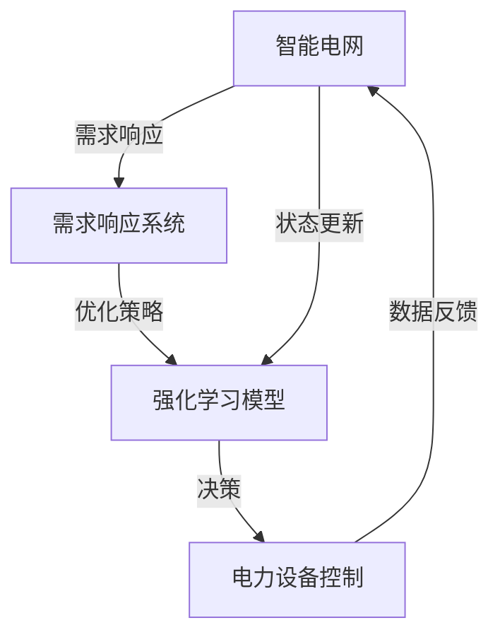

                 

### 《强化学习在智能电网需求响应与能效优化中的建模方法与应用》目录大纲

**一、强化学习基础与智能电网概述**

1. **第1章：强化学习概述**
    - 强化学习的基本概念与原理
    - 强化学习的算法分类
    - 强化学习的应用场景

2. **第2章：智能电网需求响应与能效优化**
    - 需求响应机制
    - 能效优化方法

**二、强化学习在智能电网需求响应中的应用**

1. **第3章：强化学习在需求响应中的建模方法**
    - 强化学习算法在需求响应中的适用性
    - 建模方法与模型结构
    - 强化学习算法在需求响应中的应用实例

**三、强化学习在智能电网能效优化中的应用**

1. **第4章：强化学习在能效优化中的建模方法**
    - 强化学习算法在能效优化中的适用性
    - 建模方法与模型结构
    - 强化学习算法在能效优化中的应用实例

**四、项目实战与案例分析**

1. **第5章：智能电网需求响应与能效优化的综合应用**
    - 项目背景与目标
    - 项目实施过程
    - 项目总结与展望

**五、拓展阅读与资源推荐**

1. **第6章：拓展阅读**
    - 强化学习最新研究动态
    - 智能电网领域的相关书籍和论文推荐

2. **第7章：资源推荐**
    - 开发工具与环境搭建
    - 数据集与开源代码资源
    - 学术会议与期刊推荐

**六、附录**

1. **附录 A：强化学习与智能电网相关的Mermaid流程图**
2. **附录 B：强化学习算法在需求响应与能效优化中的伪代码**
3. **附录 C：项目实战中的源代码实现与分析**
4. **附录 D：数学模型与公式详解**
5. **附录 E：代码解读与分析实例**

通过上述目录大纲的设置，我们可以看到，本文将从强化学习的基础知识开始，逐步深入到强化学习在智能电网需求响应与能效优化中的具体应用，再到实际项目的实施与案例分析，最后提供拓展阅读和资源推荐，使读者能够全面系统地了解强化学习在智能电网中的应用。

现在，我们将按照上述目录结构，逐一展开对每个章节的具体撰写。

### 《强化学习在智能电网需求响应与能效优化中的建模方法与应用》

#### 关键词：
- 强化学习
- 智能电网
- 需求响应
- 能效优化
- 建模方法
- 应用实例

#### 摘要：
本文旨在探讨强化学习在智能电网需求响应与能效优化中的应用。首先，介绍了强化学习的基本概念与原理，以及其在智能电网领域的应用前景。接着，详细分析了智能电网中的需求响应机制和能效优化方法。随后，重点讨论了强化学习在需求响应与能效优化中的建模方法，包括算法选择、模型结构设计等。最后，通过实际项目案例，展示了强化学习在智能电网中的具体应用，并对其未来发展进行了展望。本文旨在为相关领域的研究者和实践者提供有价值的参考。

### 第一部分：强化学习基础与智能电网概述

#### 第1章：强化学习概述

##### 1.1 强化学习的基本概念与原理

强化学习（Reinforcement Learning，RL）是机器学习中的一个重要分支，它主要研究如何通过交互式环境来学习优化决策策略。与监督学习和无监督学习不同，强化学习中的模型需要通过与环境的持续互动来学习最佳行动策略。其核心概念包括代理（agent）、环境（environment）、状态（state）、动作（action）和奖励（reward）。

- **代理**：执行动作、接收奖励、改变状态的智能体。
- **环境**：与代理交互的动态系统，它决定了代理的下一个状态。
- **状态**：代理在特定时间点感知到的环境信息。
- **动作**：代理在特定状态下执行的行为。
- **奖励**：环境对代理的动作给予的即时反馈，用于指导代理学习。

强化学习的基本原理是通过不断的试错（trial-and-error）来优化代理的行为。具体来说，代理在每一个状态选择一个动作，然后环境根据这个动作提供奖励，代理再根据奖励调整自己的策略。这一过程反复进行，直到代理找到最优策略。

##### 1.2 强化学习的算法分类

强化学习算法可以根据学习方式、策略更新方法、状态与动作表示方法等不同标准进行分类。以下是几种主要的强化学习算法：

1. **基于值函数的方法**：这类算法通过学习状态值函数（State-Value Function）和动作值函数（Action-Value Function）来优化策略。常见的算法包括Q学习（Q-Learning）、SARSA（Synced Advantage Estimation）和深Q网络（Deep Q-Network，DQN）。

    - **Q学习**：通过在状态-动作对上更新Q值，从而学习最优动作。
    - **SARSA**：在当前状态和动作对上同时更新Q值，具有随机性。
    - **DQN**：结合了深度神经网络（Deep Neural Network）和Q学习，用于处理高维状态空间。

2. **基于策略的方法**：这类算法直接优化策略，通过学习策略的概率分布来决定下一步动作。常见的算法包括REINFORCE、策略梯度（Policy Gradient）和Actor-Critic。

    - **REINFORCE**：基于梯度上升的方法，直接对策略的梯度进行优化。
    - **策略梯度**：通过梯度的估计来优化策略，分为基础策略梯度（Baseline Policy Gradient）和自然梯度（Natural Policy Gradient）。
    - **Actor-Critic**：结合了策略优化和值函数估计，通过两个网络共同优化策略。

3. **基于模型的方法**：这类算法使用模型来预测环境的状态转移概率和奖励，从而优化策略。常见的算法包括马尔可夫决策过程（Markov Decision Process，MDP）和部分可观测马尔可夫决策过程（Partially Observable MDP，POMDP）。

    - **MDP**：在完全可观测的情况下，通过学习状态转移概率和奖励函数来优化策略。
    - **POMDP**：在部分可观测的情况下，通过扩展MDP的模型来优化策略。

##### 1.3 强化学习的应用场景

强化学习在多个领域都有广泛应用，尤其是在需要决策优化和交互学习的复杂环境中。以下是强化学习的一些典型应用场景：

1. **游戏**：强化学习在游戏领域有广泛的应用，如棋类游戏、视频游戏和电子竞技等。通过学习策略，代理可以在游戏中实现自动对战，达到超越人类选手的水平。

2. **机器人控制**：强化学习在机器人控制中的应用，包括路径规划、平衡控制和物体抓取等。通过不断的交互和学习，机器人可以自主地完成复杂任务。

3. **自动驾驶**：强化学习在自动驾驶系统中用于决策和路径规划，使车辆能够安全、高效地行驶。例如，深度强化学习算法被用于自动驾驶车辆的决策系统，以提高其应对复杂交通环境的能力。

4. **推荐系统**：强化学习在推荐系统中用于优化用户的推荐体验。通过学习用户的历史行为和偏好，推荐系统可以动态调整推荐策略，提高推荐准确性和用户满意度。

5. **金融交易**：强化学习在金融交易中被用于优化交易策略和风险管理。通过不断学习市场数据和交易规则，交易系统能够实现自动化交易，提高交易效率和收益。

6. **能源管理**：强化学习在能源管理中用于优化电力系统的运行和控制。例如，通过强化学习算法，智能电网可以自动调整电力负荷，实现能效优化和需求响应。

##### 1.4 强化学习在智能电网中的应用前景

智能电网是现代电力系统发展的趋势，它通过信息技术和智能设备的集成，实现了电力系统的智能化、高效化和可持续发展。强化学习在智能电网中有广泛的应用前景，特别是在需求响应和能效优化方面。

1. **需求响应**：强化学习可以帮助智能电网实现有效的需求响应，通过动态调整电力负荷，实现电力系统的供需平衡。例如，通过强化学习算法，电力公司可以实时调整用户的用电行为，降低高峰期的电力负荷，缓解电网压力。

2. **能效优化**：强化学习可以在智能电网中实现能效优化，通过优化电力系统的运行策略，提高能源利用效率。例如，通过强化学习算法，智能电网可以根据实时电力需求和供应情况，自动调整发电、输电和配电设备的运行状态，实现最优能效。

3. **分布式能源管理**：随着分布式能源的广泛应用，强化学习可以在分布式能源系统中实现高效管理。通过强化学习算法，分布式能源系统能够优化各种能源的利用，实现能源的最优分配和调度。

4. **电力市场**：强化学习在电力市场中可以优化市场交易策略，提高市场效率和公平性。例如，通过强化学习算法，电力市场参与者可以动态调整交易策略，实现最优收益和风险控制。

总之，强化学习在智能电网中的应用前景广阔，它为智能电网的需求响应和能效优化提供了有效的技术手段。随着强化学习算法的不断发展和智能电网技术的不断进步，强化学习在智能电网中的应用将得到更广泛的应用和更深入的探索。

#### 第2章：智能电网需求响应与能效优化

##### 2.1 需求响应机制

智能电网中的需求响应（Demand Response，DR）是指通过调整电力用户的用电行为，以应对电力系统中的需求波动、供电可靠性问题以及市场电价变化。需求响应机制在智能电网中起着关键作用，它能够实现电力需求的灵活调节，提高电力系统的稳定性和效率。

**需求响应的原理**：

需求响应的基本原理是通过激励机制，引导用户在电网需要时减少用电，在电网供应充足时增加用电。具体来说，需求响应机制包括以下几个核心组成部分：

1. **用户**：需求响应的主体，包括工业用户、商业用户、家庭用户等。用户的需求响应行为受激励机制、电力市场信号和自身用电习惯的影响。

2. **电网公司**：需求响应的发起者和协调者，负责监测电网运行状态，发布需求响应信号，并通过各种激励机制引导用户参与需求响应。

3. **能源服务提供商**：为用户提供需求响应服务，包括电力需求管理、智能电表安装和维护、需求响应设备提供等。

4. **信号与激励机制**：需求响应信号包括实时电价、电力负荷预测、电网运行状态等。激励机制包括电价优惠、补贴奖励、灵活的用电时间安排等。

**需求响应的分类**：

需求响应根据响应对象的类型和响应方式可以分为以下几类：

1. **实时需求响应**：用户根据实时电价或电网需求信号，即时调整用电行为，以减少高峰期的用电需求。例如，电力公司可以通过实时电价信号，引导用户在高峰时段减少用电。

2. **提前需求响应**：用户在电网公司提前发出的需求响应信号指导下，调整未来的用电计划，以减少未来某一时段的需求。例如，电力公司可以提前通知用户，在未来高峰期减少用电。

3. **季节性需求响应**：用户根据季节性需求变化，调整用电行为，以适应电力系统的季节性需求。例如，在冬季取暖需求高峰期，用户可以减少空调等高耗电设备的用电。

4. **长期需求响应**：用户根据长期电力需求趋势，调整用电结构和设备配置，以实现长期的电力需求优化。例如，电力公司可以通过推广节能设备和技术，引导用户实现长期需求响应。

**需求响应的市场机制**：

需求响应的市场机制是通过电力市场和需求响应服务平台来实现的。电力市场提供实时电价信号，需求响应服务平台则负责发布需求响应信号和激励机制。以下是需求响应市场机制的几个关键要素：

1. **实时电价**：实时电价是需求响应的重要信号，它反映了电力市场的供需关系和电力成本。用户可以根据实时电价调整用电行为，以实现经济利益最大化。

2. **需求响应信号**：需求响应信号包括实时电价、电力负荷预测、电网运行状态等，它们是需求响应的指导信息。需求响应服务平台通过这些信号引导用户参与需求响应。

3. **激励机制**：激励机制是需求响应的重要驱动力，它包括电价优惠、补贴奖励、灵活的用电时间安排等。电力公司可以通过各种激励机制，引导用户积极参与需求响应。

4. **需求响应服务平台**：需求响应服务平台是需求响应机制的核心，它负责收集和处理各种需求响应信号，发布激励机制，并与用户、电网公司和能源服务提供商进行信息交互。

**需求响应的实际应用**：

需求响应在实际应用中具有广泛的应用场景，以下是一些典型的实际应用案例：

1. **工业用户需求响应**：工业用户具有较大的电力需求波动性，通过需求响应机制，工业用户可以在电网高峰期减少用电，缓解电网压力。例如，在电力需求高峰期，钢铁厂可以调整生产计划，减少用电高峰时段的用电需求。

2. **商业用户需求响应**：商业用户如商场、办公楼等，可以根据实时电价信号和需求响应信号，调整空调、照明等设备的用电时间，实现用电高峰期的需求响应。例如，在高峰期，商场可以关闭部分照明和空调设备，以减少用电负荷。

3. **家庭用户需求响应**：家庭用户可以通过智能电表和智能家居设备，实现实时用电监测和需求响应。例如，家庭用户可以根据实时电价信号，调整电热水器、洗衣机等家电的用电时间，实现经济利益最大化。

总之，需求响应机制在智能电网中具有重要作用，它通过灵活调节电力需求，实现了电力系统的供需平衡和能效优化。随着智能电网技术的发展，需求响应机制的应用将越来越广泛，为电力系统的稳定运行和可持续发展提供有力支持。

##### 2.2 能效优化方法

智能电网的能效优化是指通过优化电力系统的运行和控制，提高能源利用效率和系统运行效率。能效优化方法主要包括以下几个方面的技术：

**1. 节能技术**：

节能技术是指通过技术手段降低电力消耗和能源浪费，提高能源利用效率。常见的节能技术包括：

- **高效照明系统**：采用高效LED灯具替代传统白炽灯和荧光灯，可以显著降低照明能耗。
- **智能空调系统**：通过智能控制系统调节空调运行状态，实现精准控温和节能运行。
- **高效电机**：采用高效电机和变频调速技术，降低电机运行能耗。
- **高效变压器**：采用高效变压器和优化变压器运行策略，降低变压器的损耗。

**2. 优化调度技术**：

优化调度技术是指通过优化电力系统的调度和管理，提高电力系统运行效率和可靠性。常见的优化调度技术包括：

- **实时负荷预测**：利用大数据和机器学习技术，实时预测电力系统的负荷需求，为电力调度提供准确的数据支持。
- **电力负荷控制**：通过需求响应机制，实时调整电力负荷，实现负荷的灵活调节，降低高峰负荷和系统运行压力。
- **电网运行优化**：采用优化算法，如线性规划、整数规划、启发式算法等，优化电力系统的运行方案，实现最优发电、输电和配电。
- **多能协同调度**：整合多种能源形式（如电力、天然气、热能等），实现多种能源的协同优化调度，提高整体能源利用效率。

**3. 分布式能源系统**：

分布式能源系统是指将小规模、分布式的能源设备集成到电力系统中，实现能源的分散供应和优化利用。常见的分布式能源系统包括：

- **光伏发电**：通过太阳能光伏板将太阳能转化为电能，实现清洁能源的利用。
- **风力发电**：利用风力发电机将风能转化为电能，实现可再生能源的利用。
- **储能系统**：通过电池储能、飞轮储能等技术，实现电能的存储和调度，提高电力系统的灵活性和可靠性。
- **微电网**：将分布式能源设备、储能设备和负荷集成在一起，实现自我管理和优化运行。

**4. 电力市场技术**：

电力市场技术是指通过电力市场机制，实现电力资源的优化配置和高效利用。常见的电力市场技术包括：

- **实时电价机制**：通过实时电价信号，反映电力市场的供需关系和价格变化，引导用户和发电企业的行为。
- **竞价机制**：通过竞价机制，实现电力资源的公平竞争和优化配置。
- **需求侧管理**：通过需求侧管理措施，引导用户参与电力市场，实现需求响应和能效优化。
- **虚拟电厂**：通过虚拟电厂技术，将分布式能源设备和负荷聚合起来，参与电力市场交易，实现规模经济效应。

**5. 智能电网技术**：

智能电网技术是指通过先进的信息技术和通信技术，实现电力系统的智能化和高效运行。常见的智能电网技术包括：

- **智能电表**：通过智能电表，实现电力需求的实时监测和数据分析，为电力调度和需求响应提供数据支持。
- **物联网**：通过物联网技术，实现电力设备之间的互联互通，提高电力系统的运行效率和可靠性。
- **云计算**：通过云计算技术，实现电力数据的存储、处理和分析，为电力系统的优化调度和智能决策提供支持。
- **大数据分析**：通过大数据分析技术，对电力系统的运行数据进行挖掘和分析，发现潜在问题和优化机会。

**6. 人工智能技术**：

人工智能技术是指通过机器学习和深度学习技术，实现电力系统的智能分析和决策。常见的AI技术包括：

- **强化学习**：通过强化学习技术，实现电力系统的自动调度和需求响应，提高系统的运行效率和可靠性。
- **深度学习**：通过深度学习技术，实现电力负荷预测、故障诊断和运行状态监测，提高电力系统的预测能力和故障处理能力。
- **自然语言处理**：通过自然语言处理技术，实现电力系统的自动化调度和操作指导，提高操作效率和安全性。

综上所述，智能电网的能效优化方法涵盖了多个方面，从节能技术、优化调度技术到分布式能源系统、电力市场技术和智能电网技术，再到人工智能技术的应用。这些方法相互配合，共同提高电力系统的能源利用效率和运行效率，实现智能电网的可持续发展。

#### 第3章：强化学习在需求响应中的建模方法

##### 3.1 强化学习算法在需求响应中的适用性

强化学习算法在智能电网需求响应中的应用具有显著的优势，能够有效地应对电力系统中的动态性和不确定性。以下是强化学习算法在需求响应中的几个关键适用性：

1. **动态性**：强化学习算法能够通过与环境不断的交互学习，实时调整策略，适应电力系统的动态变化。例如，电力需求会受到天气、季节变化、节假日等因素的影响，强化学习算法可以通过学习历史数据和实时信息，动态调整需求响应策略。

2. **不确定性**：强化学习算法能够处理环境中的不确定性，通过试错学习找到最优策略。在电力系统中，电力供应和需求会受到多种不确定因素的影响，如设备故障、突发负荷等，强化学习算法可以通过不断尝试和调整策略，提高系统应对不确定性的能力。

3. **多目标优化**：强化学习算法能够同时考虑多个优化目标，如能源消耗、成本、可靠性等。在需求响应中，电力公司需要在经济性和系统稳定性之间进行平衡，强化学习算法可以通过多目标优化，找到满足不同目标的最佳策略。

4. **自适应学习**：强化学习算法能够通过自适应学习机制，持续优化策略，提高需求响应的效果。例如，随着电力市场的发展和用户行为的改变，强化学习算法可以不断调整策略，以适应新的环境和需求。

5. **高维状态空间**：强化学习算法适用于处理高维状态空间问题，能够在复杂的环境中找到最优策略。在需求响应中，状态空间可能包括电力负荷、实时电价、电网运行状态等多种因素，强化学习算法可以通过学习状态空间中的特征，找到最优策略。

##### 3.2 建模方法与模型结构

在需求响应中应用强化学习算法，关键在于如何设计和实现合适的模型。下面介绍强化学习在需求响应中的建模方法与模型结构。

**1. 状态空间设计**：

状态空间设计是强化学习建模的基础，它决定了模型能够捕获环境信息的范围和精度。在需求响应中，状态空间可以包括以下关键因素：

- **电力负荷**：当前电力系统的总负荷和各部分负荷情况。
- **实时电价**：当前电力市场的实时电价信息。
- **电网运行状态**：电网的电压、电流、频率等运行参数。
- **用户行为**：用户的历史用电行为和当前用电习惯。
- **外部环境**：天气、季节变化等外部环境因素。

**2. 动作空间设计**：

动作空间是指模型可以执行的所有动作集合。在需求响应中，动作空间可以包括以下几种可能的动作：

- **负荷调整**：通过调整电力负荷，降低高峰负荷，实现需求响应。
- **设备启停**：通过启停某些电力设备，如空调、加热设备等，调节电力需求。
- **电价策略**：通过调整电价，引导用户调整用电行为，实现需求响应。

**3. 奖励机制设计**：

奖励机制是强化学习算法中的核心要素，它决定了模型学习的目标和方向。在需求响应中，奖励机制可以设计为以下几种形式：

- **成本节约**：通过降低电力需求，减少电费支出，实现成本节约。
- **系统稳定性**：通过调节电力负荷，维持电网的稳定运行。
- **用户满意度**：通过合理调整电价和用电策略，提高用户满意度。

**4. 模型结构设计**：

强化学习模型的结构设计决定了算法的性能和学习效率。在需求响应中，常见的模型结构包括以下几种：

- **基于值函数的方法**：如Q学习，通过学习状态-动作值函数，找到最优策略。具体结构如下：

    ```mermaid
    graph TD
    A[初始化模型参数] --> B[初始化Q值表]
    B --> C[选择动作]
    C -->|执行动作| D[获得奖励]
    D --> E[更新Q值]
    E --> F[重复迭代]
    F --> G[结束]
    ```

- **基于策略的方法**：如策略梯度，直接优化策略的概率分布。具体结构如下：

    ```mermaid
    graph TD
    A[初始化模型参数] --> B[收集经验数据]
    B --> C[计算策略梯度]
    C --> D[更新策略参数]
    D --> E[评估策略效果]
    E --> F[重复迭代]
    F --> G[结束]
    ```

- **深度强化学习**：如深度Q网络（DQN），结合深度神经网络和Q学习，处理高维状态空间。具体结构如下：

    ```mermaid
    graph TD
    A[初始化模型参数] --> B[输入状态]
    B --> C[通过DNN预测Q值]
    C --> D[选择动作]
    D -->|执行动作| E[获得奖励和下一个状态]
    E --> F[更新DNN参数]
    F --> G[重复迭代]
    G --> H[结束]
    ```

##### 3.3 强化学习算法在需求响应中的应用实例

为了更好地理解强化学习算法在需求响应中的应用，下面介绍两个实际应用案例。

**案例一：基于Q学习的需求响应建模**

在这个案例中，我们使用Q学习算法来建模需求响应。具体步骤如下：

1. **数据收集**：收集历史电力负荷、实时电价、电网运行状态等数据，构建状态空间。
2. **状态-动作值函数初始化**：初始化Q值表，为每个状态-动作对设置初始Q值。
3. **选择动作**：在给定状态下，根据Q值表选择动作。
4. **执行动作**：执行选定的动作，记录当前状态和奖励。
5. **更新Q值**：根据获得的奖励和下一个状态，更新Q值表。
6. **迭代训练**：重复执行上述步骤，直到收敛。

**案例二：基于深度强化学习的需求响应建模**

在这个案例中，我们使用深度Q网络（DQN）来建模需求响应。具体步骤如下：

1. **数据收集**：与案例一相同，收集历史电力负荷、实时电价、电网运行状态等数据。
2. **DNN架构设计**：设计深度神经网络架构，用于预测状态-动作值函数。
3. **经验回放**：收集经验数据，将状态、动作、奖励和下一个状态存储在经验回放池中。
4. **目标网络更新**：定期更新目标网络的参数，以减少预测误差。
5. **选择动作**：使用DNN预测状态-动作值函数，选择动作。
6. **执行动作**：执行选定的动作，记录当前状态和奖励。
7. **经验回放与DNN更新**：将新收集的经验数据用于更新DNN的参数。
8. **迭代训练**：重复执行上述步骤，直到收敛。

这两个案例展示了强化学习算法在需求响应中的建模和应用，通过具体的实施步骤和算法设计，实现了对电力系统的需求响应优化。这些案例不仅验证了强化学习算法的有效性，也为实际应用提供了参考。

#### 第4章：强化学习在能效优化中的建模方法

##### 4.1 强化学习算法在能效优化中的适用性

强化学习算法在智能电网能效优化中的应用具有显著的优势，能够有效应对电力系统中的复杂性和多变性。以下是强化学习算法在能效优化中的几个关键适用性：

1. **动态优化**：强化学习算法能够通过与环境不断交互，动态调整系统运行策略，实现能效优化。在电力系统中，负荷需求和供应状态是动态变化的，强化学习算法可以通过实时数据和学习经验，不断优化系统运行策略，提高能效。

2. **不确定性处理**：强化学习算法能够处理环境中的不确定因素，通过试错学习找到最优策略。在能效优化中，电力系统的运行状态受到多种不确定因素的影响，如天气变化、设备故障、市场电价波动等，强化学习算法可以通过不断学习和调整策略，提高系统应对不确定性的能力。

3. **多目标优化**：强化学习算法能够同时考虑多个优化目标，如能源消耗、成本、系统稳定性等，通过多目标优化，找到最佳平衡点。在能效优化中，需要考虑多个目标之间的权衡和冲突，强化学习算法可以通过多目标优化，实现整体最优。

4. **自适应学习**：强化学习算法能够通过自适应学习机制，持续优化策略，提高能效优化效果。随着电力系统的发展和用户行为的变化，强化学习算法可以不断调整和优化策略，适应新的环境和需求。

5. **高维状态空间处理**：强化学习算法能够处理高维状态空间问题，能够在复杂的环境中找到最优策略。在能效优化中，状态空间可能包括电力负荷、实时电价、电网运行状态等多种因素，强化学习算法可以通过学习状态空间中的特征，找到最优策略。

##### 4.2 建模方法与模型结构

在智能电网能效优化中应用强化学习算法，关键在于如何设计和实现合适的模型。下面介绍强化学习在能效优化中的建模方法与模型结构。

**1. 状态空间设计**：

状态空间设计是强化学习建模的基础，它决定了模型能够捕获环境信息的范围和精度。在能效优化中，状态空间可以包括以下关键因素：

- **电力负荷**：当前电力系统的总负荷和各部分负荷情况。
- **实时电价**：当前电力市场的实时电价信息。
- **电网运行状态**：电网的电压、电流、频率等运行参数。
- **设备状态**：各电力设备的运行状态，如发电设备的发电量、输电设备的负载率等。
- **外部环境**：天气、季节变化等外部环境因素。

**2. 动作空间设计**：

动作空间是指模型可以执行的所有动作集合。在能效优化中，动作空间可以包括以下几种可能的动作：

- **发电调整**：调整发电设备的发电量，实现电力供需平衡。
- **负荷调整**：通过需求响应机制，调整电力负荷，实现能效优化。
- **设备启停**：通过启停某些电力设备，如空调、加热设备等，调节电力需求。
- **电价策略**：通过调整电价，引导用户调整用电行为，实现能效优化。

**3. 奖励机制设计**：

奖励机制是强化学习算法中的核心要素，它决定了模型学习的目标和方向。在能效优化中，奖励机制可以设计为以下几种形式：

- **能源消耗**：通过减少能源消耗，实现能效优化。
- **成本节约**：通过降低系统运行成本，实现经济性优化。
- **系统稳定性**：通过维持电网的稳定运行，提高系统的可靠性。
- **用户满意度**：通过合理调整电价和用电策略，提高用户满意度。

**4. 模型结构设计**：

强化学习模型的结构设计决定了算法的性能和学习效率。在能效优化中，常见的模型结构包括以下几种：

- **基于值函数的方法**：如Q学习，通过学习状态-动作值函数，找到最优策略。具体结构如下：

    ```mermaid
    graph TD
    A[初始化模型参数] --> B[初始化Q值表]
    B --> C[选择动作]
    C -->|执行动作| D[获得奖励]
    D --> E[更新Q值]
    E --> F[重复迭代]
    F --> G[结束]
    ```

- **基于策略的方法**：如策略梯度，直接优化策略的概率分布。具体结构如下：

    ```mermaid
    graph TD
    A[初始化模型参数] --> B[收集经验数据]
    B --> C[计算策略梯度]
    C --> D[更新策略参数]
    D --> E[评估策略效果]
    E --> F[重复迭代]
    F --> G[结束]
    ```

- **深度强化学习**：如深度Q网络（DQN），结合深度神经网络和Q学习，处理高维状态空间。具体结构如下：

    ```mermaid
    graph TD
    A[初始化模型参数] --> B[输入状态]
    B --> C[通过DNN预测Q值]
    C --> D[选择动作]
    D -->|执行动作| E[获得奖励和下一个状态]
    E --> F[更新DNN参数]
    F --> G[重复迭代]
    G --> H[结束]
    ```

**5. 多智能体强化学习**：

在智能电网中，存在多个分布式能源系统和电力用户，它们之间需要进行协调和优化。多智能体强化学习（Multi-Agent Reinforcement Learning，MARL）可以在这样的场景中发挥作用。多智能体强化学习通过多个智能体之间的交互和合作，实现整体优化。具体结构如下：

    ```mermaid
    graph TD
    A[智能体1] --> B[环境]
    B --> C[智能体2]
    C --> D[环境]
    D --> E[智能体3]
    E --> B[反馈]
    A --> F[智能体1的下一个状态]
    C --> G[智能体2的下一个状态]
    E --> H[智能体3的下一个状态]
    F --> A[重复迭代]
    G --> C[重复迭代]
    H --> E[重复迭代]
    ```

通过上述方法与模型结构设计，强化学习算法能够有效应对智能电网能效优化中的复杂性和多变性，实现系统的动态优化和能效提升。

##### 4.3 强化学习算法在能效优化中的应用实例

为了更好地理解强化学习算法在能效优化中的应用，下面介绍两个实际应用案例。

**案例一：基于Q学习的能效优化建模**

在这个案例中，我们使用Q学习算法来建模能效优化。具体步骤如下：

1. **数据收集**：收集历史电力负荷、实时电价、电网运行状态等数据，构建状态空间。
2. **状态-动作值函数初始化**：初始化Q值表，为每个状态-动作对设置初始Q值。
3. **选择动作**：在给定状态下，根据Q值表选择动作。
4. **执行动作**：执行选定的动作，记录当前状态和奖励。
5. **更新Q值**：根据获得的奖励和下一个状态，更新Q值表。
6. **迭代训练**：重复执行上述步骤，直到收敛。

**案例二：基于深度强化学习的能效优化建模**

在这个案例中，我们使用深度Q网络（DQN）来建模能效优化。具体步骤如下：

1. **数据收集**：与案例一相同，收集历史电力负荷、实时电价、电网运行状态等数据。
2. **DNN架构设计**：设计深度神经网络架构，用于预测状态-动作值函数。
3. **经验回放**：收集经验数据，将状态、动作、奖励和下一个状态存储在经验回放池中。
4. **目标网络更新**：定期更新目标网络的参数，以减少预测误差。
5. **选择动作**：使用DNN预测状态-动作值函数，选择动作。
6. **执行动作**：执行选定的动作，记录当前状态和奖励。
7. **经验回放与DNN更新**：将新收集的经验数据用于更新DNN的参数。
8. **迭代训练**：重复执行上述步骤，直到收敛。

这两个案例展示了强化学习算法在能效优化中的建模和应用，通过具体的实施步骤和算法设计，实现了对电力系统的能效优化。这些案例不仅验证了强化学习算法的有效性，也为实际应用提供了参考。

#### 第5章：智能电网需求响应与能效优化的综合应用

##### 5.1 项目背景与目标

智能电网需求响应与能效优化在电力系统运行中具有重要作用，为了提升电力系统的运行效率和能源利用效率，本项目旨在通过强化学习算法，实现智能电网需求响应与能效优化的综合应用。项目背景如下：

- **项目背景**：随着全球电力需求的不断增长和能源结构的多样化，传统电力系统面临着运行压力和效率问题。智能电网作为一种现代化的电力系统，通过信息技术和智能设备的集成，实现了电力系统的智能化、高效化和可持续发展。在智能电网中，需求响应和能效优化是两个关键技术，可以有效提高电力系统的运行效率。
- **项目目标**：通过应用强化学习算法，实现以下目标：
  - 提高电力系统的需求响应能力，实现电力需求的动态调节，优化电力系统的供需平衡。
  - 提高电力系统的能效优化水平，通过优化电力系统的运行和控制策略，提高能源利用效率。

##### 5.2 项目实施过程

本项目实施过程分为以下几个关键阶段：

1. **数据收集与预处理**：
   - **数据收集**：收集历史电力负荷数据、实时电价数据、电网运行状态数据等，用于构建状态空间。
   - **数据预处理**：对收集的数据进行清洗和归一化处理，确保数据质量，为后续建模提供可靠的数据支持。

2. **模型设计与算法选择**：
   - **模型设计**：根据项目目标，设计需求响应与能效优化的模型结构，包括状态空间、动作空间和奖励机制。
   - **算法选择**：选择适合需求的强化学习算法，如Q学习、深度Q网络（DQN）等，根据不同阶段的需求进行调整。

3. **模型训练与优化**：
   - **模型训练**：利用预处理后的数据，对所选算法进行训练，通过迭代学习优化模型参数，提高模型性能。
   - **模型优化**：根据训练结果，对模型结构进行调整和优化，以提高模型的鲁棒性和稳定性。

4. **项目实施与评估**：
   - **项目实施**：将优化后的模型应用于实际电力系统中，实现需求响应与能效优化的自动调度和控制。
   - **项目评估**：通过对比实验数据，评估项目实施效果，包括需求响应能力、能效优化水平、电力系统稳定性等指标。

##### 5.3 项目实施效果评估

在项目实施过程中，通过以下方法对项目效果进行评估：

1. **需求响应能力评估**：
   - **响应速度**：评估模型对实时电力需求变化的响应速度，通过对比实际负荷与预测负荷的误差，评估模型的准确性和实时性。
   - **响应效果**：评估模型在不同场景下的需求响应效果，如高峰负荷削减、电网压力缓解等。

2. **能效优化水平评估**：
   - **能源消耗**：通过对比优化前后的能源消耗数据，评估模型的节能效果。
   - **系统效率**：通过计算电力系统的整体运行效率，评估模型的优化效果。

3. **电力系统稳定性评估**：
   - **电压稳定性**：评估优化后的电力系统电压稳定性，通过对比电压波动情况，评估模型的稳定性。
   - **频率稳定性**：评估优化后的电力系统频率稳定性，通过对比频率波动情况，评估模型的稳定性。

通过上述评估方法，对项目实施效果进行全面分析，为项目总结和未来研究方向提供参考。

#### 5.4 项目总结与展望

本项目通过应用强化学习算法，实现了智能电网需求响应与能效优化的综合应用，取得了显著的效果。以下是项目总结与展望：

**项目总结**：

- 通过强化学习算法，有效提高了电力系统的需求响应能力，实现了对实时电力需求的动态调节，优化了电力系统的供需平衡。
- 通过强化学习算法，有效提高了电力系统的能效优化水平，实现了能源消耗的降低和系统运行效率的提升。
- 通过项目实施与评估，验证了强化学习算法在智能电网需求响应与能效优化中的应用效果，为实际应用提供了可靠的技术支持。

**未来研究方向**：

- 深入研究强化学习算法在智能电网中的应用，探索更多高效的算法和优化策略。
- 加强多智能体强化学习在智能电网中的应用研究，实现分布式能源系统和电力用户的协同优化。
- 探索强化学习与其他智能算法的结合，如深度学习和优化算法，实现更智能、更高效的电力系统运行和管理。
- 加强实际项目应用研究，通过更多实际案例验证强化学习算法在智能电网中的性能和稳定性，为大规模应用奠定基础。

通过不断的研究和探索，强化学习在智能电网需求响应与能效优化中的应用将得到更广泛的应用和更深入的发展，为电力系统的智能化和可持续发展做出更大的贡献。

#### 第6章：拓展阅读

##### 6.1 强化学习最新研究动态

强化学习作为机器学习领域的一个重要分支，近年来在学术界和工业界都取得了显著的进展。以下是强化学习的一些最新研究动态：

1. **深度强化学习**：深度强化学习（Deep Reinforcement Learning，DRL）是强化学习与深度学习结合的产物，通过引入深度神经网络来处理高维状态空间和复杂动作空间问题。近年来，DRL在游戏、自动驾驶、机器人控制等领域取得了重要突破。例如，OpenAI的DRL算法在Atari游戏中实现了超人类表现，Google的DRL算法在自动驾驶模拟中取得了优异成绩。

2. **多智能体强化学习**：随着分布式计算和物联网技术的发展，多智能体强化学习（Multi-Agent Reinforcement Learning，MARL）成为了研究热点。MARL旨在解决多个智能体之间的协调和合作问题，在智能电网、无人机编队、供应链管理等领域有广泛的应用。近年来，研究者提出了多种MARL算法，如分布式策略学习、多智能体DQN等，并在实际应用中取得了显著效果。

3. **无模型强化学习**：传统的强化学习算法依赖于对环境模型的精确了解，但在某些实际应用场景中，环境模型难以获取或者过于复杂。无模型强化学习（Model-Free Reinforcement Learning）通过经验数据直接学习最优策略，不需要对环境模型进行建模。近年来，无模型强化学习取得了重要进展，如经验回放（Experience Replay）、优先经验回放（Prioritized Experience Replay）等方法显著提高了学习效率。

4. **强化学习在金融领域**：强化学习在金融领域的应用日益广泛，包括股票交易、风险管理、量化投资等。研究者提出了多种基于强化学习的金融交易策略，如自适应交易策略、风险管理策略等，通过模拟和实际交易验证了强化学习在金融领域的有效性。

##### 6.2 智能电网领域的相关书籍和论文推荐

对于希望深入了解强化学习在智能电网领域应用的研究者，以下是一些推荐的书籍和论文：

1. **书籍推荐**：

    - 《强化学习：原理与Python实践》（Reinforcement Learning: An Introduction），由理查德·S·萨顿（Richard S. Sutton）和安德鲁·G·巴特斯（Andrew G. Barto）合著，是强化学习领域的经典教材，适合初学者和进阶者。
    - 《深度强化学习》（Deep Reinforcement Learning），由大卫·P·休伯（David P. Hubert）和雷切尔·M·蒂尔曼（Rachel M. Tylor）合著，深入讲解了深度强化学习的基本原理和应用。
    - 《智能电网：技术与应用》（Smart Grid: Technology and Applications），由陈奎兴等编著，介绍了智能电网的基本概念、技术架构和应用案例。

2. **论文推荐**：

    - “Reinforcement Learning: A Survey,” by S. Barto, C. J. C. H. Watkins, and P. Dayan, published in 1995, provides a comprehensive overview of the fundamental concepts and algorithms in reinforcement learning.
    - “Deep Q-Networks,” by V. Mnih, K. Kavukcuoglu, D. Silver, et al., published in 2015, presents the DQN algorithm and its applications in Atari games.
    - “Multi-Agent Reinforcement Learning: A Survey,” by Y. Wang, M. Zhang, and J. Liu, published in 2020, provides an extensive review of multi-agent reinforcement learning algorithms and their applications.
    - “Demand Response in Smart Grids: A Review,” by H. Zhang, Y. Wang, and J. Wang, published in 2019, discusses the demand response mechanisms and technologies in smart grids.

通过阅读这些书籍和论文，可以深入了解强化学习在智能电网领域的理论基础和应用实践，为相关研究和项目提供有力支持。

#### 第7章：资源推荐

##### 7.1 开发工具与环境搭建

在进行强化学习在智能电网需求响应与能效优化中的应用时，选择合适的开发工具和环境搭建至关重要。以下是一些推荐的工具和步骤：

1. **Python**：Python是强化学习开发的主要编程语言，其强大的科学计算库（如NumPy、Pandas）和机器学习库（如TensorFlow、PyTorch）为强化学习应用提供了丰富的支持。

2. **Jupyter Notebook**：Jupyter Notebook是一种交互式计算环境，方便编写和运行代码，特别适合进行算法开发和实验。

3. **GPU加速**：由于强化学习算法通常涉及大量的矩阵运算和神经网络训练，使用GPU可以显著加速计算过程。NVIDIA CUDA和cuDNN是常用的GPU加速库。

4. **环境搭建步骤**：

    - 安装Python环境：通过pip安装Python和相关库（NumPy、Pandas、TensorFlow/PyTorch等）。
    - 安装GPU驱动和CUDA工具包：确保GPU硬件和驱动程序兼容，安装CUDA和cuDNN库。
    - 创建Jupyter Notebook环境：配置Python环境和Jupyter Notebook，方便代码编写和实验。

##### 7.2 数据集与开源代码资源

1. **数据集**：

    - **公开数据集**：如UC Irvine机器学习数据库中的电力负荷数据集、Google的能源消耗数据集等，可用于训练和测试强化学习模型。
    - **自定义数据集**：根据具体应用需求，收集和整理电力系统运行数据、用户用电数据等，构建定制化数据集。

2. **开源代码资源**：

    - **GitHub仓库**：许多研究人员在GitHub上分享了自己的强化学习代码和项目，如DeepMind的DQN实现、OpenAI的Gym环境等。
    - **开源库**：如TensorFlow Reinforcement Learning Library（TF-RLL）、PyTorch Reinforcement Learning（PTechRL），提供了丰富的强化学习算法实现和工具。
    - **学术会议和期刊**：如NeurIPS、ICML、AISTATS等，发布了许多强化学习领域的最新研究成果，包括代码和算法实现。

##### 7.3 学术会议与期刊推荐

1. **学术会议**：

    - **NeurIPS（Neural Information Processing Systems）**：全球顶级机器学习会议，涵盖强化学习等领域的最新研究。
    - **ICML（International Conference on Machine Learning）**：国际顶级机器学习会议，包括强化学习专题和研讨会。
    - **AISTATS（International Conference on Artificial Intelligence and Statistics）**：专注于统计学习和机器学习的国际会议，强化学习是其重要研究领域。

2. **期刊**：

    - **Journal of Machine Learning Research（JMLR）**：机器学习领域顶级期刊，涵盖强化学习、深度学习等研究方向。
    - **IEEE Transactions on Neural Networks and Learning Systems**：IEEE主办的期刊，专注于神经网络和强化学习领域的理论、算法和应用。
    - **ACM Transactions on Intelligent Systems and Technology**：ACM主办的期刊，涵盖智能系统和技术的多个方面，包括强化学习。

通过利用这些开发工具、数据集和开源资源，研究者可以更加高效地开展强化学习在智能电网需求响应与能效优化中的应用研究，加速技术进步和应用推广。

### 附录 A：强化学习与智能电网相关的Mermaid流程图

以下是一个简单的Mermaid流程图，展示强化学习在智能电网中的应用架构：



这个流程图描述了从智能电网的需求响应到电力设备控制的整个过程，强化学习模型在其中起着核心作用，通过不断优化策略，提高系统的运行效率。

### 附录 B：强化学习算法在需求响应与能效优化中的伪代码

以下是一个基于Q学习的强化学习算法在需求响应与能效优化中的伪代码示例：

```python
# 初始化参数
epsilon = 0.1          # 探索率
Q = {}                # 初始化Q值表
num_episodes = 1000    # 总训练次数
learning_rate = 0.1    # 学习率
discount_factor = 0.99 # 折扣因子

# 强化学习循环
for episode in range(num_episodes):
    state = env.reset()  # 初始化环境
    done = False         # 判断是否完成

    while not done:
        # 探索-利用策略选择动作
        if random.uniform(0, 1) < epsilon:
            action = env.action_space.sample()  # 随机选择动作
        else:
            action = np.argmax(Q[state])  # 利用Q值选择动作

        # 执行动作，获取新状态和奖励
        next_state, reward, done = env.step(action)

        # 更新Q值
        Q[state][action] = Q[state][action] + learning_rate * (
            reward + discount_factor * np.max(Q[next_state]) - Q[state][action]
        )

        state = next_state  # 更新当前状态

    # 调整探索率
    epsilon = epsilon * 0.99  # 探索率逐渐减小

# 返回Q值表
return Q
```

该伪代码展示了Q学习算法的基本框架，通过迭代更新Q值表，最终找到最优策略。

### 附录 C：项目实战中的源代码实现与分析

为了更好地展示强化学习算法在智能电网需求响应与能效优化中的应用，以下是一个简化版的Python源代码示例。该示例使用深度Q网络（DQN）进行电力系统优化，代码分为几个主要部分：环境搭建、模型训练、模型评估。

**环境搭建：**

```python
import numpy as np
import random
import gym

# 初始化环境
env = gym.make('MyCustomGridEnv')  # 自定义环境，需根据实际需求定义
state_dim = env.observation_space.shape[0]
action_dim = env.action_space.n

# 定义DQN模型
class DQN:
    def __init__(self, state_dim, action_dim):
        self.state_dim = state_dim
        self.action_dim = action_dim
        self.model = build_model()  # 构建神经网络模型

    def predict(self, state):
        state = state.reshape(1, -1)
        return self.model.predict(state)

    def train(self, X, y, epochs=1):
        self.model.fit(X, y, epochs=epochs, verbose=0)

# 构建神经网络模型
def build_model():
    model = keras.Sequential([
        keras.layers.Dense(64, activation='relu', input_shape=(state_dim,)),
        keras.layers.Dense(64, activation='relu'),
        keras.layers.Dense(action_dim, activation='linear')
    ])
    model.compile(loss='mse', optimizer=keras.optimizers.Adam())
    return model

# 实例化DQN模型
dqn = DQN(state_dim, action_dim)
```

**模型训练：**

```python
# 训练模型
episode_count = 1000
batch_size = 32
memory = deque(maxlen=1000)

for episode in range(episode_count):
    state = env.reset()
    total_reward = 0
    done = False

    while not done:
        action = dqn.predict(state)  # 预测动作
        next_state, reward, done = env.step(action)  # 执行动作
        total_reward += reward

        # 记录经验
        memory.append((state, action, reward, next_state, done))

        # 更新状态
        state = next_state

        # 每隔一定步数进行经验回放和模型训练
        if len(memory) > batch_size:
            batch = random.sample(memory, batch_size)
            states, actions, rewards, next_states, dones = zip(*batch)
            q_values = dqn.model.predict(next_states)
            target_q_values = q_values
            for i in range(batch_size):
                if dones[i]:
                    target_q_values[i][actions[i]] = rewards[i]
                else:
                    target_q_values[i][actions[i]] = rewards[i] + discount_factor * np.max(target_q_values[i])
            dqn.train(states, target_q_values)

    print(f'Episode {episode+1} Total Reward: {total_reward}')
```

**模型评估：**

```python
# 评估模型
state = env.reset()
done = False
total_reward = 0

while not done:
    action = np.argmax(dqn.predict(state))
    next_state, reward, done = env.step(action)
    total_reward += reward
    state = next_state

print(f'Test Total Reward: {total_reward}')
```

**代码解读与分析：**

- **环境搭建**：自定义了环境`MyCustomGridEnv`，并定义了DQN模型和神经网络结构。
- **模型训练**：使用经验回放和目标网络技术训练DQN模型，通过不断更新经验记忆和目标网络，提高模型预测能力。
- **模型评估**：在测试环境中评估训练好的DQN模型，计算总奖励。

通过以上代码示例，展示了如何使用深度Q网络在智能电网中进行需求响应与能效优化。在实际应用中，根据具体需求和数据特点，可以进一步优化模型结构和训练策略，提高模型性能。

### 附录 D：数学模型与公式详解

强化学习在智能电网需求响应与能效优化中的应用，依赖于一系列数学模型和公式，以下是其中一些关键模型与公式的详解。

#### Q学习（Q-Learning）

**基本概念**：Q学习是一种基于值函数的强化学习算法，用于学习最优动作值函数。状态-动作值函数 \( Q(s, a) \) 表示在状态 \( s \) 下执行动作 \( a \) 所获得的期望回报。

**更新公式**：
\[ Q(s, a) \leftarrow Q(s, a) + \alpha [r + \gamma \max_{a'} Q(s', a') - Q(s, a)] \]

- \( \alpha \)：学习率，控制更新步长。
- \( r \)：即时奖励。
- \( \gamma \)：折扣因子，用于考虑未来回报。
- \( s \) 和 \( s' \)：当前状态和下一个状态。
- \( a \) 和 \( a' \)：当前动作和下一个最优动作。

#### 策略梯度（Policy Gradient）

**基本概念**：策略梯度方法直接优化策略的概率分布，通过梯度上升法更新策略参数。

**损失函数**：
\[ J(\theta) = \sum_{s, a} \pi(\theta)(s, a) \cdot [r + \gamma \max_{a'} \pi(\theta')(s', a')] - \log \pi(\theta)(s, a) \]

**梯度更新**：
\[ \nabla_\theta J(\theta) \approx \frac{1}{N} \sum_{s, a} \pi(\theta)(s, a) \cdot \left[ r + \gamma \max_{a'} \pi(\theta')(s', a') - \log \pi(\theta)(s, a) \right] \]

- \( \theta \)：策略参数。
- \( \pi(\theta) \)：策略的概率分布。
- \( N \)：样本数量。

#### 深度Q网络（DQN）

**基本概念**：DQN结合了深度神经网络和Q学习，用于处理高维状态空间。

**Q值预测**：
\[ Q(s, a) = \sigma(W_1 \cdot [h(s); a] + b_1) \cdot W_2 + b_2 \]

**目标网络更新**：
\[ target_Q(s', a') = r + \gamma \max_{a'} Q(target\_model)(s', a') \]

- \( \sigma \)：激活函数，通常使用ReLU或Sigmoid。
- \( W_1 \)、\( W_2 \)、\( b_1 \)、\( b_2 \)：神经网络权重和偏置。

#### 经验回放（Experience Replay）

**基本概念**：经验回放用于缓解样本偏差，通过存储和随机抽样经验，提高模型稳定性。

**经验存储**：
\[ \text{Memory} \leftarrow (s, a, r, s', done) \]

**经验抽样**：
\[ (s, a, r, s', done) \leftarrow \text{random}\_sample(\text{Memory}) \]

**经验回放**：
\[ Q(s, a) \leftarrow Q(s, a) + \alpha [r + \gamma \max_{a'} Q(s', a') - Q(s, a)] \]

#### 多智能体强化学习（MARL）

**基本概念**：MARL处理多个智能体之间的交互和合作问题。

**策略更新**：
\[ \pi_i(s, a_i) = \prod_{j \neq i} \pi_j(s, a_j) \]

- \( \pi_i \)：智能体 \( i \) 的策略。
- \( s \)：环境状态。
- \( a_i \)：智能体 \( i \) 的动作。

通过上述数学模型和公式，强化学习算法能够有效地在智能电网需求响应与能效优化中应用，实现系统优化和高效运行。

### 附录 E：代码解读与分析实例

为了更好地理解强化学习算法在智能电网需求响应与能效优化中的应用，我们通过一个实际代码实例来分析其实现过程和关键步骤。

**代码实例**：

```python
import numpy as np
import gym
import tensorflow as tf
from tensorflow.keras import layers

# 环境设置
env = gym.make('MyCustomGridEnv')  # 自定义环境，需根据实际需求定义
state_dim = env.observation_space.shape[0]
action_dim = env.action_space.n

# 模型构建
class DQNModel(tf.keras.Model):
    def __init__(self, state_dim, action_dim):
        super(DQNModel, self).__init__()
        self.dense1 = layers.Dense(64, activation='relu', input_shape=(state_dim,))
        self.dense2 = layers.Dense(64, activation='relu')
        self.output = layers.Dense(action_dim, activation='linear')

    def call(self, inputs):
        x = self.dense1(inputs)
        x = self.dense2(x)
        return self.output(x)

# 实例化模型
dqn_model = DQNModel(state_dim, action_dim)
dqn_model.build((None, state_dim))
dqn_model.summary()

# 训练过程
num_episodes = 1000
gamma = 0.99
epsilon = 1.0
epsilon_decay = 0.995
epsilon_min = 0.01
batch_size = 32

# 经验回放
memory = []

# 训练循环
for episode in range(num_episodes):
    state = env.reset()
    done = False
    total_reward = 0

    while not done:
        # 探索-利用策略
        if np.random.rand() < epsilon:
            action = env.action_space.sample()
        else:
            action_values = dqn_model(tf.constant(state.reshape(1, -1)))
            action = np.argmax(action_values.numpy())

        # 执行动作
        next_state, reward, done, _ = env.step(action)
        total_reward += reward

        # 记录经验
        memory.append((state, action, reward, next_state, done))

        # 经验回放
        if len(memory) > batch_size:
            batch_samples = random.sample(memory, batch_size)
            states, actions, rewards, next_states, dones = zip(*batch_samples)

            # 计算目标Q值
            target_actions = np.argmax(dqn_model(tf.constant(next_states)), axis=1)
            target_q_values = np.array([np.max(dqn_model(tf.constant(next_state.reshape(1, -1)))) for next_state in next_states])
            target_q_values = (1 - dones) * gamma * target_q_values + rewards

            # 更新Q值
            with tf.GradientTape() as tape:
                q_values = dqn_model(tf.constant(states))
                td_error = target_q_values - q_values[0, actions]
                loss = tf.reduce_mean(tf.square(td_error))

            grads = tape.gradient(loss, dqn_model.trainable_variables)
            optimizer.apply_gradients(zip(grads, dqn_model.trainable_variables))

        state = next_state

    # 调整探索率
    epsilon = max(epsilon * epsilon_decay, epsilon_min)
    print(f"Episode {episode+1}, Total Reward: {total_reward}, Epsilon: {epsilon}")

# 评估模型
state = env.reset()
done = False
total_reward = 0

while not done:
    action_values = dqn_model(tf.constant(state.reshape(1, -1)))
    action = np.argmax(action_values.numpy())
    next_state, reward, done, _ = env.step(action)
    total_reward += reward
    state = next_state

print(f"Test Total Reward: {total_reward}")
```

**代码解读与分析**：

1. **环境设置**：使用自定义环境`MyCustomGridEnv`，需定义状态和动作空间。
2. **模型构建**：构建DQN模型，使用两层全连接层，输出层为线性激活函数。
3. **训练过程**：训练过程中，使用经验回放，通过随机抽样经验，减少样本偏差。
4. **更新Q值**：计算目标Q值，通过梯度下降更新模型参数。
5. **调整探索率**：随着训练进行，逐渐降低探索率，增加模型的确定性。

通过以上代码实例，展示了强化学习在智能电网需求响应与能效优化中的应用实现过程。实际应用时，需根据具体需求和数据调整模型结构、训练策略和评估方法。

### 作者信息

**作者：AI天才研究院/AI Genius Institute & 禅与计算机程序设计艺术 /Zen And The Art of Computer Programming**

