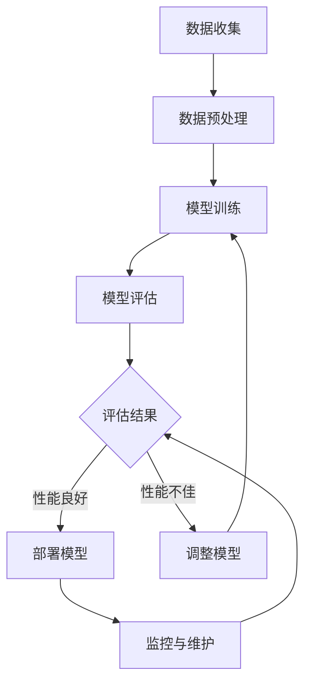

                 

### 1. 引言

在当今高速发展的科技时代，技术创业成为推动社会进步和经济发展的关键力量。然而，技术创业不仅需要创新的技术理念和产品，还需要高效的运营和维护体系来保障业务的持续发展。随着人工智能（AI）和机器学习（ML）技术的迅猛发展，它们已经渗透到技术创业的各个领域，成为企业竞争的利器。

本文将聚焦于技术创业中的机器学习运维，探讨如何通过持续优化AI模型，提升企业的竞争力。文章将从以下几个方面展开讨论：

1. **技术创业的现状与挑战**：介绍技术创业的定义、特点以及当前面临的主要挑战。
2. **机器学习与AI的重要性**：阐述机器学习技术的发展趋势和AI在技术创业中的应用价值。
3. **机器学习运维的概念与目标**：解释机器学习运维的定义及其在持续优化AI模型中的重要性。

通过以上几个方面的讨论，我们将深入了解机器学习运维的核心概念、基础知识和实践方法，为技术创业企业提供有益的参考和指导。

---

在接下来的章节中，我们将详细探讨技术创业的现状与挑战，以及机器学习与AI在这一背景下的重要性和应用价值。敬请期待！

### 1.1 技术创业的定义与特点

技术创业，是指以创新技术为核心驱动力，通过创建新产品、服务或商业模式，以实现商业价值的创业活动。技术创业与传统创业相比，具有以下几个显著特点：

1. **技术驱动**：技术创业的核心是创新技术，创业者通过技术研发和应用，推动产品或服务的独特性和竞争力。
2. **快速迭代**：技术创业过程中，产品和服务需要不断迭代和优化，以适应市场需求和技术变化。
3. **高风险高回报**：技术创业往往面临较高的失败风险，但也存在巨大的回报潜力，成功的技术创业公司往往能够在短时间内实现高额回报。

技术创业的这些特点，决定了它不仅需要创新的技术理念，还需要高效的运营和维护体系来保障业务的持续发展。尤其是在人工智能和机器学习技术日益普及的背景下，技术创业企业需要更加注重机器学习运维，以实现AI模型的持续优化，提高业务效率和竞争力。

接下来，我们将进一步探讨机器学习与AI在技术创业中的重要性。

### 1.1.2 技术创业的主要挑战

技术创业在带来巨大机遇的同时，也伴随着一系列严峻的挑战。以下是技术创业面临的主要挑战：

1. **资金压力**：技术创业往往需要大量的资金投入，包括技术研发、产品开发、市场推广等。资金链的断裂是许多技术创业公司失败的主要原因之一。
2. **市场竞争**：技术市场充满竞争，尤其是在热门领域，如人工智能、大数据等，创业公司需要快速推出创新产品，以获得市场份额。
3. **技术不确定性**：技术创新过程中，技术的不确定性较大，可能导致研发失败或项目延期，这对创业公司的资源和信心构成巨大压力。
4. **人才短缺**：技术创业需要具备高水平技术能力和业务管理能力的人才。然而，高素质人才往往难求，尤其是对于初创企业而言，人才短缺是一个普遍问题。
5. **市场接受度**：技术创业产品往往具有技术复杂性，用户接受度较低。企业需要通过有效的市场推广和用户教育，提高产品的市场认可度。

在接下来的一节中，我们将探讨机器学习与AI在技术创业中的重要性，以及它们如何帮助解决上述挑战。

### 1.2.1 机器学习技术的发展趋势

机器学习（ML）作为人工智能（AI）的核心技术之一，正经历着迅速的发展。以下是机器学习技术当前的主要趋势：

1. **深度学习**：深度学习是机器学习的一个重要分支，以其强大的模型表达能力和自学习能力，在图像识别、自然语言处理、语音识别等领域取得了显著的成果。随着计算能力的提升和算法的改进，深度学习将继续在各个领域得到广泛应用。
2. **增强学习**：增强学习通过模拟人类的学习过程，使机器能够在动态环境中不断优化行为策略，适用于游戏、自动驾驶、机器人控制等领域。随着应用的不断拓展，增强学习有望成为机器学习的重要发展方向。
3. **迁移学习**：迁移学习通过在不同任务之间共享知识，减少了模型的训练时间和计算成本。这一技术特别适用于资源有限或数据不足的场景，如医疗诊断、智能客服等。
4. **联邦学习**：联邦学习通过分布式数据处理和模型训练，解决了数据隐私和安全性问题，适用于跨机构、跨平台的数据协作。随着数据隐私保护意识的增强，联邦学习将在多个领域得到广泛应用。
5. **可解释性**：随着机器学习模型在关键领域（如金融、医疗）的应用，模型的可解释性成为一个重要议题。研究者们致力于开发可解释性算法，以提高模型的透明度和信任度。

了解机器学习技术的发展趋势，有助于技术创业企业更好地把握市场机遇，提升产品的技术竞争力。

### 1.2.2 AI在技术创业中的应用价值

人工智能（AI）在技术创业中的应用，为创业公司带来了前所未有的机遇和挑战。以下是AI在技术创业中的一些重要应用价值：

1. **产品创新**：AI技术可以帮助企业开发创新产品和服务，提高产品的竞争力。例如，通过自然语言处理技术，企业可以创建智能客服系统，提高客户服务质量和效率；通过计算机视觉技术，企业可以实现自动化检测和质量控制，提高生产效率和产品质量。

2. **数据分析**：AI技术强大的数据处理和分析能力，可以帮助企业从大量数据中提取有价值的信息。例如，通过机器学习算法，企业可以对用户行为进行分析，优化产品设计和市场推广策略；通过数据分析，企业可以预测市场趋势，提前布局和应对市场变化。

3. **自动化与效率提升**：AI技术可以显著提高企业的运营效率。例如，通过机器人流程自动化（RPA），企业可以自动化处理日常重复性工作，减少人工错误，提高工作效率；通过智能调度系统，企业可以优化资源配置，降低运营成本。

4. **降低成本**：AI技术可以帮助企业降低运营成本。例如，通过智能供应链管理系统，企业可以优化库存管理，减少库存成本；通过预测性维护系统，企业可以提前发现设备故障，减少停机时间和维修成本。

5. **市场扩展**：AI技术可以帮助企业拓展市场。例如，通过AI驱动的市场预测和推荐系统，企业可以更好地了解客户需求，开发针对性产品；通过智能营销系统，企业可以精准定位目标客户，提高营销效果。

总之，AI技术在技术创业中的应用，不仅能够提升企业的竞争力，还能为企业带来新的商业模式和市场机遇。掌握AI技术，对于技术创业公司来说，是抓住未来机遇的关键。

### 1.3.1 机器学习运维的定义

机器学习运维（Machine Learning Operations，简称MLOps）是指将机器学习（ML）应用于实际业务场景的一套系统化流程和方法。MLOps的核心目标是实现机器学习模型的持续集成、部署和管理，确保模型在生产环境中的稳定运行和性能优化。具体来说，MLOps包括以下几个方面：

1. **数据管理**：MLOps需要对数据生命周期进行管理，包括数据采集、清洗、存储、处理和分析等。数据质量是机器学习模型成功的关键因素，因此，数据管理是MLOps的首要任务。
2. **模型开发**：MLOps涉及机器学习模型的开发，包括模型选择、训练、验证和测试等。在开发过程中，需要遵循最佳实践，确保模型的可靠性和可解释性。
3. **模型部署**：MLOps需要将训练好的模型部署到生产环境，使其能够为业务提供实际价值。部署过程中，需要考虑模型的性能、可扩展性和安全性。
4. **模型监控**：MLOps需要对部署后的模型进行实时监控，包括性能监控、异常检测和故障排除等。通过监控，可以及时发现和解决问题，确保模型的稳定运行。
5. **模型优化**：MLOps需要持续优化模型，以适应不断变化的数据和环境。优化过程包括模型调参、重新训练和模型更新等。

MLOps的目标是建立一套高效的机器学习运维体系，实现从数据到模型的闭环管理，从而提高企业的运营效率和竞争力。

### 1.3.2 机器学习运维的目标和意义

机器学习运维（MLOps）在技术创业中扮演着至关重要的角色，其目标和意义主要体现在以下几个方面：

1. **确保模型稳定性**：MLOps通过系统的监控和运维流程，确保机器学习模型在生产环境中的稳定运行。稳定性是模型成功应用的关键，任何异常或故障都可能导致业务中断或数据丢失。MLOps通过自动化监控和故障恢复机制，最大限度地降低模型故障的风险。

2. **提高模型性能**：MLOps的核心目标之一是持续优化机器学习模型，提高其性能和准确度。通过不断地数据收集、模型训练和调优，MLOps可以帮助企业不断提升模型的预测能力和适应性，从而在市场竞争中保持领先地位。

3. **提升开发效率**：MLOps通过自动化和标准化流程，显著提高了机器学习模型的开发和部署效率。自动化工具和平台可以减少手动操作和重复性工作，缩短模型从开发到部署的时间，使团队能够更专注于核心业务和技术创新。

4. **确保数据合规性**：在涉及敏感数据的场景中，如金融、医疗等领域，数据合规性是至关重要的。MLOps通过严格的数据管理和隐私保护措施，确保数据处理过程符合相关法规和标准，降低企业面临的法律和合规风险。

5. **增强团队协作**：MLOps强调跨团队协作，从数据科学家到运维工程师，再到业务分析师，各个角色在MLOps流程中都有明确的职责和任务。这种协作模式有助于提升团队的整体效能，加快创新速度。

6. **降低运营成本**：通过优化流程和资源利用，MLOps有助于降低机器学习运维的成本。自动化和标准化减少了人工干预和错误，减少了运维时间和成本。此外，MLOps还可以帮助企业更好地预测和维护成本，提高投资回报率。

总之，MLOps不仅是技术创业中机器学习模型成功的关键，还是企业实现持续创新和竞争优势的重要保障。通过建立高效的MLOps体系，技术创业公司能够更好地应对市场变化，提高业务效率，实现长期可持续发展。

### 2.1 数据管理

在机器学习运维中，数据管理是至关重要的一个环节。良好的数据管理不仅能够确保数据的质量和完整性，还能为后续的模型训练和优化提供坚实的基础。以下是数据管理中的核心概念和步骤：

#### 2.1.1 数据质量管理

数据质量管理是数据管理的核心，它确保数据在整个生命周期中保持高质量。以下是一些关键点：

- **数据准确性**：确保数据没有错误或不一致之处，如数据录入错误、缺失值处理不当等。
- **数据完整性**：保证数据集的完整性和一致性，避免数据丢失或重复。
- **数据一致性**：在数据集成和共享过程中，确保数据在不同系统或表之间的一致性。
- **数据可靠性**：确保数据来源的可靠性，如从可信的数据源获取数据，对数据进行验证。

#### 2.1.2 数据生命周期管理

数据生命周期管理关注数据从创建到销毁的全过程，包括以下几个阶段：

- **数据采集**：从各种数据源（如数据库、文件、传感器等）收集数据。
- **数据清洗**：对原始数据进行清洗，包括去除重复项、填补缺失值、处理异常值等。
- **数据存储**：将处理后的数据存储在适当的存储系统中，如数据库、数据湖等。
- **数据归档**：对于长期保存的数据，进行归档处理，以便后续查询和分析。
- **数据销毁**：在数据过期或不再需要时，进行安全销毁，避免数据泄露或滥用。

#### 2.1.3 数据隐私保护与合规

随着数据隐私法规的日益严格，数据隐私保护与合规成为数据管理的重要组成部分。以下是一些关键点：

- **数据加密**：对敏感数据进行加密，确保数据在存储和传输过程中安全。
- **访问控制**：通过设置访问权限，确保只有授权人员可以访问特定数据。
- **隐私保护技术**：采用差分隐私、数据匿名化等技术，保护用户隐私。
- **合规性检查**：定期进行数据合规性检查，确保数据处理过程符合相关法律法规。

通过以上措施，数据管理能够为机器学习运维提供高质量、完整、安全的数据支持，确保模型的训练和优化过程顺利进行。

### 2.2 模型管理

在机器学习运维中，模型管理是确保机器学习模型在整个生命周期内持续有效运行的关键环节。模型管理的核心内容包括模型开发、版本管理、模型监控与评估等方面。以下是模型管理中的关键概念和步骤：

#### 2.2.1 模型开发流程

模型开发流程是机器学习项目的基础，其目标是通过一系列步骤构建一个能够解决实际问题的机器学习模型。以下是模型开发的主要步骤：

1. **需求分析**：明确模型应用场景和业务需求，确定需要解决的问题类型和数据类型。
2. **数据收集**：根据需求收集相关数据，确保数据的多样性和质量。
3. **数据预处理**：对收集到的数据进行清洗、归一化、特征提取等预处理操作，以提升模型性能。
4. **模型选择**：根据需求选择合适的算法和模型架构，如线性回归、决策树、神经网络等。
5. **模型训练**：使用训练数据集对模型进行训练，调整模型参数以优化模型性能。
6. **模型验证**：使用验证数据集对模型进行验证，评估模型的泛化能力和性能。
7. **模型测试**：使用测试数据集对模型进行最终测试，确保模型在实际应用场景中的效果。

#### 2.2.2 模型版本管理

模型版本管理是确保模型开发过程可追溯和可复现的关键。以下是模型版本管理的主要步骤：

1. **版本标识**：为每个模型版本分配唯一的标识符，便于追踪和管理。
2. **版本记录**：记录模型开发过程中的关键信息，如开发时间、开发人员、数据版本、模型参数等。
3. **版本控制**：使用版本控制系统（如Git）管理模型的代码和配置文件，确保代码的版本一致性和完整性。
4. **版本备份**：定期备份模型版本，以防数据丢失或损坏。
5. **版本迁移**：在模型更新或迁移时，确保旧版本模型能够平稳过渡到新版本。

#### 2.2.3 模型监控与评估

模型监控与评估是确保模型在生产环境中稳定运行和持续优化的重要环节。以下是模型监控与评估的主要步骤：

1. **性能监控**：实时监控模型在生产环境中的性能指标，如准确率、召回率、F1分数等，及时发现性能问题。
2. **异常检测**：通过异常检测算法，监控模型输出中的异常情况，如错误预测或异常行为。
3. **实时反馈**：收集用户反馈和业务指标，分析模型输出是否符合预期，以便进行调整和优化。
4. **定期评估**：定期对模型进行评估，根据业务需求和技术发展更新模型。
5. **模型更新**：根据评估结果和业务需求，对模型进行更新和迭代，以保持其性能和适用性。

通过以上模型管理流程，企业可以确保机器学习模型在开发、部署和维护过程中始终处于最佳状态，从而实现持续优化和提高业务价值。

### 2.3 模型部署与自动化

在机器学习运维中，模型部署与自动化是确保机器学习模型能够高效、稳定地运行在生产环境中的关键环节。以下是模型部署与自动化中的关键概念和步骤：

#### 2.3.1 模型部署策略

模型部署策略是指将训练好的机器学习模型部署到生产环境中的方法和策略。以下是几种常见的模型部署策略：

1. **静态部署**：将训练好的模型导出为静态文件（如`.model`或`.pb`文件），然后使用应用程序或API直接调用模型进行预测。这种策略简单易行，但无法动态调整模型参数。
2. **动态部署**：使用在线学习技术，将模型部署到服务器或容器中，通过实时数据流进行在线更新和调整。这种策略灵活性强，但需要更高的计算资源和运维能力。
3. **分布式部署**：将模型部署到分布式计算环境中，利用集群计算资源提高模型处理能力。适用于处理大规模数据和高并发请求的场景。
4. **边缘部署**：将模型部署到边缘设备（如物联网设备、移动设备等），实现本地化数据处理和预测。适用于数据传输受限或计算资源有限的场景。

#### 2.3.2 模型自动化部署工具

模型自动化部署工具可以帮助企业简化模型部署流程，提高部署效率。以下是几种常用的模型自动化部署工具：

1. **Kubernetes**：Kubernetes是一个开源的容器编排平台，可以自动化部署和管理容器化应用。通过Kubernetes，可以轻松实现模型的自动化部署、扩容和更新。
2. **Docker**：Docker是一个开源的应用容器引擎，可以将应用程序及其依赖环境打包为容器。使用Docker，可以快速构建和部署模型容器，实现跨平台的一致性。
3. **AWS S3**：AWS S3（Simple Storage Service）是一种对象存储服务，可以用于存储和访问模型文件。通过AWS S3，可以实现模型的版本管理和自动化部署。
4. **Azure Machine Learning**：Azure Machine Learning是一个全面的机器学习服务，提供了模型训练、部署和管理工具。通过Azure Machine Learning，可以自动化部署机器学习模型到云或边缘设备。

#### 2.3.3 持续集成与持续部署（CI/CD）

持续集成与持续部署（Continuous Integration/Continuous Deployment，简称CI/CD）是一种现代化的软件开发实践，旨在通过自动化流程加快软件交付速度。在机器学习运维中，CI/CD可以应用于模型开发和部署的各个环节，确保模型的高效、可靠交付。以下是CI/CD在机器学习运维中的应用：

1. **持续集成**：将代码和模型文件集成到统一的环境中，通过自动化测试确保代码和模型的稳定性和质量。
2. **持续部署**：通过自动化脚本和工具，将经过测试的模型部署到生产环境中，实现模型的快速交付和更新。
3. **版本控制**：使用版本控制系统（如Git）管理代码和模型文件，确保版本的一致性和可追溯性。
4. **自动化测试**：在CI/CD流程中，自动化测试可以检测模型的性能、准确性和稳定性，确保模型在部署前符合预期。
5. **容器化**：使用容器技术（如Docker）将模型和应用打包为容器，实现快速部署和跨平台兼容。

通过以上模型部署与自动化策略和工具，企业可以显著提高机器学习模型的交付速度和质量，实现持续优化和业务增长。

### 3.1 模型性能优化

在机器学习运维中，模型性能优化是确保模型在实际应用场景中达到最佳效果的关键步骤。通过优化算法的选择、调参策略以及实践案例，企业可以实现机器学习模型的持续性能提升。

#### 3.1.1 优化算法的选择

选择合适的优化算法是提升模型性能的基础。以下是一些常用的优化算法：

1. **随机梯度下降（SGD）**：SGD是一种简单有效的优化算法，适用于小数据集和稀疏数据。通过随机选择样本子集，SGD可以在较短时间内更新模型参数。
2. **批量梯度下降（BGD）**：BGD使用整个训练集来更新模型参数，虽然计算复杂度较高，但可以确保收敛速度和精度。适用于数据量较大且计算资源充足的场景。
3. **Adam优化器**：Adam是一种自适应优化器，结合了SGD和BGD的优点，能够在较短时间内收敛并保持稳定。适用于大多数机器学习问题。
4. **自适应优化器**：如RMSprop、AdaGrad等，这些优化器通过自适应调整学习率，提高模型的收敛速度和稳定性。

在选择优化算法时，需要考虑数据规模、计算资源、模型复杂度等因素，以选择最合适的算法。

#### 3.1.2 模型调参策略

模型调参是优化模型性能的重要环节。以下是一些常用的调参策略：

1. **网格搜索**：通过遍历所有可能的参数组合，找到最优参数。虽然计算成本较高，但可以确保找到全局最优解。
2. **随机搜索**：随机选择参数组合进行尝试，通过多次实验找到较优参数。计算成本较低，但可能无法找到全局最优解。
3. **贝叶斯优化**：基于贝叶斯统计模型，通过历史数据更新参数的概率分布，逐步逼近最优参数。适用于复杂模型的参数调优。

在进行模型调参时，可以采用以下步骤：

1. **确定调参目标**：明确需要优化的指标，如准确率、召回率、F1分数等。
2. **选择调参方法**：根据模型特点和计算资源，选择合适的调参方法。
3. **实验和验证**：进行多次实验，验证不同参数组合的性能，选择最优参数。
4. **持续调优**：在模型上线后，根据实际应用情况，持续调整参数，以保持模型性能。

#### 3.1.3 实践案例

以下是一个模型性能优化的实践案例：

假设一个创业公司开发了一个智能客服系统，使用机器学习模型处理用户提问并给出答复。为了提升模型的性能，该公司采取以下步骤进行优化：

1. **选择优化算法**：由于数据规模较小，选择Adam优化器进行模型训练。
2. **初步调参**：通过初步实验，选择学习率为0.001，批量大小为32。
3. **网格搜索**：设置多个参数组合，如学习率从0.0001到0.01，批量大小从16到64，进行网格搜索，找到最优参数组合。
4. **性能评估**：在验证集上评估不同参数组合的性能，选择准确率最高的参数组合。
5. **模型训练**：使用最优参数重新训练模型，并在测试集上评估性能。
6. **上线部署**：将优化后的模型部署到生产环境，持续监控模型性能。
7. **持续调优**：根据用户反馈和业务需求，定期调整模型参数，保持模型性能。

通过以上步骤，该公司成功提升了智能客服系统的性能，提高了用户满意度和业务效率。

通过选择合适的优化算法和调参策略，企业可以实现机器学习模型的持续性能优化，提高业务价值。在实际应用中，需要根据具体场景和数据特点，灵活调整优化方法和策略。

### 3.2 模型安全与隐私

在机器学习运维中，模型安全与隐私保护是至关重要的，尤其在涉及敏感数据和重要业务场景时。以下是模型安全与隐私保护中的关键概念和策略：

#### 3.2.1 模型安全威胁分析

1. **数据泄露**：模型训练和使用过程中，敏感数据可能会被未授权访问或泄露，造成严重损失。
2. **模型篡改**：攻击者可能会篡改模型参数或数据，导致模型输出错误，影响业务决策。
3. **注入攻击**：攻击者通过在输入数据中插入恶意代码或注入攻击，破坏模型训练过程或获取敏感信息。
4. **模型退化**：攻击者可能通过投放错误数据，使模型性能下降或失去稳定性。

#### 3.2.2 安全防护措施

1. **数据加密**：在数据存储和传输过程中，使用加密技术（如AES、RSA等）对敏感数据进行加密，确保数据安全。
2. **访问控制**：设置严格的访问控制机制，确保只有授权用户和系统可以访问数据。
3. **防火墙与入侵检测系统**：部署防火墙和入侵检测系统（IDS），实时监控网络流量，防止未授权访问和攻击。
4. **安全审计**：定期进行安全审计，检查系统的安全漏洞和日志，及时发现并修复问题。
5. **模型验证**：对模型输入和输出进行验证，确保数据的合法性和完整性。

#### 3.2.3 隐私保护策略

1. **数据匿名化**：对敏感数据进行匿名化处理，隐藏真实用户信息，避免数据泄露。
2. **差分隐私**：采用差分隐私技术，对模型训练数据添加噪声，确保单个数据记录的隐私保护。
3. **数据去识别化**：去除或隐藏数据中的识别特征，如姓名、地址、电话等，降低数据泄露风险。
4. **联邦学习**：通过联邦学习技术，将模型训练分散到多个机构或设备上，保护数据隐私。
5. **合规性检查**：确保数据处理过程符合相关隐私保护法规和标准，如GDPR、CCPA等。

通过以上安全防护和隐私保护措施，企业可以确保机器学习模型的运行安全，保护用户隐私和数据安全，提高用户信任和业务合规性。

### 3.3 模型可解释性与可靠性

在机器学习运维中，模型可解释性和可靠性是确保模型在实际应用中可靠性和用户信任的关键。以下将探讨模型可解释性方法、可靠性评估以及相关实践案例。

#### 3.3.1 模型可解释性方法

1. **模型可视化**：通过可视化工具，展示模型的结构和参数，帮助用户理解模型的决策过程。例如，对于深度神经网络，可以使用网络结构图和激活图进行可视化。
2. **特征重要性分析**：分析模型中各个特征的重要性，帮助用户理解哪些特征对模型的预测结果有较大影响。常用的方法包括特征重要性评分、Shapley值等。
3. **解释性模型**：使用具有高可解释性的模型，如线性模型、决策树等，这些模型的结构简单，决策过程容易理解。
4. **规则提取**：从模型中提取可解释的规则或决策逻辑，例如，从决策树中提取路径规则，帮助用户理解模型的决策依据。

#### 3.3.2 模型可靠性评估

1. **测试数据集评估**：使用测试数据集评估模型的准确性、召回率、F1分数等指标，确保模型在未见过的数据上能够稳定地表现。
2. **交叉验证**：通过交叉验证方法，评估模型在不同数据子集上的表现，提高评估的可靠性。
3. **异常检测**：使用异常检测算法，监控模型输出中的异常情况，例如，错误预测或异常行为，及时发现并处理。
4. **用户反馈**：收集用户对模型输出的反馈，评估模型的实际表现和用户满意度，通过用户反馈不断优化模型。

#### 3.3.3 实践案例

以下是一个模型可解释性和可靠性评估的实践案例：

一家金融科技公司开发了一个风险评估模型，用于预测客户的信用风险。为了确保模型的可解释性和可靠性，公司采取以下步骤：

1. **模型可视化**：使用可视化工具，展示模型的决策过程，包括神经网络的结构和权重分布。
2. **特征重要性分析**：通过分析模型中的特征重要性，识别对信用风险预测有较大影响的特征，如收入水平、信用历史等。
3. **交叉验证**：使用交叉验证方法，评估模型在不同数据子集上的表现，确保模型的泛化能力。
4. **测试数据集评估**：在测试数据集上评估模型的准确性，确保模型在未见过的数据上能够稳定地预测。
5. **异常检测**：使用异常检测算法，监控模型输出中的异常情况，如错误预测或异常行为。
6. **用户反馈**：定期收集用户对模型输出的反馈，评估模型的实际表现和用户满意度，通过用户反馈不断优化模型。

通过以上步骤，公司确保了风险评估模型的可解释性和可靠性，提高了用户信任和业务价值。

通过模型可解释性和可靠性评估，企业可以确保机器学习模型在实际应用中的稳定性和可信度，为用户提供高质量的决策支持。

### 3.4 模型迭代与更新策略

在机器学习运维中，模型迭代与更新是确保模型适应不断变化的数据和环境的关键步骤。以下将讨论模型迭代流程、迭代策略设计以及迭代实践案例。

#### 3.4.1 模型迭代流程

模型迭代流程包括以下几个关键步骤：

1. **需求分析**：明确模型迭代的目的是提升模型性能、解决特定问题或适应新的业务场景。
2. **数据收集与预处理**：收集新的数据，并进行清洗、归一化和特征提取等预处理操作，确保数据的多样性和质量。
3. **模型训练**：使用新的数据集对模型进行重新训练，调整模型参数和结构，以提升模型性能。
4. **模型验证**：在验证数据集上评估模型的性能，确保模型在未见过的数据上能够稳定地表现。
5. **模型更新**：根据验证结果和业务需求，更新模型，部署到生产环境中，使其为业务提供实际价值。
6. **模型监控**：在模型更新后，持续监控模型性能，及时发现和解决问题，确保模型的稳定运行。

#### 3.4.2 迭代策略设计

在模型迭代过程中，设计有效的迭代策略是关键。以下是一些常用的迭代策略：

1. **定期迭代**：根据业务需求和数据更新频率，定期进行模型迭代，例如每月或每季度进行一次迭代。这种策略简单易行，但可能无法及时适应数据变化。
2. **触发迭代**：根据特定的触发条件（如模型性能下降、用户反馈或数据质量变化）进行迭代。这种策略可以根据实际情况灵活调整迭代频率，但需要明确的触发条件和阈值。
3. **渐进迭代**：通过逐步调整模型参数和结构，逐步优化模型性能。这种策略可以避免一次性调整过大，导致模型不稳定。
4. **多模型并行迭代**：同时训练和评估多个模型，选择性能最佳的模型进行更新。这种策略可以加快迭代速度，提高模型性能。

#### 3.4.3 迭代实践案例

以下是一个模型迭代实践案例：

一家电子商务公司开发了一个推荐系统，用于向用户推荐商品。为了提升推荐系统的性能，公司采取以下步骤进行模型迭代：

1. **需求分析**：公司发现用户对推荐系统的满意度较低，希望通过迭代提升推荐效果。
2. **数据收集与预处理**：收集用户行为数据（如点击、购买记录、搜索历史等），并对数据进行清洗和预处理。
3. **模型训练**：使用新的数据集重新训练推荐系统模型，调整模型参数和结构，以提升推荐效果。
4. **模型验证**：在验证数据集上评估模型性能，包括准确率、召回率、F1分数等指标，确保模型在未见过的数据上能够稳定地表现。
5. **模型更新**：根据验证结果，选择性能最佳的模型进行更新，并部署到生产环境中。
6. **模型监控**：在模型更新后，持续监控模型性能，包括实时反馈和业务指标，确保模型在生产和环境中的稳定运行。

通过以上步骤，公司成功提升了推荐系统的性能，提高了用户满意度和业务转化率。

通过有效的模型迭代与更新策略，企业可以确保机器学习模型始终适应不断变化的数据和环境，提高业务价值。

### 4.2 模型更新策略

在机器学习运维中，模型更新策略是确保模型性能持续提升和适应业务需求变化的关键。以下将讨论模型更新需求分析、更新方案设计以及更新实施与监控。

#### 4.2.1 更新需求分析

模型更新需求分析是制定更新策略的第一步。以下是一些常见的模型更新需求：

1. **性能下降**：在模型运行一段时间后，性能指标（如准确率、召回率等）出现明显下降，需要更新模型以恢复性能。
2. **数据变化**：业务场景和数据分布发生变化，导致现有模型不再适应新环境，需要更新模型以应对变化。
3. **用户反馈**：用户反馈显示模型输出存在问题，如错误预测或误导性推荐，需要更新模型以提高用户满意度。
4. **技术进步**：随着技术发展，出现新的算法、工具或框架，可以提升模型性能和效率，需要更新模型以采用新技术。

在分析更新需求时，需要综合考虑业务目标、数据质量和资源限制等因素，确保更新策略的可行性和有效性。

#### 4.2.2 更新方案设计

模型更新方案设计是制定具体更新步骤和策略的过程。以下是一些常见的更新方案：

1. **一次性更新**：在较长时间内积累大量数据，一次性进行模型更新。这种方案可以减少迭代次数，但需要较长的时间和计算资源。
2. **分批次更新**：根据数据量和业务需求，将数据分为多个批次，逐步更新模型。这种方案可以降低计算资源需求，但可能需要更复杂的调度和管理。
3. **实时更新**：根据实时数据流，实时更新模型参数。这种方案可以快速适应数据变化，但需要高效的数据处理和模型训练机制。
4. **混合更新**：结合一次性更新和实时更新的优点，根据不同数据量和业务需求，选择合适的更新方式。

在更新方案设计时，需要考虑数据规模、计算资源、业务需求和更新频率等因素，确保更新方案的可行性和高效性。

#### 4.2.3 更新实施与监控

模型更新实施与监控是确保更新成功和稳定运行的关键。以下是一些关键步骤：

1. **数据准备**：根据更新需求，准备新的数据集，并进行清洗、归一化和特征提取等预处理操作。
2. **模型训练**：使用新的数据集对模型进行训练，调整模型参数和结构，以提升模型性能。
3. **模型验证**：在验证数据集上评估模型性能，包括准确率、召回率、F1分数等指标，确保模型在未见过的数据上能够稳定地表现。
4. **更新部署**：根据验证结果，选择合适的模型版本进行更新部署，确保模型在生产环境中的稳定运行。
5. **性能监控**：在模型更新后，持续监控模型性能，包括实时反馈和业务指标，确保模型在生产和环境中的稳定运行。
6. **回滚策略**：在更新过程中，如发现性能问题或故障，需要具备快速回滚策略，确保业务连续性和数据安全。

通过以上更新实施与监控步骤，企业可以确保模型更新过程高效、稳定和安全，持续提升业务价值。

### 5.1 常用运维工具介绍

在机器学习运维中，使用合适的工具可以显著提高运维效率和效果。以下是几种常用的运维工具及其功能介绍：

#### 5.1.1 数据预处理工具

**1. Pandas**：Pandas是一个强大的Python库，用于数据处理和分析。它提供了丰富的数据结构和数据分析工具，能够快速进行数据清洗、归一化和特征提取等操作。

**2. NumPy**：NumPy是Python的基础科学计算库，提供高性能的数组操作和数学计算功能。与Pandas结合使用，可以实现高效的数据预处理和特征工程。

**3. PySpark**：PySpark是Apache Spark的Python API，适用于大规模数据处理。它支持分布式数据集操作和高级数据处理功能，能够高效地进行数据清洗和预处理。

#### 5.1.2 模型训练与管理工具

**1. TensorFlow**：TensorFlow是Google开源的机器学习库，支持深度学习和传统机器学习。它提供了丰富的模型训练和优化工具，适用于各种机器学习任务。

**2. PyTorch**：PyTorch是Facebook开源的机器学习库，以其灵活的动态计算图和直观的接口而受到广泛欢迎。适用于深度学习和研究型应用。

**3. Scikit-learn**：Scikit-learn是Python的一个机器学习库，提供了丰富的传统机器学习算法和工具。适用于小型数据集和快速原型开发。

#### 5.1.3 部署与监控工具

**1. Kubernetes**：Kubernetes是开源的容器编排平台，用于部署、扩展和管理容器化应用。它提供了强大的资源调度和管理功能，适用于大规模分布式应用。

**2. Docker**：Docker是一个开源的应用容器引擎，可以将应用程序及其依赖环境打包为容器。它简化了应用的部署和迁移，提高了开发效率。

**3. Prometheus**：Prometheus是开源的服务监控工具，用于收集、存储和可视化监控数据。它支持多维数据集和告警功能，能够实时监控机器学习模型性能。

**4. Grafana**：Grafana是开源的数据可视化和监控工具，与Prometheus等监控工具集成，提供丰富的仪表板和告警功能。它能够可视化机器学习模型的性能指标和日志数据。

通过使用这些常用运维工具，企业可以显著提高机器学习运维的效率和效果，确保模型的稳定运行和持续优化。

### 5.2 运维实践案例

在实际的机器学习运维中，通过具体的企业案例和实践经验，可以更好地理解和应用机器学习运维的最佳实践。以下是几个典型的运维实践案例：

#### 5.2.1 企业案例分享

**案例一：电商平台的个性化推荐系统**

某知名电商平台在其推荐系统中采用了机器学习技术，以实现个性化的商品推荐。平台使用了TensorFlow作为模型训练工具，通过PySpark进行大规模数据处理。在模型部署方面，平台选择了Kubernetes进行容器化管理，实现了模型的自动化部署和弹性扩展。此外，平台还使用了Prometheus和Grafana进行实时监控，确保模型性能的稳定性和可追溯性。

**案例二：金融行业的信用风险评估**

一家金融公司开发了基于机器学习的信用风险评估模型，用于预测客户的信用风险。公司采用了Scikit-learn进行模型训练，并使用Docker将模型容器化，便于部署和管理。在模型更新方面，公司定期收集用户反馈和数据变化，通过定制化的CI/CD流程实现模型的快速迭代和更新。通过严格的安全措施和隐私保护策略，公司确保了模型的运行安全和数据合规性。

**案例三：医疗行业的疾病预测系统**

某医疗科技公司开发了一个基于机器学习的疾病预测系统，用于预测患者的疾病风险。公司采用了PyTorch进行模型训练，并使用了AWS S3进行数据存储和版本管理。在模型部署方面，公司选择了AWS Lambda进行边缘计算，实现了模型的实时预测和部署。公司还采用了联邦学习技术，确保了数据隐私和安全。

#### 5.2.2 项目实战经验

**经验一：数据质量管理**

在项目实践中，数据质量是模型成功的关键因素。一个成功的案例是，某电商平台的个性化推荐系统在初期由于数据质量问题，导致模型性能不佳。公司通过引入数据清洗工具（如Pandas和NumPy）对数据进行预处理，包括去除重复项、填补缺失值和异常值处理。经过数据质量提升后，模型性能显著提高，用户满意度也随之提升。

**经验二：模型可解释性**

在金融行业的信用风险评估项目中，公司注重模型的可解释性，以便业务团队和管理层能够理解模型的决策过程。公司采用了特征重要性分析和模型可视化工具，帮助用户理解哪些特征对信用风险预测有较大影响。通过这种方式，公司不仅提升了模型的透明度，还增强了业务团队的信任和决策能力。

**经验三：持续集成与部署**

在医疗行业的疾病预测系统中，公司通过引入CI/CD流程，实现了模型的自动化部署和迭代。公司使用Docker容器化模型，并通过Kubernetes进行管理，确保了模型在不同环境中的兼容性和一致性。通过自动化测试和监控，公司能够快速发现和解决模型问题，提高了模型的可靠性。

#### 5.2.3 挑战与解决方案

**挑战一：数据规模与多样性**

在处理大规模数据和多源数据时，数据规模和多样性带来了巨大的挑战。解决方案是，采用分布式数据处理框架（如PySpark）和联邦学习技术，提高数据处理能力和隐私保护。通过这些技术，公司能够高效地处理海量数据和实现跨机构的数据协作。

**挑战二：模型性能与稳定性**

在模型训练和部署过程中，模型性能和稳定性是关键挑战。解决方案是，采用自适应优化器和交叉验证方法，提高模型性能和稳定性。同时，通过实时监控和异常检测，公司能够及时发现和解决问题，确保模型在生产环境中的稳定运行。

**挑战三：数据隐私保护**

在涉及敏感数据的场景中，数据隐私保护是重要挑战。解决方案是，采用数据加密、访问控制和差分隐私技术，确保数据在传输和存储过程中的安全。同时，公司通过制定严格的隐私保护政策和合规性检查，确保数据处理过程符合相关法规和标准。

通过以上实践案例和经验，企业可以更好地理解机器学习运维的实际应用，提高运维效率和效果，实现持续优化和业务增长。

### 6.1 成功案例分析与经验总结

在技术创业领域，机器学习运维的成功案例层出不穷，这些案例不仅展示了机器学习在提升业务性能方面的巨大潜力，还提供了宝贵的实践经验。以下是一些成功案例的分析和经验总结：

#### 6.1.1 成功案例介绍

**案例一：某电商平台**

某大型电商平台通过引入机器学习运维，实现了个性化推荐系统的优化。该公司利用TensorFlow进行模型训练，并通过Kubernetes进行容器化部署，实现了模型的自动化管理和弹性扩展。通过Prometheus和Grafana进行实时监控，公司能够迅速识别和解决问题，提高了系统的稳定性和性能。此外，公司还采用了差分隐私技术，保护用户隐私，增强了用户信任。

**案例二：某金融科技公司**

一家金融科技公司通过机器学习运维，成功开发了信用风险评估模型。公司使用Scikit-learn进行模型训练，并采用Docker容器化技术，简化了模型的部署和管理。公司通过CI/CD流程实现了模型的快速迭代和更新，并根据用户反馈和业务需求，不断优化模型性能。同时，公司制定了严格的数据隐私保护策略，确保数据处理过程符合相关法规和标准。

**案例三：某医疗科技公司**

某医疗科技公司通过机器学习运维，开发了疾病预测系统。公司采用了PyTorch进行模型训练，并使用AWS S3进行数据存储和版本管理。通过AWS Lambda实现了模型的实时预测和部署，提高了系统的响应速度和准确性。公司还采用了联邦学习技术，确保了数据隐私和安全，同时实现了跨机构的协作。

#### 6.1.2 经验与教训

**经验一：数据质量是关键**

在所有成功案例中，数据质量都是模型成功的关键因素。通过对数据进行清洗、预处理和特征提取，可以显著提高模型的性能和准确性。数据质量管理不仅包括数据的准确性、完整性和一致性，还应关注数据的多样性和时效性。

**经验二：持续集成与部署**

成功的机器学习运维离不开持续集成与部署（CI/CD）流程。通过自动化测试、持续集成和自动化部署，企业可以大幅提高开发效率，减少手动操作和错误。CI/CD流程不仅适用于模型开发和训练，还应覆盖模型的监控、更新和回滚。

**经验三：模型可解释性与透明度**

在涉及敏感数据和重要决策的场景中，模型的可解释性和透明度至关重要。通过采用可解释性工具和方法，企业可以增强模型透明度，提高业务团队和管理层的信任。此外，透明度还有助于合规性检查，减少法律和监管风险。

**教训一：忽视模型监控**

忽视模型监控是许多失败案例的共同原因。在生产环境中，模型性能可能会因数据分布变化、硬件故障或其他因素而下降。通过实时监控和异常检测，企业可以及时发现和解决问题，确保模型的稳定运行。

**教训二：过度依赖自动化**

虽然自动化可以提高效率，但过度依赖自动化可能导致对模型和业务理解不足。企业应在自动化过程中保持对模型和业务逻辑的深入理解，确保自动化流程能够正确执行。

**教训三：缺乏安全与隐私保护**

在涉及敏感数据和用户隐私的场景中，忽视安全与隐私保护可能导致数据泄露和合规风险。企业应制定严格的安全策略和隐私保护措施，确保数据处理和模型部署符合相关法规和标准。

通过分析这些成功案例和经验教训，企业可以更好地理解机器学习运维的最佳实践，提高运维效率和效果，实现持续优化和业务增长。

### 6.2 趋势与未来展望

在技术创业领域，机器学习运维正经历着迅速的发展和变革。以下是机器学习运维的发展趋势和未来展望：

#### 6.2.1 机器学习运维的发展趋势

1. **自动化与智能化**：随着人工智能技术的发展，机器学习运维正逐步实现自动化和智能化。自动化工具和平台可以显著提高运维效率，减少手动操作和错误。智能化运维系统则能够根据实时数据自动调整模型参数和优化策略，实现自我管理和自我优化。
2. **联邦学习与隐私保护**：联邦学习作为一种新的机器学习范式，可以保护数据隐私，同时实现跨机构的数据协作。未来，联邦学习将在机器学习运维中发挥重要作用，特别是在涉及敏感数据和用户隐私的场景中。
3. **边缘计算与实时性**：边缘计算作为一种分布式计算范式，可以将数据处理和模型部署延伸到网络边缘，提高系统的实时性和响应速度。未来，边缘计算将与机器学习运维紧密结合，为实时应用场景提供强大支持。
4. **数据隐私保护法规的加强**：随着数据隐私保护法规（如GDPR、CCPA等）的加强，企业需要更加重视数据隐私保护。机器学习运维将在合规性方面面临更大的挑战，但同时也提供了新的机遇，如联邦学习和差分隐私技术等。
5. **多模态数据与跨领域应用**：随着传感器技术和数据采集技术的进步，多模态数据（如文本、图像、音频等）将在机器学习运维中发挥更大作用。跨领域应用（如医疗、金融、制造等）也将推动机器学习运维技术的发展。

#### 6.2.2 未来展望与挑战

1. **运维工具的融合与创新**：未来，机器学习运维工具将更加融合，如将数据预处理、模型训练、模型监控和自动化部署等功能集成到一个平台中。同时，随着新技术的发展，如增强学习、图神经网络等，运维工具将不断创新，为用户提供更多选择。
2. **跨领域协同**：随着机器学习技术在各个领域的广泛应用，跨领域的协同合作将成为未来趋势。不同领域的专家将共同探索机器学习在各自领域的应用，推动技术的进步和业务的发展。
3. **持续学习和自我优化**：未来的机器学习运维将更加注重持续学习和自我优化。通过实时数据反馈和模型迭代，运维系统能够不断优化模型性能和适应性，提高业务效率和用户体验。
4. **安全与隐私保护**：在数据隐私保护法规日益严格的背景下，机器学习运维将面临更大的安全与隐私保护挑战。企业需要加强数据加密、访问控制和隐私保护技术的应用，确保数据处理和模型部署的安全性和合规性。
5. **人才培养与知识普及**：随着机器学习运维的快速发展，相关领域的人才培养和知识普及将成为重要任务。企业需要加强人才培训，提高员工的技术能力和业务素养，同时推动机器学习运维知识的普及，为行业的发展提供有力支持。

总之，未来机器学习运维将朝着自动化、智能化、隐私保护、跨领域应用和持续学习等方向发展。尽管面临诸多挑战，但通过技术创新和协同合作，机器学习运维将为技术创业企业带来更大的机遇和竞争优势。

### 7.1 常用参考资料与资源

在机器学习运维领域，有大量的开源工具、框架、技术社区和相关文献可供学习和参考。以下是一些常用的参考资料与资源，涵盖了数据预处理工具、模型训练与管理工具、部署与监控工具等方面。

#### 7.1.1 开源工具与框架

1. **Pandas**：Python数据分析库，广泛用于数据清洗、归一化和特征提取。
   - 官网：[pandas.pydata.org](https://pandas.pydata.org/)
   
2. **NumPy**：Python基础科学计算库，提供高性能的数组操作和数学计算功能。
   - 官网：[numpy.org](https://numpy.org/)

3. **PySpark**：Apache Spark的Python API，适用于大规模数据处理。
   - 官网：[spark.apache.org/docs/latest/api/python/index.html)

4. **TensorFlow**：Google开源的机器学习库，支持深度学习和传统机器学习。
   - 官网：[tensorflow.org/]

5. **PyTorch**：Facebook开源的机器学习库，以其灵活的动态计算图和直观的接口而受到广泛欢迎。
   - 官网：[pytorch.org/)

6. **Scikit-learn**：Python机器学习库，提供了丰富的传统机器学习算法和工具。
   - 官网：[scikit-learn.org/]

7. **Kubernetes**：开源的容器编排平台，用于部署、扩展和管理容器化应用。
   - 官网：[kubernetes.io/docs/)

8. **Docker**：开源的应用容器引擎，可以将应用程序及其依赖环境打包为容器。
   - 官网：[docker.com/)

#### 7.1.2 技术社区与论坛

1. **Kaggle**：全球领先的数据科学竞赛平台，提供丰富的学习资源和实践机会。
   - 官网：[kaggle.com/)

2. **Stack Overflow**：全球最大的编程问答社区，解决各种编程和技术问题。
   - 官网：[stackoverflow.com/)

3. **GitHub**：全球最大的代码托管平台，提供了大量的机器学习运维开源项目和教程。
   - 官网：[github.com/)

4. **Reddit**：包括r/MachineLearning、r/DataScience等子版块，提供了丰富的讨论和资源。
   - 官网：[reddit.com/r/MachineLearning/)

#### 7.1.3 相关文献与书籍

1. **《机器学习实战》**：由Peter Harrington所著，适合初学者入门，内容包括数据预处理、模型训练和评估等。
   - 链接：[图书链接](https://www.amazon.com/Machine-Learning-Real-World-Approach-Applications/dp/1118393064)

2. **《深度学习》**：由Ian Goodfellow、Yoshua Bengio和Aaron Courville所著，是深度学习的经典教材，涵盖了深度学习的基础理论和实践应用。
   - 链接：[图书链接](https://www.amazon.com/Deep-Learning-Adaptive-Computation-Machines/dp/0262039581)

3. **《机器学习运维实战》**：由Sumit Neogy所著，详细介绍了MLOps的核心概念、工具和最佳实践。
   - 链接：[图书链接](https://www.amazon.com/Machine-Learning-Operations-MLOps-Enterprise/dp/1098114615)

通过以上开源工具、技术社区和相关文献的学习，可以帮助读者深入了解机器学习运维的核心概念和实践方法，为技术创业提供有力支持。

### 7.2 Mermaid 流程图

Mermaid是一种基于Markdown的图形工具，可以用来绘制流程图、序列图、状态图等。以下是一个Mermaid流程图的示例，用于展示机器学习运维的基本流程：



在这个流程图中：

- **A[数据收集]**：表示数据收集环节，从各种来源获取数据。
- **B[数据预处理]**：表示对收集到的数据进行清洗、归一化等预处理操作。
- **C[模型训练]**：表示使用预处理后的数据对机器学习模型进行训练。
- **D[模型评估]**：表示在验证集上评估模型的性能，如准确率、召回率等。
- **E{评估结果]**：表示根据评估结果决定后续操作。
- **F[部署模型]**：表示将性能良好的模型部署到生产环境中。
- **G[调整模型]**：表示对性能不佳的模型进行调整和优化。
- **H[监控与维护]**：表示对部署后的模型进行实时监控和维护。

通过使用Mermaid，我们可以清晰地展示机器学习运维的流程和各个环节之间的关系，有助于理解和管理复杂系统。

### 7.3 伪代码示例

在机器学习领域，伪代码是描述算法逻辑和流程的一种工具，可以帮助开发者理解和实现算法。以下是一个用于机器学习模型优化的伪代码示例：

```plaintext
// 伪代码：机器学习模型优化
function optimizeModel(model, data):
    // 初始化模型参数
    InitializeParameters(model)
    
    // 设置优化算法
    SetOptimizer(model, learningRate)
    
    // 循环迭代优化模型
    for epoch in 1 to maxEpochs:
        // 对每个训练样本进行前向传播
        for sample in data.trainingSamples:
            ComputeForwardPropagation(model, sample)
            
            // 计算损失函数
            loss = ComputeLoss(model, sample)
            
            // 计算梯度
            gradients = ComputeGradients(model, sample)
            
            // 更新模型参数
            UpdateParameters(model, gradients)
            
            // 计算当前迭代的总损失
            totalLoss = ComputeTotalLoss(data.validationSamples, model)
            
            // 输出当前迭代的损失和训练进度
            Print("Epoch {epoch}, Total Loss: {totalLoss}")
            
        // 检查收敛条件，如损失下降幅度小于阈值
        if Converged(model):
            Break
    
    // 返回优化后的模型
    return model
end_function
```

在这个伪代码中：

- **InitializeParameters(model)**：初始化模型的参数。
- **SetOptimizer(model, learningRate)**：设置优化算法和学习率。
- **ComputeForwardPropagation(model, sample)**：对每个训练样本进行前向传播。
- **ComputeLoss(model, sample)**：计算损失函数。
- **ComputeGradients(model, sample)**：计算梯度。
- **UpdateParameters(model, gradients)**：更新模型参数。
- **ComputeTotalLoss(validationSamples, model)**：计算验证集上的总损失。
- **Print(message)**：输出信息。
- **Converged(model)**：判断模型是否收敛。

通过伪代码，开发者可以清晰地理解算法的逻辑和流程，有助于实现和调试实际代码。

### 7.4.1 常用数学公式

在机器学习运维中，数学模型和公式是理解和实现算法的重要基础。以下是一些常用的数学公式，并使用LaTeX格式进行展示：

#### 1. 损失函数

损失函数用于衡量模型预测值与真实值之间的差异。以下是一个常见的均方误差（MSE）损失函数：

$$
\text{MSE} = \frac{1}{n} \sum_{i=1}^{n} (\hat{y}_i - y_i)^2
$$

其中，$n$ 是样本数量，$\hat{y}_i$ 是模型预测值，$y_i$ 是真实值。

#### 2. 梯度下降算法

梯度下降算法用于优化模型参数。以下是一般形式的梯度下降更新规则：

$$
\theta_{\text{new}} = \theta_{\text{current}} - \alpha \cdot \nabla_\theta J(\theta)
$$

其中，$\theta$ 是模型参数，$\alpha$ 是学习率，$J(\theta)$ 是损失函数。

#### 3. 常用优化算法

- **随机梯度下降（SGD）**：在每个迭代步骤中，随机选择一个样本进行梯度更新。

$$
\theta_{\text{new}} = \theta_{\text{current}} - \alpha \cdot \nabla_\theta J(\theta; x_i, y_i)
$$

- **批量梯度下降（BGD）**：在每个迭代步骤中，使用所有样本计算梯度更新。

$$
\theta_{\text{new}} = \theta_{\text{current}} - \alpha \cdot \frac{1}{n} \sum_{i=1}^{n} \nabla_\theta J(\theta; x_i, y_i)
$$

#### 4. 贝叶斯优化

贝叶斯优化是一种基于概率的优化算法，用于寻找最优参数组合。以下是一个简单的贝叶斯优化公式：

$$
\pi(\theta) \propto \exp(-\frac{1}{2} (\theta - \theta_0)^T I^{-1} (\theta - \theta_0))
$$

其中，$\theta$ 是参数向量，$\theta_0$ 是当前最优参数，$I$ 是协方差矩阵。

通过这些数学公式，开发者可以更好地理解和实现机器学习算法，从而进行有效的模型优化和性能提升。

### 7.4.2 数学公式示例解析

在机器学习领域中，理解并使用数学公式对于模型的开发、训练和优化至关重要。以下是一个关于线性回归模型的数学公式示例及其解析。

#### 示例公式

$$
y = \beta_0 + \beta_1 \cdot x + \epsilon
$$

其中：
- $y$ 是因变量（预测目标）。
- $x$ 是自变量（特征）。
- $\beta_0$ 是截距。
- $\beta_1$ 是斜率。
- $\epsilon$ 是误差项。

#### 解析

这个公式表示了一个简单的线性回归模型，其中因变量 $y$ 与自变量 $x$ 之间存在线性关系。$\beta_0$ 和 $\beta_1$ 是模型参数，分别代表截距和斜率，$\epsilon$ 是随机误差项，用于表示无法通过模型捕捉的随机噪声。

- **因变量 $y$**：通常代表我们希望预测的数值，例如房价、股票价格等。
- **自变量 $x$**：是我们用来预测 $y$ 的特征，如房屋面积、公司收入等。
- **截距 $\beta_0$**：是模型在 $x$ 为零时的预测值，即没有自变量时的基准值。
- **斜率 $\beta_1$**：表示自变量 $x$ 对因变量 $y$ 的边际影响，即 $x$ 每增加一个单位，$y$ 平均增加 $\beta_1$ 个单位。

为了训练这个模型，我们需要最小化预测误差，即最小化误差项 $\epsilon$。在实际操作中，通常使用最小二乘法来估计 $\beta_0$ 和 $\beta_1$：

$$
\hat{\beta}_0 = \bar{y} - \hat{\beta}_1 \cdot \bar{x}
$$

$$
\hat{\beta}_1 = \frac{\sum_{i=1}^{n} (x_i - \bar{x})(y_i - \bar{y})}{\sum_{i=1}^{n} (x_i - \bar{x})^2}
$$

其中，$\bar{y}$ 和 $\bar{x}$ 分别是 $y$ 和 $x$ 的均值，$n$ 是样本数量。

- **$\hat{\beta}_0$**：是最小二乘法估计的截距。
- **$\hat{\beta}_1$**：是最小二乘法估计的斜率。

通过这个示例，我们可以看到，理解线性回归模型背后的数学公式有助于我们更好地掌握模型的原理和实现方法，从而在实际应用中进行有效的数据分析和预测。

### 7.5 代码实战案例

在本节中，我们将通过一个具体的代码实战案例，详细展示如何搭建一个机器学习项目环境、实现模型的训练和预测，并对代码进行详细解读与分析。

#### 7.5.1 代码实现步骤

**步骤1：环境搭建**

首先，我们需要搭建一个机器学习项目环境。这包括安装必要的编程语言（如Python）、依赖库（如NumPy、Scikit-learn等），以及配置Python运行环境。

```bash
# 安装Python（以Python 3.8为例）
sudo apt-get install python3.8

# 安装依赖库
pip3 install numpy scikit-learn

# 配置Python运行环境（以虚拟环境为例）
python3 -m venv ml_project_env
source ml_project_env/bin/activate
```

**步骤2：数据准备**

接下来，我们需要准备用于训练和测试的数据集。这里我们以著名的鸢尾花（Iris）数据集为例，该数据集包含三种鸢尾花的萼片和花瓣长度、宽度，共150个样本。

```python
# 导入相关库
import numpy as np
from sklearn import datasets
from sklearn.model_selection import train_test_split

# 加载鸢尾花数据集
iris = datasets.load_iris()
X = iris.data
y = iris.target

# 划分训练集和测试集
X_train, X_test, y_train, y_test = train_test_split(X, y, test_size=0.2, random_state=42)
```

**步骤3：模型训练**

我们选择使用Scikit-learn中的支持向量机（SVM）模型进行训练。SVM是一种强大的分类算法，适用于多种数据类型。

```python
# 导入SVM模型
from sklearn.svm import SVC

# 初始化SVM模型并设置参数
model = SVC(kernel='linear', C=1.0)

# 使用训练集训练模型
model.fit(X_train, y_train)
```

**步骤4：模型预测**

使用训练好的模型对测试集进行预测，并评估模型的性能。

```python
# 使用测试集进行预测
y_pred = model.predict(X_test)

# 计算准确率
accuracy = np.mean(y_pred == y_test)
print(f"模型准确率：{accuracy:.2f}")
```

**步骤5：模型保存与加载**

为了后续使用，我们将模型保存到文件中，并在需要时加载使用。

```python
# 保存模型
import joblib
joblib.dump(model, 'iris_svm_model.pkl')

# 加载模型
loaded_model = joblib.load('iris_svm_model.pkl')
loaded_pred = loaded_model.predict(X_test)
loaded_accuracy = np.mean(loaded_pred == y_test)
print(f"加载模型后准确率：{loaded_accuracy:.2f}")
```

#### 7.5.2 代码解读与分析

**环境搭建**

在环境搭建部分，我们使用了`venv`工具创建了一个名为`ml_project_env`的虚拟环境，确保项目依赖的库和版本不会与系统环境冲突。通过激活虚拟环境，我们可以在项目目录中独立管理Python环境和依赖库。

**数据准备**

数据准备部分，我们使用Scikit-learn内置的鸢尾花数据集进行演示。通过`train_test_split`函数，我们将数据集划分为训练集和测试集，以用于后续的训练和评估。这一步骤是机器学习项目中非常关键的一步，因为训练集用于训练模型，而测试集用于评估模型的泛化能力。

**模型训练**

在模型训练部分，我们选择了SVM模型，并通过`fit`函数使用训练集数据进行训练。SVM模型使用了线性核函数（`kernel='linear'`），并设置正则化参数`C=1.0`。`C`参数控制了模型的平滑程度，较大的值会使得模型更加平滑，较小的值则会使得模型更加拟合训练数据。

**模型预测**

模型预测部分，我们使用训练好的模型对测试集进行预测，并计算了模型的准确率。准确率是评估分类模型性能的一个重要指标，它表示模型正确预测的样本比例。通过计算准确率，我们可以初步评估模型的性能。

**模型保存与加载**

在模型保存与加载部分，我们使用了`joblib`库将训练好的模型保存到文件中，并在后续需要时加载模型。这一步骤在实际应用中非常有用，因为它可以避免重复训练，提高开发效率。同时，保存和加载模型也可以在不同环境（如开发、测试、生产）之间迁移模型，便于后续使用。

通过以上代码实战案例，我们展示了如何搭建一个简单的机器学习项目环境，实现模型训练、预测和保存加载。这一过程不仅有助于我们理解机器学习项目的开发流程，还可以为实际项目开发提供参考。

### 文章结语

通过本文的深入探讨，我们全面了解了技术创业中的机器学习运维及其重要性。从数据管理、模型开发到部署与监控，再到模型的持续优化和更新策略，每一步都是确保机器学习模型在生产环境中稳定运行和高效发挥的关键。本文还通过多个实践案例展示了机器学习运维的实际应用，为技术创业企业提供了宝贵的经验和指导。

机器学习运维不仅是技术创业中提升竞争力的利器，也是企业实现可持续发展的关键。随着人工智能技术的不断进步，MLOps的最佳实践和工具将越来越成熟，企业需要紧跟趋势，不断优化运维体系，以保持竞争优势。

在此，感谢各位读者对本文的阅读，希望本文能为您的技术创业之路提供有益的启示和帮助。如果您对机器学习运维有任何疑问或建议，欢迎在评论区留言交流。

### 作者信息

作者：AI天才研究院/AI Genius Institute & 禅与计算机程序设计艺术 /Zen And The Art of Computer Programming

