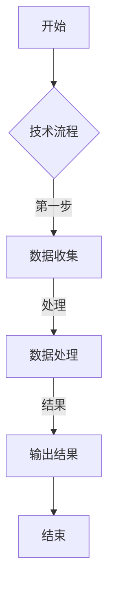

                 

# 技术演讲：提升个人市场价值

> **关键词：** 技术演讲、个人品牌、沟通表达、市场价值、职业发展

> **摘要：** 本文将深入探讨技术演讲在提升个人市场价值方面的作用。通过分析技术演讲的概念、重要性、准备、内容设计、呈现技巧和持续发展，本文旨在为技术专家和从业者提供一整套系统化的指导，帮助他们通过技术演讲实现个人职业发展的突破。

## 第一部分：技术演讲概述

### 第1章：技术演讲的概念与重要性

#### 1.1 技术演讲的定义与分类

技术演讲是指利用口头表达能力，向特定受众传达技术知识、观点和见解的演讲形式。技术演讲可以进一步细分为以下几类：

1. **演讲**：通常以演讲者为主，通过口头语言和演示工具（如PPT）向听众传达信息。
2. **报告**：通常用于学术或专业领域，详细报告某一研究项目或技术进展。
3. **研讨会**：包含演讲、讨论和互动环节，旨在深度交流技术观点和解决实际问题。

#### 1.2 技术演讲的目的与意义

技术演讲的目的与意义主要体现在以下几个方面：

1. **增强个人品牌影响力**：通过技术演讲，展示个人在技术领域的专业能力和见解，提升个人品牌知名度。
2. **提高沟通表达能力**：技术演讲是一种重要的沟通形式，通过准备和演讲过程，提升个人的沟通表达能力。
3. **扩大人脉与职业机会**：技术演讲有助于结识同行业专家和潜在合作伙伴，拓宽职业发展渠道。

#### 1.3 技术演讲的受众分析

技术演讲的受众可以分为以下几类：

1. **技术专家**：对某一技术领域有深入研究的专家，希望通过演讲交流最新研究成果。
2. **投资者**：对新技术和新兴企业感兴趣的投资者，通过技术演讲了解技术发展趋势和市场机会。
3. **行业从业者**：在技术公司或相关企业工作的从业者，希望通过技术演讲提升自身技术水平和职业素养。

#### 1.4 技术演讲的趋势与挑战

随着技术的快速迭代，技术演讲面临以下趋势和挑战：

1. **新技术的快速迭代**：技术演讲的内容需要紧跟技术发展趋势，及时更新。
2. **更高的专业知识储备**：技术演讲者需要不断提升自己的专业知识，以应对复杂的技术问题。
3. **市场竞争加剧**：技术演讲者需要不断提升演讲质量，以在竞争中脱颖而出。

### 第2章：技术演讲主题确定与目标设定

#### 2.1 确定技术演讲主题

确定技术演讲主题需要考虑以下几个方面：

1. **技术热点**：选择当前热门的技术话题，如人工智能、区块链、5G等。
2. **个人专业领域**：围绕个人专业领域进行演讲，展示个人在某一领域的深入研究和实践。
3. **受众需求**：了解受众的需求，选择他们感兴趣的话题，提高演讲的吸引力。

#### 2.2 设定演讲目标

设定技术演讲目标需要明确以下几个方面：

1. **提升听众技术认知**：通过演讲，使听众对某一技术有更深入的理解和认识。
2. **解决具体技术问题**：针对听众面临的具体技术问题，提供解决方案和最佳实践。
3. **吸引潜在合作伙伴**：通过演讲，展示个人和专业能力，吸引潜在合作伙伴和投资机会。

#### 2.3 收集与研究资料

在确定演讲主题和目标后，需要收集和研究以下资料：

1. **研究最新技术动态**：关注行业技术发展趋势和最新研究成果，确保演讲内容的前沿性。
2. **分析同行业演讲案例**：研究同行业专家的演讲案例，了解他们的演讲风格和内容结构，借鉴经验。
3. **梳理演讲框架**：根据主题和目标，构建演讲大纲和逻辑结构，确保演讲内容的条理性和连贯性。

## 第二部分：技术演讲的准备

### 第3章：技术演讲大纲与逻辑结构

#### 3.1 设计演讲大纲

设计演讲大纲是技术演讲准备的重要环节，它决定了演讲的内容结构和听众的接受程度。设计演讲大纲可以遵循以下步骤：

1. **引言**：通过简短的介绍和提问，引起听众的兴趣，明确演讲主题和目的。
2. **主体**：深入讲解技术概念、原理和应用，使用实例和数据支撑观点，确保内容充实且易懂。
3. **结论**：总结演讲要点，提出展望和建议，强调演讲的核心价值和实际意义。

#### 3.2 构建逻辑结构

构建逻辑结构是确保演讲内容有条理和连贯性的关键。可以遵循以下步骤：

1. **问题引入**：通过提出问题，引导听众思考和关注演讲主题。
2. **原理讲解**：详细讲解技术原理和核心概念，使用图表和示例说明，使听众更容易理解。
3. **应用案例**：展示技术在实际应用中的效果和成果，强调技术的价值和意义。
4. **结论与展望**：总结演讲要点，提出未来发展趋势和应用前景，激发听众的思考和兴趣。

#### 3.3 核心概念与联系

为了使演讲内容更加直观和易懂，可以使用Mermaid流程图和架构图来展示技术流程和系统架构。以下是Mermaid流程图的示例：



通过这样的流程图，听众可以更清晰地理解技术流程的每一步操作。

### 第4章：技术演讲核心算法原理

#### 4.1 算法概述

算法是计算机解决问题的一系列步骤，是技术演讲的重要内容。以下是一个简单的算法概述：

- **算法的基本概念**：算法是一种解决问题的方法，由一系列有序的指令组成。
- **算法在不同场景的应用**：算法可以应用于各种领域，如排序、搜索、图形处理、机器学习等。

#### 4.2 算法原理讲解

为了更好地讲解算法原理，可以使用伪代码来详细阐述算法的每一步操作。以下是一个简单排序算法（冒泡排序）的伪代码示例：

```plaintext
BubbleSort(A)
  for i = 1 to n-1
    for j = 1 to n-i
      if A[j] > A[j+1]
        swap(A[j], A[j+1])
  end
```

在这个算法中，通过两次嵌套循环，比较相邻元素并交换位置，最终实现数组的排序。

#### 4.3 算法优化与改进

在讲解算法原理时，还可以分析现有算法的优缺点，并提出可能的优化方法。以下是一个关于冒泡排序算法的优化示例：

- **原始冒泡排序**：时间复杂度为O(n^2)，效率较低。
- **优化方法**：添加一个标志变量，记录上一次交换的位置，避免不必要的比较。

优化后的冒泡排序伪代码：

```plaintext
OptimizedBubbleSort(A)
  for i = 1 to n-1
    swapped = false
    for j = 1 to n-i
      if A[j] > A[j+1]
        swap(A[j], A[j+1])
        swapped = true
    if not swapped
      break
  end
```

通过这种优化，冒泡排序的时间复杂度降低到了O(n)，提高了算法的效率。

### 第5章：技术演讲中的数学模型

#### 5.1 数学模型概述

数学模型是技术演讲中的重要组成部分，用于描述和分析技术问题。以下是一些常见数学模型及其应用：

- **线性回归**：用于分析变量之间的关系，广泛应用于数据分析、预测和优化。
- **神经网络**：用于模拟人脑的神经网络结构，用于图像识别、自然语言处理等。
- **图论**：用于描述网络结构，广泛应用于网络优化、社会网络分析等。

#### 5.2 数学公式与详细讲解

在技术演讲中，数学公式是必不可少的一部分。以下是一个线性回归模型的数学公式及其详细讲解：

$$
y = \beta_0 + \beta_1x + \epsilon
$$

- **y**：因变量，表示预测结果。
- **x**：自变量，表示输入特征。
- **\beta_0**：截距，表示当x为0时的预测值。
- **\beta_1**：斜率，表示自变量x对因变量y的影响程度。
- **\epsilon**：误差项，表示预测误差。

通过这个公式，可以建立自变量x和因变量y之间的线性关系，并用于预测和数据分析。

#### 5.3 数学模型举例说明

为了更好地理解数学模型的应用，以下是一个线性回归模型的举例说明：

假设我们要预测房价，根据历史数据，建立线性回归模型：

$$
y = 1000 + 200x
$$

其中，y表示房价，x表示房屋面积。

- 当房屋面积为100平方米时，预测房价为：
  $$ y = 1000 + 200 \times 100 = 20000 $$ 元。

通过这个模型，可以预测不同面积房屋的房价，为购房者和投资者提供参考。

### 第6章：技术演讲中的项目实战

#### 6.1 项目背景介绍

项目实战是技术演讲中的重要环节，通过实际项目案例展示技术原理和应用。以下是一个项目背景介绍示例：

**项目名称**：智能交通管理系统

**项目目标**：通过大数据分析和人工智能技术，优化交通流量，减少拥堵，提高交通效率。

**项目团队**：由交通工程师、数据科学家、软件工程师等组成。

**技术栈**：使用Python、TensorFlow、Kafka等技术和工具进行项目开发。

#### 6.2 开发环境搭建

在项目实战中，开发环境的搭建是基础工作。以下是一个开发环境搭建的示例：

1. **Python环境配置**：安装Python 3.8版本，配置pip和virtualenv。
2. **依赖安装**：使用pip安装TensorFlow、NumPy、Pandas等依赖库。
3. **Kafka配置**：安装Kafka服务器，配置Producer和Consumer。

#### 6.3 源代码实现与解读

在项目实战中，源代码实现和解读是关键环节。以下是一个数据处理的源代码示例：

```python
import pandas as pd
from sklearn.model_selection import train_test_split

# 读取数据
data = pd.read_csv('traffic_data.csv')

# 数据预处理
data['speed'] = data['speed'].fillna(data['speed'].mean())
data['distance'] = data['distance'].fillna(data['distance'].mean())

# 划分训练集和测试集
X = data[['speed', 'distance']]
y = data['congestion']
X_train, X_test, y_train, y_test = train_test_split(X, y, test_size=0.2, random_state=42)

# 训练模型
model = tf.keras.Sequential([
  tf.keras.layers.Dense(64, activation='relu', input_shape=[2]),
  tf.keras.layers.Dense(64, activation='relu'),
  tf.keras.layers.Dense(1)
])

model.compile(optimizer='adam', loss='mse')
model.fit(X_train, y_train, epochs=10, batch_size=32, validation_split=0.1)

# 测试模型
loss = model.evaluate(X_test, y_test)
print('Test loss:', loss)
```

这段代码首先读取交通数据，进行数据预处理，然后划分训练集和测试集，使用TensorFlow训练模型，并评估模型性能。

#### 6.4 代码解读与分析

在代码解读和分析中，可以从以下几个方面进行：

1. **数据处理**：使用Pandas库读取和预处理数据，包括缺失值填充和特征工程。
2. **模型训练**：使用TensorFlow构建和训练模型，包括模型结构、优化器和损失函数的设置。
3. **性能评估**：评估模型在测试集上的性能，包括损失函数和精度等指标。

通过这样的代码解读和分析，可以帮助听众更好地理解项目实战的技术细节和应用。

### 第四部分：技术演讲的呈现与传播

#### 第7章：技术演讲的呈现技巧

#### 7.1 演讲技巧

技术演讲的成功不仅取决于内容的深度和广度，还取决于演讲者的呈现技巧。以下是一些演讲技巧：

1. **演讲结构**：确保演讲有清晰的引言、主体和结论，使听众能够跟随演讲思路。
2. **演讲语言**：使用简洁、明了的语言，避免使用过于专业和复杂的术语。
3. **非语言沟通**：通过肢体语言、面部表情和眼神交流，增强演讲的感染力。

#### 7.2 PPT制作与设计

PPT是技术演讲的重要辅助工具，以下是一些PPT制作和设计的原则：

1. **基本结构**：确保PPT有标题页、目录页、内容页和结论页，使演讲内容有序。
2. **设计原则**：使用简洁、清晰的设计风格，避免过多花哨的元素。
3. **数据可视化**：使用图表、图形和图片等元素，使数据更加直观和易懂。

#### 7.3 演讲中的互动与问答

演讲中的互动和问答是增加听众参与感和提升演讲效果的重要环节。以下是一些建议：

1. **提问环节的准备**：提前准备一些开放性和封闭性问题，引导听众思考和讨论。
2. **互动技巧**：通过提问、投票、讨论等方式，激发听众的参与热情。
3. **应对尴尬场面**：遇到听众质疑或困惑时，保持冷静，耐心解释，避免回避问题。

### 第8章：技术演讲的传播与推广

#### 8.1 演讲渠道选择

选择合适的演讲渠道是提高演讲影响力的重要一环。以下是一些常见的演讲渠道：

1. **线上平台**：如YouTube、Bilibili、抖音等，方便听众随时观看和分享。
2. **线下活动**：如技术会议、研讨会、讲座等，增加与听众的面对面交流机会。
3. **社交媒体**：如微博、知乎、微信公众号等，通过社交互动扩大演讲的传播范围。

#### 8.2 推广策略

以下是一些推广策略，帮助演讲者提高演讲的知名度和影响力：

1. **内容营销**：制作高质量的内容，吸引潜在听众的关注和参与。
2. **合作推广**：与相关机构、媒体和KOL合作，扩大演讲的传播渠道和受众范围。
3. **KOL/专家推荐**：邀请行业内的知名专家和意见领袖推荐演讲，提高演讲的权威性和可信度。

#### 8.3 数据分析与反馈

演讲结束后，进行数据分析和反馈是优化演讲的重要步骤。以下是一些数据分析与反馈的方法：

1. **演讲效果分析**：分析演讲的观看次数、点赞数、评论数等指标，了解演讲的受欢迎程度。
2. **受众反馈收集**：通过问卷调查、访谈等方式，收集听众的反馈意见，了解演讲的优缺点。
3. **演讲改进策略**：根据反馈意见，优化演讲内容、结构和呈现技巧，提高演讲质量。

### 第五部分：技术演讲的持续发展

#### 第9章：技术演讲的持续学习与成长

技术演讲是一个持续学习与成长的过程。以下是一些建议，帮助演讲者不断提升自己的能力和影响力：

1. **技术更新与学习**：关注行业技术动态，学习新技术和工具，确保演讲内容的前沿性。
2. **个人品牌建设**：通过社交媒体、博客、演讲等方式，输出高质量的内容，提升个人品牌知名度。
3. **知识分享与互动**：参加技术会议、研讨会等活动，与其他专家和从业者交流，分享知识和经验。

#### 9.1 技术更新与学习

技术更新是技术演讲的重要组成部分。以下是一些建议，帮助演讲者保持技术的前沿性：

1. **关注行业动态**：定期阅读技术博客、研究报告和学术论文，了解行业最新趋势和技术动态。
2. **参加技术会议**：参加技术会议和研讨会，与行业专家交流，学习最新的研究成果和实践经验。
3. **学习新技术**：学习新技术和工具，如人工智能、大数据、区块链等，提升自己的技术能力和知识储备。

#### 9.2 个人品牌建设

个人品牌建设是技术演讲者持续发展的重要一环。以下是一些建议，帮助演讲者提升个人品牌影响力：

1. **社交媒体运营**：利用微博、知乎、微信公众号等社交媒体平台，定期发布技术文章、分享经验和心得，提升个人知名度。
2. **博客撰写**：撰写技术博客，分享自己的研究成果和思考，建立自己在技术领域的权威性。
3. **知识分享与互动**：参加技术论坛和社区，积极参与讨论和分享，与其他技术爱好者互动，扩大人脉网络。

#### 9.3 职业发展建议

职业发展是技术演讲者的重要目标。以下是一些建议，帮助演讲者实现职业发展的突破：

1. **提升技术与管理能力**：在技术领域不断深耕，同时学习管理知识和技能，提升自己的领导力。
2. **职业规划与转型**：根据个人兴趣和市场需求，规划职业发展路径，适时进行职业转型。
3. **拓展职业网络**：参加各种技术活动，结识行业内的专业人士，建立广泛的职业网络，为职业发展创造更多机会。

### 附录

#### 附录 A：技术演讲相关资源与工具

以下是一些技术演讲相关的资源与工具，供演讲者参考：

1. **技术论坛与社区**：如CSDN、知乎、Stack Overflow等，提供技术讨论和交流的平台。
2. **演讲培训与教程**：如TEDx、TED演讲培训课程等，提供演讲技巧和经验的分享。
3. **实用工具与插件**：如Keynote、PowerPoint等演示软件，提供丰富的设计和动画效果。

#### 附录 B：技术演讲常见问题与解答

以下是一些技术演讲中常见的问题及解答，帮助演讲者解决困惑：

1. **如何确定演讲主题？**：关注行业热点、个人专业领域和受众需求，选择具有吸引力和实用价值的话题。
2. **如何准备演讲内容？**：收集研究资料、确定演讲大纲、构建逻辑结构、编写演讲稿，并进行多次演练和修改。
3. **如何应对演讲中的突发情况？**：保持冷静，及时调整演讲内容，运用演讲技巧和互动环节，化解尴尬场面。

#### 附录 C：技术演讲范例与分析

以下是一些知名技术演讲案例及其成功要素分析，供演讲者借鉴：

1. **比尔·盖茨的TED演讲**：通过生动的实例和数据，深入浅出地讲解人工智能的发展趋势和影响，引发全球关注。
2. **雷德·霍夫曼的TED演讲**：结合自己的创业经历，分享创业心得和投资理念，激发观众的创业热情。

同时，以下是一些技术演讲的失败案例及教训，供演讲者避免：

1. **某技术大会演讲**：由于演讲内容过于专业，听众难以理解，导致演讲效果不佳。
2. **某科技企业CEO演讲**：由于演讲者过于自信和自负，忽视听众需求，导致演讲被质疑。

通过这些案例分析，演讲者可以更好地理解技术演讲的成功要素和常见问题，提高自己的演讲水平。

## 作者信息

**作者：AI天才研究院/AI Genius Institute & 禅与计算机程序设计艺术 /Zen And The Art of Computer Programming**

