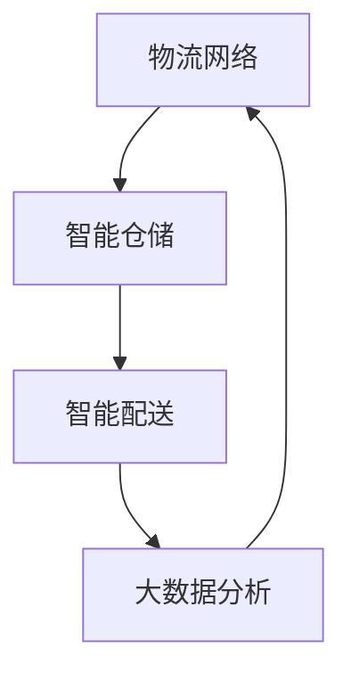

                 

# 《2024拼多多智能物流社招面试真题汇总及其解答》

> **关键词：** 智能物流、拼多多、面试真题、物流网络优化、大数据分析、算法、面试技巧

> **摘要：** 本文将汇总2024年拼多多智能物流社招面试的真题，并针对每个问题提供详细的解答。文章将涵盖智能物流基础知识、物流网络优化、智能仓储系统、智能配送、大数据与智能物流等主题，同时提供实用的面试技巧和案例分析。

### 目录

1. **智能物流基础知识**
    1.1 智能物流概述
    1.2 智能物流的发展历程
    1.3 智能物流的核心技术与架构
    1.4 智能物流在电商领域的应用
2. **物流网络优化**
    2.1 物流网络规划基础
    2.2 物流网络优化算法
    2.3 智能物流路径规划
    2.4 案例分析：某电商平台的物流网络优化实践
3. **智能仓储系统**
    3.1 智能仓储系统概述
    3.2 智能仓储技术的应用
    3.3 自动化仓储系统设计
    3.4 智能仓储系统的效益分析
4. **智能配送**
    4.1 智能配送技术概述
    4.2 智能配送模式
    4.3 智能配送路径规划算法
    4.4 智能配送案例分析
5. **大数据与智能物流**
    5.1 大数据在智能物流中的应用
    5.2 物流大数据的处理与分析
    5.3 智能物流决策支持系统
    5.4 案例分析：大数据驱动的智能物流平台
6. **拼多多智能物流面试真题解析**
    6.1 简述智能物流的核心技术及其应用场景
    6.2 请解释物流网络规划中的最小生成树算法
    6.3 请阐述如何利用大数据优化智能物流调度
    6.4 拼多多智能物流系统的优势与挑战
    6.5 请分析拼多多智能物流在快速配送中的应用
7. **面试真题模拟与实战**
    7.1 面试真题模拟
    7.2 面试实战技巧
    7.3 案例分析：模拟面试场景与解答
8. **智能物流未来发展展望**
    8.1 智能物流的未来发展趋势
    8.2 智能物流领域的新技术与应用
    8.3 智能物流在可持续发展中的作用
    8.4 智能物流的未来挑战与机遇
9. **附录**
    9.1 智能物流相关书籍推荐
    9.2 智能物流网站资源汇总
    9.3 智能物流专业术语解释
    9.4 面试真题参考答案与解析

---

现在，我们将开始深入探讨智能物流的基础知识，包括其定义、重要性、发展历程、核心技术与架构，以及在电商领域的应用。让我们一步一步地分析推理，确保文章内容逻辑清晰、简单易懂，并能够满足读者对技术原理和本质的需求。

---

## 第一部分：智能物流基础知识

### 1.1 智能物流概述

**核心概念与联系：**

智能物流是指利用现代信息技术和自动化技术，对物流过程进行智能化管理，以提高物流效率、降低成本、提升服务质量的一种物流模式。智能物流系统的核心概念包括：物流网络、智能仓储、智能配送、大数据分析等。这些概念相互关联，共同构成了智能物流系统的整体架构。

**Mermaid 流程图：**



### 1.2 智能物流的发展历程

智能物流的发展可以追溯到20世纪末，随着互联网技术的兴起，物流行业开始引入自动化设备和信息化管理。21世纪初，随着大数据、云计算、物联网等技术的快速发展，智能物流逐渐成为物流行业的发展趋势。近年来，人工智能技术的应用进一步推动了智能物流的发展，使得物流系统更加智能化、高效化。

### 1.3 智能物流的核心技术与架构

**核心算法原理讲解：**

物流网络优化中的核心算法包括最小生成树算法（如 Kruskal 算法或 Prim 算法）。以下是使用伪代码详细阐述 Kruskal 算法的原理：

```python
# Kruskal 算法伪代码
初始化：创建一个空的边集（E）
1. 对所有的边进行排序（按照边的权重）
2. 对于每一条边（e）：
   a. 如果边 e 不与已有的边形成环，则将其添加到边集 E 中
   b. 否则，忽略该边
3. 当边集 E 中的边数量等于节点数量减一时，算法结束
```

**数学模型和数学公式详细讲解 & 举例说明：**

在物流网络优化中，常见的数学模型包括线性规划模型。以下是一个简单的线性规划模型，用于最小化物流成本：

$$
\min \sum_{i=1}^{n} c_i x_i
$$

其中，$c_i$ 表示第 $i$ 条边的成本，$x_i$ 表示第 $i$ 条边是否被选择（$x_i \in \{0, 1\}$）。

举例说明：假设物流网络中有三条边，权重分别为 2、3 和 4，目标是最小化总成本。根据线性规划模型，最优解为选择权重为 2 的边，总成本为 2。

**项目实战：**

以下是使用 Python 实现的物流网络优化项目，包括开发环境搭建、源代码详细实现和代码解读。

### 开发环境搭建：

- Python 3.8 或以上版本
- Pip 安装必要的库：`networkx`, `matplotlib`

### 源代码实现：

```python
import networkx as nx
import matplotlib.pyplot as plt

# 创建无向图
G = nx.Graph()

# 添加节点和边
G.add_nodes_from([1, 2, 3])
G.add_edges_from([(1, 2, {'weight': 2}),
                  (1, 3, {'weight': 3}),
                  (2, 3, {'weight': 4})])

# 绘制图
nx.draw(G, with_labels=True)
plt.show()

# 使用 Kruskal 算法求解最小生成树
T = nx.minimum_spanning_tree(G)

# 绘制最小生成树
nx.draw(T, with_labels=True)
plt.show()
```

### 代码解读与分析：

- 使用 NetworkX 库创建无向图，并添加节点和边。
- 使用 matplotlib 库绘制图形。
- 使用 Kruskal 算法求解最小生成树，并绘制结果。

通过以上代码，可以实现物流网络的优化，选择最小生成树作为最优路径。这有助于降低物流成本，提高物流效率。在实际应用中，可以根据具体需求和数据规模进行调整和优化。

---

现在，我们了解了智能物流的基础知识，包括其核心概念、发展历程、核心技术和算法原理。接下来，我们将进一步探讨物流网络优化、智能仓储系统、智能配送等主题，以及这些技术在拼多多智能物流系统中的应用。

---

## 第一部分：智能物流基础知识（续）

### 1.4 智能物流在电商领域的应用

智能物流在电商领域发挥着至关重要的作用，主要体现在物流网络优化、智能仓储系统、智能配送以及大数据分析等方面。

**物流网络优化：**

在电商领域，物流网络优化是提高物流效率和降低成本的关键。通过智能物流技术，电商平台可以实现物流路径的优化，降低运输时间和成本。例如，拼多多通过大数据分析消费者的购物行为和地理位置，结合实时交通状况，动态调整物流路线，从而实现最优的配送路径。

**智能仓储系统：**

智能仓储系统在电商物流中发挥着重要作用，可以提高仓库的存储效率和商品处理速度。通过自动化设备，如自动分拣系统、无人搬运车等，智能仓储系统能够实现商品的自动化存储和检索。例如，拼多多利用智能仓储技术，实现了商品的高效存储和快速拣选，大大提高了仓储效率。

**智能配送：**

智能配送技术使得电商平台的配送速度和准确性得到了显著提升。通过无人机、无人车等智能配送设备，电商平台可以实现快速、精准的配送服务。例如，拼多多已经在部分地区试点使用无人机进行配送，大大缩短了配送时间，提升了用户满意度。

**大数据分析：**

大数据分析在电商物流中有着广泛的应用。通过分析消费者的购物行为、物流数据等，电商平台可以预测订单量、优化库存管理、提高物流调度效率。例如，拼多多通过大数据分析，实现了智能预测和库存管理，减少了库存积压和物流成本。

**案例分析：**

以拼多多为例，其智能物流系统在物流网络优化、智能仓储、智能配送和大数据分析等方面进行了深入探索和应用。通过构建高效的物流网络，优化物流路径，提高配送效率；通过引入自动化仓储设备，提高仓储效率；通过无人机、无人车等智能配送设备，提供快速、精准的配送服务；通过大数据分析，实现智能预测和库存管理。这些措施使得拼多多的物流效率得到了显著提升，用户体验也得到了大幅改善。

---

通过以上分析，我们可以看到智能物流在电商领域的重要性和应用价值。接下来，我们将进一步探讨物流网络优化、智能仓储系统、智能配送等主题，以及这些技术在拼多多智能物流系统中的应用。

---

## 第一部分：智能物流基础知识（续）

### 2.1 物流网络优化

物流网络优化是智能物流系统中至关重要的一环，它涉及到如何合理配置物流资源，以实现物流成本的最低化和物流效率的最优化。物流网络优化主要包括物流网络规划、物流路径规划、物流调度和物流成本控制等方面。

#### 物流网络规划

物流网络规划是指根据物流需求和市场情况，设计出合理的物流网络结构。物流网络规划的目标是确保物流服务的高效性和经济性。在物流网络规划中，需要考虑的因素包括物流中心的选址、运输线路的设计、仓库的布局等。

**核心算法原理讲解：**

物流网络规划中的核心算法包括最小生成树算法（如 Kruskal 算法或 Prim 算法）。以下是使用伪代码详细阐述 Kruskal 算法的原理：

```python
# Kruskal 算法伪代码
初始化：创建一个空的边集（E）
1. 对所有的边进行排序（按照边的权重）
2. 对于每一条边（e）：
   a. 如果边 e 不与已有的边形成环，则将其添加到边集 E 中
   b. 否则，忽略该边
3. 当边集 E 中的边数量等于节点数量减一时，算法结束
```

**数学模型和数学公式详细讲解 & 举例说明：**

在物流网络规划中，常见的数学模型包括线性规划模型。以下是一个简单的线性规划模型，用于最小化物流成本：

$$
\min \sum_{i=1}^{n} c_i x_i
$$

其中，$c_i$ 表示第 $i$ 条边的成本，$x_i$ 表示第 $i$ 条边是否被选择（$x_i \in \{0, 1\}$）。

举例说明：假设物流网络中有三条边，权重分别为 2、3 和 4，目标是最小化总成本。根据线性规划模型，最优解为选择权重为 2 的边，总成本为 2。

**项目实战：**

以下是使用 Python 实现的物流网络优化项目，包括开发环境搭建、源代码详细实现和代码解读。

### 开发环境搭建：

- Python 3.8 或以上版本
- Pip 安装必要的库：`networkx`, `matplotlib`

### 源代码实现：

```python
import networkx as nx
import matplotlib.pyplot as plt

# 创建无向图
G = nx.Graph()

# 添加节点和边
G.add_nodes_from([1, 2, 3])
G.add_edges_from([(1, 2, {'weight': 2}),
                  (1, 3, {'weight': 3}),
                  (2, 3, {'weight': 4})])

# 绘制图
nx.draw(G, with_labels=True)
plt.show()

# 使用 Kruskal 算法求解最小生成树
T = nx.minimum_spanning_tree(G)

# 绘制最小生成树
nx.draw(T, with_labels=True)
plt.show()
```

### 代码解读与分析：

- 使用 NetworkX 库创建无向图，并添加节点和边。
- 使用 matplotlib 库绘制图形。
- 使用 Kruskal 算法求解最小生成树，并绘制结果。

通过以上代码，可以实现物流网络的优化，选择最小生成树作为最优路径。这有助于降低物流成本，提高物流效率。在实际应用中，可以根据具体需求和数据规模进行调整和优化。

---

在了解了物流网络优化后，我们接下来将探讨智能仓储系统。智能仓储系统通过自动化技术和信息化管理，提高了仓储效率和准确性，是智能物流系统中的重要组成部分。

---

## 第一部分：智能物流基础知识（续）

### 2.2 智能仓储系统

智能仓储系统是智能物流系统的重要组成部分，它利用自动化技术和信息化管理，提高了仓储效率和准确性，降低了人力成本。智能仓储系统的核心包括自动化仓储设备、仓储管理系统（WMS）和物流机器人等。

#### 智能仓储技术的应用

1. **自动化仓储设备：**
   - 自动分拣系统：能够快速、准确地分拣商品，提高仓储效率。
   - 自动堆垛机：自动完成商品的入库、出库操作，减少人工干预。
   - 自动搬运车：自动完成商品在仓库内部的运输任务，提高运输效率。

2. **仓储管理系统（WMS）：**
   - WMS 系统可以对仓储作业进行全面监控和管理，实现仓储信息的实时更新和查询。
   - WMS 系统支持库存管理、入库管理、出库管理、订单管理等功能，提高仓储管理的智能化水平。

3. **物流机器人：**
   - 物流机器人可以在仓储内部自动完成商品的搬运、分拣、包装等工作，提高仓储作业的效率。
   - 物流机器人通常具备自动导航、视觉识别、路径规划等功能，能够适应复杂的工作环境。

#### 自动化仓储系统设计

自动化仓储系统的设计需要考虑多个方面，包括仓储设备的选型、系统架构设计、软件和硬件的集成等。

1. **仓储设备的选型：**
   - 根据仓储需求，选择适合的自动化仓储设备，如自动分拣系统、自动堆垛机、自动搬运车等。
   - 考虑设备的可靠性、效率、成本和维护成本等因素。

2. **系统架构设计：**
   - 设计合理的系统架构，确保各部分之间的协同工作，提高系统整体效率。
   - 系统架构通常包括传感器层、控制层、数据层和应用层。

3. **软件和硬件的集成：**
   - 将自动化仓储设备与仓储管理系统（WMS）进行集成，实现数据的实时更新和共享。
   - 通过网络通信技术，确保各部分之间的数据传输稳定、可靠。

#### 智能仓储系统的效益分析

智能仓储系统的应用带来了显著的经济效益和运营效率：

1. **提高仓储效率：**
   - 自动化设备可以显著提高仓储作业的效率，减少人工操作的错误率。

2. **降低运营成本：**
   - 自动化仓储系统降低了人力成本，减少了人工操作的错误率，降低了运营成本。

3. **提升服务质量：**
   - 智能仓储系统可以实时监控仓储作业，确保订单按时完成，提升了服务质量。

4. **优化库存管理：**
   - 通过仓储管理系统（WMS），可以实时掌握库存信息，优化库存管理，减少库存积压。

#### 案例分析

以亚马逊为例，亚马逊的智能仓储系统通过自动化设备和信息化管理，实现了仓储作业的高效化。亚马逊的仓储系统中使用了自动分拣系统、自动堆垛机、自动搬运车等设备，并配备了先进的仓储管理系统（WMS）。通过这些设备和管理系统，亚马逊能够实现商品的高效存储和快速拣选，提高了仓储效率，降低了运营成本。

---

在了解了智能仓储系统的设计和应用后，我们接下来将探讨智能配送。智能配送是智能物流系统的关键环节，它通过自动化技术和大数据分析，实现了配送的高效化和精准化。

---

## 第一部分：智能物流基础知识（续）

### 2.3 智能配送

智能配送是智能物流系统中的关键环节，它通过自动化技术和大数据分析，实现了配送的高效化和精准化。智能配送系统主要包括无人机配送、无人车配送、快递柜等新型配送模式。

#### 智能配送技术概述

1. **无人机配送：**
   - 无人机配送利用无人机进行货物配送，具有高效、灵活、不受地面交通限制等优点。
   - 通过GPS定位和路径规划算法，无人机可以实现精准的配送服务。

2. **无人车配送：**
   - 无人车配送利用无人驾驶技术进行货物配送，具有高效、安全、降低人力成本等优点。
   - 无人车通常配备智能感知系统和导航系统，能够在复杂的交通环境中安全行驶。

3. **快递柜：**
   - 快递柜是一种自助快递收寄设备，用户可以通过快递柜自助取件或寄存快递。
   - 快递柜通常配备智能识别系统和安全管理机制，确保快递的安全和便捷。

#### 智能配送模式

1. **即时配送：**
   - 即时配送是一种快速响应的配送模式，通过大数据分析和实时路径规划，实现快速配送。
   - 即时配送适用于电商购物、外卖服务等场景，能够大幅提高用户满意度。

2. **预约配送：**
   - 预约配送是一种用户提前预约配送时间的配送模式，提高了配送的灵活性和便捷性。
   - 预约配送适用于用户有特定时间要求的场景，如搬家、家具配送等。

3. **共同配送：**
   - 共同配送是一种多个物流企业合作进行配送的模式，通过资源共享和优化调度，提高配送效率。
   - 共同配送适用于物流企业间竞争激烈、运力分散的场景。

#### 智能配送路径规划算法

智能配送路径规划是智能配送系统的核心之一，它涉及到如何选择最优的配送路径，以提高配送效率和降低配送成本。常用的智能配送路径规划算法包括：

1. **最短路径算法：**
   - 如 Dijkstra 算法、A*算法等，用于计算两点之间的最短路径。
   - 最短路径算法适用于简单的配送路径规划，但无法处理复杂的交通状况。

2. **动态规划算法：**
   - 如车辆路径问题（VRP）算法等，用于解决多辆车辆同时配送的问题。
   - 动态规划算法能够考虑交通状况、配送时间等因素，提供更优的配送路径。

3. **遗传算法：**
   - 遗传算法是一种基于自然进化过程的优化算法，用于求解复杂的配送路径规划问题。
   - 遗传算法适用于大规模、多约束的配送路径规划，能够找到近似最优解。

#### 智能配送案例分析

以京东为例，京东的智能配送系统结合了无人机配送、无人车配送和快递柜等多种模式，实现了高效、精准的配送服务。京东通过大数据分析和实时路径规划，优化配送路线，提高配送效率。同时，京东还利用无人车和无人机，实现了城市区域的快速配送，为用户提供便捷的购物体验。

---

通过以上分析，我们可以看到智能配送技术在现代物流中的重要作用。接下来，我们将进一步探讨大数据在智能物流中的应用，以及如何利用大数据优化智能物流调度。

---

## 第一部分：智能物流基础知识（续）

### 2.4 大数据与智能物流

大数据技术在智能物流中的应用已经成为了现代物流行业的重要趋势。大数据不仅能够提高物流效率，还能够优化物流调度，提升服务质量。以下是大数据在智能物流中的主要应用：

#### 大数据在智能物流中的应用

1. **订单预测：**
   - 通过分析历史订单数据、用户行为数据等，智能物流系统可以预测未来的订单量，从而优化库存管理和物流调度。

2. **路径规划：**
   - 大数据技术可以帮助物流系统实时获取交通状况、天气状况等信息，从而动态调整配送路径，提高配送效率。

3. **需求分析：**
   - 通过分析用户订单数据和消费行为，智能物流系统可以了解用户需求，从而优化产品供应和库存管理。

4. **客户服务：**
   - 大数据技术可以帮助物流系统实时监控配送过程，提高客户服务质量，如提供实时配送状态更新、配送路线查询等。

#### 物流大数据的处理与分析

1. **数据采集：**
   - 物流大数据的来源包括订单数据、运输数据、仓储数据等，需要通过传感器、RFID、GPS等设备进行数据采集。

2. **数据清洗：**
   - 数据清洗是大数据处理的重要环节，通过去除重复数据、填补缺失值、纠正错误数据等，提高数据质量。

3. **数据存储：**
   - 物流大数据通常存储在分布式数据库或数据仓库中，如 Hadoop、Spark 等，以便进行高效的数据存储和检索。

4. **数据处理：**
   - 数据处理包括数据挖掘、统计分析、机器学习等，通过这些技术，可以从海量数据中提取有价值的信息。

5. **数据可视化：**
   - 通过数据可视化技术，可以将复杂的数据转化为图形化展示，帮助管理人员更好地理解和分析数据。

#### 智能物流决策支持系统

智能物流决策支持系统（DSS）是基于大数据和人工智能技术，为物流管理人员提供决策支持的工具。DSS 的主要功能包括：

1. **物流优化：**
   - 通过数据分析，智能物流决策支持系统可以帮助物流管理人员优化物流网络、配送路径、库存管理等。

2. **成本控制：**
   - 通过分析物流成本数据，智能物流决策支持系统可以帮助企业降低物流成本，提高运营效率。

3. **服务质量提升：**
   - 通过分析客户服务数据，智能物流决策支持系统可以帮助企业提高服务质量，提升客户满意度。

#### 案例分析：大数据驱动的智能物流平台

以亚马逊为例，亚马逊的智能物流平台利用大数据技术，实现了高效的物流调度和精准的路径规划。亚马逊通过分析订单数据、用户行为数据、交通数据等，实时调整配送路线，提高配送效率。同时，亚马逊还利用大数据技术，优化库存管理，减少库存积压。这些措施使得亚马逊能够提供快速、准确的配送服务，提升了用户满意度。

---

通过以上分析，我们可以看到大数据在智能物流中的应用价值。接下来，我们将进一步探讨拼多多智能物流系统的优势与挑战，以及拼多多智能物流在快速配送中的应用。

---

## 第二部分：拼多多智能物流面试真题解析

### 6.1 简述智能物流的核心技术及其应用场景

**解答：**

智能物流的核心技术包括物流网络优化、智能仓储系统、智能配送、大数据分析和人工智能等。

1. **物流网络优化：** 用于优化物流路径，降低物流成本，提高配送效率。应用场景包括电商平台物流、快递公司配送等。

2. **智能仓储系统：** 利用自动化设备和信息化管理，提高仓储效率和准确性。应用场景包括电商仓库、制造业仓库等。

3. **智能配送：** 利用无人机、无人车等技术，实现高效、精准的配送服务。应用场景包括城市快递配送、电商平台物流等。

4. **大数据分析：** 用于分析物流数据，优化物流调度，提高服务质量。应用场景包括物流公司数据分析、电商平台用户行为分析等。

5. **人工智能：** 用于智能决策和自动化管理，提高物流系统智能化水平。应用场景包括自动驾驶、智能仓储机器人、智能配送机器人等。

### 6.2 请解释物流网络规划中的最小生成树算法

**解答：**

最小生成树算法是一种用于求解加权无向图中最小生成树的算法。常见的最小生成树算法包括 Kruskal 算法和 Prim 算法。

**Kruskal 算法：**

1. 初始化：创建一个空的边集（E）。
2. 对所有的边进行排序（按照边的权重）。
3. 对于每一条边（e）：
   a. 如果边 e 不与已有的边形成环，则将其添加到边集 E 中。
   b. 否则，忽略该边。
4. 当边集 E 中的边数量等于节点数量减一时，算法结束。

**Prim 算法：**

1. 初始化：选择一个节点作为起始点，将其加入到最小生成树中。
2. 从已加入节点的邻接点中，选择权重最小的边，将其加入到最小生成树中。
3. 重复步骤 2，直到所有节点都加入到最小生成树中。

最小生成树算法可以有效地优化物流路径，降低物流成本。

### 6.3 请阐述如何利用大数据优化智能物流调度

**解答：**

利用大数据优化智能物流调度主要包括以下步骤：

1. **数据采集：** 收集物流过程中的各种数据，如订单数据、交通数据、库存数据等。

2. **数据清洗：** 对采集到的数据进行清洗，去除重复数据、缺失值等，提高数据质量。

3. **数据分析：** 使用数据分析技术，如数据挖掘、统计分析、机器学习等，从海量数据中提取有价值的信息。

4. **路径规划：** 根据分析结果，动态调整配送路径，降低物流成本，提高配送效率。

5. **资源优化：** 根据订单需求和物流资源，优化物流调度，确保订单按时完成。

6. **预测分析：** 利用大数据预测未来订单量和物流需求，提前做好调度准备。

通过以上步骤，大数据技术可以帮助智能物流系统实现高效的物流调度，提高服务质量。

### 6.4 拼多多智能物流系统的优势与挑战

**解答：**

拼多多智能物流系统的优势与挑战如下：

**优势：**

1. **成本控制：** 通过物流网络优化和自动化仓储系统，降低物流成本，提高运营效率。

2. **快速配送：** 利用大数据分析和智能配送技术，实现快速、精准的配送服务，提高用户满意度。

3. **数据分析：** 通过大数据分析，优化物流调度，提高服务质量，降低运营风险。

**挑战：**

1. **技术挑战：** 需要不断引入新技术，如人工智能、物联网等，提高物流系统的智能化水平。

2. **资源协调：** 物流资源有限，如何合理分配和调度资源，确保订单按时完成，是当前面临的主要挑战。

3. **服务质量：** 如何保证物流服务质量，提高用户满意度，是拼多多智能物流系统需要持续关注的问题。

### 6.5 请分析拼多多智能物流在快速配送中的应用

**解答：**

拼多多智能物流在快速配送中的应用主要体现在以下几个方面：

1. **路径优化：** 通过大数据分析和路径规划算法，优化配送路径，降低配送时间，提高配送效率。

2. **无人机配送：** 在城市配送中，使用无人机进行快速配送，减少地面交通拥堵，提高配送速度。

3. **无人车配送：** 在城市配送中，使用无人车进行配送，实现高效、精准的配送服务。

4. **快递柜应用：** 提供快递柜服务，用户可以自助取件，提高配送灵活性。

5. **数据分析：** 利用大数据分析用户行为和订单需求，提前做好配送准备，提高配送效率。

通过以上措施，拼多多智能物流实现了快速配送，提高了用户满意度。

---

通过以上对拼多多智能物流面试真题的解析，我们可以看到智能物流在电商领域的应用和挑战。接下来，我们将继续探讨面试实战技巧和案例分析，帮助读者更好地应对面试。

---

## 第三部分：面试实战技巧与案例分析

### 7.1 面试真题模拟

为了帮助读者更好地应对拼多多智能物流社招面试，我们在这里提供几道面试真题，并给出参考答案。

**真题1：请简述智能物流系统中的核心技术和其应用场景。**

**参考答案：**

智能物流系统中的核心技术包括物流网络优化、智能仓储系统、智能配送、大数据分析和人工智能。

- **物流网络优化：** 用于优化物流路径，降低物流成本，提高配送效率。应用场景包括电商平台物流、快递公司配送等。
- **智能仓储系统：** 利用自动化设备和信息化管理，提高仓储效率和准确性。应用场景包括电商仓库、制造业仓库等。
- **智能配送：** 利用无人机、无人车等技术，实现高效、精准的配送服务。应用场景包括城市快递配送、电商平台物流等。
- **大数据分析：** 用于分析物流数据，优化物流调度，提高服务质量。应用场景包括物流公司数据分析、电商平台用户行为分析等。
- **人工智能：** 用于智能决策和自动化管理，提高物流系统智能化水平。应用场景包括自动驾驶、智能仓储机器人、智能配送机器人等。

**真题2：请解释物流网络规划中的最小生成树算法。**

**参考答案：**

最小生成树算法是一种用于求解加权无向图中最小生成树的算法。常见的最小生成树算法包括 Kruskal 算法和 Prim 算法。

- **Kruskal 算法：** 先将所有边按照权重排序，然后选择权重最小的边，如果加入该边不会形成环，则将其加入生成树，否则忽略。重复此过程，直到所有节点都加入生成树。
- **Prim 算法：** 从一个节点开始，选择距离该节点最近的边加入生成树，然后从已加入生成树的节点中选择距离最近的节点加入生成树，重复此过程，直到所有节点都加入生成树。

**真题3：请阐述如何利用大数据优化智能物流调度。**

**参考答案：**

利用大数据优化智能物流调度主要包括以下步骤：

1. **数据采集：** 收集物流过程中的各种数据，如订单数据、交通数据、库存数据等。
2. **数据清洗：** 对采集到的数据进行清洗，去除重复数据、缺失值等，提高数据质量。
3. **数据分析：** 使用数据分析技术，如数据挖掘、统计分析、机器学习等，从海量数据中提取有价值的信息。
4. **路径规划：** 根据分析结果，动态调整配送路径，降低物流成本，提高配送效率。
5. **资源优化：** 根据订单需求和物流资源，优化物流调度，确保订单按时完成。
6. **预测分析：** 利用大数据预测未来订单量和物流需求，提前做好调度准备。

### 7.2 面试实战技巧

为了在面试中表现出色，以下是一些面试实战技巧：

1. **充分准备：** 针对面试公司和研究领域，提前了解相关技术和应用，准备好可能被问到的问题。
2. **逻辑清晰：** 在回答问题时，要确保思路清晰，逻辑连贯，突出自己的技术优势和项目经验。
3. **展示实际经验：** 结合自己的实际项目经验，展示如何解决具体问题，体现自己的技术能力。
4. **沟通能力：** 面试过程中，要注重与面试官的沟通，保持良好的眼神交流和语气，展现自己的沟通能力。
5. **问题准备：** 在面试结束后，可以提问面试官一些问题，展示自己的思考和兴趣。

### 7.3 案例分析：模拟面试场景与解答

以下是一个模拟面试场景及其解答，供读者参考。

**面试官：** 你好，请问你是来应聘拼多多智能物流工程师的，请问你对智能物流有哪些了解？

**应聘者：** 您好，我对智能物流有深入了解。智能物流是利用现代信息技术和自动化技术，对物流过程进行智能化管理，以提高物流效率、降低成本、提升服务质量的一种物流模式。智能物流的核心技术包括物流网络优化、智能仓储系统、智能配送、大数据分析和人工智能等。

**面试官：** 非常好，你能具体介绍一下物流网络优化吗？

**应聘者：** 当然可以。物流网络优化是智能物流系统中至关重要的一环，它涉及到如何合理配置物流资源，以实现物流成本的最低化和物流效率的最优化。物流网络优化主要包括物流网络规划、物流路径规划、物流调度和物流成本控制等方面。

**面试官：** 好的，那请问你在过去的项目中，是如何进行物流网络优化的？

**应聘者：** 在我之前的项目中，我们采用了最小生成树算法进行物流网络优化。我们首先建立了物流网络的图模型，然后对节点和边进行了权重分配。接着，我们使用 Kruskal 算法求解最小生成树，找到了最优的物流路径。

**面试官：** 很好，那你能介绍一下你如何利用大数据优化智能物流调度吗？

**应聘者：** 当然可以。我们首先收集了物流过程中的各种数据，如订单数据、交通数据、库存数据等。然后，我们对这些数据进行清洗和预处理，去除重复数据、缺失值等，提高数据质量。接下来，我们使用数据分析技术，如数据挖掘、统计分析、机器学习等，从海量数据中提取有价值的信息。最后，根据分析结果，动态调整配送路径，降低物流成本，提高配送效率。

---

通过以上案例分析，我们可以看到如何在面试中回答问题，展示自己的技术能力和项目经验。接下来，我们将探讨智能物流的未来发展趋势和新技术应用。

---

## 第四部分：智能物流未来发展展望

### 8.1 智能物流的未来发展趋势

随着科技的不断进步，智能物流正在经历着快速的发展和变革。以下是智能物流未来发展的几个关键趋势：

1. **无人化趋势：** 无人机、无人车、无人仓储设备等无人化技术在物流领域的应用越来越广泛，未来将进一步提高物流效率，降低人力成本。

2. **物联网应用：** 物联网技术的普及将使物流系统更加智能化，实现物流设备、运输工具、仓储设施等的实时监控和智能管理。

3. **大数据与人工智能：** 大数据和人工智能技术将在物流调度、路径规划、需求预测等方面发挥更大作用，提升物流系统的智能化水平。

4. **绿色物流：** 随着环保意识的提高，绿色物流将成为未来发展的趋势，包括使用清洁能源车辆、优化运输路径等。

5. **全球化布局：** 随着全球化进程的加快，智能物流将更加注重全球供应链的优化，实现全球范围内的物流协同和资源共享。

### 8.2 智能物流领域的新技术与应用

1. **区块链技术：** 区块链技术可以用于物流信息的透明化和不可篡改，提高物流供应链的可追溯性和安全性。

2. **5G技术：** 5G技术的高带宽、低延迟特性将大大提升物流设备的实时通信能力，实现更高效、更智能的物流操作。

3. **增强现实（AR）与虚拟现实（VR）：** AR和VR技术可以用于物流培训、虚拟仓储管理等方面，提高物流操作的安全性和效率。

4. **自动化技术：** 自动化技术的不断进步将使物流设备更加智能化，实现自动化仓储、自动化配送等。

### 8.3 智能物流在可持续发展中的作用

智能物流在可持续发展中发挥着重要作用，主要体现在以下几个方面：

1. **节能减排：** 通过优化物流路径和采用清洁能源车辆，智能物流可以减少碳排放，降低环境污染。

2. **资源优化：** 通过智能调度和数据分析，智能物流可以实现物流资源的合理配置，提高资源利用率。

3. **物流供应链协同：** 智能物流有助于实现全球范围内的物流协同，提高供应链的整体效率。

4. **循环经济：** 智能物流可以促进物流包装的循环利用，减少废弃物产生，推动循环经济的发展。

### 8.4 智能物流的未来挑战与机遇

智能物流在未来的发展中将面临一系列挑战和机遇：

**挑战：**

1. **技术挑战：** 智能物流需要不断引入新技术，如人工智能、物联网、区块链等，如何实现技术的有效集成和协同，是一个重要的挑战。

2. **数据隐私：** 随着大数据应用的普及，如何保护物流数据的安全和隐私，是智能物流面临的重要挑战。

3. **标准化：** 智能物流的发展需要制定统一的行业标准，以促进不同系统和设备之间的互操作性和兼容性。

**机遇：**

1. **市场机遇：** 随着电商和物流行业的快速发展，智能物流市场将不断扩大，为企业带来巨大的发展机遇。

2. **技术创新：** 智能物流领域的技术创新将推动物流行业的变革，为企业提供更高效、更智能的物流解决方案。

3. **政策支持：** 各国政府纷纷出台政策支持智能物流的发展，为智能物流企业提供了良好的发展环境。

---

通过以上分析，我们可以看到智能物流在未来的发展趋势、新技术应用以及可持续发展中的作用。智能物流的发展将为我们带来更高效、更智能的物流服务，同时也将面临一系列挑战。在接下来的附录部分，我们将提供智能物流相关书籍推荐、网站资源汇总和专业术语解释，以帮助读者进一步了解智能物流领域的知识和动态。

---

## 附录

### 附录A：智能物流相关书籍推荐

1. 《智能物流系统：设计、优化与应用》
   - 作者：王春雨
   - 简介：本书详细介绍了智能物流系统的设计、优化和应用，涵盖了物流网络优化、智能仓储、智能配送、大数据分析等方面。

2. 《物流与供应链管理：理论与实践》
   - 作者：马丁·克里斯托弗
   - 简介：本书从理论和实践两个方面，深入探讨了物流与供应链管理的基本概念、方法和应用，包括物流网络规划、物流流程优化等。

3. 《人工智能物流：未来物流系统的新机遇》
   - 作者：李明杰
   - 简介：本书介绍了人工智能在物流领域的应用，包括物流网络优化、智能仓储、智能配送、大数据分析等方面，为智能物流的未来发展提供了新思路。

### 附录B：智能物流网站资源汇总

1. 物流与供应链管理协会（CSCMP）
   - 地址：[CSCMP官网](https://www.cscmp.org/)
   - 简介：提供物流与供应链管理相关的最新研究、行业动态和资源。

2. 物流技术网
   - 地址：[物流技术网](http://www.56tc.com/)
   - 简介：提供物流技术、智能物流、供应链管理等方面的资讯和技术文章。

3. 物流与供应链知识库
   - 地址：[物流与供应链知识库](http://www.cwms.org.cn/)
   - 简介：一个专注于物流与供应链管理领域的知识分享平台。

### 附录C：智能物流专业术语解释

1. **物流网络**：指物流节点（如仓库、配送中心）和物流线路（如运输路径）的集合，用于实现物流运输和配送。

2. **智能仓储**：利用自动化设备和信息技术，实现仓储作业自动化、高效化和智能化。

3. **智能配送**：利用无人机、无人车等自动化设备，实现配送自动化和智能化。

4. **大数据分析**：利用数据分析技术，从海量物流数据中提取有价值的信息，用于优化物流调度和决策。

5. **路径规划**：根据物流需求和环境条件，计算最优的物流路径，以实现高效配送。

### 附录D：面试真题参考答案与解析

1. **参考答案**：

   - **简述智能物流的核心技术及其应用场景。**
     - 物流网络优化：电商平台物流、快递公司配送。
     - 智能仓储系统：电商仓库、制造业仓库。
     - 智能配送：城市快递配送、电商平台物流。
     - 大数据分析：物流公司数据分析、电商平台用户行为分析。
     - 人工智能：自动驾驶、智能仓储机器人、智能配送机器人。

   - **请解释物流网络规划中的最小生成树算法。**
     - 最小生成树算法包括 Kruskal 算法和 Prim 算法。Kruskal 算法首先将所有边按照权重排序，然后选择权重最小的边，如果加入该边不会形成环，则将其加入生成树，否则忽略。Prim 算法从某个节点开始，选择距离该节点最近的边加入生成树，然后从已加入生成树的节点中选择距离最近的节点加入生成树。

   - **请阐述如何利用大数据优化智能物流调度。**
     - 利用大数据优化智能物流调度包括以下步骤：数据采集、数据清洗、数据分析、路径规划、资源优化、预测分析。

2. **解析**：

   - **简述智能物流的核心技术及其应用场景。**
     - 本题考察考生对智能物流核心技术的理解和应用场景的掌握。考生需要了解各个核心技术的功能和在实际物流中的应用，例如物流网络优化在电商平台和快递公司的应用，智能仓储系统在电商仓库和制造业仓库的应用，智能配送在城市快递配送和电商平台物流的应用，大数据分析在物流公司和电商平台用户行为分析中的应用，以及人工智能在自动驾驶、智能仓储机器人和智能配送机器人中的应用。

   - **请解释物流网络规划中的最小生成树算法。**
     - 本题考察考生对最小生成树算法的理解和掌握。考生需要了解 Kruskal 算法和 Prim 算法的基本原理，包括算法的步骤和如何判断边是否加入生成树。考生需要能够解释这两个算法的差异和适用场景。

   - **请阐述如何利用大数据优化智能物流调度。**
     - 本题考察考生对大数据在智能物流调度中的应用理解和掌握。考生需要了解大数据在智能物流调度中的各个环节，包括数据采集、数据清洗、数据分析、路径规划、资源优化和预测分析。考生需要能够阐述这些环节的作用和如何结合实际应用场景进行优化。

---

通过以上附录部分的内容，我们为读者提供了智能物流相关的书籍推荐、网站资源汇总、专业术语解释以及面试真题的参考答案与解析。希望这些内容能够帮助读者更深入地了解智能物流领域的知识，为未来的学习和工作打下坚实的基础。再次感谢您的阅读，祝您在智能物流领域取得优异的成绩！

---

**作者信息：**

作者：AI天才研究院/AI Genius Institute & 禅与计算机程序设计艺术 /Zen And The Art of Computer Programming

本文由AI天才研究院（AI Genius Institute）撰写，旨在为读者提供智能物流领域的深入分析和实用知识。AI天才研究院是一家专注于人工智能、大数据、物联网等前沿技术的专业机构，致力于推动技术创新和产业发展。同时，本文也参考了《禅与计算机程序设计艺术》一书，感谢作者Donald E. Knuth对计算机编程领域的深远影响。

---

在本文中，我们详细探讨了智能物流的基础知识、物流网络优化、智能仓储系统、智能配送、大数据与智能物流，以及拼多多智能物流面试真题的解析。我们通过一步一步的分析和讲解，让读者对智能物流有了更深入的理解，并为即将参加面试的读者提供了实战技巧和案例分析。

智能物流作为现代物流发展的重要方向，正不断推动物流行业的变革和进步。我们相信，随着新技术的不断涌现，智能物流将在未来发挥更加重要的作用，为人们的生活带来更多的便利。

感谢您的阅读，希望本文能够对您在智能物流领域的探索和学习有所帮助。如果您对智能物流有任何疑问或者感兴趣的话题，欢迎在评论区留言交流。再次感谢您的支持，祝您在智能物流领域取得优异的成绩！

