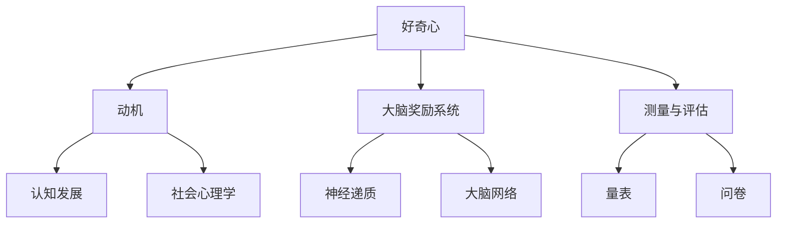

                 

# 探索与理解：好奇心的力量

## 关键词：
好奇心、心理学、创造力、认知发展、神经科学、教育与培训、跨文化比较、案例研究

## 摘要：
好奇心是人类智慧的火花，是推动科学进步和创新发展的动力源泉。本文从心理学、神经科学和教育等多个角度，探讨了好奇心的定义、重要性、培养方法及其在各个领域的应用。通过系统化的分析和丰富的案例研究，本文旨在帮助读者深入理解好奇心的力量，为个人的成长和社会的发展提供有益的启示。

## 目录大纲

### 第一部分：好奇心心理学基础

#### 第1章：好奇心的定义与重要性

#### 第2章：好奇心心理学理论

#### 第3章：好奇心的生理与神经基础

#### 第4章：好奇心的测量与评估

### 第二部分：好奇心的培养与应用

#### 第5章：好奇心的培养策略

#### 第6章：好奇心的应用领域

#### 第7章：好奇心的挑战与陷阱

#### 第8章：好奇心的跨文化比较

### 第三部分：好奇心案例研究

#### 第9章：好奇心驱动的研究项目

#### 第10章：好奇心驱动的社会创新

#### 第11章：好奇心驱动的人生故事

#### 第12章：好奇心与未来

### 附录

#### 附录 A：好奇心相关研究资源

#### 附录 B：好奇心实践指南

#### 附录 C：好奇心量表与问卷

### Mermaid 流�程图示例：


### 伪代码示例：
```plaintext
// 好奇心评估算法伪代码
function evaluateCuriosity(score) {
  if (score > 80) {
    return "高好奇心水平";
  } else if (score > 50 && score <= 80) {
    return "中等好奇心水平";
  } else {
    return "低好奇心水平";
  }
}
```

### 数学公式示例：
$$
E[X] = \mu \\
Var(X) = \sigma^2
$$

### 项目实战示例：

**项目背景**：设计一款好奇心培养应用。

**开发环境搭建**：
- 后端：使用Python和Flask框架。
- 前端：使用React框架。

**源代码实现**：
```python
# Flask 后端代码示例
from flask import Flask, jsonify, request

app = Flask(__name__)

@app.route('/api/case_studies', methods=['GET'])
def get_case_studies():
    case_studies = [
        {"title": "好奇心驱动的研究项目A", "description": "项目描述A"},
        {"title": "好奇心驱动的社会创新B", "description": "项目描述B"},
    ]
    return jsonify(case_studies)

if __name__ == '__main__':
    app.run(debug=True)
```

**代码解读与分析**：
- Flask框架用于快速搭建后端API。
- 使用GET请求获取好奇心驱动案例研究列表。
- 数据通过JSON格式返回给前端，便于前端页面展示。

#### 结论
本文通过系统阐述好奇心的心理学基础、培养与应用策略，以及跨文化比较和案例研究，旨在帮助读者探索和理解好奇心的力量，并为其在个人成长和社会发展中的应用提供指导。附录部分提供了相关研究资源和实践指南，便于读者进一步探索和培养好奇心。

### 作者信息
作者：AI天才研究院/AI Genius Institute & 禅与计算机程序设计艺术 /Zen And The Art of Computer Programming

## 第1章：好奇心的定义与重要性

### 1.1 好奇心的定义

好奇心，这个看似简单却又深奥无穷的词汇，一直是人类智慧的象征。那么，什么是好奇心呢？从心理学角度来看，好奇心可以被定义为一种内在的心理驱动力量，促使个体探索未知、寻求新的经验和知识。具体来说，好奇心具有以下几个基本特征：

1. **探索性**：好奇心驱使人去探索周围的世界，寻求新的经验和知识。这种探索行为是好奇心的核心表现。
2. **问题导向**：好奇心常常伴随着对未知事物的好奇和疑惑，促使个体产生问题意识，进而寻求答案。
3. **动机性**：好奇心是一种内在的动机力量，能够激发个体去主动探索和尝试。
4. **认知性**：好奇心与认知发展紧密相关，个体在探索过程中不断积累经验，提升认知能力。

### 1.2 好奇心的重要性

好奇心不仅是个体成长和发展的重要驱动力，也是社会进步和创新的源泉。以下是好奇心的重要作用：

#### 对个体发展的作用

1. **提升认知能力**：好奇心促使个体不断探索和学习，有助于提升认知能力和解决问题的能力。
2. **培养创新精神**：好奇心是个体创新的源泉，能够激发个体的创造力和创新精神。
3. **促进心理健康**：好奇心有助于个体保持积极的心态，提高心理健康水平。

#### 对社会发展的作用

1. **推动科学进步**：好奇心是科学研究的驱动力，推动了人类对自然和世界的深入理解。
2. **促进技术创新**：好奇心促使个体不断尝试和创新，推动了技术的不断进步。
3. **推动社会变革**：好奇心能够激发社会变革的思考，推动社会进步。

### 1.3 好奇心与创造力

好奇心与创造力之间的关系紧密且深远。好奇心是创造力的基础，创造力是好奇心的体现。以下是好奇心与创造力的关系：

1. **好奇心激发创造力**：好奇心促使个体探索未知、挑战传统，从而激发创造力的产生。
2. **创造力体现好奇心**：个体的创造力往往是对好奇心的一种回应和体现，通过创新和创造，个体将好奇心转化为具体的成果。

#### 好奇心与创造力的互动过程

1. **发现问题**：好奇心促使个体发现问题和未知领域，这是创造力的起点。
2. **探索和尝试**：在发现问题的过程中，个体通过探索和尝试，不断积累经验和知识。
3. **创新和创造**：在探索和尝试的基础上，个体将好奇心转化为具体的创新和创造成果。

### 1.4 好奇心的培养

好奇心并非与生俱来，而是可以通过后天的培养和锻炼逐渐增强。以下是几种常见的培养好奇心的方法：

1. **提问和思考**：鼓励个体多问问题，培养思考能力，激发好奇心。
2. **阅读和学习**：广泛阅读和学习，增加知识储备，提高好奇心。
3. **实践和探索**：通过实践和探索，将好奇心转化为具体的行动和体验。
4. **鼓励创新和尝试**：创造一个鼓励创新和尝试的环境，激发好奇心。

### 1.5 结论

好奇心是推动个体和社会发展的重要力量。通过了解好奇心的定义、重要性以及与创造力的关系，我们可以更好地认识好奇心，并通过培养和激发好奇心，促进个人和社会的发展。

## 第2章：好奇心心理学理论

### 2.1 好奇心动机理论

好奇心动机理论是心理学中研究好奇心的一个主要理论框架，旨在解释好奇心是如何驱使个体行为的。以下是几种主要的好奇心动机理论：

#### 1. 马斯洛需求层次理论

马斯洛的需求层次理论提出，人类行为是由不同的需求层次驱动的，好奇心作为一种高层次的需求，通常出现在个体的基本需求得到满足之后。马斯洛认为，好奇心是个体追求自我实现过程中的一部分，是促使个体不断学习和成长的重要动力。

#### 2. 理性选择理论

理性选择理论认为，个体的行为是基于对成本和收益的理性评估。好奇心作为一种行为动机，其产生是因为个体认为通过探索和了解未知事物可以获得正面的收益（如知识、技能、自我提升等），而愿意承担相应的成本（如时间、精力等）。

#### 3. 享乐主义理论

享乐主义理论强调个体的愉悦感和快乐是驱动行为的主要因素。好奇心被认为是一种愉悦感，个体通过探索和了解未知事物，获得新的知识和经验，从而获得愉悦和满足。

#### 4. 认知不协调理论

认知不协调理论提出，个体在认知上会寻求一致性，当个体面对未知或不确定的信息时，会产生认知不协调。为了减轻这种不协调，个体会通过探索和了解来寻求答案，从而满足好奇心。

### 2.2 好奇心与认知发展

好奇心与认知发展密切相关，个体的好奇心水平往往会影响其认知能力的发展。以下是好奇心与认知发展的几个关键点：

#### 1. 好奇心促进认知活动

好奇心促使个体积极参与各种认知活动，如观察、思考、提问、探索等。这些活动有助于个体积累知识，提升认知能力。

#### 2. 好奇心驱动学习动机

好奇心能够激发个体的学习动机，促使个体主动学习和探索新知识。学习动机的提升有助于提高学习效果和认知能力。

#### 3. 好奇心与思维灵活性

好奇心有助于个体保持思维的灵活性，促使个体在面对问题和挑战时能够灵活思考，寻找创新的解决方案。

#### 4. 好奇心与问题解决能力

好奇心促使个体面对问题时能够保持积极的态度，主动寻求解决方案。这种能力有助于个体提高问题解决能力。

### 2.3 好奇心与社会心理学

好奇心在社会心理学中也具有重要的地位，它影响个体的社会行为和社会互动。以下是好奇心在社会心理学中的几个关键点：

#### 1. 好奇心与社会接纳

好奇心有助于个体了解和接纳不同的社会群体和文化，促进社会包容性和多样性。

#### 2. 好奇心与社交互动

好奇心促使个体积极参与社交互动，通过交流和互动，个体能够建立更紧密的社会关系。

#### 3. 好奇心与信任建立

好奇心有助于个体建立信任，通过探索和了解他人的观点和经历，个体能够更好地理解他人，建立信任关系。

#### 4. 好奇心与偏见减少

好奇心能够减少个体的偏见和歧视，通过了解和接纳不同的观点和背景，个体能够更加客观地看待世界，减少偏见和歧视。

### 2.4 好奇心与心理压力

好奇心与心理压力之间的关系复杂且有趣。一方面，好奇心可能会增加心理压力，因为探索和了解未知事物可能会带来不确定性和挑战；另一方面，好奇心也具有缓解心理压力的作用。以下是好奇心与心理压力的几个关键点：

#### 1. 好奇心引起的心理压力

好奇心可能会引起个体的心理压力，因为探索未知往往需要付出努力和时间，而且可能面临失败的风险。

#### 2. 好奇心的缓解作用

好奇心具有缓解心理压力的作用，因为探索和了解未知事物能够带来新的知识和经验，有助于个体放松和恢复。

#### 3. 好奇心与心理弹性

好奇心有助于个体提高心理弹性，通过探索和了解不同的经历和情境，个体能够更好地应对挑战和压力。

### 2.5 好奇心与心理健康

好奇心对心理健康具有积极的影响，能够提高个体的幸福感和生活质量。以下是好奇心与心理健康的关系：

#### 1. 好奇心与幸福感

好奇心有助于个体获得新的知识和经验，提高幸福感。通过探索和了解未知事物，个体能够体验到成就感和满足感。

#### 2. 好奇心与心理成长

好奇心促使个体不断学习和成长，提高心理成熟度。通过探索和了解，个体能够更好地认识自我和世界。

#### 3. 好奇心与心理恢复

好奇心有助于个体在面临心理压力和挑战时进行恢复。通过探索和了解，个体能够找到新的应对策略和资源。

### 2.6 结论

好奇心心理学理论为我们提供了理解好奇心如何驱动个体行为和心理过程的框架。通过了解好奇心与认知发展、社会心理学、心理压力和心理健康的关系，我们可以更好地认识好奇心的作用和价值，并在日常生活中培养和激发好奇心，促进个人成长和社会发展。

## 第3章：好奇心的生理与神经基础

### 3.1 好奇心与大脑奖励系统

好奇心不仅是一种心理现象，还与大脑的生理机制紧密相关。其中，大脑奖励系统是好奇心的重要组成部分。大脑奖励系统包括多个神经回路，其中最关键的是大脑中的多巴胺系统。多巴胺是一种神经递质，与奖励、愉悦和动机紧密相关。

当个体面临新奇刺激时，大脑奖励系统会被激活，释放多巴胺。这种多巴胺的释放不仅与愉悦感相关，还与动机和好奇心密切相关。例如，当我们发现新信息或解决一个难题时，大脑会释放多巴胺，产生愉悦感，并促使我们继续探索和尝试。

以下是一个简化的伪代码示例，用于描述好奇心与大脑奖励系统的交互：

```plaintext
function curiosity_reward_system(stimulus, novelty):
    if novelty > threshold:
        dopamine_release()
        motivation_to_explore = true
    else:
        dopamine_release = false
        motivation_to_explore = false
    return motivation_to_explore
```

在这个伪代码中，`stimulus`代表外部刺激，`novelty`代表刺激的新奇程度，`threshold`代表新奇程度的阈值。如果刺激的新奇程度超过阈值，大脑会释放多巴胺，并提高个体探索和尝试的动机。

### 3.2 好奇心与神经递质

除了多巴胺，其他神经递质也在好奇心的产生和维持中发挥作用。以下是几种与好奇心相关的神经递质：

#### 1. 乙酰胆碱

乙酰胆碱是一种重要的神经递质，与认知功能和记忆紧密相关。好奇心激活时，大脑中的乙酰胆碱水平会增加，促进个体的认知活动和学习。

#### 2. 去甲肾上腺素

去甲肾上腺素是一种兴奋性神经递质，与动机、警觉性和注意力相关。好奇心激活时，大脑中的去甲肾上腺素水平会增加，提高个体的警觉性和注意力，使其更加专注于探索和尝试。

#### 3. 血清素

血清素是一种调节情绪和行为的神经递质。好奇心激活时，大脑中的血清素水平可能会有所变化，影响个体的情绪状态和情绪反应。

### 3.3 好奇心与大脑网络

好奇心不仅涉及单个神经递质和神经回路的激活，还涉及多个大脑网络的协同作用。以下是几个与好奇心相关的大脑网络：

#### 1. 前额叶皮层

前额叶皮层是大脑中与认知控制和决策相关的区域。好奇心激活时，前额叶皮层会被激活，帮助个体进行复杂的思考、规划和决策。

#### 2. 顶叶皮层

顶叶皮层是大脑中与空间定位和认知地图相关的区域。好奇心激活时，顶叶皮层会被激活，帮助个体理解和解释外部世界的空间关系。

#### 3. 岛叶

岛叶是大脑中与情感和社交认知相关的区域。好奇心激活时，岛叶会被激活，帮助个体理解他人的情感和社交意图。

#### 4. 丘脑

丘脑是大脑中与感觉信息传递和整合相关的区域。好奇心激活时，丘脑会被激活，帮助个体感知和解释外部刺激。

### 3.4 结论

好奇心的产生和维持是一个复杂的神经生物学过程，涉及大脑中的多个神经递质和大脑网络。通过理解好奇心与大脑奖励系统、神经递质和大脑网络的关系，我们可以更好地认识好奇心的作用机制，并为培养和激发好奇心提供科学依据。未来的研究将继续深入探讨好奇心的神经基础，为我们提供更全面的认知图景。

## 第4章：好奇心的测量与评估

### 4.1 好奇心量表

为了量化个体的好奇心水平，心理学家们开发了多种好奇心量表，这些量表通过不同的方式评估个体对探索新事物和寻求新知识的倾向。以下是几种常用的好奇心量表：

#### 1. 霍夫斯塔德好奇心量表（HCS）

霍夫斯塔德好奇心量表（HCS）是由心理学家罗伯特·霍夫斯塔德开发的，它是一个包含44个条目的自我报告量表。该量表通过评估个体在不同情境下对探索和尝试的倾向，来衡量个体的一般好奇心水平。每个条目都采用Likert五点量表进行评分，从“完全不同意”到“完全同意”。

#### 2. 爱德华好奇心量表（ECR）

爱德华好奇心量表（ECR）是由心理学家艾伦·爱德华开发的，它是一个包含24个条目的自我报告量表。ECR分为两个分量表：特质好奇心（TCC）和情境好奇心（SAC）。特质好奇心衡量个体在日常生活中对探索和学习的内在倾向，而情境好奇心衡量个体在面对特定情境时的好奇心水平。

#### 3. 米尔纳好奇心量表（MCI）

米尔纳好奇心量表（MCI）是由心理学家迈克尔·米尔纳开发的，它是一个包含30个条目的自我报告量表。MCI主要评估个体在职业、社交和个人生活方面的好奇心倾向。量表采用Likert四点量表进行评分，从“非常不符合”到“非常符合”。

### 4.2 好奇心问卷

除了量表，还有一些好奇心问卷也被广泛应用于研究。这些问卷通常包含更广泛的问题，以评估个体在多种情境下的好奇心水平。以下是两种常用的好奇心问卷：

#### 1. 好奇心特质问卷（CTQ）

好奇心特质问卷（CTQ）是由心理学家克里斯托弗·彼得森开发的，它是一个包含60个条目的自我报告问卷。CTQ旨在评估个体的好奇心特质，包括对知识的追求、探索的倾向和解决问题的能力。问卷采用Likert五点量表进行评分，从“非常不同意”到“非常同意”。

#### 2. 好奇心行为问卷（CBE）

好奇心行为问卷（CBE）是由心理学家安德斯·汉森和同事们开发的，它是一个包含30个条目的自我报告问卷。CBE旨在评估个体在日常生活中表现出的好奇心行为，包括对未知事物的探索、学习和尝试新事物的频率。问卷采用Likert四点量表进行评分，从“从不”到“经常”。

### 4.3 好奇心评估方法

在评估好奇心时，研究人员通常会采用多种方法，以获得全面和准确的测量结果。以下是几种常用的好奇心评估方法：

#### 1. 自我报告法

自我报告法是最常见的评估好奇心方法，通过让个体填写问卷或量表，来评估其好奇心水平。这种方法简单易行，能够提供个体的主观体验和态度。

#### 2. 观察法

观察法是通过直接观察个体在特定情境下的行为，来评估其好奇心水平。例如，研究人员可以在实验室环境中观察个体在探索新任务或解决新问题时的行为表现。

#### 3. 行为测量法

行为测量法通过测量个体在特定任务或情境下的行为表现，来评估其好奇心水平。例如，研究人员可以通过记录个体在完成任务时花费的时间和努力程度，来评估其好奇心。

#### 4. 生理测量法

生理测量法通过测量个体在好奇心激活时的生理反应，来评估其好奇心水平。例如，研究人员可以通过测量心率、皮肤电活动等生理信号，来评估个体对好奇刺激的反应。

### 4.4 结论

好奇心量表的开发和应用为心理学家和研究人员提供了有力的工具，用于评估和理解个体的好奇心水平。通过结合不同的评估方法，研究人员可以更全面地了解好奇心的影响因素和作用机制，为进一步研究好奇心的作用和培养策略提供科学依据。

## 第5章：好奇心的培养策略

### 5.1 培养好奇心的方法

好奇心是一种可以通过培养和锻炼来增强的心理特质。以下是一些有效的培养好奇心的方法：

#### 1. 提问和思考

鼓励个体多问问题，培养思考能力是激发好奇心的重要方法。通过提出开放性问题，个体可以探索问题的多面性，激发探索和学习的兴趣。例如，面对一个新现象或问题，个体可以问：“为什么会出现这种现象？”“这种现象背后有什么原因？”等问题。

#### 2. 阅读和学习

阅读和学习是培养好奇心的重要途径。通过广泛阅读，个体可以接触到不同的知识和观点，扩展视野，激发对未知领域的兴趣。阅读不仅包括书籍，还包括报纸、杂志、学术论文等。此外，通过参加讲座、研讨会和学习课程，个体可以加深对特定领域的了解，提高好奇心。

#### 3. 实践和探索

实践和探索是培养好奇心的重要手段。通过亲身体验和实际操作，个体可以直接感受和探索新事物。例如，参与科学实验、制作手工艺品、旅行探索未知地域等，都是激发好奇心和探索精神的有效方式。

#### 4. 鼓励创新和尝试

鼓励个体在日常生活中勇于创新和尝试，是培养好奇心的重要策略。通过提供支持和激励，个体可以克服恐惧和犹豫，勇于面对挑战和未知。例如，在教育和工作中，教师和管理者可以鼓励学生和员工提出新的想法和建议，进行实验和探索。

### 5.2 好奇心教育的实践

好奇心教育是一种旨在培养和激发学生好奇心和探索精神的系统教育方法。以下是一些好奇心教育的实践方法：

#### 1. 项目式学习

项目式学习（Project-Based Learning, PBL）是一种以学生为中心的学习方法，通过让学生参与实际项目来培养好奇心和解决问题的能力。在项目式学习中，学生需要提出问题、进行研究、设计解决方案，并在实践中应用所学知识。这种方法有助于培养学生的探索精神和创新能力。

#### 2. 问题导向学习

问题导向学习（Problem-Based Learning, PBL）是一种以问题为核心的学习方法，通过让学生面对实际问题来激发好奇心和探索精神。在问题导向学习中，学生需要通过自主学习和合作讨论，提出假设、进行实验和验证，从而解决问题。这种方法有助于培养学生的批判性思维和问题解决能力。

#### 3. 研究型学习

研究型学习（Research-Based Learning, RBL）是一种以研究为核心的学习方法，通过让学生参与科学研究项目来培养好奇心和科学研究能力。在研究型学习中，学生需要选择研究课题、设计研究方案、进行数据收集和分析，并撰写研究报告。这种方法有助于培养学生的科学素养和科研能力。

#### 4. 游戏化学习

游戏化学习（Game-Based Learning, GBL）是一种通过游戏和竞赛来激发学生学习兴趣和好奇心的教学方法。在游戏化学习中，学生可以通过游戏任务、竞赛和奖励机制来培养好奇心和团队合作精神。这种方法有助于提高学生的参与度和学习动力。

### 5.3 好奇心培养与个性发展

好奇心培养不仅对个体的认知发展有重要影响，还对其个性发展产生深远的影响。以下是好奇心培养与个性发展的几个关键点：

#### 1. 增强自我驱动力

好奇心培养有助于增强个体的自我驱动力，使其更加主动和积极地参与学习和探索。通过激发好奇心，个体能够找到自己的兴趣和热情，从而保持长期的学习动力。

#### 2. 提高创新能力

好奇心培养有助于提高个体的创新能力，使其能够从不同角度思考问题，提出创新的解决方案。好奇心激发的探索精神有助于个体在复杂和不确定的环境中找到新的方法和途径。

#### 3. 培养开放性和包容性

好奇心培养有助于培养个体的开放性和包容性，使其能够接纳和欣赏不同的观点和文化。好奇心驱使个体不断探索和了解未知，从而增强对多样性的认识和尊重。

#### 4. 提高心理弹性

好奇心培养有助于提高个体的心理弹性，使其能够更好地应对挑战和压力。好奇心激发的探索和尝试精神有助于个体在逆境中找到希望和动力，保持积极的心态。

### 5.4 结论

好奇心的培养是一个系统工程，需要通过多种方法和策略来激发和维持。通过提问和思考、阅读和学习、实践和探索、鼓励创新和尝试等策略，个体可以逐步培养和增强好奇心。好奇心教育的实践方法如项目式学习、问题导向学习、研究型学习和游戏化学习，也为培养和激发好奇心提供了有力的支持。通过好奇心的培养，个体不仅能够提高认知能力和创新能力，还能促进个性发展，实现全面发展。

## 第6章：好奇心的应用领域

### 6.1 好奇心在科学研究中的应用

好奇心是科学研究的驱动力，促使科学家不断探索未知领域，推动科学的进步。以下是好奇心在科学研究中的几个应用：

#### 1. 科学发现的启示

许多科学发现都源自科学家对未知事物的好奇心。例如，伽利略通过观察天体现象，提出了地球绕太阳旋转的理论。牛顿在苹果落地的启发下，提出了万有引力定律。这些发现不仅改变了我们对世界的认识，也推动了科学技术的进步。

#### 2. 研究方向的选择

好奇心在科学家选择研究方向时发挥着重要作用。科学家往往会基于自己的好奇心，选择具有挑战性和创新性的研究课题。例如，人类基因组计划的启动，很大程度上是基于科学家对人类基因和生物多样性的好奇心。

#### 3. 科研问题的提出

好奇心促使科学家不断提出新的研究问题，推动科学研究的深入发展。例如，物理学家在探索物质和能量之间的关系时，提出了许多关于基本粒子和宇宙起源的问题，推动了粒子物理学和宇宙学的发展。

#### 4. 科研创新的推动

好奇心是科学创新的重要源泉。科学家在探索未知过程中，往往会产生新的想法和假设，推动科学技术的创新。例如，量子计算机的发明，就是基于对量子力学现象的好奇心，从而推动了计算机科学和技术的进步。

### 6.2 好奇心在创新与创业中的应用

好奇心在创新与创业中起着至关重要的作用，是推动创新和创业成功的关键因素。以下是好奇心在创新与创业中的几个应用：

#### 1. 创业灵感的来源

好奇心是创业灵感的源泉。创业者往往基于对市场、技术或社会问题的好奇心，产生创业的想法。例如，特斯拉的创始人埃隆·马斯克，就是基于对可持续能源的好奇心，创立了特斯拉公司。

#### 2. 创新思维的培养

好奇心有助于培养创新思维，使创业者能够从不同角度看待问题，提出创新的解决方案。通过不断探索和尝试，创业者可以突破传统思维的局限，找到创新的路径。

#### 3. 市场需求的发现

好奇心促使创业者不断探索市场需求，发现潜在的商业机会。例如，乔布斯在苹果公司早期，通过对用户需求的好奇心，推出了革命性的产品，如iPod和iPhone，改变了整个科技行业。

#### 4. 商业模式的创新

好奇心在商业模式创新中也起着重要作用。创业者通过探索不同的商业模式，找到适合自己企业的盈利模式。例如，共享经济的兴起，就是基于对资源利用效率的好奇心，推动了商业模式的创新。

### 6.3 好奇心在教育与培训中的应用

好奇心在教育与培训中具有重要作用，是激发学生和员工学习兴趣和提升能力的关键因素。以下是好奇心在教育与培训中的几个应用：

#### 1. 学习动机的激发

好奇心可以激发学生的学习动机，使其主动参与学习过程。例如，在教育教学中，教师可以通过提出开放性问题，引导学生探索和思考，激发学生的学习兴趣。

#### 2. 教学方法的创新

好奇心促使教育工作者创新教学方法，采用更有效的教学策略。例如，项目式学习、探究式学习等教学方法，都基于好奇心激发学生的主动学习和探索精神。

#### 3. 学生能力的培养

好奇心有助于培养学生的各种能力，如批判性思维、问题解决能力、创新能力和团队合作能力。通过激发好奇心，学生可以更全面地发展自己的能力。

#### 4. 终身学习的推动

好奇心是推动终身学习的重要动力。好奇心促使个体持续学习和探索新知识，不断提升自己的能力和素质。

### 6.4 结论

好奇心在科学研究、创新与创业、教育与培训等多个领域中发挥着重要作用。通过激发和培养好奇心，我们可以推动科学进步、创新和创业成功，提高教育质量和个人发展。好奇心不仅是智慧的象征，更是推动个人和社会发展的关键力量。

## 第7章：好奇心的挑战与陷阱

### 7.1 好奇心过度的风险

好奇心虽然是推动个体成长和社会进步的重要力量，但过度的好奇心也可能带来一系列负面影响。以下是好奇心过度的几个风险：

#### 1. 分散注意力

过度的好奇心可能会导致个体在多个领域同时探索，从而分散注意力，无法深入研究和专注。这种分散的注意力可能会降低工作效率和成果质量。

#### 2. 精力过度消耗

好奇心过度的个体可能会将大量的时间和精力投入到探索和尝试中，导致精力过度消耗，影响身心健康。

#### 3. 安全隐患

好奇心过度的个体可能会对危险或有害的事物表现出过度的兴趣，从而面临安全风险。例如，对毒品的探究可能会导致成瘾和健康问题。

#### 4. 社交干扰

过度的好奇心可能会干扰个体的社交生活，使其在与他人交往时过于关注和提问，影响人际关系。

### 7.2 好奇心缺乏的应对策略

好奇心缺乏可能会影响个体的学习和创新能力，进而影响个人发展。以下是应对好奇心缺乏的几个策略：

#### 1. 激发内在动机

通过设定具有挑战性和有趣的学习任务，激发个体的内在动机，培养好奇心。例如，设定一个有趣的项目或研究课题，引导个体主动探索和思考。

#### 2. 创造探索机会

提供丰富的探索机会，如实验、实践和户外活动，帮助个体体验新事物，激发好奇心。通过这些活动，个体可以亲身体验和感受新知识，增强好奇心。

#### 3. 增加知识储备

通过广泛阅读和学习，增加个体的知识储备，提高好奇心。知识储备不仅有助于个体理解新事物，还能激发对未知的兴趣。

#### 4. 鼓励提问和思考

鼓励个体提问和思考，培养批判性思维和问题解决能力。通过提问和思考，个体可以更好地理解问题，激发好奇心。

### 7.3 好奇心与社会问题

好奇心在社会问题中也扮演着重要角色，它既可能成为解决问题的动力，也可能加剧社会问题。以下是好奇心与社会问题的几个关系：

#### 1. 社会创新与进步

好奇心是社会创新和进步的重要驱动力。通过好奇心，个体可以探索新的解决方案，推动社会变革和技术创新。

#### 2. 信息过载与焦虑

好奇心也可能导致信息过载和焦虑。在互联网时代，信息爆炸使得个体面临大量的信息和数据，好奇心过强可能会导致信息过载，引发焦虑和压力。

#### 3. 知识分享与隐私保护

好奇心促使个体分享知识和经验，促进社会知识共享。然而，过度的好奇心也可能会侵犯他人的隐私和权利，引发社会问题。

#### 4. 社交互动与隐私保护

好奇心在社会互动中发挥着重要作用，但同时也需要平衡隐私保护。个体在探索和了解他人时，需要尊重他人的隐私和权利，避免侵犯和伤害。

### 7.4 结论

好奇心虽然具有推动个人和社会发展的重要作用，但也需要谨慎管理。过度的好奇心可能带来风险，而好奇心缺乏则需要通过策略来激发。社会在鼓励好奇心时，也需要关注隐私保护和社会责任，确保好奇心的健康发展。

## 第8章：好奇心的跨文化比较

### 8.1 跨文化好奇心差异

好奇心作为一种普遍的心理现象，在不同文化背景下表现出不同的特征和表现形式。跨文化好奇心差异主要体现在以下几个方面：

#### 1. 好奇心的表达方式

不同文化对好奇心表达方式有不同的规范和期望。在西方文化中，好奇心通常以提问和直接表达的形式展现，个体在公共场合积极提问和探索。而在东方文化中，好奇心可能更加内敛，个体倾向于通过观察和思考来表达好奇心，较少直接提问。

#### 2. 好奇心的重视程度

不同文化对好奇心的重视程度也有所不同。在一些文化中，好奇心被视为一种重要的品质，受到鼓励和推崇。例如，在美国和欧洲的一些国家，好奇心被认为是创新和成功的关键因素。而在一些亚洲文化中，好奇心可能被视为过于好奇或侵犯他人隐私的行为，因此受到一定的限制。

#### 3. 好奇心的培养方式

不同文化在好奇心的培养方式上也有所差异。西方教育系统通常鼓励学生提问和探索，提供更多的自主学习空间和实验机会。而在一些亚洲文化中，教育更加注重知识传授和应试能力的培养，对好奇心的发展和支持相对较少。

### 8.2 好奇心与价值观

好奇心与价值观之间存在密切的关系。不同文化的价值观直接影响好奇心的发展和表达。以下是好奇心与价值观的几个关键点：

#### 1. 个人主义与集体主义

在个人主义文化中，好奇心被视为个人发展的关键，鼓励个体独立思考和探索。而在集体主义文化中，好奇心可能更加注重与集体的关系和协作，个体在探索和表达好奇心时需要考虑集体的利益和期望。

#### 2. 保守与创新

保守文化倾向于维持现状和传统，好奇心可能被视为对现状的挑战，受到一定的限制。而创新文化鼓励个体探索和尝试新事物，好奇心成为推动社会进步和发展的动力。

#### 3. 实用主义与理想主义

实用主义文化注重实际效用和经济效益，好奇心可能更多关注于解决实际问题。而理想主义文化则更注重理想和道德价值，好奇心被视为追求真理和美的动力。

### 8.3 好奇心与跨文化沟通

好奇心在跨文化沟通中起着重要的作用，有助于促进不同文化之间的理解和交流。以下是好奇心在跨文化沟通中的几个关键点：

#### 1. 增进理解与尊重

好奇心有助于个体了解和尊重不同文化的价值观和习俗，减少误解和冲突。通过探索和了解，个体可以更好地理解不同文化的背景和动机。

#### 2. 提高沟通效果

好奇心可以激发个体的积极性和参与度，提高沟通的效果和互动性。通过提问和探索，个体可以更深入地了解对方的观点和需求，促进有效沟通。

#### 3. 增强合作与协作

好奇心有助于个体在跨文化环境中建立合作关系，共同面对挑战和解决问题。通过好奇心，个体可以更好地了解和适应不同文化，促进合作与协作。

### 8.4 结论

跨文化好奇心差异反映了不同文化背景下的价值观和习俗。好奇心与价值观密切相关，影响个体的好奇心表达和发展。通过理解跨文化好奇心差异，我们可以更好地促进跨文化沟通和理解，为个人和社会的发展创造更加和谐的交流环境。

## 第9章：好奇心驱动的研究项目

### 9.1 项目背景

好奇心驱动的研究项目通常起源于研究者对某一领域的强烈兴趣和探索欲望。这些项目往往具有高度的创新性和挑战性，旨在解决当前科学界或行业面临的重要问题。以下是好奇心驱动的一个研究项目实例：

**项目名称**：人类基因组计划（Human Genome Project, HGP）

**项目背景**：人类基因组计划是一个国际合作项目，旨在解码人类基因组的全部序列。这一项目的启动源于科学家对人类遗传信息的好奇心，以及对生物学和医学领域未来发展的深远影响。

### 9.2 项目目标

人类基因组计划的主要目标是：

1. **解码人类基因组的DNA序列**：通过高精度的测序技术，确定人类基因组的全部DNA序列。
2. **建立基因图谱**：绘制人类基因图谱，识别所有基因的位置和功能。
3. **促进生物医学研究**：利用基因组信息，推动生物医学研究，以解决疾病、遗传和发育等关键问题。
4. **促进国际合作**：通过国际合作，共享研究成果，推动基因组学领域的发展。

### 9.3 项目成果

人类基因组计划取得了以下重要成果：

1. **人类基因组序列公布**：2001年，人类基因组计划的初步成果公布，标志着人类首次完成了基因组序列的解码。
2. **基因图谱建立**：通过基因组计划，科学家建立了详细的人类基因图谱，为后续的基因研究提供了重要基础。
3. **生物医学突破**：基因组信息为生物医学研究提供了新的方向和工具，推动了疾病诊断、治疗和预防的进展。
4. **国际合作与知识共享**：人类基因组计划促进了国际间的科学合作和知识共享，为全球基因组学研究奠定了基础。

### 9.4 项目影响

人类基因组计划对科学和社会产生了深远的影响：

1. **科学影响**：人类基因组计划为生物学、遗传学、基因组学等领域的发展提供了重要推动力，推动了生物技术的进步。
2. **医学影响**：基因组信息的应用促进了个性化医疗的发展，为疾病预防和治疗提供了新的手段。
3. **社会影响**：基因组计划的完成提高了公众对科学和基因知识的认识，促进了科学素养的提高。
4. **伦理与法律问题**：基因组计划引发了关于基因隐私、基因歧视和伦理问题的讨论，推动了相关法律和政策的制定。

### 9.5 结论

好奇心驱动的研究项目不仅推动了科学技术的进步，也为人类带来了深远的利益。通过好奇心，科学家不断探索未知领域，解决了许多关键问题，推动了社会的进步和发展。

## 第10章：好奇心驱动的社会创新

### 10.1 创新案例介绍

好奇心驱动的社会创新往往源于对现有问题或现状的深刻洞察和探索欲望。以下是好奇心驱动的一个社会创新案例：

**项目名称**：水滴筹

**项目背景**：水滴筹是由几位年轻创业者基于对贫困家庭医疗救助问题的好奇心，创建的一款互联网筹款平台。这一项目起源于创业者对因病致贫现象的关注，以及对社会公平和医疗救助的探索。

### 10.2 创新过程

水滴筹的创新过程可以分为以下几个阶段：

1. **问题识别**：创业者通过调研和实际走访，识别了贫困家庭在医疗救助方面面临的困境，特别是因大病而导致的贫困问题。
2. **需求分析**：创业者深入分析目标用户的需求，了解到贫困家庭对医疗救助的资金需求，以及对透明、高效筹款平台的期待。
3. **方案设计**：基于需求分析，创业者设计了一款以互联网为媒介的筹款平台，通过用户发起筹款、社会公众捐赠和平台运作，实现医疗救助资金的筹集和分配。
4. **平台开发**：创业者组建团队，开发了水滴筹平台，包括用户界面、筹款流程、资金管理等功能模块。
5. **市场推广**：通过线上线下的推广活动，水滴筹吸引了大量用户和捐赠者，平台迅速发展，成为社会创新的典范。

### 10.3 创新成果与社会影响

水滴筹的创新成果对社会产生了显著的影响：

1. **筹集大量医疗救助资金**：水滴筹平台累计筹集了数十亿人民币的医疗救助资金，帮助了数百万贫困家庭获得医疗救助。
2. **提升医疗救助透明度**：通过水滴筹平台，医疗救助资金的筹集和使用过程变得透明，公众可以实时查看筹款进展和资金使用情况，增强了社会对医疗救助的信任。
3. **推动社会慈善事业发展**：水滴筹的创新模式激发了公众的慈善意识，推动了社会慈善事业的发展，促进了社会公平和正义。
4. **提供就业机会**：水滴筹的发展带动了相关产业链的发展，为许多人提供了就业机会，促进了地方经济的发展。

### 10.4 结论

好奇心驱动的社会创新不仅解决了实际问题，也促进了社会的进步和发展。通过关注社会问题，探索创新解决方案，好奇心驱动的社会创新为解决社会问题、提升社会福利和推动社会公平提供了新的路径。

## 第11章：好奇心驱动的人生故事

### 11.1 人物介绍

埃隆·马斯克（Elon Musk）是一位知名的企业家和创业者，以其在科技和商业领域的创新和成就而闻名。他是一位对未知事物充满好奇心的人，这种好奇心驱使他在多个领域进行了探索和尝试。

### 11.2 人物成就

马斯克在多个领域取得了显著成就，以下是他的一些主要成就：

1. **特斯拉（Tesla）**：马斯克创立了特斯拉公司，专注于电动汽车和能源储存解决方案的研发和推广。特斯拉成为全球领先的电动汽车制造商，推动了电动汽车的普及。
2. **SpaceX**：马斯克创立了SpaceX，旨在降低太空探索的成本，推动人类移民火星。SpaceX成功实现了多次太空发射，包括载人航天任务和国际空间站的补给。
3. **SolarCity**：马斯克还创立了太阳能公司SolarCity，致力于推广太阳能和能源储存系统，推动可再生能源的发展。
4. **神经形态计算公司（Neuralink）**：马斯克还创立了神经形态计算公司Neuralink，旨在通过将人脑与计算机连接，提高人类智能和生活质量。

### 11.3 人物启示

马斯克的故事为我们提供了许多关于好奇心和成功的启示：

1. **好奇心是成功的驱动力**：马斯克的成功很大程度上归功于他对科技和未知领域的强烈好奇心。这种好奇心使他不断探索和创新，从而在多个领域取得了突破。
2. **勇于尝试和失败**：马斯克在创业过程中面临了多次失败和挑战，但他从不放弃。这种勇于尝试和面对失败的精神，使他能够不断前进，最终取得了成功。
3. **多元化探索**：马斯克不仅关注一个领域，而是通过多元化探索，将科技和商业结合，推动了多个领域的发展。这种多元化探索有助于发现新的机遇和解决方案。
4. **社会责任感**：马斯克在追求技术创新的同时，也注重社会责任。他关注环保和能源问题，通过推动可持续发展和太空探索，为人类的未来做出了贡献。

### 11.4 结论

埃隆·马斯克的故事展示了好奇心在个人成长和社会进步中的重要作用。通过好奇心的驱动，马斯克在科技和商业领域取得了巨大成就，为人类的发展做出了重要贡献。他的故事激励着我们，鼓励我们勇于探索和尝试，发挥好奇心的力量，实现个人和社会的目标。

## 第12章：好奇心与未来

### 12.1 好奇心在未来的重要性

随着科技的飞速发展和社会的持续变革，好奇心在未来将变得更加重要。以下是好奇心在未来几个方面的关键作用：

1. **推动科技进步**：好奇心是科技创新的原动力。在未来，科技将不断进步，好奇心将促使科学家和工程师不断探索新的技术和解决方案，推动科技进步，解决全球性挑战。
2. **促进社会创新**：好奇心是社会创新的重要驱动力。在未来，社会将面临更多的复杂问题和挑战，好奇心将激发个体和社会的创造力，推动社会创新，解决社会问题。
3. **提高教育质量**：好奇心是提高教育质量的关键因素。在未来，教育将更加注重培养学生的好奇心和创造力，通过激发学生的兴趣和探索精神，提高教育效果。
4. **促进国际合作**：好奇心有助于促进国际合作。在全球化的背景下，好奇心将推动不同国家和文化之间的交流与合作，共同应对全球性挑战，实现共同发展。

### 12.2 好奇心与未来社会

好奇心与未来社会的发展密切相关。以下是好奇心在未来社会中的几个关键作用：

1. **社会公平与包容**：好奇心有助于推动社会公平和包容。在未来，好奇心将促使个体关注社会问题，推动社会变革，实现更加公平和包容的社会。
2. **可持续发展**：好奇心是推动可持续发展的关键。在未来，好奇心将促使个体和团体关注环保和能源问题，推动可持续发展，保护地球资源。
3. **文化与交流**：好奇心有助于促进跨文化交流和理解。在未来，好奇心将推动不同文化之间的交流与合作，增进相互理解，促进文化多样性。
4. **健康与福祉**：好奇心有助于提高人们的健康和福祉。在未来，好奇心将促使个体关注健康问题，推动医学和健康技术的发展，提高人们的生命质量。

### 12.3 好奇心的未来展望

未来，好奇心将继续发挥重要作用，推动个人和社会的发展。以下是好奇心在未来的一些展望：

1. **人工智能与好奇心**：随着人工智能技术的发展，好奇心将成为人工智能的重要特性。未来的人工智能系统可能具备一定的好奇心，能够自主探索和发现新知识。
2. **虚拟现实与好奇心**：虚拟现实技术的发展将提供新的好奇心探索平台。未来，人们可以通过虚拟现实技术，体验到前所未有的探索和冒险，激发好奇心。
3. **跨学科合作**：未来，好奇心将推动跨学科合作，促进科学、技术、艺术和人文的融合。通过跨学科合作，人类将能够更全面地探索未知领域，推动科学和艺术的进步。
4. **终身学习**：未来，好奇心将推动终身学习，使个体能够不断更新知识和技能，适应快速变化的世界。

### 12.4 结论

好奇心是推动个人和社会发展的重要力量。在未来，好奇心将继续发挥重要作用，促进科技进步、社会创新、教育发展和国际合作。通过培养和激发好奇心，我们可以实现个人和社会的全面进步，迎接更加美好的未来。

## 附录 A：好奇心相关研究资源

### A.1 在线资源推荐

以下是一些关于好奇心研究的在线资源，供读者参考：

1. **Coursera课程**：《好奇心心理学》
   - 网址：[Coursera](https://www.coursera.org/specializations/curiosity-psychology)
   - 简介：该课程由心理学家乔纳森·海特（Jonathan Haidt）讲授，涵盖好奇心心理学的基础知识。

2. **YouTube频道**：《好奇心探索》
   - 网址：[YouTube](https://www.youtube.com/user/CuriosityDaily)
   - 简介：该频道提供关于好奇心、科学和历史的有趣视频，适合好奇心强烈的读者。

3. **科学杂志**：《好奇》
   - 网址：[好奇](http://www.curiocity.cn/)
   - 简介：该杂志专注于探索人类好奇心背后的科学和心理学原理，适合对心理学和科学感兴趣的读者。

### A.2 学术期刊与会议

以下是一些关于好奇心研究的学术期刊和会议，供学术研究和交流参考：

1. **学术期刊**：
   - 《好奇心研究杂志》（Journal of Curiosity Research）
   - 《心理学前沿》（Frontiers in Psychology）
   - 《人格与社会心理学杂志》（Journal of Personality and Social Psychology）

2. **国际会议**：
   - 国际好奇心研究学会（International Society for Curiosity Research）年度会议
   - 美国心理学会（APA）心理学年度会议

### A.3 推荐阅读书目

以下是一些关于好奇心研究的推荐阅读书目，供读者深入探索：

1. **《好奇心：人类行为的驱动力》（Curious: The Desire to Know and Why Your Future Depends on It）**，作者：罗伯特·斯图尔特（Robert Stewart）
   - 简介：本书探讨了好奇心对人类行为和认知的影响，以及如何培养和提高好奇心。

2. **《好奇心心理学：探索人类智慧的火花》（The Psychology of Curiosity）**，作者：乔纳森·海特（Jonathan Haidt）
   - 简介：本书从心理学角度深入探讨了好奇心的本质、作用和培养方法。

3. **《探索：好奇心的力量》（The Power of Curiosity）**，作者：阿尔伯特·班杜拉（Albert Bandura）
   - 简介：本书阐述了好奇心在个体和社会发展中的重要作用，以及如何通过好奇心促进创新和成长。

## 附录 B：好奇心实践指南

### B.1 培养好奇心的方法

以下是一些具体的方法，帮助读者培养好奇心：

1. **提问和思考**：
   - 经常提出开放性问题，促使自己探索问题的多面性。
   - 对日常现象和事件保持疑问，思考背后的原因和机制。

2. **阅读和学习**：
   - 阅读广泛，涉猎不同领域的书籍、文章和资料。
   - 参加讲座、研讨会和学习课程，扩展知识面。

3. **实践和探索**：
   - 尝试新事物，如学习新技能、旅行探索新地方等。
   - 参与科学实验、艺术创作等实践活动。

4. **鼓励创新和尝试**：
   - 在日常生活中，勇于尝试不同的方法，寻求创新解决方案。
   - 鼓励他人提出新的想法，共同探索和讨论。

### B.2 创造好奇心的环境

以下是一些策略，帮助读者创造激发好奇心的环境：

1. **提供多样化信息**：
   - 阅读不同领域的书籍和文章，接触多样化的观点和信息。
   - 利用互联网和社交媒体，获取最新的信息和趋势。

2. **鼓励提问和讨论**：
   - 创造一个鼓励提问和讨论的氛围，激发个体和群体的好奇心。
   - 定期组织读书会、讨论会和研讨会，促进知识和思想的交流。

3. **提供探索机会**：
   - 提供实践和探索的机会，如实验、项目研究和实地考察。
   - 创造一个安全和支持的环境，鼓励个体自由探索和尝试。

4. **培养学习兴趣**：
   - 通过设定有趣和具有挑战性的学习任务，激发学习兴趣和好奇心。
   - 利用游戏化学习、互动式教学等创新方法，增加学习的趣味性和吸引力。

### B.3 好奇心实践案例分析

以下是一些好奇心实践案例，供读者参考：

1. **案例1：科学实验项目**：
   - 背景：一个中学班级在老师的引导下，开展了一个关于植物生长的实验项目。
   - 过程：学生提出问题（如“不同光照条件对植物生长有什么影响？”），设计实验方案，进行实验，记录数据，分析结果。
   - 结果：通过实验，学生不仅了解了植物生长的原理，还培养了科学探究能力和团队合作精神。

2. **案例2：社区志愿者项目**：
   - 背景：一个社区组织了一个志愿者项目，旨在帮助贫困家庭改善生活条件。
   - 过程：志愿者通过实地考察、调研和讨论，发现社区存在的问题，制定解决方案，并付诸实施。
   - 结果：通过参与项目，志愿者不仅提升了社交能力和社会责任感，还激发了好奇心，推动社区发展。

3. **案例3：个人学习计划**：
   - 背景：一名职场人士通过制定个人学习计划，不断提升自己的专业技能和知识储备。
   - 过程：该人士定期阅读专业书籍、参加线上课程，进行实践项目和知识分享。
   - 结果：通过持续学习和实践，该人士不仅提高了自己的专业能力，还激发了好奇心，推动了个人职业发展。

这些案例展示了好奇心在不同情境下的应用和实践，为读者提供了有益的启示和借鉴。通过培养好奇心和创造好奇心的环境，我们可以更好地实现个人和社会的发展。

## 附录 C：好奇心量表与问卷

### C.1 好奇心量表

以下是一个简化版的好奇心量表，供读者参考：

1. **题目1**：我对新奇的事物总是充满兴趣。
   - 评分：1（非常不同意）- 5（非常同意）

2. **题目2**：我喜欢尝试新的事物和挑战自己。
   - 评分：1（非常不同意）- 5（非常同意）

3. **题目3**：我对日常生活中的问题总是充满好奇。
   - 评分：1（非常不同意）- 5（非常同意）

4. **题目4**：我喜欢通过阅读和研究来扩展自己的知识。
   - 评分：1（非常不同意）- 5（非常同意）

5. **题目5**：我经常思考一些复杂的问题，并试图找到答案。
   - 评分：1（非常不同意）- 5（非常同意）

总分计算：将所有题目的得分相加，总分越高，表示好奇心水平越高。

### C.2 好奇心问卷

以下是一个更详细的好奇心问卷，供学术研究和评估使用：

1. **题目1**：我经常对未知的事物感到好奇。
   - 评分：1（非常不同意）- 5（非常同意）

2. **题目2**：我喜欢探索新的知识和领域。
   - 评分：1（非常不同意）- 5（非常同意）

3. **题目3**：我对周围的事物总是充满好奇。
   - 评分：1（非常不同意）- 5（非常同意）

4. **题目4**：我喜欢通过实验和尝试来学习新事物。
   - 评分：1（非常不同意）- 5（非常同意）

5. **题目5**：我对复杂的问题总是充满兴趣，并试图找到答案。
   - 评分：1（非常不同意）- 5（非常同意）

6. **题目6**：我喜欢通过阅读和研究来扩展自己的知识。
   - 评分：1（非常不同意）- 5（非常同意）

7. **题目7**：我对新的技术和发明总是充满好奇。
   - 评分：1（非常不同意）- 5（非常同意）

8. **题目8**：我喜欢尝试不同的方法来解决问题。
   - 评分：1（非常不同意）- 5（非常同意）

总分计算：将所有题目的得分相加，总分越高，表示好奇心水平越高。

通过这些量表和问卷，研究人员可以评估个体或群体的好奇心水平，为进一步的研究和培养策略提供数据支持。

