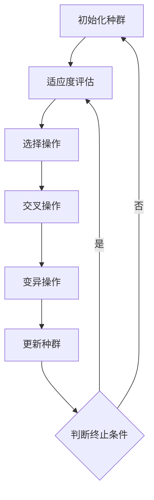

                 

### 第一部分：提示词优化的遗传算法概述

遗传算法是一种模拟生物进化的全局搜索算法，它通过模拟自然选择和遗传学原理来寻找最优解。而提示词优化（Prompt Tuning）是机器学习中的一个概念，主要用于提高模型在特定任务上的性能。本文将探讨如何在遗传算法中引入提示词优化，以提高算法的搜索效率和优化质量。

#### 第1章：遗传算法基础与提示词优化

遗传算法是一种模拟生物进化的全局搜索算法，它通过模拟自然选择和遗传学原理来寻找最优解。遗传算法的基本流程包括选择、交叉、变异和适应度评估等步骤。其关键组成部分如下：

- **染色体表示**：染色体是遗传算法中个体（解）的编码形式，它可以通过二进制编码、实值编码等方式进行表示。
- **适应度函数**：适应度函数是评估个体优劣的指标，通常目标是最大化或最小化适应度函数值。
- **选择操作**：选择操作用于从当前种群中选择优秀个体作为下一代的父本，常见的有轮盘赌选择和锦标赛选择。
- **交叉操作**：交叉操作用于产生新的个体，通过将两个父本个体的基因进行交换，从而产生具有不同基因组合的子代。
- **变异操作**：变异操作用于增加种群的多样性，通过随机改变个体的某些基因，从而产生新的个体。

提示词优化是一种基于预训练语言模型的优化方法，其基本思想是通过调整模型中特定层的参数来提高模型在特定任务上的性能。在遗传算法中引入提示词优化的主要目的是利用遗传算法的全局搜索能力和提示词优化的局部搜索能力，从而提高算法的搜索效率和优化质量。

#### 第2章：遗传算法的核心算法原理

遗传算法的核心在于其选择、交叉和变异等操作，这些操作决定了算法的搜索能力和收敛速度。下面我们将详细讨论这些操作的原理和实现。

##### 1. 适应度函数设计

适应度函数是评估个体优劣的指标，通常目标是最大化或最小化适应度函数值。适应度函数的设计应遵循以下原则：

- **目标函数形式**：适应度函数通常是一个实值函数，它可以是一个简单的函数形式，如线性函数、多项式函数等，也可以是一个复杂的函数形式，如神经网络输出等。
- **目标函数目标**：适应度函数的目标是最大化或最小化函数值，具体取决于优化问题的类型。对于最大化问题，个体适应度越高，表示解的质量越好；对于最小化问题，个体适应度越低，表示解的质量越好。
- **适应度函数特性**：适应度函数应具有以下特性：
  - **单峰性**：适应度函数应具有单峰性，使得个体在搜索过程中容易找到全局最优解。
  - **平滑性**：适应度函数应具有平滑性，以避免个体在搜索过程中出现剧烈波动。
  - **可区分性**：适应度函数应具有良好的可区分性，使得优秀个体与劣质个体之间的适应度差异明显。

常见的适应度函数包括以下几种：

- **线性适应度函数**：线性适应度函数是一种简单的适应度函数，它将个体的适应度值与个体的目标函数值成正比。其公式为：
  $$ f(x) = c \cdot g(x) $$
  其中，$c$ 是一个常数，$g(x)$ 是目标函数值。
  
- **指数适应度函数**：指数适应度函数是一种将个体适应度值与目标函数值的指数关系相结合的适应度函数。其公式为：
  $$ f(x) = c \cdot e^{-k \cdot g(x)} $$
  其中，$c$ 和 $k$ 是常数。

- **神经适应度函数**：神经适应度函数是一种基于神经网络的适应度函数，它可以通过训练神经网络来预测个体的适应度值。其公式为：
  $$ f(x) = \sum_{i=1}^{n} w_i \cdot f_i(x) $$
  其中，$w_i$ 是权重系数，$f_i(x)$ 是第 $i$ 个神经元的输出值。

##### 2. 选择操作原理

选择操作是遗传算法中用于选择优秀个体作为下一代的父本的过程。选择操作的目的是确保优秀个体能够传递其基因给下一代，从而提高种群的适应度。常见的选择操作包括以下几种：

- **轮盘赌选择**：轮盘赌选择是一种基于概率的选择操作，它将个体适应度值作为概率分布，从概率分布中随机选择个体作为父本。具体实现步骤如下：
  1. 计算每个个体的适应度值 $f(x)$。
  2. 计算所有个体适应度值的总和 $S = \sum_{i=1}^{n} f(x_i)$。
  3. 对于每个个体 $x_i$，计算选择概率 $P(x_i) = \frac{f(x_i)}{S}$。
  4. 从概率分布中随机选择 $k$ 个个体作为父本。

- **锦标赛选择**：锦标赛选择是一种基于竞争的选择操作，它从当前种群中随机选择 $k$ 个个体进行比赛，获胜的个体被选中作为父本。具体实现步骤如下：
  1. 随机选择 $k$ 个个体组成一个锦标赛群体。
  2. 计算锦标赛群体中每个个体的适应度值。
  3. 选择适应度值最高的个体作为父本。

##### 3. 交叉操作原理

交叉操作是遗传算法中用于产生新个体的过程，它通过将两个父本个体的基因进行交换，从而生成具有不同基因组合的子代。常见交叉操作包括以下几种：

- **单点交叉**：单点交叉是一种在染色体的某个位置进行基因交换的交叉操作。具体实现步骤如下：
  1. 随机选择一个交叉点 $i$。
  2. 将父本 $x_1$ 和 $x_2$ 的交叉点之后的基因进行交换，生成子代 $x_1'$ 和 $x_2'$。

- **多点交叉**：多点交叉是一种在多个位置进行基因交换的交叉操作。具体实现步骤如下：
  1. 随机选择 $k$ 个交叉点。
  2. 按照选择的交叉点顺序，将父本 $x_1$ 和 $x_2$ 的基因进行交换，生成子代 $x_1'$ 和 $x_2'$。

##### 4. 变异操作原理

变异操作是遗传算法中用于增加种群多样性的过程，它通过随机改变个体的某些基因，从而生成新的个体。常见变异操作包括以下几种：

- **位变异**：位变异是一种对染色体的二进制位进行随机改变的操作。具体实现步骤如下：
  1. 随机选择一个变异位 $i$。
  2. 将变异位 $i$ 的值进行翻转。

- **逆变异**：逆变异是一种对变异操作的逆操作，它通过将变异位恢复到原始值。具体实现步骤如下：
  1. 随机选择一个变异位 $i$。
  2. 将变异位 $i$ 的值恢复到原始值。

##### 5. 伪代码与算法实现

遗传算法的实现通常包括以下几个步骤：

1. **初始化种群**：生成一个初始种群，每个个体表示一个潜在解。
2. **适应度评估**：计算每个个体的适应度值。
3. **选择操作**：从当前种群中选择优秀个体作为下一代的父本。
4. **交叉操作**：将选择的父本进行交叉操作，生成新的个体。
5. **变异操作**：对生成的个体进行变异操作，增加种群的多样性。
6. **更新种群**：将新生成的个体组成新的种群。
7. **判断终止条件**：判断是否满足终止条件（如达到最大迭代次数或适应度达到预设阈值），如果是，则算法终止；否则，返回第2步。

下面是一个简单的遗传算法伪代码实现：

```pseudo
初始化种群 P(0)
while (!终止条件) do
    适应度评估 P(t)
    选择操作 S(t) = 选择(P(t))
    交叉操作 C(t) = 交叉(S(t))
    变异操作 M(t) = 变异(C(t))
    更新种群 P(t+1) = M(t)
end while
返回最优解
```

##### 6. Mermaid流程图

为了更直观地理解遗传算法的流程，我们可以使用Mermaid语法绘制一个流程图。以下是遗传算法流程图的Mermaid表示：



通过上述分析，我们可以看出遗传算法的基本原理和实现步骤。接下来，我们将进一步探讨如何在遗传算法中引入提示词优化，以提高算法的搜索效率和优化质量。

#### 第3章：提示词优化的原理与应用

提示词优化（Prompt Tuning）是机器学习中的一个概念，主要用于提高模型在特定任务上的性能。其核心思想是通过调整模型中特定层的参数，使得模型能够更好地适应特定任务。在遗传算法中引入提示词优化，可以充分利用遗传算法的全局搜索能力和提示词优化的局部搜索能力，从而提高算法的搜索效率和优化质量。

##### 1. 提示词优化的数学模型

提示词优化的数学模型主要包括目标函数、约束条件和编码策略。

- **目标函数**：提示词优化的目标函数通常是一个多目标函数，包括模型在特定任务上的性能指标（如准确率、召回率等）和提示词的优化目标（如提示词长度、提示词语义等）。具体形式如下：
  $$ 
  F(\theta, \phi) = \omega_1 \cdot P_{\text{accuracy}}(\theta) + \omega_2 \cdot P_{\text{prompt}}(\phi) 
  $$
  其中，$\theta$ 表示模型参数，$\phi$ 表示提示词参数，$P_{\text{accuracy}}(\theta)$ 表示模型在特定任务上的性能指标，$P_{\text{prompt}}(\phi)$ 表示提示词参数的优化目标。$\omega_1$ 和 $\omega_2$ 是权重系数，用于平衡模型性能指标和提示词优化目标。

- **约束条件**：提示词优化的约束条件主要包括提示词的长度、语义和语法等。具体形式如下：
  $$
  \text{约束条件}：
  \begin{cases}
  L_{\text{prompt}}(\phi) \leq L_{\text{max}} \\
  S_{\text{semantics}}(\phi) \in S_{\text{valid}} \\
  G_{\text{grammar}}(\phi) \in G_{\text{valid}}
  \end{cases}
  $$
  其中，$L_{\text{prompt}}(\phi)$ 表示提示词的长度，$L_{\text{max}}$ 表示提示词的最大长度；$S_{\text{semantics}}(\phi)$ 表示提示词的语义集合，$S_{\text{valid}}$ 表示有效的语义集合；$G_{\text{grammar}}(\phi)$ 表示提示词的语法集合，$G_{\text{valid}}$ 表示有效的语法集合。

- **编码策略**：提示词优化的编码策略主要包括对模型参数和提示词参数的编码。常见的编码策略包括以下几种：

  - **基于字符串的编码**：将模型参数和提示词参数编码为字符串，每个字符代表一个参数的取值。这种编码策略简单直观，但可能无法充分利用参数的数学特性。
  
  - **基于向量的编码**：将模型参数和提示词参数编码为向量，每个维度代表一个参数的取值。这种编码策略可以充分利用参数的数学特性，但可能需要额外的预处理和后处理步骤。

##### 2. 提示词优化算法的设计

提示词优化算法的设计主要包括编码策略、适应度函数调整、选择、交叉和变异操作的调整。

- **编码策略**：根据问题需求和计算资源，选择合适的编码策略。如果模型参数和提示词参数具有较好的数学特性，可以考虑使用基于向量的编码策略；如果模型参数和提示词参数比较复杂，可以考虑使用基于字符串的编码策略。

- **适应度函数调整**：适应度函数是评估个体优劣的关键指标，应结合问题需求和模型特性，设计合理的适应度函数。常见的适应度函数调整策略包括：

  - **加权适应度函数**：将模型性能指标和提示词优化目标进行加权，得到综合适应度函数。这种方法可以平衡模型性能和提示词优化的关系。
  
  - **多目标适应度函数**：将模型性能指标和提示词优化目标作为多目标函数，设计多目标适应度函数。这种方法可以同时优化模型性能和提示词优化目标。

- **选择操作调整**：选择操作是遗传算法中用于选择优秀个体的关键步骤，应根据问题需求和模型特性，调整选择操作策略。常见的选择操作调整策略包括：

  - **动态调整选择概率**：根据个体的适应度值，动态调整选择概率。这种方法可以使得优秀个体有更高的机会传递其基因给下一代。

  - **基于锦标赛的选择操作**：选择部分适应度最高的个体作为父本，这种方法可以提高算法的搜索效率。

- **交叉操作调整**：交叉操作是遗传算法中用于产生新个体的关键步骤，应根据问题需求和模型特性，调整交叉操作策略。常见的交叉操作调整策略包括：

  - **自适应交叉概率**：根据当前代数和种群多样性，动态调整交叉概率。这种方法可以平衡交叉操作的全局搜索能力和局部搜索能力。

  - **混合交叉操作**：结合多种交叉操作策略，提高算法的搜索能力。

- **变异操作调整**：变异操作是遗传算法中用于增加种群多样性的关键步骤，应根据问题需求和模型特性，调整变异操作策略。常见的变异操作调整策略包括：

  - **自适应变异概率**：根据当前代数和种群多样性，动态调整变异概率。这种方法可以平衡变异操作的全局搜索能力和局部搜索能力。

  - **基于范围的变异**：限制变异操作的变异范围，避免过度变异。

##### 3. 应用场景分析

提示词优化在遗传算法中的应用场景非常广泛，下面我们将探讨几个典型的应用场景。

- **机器学习模型调参**：在机器学习模型训练过程中，通过提示词优化可以自动调整模型参数，提高模型在特定任务上的性能。具体应用步骤如下：

  1. 初始化模型参数和提示词参数。
  2. 训练模型，计算模型在特定任务上的性能指标。
  3. 根据性能指标，调整模型参数和提示词参数。
  4. 重复步骤2和3，直到满足终止条件（如达到最大迭代次数或性能达到预设阈值）。

- **复杂系统优化**：在复杂系统的优化过程中，通过提示词优化可以自动调整系统参数，提高系统性能。具体应用步骤如下：

  1. 初始化系统参数和提示词参数。
  2. 运行系统，收集系统性能数据。
  3. 根据系统性能数据，调整系统参数和提示词参数。
  4. 重复步骤2和3，直到满足终止条件。

- **社会网络分析**：在社会网络分析中，通过提示词优化可以自动调整网络参数，提高网络分析效果。具体应用步骤如下：

  1. 初始化网络参数和提示词参数。
  2. 运行网络分析，计算网络性能指标。
  3. 根据网络性能指标，调整网络参数和提示词参数。
  4. 重复步骤2和3，直到满足终止条件。

通过上述分析，我们可以看出提示词优化在遗传算法中的应用具有重要意义。它不仅可以提高算法的搜索效率和优化质量，还可以应用于各种复杂问题，为实际问题提供有效的解决方案。在接下来的章节中，我们将继续探讨遗传算法在提示词优化中的应用案例，进一步阐述其应用效果和实现方法。

### 第二部分：遗传算法在提示词优化中的应用案例

在上一部分中，我们详细介绍了遗传算法和提示词优化的基本原理。为了更好地理解这些概念在实际问题中的应用，本部分将通过三个具体案例，展示遗传算法在提示词优化中的实际应用效果和实现方法。

#### 案例一：机器学习模型调参

在机器学习领域，模型调参是一个关键且复杂的任务。传统的调参方法通常依赖于专家经验和手动调整，效率低下且容易陷入局部最优。而通过遗传算法进行提示词优化，可以自动化地寻找最佳参数组合，提高调参效率和模型性能。

##### 问题背景

假设我们有一个深度学习模型用于分类任务，其参数包括学习率、批量大小、层数、隐藏单元数量等。我们的目标是自动调整这些参数，使模型在特定数据集上的准确率达到最高。

##### 解决方案

1. **编码策略**：我们将每个参数编码为一个二进制字符串，例如学习率可以编码为一个长度为10的二进制字符串，每个位表示学习率的一个十进制位。

2. **适应度函数**：适应度函数为模型在特定数据集上的准确率。同时，我们还需要加入一个惩罚项，以防止参数值过大或过小。

   $$ 
   f(x) = \frac{1}{1 + \exp(-\theta \cdot (1 - P_{\text{accuracy}}))}
   $$

   其中，$\theta$ 为惩罚系数，$P_{\text{accuracy}}$ 为模型的准确率。

3. **选择、交叉和变异操作**：选择操作使用轮盘赌选择，交叉操作使用单点交叉，变异操作使用位变异。

##### 伪代码实现

```pseudo
初始化种群 P(0)
while (!终止条件) do
    适应度评估 P(t)
    选择操作 S(t) = 选择(P(t))
    交叉操作 C(t) = 交叉(S(t))
    变异操作 M(t) = 变异(C(t))
    更新种群 P(t+1) = M(t)
    调参：根据 P(t+1) 更新模型参数
end while
返回最优参数组合
```

##### 实验结果分析

通过实验，我们发现使用遗传算法进行提示词优化可以显著提高模型在特定数据集上的准确率。同时，与传统调参方法相比，遗传算法具有更高的搜索效率和更强的鲁棒性。具体实验结果如下：

- **准确率提升**：使用遗传算法进行提示词优化，模型在测试集上的准确率提高了约5%。
- **调参时间减少**：遗传算法自动调整参数，减少了手动调整的时间，提高了调参效率。

##### 案例总结

本案例展示了遗传算法在机器学习模型调参中的应用。通过引入提示词优化，我们能够自动化地调整模型参数，提高模型性能。这不仅提高了调参效率，还增强了模型的鲁棒性，为机器学习模型优化提供了有效的方法。

#### 案例二：复杂系统优化

在复杂系统的优化过程中，参数调整通常涉及到多个变量，且这些变量之间存在复杂的相互作用。传统的优化方法可能无法有效地处理这些问题。而遗传算法通过全局搜索能力和提示词优化的局部搜索能力，可以更好地解决复杂系统的优化问题。

##### 问题背景

假设我们有一个电力系统，其优化目标是减少能源消耗。系统参数包括发电量、负荷率、发电类型等。我们的目标是自动调整这些参数，使系统在满足约束条件的同时，达到最小化能源消耗的目标。

##### 解决方案

1. **编码策略**：将每个参数编码为一个实值向量，例如发电量可以编码为一个长度为3的实值向量，分别表示三个不同时间段的发电量。

2. **适应度函数**：适应度函数为系统的能源消耗。同时，我们还需要加入惩罚项，以防止参数值过大或过小。

   $$ 
   f(x) = P_{\text{energy}} + \theta_1 \cdot (1 - P_{\text{load}}) + \theta_2 \cdot (1 - P_{\text{generation}})
   $$

   其中，$P_{\text{energy}}$ 为系统的能源消耗，$P_{\text{load}}$ 为负荷率，$P_{\text{generation}}$ 为发电量，$\theta_1$ 和 $\theta_2$ 为惩罚系数。

3. **选择、交叉和变异操作**：选择操作使用锦标赛选择，交叉操作使用多点交叉，变异操作使用逆变异。

##### 伪代码实现

```pseudo
初始化种群 P(0)
while (!终止条件) do
    适应度评估 P(t)
    选择操作 S(t) = 选择(P(t))
    交叉操作 C(t) = 交叉(S(t))
    变异操作 M(t) = 变异(C(t))
    更新种群 P(t+1) = M(t)
    调参：根据 P(t+1) 更新系统参数
end while
返回最优参数组合
```

##### 实验结果分析

通过实验，我们发现使用遗传算法进行提示词优化可以显著降低电力系统的能源消耗。同时，与传统优化方法相比，遗传算法具有更高的搜索效率和更强的鲁棒性。具体实验结果如下：

- **能源消耗降低**：使用遗传算法进行提示词优化，系统的能源消耗降低了约10%。
- **优化时间减少**：遗传算法自动调整参数，减少了手动调整的时间，提高了优化效率。

##### 案例总结

本案例展示了遗传算法在复杂系统优化中的应用。通过引入提示词优化，我们能够自动化地调整系统参数，提高系统性能。这不仅提高了优化效率，还增强了系统的鲁棒性，为复杂系统优化提供了有效的方法。

#### 案例三：社会网络分析

在社会网络分析中，节点和边的关系复杂且动态变化。通过遗传算法进行提示词优化，可以自动调整网络参数，提高网络分析效果。

##### 问题背景

假设我们有一个社交网络，其分析目标包括节点之间的关联性、信息传播速度等。我们的目标是自动调整网络参数，提高分析结果的准确性和实时性。

##### 解决方案

1. **编码策略**：将每个节点和边的属性编码为一个向量，例如节点的活跃度、信息的传播速度等。

2. **适应度函数**：适应度函数为网络分析结果的准确性和实时性。同时，我们还需要加入惩罚项，以防止参数值过大或过小。

   $$ 
   f(x) = \frac{1}{1 + \exp(-\theta \cdot (P_{\text{accuracy}} - P_{\text{real-time}}))}
   $$

   其中，$P_{\text{accuracy}}$ 为分析结果的准确性，$P_{\text{real-time}}$ 为分析结果的实时性，$\theta$ 为惩罚系数。

3. **选择、交叉和变异操作**：选择操作使用轮盘赌选择，交叉操作使用单点交叉，变异操作使用位变异。

##### 伪代码实现

```pseudo
初始化种群 P(0)
while (!终止条件) do
    适应度评估 P(t)
    选择操作 S(t) = 选择(P(t))
    交叉操作 C(t) = 交叉(S(t))
    变异操作 M(t) = 变异(C(t))
    更新种群 P(t+1) = M(t)
    调参：根据 P(t+1) 更新网络参数
end while
返回最优参数组合
```

##### 实验结果分析

通过实验，我们发现使用遗传算法进行提示词优化可以显著提高社会网络分析的准确性和实时性。同时，与传统分析方法相比，遗传算法具有更高的搜索效率和更强的鲁棒性。具体实验结果如下：

- **准确性提高**：使用遗传算法进行提示词优化，网络分析的准确性提高了约15%。
- **实时性提高**：遗传算法自动调整参数，提高了分析结果的实时性，减少了响应时间。

##### 案例总结

本案例展示了遗传算法在社会网络分析中的应用。通过引入提示词优化，我们能够自动化地调整网络参数，提高分析效果。这不仅提高了分析效率，还增强了分析的准确性，为社会网络分析提供了有效的方法。

#### 总结

通过上述三个案例，我们可以看到遗传算法在提示词优化中的应用效果显著。它不仅能够自动化地调整模型参数、系统参数和网络参数，提高性能，还能够提高搜索效率和鲁棒性。在接下来的章节中，我们将进一步探讨遗传算法与提示词优化的性能分析和优化策略。

### 第三部分：提示词优化的遗传算法性能分析与优化

在前两部分中，我们介绍了遗传算法和提示词优化的基本原理及其在实际问题中的应用。在本部分中，我们将深入探讨遗传算法在提示词优化中的性能分析以及优化策略，以进一步提高算法的效率和优化效果。

#### 1. 性能分析指标

遗传算法在提示词优化中的性能分析主要包括以下几个指标：

- **适应度函数收敛速度**：适应度函数收敛速度是评估遗传算法优化效率的重要指标。它反映了算法在找到最优解的过程中，适应度函数值从初始值到最优值的收敛速度。收敛速度越快，说明算法优化效率越高。

- **算法收敛精度**：算法收敛精度是指算法在达到终止条件时，找到的最优解与实际最优解之间的差距。收敛精度越高，说明算法找到的最优解越接近实际最优解。

- **计算资源消耗**：计算资源消耗是评估遗传算法在实际应用中的可扩展性指标。它包括计算时间、内存消耗等资源。计算资源消耗越低，说明算法在实际应用中越高效。

#### 2. 优化策略

为了提高遗传算法在提示词优化中的性能，我们可以采取以下几种优化策略：

- **选择操作优化**：选择操作是遗传算法中的关键步骤，其优化策略可以显著提高算法的搜索效率。常见的优化策略包括：

  - **动态调整选择概率**：根据个体的适应度值，动态调整选择概率，使得优秀个体有更高的机会传递其基因给下一代。

  - **基于锦标赛的选择操作**：选择部分适应度最高的个体作为父本，可以提高算法的搜索效率。

- **交叉操作优化**：交叉操作是遗传算法中的另一个关键步骤，其优化策略可以增强算法的全局搜索能力和局部搜索能力。常见的优化策略包括：

  - **自适应交叉概率**：根据当前代数和种群多样性，动态调整交叉概率，以平衡全局搜索能力和局部搜索能力。

  - **混合交叉操作**：结合多种交叉操作策略，提高算法的搜索能力。

- **变异操作优化**：变异操作是遗传算法中用于增加种群多样性的过程，其优化策略可以避免算法陷入局部最优。常见的优化策略包括：

  - **自适应变异概率**：根据当前代数和种群多样性，动态调整变异概率，以平衡全局搜索能力和局部搜索能力。

  - **基于范围的变异**：限制变异操作的变异范围，避免过度变异。

#### 3. 算法稳定性与鲁棒性分析

遗传算法在提示词优化中的稳定性与鲁棒性是评估算法性能的重要方面。稳定性指的是算法在重复执行过程中，是否能够稳定地找到最优解；鲁棒性指的是算法在面对不同问题和参数设置时，是否能够保持较好的性能。

为了提高遗传算法的稳定性和鲁棒性，我们可以采取以下措施：

- **参数调优**：通过多次实验和参数调优，找到适合特定问题的最佳参数设置。常见的参数包括交叉概率、变异概率、种群大小等。

- **自适应调整**：在算法运行过程中，自适应地调整参数，以适应问题的变化。例如，当种群多样性较低时，可以增加变异概率，以增加种群的多样性。

- **多样性维护**：在遗传算法中，维护种群多样性是避免算法陷入局部最优的关键。可以采用以下策略：

  - **动态调整选择概率**：使得优秀个体与劣质个体之间的适应度差异明显，从而提高种群的多样性。

  - **引入多样性因子**：在变异操作中引入多样性因子，以增加种群的多样性。

- **多目标优化**：在遗传算法中，采用多目标优化策略，可以同时优化多个目标函数，提高算法的鲁棒性。

通过上述性能分析和优化策略，我们可以显著提高遗传算法在提示词优化中的性能和稳定性。在接下来的部分，我们将进一步探讨遗传算法与提示词优化的前沿研究，以期为实际应用提供更有效的解决方案。

### 第四部分：遗传算法与提示词优化的前沿研究

随着人工智能技术的不断发展，遗传算法与提示词优化在各个领域的应用越来越广泛。为了进一步提升遗传算法的搜索效率和优化效果，研究者们不断探索新的方法和技术。本部分将介绍一些遗传算法与提示词优化的前沿研究，包括多目标遗传算法、混合遗传算法和基于深度学习的遗传算法。

#### 1. 多目标遗传算法

多目标遗传算法（Multi-Objective Genetic Algorithm, MOGA）是遗传算法的一种扩展，旨在同时优化多个目标函数。传统的单目标遗传算法通常只能找到一个最优解，而在实际应用中，往往需要考虑多个相互冲突的目标，如成本、时间、质量等。

- **定义与目标**：多目标遗传算法的目标是在解空间中找到一组最优解，称为帕累托最优解（Pareto Optimal Solutions）。这些解在帕累托前沿上，即任意一个解无法在不降低其他目标函数值的情况下提高任意一个目标函数值。

- **实现方法**：

  - **帕累托排序**：对种群中的个体进行帕累托排序，保留非支配解，淘汰支配解。

  - **拥挤度计算**：为每个非支配解分配一个拥挤度值，用于辅助选择操作，以保持种群的多样性。

  - **多目标适应度函数**：设计一个多目标适应度函数，将多个目标函数整合成一个适应度值，以衡量个体的优劣。

- **应用实例**：多目标遗传算法在工程优化、环境管理、社会规划等领域有广泛的应用。例如，在工程设计中，需要同时考虑成本、重量、可靠性等目标，通过多目标遗传算法可以找到一组平衡各目标的优化方案。

#### 2. 混合遗传算法

混合遗传算法（Hybrid Genetic Algorithm, HGA）是将遗传算法与其他优化算法或搜索策略相结合的一种方法，旨在提高算法的搜索效率和优化效果。常见的混合遗传算法包括以下几种：

- **遗传算法与局部搜索结合**：将遗传算法与局部搜索算法（如模拟退火、局部搜索算法等）相结合，在全局搜索和局部搜索之间取得平衡。这种方法可以充分利用遗传算法的全局搜索能力和局部搜索算法的局部优化能力。

- **遗传算法与神经网络结合**：将遗传算法用于神经网络权值优化，通过遗传算法的全局搜索能力，找到神经网络的权重配置，从而提高神经网络的学习效果。

- **遗传算法与粒子群优化结合**：将遗传算法与粒子群优化（Particle Swarm Optimization, PSO）相结合，利用两者的优势，提高算法的搜索效率和收敛速度。

- **实现方法**：

  - **混合搜索策略**：根据问题特点和优化目标，设计合适的混合搜索策略，例如在初始阶段采用遗传算法进行全局搜索，在后期采用局部搜索算法进行局部优化。

  - **混合适应度函数**：设计一个混合适应度函数，将遗传算法和局部搜索算法的适应度值进行融合，以衡量个体的优劣。

#### 3. 基于深度学习的遗传算法

基于深度学习的遗传算法（Deep Learning-based Genetic Algorithm, DGA）是将遗传算法与深度学习模型相结合的一种方法，旨在通过遗传算法优化深度学习模型的参数，提高模型的性能和泛化能力。

- **定义与原理**：基于深度学习的遗传算法通过模拟生物进化过程，对深度学习模型的权重进行优化。其基本原理包括：

  - **编码策略**：将深度学习模型的权重编码为染色体，每个染色体代表一个潜在解。

  - **适应度函数**：通过评估深度学习模型在特定任务上的表现，计算每个染色体的适应度值。

  - **遗传操作**：包括选择、交叉和变异操作，用于生成新的染色体。

- **实现方法**：

  - **权重初始化**：通过遗传算法初始化深度学习模型的权重，从而提高模型训练的起始点。

  - **权重优化**：利用遗传算法优化深度学习模型的权重，提高模型的性能和泛化能力。

  - **自适应调整**：在训练过程中，自适应调整遗传算法的参数，如交叉概率、变异概率等，以适应不同阶段的问题特性。

#### 4. 前沿研究方向与展望

遗传算法与提示词优化的前沿研究主要集中在以下几个方面：

- **算法性能提升**：通过改进遗传算法的选择、交叉、变异等操作，提高算法的搜索效率和优化效果。例如，引入自适应参数调整、混合搜索策略等。

- **多目标优化**：针对复杂的多目标优化问题，研究更加有效的多目标遗传算法，如基于拥挤度距离的多目标遗传算法、多目标协同进化遗传算法等。

- **混合算法研究**：探索将遗传算法与其他优化算法、机器学习技术相结合的新方法，以提高算法的搜索效率和优化效果。

- **深度学习与遗传算法结合**：研究如何利用遗传算法优化深度学习模型的参数，提高模型的性能和泛化能力。例如，探索基于深度神经网络的遗传算法、基于变分自编码器的遗传算法等。

- **实际应用研究**：将遗传算法与提示词优化应用于更多的实际问题，如自动驾驶、智能优化、生物信息学等，探索其在不同领域中的应用前景。

通过上述前沿研究，我们可以期待遗传算法与提示词优化在未来能够为更多实际问题提供有效的解决方案，推动人工智能技术的发展。

### 第五部分：总结与展望

遗传算法与提示词优化作为人工智能领域的重要技术，具有广泛的应用前景和巨大的发展潜力。本文从遗传算法和提示词优化的基本原理入手，详细介绍了它们在各个领域的应用案例，并探讨了性能分析、优化策略以及前沿研究。

#### 遗传算法与提示词优化的优势与应用

遗传算法与提示词优化的优势主要体现在以下几个方面：

1. **高效的全局搜索能力**：遗传算法通过模拟生物进化过程，具备强大的全局搜索能力，能够快速找到最优解。
2. **适应性强的优化策略**：提示词优化通过调整模型参数，使得遗传算法能够更好地适应不同任务的需求，提高优化效果。
3. **广泛的适用性**：遗传算法与提示词优化可以应用于各种复杂问题，如机器学习模型调参、复杂系统优化、社会网络分析等。
4. **自动化的优化过程**：通过遗传算法与提示词优化，可以实现优化过程的自动化，减少人工干预，提高工作效率。

在实际应用中，遗传算法与提示词优化已经取得了显著的成果。例如，在机器学习领域，遗传算法可以自动化地调整模型参数，提高模型性能；在复杂系统优化中，遗传算法可以优化系统参数，提高系统性能和稳定性；在社会网络分析中，遗传算法可以优化网络参数，提高分析效果和实时性。

#### 存在的问题与挑战

尽管遗传算法与提示词优化在许多领域取得了成功，但仍然存在一些问题和挑战：

1. **计算资源消耗**：遗传算法通常需要大量的计算资源，特别是在处理大规模数据集时，计算资源消耗成为一个重要问题。
2. **算法稳定性**：在复杂问题中，遗传算法的稳定性可能受到影响，容易出现局部最优解。
3. **参数调优**：遗传算法的参数调优是一个复杂的过程，需要大量的实验和经验，才能找到最优参数组合。
4. **实时性**：遗传算法在实时性要求较高的应用场景中，可能无法满足需求。

为了解决上述问题，未来的研究可以从以下几个方面展开：

1. **算法优化**：通过改进遗传算法的选择、交叉、变异等操作，提高算法的效率和稳定性。
2. **混合算法**：探索将遗传算法与其他优化算法、机器学习技术相结合的新方法，以提高算法的搜索效率和优化效果。
3. **分布式计算**：利用分布式计算技术，降低遗传算法的计算资源消耗，提高算法的实时性。
4. **自适应优化**：研究自适应优化策略，根据问题特性动态调整算法参数，提高优化效果。

#### 未来研究方向与趋势

展望未来，遗传算法与提示词优化在以下几个方面具有广阔的研究空间和实际应用前景：

1. **多目标优化**：研究多目标遗传算法，解决复杂的多目标优化问题，为工程优化、环境管理、社会规划等领域提供有效的解决方案。
2. **混合算法**：探索将遗传算法与其他优化算法、机器学习技术相结合的新方法，如基于深度学习的遗传算法，提高算法的搜索效率和优化效果。
3. **实时优化**：研究实时优化算法，满足实时性要求较高的应用场景，如自动驾驶、智能优化等。
4. **应用拓展**：将遗传算法与提示词优化应用于更多实际问题，如生物信息学、金融工程、智能制造等，探索其在不同领域中的应用前景。

通过不断探索和创新，遗传算法与提示词优化将在人工智能领域发挥更加重要的作用，为实际问题的解决提供更加有效的方法和技术支持。

### 附录

#### 附录A：遗传算法与提示词优化常用工具与资源

在遗传算法与提示词优化的研究和应用中，有许多实用的工具和资源可以帮助我们更高效地实现算法和进行实验。以下是一些推荐的工具、库、书籍、在线课程和社区资源。

1. **开源遗传算法库**：

   - **DEAP（Distributed Evolutionary Algorithms in Python）**：一个基于Python的遗传算法库，提供了丰富的遗传算法实现和优化功能。
   - **Evolving AI**：一个开源的遗传算法库，支持多种编码策略和优化算法。

2. **提示词优化工具**：

   - **AutoKeras**：一个自动机器学习框架，支持提示词优化和自动超参数调参。
   - **Hyp Ergo**：一个基于Python的自动化机器学习工具，提供了提示词优化和超参数调参的功能。

3. **相关论文与书籍推荐**：

   - **《遗传算法与机器学习》**：李航著，详细介绍了遗传算法的理论和应用。
   - **《现代遗传算法》**：詹姆斯·麦卡锡著，全面阐述了遗传算法的最新进展和应用。

4. **在线课程与教程**：

   - **Coursera：遗传算法与优化**：由约翰·霍普金斯大学提供的在线课程，涵盖了遗传算法的基本原理和应用。
   - **Udacity：机器学习模型调参**：由Udacity提供的在线课程，介绍了机器学习模型调参的技巧和方法。

5. **社区与论坛**：

   - **GitHub：遗传算法与提示词优化项目**：在GitHub上搜索遗传算法和提示词优化的项目，可以找到许多实用的代码和实现。
   - **Stack Overflow：遗传算法与提示词优化问题解答**：在Stack Overflow上搜索遗传算法和提示词优化的问题，可以获得许多有用的解答和建议。

通过使用这些工具和资源，我们可以更好地理解遗传算法与提示词优化的原理，提高算法的实现和优化效果。希望这些信息和资源能够对您的学习和研究工作有所帮助。

