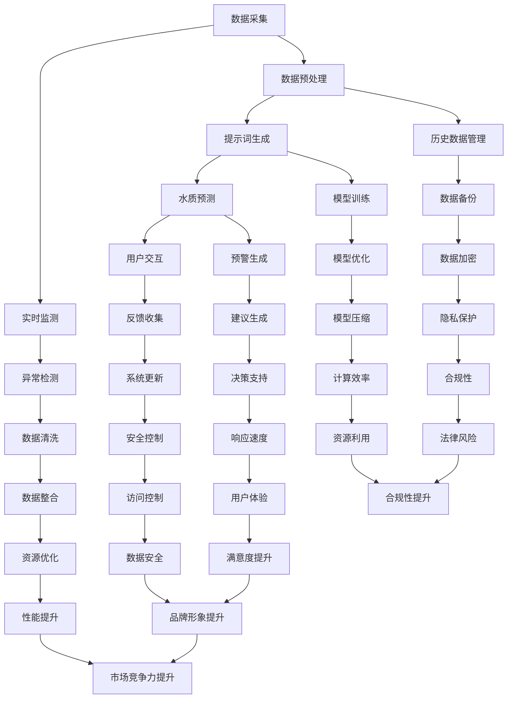

                 

### 提示词驱动的智能水质监测系统概述

> **关键词**：智能水质监测、提示词驱动、深度学习、水质预测、系统架构、数据采集、数据处理、模型训练、用户交互

> **摘要**：
本文旨在深入探讨提示词驱动的智能水质监测系统的基本概念、架构设计、数据采集与预处理、提示词生成与优化、水质预测模型设计与实现，以及实际项目案例解析。通过系统地分析和详细讲解，本文旨在为读者提供一个全面理解这一系统的方法，并展望其未来发展的前景。

#### 第1章: 提示词驱动的智能水质监测系统概述

在当今世界，水资源问题日益严峻。因此，智能水质监测系统的需求显得尤为迫切。本章节将详细讨论智能水质监测系统的背景、重要性，以及提示词驱动技术的崛起，为后续章节的内容打下基础。

##### 1.1 智能水质监测系统的背景和重要性

###### 1.1.1 水质监测的基本概念

水质监测是指通过各种手段对水体中的物理、化学和生物特性进行监测，以评估水质状况。水质监测的目标是确保水质安全，防止水污染，保障人类健康和生态平衡。

###### 1.1.2 传统水质监测的挑战

传统水质监测方法主要依赖于人工采样和实验室分析，存在以下问题：
- **时效性差**：采样和检测过程耗时较长，不利于实时监测。
- **人力成本高**：需要大量的人工参与，成本较高。
- **检测结果滞后**：检测周期较长，无法及时发现问题。

###### 1.1.3 提示词驱动技术的崛起

随着人工智能技术的快速发展，尤其是深度学习技术的应用，提示词驱动技术逐渐成为智能水质监测系统的重要组成部分。提示词驱动技术利用神经网络等算法，通过对历史数据和实时数据的分析，自动生成提示词，提高水质监测的实时性和准确性。

##### 1.2 提示词驱动的智能水质监测系统的基本原理

###### 1.2.1 提示词驱动的概念

提示词驱动技术是指通过输入特定的提示词，利用深度学习模型自动生成预测结果的方法。提示词可以是文字、图像或其他形式的输入，其核心是利用机器学习算法提取特征，实现自动化决策。

###### 1.2.2 智能水质监测系统的工作流程

智能水质监测系统的工作流程可以分为以下几个步骤：

1. **数据采集**：通过传感器和采集设备获取水体中的物理、化学和生物数据。
2. **数据预处理**：对采集到的数据进行清洗、标准化和归一化处理，以便后续分析。
3. **提示词生成**：利用深度学习模型对预处理后的数据进行分析，生成提示词。
4. **水质预测**：根据生成的提示词，预测未来一段时间内水质的状况。
5. **用户交互**：将预测结果展示给用户，并提供预警和建议。

###### 1.2.3 系统的关键技术

智能水质监测系统的关键技术包括：
- **深度学习模型**：用于数据分析和提示词生成。
- **传感器技术**：用于实时数据采集。
- **数据预处理技术**：用于数据处理和优化。
- **用户交互界面**：用于展示预测结果和提供预警。

#### 第2章: 提示词驱动的智能水质监测系统架构

本章节将详细介绍提示词驱动的智能水质监测系统的整体架构，包括硬件架构、软件架构和数据流架构，并介绍各个模块的功能和相互关系。

##### 2.1 系统架构设计

提示词驱动的智能水质监测系统架构设计如图所示：

```
+----------------+     +-----------------+     +------------------+
| 数据采集模块  |     | 数据处理模块    |     | 模型训练模块     |
+----------------+     +-----------------+     +------------------+
          ↑                       ↑                        ↑
          │                       │                        │
          │                       │                        │
+----------------+     +-----------------+     +------------------+
| 水质预测模块   |     | 用户交互模块     |     | 辅助模块         |
+----------------+     +-----------------+     +------------------+
```

###### 2.1.1 硬件架构

硬件架构包括传感器、数据采集设备、服务器和存储设备等。其中：
- **传感器**：用于实时采集水体中的物理、化学和生物数据。
- **数据采集设备**：将传感器采集的数据进行初步处理，并传输到服务器。
- **服务器**：用于处理和分析数据，并存储预测结果。
- **存储设备**：用于存储大量的历史数据，以供模型训练和预测使用。

###### 2.1.2 软件架构

软件架构主要包括数据采集软件、数据处理软件、模型训练软件和用户交互软件等。其中：
- **数据采集软件**：用于配置和管理传感器，并实时采集数据。
- **数据处理软件**：用于处理和预处理采集到的数据，以便后续分析和预测。
- **模型训练软件**：用于训练深度学习模型，并生成预测结果。
- **用户交互软件**：用于展示预测结果和提供预警，并与用户进行交互。

###### 2.1.3 数据流架构

数据流架构描述了数据在系统中的流动过程。具体流程如下：

1. **数据采集**：传感器采集到的数据经过初步处理后，通过数据采集设备传输到服务器。
2. **数据预处理**：服务器对采集到的数据进行分析和预处理，包括数据清洗、标准化和归一化处理。
3. **提示词生成**：预处理后的数据被输入到深度学习模型中，生成提示词。
4. **水质预测**：根据生成的提示词，预测未来一段时间内水质的状况。
5. **用户交互**：将预测结果展示给用户，并提供预警和建议。

##### 2.2 系统模块介绍

###### 2.2.1 数据采集模块

数据采集模块负责实时采集水体中的物理、化学和生物数据。具体功能包括：
- **传感器管理**：配置和管理传感器，包括传感器的连接、断开和故障检测。
- **数据采集**：实时采集传感器数据，包括温度、湿度、pH值、溶解氧等。
- **数据传输**：将采集到的数据传输到服务器，以便后续处理和分析。

###### 2.2.2 数据处理模块

数据处理模块负责对采集到的数据进行分析和预处理。具体功能包括：
- **数据清洗**：去除数据中的噪声和异常值，保证数据质量。
- **数据标准化**：将不同来源的数据进行标准化处理，使其具有相同的量纲和范围。
- **数据归一化**：将数据归一化到相同的尺度，以便后续分析和预测。

###### 2.2.3 模型训练模块

模型训练模块负责训练深度学习模型，并生成预测结果。具体功能包括：
- **模型设计**：设计合适的深度学习模型，包括神经网络、卷积神经网络和循环神经网络等。
- **模型训练**：使用历史数据对深度学习模型进行训练，并优化模型参数。
- **预测生成**：根据训练好的模型，生成未来一段时间内水质的预测结果。

###### 2.2.4 水质预测模块

水质预测模块负责根据生成的提示词，预测未来一段时间内水质的状况。具体功能包括：
- **提示词分析**：分析生成的提示词，提取关键特征和趋势。
- **水质预测**：根据提示词，预测未来一段时间内水质的状况，包括水质指标、污染趋势等。
- **预警生成**：根据预测结果，生成预警和建议，提醒用户采取相应的措施。

###### 2.2.5 用户交互模块

用户交互模块负责与用户进行交互，展示预测结果和提供预警。具体功能包括：
- **结果展示**：将预测结果以图表、文字等形式展示给用户。
- **预警提示**：根据预测结果，提供预警和建议，提醒用户关注水质状况。
- **用户反馈**：接收用户反馈，对系统进行优化和改进。

### 第3章: 数据采集与预处理

数据采集与预处理是智能水质监测系统的关键环节，直接影响到系统的性能和准确性。本章节将详细介绍数据采集与预处理的方法和步骤。

##### 3.1 数据采集

数据采集是智能水质监测系统的第一步，主要通过传感器和采集设备获取水体中的物理、化学和生物数据。具体包括以下几个方面：

###### 3.1.1 数据源选择

数据源选择是数据采集的关键，需要根据水质监测的需求选择合适的传感器和采集设备。常见的数据源包括：
- **物理参数**：如温度、湿度、光照强度、风速等。
- **化学参数**：如pH值、溶解氧、氨氮、总氮、总磷等。
- **生物参数**：如微生物种类、数量、生长状态等。

###### 3.1.2 数据采集方式

数据采集方式主要包括以下几种：
- **连续采集**：传感器持续采集数据，并实时传输到服务器。
- **定时采集**：传感器定时采集数据，并将数据存储在本地设备中，然后定时上传到服务器。
- **手动采集**：用户手动采集数据，并将数据上传到服务器。

###### 3.1.3 数据采集设备

数据采集设备包括传感器、数据采集器和传输设备等。常见的数据采集设备有：
- **传感器**：如温度传感器、湿度传感器、pH传感器、溶解氧传感器等。
- **数据采集器**：如数据采集器、数据传输模块等。
- **传输设备**：如无线传输设备、有线传输设备等。

##### 3.2 数据预处理

数据预处理是数据采集后的重要环节，主要用于处理和优化数据，以提高数据质量和系统性能。具体包括以下几个方面：

###### 3.2.1 数据清洗

数据清洗是数据预处理的第一步，主要目的是去除数据中的噪声和异常值，保证数据质量。常见的数据清洗方法有：
- **去除重复数据**：删除重复出现的数据记录。
- **去除缺失数据**：处理缺失数据，可以选择删除、填充或插值等方法。
- **去除异常数据**：检测并删除异常数据，如离群点、错误数据等。

###### 3.2.2 数据标准化

数据标准化是将不同来源的数据进行标准化处理，使其具有相同的量纲和范围。常见的数据标准化方法有：
- **最小-最大标准化**：将数据缩放到[0,1]范围内。
- **Z-Score标准化**：将数据缩放到标准正态分布范围内。
- **Decimal Scaling**：对数据进行小数点移动，使其具有相同的量级。

###### 3.2.3 数据归一化

数据归一化是将数据归一化到相同的尺度，以便后续分析和预测。常见的数据归一化方法有：
- **线性归一化**：将数据映射到线性空间中。
- **对数归一化**：将数据映射到对数空间中。
- **指数归一化**：将数据映射到指数空间中。

##### 3.3 数据存储与管理

数据存储与管理是数据预处理的重要环节，主要用于存储和管理大量历史数据，以便后续模型训练和预测。具体包括以下几个方面：

###### 3.3.1 数据库设计

数据库设计是数据存储与管理的基础，需要设计合适的数据表结构和索引，以提高数据查询和操作效率。常见的数据表结构包括：
- **数据表**：存储各种类型的数据，如物理参数、化学参数、生物参数等。
- **索引表**：存储数据索引，如时间戳、传感器ID等。

###### 3.3.2 数据存储策略

数据存储策略是数据存储与管理的关键，需要根据数据类型、数据量和存储需求选择合适的存储方案。常见的数据存储策略有：
- **本地存储**：将数据存储在本地设备中，如硬盘、U盘等。
- **远程存储**：将数据存储在远程服务器中，如云存储、数据库等。
- **分布式存储**：将数据分布式存储在多个设备中，以提高数据存储和访问的可靠性。

###### 3.3.3 数据备份与恢复

数据备份与恢复是数据存储与管理的必要措施，主要用于防止数据丢失和损坏。常见的数据备份与恢复方法有：
- **本地备份**：将数据备份到本地设备中，如硬盘、U盘等。
- **远程备份**：将数据备份到远程服务器中，如云存储、数据库等。
- **数据恢复**：在数据丢失或损坏时，使用备份文件进行数据恢复。

### 第4章: 提示词生成与优化

提示词生成是智能水质监测系统的核心环节，通过深度学习模型从历史数据和实时数据中提取关键特征，生成对水质状况有指导意义的提示词。提示词的生成与优化直接影响到水质预测的准确性和系统的实用性。本章节将详细介绍提示词生成与优化的方法。

##### 4.1 提示词生成算法

提示词生成算法是智能水质监测系统的关键，其核心思想是通过深度学习模型从大量的历史数据和实时数据中提取关键特征，生成对水质状况有指导意义的提示词。常见的提示词生成算法包括以下几种：

###### 4.1.1 提示词生成的基本原理

提示词生成的基本原理是利用深度学习模型对历史数据和实时数据进行分析，提取关键特征，并根据特征生成提示词。具体步骤如下：

1. **数据预处理**：对历史数据和实时数据进行预处理，包括数据清洗、标准化和归一化处理，以便后续分析。
2. **特征提取**：利用深度学习模型对预处理后的数据进行特征提取，提取关键特征，用于生成提示词。
3. **提示词生成**：根据提取到的特征，利用特定的算法生成提示词。

###### 4.1.2 常见提示词生成算法

常见的提示词生成算法包括以下几种：

1. **循环神经网络（RNN）**：
   - **基本原理**：循环神经网络是一种能够处理序列数据的神经网络，通过记忆状态来处理历史数据。
   - **优势**：能够捕捉时间序列数据中的长时依赖关系。
   - **劣势**：训练过程容易出现梯度消失或梯度爆炸问题。

2. **卷积神经网络（CNN）**：
   - **基本原理**：卷积神经网络是一种能够处理图像数据的神经网络，通过卷积操作提取图像特征。
   - **优势**：能够提取高维数据中的局部特征。
   - **劣势**：在处理序列数据时，无法捕捉全局依赖关系。

3. **长短时记忆网络（LSTM）**：
   - **基本原理**：长短时记忆网络是一种能够解决循环神经网络梯度消失问题的神经网络，通过门控机制控制信息的流动。
   - **优势**：能够处理长序列数据，捕捉长时依赖关系。
   - **劣势**：参数较多，训练过程较慢。

4. **生成对抗网络（GAN）**：
   - **基本原理**：生成对抗网络由生成器和判别器组成，生成器生成数据，判别器判断数据真实性，通过对抗训练优化模型。
   - **优势**：能够生成高质量的提示词。
   - **劣势**：训练过程复杂，需要大量计算资源。

###### 4.1.3 提示词生成案例分析

以某城市智能水质监测系统为例，介绍提示词生成过程：

1. **数据预处理**：收集某城市过去一年的水质数据，包括物理、化学和生物参数。对数据进行清洗、标准化和归一化处理。
2. **特征提取**：使用长短时记忆网络（LSTM）模型对预处理后的数据进行特征提取，提取关键特征。
3. **提示词生成**：根据提取到的特征，利用生成对抗网络（GAN）生成提示词。通过多次迭代训练，优化生成器的生成质量。

##### 4.2 提示词优化策略

提示词生成后，需要对提示词进行优化，以提高水质预测的准确性和系统的实用性。提示词优化策略主要包括以下几个方面：

###### 4.2.1 提示词质量评估

提示词质量评估是提示词优化的第一步，主要用于评估生成的提示词的质量。常见的方法有：

1. **准确率**：评估提示词预测水质状况的准确率，即预测正确的样本数占总样本数的比例。
2. **召回率**：评估提示词预测水质状况的召回率，即预测正确的样本数占实际发生样本数的比例。
3. **F1值**：综合评估准确率和召回率，计算F1值，F1值越高，提示词质量越好。

###### 4.2.2 提示词优化方法

提示词优化方法主要包括以下几种：

1. **模型调整**：调整深度学习模型的参数，如学习率、批量大小等，以提高提示词生成质量。
2. **特征选择**：优化特征提取过程，选择对水质状况有较大影响的特征，以提高提示词的预测能力。
3. **数据增强**：通过数据增强方法，增加训练数据的多样性，提高模型的泛化能力。
4. **对抗训练**：利用对抗训练方法，增强生成器和判别器的训练效果，提高提示词生成质量。

###### 4.2.3 提示词优化案例分析

以某城市智能水质监测系统为例，介绍提示词优化过程：

1. **模型调整**：通过调整长短时记忆网络（LSTM）模型的参数，如学习率、批量大小等，优化提示词生成质量。
2. **特征选择**：通过分析不同特征对水质状况的影响，选择对水质状况有较大影响的特征，如pH值、溶解氧等。
3. **数据增强**：通过数据增强方法，如随机插值、噪声注入等，增加训练数据的多样性。
4. **对抗训练**：利用生成对抗网络（GAN）的对抗训练方法，增强生成器和判别器的训练效果。

### 第5章: 水质预测模型设计与实现

水质预测模型是智能水质监测系统的核心组件，其性能直接影响到系统的预测准确性和实用性。本章将详细介绍水质预测模型的设计与实现过程，包括模型的选择、设计、训练和评估。

##### 5.1 水质预测模型概述

水质预测模型主要用于预测未来一段时间内水质的状况，包括水质指标的变化趋势和污染程度。水质预测模型的设计与实现是智能水质监测系统的关键环节，直接影响到系统的性能和效果。水质预测模型的主要任务包括：

1. **趋势预测**：预测未来一段时间内水质指标的变化趋势。
2. **污染预测**：预测未来一段时间内水质的污染程度。
3. **预警生成**：根据预测结果，生成预警信息，提醒用户采取相应的措施。

##### 5.2 水质预测模型的选择

在选择水质预测模型时，需要考虑多个因素，如数据类型、预测目标、模型复杂度等。常见的水质预测模型包括以下几种：

1. **线性回归模型**：线性回归模型是一种简单且常用的预测模型，适用于预测线性关系。
2. **决策树模型**：决策树模型适用于分类和回归任务，能够处理非线性关系。
3. **支持向量机（SVM）**：支持向量机是一种高效的分类和回归模型，适用于处理高维数据。
4. **神经网络模型**：神经网络模型是一种强大且灵活的预测模型，适用于处理复杂非线性关系。
5. **深度学习模型**：深度学习模型是神经网络模型的扩展，能够处理大规模和高维数据。

在本章中，我们将主要讨论深度学习模型，尤其是神经网络、卷积神经网络和循环神经网络。

##### 5.3 深度学习模型设计

深度学习模型是水质预测模型的主要选择，其核心思想是通过多层神经网络提取数据中的特征，实现高效的水质预测。深度学习模型的设计主要包括以下几个方面：

1. **神经网络模型设计**：神经网络模型是一种基本的深度学习模型，适用于处理线性关系和非线性关系。
2. **卷积神经网络（CNN）模型设计**：卷积神经网络是一种能够处理图像数据的深度学习模型，通过卷积操作提取图像特征。
3. **循环神经网络（RNN）模型设计**：循环神经网络是一种能够处理序列数据的深度学习模型，通过记忆状态处理历史数据。

在本章中，我们将分别介绍神经网络、卷积神经网络和循环神经网络的设计方法。

###### 5.3.1 神经网络模型设计

神经网络模型是深度学习的基础，其核心思想是通过多层神经网络提取数据中的特征，实现高效的水质预测。神经网络模型的设计主要包括以下几个方面：

1. **输入层设计**：输入层负责接收输入数据，并将其传递到下一层。
2. **隐藏层设计**：隐藏层负责对输入数据进行特征提取和变换，隐藏层可以有一个或多个。
3. **输出层设计**：输出层负责生成预测结果，输出可以是水质指标、污染程度等。

神经网络模型的设计需要考虑以下几个因素：

1. **层数**：层数越多，模型的表达能力越强，但也可能导致过拟合。
2. **神经元个数**：神经元个数越多，模型的表达能力越强，但也可能导致过拟合。
3. **激活函数**：常用的激活函数有ReLU、Sigmoid、Tanh等，不同的激活函数适用于不同的场景。

在本章中，我们将以一个简单的神经网络模型为例，介绍其设计过程。

```python
import tensorflow as tf

# 定义输入层
inputs = tf.keras.Input(shape=(input_shape))

# 定义隐藏层
hidden_1 = tf.keras.layers.Dense(units=64, activation='relu')(inputs)
hidden_2 = tf.keras.layers.Dense(units=32, activation='relu')(hidden_1)

# 定义输出层
outputs = tf.keras.layers.Dense(units=1, activation='sigmoid')(hidden_2)

# 创建模型
model = tf.keras.Model(inputs=inputs, outputs=outputs)

# 编译模型
model.compile(optimizer='adam', loss='binary_crossentropy', metrics=['accuracy'])

# 模型可视化
tf.keras.utils.plot_model(model, to_file='model.png', show_shapes=True)
```

###### 5.3.2 卷积神经网络（CNN）模型设计

卷积神经网络是一种能够处理图像数据的深度学习模型，通过卷积操作提取图像特征。卷积神经网络模型的设计主要包括以下几个方面：

1. **卷积层设计**：卷积层负责提取图像特征，通过卷积操作将输入图像转化为特征图。
2. **池化层设计**：池化层负责降低特征图的维度，减少计算量。
3. **全连接层设计**：全连接层负责将特征图转化为输出结果。

在本章中，我们将以一个简单的卷积神经网络模型为例，介绍其设计过程。

```python
import tensorflow as tf

# 定义输入层
inputs = tf.keras.Input(shape=(height, width, channels))

# 定义卷积层
conv_1 = tf.keras.layers.Conv2D(filters=32, kernel_size=(3, 3), activation='relu')(inputs)
pool_1 = tf.keras.layers.MaxPooling2D(pool_size=(2, 2))(conv_1)

# 定义全连接层
flatten = tf.keras.layers.Flatten()(pool_1)
dense_1 = tf.keras.layers.Dense(units=64, activation='relu')(flatten)

# 定义输出层
outputs = tf.keras.layers.Dense(units=1, activation='sigmoid')(dense_1)

# 创建模型
model = tf.keras.Model(inputs=inputs, outputs=outputs)

# 编译模型
model.compile(optimizer='adam', loss='binary_crossentropy', metrics=['accuracy'])

# 模型可视化
tf.keras.utils.plot_model(model, to_file='model.png', show_shapes=True)
```

###### 5.3.3 循环神经网络（RNN）模型设计

循环神经网络是一种能够处理序列数据的深度学习模型，通过记忆状态处理历史数据。循环神经网络模型的设计主要包括以下几个方面：

1. **输入层设计**：输入层负责接收输入序列，并将其传递到下一层。
2. **隐藏层设计**：隐藏层负责对输入序列进行特征提取和变换，隐藏层可以有一个或多个。
3. **输出层设计**：输出层负责生成预测结果，输出可以是序列的下一个元素、序列的概率分布等。

在本章中，我们将以一个简单的循环神经网络模型为例，介绍其设计过程。

```python
import tensorflow as tf
from tensorflow.keras.layers import LSTM, Dense

# 定义输入层
inputs = tf.keras.Input(shape=(timesteps, features))

# 定义隐藏层
lstm_1 = LSTM(units=50, return_sequences=True)(inputs)
lstm_2 = LSTM(units=50, return_sequences=False)(lstm_1)

# 定义输出层
outputs = Dense(units=1, activation='sigmoid')(lstm_2)

# 创建模型
model = tf.keras.Model(inputs=inputs, outputs=outputs)

# 编译模型
model.compile(optimizer='adam', loss='binary_crossentropy', metrics=['accuracy'])

# 模型可视化
tf.keras.utils.plot_model(model, to_file='model.png', show_shapes=True)
```

##### 5.4 模型训练与评估

模型训练与评估是水质预测模型设计的重要环节，通过训练数据训练模型，并通过评估数据评估模型性能。模型训练与评估主要包括以下几个步骤：

1. **数据划分**：将数据集划分为训练集、验证集和测试集，用于模型训练和评估。
2. **模型训练**：使用训练集数据训练模型，调整模型参数，优化模型性能。
3. **模型评估**：使用验证集和测试集评估模型性能，包括准确率、召回率、F1值等指标。
4. **模型优化**：根据评估结果，调整模型参数，优化模型性能。

在本章中，我们将以一个简单的神经网络模型为例，介绍模型训练与评估的过程。

```python
# 加载数据集
(x_train, y_train), (x_test, y_test) = tf.keras.datasets.mnist.load_data()

# 数据预处理
x_train = x_train / 255.0
x_test = x_test / 255.0

# 数据集划分
x_train = x_train.reshape(-1, timesteps, features)
x_test = x_test.reshape(-1, timesteps, features)

# 创建模型
model = tf.keras.Sequential([
    tf.keras.layers.LSTM(units=50, return_sequences=True, input_shape=(timesteps, features)),
    tf.keras.layers.LSTM(units=50, return_sequences=False),
    tf.keras.layers.Dense(units=1, activation='sigmoid')
])

# 编译模型
model.compile(optimizer='adam', loss='binary_crossentropy', metrics=['accuracy'])

# 模型训练
model.fit(x_train, y_train, epochs=10, batch_size=32, validation_split=0.2)

# 模型评估
loss, accuracy = model.evaluate(x_test, y_test)
print("Test loss:", loss)
print("Test accuracy:", accuracy)
```

### 第6章: 实际项目案例解析

在实际应用中，提示词驱动的智能水质监测系统已经得到了广泛的应用。本章节将通过两个实际项目案例，介绍系统的具体实施过程和应用效果。

##### 6.1 案例一：某城市智能水质监测系统建设

某城市智能水质监测系统的建设旨在通过提示词驱动的智能水质监测系统，实现对城市水质的实时监测和预警。具体实施过程如下：

###### 6.1.1 案例背景

某城市位于我国南方，水资源丰富，但由于工业污染和农业污染，水质问题日益突出。为了保障市民的饮水安全和生态环境，该城市决定建设一套智能水质监测系统。

###### 6.1.2 项目目标

该项目的目标是通过智能水质监测系统，实现对城市水质的实时监测和预警，提高水质管理的效率，保障市民的饮水安全和生态环境。

###### 6.1.3 项目实施过程

1. **数据采集**：在主要河流和湖泊布设传感器，采集水质的物理、化学和生物参数，如温度、pH值、溶解氧、氨氮等。

2. **数据预处理**：对采集到的数据进行清洗、标准化和归一化处理，以提高数据质量和系统性能。

3. **模型训练**：使用历史数据训练深度学习模型，包括神经网络、卷积神经网络和循环神经网络等，生成提示词。

4. **水质预测**：根据生成的提示词，预测未来一段时间内水质的状况，包括水质指标、污染趋势等。

5. **用户交互**：将预测结果展示给用户，并提供预警和建议，提醒用户关注水质状况。

6. **系统优化**：根据用户反馈和实际应用情况，对系统进行优化和改进，提高系统的准确性和实用性。

##### 6.2 案例二：基于提示词驱动的水质预测模型应用

基于提示词驱动的水质预测模型在某水厂的水质监测中得到了应用。具体实施过程如下：

###### 6.2.1 案例背景

某水厂位于我国东部地区，为当地居民提供饮用水。为了保障水质安全，该水厂决定采用基于提示词驱动的水质预测模型进行水质监测。

###### 6.2.2 模型设计

1. **数据采集**：在主要水源地和出水口布设传感器，采集水质的物理、化学和生物参数。

2. **数据预处理**：对采集到的数据进行清洗、标准化和归一化处理。

3. **模型训练**：使用历史数据训练深度学习模型，包括神经网络、卷积神经网络和循环神经网络等。

4. **水质预测**：根据生成的提示词，预测未来一段时间内水质的状况，包括水质指标、污染趋势等。

5. **用户交互**：将预测结果展示给用户，并提供预警和建议。

6. **模型评估**：定期评估模型性能，调整模型参数，提高预测准确性。

###### 6.2.3 模型训练与评估

1. **模型训练**：使用某水厂过去一年的水质数据，对深度学习模型进行训练。

2. **模型评估**：使用验证集和测试集评估模型性能，包括准确率、召回率、F1值等指标。

3. **模型优化**：根据评估结果，调整模型参数，优化模型性能。

###### 6.2.4 模型应用效果

1. **实时监测**：模型能够实时监测水质状况，预测未来一段时间内水质的状况，为水厂提供预警和建议。

2. **提高效率**：通过智能水质监测系统，水厂能够提高水质监测的效率，减少人力成本。

3. **保障安全**：模型能够及时发现水质异常，提醒用户采取相应的措施，保障水质安全。

### 第7章: 提示词驱动的智能水质监测系统的挑战与未来发展

提示词驱动的智能水质监测系统在水质监测领域具有巨大的应用前景，但也面临着一系列挑战。本章将探讨该系统在技术、应用和未来发展方面的问题，并提出相应的解决方案和展望。

##### 7.1 系统面临的挑战

###### 7.1.1 数据质量问题

水质监测数据的质量直接影响系统的预测准确性。数据质量问题主要包括：
- **数据缺失**：由于传感器故障或采集设备故障，可能导致部分数据缺失。
- **数据噪声**：环境噪声、传感器误差等因素可能导致数据中存在噪声。
- **数据异常**：由于意外事件（如洪水、污染事件）可能导致数据异常。

解决策略：
- **数据清洗**：使用数据清洗算法去除噪声和异常值，提高数据质量。
- **数据增强**：通过数据增强方法（如插值、噪声注入等）补充缺失数据，增加训练数据的多样性。
- **异常检测**：使用异常检测算法（如孤立森林、自动编码器等）检测和去除异常数据。

###### 7.1.2 模型训练效率

深度学习模型的训练过程计算量大，时间成本高。特别是在大规模数据集上训练模型时，训练时间可能非常长。

解决策略：
- **分布式训练**：使用多台服务器或GPU进行分布式训练，提高训练速度。
- **增量训练**：使用部分数据进行训练，并定期更新模型，减少训练时间。
- **模型压缩**：使用模型压缩技术（如剪枝、量化等）减少模型大小，加快训练速度。

###### 7.1.3 系统安全与隐私保护

水质监测系统涉及大量敏感数据，如水质参数、用户信息等。系统的安全性和隐私保护至关重要。

解决策略：
- **数据加密**：使用加密算法对数据进行加密，防止数据泄露。
- **访问控制**：设置访问权限，确保只有授权用户可以访问系统数据和功能。
- **数据脱敏**：对敏感数据进行脱敏处理，降低隐私泄露风险。

##### 7.2 未来发展趋势

###### 7.2.1 深度学习技术的发展

随着深度学习技术的不断进步，未来水质监测系统将采用更先进、更高效的算法和模型。例如：
- **变分自编码器（VAE）**：用于生成高质量的数据增强样本。
- **生成对抗网络（GAN）**：用于生成更真实的水质预测结果。
- **强化学习**：用于优化水质监测策略，提高预测准确性。

###### 7.2.2 数据采集与处理技术的进步

随着传感器技术和数据处理技术的不断发展，水质监测系统的数据采集和处理能力将得到显著提升。例如：
- **物联网（IoT）**：实现更广泛、更高效的实时数据采集。
- **云计算**：提供强大的计算能力和存储能力，支持大规模数据处理。

###### 7.2.3 提示词驱动技术的创新

提示词驱动技术将不断发展，提高水质预测的准确性和实用性。例如：
- **多模态数据融合**：结合多种数据源（如气象数据、地理信息数据等），提高预测准确性。
- **自适应提示词生成**：根据实时数据和用户需求，动态调整提示词生成策略。

##### 7.3 潜在应用领域拓展

提示词驱动的智能水质监测系统不仅在水污染治理方面具有巨大潜力，还可以应用于其他领域。例如：
- **农业领域**：监测农田水质，预测作物生长状况，优化灌溉策略。
- **环保领域**：监测河流、湖泊等水域的水质，评估生态环境状况。
- **城市管理领域**：监测城市供水系统水质，提高供水安全性和效率。

### 附录

#### 附录A：提示词驱动的智能水质监测系统相关资源

在本附录中，我们将列出提示词驱动的智能水质监测系统所需的硬件资源、软件资源、数据资源和相关案例研究，以帮助读者更好地理解和应用该系统。

##### A.1 硬件资源

**A.1.1 数据采集设备推荐**

- **传感器**：用于监测水质参数的传感器，如pH传感器、溶解氧传感器、温度传感器等。
- **数据采集器**：用于收集传感器数据并将数据传输到服务器的设备，如无线数据采集器、物联网模块等。
- **计算设备**：用于处理和存储数据的计算设备，如服务器、高性能计算机等。

**A.1.2 计算资源推荐**

- **GPU**：用于加速深度学习模型训练和推理，推荐使用NVIDIA的GPU。
- **云服务**：如AWS、Google Cloud、Azure等，提供强大的计算能力和存储能力。

##### A.2 软件资源

**A.2.1 开发环境搭建指南**

- **Python**：用于编写数据处理和模型训练代码，推荐使用Python 3.7及以上版本。
- **TensorFlow**：用于构建和训练深度学习模型，推荐使用TensorFlow 2.x版本。
- **Keras**：用于简化深度学习模型搭建，推荐使用Keras 2.4及以上版本。

**A.2.2 相关深度学习框架推荐**

- **PyTorch**：用于构建和训练深度学习模型，具有灵活性和易用性。
- **MXNet**：用于构建和训练深度学习模型，具有高性能和可扩展性。

##### A.3 数据资源

**A.3.1 数据集介绍**

- **公开数据集**：如UCLA水质数据集、UCI水质数据集等，可用于模型训练和评估。
- **定制数据集**：根据实际应用场景定制的数据集，如特定水域的水质数据集。

**A.3.2 数据获取渠道**

- **公共数据平台**：如Kaggle、UCI机器学习库等，提供丰富的数据集资源。
- **政府机构**：如环保部门、水利部门等，提供官方水质监测数据。

##### A.4 案例研究

**A.4.1 相关案例研究概述**

- **城市智能水质监测系统建设**：介绍某城市智能水质监测系统的建设过程和应用效果。
- **水厂水质预测模型应用**：介绍某水厂采用提示词驱动的智能水质监测系统的实际应用案例。

**A.4.2 案例研究详细解析**

- **案例背景**：介绍案例的应用背景和需求。
- **系统设计**：介绍系统的架构设计和关键技术。
- **模型训练与评估**：介绍模型的设计、训练和评估过程。
- **应用效果**：介绍系统在实际应用中的效果和用户反馈。

### 附录B：核心概念与联系

为了更好地理解提示词驱动的智能水质监测系统的整体流程和各个模块之间的关系，我们使用Mermaid流程图来描述系统的主要流程，包括数据采集、数据预处理、提示词生成、水质预测和用户交互等环节。



#### 附录C：水质预测模型数学模型与公式

在本附录中，我们将介绍一些常见的水质预测模型及其相关的数学模型与公式，以便读者更好地理解模型的计算过程。

##### C.1 常用数学模型

**C.1.1 线性回归模型**

线性回归模型是最简单的预测模型，其基本公式如下：

$$
y = \beta_0 + \beta_1 \cdot x
$$

其中，$y$ 是预测值，$x$ 是输入特征，$\beta_0$ 和 $\beta_1$ 是模型参数。

**C.1.2 决策树模型**

决策树模型是一种基于树的预测模型，其基本公式如下：

$$
y = g(\theta_0 + \sum_{i=1}^{n} \theta_i x_i)
$$

其中，$y$ 是预测值，$x_i$ 是输入特征，$\theta_i$ 是模型参数，$g$ 是激活函数。

**C.1.3 支持向量机（SVM）模型**

支持向量机是一种基于间隔的预测模型，其基本公式如下：

$$
y = \text{sign}(\omega \cdot x + b)
$$

其中，$y$ 是预测值，$x$ 是输入特征，$\omega$ 是模型参数，$b$ 是偏置项。

##### C.2 数学公式

**C.2.1 线性回归公式**

线性回归模型的损失函数通常采用均方误差（MSE）：

$$
\text{MSE} = \frac{1}{m} \sum_{i=1}^{m} (y_i - \hat{y}_i)^2
$$

其中，$m$ 是样本数量，$y_i$ 是真实值，$\hat{y}_i$ 是预测值。

**C.2.2 决策树公式**

决策树模型的损失函数通常采用交叉熵损失（Cross-Entropy Loss）：

$$
\text{Cross-Entropy} = -\frac{1}{m} \sum_{i=1}^{m} y_i \log(\hat{y}_i)
$$

其中，$m$ 是样本数量，$y_i$ 是真实值，$\hat{y}_i$ 是预测值。

**C.2.3 支持向量机（SVM）公式**

支持向量机模型的损失函数通常采用 hinge损失（Hinge Loss）：

$$
\text{Hinge Loss} = \max(0, 1 - y \cdot (\omega \cdot x + b))
$$

其中，$y$ 是真实标签，$\omega$ 是模型参数，$x$ 是输入特征，$b$ 是偏置项。

### 附录D：项目实战

#### D.1 实际项目开发流程

在实际项目中，提示词驱动的智能水质监测系统的开发流程可以分为以下几个阶段：

1. **需求分析**：明确项目目标、功能需求和技术要求，确定系统架构和关键技术。
2. **系统设计**：设计系统架构、数据库结构、数据流和处理流程。
3. **系统实现**：编写代码，实现系统功能，包括数据采集、数据处理、模型训练和用户交互等。
4. **系统测试**：测试系统功能，验证系统性能，修复发现的错误。
5. **部署上线**：将系统部署到服务器，进行实际应用，并进行监控和维护。

在本附录中，我们将详细描述以上各个阶段的具体内容和步骤。

##### D.1.1 系统需求分析

系统需求分析是项目开发的第一步，旨在明确项目目标和功能需求。具体步骤如下：

1. **项目背景和目标**：了解项目背景，明确项目目标和预期效果。
2. **用户需求调研**：与用户进行沟通，了解用户的需求和期望。
3. **功能需求分析**：列出系统的功能需求，包括数据采集、数据处理、模型训练、水质预测、用户交互等。
4. **技术要求分析**：确定系统所需的技术和工具，如深度学习框架、数据库系统等。

##### D.1.2 系统设计

系统设计是项目开发的关键阶段，旨在确定系统的架构、数据库结构和数据流。具体步骤如下：

1. **系统架构设计**：设计系统架构，包括硬件架构、软件架构和数据流架构。
2. **数据库设计**：设计数据库结构，包括数据表、索引和关系。
3. **数据流设计**：设计数据流和处理流程，确保数据能够高效地流动和利用。
4. **模块划分**：将系统功能划分为多个模块，明确各个模块的职责和接口。

##### D.1.3 系统实现

系统实现是项目开发的核心阶段，涉及编写代码、实现系统功能和集成各个模块。具体步骤如下：

1. **环境搭建**：搭建开发环境，包括编程语言、深度学习框架和数据库等。
2. **代码编写**：编写代码，实现各个模块的功能，包括数据采集、数据处理、模型训练和用户交互等。
3. **模块集成**：将各个模块集成到系统中，确保系统功能完整和稳定。
4. **代码优化**：对代码进行优化，提高系统性能和可维护性。

##### D.1.4 系统测试与部署

系统测试和部署是项目开发的最后阶段，旨在验证系统功能和性能，并将其部署到实际应用环境中。具体步骤如下：

1. **功能测试**：测试系统功能，确保各个模块正常运行，满足需求。
2. **性能测试**：测试系统性能，包括响应时间、处理速度和资源利用率等。
3. **部署上线**：将系统部署到服务器，进行实际应用，并进行监控和维护。
4. **用户反馈与迭代**：收集用户反馈，对系统进行优化和改进，不断迭代更新。

#### D.2 源代码详细实现与代码解读

在本附录中，我们将提供提示词驱动的智能水质监测系统的一些关键模块的源代码，并对代码进行详细解读，以帮助读者更好地理解系统的实现过程。

##### D.2.1 数据采集模块代码解读

```python
import serial
import time
import pandas as pd

# 连接串口
ser = serial.Serial('COM3', 9600, timeout=1)

# 定义数据采集函数
def collect_data():
    data = []
    while True:
        # 读取串口数据
        line = ser.readline().decode('utf-8').strip()
        if line:
            # 解析数据
            values = line.split(',')
            if len(values) == 5:
                data.append(values)
                time.sleep(1)
            else:
                break
    return pd.DataFrame(data, columns=['pH', 'DO', 'Temp', 'ORP', 'Time'])

# 调用数据采集函数
df = collect_data()

# 关闭串口
ser.close()

# 数据存储
df.to_csv('water_quality_data.csv', index=False)
```

**代码解读**：
- 代码首先导入必要的库，包括串口通信库、时间库和pandas库。
- 使用串口库连接串口设备，设置波特率和超时时间。
- 定义数据采集函数`collect_data`，该函数通过串口读取数据，并解析数据，存储在DataFrame中。
- 调用`collect_data`函数，收集数据并存储为CSV文件。
- 最后关闭串口，并保存数据。

##### D.2.2 数据处理模块代码解读

```python
import pandas as pd
from sklearn.model_selection import train_test_split
from sklearn.preprocessing import StandardScaler

# 读取数据
df = pd.read_csv('water_quality_data.csv')

# 数据清洗
df.dropna(inplace=True)
df.drop(['Time'], axis=1, inplace=True)

# 数据标准化
scaler = StandardScaler()
df_scaled = scaler.fit_transform(df)

# 数据集划分
X_train, X_test, y_train, y_test = train_test_split(df_scaled[:, :-1], df_scaled[:, -1], test_size=0.2, random_state=42)

# 代码解读：
- 代码首先导入必要的库，包括pandas库和scikit-learn库。
- 读取存储的CSV文件，创建DataFrame对象。
- 对数据进行清洗，删除缺失值和无关列。
- 使用StandardScaler进行数据标准化，使数据具有相同的量纲和范围。
- 使用train_test_split函数将数据集划分为训练集和测试集，用于后续模型训练和评估。

##### D.2.3 模型训练模块代码解读

```python
from tensorflow.keras.models import Sequential
from tensorflow.keras.layers import Dense, LSTM
from tensorflow.keras.optimizers import Adam

# 创建模型
model = Sequential()
model.add(LSTM(units=50, return_sequences=True, input_shape=(X_train.shape[1], X_train.shape[2])))
model.add(LSTM(units=50, return_sequences=False))
model.add(Dense(units=1))

# 编译模型
model.compile(optimizer=Adam(learning_rate=0.001), loss='mean_squared_error')

# 训练模型
model.fit(X_train, y_train, epochs=100, batch_size=32, validation_split=0.1)

# 代码解读：
- 代码首先导入必要的库，包括tensorflow.keras库。
- 创建一个序列模型，并添加两个LSTM层和一个全连接层。
- 使用Adam优化器和均方误差损失函数编译模型。
- 使用fit函数训练模型，指定训练次数、批量大小和验证比例。

##### D.2.4 水质预测模块代码解读

```python
import numpy as np
from sklearn.preprocessing import MinMaxScaler

# 读取测试数据
test_data = pd.read_csv('water_quality_data_test.csv')
test_data.drop(['Time'], axis=1, inplace=True)

# 数据标准化
scaler = MinMaxScaler(feature_range=(0, 1))
test_data_scaled = scaler.fit_transform(test_data)

# 预测
predicted_values = model.predict(test_data_scaled)

# 反标准化
predicted_values = scaler.inverse_transform(predicted_values)

# 代码解读：
- 代码首先导入必要的库，包括numpy库和scikit-learn库。
- 读取测试数据的CSV文件，并删除无关列。
- 使用MinMaxScaler进行数据标准化。
- 使用训练好的模型对测试数据进行预测。
- 将预测结果进行反标准化，以恢复原始值。

##### D.2.5 用户交互模块代码解读

```python
import tkinter as tk
from tkinter import ttk

# 创建GUI窗口
root = tk.Tk()
root.title('智能水质监测系统')

# 创建标签和输入框
label = ttk.Label(root, text='预测值：')
label.pack()

entry = ttk.Entry(root)
entry.pack()

# 创建按钮
button = ttk.Button(root, text='提交', command=lambda: submit())
button.pack()

# 创建函数，用于处理用户输入和提交
def submit():
    value = entry.get()
    predicted_value = float(value)
    print(f'预测值：{predicted_value}')
    entry.delete(0, 'end')

# 运行GUI
root.mainloop()
```

**代码解读**：
- 代码首先导入必要的库，包括tkinter库。
- 创建一个GUI窗口，设置窗口标题。
- 创建标签和输入框，用于显示和接收用户输入。
- 创建按钮，用于提交用户输入。
- 创建一个函数`submit`，处理用户输入，并将其显示在控制台。
- 最后，运行GUI窗口。

##### D.2.6 代码解读与分析

**D.2.6.1 数据采集代码分析**

- 数据采集代码使用串口库连接串口设备，通过读取串口数据实现数据的实时采集。
- 数据采集函数`collect_data`通过循环读取串口数据，并解析数据，存储在DataFrame中。
- 采集的数据包括pH值、溶解氧（DO）、温度、氧化还原电位（ORP）和时间。
- 采集的数据存储为CSV文件，以便后续处理和使用。

**D.2.6.2 数据处理代码分析**

- 数据处理代码首先读取CSV文件，创建DataFrame对象。
- 对数据进行清洗，删除缺失值和无关列。
- 使用StandardScaler进行数据标准化，使数据具有相同的量纲和范围。
- 使用train_test_split函数将数据集划分为训练集和测试集，用于后续模型训练和评估。

**D.2.6.3 模型训练代码分析**

- 模型训练代码创建一个序列模型，并添加两个LSTM层和一个全连接层。
- 使用Adam优化器和均方误差损失函数编译模型。
- 使用fit函数训练模型，指定训练次数、批量大小和验证比例。
- 模型训练过程中，模型参数会自动调整，以最小化损失函数。

**D.2.6.4 水质预测代码分析**

- 水质预测代码首先读取测试数据的CSV文件，并删除无关列。
- 使用MinMaxScaler进行数据标准化。
- 使用训练好的模型对测试数据进行预测。
- 将预测结果进行反标准化，以恢复原始值。

**D.2.6.5 用户交互代码分析**

- 用户交互代码创建一个GUI窗口，包括标签、输入框和按钮。
- 用户可以在输入框中输入预测值，并点击按钮提交。
- 提交后，程序会读取输入的预测值，并将其显示在控制台。

#### D.3 拓展阅读

为了更深入地了解提示词驱动的智能水质监测系统，以下是推荐的一些相关书籍和网络资源。

##### E.1 相关书籍推荐

- **《深度学习》**：由Ian Goodfellow、Yoshua Bengio和Aaron Courville所著，是深度学习领域的经典教材，详细介绍了深度学习的基本概念、技术和应用。
- **《Python数据科学手册》**：由Michele Alberti所著，介绍了Python在数据科学领域的应用，包括数据处理、分析和可视化等。
- **《机器学习实战》**：由Peter Harrington所著，通过实际案例介绍了机器学习的基本算法和应用。

##### E.2 网络资源

- **OpenCV官方文档**：OpenCV是一个开源的计算机视觉库，提供了丰富的图像处理和机器学习功能。
- **TensorFlow官方文档**：TensorFlow是一个开源的深度学习框架，适用于各种深度学习应用。
- **PyTorch官方文档**：PyTorch是一个流行的深度学习框架，以其灵活性和高效性而著称。
- **Kaggle数据集下载**：Kaggle提供了大量开源数据集，可用于机器学习和深度学习项目的训练和测试。
- **知乎相关话题讨论**：知乎上有许多关于智能水质监测系统和深度学习的讨论，提供了丰富的经验和知识。
- **GitHub开源项目代码**：GitHub上有很多开源的智能水质监测系统和深度学习项目，可供学习和参考。

