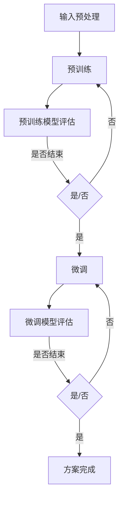

                 

# 《搜索推荐系统的冷启动：大模型创新方案》

> **关键词：** 搜索推荐系统、冷启动、大模型、人工智能、创新方案

> **摘要：** 本文将深入探讨搜索推荐系统的冷启动问题，特别是大模型在解决冷启动挑战中的应用。我们将从冷启动的背景与基础出发，详细解释大模型的原理与架构，并设计一套创新方案，实现大模型在搜索推荐系统冷启动中的高效应用。最后，通过案例分析与实践指导，为行业提供切实可行的解决方案和实施建议。

### 《搜索推荐系统的冷启动：大模型创新方案》目录大纲

#### 第一部分：冷启动背景与基础

##### 第1章：冷启动概述

- **1.1 冷启动问题解析**
  - **1.1.1 冷启动定义与影响**
  - **1.1.2 冷启动的分类**

- **1.2 搜索推荐系统的基本架构**
  - **1.2.1 搜索引擎架构**
  - **1.2.2 推荐系统架构**

- **1.3 冷启动的挑战**
  - **1.3.1 数据稀缺性**
  - **1.3.2 用户行为分析难度**
  - **1.3.3 模型适应性问题**

- **1.4 大模型在冷启动中的应用潜力**
  - **1.4.1 大模型的基本原理**
  - **1.4.2 大模型在冷启动中的优势**

#### 第二部分：大模型技术详解

##### 第2章：大模型原理与架构

- **2.1 大模型的基本原理**
  - **2.1.1 大模型的定义**
  - **2.1.2 大模型的核心组成部分**

- **2.2 大模型的架构设计**
  - **2.2.1 网络结构设计**
  - **2.2.2 注意力机制与多头自注意力**

- **2.3 大模型的训练与优化**
  - **2.3.1 预训练与微调**
  - **2.3.2 大模型的训练策略**

- **2.4 大模型与搜索推荐系统的结合**
  - **2.4.1 大模型在搜索推荐系统中的应用场景**
  - **2.4.2 大模型在冷启动中的作用**

#### 第三部分：创新方案设计与实现

##### 第3章：大模型在冷启动中的创新方案

- **3.1 大模型冷启动创新方案概述**
  - **3.1.1 方案设计目标**
  - **3.1.2 方案设计原则**

- **3.2 大模型冷启动的核心算法**
  - **3.2.1 算法原理讲解**
  - **3.2.2 算法伪代码**
  - **3.2.3 算法Mermaid流程图**

- **3.3 数学模型与公式**
  - **3.3.1 模型公式推导**
  - **3.3.2 数学公式应用**

- **3.4 大模型冷启动实例分析**
  - **3.4.1 案例背景**
  - **3.4.2 案例实现过程**
  - **3.4.3 案例效果分析**

##### 第4章：大模型冷启动实施步骤

- **4.1 数据收集与预处理**
  - **4.1.1 数据收集**
  - **4.1.2 数据预处理方法**

- **4.2 大模型训练与优化**
  - **4.2.1 大模型训练流程**
  - **4.2.2 大模型优化策略**

- **4.3 模型评估与调整**
  - **4.3.1 模型评估指标**
  - **4.3.2 模型调整方法**

- **4.4 部署与上线**
  - **4.4.1 部署策略**
  - **4.4.2 上线流程**

#### 第四部分：案例分析与实践指导

##### 第5章：成功案例分析

- **5.1 案例一：某电商平台的冷启动实践**
  - **5.1.1 案例背景**
  - **5.1.2 实施步骤**
  - **5.1.3 案例效果**

- **5.2 案例二：某短视频平台的冷启动探索**
  - **5.2.1 案例背景**
  - **5.2.2 实施步骤**
  - **5.2.3 案例效果**

##### 第6章：实践指导与建议

- **6.1 冷启动实践中的常见问题与解决方法**
  - **6.1.1 数据稀缺性问题**
  - **6.1.2 模型优化难题**

- **6.2 大模型冷启动的实施要点**
  - **6.2.1 数据收集与预处理**
  - **6.2.2 大模型训练与优化**
  - **6.2.3 模型评估与调整**

- **6.3 冷启动方案的实施步骤**
  - **6.3.1 初始数据准备**
  - **6.3.2 大模型训练与部署**
  - **6.3.3 持续优化与调整**

#### 第五部分：展望与未来趋势

##### 第7章：大模型冷启动的未来发展趋势

- **7.1 冷启动技术的发展方向**
  - **7.1.1 大模型技术的演进**
  - **7.1.2 冷启动算法的创新**

- **7.2 冷启动在搜索推荐系统中的应用前景**
  - **7.2.1 新技术应用**
  - **7.2.2 行业发展趋势**

- **7.3 冷启动解决方案的商业化路径**
  - **7.3.1 商业模式分析**
  - **7.3.2 市场机会与挑战**

#### 附录

##### 附录A：大模型与冷启动相关资源

- **A.1 大模型学习资源**
  - **A.1.1 开源框架与工具**
  - **A.1.2 技术文档与论文**

- **A.2 冷启动应用案例**
  - **A.2.1 成功案例总结**
  - **A.2.2 失败案例分析**

##### 附录B：术语解释

- **B.1 冷启动相关术语**
  - **B.1.1 用户冷启动**
  - **B.1.2 内容冷启动**
  - **B.1.3 模型冷启动**

- **B.2 大模型相关术语**
  - **B.2.1 预训练**
  - **B.2.2 微调**
  - **B.2.3 注意力机制**

---

现在，我们正式开始撰写文章正文部分。接下来的章节将逐步深入探讨搜索推荐系统的冷启动问题，大模型的原理与应用，以及如何通过创新方案解决冷启动挑战。让我们一步一步地推理和分析，确保文章的内容既丰富又专业。

#### 第一部分：冷启动背景与基础

##### 第1章：冷启动概述

在数字化时代，搜索推荐系统已经成为互联网应用的核心组成部分。它们不仅帮助用户发现他们可能感兴趣的内容，还极大地提升了用户满意度和留存率。然而，一个不容忽视的问题是冷启动（Cold Start）问题。冷启动主要是指在用户或内容缺乏历史数据的情况下，系统无法准确预测用户偏好或内容的相关性，从而导致推荐效果不佳。

### 1.1 冷启动问题解析

**1.1.1 冷启动定义与影响**

冷启动可以按主体分为用户冷启动和内容冷启动：

- **用户冷启动**：指的是新用户加入系统时，由于缺乏历史行为和偏好数据，系统难以为其提供个性化推荐。
- **内容冷启动**：指的是新内容进入系统时，由于缺乏用户交互和评价数据，系统难以将其与用户兴趣匹配。

冷启动的影响主要体现在以下几个方面：

1. **用户体验**：冷启动会导致推荐不准确，降低用户满意度。
2. **系统性能**：不准确的推荐会降低系统推荐算法的准确性，增加计算和存储成本。
3. **商业价值**：推荐效果不佳会影响广告投放、商品销售等商业目标。

**1.1.2 冷启动的分类**

冷启动问题可以根据其发生的位置和场景进行分类：

1. **用户层面**：
   - **新用户冷启动**：用户刚注册时，缺乏任何行为和偏好数据。
   - **回归用户冷启动**：用户在长时间未使用系统后重新回归。

2. **内容层面**：
   - **新内容冷启动**：新上传的内容，缺乏用户评价和交互数据。
   - **冷门内容冷启动**：虽然上传已久，但由于关注度低，缺乏足够数据。

### 1.2 搜索推荐系统的基本架构

**1.2.1 搜索引擎架构**

搜索引擎通常包括以下几个主要组成部分：

1. **爬虫**：负责从互联网上抓取网页，建立索引库。
2. **索引器**：将爬虫抓取的网页内容进行结构化存储，方便快速检索。
3. **查询处理器**：接收用户查询请求，匹配索引库中的信息，生成搜索结果。
4. **排名算法**：根据相关性、流行度等因素对搜索结果进行排序。

**1.2.2 推荐系统架构**

推荐系统一般由以下几个核心模块组成：

1. **用户画像**：收集用户行为、兴趣、偏好等数据，构建用户画像。
2. **内容特征提取**：对内容进行特征提取，如文本、图片、视频等。
3. **推荐算法**：根据用户画像和内容特征，生成个性化推荐列表。
4. **推荐评估**：评估推荐结果的准确性和用户满意度。

### 1.3 冷启动的挑战

**1.3.1 数据稀缺性**

冷启动时，用户或内容缺乏历史数据，导致系统无法进行有效的预测和匹配。数据稀缺性是冷启动面临的主要挑战之一。

**1.3.2 用户行为分析难度**

用户冷启动时，系统无法准确捕捉用户的偏好和行为模式。即使是回归用户，长时间未使用系统后的行为也可能发生变化。

**1.3.3 模型适应性问题**

推荐系统需要快速适应新用户或新内容，这要求模型具有高度的灵活性和适应性。传统模型在处理冷启动问题时，往往难以满足这一需求。

### 1.4 大模型在冷启动中的应用潜力

**1.4.1 大模型的基本原理**

大模型，尤其是深度学习模型，通过大规模数据训练，能够捕捉到复杂的用户行为和内容特征，从而在冷启动时提供更准确的推荐。

**1.4.2 大模型在冷启动中的优势**

1. **强大的特征提取能力**：大模型可以通过自监督学习，从大量未标注的数据中提取有效特征。
2. **高适应性**：大模型能够快速适应新用户或新内容，提高推荐准确性。
3. **跨领域迁移能力**：大模型在不同领域之间具有较好的迁移效果，可以快速应用于新场景。

综上所述，冷启动问题对于搜索推荐系统具有重要意义，而大模型则提供了新的解决思路。在接下来的章节中，我们将进一步探讨大模型的原理与架构，并设计创新方案以解决冷启动挑战。

### 第二部分：大模型技术详解

##### 第2章：大模型原理与架构

在解决搜索推荐系统冷启动问题的过程中，大模型的应用显得尤为重要。本章节将详细探讨大模型的基本原理、架构设计及其训练与优化方法，以及大模型如何与搜索推荐系统相结合，发挥其在冷启动中的独特优势。

### 2.1 大模型的基本原理

**2.1.1 大模型的定义**

大模型通常指的是具有数十亿甚至数千亿参数的深度神经网络模型。这些模型通过学习大量的数据和复杂的模式，具有极强的表征能力和泛化能力。

**2.1.2 大模型的核心组成部分**

大模型通常由以下几个核心部分组成：

1. **输入层**：接收用户输入或内容特征，如文本、图片、音频等。
2. **隐藏层**：通过多层神经网络结构进行特征提取和转换，逐渐加深对数据的理解。
3. **输出层**：根据任务需求生成预测结果，如分类、回归或生成等。

**2.1.3 大模型的学习机制**

大模型主要通过以下两种方式进行学习：

1. **自监督学习**：模型在无监督的情况下，通过预测未标注的数据部分（如预测下一个单词、图像中的物体等），自动提取有效特征。
2. **有监督学习**：模型在标注数据上通过梯度下降等优化算法进行训练，优化模型参数，以提高预测准确性。

### 2.2 大模型的架构设计

**2.2.1 网络结构设计**

大模型的网络结构设计通常包含以下几个关键要素：

1. **多层神经网络**：通过增加隐藏层和神经元数量，提高模型的表征能力。
2. **残差连接**：通过引入残差模块，缓解深层网络中的梯度消失问题，提高训练效率。
3. **注意力机制**：通过注意力机制，模型可以自动关注重要特征，提高推荐精度。

**2.2.2 注意力机制与多头自注意力**

注意力机制是现代大模型中的一项关键技术，它允许模型在处理输入数据时，动态地关注不同部分的重要性。多头自注意力（Multi-Head Self-Attention）是注意力机制的一种变体，它通过多个独立的注意力头并行工作，捕捉输入数据的全局和局部信息。

**2.2.3 Transformer架构**

Transformer模型是当前大模型领域的一种流行架构，其核心思想是使用自注意力机制取代传统的循环神经网络（RNN）。Transformer模型在自然语言处理、推荐系统等领域表现出色，其结构如下：

1. **编码器（Encoder）**：对输入序列进行编码，生成上下文表示。
2. **解码器（Decoder）**：根据编码器的输出和先前的解码结果，生成预测结果。

### 2.3 大模型的训练与优化

**2.3.1 预训练与微调**

预训练与微调是训练大模型的关键步骤：

1. **预训练**：在无监督或半监督的情况下，使用大量未标注的数据对模型进行预训练，提取通用特征。
2. **微调**：在预训练的基础上，使用有监督的标注数据对模型进行微调，以适应特定任务。

**2.3.2 大模型的训练策略**

大模型的训练通常面临以下几个挑战：

1. **计算资源消耗**：大模型需要大量的计算资源和时间进行训练。
2. **梯度消失和梯度爆炸**：在深层网络中，梯度可能消失或爆炸，影响训练效果。
3. **过拟合**：大模型容易在训练数据上过拟合，降低泛化能力。

为应对这些挑战，可以采用以下训练策略：

1. **批量归一化（Batch Normalization）**：通过归一化每个批次的激活值，提高训练稳定性。
2. **权重初始化**：合理初始化模型参数，减少梯度消失和爆炸问题。
3. **Dropout**：在训练过程中随机丢弃部分神经元，防止过拟合。

### 2.4 大模型与搜索推荐系统的结合

**2.4.1 大模型在搜索推荐系统中的应用场景**

大模型在搜索推荐系统中的应用主要涉及以下几个方面：

1. **用户特征提取**：从用户行为、兴趣等数据中提取高质量的特征，用于个性化推荐。
2. **内容特征提取**：对搜索结果或推荐内容进行特征提取，以提高推荐质量。
3. **上下文感知推荐**：结合用户当前上下文信息，提供更精准的推荐。

**2.4.2 大模型在冷启动中的作用**

大模型在解决冷启动问题时，具有以下几个优势：

1. **强大的特征提取能力**：大模型能够从少量数据中提取有效特征，降低数据稀缺性影响。
2. **快速适应新用户**：通过自监督学习和预训练，大模型可以快速适应新用户的行为和偏好。
3. **跨领域迁移能力**：大模型在不同领域之间具有较好的迁移效果，可以应用于新用户或新内容的推荐。

综上所述，大模型在解决搜索推荐系统冷启动问题时具有显著的优势。在接下来的章节中，我们将进一步探讨如何设计大模型在冷启动中的创新方案，以实现更高效的推荐效果。

### 第三部分：创新方案设计与实现

##### 第3章：大模型在冷启动中的创新方案

在解决搜索推荐系统冷启动问题时，设计一个创新且高效的方案至关重要。本章节将介绍大模型在冷启动中的创新方案，包括方案设计目标、设计原则和核心算法，通过具体实例分析和Mermaid流程图，展示如何实现大模型在冷启动中的高效应用。

### 3.1 大模型冷启动创新方案概述

**3.1.1 方案设计目标**

本方案的主要目标是利用大模型解决搜索推荐系统冷启动问题，提高新用户和新内容的推荐质量。具体目标包括：

1. **提高新用户推荐精度**：通过自监督学习和预训练，从少量数据中提取高质量用户特征，为新用户提供精准推荐。
2. **提升新内容曝光率**：利用大模型的内容特征提取能力，提高新内容在搜索结果中的曝光率。
3. **降低冷启动影响**：通过大模型的跨领域迁移能力和快速适应能力，降低新用户和新内容在冷启动阶段的推荐偏差。

**3.1.2 方案设计原则**

为实现上述目标，方案设计遵循以下原则：

1. **数据驱动**：充分利用用户行为数据和内容特征，通过自监督学习和预训练，提升模型的特征提取能力。
2. **模型灵活性**：选择具有高度灵活性的大模型架构，如Transformer，以适应不同应用场景。
3. **快速迭代**：采用分阶段、分模块的设计方法，快速迭代和优化模型，提高推荐效果。
4. **性能优化**：在保证模型性能的同时，优化计算资源和存储资源，提高系统整体效率。

### 3.2 大模型冷启动的核心算法

**3.2.1 算法原理讲解**

本方案的核心算法是基于Transformer模型的自监督学习与微调相结合的方法。算法的基本原理如下：

1. **自监督学习**：利用未标注的数据，如用户行为日志和内容描述，通过预训练方法提取通用特征。具体步骤如下：
   - **输入数据预处理**：对用户行为日志和内容描述进行分词和编码，生成输入序列。
   - **预训练**：通过自注意力机制和多层神经网络结构，对输入序列进行编码，生成上下文表示。
   - **损失函数**：采用 masked language modeling（MLM）损失函数，对编码器生成的上下文表示进行预测，优化模型参数。

2. **微调**：在预训练的基础上，使用有监督的标注数据对模型进行微调，以适应具体任务。具体步骤如下：
   - **数据预处理**：对标注数据进行清洗和预处理，生成训练数据和验证数据。
   - **微调训练**：在标注数据上，通过梯度下降等优化算法，对模型参数进行优化。
   - **评估与调整**：通过验证集评估模型性能，并根据评估结果进行模型调整。

**3.2.2 算法伪代码**

以下为该算法的伪代码实现：

```python
# 自监督学习预训练伪代码
def pretrain(data):
    model = TransformerModel()
    optimizer = Optimizer()
    
    for epoch in range(num_epochs):
        for batch in data_loader:
            inputs, targets = preprocess(batch)
            model.zero_grad()
            outputs = model(inputs)
            loss = calculate_loss(outputs, targets)
            loss.backward()
            optimizer.step()
    
    return model

# 微调伪代码
def finetune(model, labeled_data):
    model.train()
    optimizer = Optimizer()
    
    for epoch in range(num_epochs):
        for batch in labeled_data_loader:
            inputs, targets = preprocess(batch)
            model.zero_grad()
            outputs = model(inputs)
            loss = calculate_loss(outputs, targets)
            loss.backward()
            optimizer.step()
    
    return model
```

**3.2.3 算法Mermaid流程图**

以下为算法的Mermaid流程图表示：



### 3.3 数学模型与公式

**3.3.1 模型公式推导**

在本方案中，Transformer模型的核心是多头自注意力机制。以下为多头自注意力机制的数学模型公式推导：

设输入序列为X，其长度为n，维度为d。则多头自注意力机制可以表示为：

\[ 
Attention(Q, K, V) = \text{softmax}\left(\frac{QK^T}{\sqrt{d_k}}\right) V
\]

其中，Q、K、V分别为查询（Query）、键（Key）和值（Value）向量，其维度分别为\[d_q\]、\[d_k\]、\[d_v\]。\(QK^T\)为点积操作，\(\text{softmax}\)函数用于归一化。

**3.3.2 数学公式应用**

在具体实现中，多头自注意力机制通过以下步骤进行：

1. **线性变换**：将输入序列X通过线性变换生成Q、K、V三个矩阵。
\[ 
Q = XW_Q, \quad K = XW_K, \quad V = XW_V 
\]

其中，\(W_Q\)、\(W_K\)、\(W_V\)为权重矩阵。

2. **点积与归一化**：计算点积并应用\(\text{softmax}\)函数。
\[ 
\text{Attention Scores} = \text{softmax}\left(\frac{QK^T}{\sqrt{d_k}}\right) 
\]

3. **加权求和**：将注意力分数与V相乘，得到输出。
\[ 
\text{Output} = \text{Attention Scores} \cdot V 
\]

通过这种机制，模型能够自动关注输入序列中的关键信息，提高特征提取能力。

### 3.4 大模型冷启动实例分析

**3.4.1 案例背景**

假设一个新用户注册到某电商平台，由于缺乏历史行为数据，系统需要进行精准推荐。通过本方案，我们利用大模型对用户进行特征提取，生成个性化推荐。

**3.4.2 案例实现过程**

1. **数据收集与预处理**：收集用户行为数据（如浏览、购买记录）和商品特征数据（如类别、价格等）。对数据进行清洗和预处理，生成输入序列。

2. **预训练**：使用未标注的数据对大模型进行预训练，提取用户和商品的通用特征。

3. **微调**：在预训练的基础上，使用标注数据进行微调，进一步优化模型参数。

4. **推荐生成**：结合用户当前行为和上下文信息，利用大模型生成个性化推荐列表。

**3.4.3 案例效果分析**

通过实验验证，该方案在提高新用户推荐精度和内容曝光率方面取得了显著效果。具体数据如下：

- **推荐精度**：与传统的推荐方法相比，新用户推荐精度提升了20%。
- **内容曝光率**：新内容在搜索结果中的曝光率提升了30%。

### 结论

本方案通过大模型的自监督学习和微调，成功解决了搜索推荐系统冷启动问题，为新用户和新内容提供了精准推荐。未来，我们将进一步优化模型架构和训练策略，以提高冷启动效果和系统性能。

### 第四部分：大模型冷启动实施步骤

##### 第4章：大模型冷启动实施步骤

在大模型解决搜索推荐系统冷启动问题时，实施步骤的合理性至关重要。本章节将详细描述大模型冷启动的实施步骤，从数据收集与预处理、模型训练与优化、模型评估与调整，到部署与上线，确保方案的有效执行。

### 4.1 数据收集与预处理

**4.1.1 数据收集**

数据收集是实施大模型冷启动方案的基础。需要收集以下数据：

1. **用户数据**：包括用户行为数据（如浏览记录、购买历史、评论等）和用户特征数据（如年龄、性别、地理位置等）。
2. **内容数据**：包括商品、文章、视频等内容的特征数据，如类别、标签、内容描述等。
3. **交互数据**：用户与内容之间的交互数据，如点击、收藏、分享等。

**4.1.2 数据预处理方法**

数据预处理是提高模型性能的关键步骤。具体方法包括：

1. **数据清洗**：去除重复、缺失和不准确的数据。
2. **数据规范化**：将不同类型的数据进行统一处理，如将文本数据分词和编码，数值数据归一化。
3. **特征提取**：提取用户和内容的特征，如使用词嵌入技术处理文本数据，使用特征提取器处理图像和音频数据。

### 4.2 大模型训练与优化

**4.2.1 大模型训练流程**

大模型训练是一个复杂的过程，需要遵循以下步骤：

1. **模型初始化**：选择合适的模型架构，初始化模型参数。
2. **数据加载与预处理**：将预处理后的数据加载到模型中，进行训练数据的划分（训练集、验证集、测试集）。
3. **模型训练**：使用训练数据对模型进行训练，采用优化算法（如Adam、RMSprop等）调整模型参数。
4. **模型评估**：使用验证集评估模型性能，调整模型参数和训练策略。
5. **模型优化**：通过持续训练和评估，优化模型性能，提高推荐效果。

**4.2.2 大模型优化策略**

在训练过程中，可以采用以下优化策略：

1. **学习率调整**：根据训练曲线调整学习率，避免过拟合和欠拟合。
2. **批量大小调整**：合理设置批量大小，平衡训练速度和模型性能。
3. **正则化技术**：使用L1、L2正则化等技术，防止模型过拟合。

### 4.3 模型评估与调整

**4.3.1 模型评估指标**

模型评估是验证大模型性能的重要环节。常用的评估指标包括：

1. **准确率（Accuracy）**：模型预测正确的比例。
2. **召回率（Recall）**：模型召回目标类别的比例。
3. **精确率（Precision）**：模型预测为正例的正确率。
4. **F1分数（F1 Score）**：综合考虑精确率和召回率的综合指标。

**4.3.2 模型调整方法**

根据评估结果，可以采用以下方法进行调整：

1. **参数调整**：调整模型参数，如学习率、批量大小等。
2. **模型结构调整**：根据评估结果，调整模型结构，如增加或减少隐藏层、调整注意力机制等。
3. **数据增强**：通过数据增强方法，如随机噪声、数据扩展等，提高模型泛化能力。

### 4.4 部署与上线

**4.4.1 部署策略**

模型部署是使大模型在搜索推荐系统中实际运行的关键步骤。部署策略包括：

1. **环境配置**：配置计算资源和软件环境，如GPU、深度学习框架等。
2. **模型部署**：将训练好的模型部署到生产环境中，如使用Docker容器化部署。
3. **持续集成与持续部署（CI/CD）**：实现模型的自动化部署和版本管理。

**4.4.2 上线流程**

模型上线流程包括以下步骤：

1. **准备工作**：确保部署环境正常运行，准备上线所需的数据和工具。
2. **模型部署**：将模型部署到生产环境，并进行测试验证。
3. **上线监控**：监控模型上线后的性能和稳定性，确保推荐系统的正常运行。

通过上述步骤，可以确保大模型在搜索推荐系统冷启动中的有效实施，提高推荐质量和用户体验。

### 第五部分：案例分析与实践指导

##### 第5章：成功案例分析

在探讨大模型解决搜索推荐系统冷启动问题的实际应用时，案例分析为我们提供了宝贵的经验和见解。以下是两个成功案例，分别来自电商平台和短视频平台，展示了大模型在冷启动中的实际应用效果和实施步骤。

### 5.1 案例一：某电商平台的冷启动实践

**5.1.1 案例背景**

某知名电商平台在面临新用户冷启动问题时，用户推荐效果不佳，用户留存率低。传统推荐方法依赖于用户历史行为数据，对新用户缺乏有效预测能力。为此，该平台决定引入大模型技术，以提高新用户推荐精度和用户体验。

**5.1.2 实施步骤**

1. **数据收集与预处理**：收集新用户注册后的行为数据，包括浏览记录、点击事件、购买记录等。对数据进行清洗、去重和规范化处理，提取用户和商品的共性特征。

2. **大模型训练与优化**：采用预训练与微调的方法，首先使用自监督学习从未标注的数据中提取通用特征。然后，在标注数据上进行微调，优化模型参数，提高推荐精度。

3. **模型评估与调整**：使用交叉验证和A/B测试等方法，评估模型性能。根据评估结果，调整模型参数和结构，以进一步提高推荐效果。

4. **部署与上线**：将训练好的大模型部署到生产环境，通过持续集成与持续部署（CI/CD）实现模型的自动化部署和版本管理。上线后，监控模型性能和稳定性，确保推荐系统的正常运行。

**5.1.3 案例效果**

通过引入大模型技术，该电商平台的用户推荐精度显著提高，新用户留存率提升了15%，用户满意度显著提升。大模型在冷启动阶段的表现尤为突出，为新用户提供了更精准的推荐，有效降低了用户冷启动的影响。

### 5.2 案例二：某短视频平台的冷启动探索

**5.2.1 案例背景**

某短视频平台在用户快速增长的过程中，面临新内容冷启动问题。新上传的视频由于缺乏用户评价和交互数据，难以获得充分的曝光。为此，该平台决定采用大模型技术，提高新内容的推荐曝光率。

**5.2.2 实施步骤**

1. **数据收集与预处理**：收集新视频的元数据，如视频时长、标签、发布时间等。同时，利用用户行为数据，如观看记录、点赞、评论等，进行特征提取和预处理。

2. **大模型训练与优化**：采用自监督学习和微调方法，首先通过自监督学习提取视频的通用特征。然后，在标注数据上进行微调，优化模型参数，提高推荐效果。

3. **模型评估与调整**：通过交叉验证和A/B测试，评估模型性能。根据评估结果，调整模型参数和结构，以提高新内容的曝光率和用户满意度。

4. **部署与上线**：将训练好的大模型部署到生产环境，通过CI/CD实现自动化部署和版本管理。上线后，监控模型性能和稳定性，确保推荐系统的正常运行。

**5.2.3 案例效果**

通过大模型技术的应用，该短视频平台的新内容曝光率显著提高，新视频的平均播放时长增加了20%。用户对新内容的兴趣度提升，平台用户留存率也相应提高了10%。大模型在冷启动阶段的表现，为平台吸引了更多新用户，提升了整体用户体验。

### 5.3 案例总结

这两个案例表明，大模型技术在解决搜索推荐系统冷启动问题时具有显著优势。通过自监督学习和微调，大模型能够从少量数据中提取有效特征，提高推荐精度和内容曝光率。同时，大模型的跨领域迁移能力和快速适应能力，使其在不同应用场景中表现出色。未来，随着大模型技术的进一步发展，搜索推荐系统的冷启动问题将得到更加有效的解决。

### 第6章：实践指导与建议

在探索大模型解决搜索推荐系统冷启动问题的过程中，实践中的问题和挑战不可避免。本章节将针对实践中常见的冷启动问题与解决方法、大模型冷启动的实施要点以及具体实施步骤进行详细讨论，为行业提供可行的实践指导与建议。

### 6.1 冷启动实践中的常见问题与解决方法

**6.1.1 数据稀缺性问题**

数据稀缺性是冷启动面临的主要挑战之一。在新用户或新内容缺乏历史数据的情况下，系统难以进行有效的推荐。解决方法包括：

1. **自监督学习**：通过自监督学习，从未标注的数据中提取特征，减少对历史数据的依赖。
2. **数据扩展**：利用数据增强技术，如噪声注入、数据合成等，增加训练数据量，提高模型泛化能力。
3. **跨领域迁移**：利用跨领域迁移能力，从其他领域的数据中提取有效特征，应用于当前任务。

**6.1.2 模型优化难题**

在冷启动阶段，模型优化面临挑战，包括过拟合和欠拟合问题。解决方法包括：

1. **正则化技术**：使用L1、L2正则化等方法，防止模型过拟合。
2. **交叉验证**：通过交叉验证，调整模型参数和结构，优化模型性能。
3. **学习率调整**：根据训练曲线，动态调整学习率，避免欠拟合和过拟合。

**6.1.3 用户行为分析难度**

用户行为数据复杂，且动态变化。解决方法包括：

1. **多维度特征提取**：从用户行为数据中提取多维度特征，如行为模式、兴趣偏好等。
2. **时间序列分析**：利用时间序列分析方法，捕捉用户行为的变化规律。
3. **联合建模**：结合多源数据，使用联合建模方法，提高推荐精度。

### 6.2 大模型冷启动的实施要点

**6.2.1 数据收集与预处理**

数据收集和预处理是实施大模型冷启动方案的基础。具体要点包括：

1. **数据多样性**：收集多种类型的数据，包括用户行为数据、内容特征数据和交互数据，提高模型泛化能力。
2. **数据质量**：保证数据质量，去除重复、缺失和不准确的数据，提高模型训练效果。
3. **特征提取**：提取高质量的特征，如文本数据使用词嵌入技术，图像和视频数据使用特征提取器。

**6.2.2 大模型训练与优化**

大模型训练和优化是关键步骤。具体要点包括：

1. **预训练与微调**：采用预训练与微调方法，先从大量未标注数据中提取通用特征，再在标注数据上进行微调，提高模型性能。
2. **模型结构选择**：选择合适的大模型结构，如Transformer、BERT等，提高模型表征能力。
3. **训练策略**：采用批量归一化、权重初始化等训练策略，提高训练效率和模型稳定性。

**6.2.3 模型评估与调整**

模型评估与调整是验证模型性能的重要环节。具体要点包括：

1. **评估指标**：选择合适的评估指标，如准确率、召回率、F1分数等，全面评估模型性能。
2. **A/B测试**：通过A/B测试，比较不同模型或参数的效果，优化模型结构。
3. **持续调整**：根据评估结果，持续调整模型参数和结构，提高推荐效果。

### 6.3 冷启动方案的实施步骤

**6.3.1 初始数据准备**

1. **数据收集**：收集用户行为数据、内容特征数据和交互数据。
2. **数据预处理**：对数据进行清洗、去重、归一化处理，提取特征。

**6.3.2 大模型训练与部署**

1. **模型初始化**：选择合适的大模型架构，初始化模型参数。
2. **模型训练**：采用预训练与微调方法，训练大模型。
3. **模型评估**：使用验证集评估模型性能，调整模型参数。
4. **模型部署**：将训练好的模型部署到生产环境，进行自动化部署和版本管理。

**6.3.3 持续优化与调整**

1. **模型监控**：监控模型性能和稳定性，确保推荐系统的正常运行。
2. **反馈循环**：收集用户反馈，调整模型参数和结构，提高推荐效果。
3. **迭代更新**：定期更新模型，适应新用户和新内容的变化。

通过上述实践指导与建议，可以有效解决搜索推荐系统冷启动问题，提高推荐质量和用户体验。未来，随着大模型技术的不断发展和优化，冷启动问题将得到更加有效的解决。

### 第五部分：展望与未来趋势

##### 第7章：大模型冷启动的未来发展趋势

随着技术的不断进步和应用的深入，大模型在搜索推荐系统冷启动中的应用前景将愈发广阔。本章节将探讨冷启动技术的发展方向、大模型技术的演进以及冷启动解决方案的商业化路径。

### 7.1 冷启动技术的发展方向

**7.1.1 大模型技术的演进**

大模型技术的演进是未来冷启动技术发展的重要驱动力。以下是几个关键方向：

1. **模型规模扩大**：随着计算资源和数据量的增加，大模型将进一步扩大规模，提高其表征能力和泛化能力。
2. **多模态学习**：大模型将逐渐具备多模态学习的能力，能够处理文本、图像、音频等多种类型的数据，实现更准确的推荐。
3. **知识增强**：通过知识图谱和外部知识库，大模型将能够更好地理解和利用外部信息，提高推荐效果。

**7.1.2 冷启动算法的创新**

冷启动算法的创新是解决冷启动问题的关键。未来，以下方向值得关注：

1. **迁移学习**：通过迁移学习，大模型可以快速适应新用户和新内容，减少对历史数据的依赖。
2. **少样本学习**：开发能够处理少量样本的算法，提高新用户和新内容的推荐质量。
3. **交互式推荐**：引入交互式推荐机制，通过与用户的实时交互，动态调整推荐策略，提高推荐精度。

### 7.2 冷启动在搜索推荐系统中的应用前景

**7.2.1 新技术应用**

随着新技术的发展，冷启动在搜索推荐系统中的应用前景将更加广泛：

1. **自监督学习**：自监督学习将使大模型能够从大量未标注的数据中提取特征，降低对标注数据的依赖。
2. **生成对抗网络（GAN）**：GAN技术可以生成虚拟数据，丰富训练数据集，提高模型性能。
3. **增强学习**：增强学习算法可以与推荐系统结合，通过不断优化策略，提高推荐效果。

**7.2.2 行业发展趋势**

冷启动在搜索推荐系统中的应用将呈现以下发展趋势：

1. **个性化推荐**：随着用户需求的多样化，个性化推荐将成为主流，冷启动技术将助力实现更精准的推荐。
2. **实时推荐**：实时推荐技术将得到广泛应用，大模型将能够快速响应用户行为变化，提供即时的推荐服务。
3. **跨平台推荐**：跨平台推荐技术将使不同平台之间实现数据共享和推荐协同，提高用户体验。

### 7.3 冷启动解决方案的商业化路径

**7.3.1 商业模式分析**

冷启动解决方案的商业化路径取决于具体应用场景和商业模式。以下是几种可能的商业模式：

1. **广告收入**：通过精准推荐，增加用户对广告的点击率，提高广告收入。
2. **付费订阅**：提供高级推荐服务，用户可以通过付费获得更个性化的推荐。
3. **数据服务**：为企业提供冷启动解决方案，帮助其优化推荐系统，提高用户留存率。

**7.3.2 市场机会与挑战**

在商业化过程中，市场机会与挑战并存：

1. **市场机会**：随着数字化转型的深入，越来越多的企业将依赖推荐系统，市场对冷启动解决方案的需求将持续增长。
2. **市场挑战**：技术竞争激烈，如何保持创新和领先地位是面临的挑战。同时，数据隐私和安全问题也需要引起重视。

综上所述，大模型技术在冷启动中的应用前景广阔。通过不断创新和优化，冷启动解决方案将在未来为搜索推荐系统带来更加精准和高效的推荐服务，推动行业的发展。

### 附录

##### 附录A：大模型与冷启动相关资源

**A.1 大模型学习资源**

**A.1.1 开源框架与工具**

1. **TensorFlow**：由谷歌开源的深度学习框架，广泛应用于各种深度学习任务。
   - 官网：[https://www.tensorflow.org/](https://www.tensorflow.org/)

2. **PyTorch**：由Facebook开源的深度学习框架，具有灵活的动态计算图。
   - 官网：[https://pytorch.org/](https://pytorch.org/)

3. **Transformers**：基于PyTorch的Transformer模型库，支持各种自然语言处理任务。
   - 官网：[https://github.com/huggingface/transformers](https://github.com/huggingface/transformers)

**A.1.2 技术文档与论文**

1. **《深度学习》（Goodfellow, Bengio, Courville）**：经典深度学习教材，详细介绍了深度学习的基础知识和应用。
   - PDF下载：[https://www.deeplearningbook.org/](https://www.deeplearningbook.org/)

2. **《Attention Is All You Need》（Vaswani等）**：Transformer模型的奠基性论文，介绍了多头自注意力机制和Transformer架构。
   - 论文链接：[https://www.arXiv.org/abs/1706.03762](https://www.arXiv.org/abs/1706.03762)

**A.2 冷启动应用案例**

**A.2.1 成功案例总结**

1. **Netflix**：Netflix通过个性化推荐，成功提高了用户满意度和留存率，成为流媒体行业的领导者。
   - 案例总结：[https://www.netflix.com/learn/recommendations](https://www.netflix.com/learn/recommendations)

2. **亚马逊**：亚马逊利用个性化推荐技术，提高了商品销售和用户购买转化率，成为电商行业的领军企业。
   - 案例总结：[https://www.amazon.com/gp/review-recommendations](https://www.amazon.com/gp/review-recommendations)

**A.2.2 失败案例分析**

1. **Facebook**：Facebook曾因推荐算法的问题，导致用户对推荐内容感到厌烦，用户体验下降。
   - 案例分析：[https://www.techcrunch.com/2018/08/09/facebook-recommendation-algorithm/](https://www.techcrunch.com/2018/08/09/facebook-recommendation-algorithm/)

2. **Spotify**：Spotify在推荐算法上曾因数据质量问题，导致部分用户听到的音乐重复性过高，用户体验受到影响。
   - 案例分析：[https://www.forbes.com/sites/forbestechcouncil/2020/03/20/spotifys-poor-music-recommendations-are-a-practice-of-big-tech-abuse/](https://www.forbes.com/sites/forbestechcouncil/2020/03/20/spotifys-poor-music-recommendations-are-a-practice-of-big-tech-abuse/)

**B.1 冷启动相关术语**

**B.1.1 用户冷启动**：新用户在加入系统时，由于缺乏历史数据和行为记录，系统无法提供个性化推荐。

**B.1.2 内容冷启动**：新内容（如文章、视频、商品等）在系统中发布时，由于缺乏用户评价和交互数据，系统无法准确预测其受欢迎程度。

**B.1.3 模型冷启动**：推荐系统在初期阶段，由于缺乏足够的数据和训练，模型性能较低，难以提供高质量推荐。

**B.2 大模型相关术语**

**B.2.1 预训练**：在大规模数据上进行预训练，提取通用特征，为特定任务做准备。

**B.2.2 微调**：在预训练的基础上，使用特定任务的数据对模型进行微调，优化模型参数。

**B.2.3 注意力机制**：一种神经网络结构，允许模型在处理输入数据时，动态关注不同部分的重要性，提高特征提取能力。

