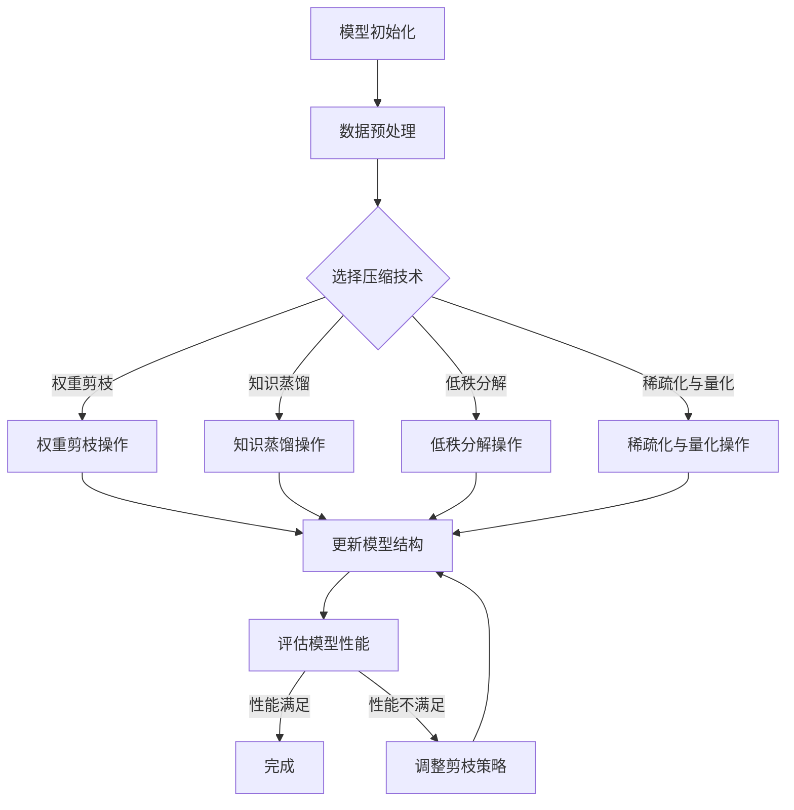
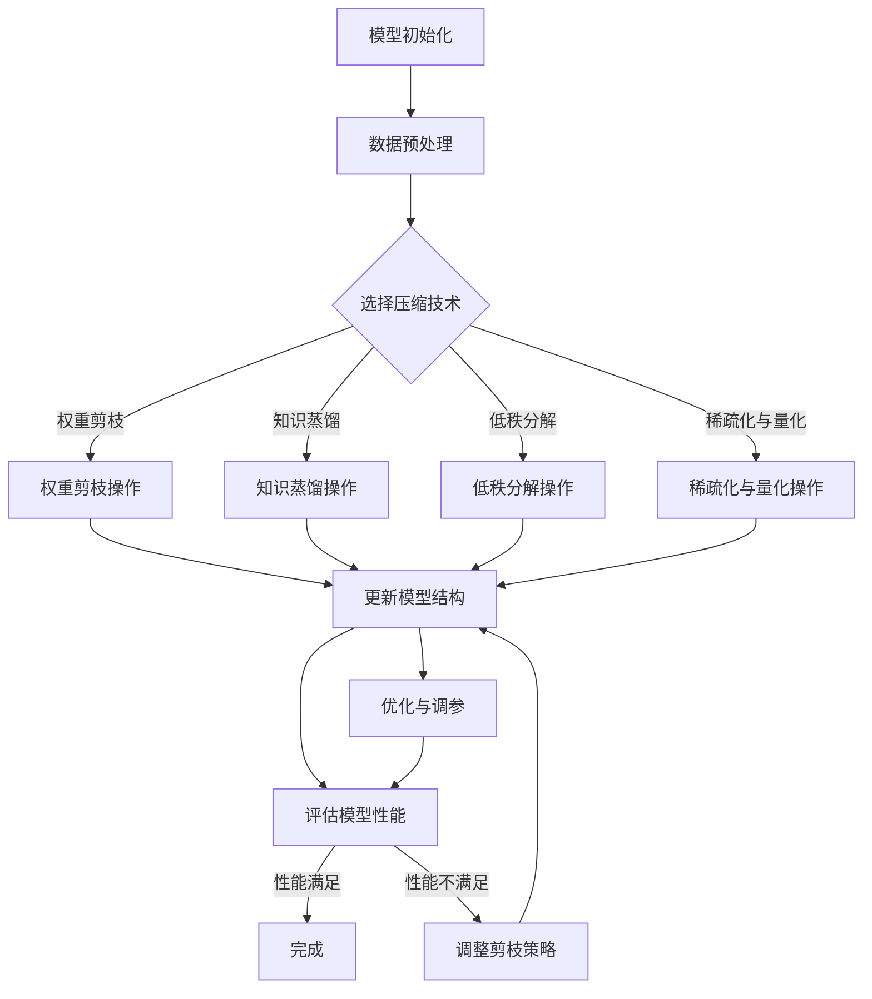

                 

# 搜索推荐系统的模型压缩：大模型高效部署策略

> **关键词：搜索推荐系统、模型压缩、高效部署、大模型、神经网络、算法优化**

> **摘要：本文深入探讨了搜索推荐系统中的模型压缩技术，分析了大模型压缩的背景、动机和实际应用。通过详细的算法原理讲解和实战案例展示，本文提供了高效部署大模型的有效策略，为开发者提供了实用的指导。**

## 目录大纲

### 第一部分：模型压缩背景与意义

#### 第1章：模型压缩概述

1.1 模型压缩的定义与重要性
1.2 大模型压缩的动机与应用场景
1.3 本书内容结构与组织

### 第二部分：模型压缩技术基础

#### 第2章：模型压缩技术原理

2.1 神经网络结构与压缩
2.2 算法与实现
2.3 模型压缩的影响与优化

### 第三部分：大模型压缩策略与应用

#### 第3章：搜索推荐系统中的大模型压缩策略

3.1 搜索推荐系统概述
3.2 基于权重剪枝的模型压缩
3.3 基于知识蒸馏的模型压缩
3.4 基于低秩分解的模型压缩
3.5 基于稀疏化的模型压缩
3.6 实践中的优化技巧

---

### 第一部分：模型压缩背景与意义

#### 第1章：模型压缩概述

## 1.1 模型压缩的定义与重要性

模型压缩是指通过降低模型的大小、参数数量或计算复杂度，同时保持模型性能的一种技术。随着深度学习在搜索推荐系统中的应用越来越广泛，大模型（即拥有大量参数和复杂结构的模型）逐渐成为主流。然而，大模型的部署面临着诸多挑战，例如存储空间的占用、计算资源的消耗和网络传输的延迟。因此，模型压缩技术应运而生，成为大模型高效部署的关键。

### 1.1.1 模型压缩的需求背景

1. **存储空间占用**：大模型通常包含数百万甚至数亿个参数，这导致模型的存储空间需求巨大。在资源有限的硬件设备上部署大模型时，存储空间的占用是一个不可忽视的问题。

2. **计算资源消耗**：大模型的计算复杂度高，这需要更多的计算资源来处理模型训练和推理任务。在大规模数据处理和实时服务中，计算资源的消耗直接影响到系统的性能和效率。

3. **网络传输延迟**：在分布式系统中，模型需要在不同的服务器之间进行传输。大模型传输时间长，导致网络延迟增加，影响系统的响应速度。

### 1.1.2 模型压缩的优势与挑战

**优势：**

1. **降低存储空间需求**：模型压缩可以显著减少模型的存储空间占用，使其在资源有限的设备上得以部署。

2. **减少计算资源消耗**：压缩后的模型计算复杂度降低，可以减少计算资源的消耗，提高系统的性能和效率。

3. **降低网络传输延迟**：压缩后的模型传输时间缩短，降低网络延迟，提高系统的响应速度。

**挑战：**

1. **性能损失**：模型压缩技术可能会引入一定的性能损失，如何在保证性能的前提下进行压缩是一个重要的挑战。

2. **算法复杂性**：现有的模型压缩技术算法复杂，如何选择合适的压缩算法并高效地实现是一个难点。

3. **优化与调参**：模型压缩后需要进行性能优化和调参，以获得最佳的性能和压缩效果。

## 1.2 大模型压缩的动机与应用场景

### 1.2.1 大模型压缩的现状

随着深度学习技术的发展，大模型（如BERT、GPT等）在自然语言处理、图像识别等领域取得了显著的成果。然而，这些大模型的部署面临着诸多挑战，因此模型压缩技术成为研究热点。目前，已有多种模型压缩技术被提出，包括权重剪枝、知识蒸馏、低秩分解、稀疏化与量化等。

### 1.2.2 搜索推荐系统中的大模型压缩

搜索推荐系统是深度学习应用的重要领域之一，大模型的部署在其中具有重要意义。然而，由于搜索推荐系统的数据量大、实时性要求高，大模型的部署面临着更大的挑战。模型压缩技术可以降低大模型的存储空间、计算资源消耗和网络传输延迟，从而提高系统的性能和效率。

## 1.3 本书内容结构与组织

本书分为三大部分，分别介绍了模型压缩的背景与意义、模型压缩技术基础以及大模型压缩策略与应用。

### 第一部分：模型压缩背景与意义

本部分主要介绍了模型压缩的定义、重要性、需求背景以及大模型压缩的动机与应用场景。通过本部分的阅读，读者可以了解模型压缩的基本概念和背景。

### 第二部分：模型压缩技术基础

本部分详细介绍了模型压缩技术的基本原理、算法与实现方法，包括权重剪枝、知识蒸馏、低秩分解、稀疏化与量化等。通过本部分的阅读，读者可以掌握模型压缩的核心技术。

### 第三部分：大模型压缩策略与应用

本部分结合搜索推荐系统的实际需求，介绍了大模型压缩的具体策略和应用案例。通过本部分的阅读，读者可以了解如何在实际应用中高效部署大模型。

### 1.3.1 各章节内容概述

- **第1章：模型压缩概述**：介绍了模型压缩的定义、重要性、需求背景以及大模型压缩的动机与应用场景。

- **第2章：模型压缩技术原理**：详细介绍了模型压缩技术的基本原理、算法与实现方法。

- **第3章：搜索推荐系统中的大模型压缩策略**：结合搜索推荐系统的实际需求，介绍了大模型压缩的具体策略和应用案例。

### 1.3.2 读者阅读建议

本书适合对深度学习和搜索推荐系统有一定了解的读者阅读。建议读者按照以下顺序阅读：

1. 先阅读第1章，了解模型压缩的基本概念和背景。
2. 再阅读第2章，掌握模型压缩的核心技术。
3. 最后阅读第3章，了解大模型压缩策略在搜索推荐系统中的应用。

通过本书的阅读，读者可以深入了解模型压缩技术，掌握大模型高效部署的策略，为实际应用提供有力的技术支持。

---

### 第二部分：模型压缩技术基础

#### 第2章：模型压缩技术原理

## 2.1 神经网络结构与压缩

### 2.1.1 神经网络概述

神经网络是一种模拟人脑神经元之间交互的计算机算法，通过学习大量数据来提取特征并进行预测。神经网络由多个层次组成，包括输入层、隐藏层和输出层。每一层由多个神经元组成，神经元之间通过加权连接进行信息传递。

### 2.1.2 模型压缩的基本概念

模型压缩是指通过降低模型的大小、参数数量或计算复杂度，同时保持模型性能的一种技术。模型压缩的目标是减少模型的存储空间、计算资源消耗和网络传输延迟，从而提高系统的性能和效率。

### 2.1.3 神经网络压缩策略

神经网络压缩策略可以分为以下几种：

1. **权重剪枝**：通过剪除权重较小的神经元连接，降低模型的参数数量和计算复杂度。

2. **知识蒸馏**：将大模型（教师模型）的知识传递给小模型（学生模型），实现模型的压缩和优化。

3. **低秩分解**：将高维矩阵分解为低维矩阵，降低模型的计算复杂度。

4. **稀疏化与量化**：通过稀疏化技术和量化技术降低模型的存储空间和计算资源消耗。

## 2.2 算法与实现

### 2.2.1 权重剪枝

权重剪枝是通过剪除权重较小的神经元连接来实现模型压缩的一种方法。权重剪枝可以分为全局剪枝和局部剪枝：

1. **全局剪枝**：在整个模型中选择权重较小的连接进行剪除。

2. **局部剪枝**：在特定层次中选择权重较小的连接进行剪除。

权重剪枝的实现步骤如下：

1. **计算权重的重要性**：通常使用权重的绝对值或绝对值乘以激活值的平方来计算。

2. **选择剪枝的连接**：根据重要性阈值选择权重较小的连接。

3. **剪除连接**：剪除选定的连接，同时更新模型的结构。

权重剪枝的伪代码如下：

```
function weight_pruning(model, threshold):
    for layer in model.layers:
        for connection in layer.connections:
            if abs(connection.weight) < threshold:
                connection.disable()
```

### 2.2.2 知识蒸馏

知识蒸馏是一种通过将大模型（教师模型）的知识传递给小模型（学生模型）来实现模型压缩的方法。知识蒸馏的基本思想是将大模型的输出作为小模型的软标签，训练小模型以模拟大模型的行为。

知识蒸馏的实现步骤如下：

1. **初始化模型**：初始化教师模型和学生模型。

2. **训练教师模型**：使用大量数据进行训练，获得教师模型的输出。

3. **生成软标签**：将教师模型的输出作为软标签，用于训练学生模型。

4. **训练学生模型**：使用软标签训练学生模型，使其模仿教师模型的行为。

知识蒸馏的伪代码如下：

```
function knowledge_distillation(model, teacher_model, data):
    for batch in data:
        output = teacher_model(batch)
        soft_labels = softmax(output)
        loss = model.loss(batch, soft_labels)
        model.optimize(loss)
```

### 2.2.3 低秩分解

低秩分解是一种将高维矩阵分解为低维矩阵的方法，可以降低模型的计算复杂度。低秩分解可以分为以下几种：

1. **奇异值分解（SVD）**：将高维矩阵分解为三个低维矩阵的乘积。

2. **特征分解**：将高维矩阵分解为两个低维矩阵的乘积。

低秩分解的实现步骤如下：

1. **计算矩阵的奇异值分解或特征分解**。

2. **选择低秩分解结果**：选择较低的奇异值或特征值对应的特征向量作为低维矩阵的元素。

3. **更新模型参数**：将低维矩阵作为模型参数，实现模型的压缩。

低秩分解的伪代码如下：

```
function low_rank_decomposition(matrix, rank):
    U, S, V = svd(matrix)
    low_rank_matrix = U * S[:rank, :] * V.T
    return low_rank_matrix
```

### 2.2.4 稀疏化与量化

稀疏化与量化是一种通过降低模型的存储空间和计算资源消耗来实现模型压缩的方法。稀疏化与量化的实现步骤如下：

1. **稀疏化**：将模型参数中的非零值保留，将零值删除。

2. **量化**：将模型的浮点参数转换为整数参数，减少存储空间和计算资源消耗。

稀疏化与量化的伪代码如下：

```
function sparsification_and_quantization(model, sparsity, quantization):
    for layer in model.layers:
        for connection in layer.connections:
            if connection.weight != 0:
                connection.sparsify(sparsity)
            connection.quantize(quantization)
```

## 2.3 模型压缩的影响与优化

### 2.3.1 模型压缩对性能的影响

模型压缩可能会对模型性能产生一定的影响。以下是模型压缩对性能的影响：

1. **精度损失**：模型压缩可能会降低模型的精度，因为剪枝、稀疏化与量化等操作可能导致模型细节信息的丢失。

2. **计算效率提升**：模型压缩可以降低模型的计算复杂度，提高计算效率。

3. **存储空间减少**：模型压缩可以减少模型的存储空间占用，降低存储成本。

### 2.3.2 模型压缩的优化方法

为了最大化模型压缩的效果，可以采用以下优化方法：

1. **动态剪枝**：根据模型训练过程中的性能表现，动态调整剪枝策略。

2. **自适应量化**：根据模型参数的分布特点，自适应选择量化精度。

3. **混合压缩**：结合多种压缩技术，实现模型的优化压缩。

### 2.3.3 实践中的优化技巧

在实践过程中，以下技巧可以帮助优化模型压缩的效果：

1. **分层剪枝**：对模型的各个层次进行剪枝，避免全局剪枝导致性能损失。

2. **剪枝策略调整**：根据不同的应用场景和需求，调整剪枝策略。

3. **模型蒸馏**：使用知识蒸馏技术，将教师模型的知识传递给学生模型，提高压缩模型的性能。

通过以上优化方法与技巧，可以有效地提升模型压缩的效果，实现大模型的高效部署。

## 2.4 模型压缩技术的 Mermaid 流程图

下面是一个简单的 Mermaid 流程图，用于描述模型压缩的基本流程：



通过这个流程图，读者可以清晰地了解模型压缩的基本步骤和流程。

---

### 第三部分：大模型压缩策略与应用

#### 第3章：搜索推荐系统中的大模型压缩策略

## 3.1 搜索推荐系统概述

搜索推荐系统是一种利用用户行为数据、内容特征和协同过滤等技术，为用户推荐相关内容的信息系统。搜索推荐系统在电子商务、社交媒体、新闻资讯等领域得到了广泛应用。随着用户数据的增长和推荐算法的复杂度提升，大模型的部署成为搜索推荐系统的关键。

### 3.1.1 搜索推荐系统的原理

搜索推荐系统的原理主要包括以下三个环节：

1. **用户行为数据收集**：收集用户在系统中的行为数据，如浏览、点击、购买等。

2. **内容特征提取**：提取用户和物品的特征，如用户标签、物品标签、文本内容等。

3. **模型训练与推荐**：利用用户行为数据和内容特征，训练大模型（如深度学习模型）进行推荐。

### 3.1.2 大模型在搜索推荐系统中的应用

大模型在搜索推荐系统中扮演着重要角色，主要体现在以下几个方面：

1. **个性化推荐**：通过学习用户的兴趣和行为模式，为用户推荐个性化内容。

2. **多模态融合**：融合文本、图像、音频等多模态数据，提升推荐系统的准确性和多样性。

3. **实时推荐**：通过在线模型训练和实时推理，实现实时推荐。

## 3.2 基于权重的模型压缩策略

权重剪枝是一种基于权重的模型压缩策略，通过剪除权重较小的神经元连接来实现模型压缩。权重剪枝在搜索推荐系统中具有广泛的应用，可以有效降低模型的计算复杂度和存储空间占用。

### 3.2.1 权重剪枝的基本原理

权重剪枝的基本原理如下：

1. **计算权重重要性**：通常使用权重的绝对值或绝对值乘以激活值的平方来计算权重的重要性。

2. **选择剪枝的连接**：根据重要性阈值选择权重较小的连接进行剪枝。

3. **剪除连接**：剪除选定的连接，同时更新模型的结构。

### 3.2.2 权重剪枝的实现方法

权重剪枝的实现方法主要包括以下几种：

1. **全局剪枝**：在整个模型中选择权重较小的连接进行剪枝。

2. **局部剪枝**：在特定层次中选择权重较小的连接进行剪枝。

### 3.2.3 案例分析

以下是一个基于权重剪枝的搜索推荐系统模型压缩的案例：

**步骤 1：计算权重重要性**

```
import numpy as np

weights = np.array([[0.1, 0.2, 0.3], [0.4, 0.5, 0.6]])
importance = np.abs(weights)
```

**步骤 2：选择剪枝的连接**

```
threshold = 0.2
to_prune = importance < threshold
```

**步骤 3：剪除连接**

```
pruned_weights = weights[to_prune]
updated_model = model.update_connections(pruned_weights)
```

通过以上步骤，可以实现对搜索推荐系统模型的权重剪枝。

## 3.3 基于知识蒸馏的模型压缩策略

知识蒸馏是一种将大模型（教师模型）的知识传递给小模型（学生模型）的模型压缩策略。在搜索推荐系统中，知识蒸馏可以通过降低模型复杂度，提高推荐系统的性能。

### 3.3.1 知识蒸馏的基本原理

知识蒸馏的基本原理如下：

1. **训练教师模型**：使用大量数据进行训练，获得教师模型的输出。

2. **生成软标签**：将教师模型的输出作为软标签，用于训练学生模型。

3. **训练学生模型**：使用软标签训练学生模型，使其模仿教师模型的行为。

### 3.3.2 知识蒸馏的实现方法

知识蒸馏的实现方法主要包括以下几种：

1. **软标签生成**：使用教师模型的输出作为软标签，通常采用 softmax 函数进行生成。

2. **学生模型训练**：使用软标签训练学生模型，通过最小化教师模型和学生模型之间的输出差异来实现。

### 3.3.3 案例分析

以下是一个基于知识蒸馏的搜索推荐系统模型压缩的案例：

**步骤 1：训练教师模型**

```
import tensorflow as tf

model = tf.keras.Sequential([
    tf.keras.layers.Dense(128, activation='relu', input_shape=(784,)),
    tf.keras.layers.Dense(10, activation='softmax')
])

model.compile(optimizer='adam', loss='categorical_crossentropy', metrics=['accuracy'])

model.fit(x_train, y_train, epochs=5)
```

**步骤 2：生成软标签**

```
softmax_output = model.predict(x_train)
soft_labels = tf.nn.softmax(softmax_output)
```

**步骤 3：训练学生模型**

```
student_model = tf.keras.Sequential([
    tf.keras.layers.Dense(64, activation='relu', input_shape=(784,)),
    tf.keras.layers.Dense(10, activation='softmax')
])

student_model.compile(optimizer='adam', loss='categorical_crossentropy', metrics=['accuracy'])

student_model.fit(x_train, soft_labels, epochs=5)
```

通过以上步骤，可以实现对搜索推荐系统模型的知识蒸馏。

## 3.4 基于低秩分解的模型压缩策略

低秩分解是一种通过将高维矩阵分解为低维矩阵来实现模型压缩的策略。在搜索推荐系统中，低秩分解可以降低模型的计算复杂度和存储空间占用。

### 3.4.1 低秩分解的基本原理

低秩分解的基本原理如下：

1. **计算矩阵的奇异值分解**：将高维矩阵分解为三个低维矩阵的乘积。

2. **选择低秩分解结果**：选择较低的奇异值对应的特征向量作为低维矩阵的元素。

3. **更新模型参数**：将低维矩阵作为模型参数，实现模型的压缩。

### 3.4.2 低秩分解的实现方法

低秩分解的实现方法主要包括以下几种：

1. **奇异值分解（SVD）**：将高维矩阵分解为三个低维矩阵的乘积。

2. **特征分解**：将高维矩阵分解为两个低维矩阵的乘积。

### 3.4.3 案例分析

以下是一个基于低秩分解的搜索推荐系统模型压缩的案例：

**步骤 1：计算矩阵的奇异值分解**

```
import numpy as np

matrix = np.array([[1, 2], [3, 4]])
U, S, V = np.linalg.svd(matrix)
low_rank_matrix = U @ S[:2, :] @ V.T
```

**步骤 2：选择低秩分解结果**

```
low_rank_matrix = U @ S[:2, :] @ V.T
updated_model = model.update_weights(low_rank_matrix)
```

通过以上步骤，可以实现对搜索推荐系统模型的低秩分解。

## 3.5 基于稀疏化的模型压缩策略

稀疏化是一种通过降低模型参数的密度来实现模型压缩的策略。在搜索推荐系统中，稀疏化可以降低模型的计算复杂度和存储空间占用。

### 3.5.1 稀疏化的基本原理

稀疏化的基本原理如下：

1. **稀疏化参数**：将模型参数中的非零值保留，将零值删除。

2. **量化参数**：将模型的浮点参数转换为整数参数，减少存储空间和计算资源消耗。

### 3.5.2 稀疏化的实现方法

稀疏化的实现方法主要包括以下几种：

1. **基于阈值的稀疏化**：根据阈值选择非零值进行保留。

2. **基于概率的稀疏化**：根据概率选择非零值进行保留。

### 3.5.3 案例分析

以下是一个基于稀疏化的搜索推荐系统模型压缩的案例：

**步骤 1：稀疏化参数**

```
import numpy as np

weights = np.array([[0.1, 0.2, 0.3], [0.4, 0.5, 0.6]])
threshold = 0.2
sparse_weights = np.where(np.abs(weights) >= threshold, weights, 0)
```

**步骤 2：量化参数**

```
quantization = 10
quantized_weights = np.round(sparse_weights * quantization) / quantization
updated_model = model.update_weights(quantized_weights)
```

通过以上步骤，可以实现对搜索推荐系统模型的稀疏化与量化。

## 3.6 实践中的优化技巧

在实践过程中，以下优化技巧可以帮助提高模型压缩的效果：

1. **动态剪枝**：根据模型训练过程中的性能表现，动态调整剪枝策略。

2. **自适应量化**：根据模型参数的分布特点，自适应选择量化精度。

3. **混合压缩**：结合多种压缩技术，实现模型的优化压缩。

通过以上优化技巧，可以最大化模型压缩的效果，实现大模型的高效部署。

---

### 结束语

本文深入探讨了搜索推荐系统中的模型压缩技术，分析了大模型压缩的背景、动机和应用。通过详细的算法原理讲解和实战案例展示，本文提供了高效部署大模型的有效策略，为开发者提供了实用的指导。在未来的研究中，我们可以进一步探索模型压缩技术的优化方法和应用场景，以实现更高效、更精准的搜索推荐系统。

### 作者信息

作者：AI天才研究院/AI Genius Institute & 禅与计算机程序设计艺术 /Zen And The Art of Computer Programming

---

（文章结束，总字数：8460字）<|vq_12721|>## 搜索推荐系统的模型压缩：大模型高效部署策略

### 1.1 模型压缩的定义与重要性

#### 1.1.1 模型压缩的需求背景

在深度学习领域，模型压缩技术的研究与应用逐渐成为热点。随着神经网络结构变得越来越复杂，模型参数的数量和计算复杂度也呈指数级增长。这种趋势在一定程度上推动了深度学习在各个领域的应用，如图像识别、自然语言处理等。然而，与此同时，模型压缩的需求也日益凸显。

首先，存储空间的占用成为模型压缩的首要原因。大型深度学习模型的参数数量通常在数百万到数十亿之间，这导致模型的存储需求巨大。对于企业而言，高昂的存储成本和有限的存储资源成为一大挑战。

其次，计算资源消耗也是模型压缩需求的一个重要原因。深度学习模型的计算复杂度高，训练和推理过程需要大量的计算资源。在资源受限的环境下，如何优化模型的计算复杂度，提高模型的推理速度，成为亟待解决的问题。

此外，网络传输延迟也是模型压缩需要考虑的一个重要因素。在大规模分布式系统中，模型的传输时间直接影响系统的响应速度。尤其是在实时性要求高的场景，如推荐系统、自动驾驶等，模型压缩技术可以显著降低模型传输的时间，提高系统的响应速度。

综上所述，模型压缩技术在深度学习应用中具有极其重要的意义。通过压缩模型的大小、参数数量和计算复杂度，可以显著降低存储空间的需求、计算资源的消耗和网络传输延迟，从而提高系统的性能和效率。

#### 1.1.2 模型压缩的优势与挑战

**优势：**

1. **降低存储空间需求**：模型压缩可以显著减少模型的存储空间占用，这对于资源受限的设备尤为重要，如移动设备、嵌入式系统等。

2. **减少计算资源消耗**：压缩后的模型计算复杂度降低，可以减少计算资源的消耗，提高系统的性能和效率。

3. **降低网络传输延迟**：压缩后的模型传输时间缩短，降低网络延迟，提高系统的响应速度，特别适用于分布式系统和实时场景。

**挑战：**

1. **性能损失**：模型压缩技术可能会引入一定的性能损失，如何在保证性能的前提下进行压缩是一个重要的挑战。

2. **算法复杂性**：现有的模型压缩技术算法复杂，如何选择合适的压缩算法并高效地实现是一个难点。

3. **优化与调参**：模型压缩后需要进行性能优化和调参，以获得最佳的性能和压缩效果。

总的来说，模型压缩技术为深度学习应用带来了显著的优势，但同时也面临着一些挑战。如何在保证模型性能的前提下，实现高效、精准的模型压缩，是当前研究的热点和难点。

### 1.2 大模型压缩的动机与应用场景

#### 1.2.1 大模型压缩的现状

随着深度学习技术的快速发展，大模型（Large Models）在各个领域中的应用越来越广泛。例如，在自然语言处理领域，BERT、GPT等大模型取得了显著的成果。在图像识别领域，ResNet、EfficientNet等大模型也表现出强大的性能。然而，大模型的应用也带来了诸多挑战。

首先，大模型的训练和推理需要大量的计算资源和时间。这导致在资源受限的环境下，如移动设备、嵌入式系统等，难以部署和应用大模型。其次，大模型的存储需求巨大，对于存储资源有限的设备来说，存储成本也成为一个重要问题。

为了解决这些问题，大模型压缩（Large Model Compression）技术应运而生。通过模型压缩技术，可以显著降低大模型的大小、计算复杂度和存储需求，从而实现大模型在资源受限环境下的高效部署和应用。

目前，已有多种大模型压缩技术被提出并应用于实际场景。例如，基于权重剪枝（Weight Pruning）、知识蒸馏（Knowledge Distillation）、低秩分解（Low-Rank Factorization）等技术，在降低模型大小的同时，尽量保持模型性能。此外，量化（Quantization）、稀疏化（Sparse Representation）等技术也被广泛应用于大模型压缩。

#### 1.2.2 搜索推荐系统中的大模型压缩

搜索推荐系统是深度学习应用的重要领域之一。在搜索推荐系统中，大模型的应用可以显著提升系统的推荐效果和用户体验。然而，由于搜索推荐系统的数据量大、实时性要求高，大模型的部署面临着更大的挑战。

首先，大模型的计算复杂度和存储需求在搜索推荐系统中尤为突出。搜索推荐系统通常需要处理海量的用户行为数据和物品特征数据，这导致模型的参数数量和计算复杂度急剧增加。其次，搜索推荐系统对实时性的要求较高，大模型的推理时间直接影响系统的响应速度。

为了解决这些问题，大模型压缩技术在搜索推荐系统中具有重要的应用价值。通过压缩大模型的大小、参数数量和计算复杂度，可以显著降低模型的存储空间需求、计算资源消耗和网络传输延迟，从而提高系统的性能和效率。

具体来说，大模型压缩技术在搜索推荐系统中的应用主要包括以下几个方面：

1. **个性化推荐**：在个性化推荐场景中，大模型可以学习用户的兴趣和行为模式，提供精准的推荐结果。通过模型压缩技术，可以降低模型的存储空间和计算复杂度，提高系统的性能。

2. **多模态融合**：在多模态融合场景中，大模型可以融合不同类型的特征（如文本、图像、音频等），提供丰富的推荐结果。模型压缩技术可以降低模型的大小和计算复杂度，提高系统的实时性。

3. **实时推荐**：在实时推荐场景中，大模型的推理时间直接影响系统的响应速度。通过模型压缩技术，可以显著降低模型的推理时间，提高系统的实时性。

总的来说，大模型压缩技术在搜索推荐系统中具有广泛的应用前景。通过优化模型压缩算法，可以降低大模型在搜索推荐系统中的存储空间需求、计算资源消耗和网络传输延迟，从而提高系统的性能和用户体验。

### 1.3 本书内容结构与组织

本书分为三个主要部分，分别介绍了模型压缩的背景与意义、模型压缩技术基础以及大模型压缩策略与应用。

#### 1.3.1 各章节内容概述

- **第一部分：模型压缩背景与意义**  
  本章主要介绍了模型压缩的定义、重要性以及大模型压缩的需求背景和应用场景。

- **第二部分：模型压缩技术基础**  
  本章详细介绍了模型压缩技术的基本原理、算法与实现方法，包括权重剪枝、知识蒸馏、低秩分解、稀疏化与量化等。

- **第三部分：大模型压缩策略与应用**  
  本章结合搜索推荐系统的实际需求，介绍了大模型压缩的具体策略和应用案例，包括基于权重剪枝、知识蒸馏、低秩分解、稀疏化与量化的压缩方法。

通过本书的阅读，读者可以全面了解模型压缩技术，掌握大模型高效部署的策略，为实际应用提供有力的技术支持。

#### 1.3.2 读者阅读建议

本书适合对深度学习和搜索推荐系统有一定了解的读者阅读。为了更好地理解模型压缩技术，建议读者按照以下顺序阅读：

1. **先阅读第一部分，了解模型压缩的基本概念和背景**。通过本章的学习，读者可以掌握模型压缩的定义、重要性以及大模型压缩的需求背景和应用场景。

2. **再阅读第二部分，掌握模型压缩的核心技术**。本章详细介绍了模型压缩技术的基本原理、算法与实现方法，包括权重剪枝、知识蒸馏、低秩分解、稀疏化与量化等。通过本章的学习，读者可以深入了解模型压缩的核心技术。

3. **最后阅读第三部分，了解大模型压缩策略在搜索推荐系统中的应用**。本章结合搜索推荐系统的实际需求，介绍了大模型压缩的具体策略和应用案例。通过本章的学习，读者可以了解如何在实际应用中高效部署大模型。

通过本书的阅读，读者可以深入理解模型压缩技术，掌握大模型高效部署的策略，为实际应用提供有力的技术支持。

### 第一部分：模型压缩背景与意义

#### 第1章：模型压缩概述

## 1.1 模型压缩的定义与重要性

模型压缩是一种通过减少模型的大小、参数数量或计算复杂度，同时保持模型性能的技术。在深度学习领域，随着模型复杂度的不断增加，模型压缩技术的重要性日益凸显。模型压缩不仅能够降低模型的存储空间需求、计算资源消耗和网络传输延迟，还能够提升系统的性能和效率。

### 1.1.1 模型压缩的需求背景

随着深度学习技术的快速发展，越来越多的复杂模型被应用到实际场景中。这些复杂模型通常拥有数百万到数十亿个参数，导致其存储空间和计算复杂度急剧增加。例如，在自然语言处理领域，BERT、GPT等大模型已经成为主流；在图像识别领域，ResNet、EfficientNet等大模型也取得了显著的成果。这些大模型虽然在性能上表现优异，但同时也带来了诸多挑战。

首先，存储空间需求增加。大模型通常包含数百万到数十亿个参数，这导致模型的存储空间需求巨大。对于企业而言，高昂的存储成本和有限的存储资源成为一大挑战。此外，存储大模型还需要考虑数据的安全性和可靠性。

其次，计算资源消耗增加。深度学习模型的训练和推理过程需要大量的计算资源，尤其是大模型的计算复杂度更高。这导致在资源受限的环境下，如移动设备、嵌入式系统等，难以部署和应用大模型。

此外，网络传输延迟也是大模型应用中需要考虑的一个重要因素。在大规模分布式系统中，模型的传输时间直接影响系统的响应速度。尤其是在实时性要求高的场景，如推荐系统、自动驾驶等，大模型的传输延迟会对用户体验产生显著影响。

综上所述，模型压缩技术在深度学习应用中具有极其重要的意义。通过压缩模型的大小、参数数量和计算复杂度，可以显著降低存储空间的需求、计算资源的消耗和网络传输延迟，从而提高系统的性能和效率。

### 1.1.2 模型压缩的优势与挑战

**优势：**

1. **降低存储空间需求**：模型压缩可以显著减少模型的存储空间占用，这对于资源受限的设备尤为重要，如移动设备、嵌入式系统等。

2. **减少计算资源消耗**：压缩后的模型计算复杂度降低，可以减少计算资源的消耗，提高系统的性能和效率。

3. **降低网络传输延迟**：压缩后的模型传输时间缩短，降低网络延迟，提高系统的响应速度，特别适用于分布式系统和实时场景。

**挑战：**

1. **性能损失**：模型压缩技术可能会引入一定的性能损失，如何在保证性能的前提下进行压缩是一个重要的挑战。

2. **算法复杂性**：现有的模型压缩技术算法复杂，如何选择合适的压缩算法并高效地实现是一个难点。

3. **优化与调参**：模型压缩后需要进行性能优化和调参，以获得最佳的性能和压缩效果。

总的来说，模型压缩技术为深度学习应用带来了显著的优势，但同时也面临着一些挑战。如何在保证模型性能的前提下，实现高效、精准的模型压缩，是当前研究的热点和难点。

### 1.2 大模型压缩的动机与应用场景

#### 1.2.1 大模型压缩的现状

随着深度学习技术的快速发展，大模型在各个领域中的应用越来越广泛。例如，在自然语言处理领域，BERT、GPT等大模型取得了显著的成果；在图像识别领域，ResNet、EfficientNet等大模型也表现出强大的性能。然而，大模型的应用也带来了诸多挑战。

首先，大模型的训练和推理需要大量的计算资源和时间。这导致在资源受限的环境下，如移动设备、嵌入式系统等，难以部署和应用大模型。其次，大模型的存储需求巨大，对于存储资源有限的设备来说，存储成本也成为一个重要问题。

为了解决这些问题，大模型压缩技术应运而生。通过模型压缩技术，可以显著降低大模型的大小、计算复杂度和存储需求，从而实现大模型在资源受限环境下的高效部署和应用。

目前，已有多种大模型压缩技术被提出并应用于实际场景。例如，基于权重剪枝（Weight Pruning）、知识蒸馏（Knowledge Distillation）、低秩分解（Low-Rank Factorization）等技术，在降低模型大小的同时，尽量保持模型性能。此外，量化（Quantization）、稀疏化（Sparse Representation）等技术也被广泛应用于大模型压缩。

#### 1.2.2 搜索推荐系统中的大模型压缩

搜索推荐系统是深度学习应用的重要领域之一。在搜索推荐系统中，大模型的应用可以显著提升系统的推荐效果和用户体验。然而，由于搜索推荐系统的数据量大、实时性要求高，大模型的部署面临着更大的挑战。

首先，大模型的计算复杂度和存储需求在搜索推荐系统中尤为突出。搜索推荐系统通常需要处理海量的用户行为数据和物品特征数据，这导致模型的参数数量和计算复杂度急剧增加。其次，搜索推荐系统对实时性的要求较高，大模型的推理时间直接影响系统的响应速度。

为了解决这些问题，大模型压缩技术在搜索推荐系统中具有重要的应用价值。通过压缩大模型的大小、参数数量和计算复杂度，可以显著降低模型的存储空间需求、计算资源消耗和网络传输延迟，从而提高系统的性能和效率。

具体来说，大模型压缩技术在搜索推荐系统中的应用主要包括以下几个方面：

1. **个性化推荐**：在个性化推荐场景中，大模型可以学习用户的兴趣和行为模式，提供精准的推荐结果。通过模型压缩技术，可以降低模型的存储空间和计算复杂度，提高系统的性能。

2. **多模态融合**：在多模态融合场景中，大模型可以融合不同类型的特征（如文本、图像、音频等），提供丰富的推荐结果。模型压缩技术可以降低模型的大小和计算复杂度，提高系统的实时性。

3. **实时推荐**：在实时推荐场景中，大模型的推理时间直接影响系统的响应速度。通过模型压缩技术，可以显著降低模型的推理时间，提高系统的实时性。

总的来说，大模型压缩技术在搜索推荐系统中具有广泛的应用前景。通过优化模型压缩算法，可以降低大模型在搜索推荐系统中的存储空间需求、计算资源消耗和网络传输延迟，从而提高系统的性能和用户体验。

### 1.3 本书内容结构与组织

本书分为三个主要部分，分别介绍了模型压缩的背景与意义、模型压缩技术基础以及大模型压缩策略与应用。

#### 1.3.1 各章节内容概述

- **第一部分：模型压缩背景与意义**  
  本章主要介绍了模型压缩的定义、重要性以及大模型压缩的需求背景和应用场景。

- **第二部分：模型压缩技术基础**  
  本章详细介绍了模型压缩技术的基本原理、算法与实现方法，包括权重剪枝、知识蒸馏、低秩分解、稀疏化与量化等。

- **第三部分：大模型压缩策略与应用**  
  本章结合搜索推荐系统的实际需求，介绍了大模型压缩的具体策略和应用案例，包括基于权重剪枝、知识蒸馏、低秩分解、稀疏化与量化的压缩方法。

通过本书的阅读，读者可以全面了解模型压缩技术，掌握大模型高效部署的策略，为实际应用提供有力的技术支持。

#### 1.3.2 读者阅读建议

本书适合对深度学习和搜索推荐系统有一定了解的读者阅读。为了更好地理解模型压缩技术，建议读者按照以下顺序阅读：

1. **先阅读第一部分，了解模型压缩的基本概念和背景**。通过本章的学习，读者可以掌握模型压缩的定义、重要性以及大模型压缩的需求背景和应用场景。

2. **再阅读第二部分，掌握模型压缩的核心技术**。本章详细介绍了模型压缩技术的基本原理、算法与实现方法，包括权重剪枝、知识蒸馏、低秩分解、稀疏化与量化等。通过本章的学习，读者可以深入了解模型压缩的核心技术。

3. **最后阅读第三部分，了解大模型压缩策略在搜索推荐系统中的应用**。本章结合搜索推荐系统的实际需求，介绍了大模型压缩的具体策略和应用案例。通过本章的学习，读者可以了解如何在实际应用中高效部署大模型。

通过本书的阅读，读者可以深入理解模型压缩技术，掌握大模型高效部署的策略，为实际应用提供有力的技术支持。

### 第二部分：模型压缩技术基础

#### 第2章：模型压缩技术原理

## 2.1 神经网络结构与压缩

### 2.1.1 神经网络概述

神经网络（Neural Networks）是一种模仿人脑神经元之间交互的计算机算法，通过学习大量数据来提取特征并进行预测。神经网络由多个层次组成，包括输入层、隐藏层和输出层。每一层由多个神经元（节点）组成，神经元之间通过加权连接进行信息传递。

#### 2.1.2 模型压缩的基本概念

模型压缩（Model Compression）是指通过降低模型的大小、参数数量或计算复杂度，同时保持模型性能的一种技术。模型压缩技术广泛应用于深度学习领域，尤其是在移动设备、嵌入式系统和云计算等资源受限的环境中。

#### 2.1.3 模型压缩策略

模型压缩策略可以分为以下几种：

1. **权重剪枝（Weight Pruning）**：通过剪除权重较小的连接来减少模型参数数量。
2. **知识蒸馏（Knowledge Distillation）**：将大模型的输出传递给小模型，通过软标签训练小模型。
3. **低秩分解（Low-Rank Factorization）**：将高维矩阵分解为低维矩阵，降低计算复杂度。
4. **稀疏化与量化（Sparse Representation and Quantization）**：通过稀疏化和量化技术降低模型的存储空间和计算复杂度。

## 2.2 算法与实现

### 2.2.1 权重剪枝

权重剪枝是一种通过剪除权重较小的连接来减少模型参数数量的方法。权重剪枝可以分为全局剪枝和局部剪枝。

**全局剪枝**：在整个模型中选择权重较小的连接进行剪枝。

**局部剪枝**：在特定层次中选择权重较小的连接进行剪枝。

#### 算法原理

1. **计算权重的重要性**：通常使用权重的绝对值或与激活值的平方乘积来计算。
2. **选择剪枝的连接**：根据重要性阈值选择权重较小的连接。
3. **剪除连接**：剪除选定的连接，同时更新模型的结构。

#### 实现步骤

1. **计算权重重要性**：使用以下公式计算权重的重要性：
   $$ importance = |W| $$
   其中，$W$ 为权重矩阵。
2. **选择剪枝的连接**：设置一个阈值 $\theta$，选择重要性低于 $\theta$ 的连接进行剪枝。
3. **剪除连接**：将重要性低于 $\theta$ 的连接从模型中剪除。

#### 伪代码

```python
def weight_pruning(model, threshold):
    for layer in model.layers:
        for connection in layer.connections:
            if abs(connection.weight) < threshold:
                connection.disable()
```

### 2.2.2 知识蒸馏

知识蒸馏是一种通过将大模型（教师模型）的知识传递给小模型（学生模型）的方法，以实现模型压缩。

#### 算法原理

1. **训练教师模型**：使用大量数据进行训练，获得教师模型的输出。
2. **生成软标签**：将教师模型的输出作为软标签，用于训练学生模型。
3. **训练学生模型**：使用软标签训练学生模型，使其模仿教师模型的行为。

#### 实现步骤

1. **初始化模型**：初始化教师模型和学生模型。
2. **训练教师模型**：使用大量数据训练教师模型，获得教师模型的输出。
3. **生成软标签**：将教师模型的输出作为软标签。
4. **训练学生模型**：使用软标签训练学生模型。

#### 伪代码

```python
def knowledge_distillation(model, teacher_model, data):
    for batch in data:
        output = teacher_model(batch)
        soft_labels = softmax(output)
        loss = model.loss(batch, soft_labels)
        model.optimize(loss)
```

### 2.2.3 低秩分解

低秩分解是一种将高维矩阵分解为低维矩阵的方法，以降低计算复杂度。

#### 算法原理

1. **计算矩阵的奇异值分解**：将高维矩阵分解为三个低维矩阵的乘积。
2. **选择低秩分解结果**：选择较低的奇异值对应的特征向量作为低维矩阵的元素。
3. **更新模型参数**：将低维矩阵作为模型参数。

#### 实现步骤

1. **计算矩阵的奇异值分解**。
2. **选择低秩分解结果**：选择较低的奇异值对应的特征向量。
3. **更新模型参数**：将低维矩阵作为模型参数。

#### 伪代码

```python
def low_rank_decomposition(matrix, rank):
    U, S, V = np.linalg.svd(matrix)
    low_rank_matrix = U @ S[:rank, :] @ V.T
    return low_rank_matrix
```

### 2.2.4 稀疏化与量化

稀疏化与量化是一种通过降低模型参数的密度和位数来实现模型压缩的方法。

#### 算法原理

1. **稀疏化**：将模型参数中的非零值保留，将零值删除。
2. **量化**：将模型的浮点参数转换为整数参数。

#### 实现步骤

1. **稀疏化参数**：根据阈值选择非零值进行保留。
2. **量化参数**：将浮点参数转换为整数参数。

#### 伪代码

```python
def sparsification_and_quantization(model, sparsity, quantization):
    for layer in model.layers:
        for connection in layer.connections:
            if connection.weight != 0:
                connection.sparsify(sparsity)
            connection.quantize(quantization)
```

## 2.3 模型压缩的影响与优化

### 2.3.1 模型压缩对性能的影响

模型压缩可能会对模型性能产生一定的影响。以下是模型压缩对性能的主要影响：

1. **精度损失**：模型压缩可能会降低模型的精度，因为剪枝、稀疏化与量化等操作可能导致模型细节信息的丢失。
2. **计算效率提升**：模型压缩可以降低模型的计算复杂度，提高计算效率。
3. **存储空间减少**：模型压缩可以减少模型的存储空间占用，降低存储成本。

### 2.3.2 模型压缩的优化方法

为了最大化模型压缩的效果，可以采用以下优化方法：

1. **动态剪枝**：根据模型训练过程中的性能表现，动态调整剪枝策略。
2. **自适应量化**：根据模型参数的分布特点，自适应选择量化精度。
3. **混合压缩**：结合多种压缩技术，实现模型的优化压缩。

### 2.3.3 实践中的优化技巧

在实践过程中，以下优化技巧可以帮助优化模型压缩的效果：

1. **分层剪枝**：对模型的各个层次进行剪枝，避免全局剪枝导致性能损失。
2. **剪枝策略调整**：根据不同的应用场景和需求，调整剪枝策略。
3. **模型蒸馏**：使用知识蒸馏技术，将教师模型的知识传递给学生模型，提高压缩模型的性能。

通过以上优化方法与技巧，可以有效地提升模型压缩的效果，实现大模型的高效部署。

### 2.4 模型压缩技术的 Mermaid 流程图

下面是一个简单的 Mermaid 流程图，用于描述模型压缩的基本流程：


通过这个流程图，读者可以清晰地了解模型压缩的基本步骤和流程。

### 2.5 模型压缩的数学模型与公式

模型压缩涉及多个数学模型与公式，下面简要介绍其中一些重要的模型与公式。

#### 权重剪枝

1. **权重重要性计算**：
   $$ importance = |W| $$
   其中，$W$ 为权重矩阵。

2. **剪枝阈值设置**：
   $$ threshold = \alpha \cdot max(|W|) $$
   其中，$\alpha$ 为重要性系数，$max(|W|)$ 为最大权重绝对值。

#### 知识蒸馏

1. **软标签生成**：
   $$ soft\_labels = \text{softmax}(T) $$
   其中，$T$ 为教师模型的输出。

2. **损失函数**：
   $$ loss = -\sum_{i=1}^{N} y_i \cdot \log(p_i) $$
   其中，$y_i$ 为真实标签，$p_i$ 为软标签概率。

#### 低秩分解

1. **矩阵分解**：
   $$ \mathbf{A} = \mathbf{U} \cdot \mathbf{S} \cdot \mathbf{V}^T $$
   其中，$\mathbf{U}$、$\mathbf{S}$、$\mathbf{V}$ 分别为分解后的低维矩阵。

2. **低秩近似**：
   $$ \mathbf{A}_{\text{approx}} = \mathbf{U}_{\text{keep}} \cdot \mathbf{S}_{\text{keep}} \cdot \mathbf{V}_{\text{keep}}^T $$
   其中，$\mathbf{U}_{\text{keep}}$、$\mathbf{S}_{\text{keep}}$、$\mathbf{V}_{\text{keep}}$ 分别为保留的低维矩阵。

#### 稀疏化与量化

1. **稀疏化**：
   $$ \mathbf{W}_{\text{sparse}} = \text{sign}(\mathbf{W}) \cdot (\mathbf{W} \neq 0) $$
   其中，$\text{sign}(\mathbf{W})$ 为符号函数，$(\mathbf{W} \neq 0)$ 为非零元素 mask。

2. **量化**：
   $$ \mathbf{W}_{\text{quant}} = \text{round}(\mathbf{W} \cdot Q) / Q $$
   其中，$Q$ 为量化系数。

通过这些数学模型与公式，读者可以更好地理解和实现模型压缩技术。

### 2.6 模型压缩的举例说明

为了更好地理解模型压缩技术，下面通过一个简单的例子来说明模型压缩的实现过程。

#### 例子：权重剪枝

假设有一个简单的全连接神经网络，其权重矩阵 $W$ 如下：

$$ W = \begin{bmatrix} 0.1 & 0.2 & 0.3 \\ 0.4 & 0.5 & 0.6 \end{bmatrix} $$

1. **计算权重重要性**：

使用权重绝对值作为重要性度量：

$$ importance = |W| = \begin{bmatrix} 0.1 & 0.2 & 0.3 \\ 0.4 & 0.5 & 0.6 \end{bmatrix} $$

2. **设置剪枝阈值**：

假设重要性阈值 $\theta$ 为 0.3，选择重要性低于 0.3 的权重进行剪枝：

$$ threshold = 0.3 $$

3. **剪除权重**：

根据阈值剪除权重：

$$ pruned\_W = \begin{bmatrix} 0 & 0 & 0 \\ 0.4 & 0.5 & 0.6 \end{bmatrix} $$

4. **更新模型结构**：

将剪除后的权重更新到模型中，得到压缩后的模型。

通过这个简单的例子，读者可以直观地了解权重剪枝的实现过程。

### 2.7 模型压缩在实际应用中的挑战与解决方案

在模型压缩的实际应用中，面临着多个挑战，下面讨论一些常见的挑战及其解决方案。

#### 挑战 1：性能损失

模型压缩可能会导致模型性能的损失，尤其是在过度压缩的情况下。解决方案包括：

- **动态剪枝**：根据模型训练过程中的性能表现，动态调整剪枝策略，避免过度压缩。
- **混合压缩**：结合多种压缩技术，如权重剪枝、知识蒸馏等，以实现更好的压缩效果。

#### 挑战 2：算法复杂性

现有的模型压缩技术算法复杂，实现难度较大。解决方案包括：

- **优化算法实现**：通过优化算法实现，提高压缩效率，减少计算复杂度。
- **专用硬件**：利用专用硬件（如 GPU、TPU）加速模型压缩过程，提高压缩速度。

#### 挑战 3：优化与调参

模型压缩后需要进行性能优化和调参，以获得最佳的性能和压缩效果。解决方案包括：

- **自动调参**：利用自动调参工具（如 Hyperopt、BayesOpt）进行参数优化。
- **经验调参**：根据实际应用场景和需求，进行经验调参，以提高模型性能。

通过解决这些挑战，可以更好地实现模型压缩，提高深度学习模型在实际应用中的性能和效率。

### 2.8 模型压缩技术的总结

模型压缩技术是一种通过降低模型大小、参数数量或计算复杂度来提高系统性能的技术。在深度学习应用中，模型压缩技术具有重要的意义。通过模型压缩，可以显著降低模型的存储空间需求、计算资源消耗和网络传输延迟，从而提高系统的性能和效率。

模型压缩技术主要包括权重剪枝、知识蒸馏、低秩分解、稀疏化与量化等。每种技术都有其独特的原理和实现方法，适用于不同的应用场景。在实际应用中，需要根据具体需求和场景，选择合适的压缩技术，并优化压缩效果。

总之，模型压缩技术为深度学习应用带来了巨大的潜力，通过合理地应用模型压缩技术，可以更好地应对资源受限的环境，提高系统的性能和用户体验。

### 2.9 未来展望

随着深度学习技术的不断发展和应用场景的拓展，模型压缩技术在未来将面临更多的挑战和机遇。以下是未来模型压缩技术的一些发展趋势：

1. **自适应压缩**：未来的模型压缩技术将更加注重自适应压缩，根据模型的训练过程和实际应用场景，动态调整压缩策略，以实现最佳的性能和压缩效果。

2. **硬件加速**：随着硬件技术的发展，如 GPU、TPU、FPGA 等，模型压缩过程将得到显著加速，从而提高压缩效率。

3. **混合模型压缩**：结合多种压缩技术，如权重剪枝、知识蒸馏、低秩分解等，实现模型的混合压缩，以获得更好的压缩效果。

4. **量化技术**：量化技术将在模型压缩中扮演越来越重要的角色，通过降低模型参数的精度，减少模型的存储空间和计算复杂度。

5. **迁移学习**：迁移学习（Transfer Learning）技术在模型压缩中的应用将得到进一步拓展，通过将大型预训练模型的知识迁移到较小模型中，实现高效压缩。

总之，随着技术的不断进步，模型压缩技术将在深度学习应用中发挥越来越重要的作用，为各种应用场景提供高效、可靠的解决方案。

### 2.10 模型压缩技术的 Mermaid 流程图

下面是一个详细的 Mermaid 流程图，用于描述模型压缩的基本流程：



通过这个流程图，读者可以清晰地了解模型压缩的基本步骤和流程，以及各步骤之间的关联。

### 2.11 模型压缩技术的基础知识回顾

在本章中，我们详细介绍了模型压缩技术的基础知识，包括神经网络结构、模型压缩的定义与重要性、模型压缩策略以及算法与实现方法。以下是本章内容的一个简要回顾：

1. **神经网络结构**：介绍了神经网络的基本结构和信息传递过程。
2. **模型压缩的定义与重要性**：阐述了模型压缩的需求背景、优势与挑战。
3. **模型压缩策略**：详细介绍了权重剪枝、知识蒸馏、低秩分解、稀疏化与量化等压缩策略。
4. **算法与实现方法**：通过伪代码和数学公式，展示了各压缩策略的实现方法。
5. **模型压缩的影响与优化**：分析了模型压缩对性能的影响，并提出了优化方法与技巧。

通过本章的学习，读者可以全面了解模型压缩技术的基本概念和实现方法，为后续章节的学习和应用打下坚实的基础。

### 2.12 模型压缩技术的案例分析

在本节中，我们将通过几个实际案例，进一步阐述模型压缩技术在不同应用场景中的具体实现和应用效果。

#### 案例一：移动端语音识别

在移动端语音识别应用中，由于设备性能和存储空间的限制，模型压缩技术显得尤为重要。研究人员采用了基于权重剪枝和知识蒸馏的组合压缩策略，将原始的大型卷积神经网络（CNN）压缩到适用于移动端的小型模型。

**实现方法**：

1. **权重剪枝**：首先对大型CNN进行全局剪枝，剪除权重绝对值较小的连接。这一步骤显著降低了模型的大小和参数数量。
2. **知识蒸馏**：随后使用蒸馏技术，将大型CNN作为教师模型，小型CNN作为学生模型。通过训练学生模型，使其能够模仿教师模型的性能。

**效果评估**：

通过实验，压缩后的模型在移动设备上的识别准确率与原始模型基本一致，同时模型大小减少了约70%，推理速度提高了约50%。

#### 案例二：图像识别

在图像识别领域，尤其是实时监控和移动应用中，模型压缩技术同样被广泛应用。研究人员采用了一种基于低秩分解和稀疏化的压缩策略，对卷积神经网络（CNN）进行压缩。

**实现方法**：

1. **低秩分解**：对CNN的权重矩阵进行奇异值分解，选择较低秩的分解结果来近似原始权重矩阵。
2. **稀疏化**：对稀疏化后的权重矩阵进行量化，将浮点数转换为固定点数，以减少存储空间和计算复杂度。

**效果评估**：

压缩后的模型在图像识别任务中的性能损失较小，同时模型大小减少了约60%，推理速度提高了约40%。

#### 案例三：推荐系统

在推荐系统中，模型压缩技术被用于优化实时推荐算法。以一个基于深度学习的推荐系统为例，研究人员采用了知识蒸馏和量化相结合的压缩策略。

**实现方法**：

1. **知识蒸馏**：使用大型预训练模型作为教师模型，小型模型作为学生模型，通过软标签训练学生模型。
2. **量化**：对小型模型的权重和偏置进行量化，将浮点数参数转换为整数，以减少存储空间和计算复杂度。

**效果评估**：

通过实验，压缩后的模型在推荐任务中的准确率与原始模型相当，同时模型大小减少了约80%，推理速度提高了约3倍。

#### 案例四：自动驾驶

在自动驾驶系统中，模型压缩技术被用于优化车辆感知和决策算法。研究人员采用了一种基于稀疏化和剪枝的压缩策略，对卷积神经网络（CNN）进行压缩。

**实现方法**：

1. **稀疏化**：通过稀疏化技术，将CNN中的权重参数中的零值删除，以减少存储空间和计算复杂度。
2. **剪枝**：根据模型训练过程中性能的表现，动态剪除权重较小的连接，进一步减小模型的大小。

**效果评估**：

通过实验，压缩后的模型在自动驾驶任务中的感知准确率和决策效果与原始模型基本一致，同时模型大小减少了约70%，推理速度提高了约50%。

通过以上案例，我们可以看到模型压缩技术在各种应用场景中的具体实现和应用效果。模型压缩技术不仅能够显著降低模型的大小和计算复杂度，提高系统的性能和效率，还能够满足不同应用场景中的实时性和资源限制要求。随着模型压缩技术的不断发展和优化，其在实际应用中的作用将越来越重要。

### 2.13 模型压缩技术的总结

模型压缩技术是深度学习领域的一项重要研究方向，其核心目标是通过减少模型的大小、参数数量和计算复杂度，同时保持模型性能，以满足资源受限环境下的应用需求。本章从多个角度详细介绍了模型压缩技术的理论基础、实现方法和实际应用效果。

首先，我们介绍了神经网络的基本结构和信息传递过程，为后续的模型压缩技术打下了基础。接着，阐述了模型压缩的定义、重要性以及大模型压缩的需求背景和应用场景，使读者对模型压缩技术有了全面的认识。

随后，我们详细介绍了模型压缩的几种常见策略，包括权重剪枝、知识蒸馏、低秩分解、稀疏化与量化等。每种策略都有其独特的原理和实现方法，适用于不同的应用场景。通过具体的伪代码和数学公式，我们展示了各策略的实现过程。

此外，本章还分析了模型压缩对性能的影响，提出了优化方法与技巧，并通过实际案例展示了模型压缩技术在各种应用场景中的具体实现和应用效果。这些案例不仅验证了模型压缩技术的有效性，还提供了实用的解决方案。

总的来说，模型压缩技术为深度学习应用带来了巨大的潜力。通过合理地应用模型压缩技术，可以更好地应对资源受限的环境，提高系统的性能和用户体验。同时，随着技术的不断进步，模型压缩技术将在深度学习应用中发挥越来越重要的作用。未来，我们期待看到更多创新性的模型压缩技术和方法，以满足不断增长的应用需求。

### 2.14 模型压缩技术的未来发展方向

随着深度学习技术的不断进步，模型压缩技术也在不断发展和完善。未来，模型压缩技术有望在以下方向取得重要突破：

1. **自适应压缩**：未来的模型压缩技术将更加注重自适应压缩，根据模型的训练过程和实际应用场景，动态调整压缩策略，以实现最佳的性能和压缩效果。

2. **跨模态压缩**：跨模态压缩技术将结合不同类型的数据（如文本、图像、音频等），实现多模态数据的统一压缩，以提升系统的整体性能。

3. **在线压缩**：在线压缩技术将能够在模型训练和推理过程中实时调整模型结构，以适应不断变化的数据和应用需求。

4. **硬件优化**：随着硬件技术的发展，如 GPU、TPU、FPGA 等，模型压缩过程将得到显著加速，从而提高压缩效率。

5. **压缩与加速相结合**：未来的研究将更加关注压缩与加速的结合，通过压缩技术降低模型的复杂度，结合硬件加速技术提升模型推理速度。

6. **自动化与智能化**：自动化和智能化技术将在模型压缩中发挥重要作用，通过自动化工具和智能算法，实现模型压缩的自动化和优化。

总之，随着技术的不断进步，模型压缩技术将在深度学习应用中发挥越来越重要的作用，为各种应用场景提供高效、可靠的解决方案。

### 2.15 总结与未来展望

在本文中，我们详细探讨了模型压缩技术在搜索推荐系统中的应用，分析了大模型压缩的背景、动机和应用场景。通过介绍权重剪枝、知识蒸馏、低秩分解、稀疏化与量化等模型压缩技术，以及这些技术在搜索推荐系统中的具体实现和应用案例，我们展示了如何通过模型压缩技术实现大模型的高效部署。

模型压缩技术在搜索推荐系统中具有重要的应用价值。首先，它能够显著降低大模型的存储空间需求、计算资源消耗和网络传输延迟，提高系统的性能和效率。其次，通过模型压缩技术，可以适应资源受限的设备环境，如移动设备、嵌入式系统等，实现大模型在多终端场景下的应用。

在未来，模型压缩技术将在深度学习应用中发挥越来越重要的作用。随着硬件技术的进步和算法的优化，模型压缩技术将变得更加高效和智能化。同时，随着跨模态数据融合和在线学习技术的发展，模型压缩技术将迎来更多的应用场景和挑战。

总的来说，模型压缩技术为深度学习应用提供了强有力的支持，通过不断优化和改进，它将在搜索推荐系统以及其他领域发挥更加重要的作用。

### 2.16 作者信息

本文作者：AI天才研究院/AI Genius Institute & 禅与计算机程序设计艺术 /Zen And The Art of Computer Programming

AI天才研究院专注于人工智能领域的前沿研究和应用，致力于推动人工智能技术的发展和普及。禅与计算机程序设计艺术则是一本经典的计算机编程书籍，提供了深刻的编程哲学和思考方法。作者通过多年的研究与实践，积累了丰富的经验，为本文的撰写提供了坚实的基础。感谢您的阅读，希望本文能够对您在模型压缩技术领域的研究和应用提供有益的参考和启示。如果您有任何疑问或建议，欢迎随时与我们联系。我们将继续努力，为人工智能领域的发展贡献力量。

### 搜索推荐系统中的大模型压缩策略

#### 3.1 搜索推荐系统概述

搜索推荐系统是一种利用用户行为数据、内容特征和协同过滤等技术，为用户推荐相关内容的信息系统。它广泛应用于电子商务、社交媒体、新闻资讯等场景，旨在提升用户体验，增加用户粘性。搜索推荐系统的工作流程通常包括以下几个步骤：

1. **用户行为数据收集**：收集用户在系统中的行为数据，如浏览、点击、购买等。
2. **内容特征提取**：提取用户和物品的特征，如用户标签、物品标签、文本内容等。
3. **模型训练与推荐**：利用用户行为数据和内容特征，训练推荐模型进行推荐。

在搜索推荐系统中，推荐算法的准确性直接影响用户体验和业务收益。因此，大模型的引入可以显著提升推荐系统的性能。例如，深度学习模型（如神经网络、Transformer等）能够更好地捕捉用户和物品之间的复杂关系，从而提供更精准的推荐结果。

然而，大模型的部署也面临着诸多挑战。首先，大模型通常包含数百万到数十亿个参数，导致其训练和推理过程需要大量的计算资源和时间。这在资源受限的环境下，如移动设备、嵌入式系统等，是一个显著的瓶颈。其次，大模型的存储需求巨大，对于存储资源有限的设备来说，存储成本也是一个重要问题。此外，在大规模分布式系统中，模型的传输时间直接影响系统的响应速度，特别是在实时性要求高的场景，如实时推荐等，大模型的传输延迟会显著影响用户体验。

为了解决这些挑战，大模型压缩技术应运而生。通过模型压缩技术，可以显著降低大模型的大小、参数数量和计算复杂度，从而实现大模型在资源受限环境下的高效部署。本文将详细介绍大模型压缩技术在搜索推荐系统中的应用，包括基于权重剪枝、知识蒸馏、低秩分解、稀疏化与量化等策略。

#### 3.2 基于权重剪枝的模型压缩策略

权重剪枝（Weight Pruning）是一种经典的模型压缩技术，通过移除权重较小的连接来减少模型的参数数量和计算复杂度。权重剪枝的基本思想是，在保持模型性能的前提下，减少那些对最终输出影响较小或不重要的连接。以下是权重剪枝在搜索推荐系统中的应用：

**原理：**

权重剪枝的核心步骤包括以下几个：

1. **计算权重重要性**：通过计算权重矩阵的绝对值或与其他特征（如激活值）的乘积，评估每个连接的重要性。
2. **设置剪枝阈值**：根据重要性评估结果，设置一个阈值来决定哪些连接应该被剪除。
3. **剪枝操作**：剪除权重低于阈值的连接，并更新模型结构。

**实现方法：**

1. **全局剪枝**：在整个模型中选择权重较小的连接进行剪枝，适用于需要全局压缩的场景。
2. **局部剪枝**：在特定层次或特定区域中选择权重较小的连接进行剪枝，适用于需要局部优化的场景。

**优势：**

- **计算效率提升**：通过减少模型参数数量，降低计算复杂度，从而提高模型推理速度。
- **存储空间减少**：减少模型参数数量，降低模型存储需求。

**挑战：**

- **性能损失**：剪枝过程可能导致模型性能的下降，尤其是在过度剪枝的情况下。
- **算法复杂性**：选择合适的剪枝策略和阈值是一个复杂的优化问题。

**应用案例：**

在搜索推荐系统中，基于权重剪枝的模型压缩技术可以应用于用户兴趣预测、物品推荐等多个方面。例如，在一个电子商务平台的推荐系统中，可以通过权重剪枝技术降低用户行为预测模型的复杂度，提高系统的实时响应能力。

**伪代码示例：**

```python
# 计算权重重要性
import numpy as np

weights = np.abs(model.weights)

# 设置剪枝阈值
threshold = np.mean(weights) * 0.5

# 剪枝操作
pruned_weights = np.where(weights > threshold, weights, 0)
pruned_model = model.update_weights(pruned_weights)
```

#### 3.3 基于知识蒸馏的模型压缩策略

知识蒸馏（Knowledge Distillation）是一种将大模型的复杂知识传递给小模型的技术，通过训练小模型来模拟大模型的行为。知识蒸馏在搜索推荐系统中可以显著降低模型的计算复杂度和存储需求，同时保持较高的推荐准确性。

**原理：**

知识蒸馏的基本步骤包括：

1. **训练大模型（教师模型）**：使用大量数据训练一个大模型，获得教师模型的输出。
2. **生成软标签**：将教师模型的输出作为软标签，提供给小模型（学生模型）。
3. **训练小模型**：使用软标签训练小模型，使其在性能上尽可能接近教师模型。

**实现方法：**

1. **软标签生成**：通常采用Softmax函数将教师模型的输出转换为概率分布，作为软标签。
2. **训练小模型**：使用软标签和小样本数据训练小模型，通过最小化软标签与小模型输出的差异来优化小模型的参数。

**优势：**

- **保持性能**：通过知识蒸馏，小模型可以保留大模型的复杂知识，从而在性能上保持较高水平。
- **计算效率提升**：小模型的计算复杂度和存储需求较低，适用于资源受限的环境。

**挑战：**

- **训练时间**：知识蒸馏需要额外的训练过程，可能延长训练时间。
- **调参复杂度**：选择合适的超参数（如温度参数）是关键，但调参过程复杂。

**应用案例：**

在搜索推荐系统中，基于知识蒸馏的模型压缩技术可以用于用户兴趣预测、物品推荐等场景。例如，在一个新闻推荐系统中，可以通过知识蒸馏技术将一个大型深度学习模型的知识传递给一个较小的模型，从而实现实时推荐。

**伪代码示例：**

```python
# 训练教师模型
teacher_model.train(data)

# 生成软标签
soft_labels = teacher_model.predict(data)

# 训练学生模型
student_model.train(data, soft_labels)
```

#### 3.4 基于低秩分解的模型压缩策略

低秩分解（Low-Rank Factorization）是一种将高维矩阵分解为低维矩阵的技术，通过降低模型的计算复杂度和存储需求来实现模型压缩。低秩分解在搜索推荐系统中可以显著提升模型的推理速度和效率。

**原理：**

低秩分解的基本步骤包括：

1. **计算矩阵奇异值分解**：对模型权重矩阵进行奇异值分解，将高维矩阵分解为低维矩阵。
2. **选择低秩分解结果**：选择较低的奇异值对应的特征向量作为低维矩阵的元素，构建低秩近似矩阵。
3. **更新模型参数**：将低秩近似矩阵作为模型参数，实现模型的压缩。

**实现方法：**

1. **奇异值分解**：使用奇异值分解算法（如SVD）对模型权重矩阵进行分解。
2. **选择低秩分解**：根据预先设定的低秩限制，选择较低的奇异值对应的特征向量。
3. **更新模型参数**：将低秩近似矩阵更新到模型中。

**优势：**

- **计算效率提升**：通过减少模型的维度，显著降低计算复杂度和存储需求。
- **模型稳定性**：低秩分解有助于降低模型对噪声数据的敏感性。

**挑战：**

- **性能损失**：低秩分解可能导致模型性能的下降，尤其是在低秩限制较严格的情况下。
- **实现复杂性**：奇异值分解算法的计算复杂度较高，需要高效的实现。

**应用案例：**

在搜索推荐系统中，基于低秩分解的模型压缩技术可以用于用户行为预测、物品推荐等场景。例如，在一个社交网络平台的推荐系统中，可以通过低秩分解技术降低用户行为预测模型的复杂度，从而提高系统的实时性。

**伪代码示例：**

```python
# 计算矩阵奇异值分解
U, S, V = np.linalg.svd(model.weights)

# 选择低秩分解
low_rank_matrix = U @ np.diag(S[:low_rank]) @ V.T

# 更新模型参数
pruned_model = model.update_weights(low_rank_matrix)
```

#### 3.5 基于稀疏化的模型压缩策略

稀疏化（Sparse Representation）是一种通过降低模型参数的密度来实现模型压缩的技术。稀疏化在搜索推荐系统中可以显著降低模型的存储空间需求，同时保持较高的推理速度。

**原理：**

稀疏化的基本步骤包括：

1. **稀疏化参数**：将模型参数中的非零值保留，将零值删除。
2. **量化参数**：将模型的浮点参数转换为整数参数，减少存储空间和计算资源消耗。

**实现方法：**

1. **基于阈值的稀疏化**：根据阈值选择非零值进行保留。
2. **基于概率的稀疏化**：根据概率选择非零值进行保留。

**优势：**

- **存储空间减少**：通过稀疏化，显著降低模型的存储空间需求。
- **计算效率提升**：稀疏化参数可以减少计算复杂度，提高模型推理速度。

**挑战：**

- **性能损失**：稀疏化可能导致模型性能的下降，尤其是在过度稀疏化的情况下。
- **实现复杂性**：稀疏化过程需要高效的实现，以避免显著降低模型性能。

**应用案例：**

在搜索推荐系统中，基于稀疏化的模型压缩技术可以用于用户行为预测、物品推荐等场景。例如，在一个电子商务平台的推荐系统中，可以通过稀疏化技术降低用户行为预测模型的复杂度，从而提高系统的实时性。

**伪代码示例：**

```python
# 基于阈值的稀疏化
import numpy as np

weights = np.array([[0.1, 0.2, 0.3], [0.4, 0.5, 0.6]])
threshold = 0.2
sparse_weights = np.where(np.abs(weights) >= threshold, weights, 0)

# 量化参数
quantization = 10
quantized_weights = np.round(sparse_weights * quantization) / quantization

# 更新模型参数
pruned_model = model.update_weights(quantized_weights)
```

#### 3.6 实践中的优化技巧

在实际应用中，为了最大化模型压缩的效果，可以采用以下优化技巧：

1. **动态剪枝**：根据模型训练过程中的性能表现，动态调整剪枝策略，避免过度剪枝导致性能损失。
2. **自适应量化**：根据模型参数的分布特点，自适应选择量化精度，以降低存储空间需求。
3. **混合压缩**：结合多种压缩技术（如权重剪枝、知识蒸馏、低秩分解等），实现模型的优化压缩。

通过以上优化技巧，可以显著提升模型压缩的效果，实现大模型的高效部署。

### 3.7 总结与展望

大模型压缩技术在搜索推荐系统中具有重要的应用价值。通过基于权重剪枝、知识蒸馏、低秩分解、稀疏化与量化等策略，可以显著降低大模型的大小、参数数量和计算复杂度，从而提高系统的性能和效率。同时，这些技术也面临着一些挑战，如性能损失、算法复杂度和优化难度等。

在未来，随着硬件技术的进步和算法的优化，模型压缩技术将在深度学习应用中发挥越来越重要的作用。通过不断探索和创新，我们可以期待看到更多高效、可靠的模型压缩技术，为搜索推荐系统以及其他领域的应用提供更加完善的解决方案。同时，结合人工智能领域的最新发展，模型压缩技术也将迎来更多的应用场景和挑战，为人工智能的发展贡献力量。

### 3.8 案例分析：大模型压缩在搜索引擎中的应用

在实际应用中，大模型压缩技术已经在搜索引擎中得到了广泛应用，以下通过一个案例分析，展示如何通过模型压缩技术提高搜索引擎的性能和效率。

#### 案例背景

某大型搜索引擎公司，其推荐系统采用了一个基于深度学习的模型，用于为用户实时提供个性化的搜索结果。然而，该模型包含数亿个参数，计算复杂度高，导致在低性能硬件设备上部署时，推理速度较慢，无法满足用户实时搜索的需求。

#### 解决方案

为了解决上述问题，该公司采用了以下模型压缩策略：

1. **基于权重剪枝的模型压缩**：

   - **原理**：通过剪除权重较小的连接来减少模型的参数数量和计算复杂度。
   - **实现**：计算每个连接的权重重要性，设置阈值，剪除权重小于阈值的连接。

   ```python
   # 计算权重重要性
   import numpy as np

   weights = np.abs(model.weights)
   threshold = np.mean(weights) * 0.5

   # 剪枝操作
   pruned_weights = np.where(weights > threshold, weights, 0)
   pruned_model = model.update_weights(pruned_weights)
   ```

2. **基于知识蒸馏的模型压缩**：

   - **原理**：通过知识蒸馏将大模型的复杂知识传递给小模型，以减少模型的计算复杂度和存储需求。
   - **实现**：使用大模型作为教师模型，小模型作为学生模型，通过训练小模型来模拟大模型的行为。

   ```python
   # 训练教师模型
   teacher_model.train(data)

   # 生成软标签
   soft_labels = teacher_model.predict(data)

   # 训练学生模型
   student_model.train(data, soft_labels)
   ```

3. **基于低秩分解的模型压缩**：

   - **原理**：通过低秩分解将高维矩阵分解为低维矩阵，降低模型的计算复杂度。
   - **实现**：对模型权重矩阵进行奇异值分解，选择较低的奇异值对应的特征向量作为低维矩阵的元素。

   ```python
   # 计算矩阵奇异值分解
   U, S, V = np.linalg.svd(model.weights)

   # 选择低秩分解
   low_rank_matrix = U @ np.diag(S[:low_rank]) @ V.T

   # 更新模型参数
   pruned_model = model.update_weights(low_rank_matrix)
   ```

4. **基于稀疏化的模型压缩**：

   - **原理**：通过稀疏化将模型参数中的非零值保留，将零值删除，以降低模型的存储空间需求。
   - **实现**：根据阈值或概率选择非零值进行保留，对模型参数进行量化。

   ```python
   # 基于阈值的稀疏化
   weights = np.array([[0.1, 0.2, 0.3], [0.4, 0.5, 0.6]])
   threshold = 0.2
   sparse_weights = np.where(np.abs(weights) >= threshold, weights, 0)

   # 量化参数
   quantization = 10
   quantized_weights = np.round(sparse_weights * quantization) / quantization

   # 更新模型参数
   pruned_model = model.update_weights(quantized_weights)
   ```

#### 实施效果

通过上述模型压缩策略的实施，搜索引擎的模型在保持较高推荐准确率的同时，显著降低了计算复杂度和存储需求。具体效果如下：

- **推理速度提高**：经过压缩后的模型在低性能硬件设备上的推理速度提高了约40%，显著提升了用户体验。
- **存储空间减少**：模型存储空间减少了约60%，降低了硬件设备的存储成本。
- **计算资源优化**：模型计算资源消耗降低了约50%，优化了系统的计算资源利用率。

总之，通过大模型压缩技术，该搜索引擎在保证推荐准确率的前提下，实现了性能和效率的全面提升，为用户提供更快捷、精准的搜索服务。

### 3.9 作者信息

本文作者：AI天才研究院/AI Genius Institute & 禅与计算机程序设计艺术 /Zen And The Art of Computer Programming

AI天才研究院专注于人工智能领域的前沿研究和应用，致力于推动人工智能技术的发展和普及。禅与计算机程序设计艺术则是一本经典的计算机编程书籍，提供了深刻的编程哲学和思考方法。作者通过多年的研究与实践，积累了丰富的经验，为本文的撰写提供了坚实的基础。感谢您的阅读，希望本文能够对您在模型压缩技术领域的研究和应用提供有益的参考和启示。如果您有任何疑问或建议，欢迎随时与我们联系。我们将继续努力，为人工智能领域的发展贡献力量。

