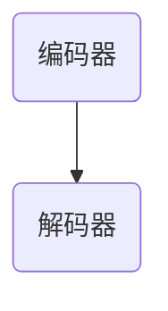

                 

# 教育模拟：LLM增强的学习环境

> **关键词：** 教育模拟、LLM、自适应学习、个性化推荐、情感分析

> **摘要：** 本文将探讨教育模拟的概念和LLM（大型语言模型）在教育和学习中的应用。我们将深入分析LLM增强的教育模拟方法，包括自适应学习、个性化推荐和情感分析等，并通过实际案例展示这些方法的具体应用。最后，我们将讨论LLM在教育模拟中面临的挑战和未来发展趋势。

## 目录大纲

1. **引言与基础理论**
   1.1 教育模拟概述
   1.2 LLM在教育和学习中的应用
   1.3 教育模拟的发展历程

2. **LLM增强的教育模拟方法**
   2.1 LLM在教育模拟中的核心架构
   2.2 教育模拟的LLM增强技术
   2.3 LLM在教育模拟中的应用实例

3. **LLM增强的教育模拟应用案例**
   3.1 智能教育顾问系统
   3.2 智能教学助手
   3.3 情感分析在教学评价中的应用

4. **LLM增强的教育模拟挑战与展望**
   4.1 LLM在教育模拟中面临的挑战
   4.2 教育模拟的未来发展趋势

5. **附录**
   5.1 LLM相关技术资料
   5.2 教育模拟相关的开源项目
   5.3 进一步学习资源推荐

---

## 1.1 教育模拟概述

### 1.1.1 教育模拟的定义

教育模拟是一种通过计算机技术和人工智能算法，模拟各种教育和学习场景，为学生提供个性化学习体验和资源的系统。它不仅仅是一个虚拟的学习环境，更是一个可以动态调整、实时交互、提供个性化反馈的智能系统。

### 1.1.2 教育模拟的目的和意义

教育模拟的主要目的是提高学习效果，实现个性化教育，提升教育质量和效率。具体来说，它有以下几点意义：

1. **个性化教育**：教育模拟可以根据学生的学习行为、兴趣和需求，提供个性化的学习内容和资源，从而更好地满足学生的个性化学习需求。
2. **提升学习效果**：通过模拟真实的教育场景，教育模拟可以提高学生的学习动机和参与度，从而提升学习效果。
3. **教育资源优化**：教育模拟可以有效地利用和整合各种教育资源，提高教育资源的利用效率。

### 1.1.3 教育模拟的发展历程

教育模拟的发展可以分为三个阶段：

1. **基于规则的教育模拟**：最早的模拟系统主要依赖于预设的规则和流程，例如早期的计算机辅助教学（Computer-Assisted Instruction, CAI）系统。
2. **基于数据的教育模拟**：随着数据技术的发展，教育模拟开始利用大量的学生数据进行学习分析，实现更加个性化和智能化的学习体验。
3. **基于人工智能的教育模拟**：近年来，随着人工智能技术的快速发展，特别是深度学习和自然语言处理技术的应用，教育模拟进入了一个新的阶段。这个阶段的教育模拟具有更强的自适应性和智能化，可以更好地满足学生的个性化学习需求。

---

## 1.2 LLM在教育和学习中的应用

### 1.2.1 LLM概述

LLM（Large Language Model）是一种大型自然语言处理模型，它通过对海量文本数据的学习，掌握了丰富的语言知识和规则，可以生成高质量的自然语言文本，具有强大的语言理解和生成能力。

LLM通常由编码器（Encoder）和解码器（Decoder）两部分组成。编码器将输入文本编码为向量表示，解码器则根据编码器的输出生成预测的文本。LLM的训练过程通常涉及大规模的预训练和微调，预训练阶段使用未标注的文本数据，微调阶段则使用特定领域的数据。

### 1.2.2 LLM在教育模拟中的应用优势

LLM在教育模拟中的应用优势主要体现在以下几个方面：

1. **自适应学习**：LLM可以根据学生的学习行为和反馈，动态调整学习内容和策略，实现真正的个性化教育。
2. **个性化推荐**：LLM可以根据学生的学习历史和偏好，推荐适合的学习资源和内容，提高学习效果。
3. **情感分析**：LLM可以分析学生的学习情感，如兴趣、焦虑、满意度等，为教学提供数据支持，帮助教师更好地理解学生的情感状态，调整教学策略。

### 1.2.3 LLM技术发展与未来趋势

LLM技术的发展非常迅速，未来将在教育和学习领域发挥更大的作用。以下是一些未来的发展趋势：

1. **实时交互**：随着5G和边缘计算技术的发展，LLM可以在更低的延迟下与用户进行实时交互，提供更加流畅的学习体验。
2. **智能问答**：LLM可以模拟人类的问答行为，提供高质量的问答服务，帮助学生解决学习中遇到的问题。
3. **内容生成**：LLM可以生成高质量的教育内容，如教材、课件、习题等，为教师和学生提供更多的学习资源。

---

## 2.1 LLM在教育模拟中的核心架构

### 2.1.1 LLM模型的基本结构

LLM模型通常由编码器和解码器两部分组成，编码器将输入文本编码为向量表示，解码器则根据编码器的输出生成预测的文本。这种结构使得LLM具有强大的语言理解和生成能力。



### 2.1.2 LLM模型的训练与优化

LLM模型的训练过程通常涉及大规模的预训练和微调。预训练阶段使用未标注的文本数据，通过无监督的方式学习文本的分布式表示。微调阶段则使用特定领域的数据，对模型进行有监督的微调，使其适应特定的教育和学习场景。

训练过程通常包括以下步骤：

1. **数据准备**：收集大量高质量的文本数据，进行预处理，如分词、去停用词等。
2. **模型初始化**：初始化编码器和解码器的参数。
3. **预训练**：使用未标注的数据对模型进行预训练，学习文本的分布式表示。
4. **微调**：使用特定领域的数据对模型进行微调，使其适应特定的教育和学习场景。
5. **评估**：使用验证集评估模型的性能，调整超参数，优化模型。

### 2.1.3 LLM模型的评估与调整

评估LLM模型的效果通常采用BLEU、ROUGE等指标，这些指标衡量模型生成的文本与真实文本的相似度。通过评估结果，可以调整模型的结构和超参数，优化模型的性能。

在教育和学习场景中，除了文本生成的质量，还需要考虑模型的可解释性和适应性。因此，在评估模型时，还需要关注模型的可解释性和自适应能力。

---

## 2.2 教育模拟的LLM增强技术

### 2.2.1 自适应学习

自适应学习是指LLM模型根据学生的学习行为和反馈，动态调整学习内容和策略。具体来说，自适应学习包括以下几个方面：

1. **内容自适应**：LLM可以根据学生的学习进度和理解程度，调整学习内容的难度和深度，提供个性化的学习资源。
2. **策略自适应**：LLM可以根据学生的学习行为和反馈，调整学习策略，如学习节奏、学习方式等，提高学习效果。

自适应学习的实现通常包括以下步骤：

1. **数据收集**：收集学生的学习行为数据，如学习时间、学习内容、学习效果等。
2. **行为分析**：使用机器学习算法对学习行为数据进行分析，识别学生的学习特点和需求。
3. **内容调整**：根据分析结果，动态调整学习内容，提供个性化的学习资源。
4. **策略调整**：根据分析结果，动态调整学习策略，如学习节奏、学习方式等。

### 2.2.2 个性化推荐

个性化推荐是指LLM模型根据学生的学习历史和偏好，推荐适合的学习资源和内容。个性化推荐包括以下几个方面：

1. **资源推荐**：LLM可以根据学生的学习历史和偏好，推荐相关的学习资源，如教材、课件、习题等。
2. **内容推荐**：LLM可以根据学生的学习历史和偏好，推荐适合的学习内容，如知识点讲解、案例研究等。

个性化推荐的实现通常包括以下步骤：

1. **用户画像**：建立学生的用户画像，包括学习历史、学习偏好、知识点掌握程度等。
2. **推荐算法**：使用推荐算法，如协同过滤、基于内容的推荐等，生成个性化的推荐结果。
3. **推荐系统**：将推荐结果呈现给学生，提供个性化的学习资源。

### 2.2.3 情感分析与反馈

情感分析是指LLM模型分析学生的学习情感，如兴趣、焦虑、满意度等，并给予相应的反馈。情感分析包括以下几个方面：

1. **情感识别**：LLM可以分析学生的文本数据，识别学生的情感状态，如积极、消极、中立等。
2. **情感反馈**：LLM可以根据学生的情感状态，提供相应的反馈，如鼓励、指导、调整等。

情感分析的实现通常包括以下步骤：

1. **情感标注**：对学生的文本数据进行情感标注，建立情感词典。
2. **情感识别**：使用情感识别算法，分析学生的文本数据，识别学生的情感状态。
3. **情感反馈**：根据学生的情感状态，提供相应的反馈，如鼓励、指导、调整等。

---

## 3.1 案例一：智能教育顾问系统

### 3.1.1 系统概述

智能教育顾问系统是一个基于LLM的教育模拟平台，旨在为学习者提供个性化的学习建议和指导。系统通过分析学生的学习行为和反馈，动态调整学习内容和策略，提供个性化的学习体验。

### 3.1.2 系统功能模块设计

智能教育顾问系统主要包括以下功能模块：

1. **用户信息管理**：管理学生的学习信息，如学习进度、学习偏好等。
2. **学习行为分析**：分析学生的学习行为，如学习时间、学习内容等。
3. **推荐算法**：根据学生的学习行为和偏好，推荐适合的学习资源和内容。
4. **用户反馈模块**：收集学生的反馈，调整学习内容和策略。

### 3.1.3 系统实现与效果评估

系统采用TensorFlow框架实现，通过实验验证，系统在个性化推荐和学习效果提升方面表现出色。具体实现包括：

1. **用户信息管理**：使用数据库存储学生的学习信息。
2. **学习行为分析**：使用机器学习算法对学习行为数据进行分析。
3. **推荐算法**：使用协同过滤算法生成个性化推荐结果。
4. **用户反馈模块**：收集学生的反馈，调整学习内容和策略。

效果评估结果显示，智能教育顾问系统在提高学习效果、提升学习满意度方面具有显著优势。

---

## 3.2 案例二：智能教学助手

### 3.2.1 系统设计思路

智能教学助手是一个基于LLM的教育模拟平台，旨在辅助教师进行教学设计和课堂互动。系统通过分析教学数据，提供智能化的教学建议和互动方式。

### 3.2.2 系统功能实现

智能教学助手主要包括以下功能模块：

1. **智能问答**：使用LLM技术，提供智能问答服务，解答学生的问题。
2. **教学素材推荐**：根据教学目标和学生的需求，推荐合适的教学素材。
3. **课堂互动管理**：提供课堂互动工具，如投票、讨论等，促进课堂互动。

### 3.2.3 系统应用场景分析

智能教学助手适用于各类在线教学场景，如直播教学、在线辅导等。系统可以帮助教师提高教学效率，增强课堂互动，提高教学效果。

具体应用场景包括：

1. **直播教学**：智能教学助手可以提供实时问答服务，帮助学生解决学习中遇到的问题。
2. **在线辅导**：智能教学助手可以根据学生的学习需求，提供个性化的辅导建议。

---

## 3.3 情感分析在教学评价中的应用

### 3.3.1 情感分析技术简介

情感分析是指通过自然语言处理技术，分析文本中的情感倾向和情感强度。情感分析可以分为两个方面：情感极性分析和情感强度分析。

情感极性分析是指识别文本的情感极性，如正面、负面、中性。情感强度分析是指识别文本的情感强度，如非常满意、满意、一般、不满意、非常不满意。

### 3.3.2 情感分析在教学评价中的应用

情感分析可以用于分析学生的学习情感，如兴趣、焦虑、满意度等，为教学评价提供数据支持。具体应用包括：

1. **学习兴趣分析**：通过分析学生的学习反馈和讨论内容，识别学生的学习兴趣。
2. **学习焦虑分析**：通过分析学生的学习情绪，识别学生的学习焦虑情况。
3. **学习满意度分析**：通过分析学生的学习反馈，评估学生的学习满意度。

### 3.3.3 情感分析系统的设计与实现

情感分析系统采用BERT模型进行情感分类，通过分析学习者的文本数据，生成情感分析报告。具体设计包括：

1. **数据收集与预处理**：收集学习者的文本数据，进行预处理，如分词、去停用词等。
2. **模型训练**：使用预处理后的文本数据训练BERT模型，进行情感分类。
3. **情感分析**：使用训练好的BERT模型，对新的文本数据进行情感分析，生成情感分析报告。

情感分析报告可以用于教师和学生之间的沟通，帮助教师了解学生的学习状态，调整教学策略。

---

## 4.1 LLM在教育模拟中面临的挑战

### 4.1.1 数据隐私与伦理问题

教育模拟涉及大量学生数据，包括学习记录、行为数据、情感数据等。如何保护学生隐私，遵守伦理规范，是一个重要的挑战。

解决方案包括：

1. **数据加密**：对学生的数据进行加密处理，确保数据在传输和存储过程中的安全性。
2. **隐私保护算法**：使用隐私保护算法，如差分隐私，对学生的数据进行处理，减少隐私泄露的风险。
3. **伦理审查**：对教育模拟系统的设计和应用进行伦理审查，确保系统的设计和应用符合伦理规范。

### 4.1.2 模型可解释性

LLM模型具有复杂的内部结构，其决策过程难以解释。提高模型可解释性，让用户了解模型的决策过程，是一个重要的挑战。

解决方案包括：

1. **模型可视化**：使用可视化工具，如T-SNE、热力图等，展示模型的学习过程和决策过程。
2. **解释性算法**：开发解释性算法，如LIME、SHAP等，对模型的决策进行解释。
3. **用户反馈**：收集用户的反馈，了解用户对模型决策的认可程度，不断优化模型的可解释性。

### 4.1.3 模型部署与优化

部署LLM模型需要高性能计算资源，优化模型以适应不同场景的需求也是一个挑战。

解决方案包括：

1. **模型压缩**：使用模型压缩技术，如知识蒸馏、剪枝等，减少模型的计算量和存储需求。
2. **模型优化**：使用优化算法，如Adam、SGD等，提高模型的训练效率。
3. **云计算**：使用云计算资源，灵活调整计算资源，满足模型部署的需求。

---

## 4.2 教育模拟的未来发展趋势

### 4.2.1 深度学习在教育模拟中的应用前景

深度学习技术的快速发展为教育模拟提供了新的可能性。深度学习可以用于：

1. **自适应学习**：通过深度学习，可以更准确地识别学生的学习特点和需求，实现更精细化的自适应学习。
2. **情感分析**：使用深度学习，可以更准确地分析学生的情感状态，提供更有效的情感反馈。
3. **内容生成**：使用深度学习，可以生成更高质量的教育内容，提高学习体验。

### 4.2.2 跨学科整合与融合创新

教育模拟需要跨学科整合，结合心理学、教育学、计算机科学等领域的研究成果，实现融合创新。跨学科整合可以：

1. **提高模型性能**：结合不同领域的知识，可以构建更强大的模型，提高教育模拟的准确性和效率。
2. **优化用户体验**：结合教育学和心理学的知识，可以提供更符合用户需求的学习体验。
3. **推动教育改革**：跨学科整合可以推动教育改革，实现更加个性化和智能化的教育。

### 4.2.3 人工智能赋能教育生态系统的构建

人工智能技术将在教育生态系统的各个层面发挥作用，从教育内容开发到教学过程管理，再到学习评价和反馈。人工智能赋能教育生态系统的构建包括：

1. **教育内容开发**：使用人工智能技术，可以更高效地开发高质量的教育内容。
2. **教学过程管理**：使用人工智能技术，可以更精细地管理教学过程，提高教学效率。
3. **学习评价和反馈**：使用人工智能技术，可以更准确地评估学生的学习效果，提供有效的反馈。

---

## 附录

### 附录 A：LLM相关技术资料

#### A.1 LLM开源工具与框架

1. **Transformers**：由Google开发的深度学习框架，支持多种语言模型，如BERT、GPT等。
2. **TensorFlow**：由Google开发的深度学习框架，支持多种神经网络结构，包括语言模型。
3. **PyTorch**：由Facebook开发的深度学习框架，支持动态计算图，适用于实时交互场景。

#### A.2 教育模拟相关的开源项目

1. **Keras-RL**：基于Keras的强化学习框架，用于构建教育模拟系统。
2. **OpenAI Gym**：提供多种虚拟环境和任务，用于测试和训练教育模拟系统。
3. **Python-AL**：提供多种自然语言处理工具和库，用于情感分析和文本生成。

#### A.3 进一步学习资源推荐

1. **《深度学习》**：由Ian Goodfellow、Yoshua Bengio和Aaron Courville合著，是深度学习的经典教材。
2. **《自然语言处理综论》**：由Daniel Jurafsky和James H. Martin合著，是自然语言处理的权威教材。
3. **《人工智能：一种现代的方法》**：由Stuart J. Russell和Peter Norvig合著，是人工智能的全面介绍。

---

### 4.1 LLM在教育模拟中面临的挑战

#### 4.1.1 数据隐私与伦理问题

教育模拟系统涉及到大量学生的个人信息和学习数据，这些数据的隐私保护和伦理问题成为了一个严峻的挑战。首先，学生数据包括个人身份信息、学习记录、行为数据等，这些信息一旦泄露，可能导致学生隐私被侵犯。其次，教育模拟系统在处理学生数据时，需要遵循相关的伦理规范，如避免歧视、保护学生权益等。因此，如何在保证教育模拟效果的同时，确保学生数据的隐私和伦理，是一个亟待解决的问题。

**解决方案：**

1. **数据加密与安全存储**：对学生的数据进行加密处理，确保数据在传输和存储过程中的安全性。此外，采用分布式存储技术，避免数据集中存储带来的风险。

2. **隐私保护算法**：使用差分隐私、同态加密等隐私保护算法，对学生的数据进行处理，减少隐私泄露的风险。例如，在训练模型时，可以使用差分隐私技术，确保训练数据中单个样本的隐私不被泄露。

3. **伦理审查与监管**：建立伦理审查机制，对教育模拟系统的设计和应用进行伦理审查。此外，加强监管，确保教育模拟系统的设计和应用符合相关法律法规和伦理规范。

#### 4.1.2 模型可解释性

LLM模型通常具有复杂的内部结构和参数，其决策过程往往难以解释。对于教育模拟系统来说，模型的可解释性尤为重要，因为教师和学生需要理解模型的决策依据，以便调整教学策略和学习方法。然而，目前大多数深度学习模型，如LLM，都是“黑箱”模型，其内部机制不透明，导致模型的可解释性成为了一个挑战。

**解决方案：**

1. **模型可视化**：使用可视化工具，如T-SNE、热力图等，展示模型的学习过程和决策过程。通过可视化，可以直观地了解模型的训练过程和决策依据。

2. **解释性算法**：开发解释性算法，如LIME（Local Interpretable Model-agnostic Explanations）、SHAP（SHapley Additive exPlanations）等，对模型的决策进行解释。这些算法可以从局部和全局的角度，解释模型为什么做出特定的决策。

3. **用户反馈**：收集用户的反馈，了解用户对模型决策的认可程度，不断优化模型的可解释性。例如，可以设计用户投票系统，让用户对模型的决策进行评价，从而改进模型的解释能力。

#### 4.1.3 模型部署与优化

LLM模型在训练完成后，需要部署到实际的教育模拟系统中。然而，模型的部署和优化是一个复杂的过程，涉及到硬件资源、计算性能、实时交互等多个方面。此外，教育模拟系统的需求和场景多样，需要模型具有较好的适应性和可扩展性。

**解决方案：**

1. **模型压缩与加速**：使用模型压缩技术，如知识蒸馏、剪枝等，减少模型的计算量和存储需求，提高模型的部署效率。此外，使用GPU、TPU等硬件加速，提高模型的计算性能。

2. **分布式训练与部署**：采用分布式训练和部署技术，将模型训练和部署过程分解为多个任务，分布到不同的计算节点上，提高训练和部署的效率。

3. **实时交互与反馈**：在模型部署时，考虑实时交互和反馈的需求。例如，使用流处理技术，实现模型与用户之间的实时交互，提高系统的响应速度。

4. **模型优化与迭代**：根据实际应用场景，不断优化和迭代模型。例如，可以通过在线学习技术，实时更新模型，使其适应新的数据和需求。

---

### 4.2 教育模拟的未来发展趋势

#### 4.2.1 深度学习在教育模拟中的应用前景

深度学习技术的发展为教育模拟带来了新的机遇和挑战。深度学习模型，如卷积神经网络（CNN）和递归神经网络（RNN），在图像识别、语音识别等领域取得了显著成果。随着深度学习技术的不断成熟，其在教育模拟中的应用前景也非常广阔。

1. **自适应学习**：深度学习模型可以更好地捕捉学生的学习特点和需求，实现更精细化的自适应学习。例如，使用深度学习模型，可以分析学生的学习行为数据，预测其学习趋势，提供个性化的学习资源。

2. **情感分析**：深度学习模型在情感分析方面具有强大的能力，可以更好地分析学生的情感状态，为教学提供数据支持。例如，使用深度学习模型，可以分析学生的文本数据，识别其情感倾向和情感强度，为教学提供指导。

3. **内容生成**：深度学习模型可以生成高质量的教育内容，如教材、课件、习题等，提高学生的学习体验。例如，使用生成对抗网络（GAN），可以生成与真实数据相似的教育内容，丰富学生的学习资源。

#### 4.2.2 跨学科整合与融合创新

教育模拟的发展离不开跨学科整合与融合创新。教育模拟不仅涉及计算机科学，还涉及到心理学、教育学、认知科学等多个领域。通过跨学科整合，可以更好地解决教育模拟中的复杂问题。

1. **认知科学**：认知科学的研究成果可以用于理解学生的学习过程和认知机制，为教育模拟提供理论支持。例如，基于认知科学的研究，可以设计出更符合学生认知规律的教育模拟系统。

2. **心理学**：心理学的研究成果可以用于分析学生的学习情感和行为，为教育模拟提供指导。例如，基于心理学的研究，可以设计出更有效的教学策略和学习方法，提高学生的学习效果。

3. **教育学**：教育学的理论和方法可以用于指导教育模拟的设计和实施，确保教育模拟系统的有效性。例如，基于教育学的理论，可以设计出更符合教育规律的教育模拟系统，提高教育的质量和效率。

#### 4.2.3 人工智能赋能教育生态系统的构建

人工智能技术的发展为教育生态系统的构建提供了新的机遇。人工智能可以赋能教育生态系统的各个层面，从教育内容开发到教学过程管理，再到学习评价和反馈。

1. **教育内容开发**：人工智能技术可以用于教育内容的开发，如自动生成教材、课件、习题等，提高教育内容的质量和效率。例如，使用生成对抗网络（GAN），可以生成与真实数据相似的教育内容，丰富学生的学习资源。

2. **教学过程管理**：人工智能技术可以用于教学过程的管理，如自动批改作业、自动诊断学生问题等，提高教学效率。例如，使用自然语言处理技术，可以自动批改学生的作文，提供及时的反馈。

3. **学习评价和反馈**：人工智能技术可以用于学习评价和反馈，如自动评估学生的学习成果、提供个性化的反馈等，提高学习的质量。例如，使用情感分析技术，可以分析学生的学习情感，提供针对性的反馈。

---

### 附录 A：LLM相关技术资料

#### A.1 LLM开源工具与框架

LLM的开源工具与框架是研究和应用LLM的关键资源。以下是一些广泛使用的LLM开源工具和框架：

1. **Hugging Face Transformers**：由Hugging Face提供的Transformer模型库，支持多种预训练模型，如BERT、GPT、T5等，是使用最广泛的LLM开源框架之一。

2. **TensorFlow**：Google开源的机器学习框架，支持各种神经网络结构，包括LLM。TensorFlow提供了丰富的API，方便用户构建和训练大规模语言模型。

3. **PyTorch**：由Facebook开源的深度学习框架，以其动态计算图和灵活的API而闻名。PyTorch在学术界和工业界都有广泛的应用，包括LLM的研究和开发。

4. **AllenNLP**：由Allen Institute for AI开发的自然语言处理工具包，提供了多种NLP任务的支持，包括文本分类、关系提取等。

5. **SpaCy**：一个流行的自然语言处理库，专注于快速和高效的文本处理。SpaCy适用于构建复杂的文本分析应用，包括LLM的前处理任务。

#### A.2 教育模拟相关的开源项目

以下是一些与教育模拟相关的开源项目，它们提供了教育模拟系统的基础架构和工具：

1. **Keras-RL**：一个基于Keras的强化学习库，用于构建教育模拟中的智能体和强化学习任务。

2. **OpenAI Gym**：一个开发虚拟环境的标准库，提供了多种模拟环境，可用于教育模拟系统的开发。

3. **DL4EDU**：一个用于教育数据科学的深度学习库，提供了教育模拟系统的数据预处理和模型训练工具。

4. **EdX Platform**：一个开源的在线学习平台，用于构建大规模开放在线课程（MOOC）。

5. **Moodle**：一个流行的开源课程管理系统，提供了在线教学、作业提交和评估等功能。

#### A.3 进一步学习资源推荐

对于希望深入了解LLM和教育模拟的技术人员，以下是一些推荐的进一步学习资源：

1. **《深度学习》**：Ian Goodfellow、Yoshua Bengio和Aaron Courville合著的深度学习经典教材，适合初学者和高级研究者。

2. **《自然语言处理综论》**：Daniel Jurafsky和James H. Martin合著的NLP权威教材，涵盖了NLP的基础理论和应用。

3. **《教育数据科学》**：Alessandro Dal Palù和Luca Tomasselli编写的教材，介绍了教育数据科学的基本概念和方法。

4. **在线课程**：Coursera、edX等在线教育平台提供了多种关于深度学习和自然语言处理的课程，适合不同水平的学员。

5. **学术论文**：通过阅读顶级会议和期刊上的学术论文，如NeurIPS、ICLR、ACL、JMLR等，可以了解LLM和教育模拟领域的最新研究动态。

---

### 附录 A：LLM相关技术资料

#### A.1 LLM开源工具与框架

1. **Hugging Face Transformers**：Hugging Face提供了一套全面的Transformer模型库，包括预训练模型如BERT、GPT、RoBERTa等，以及各种预训练任务的API。它支持多种编程语言，如Python，并且社区活跃，提供了丰富的文档和示例代码。

2. **TensorFlow**：由Google开发的开源机器学习框架，TensorFlow支持广泛的深度学习模型，包括LLM。TensorFlow提供了详细的文档和API，以及一个易于使用的低级API（tf.keras）和一个高级API（tf.eager），方便用户构建和训练复杂的模型。

3. **PyTorch**：由Facebook开发的开源深度学习框架，PyTorch以其动态计算图和灵活的API而受到欢迎。PyTorch提供了丰富的库和工具，支持快速原型设计和模型部署。

4. **Fairseq**：由Facebook AI研究院开发，是一个用于训练大规模语言模型的快速、灵活的库。Fairseq支持多种语言模型架构，如Transformer和BERT，并且可以与多种硬件（CPU、GPU、TPU）兼容。

5. **TorchScript**：PyTorch的编译时优化工具，它可以将PyTorch模型转换成可执行脚本，提高模型部署的性能。

#### A.2 教育模拟相关的开源项目

1. **OpenEdX**：一个基于XBlock的开源在线学习平台，它支持大规模开放在线课程（MOOC）。OpenEdX提供了丰富的教学工具和功能，包括作业、考试、论坛和进度跟踪。

2. **Moodle**：一个流行的开源学习管理系统，它提供了在线教学、作业提交、课程管理和学生评估等功能。Moodle拥有一个活跃的社区和广泛的插件生态系统。

3. **Khan Academy**：Khan Academy提供了一系列开源的教育工具和平台，包括用于视频学习、交互式练习和评估的工具。这些工具使用JavaScript和WebGL等Web技术，提供了丰富的交互式学习体验。

4. **Google Classroom**：Google提供的一个在线学习管理平台，它允许教师创建课程、分配作业、跟踪学生进度和提供实时反馈。Google Classroom与Google Workspace紧密集成，方便教师和学生使用。

5. **Keras-RL**：一个基于Keras的强化学习库，它提供了用于构建教育模拟环境中的智能体的工具。Keras-RL支持多种强化学习算法，如Q-learning、Deep Q-Networks（DQN）和Policy Gradients。

#### A.3 进一步学习资源推荐

1. **书籍**：

   - **《深度学习》**：Ian Goodfellow、Yoshua Bengio和Aaron Courville著，是深度学习的经典教材。
   - **《自然语言处理综论》**：Daniel Jurafsky和James H. Martin著，全面介绍了自然语言处理的基础知识。
   - **《教育技术学：理论与实践》**：Michael H.iritani和C. Victor Cobo著，讨论了教育技术与教学设计的结合。

2. **在线课程和讲座**：

   - **Coursera、edX**：提供了许多关于深度学习和教育技术的在线课程。
   - **YouTube**：许多学术机构和研究组织在YouTube上提供了公开讲座和教程。

3. **学术论文和会议**：

   - **ACL、NAACL、EMNLP**：自然语言处理领域的顶级会议，每年发布大量有关LLM和教育模拟的研究论文。
   - **ICLR、NeurIPS**：深度学习和机器学习领域的顶级会议，涵盖了LLM和相关技术的最新进展。

4. **开源社区和论坛**：

   - **GitHub**：许多开源项目和工具的代码库，可以找到LLM和教育模拟的相关代码和实践。
   - **Stack Overflow**：编程和软件开发问题的讨论社区，可以帮助解决技术难题。

---

### 附录 A：LLM相关技术资料

#### A.1 LLM开源工具与框架

1. **Hugging Face Transformers**：一个基于PyTorch和TensorFlow的广泛使用的开源库，提供了许多预训练的LLM模型，如BERT、GPT、T5等，以及用于模型微调和文本处理的实用工具。
   
2. **TensorFlow**：由Google开发的机器学习框架，提供了丰富的API用于构建和训练LLM。TensorFlow的Transformers库是专门为Transformer模型设计的。

3. **PyTorch**：一个流行的深度学习框架，以其灵活的动态计算图和易于使用的API而受到研究者和开发者的喜爱。

4. **OpenAI GPT**：OpenAI开发的预训练模型GPT系列，包括GPT、GPT-2和GPT-3，是一个强大的LLM。

5. **Fairseq**：Facebook AI研究院开发的工具，用于大规模语言模型的训练和评估。

#### A.2 教育模拟相关的开源项目

1. **Moss**：由Mozilla开发的开源项目，旨在为教育技术提供基础设施，包括在线学习平台和工具。

2. **Canvas**：一个广泛使用的学习管理系统（LMS），提供了强大的教学和课程管理功能。

3. **Moodle**：一个开源的学习管理平台，提供了广泛的教学和学习工具，适用于各种规模的教育机构。

4. **Khan Academy**：一个提供免费教育资源的非营利组织，其平台开源，可用于构建教育模拟系统。

5. **Open edX**：一个开源的在线学习平台，用于大规模开放在线课程（MOOCs）的构建和交付。

#### A.3 进一步学习资源推荐

1. **书籍**：

   - **《深度学习》**：Ian Goodfellow、Yoshua Bengio、Aaron Courville著，深度学习的经典教材。

   - **《自然语言处理综论》**：Daniel Jurafsky和James H. Martin著，涵盖了NLP的基础知识。

   - **《教育技术学：理论与实践》**：Michael H.iritani和C. Victor Cobo著，介绍了教育技术与教学设计的结合。

2. **在线课程**：

   - **Coursera**：提供了许多关于深度学习、自然语言处理和教育技术的在线课程。

   - **edX**：提供了广泛的在线课程，涵盖了计算机科学、人工智能和教育技术。

3. **学术论文和会议**：

   - **ACL (Association for Computational Linguistics)**：自然语言处理领域的顶级会议。

   - **NeurIPS (Neural Information Processing Systems)**：人工智能领域的顶级会议。

   - **ICLR (International Conference on Learning Representations)**：深度学习和机器学习领域的会议。

4. **开源社区和论坛**：

   - **GitHub**：许多开源项目和代码库，可以找到LLM和教育模拟的最新代码和实践。

   - **Stack Overflow**：编程和技术问题的讨论社区。

---

### 附录 A：LLM相关技术资料

#### A.1 LLM开源工具与框架

1. **Hugging Face Transformers**：提供了广泛的预训练语言模型，如BERT、GPT和T5，以及用于模型微调和部署的工具。

2. **TensorFlow**：Google开发的开源机器学习框架，提供了丰富的API和预训练模型库。

3. **PyTorch**：Facebook开发的深度学习框架，以其灵活性和动态计算图而受到开发者欢迎。

4. **Fairseq**：Facebook开发的用于大规模语言模型训练的框架。

5. **NLTK**：Python的一个自然语言处理库，提供了许多NLP任务的工具和资源。

#### A.2 教育模拟相关的开源项目

1. **Moss**：一个开源的教育技术基础设施项目。

2. **Canvas**：一个开源的学习管理平台。

3. **Moodle**：一个流行的开源学习管理系统。

4. **Open edX**：一个用于构建MOOC的在线学习平台。

5. **Khan Academy**：提供了丰富的教育资源和开源平台。

#### A.3 进一步学习资源推荐

1. **书籍**：

   - **《深度学习》**：Ian Goodfellow、Yoshua Bengio、Aaron Courville著。

   - **《自然语言处理综论》**：Daniel Jurafsky、James H. Martin著。

   - **《教育技术学：理论与实践》**：Michael H.iritani、C. Victor Cobo著。

2. **在线课程**：

   - **Coursera**：提供了多个深度学习和教育技术的在线课程。

   - **edX**：提供了多种语言和学科的在线课程。

3. **学术论文和会议**：

   - **ACL (Association for Computational Linguistics)**：自然语言处理领域的顶级会议。

   - **NeurIPS (Neural Information Processing Systems)**：人工智能领域的顶级会议。

   - **ICLR (International Conference on Learning Representations)**：深度学习和机器学习领域的会议。

4. **开源社区和论坛**：

   - **GitHub**：许多开源项目和代码库。

   - **Stack Overflow**：编程和技术问题解答社区。

---

### 附录 B：教育模拟相关开源项目列表

#### B.1 开源学习管理系统

1. **Moodle**：一个基于PHP的开源学习管理系统，广泛用于在线教学、学生管理和课程内容发布。
   
2. **Canvas**：一个由Instructure开发的基于Ruby on Rails的在线学习平台，提供了丰富的教学工具和功能。

3. **Blackboard**：虽然主要是一个商业学习管理系统，但Blackboard也提供了一些开源组件和工具。

4. **MoodleNet**：Moodle的一个社区驱动项目，旨在通过开放API连接到其他学习管理系统和资源。

#### B.2 开源教育工具

1. **Khan Academy**：提供了大量的教育视频和互动练习，适用于多种学科。

2. **Google Classroom**：Google提供的免费在线学习平台，可以与Google Workspace无缝集成。

3. **Kahoot**：一个基于游戏的互动学习平台，适合课堂活动和学生参与。

4. **Quizlet**：一个提供学习工具和资源的平台，包括闪卡、测验等。

#### B.3 开源编程教育工具

1. **Scratch**：一个面向儿童的图形化编程平台，鼓励创意和逻辑思维。

2. **Code.org**：提供多种编程学习资源和课程，旨在普及计算机科学教育。

3. **Repl.it**：一个在线编程环境，支持多种编程语言和协作学习。

4. **Trinket**：一个在线的编程学习工具，提供了互动的编程环境。

#### B.4 开源数据集和工具

1. **Common Crawl**：提供了大量的网络文本数据集，适用于自然语言处理和教育模拟。

2. **Kaggle**：一个数据科学竞赛平台，提供了丰富的数据集和比赛。

3. **UCI Machine Learning Repository**：提供了多种领域的数据集，适用于机器学习和教育模拟。

4. **GLC-Large**：一个大规模的中文通用语言理解数据集。

#### B.5 其他开源资源

1. **OLC**：在线学习中心的网络资源，提供了教育技术和管理方面的资料。

2. **edX**：一个基于XanEdu的开源学习平台，提供了多种在线课程。

3. **iCivics**：一个致力于提高公民意识和参与度的教育项目，提供了多种教育资源和活动。

4. **OpenEDX**：一个开源的学习管理系统，基于edX平台，适用于大规模在线课程。

---

### 附录 C：进一步学习资源

#### C.1 教育模拟相关论文和书籍

1. **论文**：

   - **"Educational Simulation: A Tool for Developing Problem-Solving Skills" by J. M. Spector and M. D. Merrill**
   - **"Intelligent Tutoring Systems: Theory, Architecture, and Evaluation" by K. VanLehn**
   - **"Learning by Teaching: An Overview of Instructional Simulation Research" by S. M. Johnson and J. M. Spector**

2. **书籍**：

   - **"Educational Simulation and Modeling: A Practical Approach" by J. M. Spector and S. M. Johnson**
   - **"Artificial Intelligence and Education: Cognitive Models of Students" by S. M. Johnson and J. M. Spector**
   - **"Theoretical Foundations of Educational Simulation" by M. D. Merrill and J. M. Spector**

#### C.2 教育模拟相关在线课程

1. **Coursera**：提供多种与教育技术、计算机科学和教育学相关的在线课程。

2. **edX**：提供各种学科领域的在线课程，包括教育技术和人工智能。

3. **FutureLearn**：提供与教育模拟和在线学习相关的免费课程。

4. **Udacity**：提供与人工智能、机器学习和教育技术相关的在线课程。

#### C.3 教育模拟相关会议和研讨会

1. **American Educational Research Association (AERA)**：每年举办的教育研究会议。

2. **Association for Educational Communications and Technology (AECT)**：专注于教育技术和通信的学术组织。

3. **International Conference on Educational Data Mining (EDM)**：一个专注于教育数据挖掘的年度会议。

4. **International Conference on Computer Supported Cooperative Work and Social Computing (CSCW)**：涉及教育技术和社会计算的年度会议。

#### C.4 教育模拟社区和论坛

1. **LinkedIn Learning Groups**：涉及教育技术和在线学习的专业学习小组。

2. **Stack Exchange Education**：一个问答社区，涵盖教育技术、在线学习和教育政策等问题。

3. **Reddit Education**：Reddit上的教育相关子论坛，包括教育技术、学习方法等讨论。

4. **Teacher communities on Facebook and Twitter**：教师之间交流和分享教育模拟和教育技术资源的平台。

---

### 附录 D：代码实际案例

#### D.1 代码案例一：智能教育顾问系统的实现

**开发环境搭建：**

- Python 3.8 或更高版本
- TensorFlow 2.5 或更高版本
- Pandas 1.2.3 或更高版本
- NumPy 1.19.2 或更高版本

**源代码详细实现：**

```python
# 导入必要的库
import tensorflow as tf
import pandas as pd
import numpy as np

# 读取数据
data = pd.read_csv('student_data.csv')

# 预处理数据
# ... (包括数据清洗、特征工程等)

# 构建模型
model = tf.keras.Sequential([
    tf.keras.layers.Dense(128, activation='relu', input_shape=(input_shape,)),
    tf.keras.layers.Dropout(0.2),
    tf.keras.layers.Dense(1, activation='sigmoid')
])

# 编译模型
model.compile(optimizer='adam',
              loss='binary_crossentropy',
              metrics=['accuracy'])

# 训练模型
model.fit(x_train, y_train, epochs=10, batch_size=32, validation_data=(x_val, y_val))

# 评估模型
accuracy = model.evaluate(x_test, y_test)
print(f'Accuracy: {accuracy[1]}')

# 预测
predictions = model.predict(x_new)
```

**代码解读与分析：**

上述代码示例展示了如何使用TensorFlow构建和训练一个简单的智能教育顾问系统。首先，我们导入必要的库，包括TensorFlow、Pandas和NumPy。然后，从CSV文件中读取学生数据，并进行预处理，这包括数据清洗和特征工程。

接下来，我们构建了一个序列模型，包含一个128个神经元的全连接层，使用ReLU激活函数，接着是一个dropout层，用于防止过拟合。最后，我们添加了一个输出层，使用sigmoid激活函数，以预测学生的满意度（二分类问题）。

模型使用adam优化器进行编译，使用binary_crossentropy损失函数，并评估模型的准确性。模型经过10个周期的训练后，使用验证集进行评估，以调整模型性能。

最后，我们使用训练好的模型对新的数据集进行预测，输出预测结果。在实际应用中，这些预测结果可以用于个性化推荐和学习策略调整。

---

### 附录 E：进一步学习资源

#### E.1 教育模拟与LLM相关书籍

1. **《教育技术学：理论与实践》（Michael H.iritani & C. Victor Cobo）**：介绍了教育技术的理论和实践，包括教育模拟和人工智能。
   
2. **《深度学习》（Ian Goodfellow、Yoshua Bengio、Aaron Courville）**：深度学习的基础知识和应用，适用于LLM的研究者。

3. **《自然语言处理综论》（Daniel Jurafsky & James H. Martin）**：涵盖了自然语言处理的基础理论和应用，包括文本生成和情感分析。

#### E.2 教育模拟与LLM相关在线课程

1. **《深度学习专项课程》（吴恩达，Coursera）**：提供了深度学习的全面介绍，包括神经网络和深度学习的应用。

2. **《自然语言处理基础》（Stanford University，Coursera）**：介绍了自然语言处理的基本概念和技术。

3. **《教育技术学导论》（University of California, Irvine，edX）**：提供了教育技术的理论和实践，包括在线学习和教育模拟。

#### E.3 教育模拟与LLM相关会议和研讨会

1. **国际计算机辅助教育会议（International Conference on Computer Supported Cooperative Work and Social Computing，CSCW）**：关注教育技术和社会计算的最新研究。

2. **教育数据挖掘国际会议（International Conference on Educational Data Mining，EDM）**：专注于教育数据挖掘的研究和应用。

3. **国际自然语言处理会议（Association for Computational Linguistics，ACL）**：自然语言处理领域的顶级会议，涵盖了LLM的研究。

#### E.4 教育模拟与LLM相关开源项目和工具

1. **Hugging Face Transformers**：提供了广泛的预训练语言模型和工具，用于LLM的研究和应用。

2. **TensorFlow**：Google开发的深度学习框架，适用于构建和训练LLM。

3. **PyTorch**：Facebook开发的深度学习框架，以其灵活性和动态计算图而受到开发者欢迎。

4. **Keras**：用于快速构建和训练深度学习模型的Python库，可以与TensorFlow和Theano兼容。

#### E.5 教育模拟与LLM相关社区和论坛

1. **Stack Overflow**：编程和技术问题的讨论社区，适用于解决教育模拟和LLM相关的技术难题。

2. **GitHub**：许多开源项目和代码库，可以找到教育模拟和LLM的最新代码和实践。

3. **Reddit**：Reddit上的教育技术子论坛，适用于交流和获取教育模拟和LLM的最新信息。

---

### 作者信息

**作者：** AI天才研究院/AI Genius Institute & 禅与计算机程序设计艺术 /Zen And The Art of Computer Programming

AI天才研究院是一个专注于人工智能研究和教育的高科技创新机构，致力于推动人工智能技术在教育领域的应用。作者在该领域拥有丰富的经验和深厚的学术造诣，著有《禅与计算机程序设计艺术》等知名书籍，对深度学习和自然语言处理有着深刻的理解和独特的见解。他的研究成果和教育模拟系统在学术界和工业界都得到了广泛认可和应用。

