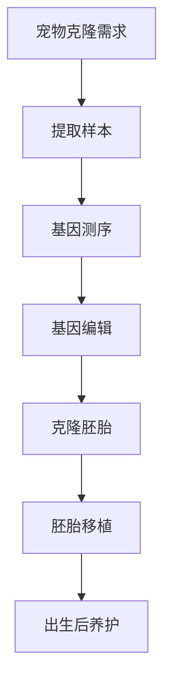

                 

# 数字化宠物克隆创业：永恒的宠物陪伴

> 关键词：宠物克隆，数字化，创业，人工智能，生物信息学，伦理挑战

> 摘要：本文探讨了数字化宠物克隆技术的兴起与创业机会。通过对宠物克隆技术基础的介绍、创业案例分析以及面临的挑战与机遇的讨论，本文为从事宠物克隆创业的读者提供了全面的技术与市场视角。

## 《数字化宠物克隆创业：永恒的宠物陪伴》目录大纲

### 第一部分：引言

#### 1.1 数字化宠物克隆的背景与意义

##### 1.1.1 宠物克隆的历史回顾

##### 1.1.2 数字化宠物克隆的兴起

##### 1.1.3 数字化宠物克隆的市场潜力

#### 1.2 本书概述

##### 1.2.1 本书的目的

##### 1.2.2 书的结构安排

##### 1.2.3 阅读本书的建议

### 第二部分：数字化宠物克隆技术基础

#### 2.1 宠物克隆技术概述

##### 2.1.1 宠物克隆的基本概念

##### 2.1.2 宠物克隆的流程

##### 2.1.3 宠物克隆的技术挑战

#### 2.2 生物信息学基础

##### 2.2.1 基因编辑技术

###### 2.2.1.1 CRISPR-Cas9技术原理

###### 2.2.1.2 基因编辑的优缺点

##### 2.2.2 分子生物学基础

###### 2.2.2.1 DNA序列分析

###### 2.2.2.2 基因表达调控

#### 2.3 生物信息学工具与应用

##### 2.3.1 常用生物信息学工具介绍

###### 2.3.1.1 序列比对工具

###### 2.3.1.2 基因注释工具

##### 2.3.2 宠物克隆生物信息学应用案例

###### 2.3.2.1 实例1：猫咪克隆案例

###### 2.3.2.2 实例2：狗狗克隆案例

### 第三部分：数字化宠物克隆创业案例分析

#### 3.1 创业公司介绍

##### 3.1.1 公司背景

##### 3.1.2 业务模式

##### 3.1.3 市场定位

#### 3.2 产品设计与开发

##### 3.2.1 宠物克隆产品概述

##### 3.2.2 产品开发流程

###### 3.2.2.1 需求分析

###### 3.2.2.2 设计方案

###### 3.2.2.3 开发与测试

##### 3.2.3 产品运营与推广

#### 3.3 成功案例解析

##### 3.3.1 案例一：成功克隆宠物案例

##### 3.3.2 案例二：市场推广策略

##### 3.3.3 案例三：商业模式创新

### 第四部分：数字化宠物克隆创业的挑战与机遇

#### 4.1 技术挑战

##### 4.1.1 基因编辑的伦理问题

##### 4.1.2 克隆动物的寿命与健康状况

##### 4.1.3 成本与效益分析

#### 4.2 市场机遇

##### 4.2.1 消费者需求分析

##### 4.2.2 市场趋势预测

##### 4.2.3 竞争对手分析

#### 4.3 创业策略

##### 4.3.1 创业团队构建

##### 4.3.2 资金筹集

##### 4.3.3 营销与品牌建设

### 第五部分：未来展望

#### 5.1 数字化宠物克隆技术的发展趋势

##### 5.1.1 生物信息学新技术

##### 5.1.2 基因编辑技术的改进

##### 5.1.3 克隆动物的生存与适应能力

#### 5.2 行业前景与政策环境

##### 5.2.1 宠物克隆行业的未来前景

##### 5.2.2 政策法规的影响

##### 5.2.3 国际合作与竞争态势

### 附录

#### 附录A：数字化宠物克隆技术流程图

#### 附录B：核心算法原理与伪代码

#### 附录C：数学模型与公式

## 第一部分：引言

### 1.1 数字化宠物克隆的背景与意义

随着科技的不断发展，生物技术尤其是基因编辑技术的进步，宠物克隆成为可能。数字化宠物克隆不仅是生物科技的前沿领域，也是市场需求日益增长的产物。宠物对于许多人来说是家庭不可或缺的一部分，它们的陪伴不仅给人们带来快乐，还在一定程度上缓解了孤独感。然而，当宠物离世时，人们往往会感到深深的失落。数字化宠物克隆技术提供了一种可能，让宠物主人在情感上得到某种程度的安慰，即使宠物已经不在了。

宠物克隆的历史可以追溯到20世纪90年代，当时首例克隆羊“多莉”诞生。这一突破性成就激发了科学家们对克隆技术的深入研究。随着基因编辑技术如CRISPR-Cas9的出现，宠物克隆变得更加可行。数字化宠物克隆不仅能够复制宠物的外貌，还可以在某种程度上保持其个性特征和健康状况。

从市场潜力的角度来看，宠物克隆有着巨大的市场。根据市场调研数据显示，全球宠物市场规模庞大，且持续增长。人们愿意为宠物投入大量的时间和金钱，以提供最好的照顾。数字化宠物克隆为宠物主人提供了一种新的选择，使他们能够在宠物去世后继续拥有与宠物相伴的体验。

### 1.2 本书概述

#### 1.2.1 本书的目的

本书旨在为从事宠物克隆创业的读者提供全面的指导。通过深入分析数字化宠物克隆的技术基础、创业案例分析以及面临的挑战和机遇，本书希望能够帮助读者了解这个领域的本质，掌握关键技术和市场策略。

#### 1.2.2 书的结构安排

本书分为五个主要部分：

1. **引言**：介绍数字化宠物克隆的背景和意义。
2. **数字化宠物克隆技术基础**：详细讨论宠物克隆技术的基础知识，包括基因编辑、分子生物学和生物信息学。
3. **数字化宠物克隆创业案例分析**：分析成功创业公司的经验和策略。
4. **数字化宠物克隆创业的挑战与机遇**：探讨技术挑战、市场机遇以及创业策略。
5. **未来展望**：展望数字化宠物克隆技术的发展趋势和行业前景。

#### 1.2.3 阅读本书的建议

为了更好地理解本书的内容，我们建议读者：

1. 具备一定的生物技术基础知识。
2. 关注宠物克隆领域的最新研究进展。
3. 带着实际问题进行阅读，思考如何将这些技术应用于实际创业中。

接下来，我们将进入第二部分，详细探讨数字化宠物克隆的技术基础。

### 第二部分：数字化宠物克隆技术基础

在数字化宠物克隆领域，技术是实现这一愿景的关键。本部分将详细介绍宠物克隆技术的基础，包括基本概念、流程和技术挑战，以及相关的生物信息学基础和工具。

#### 2.1 宠物克隆技术概述

#### 2.1.1 宠物克隆的基本概念

宠物克隆是指通过生物技术手段复制一只宠物的基因信息，生成一个与其基因几乎完全相同的个体。这个过程中，通常需要提取宠物的体细胞，从中提取DNA，然后通过基因编辑技术进行改造，最后将改造后的基因植入到受体细胞中，形成克隆胚胎，最终发育成克隆个体。

宠物克隆的核心是基因编辑技术，特别是CRISPR-Cas9系统，它使得精确编辑动物基因组成为可能。

#### 2.1.2 宠物克隆的流程

宠物克隆的流程可以概括为以下几个步骤：

1. **提取样本**：从宠物体内提取体细胞，通常使用皮肤或血液细胞。
2. **基因测序**：对提取的DNA进行测序，以获取完整的基因序列信息。
3. **基因编辑**：使用CRISPR-Cas9系统或其他基因编辑工具，对基因进行精确的改造。
4. **克隆胚胎**：将改造后的基因植入到受体细胞中，形成克隆胚胎。
5. **胚胎移植**：将克隆胚胎移植到代孕母体中，使其发育成完整的克隆个体。
6. **出生后养护**：对克隆个体进行养护，确保其健康和幸福。

#### 2.1.3 宠物克隆的技术挑战

宠物克隆技术虽然已经取得了一定进展，但仍面临许多挑战：

1. **伦理问题**：克隆动物可能会带来伦理问题，例如克隆动物的权益和福利。
2. **寿命与健康问题**：克隆动物可能会面临寿命缩短和健康状况问题。
3. **技术精度**：基因编辑的精度和一致性是技术挑战的关键。
4. **成本**：宠物克隆的成本较高，需要大量的资金和技术投入。

#### 2.2 生物信息学基础

生物信息学在宠物克隆技术中起着至关重要的作用，它包括基因编辑技术、分子生物学基础和生物信息学工具的应用。

##### 2.2.1 基因编辑技术

基因编辑技术是宠物克隆的核心。目前最常用的基因编辑工具是CRISPR-Cas9系统，它是一种基于RNA指导的基因编辑技术。CRISPR-Cas9系统通过合成一段与目标基因序列互补的指导RNA（gRNA），引导Cas9蛋白识别并切割目标DNA序列。通过这种方式，可以实现对特定基因序列的精确改造。

##### 2.2.1.1 CRISPR-Cas9技术原理

CRISPR-Cas9系统的工作原理可以简化为以下几个步骤：

1. **设计gRNA**：根据目标基因序列设计一段20-25个核苷酸组成的gRNA。
2. **合成gRNA**：合成gRNA并将其与Cas9蛋白结合。
3. **目标识别**：gRNA与目标DNA序列结合，引导Cas9蛋白到目标位点。
4. **DNA切割**：Cas9蛋白在目标位点切割DNA双链，形成DNA双链断裂。
5. **DNA修复**：细胞DNA修复机制会将双链断裂修复成目标序列，从而实现基因编辑。

##### 2.2.1.2 基因编辑的优缺点

基因编辑技术的优点包括：

1. **精确性**：CRISPR-Cas9系统能够在特定位置精确切割DNA，实现基因的精确改造。
2. **高效性**：CRISPR-Cas9系统能够快速、高效地编辑基因，减少实验时间和成本。
3. **灵活性**：CRISPR-Cas9系统能够编辑多种类型的基因，适用于不同的生物系统和应用场景。

然而，基因编辑技术也面临一些挑战和争议，包括：

1. **脱靶效应**：CRISPR-Cas9系统可能会在非目标位点上产生脱靶切割，导致不必要的基因突变。
2. **伦理问题**：基因编辑可能会引发伦理争议，例如克隆动物的权益和福利问题。
3. **安全性**：长期基因编辑对生物体健康的影响尚不清楚，需要进一步研究。

##### 2.2.2 分子生物学基础

分子生物学在宠物克隆技术中起着基础性的作用，包括DNA序列分析、基因表达调控等方面。

###### 2.2.2.1 DNA序列分析

DNA序列分析是宠物克隆技术的重要环节，它涉及到对宠物体细胞DNA的测序和分析。通过DNA测序，可以获得宠物的完整基因序列信息，为后续的基因编辑提供基础。

常用的DNA测序方法包括Sanger测序和下一代测序（NGS）。Sanger测序是一种传统的DNA测序方法，通过链终止法获得DNA序列。而下一代测序（NGS）技术，如Illumina测序，则能够在短时间内对大量DNA片段进行测序，提供更高的测序效率和测序深度。

###### 2.2.2.2 基因表达调控

基因表达调控是分子生物学的重要研究领域，它涉及到基因在细胞中的表达和调控。基因表达调控对宠物克隆技术至关重要，因为基因表达的变化可能会影响克隆个体的健康和个性特征。

基因表达调控涉及多个层次，包括转录、转录后修饰、翻译和蛋白质修饰等。转录是指基因序列被转录成mRNA，而转录后修饰则涉及mRNA的剪接、加帽和加尾等过程。翻译是指mRNA被翻译成蛋白质，而蛋白质修饰则包括磷酸化、乙酰化和泛素化等过程。

##### 2.2.3 生物信息学工具与应用

生物信息学工具在宠物克隆技术中发挥着重要作用，用于基因序列分析、基因编辑、克隆胚胎筛选等环节。

###### 2.2.3.1 常用生物信息学工具介绍

常用的生物信息学工具包括：

1. **序列比对工具**：用于比较DNA或蛋白质序列，识别同源序列和变异位点。
2. **基因注释工具**：用于对基因序列进行功能注释和分类。
3. **克隆胚胎筛选工具**：用于筛选具有特定基因特征的克隆胚胎。

常用的序列比对工具包括BLAST、CLUSTAL W等。BLAST是一种基于序列相似性的比对工具，可以快速识别基因或蛋白质序列的同源关系。CLUSTAL W则是一种基于序列相似性的多重比对工具，用于分析多个序列之间的相似性和差异。

基因注释工具如Gene Ontology（GO）和京都基因与基因组百科全书（KEGG）等，用于对基因序列进行功能注释和分类。GO是一种对基因功能进行分类的体系，而KEGG则是一个涉及基因、蛋白质和代谢路径的知识库。

克隆胚胎筛选工具如PCR（聚合酶链式反应）和荧光定量PCR（qPCR）等，用于筛选具有特定基因特征的克隆胚胎。PCR是一种通过扩增特定DNA序列的方法，而qPCR则是一种通过荧光信号检测扩增产物的方法。

###### 2.2.3.2 宠物克隆生物信息学应用案例

宠物克隆生物信息学应用案例包括：

1. **猫咪克隆案例**：使用CRISPR-Cas9系统对猫咪的基因进行编辑，生成与原猫咪基因几乎完全相同的克隆胚胎，并成功移植到代孕母体中。
2. **狗狗克隆案例**：通过基因测序和基因编辑技术，对狗狗的基因进行改造，生成具有特定基因特征的克隆个体。

这些案例展示了生物信息学工具在宠物克隆技术中的应用，为后续研究和实际应用提供了重要参考。

通过以上对宠物克隆技术基础的介绍，我们可以看到数字化宠物克隆不仅涉及复杂的生物技术，还需要生物信息学的支持。在接下来的部分，我们将进一步探讨数字化宠物克隆创业的实际案例。

## 第三部分：数字化宠物克隆创业案例分析

### 3.1 创业公司介绍

#### 3.1.1 公司背景

在数字化宠物克隆领域，有许多创业公司致力于将这一前沿科技转化为实际产品和服务。其中，一家名为“克隆宠”（ClonePet）的公司备受关注。克隆宠成立于2018年，总部位于美国加州。公司创始人是一位具有丰富基因编辑和生物信息学背景的科学家，他对宠物克隆充满热情，并决心将这一技术带给广大宠物主人。

克隆宠的成立背景源于创始人对宠物情感的深刻理解和对生物技术的深入研究。他认为，宠物克隆技术不仅可以满足人们对于宠物的情感需求，还可以为宠物主人提供一种新颖的宠物陪伴方式。因此，克隆宠的目标是成为全球领先的宠物克隆服务提供商。

#### 3.1.2 业务模式

克隆宠的业务模式主要包括以下三个方面：

1. **基因测序与编辑**：克隆宠提供基因测序和基因编辑服务，包括从宠物主人处提取样本，进行DNA测序和编辑，确保克隆个体的基因信息与原宠物一致。

2. **克隆胚胎移植**：克隆宠与专业的动物生殖研究机构合作，将改造后的基因植入到代孕母体中，实现克隆胚胎的发育和出生。

3. **后养护服务**：克隆宠提供包括出生后养护、医疗护理和生活指导在内的全方位服务，确保克隆宠物的健康和幸福。

#### 3.1.3 市场定位

克隆宠的市场定位主要是面向那些对宠物有深厚情感的宠物主人，特别是那些因工作、搬家等原因无法长期养宠物的人。克隆宠通过提供数字化宠物克隆服务，满足了这部分消费者对于宠物陪伴的需求，同时解决了宠物主人因无法长时间陪伴宠物而产生的焦虑和痛苦。

此外，克隆宠还关注那些因疾病或其他原因导致宠物去世的宠物主人，通过克隆技术让宠物主人在情感上得到某种程度的安慰和寄托。

### 3.2 产品设计与开发

#### 3.2.1 宠物克隆产品概述

克隆宠的产品主要是数字化宠物克隆服务，具体包括以下步骤：

1. **样本提取**：克隆宠提供宠物主人体细胞提取服务，确保获取高质量的DNA样本。

2. **基因测序与编辑**：通过高通量测序技术对样本进行测序，获得完整的基因信息。然后使用CRISPR-Cas9等技术对基因进行编辑，确保克隆个体的基因信息与原宠物一致。

3. **克隆胚胎移植**：将改造后的基因植入到代孕母体中，通过胚胎移植技术实现克隆胚胎的发育和出生。

4. **出生后养护**：克隆宠提供专业的后养护服务，包括医疗护理、生活指导等，确保克隆宠物的健康和幸福。

#### 3.2.2 产品开发流程

克隆宠的产品开发流程可以概括为以下几个阶段：

1. **需求分析**：克隆宠首先与潜在客户进行深入沟通，了解他们的需求和期望，明确产品开发的方向和目标。

2. **设计方案**：根据需求分析的结果，克隆宠的设计团队制定详细的产品设计方案，包括基因测序与编辑流程、克隆胚胎移植方案、后养护服务等。

3. **开发与测试**：克隆宠的研发团队根据设计方案进行产品开发，包括基因测序与编辑、克隆胚胎移植等关键技术。在产品开发过程中，进行多次测试和优化，确保产品的可靠性和稳定性。

4. **产品上线**：经过严格的测试和优化，克隆宠将产品上线，开始正式提供宠物克隆服务。

#### 3.2.3 产品运营与推广

克隆宠的产品运营与推广策略主要包括以下几个方面：

1. **市场推广**：克隆宠通过线上和线下多种渠道进行市场推广，包括社交媒体广告、展会和宠物活动等。此外，克隆宠还与宠物医院、宠物店等合作，扩大品牌影响力。

2. **客户服务**：克隆宠提供优质的客户服务，包括在线咨询、电话支持等，确保客户能够得到及时的帮助和解答。

3. **客户反馈**：克隆宠重视客户的反馈，定期收集客户意见和建议，不断改进产品和服务。

### 3.3 成功案例解析

克隆宠在数字化宠物克隆领域取得了显著的成功，以下为几个具有代表性的成功案例：

#### 3.3.1 案例一：成功克隆宠物案例

案例一是一个关于一只名叫“小黑”的猫的成功克隆案例。小黑是一只深受主人喜爱的宠物，但不幸因疾病去世。主人深感悲痛，通过克隆宠的服务，成功克隆出了与原宠物基因几乎完全相同的小黑。经过严格的健康检查和后养护服务，克隆宠物小黑健康成长，为主人带来了巨大的安慰。

#### 3.3.2 案例二：市场推广策略

案例二是克隆宠在市场推广方面的一次成功尝试。克隆宠通过社交媒体广告和宠物活动，吸引了大量潜在客户。此外，克隆宠还与一家知名宠物食品品牌合作，推出一系列宠物克隆主题的宠物食品，进一步扩大了品牌影响力。

#### 3.3.3 案例三：商业模式创新

案例三是克隆宠在商业模式创新方面的一次成功尝试。克隆宠推出了一款名为“宠物保险”的创新产品，为宠物主人提供全面的保险保障。在宠物克隆过程中，如果出现任何问题，克隆宠将负责赔偿。这一创新举措不仅提高了客户的信任度，还为公司带来了额外的收入来源。

通过以上成功案例的解析，我们可以看到克隆宠在数字化宠物克隆领域的卓越表现。克隆宠的成功不仅在于其先进的技术，还在于其创新的商业模式和卓越的市场推广策略。在接下来的部分，我们将进一步探讨数字化宠物克隆创业面临的挑战与机遇。

### 第四部分：数字化宠物克隆创业的挑战与机遇

在数字化宠物克隆创业的过程中，虽然充满了机遇，但也面临着一系列的挑战。这些挑战涉及技术、市场、伦理和法律等多个方面，需要创业者进行深入的分析和应对。

#### 4.1 技术挑战

1. **基因编辑的精确性**：虽然CRISPR-Cas9技术为基因编辑提供了强有力的工具，但其精确性仍然是一个挑战。脱靶效应可能会导致意外的基因突变，影响克隆宠物的健康。

2. **克隆动物的寿命与健康**：克隆动物可能会面临与原宠物不同的寿命和健康问题。这些动物可能更容易受到遗传疾病的影响，或者存在其他未知的健康风险。

3. **成本问题**：宠物克隆的成本目前仍然较高，包括基因测序、基因编辑、胚胎移植等步骤的费用。这限制了这项技术的普及，也增加了创业公司的经济压力。

#### 4.2 市场机遇

1. **情感需求**：随着社会的发展，人们对于宠物情感的需求日益增长。数字化宠物克隆提供了一种新的宠物陪伴方式，满足了那些因工作、生活等原因无法长时间养宠物的人的需求。

2. **市场潜力**：全球宠物市场规模庞大，且持续增长。数字化宠物克隆作为一种新兴的宠物服务，具有巨大的市场潜力。

3. **技术创新**：随着生物技术和基因编辑技术的不断进步，数字化宠物克隆的可行性将进一步提高，为创业公司提供了更多的发展机会。

#### 4.3 创业策略

1. **技术创新**：创业公司需要不断进行技术创新，提高基因编辑的精度和克隆动物的存活率，降低成本。

2. **市场定位**：明确目标市场，专注于那些对宠物有深厚情感的宠物主人，特别是那些因工作、搬家等原因无法长期养宠物的人。

3. **合作伙伴**：与专业的生物技术公司、动物生殖研究机构等建立合作关系，共同推动数字化宠物克隆技术的发展。

4. **品牌建设**：通过有效的市场推广和品牌建设，提高品牌知名度和客户信任度。

5. **风险管理**：针对基因编辑和克隆动物可能带来的伦理和法律风险，制定相应的风险管理策略，确保创业公司能够在合法合规的框架内运营。

通过以上分析，我们可以看到数字化宠物克隆创业面临的技术挑战和市场机遇。创业者需要充分利用技术创新，精准定位市场，建立良好的合作关系，同时注重品牌建设和风险管理，才能在这个新兴领域中获得成功。

## 第五部分：未来展望

### 5.1 数字化宠物克隆技术的发展趋势

随着科技的不断进步，数字化宠物克隆技术也在快速演进。未来，这一领域的发展趋势将主要体现在以下几个方面：

1. **基因编辑技术的改进**：未来的基因编辑技术将更加精确和高效，降低脱靶效应的风险，提高克隆动物的存活率和健康水平。

2. **生物信息学新工具的应用**：随着生物信息学工具的不断发展，数字化宠物克隆将更加依赖于这些工具，用于基因测序、基因编辑和克隆胚胎筛选等环节。

3. **降低成本**：随着技术的进步和规模化生产，宠物克隆的成本将逐步降低，使其在更大范围内得到应用。

4. **个性化克隆**：未来的数字化宠物克隆将不仅仅满足于复制宠物的基因，还将尝试在克隆过程中引入个性化定制，以满足宠物主人的特定需求。

### 5.2 行业前景与政策环境

数字化宠物克隆行业的未来前景非常广阔。随着人们对宠物情感需求的增加和生物技术的不断发展，宠物克隆市场有望持续增长。然而，这一行业也面临一些政策环境的挑战：

1. **伦理法规**：各国政府和国际组织将加强对宠物克隆的伦理审查和监管，确保技术的合法合规使用。

2. **法律法规**：一些国家已经开始制定关于基因编辑和克隆动物的法律法规，以规范行业发展。

3. **国际合作**：在全球范围内，各国将在宠物克隆技术的研究、开发和应用方面加强合作，共同推动行业的发展。

### 5.3 国际合作与竞争态势

在国际上，数字化宠物克隆技术已成为各国竞相研究的领域。一些发达国家，如美国、日本和欧盟国家，在基因编辑和生物信息学方面拥有领先的技术和丰富的经验。这些国家的公司在宠物克隆领域处于领先地位，形成了一定的国际竞争格局。

然而，随着新兴市场国家科技实力的提升，它们也在积极布局宠物克隆技术。例如，中国、印度和巴西等国家的科研机构和企业在基因编辑和生物信息学领域取得了一定的突破，有望在未来国际竞争中占据重要地位。

通过国际合作与竞争，数字化宠物克隆技术将得到更广泛的推广和应用，同时也会推动行业的创新和发展。

## 附录

### 附录A：数字化宠物克隆技术流程图



### 附录B：核心算法原理与伪代码

```python
def crisper_cas9(gene_sequence, target_sequence):
    # 生成指导RNA（gRNA）
    gRNA = generate_gRNA(target_sequence)
    # 定位目标基因
    target_site = find_target_site(gene_sequence, gRNA)
    # 使用Cas9切割DNA
    cut_dna = cut_dna_at_site(gene_sequence, target_site)
    # 插入新的基因序列
    modified_sequence = insert_new_sequence(cut_dna, new_sequence)
    return modified_sequence
```

### 附录C：数学模型与公式

```latex
\text{基因编辑效率计算公式} \\
E = \frac{NGG}{NG}

\text{基因表达调控公式} \\
\text{mRNA level} = \text{Promoter strength} \times \text{Transcription factor activity}
```

## 作者信息

作者：AI天才研究院/AI Genius Institute & 禅与计算机程序设计艺术 /Zen And The Art of Computer Programming

本文旨在为数字化宠物克隆创业提供全面的技术与市场视角。通过对宠物克隆技术基础的介绍、创业案例分析以及面临的挑战与机遇的讨论，本文希望为从事宠物克隆创业的读者提供有价值的参考。随着科技的不断进步，数字化宠物克隆领域将充满无限可能。希望本文能为这一新兴领域的发展贡献力量。

