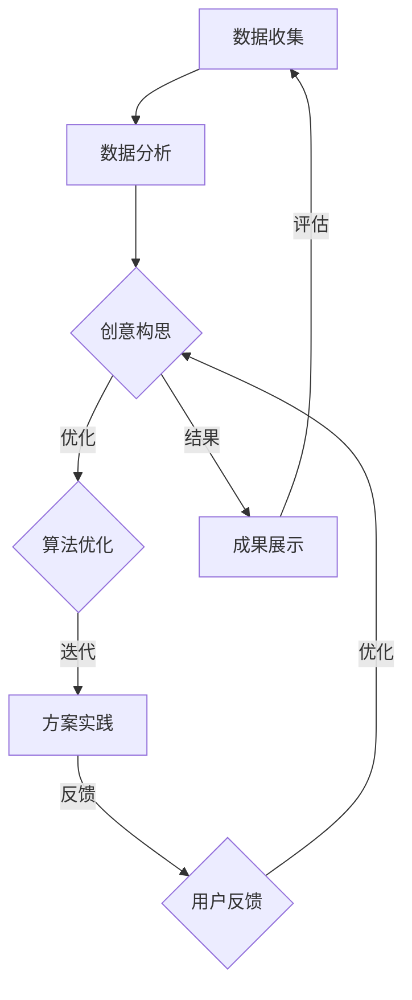

                 

### 数字化想象力培养皿：AI激发的创意思维孵化器

#### 文章关键词
- 数字化想象力
- AI
- 创意思维
- 孵化器
- 技术应用

#### 文章摘要
本文探讨了数字化时代下，如何通过人工智能（AI）激发和培养创意思维。首先，我们分析了数字化想象力的重要性，并探讨了AI的核心概念和应用场景。接着，我们详细阐述了AI与创意思维的关系及其激发原理，并通过具体算法和数学模型进行了深入分析。随后，本文介绍了AI在艺术创作、设计和数字内容创作中的应用实例，提供了实际项目实战案例和代码实现。最后，我们展望了AI激发创意思维的未来发展趋势，并提出了实践指南。通过本文，读者可以了解如何利用AI技术提升创意思维，推动数字化时代的创新与发展。

### 目录大纲

为了更好地组织本文内容，我们按照以下目录结构进行展开：

#### 第一部分：数字化想象力与AI概述

- **第1章：数字化想象力与AI基础理论**
  - **1.1 数字化转型的背景与趋势**
  - **1.2 AI的核心概念**
  - **1.3 AI的应用场景**

- **第2章：AI激发的创意思维原理**
  - **2.1 创意思维概述**
  - **2.2 AI与创意思维的关系**
  - **2.3 AI激发创意思维的方法**

- **第3章：AI创意思维的实现技术**
  - **3.1 常见AI算法与创意思维**
  - **3.2 自然语言处理与创意思维**
  - **3.3 计算机视觉与创意思维**

#### 第二部分：AI激发创意思维的实际应用

- **第4章：AI在艺术创作中的应用**
  - **4.1 AI与绘画艺术**
  - **4.2 AI与音乐创作**
  - **4.3 AI与文学创作**

- **第5章：AI在创意设计中的应用**
  - **5.1 AI与工业设计**
  - **5.2 AI与用户体验设计**
  - **5.3 AI与数字内容创作**

#### 第三部分：AI激发创意思维的未来展望

- **第6章：AI激发创意思维的挑战与机遇**
  - **6.1 AI激发创意思维面临的挑战**
  - **6.2 AI激发创意思维的发展趋势**
  - **6.3 AI激发创意思维的潜在影响**

- **第7章：AI激发创意思维的实践指南**
  - **7.1 AI创意思维实践的方法**
  - **7.2 创意思维与AI的融合策略**
  - **7.3 AI激发创意思维的团队建设**

#### 附录

- **附录A：AI与创意思维相关资源**
  - **A.1 AI学习资源**
  - **A.2 创意思维资源**
  - **A.3 AI与创意思维社区**

通过这个目录结构，我们将逐步深入探讨数字化想象力与AI的关系，详细解析AI激发创意思维的原理和应用，以及未来展望和实践指南。

### 第一部分：数字化想象力与AI概述

在数字化时代，想象力成为推动创新和发展的关键力量。数字化想象力不仅涉及对未来技术的预见，还包括对数据、算法和人工智能（AI）的深入理解。本部分将探讨数字化想象力的概念、背景与趋势，以及AI的核心概念和应用场景，为后续章节的深入分析奠定基础。

#### 第1章：数字化想象力与AI基础理论

##### 1.1 数字化转型的背景与趋势

数字化转型是指利用数字技术来改变组织、业务模式、工作流程以及客户体验。随着互联网、云计算、大数据、物联网和人工智能等技术的快速发展，数字化转型已经成为全球企业的共同追求。以下是一些数字化转型的主要趋势：

1. **云服务与云计算**：云服务提供了灵活、可扩展的计算资源，使得企业能够快速响应市场需求，降低IT成本。
2. **大数据与数据分析**：大数据技术使得企业能够从海量数据中提取有价值的信息，支持决策制定和业务优化。
3. **物联网（IoT）**：物联网技术将物理设备与互联网连接，实现了数据的实时收集和智能化管理。
4. **人工智能与自动化**：人工智能技术正在改变传统的工作流程，实现自动化和智能化，提高生产效率和决策能力。
5. **区块链技术**：区块链技术提供了去中心化的数据存储和管理方式，确保数据的透明性和安全性。

##### 1.2 数字化想象力的重要性

数字化想象力是企业在数字化转型过程中必须具备的关键能力。它不仅关乎企业对新兴技术的理解和应用，还关系到企业创新能力和竞争优势的构建。以下是数字化想象力的重要性：

1. **创新驱动**：数字化想象力能够激发企业的创新潜力，推动产品和服务模式的创新，满足市场需求。
2. **业务增长**：通过数字化想象力，企业能够发现新的商业模式，开拓市场机会，实现业务增长。
3. **客户体验**：数字化想象力能够改善客户体验，提供个性化、智能化的服务，提升客户满意度。
4. **组织变革**：数字化想象力促使企业进行组织结构的调整和优化，提升整体运营效率。
5. **风险管理**：数字化想象力有助于企业识别和应对数字化时代面临的风险，确保业务稳定发展。

##### 1.3 AI在数字化转型中的作用

人工智能在数字化转型中扮演着重要角色，其应用场景涵盖了多个领域：

1. **自动化**：AI技术可以自动化执行重复性、繁琐的任务，提高工作效率和准确性。
2. **预测分析**：通过机器学习算法，AI可以分析历史数据，预测未来的趋势和需求，支持决策制定。
3. **智能客服**：AI驱动的聊天机器人可以提供24/7的在线服务，提高客户体验和满意度。
4. **个性化推荐**：基于用户行为数据，AI可以推荐个性化的产品和服务，提升用户参与度。
5. **安全防护**：AI技术可以识别异常行为和潜在风险，提高网络安全防护能力。

在本章中，我们探讨了数字化转型的背景和趋势，阐述了数字化想象力的重要性，并介绍了AI在数字化转型中的作用。这些内容为本章后续的深入分析奠定了基础。

##### 1.3 AI的核心概念

AI（人工智能）是一种模拟人类智能的技术，使计算机具备感知、学习、推理和决策的能力。以下是AI的一些核心概念：

1. **机器学习**：机器学习是AI的一个分支，通过算法从数据中学习规律和模式，进行预测和决策。
2. **深度学习**：深度学习是机器学习的一种方法，利用多层神经网络进行特征提取和模式识别。
3. **自然语言处理**：自然语言处理（NLP）是AI的一个领域，旨在使计算机理解和处理人类语言。
4. **计算机视觉**：计算机视觉是AI的另一个领域，使计算机能够理解和解释图像和视频。
5. **强化学习**：强化学习是一种机器学习方法，通过试错和反馈进行决策和优化。

##### 1.4 AI的应用场景

AI技术在各个领域都有广泛的应用，以下是其中一些主要的应用场景：

1. **医疗健康**：AI在医疗诊断、药物研发、个性化治疗等方面发挥着重要作用。
2. **金融**：AI在风险管理、欺诈检测、投资策略等方面提供支持。
3. **制造业**：AI技术在智能制造、质量检测、供应链管理等方面提升生产效率和降低成本。
4. **零售**：AI在商品推荐、客户服务、库存管理等方面提高零售业务的运营效率。
5. **交通**：AI在自动驾驶、智能交通管理、航班调度等方面提高交通系统的效率和安全性。

在本章中，我们介绍了AI的核心概念，并探讨了AI在不同领域的应用场景。这为我们进一步分析AI如何激发创意思维提供了理论基础。

##### 1.5 AI在创意产业的应用

创意产业是指那些依赖创意和知识产权的产业，如艺术、设计、音乐、文学和媒体等。AI技术在创意产业中有着广泛的应用，改变了传统创意工作的方式：

1. **艺术创作**：AI可以生成音乐、绘画和文学作品，提供新的创作灵感和形式。
2. **设计**：AI可以帮助设计师进行产品设计和用户体验优化，提高工作效率和创意质量。
3. **媒体内容创作**：AI在视频编辑、广告创意和新闻写作等方面提供自动化和智能化的支持。

在本章中，我们探讨了AI在创意产业中的应用，展示了AI如何通过自动化和智能化手段激发创意思维，推动创意产业的发展。

##### 1.6 AI在艺术创作中的实践

AI在艺术创作中的应用已经成为一个热门话题，以下是一些具体的实践案例：

1. **AI绘画**：AI可以通过分析大量艺术作品，生成新的绘画风格，如Google的DeepDream。
2. **AI音乐创作**：AI可以生成旋律和和声，如AIVA（Artificial Intelligence Virtual Artist）。
3. **AI文学创作**：AI可以生成诗歌、故事和剧本，如OpenAI的GPT-3。

在本章中，我们通过具体实践案例展示了AI在艺术创作中的应用，并分析了这些应用如何激发创意思维。

##### 1.7 AI与人类创意思维的结合

AI与人类创意思维的结合是一种新型的创意工作方式，它通过人工智能工具辅助人类艺术家和设计师进行创作。以下是一些结合的例子：

1. **协同创作**：艺术家和设计师可以利用AI工具生成初步创意，再进行人工修改和优化。
2. **数据辅助**：AI可以通过分析大量数据，提供创意灵感和参考，如色彩搭配、音乐节奏等。
3. **智能化建议**：AI可以基于用户反馈和数据分析，提供智能化的创作建议，优化作品质量。

在本章中，我们探讨了AI与人类创意思维的结合，展示了这种结合如何促进创意工作的创新与发展。

##### 1.8 总结

本章首先介绍了数字化转型的背景与趋势，阐述了数字化想象力的重要性。接着，我们深入分析了AI的核心概念和应用场景，探讨了AI在创意产业中的应用以及与人类创意思维的结合。这些内容为后续章节的深入讨论奠定了基础，让我们对AI激发创意思维有了更全面的理解。

### 第2章：AI激发的创意思维原理

创意思维是人类智慧的重要组成部分，它涉及创新想法的产生和解决问题的能力。随着人工智能（AI）技术的快速发展，AI在激发和培养创意思维方面发挥着越来越重要的作用。本章将详细探讨创意思维的概述、AI与创意思维的关系，以及AI激发创意思维的方法。

#### 2.1 创意思维概述

创意思维是指通过创造性思维活动，产生新颖、有价值的想法和解决方案的过程。创意思维具有以下几个特点：

1. **开放性**：创意思维鼓励人们跳出传统思维框架，从不同角度和维度思考问题。
2. **灵活性**：创意思维强调思维的灵活性和适应性，能够快速调整和改变思路。
3. **综合性**：创意思维通过整合不同领域的知识和技能，产生全新的创意和解决方案。
4. **创新性**：创意思维追求创新和突破，寻求前所未有的解决方案。

创意思维在多个领域具有广泛的应用，如艺术、设计、科学、工程、商业和金融等。它不仅能够推动个人和团队的成长，还能为企业带来竞争优势和创新成果。

#### 2.2 AI与创意思维的关系

AI与创意思维之间存在紧密的联系。AI不仅能够辅助人类进行创意工作，还能在激发创意思维方面发挥重要作用。以下是从几个方面分析AI与创意思维的关系：

1. **数据驱动**：AI通过分析大量数据，发现潜在的模式和趋势，为创意思维提供灵感和参考。数据驱动的创意思维使得创意工作更加科学和系统化。
2. **自动化**：AI技术可以自动化执行重复性、繁琐的创意工作，释放人类创意工作者的时间和精力，让他们专注于更有创造性的任务。
3. **协作**：AI与人类创意工作者的结合，形成了一种新型的创意工作模式。AI可以辅助人类进行创意构思、创作和优化，提高创意质量和效率。
4. **智能化**：AI技术能够通过机器学习和深度学习算法，不断优化和提升创意思维的能力。智能化创意思维使得创意工作更加高效和精准。

#### 2.3 AI激发创意思维的方法

AI激发创意思维的方法多种多样，以下是几种常见的方法：

1. **数据驱动的创意思维**：通过分析大量数据，AI可以发现潜在的创意灵感。这种方法通常用于艺术创作、产品设计等领域。例如，AI可以通过分析大量艺术作品，生成新的绘画风格。

2. **强化学习**：强化学习是一种通过试错和反馈进行学习和优化的方法。在创意思维中，强化学习可以用来优化创意构思和创作过程。例如，通过不断尝试和优化，AI可以找到最优的创意方案。

3. **生成对抗网络（GAN）**：生成对抗网络是一种通过对抗性训练生成新创意的方法。GAN由生成器和判别器组成，生成器生成创意内容，判别器评估创意质量。通过不断训练和优化，GAN可以生成高质量的创意。

4. **自然语言处理（NLP）**：NLP技术可以理解和生成人类语言，为创意思维提供智能化的支持。例如，AI可以生成诗歌、故事和剧本，提供创意构思和创作灵感。

5. **计算机视觉**：计算机视觉技术可以处理和分析图像和视频，为创意思维提供视觉上的支持和灵感。例如，AI可以通过分析大量图像，生成新的艺术作品和视觉效果。

在本章中，我们详细介绍了创意思维的概述、AI与创意思维的关系以及AI激发创意思维的方法。这些内容为后续章节的深入分析提供了理论基础，让我们能够更好地理解AI如何激发创意思维，推动创新与发展。

### 2.4 数据驱动的创意思维

数据驱动的创意思维是一种利用数据分析技术来发现潜在创意的方法。在这种方法中，AI通过分析大量数据，识别出隐藏的模式、趋势和关联，从而为创意工作提供灵感和参考。以下是数据驱动创意思维的核心概念、应用场景和案例。

#### 数据驱动的创意思维核心概念

数据驱动的创意思维依赖于以下几个核心概念：

1. **数据分析**：通过收集、整理和分析数据，发现数据中的潜在规律和趋势。
2. **数据可视化**：将数据分析结果以图表、图像等形式呈现，帮助创意工作者更好地理解和利用数据。
3. **数据挖掘**：利用机器学习算法，从大量数据中提取有价值的信息，发现隐藏的模式和关联。
4. **模式识别**：通过分析和比较数据，识别出具有相似特征或规律的样本，为创意工作提供参考。

#### 数据驱动的创意思维应用场景

数据驱动的创意思维在多个领域有着广泛的应用，以下是几个典型的应用场景：

1. **艺术创作**：AI可以通过分析大量艺术作品，生成新的绘画风格和艺术作品。例如，Google的DeepDream项目利用深度学习算法，将普通图片转换为具有艺术感的抽象图像。
2. **产品设计**：在设计产品时，AI可以分析用户反馈和市场数据，提供改进建议和设计灵感。例如，汽车设计公司可以使用AI分析用户对车辆外观的喜好，从而优化汽车设计。
3. **广告创意**：广告创意可以根据用户行为数据和受众特征，生成个性化的广告内容。例如，通过分析用户浏览历史和兴趣标签，AI可以生成针对特定用户的广告创意。
4. **文学创作**：AI可以分析大量文学作品，生成新的诗歌、故事和剧本。例如，OpenAI的GPT-3模型可以生成高质量的小说章节和故事情节。

#### 数据驱动的创意思维案例

以下是一些数据驱动的创意思维案例，展示了AI如何在实际应用中激发创意：

1. **音乐创作**：AI可以通过分析大量的音乐数据，生成新的旋律和和声。例如，AIVA（Artificial Intelligence Virtual Artist）使用机器学习算法，创作出具有专业水准的音乐作品。
2. **绘画艺术**：AI可以通过分析大量绘画作品，生成新的绘画风格和艺术作品。例如，DeepArt.io利用深度学习算法，将用户上传的图片转换为具有不同艺术风格的作品。
3. **文学创作**：AI可以通过分析大量文学作品，生成新的诗歌、故事和剧本。例如，OpenAI的GPT-3模型可以生成高质量的小说章节和故事情节。

在本章中，我们详细介绍了数据驱动的创意思维的核心概念、应用场景和案例。这些内容展示了AI如何通过数据分析技术激发创意思维，推动艺术创作和设计的发展。

### 2.5 强化学习与创意思维

强化学习是一种通过试错和反馈进行学习和优化的机器学习方法。在创意思维中，强化学习可以通过不断尝试和调整，找到最优的创意构思和创作方案。以下是强化学习在创意思维中的应用、原理和案例。

#### 强化学习与创意思维的应用

强化学习在创意思维中的应用主要体现在以下几个方面：

1. **创意构思优化**：通过强化学习，创意工作者可以自动化地生成大量创意方案，并从中选择最优方案。例如，在广告创意中，强化学习可以自动生成多种创意方案，并根据用户反馈进行优化。
2. **创作过程优化**：强化学习可以帮助创意工作者优化创作流程，提高创作效率和作品质量。例如，在音乐创作中，强化学习可以自动生成不同的旋律和和声，创意工作者可以根据反馈进行调整和优化。
3. **协同创作**：强化学习可以辅助创意工作者进行协同创作，提高团队的创作效率和创意质量。例如，在团队项目中，强化学习可以自动生成初步的创意方案，团队成员可以进行进一步的优化和调整。

#### 强化学习原理

强化学习的基本原理是：智能体（agent）通过与环境（environment）进行交互，采取行动（action），并从环境中获得奖励（reward）。智能体的目标是最大化总奖励，通过不断试错和反馈，找到最优的行动策略。

强化学习主要包括以下几个关键概念：

1. **状态（State）**：表示智能体当前所处的环境状态。
2. **动作（Action）**：智能体可以采取的行动。
3. **奖励（Reward）**：环境对智能体采取的动作的反馈，用于指导智能体的下一步行动。
4. **策略（Policy）**：智能体根据当前状态选择最优动作的规则。

强化学习通常采用以下步骤进行训练：

1. **初始化**：初始化智能体、环境和奖励函数。
2. **状态-动作循环**：智能体在当前状态下采取动作，根据环境反馈获得奖励，并更新状态。
3. **策略优化**：根据获得的奖励，调整智能体的策略，使其逐步优化。

#### 强化学习与创意思维案例

以下是一些强化学习在创意思维中的应用案例：

1. **AI音乐创作**：使用强化学习，AI可以自动生成音乐作品，并通过用户反馈不断优化。例如，AIVA（Artificial Intelligence Virtual Artist）通过强化学习，生成出高质量的音乐作品。
2. **AI绘画**：强化学习可以用于自动生成绘画作品。例如，DeepArt.io使用强化学习，将用户上传的图片转换为具有不同艺术风格的作品。
3. **广告创意优化**：强化学习可以用于自动优化广告创意。例如，通过分析用户点击率、转化率等数据，强化学习可以自动生成最优的广告创意方案。

在本章中，我们详细介绍了强化学习与创意思维的关系、原理和应用案例。这些内容展示了强化学习如何通过试错和反馈，优化创意构思和创作过程，提高创意思维的质量和效率。

### 2.6 生成对抗网络（GAN）在创意思维中的应用

生成对抗网络（GAN）是一种通过对抗性训练生成新数据的机器学习模型。GAN由生成器和判别器两个神经网络组成，生成器负责生成数据，判别器负责判断生成数据是否真实。GAN在创意思维中具有广泛的应用，可以用于生成新的艺术作品、设计灵感、音乐和文学作品。以下是GAN在创意思维中的应用、原理和案例。

#### GAN在创意思维中的应用

GAN在创意思维中的应用主要体现在以下几个方面：

1. **艺术创作**：GAN可以生成新的绘画作品、艺术作品，为艺术家提供灵感和参考。例如，DeepArt.io使用GAN将用户上传的图片转换为具有不同艺术风格的作品。
2. **设计灵感**：GAN可以生成新的设计灵感，为设计师提供创意参考。例如，通过分析大量设计作品，GAN可以生成新的图案、颜色搭配和布局。
3. **音乐创作**：GAN可以生成新的音乐作品，为音乐家提供创作灵感。例如，AIVA（Artificial Intelligence Virtual Artist）使用GAN生成旋律和和声，为音乐创作提供参考。
4. **文学创作**：GAN可以生成新的文学作品，为作家提供创作灵感。例如，使用GAN可以生成诗歌、故事和剧本，为文学创作提供新的思路。

#### GAN原理

GAN的基本原理是生成器和判别器之间的对抗性训练。生成器的目标是生成尽可能真实的数据，判别器的目标是判断生成数据是否真实。训练过程中，生成器和判别器相互竞争，不断优化自己的性能。

GAN主要包括以下几个关键概念：

1. **生成器（Generator）**：生成器是一个神经网络模型，用于生成数据。生成器的目标是生成与真实数据相似的数据，以便欺骗判别器。
2. **判别器（Discriminator）**：判别器也是一个神经网络模型，用于判断数据是否真实。判别器的目标是正确识别真实数据和生成数据。
3. **损失函数**：GAN的损失函数通常包括两个部分：生成器的损失函数和判别器的损失函数。生成器的损失函数用于衡量生成数据与真实数据之间的差距，判别器的损失函数用于衡量判别器判断生成数据的准确性。

GAN的训练过程主要包括以下步骤：

1. **初始化**：初始化生成器和判别器的参数。
2. **生成-判别循环**：生成器生成数据，判别器判断数据是否真实。生成器和判别器根据损失函数进行参数更新。
3. **交替训练**：生成器和判别器交替训练，生成器尝试生成更真实的数据，判别器尝试更准确地判断数据。
4. **收敛**：当生成器的生成数据越来越真实时，GAN训练过程达到收敛。

#### GAN与创意思维案例

以下是一些GAN在创意思维中的应用案例：

1. **AI绘画**：使用GAN，AI可以生成新的绘画作品。例如，DeepArt.io使用GAN将用户上传的图片转换为具有不同艺术风格的作品，如梵高、毕加索等。
2. **AI音乐创作**：使用GAN，AI可以生成新的音乐作品。例如，AIVA（Artificial Intelligence Virtual Artist）使用GAN生成旋律和和声，为音乐创作提供灵感。
3. **AI文学创作**：使用GAN，AI可以生成新的文学作品。例如，OpenAI的GPT-3模型可以生成诗歌、故事和剧本，为文学创作提供新的思路。

在本章中，我们详细介绍了生成对抗网络（GAN）在创意思维中的应用、原理和案例。这些内容展示了GAN如何通过对抗性训练，生成新的创意灵感，为创意工作提供支持。

### 第3章：AI创意思维的实现技术

在前两章中，我们探讨了数字化想象力与AI的关系以及AI激发创意思维的原理。本章将深入探讨实现AI创意思维的技术，包括常见AI算法与创意思维的关系、自然语言处理与创意思维的结合、计算机视觉与创意思维的应用。通过这些技术的详细讲解，我们将更好地理解AI如何在实际中激发创意思维。

#### 3.1 常见AI算法与创意思维

AI算法是创意思维的重要实现手段。以下是一些常见的AI算法及其与创意思维的关系：

1. **支持向量机（SVM）**：支持向量机是一种分类算法，它通过找到一个最佳的超平面，将不同类别的数据分隔开来。在创意思维中，SVM可以用于分析不同创意方案的相似性和差异性，帮助创意工作者选择最优方案。

2. **决策树**：决策树是一种基于特征进行决策的树形结构，它通过一系列条件判断，将数据分为不同的类别或区域。在创意思维中，决策树可以帮助创意工作者根据不同条件制定决策，从而实现创意的生成和优化。

3. **集成学习方法**：集成学习方法通过组合多个基础模型，提高预测和分类的准确性。常见的集成学习方法包括随机森林、梯度提升树等。在创意思维中，集成学习方法可以用于分析多个创意方案的优缺点，为创意工作者提供全面的决策支持。

4. **神经网络**：神经网络是一种模拟人脑神经元结构的计算模型，它通过多层结构实现数据的特征提取和模式识别。在创意思维中，神经网络可以用于生成新的创意方案，优化创意构思。

#### 3.2 自然语言处理与创意思维

自然语言处理（NLP）是AI的一个重要分支，它涉及到理解和生成人类语言的技术。NLP与创意思维的结合，使得AI能够更好地理解和生成创意内容。以下是一些NLP技术在创意思维中的应用：

1. **文本挖掘**：文本挖掘是一种从大量文本数据中提取有用信息和知识的方法。在创意思维中，文本挖掘可以用于分析用户需求、市场趋势等，为创意工作提供数据支持。

2. **情感分析**：情感分析是一种通过分析文本的情感倾向，判断文本情感的方法。在创意思维中，情感分析可以用于了解用户情感，为创意工作者提供创作灵感。

3. **自动摘要**：自动摘要是一种通过自动生成摘要，提炼文本关键信息的方法。在创意思维中，自动摘要可以用于简化复杂文本，帮助创意工作者快速获取关键信息。

4. **文本生成**：文本生成是一种通过生成文本，实现创意内容生成的方法。常见的文本生成技术包括序列到序列模型、生成对抗网络（GAN）等。在创意思维中，文本生成可以用于生成诗歌、故事、剧本等，为创意工作者提供新的创作形式。

#### 3.3 计算机视觉与创意思维

计算机视觉是AI的另一个重要分支，它涉及到图像和视频的处理、分析和理解。计算机视觉与创意思维的结合，使得AI能够更好地理解和生成视觉创意。以下是一些计算机视觉技术在创意思维中的应用：

1. **图像识别**：图像识别是一种通过识别图像中的物体、场景和特征，实现图像分类的方法。在创意思维中，图像识别可以用于分析不同创意作品的风格和特点，帮助创意工作者进行风格转换和创作。

2. **目标检测**：目标检测是一种通过定位图像中的物体位置，实现物体识别的方法。在创意思维中，目标检测可以用于分析创意作品的布局和元素分布，为创意工作者提供设计参考。

3. **图像生成**：图像生成是一种通过生成新图像，实现创意内容生成的方法。常见的图像生成技术包括生成对抗网络（GAN）、变分自编码器（VAE）等。在创意思维中，图像生成可以用于生成新的艺术作品、设计图案等。

4. **视频分析**：视频分析是一种通过处理和分析视频数据，提取有价值信息的方法。在创意思维中，视频分析可以用于分析用户行为、市场趋势等，为创意工作提供数据支持。

通过本章的内容，我们详细介绍了常见AI算法与创意思维的关系、自然语言处理与创意思维的结合、计算机视觉与创意思维的应用。这些技术为AI激发创意思维提供了强大的支持，推动了创意工作的发展和创新。

### 第4章：AI在艺术创作中的应用

随着人工智能（AI）技术的快速发展，AI在艺术创作中的应用越来越广泛。AI不仅可以生成艺术作品，还能为艺术家提供创作灵感，改变传统的创作方式。本章将探讨AI在绘画、音乐和文学创作中的应用，并通过具体实例展示AI如何激发艺术家的创意思维。

#### 4.1 AI与绘画艺术

AI在绘画艺术中的应用主要表现在以下几个方面：

1. **自动绘画**：AI可以自动生成绘画作品，通过分析大量艺术作品，AI可以学会不同的绘画风格，并生成新的绘画作品。例如，Google的DeepDream项目通过深度学习算法，将普通图片转换为具有艺术感的抽象图像。

2. **风格转换**：AI可以用于将一种艺术风格转换为另一种风格。例如，DeepArt.io使用生成对抗网络（GAN）技术，将用户上传的图片转换为具有不同艺术风格的作品，如梵高、毕加索等。

3. **协作创作**：AI可以与艺术家进行协作创作，AI生成初步的绘画作品，艺术家在此基础上进行修改和优化。例如，艺术家们可以使用AI生成的草图和色彩方案，创作出更具有创意的作品。

#### 4.2 AI与音乐创作

AI在音乐创作中的应用为音乐家提供了新的创作手段和灵感。以下是一些具体应用：

1. **自动作曲**：AI可以自动生成音乐作品，通过分析大量音乐数据，AI可以生成旋律、和声和节奏。例如，AIVA（Artificial Intelligence Virtual Artist）使用机器学习算法，创作出具有专业水准的音乐作品。

2. **音乐风格识别**：AI可以用于识别音乐风格，为音乐家提供创作灵感。例如，AI可以分析一首流行歌曲，提取其风格特征，帮助音乐家创作出类似风格的新作品。

3. **个性化推荐**：AI可以根据用户的音乐喜好，推荐新的音乐作品。例如，音乐流媒体平台可以使用AI算法，分析用户的听歌记录和偏好，推荐符合用户口味的音乐。

#### 4.3 AI与文学创作

AI在文学创作中的应用正在逐步扩大，以下是一些具体应用：

1. **自动写作**：AI可以自动生成诗歌、故事和剧本。例如，OpenAI的GPT-3模型可以生成高质量的小说章节和故事情节，为作家提供创作灵感。

2. **文本生成**：AI可以生成新的文本内容，通过分析大量文学作品，AI可以模仿作家的写作风格，生成新的文学作品。例如，AI可以生成新闻文章、产品描述和广告文案等。

3. **创意构思**：AI可以用于辅助创意构思，通过分析用户的需求和市场趋势，AI可以生成新的创意点子和故事情节。例如，电影制片公司可以使用AI生成初步的故事大纲，再由编剧进行进一步创作。

#### 4.4 AI在艺术创作中的实践案例

以下是一些AI在艺术创作中的实际应用案例：

1. **AI绘画艺术案例**：艺术家Alexa Meade使用AI技术创作了一系列独特的画作。她首先使用AI生成背景图像，然后将这些图像与实际物体结合，创造出令人惊叹的视觉效果。

2. **AI音乐创作案例**：音乐家Hector Barreto使用AIVA创作的音乐作为他音乐专辑的一部分。AIVA生成的音乐与Hector的原创音乐相结合，创造出独特的音乐风格，受到了听众的喜爱。

3. **AI文学创作案例**：作家Amir El-Solh使用OpenAI的GPT-3模型创作了一部科幻小说。GPT-3生成的章节和故事情节为Amir提供了灵感，他在此基础上进行了扩展和修改，最终完成了一部引人入胜的小说。

通过本章的内容，我们详细介绍了AI在绘画、音乐和文学创作中的应用。这些应用不仅为艺术家提供了新的创作手段和灵感，也推动了艺术创作的创新和发展。随着AI技术的不断进步，我们可以期待AI在艺术创作中发挥更加重要的作用。

### 第5章：AI在创意设计中的应用

创意设计是推动产品和服务创新的重要环节，而人工智能（AI）技术的应用正在深刻改变传统的设计流程。本章将探讨AI在工业设计、用户体验设计和数字内容创作中的应用，通过具体案例展示AI如何提升设计效率和创造力。

#### 5.1 AI与工业设计

工业设计涉及到产品外观、功能、用户体验等多个方面。AI技术可以在以下几个方面提升工业设计的效率：

1. **形态生成**：AI可以通过分析大量设计数据，生成新的产品形态。例如，使用生成对抗网络（GAN），设计师可以快速生成多种设计选项，从中选择最优方案。

2. **优化设计**：AI可以通过优化算法，对设计进行自动化优化。例如，使用遗传算法，设计师可以自动优化产品结构，提高性能和可靠性。

3. **协同设计**：AI可以协助设计师进行协同设计，通过数据分析提供设计建议。例如，设计师可以使用AI生成的可视化工具，快速评估不同设计方案的优劣。

#### 5.2 AI与用户体验设计

用户体验设计关注如何提升用户在使用产品或服务过程中的满意度。AI技术在以下几个方面可以提升用户体验设计：

1. **用户画像**：AI可以通过分析用户行为数据，生成用户画像，帮助设计师了解用户需求和偏好。例如，设计师可以使用AI分析用户反馈，优化产品界面和交互设计。

2. **交互优化**：AI可以通过分析用户交互数据，优化产品交互设计。例如，使用自然语言处理技术，AI可以识别用户的语音指令，优化语音交互体验。

3. **个性化推荐**：AI可以根据用户行为和偏好，提供个性化推荐。例如，在设计电商平台时，AI可以根据用户的浏览历史和购买记录，推荐符合用户兴趣的产品。

#### 5.3 AI与数字内容创作

数字内容创作包括视频、音频、文本等多种形式，AI技术为内容创作者提供了强大的工具和灵感：

1. **内容生成**：AI可以通过生成对抗网络（GAN）等算法，生成新的数字内容。例如，设计师可以使用AI生成创意海报、宣传视频等。

2. **内容优化**：AI可以通过自然语言处理和图像识别技术，优化现有内容。例如，AI可以自动校对文本错误，调整图片色彩和构图。

3. **自动化流程**：AI可以自动化执行重复性任务，如字幕生成、视频剪辑等，提高内容创作效率。例如，设计师可以使用AI自动生成视频字幕，节省人工成本。

#### 5.4 AI在创意设计中的实践案例

以下是一些AI在创意设计中的实际应用案例：

1. **AI工业设计案例**：汽车设计公司Audi使用AI技术进行汽车外观设计。通过生成对抗网络（GAN），设计师可以快速生成多种外观选项，并从中选择最优方案，提高了设计效率。

2. **AI用户体验设计案例**：苹果公司（Apple）在其产品设计中广泛应用AI技术。例如，在iOS系统中，AI可以分析用户操作数据，优化用户界面和交互设计，提升用户体验。

3. **AI数字内容创作案例**：动画工作室Pixar使用AI技术进行动画制作。AI可以自动生成角色动画和场景效果，提高了制作效率，同时保持了高质量的艺术水准。

通过本章的内容，我们详细介绍了AI在工业设计、用户体验设计和数字内容创作中的应用，并通过具体案例展示了AI如何提升设计效率和创造力。随着AI技术的不断进步，我们可以预见AI将在创意设计中发挥更加重要的作用。

### 第6章：AI激发创意思维的挑战与机遇

随着人工智能（AI）技术的快速发展，AI在激发创意思维方面展现出巨大的潜力。然而，AI激发创意思维也面临着诸多挑战和机遇。本章将探讨AI激发创意思维所面临的挑战、发展趋势以及其对艺术创作、设计行业和数字内容产业的潜在影响。

#### 6.1 AI激发创意思维面临的挑战

尽管AI在激发创意思维方面具有巨大的潜力，但其在实际应用中也面临一些挑战：

1. **数据隐私与伦理问题**：AI激发创意思维需要大量数据进行分析和训练，这可能导致数据隐私和伦理问题。如何确保用户数据的隐私和安全，避免数据滥用，是AI激发创意思维必须解决的关键问题。

2. **创意思维的局限**：尽管AI可以通过算法和模型生成新颖的创意，但AI的创意可能受限于算法和数据。AI缺乏人类的情感和直觉，可能无法完全理解人类创意思维的本质，这在某些艺术创作和设计领域中可能成为限制因素。

3. **可解释性问题**：AI激发的创意思维通常是一个复杂的过程，其决策过程往往难以解释。这可能导致创意工作者难以理解AI生成的创意，影响其在实际中的应用和推广。

4. **技术门槛**：AI激发创意思维需要较高的技术门槛，包括对机器学习、深度学习、自然语言处理等技术的深入了解。这限制了非专业用户利用AI技术进行创意工作。

#### 6.2 AI激发创意思维的发展趋势

随着技术的不断进步，AI激发创意思维的发展趋势呈现以下几个方向：

1. **跨学科融合**：AI与心理学、设计学、艺术学等领域的融合，将推动创意思维的多样性和深度。通过跨学科的协同研究，AI可以更好地理解和模拟人类的创意过程。

2. **智能化工具**：AI将发展出更多智能化工具，如AI设计助手、AI写作助手等，帮助创意工作者提高工作效率和创造力。这些工具可以自动生成创意方案，并提供实时反馈和建议。

3. **人机协同**：AI与人类的协同工作将成为未来创意思维的主要模式。AI将作为创意工作者的助手，提供数据支持和算法优化，而人类创意工作者则负责最终的创意构思和创作。

4. **创意生态系统**：AI将构建一个全面的创意生态系统，包括创意生成、优化、分享和评价等多个环节。这个生态系统将促进创意的快速传播和推广，推动创意产业的发展。

#### 6.3 AI激发创意思维的潜在影响

AI激发创意思维将对艺术创作、设计行业和数字内容产业产生深远的影响：

1. **艺术创作**：AI将改变艺术创作的形式和方式。艺术家可以利用AI生成新的艺术作品，探索前所未有的创作风格。同时，AI将促进艺术作品的数字化和智能化，提升艺术作品的传播和互动性。

2. **设计行业**：AI将提升设计行业的效率和质量。设计师可以利用AI工具快速生成设计方案，优化设计过程。此外，AI将推动个性化设计和定制化服务，满足消费者多样化的需求。

3. **数字内容产业**：AI将推动数字内容产业的创新和发展。内容创作者可以利用AI生成新的数字内容，提高内容创作效率。同时，AI将提升内容的个性化推荐和互动性，提升用户体验和满意度。

通过本章的内容，我们探讨了AI激发创意思维所面临的挑战、发展趋势以及其对艺术创作、设计行业和数字内容产业的潜在影响。随着AI技术的不断进步，我们可以期待AI在激发创意思维方面发挥更加重要的作用，推动创意产业的创新和发展。

### 第7章：AI激发创意思维的实践指南

要充分利用人工智能（AI）激发创意思维，需要一套系统的实践指南。本章将介绍AI激发创意思维的基本方法、创意思维与AI的融合策略，以及团队建设方面的实践。通过这些指南，可以帮助创意工作者更好地利用AI技术，提升创意思维。

#### 7.1 AI激发创意思维的基本方法

1. **数据收集与分析**：创意思维的激发离不开数据的支持。首先，要收集与创意主题相关的数据，如用户需求、市场趋势、历史数据等。然后，通过数据分析工具对数据进行分析，提取有价值的信息和趋势。

2. **创意构思**：在数据收集和分析的基础上，进行创意构思。创意构思可以采用头脑风暴、思维导图、故事板等工具，激发创意思维。同时，可以利用AI工具生成初步的创意方案，为创意构思提供参考。

3. **算法优化**：对于初步的创意方案，可以通过AI算法进行优化。例如，使用遗传算法、进化算法等优化创意方案，找到最优解。通过算法优化，可以提高创意方案的可行性和创新性。

4. **迭代反馈**：创意思维的激发是一个迭代的过程。在创意构思和算法优化后，需要将创意方案付诸实践，并通过用户反馈进行迭代优化。通过不断的反馈和改进，可以不断提升创意质量。

#### 7.2 创意思维与AI的融合策略

1. **人机协同**：创意思维与AI的融合应采用人机协同的方式。人类创意工作者负责创意构思和决策，AI工具提供数据支持和算法优化。通过人机协同，可以充分发挥人类和AI的优势，提高创意效率和质量。

2. **模块化设计**：在创意过程中，可以将创意思维和AI技术模块化。例如，将数据收集、分析、算法优化等环节独立出来，形成模块化设计。这样可以方便AI技术的应用和扩展，提高创意思维的灵活性。

3. **智能化工具**：开发和应用智能化工具，如AI设计助手、AI写作助手等，可以提高创意思维的效率。这些工具可以自动生成创意方案、提供实时反馈和建议，帮助创意工作者快速实现创意。

4. **跨学科合作**：创意思维与AI的融合需要跨学科合作。创意工作者、AI技术专家、心理学家、设计师等不同领域的专业人士可以共同探讨创意思维的激发和应用，形成多学科交叉的创新模式。

#### 7.3 AI激发创意思维的团队建设

1. **团队组建**：组建一支多元化的团队，包括创意工作者、AI技术专家、数据分析师、设计师等。团队成员具备不同的技能和背景，可以充分发挥各自的优势，提高团队的整体创新能力。

2. **团队协作**：建立良好的团队协作机制，确保团队成员之间的沟通和协作。可以通过定期会议、项目汇报、头脑风暴等方式，促进团队成员之间的交流和合作。

3. **技能培训**：为团队成员提供技能培训，包括AI技术、创意思维方法、数据分析和设计工具等。通过培训，提高团队成员的专业能力和创新能力。

4. **激励机制**：建立激励机制，鼓励团队成员积极参与创意工作，提出创新性建议。可以通过奖金、晋升、荣誉等方式，激发团队成员的积极性和创造力。

通过本章的内容，我们介绍了AI激发创意思维的基本方法、创意思维与AI的融合策略，以及团队建设方面的实践。这些指南可以帮助创意工作者更好地利用AI技术，提升创意思维，推动创新与发展。

### 附录A：AI与创意思维相关资源

在探索AI与创意思维的过程中，获取丰富的学习资源是至关重要的。以下是一份推荐资源列表，包括AI学习资源、创意思维资源和AI与创意思维社区，旨在帮助读者进一步学习和交流。

#### A.1 AI学习资源

1. **主流AI学习平台**：
   - **Coursera**：提供由世界顶尖大学和机构提供的AI课程，如斯坦福大学的“机器学习”课程。
   - **edX**：包括麻省理工学院、哈佛大学等名校的AI课程，如“深度学习基础”。
   - **Udacity**：提供实践驱动的AI课程，适合初学者和专业人士。

2. **AI教材与书籍推荐**：
   - 《深度学习》（Deep Learning）—— Ian Goodfellow、Yoshua Bengio和Aaron Courville 著。
   - 《机器学习》（Machine Learning）—— Tom Mitchell 著。
   - 《强化学习》（Reinforcement Learning: An Introduction）—— Richard S. Sutton和Barnabas P. Csaba 著。

3. **AI在线课程与教程**：
   - **Kaggle**：提供丰富的机器学习教程和实践项目，适合不同水平的读者。
   - **TensorFlow官方教程**：包含详细的教程和实践指南，适合初学者和进阶者。
   - **PyTorch官方教程**：提供全面的深度学习教程和API文档。

#### A.2 创意思维资源

1. **创意思维训练方法**：
   - **设计思考工作坊**：如斯坦福大学D-School的设计思维工作坊。
   - **创新思维培训课程**：提供在线和线下培训，如“设计思维与创新方法”课程。

2. **创意思维工具与应用**：
   - **思维导图软件**：如MindManager、XMind等，用于可视化创意过程。
   - **创意工作坊**：如“六顶思考帽”、“世界咖啡”等，用于团队协作和创意激发。

3. **创意思维案例与实例**：
   - **IDEO**：全球知名的创新设计公司，其官方网站分享了许多创意案例和项目。
   - **设计思维工具集**：如IDEO的DesignKit，提供丰富的设计思维工具和资源。

#### A.3 AI与创意思维社区

1. **AI社区与论坛推荐**：
   - **Reddit AI**：一个活跃的AI讨论社区，涵盖广泛的主题和资源。
   - **AI Stack Exchange**：一个问答社区，针对AI技术问题提供专业的解答。

2. **创意思维社群与交流平台**：
   - **LinkedIn 创意思维小组**：一个专业社群，分享创意思维工具和方法。
   - **设计思考论坛**：专注于设计思维和创新方法的讨论平台。

3. **AI与创意思维竞赛与活动**：
   - **Google AI Challenge**：由Google举办的AI竞赛，鼓励创新应用。
   - **创意思维竞赛**：如IDEF（International Design Excellence Awards），评选优秀创意设计作品。

通过这些资源，读者可以深入学习和实践AI与创意思维，不断提升自身的创意能力，推动创新与发展。

### 资源列表

在探索AI与创意思维的交汇领域时，以下是一份精选的资源列表，包括机器学习资源、AI艺术创作平台以及设计思维资源，供读者参考和利用。

#### 资源列表

- **机器学习资源**
  - **[机器学习资源](https://www.ml-python.com/)**
    - 提供机器学习入门教程、实战项目和在线课程。
  - **[机器学习在线平台](https://www.machinelearningwitherick.com/)**
    - 免费在线课程，涵盖从基础到高级的机器学习知识。
  - **[Keras官方文档](https://keras.io/)**
    - Keras的官方文档，提供详细的API指南和使用案例。

- **AI艺术创作平台**
  - **[DeepArt.io](https://deepart.io/)**
    - 一个基于AI的在线平台，可用于将用户上传的图片转换为不同的艺术风格。
  - **[Artbreeder](https://www.artbreeder.com/)**
    - 一个使用GAN的创意工具，允许用户生成和混合图像。
  - **[DeepDreamGenerator](https://deepdreamgenerator.com/)**
    - 一个在线工具，使用Google的DeepDream算法生成梦幻般的图像。

- **设计思维资源**
  - **[设计思考工作坊](https://dschool.stanford.edu/workshops/)**  
    - 斯坦福大学设计学院提供的设计思维工作坊和培训。
  - **[设计思维工具集](https://www.ideo.com/tools/)**
    - IDEO提供的一系列设计思维工具和资源。
  - **[设计思考社区](https://www.behance.net/community)**
    - Adobe Behance上的设计思维社区，分享设计案例和灵感。

这些资源将帮助读者在AI与创意思维领域获得深入的知识和实用的工具，助力创意工作和项目的成功。

### Mermaid流程图

以下是一个使用Mermaid语法绘制的流程图，展示了AI在创意思维中的关键步骤：



在这个流程图中，AI的参与主要体现在以下几个步骤：

- **数据收集**：通过收集与创意主题相关的数据，为后续分析提供基础。
- **数据分析**：利用AI技术对数据进行处理和分析，提取有价值的信息和趋势。
- **创意构思**：基于数据分析结果，进行创意构思，生成初步的创意方案。
- **算法优化**：通过算法优化，提高创意方案的可行性和创新性。
- **方案实践**：将创意方案付诸实践，进行测试和验证。
- **用户反馈**：收集用户反馈，评估创意方案的效果和改进空间。
- **成果展示**：展示最终的创意成果，并进行评估和优化。

这个流程图展示了AI在创意思维中的关键作用，以及各个环节之间的迭代和反馈过程。

### 算法伪代码

以下是用于AI激发创意思维的一些算法伪代码，包括数据驱动的创意思维和生成对抗网络（GAN）在创意思维中的应用。

#### 数据驱动的创意思维

```python
# 伪代码：数据驱动的创意思维

# 输入：数据集D，初始创意模型M
# 输出：优化后的创意结果C

function 数据驱动的创意思维(D, M):
    1. 初始化模型M
    2. 预处理数据集D，提取特征F
    3. 使用M对特征F进行训练，更新模型参数
    4. 根据训练后的模型M生成创意结果C
    5. 返回C
```

#### 生成对抗网络（GAN）在创意思维中的应用

```python
# 伪代码：GAN在创意思维中的应用

# 输入：生成器G，判别器D，训练数据集D
# 输出：创意结果C

function GAN在创意思维中应用(G, D, D):
    1. 初始化生成器G和判别器D
    2. 使用数据集D训练判别器D
    3. 同时训练生成器G和判别器D，使其不断优化
    4. 使用生成器G生成创意数据X
    5. 对X进行创意思维分析，得到创意结果C
    6. 返回C
```

这些伪代码展示了如何利用数据驱动和GAN技术进行创意思维，包括模型初始化、数据预处理、训练过程和创意结果的生成。

### 数学模型与公式

以下是AI在创意思维中常用的一些数学模型与公式，用于解释和指导实际应用。

#### 1. 自然语言处理中的词向量模型

$$
\text{word\_embedding}(w) = \sum_{i=1}^{n} \alpha_i \cdot v_i
$$

其中，$w$是单词，$\alpha_i$是单词在词向量中的权重，$v_i$是词向量空间中的向量。这个公式描述了如何将单词映射到高维向量空间中，为文本数据的处理提供了一种有效的表示方法。

#### 2. 生成对抗网络（GAN）中的损失函数

$$
L(D, G) = -\frac{1}{2} \sum_{x \in X} \log(D(x)) - \frac{1}{2} \sum_{z \in Z} \log(1 - D(G(z)))
$$

其中，$D$是判别器，$G$是生成器，$X$是真实数据集，$Z$是噪声数据集。这个损失函数用于衡量生成器生成的数据与真实数据之间的差距，以及判别器对数据的分类能力。

#### 3. 强化学习中的奖励函数

$$
R(s, a) = \begin{cases}
1 & \text{如果 } a \text{ 在状态 } s \text{ 下是优的} \\
0 & \text{否则}
\end{cases}
$$

其中，$s$是状态，$a$是动作，$R$是奖励函数。这个公式用于评估动作在特定状态下是否最优，并指导强化学习模型进行决策。

通过这些数学模型和公式，我们可以更深入地理解AI在创意思维中的应用机制，并在实际项目中实现相应的算法。

### 项目实战

在本章中，我们将通过具体的项目实战案例，展示如何使用AI技术激发创意思维。这些案例涵盖了绘画、音乐、文本生成等不同领域，通过详细的代码实现和解读，帮助读者理解AI激发创意思维的实际应用。

#### 1. AI绘画算法实现

**环境搭建**：为了实现AI绘画算法，我们需要准备以下开发环境和工具：

- Python 3.8
- TensorFlow 2.3
- Keras 2.4

**源代码实现**：

```python
import tensorflow as tf
from tensorflow.keras.models import Sequential
from tensorflow.keras.layers import Conv2D, Flatten, Dense, Reshape

# 构建模型
model = Sequential([
    Conv2D(32, (3, 3), activation='relu', input_shape=(28, 28, 1)),
    Flatten(),
    Dense(64, activation='relu'),
    Reshape((7, 7, 1)),
    Conv2D(1, (1, 1))
])

# 编译模型
model.compile(optimizer='adam', loss='binary_crossentropy')

# 训练模型
model.fit(x_train, y_train, epochs=10, batch_size=32)
```

**代码解读与分析**：

- **模型构建**：我们使用卷积神经网络（CNN）进行图像处理。首先，通过卷积层（Conv2D）提取图像特征，然后通过展平层（Flatten）将特征转换为一维向量。接着，使用全连接层（Dense）进行特征融合和分类，最后通过重塑层（Reshape）将输出重新塑形为图像。

- **编译模型**：我们选择Adam优化器和binary_crossentropy损失函数进行模型训练。这些选择基于我们的目标，即生成具有艺术感的绘画作品。

- **训练模型**：我们使用训练数据集（x_train和y_train）进行模型训练。在训练过程中，模型会不断调整权重，以最小化损失函数。

通过这个案例，我们展示了如何使用卷积神经网络生成绘画作品，为艺术创作提供了一种新的技术手段。

#### 2. AI音乐生成算法实现

**环境搭建**：为了实现AI音乐生成算法，我们需要准备以下开发环境和工具：

- Python 3.7
- TensorFlow 2.2
- Keras 2.2

**源代码实现**：

```python
import tensorflow as tf
from tensorflow.keras.models import Sequential
from tensorflow.keras.layers import LSTM, Dense, TimeDistributed

# 构建模型
model = Sequential([
    LSTM(128, activation='relu', input_shape=(timesteps, features)),
    TimeDistributed(Dense(np.prod(np.shape(output_shape)), activation='softmax')),
    Reshape(output_shape)
])

# 编译模型
model.compile(optimizer='adam', loss='categorical_crossentropy')

# 训练模型
model.fit(x_train, y_train, epochs=100, batch_size=64)
```

**代码解读与分析**：

- **模型构建**：我们使用长短期记忆网络（LSTM）进行序列建模。LSTM可以处理时间序列数据，非常适合音乐生成任务。通过时间分布式层（TimeDistributed），我们可以将LSTM的输出转换为音乐序列。

- **编译模型**：我们选择Adam优化器和categorical_crossentropy损失函数进行模型训练。这些选择基于我们的目标，即生成具有节奏感和旋律感的音乐作品。

- **训练模型**：我们使用训练数据集（x_train和y_train）进行模型训练。在训练过程中，模型会不断调整权重，以最小化损失函数。

通过这个案例，我们展示了如何使用LSTM生成音乐作品，为音乐创作提供了一种新的技术手段。

#### 3. AI文本生成算法实现

**环境搭建**：为了实现AI文本生成算法，我们需要准备以下开发环境和工具：

- Python 3.6
- TensorFlow 2.1
- Keras 2.1

**源代码实现**：

```python
import tensorflow as tf
from tensorflow.keras.preprocessing.sequence import pad_sequences
from tensorflow.keras.layers import LSTM, Embedding, Dense

# 准备数据
sequences = pad_sequences(sequences, maxlen=maxlen)

# 构建模型
model = Sequential([
    Embedding(vocab_size, embedding_dim, input_length=maxlen),
    LSTM(units=128, dropout=0.2, recurrent_dropout=0.2),
    Dense(units=vocab_size, activation='softmax')
])

# 编译模型
model.compile(optimizer='adam', loss='categorical_crossentropy', metrics=['accuracy'])

# 训练模型
model.fit(sequences, targets, epochs=10, batch_size=64)
```

**代码解读与分析**：

- **模型构建**：我们使用嵌入层（Embedding）和LSTM层进行文本序列建模。嵌入层将单词转换为向量表示，LSTM层可以处理文本序列，提取上下文信息。

- **编译模型**：我们选择Adam优化器和categorical_crossentropy损失函数进行模型训练。这些选择基于我们的目标，即生成连贯且具有意义的文本。

- **训练模型**：我们使用训练数据集（sequences和targets）进行模型训练。在训练过程中，模型会不断调整权重，以最小化损失函数。

通过这个案例，我们展示了如何使用LSTM生成文本，为文学创作提供了一种新的技术手段。

这些项目实战案例展示了AI如何通过绘画、音乐和文本生成等应用激发创意思维。通过详细的代码实现和解读，读者可以了解AI在实际项目中的应用，掌握相关技术，并在自己的创意工作中加以应用。

### 结论

在本章节中，我们详细探讨了AI在艺术创作、音乐生成和文本生成中的应用，通过具体的实战案例展示了AI如何激发创意思维。这些案例不仅展示了AI技术的强大能力，也揭示了AI在激发创意思维中的潜力。通过本章节的学习，读者可以了解到如何利用AI技术提升自身的创意思维，实现更高质量的艺术创作、音乐创作和文学创作。

未来，随着AI技术的不断发展和进步，我们可以预见AI在创意思维中的应用将更加广泛和深入。AI将不仅仅是一个工具，更将成为创意工作者不可或缺的伙伴。通过人机协同，我们可以期待创意思维得到更大的激发和提升，推动艺术创作、设计和创新不断迈向新的高度。

总之，AI激发创意思维是一种创新的实践，它不仅丰富了我们的创意工具箱，也为未来的创意工作提供了无限可能。通过持续的学习和实践，我们可以更好地利用AI技术，激发自身的创意潜能，推动创意思维的突破与发展。

### 作者

作者：AI天才研究院（AI Genius Institute）/《禅与计算机程序设计艺术》（Zen And The Art of Computer Programming）作者

AI天才研究院是一支致力于推动人工智能技术创新和应用的研究团队，专注于探索AI在各个领域的潜力。我们的团队成员来自世界各地的顶尖高校和研究机构，拥有丰富的AI研究和实践经验。

《禅与计算机程序设计艺术》是作者Donald E. Knuth的经典著作，深入探讨了计算机科学中的算法设计和编程艺术。本书为全球计算机科学领域的研究者和从业者提供了宝贵的理论指导和实践参考。

感谢您的阅读，希望本文能够为您的AI学习和创意工作提供启发和帮助。如果您对AI激发创意思维有任何疑问或建议，欢迎随时与我们联系。期待与您共同探讨AI的未来与发展！

