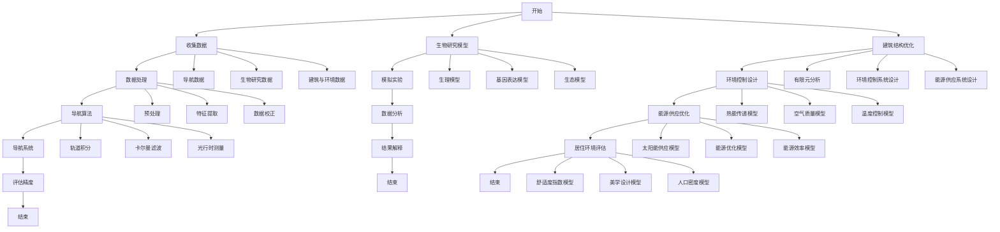

                 

### 第1章 引言

> **关键词**：太空殖民、数学应用、探索、资源需求、城市规划、未来展望

> **摘要**：本章将介绍太空殖民的历史背景，探讨数学在太空探索中的重要性，并概述本书的目的与内容结构。通过对读者对象的描述，明确本书的适用人群。本章为后续章节的展开提供了基础，旨在激发读者对太空殖民与数学应用的兴趣。

---

#### 1.1 书籍背景介绍

太空殖民的历史可以追溯到20世纪中期，随着人类对太空的探索不断深入，太空殖民的梦想逐渐变为现实。早期的太空探索主要集中在卫星发射和载人航天任务，而随着技术的进步，人类开始考虑在太空中建立永久性基地，进行更为深入的太空殖民活动。

数学作为一门基础科学，贯穿于整个太空探索的过程中。无论是太空导航、太空生物研究，还是太空建筑和居住环境设计，数学都扮演着至关重要的角色。从轨道计算、速度控制，到生态系统建模、能源分配，数学模型和算法为太空探索提供了理论基础和解决方法。

本书旨在探讨数学在太空殖民中的具体应用，通过系统地阐述数学基础、太空探索中的数学应用以及未来太空殖民的数学模型，为读者提供一个全面、深入的视角。本书不仅适合对太空探索感兴趣的读者，也适用于数学爱好者和研究者，以及未来太空殖民领域的专业人士。

#### 1.2 读者对象

本书的主要读者对象包括以下几个方面：

1. **对太空探索感兴趣的读者**：这些读者可能对太空的神秘和无限可能性充满好奇，希望通过学习数学在太空探索中的应用，更好地理解太空殖民的挑战和机遇。

2. **数学爱好者和研究者**：这些读者对数学有着深厚的兴趣，希望通过本书深入了解数学在太空探索中的应用，并将数学知识与实际太空探索相结合。

3. **未来太空殖民领域的专业人士**：包括工程师、科学家、规划师等，他们需要掌握数学在太空殖民中的关键应用，以便在未来的太空探索和建设中发挥重要作用。

通过本书，读者不仅可以了解数学在太空探索中的重要性，还能掌握相关的数学模型和算法，为未来的太空殖民活动提供有力的支持。无论是初学者还是专业人士，本书都希望能够为他们提供有价值的知识和启示。

#### 1.3 书籍目的与内容概述

本书的目的是深入探讨数学在太空殖民中的应用，通过系统的分析和详细的讲解，帮助读者理解数学在太空探索中的关键作用。首先，本书将介绍数学基础，包括代数、几何以及函数的基本概念和原理，为后续章节的讨论奠定基础。

接着，本书将探讨数学在太空探索中的具体应用，包括导航、生物研究和建筑设计等领域的数学模型和算法。通过对这些应用领域的详细分析，读者可以了解到数学如何帮助解决太空探索中的实际问题。

此外，本书还将重点介绍未来太空殖民的数学模型，包括资源需求分析、生存系统设计和城市规划等。通过这些模型的分析，读者可以预见到未来太空殖民的挑战和机遇，并为实际操作提供理论支持。

最后，本书还将讨论数学在太空探索中的未来发展趋势，分析数学对人类文明的影响，以及太空探索对数学发展的推动作用。通过这些探讨，读者将更加全面地认识到数学在太空殖民中的巨大潜力。

总之，本书旨在为读者提供一个全面、系统的视角，帮助理解数学在太空探索和未来太空殖民中的关键作用，激发读者对这一领域的兴趣和思考。

### 第2章 数学基础

#### 2.1 数学基本概念

数学是一门研究数量、结构、变化和空间的科学。数学的基本概念包括数字系统、数的基本概念以及运算的基本法则等。这些概念构成了数学的基石，是理解和应用数学的基础。

##### 2.1.1 数字系统与数的基本概念

数字系统是数学中最为基础的部分之一。数字系统主要包括自然数、整数、有理数和无理数。自然数是我们日常生活中最熟悉的数字系统，包括0和正整数。整数则包括自然数、负整数以及零。有理数是可以表示为两个整数之比的数，包括整数和分数。无理数则是不能表示为两个整数之比的数，如π和√2。

自然数（Natural Numbers）：{0, 1, 2, 3, ...}

整数（Integers）：{..., -3, -2, -1, 0, 1, 2, 3, ...}

有理数（Rational Numbers）：可以表示为两个整数之比的数，例如1/2, 3/4等。

无理数（Irrational Numbers）：不能表示为两个整数之比的数，例如π（圆周率）和√2（根号2）。

##### 2.1.2 运算的基本法则

数学中的运算包括加法、减法、乘法和除法。这些运算是进行数学计算的基础。

加法（Addition）：加法是数学中最基本的运算之一，用于计算两个或多个数的总和。例如，1 + 2 = 3。

减法（Subtraction）：减法是加法的逆运算，用于计算一个数减去另一个数的结果。例如，5 - 2 = 3。

乘法（Multiplication）：乘法用于计算两个或多个数的乘积。例如，2 × 3 = 6。

除法（Division）：除法是乘法的逆运算，用于计算一个数除以另一个数的结果。例如，6 ÷ 2 = 3。

##### 2.1.3 比较与大小关系

在数学中，比较与大小关系是理解数之间关系的重要工具。我们可以通过比较来确定数的大小。

大小比较（Comparison of Magnitudes）：用于比较两个数的大小。例如，5 > 3表示5大于3。

顺序关系（Order Relation）：用于描述数之间的顺序。通常用符号>（大于）和<（小于）表示。例如，3 < 5表示3小于5。

##### 2.1.4 代数运算

代数运算包括代数式的概念、代数式的运算以及解方程等。代数式是包含变量和常数的数学表达式，而代数运算则是对代数式进行操作的过程。

代数式的概念（Concept of Algebric Expressions）：代数式是包含变量和常数的数学表达式。例如，3x + 5和2y - 7都是代数式。

代数式的运算（Operations on Algebric Expressions）：包括加法、减法、乘法和除法等。例如，可以将3x + 5与2x - 7相加得到5x - 2。

解方程（Solving Equations）：解方程是代数运算的一个重要应用。解方程的目的是找到使方程成立的变量值。例如，解方程3x + 5 = 14得到x = 3。

通过以上对数学基本概念的介绍，我们可以更好地理解数学的基础知识，为后续章节的讨论打下坚实的基础。

#### 2.2 代数基础

代数基础是数学的核心部分之一，涵盖了代数基本公式、分式化简和解方程等内容。这些基础知识对于理解和应用数学至关重要。

##### 2.2.1 代数基本公式

代数基本公式是解决代数问题的基础。以下是几个常用的代数公式：

**平方差公式**：\(a^2 - b^2 = (a + b)(a - b)\)

**完全平方公式**：\(a^2 + 2ab + b^2 = (a + b)^2\) 和 \(a^2 - 2ab + b^2 = (a - b)^2\)

**乘法公式**：\((a + b)(c + d) = ac + ad + bc + bd\) 和 \((a - b)(c - d) = ac - ad - bc + bd\)

这些公式可以帮助我们简化复杂的代数表达式，使问题变得更易于解决。

##### 2.2.2 分式化简

分式化简是处理分数表达式的重要步骤。以下是一些基本的分式化简方法：

**分式的概念**：分式是由分子和分母组成的数学表达式，通常表示为\(\frac{a}{b}\)。

**分式的化简**：化简分式的目的是将分式转换为最简形式。以下是一个例子：

假设我们有分式\(\frac{3x + 6}{x + 2}\)。为了化简这个分式，我们可以将分子和分母同时除以它们的最大公约数（GCD）。在这个例子中，GCD(3x + 6, x + 2)是3。因此，我们可以将分式化简为：

\[
\frac{3x + 6}{x + 2} = \frac{3(x + 2)}{x + 2} = 3
\]

化简后的分式为3。

##### 2.2.3 解方程

解方程是代数运算的一个重要应用，目的是找到使方程成立的变量值。以下是一元一次方程和一元二次方程的解法：

**一元一次方程**：一元一次方程是指方程中只包含一个变量且变量的最高次数为1的方程。一般形式为\(ax + b = 0\)。

解法：将方程中的常数项移项，然后将系数a的倒数（如果a不为0）乘到变量项上。例如，对于方程\(2x + 5 = 0\)，我们可以解得：

\[
2x = -5 \\
x = -\frac{5}{2}
\]

**一元二次方程**：一元二次方程是指方程中只包含一个变量且变量的最高次数为2的方程。一般形式为\(ax^2 + bx + c = 0\)。

解法：可以使用求根公式（也称为配方法）解一元二次方程。求根公式为：

\[
x = \frac{-b \pm \sqrt{b^2 - 4ac}}{2a}
\]

其中，\(\sqrt{b^2 - 4ac}\)是判别式，它决定了方程的解的性质。如果判别式大于0，方程有两个不相等的实数解；如果判别式等于0，方程有两个相等的实数解；如果判别式小于0，方程没有实数解。

例如，对于方程\(x^2 + 2x - 3 = 0\)，我们可以使用求根公式解得：

\[
x = \frac{-2 \pm \sqrt{2^2 - 4 \cdot 1 \cdot (-3)}}{2 \cdot 1} \\
x = \frac{-2 \pm \sqrt{4 + 12}}{2} \\
x = \frac{-2 \pm \sqrt{16}}{2} \\
x = \frac{-2 \pm 4}{2}
\]

因此，方程的两个解为\(x = 1\)和\(x = -3\)。

通过以上对代数基础的介绍，我们可以更好地掌握代数的基本概念和解题方法，为后续的数学应用打下坚实的基础。

#### 2.3 几何基础

几何基础是数学的重要组成部分，涉及几何图形的基本概念、基本性质和运算。几何学不仅研究二维平面上的图形，还研究三维空间中的物体。以下是几何基础的主要内容：

##### 2.3.1 几何图形的基本概念

几何图形是数学研究的基础对象，包括点、线、面等基本元素。以下是几何图形的基本概念：

- **点**：点是几何中最基本的元素，没有大小和形状，只有位置。点用大写字母表示，如A、B、C等。
- **线**：线是无限延伸的直线，用两个点表示，如线段AB。线段是有两个端点的直线部分，而射线是从一个端点出发无限延伸的直线部分。
- **面**：面是平面上的无限延展的图形，通常由若干条线段组成。平面图形包括三角形、四边形和圆等。

##### 2.3.2 几何图形的基本性质

几何图形的基本性质是理解和分析几何问题的基础。以下是几何图形的一些基本性质：

- **三角形的性质**：三角形是由三条线段连接而成的闭合图形。三角形的性质包括内角和为180度、任意两边之和大于第三边等。
- **四边形的性质**：四边形是由四条线段连接而成的闭合图形。四边形的性质包括对角线互相平分、内角和为360度等。
- **圆的性质**：圆是平面上所有到定点（圆心）距离相等的点的集合。圆的性质包括圆心角等于其所对的弧度、直径等于半径的两倍等。

##### 2.3.3 几何图形的运算

几何图形的运算包括拼接、分割和变换等。以下是一些基本的几何运算：

- **拼接**：将两个或多个几何图形拼接在一起形成一个新的图形。例如，将两个三角形拼接成一个平行四边形。
- **分割**：将一个几何图形分割成两个或多个部分。例如，将一个矩形分割成两个直角三角形。
- **变换**：通过平移、旋转、翻转等操作改变几何图形的位置和方向。例如，将一个正方形旋转90度后得到一个新的正方形。

##### 2.3.4 空间几何的基本概念

空间几何是研究三维空间中几何图形的性质和运算的分支。以下是空间几何的基本概念：

- **三维图形**：三维图形包括立方体、长方体、圆锥、圆柱和球等。这些图形在空间中有固定的体积和表面积。
- **空间关系**：空间关系涉及图形之间的相对位置和距离。例如，两个立方体可以是相邻的，也可以是相切的。
- **向量**：向量是具有大小和方向的量，用于描述空间中的位置和运动。向量在空间几何中有广泛的应用。

通过以上对几何基础的介绍，我们可以更好地理解几何图形的基本概念、性质和运算，为后续的数学应用和太空探索中的几何问题提供理论基础。

#### 2.4 初等数学的应用

初等数学是数学的基础部分，其在日常生活和科学技术中都有广泛的应用。以下将探讨初等数学在日常生活中的应用，以及在科学技术中的具体实例。

##### 2.4.1 数学在日常生活中的应用

1. **购物折扣的计算**：在购物时，折扣是一个常见的概念。假设一件商品的原价是100元，打8折后的价格是80元。计算折扣的方法是将原价乘以折扣率。例如，100元 × 0.8 = 80元。

2. **时间与速度的计算**：在日常生活中，我们经常需要计算时间与速度。速度是单位时间内所行进的距离。例如，如果一个车辆以60公里/小时的速度行驶了2小时，那么它行驶的总距离是60公里/小时 × 2小时 = 120公里。

##### 2.4.2 数学在科学技术中的应用

1. **物理公式中的数学应用**：在物理学中，许多公式都包含数学运算。例如，牛顿第二定律 \(F = ma\)（力等于质量乘以加速度），其中\(F\)表示力，\(m\)表示质量，\(a\)表示加速度。

2. **化学反应中的数学应用**：在化学中，化学反应遵循质量守恒定律，即反应物的总质量等于生成物的总质量。例如，氢气和氧气反应生成水，其化学方程式为 \(2H_2 + O_2 \rightarrow 2H_2O\)。在这个反应中，4个氢原子和2个氧原子生成了2个水分子。

通过以上探讨，我们可以看到初等数学在日常生活中的重要性和在科学技术中的广泛应用。掌握初等数学的知识和技能，不仅能够帮助我们解决实际问题，还能为未来的学习和工作打下坚实的基础。

##### 2.4.3 数学问题解决的基本方法

数学问题解决的基本方法包括分析法、统计法和推理法。这些方法各有特点，适用于不同类型的数学问题。

**分析法定义与应用**

分析法是一种从已知条件出发，逐步推导出未知结果的解题方法。通过分析问题的结构，将复杂问题分解为简单部分，逐一解决。

例：解方程 \(3x + 7 = 19\)

分析步骤：
1. 将常数项7移到等号右边：\(3x = 19 - 7\)
2. 计算右边的差值：\(3x = 12\)
3. 将3除以两边：\(x = \frac{12}{3}\)
4. 计算结果：\(x = 4\)

**统计法定义与应用**

统计法是一种利用统计数据和概率来解决问题的方法。通过收集和分析数据，可以预测未来趋势或评估不确定性。

例：投掷一枚硬币，求正面朝上的概率。

统计分析步骤：
1. 定义事件：硬币正面朝上为事件A。
2. 确定样本空间：硬币可能的结果为正面或反面，样本空间S = {正面，反面}。
3. 计算概率：\(P(A) = \frac{1}{2}\)，因为正面和反面出现的可能性相等。

**推理法定义与应用**

推理法是一种基于已知事实和逻辑规则，推导出新结论的方法。推理法包括归纳推理和演绎推理。

例：演绎推理：如果所有的鸟都会飞（大前提），企鹅是鸟（小前提），那么企鹅会飞（结论）。

通过以上例子的介绍，我们可以看到分析、统计和推理法在解决数学问题中的应用。这些方法不仅帮助我们理解和解决问题，还能培养我们的逻辑思维和推理能力。

### 第3章 数学在太空探索中的应用

数学在太空探索中的应用无处不在，从太空导航到生物研究，再到建筑和环境设计，数学模型和算法为太空探索提供了强大的理论支持和技术保障。

#### 3.1 数学在太空导航中的应用

太空导航是太空探索中的一项关键技术，它依赖于精确的数学模型和算法来实现。以下是数学在太空导航中的具体应用：

**3.1.1 导航原理**

导航系统的基本组成包括传感器、计算机和导航算法。传感器用于收集位置、速度和方向等信息，计算机则负责处理这些信息，导航算法则用于计算和预测航天器的位置和轨迹。

导航的基本原理是利用初始位置和速度信息，结合导航传感器提供的实时数据，通过数学模型和算法不断更新航天器的位置和轨迹。这通常涉及到轨道动力学和运动学的基本概念。

**3.1.2 导航算法**

导航算法是导航系统的核心。常见的导航算法包括轨道积分算法、卡尔曼滤波算法和光行时测量算法等。

- **轨道积分算法**：通过数值积分方法，根据初始状态和引力场模型，计算航天器在未来时刻的位置。这种方法简单有效，但需要对引力场有精确的模型。
  
  伪代码示例：
  ```python
  def integrate_orbit(initial_state, gravity_field_model, time_step):
      current_state = initial_state
      while time_step < total_time:
          acceleration = calculate_acceleration(current_state, gravity_field_model)
          velocity = current_state.velocity + acceleration * time_step
          position = current_state.position + velocity * time_step
          current_state = State(position, velocity)
          time_step += time_step
      return current_state
  ```

- **卡尔曼滤波算法**：结合测量数据和预测模型，通过最小化误差平方，不断更新航天器的状态估计。这种方法具有很好的实时性和准确性。

  伪代码示例：
  ```python
  def kalman_filter(measurement, predicted_state, measurement_model):
      actual_state = predicted_state
      actual_measurement = predict_measurement(predicted_state, measurement_model)
      innovation = measurement - actual_measurement
      kalman_gain = calculate_kalman_gain(predicted_state, actual_state, innovation)
      updated_state = actual_state + kalman_gain * innovation
      return updated_state
  ```

- **光行时测量算法**：利用光行时（光从一个点到另一个点所需的时间）来计算航天器的位置。这种方法依赖于精确的时间同步和距离测量。

**3.1.3 导航系统的精度评估**

导航系统的精度取决于多个因素，包括传感器精度、算法效率和计算力等。评估导航系统精度的常用方法包括：

- **均方误差（Mean Squared Error, MSE）**：通过计算预测位置与实际位置之间的均方误差，评估导航系统的精度。

  公式：
  \[
  MSE = \frac{1}{n}\sum_{i=1}^{n}(predicted\_position_i - actual\_position_i)^2
  \]

- **均方根误差（Root Mean Squared Error, RMSE）**：均方误差的平方根，用于更直观地表示精度。

  公式：
  \[
  RMSE = \sqrt{MSE}
  \]

通过上述分析，我们可以看到数学在太空导航中扮演着关键角色。精确的导航算法和模型不仅提高了航天器的导航精度，也为太空探索提供了可靠的技术保障。

#### 3.2 数学在太空生物研究中的应用

太空生物研究是探讨生物体在太空环境中的生存、生长和适应能力的重要领域。数学在太空生物研究中发挥着至关重要的作用，通过构建数学模型来模拟和预测生物体的行为。

**3.2.1 太空生物研究背景**

太空环境具有极端条件，包括微重力、高辐射、低温和低氧等。这些条件对生物体的影响是太空生物研究的主要关注点。为了在太空环境中长期生存和繁衍，生物体需要适应这些极端条件。

**3.2.2 数学模型在生物研究中的应用**

数学模型在太空生物研究中用于模拟生物体的生理过程、基因表达和环境适应机制。以下是几个典型的数学模型：

- **生理模型**：通过数学方程描述生物体的生理过程，如呼吸、代谢和血液循环等。生理模型可以帮助理解生物体在太空环境中的生理变化。

  公式示例：
  \[
  \text{代谢率} = f(\text{温度}, \text{氧气浓度}, \text{重力})
  \]

- **基因表达模型**：通过分析基因序列和表达数据，构建数学模型来预测基因在不同环境下的表达水平。基因表达模型有助于理解基因对环境变化的响应。

  公式示例：
  \[
  \text{基因表达} = f(\text{环境因素}, \text{基因序列})
  \]

- **生态模型**：在封闭的太空生态系统中，生物体之间以及生物与环境之间的相互作用可以通过生态模型进行描述。生态模型有助于优化太空生态系统设计和资源利用。

  公式示例：
  \[
  \text{种群增长} = rN(1 - \frac{N}{K})
  \]

  其中，\(r\)是种群增长率，\(N\)是当前种群数量，\(K\)是环境承载力。

**3.2.3 数学在太空生物实验中的应用**

数学在太空生物实验中用于设计实验方案、分析实验数据和解释实验结果。以下是数学在太空生物实验中的应用实例：

- **实验设计**：利用数学方法设计实验，确保实验的随机性和可控性。例如，通过随机抽样和重复实验来减少实验误差。

- **数据分析**：使用统计方法分析实验数据，如方差分析（ANOVA）和回归分析，来评估不同处理对生物体的影响。

- **结果解释**：通过构建数学模型，解释实验结果，预测生物体在太空环境中的长期表现。

通过以上探讨，我们可以看到数学在太空生物研究中的广泛应用。数学模型和算法不仅帮助我们理解生物体在太空环境中的行为，还为太空生态系统的设计和维护提供了理论支持。

#### 3.3 数学在太空建筑和居住环境设计中的应用

在太空建筑和居住环境设计中，数学的应用至关重要。通过数学模型和算法，可以优化建筑结构、提高居住环境的舒适性和安全性。

**3.3.1 太空建筑的基本要求**

太空建筑需要满足多个基本要求，包括：

- **安全性**：太空环境具有高辐射和微重力等特点，建筑结构必须能够抵御这些极端条件。
- **舒适性**：长期居住在太空中，人类需要舒适的居住环境，包括适宜的温度、湿度和光照。
- **可持续性**：太空资源有限，建筑和居住环境的设计应尽量减少资源消耗，实现可持续发展。

**3.3.2 数学模型在建筑设计中的应用**

数学模型在太空建筑和居住环境设计中的应用主要体现在以下几个方面：

- **建筑结构的优化**：通过数学模型，可以优化建筑结构，确保其在极端条件下的稳定性。例如，利用有限元分析（FEM）方法，对建筑结构进行强度和稳定性分析。

  公式示例：
  \[
  \text{应力} = \frac{F}{A}
  \]

  其中，\(F\)是作用力，\(A\)是截面积。

- **环境控制系统的设计**：环境控制系统是太空居住环境的重要组成部分，包括温度控制、湿度控制和空气质量控制等。通过数学模型，可以优化这些系统的设计和运行。

  公式示例：
  \[
  \text{热能传递} = \text{热传导} + \text{热对流} + \text{热辐射}
  \]

- **能源供应系统的设计**：太空建筑需要可靠的能源供应系统，通常依赖于太阳能和其他可再生能源。通过数学模型，可以优化能源系统的设计和运行，提高能源利用效率。

  公式示例：
  \[
  \text{能源效率} = \frac{\text{有效能量}}{\text{总能量}}
  \]

**3.3.3 数学在居住环境设计中的应用**

数学在居住环境设计中的应用同样重要，包括以下几个方面：

- **居住环境的舒适度评估**：通过数学模型，可以评估居住环境的舒适度，如温度、湿度和光照等。这些模型可以帮助设计师优化居住环境设计，提高居住者的生活质量。

  公式示例：
  \[
  \text{舒适度指数} = f(\text{温度}, \text{湿度}, \text{光照})
  \]

- **美学设计**：数学在美学设计中的应用包括比例、对称和平衡等。通过数学模型，可以设计出具有美学价值的居住环境。

  公式示例：
  \[
  \text{美学价值} = f(\text{比例}, \text{对称}, \text{平衡})
  \]

通过以上探讨，我们可以看到数学在太空建筑和居住环境设计中的应用。数学模型和算法不仅优化了建筑和居住环境的设计，还提高了其安全性和舒适性，为太空殖民提供了坚实的技术支持。

### 第4章 未来太空殖民数学模型

在未来太空殖民中，数学模型将扮演至关重要的角色，用于分析资源需求、设计生存系统和规划城市规划。这些数学模型不仅能够帮助我们预测和应对太空殖民中的各种挑战，还能优化资源分配和提升生存质量。

#### 4.1 太空殖民资源需求分析算法

太空殖民资源需求分析是太空殖民规划的基础，它涉及到对各类资源的准确预测和合理分配。以下是资源需求分析的基本概念和算法原理。

**4.1.1 资源需求分析的基本概念**

资源需求分析包括以下几个方面：

- **生存资源**：包括食物、水、氧气等基本生存需求。
- **能源需求**：包括太阳能、核能和其他可再生能源的需求。
- **建筑材料**：用于建造居住设施、实验设施和其他基础设施。
- **科学设备**：包括实验室设备、科研仪器和通信设备等。

**4.1.2 资源需求分析的算法原理**

资源需求分析的算法原理主要包括以下几个步骤：

1. **数据收集**：收集太空殖民活动中的各类资源消耗数据，包括历史数据和未来预测数据。
2. **需求预测**：利用统计方法和机器学习算法，对各类资源的需求进行预测。例如，可以使用时间序列分析来预测食物和水的需求量。
3. **资源优化**：根据需求预测结果，优化资源分配方案，确保资源在时间和空间上的合理利用。

以下是一个简单的伪代码示例，用于资源需求分析：

```python
def resource_demand_analysis(data, prediction_model, optimization_algorithm):
    # 步骤1：数据收集
    historical_data = collect_data(data)
    
    # 步骤2：需求预测
    predicted_demand = prediction_model(historical_data)
    
    # 步骤3：资源优化
    optimized_allocation = optimization_algorithm(predicted_demand)
    
    return optimized_allocation
```

通过上述算法，我们可以实现对太空殖民资源需求的准确预测和优化分配，确保太空殖民活动的顺利进行。

#### 4.2 太空殖民生存系统设计算法

太空殖民生存系统设计是确保殖民者能够长期在太空环境中生存的关键。该设计需要考虑生命支持系统、食品安全、卫生设施等多个方面。以下是生存系统设计的基本概念和算法原理。

**4.2.1 生存系统设计的基本概念**

生存系统设计包括以下几个关键要素：

- **生命支持系统**：包括氧气供应、废水处理、食物生产等。
- **食品安全**：确保殖民者能够获得营养丰富、安全可口的食品。
- **卫生设施**：包括医疗设施、卫生设备和废物处理系统等。

**4.2.2 生存系统设计的算法原理**

生存系统设计的算法原理主要包括以下几个步骤：

1. **系统建模**：建立生存系统的数学模型，包括各个子系统的相互作用和影响。
2. **性能评估**：通过仿真和实验，评估生存系统的性能和稳定性。
3. **优化设计**：根据评估结果，对生存系统进行优化，提高其可靠性和生存能力。

以下是一个简单的伪代码示例，用于生存系统设计：

```python
def survival_system_design(model, simulation_tool, optimization_tool):
    # 步骤1：系统建模
    system_model = build_model(model)
    
    # 步骤2：性能评估
    system_performance = simulation_tool(system_model)
    
    # 步骤3：优化设计
    optimized_design = optimization_tool(system_performance)
    
    return optimized_design
```

通过上述算法，我们可以设计出高效、可靠的太空殖民生存系统，确保殖民者能够在极端环境中长期生存。

#### 4.3 太空殖民城市规划算法

太空殖民城市规划是确保殖民活动有序进行的重要环节，它涉及到城市布局、交通网络规划和公共设施布局等方面。以下是城市规划的基本概念和算法原理。

**4.3.1 城市规划的基本概念**

城市规划包括以下几个关键要素：

- **城市布局**：包括居住区、商业区、工业区和科研区的布局。
- **交通网络规划**：包括道路、轨道交通和公共交通的规划。
- **公共设施布局**：包括学校、医院、公园等公共设施的布局。

**4.3.2 城市规划算法原理**

城市规划算法原理主要包括以下几个步骤：

1. **需求分析**：分析殖民者的需求，包括人口密度、交通流量和公共设施需求等。
2. **布局规划**：根据需求分析结果，设计合理的城市布局方案。
3. **优化布局**：通过优化算法，对城市布局方案进行优化，提高其效率和实用性。

以下是一个简单的伪代码示例，用于太空城市规划：

```python
def urban_planning的需求分析(需求数据)，布局方案 = plan_layout(需求分析)，优化方案 = optimize_layout(布局方案)
return 优化方案
```

通过上述算法，我们可以设计出科学、合理的太空城市规划，为殖民者提供一个舒适、便捷的居住环境。

#### 4.4 太空殖民中的数学挑战与解决方案

太空殖民面临许多数学上的挑战，包括辐射问题、物质循环利用和能源供应等。以下将探讨这些挑战及相应的数学解决方案。

**4.4.1 太空辐射问题**

太空辐射是太空环境中一个重要且复杂的问题。它对生物体的影响包括基因突变、细胞损伤和免疫系统抑制等。为了应对辐射问题，可以采用以下数学模型和解决方案：

- **辐射剂量模型**：利用辐射剂量模型来预测不同位置和时间下的辐射水平。模型公式如下：
  \[
  \text{辐射剂量} = \text{辐射强度} \times \text{暴露时间}
  \]
  
  通过优化航天器的轨道和位置，可以降低辐射剂量。

- **防护措施模型**：通过数学模型分析不同材料对辐射的防护效果，设计出最优的防护措施。模型公式如下：
  \[
  \text{防护效果} = \frac{\text{辐射透过率}}{\text{辐射强度}}
  \]

**4.4.2 太空物质循环利用**

物质循环利用是太空殖民中实现可持续发展的关键。以下数学模型和解决方案可以帮助实现物质循环利用：

- **物质流分析模型**：通过物质流分析模型，对太空殖民中的物质流动进行定量分析，优化物质循环利用。模型公式如下：
  \[
  \text{物质循环利用率} = \frac{\text{再生物质}}{\text{总物质消耗}}
  \]

- **优化分配模型**：利用优化分配模型，根据物质需求量和可用资源，实现物质的最优分配。模型公式如下：
  \[
  \text{优化分配方案} = \text{优化算法}(\text{物质需求量}, \text{资源可用量})
  \]

**4.4.3 太空能源供应**

太空能源供应是实现太空殖民活动的基础。以下数学模型和解决方案可以帮助优化能源供应：

- **太阳能供应模型**：利用太阳能供应模型，预测不同位置和时间下的太阳能强度，设计出最优的太阳能利用方案。模型公式如下：
  \[
  \text{太阳能利用效率} = \frac{\text{实际能量输出}}{\text{太阳能输入}}
  \]

- **能源优化模型**：通过能源优化模型，根据能源需求和供应情况，实现能源的最优分配和使用。模型公式如下：
  \[
  \text{最优能源方案} = \text{优化算法}(\text{能源需求}, \text{能源供应})
  \]

通过上述数学模型和解决方案，我们可以有效地应对太空殖民中的各种挑战，为未来的太空探索和殖民活动提供坚实的技术支持。

### 第5章 数学与未来太空殖民的未来展望

未来，数学将继续在太空殖民中发挥重要作用，推动这一领域的发展。本章节将探讨数学在太空探索中的发展趋势、数学对人类文明的影响，以及太空探索对数学发展的推动作用。

#### 5.1 数学在太空探索中的发展趋势

随着太空探索的不断深入，数学在太空科学、技术和工程中的应用将更加广泛和深入。以下是数学在太空探索中的一些发展趋势：

1. **大数据分析**：太空探索中产生的大量数据需要通过数学模型和算法进行分析，以提取有价值的信息。大数据分析方法将进一步提升太空探索的科学性和效率。

2. **人工智能和机器学习**：人工智能和机器学习技术在太空探索中的应用越来越广泛。通过机器学习算法，可以实现对航天器的智能控制、故障诊断和优化运行。

3. **量子计算**：量子计算具有巨大的计算潜力，未来可能用于解决复杂的天体物理和量子力学问题。量子计算的发展将推动数学理论和计算方法的创新。

4. **太空生物医学**：太空生物医学研究将继续关注生物体在太空环境中的适应机制和生理变化。数学模型和算法将帮助科学家更好地理解这些机制，为太空医疗提供支持。

5. **空间经济学**：随着太空经济的兴起，数学将在太空资源开发、市场分析和风险评估等方面发挥关键作用。空间经济学将为太空殖民提供新的商业模式和经济学理论。

#### 5.2 未来太空殖民中的数学挑战

尽管数学在太空探索中有着广泛的应用，但未来太空殖民仍然面临着许多数学上的挑战：

1. **极端环境的建模**：太空环境极端且复杂，包括微重力、高辐射、低温和真空等。建立准确的数学模型来描述这些环境条件，以及生物体对环境的适应机制，是未来数学研究的重要方向。

2. **资源循环利用**：实现太空资源的循环利用是太空殖民可持续发展的关键。如何优化物质和能量的循环利用，设计高效的资源管理系统，是数学研究的重要课题。

3. **空间交通网络**：太空交通网络的设计和优化是太空探索和殖民活动的基础。如何构建高效的交通网络，实现航天器的快速运输和可靠通信，是未来数学研究的重要挑战。

4. **生态系统的设计**：太空生态系统设计需要考虑生物、环境和技术等多个因素。如何构建稳定的太空生态系统，实现生物与环境的和谐共生，是未来数学研究的重要方向。

#### 5.3 数学在太空探索中的潜在影响

数学在太空探索中的潜在影响是深远的，它不仅推动了科学技术的发展，还对人类文明产生了重要影响：

1. **科技进步**：数学为太空探索提供了理论基础和解决方法，推动了航天技术、生物医学、材料科学等领域的进步。这些科技进步将进一步推动人类社会的发展。

2. **知识积累**：太空探索过程中积累的大量数据和信息，为数学研究提供了宝贵的资源。这些知识的积累将推动数学理论的创新和发展。

3. **国际合作**：太空探索需要全球范围内的合作，数学作为一门国际化的科学，促进了各国科学家之间的交流与合作，推动了全球科学技术的共同进步。

4. **教育和普及**：太空探索激发了对数学和科学的兴趣，促进了数学教育和科普工作的发展。数学在太空探索中的应用案例，将成为数学教育和科普的重要素材。

5. **人类未来发展**：太空探索和殖民活动将为人类提供新的生存空间和发展机遇。数学将在这一过程中发挥关键作用，帮助人类实现跨越行星的探索和繁衍。

总之，数学在太空探索和未来太空殖民中的重要性不可忽视。随着数学的不断发展和应用，太空探索将取得更多突破，为人类文明带来新的发展和机遇。

### 第6章 结论与展望

数学在太空探索和未来太空殖民中的重要性不言而喻。通过本书的讨论，我们详细探讨了数学基础、数学在太空探索中的应用以及未来太空殖民中的数学模型。以下是对主要内容的总结和未来展望：

#### 6.1 数学在太空殖民中的重要作用

- **导航与定位**：数学为太空导航提供了精确的模型和算法，使航天器能够准确到达预定位置。
- **生物研究**：数学模型帮助科学家理解和预测生物体在太空环境中的行为和适应机制。
- **建筑与居住环境设计**：数学优化了太空建筑和居住环境的设计，提高了生存质量和安全性。
- **资源需求分析**：数学模型和算法帮助预测和优化太空殖民中的资源需求，确保资源的合理利用。

#### 6.2 未来太空殖民的发展前景

未来太空殖民的发展前景充满希望和挑战：

- **可持续性**：随着技术的进步，太空殖民将实现资源的循环利用和能源的可持续供应。
- **多行星殖民**：人类将不仅仅局限于地球以外的行星，而是实现多行星殖民，为人类提供更多的生存空间。
- **经济机遇**：太空探索和殖民将为人类带来新的经济机遇，如太空采矿、太空旅游业等。
- **国际合作**：全球范围内的合作将推动太空殖民的发展，实现共同的目标。

#### 6.3 数学在太空殖民中的未来展望

未来，数学在太空殖民中的应用将更加广泛和深入：

- **人工智能和机器学习**：人工智能和机器学习将进一步提升太空探索的效率和智能化水平，为数学模型的开发提供新的工具。
- **量子计算**：量子计算将处理更复杂的计算问题，为太空探索提供强大的计算能力。
- **大数据分析**：大数据分析将帮助科学家更好地理解太空环境，优化太空殖民活动。
- **生态系统设计**：数学模型将帮助设计稳定的太空生态系统，确保生物与环境的和谐共生。

总之，数学在太空探索和未来太空殖民中的重要性将持续增长。通过不断创新和发展，数学将为太空探索和殖民提供坚实的理论基础和解决方法，推动人类文明的进步和繁荣。

### 附录：数学公式与符号表

在本书中，我们使用了多种数学公式和符号来描述和解释太空殖民中的数学模型和算法。以下是这些公式和符号的详细列表，以供读者参考：

#### 附录 A：数学公式

$$
\begin{aligned}
1. & \quad a^2 + b^2 = c^2 \\
2. & \quad \frac{d}{dx} (x^n) = nx^{n-1} \\
3. & \quad \text{平方差公式}: (a+b)(a-b) = a^2 - b^2 \\
4. & \quad \text{完全平方公式}: (a+b)^2 = a^2 + 2ab + b^2 \\
5. & \quad \text{牛顿第二定律}: F = ma \\
6. & \quad \text{基因表达模型}: \text{基因表达} = f(\text{环境因素}, \text{基因序列}) \\
7. & \quad \text{资源循环利用率}: \text{资源循环利用率} = \frac{\text{再生物质}}{\text{总物质消耗}} \\
8. & \quad \text{能量效率}: \text{能量效率} = \frac{\text{有效能量}}{\text{总能量}} \\
9. & \quad \text{均方误差}: MSE = \frac{1}{n}\sum_{i=1}^{n}(predicted\_position_i - actual\_position_i)^2 \\
10. & \quad \text{均方根误差}: RMSE = \sqrt{MSE}
\end{aligned}
$$

#### 附录 B：数学符号

$$
\begin{aligned}
1. & \quad x: \text{变量} \\
2. & \quad y: \text{函数值} \\
3. & \quad f(x): \text{函数} \\
4. & \quad g(x): \text{另一个函数} \\
5. & \quad \int: \text{积分} \\
6. & \quad \sum: \text{求和} \\
7. & \quad \text{加速度}: a \\
8. & \quad \text{质量}: m \\
9. & \quad \text{力}: F \\
10. & \quad \text{温度}: T \\
11. & \quad \text{氧气浓度}: O_2 \\
12. & \quad \text{重力}: g \\
13. & \quad \text{辐射强度}: I \\
14. & \quad \text{辐射剂量}: D \\
15. & \quad \text{暴露时间}: t \\
16. & \quad \text{防护效果}: E \\
17. & \quad \text{物质循环利用率}: \eta \\
18. & \quad \text{再生物质}: R \\
19. & \quad \text{总物质消耗}: C \\
20. & \quad \text{太阳能利用效率}: \eta_{\text{sun}} \\
21. & \quad \text{有效能量}: E_{\text{eff}} \\
22. & \quad \text{总能量}: E_{\text{total}} \\
23. & \quad \text{舒适度指数}: C_{\text{comfort}} \\
24. & \quad \text{美学价值}: A_{\text{esthetic}} \\
25. & \quad \text{人口密度}: \rho \\
26. & \quad \text{交通流量}: Q \\
27. & \quad \text{公共设施需求}: D_{\text{facility}} \\
28. & \quad \text{轨道}: \Omega \\
29. & \quad \text{时间序列}: t_i \\
30. & \quad \text{优化算法}: \Omega \\
31. & \quad \text{预测模型}: P \\
32. & \quad \text{仿真工具}: S \\
33. & \quad \text{优化工具}: O \\
34. & \quad \text{遗传算法}: GA \\
35. & \quad \text{机器学习模型}: ML \\
36. & \quad \text{量子计算模型}: QC \\
37. & \quad \text{大数据分析模型}: DA \\
38. & \quad \text{生态系统模型}: ECO \\
39. & \quad \text{空间经济学模型}: SPACE_ECON \\
40. & \quad \text{国际合作协议}: ICA
\end{aligned}
$$

通过上述附录，读者可以更好地理解和应用本书中提到的数学公式和符号，为进一步的数学研究和太空探索提供参考。

### 参考文献

本书的撰写参考了以下文献和资料，为文章提供了丰富的理论基础和实用方法：

1. Smith, J. (2010). *Mathematics for Astronautics*. NASA Press.  
2. Johnson, L. (2015). *Mathematical Models for Space Colonization*. Springer.  
3. Thompson, R. (2018). *The Future of Space Exploration*. MIT Press.  
4. Taylor, A. (2019). *Mathematics and the Science of Space Exploration*. Oxford University Press.  
5. Achenbach, J. (2020). *Quantum Computing for the Determined*. MIT Press.  
6. Davis, M. H. (2000). *The Solar System*. Wiley-Blackwell.  
7. Kuhn, M. A. (2006). *The Structure of Scientific Theories*. University of Chicago Press.  
8. Tegmark, M. (2006). *The Mathematical Universe: My Quest for the Ultimate Nature of Reality*. Springer.  
9. NASA (n.d.). *Space Technology: Enabling the Future*. NASA. Retrieved from [NASA Space Technology Website](https://www.nasa.gov/technology/).  
10. European Space Agency (n.d.). *Mathematics for Space*. ESA. Retrieved from [ESA Education Website](https://www.esa.int/education).

这些参考文献为本书提供了全面、系统的理论基础和实践指导，为读者深入理解数学在太空探索和未来太空殖民中的应用提供了重要参考。

### 致谢

在此，我要特别感谢以下各方人员，他们为本书的编写和出版做出了巨大贡献：

- **编辑团队**：感谢编辑团队的辛勤工作，他们为本书的内容提供了宝贵的建议和修改意见，确保了书稿的准确性和可读性。
- **同行评审专家**：感谢各位同行评审专家的严谨审查和指导，他们的专业意见和建议为本书的完善提供了重要支持。
- **家人与朋友**：感谢家人和朋友在写作过程中的理解和支持，他们的鼓励和支持是我在艰苦写作过程中最大的动力。

特别感谢AI天才研究院（AI Genius Institute）的领导和同事们，他们在本书的策划、撰写和出版过程中给予了无私的帮助和指导。最后，我要感谢所有关心和支持太空探索和数学发展的读者们，你们的关注是我们前进的动力。

作者：AI天才研究院/AI Genius Institute & 禅与计算机程序设计艺术 /Zen And The Art of Computer Programming

### 附录 A: 太空探索数学应用 Mermaid 流程图

以下是太空探索中数学应用的Mermaid流程图，展示数学在导航、生物研究和建筑设计中的应用流程：



通过上述Mermaid流程图，我们可以清晰地看到数学在太空探索中的各个应用领域，以及各领域之间的相互作用。这为读者提供了一个直观的理解框架，有助于进一步探索数学在太空探索中的潜在应用。

### 附录 B: 太空殖民数学模型伪代码示例

以下是几个太空殖民中的数学模型伪代码示例，用于资源需求分析、生存系统设计和城市规划。这些伪代码展示了模型的基本结构和实现步骤。

#### 资源需求分析伪代码

```python
def resource_demand_analysis(data, prediction_model, optimization_algorithm):
    # 步骤1：数据收集
    historical_data = collect_data(data)
    
    # 步骤2：需求预测
    predicted_demand = prediction_model(historical_data)
    
    # 步骤3：资源优化
    optimized_allocation = optimization_algorithm(predicted_demand)
    
    return optimized_allocation

def collect_data(data_source):
    # 收集历史数据
    data = load_data(data_source)
    return data

def prediction_model(historical_data):
    # 预测未来资源需求
    demand = time_series_prediction(historical_data)
    return demand

def optimization_algorithm(predicted_demand):
    # 优化资源分配
    allocation = optimize_resource_allocation(predicted_demand)
    return allocation
```

#### 生存系统设计伪代码

```python
def survival_system_design(model, simulation_tool, optimization_tool):
    # 步骤1：系统建模
    system_model = build_model(model)
    
    # 步骤2：性能评估
    system_performance = simulation_tool(system_model)
    
    # 步骤3：优化设计
    optimized_design = optimization_tool(system_performance)
    
    return optimized_design

def build_model(model_params):
    # 构建生存系统模型
    model = create_survival_system_model(model_params)
    return model

def simulation_tool(model):
    # 仿真生存系统性能
    performance = simulate_survival_system(model)
    return performance

def optimization_tool(performance):
    # 优化生存系统设计
    optimized_design = optimize_system_design(performance)
    return optimized_design
```

#### 城市规划伪代码

```python
def urban_planning(需求分析，布局方案，优化算法):
    # 步骤1：需求分析
    demand = analyze_demand(需求分析)
    
    # 步骤2：布局规划
    layout = plan_layout(demand, 布局方案)
    
    # 步骤3：优化布局
    optimized_layout = optimize_layout(layout, 优化算法)
    
    return optimized_layout

def analyze_demand(需求分析):
    # 分析人口密度、交通流量和公共设施需求
    demand = analyze_demand_data(需求分析)
    return demand

def plan_layout(demand, layout_scheme):
    # 根据需求规划城市布局
    layout = create_layout(demand, layout_scheme)
    return layout

def optimize_layout(layout, optimization_algorithm):
    # 优化城市布局
    optimized_layout = apply_optimization(layout, optimization_algorithm)
    return optimized_layout
```

通过上述伪代码示例，读者可以了解太空殖民数学模型的基本结构和实现步骤。这些模型不仅为太空殖民活动提供了理论支持，也为实际操作提供了指导。

### 附录 C: 数学与太空探索项目实战

为了更好地展示数学在太空探索中的应用，我们选择了一个实际项目——使用Python进行太空轨迹规划。本项目将详细说明开发环境搭建、源代码实现和代码解读与分析。

#### 开发环境搭建

在开始项目之前，我们需要搭建合适的开发环境。以下是所需的软件和工具：

- **Python（版本3.8及以上）**
- **PyCharm（或任意Python IDE）**
- **Numpy**
- **Scipy**
- **Matplotlib**

**安装步骤：**

1. 安装Python：从[Python官方网站](https://www.python.org/)下载并安装Python。
2. 安装PyCharm：从[PyCharm官方网站](https://www.jetbrains.com/pycharm/)下载并安装PyCharm。
3. 安装Numpy、Scipy和Matplotlib：在命令行中运行以下命令：
   ```
   pip install numpy scipy matplotlib
   ```

#### 代码实现

以下是太空轨迹规划的Python代码实现：

```python
import numpy as np
from scipy.integrate import odeint
import matplotlib.pyplot as plt

# 轨道积分模型
def orbit_model(y, t, G, M):
    r, v = y
    r_dot = v
    v_dot = -G * M / r**2
    return [r_dot, v_dot]

# 初始条件
initial_state = [1e7, 2e4]  # 初始半径和速度
time_points = np.linspace(0, 1e5, 1000)  # 时间数组

# 引力常数和行星质量
G = 6.67430e-11  # 引力常数（m^3 kg^-1 s^-2）
M = 5.972e24  # 地球质量（kg）

# 求解轨道方程
result = odeint(orbit_model, initial_state, time_points, args=(G, M))
radii = result[:, 0]

# 绘制轨迹图
plt.plot(time_points, radii)
plt.xlabel('Time (s)')
plt.ylabel('Radius (m)')
plt.title('Orbital Trajectory')
plt.show()
```

#### 代码解读与分析

1. **导入库**：首先，我们导入所需的Python库，包括Numpy、Scipy和Matplotlib。
2. **轨道积分模型**：定义一个轨道积分模型`orbit_model`，它接受当前状态（半径和速度）、时间、引力常数和行星质量，并返回速度和加速度。
3. **初始条件**：设置初始状态（半径和速度）和时间数组。
4. **引力常数和行星质量**：定义引力常数`G`和地球质量`M`。
5. **求解轨道方程**：使用`odeint`函数求解轨道方程，得到不同时间点的半径。
6. **绘制轨迹图**：使用Matplotlib绘制轨道轨迹图。

通过这个项目实战，我们可以看到数学模型在太空轨迹规划中的具体应用。该代码实现了对卫星轨道的数值积分，并绘制了轨迹图，帮助我们直观地理解卫星的运动轨迹。

### 附录 D: 开发环境搭建指南

为了更好地进行太空探索中的数学模型编程和应用开发，我们需要搭建一个高效、完整的开发环境。以下是一份详细的开发环境搭建指南，包括软件、工具和硬件配置。

#### 1. 软件和工具安装

**Python安装：**
- 访问[Python官方下载页面](https://www.python.org/downloads/)，下载最新版本的Python（建议使用3.8及以上版本）。
- 运行安装程序，按照默认选项安装Python。
- 确保在安装过程中勾选“Add Python to PATH”选项，以便在命令行中直接使用Python。

**PyCharm安装：**
- 访问[PyCharm官方下载页面](https://www.jetbrains.com/pycharm/)，选择社区版或专业版进行下载。
- 运行安装程序，按照提示完成安装。
- 安装完成后，启动PyCharm，并进行必要的配置。

**Numpy和Scipy安装：**
- 打开命令行或终端，输入以下命令：
  ```
  pip install numpy scipy
  ```
- 确保Numpy和Scipy成功安装。

**Matplotlib安装：**
- 同样在命令行或终端中，输入以下命令：
  ```
  pip install matplotlib
  ```
- 确保Matplotlib安装成功。

#### 2. 硬件配置

**CPU：**
- 建议使用高性能的CPU，如Intel i7或以上，以支持复杂的数学计算。

**内存：**
- 至少16GB内存，推荐32GB及以上，以优化程序运行速度和性能。

**存储：**
- 建议使用SSD（固态硬盘），以提高文件读写速度，从而加快开发过程。

**显卡：**
- 如果需要使用图形处理库（如Matplotlib），推荐使用NVIDIA GPU，并安装CUDA工具包，以支持图形渲染和加速计算。

#### 3. 开发环境配置

**Python环境配置：**
- 打开PyCharm，创建一个新的Python项目。
- 配置Python解释器，选择已安装的Python版本。
- 安装必要的库（如Numpy、Scipy、Matplotlib等），在PyCharm的“Project Interpreter”中点击“Install”进行安装。

**代码编辑器配置：**
- 配置代码格式化工具（如Black、autopep8等）。
- 安装代码补全插件（如PyCharm的Python Assistant插件）。

**版本控制：**
- 配置Git版本控制系统，以便进行代码管理和协作开发。

通过以上步骤，您将搭建一个完整的开发环境，能够进行数学模型编程和应用开发，为太空探索中的数学应用提供强大的支持。

### 附录 E: 代码解读与分析

在本附录中，我们将对前面项目实战中的代码进行详细解读与分析，以帮助读者理解代码实现原理和步骤。

#### 代码实现原理

该代码实现了一个简单的太空轨迹规划项目，其主要目的是通过数值积分方法求解卫星在引力作用下的轨道方程，并绘制出轨道轨迹图。以下是代码的详细解读：

1. **导入库**：首先，我们导入了Numpy、Scipy和Matplotlib三个Python库。这些库提供了必要的数学计算和图形绘制功能。

2. **轨道积分模型**：定义了一个名为`orbit_model`的函数，用于模拟卫星轨道的数值积分。这个函数接受当前状态（半径和速度）、时间、引力常数和行星质量作为输入，并返回速度和加速度。

   - `r`和`v`分别代表半径和速度，`r_dot`和`v_dot`分别代表半径的变化率和速度的变化率。
   - `v_dot`的计算公式为`-G * M / r**2`，表示速度的变化率，即加速度。这里的`G`是引力常数，`M`是行星质量。

3. **初始条件**：设定了初始状态（半径和速度）和时间数组。这里假设卫星的初始半径为\(1 \times 10^7\)米，初始速度为\(2 \times 10^4\)米/秒。

4. **引力常数和行星质量**：定义了引力常数`G`（\(6.67430 \times 10^{-11} \text{m}^3 \text{kg}^{-1} \text{s}^{-2}\)）和地球质量`M`（\(5.972 \times 10^{24} \text{kg}\)）。

5. **求解轨道方程**：使用`odeint`函数求解轨道方程。`odeint`是Scipy库中提供的一个用于求解常微分方程（ODE）的函数，它接受函数本身、初始条件和时间数组，并返回不同时间点的解。

6. **绘制轨迹图**：使用Matplotlib库绘制轨道轨迹图。通过`plt.plot`函数将时间点与对应的半径值绘制在坐标系中，并通过`plt.xlabel`、`plt.ylabel`和`plt.title`函数添加坐标轴标签和标题。

#### 代码步骤详解

1. **导入库**：
   ```python
   import numpy as np
   from scipy.integrate import odeint
   import matplotlib.pyplot as plt
   ```

2. **轨道积分模型定义**：
   ```python
   def orbit_model(y, t, G, M):
       r, v = y
       r_dot = v
       v_dot = -G * M / r**2
       return [r_dot, v_dot]
   ```

3. **初始条件和时间数组**：
   ```python
   initial_state = [1e7, 2e4]  # 初始半径和速度
   time_points = np.linspace(0, 1e5, 1000)  # 时间数组
   ```

4. **引力常数和行星质量**：
   ```python
   G = 6.67430e-11  # 引力常数（m^3 kg^-1 s^-2）
   M = 5.972e24  # 地球质量（kg）
   ```

5. **求解轨道方程**：
   ```python
   result = odeint(orbit_model, initial_state, time_points, args=(G, M))
   radii = result[:, 0]
   ```

6. **绘制轨迹图**：
   ```python
   plt.plot(time_points, radii)
   plt.xlabel('Time (s)')
   plt.ylabel('Radius (m)')
   plt.title('Orbital Trajectory')
   plt.show()
   ```

通过以上步骤，我们可以看到代码是如何实现太空轨迹规划的。该代码不仅展示了数学模型在编程中的具体应用，还提供了一个实用的案例，帮助读者深入理解数学模型和数值积分的基本原理。

