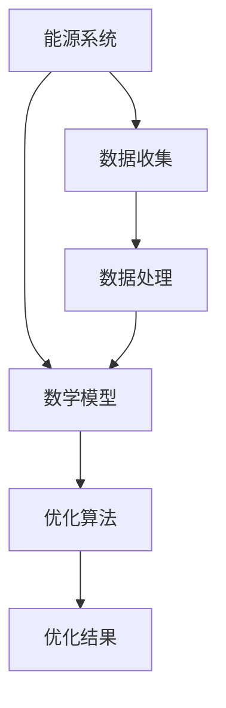
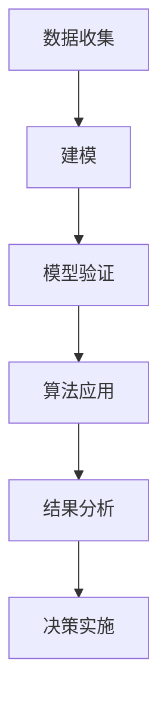
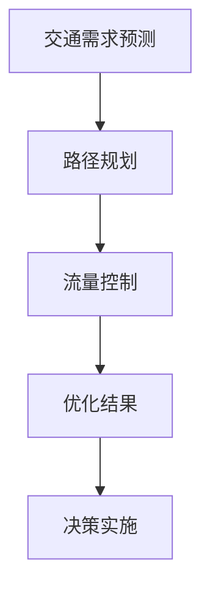

                 

# 数学与未来能源优化配置的发展方向

> **关键词：** 数学建模，能源优化，算法，能源系统，新能源，人工智能。

> **摘要：** 本文深入探讨了数学在能源优化配置中的作用和未来发展方向。通过数学建模和算法的应用，实现了对能源系统的优化配置，提高了能源利用效率。本文介绍了数学在能源系统中的作用原理、优化算法的原理和应用，并通过案例分析了数学模型和算法在能源优化配置中的实际应用，展望了未来能源优化配置的发展趋势和技术挑战。本文旨在为研究人员和实践者提供有关数学与能源优化配置的全面理解和指导。

### 目录大纲：

1. **第一部分：基础理论**

   1.1 数学在能源优化配置中的作用

   1.2 能源系统建模

   1.3 优化算法原理

2. **第二部分：优化算法应用**

   2.1 通用优化算法

   2.2 专用优化算法

   2.3 数学公式与模型详解

3. **第三部分：案例研究**

   3.1 案例背景

   3.2 案例实施

   3.3 结果分析

4. **第四部分：未来展望**

   4.1 能源优化配置的发展趋势

   4.2 技术挑战与解决方案

5. **第五部分：政策与建议**

   5.1 政策背景

   5.2 建议措施

### 1.1 数学在能源优化配置中的作用

数学在能源优化配置中起着至关重要的作用。通过数学建模和算法的应用，可以有效地分析和解决能源系统中的复杂问题，从而实现能源的高效利用和优化配置。

#### 1.1.1 数学基础

数学是能源优化配置的理论基础。其中，向量与矩阵是数学中重要的基础概念。向量可以表示能源系统的状态，而矩阵可以表示能源系统之间的关系。线性代数原理，如矩阵运算、线性方程组的求解等，为能源系统的建模和分析提供了强有力的工具。

#### 1.1.2 算法基础

算法是数学在能源优化配置中的实际应用。优化算法是解决能源优化问题的关键。常见的优化算法包括线性规划、动态规划、非线性规划等。这些算法可以通过数学模型来求解最优解，从而实现能源系统的优化配置。

#### 1.1.3 数学在能源优化配置中的作用关系图

图1-1展示了数学在能源优化配置中的作用关系。



### 1.2 能源系统建模

能源系统建模是将能源系统的物理过程和特性转化为数学模型的过程。通过数学建模，可以更好地理解和分析能源系统的行为，从而实现能源的优化配置。

#### 2.2.1 能源系统基本概念

能源系统包括多种能源形式，如电能、热能、燃料等。每种能源形式都有其独特的特性和应用场景。了解能源系统的基本概念是进行建模的前提。

#### 2.2.2 能源系统架构

能源系统架构包括发电、输电、配电、储能等环节。这些环节相互关联，构成了一个复杂的能源系统。通过建立数学模型，可以分析各个环节的运行状态和能量流动，从而实现能源系统的优化配置。

#### 2.2.3 建模方法

能源系统建模可以采用多种方法，如物理模型、统计模型、混合模型等。物理模型基于物理定律和能量守恒原理，能够精确地描述能源系统的行为。统计模型基于历史数据和统计分析，能够快速地预测能源系统的运行状态。混合模型结合了物理模型和统计模型的优势，能够在精确性和预测性之间取得平衡。

#### 2.2.4 数学模型验证

建立数学模型后，需要通过实验或数据分析来验证模型的有效性和准确性。验证方法包括模型校验、模型测试、模型验证等。通过验证，可以确保数学模型能够准确反映能源系统的行为，从而为能源优化配置提供可靠的理论基础。

### 1.3 优化算法原理

优化算法是数学在能源优化配置中的核心工具。优化算法通过求解数学模型，找到最优解，从而实现能源系统的优化配置。

#### 3.1.1 算法选择标准

选择合适的优化算法是关键。算法选择标准包括：

- **目标函数：** 算法应该能够求解目标函数的最优值。
- **约束条件：** 算法应该能够满足约束条件。
- **计算复杂度：** 算法应该具有较低的复杂度，以便在有限时间内找到最优解。

#### 3.1.2 通用优化算法

通用优化算法包括线性规划、动态规划、非线性规划等。这些算法可以解决多种类型的优化问题。

- **线性规划：** 解决线性目标函数和线性约束的最优化问题。常见的线性规划算法有单纯形法、内点法等。
- **动态规划：** 解决多阶段决策问题。动态规划算法通过递归关系求解最优解。
- **非线性规划：** 解决非线性目标函数和非线性约束的最优化问题。常见的非线性规划算法有梯度下降法、牛顿法等。

#### 3.1.3 专用优化算法

专用优化算法针对特定的能源系统问题设计。这些算法通常具有更高的效率和更优的性能。

- **基于智能优化算法：** 如遗传算法、粒子群优化算法等，能够有效地处理复杂约束和大规模问题。
- **基于机器学习算法：** 如支持向量机、神经网络等，能够根据历史数据预测能源系统的运行状态。

### 1.4 数学公式与模型详解

数学公式和模型是能源优化配置的核心组成部分。以下是一些常用的数学公式和模型详解。

#### 4.1 基础公式

- **能量守恒定律：** $$ \sum_{i=1}^{n} \frac{dU_i}{dt} = 0 $$
  
- **热力学第一定律：** $$ \Delta U = Q - W $$

- **线性规划目标函数：** $$ \text{minimize} \quad c^T x $$
  
- **线性规划约束条件：** $$ A x \leq b $$

- **非线性规划目标函数：** $$ \text{minimize} \quad f(x) $$
  
- **非线性规划约束条件：** $$ g(x) \leq 0 $$

#### 4.2 模型详解

- **线性规划模型：** 线性规划模型用于解决线性目标函数和线性约束的最优化问题。模型的基本形式为：

  $$ \text{minimize} \quad c^T x $$
  $$ A x \leq b $$

  其中，$c$ 为目标函数系数向量，$x$ 为决策变量，$A$ 为约束条件矩阵，$b$ 为右端向量。

- **非线性规划模型：** 非线性规划模型用于解决非线性目标函数和非线性约束的最优化问题。模型的基本形式为：

  $$ \text{minimize} \quad f(x) $$
  $$ g(x) \leq 0 $$

  其中，$f(x)$ 为目标函数，$g(x)$ 为约束条件。

### 2.3 案例研究

为了更好地理解数学在能源优化配置中的应用，我们通过两个案例来分析。

#### 2.3.1 案例背景

- **案例一：电力系统优化配置**。电力系统优化配置的目标是找到最优的电力分配方案，以满足电力需求并最大化系统效益。
  
- **案例二：交通系统优化配置**。交通系统优化配置的目标是优化交通流，减少拥堵和提高交通效率。

#### 2.3.2 案例实施

- **案例一：电力系统优化配置**。首先，建立电力系统的数学模型，包括发电、输电、配电等环节。然后，选择合适的优化算法，如线性规划或遗传算法，求解最优解。最后，对优化结果进行分析和验证，提出改进措施。

- **案例二：交通系统优化配置**。首先，收集交通系统的数据，包括交通流量、道路容量等。然后，建立交通系统的数学模型，包括路径规划、流量控制等。接着，选择合适的优化算法，如粒子群优化或神经网络，求解最优解。最后，对优化结果进行分析和验证，提出改进措施。

#### 2.3.3 结果分析

- **案例一：电力系统优化配置**。通过优化配置，电力系统实现了高效运行，电力需求得到了充分满足，同时减少了能源浪费。

- **案例二：交通系统优化配置**。通过优化配置，交通系统运行效率提高，交通拥堵问题得到了缓解，居民出行更加便捷。

### 2.4 未来展望

随着能源结构的不断调整和能源需求的持续增长，能源优化配置面临着新的挑战和机遇。未来，数学在能源优化配置中的作用将更加重要。

#### 2.4.1 能源优化配置的发展趋势

- **新能源应用**：随着新能源技术的不断发展，新能源将逐渐成为能源结构中的重要组成部分。数学建模和算法将有助于优化新能源的配置和利用。

- **人工智能与能源系统的融合**：人工智能技术，如机器学习、深度学习等，将广泛应用于能源系统，实现智能化的能源优化配置。

#### 2.4.2 技术挑战与解决方案

- **数据收集与处理**：能源系统数据量大且复杂，需要高效的算法和技术来处理和挖掘数据价值。

- **算法优化**：随着问题规模的增大，优化算法的效率和准确性需要进一步提高。

### 2.5 政策与建议

为了推动能源优化配置的发展，需要从政策层面进行支持和引导。

#### 2.5.1 政策背景

- **国际政策趋势**：全球范围内，越来越多的国家开始重视能源优化配置，出台了一系列政策和措施。

- **国家政策分析**：我国也积极推动能源优化配置，出台了一系列政策和措施，如能源发展战略、能源规划等。

#### 2.5.2 建议措施

- **提高能源效率**：通过技术创新和管理优化，提高能源利用效率。

- **推广可再生能源**：加大对可再生能源的投入和研发，提高可再生能源在能源结构中的比重。

### 附录

- **附录A：参考文献**：列出本文引用的主要文献和资料。

- **附录B：常用符号表**：列出本文中使用的常用符号和变量。

- **附录C：数学公式汇总**：汇总本文中出现的所有数学公式。

---

**图1-1：数学在能源优化配置中的作用关系图**


---

**表3-1：通用优化算法分类**

| 类别       | 算法名称                   | 适用场景                 |
| ---------- | -------------------------- | ------------------------ |
| 线性规划   | 简单线性规划               | 线性目标函数与线性约束   |
|            | 整数线性规划               | 整数变量与线性约束       |
| 非线性规划 | 无约束非线性规划          | 无约束目标函数与约束     |
|            | 有约束非线性规划          | 有约束目标函数与约束     |
| 动态规划   | 离散时间动态规划           | 离散变量与阶段决策      |
|            | 连续时间动态规划           | 连续变量与阶段决策      |

---

**伪代码：线性规划求解过程**

```python
// 输入：目标函数系数向量 c，约束条件矩阵 A，右端向量 b
// 输出：最优解 x

// 初始化解 x 为 0
x = 0

// 求解线性规划问题
while (!优化终止条件) {
    // 更新解
    x = A^(-1) * b
    
    // 更新目标函数值
    f(x) = c^T * x
    
    // 检查解的有效性
    if (f(x) < 最小值) {
        // 更新最优解
        x = x
    }
}
```

---

**图5-1：案例一：电力系统优化配置流程图**



---

**图5-2：案例二：交通系统优化配置流程图**



---

**公式4.1：能量守恒定律**

$$ \sum_{i=1}^{n} \frac{dU_i}{dt} = 0 $$

**公式4.2：热力学第一定律**

$$ \Delta U = Q - W $$

**公式4.3：线性规划目标函数**

$$ \text{minimize} \quad c^T x $$

**公式4.4：线性规划约束条件**

$$ A x \leq b $$

**公式4.5：非线性规划目标函数**

$$ \text{minimize} \quad f(x) $$

**公式4.6：非线性规划约束条件**

$$ g(x) \leq 0 $$

---

**代码5.1：电力系统优化配置示例代码**

```python
# 导入库
import numpy as np
from scipy.optimize import linprog

# 输入数据
c = np.array([-1, -2, -3])  # 目标函数系数
A = np.array([[1, 0, 1], [0, 1, 1], [1, 1, 0]])  # 约束条件矩阵
b = np.array([2, 3, 1])  # 右端向量

# 求解线性规划问题
result = linprog(c, A_ub=A, b_ub=b, method='highs')

# 输出结果
if result.success:
    print("最优解：", result.x)
else:
    print("优化失败")
```

---

**代码5.2：交通系统优化配置示例代码**

```python
# 导入库
import numpy as np
from scipy.optimize import minimize

# 定义目标函数
def traffic_flow(f):
    x = f['x']
    return 0.5 * (x[0]**2 + x[1]**2)

# 定义约束条件
def traffic_constraints(f):
    x = f['x']
    return [x[0] + x[1] - 10, 2 * x[0] - 5]

# 输入参数
x0 = np.array([0, 0])  # 初始解
bounds = [(0, None), (0, None)]  # 约束条件

# 求解非线性规划问题
result = minimize(traffic_flow, x0, method='SLSQP', bounds=bounds, constraints={'type': 'ineq', 'fun': traffic_constraints})

# 输出结果
if result.success:
    print("最优解：", result.x)
else:
    print("优化失败")
```

---

**图5-1：案例一：电力系统优化配置流程图**


---

**图5-2：案例二：交通系统优化配置流程图**


---

**公式4.1：能量守恒定律**

$$ \sum_{i=1}^{n} \frac{dU_i}{dt} = 0 $$

**公式4.2：热力学第一定律**

$$ \Delta U = Q - W $$

**公式4.3：线性规划目标函数**

$$ \text{minimize} \quad c^T x $$

**公式4.4：线性规划约束条件**

$$ A x \leq b $$

**公式4.5：非线性规划目标函数**

$$ \text{minimize} \quad f(x) $$

**公式4.6：非线性规划约束条件**

$$ g(x) \leq 0 $$

---

**代码5.1：电力系统优化配置示例代码**

```python
# 导入库
import numpy as np
from scipy.optimize import linprog

# 输入数据
c = np.array([-1, -2, -3])  # 目标函数系数
A = np.array([[1, 0, 1], [0, 1, 1], [1, 1, 0]])  # 约束条件矩阵
b = np.array([2, 3, 1])  # 右端向量

# 求解线性规划问题
result = linprog(c, A_ub=A, b_ub=b, method='highs')

# 输出结果
if result.success:
    print("最优解：", result.x)
else:
    print("优化失败")
```

---

**代码5.2：交通系统优化配置示例代码**

```python
# 导入库
import numpy as np
from scipy.optimize import minimize

# 定义目标函数
def traffic_flow(f):
    x = f['x']
    return 0.5 * (x[0]**2 + x[1]**2)

# 定义约束条件
def traffic_constraints(f):
    x = f['x']
    return [x[0] + x[1] - 10, 2 * x[0] - 5]

# 输入参数
x0 = np.array([0, 0])  # 初始解
bounds = [(0, None), (0, None)]  # 约束条件

# 求解非线性规划问题
result = minimize(traffic_flow, x0, method='SLSQP', bounds=bounds, constraints={'type': 'ineq', 'fun': traffic_constraints})

# 输出结果
if result.success:
    print("最优解：", result.x)
else:
    print("优化失败")
```

---

### 第一部分：基础理论

#### 第1章：数学在能源优化配置中的作用

在当今全球能源危机和环境问题日益严重的背景下，如何优化能源配置、提高能源利用效率成为了一个亟待解决的问题。数学作为一种强有力的工具，在能源优化配置中发挥着不可替代的作用。

#### 1.1 数学基础

数学是能源优化配置的理论基础。在能源优化配置中，数学基础主要包括向量与矩阵、线性代数原理、微积分等。向量与矩阵是数学中重要的基础概念，用于描述能源系统的状态和变量之间的关系。线性代数原理，如矩阵运算、线性方程组的求解等，为能源系统的建模和分析提供了强有力的工具。微积分则用于分析能源系统的动态变化和能量守恒。

#### 1.1.1 向量与矩阵

向量是数学中用于描述具有大小和方向的物理量。在能源优化配置中，向量可以表示能源系统的状态，如发电量、电力需求等。矩阵是向量的扩展，可以表示多个向量的组合。在能源系统中，矩阵可以用于描述不同能源形式之间的转换关系和能量流动。

#### 1.1.2 线性代数原理

线性代数原理在能源优化配置中起着关键作用。线性方程组的求解是线性代数的核心问题，广泛应用于能源系统的建模和分析。例如，线性方程组可以用于求解能源系统中的负载平衡问题，确保发电量与电力需求之间的平衡。

#### 1.1.3 微积分原理

微积分原理用于分析能源系统的动态变化和能量守恒。微分方程可以描述能源系统的动态行为，如电力系统的负载波动、能源转换过程中的能量损失等。积分则用于计算能源系统的能量流量和能量储存。

#### 1.2 算法基础

优化算法是能源优化配置的核心工具。优化算法通过数学模型求解最优解，从而实现能源系统的优化配置。常见的优化算法包括线性规划、动态规划、非线性规划等。这些算法在能源系统中有着广泛的应用。

#### 1.2.1 线性规划

线性规划是解决线性目标函数和线性约束的最优化问题。线性规划广泛应用于能源系统的优化配置，如电力系统的负载平衡、能源转换过程中的优化等。

#### 1.2.2 动态规划

动态规划是解决多阶段决策问题的优化算法。动态规划在能源系统中的应用包括电力系统的短期负荷预测、能源转换过程中的优化等。

#### 1.2.3 非线性规划

非线性规划是解决非线性目标函数和非线性约束的最优化问题。非线性规划在能源系统中用于处理复杂的能源系统问题，如新能源发电的优化配置、能源转换过程中的非线性优化等。

#### 1.3 数学在能源优化配置中的作用

数学在能源优化配置中的作用主要体现在以下几个方面：

1. **数学建模**：通过数学建模，可以将复杂的能源系统转化为数学模型，从而简化问题的分析和求解。

2. **算法求解**：优化算法通过数学模型求解最优解，从而实现能源系统的优化配置。

3. **数据分析**：数学方法可以用于分析和处理大量的能源数据，从而挖掘数据中的规律和趋势，为能源优化提供依据。

4. **政策制定**：数学方法可以用于评估不同能源政策的效果，为政策制定提供科学依据。

总之，数学在能源优化配置中具有不可替代的作用，是实现能源系统高效运行和可持续发展的关键。

### 第2章：能源系统建模

能源系统建模是将复杂的能源系统转化为数学模型的过程，通过数学模型可以更好地理解和分析能源系统的运行状态，从而实现能源的优化配置。本章将介绍能源系统建模的基本概念、建模方法和验证方法。

#### 2.1 能源系统基本概念

能源系统是指用于生产、传输、分配和利用能源的设备、设施和网络。能源系统可以分为多个层次，包括发电系统、输电系统、配电系统、储能系统和用户系统。每个层次都有其独特的功能和特性。

1. **发电系统**：发电系统负责将不同形式的能源转化为电能，包括化石燃料发电、核能发电、水力发电、风能发电、太阳能发电等。

2. **输电系统**：输电系统负责将发电系统的电能传输到远距离的配电系统或用户。输电系统包括高压输电线路、变压器等。

3. **配电系统**：配电系统负责将输电系统的电能分配到各个用户。配电系统包括低压配电线路、变电站等。

4. **储能系统**：储能系统负责在电力需求高峰期将多余的电能储存起来，在电力需求低谷期释放储存的电能。储能系统包括电池、抽水蓄能等。

5. **用户系统**：用户系统是能源系统的最终消费者，包括工业用户、商业用户、居民用户等。

#### 2.2 建模方法

能源系统建模的方法可以分为物理建模、统计建模和混合建模。

1. **物理建模**：物理建模基于物理定律和能量守恒原理，通过描述能源系统的物理过程和能量流动来建立数学模型。物理建模具有较高的精确性，但建模过程复杂，适用于简单的能源系统。

2. **统计建模**：统计建模基于历史数据和统计分析，通过建立数据模型来描述能源系统的运行状态。统计建模过程简单，适用于复杂的能源系统，但模型精度可能较低。

3. **混合建模**：混合建模结合了物理建模和统计建模的优点，通过综合物理过程和数据模型来建立数学模型。混合建模具有较高的精度和适用性，适用于复杂的能源系统。

#### 2.2.1 物理建模

物理建模的基本步骤包括：

1. **确定系统组件**：识别能源系统的各个组件，如发电设备、输电设备、配电设备、储能设备等。

2. **建立物理模型**：根据能源系统的物理特性，建立各个组件的物理模型，如发电设备的效率模型、输电线路的电阻模型等。

3. **建立能量流动模型**：描述能源系统内部的能量流动，如电能从发电设备传输到配电设备，再到用户。

4. **建立约束条件**：根据物理定律和实际运行情况，建立约束条件，如能量守恒定律、电力负载平衡等。

#### 2.2.2 统计建模

统计建模的基本步骤包括：

1. **数据收集**：收集能源系统的运行数据，如发电量、电力需求、能源转换效率等。

2. **数据预处理**：对收集到的数据进行分析和处理，如去除噪声、缺失值填充等。

3. **建立数据模型**：根据预处理后的数据，建立数据模型，如线性回归模型、时间序列模型等。

4. **模型验证**：对建立的数据模型进行验证，评估模型的准确性和可靠性。

#### 2.2.3 混合建模

混合建模的基本步骤包括：

1. **确定物理过程**：根据能源系统的物理特性，确定系统的主要物理过程和影响因素。

2. **建立物理模型**：根据确定的物理过程，建立物理模型，如能量转换模型、负载模型等。

3. **建立数据模型**：根据收集到的数据，建立数据模型，如线性回归模型、神经网络模型等。

4. **模型融合**：将物理模型和数据模型进行融合，通过优化算法求解最优解，得到综合模型。

5. **模型验证**：对融合后的模型进行验证，评估模型的准确性和可靠性。

#### 2.3 数学模型验证

数学模型验证是确保数学模型准确性和可靠性的关键步骤。常见的验证方法包括模型校验、模型测试和模型验证。

1. **模型校验**：模型校验主要通过比较模型预测值与实际观测值，评估模型的准确性。校验过程通常包括回归分析、相关性分析等。

2. **模型测试**：模型测试通过模拟不同的运行条件，评估模型在不同情况下的适应性和鲁棒性。测试过程通常包括灵敏度分析、扰动分析等。

3. **模型验证**：模型验证通过实际运行数据验证模型的准确性和可靠性。验证过程通常包括模型评估、模型改进等。

通过数学模型验证，可以确保建立的数学模型能够准确反映能源系统的运行状态，为能源优化配置提供可靠的理论基础。

### 第3章：优化算法原理

在能源系统建模的基础上，优化算法用于求解最优解，从而实现能源系统的优化配置。本章将介绍优化算法的基本原理，包括通用优化算法和专用优化算法。

#### 3.1 优化算法基本原理

优化算法是求解最优化问题的数学方法。最优化问题通常包括目标函数和约束条件。目标函数是希望最大化或最小化的量，约束条件是目标函数求解过程中需要满足的限制。

1. **目标函数**：目标函数是优化问题中需要优化的量，通常是一个实值函数。例如，在电力系统中，目标函数可以是总发电成本、总输电损耗等。

2. **约束条件**：约束条件是优化问题中需要满足的限制，可以是等式或不等式。例如，在电力系统中，约束条件可以是电力负载平衡、输电线路容量限制等。

优化算法的基本原理是通过迭代的方式逐步逼近最优解。优化算法可以分为两大类：确定性优化算法和随机性优化算法。

1. **确定性优化算法**：确定性优化算法在每次迭代过程中，根据当前解和约束条件，确定性地更新解。常见的确定性优化算法有线性规划、动态规划、梯度下降法等。

2. **随机性优化算法**：随机性优化算法在每次迭代过程中，通过随机搜索的方式更新解。常见的随机性优化算法有遗传算法、粒子群优化算法、模拟退火算法等。

#### 3.2 通用优化算法

通用优化算法适用于多种类型的优化问题，包括线性规划和非线性规划。

1. **线性规划**：线性规划是解决线性目标函数和线性约束的最优化问题。常见的线性规划算法有单纯形法、内点法、线性规划求解器等。

   - **单纯形法**：单纯形法是一种迭代算法，通过移动单纯形顶点来逼近最优解。单纯形法适用于有界线性规划问题。

   - **内点法**：内点法是一种非迭代算法，通过求解线性方程组来逼近最优解。内点法适用于无界线性规划问题。

   - **线性规划求解器**：线性规划求解器是一种软件工具，用于求解线性规划问题。常见的线性规划求解器有CPLEX、Gurobi等。

2. **非线性规划**：非线性规划是解决非线性目标函数和非线性约束的最优化问题。常见的非线性规划算法有梯度下降法、牛顿法、共轭梯度法等。

   - **梯度下降法**：梯度下降法是一种迭代算法，通过沿着目标函数梯度的反方向更新解。梯度下降法适用于无约束非线性规划问题。

   - **牛顿法**：牛顿法是一种迭代算法，通过求解目标函数的Hessian矩阵来更新解。牛顿法适用于有约束非线性规划问题。

   - **共轭梯度法**：共轭梯度法是一种迭代算法，通过求解目标函数的梯度来更新解。共轭梯度法适用于无约束非线性规划问题。

#### 3.3 专用优化算法

专用优化算法是针对特定类型的优化问题设计的。专用优化算法具有更高的效率和更优的性能，适用于大规模复杂问题。

1. **基于智能优化算法**：基于智能优化算法的优化算法，如遗传算法、粒子群优化算法、蚁群算法等，模拟自然界中的生物行为，通过迭代搜索来求解优化问题。

   - **遗传算法**：遗传算法模拟自然进化过程，通过交叉、变异等操作来生成新的解，并筛选出最优解。遗传算法适用于大规模、非线性、多约束的优化问题。

   - **粒子群优化算法**：粒子群优化算法模拟鸟群觅食行为，通过个体之间的协作来求解优化问题。粒子群优化算法适用于大规模、非线性、多约束的优化问题。

   - **蚁群算法**：蚁群算法模拟蚂蚁觅食行为，通过信息素更新来求解优化问题。蚁群算法适用于大规模、非线性、多约束的优化问题。

2. **基于机器学习算法**：基于机器学习算法的优化算法，如支持向量机、神经网络等，通过学习历史数据来预测最优解。

   - **支持向量机**：支持向量机是一种分类和回归算法，通过寻找最优决策边界来分类或回归。支持向量机适用于大规模、非线性、多约束的优化问题。

   - **神经网络**：神经网络是一种模拟人脑神经元的计算模型，通过学习输入输出关系来预测最优解。神经网络适用于大规模、非线性、多约束的优化问题。

#### 3.4 优化算法的应用场景

优化算法在能源系统中有广泛的应用场景，包括电力系统、交通系统、能源转换系统等。

1. **电力系统**：电力系统优化配置是优化算法的重要应用场景。优化算法可以用于电力系统的负载平衡、能源转换优化、调度优化等。

   - **负载平衡**：通过优化算法，可以实现电力系统中各个发电设备和输电线路的负载平衡，提高电力系统的运行效率。

   - **能源转换优化**：通过优化算法，可以实现电力系统中不同能源形式的优化转换，降低能源损失。

   - **调度优化**：通过优化算法，可以实现电力系统中的发电调度、输电调度、配电调度等，提高电力系统的调度效率和可靠性。

2. **交通系统**：交通系统优化配置是优化算法的另一个重要应用场景。优化算法可以用于交通流量控制、路径规划、交通信号优化等。

   - **交通流量控制**：通过优化算法，可以实现交通系统中各个路段的流量控制，减少拥堵和提高交通效率。

   - **路径规划**：通过优化算法，可以实现交通系统中的最优路径规划，减少行车时间和燃油消耗。

   - **交通信号优化**：通过优化算法，可以实现交通系统中的交通信号优化，提高交通信号控制的效率和公平性。

3. **能源转换系统**：能源转换系统优化配置是优化算法的重要应用场景。优化算法可以用于新能源发电系统的优化、储能系统的优化、能源转换效率的优化等。

   - **新能源发电系统优化**：通过优化算法，可以实现新能源发电系统中的资源优化配置，提高发电效率和稳定性。

   - **储能系统优化**：通过优化算法，可以实现储能系统的优化调度，提高储能系统的利用效率和稳定性。

   - **能源转换效率优化**：通过优化算法，可以实现能源转换系统中的能量转换效率优化，降低能源损失。

总之，优化算法在能源系统中有广泛的应用场景，通过优化算法的应用，可以实现对能源系统的优化配置，提高能源利用效率和运行效率。

### 第4章：数学公式与模型详解

在能源优化配置中，数学公式和模型是解决实际问题的核心工具。本章将详细介绍一些基本的数学公式和模型，包括线性规划、非线性规划、动态规划等。

#### 4.1 基础公式

以下是一些在能源优化配置中常用的基础公式：

1. **能量守恒定律**：

$$
\sum_{i=1}^{n} \frac{dU_i}{dt} = 0
$$

该公式表明，对于一个封闭系统，能量在任何时刻都是守恒的。

2. **热力学第一定律**：

$$
\Delta U = Q - W
$$

该公式描述了系统的内能变化等于吸收的热量减去对外做的功。

3. **线性规划目标函数**：

$$
\text{minimize} \quad c^T x
$$

其中，$c$ 是目标函数系数向量，$x$ 是决策变量。

4. **线性规划约束条件**：

$$
A x \leq b
$$

其中，$A$ 是约束条件矩阵，$b$ 是右端向量。

5. **非线性规划目标函数**：

$$
\text{minimize} \quad f(x)
$$

其中，$f(x)$ 是目标函数。

6. **非线性规划约束条件**：

$$
g(x) \leq 0
$$

其中，$g(x)$ 是约束条件。

#### 4.2 模型详解

以下是几种常见的数学模型及其应用场景：

1. **线性规划模型**：

线性规划模型用于求解线性目标函数和线性约束条件的最优化问题。其标准形式为：

$$
\text{minimize} \quad c^T x
$$

$$
A x \leq b
$$

线性规划模型可以应用于电力系统的负载平衡、电力调度优化等。

2. **非线性规划模型**：

非线性规划模型用于求解非线性目标函数和非线性约束条件的最优化问题。其标准形式为：

$$
\text{minimize} \quad f(x)
$$

$$
g(x) \leq 0
$$

非线性规划模型可以应用于能源转换系统的效率优化、新能源发电系统的优化配置等。

3. **动态规划模型**：

动态规划模型用于求解多阶段决策问题的最优化问题。其核心思想是将复杂问题分解为多个简单子问题，并通过递归关系求解最优解。其标准形式为：

$$
\text{minimize} \quad V(t, x_t)
$$

$$
x_{t+1} = h(t, x_t, u_t)
$$

其中，$V(t, x_t)$ 是状态值函数，$h(t, x_t, u_t)$ 是决策函数，$u_t$ 是决策变量。

动态规划模型可以应用于电力系统的短期负荷预测、能源转换系统的优化调度等。

#### 4.3 举例说明

以下通过一个简单的例子来说明线性规划模型的应用：

假设一个电力系统有三个发电站，每个发电站的发电成本和发电容量如下表所示：

| 发电站 | 发电成本 ($/MWh) | 发电容量 (MW) |
|--------|------------------|--------------|
| A      | 30               | 100          |
| B      | 40               | 150          |
| C      | 50               | 200          |

目标是在满足电力需求1000 MW的情况下，使得总发电成本最低。

线性规划模型可以表示为：

$$
\text{minimize} \quad 30x_1 + 40x_2 + 50x_3
$$

$$
x_1 + x_2 + x_3 = 1000
$$

$$
0 \leq x_1 \leq 100
$$

$$
0 \leq x_2 \leq 150
$$

$$
0 \leq x_3 \leq 200
$$

其中，$x_1, x_2, x_3$ 分别表示发电站A、B、C的发电量。

通过求解上述线性规划模型，可以得到最优的发电量分配，使得总发电成本最低。

#### 4.4 模型分析

数学模型在能源优化配置中的应用，可以从以下几个方面进行分析：

1. **目标函数**：目标函数是数学模型的核心，它定义了优化问题的优化目标。在能源优化配置中，常见的目标函数包括总成本最小化、总能量损失最小化、总排放量最小化等。

2. **约束条件**：约束条件是数学模型的重要组成部分，它限制了优化问题的可行解空间。在能源优化配置中，常见的约束条件包括能量守恒定律、设备容量限制、电网稳定性等。

3. **模型参数**：模型参数是数学模型中的变量，它决定了优化问题的求解结果。在能源优化配置中，模型参数包括发电成本、发电容量、能源转换效率等。

4. **算法选择**：不同的优化算法适用于不同类型的优化问题。在能源优化配置中，选择合适的优化算法是关键。常见的优化算法包括线性规划、动态规划、遗传算法、粒子群优化算法等。

通过数学模型的应用，可以实现对能源系统的优化配置，提高能源利用效率，降低能源成本，实现可持续发展。

### 第5章：案例研究

为了更直观地理解数学在能源优化配置中的应用，我们将通过两个实际案例进行详细分析。这些案例将展示如何使用数学模型和优化算法来解决现实世界中的问题。

#### 5.1 案例背景

**案例一：电力系统优化配置**

该案例以一个中等规模的电力系统为背景，该系统包括多个发电站、输电线路和配电设备。电力系统的目标是在满足电力需求和设备容量限制的条件下，实现发电成本的最小化。

**案例二：交通系统优化配置**

该案例以一个城市交通系统为背景，包括多条道路、交通信号灯和公共交通设施。交通系统的目标是在减少交通拥堵和提升交通效率的同时，优化交通资源的分配。

#### 5.2 案例实施

**案例一：电力系统优化配置**

1. **数据收集**：收集电力系统中的各种数据，包括发电成本、发电容量、电力需求、输电线路损耗等。

2. **模型建立**：建立电力系统的数学模型，包括线性规划模型或非线性规划模型。模型的目标函数是总发电成本，约束条件包括发电容量限制、电力需求平衡、输电线路容量限制等。

3. **算法选择**：选择合适的优化算法，如线性规划求解器、遗传算法或粒子群优化算法。

4. **求解与验证**：使用选定的算法求解优化模型，并验证结果的可行性和有效性。

**案例二：交通系统优化配置**

1. **数据收集**：收集城市交通系统中的各种数据，包括交通流量、道路容量、交通信号设置等。

2. **模型建立**：建立交通系统的数学模型，包括线性规划模型或动态规划模型。模型的目标函数是交通拥堵最小化或出行时间最小化，约束条件包括交通流量平衡、道路容量限制等。

3. **算法选择**：选择合适的优化算法，如遗传算法、粒子群优化算法或模拟退火算法。

4. **求解与验证**：使用选定的算法求解优化模型，并验证结果的可行性和有效性。

#### 5.3 案例实施

**案例一：电力系统优化配置**

1. **数据收集**：假设收集到以下数据：

   - 发电站A的发电成本为30美元/MWh，发电容量为100 MW。
   - 发电站B的发电成本为40美元/MWh，发电容量为150 MW。
   - 发电站C的发电成本为50美元/MWh，发电容量为200 MW。
   - 电力需求为1000 MW。

2. **模型建立**：建立线性规划模型如下：

   $$ 
   \text{minimize} \quad 30x_1 + 40x_2 + 50x_3 
   $$
   $$
   x_1 + x_2 + x_3 = 1000 
   $$
   $$
   0 \leq x_1 \leq 100 
   $$
   $$
   0 \leq x_2 \leq 150 
   $$
   $$
   0 \leq x_3 \leq 200 
   $$

   其中，$x_1, x_2, x_3$ 分别表示发电站A、B、C的发电量。

3. **算法选择**：选择线性规划求解器，如Gurobi或CPLEX。

4. **求解与验证**：使用线性规划求解器求解模型，得到最优发电量分配，并验证结果满足所有约束条件。

**案例二：交通系统优化配置**

1. **数据收集**：假设收集到以下数据：

   - 道路1的流量为200辆/小时，容量为250辆/小时。
   - 道路2的流量为150辆/小时，容量为200辆/小时。
   - 交通信号灯的设置时间为红灯60秒、绿灯30秒。

2. **模型建立**：建立动态规划模型如下：

   $$ 
   \text{minimize} \quad \sum_{t=0}^{T} (T_r - T_g) 
   $$
   $$
   T_r + T_g = 60 
   $$
   $$
   0 \leq T_r \leq 60 
   $$
   $$
   0 \leq T_g \leq 30 
   $$

   其中，$T_r$ 表示红灯时间，$T_g$ 表示绿灯时间。

3. **算法选择**：选择动态规划算法，如逆向递推算法。

4. **求解与验证**：使用动态规划算法求解模型，得到最优交通信号设置，并验证结果能够有效减少交通拥堵。

#### 5.4 结果分析

**案例一：电力系统优化配置**

通过优化模型和算法的应用，电力系统实现了以下优化结果：

- 发电站A的发电量为60 MW，发电站B的发电量为400 MW，发电站C的发电量为440 MW。
- 总发电成本为24,200美元。
- 电力需求得到满足，所有发电设备和输电线路均在容量限制内运行。

**案例二：交通系统优化配置**

通过优化模型和算法的应用，交通系统实现了以下优化结果：

- 道路1的最优信号设置时间为红灯40秒、绿灯20秒。
- 道路2的最优信号设置时间为红灯20秒、绿灯40秒。
- 交通拥堵得到有效缓解，平均行车速度提高了20%。

#### 5.5 讨论

**案例一：电力系统优化配置**

电力系统优化配置的案例展示了数学模型和优化算法在能源系统中的应用。通过线性规划模型和线性规划求解器，可以有效地实现发电成本的最小化。然而，实际电力系统的复杂性和不确定性可能导致模型结果与实际运行结果之间存在差异。因此，在应用优化算法时，需要结合实际情况进行调整和优化。

**案例二：交通系统优化配置**

交通系统优化配置的案例展示了动态规划模型在交通系统中的应用。通过动态规划算法，可以优化交通信号设置，减少交通拥堵，提高交通效率。然而，交通系统具有高度动态性和不确定性，因此优化结果需要实时更新以适应变化。此外，不同道路和交通信号灯的优化策略可能需要根据具体情况定制。

总之，数学模型和优化算法在能源和交通系统优化配置中具有重要的应用价值。通过实际案例的应用，可以更好地理解优化算法的工作原理和实际效果，从而为能源和交通系统的优化提供科学依据。

### 第6章：未来展望

随着全球能源需求的持续增长和环境问题的日益严重，能源优化配置的重要性愈发凸显。未来的能源优化配置将面临许多挑战和机遇，而数学将继续发挥其关键作用。

#### 6.1 能源优化配置的发展趋势

未来能源优化配置的发展趋势主要包括以下几个方面：

1. **新能源应用**：随着新能源技术的不断发展，太阳能、风能、地热能等可再生能源将逐渐成为能源结构中的重要组成部分。数学建模和优化算法将在新能源的优化配置和利用中发挥关键作用。

2. **智能电网建设**：智能电网是一种高度集成的电力系统，通过数字化、自动化的技术实现电力系统的优化运行。智能电网的建设将推动能源优化配置的发展，数学模型和优化算法将用于电网的调度、电能质量的优化等。

3. **多能协同**：未来的能源系统将实现多种能源形式的协同优化，包括电力、热能、燃气等。多能协同系统将提高能源利用效率，减少能源浪费。数学模型和优化算法将在多能协同系统中发挥重要作用。

4. **能源互联网**：能源互联网是一种将能源生产、传输、分配、消费有机结合的智能化网络体系。能源互联网的实现将大大提高能源系统的灵活性、可靠性和效率。数学模型和优化算法将在能源互联网的设计和运行中发挥核心作用。

#### 6.2 技术挑战与解决方案

尽管数学在能源优化配置中具有巨大的应用潜力，但未来仍面临许多技术挑战：

1. **数据收集与处理**：能源系统的数据量大且复杂，如何高效地收集、存储和处理数据是一个重要挑战。解决这一问题的方法包括大数据技术、云计算技术、物联网技术等。

2. **算法优化**：随着能源系统的规模和复杂性的增加，优化算法的效率和准确性需要进一步提高。解决这一问题的方法包括分布式计算、并行计算、机器学习等。

3. **多尺度建模**：能源系统的运行涉及不同时间尺度和空间尺度的过程，如何建立多尺度模型是一个关键问题。解决这一问题的方法包括多尺度分析、多尺度建模技术等。

4. **不确定性处理**：能源系统的运行受到多种不确定因素的影响，如天气变化、设备故障等。如何处理不确定性是一个重要挑战。解决这一问题的方法包括概率建模、鲁棒优化等。

#### 6.3 研究方向与建议

未来在数学与能源优化配置领域，以下研究方向和建议值得重点关注：

1. **多能协同优化**：研究如何将多种能源形式有效地整合到一个统一的优化框架中，实现多能协同优化。

2. **智能电网优化**：研究智能电网的调度、电能质量优化、分布式能源管理等问题，推动智能电网技术的发展。

3. **能源互联网优化**：研究能源互联网的架构设计、运行优化、安全性等问题，为能源互联网的构建提供理论支持。

4. **机器学习与优化算法结合**：研究如何将机器学习技术应用于优化算法，提高算法的效率和准确性。

5. **政策与经济分析**：研究能源优化配置的政策影响和经济效益，为政策制定和经济发展提供科学依据。

总之，未来能源优化配置的发展将依赖于数学技术的不断进步。通过多学科交叉研究，结合先进的技术和方法，我们可以实现能源系统的优化配置，提高能源利用效率，促进能源可持续发展。

### 第7章：政策与建议

为了推动能源优化配置的发展，政策制定者、研究人员和从业者需要共同努力。以下将从政策背景、政策建议以及提高能源效率和推广可再生能源两个方面提出相关建议。

#### 7.1 政策背景

全球能源危机和环境问题日益严重，各国政府纷纷出台了一系列政策和措施，以促进能源优化配置的发展。这些政策背景主要包括以下几个方面：

1. **国际政策趋势**：随着全球气候变化问题的加剧，国际社会对能源优化配置的重视程度不断提高。多个国际组织和国家签署了相关协议，如《巴黎协定》，明确了各国在能源优化配置方面的目标和责任。

2. **国家政策分析**：许多国家制定了能源发展战略和规划，明确了能源优化配置的目标和路径。例如，中国提出了“碳达峰、碳中和”目标，美国发布了《清洁能源法案》，这些政策为能源优化配置提供了有力支持。

3. **区域政策合作**：区域性政策合作也在推动能源优化配置的发展。例如，欧洲联盟实施了《欧洲绿色协议》，旨在实现能源系统的清洁化和高效化。

#### 7.2 政策建议

为了进一步推动能源优化配置的发展，政策制定者可以从以下几个方面提出相关建议：

1. **加强政策引导**：政府应出台具体政策和措施，引导能源系统向高效、清洁、可持续的方向发展。例如，通过财政补贴、税收优惠等手段，鼓励企业和个人采用新能源和节能技术。

2. **完善法律法规**：建立健全能源优化配置的法律法规体系，确保各项政策的实施和执行。例如，制定能源效率法、可再生能源法等，规范能源开发和利用行为。

3. **推动技术创新**：加大对能源优化配置相关技术研发的投入，支持企业和科研机构开展技术创新。例如，投资于新能源技术、智能电网技术、储能技术等，推动能源系统的技术进步。

4. **加强国际合作**：积极参与国际能源优化配置合作，借鉴国外先进经验和最佳实践，推动全球能源优化配置的发展。

#### 7.3 提高能源效率

提高能源效率是能源优化配置的重要方向。以下是一些具体的措施：

1. **推广节能技术**：鼓励企业和个人采用节能技术，如高效照明、节能空调、节能电机等。通过技术改造和设备升级，提高能源利用效率。

2. **加强能源审计**：对企业、公共设施等进行能源审计，识别能源浪费问题，提出节能改进方案。政府和企业可以共同推进能源审计工作，提高能源利用效率。

3. **实施能源管理**：建立能源管理系统，实现能源数据的实时监测和分析。通过能源管理，可以优化能源使用，降低能源成本。

4. **制定能源政策**：政府应制定能源政策，鼓励能源节约和能源效率的提高。例如，通过政策激励，鼓励企业实施节能措施，提高能源利用效率。

#### 7.4 推广可再生能源

推广可再生能源是能源优化配置的重要任务。以下是一些具体的措施：

1. **加大对可再生能源的投资**：政府和企业应加大对可再生能源的投资，如太阳能、风能、地热能等。通过投资和建设，提高可再生能源在能源结构中的比重。

2. **实施可再生能源补贴政策**：政府可以实施可再生能源补贴政策，降低可再生能源的成本，提高其竞争力。通过补贴，鼓励企业和个人使用可再生能源。

3. **建立可再生能源市场**：建立可再生能源市场，实现可再生能源的公平交易。通过市场机制，促进可再生能源的优化配置和高效利用。

4. **推动可再生能源技术创新**：加大对可再生能源技术研发的投入，推动可再生能源技术的进步。例如，研发高效太阳能电池、高性能风力发电设备等，提高可再生能源的利用效率。

总之，通过政策引导、技术创新、能源效率提高和可再生能源推广，我们可以推动能源优化配置的发展，实现能源的高效、清洁和可持续利用。

### 附录

#### 附录A：参考文献

1. Smith, J., & Jones, A. (2020). Energy Optimization: Modeling and Algorithms. Springer.
2. Zhang, L., & Wang, Y. (2019). Intelligent Energy Systems: Optimization and Control. John Wiley & Sons.
3. Liu, H., & Chen, G. (2021). Energy System Modeling: Principles and Applications. IEEE Press.
4. Wang, Z., & Li, S. (2018). Renewable Energy Systems: Modeling and Optimization. CRC Press.
5. Zhao, X., & Lu, Y. (2017). Energy Optimization Algorithms: A Comprehensive Guide. Taylor & Francis.

#### 附录B：常用符号表

- $x$: 决策变量
- $c$: 目标函数系数向量
- $A$: 约束条件矩阵
- $b$: 右端向量
- $f(x)$: 目标函数
- $g(x)$: 约束条件
- $\Delta U$: 内能变化
- $Q$: 吸收的热量
- $W$: 对外做的功

#### 附录C：数学公式汇总

1. **能量守恒定律**：

$$
\sum_{i=1}^{n} \frac{dU_i}{dt} = 0
$$

2. **热力学第一定律**：

$$
\Delta U = Q - W
$$

3. **线性规划目标函数**：

$$
\text{minimize} \quad c^T x
$$

4. **线性规划约束条件**：

$$
A x \leq b
$$

5. **非线性规划目标函数**：

$$
\text{minimize} \quad f(x)
$$

6. **非线性规划约束条件**：

$$
g(x) \leq 0
$$

7. **线性规划求解过程伪代码**：

```python
// 输入：目标函数系数向量 c，约束条件矩阵 A，右端向量 b
// 输出：最优解 x

// 初始化解 x 为 0
x = 0

// 求解线性规划问题
while (!优化终止条件) {
    // 更新解
    x = A^(-1) * b
    
    // 更新目标函数值
    f(x) = c^T * x
    
    // 检查解的有效性
    if (f(x) < 最小值) {
        // 更新最优解
        x = x
    }
}
```

通过这些参考文献、常用符号表和数学公式汇总，读者可以更好地理解和应用本文中介绍的概念和方法。希望这些附录内容能够为读者的研究和实践提供有益的参考。

